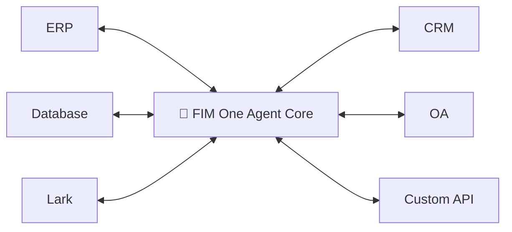
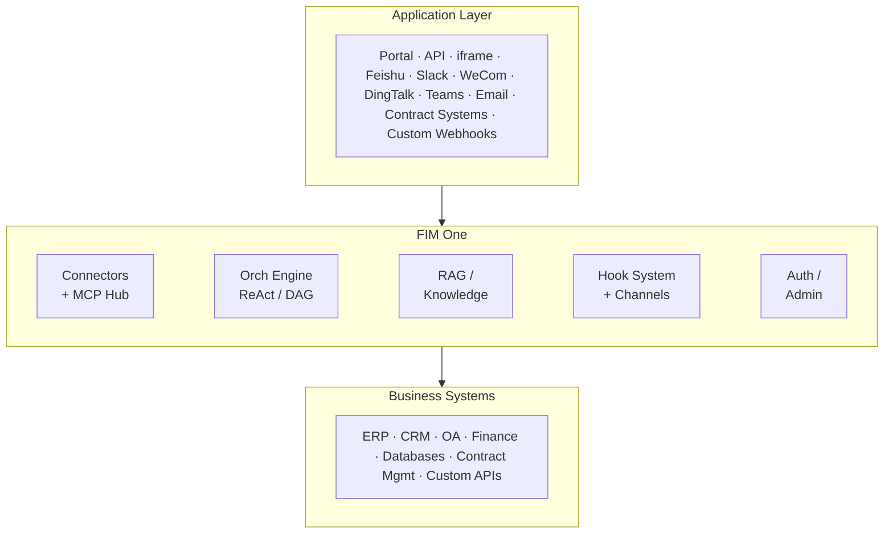

<div align="center">


[](https://github.com/fim-ai/fim-one/actions/workflows/test.yml)

[](https://discord.gg/z64czxdC7z)
[](https://x.com/FIM_One)

[🌐 English](README.md) | [🇨🇳 中文](README.zh.md) | [🇯🇵 日本語](README.ja.md) | [🇰🇷 한국어](README.ko.md) | [🇩🇪 Deutsch](README.de.md) | [🇫🇷 Français](README.fr.md)

**All-in-One Agent Platform für globale × China-Unternehmen.**
*Verbinden Sie jedes System, das Sie bereits nutzen — globale SaaS bis zum China-Stack — durch einen Agent-Kern.*

🌐 [Website](https://one.fim.ai/) · 📖 [Docs](https://docs.fim.ai) · 📋 [Changelog](https://docs.fim.ai/changelog) · 🐛 [Report Bug](https://github.com/fim-ai/fim-one/issues) · 💬 [Discord](https://discord.gg/z64czxdC7z) · 🐦 [Twitter](https://x.com/FIM_One) · 🏆 [Product Hunt](https://www.producthunt.com/products/fim-one)

</div>

> [!TIP]
> **☁️ Setup überspringen — FIM One in der Cloud ausprobieren.**
> Eine verwaltete Version ist live unter [cloud.fim.ai](https://cloud.fim.ai/) — kein Docker, keine API-Schlüssel, keine Konfiguration. Melden Sie sich an und beginnen Sie in Sekunden, Ihre Systeme zu verbinden. _Early Access, Feedback willkommen._

---

## Übersicht

Große Unternehmen betreiben eine Vielzahl von Systemen, die nicht miteinander kommunizieren — ERP, CRM, OA, HR, Finanzen, Datenbanken, IM-Plattformen in verschiedenen Regionen. FIM One ist die **All-in-One-Agent-Plattform**, die jedes System, das Sie bereits betreiben, mit einem Agent-Kern verbindet — globale SaaS auf der einen Seite, der vollständige China-Stack (Feishu, WeCom, DingTalk, DM, Kingbase usw.) auf der anderen. Ein Gehirn. Jedes System. Global SaaS × China Stack.

| Modus           | Was es ist                                              | Zugriff                  |
| -------------- | ------------------------------------------------------- | ----------------------- |
| **Standalone** | Universeller KI-Assistent — Suche, Code, KB         | Portal                  |
| **Copilot**    | KI eingebettet in die Benutzeroberfläche eines Host-Systems                       | iframe / widget / embed |
| **Hub**        | Zentrale KI-Orchestrierung über alle verbundenen Systeme   | Portal / API            |



### Screenshots

**Dashboard** — Statistiken, Aktivitätstrends, Token-Nutzung und schneller Zugriff auf Agenten und Gespräche.


**Agent Chat** — ReAct-Reasoning mit mehrstufigen Tool-Aufrufen gegen eine verbundene Datenbank.


**DAG Planner** — LLM-generierter Ausführungsplan mit parallelen Schritten und Live-Statusverfolgung.


### Demo

**Agenten verwenden**


**Planer-Modus verwenden**


## Schnelleinstieg

### Docker (empfohlen)

```bash
git clone https://github.com/fim-ai/fim-one.git
cd fim-one

cp example.env .env
# Edit .env: set LLM_API_KEY (and optionally LLM_BASE_URL, LLM_MODEL)

docker compose up --build -d
```

Öffnen Sie http://localhost:3000 — beim ersten Start erstellen Sie ein Admin-Konto. Das war's.

```bash
docker compose up -d          # start
docker compose down           # stop
docker compose logs -f        # view logs
```

### Lokale Entwicklung

Voraussetzungen: Python 3.11+, [uv](https://docs.astral.sh/uv/), Node.js 18+, pnpm.

```bash
git clone https://github.com/fim-ai/fim-one.git && cd fim-one

cp example.env .env           # Edit: set LLM_API_KEY

uv sync --all-extras
cd frontend && pnpm install && cd ..

./start.sh dev                # hot reload: Python --reload + Next.js HMR
```

| Befehl          | Was wird gestartet                       | URL                            |
| ---------------- | --------------------------------- | ------------------------------ |
| `./start.sh`         | Next.js + FastAPI                 | localhost:3000 (UI) + :8000    |
| `./start.sh dev`     | Dasselbe, mit Hot Reload             | Dasselbe                           |
| `./start.sh dev:api` | Nur API, Entwicklungsmodus (Hot Reload)   | localhost:8000                 |
| `./start.sh dev:ui`  | Nur Frontend, Entwicklungsmodus (HMR)    | localhost:3000                 |
| `./start.sh api`     | FastAPI nur (headless)           | localhost:8000/api             |

> Für die Produktionsbereitstellung (Docker, Reverse Proxy, unterbrechungsfreie Updates) siehe das [Deployment-Handbuch](https://docs.fim.ai/quickstart#production-deployment).

## Hauptfunktionen

#### Grenzüberschreitende Konnektivität
- **Drei Bereitstellungsmodi** — Eigenständiger Assistent, eingebetteter Copilot oder zentraler Hub; gleicher Agent-Kern.
- **Jedes System, ein Muster** — Verbinden Sie APIs, Datenbanken und MCP-Server. Aktionen registrieren sich automatisch als Agent-Tools mit Authentifizierungsinjektion. Progressive Disclosure Meta-Tools reduzieren die Token-Nutzung um 80%+ über alle Tool-Typen hinweg.
- **Datenbank-Konnektoren** — PostgreSQL, MySQL, Oracle, SQL Server und in China verbreitete Enterprise-Datenbanken (DM, KingbaseES, GBase, Highgo), die die meisten globalen Plattformen nicht erreichen können. Schema-Introspektion und KI-gestützte Annotation.
- **Drei Möglichkeiten zum Erstellen** — OpenAPI-Spezifikation importieren, KI-Chat-Builder verwenden oder MCP-Server direkt verbinden.

#### Planung & Ausführung
- **Dynamische DAG-Planung** — LLM zerlegt Ziele zur Laufzeit in Abhängigkeitsgraphen. Keine hartcodierten Workflows.
- **Parallele Ausführung** — Unabhängige Schritte laufen parallel via asyncio; automatische Neuplanung bis zu 3 Runden.
- **ReAct-Agent** — Strukturierte Reasoning-and-Acting-Schleife mit automatischer Fehlerwiederherstellung.
- **Agent-Harness** — Produktionsreife Ausführungsumgebung: ContextGuard für 5-schichtige Token-Budget-Verwaltung, Progressive-Disclosure-Meta-Tools zur Kontrolle der Tool-Oberfläche und Self-Reflection-Schleifen zur Bekämpfung von Zieldrift.
- **Hook-System** — Deterministische Durchsetzung außerhalb der LLM-Schleife. Erste Implementierung: `FeishuGateHook` sperrt sensible Tool-Aufrufe hinter einer manuellen Genehmigungskarte, die in eine Feishu-Gruppe gepostet wird. Erweiterbar auf Audit-Logging, Read-Only-Mode-Guards und Rate Limits (v0.9).
- **Content-Guardrails** — Dreischichtige Sicherheit: Tool-Permission-Hooks (Aktionen), Credential-/SSRF-/MCP-Auth-Checks (Protokolle) und Content-Guardrails (Ein-/Ausgabetext). Standard-Jailbreak-Phrase-Detektor bricht die Runde ab, bevor der LLM aufgerufen wird, spart Token und zeigt eine klare Blockierungsmitteilung im Chat. Output-Guardrails optional via `FIM_GUARDRAILS_OUTPUT`.
- **Auto-Routing** — Klassifiziert Anfragen und leitet zum optimalen Modus weiter (ReAct oder DAG). Konfigurierbar via `AUTO_ROUTING`.
- **Extended Thinking** — Chain-of-Thought für OpenAI o-Serie, Gemini 2.5+, Claude.
- **Prompt-Cache-Observability** — Anthropic Prompt-Cache `read/create` Token-Zählungen pro Runde erfasst, in der Chat-`done`-Payload angezeigt und protokolliert, damit Operatoren Cache-Hits verifizieren und Relaystationen erkennen können, die den Rabatt nicht berücksichtigen.

#### Workflow & Tools
- **Visual workflow editor** — 12 node types, drag-and-drop canvas (React Flow v12), import/export as JSON.
- **Smart file handling** — Hochgeladene Dateien werden automatisch in den Kontext eingebunden (klein) oder können bei Bedarf über das Tool `read_uploaded_file` gelesen werden. Intelligente Dokumentverarbeitung: PDF-, DOCX- und PPTX-Dateien erhalten Vision-fähige Verarbeitung mit Extraktion eingebetteter Bilder, wenn das Modell Vision unterstützt. Der intelligente PDF-Modus extrahiert Text aus textreichen Seiten und rendert gescannte Seiten als Bilder.
- **Universal document conversion** — Das integrierte Tool `convert_to_markdown` konvertiert PDF / Word / Excel / PowerPoint / HTML / Bilder / Audio / Outlook `.msg` / EPUB / YouTube-Transkripte in sauberes Markdown über Microsoft MarkItDown. Vision-fähige LLMs führen OCR auf eingebetteten Bildern und gescannten Seiten durch — funktioniert mit Claude, Gemini, Bedrock und jedem von LiteLLM unterstützten Provider, ohne Provider-spezifischen Adapter-Code.
- **Pluggable tools** — Python, Node.js, Shell-Ausführung mit optionalem Docker-Sandbox (`CODE_EXEC_BACKEND=docker`).
- **V4A patch editing** — Über `find_replace` hinaus können Agenten Zeilen-Hunk-Patches mit unscharfer Whitespace-Anpassung über `file_ops.apply_patch` anwenden — robust für mehrzeilige Änderungen, wo exakte Substring-Übereinstimmung fehleranfällig wäre.
- **Full RAG pipeline** — Jina embedding + LanceDB + hybrid retrieval + reranker + inline `[N]` citations. Vision-fähige Ingestion leitet gescannte PDFs und in Office eingebettete Bilder durch das Standard-Vision-LLM des Arbeitsbereichs zur OCR.
- **Tool artifacts** — Rich outputs (HTML previews, files) rendered in-chat.

#### Messaging Channels (v0.8)
- **Org-scoped IM bridge** — `BaseChannel` Abstraktion für ausgehende Nachrichten über Slack, Microsoft Teams, Discord, Feishu (Lark), WeCom und DingTalk. Erste Implementierung wird mit Feishu ausgeliefert; Slack / Teams / WeCom / Email stehen auf der v0.9 Roadmap.
- **Fernet-verschlüsselte Anmeldedaten** — App-Secrets und Verschlüsselungsschlüssel sind im Ruhezustand verschlüsselt; jeder eingehende Callback ist signaturverifiziert.
- **Interaktive Genehmigungskarten** — Channel-native `GateHook` (heute Feishu, nächstes Slack/Teams) postet eine Approve / Reject Karte in Ihre Gruppe, wenn ein sensitiver Tool-Aufruf ausgelöst wird; das Tool blockiert, bis ein Gruppenmitglied ein Urteil bestätigt. Human-in-the-Loop-Genehmigung ohne Custom-Workflow-Engine.
- **Konfigurierbare Genehmigungsweiterleitung pro Agent** — Drei Modi (Auto / Inline only / Channel only) mit Approver-Scope-Selector (initiator / agent owner / any org member). Ein Audit-Pfad speichert `approver_user_id` und `decided_at`, unabhängig davon, ob das Urteil aus dem Chat oder aus dem Channel kam. Der Auto-Modus fällt auf Inline zurück, wenn kein Channel verknüpft ist, sodass Agents immer eine echte Genehmigungserfahrung erhalten.
- **Task-Completion-Benachrichtigungen** — Langfristig laufende ReAct- oder DAG-Agents können eine Zusammenfassungskarte an den Channel der Organisation pushen, wenn die Arbeit abgeschlossen ist. Konfigurierbar pro Agent in Settings → Agent → Notifications.
- **Browse-and-Pick UI** — Keine rohen Channel-IDs aus der Vendor-Konsole kopieren; das Portal ruft die API der IM-Plattform auf und zeigt einen Gruppenpicker.

#### Plattform
- **Multi-Mandant** — JWT-Authentifizierung, Organisationsisolation, Admin-Panel mit Nutzungsanalytics und Connector-Metriken. Multi-Worker-Unterstützung via `WORKERS=N` mit Redis-Interrupt-Broker für Worker-übergreifendes Relay.
- **Marketplace** — Intelligente Systeme, Connectors, Knowledge Bases, Skills und Workflows veröffentlichen und abonnieren.
- **Globale Skills (SOPs)** — Wiederverwendbare Betriebsverfahren, die für jeden Benutzer geladen werden; progressiver Modus reduziert Tokens um ~80%.
- **Stripe-Abrechnung & Pro-Benutzer-Kontingente** — Optionales Pro-Plan-Upgrade via Stripe Checkout + Customer Portal. Kontingent-Kette (Pro-Benutzer-Überschreibung → Plan-Tier → Systemstandard) mit `0` für unbegrenzt. Admin-Feature-Flag steuert die gesamte Pipeline; private Bereitstellungen ohne Stripe bleiben sauber.
- **Evaluation Center** — Test-Dataset-Verwaltung, parallele Eval-Läufe mit LLM-bewerteten Urteilen, Pro-Fall-Viewer für Bestanden/Nicht bestanden/Latenz/Token-Ergebnisse mit Auto-Polling.
- **Gesprächswiederherstellung** — Synthetische `tool_result`-Zeilen bleiben nach unterbrochenen Turns erhalten; Clients verbinden sich automatisch wieder mit unterbrochenen SSE-Streams via `/chat/resume` mit exponentiellem Backoff und einem „Verbindung wird wiederhergestellt…"-Indikator.
- **6 Sprachen** — EN, ZH, JA, KO, DE, FR. Übersetzungen sind [vollständig automatisiert](https://docs.fim.ai/quickstart#internationalization) — ein einziges Glossar steuert jeden LLM-Übersetzungsaufruf (JSON, MDX, README), Pre-Commit-Hook lehnt manuelle Änderungen an generierten Locale-Dateien ab.
- **Assistent für die erste Einrichtung**, dunkles/helles Design, Befehlspalette, Streaming SSE, DAG-Visualisierung.

> Tiefere Einblicke: [Architektur](https://docs.fim.ai/architecture/system-overview) · [Hook-System](https://docs.fim.ai/architecture/hook-system) · [Channels](https://docs.fim.ai/configuration/channels/overview) · [Ausführungsmodi](https://docs.fim.ai/concepts/execution-modes) · [Warum FIM One](https://docs.fim.ai/why) · [Wettbewerbslandschaft](https://docs.fim.ai/strategy/competitive-landscape)

## Architektur



Jeder Connector und jeder Channel ist eine standardisierte Brücke — der Agent weiß nicht und kümmert sich nicht darum, ob er mit SAP, einem benutzerdefinierten Vertragssystem oder einer Feishu-Gruppe spricht. Das Hook-System führt Plattformcode außerhalb der LLM-Schleife für Genehmigungen, Audits und Rate Limits aus; Channels übermitteln ausgehende Benachrichtigungen und Genehmigungskarten an externe IM-Plattformen. Weitere Informationen finden Sie unter [Connector-Architektur](https://docs.fim.ai/architecture/connector-architecture), [Hook-System](https://docs.fim.ai/architecture/hook-system) und [Channels](https://docs.fim.ai/configuration/channels/overview).

## Konfiguration

FIM One funktioniert mit **jedem OpenAI-kompatiblen Anbieter**:

| Anbieter           | `LLM_API_KEY` | `LLM_BASE_URL`                 | `LLM_MODEL`         |
| ------------------ | ------------- | ------------------------------ | -------------------- |
| **OpenAI**         | `sk-...`      | *(Standard)*                   | `gpt-4o`             |
| **DeepSeek**       | `sk-...`      | `https://api.deepseek.com/v1`  | `deepseek-chat`      |
| **Anthropic**      | `sk-ant-...`  | `https://api.anthropic.com/v1` | `claude-sonnet-4-6`  |
| **Ollama** (lokal) | `ollama`      | `http://localhost:11434/v1`    | `qwen2.5:14b`        |

Minimale `.env`:

```bash
LLM_API_KEY=sk-your-key
# LLM_BASE_URL=https://api.openai.com/v1   # default
# LLM_MODEL=gpt-4o                         # default
JINA_API_KEY=jina_...                       # unlocks web tools + RAG
```

> Vollständige Referenz: [Umgebungsvariablen](https://docs.fim.ai/configuration/environment-variables)

## Tech Stack

| Layer       | Technology                                                          |
| ----------- | ------------------------------------------------------------------- |
| Backend     | Python 3.11+, FastAPI, SQLAlchemy, Alembic, asyncio                 |
| Frontend    | Next.js 14, React 18, Tailwind CSS, shadcn/ui, React Flow v12      |
| AI / RAG    | OpenAI-kompatible LLMs, Jina AI (embed + search), LanceDB          |
| Database    | SQLite (dev) / PostgreSQL (prod)                                    |
| Messaging   | `BaseChannel` Abstraktion (Slack, Teams, Discord, Feishu/Lark, WeCom, DingTalk), Fernet-verschlüsselte Anmeldedaten, HMAC-Signaturverifizierung |
| Infra       | Docker, uv, pnpm, SSE Streaming                                    |

## Entwicklung

```bash
uv sync --all-extras          # install dependencies
pytest                         # run tests
pytest --cov=fim_one           # with coverage
ruff check src/ tests/         # lint
mypy src/                      # type check
bash scripts/setup-hooks.sh    # install git hooks (enables auto i18n)
```

## Roadmap

Siehe die vollständige [Roadmap](https://docs.fim.ai/roadmap) für Versionshistorie und geplante Funktionen.

## Häufig gestellte Fragen

Häufig gestellte Fragen zu Bereitstellung, LLM-Anbietern, Systemanforderungen und mehr – siehe [Häufig gestellte Fragen](https://docs.fim.ai/faq).

## Beitragen

Wir freuen uns über Beiträge aller Art — Code, Dokumentation, Übersetzungen, Fehlerberichte und Ideen.

> **Pioneer Program**: Die ersten 100 Mitwirkenden, deren PR zusammengeführt wird, werden als **Gründungsbeiträger** mit permanenten Credits, einem Badge und prioritärer Issue-Unterstützung anerkannt. [Mehr erfahren &rarr;](CONTRIBUTING.md#-pioneer-program)

**Schnelllinks:**

- [**Beitragsleitfaden**](CONTRIBUTING.md) — Setup, Konventionen, PR-Prozess
- [**Entwicklungskonventionen**](https://docs.fim.ai/contributing) — Typsicherheit, Tests und Code-Qualitätsstandards
- [**Good First Issues**](https://github.com/fim-ai/fim-one/labels/good%20first%20issue) — kuratiert für Anfänger
- [**Offene Issues**](https://github.com/fim-ai/fim-one/issues) — Fehler & Feature-Anfragen

**Sicherheit:** Um eine Sicherheitslücke zu melden, öffnen Sie bitte ein [GitHub Issue](https://github.com/fim-ai/fim-one/issues) mit dem Tag `[SECURITY]`. Für vertrauliche Meldungen kontaktieren Sie uns über Discord DM.

## Star-Verlauf

<a href="https://www.star-history.com/?type=date&repos=fim-ai%2Ffim-one">
  <picture>
    <source media="(prefers-color-scheme: dark)" srcset="https://api.star-history.com/chart?repos=fim-ai/fim-one&type=date&theme=dark&legend=top-left&sealed_token=0xSammARGkNEvau7uPZBM7DEDgspJO2VOEpHsZMOETJe7s69_iMihDP9QYw4MTv7D_FUpUqnpgTxw5RrOhCrK6s63y8zedJP7XAKQp33RXozObKbXB4R7QgTVY6R_cHNFHaMQlAzMDKK3w4aK7k" />
    <source media="(prefers-color-scheme: light)" srcset="https://api.star-history.com/chart?repos=fim-ai/fim-one&type=date&legend=top-left&sealed_token=0xSammARGkNEvau7uPZBM7DEDgspJO2VOEpHsZMOETJe7s69_iMihDP9QYw4MTv7D_FUpUqnpgTxw5RrOhCrK6s63y8zedJP7XAKQp33RXozObKbXB4R7QgTVY6R_cHNFHaMQlAzMDKK3w4aK7k" />
    
  </picture>
</a>

## Aktivität


## Mitwirkende

Danke an diese wunderbaren Menschen ([Emoji-Schlüssel](https://allcontributors.org/docs/en/emoji-key)):

<!-- ALL-CONTRIBUTORS-LIST:START - Do not remove or modify this section -->
<!-- prettier-ignore-start -->
<!-- markdownlint-disable -->
<table>
  <tbody>
    <tr>
      <td align="center" valign="top" width="14.28%"><a href="https://github.com/tao-hpu"><br /><sub><b>Tao An</b></sub></a><br /><a href="https://github.com/fim-ai/fim-one/commits?author=tao-hpu" title="Code">💻</a> <a href="#maintenance-tao-hpu" title="Maintenance">🚧</a> <a href="#design-tao-hpu" title="Design">🎨</a> <a href="https://github.com/fim-ai/fim-one/commits?author=tao-hpu" title="Documentation">📖</a> <a href="#projectManagement-tao-hpu" title="Project Management">📆</a> <a href="#ideas-tao-hpu" title="Ideas, Planning, & Feedback">🤔</a> <a href="#infra-tao-hpu" title="Infrastructure">🚇</a></td>
      <td align="center" valign="top" width="14.28%"><a href="https://github.com/tgonzalezc5"><br /><sub><b>Teo Gonzalez Collazo</b></sub></a><br /><a href="https://github.com/fim-ai/fim-one/commits?author=tgonzalezc5" title="Code">💻</a> <a href="https://github.com/fim-ai/fim-one/commits?author=tgonzalezc5" title="Tests">⚠️</a></td>
      <td align="center" valign="top" width="14.28%"><a href="https://github.com/Houjiawei330"><br /><sub><b>Houx.</b></sub></a><br /><a href="https://github.com/fim-ai/fim-one/commits?author=Houjiawei330" title="Code">💻</a> <a href="https://github.com/fim-ai/fim-one/issues?q=author%3AHoujiawei330" title="Bug reports">🐛</a></td>
      <td align="center" valign="top" width="14.28%"><a href="https://github.com/wcboy"><br /><sub><b>Chenying Wang</b></sub></a><br /><a href="https://github.com/fim-ai/fim-one/commits?author=wcboy" title="Code">💻</a></td>
      <td align="center" valign="top" width="14.28%"><a href="https://github.com/Joshua-Medvinsky"><br /><sub><b>Joshua Medvinsky</b></sub></a><br /><a href="#security-Joshua-Medvinsky" title="Security">🛡️</a></td>
    </tr>
  </tbody>
</table>

<!-- markdownlint-restore -->
<!-- prettier-ignore-end -->
<!-- ALL-CONTRIBUTORS-LIST:END -->

Dieses Projekt folgt der [all-contributors](https://allcontributors.org/)-Spezifikation. Beiträge jeglicher Art sind willkommen!

## Lizenz

FIM One Source Available License. Dies ist **keine** von der OSI genehmigte Open-Source-Lizenz.

**Erlaubt**: interne Nutzung, Änderung, Verteilung mit intakter Lizenz, Einbettung in nicht konkurrierende Anwendungen.

**Eingeschränkt**: Multi-Tenant-SaaS, konkurrierende Agent-Plattformen, White-Labeling, Entfernung von Branding.

Für Anfragen zur kommerziellen Lizenzierung öffnen Sie bitte ein Issue auf [GitHub](https://github.com/fim-ai/fim-one).

Siehe [LICENSE](LICENSE) für vollständige Bedingungen.

---

<div align="center">

🌐 [Website](https://one.fim.ai/) · 📖 [Docs](https://docs.fim.ai) · 📋 [Changelog](https://docs.fim.ai/changelog) · 🐛 [Bug melden](https://github.com/fim-ai/fim-one/issues) · 💬 [Discord](https://discord.gg/z64czxdC7z) · 🐦 [Twitter](https://x.com/FIM_One) · 🏆 [Product Hunt](https://www.producthunt.com/products/fim-one)

</div>
