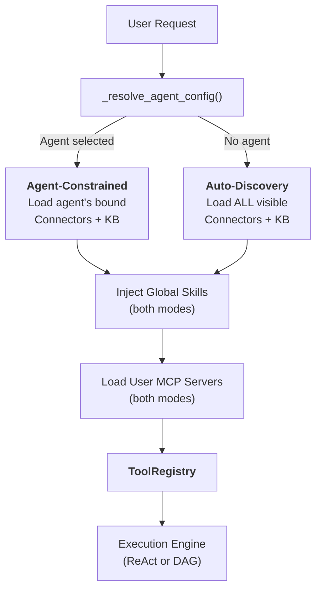
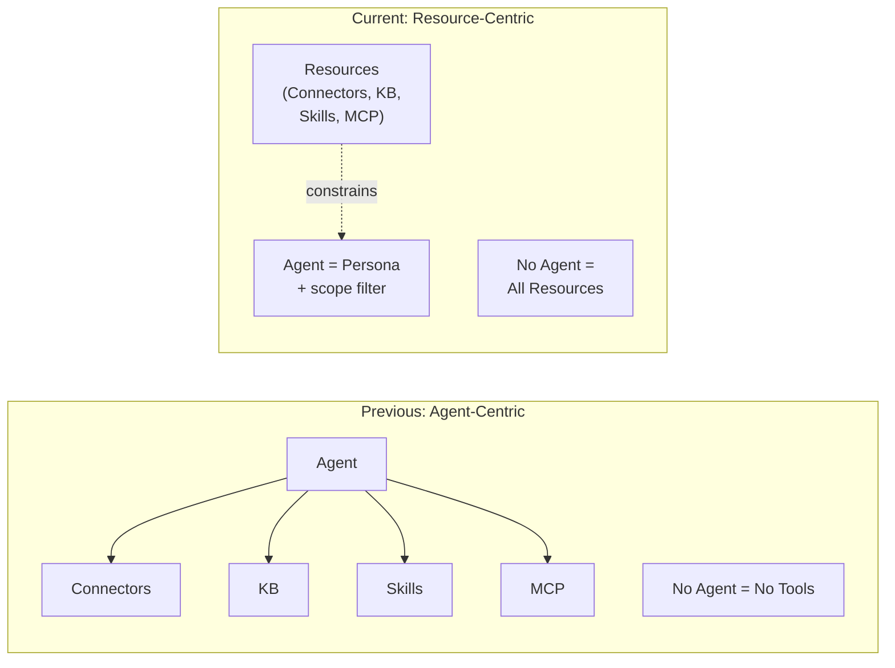
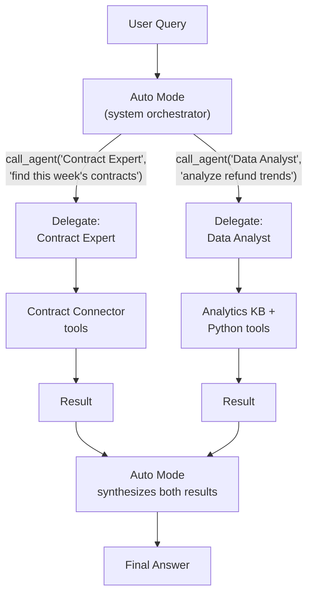
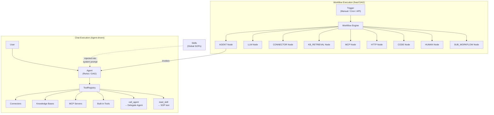

## The two modes

Every chat request in FIM One starts with a question: **is an Agent selected?** The answer determines how resources — Connectors, Knowledge Bases, Skills, and MCP servers — are discovered and assembled into the tool set the LLM can use.

**Agent-Constrained Mode** activates when the user picks a specific Agent. The system loads only the resources that Agent has been explicitly configured with:

- **Connectors**: only the Agent's bound `connector_ids` are loaded as tools.
- **Knowledge Bases**: only the Agent's bound `kb_ids` are injected as retrieval tools.
- **Skills**: globally available — all active Skills visible to the user are injected, because Skills are organizational SOPs, not Agent-specific knowledge. (See [Skills as Global SOPs](#skills-as-global-sops) below.)
- **MCP Servers**: always user-scoped — all active MCP servers visible to the user are loaded in both modes.
- **Instructions**: the Agent's `instructions` field defines the persona and behavioral guidelines injected into the system prompt.

**Global Auto-Discovery Mode** activates when no Agent is selected (e.g., a new chat). The system auto-discovers everything accessible to the user:

- **Connectors**: all Connectors visible to the user (own + org-shared + Market-subscribed) are loaded.
- **Knowledge Bases**: all accessible KBs are available for retrieval via `kb_retrieve`.
- **Skills**: all active Skills visible to the user are injected as SOP stubs.
- **MCP Servers**: same as agent-constrained — all active servers visible to the user.
- **Instructions**: a generic assistant persona is used.

The branching happens inside `_resolve_tools()`, which is called on every chat request:



The practical effect: users can start chatting immediately without configuring an Agent. The system discovers available resources and exposes them as tools. Selecting an Agent narrows the scope — it does not unlock new capabilities, it focuses existing ones.

### What each mode discovers

The two modes differ in **scope**, not in kind. Both produce a `ToolRegistry` — they just fill it differently.

**Auto-Discovery Mode (no Agent selected):**

| Resource | Discovery | Tool Form |
|---|---|---|
| Connectors (API) | `resolve_visibility()` — all visible to user | `ConnectorMetaTool` (progressive) |
| Connectors (DB) | `resolve_visibility()` — all visible to user | `DatabaseMetaTool` (progressive) |
| Knowledge Bases | All accessible KBs | `kb_retrieve` |
| Skills | `resolve_visibility()` — all active | `read_skill` (progressive stubs) |
| MCP Servers | `resolve_visibility()` — all user-visible | `MCPServerMetaTool` (progressive) |
| Agents | `resolve_visibility()` — all active, non-builder | `call_agent` (delegation catalog) |
| Built-in Tools | `discover_builtin_tools()` — full set | No category filter applied |

**Agent-Constrained Mode (Agent selected):**

| Resource | Discovery | Tool Form |
|---|---|---|
| Connectors | Only `agent.connector_ids` | `ConnectorMetaTool` or legacy per-action |
| Knowledge Bases | Only `agent.kb_ids` | `GroundedRetrieveTool` / `KBRetrieveTool` |
| Skills | Global — **not constrained by Agent** | `read_skill` |
| MCP Servers | User-scoped — **not constrained by Agent** | `MCPServerMetaTool` (progressive) |
| Agent Delegation | Not available — agents are specialized | _(disabled)_ |
| Built-in Tools | `agent.tool_categories` filter | Subset by category |

The key asymmetry: Connectors and Knowledge Bases are scoped by the Agent, but Skills and MCP Servers remain global in both modes. `CallAgentTool` (agent delegation) is only available in Auto-Discovery mode — it is **not** registered when a specific Agent is selected. This is a security measure: a marketplace agent could otherwise use `call_agent` to invoke other agents and access their private prompts. Skills are organizational rules (everyone follows the same SOPs), while Connectors and KBs are capability bindings (different agents connect to different systems).

## Everything is a tool

At the LLM level, all resource types converge into a flat list of callable tools. The LLM has no structural awareness of whether it is calling a Connector, an MCP server, or a Knowledge Base. It sees a `ToolRegistry` — a set of functions with names, descriptions, and parameter schemas.

| Resource Type | Becomes at LLM Level | Tool Name Pattern |
|---|---|---|
| Connector (progressive) | Single meta-tool | `connector` |
| Connector (legacy) | N tools per action | `{connector}__{action}` |
| Database Connector (progressive) | Single meta-tool | `database` |
| Database Connector (legacy) | 3 tools per database | `{db}__list_tables`, `{db}__describe_table`, `{db}__query` |
| MCP Server (progressive) | Single meta-tool | `mcp` |
| MCP Server (legacy) | N tools per server | `{server}__{tool}` |
| Knowledge Base | Retrieval tool | `kb_retrieve` or `grounded_retrieve` |
| Skill (progressive) | Read tool + system prompt stubs | `read_skill` |
| Skill (inline) | System prompt text only | _(no tool)_ |
| Agent itself | Not visible as a tool | _(instructions + tool assembly)_ |

The key insight: **an Agent is not a tool — it is the entity that uses tools.** The Agent contributes its instructions to the system prompt and determines which tools are available. But from the LLM's perspective, there is no "agent" concept — only a system prompt and a set of callable functions.

This uniformity is what makes the system extensible. Adding a new resource type means implementing the `Tool` protocol (`name`, `description`, `parameters_schema`, `run()`). The execution engines, context management, and LLM interaction layer remain unchanged.

## Skills as global SOPs

Skills occupy a layer above Agents. They are organizational policies and procedures that every Agent must follow, regardless of which Agent is selected.

### Why Skills are not bound to Agents

A Skill like "Customer Complaint Handling SOP" applies to every agent that interacts with customers. Binding Skills to Agents creates a bidirectional ownership problem: if a Skill orchestrates Agents, and Agents own Skills, who controls whom?

Skills are global by design — they are company rules, not agent-specific knowledge. The `_resolve_tools()` function loads all active Skills visible to the user regardless of Agent selection, using the same `resolve_visibility()` filter used for other resources.

### Two injection modes

Skills support two injection modes -- **progressive** (default) and **inline** -- controlled by `SKILL_TOOL_MODE` or the Agent's `model_config_json.skill_tool_mode`. In progressive mode, only compact stubs appear in the system prompt; the LLM calls `read_skill(name)` on demand to load the full content. This is part of FIM One's broader [Progressive Disclosure](/architecture/progressive-disclosure) architecture that minimizes context consumption across all resource types.

## Agent as persona, not container

FIM One's architecture reflects a deliberate shift from an Agent-centric model to a Resource-centric model.

**Previous model:** the Agent was a container that gated access to all resources. No Agent selected meant no Connectors, no Skills, no specialized KB. The Agent was the mandatory entry point for any capability.

**Current model:** the Agent is a persona — a set of instructions and behavioral guidelines — combined with an optional resource constraint. Resources exist independently of Agents. Selecting an Agent narrows the scope; not selecting one opens it fully.



This means:

- **Users can start chatting immediately** without configuring an Agent.
- **The system auto-discovers available resources** and exposes them as tools.
- **Agents become lightweight personas** that can be created quickly — just write instructions and optionally bind specific Connectors and KBs.
- **Resource management is decoupled** from Agent management. Publishing a Connector to an organization makes it available everywhere — in auto-discovery mode, in Agent binding dropdowns, and in agent delegation resolution.

## Agent Delegation

FIM One supports delegating tasks to specialist agents via `CallAgentTool` — but only in **Auto mode** (no agent selected). When a user selects a specific Agent, delegation is disabled and the Agent focuses exclusively on its own tools.

### Two modes: Auto vs Agent-selected

| Aspect | Auto Mode (no agent selected) | Agent-Selected Mode |
|---|---|---|
| `call_agent` | Enabled — delegates to any visible agent | **Disabled** — not registered |
| Tool scope | All visible Connectors, KB, Skills, MCP | Only the Agent's bound resources + global Skills/MCP |
| Orchestration | System LLM dynamically picks the best agent per iteration | Agent uses its own tools directly |
| Use case | General queries, cross-domain tasks | Focused specialist tasks |

**Why delegation is disabled in Agent-selected mode:** Security. A marketplace agent could use `call_agent` to invoke other agents and read their private system prompts. By restricting delegation to Auto mode — where the system LLM (not any individual agent's prompt) controls the flow — private agent prompts are never exposed to untrusted agent configurations.

### Auto mode as the orchestration layer

Auto mode is a first-class concept in the UI. The agent selector shows "Auto" as the default option. When Auto is active, the system LLM acts as an orchestrator: it sees the full catalog of visible agents and can delegate tasks to the best-fit specialist on each iteration. This replaces the need for a dedicated "parent agent" — the system itself is the orchestrator.

### Agent catalog

At runtime, all active, non-builder Agents visible to the user are assembled into a catalog. Each Agent's name and description are listed in the `call_agent` tool's parameter schema, allowing the LLM to choose the right specialist semantically — no hardcoded routing.

### Full tool inheritance

When a delegated agent is invoked via `call_agent(agent_id, task)`, it receives a complete `ToolRegistry` built from its own configuration — including its bound Connectors, KB, and built-in tools. Delegated agents are full execution units, not text-only advisors.

### One-level delegation

To prevent infinite recursion, delegated agents do not receive the `call_agent` tool. Delegation is always one level deep: Auto mode calls a specialist, the specialist executes and returns a result. The system synthesizes results from multiple delegated agents.

### Parallel execution

In native function-calling mode, the LLM can invoke multiple `call_agent` calls in a single turn. These execute concurrently via `asyncio.gather`, enabling patterns like "search three sources simultaneously."



## Visibility model

All resource discovery — in both modes — is governed by a unified visibility model with three tiers:

| Tier | Description | Example |
|---|---|---|
| **Own** | Created by the user. Always visible. | A Connector you built for your team's API |
| **Organization-shared** | Resources with `visibility: "org"` from the user's organization(s). Visible to all approved org members. | A company-wide ERP Connector published by IT |
| **Market-subscribed** | Resources installed from the FIM One Market. Visible to the subscriber. | A community-built Slack Connector you installed |

The `resolve_visibility()` function in `web/visibility.py` builds a SQL filter that includes all three tiers in a single query:

```python
conditions = [
    model.user_id == user_id,                    # own resources
    and_(model.visibility == "org",              # org-shared
         model.org_id.in_(user_org_ids),
         or_(model.publish_status == None,
             model.publish_status == "approved")),
    model.id.in_(subscribed_ids),                # Market-subscribed
]
```

This same filter is used everywhere:

- Auto-discovering Connectors in no-agent mode
- Building the Agent catalog for `CallAgentTool`
- Loading visible Skills for system prompt injection
- MCP server resolution
- Agent configuration lookup (ensuring a user can only select Agents visible to them)

The uniformity means that **publishing a Connector to an organization automatically makes it available** in auto-discovery mode, in Agent binding dropdowns, and in agent delegation resolution — no special wiring required. The visibility model is the single source of truth for "what can this user access."

## Relationship map

FIM One has two parallel execution paradigms — **Chat (Agent-driven)** and **Workflow (DAG-driven)** — that share the same underlying resources but orchestrate them differently.



Key takeaways from the diagram:

- **Agent and Workflow are parallel paradigms.** Both can use Connectors, Knowledge Bases, and MCP Servers — but through different mechanisms. Agents use them as tools in a `ToolRegistry`; Workflows use them as typed DAG nodes.
- **Workflow can orchestrate Agents** via the `AGENT` node — a Workflow step can invoke a full Agent with its own ReAct/DAG loop. The reverse is not true: Agents cannot directly invoke Workflows (only indirectly via API/webhook triggers).
- **Skills are injected into Agents only.** Skills are system prompt text — they guide Agent behavior. Workflows don't consume Skills because Workflow nodes execute deterministic logic, not LLM-guided reasoning.
- **Shared resources, different access patterns.** A Connector can be called by an Agent (via `ConnectorToolAdapter`), by a Workflow (via `CONNECTOR` node), or by both in the same business process — e.g., a Workflow triggers an Agent that queries the same Connector the Workflow also uses in a later step.

## Workflow Engine — the other execution paradigm

While this document focuses on Agent-driven chat execution, FIM One includes a full **Workflow Engine** — a visual DAG editor with 26 node types for fixed-process automation.

| Aspect | Agent (Chat) | Workflow |
|---|---|---|
| Orchestration | LLM decides next step dynamically | Fixed DAG defined at design time |
| Best for | Exploratory tasks, conversations, flexible reasoning | Approval chains, scheduled ETL, multi-step automations |
| Can call | Connectors, KB, MCP, Built-in Tools, Delegated Agents, Skills | Agents, Connectors, KB, MCP, LLM, HTTP, Code, Human approval, Sub-Workflows |
| Trigger | User message in chat | Manual, cron schedule, or API/webhook |
| Nesting | One-level delegation (Auto mode → delegated Agent) | Arbitrary DAG depth via SUB_WORKFLOW nodes |

The two paradigms are complementary. Use Agents when the task is open-ended ("analyze this quarter's sales data and recommend actions"). Use Workflows when the process is known ("every Monday, pull new invoices from ERP, run compliance checks, and route exceptions to a human reviewer"). A Workflow can invoke an Agent for any step that needs flexible reasoning within an otherwise fixed pipeline.

For details on Agent execution modes and Workflow node types, see [Execution Modes](/concepts/execution-modes).
