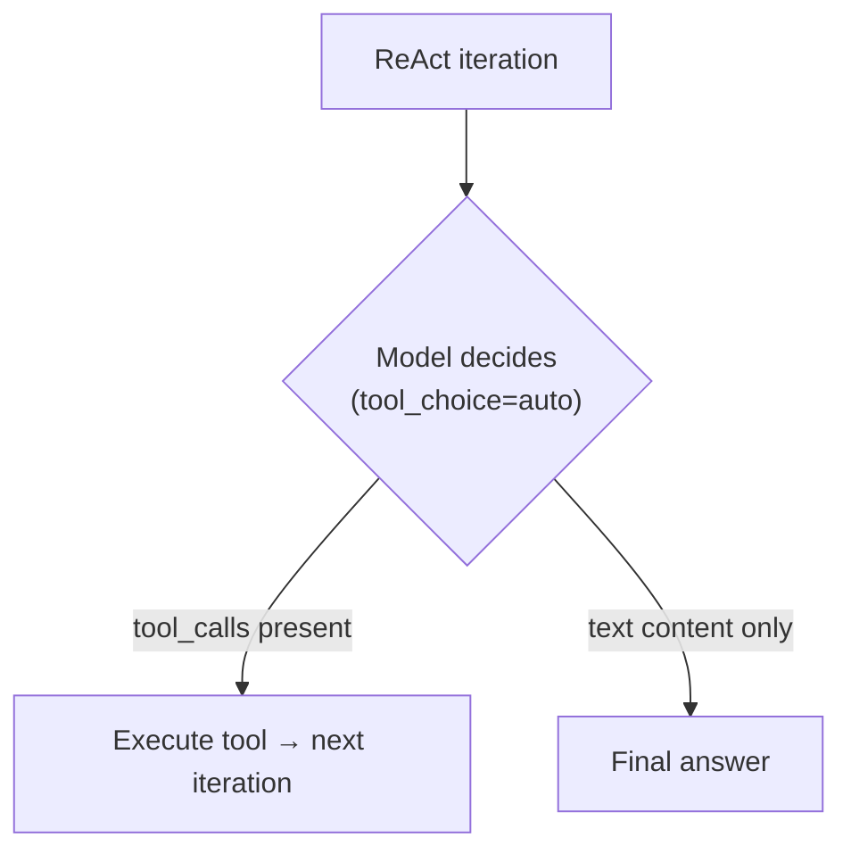
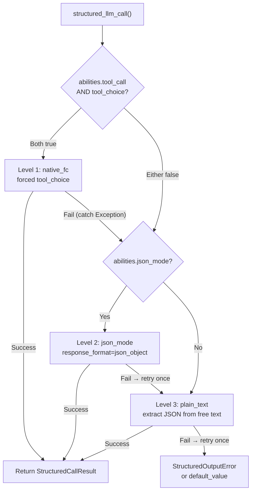

## Provider detection

FIM One uses LiteLLM as a universal adapter. The `_resolve_litellm_model()` function in `core/model/openai_compatible.py` maps the user's `LLM_BASE_URL` + `LLM_MODEL` to a LiteLLM model identifier with a provider prefix. The prefix determines how LiteLLM routes the request — native API protocol (Anthropic Messages API, Gemini, etc.) or generic OpenAI-compatible `/v1/chat/completions`.

Resolution order:

1. **Explicit provider** (from DB `ModelConfig.provider` field) — highest priority. If the provider matches a known domain in the URL, no `api_base` is returned (LiteLLM routes natively). Otherwise, `api_base` is set to the relay URL.
2. **Domain match** against `KNOWN_DOMAINS` — official API endpoints are recognized by hostname.
3. **URL path hint** against `PATH_PROVIDER_HINTS` — common on relay platforms like UniAPI where `/claude` or `/anthropic` in the path indicates the upstream protocol.
4. **Fallback** — `openai/` prefix (generic OpenAI-compatible).

| Domain / Path | Provider prefix | Protocol |
|---|---|---|
| `api.openai.com` | `openai/` | OpenAI Chat Completions |
| `anthropic.com` | `anthropic/` | Anthropic Messages API |
| `generativelanguage.googleapis.com` | `gemini/` | Google Gemini |
| `api.deepseek.com` | `deepseek/` | DeepSeek (OpenAI-compatible) |
| `api.mistral.ai` | `mistral/` | Mistral |
| Path contains `/claude` or `/anthropic` | `anthropic/` | Anthropic Messages API (via relay) |
| Path contains `/gemini` | `gemini/` | Google Gemini (via relay) |
| Anything else | `openai/` | Generic OpenAI-compatible |

When the provider prefix is a native protocol (anthropic, gemini, etc.) and the URL is not the official endpoint, LiteLLM uses the native protocol but sends requests to the relay's `api_base`. This means provider-specific behaviors — including the Bedrock prefill issue described below — apply regardless of whether the request goes to the official API or through a relay.

<Warning>
If your relay URL contains `/claude` in the path, FIM One automatically routes via Anthropic's native protocol. This is usually correct (better streaming, thinking support), but means provider-specific behaviors apply — including the Bedrock prefill issue described below.
</Warning>

## tool_choice — the four modes

The `tool_choice` parameter is standardized via the OpenAI format. LiteLLM translates it to each provider's native protocol before sending the request.

| Mode | Meaning | Provider support |
|---|---|---|
| `"auto"` | Model decides whether to call a tool or respond with text | All providers |
| `"required"` | Must call a tool, but model chooses which | Most providers |
| `{"type":"function","function":{"name":"X"}}` | Must call function X specifically | Most providers — **incompatible with Anthropic thinking** |
| `"none"` | Cannot use tools, text only | All providers |

The distinction between `"auto"` and forced (`{"type":"function",...}`) is the crux of every compatibility issue in FIM One. These two modes are used by completely different subsystems with different requirements.

## Where tool_choice is used

Two subsystems use `tool_choice`, and they use it in fundamentally different ways.

### ReAct engine — tool_choice="auto"

The ReAct loop needs the model to decide each iteration: call a tool, or give a final answer. Only `"auto"` makes sense here — the model freely chooses between producing `tool_calls` or text content. This is compatible with all providers, all models, and all modes including extended thinking.



The ReAct engine uses native function calling (`_run_native`) when `abilities["tool_call"] = True`, falling back to JSON-in-content mode (`_run_json`) otherwise. Both modes use `"auto"` — the difference is whether tools are passed via the `tools` parameter or described in the system prompt. See [ReAct Engine — Dual-mode execution](/architecture/react-engine#dual-mode-execution) for details.

### structured_llm_call — tool_choice=forced

One-shot structured extraction (schema annotation, DAG planning, plan analysis). Forces the model to call a specific virtual function, guaranteeing structured JSON output. This is the call site that triggers provider-specific errors.

`structured_llm_call` implements a 3-level degradation chain:



The critical design difference: `structured_llm_call`'s fallback is **runtime** — it dynamically tries each level and catches exceptions to fall through. The ReAct engine's mode selection is **build-time** — it checks `_native_mode_active` once at the start and commits to one mode for the entire loop. This means `structured_llm_call` can recover from provider-specific 400 errors transparently, while ReAct relies on the mode being correctly chosen upfront.

## The Bedrock prefill trap

When `response_format={"type":"json_object"}` is passed for a model resolved with the `anthropic/` prefix, LiteLLM internally injects an assistant prefill message to simulate JSON mode. The Anthropic Messages API has no native `response_format` parameter, so LiteLLM approximates it by prepending an opening brace as assistant content:

```json
{"role": "assistant", "content": "{"}
```

This works on Anthropic's direct API. However, newer AWS Bedrock model versions reject any conversation whose last message has `role: "assistant"` — they call this "assistant message prefill" and throw:

```
ValidationException: This model does not support assistant message prefill.
The conversation must end with a user message.
```

This error occurs only when **all three conditions** are met simultaneously:

1. The model is resolved with the `anthropic/` prefix (via domain match or URL path hint).
2. `response_format={"type":"json_object"}` is passed (the json_mode code path in `structured_llm_call`).
3. The actual backend is AWS Bedrock (which rejects prefill).

<Warning>
This does NOT affect native tool calling (`tool_choice="auto"` with `tools=` parameter). The prefill injection only happens for `response_format`. ReAct agent execution is completely unaffected.
</Warning>

If both Level 1 (native_fc) and Level 2 (json_mode) fail on Bedrock, the system recovers at Level 3 (plain_text). The `json_mode_enabled` flag described below eliminates the wasted Level 2 call.

### The fix: json_mode_enabled

A per-model `json_mode_enabled` flag controls whether Level 2 (json_mode) is ever attempted:

- **DB-configured models**: toggle in Admin → Models → Advanced settings. The flag is stored on `ModelProviderModel.json_mode_enabled` (default `TRUE`).
- **ENV-configured models**: set `LLM_JSON_MODE_ENABLED=false` in your environment.
- **Effect**: when disabled, `abilities["json_mode"]` returns `False` → `response_format` is never passed → no prefill → Bedrock works. The degradation chain becomes `native_fc → plain_text`, skipping the doomed json_mode call entirely.
- **No quality loss**: the model still returns valid JSON because the system prompt instructs it to. The plain_text level uses `extract_json()` to parse JSON from free-form content, which works reliably with modern models.

## Thinking models + forced tool_choice

Some models have extended thinking (chain-of-thought) permanently enabled. Their APIs reject forced `tool_choice` because forcing a specific function call contradicts the model's freedom to reason first:

```
tool_choice 'specified' is incompatible with thinking enabled
```

Anthropic enforces this constraint at the protocol level, and some other providers (e.g. Moonshot AI / Kimi K2.5) follow the same pattern.

For Anthropic models, `structured_llm_call` handles this automatically by passing `reasoning_effort=None` when calling native_fc, disabling extended thinking for that specific call. Structured output calls need **schema compliance**, not deep reasoning — disabling thinking here is both correct and beneficial (lower latency, lower cost).

However, some models (e.g. Kimi K2.5) have thinking permanently on with no way to disable it externally. For these models, native_fc always fails with a 400 error, adding ~10 seconds of wasted latency per structured call before the degradation chain falls through to json_mode.

### The fix: tool_choice_enabled

A per-model `tool_choice_enabled` flag controls whether Level 1 (native_fc) is ever attempted:

- **DB-configured models**: toggle in Admin → Models → Advanced → "Native Function Calling". The flag is stored on `ModelProviderModel.tool_choice_enabled` (default `TRUE`).
- **ENV-configured models**: set `LLM_TOOL_CHOICE_ENABLED=false` in your environment.
- **Effect**: when disabled, `abilities["tool_choice"]` returns `False` → the degradation chain starts from Level 2 (json_mode) or Level 3 (plain_text), skipping native_fc entirely. This eliminates the ~10s penalty per structured call for incompatible models.
- **ReAct agent unaffected**: `tool_choice_enabled` only controls forced tool selection in `structured_llm_call`. The ReAct engine uses `tool_choice="auto"` (model freely decides), which works with all models regardless of this setting.

<Note>
`tool_choice_enabled` and `tool_call` are separate ability flags. `tool_call` (always `True` for `OpenAICompatibleLLM`) gates whether tools are passed to the model at all — disabling it would break the ReAct agent. `tool_choice` only gates whether **forced** tool selection is attempted for structured output extraction.
</Note>

`tool_choice="auto"` is unaffected by thinking mode. The ReAct engine uses `"auto"` exclusively, so agent execution works with thinking enabled.

<Warning>
Do NOT set `abilities["tool_call"] = False` to avoid this constraint. That would disable ReAct's `_run_native` mode (which uses `tool_choice="auto"` and works fine with thinking), forcing it into the less reliable `_run_json` mode.
</Warning>

<Note>
**Provider migration note:** Some third-party relays silently drop unsupported parameters like `reasoning_effort` (`drop_params=True`), so thinking is never activated even when configured. When migrating to a provider that properly supports thinking (Bedrock, direct Anthropic API), the `reasoning_effort=None` in native_fc ensures consistent behavior. No user action is needed — structured output works identically across all providers.
</Note>

## Quick reference: what works where

| Scenario | ReAct mode | structured_llm_call path | Notes |
|---|---|---|---|
| OpenAI (any model) | `_run_native` | native_fc | Full support |
| Anthropic (no thinking) | `_run_native` | native_fc | Full support |
| Anthropic + thinking | `_run_native` | native_fc (thinking auto-disabled) | Thinking disabled for structured output only |
| Bedrock relay (no thinking) | `_run_native` | native_fc | Full support |
| Bedrock relay + thinking | `_run_native` | native_fc (thinking auto-disabled) | Thinking disabled for structured output only |
| Gemini | `_run_native` | native_fc | Full support |
| DeepSeek (non-thinking) | `_run_native` | native_fc | Full support |
| DeepSeek R1 (thinking) | `_run_native` | json_mode (set `tool_choice_enabled=false`) | Thinking always-on; skip native_fc |
| Kimi K2 (non-thinking) | `_run_native` | native_fc | Full support |
| Kimi K2.5 (thinking) | `_run_native` | json_mode (set `tool_choice_enabled=false`) | Thinking always-on; skip native_fc |
| Generic OpenAI-compatible | `_run_native` | native_fc | Full support |
| Any model with `tool_call=false` | `_run_json` | json_mode or plain_text | Fallback for models without tool-call support |

## Recommended per-model configuration

Both `tool_choice_enabled` and `json_mode_enabled` can be toggled per-model in Admin → Models → Advanced settings. The defaults (both `TRUE`) work for most providers. Only adjust when you encounter errors or unnecessary latency.

| Model type | Native FC | JSON Mode | Why |
|---|---|---|---|
| OpenAI GPT series | ON | ON | Full support — defaults are correct |
| Anthropic Claude | ON | ON | Thinking auto-disabled for native_fc |
| Google Gemini | ON | ON | Full support |
| DeepSeek V3 / Coder | ON | ON | Full support |
| **DeepSeek R1 (thinking)** | **OFF** | ON | Thinking always-on; native_fc rejected |
| **Kimi K2.5 (thinking)** | **OFF** | ON | Thinking always-on; native_fc rejected |
| Kimi K2 (non-thinking) | ON | ON | Full support |
| **AWS Bedrock relay** | ON | **OFF** | Bedrock rejects assistant prefill in json_mode |
| Weak / small models | OFF | OFF | Go directly to plain_text extraction |

<Tip>
**When to change:** if you see `structured_llm_call: native_fc call raised` warnings in your logs followed by successful json_mode extraction, the model does not benefit from native_fc. Disable "Native Function Calling" for that model to eliminate the wasted API call (~10s per structured output request).
</Tip>

**ENV-level overrides** apply to all models configured via environment variables (not admin UI):

```bash
# Disable native_fc globally (for thinking-model-only deployments)
LLM_TOOL_CHOICE_ENABLED=false

# Disable json_mode globally (for Bedrock relay deployments)
LLM_JSON_MODE_ENABLED=false
```

## Reasoning effort and thinking configuration

FIM One exposes two env vars for controlling extended thinking / reasoning:

| Variable | Values | Effect |
|---|---|---|
| `LLM_REASONING_EFFORT` | `low`, `medium`, `high` | Passed as `reasoning_effort` to LiteLLM. Anthropic: mapped to `thinking` param. OpenAI o-series: passed through. Others: silently dropped (`drop_params=True`). |
| `LLM_REASONING_BUDGET_TOKENS` | integer (e.g. `10000`) | Anthropic only: sets an explicit `thinking.budget_tokens` cap, bypassing LiteLLM's auto-mapping. Useful for controlling costs on Claude models. |

When `reasoning_effort` is set and the model is resolved as `anthropic/`, two additional behaviors apply:

1. **Temperature is forced to 1.0.** Bedrock rejects `temperature != 1.0` when thinking is enabled. FIM One handles this automatically — no user action needed.
2. **GPT-5.x with tools**: `reasoning_effort` is silently dropped when `tools` are present, because the GPT-5 `/v1/chat/completions` endpoint rejects the combination. This only affects the ReAct tool loop; `structured_llm_call` calls that lack a `tools` parameter are unaffected.

## Defensive parsing for structured output

Even with native_fc working correctly, the structured output pipeline includes a defensive parsing layer to handle edge cases from any provider or compatibility layer.

The DAG planner's `_dict_to_steps` parser handles three common edge cases:

1. **Single object instead of array.** Some models return `{"steps": {"id": "1", "task": "..."}}` (a single step object) instead of `{"steps": [{"id": "1", "task": "..."}]}` (an array). The parser detects this by checking for `id` or `task` keys and wraps the object in a list.

2. **Double-encoded JSON string.** When structured output falls through to json_mode (which lacks schema enforcement), some providers return the `steps` value as a JSON string rather than a native array — e.g., `{"steps": "[{\"id\": \"1\", ...}]"}`. This string may also contain literal newlines (from the model's formatting) that break standard `json.loads`. The parser uses `extract_json_value()` (which includes `_repair_json_strings`) to handle:
   - Literal newlines inside JSON string values
   - Invalid escape sequences (common with LaTeX or code content)
   - Other serialization quirks from compatibility layers

3. **Missing `steps` wrapper.** The model may return a single step as the top-level object without the `steps` wrapper key. The parser detects `id` and `task` at the root level and wraps accordingly.

<Note>
Under normal operation, native_fc returns properly structured tool call arguments and these edge cases do not arise. The defensive parsers exist as a safety net for custom `BaseLLM` subclasses, unusual provider behaviors, or fallback scenarios where structured output degrades to json_mode or plain_text.
</Note>

## Prompt caching (cross-provider)

FIM One implements Anthropic's explicit prompt caching via `cache_control` breakpoints and simultaneously benefits every other provider's automatic prefix caching through the **Prompt Section Registry**. The goal is a single prompt-assembly path that works across all providers without per-call prompt shape divergence.

### Architecture

The `fim_one.core.prompt` module exposes three primitives:

- **`PromptSection`** — a named fragment with either a static `content: str` or a dynamic `content: Callable`
- **`PromptRegistry`** — a memoized store (static sections render once, dynamic sections re-render per call)
- **`DYNAMIC_BOUNDARY`** — a sentinel marker the registry inserts between the last static section and the first dynamic one, so callers can split the rendered prompt at the cache breakpoint

System prompts for ReAct (JSON mode, native function-calling mode, synthesis) are split into:

- **Static prefix** (~95% of the prompt) — identity, core guidelines, tool descriptions
- **Dynamic suffix** — current datetime, per-request language directive, handoff context

### Capability detection

`fim_one.core.prompt.caching.is_cache_capable(model_id)` returns `True` when the model id contains any of: `claude`, `anthropic`, `bedrock/anthropic`, `vertex_ai/claude`. These providers receive **two** `role="system"` messages with `cache_control: {"type": "ephemeral"}` on the first (static) message.

Every other provider receives a **single** concatenated system message with no `cache_control` field — necessary because non-Anthropic endpoints either reject the field or silently drop it, and sending it through some relays causes `400 unknown parameter` errors.

### Cross-provider coverage

| Provider | Mechanism | Read discount | Our handling |
|---|---|---|---|
| **Anthropic Claude** (3, 3.5, 4) | Explicit `cache_control` | 0.10× | Two system messages with ephemeral breakpoint |
| **AWS Bedrock Anthropic** | Passes through Anthropic cache | 0.10× | Same as Anthropic |
| **GCP Vertex AI Claude** | Passes through Anthropic cache | 0.10× | Same as Anthropic |
| **OpenAI GPT / o-series** | Auto prefix hash (≥1024 tokens) | 0.50× | Byte-stable prefix via Section Registry → automatic hit |
| **DeepSeek (v3 / R1)** | Auto disk-backed prefix cache | 0.10× | Same as OpenAI |
| **Moonshot Kimi (K1/K2)** | Auto prefix cache | 0.10×/0.50× | Same |
| **ZhipuAI GLM-4.5+** | Auto long-context cache | 0.20× | Same |
| **Grok (xAI)** | Auto prefix cache | 0.25× | Same |
| **Google Gemini** | Separate `createCachedContent` API | 0.25× | **Not yet implemented** — tracked on v0.9 roadmap as `GeminiCacheAdapter` |
| **Mistral / Cohere** | No native cache | N/A | N/A |

The `PromptRegistry` benefits every provider with auto prefix caching "for free" — by keeping the static portion byte-identical across calls (current datetime lives in the dynamic suffix, not prefix), every auto-caching provider's hash matches and hits their cache. This is why the Registry is a foundational modelless win even before considering Anthropic-specific `cache_control`.

### Observability

Every `chat/*` response's `done_payload` now includes:

```json
"cache": {
  "read_tokens": 1067,
  "creation_tokens": 0
}
```

`TurnProfiler` emits a structured log line per turn: `turn_cache summary | model=claude-sonnet-4-6 | read_tokens=1067 | create_tokens=0 | saved_input_tokens=961 (~90%)`. This also functions as a **relay honesty probe** — if you route through an API relay, compare actual billed input vs `read_tokens` to detect whether the relay strips `cache_control` or keeps the 0.10× discount.

No dollar estimate is returned at the LLM layer — pricing and relay markup are applied above, so the LLM layer only returns objective token counts.

### Multi-turn cache ROI

Measured on Claude 4 ReAct turns with the default agent prompt:

| Mode | Static prefix tokens | Dynamic suffix tokens | Cache ratio |
|---|---|---|---|
| JSON mode, no tools | ~753 | ~46 | 94.2% |
| JSON mode with ~10 tools | ~1067 | ~46 | 95.9% |
| Native function-calling | ~523 | ~46 | 91.9% |

A 10-iteration ReAct run with 10 tools saves ~8,640 input tokens per turn after the first (9 cache hits × 1067 tokens × 90%). Anthropic charges 1.25× for cache write on the first call, so the breakeven is at the **second** call — single-shot queries do not benefit.

## Reasoning replay policy (modelless correctness)

Extended thinking / reasoning blocks behave differently across providers. A uniform serialization policy breaks both protocol contracts and automatic prefix caches. `fim_one.core.prompt.reasoning.reasoning_replay_policy(model_id)` returns one of three values and gates `ChatMessage.to_openai_dict(replay_policy=...)` in `OpenAICompatibleLLM._build_request_kwargs()`.

### Three policies

- **`anthropic_thinking`** — Claude family (including `anthropic/`, `bedrock/anthropic`, `vertex_ai/claude`). Thinking blocks MUST be replayed with `signature` attached; Anthropic rejects subsequent turns if the signature is missing or altered.
- **`informational_only`** — models that emit CoT but do NOT expect replay: DeepSeek R1 / R1-Distill, Qwen QwQ, Gemini 2.x thinking, OpenAI o1 / o3 / o4. Their documentation explicitly says "do not send `reasoning_content` back in message history". Sending it anyway:
  - Violates the provider contract (may start rejecting in future versions)
  - **Silently invalidates their automatic prefix cache** — message bytes mutate on every turn, breaking the hash
- **`unsupported`** — models without reasoning capability (GPT-4o, GPT-4 Turbo, Gemini 1.5, Mistral, Llama). No CoT to replay; field should never appear. This policy is also the safe default for unknown model ids.

### Enforcement

All policy evaluation happens in one place (`_build_request_kwargs`). `ChatMessage.to_openai_dict(replay_policy=None)` preserves the A3 permissive default so uncoordinated callers don't regress. The cross-provider test matrix lives in `tests/test_reasoning_replay_policy.py` with **reverse assertions** proving that non-Anthropic requests do NOT leak `reasoning_content`.

### For users

Both feature and bug behavior is automatic — you don't need to configure anything. Workflow implications:

- **If you switch agents between Claude and DeepSeek in the same conversation**, history is stored with thinking blocks intact; on the next turn, the outgoing message shape adapts per the current model.
- **If you use a proxy / custom `BaseLLM` subclass**, make sure its model id is recognizable (contains one of the fragments) or the default `unsupported` policy will apply — which is safe but means Claude behind an unusual proxy might lose thinking replay. Add the model-id fragment to `_CACHE_CAPABLE_MODEL_FRAGMENTS` (in `core/prompt/caching.py`) and/or the reasoning policy lookup.

## Troubleshooting

**"This model does not support assistant message prefill"**
Bedrock + json_mode. Set `LLM_JSON_MODE_ENABLED=false` or disable JSON Mode in the admin model settings.

**"Thinking may not be enabled when tool_choice forces tool use"** / **"tool_choice 'specified' is incompatible with thinking enabled"**
For Anthropic models, `structured_llm_call` disables thinking for native_fc calls automatically. For other providers with always-on thinking (e.g. Kimi K2.5), disable "Native Function Calling" in the model's Advanced settings, or set `LLM_TOOL_CHOICE_ENABLED=false` globally. The degradation chain will skip native_fc and extract structured output via json_mode or plain_text instead.

**"DAG pipeline failed: LLM 'steps' is not an array"**
The LLM returned the `steps` field as a string or single object instead of an array. This typically means structured output fell through to json_mode (which lacks schema enforcement). Check the log for `structured_llm_call: level=xxx` — if it shows `json_mode` instead of `native_fc`, native_fc is failing silently. If using a custom `BaseLLM` subclass, verify it accepts the `reasoning_effort` kwarg.

**ReAct falls back to JSON mode unexpectedly**
Check that the model's `abilities["tool_call"]` is `True`. This is always `True` for `OpenAICompatibleLLM`, but a custom `BaseLLM` subclass might override it. Verify with the model detail endpoint in the admin API.

**structured_llm_call exhausts all levels and raises StructuredOutputError**
The model failed to produce parseable JSON at any level. This is rare with modern models. Check: (1) the schema is valid JSON Schema, (2) the model has enough `max_tokens` to produce the full response, (3) the system prompt is not contradicting the schema instructions. The DAG planner and analyzer both provide `default_value` fallbacks, so this error only propagates from call sites that explicitly omit defaults.
