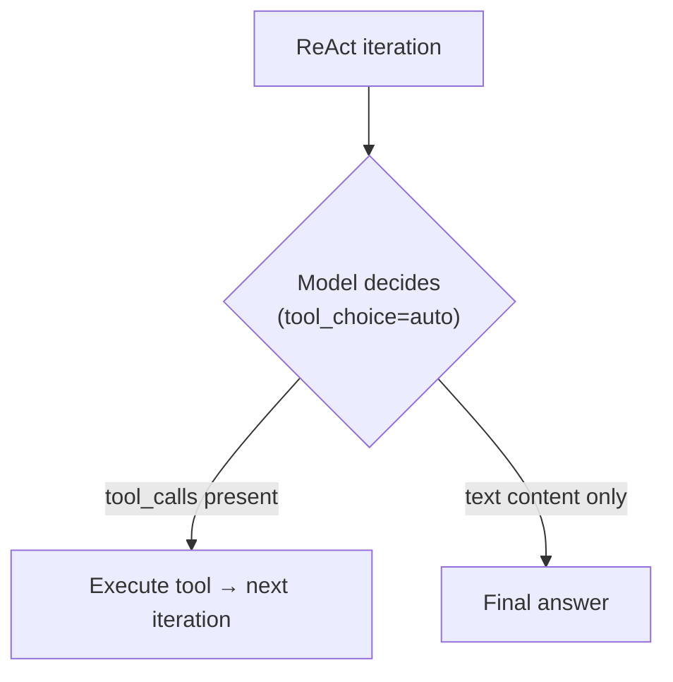
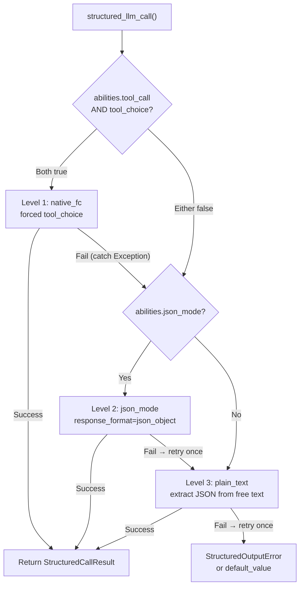

## Provider detection

FIM One uses LiteLLM as a universal adapter. The `_resolve_litellm_model()` function in `core/model/openai_compatible.py` maps the user's `LLM_BASE_URL` + `LLM_MODEL` to a LiteLLM model identifier with a provider prefix. The prefix determines how LiteLLM routes the request — native API protocol (Anthropic Messages API, Gemini, etc.) or generic OpenAI-compatible `/v1/chat/completions`.

Resolution order:

1. **Explicit provider** (from DB `ModelConfig.provider` field) — highest priority. If the provider matches a known domain in the URL, no `api_base` is returned (LiteLLM routes natively). Otherwise, `api_base` is set to the relay URL.
2. **Domain match** against `KNOWN_DOMAINS` — official API endpoints are recognized by hostname.
3. **URL path hint** against `PATH_PROVIDER_HINTS` — common on relay platforms like UniAPI where `/claude` or `/anthropic` in the path indicates the upstream protocol.
4. **Fallback** — `openai/` prefix (generic OpenAI-compatible).

| Domain / Path | Provider prefix | Protocol |
|---|---|---|
| `api.openai.com` | `openai/` | OpenAI Chat Completions |
| `anthropic.com` | `anthropic/` | Anthropic Messages API |
| `generativelanguage.googleapis.com` | `gemini/` | Google Gemini |
| `api.deepseek.com` | `deepseek/` | DeepSeek (OpenAI-compatible) |
| `api.mistral.ai` | `mistral/` | Mistral |
| Path contains `/claude` or `/anthropic` | `anthropic/` | Anthropic Messages API (via relay) |
| Path contains `/gemini` | `gemini/` | Google Gemini (via relay) |
| Anything else | `openai/` | Generic OpenAI-compatible |

When the provider prefix is a native protocol (anthropic, gemini, etc.) and the URL is not the official endpoint, LiteLLM uses the native protocol but sends requests to the relay's `api_base`. This means provider-specific behaviors — including the Bedrock prefill issue described below — apply regardless of whether the request goes to the official API or through a relay.

<Warning>
If your relay URL contains `/claude` in the path, FIM One automatically routes via Anthropic's native protocol. This is usually correct (better streaming, thinking support), but means provider-specific behaviors apply — including the Bedrock prefill issue described below.
</Warning>

## tool_choice — the four modes

The `tool_choice` parameter is standardized via the OpenAI format. LiteLLM translates it to each provider's native protocol before sending the request.

| Mode | Meaning | Provider support |
|---|---|---|
| `"auto"` | Model decides whether to call a tool or respond with text | All providers |
| `"required"` | Must call a tool, but model chooses which | Most providers |
| `{"type":"function","function":{"name":"X"}}` | Must call function X specifically | Most providers — **incompatible with Anthropic thinking** |
| `"none"` | Cannot use tools, text only | All providers |

The distinction between `"auto"` and forced (`{"type":"function",...}`) is the crux of every compatibility issue in FIM One. These two modes are used by completely different subsystems with different requirements.

## Where tool_choice is used

Two subsystems use `tool_choice`, and they use it in fundamentally different ways.

### ReAct engine — tool_choice="auto"

The ReAct loop needs the model to decide each iteration: call a tool, or give a final answer. Only `"auto"` makes sense here — the model freely chooses between producing `tool_calls` or text content. This is compatible with all providers, all models, and all modes including extended thinking.


```mermaid
flowchart TD
    A["ReAct iteration"] --> B{"Model decides<br/>(tool_choice=auto)"}
    B -->|"tool_calls present"| C["Execute tool → next iteration"]
    B -->|"text content only"| D["Final answer"]
```

The ReAct engine uses native function calling (`_run_native`) when `abilities["tool_call"] = True`, falling back to JSON-in-content mode (`_run_json`) otherwise. Both modes use `"auto"` — the difference is whether tools are passed via the `tools` parameter or described in the system prompt. See [ReAct Engine — Dual-mode execution](/architecture/react-engine#dual-mode-execution) for details.

### structured_llm_call — tool_choice=forced

One-shot structured extraction (schema annotation, DAG planning, plan analysis). Forces the model to call a specific virtual function, guaranteeing structured JSON output. This is the call site that triggers provider-specific errors.

`structured_llm_call` implements a 3-level degradation chain. The three rungs are named after the code, and their numbering is not the same as the four guarantee tiers described in [the section below](#structured-output-the-four-guarantee-tiers):


```mermaid
flowchart TD
    START["structured_llm_call()"] --> L1{"abilities.tool_call<br/>AND tool_choice?"}
    L1 -->|Both true| FC["Level 1: native_fc<br/>forced tool_choice"]
    L1 -->|Either false| L2
    FC -->|"Success"| DONE["Return StructuredCallResult"]
    FC -->|"Fail (catch Exception)"| L2{"abilities.json_mode?"}
    L2 -->|Yes| JM["Level 2: json_mode<br/>response_format=json_object"]
    L2 -->|No| PT["Level 3: plain_text<br/>extract JSON from free text"]
    JM -->|"Success"| DONE
    JM -->|"Fail → retry once"| PT
    PT -->|"Success"| DONE
    PT -->|"Fail → retry once"| ERR["StructuredOutputError<br/>or default_value"]
```

The critical design difference: `structured_llm_call`'s fallback is **runtime** — it dynamically tries each level and catches exceptions to fall through. The ReAct engine's mode selection is **build-time** — it checks `_native_mode_active` once at the start and commits to one mode for the entire loop. This means `structured_llm_call` can recover from provider-specific 400 errors transparently, while ReAct relies on the mode being correctly chosen upfront.

## Structured output: the four guarantee tiers

"Structured output" is one phrase covering four different mechanisms. They all produce JSON and they do not offer the same guarantee. What separates them is where the constraint lives: inside the decoder, which cannot emit a token the schema forbids, or inside the prompt, which can only ask.

| Tier | What the request carries | Where the payload arrives | What is guaranteed | Enforced by |
|---|---|---|---|---|
| **T1 — native function calling, `strict: true`** | `tools=[…]` with `strict` set on the function definition | A JSON string in `tool_calls[0].function.arguments` | Schema-level: every required field present, no undeclared keys, types and enums correct | Decoder state machine |
| **T2 — `response_format: {"type": "json_schema"}`** | The schema itself, inside `response_format`, with `strict: true` | A JSON string in `message.content` | Schema-level, same as T1, but on the assistant's own reply rather than on a tool call | Decoder state machine |
| **T3 — `response_format: {"type": "json_object"}`** | The type alone, no schema | A JSON string in `message.content` | Syntactic only: the text parses as JSON. Which keys appear is unconstrained | Decoder (syntax) |
| **T4 — free text plus instructions** | Nothing. The schema is described in the prompt | `message.content`, possibly wrapped in prose or code fences | Nothing | The prompt |

The mechanism behind T1 and T2 is constrained decoding. The provider compiles the schema into a grammar and, at each decoding step, masks out every token that would make the output unparseable against it. A required field cannot be skipped because the token that would close the object is not in the allowed set until that field has been emitted. This is a different kind of claim from "the model was asked nicely and complied," and it is why T1/T2 hold at temperature 1 and on small models, where prompt compliance does not.

### T1 and T2 are not interchangeable

They give the same guarantee through different channels, and the channel matters in three ways.

**The turn shape differs.** T1 returns a tool-call turn; the model has decided to *act*. T2 returns an ordinary assistant message; the model has *answered* in a shape. When the caller wants one extraction and not an agent loop, T2 says so directly instead of inventing a virtual function for the model to "call".

**Forcing T1 collides with thinking.** Getting a schema-gated payload out of T1 usually means forcing the choice, either `required` or a named function. Several providers reject a forced tool choice while extended thinking is active. Table B below records which ones. T2 has no such conflict: it is a response constraint, not a tool constraint, so it is the only schema-gated path that survives thinking being on. For a deployment standardised on reasoning models, that is the practical argument for T2 rather than a stylistic one.

**T1 costs a round of schema plumbing that T2 does not.** A virtual function needs a name, a description, and a decision about whether the model may decline to call it.

### What T2 costs

Constrained decoding is not free and the schema you already have is usually not the schema it accepts.

- **A schema subset.** OpenAI's strict mode wants `additionalProperties: false` on every object and every property listed in `required`; optionality is expressed as a union with `null` rather than by omission from `required`. Root must be an object. There are caps on total properties and nesting depth. Most hand-written schemas need editing before they are eligible.
- **Grammar compilation.** The first request carrying a new schema pays a one-off compile latency on the provider side. Reusing a stable schema amortises it; generating a fresh schema per request does not.
- **A new failure surface.** A model that will not answer returns a refusal rather than a schema-shaped object, so the caller needs a branch for it.

### What no tier guarantees

Every tier constrains form. None constrains truth. A T2 response can be perfectly schema-valid and factually wrong, and an enum-constrained field will return one of the allowed values even when none of them is correct, because the decoder's job is to keep the output inside the grammar rather than to know the answer. Schema gating removes parse failures and field-shape bugs. It does not remove the need to check what the value says.

<Warning>
**Two numbering schemes, and they do not line up.** This page uses **T1–T4** for the guarantee tiers above. It uses **Level 1/2/3** for the three rungs of `structured_llm_call`'s degradation chain, which are named after the code (`native_fc`, `json_mode`, `plain_text`). FIM One's Level 2 is `json_object`, which is **T3**, not T2. The chain has three rungs because it skips T2 entirely, not because there are only three tiers.
</Warning>

### Where FIM One sits

| `structured_llm_call` level | Tier | What the code actually does |
|---|---|---|
| Level 1 — `native_fc` | **T1 without `strict`** | `_build_tool_def` emits `name` / `description` / `parameters` and nothing else. No call site sets `strict`, so `convert_tools` in `responses_adapter.py` defaults it to `False`. The schema reaches the model as a description of what to produce, not as a constraint on what it can produce |
| *(absent)* | **T2** | Not implemented. `json_schema` appears nowhere in the codebase, and `abilities` has no flag that could express per-model support for it |
| Level 2 — `json_mode` | **T3** | `{"type": "json_object"}`, hardcoded in `structured.py::_call_llm` and `react.py::_json_response_format` |
| Level 3 — `plain_text` | **T4** | `extract_json()` over free-form content, with an optional per-call-site regex fallback |

Five consequences follow, and they are the honest limitations of the current design.

1. **The chain has no schema-gated rung to fall back to.** When Level 1 fails, the next rung down is `json_object`, which guarantees only that the text parses. There is no intermediate step that still enforces fields.
2. **Level 1's guarantee is weaker than its name suggests.** Without `strict`, native function calling is the pre-2024 non-strict variety: the model usually honours the schema and is not prevented from omitting a required field, inventing a key, or returning a string where a number was declared.
3. **On `anthropic/` routes, Level 2 is not really T3.** The Anthropic Messages API has no `response_format`, so LiteLLM emulates JSON mode by injecting an assistant prefill. That is a prompt-layer device, which puts the effective guarantee between T4 and T3 rather than at T3. The Bedrock prefill trap documented below is this emulation failing loudly; the quieter cost is that the guarantee was never the one the parameter name implies.
4. **Nothing validates the result against the schema afterwards.** `jsonschema` is not a dependency. Whatever checking happens is per-call-site, inside the optional `parse_fn`, and its rigour varies by call site.
5. **Failure is absorbed rather than surfaced.** Nearly every caller passes `default_value`, so an exhausted chain returns a plausible-looking object instead of raising. `StructuredCallResult.level_used` records which rung produced the value, but no call site reads it, and on the `default_value` path it reports `plain_text` for a chain that in fact produced nothing.

**How to see which rung you are actually on.** `structured_llm_call` logs one line per completed call at `INFO`, emitted only after the data has survived `parse_fn`, so it names a rung that genuinely succeeded:

```
structured_llm_call: fn=classify_mode level=native_fc attempt=first calls=1
structured_llm_call: fn=annotate_tables level=json_mode attempt=reformat_retry calls=3
```

Total failure logs at `WARNING` with `level=none outcome=default_value`. Grepping these two lines over a day of traffic is the only way to tell whether the missing T2 rung costs anything in a given deployment, since the `default_value` design means the symptom is a mediocre answer rather than an error.

### Provider support for each tier

<Note>
**This table documents upstream APIs, not FIM One code paths.** Every other table on this page names the function that implements the behaviour. This one cannot, because FIM One uses no T2 feature from any provider and sets `strict` on none of them. It is here so that a decision to implement T2 starts from what is actually available. Vendor capability moves quickly and support often lands on some models in a family before others; re-check the vendor's own documentation before relying on a row.
</Note>

| Provider | T1 `strict` | T2 `json_schema` | T3 `json_object` | Notes |
|---|---|---|---|---|
| **OpenAI** | ✅ | ✅ | ✅ | The reference implementation of both strict tiers. Strict function calling and `response_format: json_schema` share one grammar engine and one schema subset. `json_object` is the older JSON mode, kept for compatibility |
| **Anthropic** | ⚠️ | ⚠️ | ❌ | No `response_format` on the Messages API at all; tool `input_schema` is validated rather than decoder-enforced. Strict tool use and a schema-constrained output format exist behind a beta header on recent Claude models. FIM One reaches Anthropic through LiteLLM, which emulates JSON mode by prefill and does not use the beta, so none of this is live here |
| **Gemini** | ✅ | ✅ | ✅ | `responseSchema` (an OpenAPI 3.0 subset) and the later `responseJsonSchema` are decoder-enforced, and the OpenAI-compatible endpoint accepts `response_format: json_schema`. Forced calling is `ANY` with `allowed_function_names` |
| **xAI (Grok)** | ✅ | ✅ | ✅ | OpenAI-compatible surface including strict structured outputs |
| **Mistral** | ✅ | ✅ | ✅ | Custom structured outputs accept a user-supplied JSON Schema |
| **DeepSeek** | ❌ | ❌ | ✅ | JSON output is `json_object` only. The documented requirement is that the prompt contain the word "json" and show an example, which is a T4 device attached to a T3 parameter. `deepseek-reasoner` additionally rejects a forced tool choice, so its schema-gated path is closed at both ends |
| **Qwen** (DashScope) | ⚠️ | ⚠️ | ✅ | `json_object` is available on the compatibility endpoint. Schema-constrained decoding is reliable on self-hosted Qwen through the serving stack rather than the API; DashScope's own `json_schema` support varies by model generation. Verify per model |
| **GLM** (Zhipu / Z.AI) | ❌ | ⚠️ | ✅ | `json_object` on the OpenAI-compatible endpoint. Forced tool choice is unsupported outright, which is why `tool_choice_enabled=false` is the recommended setting in Table B. Treat `json_schema` as unavailable unless the platform documents it for your model |
| **Kimi** (Moonshot) | ⚠️ | ⚠️ | ✅ | `json_object` is documented. Thinking variants accept only `auto` tool choice, so on those the T1 path cannot be forced regardless of `strict` support |
| **MiniMax** | ⚠️ | ⚠️ | ✅ | Function calling works with a forced choice even with thinking always on, which makes it the most usable T1 route among the always-thinking models. Schema-level enforcement is not documented; assume T1 is non-strict |
| **Doubao** (Volcengine Ark) | ⚠️ | ⚠️ | ✅ | Ark documents structured output for parts of the Doubao line. Coverage is per model, so confirm before assuming the account's model has it |
| **Ollama / vLLM / llama.cpp** | ✅ | ✅ | ✅ | The strongest tier support of anything on this list, and the least advertised. Grammar-constrained decoding (GBNF, XGrammar, Outlines) runs locally, so a self-hosted 14B can be given a guarantee that several hosted APIs above cannot offer. Exposed as Ollama's `format`, vLLM's guided decoding parameters, or an OpenAI-compatible `response_format` depending on the server |

Three patterns are worth naming, because they explain the shape of the table rather than just restating it.

**T3 is universal, T2 is not.** Every provider FIM One supports offers `json_object`, and roughly half offer a schema tier. A portable structured-output path therefore has to be built on T3 or below, which is the reason FIM One's chain looks the way it does. Adding T2 means adding a per-model capability flag, not a global switch.

**Always-on thinking tends to close the T1 door.** GLM, Kimi's thinking models, and `deepseek-reasoner` all restrict or reject a forced tool choice, and Anthropic rejects it while thinking is active. MiniMax is the counterexample. Where the door is closed, T2 is the only remaining schema-gated option, which is why the missing rung matters more on a Chinese-model deployment than on an OpenAI one.

**Self-hosting inverts the usual ordering.** Constrained decoding is a property of the serving stack, so it is available on a local checkpoint whose instruction-following is far weaker than a frontier model's. The models that need schema gating most are the ones most able to get it.

## The Bedrock prefill trap

When `response_format={"type":"json_object"}` is passed for a model resolved with the `anthropic/` prefix, LiteLLM internally injects an assistant prefill message to simulate JSON mode. The Anthropic Messages API has no native `response_format` parameter, so LiteLLM approximates it by prepending an opening brace as assistant content:

```json
{"role": "assistant", "content": "{"}
```

This works on Anthropic's direct API. However, newer AWS Bedrock model versions reject any conversation whose last message has `role: "assistant"` — they call this "assistant message prefill" and throw:

```
ValidationException: This model does not support assistant message prefill.
The conversation must end with a user message.
```

This error occurs only when **all three conditions** are met simultaneously:

1. The model is resolved with the `anthropic/` prefix (via domain match or URL path hint).
2. `response_format={"type":"json_object"}` is passed (the json_mode code path in `structured_llm_call`).
3. The actual backend is AWS Bedrock (which rejects prefill).

<Tip>
**Bedrock via OpenAI-compatible endpoint?** If your Bedrock relay exposes an OpenAI-compatible `/v1/chat/completions` endpoint (either AWS's own OpenAI-compatible gateway or a third-party proxy), and the URL path does **not** contain `/claude` or `/anthropic`, FIM One resolves it with the `openai/` prefix. LiteLLM then treats the backend as a standard OpenAI-compatible server, passes `response_format` directly without injecting any prefill, and the server handles JSON constraining natively. **The prefill trap does not apply** — you do not need to set `json_mode_enabled=false`.
</Tip>

<Warning>
This does NOT affect native tool calling (`tool_choice="auto"` with `tools=` parameter). The prefill injection only happens for `response_format`. ReAct agent execution is completely unaffected.
</Warning>

If both Level 1 (native_fc) and Level 2 (json_mode) fail on Bedrock, the system recovers at Level 3 (plain_text). The `json_mode_enabled` flag described below eliminates the wasted Level 2 call.

### The fix: json_mode_enabled

A per-model `json_mode_enabled` flag controls whether Level 2 (json_mode) is ever attempted:

- **DB-configured models**: toggle in Admin → Models → Advanced settings. The flag is stored on `ModelProviderModel.json_mode_enabled` (default `TRUE`).
- **ENV-configured models**: set `LLM_JSON_MODE_ENABLED=false` in your environment.
- **Effect**: when disabled, `abilities["json_mode"]` returns `False` → `response_format` is never passed → no prefill → Bedrock works. The degradation chain becomes `native_fc → plain_text`, skipping the doomed json_mode call entirely.
- **Cost of the skip**: the model still returns valid JSON in practice, because the system prompt asks for it and `extract_json()` parses free-form content reliably on modern models. What is lost is the guarantee rather than the output: the chain now ends at T4, where nothing but the prompt constrains the result. On an `anthropic/` route that loss is smaller than it looks, since the emulated JSON mode was never a decoder-level guarantee either.

## Thinking models + forced tool_choice

Several providers reject a forced `tool_choice` while extended thinking is active, on the grounds that pinning a specific function call contradicts the model's freedom to reason first:

```
tool_choice 'specified' is incompatible with thinking enabled
```

**This is a per-provider rule, not a law of thinking models.** Anthropic enforces it at the protocol level and Moonshot (Kimi) behaves the same way, but MiniMax thinks on every call and still accepts a forced tool choice. Table B in the [Provider Capability Matrix](#provider-capability-matrix) records the verdict provider by provider; do not generalise from one row to another.

For Anthropic models, `structured_llm_call` resolves the conflict on its own by passing `reasoning_effort=None` on the native-FC level, which turns thinking off for that one call (`structured.py::_call_llm`). Structured output needs **schema compliance**, not deep reasoning, so disabling thinking there is both correct and cheaper.

Where thinking cannot be switched off through the API, native_fc fails with a 400 on every structured call and costs roughly ten seconds before the chain falls through to json_mode. Kimi is the common case: with thinking on only `auto` is supported, and a forced tool choice requires turning thinking off, which Moonshot exposes only through the model id (`kimi-k2` has it off, `kimi-k2.5` and `kimi-k2-thinking` have it on). FIM One has no parameter that flips it, so the remedy is the `tool_choice_enabled` flag below.

### The fix: tool_choice_enabled

A per-model `tool_choice_enabled` flag controls whether Level 1 (native_fc) is ever attempted:

- **DB-configured models**: toggle in Admin → Models → Advanced → "Native Function Calling". The flag is stored on `ModelProviderModel.tool_choice_enabled` (default `TRUE`).
- **ENV-configured models**: set `LLM_TOOL_CHOICE_ENABLED=false` in your environment.
- **Effect**: when disabled, `abilities["tool_choice"]` returns `False` → the degradation chain starts from Level 2 (json_mode) or Level 3 (plain_text), skipping native_fc entirely. This eliminates the ~10s penalty per structured call for incompatible models.
- **ReAct agent unaffected**: `tool_choice_enabled` only controls forced tool selection in `structured_llm_call`. The ReAct engine uses `tool_choice="auto"` (model freely decides), which works with all models regardless of this setting.

<Note>
`tool_choice_enabled` and `tool_call` are separate ability flags. `tool_call` (always `True` for `OpenAICompatibleLLM`) gates whether tools are passed to the model at all — disabling it would break the ReAct agent. `tool_choice` only gates whether **forced** tool selection is attempted for structured output extraction.
</Note>

`tool_choice="auto"` is unaffected by thinking mode. The ReAct engine uses `"auto"` exclusively, so agent execution works with thinking enabled.

<Warning>
Do NOT set `abilities["tool_call"] = False` to avoid this constraint. That would disable ReAct's `_run_native` mode (which uses `tool_choice="auto"` and works fine with thinking), forcing it into the less reliable `_run_json` mode.
</Warning>

<Note>
**Provider migration note:** Some third-party relays silently drop unsupported parameters like `reasoning_effort` (`drop_params=True`), so thinking is never activated even when configured. When migrating to a provider that properly supports thinking (Bedrock, direct Anthropic API), the `reasoning_effort=None` in native_fc ensures consistent behavior. No user action is needed — structured output works identically across all providers.
</Note>

## Provider Capability Matrix

This section is the authoritative record of what each provider supports and what FIM One does about it. Every row names the function that implements the behaviour, so any claim here can be checked against the code. Other pages link here instead of repeating the data; when the code changes, this section changes with it.

A row describes a provider's protocol, not a single model. Where models inside one family differ (DeepSeek chat against reasoner, Kimi with thinking on against off), the cell says so.

### Table A: Protocol routing

How a configured `base_url` plus `model` becomes a LiteLLM call, and what happens when the first choice of interface is unavailable.

| Provider | Detected by | LiteLLM prefix | Interface surface | Downgrade chain | Code anchor |
|---|---|---|---|---|---|
| **OpenAI** | Domain `api.openai.com`, or an explicit `provider` of `openai` on the model config | `openai/` | `completions`. GPT-5.x uses `responses-native` (`litellm.aresponses`), with `responses-bridge` (`openai/responses/<model>`) retained as a rollback | GPT-5.x talks Responses natively, falls back to `completions` on a 404 (cached per endpoint and model in `_RESPONSES_NATIVE_SUPPORT`) or on a 400 (not cached). Every other model goes straight to `completions` | `_resolve_litellm_model`, `_should_use_native_responses`, `_dispatch_acompletion` |
| **Anthropic** (Bedrock note below) | Domain `anthropic.com`, path segment `/claude` or `/anthropic`, or an explicit `provider` of `anthropic` | `anthropic/` | `anthropic messages` | None. Native routes never enter the Responses bridge; their protocol is built in `_build_request_kwargs` | `_resolve_litellm_model`, `_dispatch_acompletion` |
| **Gemini** | Domain `generativelanguage.googleapis.com`, path segment `/gemini`, or an explicit `provider` of `gemini` | `gemini/` | `gemini` | None. A domain match also drops `api_base`, so an OpenAI-compat suffix such as `/v1beta/openai/` is ignored and the call goes to the native Gemini API | `_resolve_litellm_model` |
| **xAI (Grok)** | No domain or path entry. Resolves as generic OpenAI-compatible unless `provider` is set explicitly on the model config | `openai/` with `api_base`, or the explicit provider prefix | `completions` | None | `_resolve_litellm_model` |
| **DeepSeek** | Domain `api.deepseek.com` | `deepseek/` | `completions` | None | `_resolve_litellm_model` |
| **Qwen** (DashScope) | Generic fallback | `openai/` with `api_base` | `completions` | None | `_resolve_litellm_model` |
| **GLM** (Zhipu, Z.AI) | Generic fallback | `openai/` with `api_base` | `completions` | None | `_resolve_litellm_model` |
| **MiniMax** | Generic fallback | `openai/` with `api_base` | `completions` | None | `_resolve_litellm_model` |
| **Kimi** (Moonshot) | Generic fallback | `openai/` with `api_base` | `completions` | None | `_resolve_litellm_model` |
| **Doubao** (Volcengine) | Generic fallback | `openai/` with `api_base` | `completions` | None | `_resolve_litellm_model` |
| **Mistral** | Domain `api.mistral.ai` | `mistral/` | `completions` | None | `_resolve_litellm_model` |
| **Ollama / local** | Generic fallback, typically `http://localhost:11434/v1` | `openai/` with `api_base` | `completions` | None | `_resolve_litellm_model` |
| **Relay / proxy** | Path hint first, then the generic fallback. An explicit `provider` on the model config outranks both | The hinted provider prefix, else `openai/`, always with `api_base` pointing at the relay | Whatever the resolved prefix implies | None beyond the resolved prefix. See the relay gotchas below | `_resolve_litellm_model` |

**How GPT-5.x picks a protocol.** `FIM_GPT5_RESPONSES_MODE` selects it: `native` (the default) talks `/v1/responses` directly through `litellm.aresponses`, `bridge` uses LiteLLM's chat-completions translation, and `off` forces plain chat completions. The native path exists because the bridge is lossy in the one place that matters: it discards the reasoning items, so a GPT-5.x agent re-derives its chain of thought on every tool round. Talking the protocol directly lets those items be replayed. A call that explicitly passes `reasoning_effort=None`, which is what `structured_llm_call` and the finish-signal probes do, stays on chat completions, because a call that wants no thinking has no reasoning state to preserve.

Two properties of that native request are load-bearing and easy to get wrong:

- `store=false` keeps the conversation stateless upstream, and `include=["reasoning.encrypted_content"]` asks for the encrypted payload to be returned. Without the include, the reasoning items arrive empty and replay silently becomes a no-op.
- A replayed reasoning item must have its server-side `id` stripped. With `store=false` nothing is persisted upstream, so echoing the id back earns `Item with id 'rs_...' not found. Items are not persisted when 'store' is set to false`. The `encrypted_content` blob carries the state on its own, so dropping the id costs nothing (`sanitize_reasoning_item`).

**Bedrock.** Bedrock-hosted Claude follows the row it resolves to, not the fact that Bedrock is hosting it. Reached through an `anthropic/`-routed relay it inherits Anthropic protocol behaviour, including LiteLLM's json-mode assistant prefill, which newer Bedrock versions reject. Reached through an OpenAI-compatible gateway it resolves as `openai/`, no prefill is injected, and `json_mode_enabled` can stay on.

### Table B: Conflicts and workarounds

FIM One emits three of the four `tool_choice` states: `auto` from the ReAct loop (`react.py::_run_native`), a named function from structured output (`structured.py::_call_llm`), and `none` when the finish-signal answer replays the tools payload. No call site emits `required`; that column records the provider's constraint on non-`auto` tool choice, which applies to `required` and to a named function alike.

| Provider | `auto` | `required` | Named function | `none` | With thinking on | FIM One's workaround | Code anchor |
|---|---|---|---|---|---|---|---|
| **OpenAI** | ✅ | ✅ | ✅ | ✅ | GPT-5.x on chat completions rejects tools combined with reasoning | Runs GPT-5.x on Responses, where both are allowed. On the chat-completions fallback it sends an explicit `reasoning_effort` of `none` whenever tools are present | `_should_use_native_responses`, `_build_request_kwargs` |
| **Anthropic** | ✅ | ⚠️ | ⚠️ | ✅ | Accepted while thinking is off, rejected with a 400 while it is on. `auto` is unaffected either way | `structured_llm_call` passes `reasoning_effort=None` on the native-FC level, so thinking is off for that one call. ReAct keeps `auto` and keeps thinking | `structured.py::_call_llm` |
| **Gemini** | ✅ | ✅ | ✅ | ✅ | No conflict | Defaults: `tool_choice_enabled` and `json_mode_enabled` both on | `OpenAICompatibleLLM.abilities` |
| **xAI (Grok)** | ✅ | ✅ | ✅ | ✅ | Reasoning variants accept tools | Defaults, both on | `OpenAICompatibleLLM.abilities` |
| **DeepSeek** | ✅ | ⚠️ | ⚠️ | ✅ | `deepseek-chat` (V3.2, non-thinking) accepts a forced tool choice. `deepseek-reasoner` (V3.2 thinking mode) rejects it | Set `tool_choice_enabled=false` on `deepseek-reasoner` only; leave it on for `deepseek-chat` | `OpenAICompatibleLLM.abilities` |
| **Qwen** | ✅ | ✅ | ✅ | ✅ | `enable_thinking` is a provider-side switch that FIM One never sends, so thinking follows the model default | Defaults, both on | `_build_request_kwargs` |
| **GLM** | ✅ | ❌ | ❌ | ✅ | Forced tool choice is unsupported whether or not the model thinks | Set `tool_choice_enabled=false` | `OpenAICompatibleLLM.abilities` |
| **MiniMax** | ✅ | ✅ | ✅ | ✅ | Thinking is always on and a forced tool choice still works. This is the counterexample to the "always-on thinking rejects forced tools" rule | Defaults, both on. Thinking arrives as `<think>` tags and is rerouted to the reasoning stream | `_ThinkTagStreamParser` |
| **Kimi** (Moonshot) | ✅ | ⚠️ | ⚠️ | ✅ | With thinking on only `auto` is supported; a forced tool choice requires turning thinking off. `kimi-k2` has it off, `kimi-k2.5` and `kimi-k2-thinking` have it on | No API parameter flips Moonshot thinking, so set `tool_choice_enabled=false` on the thinking models | `OpenAICompatibleLLM.abilities` |
| **Doubao** | ✅ | ✅ | ✅ | ✅ | Accepts `reasoning_effort` alongside tools | Defaults, both on | `_build_request_kwargs` |
| **Mistral** | ✅ | ✅ | ✅ | ✅ | No thinking mode | Defaults, both on | `OpenAICompatibleLLM.abilities` |
| **Ollama / local** | ⚠️ varies | ⚠️ varies | ⚠️ varies | ⚠️ varies | Depends entirely on the checkpoint | 14B parameters is the floor for usable tool calls and 32B is the practical target. Turn both flags off for smaller models so structured output goes straight to plain text | `OpenAICompatibleLLM.abilities` |
| **Relay / proxy** | Inherits upstream | Inherits upstream | Inherits upstream | Inherits upstream | Inherits upstream, and an unsupported parameter is dropped rather than rejected (`litellm.drop_params=True`) | Per-model flags, plus the relay gotchas below | `_build_request_kwargs` |

### Table C: Thinking protocol

`LLM_REASONING_EFFORT` accepts `low`, `medium` and `high`; any other value is read as unset (`deps.py::_reasoning_effort`). What FIM One then puts on the wire is per-provider, and that is what this table records. The replay column is the return value of `reasoning_replay_policy`, which is a small closed set of four states rather than a per-provider list.

| Provider | Thinking enabled by | Accepted `effort` values | Replay policy | Where the output lands | Code anchor |
|---|---|---|---|---|---|
| **OpenAI GPT-5.x** | `reasoning` of `{effort, summary: "auto"}` on Responses; `reasoning_effort` on chat completions | `low`, `medium`, `high` from config, plus a forced `none` when tools are present on chat completions | `openai_responses`: the opaque reasoning items are replayed verbatim on Responses, and the readable text is dropped on chat completions exactly as `informational_only` would | Encrypted items plus a readable summary, rendered in the Reasoning panel. Chat completions returns no reasoning text | `_build_responses_kwargs`, `reasoning_replay_policy` |
| **OpenAI o-series** | Always on | `reasoning_effort` passed through unchanged | `informational_only`, matched on the `o1`, `o3` and `o4` fragments | Internal; the tokens are billed but not returned | `reasoning_replay_policy` |
| **Anthropic, adaptive** (Opus 4.6 / 4.7 / 4.8, Sonnet 4.6, Fable 5, Mythos 5) | `thinking` of type `adaptive` plus `output_config.effort` | `low`, `medium`, `high` | `anthropic_thinking`: the block and its `signature` are replayed verbatim or the API rejects the turn | `reasoning_content` plus `signature`, rendered in the Reasoning panel | `_uses_adaptive_thinking`, `_extract_thinking_signature` |
| **Anthropic, legacy** (4.5 and older) | `thinking` of type `enabled` with `budget_tokens` when `LLM_REASONING_BUDGET_TOKENS` is set, otherwise `reasoning_effort` handed to LiteLLM | `low`, `medium`, `high`, or an explicit token budget with a floor of 1024 | `anthropic_thinking` | Same as adaptive | `_build_request_kwargs` |
| **Gemini** | `reasoning_effort` on the compatibility endpoint | `low`, `medium`, `high` | `informational_only` for ids carrying a `flash-thinking` fragment. Other Gemini ids resolve to `unsupported`, which drops the field just the same | Internal | `reasoning_replay_policy` |
| **xAI (Grok)** | `reasoning_effort` through LiteLLM | Provider-defined | `informational_only`, because the generic `reasoning` fragment matches any id containing the word | Internal | `reasoning_replay_policy` |
| **DeepSeek** | Model id: `deepseek-reasoner` for V3.2 thinking mode, `deepseek-chat` for non-thinking | None. There is no effort parameter | `informational_only` | `reasoning_content` field, rendered in the Reasoning panel | `_parse_choice_message` |
| **Qwen** | `enable_thinking`, provider-side. FIM One does not send it | Not applicable | `informational_only` for `qwq` ids, `unsupported` otherwise | `<think>` tags inside content, rerouted to the reasoning stream | `_ThinkTagStreamParser` |
| **GLM** | Built into `glm-5`; no API toggle | Not applicable | `unsupported` | Not externalised | `reasoning_replay_policy` |
| **MiniMax** | Always on; no toggle | Not applicable | `unsupported` | `<think>` tags inside content, rerouted | `_ThinkTagStreamParser`, `_THINK_RE` |
| **Kimi** (Moonshot) | Model id: `kimi-k2-thinking`, and `kimi-k2.5` thinks by default | Not applicable | `unsupported` | An API reasoning field, read as `reasoning_content` or `reasoning` | `_parse_choice_message` |
| **Doubao** | `reasoning_effort` | The provider documents `minimal`, `low`, `medium` and `high`; FIM One emits only the middle three | `unsupported` | Internal | `_build_request_kwargs` |
| **Mistral** | No thinking mode | Not applicable | `unsupported` | Not applicable | `reasoning_replay_policy` |
| **Ollama / local** | Model-dependent | Not applicable | `informational_only` for `deepseek-r1` distills and `qwq` builds, `unsupported` otherwise | `<think>` tags where the checkpoint emits them | `_ThinkTagStreamParser` |
| **Relay / proxy** | Whatever the upstream accepts | Whatever the upstream accepts | Resolved from the model id exactly as on a direct route | Depends on the upstream. A Claude adaptive-thinking model behind a generic `openai/` relay never gets thinking at all, and the constructor logs a warning saying so | `OpenAICompatibleLLM.__init__` |

`unsupported` and `informational_only` produce the same bytes on the wire: both strip `reasoning_content` and `signature` from outgoing history. They differ in intent, so a model that clearly does reason but lands in `unsupported` is a gap in the fragment table rather than a live bug.

### Relay/proxy gotchas

Third-party gateways fail in ways a direct provider does not, and most of those failures are silent. Each row below pairs the symptom with its mechanism and with what FIM One already does about it.

<Note>
**Support boundary.** FIM One guarantees the behaviour documented on this page for first-party endpoints: OpenAI's own API, Anthropic, Google, and any vendor serving its own models directly. Third-party relays are supported on a best-effort basis and are not covered by that guarantee, because what a relay does to a request is outside our control and frequently outside its own documentation. A relay can drop a parameter, rewrite history, strip a cache breakpoint, or answer a protocol it only partially implements, and in most of those cases it returns a `200` rather than an error.

This is a statement about what we promise, not a restriction on what runs. FIM One does not maintain an allowlist of approved hosts, and nothing here is gated on a domain. Capability is decided by what an endpoint actually does: a missing route answers `404` and is remembered, an ignored `include` yields empty reasoning items and the replay becomes a no-op, and a rejected request falls back for that call. Probing the endpoint is more accurate than inferring its capabilities from its hostname, and it is the only approach that keeps working for Azure OpenAI, enterprise gateways, and self-hosted proxies that implement the protocol correctly.

If a relay misbehaves in a way the fallbacks do not catch, pin the protocol yourself with `FIM_GPT5_RESPONSES_MODE` (`bridge` or `off`) or the per-model `tool_choice_enabled` and `json_mode_enabled` toggles, and reproduce against the first-party endpoint before filing it as a FIM One bug.
</Note>

| Symptom | Mechanism | What FIM One does |
|---|---|---|
| Thinking is configured but never appears | The relay path has no `/claude` hint, so the model resolves as `openai/`. The Chat Completions schema has no thinking concept, so the parameter is dropped before the request leaves the process | Logs a warning at construction naming the model and the resolved prefix, and telling you to set `provider` or use an Anthropic base URL (`OpenAICompatibleLLM.__init__`) |
| A parameter appears to be accepted and has no effect | `litellm.drop_params=True` removes anything the resolved provider does not declare, silently and per-parameter | Deliberate. It keeps one request builder working across every provider. The cost is that "no error" is not evidence the parameter arrived |
| First token takes minutes on a non-OpenAI model, or the agent returns text and makes no tool calls | The relay advertises `/v1/responses` for a model that is not OpenAI's, accepts the request, then buffers the whole answer before replaying it. Observed on Uniapi with Claude at roughly four minutes to first token, and in a second reproduction the call returned normally but the agent then made zero tool calls. Nothing errors, so an error-triggered fallback never fires | The bridge is benefit-gated to GPT-5.x, the one family that gains capability from Responses. Everything else goes straight to chat completions and never probes (`_dispatch_acompletion`, commit `137ede4c`) |
| `ValidationException: This model does not support assistant message prefill` | json_mode on an `anthropic/`-routed Bedrock relay. LiteLLM simulates `response_format` by prefilling an opening brace as an assistant message, and newer Bedrock versions reject a conversation ending in an assistant turn | Set `json_mode_enabled=false` for that model, or route through an OpenAI-compatible gateway where no prefill is injected |
| `404` on every call to a Zhipu endpoint | The client appends an OpenAI-style `/v1` to a base URL that already ends in `/v4` | Configure the base URL exactly as the provider documents it. FIM One passes `api_base` through unchanged |
| `APIConnectionError: Connection error` after a quiet period | An intermediary reaped an idle pooled connection without sending FIN or RST, and httpx handed back the half-dead socket on the next write | Keep-alive expiry defaults to 5 seconds so cross-turn idle connections are discarded rather than reused. Set `LLM_HTTP_MAX_KEEPALIVE=0` to disable reuse entirely (`_get_shared_http_client`) |
| `Cannot send a request, as the client has been closed` | LiteLLM evicted a cached SDK client on its idle TTL, and the OpenAI SDK closed the shared httpx session that client was holding | The pool is re-validated before every attempt and rebuilt when closed, and LiteLLM's stale client cache is flushed alongside it (`_get_shared_http_client`, `_flush_litellm_client_cache`) |
| Billed input tokens do not match the reported cache reads | The relay strips `cache_control` before forwarding, so you pay full price while the response still reports cache counters | `TurnProfiler` logs `read_tokens` and `create_tokens` per turn, which doubles as a relay honesty probe. Compare it against the invoice |
| `Function tools with reasoning_effort are not supported ... Please use /v1/responses instead` | The relay guards chat completions on the presence of the `reasoning_effort` field, not on its value, so the explicit `none` FIM One sends to disable reasoning trips the guard too. Observed on Uniapi with `gpt-5.6-luna` | Nothing, and nothing is needed while the Responses path is working: that model only reaches chat completions after a Responses request has already failed. Read it as a sign the relay wants Responses, not as a reason to set `FIM_GPT5_RESPONSES_MODE=off` |
| GPT-5.x stays on chat completions on an endpoint that does support Responses | A `404` was cached as a negative verdict for that endpoint and model | Only a `404` is cached, because a missing route is structural. A `400` falls back for that one call and is deliberately not cached, so a single stale reasoning item cannot blacklist the endpoint permanently (`_remember_native_failure`). The cache is per process, so a restart re-probes either way |
| Thinking blocks are rejected or the prefix cache never hits | The relay rewrites or reorders history, so the replayed `signature` no longer matches | Replay is decided centrally by `reasoning_replay_policy`, and only Anthropic-family ids replay at all. If a Claude model behind a relay carries an unrecognisable id, add its fragment to the policy table |

## Recommended per-model configuration

Both `tool_choice_enabled` and `json_mode_enabled` can be toggled per model in Admin → Models → Advanced settings. The defaults, both `TRUE`, are correct for most providers; only adjust when you see errors or wasted latency. Which providers need an adjustment is recorded in Table B above, and the per-model view an operator fills in lives in [Model Management](/configuration/model-management#per-provider-configuration-matrix).

<Tip>
**When to change:** if you see `structured_llm_call: native_fc call raised` warnings in your logs followed by successful json_mode extraction, the model does not benefit from native_fc. Disable "Native Function Calling" for that model to eliminate the wasted API call (~10s per structured output request).
</Tip>

**ENV-level overrides** apply to all models configured via environment variables (not admin UI):

```bash
# Disable native_fc globally (for thinking-model-only deployments)
LLM_TOOL_CHOICE_ENABLED=false

# Disable json_mode globally (for Bedrock relay deployments)
LLM_JSON_MODE_ENABLED=false
```

## Reasoning effort and thinking configuration

FIM One exposes two env vars for controlling extended thinking / reasoning:

| Variable | Values | Effect |
|---|---|---|
| `LLM_REASONING_EFFORT` | `low`, `medium`, `high` | Turns thinking on. Anything outside this set is read as unset (`deps.py::_reasoning_effort`). How the level is translated, and which values the provider itself accepts, is per-provider: see Table C in the [Provider Capability Matrix](#provider-capability-matrix). |
| `LLM_REASONING_BUDGET_TOKENS` | integer (e.g. `10000`) | Anthropic legacy path only: sets an explicit `thinking.budget_tokens` cap on models that still take the `enabled` form, bypassing LiteLLM's auto-mapping. Adaptive-thinking models ignore it in favour of `output_config.effort`. |

Two behaviours follow automatically once thinking is on, and neither needs user configuration:

1. **Temperature is handled for you.** On an `anthropic/` route with thinking active, `_build_request_kwargs` pins `temperature` to 1.0, which is what Bedrock demands. Models that reject sampling parameters outright (Opus 4.7 and 4.8, Fable 5, Mythos 5) have `temperature` removed from the request entirely, thinking or not. Do not set `LLM_TEMPERATURE=1` by hand for this.
2. **GPT-5.x keeps tools and reasoning together where it can.** FIM One probes the Responses bridge first for GPT-5.x, because that is the only surface where the two combine. An endpoint with no usable `/v1/responses` route falls back to chat completions, the verdict is cached per endpoint, and on that path a request carrying `tools` sends an explicit `reasoning_effort` of `none`. Omitting the field is not equivalent, since the server default is not `none`.

## Defensive parsing for structured output

Even with native_fc working correctly, the structured output pipeline includes a defensive parsing layer to handle edge cases from any provider or compatibility layer.

The DAG planner's `_dict_to_steps` parser handles three common edge cases:

1. **Single object instead of array.** Some models return `{"steps": {"id": "1", "task": "..."}}` (a single step object) instead of `{"steps": [{"id": "1", "task": "..."}]}` (an array). The parser detects this by checking for `id` or `task` keys and wraps the object in a list.

2. **Double-encoded JSON string.** When structured output falls through to json_mode (which lacks schema enforcement), some providers return the `steps` value as a JSON string rather than a native array — e.g., `{"steps": "[{\"id\": \"1\", ...}]"}`. This string may also contain literal newlines (from the model's formatting) that break standard `json.loads`. The parser uses `extract_json_value()` (which includes `_repair_json_strings`) to handle:
   - Literal newlines inside JSON string values
   - Invalid escape sequences (common with LaTeX or code content)
   - Other serialization quirks from compatibility layers

3. **Missing `steps` wrapper.** The model may return a single step as the top-level object without the `steps` wrapper key. The parser detects `id` and `task` at the root level and wraps accordingly.

<Note>
Under normal operation, native_fc returns properly structured tool call arguments and these edge cases do not arise. The defensive parsers exist as a safety net for custom `BaseLLM` subclasses, unusual provider behaviors, or fallback scenarios where structured output degrades to json_mode or plain_text.
</Note>

## Prompt caching (cross-provider)

FIM One implements Anthropic's explicit prompt caching via `cache_control` breakpoints and simultaneously benefits every other provider's automatic prefix caching through the **Prompt Section Registry**. The goal is a single prompt-assembly path that works across all providers without per-call prompt shape divergence.

### Architecture

The `fim_one.core.prompt` module exposes three primitives:

- **`PromptSection`** — a named fragment with either a static `content: str` or a dynamic `content: Callable`
- **`PromptRegistry`** — a memoized store (static sections render once, dynamic sections re-render per call)
- **`DYNAMIC_BOUNDARY`** — a sentinel marker the registry inserts between the last static section and the first dynamic one, so callers can split the rendered prompt at the cache breakpoint

System prompts for ReAct (JSON mode, native function-calling mode, synthesis) are split into:

- **Static prefix** (~95% of the prompt) — identity, core guidelines, tool descriptions
- **Dynamic suffix** — current datetime, per-request language directive, handoff context

### Capability detection

`fim_one.core.prompt.caching.is_cache_capable(model_id)` returns `True` when the model id contains any of: `claude`, `anthropic`, `bedrock/anthropic`, `vertex_ai/claude`. These providers receive **two** `role="system"` messages with `cache_control: {"type": "ephemeral"}` on the first (static) message.

Every other provider receives a **single** concatenated system message with no `cache_control` field — necessary because non-Anthropic endpoints either reject the field or silently drop it, and sending it through some relays causes `400 unknown parameter` errors.

### Cross-provider coverage

| Provider | Mechanism | Read discount | Our handling |
|---|---|---|---|
| **Anthropic Claude** (3, 3.5, 4) | Explicit `cache_control` | 0.10× | Two system messages with ephemeral breakpoint |
| **AWS Bedrock Anthropic** | Passes through Anthropic cache | 0.10× | Same as Anthropic |
| **GCP Vertex AI Claude** | Passes through Anthropic cache | 0.10× | Same as Anthropic |
| **OpenAI GPT / o-series** | Auto prefix hash (≥1024 tokens) | 0.50× | Byte-stable prefix via Section Registry → automatic hit |
| **DeepSeek (v3 / R1)** | Auto disk-backed prefix cache | 0.10× | Same as OpenAI |
| **Moonshot Kimi (K1/K2)** | Auto prefix cache | 0.10×/0.50× | Same |
| **ZhipuAI GLM-4.5+** | Auto long-context cache | 0.20× | Same |
| **Grok (xAI)** | Auto prefix cache | 0.25× | Same |
| **Google Gemini** | Separate `createCachedContent` API | 0.25× | **Not yet implemented** — tracked on v0.9 roadmap as `GeminiCacheAdapter` |
| **Mistral / Cohere** | No native cache | N/A | N/A |

The `PromptRegistry` benefits every provider with auto prefix caching "for free" — by keeping the static portion byte-identical across calls (current datetime lives in the dynamic suffix, not prefix), every auto-caching provider's hash matches and hits their cache. This is why the Registry is a foundational modelless win even before considering Anthropic-specific `cache_control`.

### Observability

Every `chat/*` response's `done_payload` now includes:

```json
"cache": {
  "read_tokens": 1067,
  "creation_tokens": 0
}
```

`TurnProfiler` emits a structured log line per turn: `turn_cache summary | model=claude-sonnet-4-6 | read_tokens=1067 | create_tokens=0 | saved_input_tokens=961 (~90%)`. This also functions as a **relay honesty probe** — if you route through an API relay, compare actual billed input vs `read_tokens` to detect whether the relay strips `cache_control` or keeps the 0.10× discount.

No dollar estimate is returned at the LLM layer — pricing and relay markup are applied above, so the LLM layer only returns objective token counts.

### Multi-turn cache ROI

Measured on Claude 4 ReAct turns with the default agent prompt:

| Mode | Static prefix tokens | Dynamic suffix tokens | Cache ratio |
|---|---|---|---|
| JSON mode, no tools | ~753 | ~46 | 94.2% |
| JSON mode with ~10 tools | ~1067 | ~46 | 95.9% |
| Native function-calling | ~523 | ~46 | 91.9% |

A 10-iteration ReAct run with 10 tools saves ~8,640 input tokens per turn after the first (9 cache hits × 1067 tokens × 90%). Anthropic charges 1.25× for cache write on the first call, so the breakeven is at the **second** call — single-shot queries do not benefit.

## Reasoning replay policy (modelless correctness)

Extended thinking / reasoning blocks behave differently across providers. A uniform serialization policy breaks both protocol contracts and automatic prefix caches. `fim_one.core.prompt.reasoning.reasoning_replay_policy(model_id)` returns one of four values and gates `ChatMessage.to_openai_dict(replay_policy=...)` in `OpenAICompatibleLLM._build_request_kwargs()`.

### Four policies

- **`anthropic_thinking`** — Claude family (including `anthropic/`, `bedrock/anthropic`, `vertex_ai/claude`). Thinking blocks MUST be replayed with `signature` attached; Anthropic rejects subsequent turns if the signature is missing or altered.
- **`informational_only`** — models that emit CoT but do NOT expect replay: DeepSeek reasoning mode (`deepseek-reasoner` on V3.2, and the older `deepseek-r1` and R1-Distill ids the fragment table still matches), Qwen QwQ, Gemini flash-thinking, OpenAI o1 / o3 / o4. Their documentation explicitly says "do not send `reasoning_content` back in message history". Sending it anyway:
  - Violates the provider contract (may start rejecting in future versions)
  - **Silently invalidates their automatic prefix cache** — message bytes mutate on every turn, breaking the hash
- **`openai_responses`** — GPT-5.x, matched on the `gpt-5` fragment. Its reasoning state is not text but a sequence of opaque items carrying encrypted payloads, and only `/v1/responses` has a slot for them. On that protocol the items are replayed verbatim, which is what keeps the model's chain of thought alive across tool rounds. The readable summary is still dropped from outgoing requests, so on the chat-completions fallback this behaves exactly like `informational_only`. Checked before the informational fragments, whose generic `reasoning` entry would otherwise swallow proxy-tagged GPT-5 ids.
- **`unsupported`** — the catch-all: models with no reasoning capability (GPT-4o, Gemini 1.5, Mistral, Llama), and reasoning models whose id matches no fragment (GLM, MiniMax, Kimi, Doubao). No field should be replayed either way, so this policy puts the same bytes on the wire as `informational_only`. It is also the safe default for unknown model ids.

The readable `reasoning_content` and the opaque `reasoning_items` are independent fields on `ChatMessage`. `to_openai_dict()` never serialises the items at all, so they are structurally incapable of leaking onto a chat-completions request, whatever the policy says.

### Enforcement

All policy evaluation happens in one place (`_build_request_kwargs`). `ChatMessage.to_openai_dict(replay_policy=None)` preserves the A3 permissive default so uncoordinated callers don't regress. The cross-provider test matrix lives in `tests/test_reasoning_replay_policy.py` with **reverse assertions** proving that non-Anthropic requests do NOT leak `reasoning_content`.

### For users

Both feature and bug behavior is automatic — you don't need to configure anything. Workflow implications:

- **If you switch agents between Claude and DeepSeek in the same conversation**, history is stored with thinking blocks intact; on the next turn, the outgoing message shape adapts per the current model.
- **If you use a proxy / custom `BaseLLM` subclass**, make sure its model id is recognizable (contains one of the fragments) or the default `unsupported` policy will apply — which is safe but means Claude behind an unusual proxy might lose thinking replay. Add the model-id fragment to `_CACHE_CAPABLE_MODEL_FRAGMENTS` (in `core/prompt/caching.py`) and/or the reasoning policy lookup.

## Troubleshooting

**"This model does not support assistant message prefill"**
Bedrock + json_mode. Two fixes: (1) set `LLM_JSON_MODE_ENABLED=false` or disable JSON Mode in the admin model settings; or (2) if your Bedrock provider offers an OpenAI-compatible `/v1/chat/completions` endpoint, switch to that — FIM One resolves it as `openai/` and the prefill injection never occurs.

**"Thinking may not be enabled when tool_choice forces tool use"** / **"tool_choice 'specified' is incompatible with thinking enabled"**
For Anthropic models, `structured_llm_call` disables thinking for native_fc calls automatically. Where thinking cannot be turned off through the API, such as `kimi-k2.5` and `kimi-k2-thinking` or `deepseek-reasoner`, disable "Native Function Calling" in the model's Advanced settings, or set `LLM_TOOL_CHOICE_ENABLED=false` globally. The degradation chain will skip native_fc and extract structured output via json_mode or plain_text instead. Check Table B of the [Provider Capability Matrix](#provider-capability-matrix) before assuming a thinking model has this problem; MiniMax does not.

**"DAG pipeline failed: LLM 'steps' is not an array"**
The LLM returned the `steps` field as a string or single object instead of an array. This typically means structured output fell through to json_mode (which lacks schema enforcement). Check the log for `structured_llm_call: level=xxx` — if it shows `json_mode` instead of `native_fc`, native_fc is failing silently. If using a custom `BaseLLM` subclass, verify it accepts the `reasoning_effort` kwarg.

**ReAct falls back to JSON mode unexpectedly**
Check that the model's `abilities["tool_call"]` is `True`. This is always `True` for `OpenAICompatibleLLM`, but a custom `BaseLLM` subclass might override it. Verify with the model detail endpoint in the admin API.

**structured_llm_call exhausts all levels and raises StructuredOutputError**
The model failed to produce parseable JSON at any level. This is rare with modern models. Check: (1) the schema is valid JSON Schema, (2) the model has enough `max_tokens` to produce the full response, (3) the system prompt is not contradicting the schema instructions. The DAG planner and analyzer both provide `default_value` fallbacks, so this error only propagates from call sites that explicitly omit defaults.
