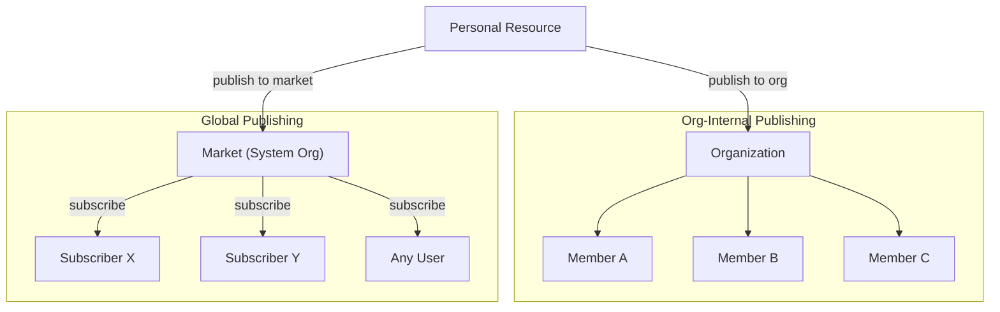
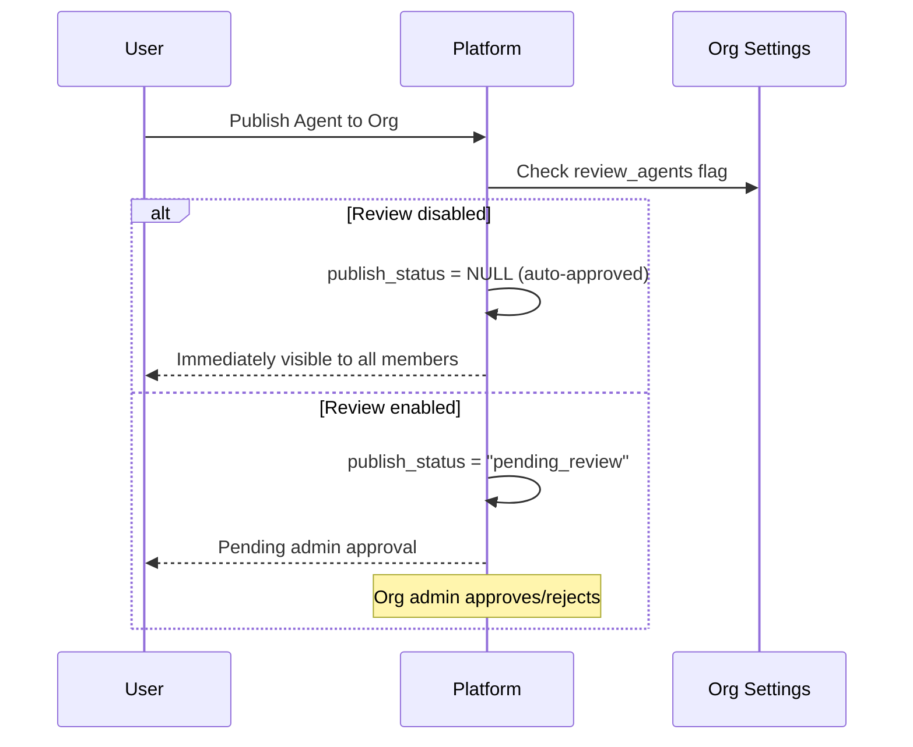
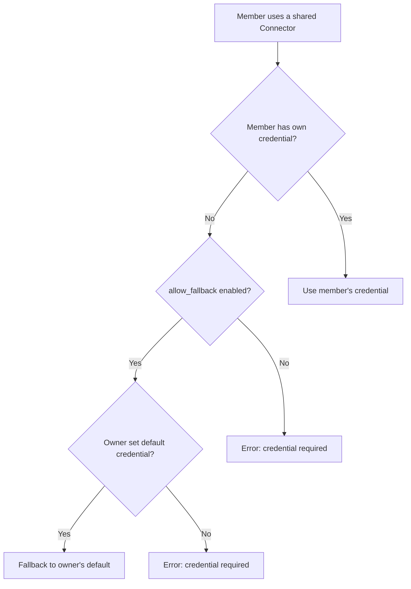
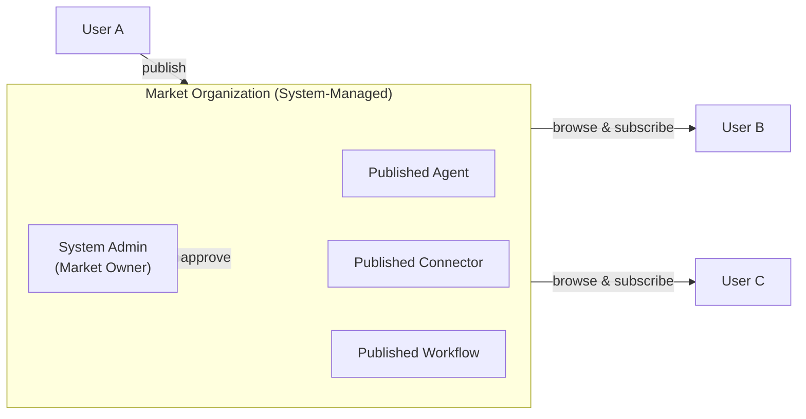
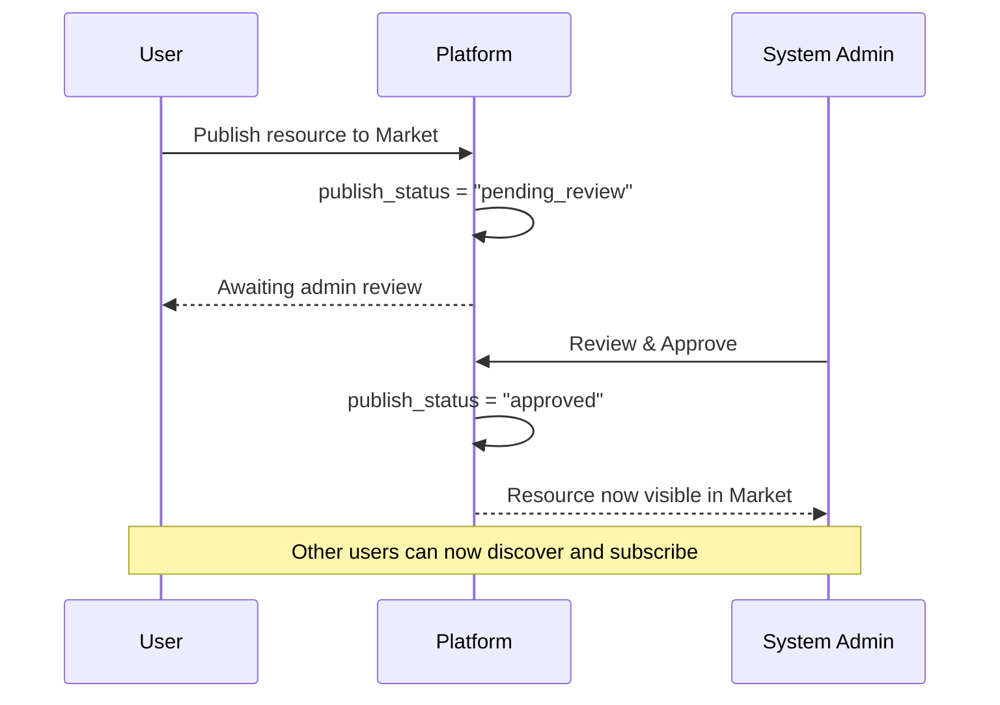
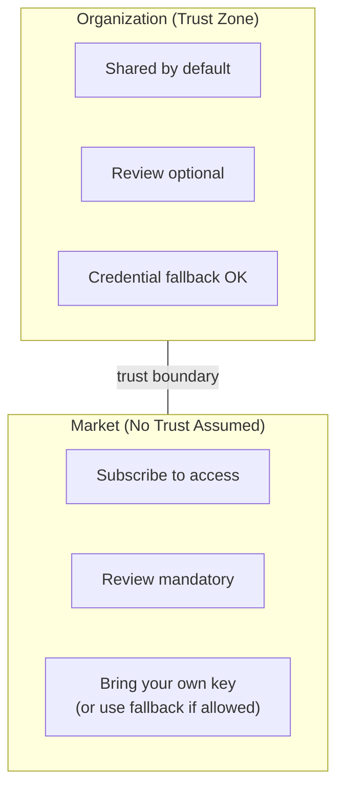

## Overview

FIM One uses **Organizations** as the primary unit for collaboration and resource distribution. Every resource (Agent, Connector, Knowledge Base, MCP Server, Workflow, Skill) starts as **personal** and can be published to an Organization for sharing.

There are two distinct distribution channels:



| Channel | Trust Model | Review | Access | Credential Handling |
|---|---|---|---|---|
| **Organization** | High trust (team/company) | Optional (per resource type) | Automatic for all members | Fallback to owner's credentials |
| **Market** | No trust (global community) | Always required | Must subscribe first | Fallback or bring your own key |

## Organizations

### Creating and Joining

Every user can create **unlimited** organizations and join any number of them. An organization has:

- **Owner**: the creator, with full control
- **Admins**: can manage members and review published resources
- **Members**: can view and use shared resources

### Publishing Resources

When a user publishes a resource to their organization, it appears in the corresponding resource list for all members — Agents show up in the Agents list, Connectors in the Connectors list, and so on.



**Review is optional.** Each organization has independent review toggles for every resource type (`review_agents`, `review_connectors`, `review_kbs`, `review_mcp_servers`, `review_workflows`, `review_skills`). When review is disabled, published resources are immediately available to all members — similar to a shared team drive.

<Tip>
Org owners bypass review automatically. Their published resources are always immediately available.
</Tip>

### Credential Fallback

For Connectors and MCP Servers that require credentials (API keys, database passwords, etc.), FIM One provides a **fallback mechanism**:



- **Fallback enabled** (`allow_fallback=true`, the default): members who don't provide their own credentials automatically use the owner's default credentials. This is ideal for team-shared API keys or internal services.
- **Fallback disabled** (`allow_fallback=false`): every member must configure their own credentials. This is appropriate when each user needs their own API key (e.g., per-seat SaaS licenses).

Resources that don't require credentials (e.g., a read-only public API connector, or an Agent with no auth) work immediately for all members — no configuration needed.

## Market (Global Publishing)

The **Market** is a special system-managed organization that serves as FIM One's global resource marketplace.

### How Market Works



Key characteristics:

1. **Single global instance.** There is exactly one Market organization in the system. It is created automatically during platform initialization.
2. **Everyone is a participant.** All users can browse and subscribe to Market resources. The Market is always accessible — it is the default discovery channel.
3. **Mandatory review.** Unlike regular organizations, the Market **always** requires review. Every published resource must be approved by a system administrator before it becomes visible. This review requirement is locked and cannot be changed.
4. **Subscribe to use.** Users must explicitly subscribe to a Market resource before it appears in their resource lists. This is different from org-internal sharing, where resources are automatically available to all members.

### Publishing to Market



### Subscribe and Use

After a resource is approved and listed in the Market, any user can:

1. **Browse** the Market to discover available resources
2. **Subscribe** to a resource they want to use
3. **Use** the resource — if it requires credentials and doesn't support fallback, configure their own key first

## Trust Boundary

The distinction between Organization and Market reflects a fundamental **trust boundary**:



### Within an Organization

Members of the same organization share an implicit **trust relationship**. The org owner has decided to bring these people together, so:

- Published resources are **immediately available** (unless review is explicitly enabled)
- Credential fallback means members can use the owner's shared API keys
- No subscription step required — if you're in the org, you see everything that's been shared

This mirrors how teams work in practice: you trust your teammates with shared infrastructure.

### Across the Market

The Market is **global** — anyone can publish, and anyone can subscribe. There is no pre-existing trust relationship, so:

- **Review is mandatory** to prevent low-quality or malicious resources from entering the ecosystem
- **Subscription is required** so users explicitly opt in to resources (no surprise additions to their workspace)
- **Credential handling** follows the same fallback mechanism, but users should be mindful that using a Market resource with fallback means their requests flow through the publisher's credentials

## Resource Visibility Summary

Every resource in FIM One has a `visibility` field that determines its access scope:

| Visibility | Scope | Who Can See |
|---|---|---|
| `personal` | Owner only | The user who created it |
| `org` | Organization | All members of the target org (if approved) |
| `org` + Market | Global | Anyone who subscribes (if approved by admin) |

The visibility filter logic is unified — the same query handles personal, org, and subscribed resources:

```
Visible if:
  1. You own it (any visibility), OR
  2. It's published to an org you belong to AND approved, OR
  3. You've subscribed to it from the Market
```

## Practical Scenarios

### Scenario 1: Team Sharing a Database Connector

1. Alice creates a Connector to the team's PostgreSQL database
2. Alice publishes it to her team's org (review disabled for connectors)
3. Bob and Carol, as org members, immediately see it in their Connectors list
4. The connector uses Alice's database credentials as fallback — Bob and Carol don't need to configure anything
5. If Dave (external contractor) needs his own read-only credentials, he can override with his own

### Scenario 2: Publishing an Agent to the Market

1. Alice builds a "Contract Analyzer" Agent and publishes it to the Market
2. System admin reviews and approves it
3. The Agent appears in the Market browse page
4. Bob discovers it, clicks "Subscribe", and it appears in his Agents list
5. The Agent references a Connector that requires an API key with `allow_fallback=false` — Bob must configure his own key before using it

### Scenario 3: Organization with Strict Review

1. A compliance-focused company enables `review_agents=true` and `review_connectors=true` on their org
2. When an employee publishes a new Agent, it enters "pending_review" state
3. An org admin reviews the Agent configuration and approves it
4. Only then does it become available to other members
5. If the publisher later edits the approved Agent, it automatically reverts to "pending_review" for re-approval
