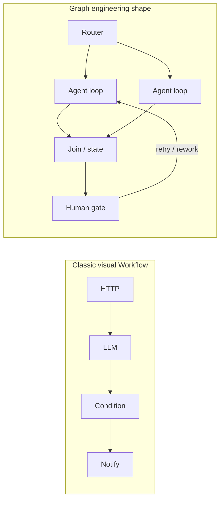
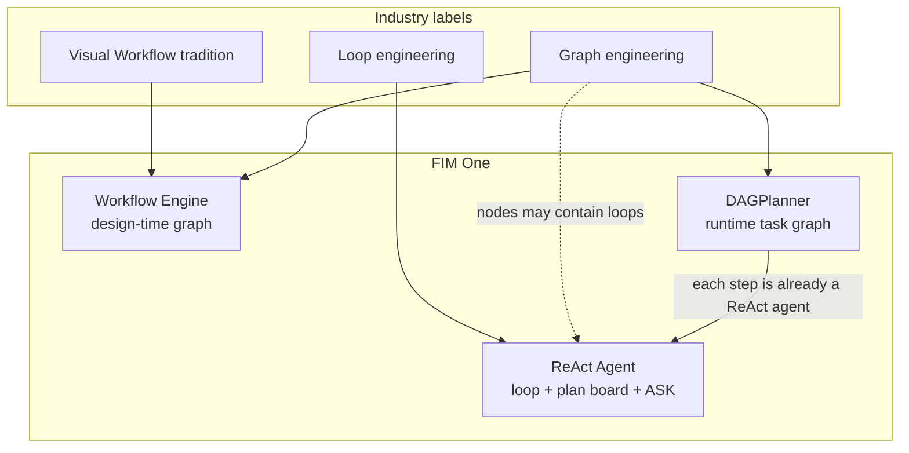
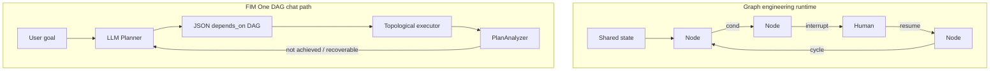
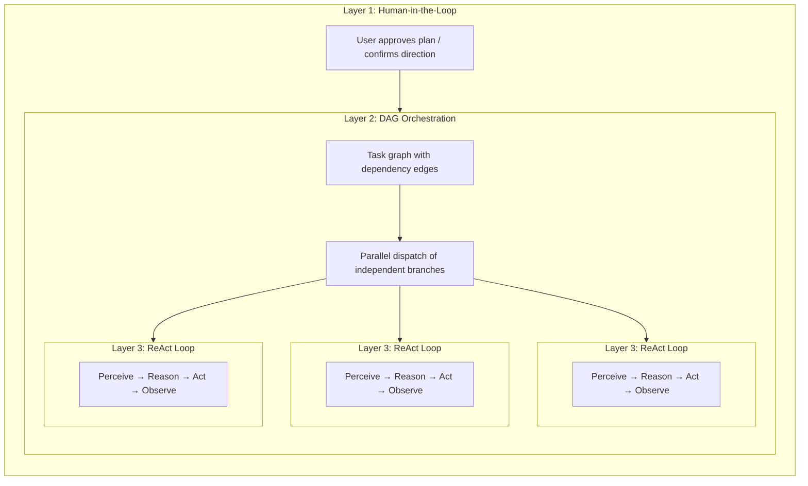

## Graph engineering (2026) and FIM One

Industry discussion often frames a shift from **loop engineering** (a single agent repeatedly thinking and acting) to **graph engineering** (making multi-node topology an explicit engineering object). The label is new; the practice is not. LangGraph-style systems and multi-agent orgs have used graphs for years. What matters for FIM One is which **kind** of graph people mean, and how that maps onto our three execution layers.

### What graph engineering usually means

| Layer (common framing) | Concern |
|---|---|
| **Harness** | Tools, sandbox, auth, logging, quotas around the model |
| **Loop** | One agent's think → act → observe cycle |
| **Graph** | How **nodes** connect: branches, joins, cycles, human checkpoints, shared state |

Consensus across that framing: **graph does not replace loop**. Graph designs **relationships between processes**; each agentic node may still run a full loop.

"Graph" is overloaded in practice. Three usages get mixed:

| Usage | Example | Role |
|---|---|---|
| **Control-flow graph** | LangGraph `StateGraph`: conditional edges, retries, interrupt/resume | State machine for who runs next |
| **Task dependency graph** | Claude Code Tasks `blockedBy`; FIM One `depends_on` | Schedule and parallelize work |
| **Knowledge graph** | Entities and typed relations | Retrieval / memory (not orchestration) |

This page is about the first two (orchestration).

### Not "Dify Workflow with a new name"

Dify-style **visual workflows** and graph engineering share a bloodline (**explicit topology**) but they are not the same product.

| | Classic visual Workflow (e.g. Dify) | Graph engineering (2026 usage) |
|---|---|---|
| **Primary artifact** | Canvas / blueprint the implementer draws | Topology as a versioned system design (code or config) |
| **Nodes** | Fixed capability blocks (LLM, HTTP, KB, condition…) | **Heterogeneous**: functions, routers, **full agents**, humans, joins |
| **Where intelligence lives** | Mostly inside isolated LLM nodes; the graph is a pipe | Often **inside nodes** (each may be a loop); the graph organizes roles |
| **Edges** | Pipeline success/fail and branches | Control-flow **and** state transitions, including **controlled cycles** |
| **Human-in-the-loop** | Forms / approvals as add-ons | Interrupt / resume as first-class primitives |
| **Relation to loop** | Often sold as "Workflow **vs** Agent" | Explicitly **Graph over Loop** |

Short form: classic Workflow is a **deterministic (or semi-deterministic) pipe** with occasional LLM steps. Graph engineering is **multi-node system topology**, where critical posts can still be autonomous agents.

### How the industry map sits on FIM One

FIM One already spans the control spectrum; chat "Planner mode" is only one slice.

| Industry idea | Closest FIM One piece | Fit |
|---|---|---|
| Classic visual Workflow | **Workflow Engine** (design-time blueprint) | Strong |
| Control-flow graph + HITL + durable state | Workflow human steps + confirmation gates; partial on chat DAG | Medium |
| Task dependency graph + parallel schedule | **DAGPlanner** (`depends_on`, topological fan-out) | Strong on scheduling; weaker on mid-graph HITL |
| Single agent loop + checklist memory | **ReAct** (`update_plan`, tools, `ask_user_question`) | Strong |
| Runtime LLM-drawn plan every turn | **DAGPlanner** (not Dify; not LangGraph design-time DSL) | Distinct product |

### Graph engineering vs FIM One DAG (chat Planner)

Same family (explicit multi-step topology). Different species.

| Dimension | Graph engineering (typical) | FIM One DAG (chat) |
|---|---|---|
| **Who draws the graph** | Developer / implementer (stable topology) | **LLM at runtime** (new graph per goal) |
| **Edge meaning** | Often **control flow** (where next, including cycles) | Mostly **dependency / data** (`depends_on`, acyclic run) |
| **Correction** | Edge-level retry, human node, resume same graph | **PlanAnalyzer → replan** (often a **new** graph) |
| **Node depth** | Node may be a full agent loop | **Already full ReAct per step**: `DAGExecutor` runs `agent.run()` with a multi-iteration tool loop (default cap from `DAG_STEP_MAX_ITERATIONS`, commonly 15). Default model is registry **general** (not infrastructure fast); `model_hint` can escalate to reasoning or demote to fast. Tool cache, step/citation verification, and source evidence ship with each step. Step agents set `enable_plan_tool=False` (no `update_plan` board inside a step) because the unit of work is already a focused sub-task. |
| **Shared state** | First-class typed state + checkpoint narrative | Step results + memory/compact; step checkpoints exist |
| **Mid-run questions** | Interrupt as a product feature | Confirmation gates exist; **`ask_user_question` is ReAct-only** (chat outer loop), not a first-class DAG wait edge |
| **Product entry** | Framework or backend org chart | User-visible mode next to ReAct |

**Implication:** industry heat around graph engineering **validates keeping a graph/scheduling engine**. It does **not** require a chat default that forces users to pick "Planner" for every turn. Most tasks still want a strong loop; graphs earn their keep on parallel branches, fixed compliance paths, and multi-role orchestration.

### What FIM One can learn (empower ReAct, DAG, Workflow)

Concrete takeaways, not slogans. Ordered by leverage.

| # | Graph engineering idea | Apply to | Direction |
|---|---|---|---|
| 1 | **Graph over loop, not instead of** | Product + Auto routing | Default UX stays **ReAct** (loop + `update_plan` + `ask_user_question`). Use DAG/Workflow when topology earns cost. |
| 2 | **Heterogeneous deep nodes** | DAG | **Already the status quo.** Each step is a full ReAct agent (`agent.run`, multi-iteration tools, general-or-better model by default), not a one-shot LLM call. Remaining knobs are optional (e.g. plan board on long steps), not a structural gap. |
| 3 | **Interrupt / resume as edges** | DAG + ReAct | Mid-run clarification belongs in the **outer** loop or as a first-class wait state. Avoid fake DAG steps that "ask the user" in text and then replan as "goal not achieved". |
| 4 | **Controlled cycles vs whole-graph replan** | DAG | Prefer step-local retry / partial carryover (already partly true for completed steps) over dumping all step text as a failed final answer. |
| 5 | **Typed shared state along edges** | DAG + Workflow | Stronger contracts for step I/O (schema, deliverables) reduce Analyzer false confidence and answer/source drift. |
| 6 | **Topology as a versioned asset** | Workflow | Keep human-authored graphs for audit; do not expect runtime LLM DAGs to replace compliance blueprints. |
| 7 | **Honest "most tasks never need a graph"** | Auto + docs | Route clarify-and-choose, short Q&A, and exploratory work to ReAct; reserve DAG for decomposable parallel work. |

**Anti-patterns to avoid when "doing graph":**

- Using a **dependency graph** to simulate a **human state machine** (multi-step "wait for answers" with no wait primitive).
- Equating ReAct **`update_plan`** (checklist memory) with graph engineering (scheduling topology).
- Shipping graph heat as a second chat personality instead of as **engine composition** (loop outside, schedule inside when needed).
- Describing FIM One DAG steps as "shallow LLM calls": that understates the engine and misleads product decisions.

## Five kinds of "planning" in the AI tooling landscape

The word "planning" is overloaded. At least five distinct approaches exist today, and they solve different problems:

| Approach | Plan format | Execution | Approval | Core value |
|---|---|---|---|---|
| **Implicit model planning** | Internal chain-of-thought | Single inference pass | None | The model thinks through steps on its own |
| **Claude Code plan mode** | Markdown document | Serial | Human reviews before execution | Align on approach before touching code |
| **Claude Code Teams** | Task list with dependency edges | **Concurrent** (multi-agent) | Human approves plan, then autonomous | Dynamic agent pool + parallel execution |
| **Kiro spec-driven dev** | Structured spec (requirements + design + tasks) | Serial | Human reviews spec | Traceable requirements, acceptance criteria |
| **FIM One DAG** | JSON dependency graph | **Concurrent** (single orchestrator) | Automatic (PlanAnalyzer) | Parallel execution + runtime scheduling |

The first two are **design-time** planning — they produce a plan *before* work begins, and a human (or the model itself) follows it step by step. The last three introduce **runtime** planning — execution graphs are generated and scheduled programmatically, with independent branches running in parallel. The difference is *who* executes: Claude Code Teams spawns autonomous agents; FIM One DAG dispatches steps within a single orchestrator.

These approaches are not competitors; they are complementary layers. A Kiro-style spec can define *what* to build, while a FIM One DAG can schedule *how* to execute the subtasks concurrently. Claude Code's plan mode ensures a human agrees with the approach; FIM One's PlanAnalyzer verifies the outcome automatically.

## Three-Layer Nesting: The Full-Power Architecture

Both Claude Code Teams and FIM One DAG, at full capacity, exhibit a **three-layer nested architecture**:

- **Layer 1 — Human gate**: User reviews the plan and approves before execution begins.
- **Layer 2 — DAG orchestration**: The approved plan is decomposed into tasks with dependency edges. Independent tasks run in parallel; downstream tasks wait for their blockers to resolve.
- **Layer 3 — ReAct inner loop**: Each task is executed by an agent running a full ReAct cycle (Perceive → Reason → Act → Observe), capable of multi-step reasoning, tool use, and autonomous retry.

The key insight: **Claude Code Teams and FIM One DAG implement the same three layers, just with different Layer 2 mechanics** — message-passing vs dependency-edge resolution.

## Full-Power Runtime: FIM One vs Claude Code Teams

Both are genuine Agents — the core loop is identical: **Perceive → Reason → Act → Feedback**. The difference lies in how they orchestrate parallel work at full capacity.

| Dimension | Claude Code Teams | FIM One DAG |
|---|---|---|
| **Parallel model** | Leader spawns SubAgents, assigns tasks via messages | Topological sort auto-parallelizes independent steps |
| **Task graph** | TaskList with `blockedBy` / `blocks` edges (dynamic DAG) | Static JSON DAG with `depends_on` edges |
| **Coordination** | Explicit message passing (SendMessage / Broadcast) | Implicit dependency edges — no messages, just data flow |
| **Agent lifecycle** | Dynamic pool — agents spawned on demand, shut down when done | Per-step **ReAct agents** (fresh agent per step via `_resolve_agent`); each step runs a full multi-iteration tool loop |
| **Feedback & correction** | Each SubAgent retries autonomously; Leader re-assigns on failure | PlanAnalyzer evaluates outcomes → Re-Planning loop (up to 3 rounds); completed steps can carry into the next plan |
| **Human involvement** | Plan mode approval, then autonomous execution | Fully automatic — PlanAnalyzer decides pass/replan (chat-level ASK is ReAct-only) |
| **Context management** | Each SubAgent gets isolated context window (no cross-contamination) | Shared DbMemory + LLM Compact across the turn; each step agent still sees its task + dependency results, not a full peer transcript |
| **Token economics** | `N agents × per-agent tokens` — time↓ tokens↑ (multiplicative cost) | Parallel branches cost more than serial ReAct, but shared memory and step caps usually stay below multi-agent team spend |
| **Scaling pattern** | Add more SubAgents (horizontal, message-coupled) | Add more DAG branches (horizontal, dependency-coupled) |
| **Best suited for** | Diverse, loosely-related tasks (research + code + test) | Structured workflows with clear data dependencies |

### Real-World Benchmark: v0.5 RAG System

Claude Code Teams built FIM One's entire v0.5 RAG subsystem in a single session:

- **8 phases**: Embedding → Reranker → Loaders → Chunking → VectorStore → Retrieval → KB Backend → Frontend + Docs
- **46 tests** passing, frontend build clean
- **Wall time**: ~5 minutes
- **Token cost**: ~100k tokens per agent task × 8+ tasks ≈ 800k+ total tokens
- **Dependency edges**: Phase 5 depends on Phase 4 + 1b; Phase 6 depends on Phase 5 + 2 + 3 — a genuine DAG

This demonstrates the core trade-off: **time parallelism at the cost of token multiplication**. Claude Code Teams trades compute dollars for developer hours.

### Converging, Not Competing

The boundary between "team collaboration" and "pipeline scheduling" is blurring:

- **Claude Code Teams' `blockedBy`/`blocks` IS a DAG** — tasks have explicit dependency edges, and the leader dispatches newly-unblocked tasks as predecessors complete. This is topological scheduling with extra steps (messages).
- **FIM One DAG steps are already full ReAct agents** — Layer 3 is not aspirational. Each step runs `agent.run()` with tools and multi-iteration loops; differences vs a top-level ReAct chat turn are deliberate (no per-step plan board, no chat-level `ask_user_question` wait, model chosen by `model_hint` / general default).

**Takeaway:** Same Agent essence, converging parallel philosophies. Claude Code follows a **team collaboration** model — a Leader delegates to Workers who communicate via messages. FIM One follows a **pipeline scheduling** model — a DAG Executor dispatches **ReAct steps** based on dependency resolution. In practice, both implement dependency-driven parallel execution; the difference is coordination overhead (messages vs edges), isolation (peer agents vs task + dependency results), and token economics. The product gap is less "make nodes into agents" and more **when to schedule a graph vs stay in one chat loop**, plus **human wait edges** where the graph cannot pause.

## Structured Output Degradation

All structured LLM call sites in the DAG pipeline (Planner, Analyzer, Tool Selection) use a unified `structured_llm_call()` utility that implements a 3-level degradation chain:

| Level | Condition | How it works |
|---|---|---|
| **Native FC** | `llm.abilities["tool_call"]` | Forces a virtual tool call; extracts from `tool_calls[0].arguments` |
| **JSON Mode** | `llm.abilities["json_mode"]` | Sets `response_format={"type":"json_object"}`; parses with `extract_json()` |
| **Plain text** | always available | Parses free-form content with `extract_json()`, then optional `regex_fallback()` |

Each text-based level retries once with a reformat prompt before falling to the next. The result is a `StructuredCallResult` containing the parsed value, which extraction level succeeded, and accumulated token usage.

This design means the same prompt works reliably across GPT-4 (native FC), Claude (JSON mode), and local models (plain text), with consistent error handling and retry logic in one place instead of scattered across four call sites.

## Three Execution Layers: Control Spectrum

The five planning approaches above describe the landscape. Within FIM One itself, three execution layers offer a **control spectrum** from full human control to full AI autonomy. Relative to graph engineering: **Workflow** is the design-time graph product; **DAGPlanner** is a runtime task graph; **ReAct** is loop engineering (with optional plan-board memory, not a schedule graph).

| Layer | Graph defined by | Graph exists when? | Graph-engineering role | Best for |
|---|---|---|---|---|
| **Workflow Engine** | User (visual canvas / JSON blueprint) | Design time | Closest to classic visual Workflow + durable process topology | Deterministic processes, compliance/audit trails, cron-scheduled automation |
| **DAGPlanner** | LLM (auto-decomposes the goal) | Runtime | Task dependency graph + parallel schedule + outcome analysis | Decomposable multi-step work with clear sub-task boundaries |
| **ReAct Agent** | None (iterative loop) | Never as a schedule graph | Loop layer; nodes in a larger graph can be ReAct agents | Exploratory, conversational, clarify-then-act, iterative refinement |

The design principle: **give users exactly as much control as they want**.

- Need to prove every loan approval passes five specific steps? → Workflow.
- Need to research three topics in parallel then synthesize? → DAG.
- Need to draft, refine, or ask structured questions mid-run? → ReAct.
- Not sure? → `execution_mode: "auto"` classifies the query and routes to DAG or ReAct at runtime (prefer ReAct when the goal is primarily clarification or short exploration).

This layering is what separates FIM One from single-paradigm tools:

- **Dify** emphasizes the Workflow layer (static or semi-static visual graphs).
- **LangGraph** emphasizes a code-level control-flow graph DSL (developer-defined topology, dynamic routing, checkpointing). Structurally related to visual workflows, expressed as software.
- **Manus-class agents** emphasize the Agent/loop layer (autonomous execution, little user-defined structure).

FIM One covers all three layers, plus automatic routing between chat engines. The progression **user-defined graph → LLM-generated task graph → no schedule graph** matches a broader industry honesty: as models improve, **explicit topology becomes optional for most turns**, not mandatory UI. Graph engineering heat is a reason to **invest in engines and composition**, not to force every chat through a planner.

### Related docs

- [ReAct Engine](/architecture/react-engine) — loop, tools, plan board, clarifying questions
- [DAG Engine](/architecture/dag-engine) — planner, executor, analyzer, replan
- [Competitive Landscape](/strategy/competitive-landscape) — Dify / Manus / Coze positioning
