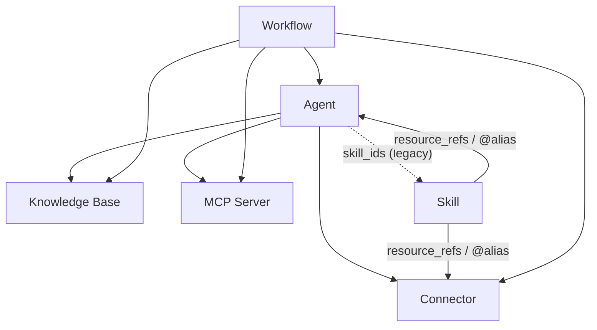

This page is the single reference for **sharing permissions** and **credential
flow**. The shareable resource types are **Agents, Connectors, and MCP
servers** (plus **Skills** and **Workflows** when those optional modules are
enabled). Use it to reason about what happens when you share a resource that is
itself built on top of other resources.

<Note>
**Knowledge bases are not shareable.** A KB reaches other people only by being
bound to a shared Agent, which delegates the owner's content at run time (see
"How access flows through bound resources"). There is no publish-KB action.
</Note>

## The two questions

Every sharing decision answers two independent questions:

1. **Visibility** — *can the other person see/use this resource at all?*
2. **Credentials** — *whose secret (API key, DB password, server env) does it
   run with?*

Visibility is about the resource; credentials are a separate, per-user concern
that only Connectors and MCP servers carry. Keep them separate in your head —
most confusion comes from conflating "I can see it" with "I can use its owner's
key".

## Visibility: own + subscribed

A resource is visible to you only if **you own it** or **you have an explicit
subscription** to it. There is no implicit "everyone in my org can see it"
anymore — org sharing is delivered through subscriptions.

| Share scope | What it means | How others gain access |
| --- | --- | --- |
| **Personal** (default) | Only the owner can see it. | — |
| **Organization** | Published to an org. | Org members **subscribe** from the Market (or are auto-subscribed on join). |
| **Global / Market** | Published to the public Market. | Anyone **subscribes** from the Market. |

The same rule governs everywhere a resource is used — chat tool assembly, binding
to an agent, and a workflow step all resolve **own + subscribed**. So a connector
you subscribed to can be bound to an agent and called from a workflow; one you
can neither see nor subscribe to is refused in all three places.

<Note>
Subscriptions are scoped: leaving (or being removed from) an organization
revokes the subscriptions you only had through it, and deletes the per-user
credentials you saved for those resources.
</Note>

## Credentials & "Allow fallback"

Only **Connectors** and **MCP servers** hold credentials. Each one has an
**Allow fallback** switch that decides whether subscribers may borrow the
owner's credential:

| State | A subscriber **with** their own credential | A subscriber **without** their own credential | The owner |
| --- | --- | --- | --- |
| **Allow fallback OFF** *(default)* | Uses their own credential. | **No access** — the tool is hidden and the UI prompts them to configure their own credential. | Always uses their own. |
| **Allow fallback ON** | Uses their own credential. | Falls back to the **owner's** credential (and any usage/billing lands on the owner). | Always uses their own. |

Key rules:

- **Off is the default.** Sharing your token is opt-in. A newly created connector
  or MCP server does not share the owner's credential, and existing ones were
  migrated to off.
- **The owner is always exempt.** "Allow fallback" only governs *other* users;
  you can always use your own connector with your own credential.
- **No silent failure.** When fallback is off and a user has no credential, the
  tool is **removed from the toolset** rather than offered and then failing at
  call time. Every surface (chat, the **Playground**, workflow steps) must show a
  "configure your own credentials" prompt instead of a broken tool.

## How access flows through bound resources

Resources compose. Sharing one resource implicitly exposes the resources bound
underneath it — but **credentials do not automatically flow with them**.

| Container | Can reference | How |
| --- | --- | --- |
| **Agent** | Knowledge Bases, Connectors, MCP servers | `kb_ids` / `connector_ids` / `mcp_server_ids` |
| **Agent** | Skills | `skill_ids` *(legacy — prefer Skill→Agent)* |
| **Skill** | Connectors, Agents, … | `resource_refs` (the `@alias` mechanism) |
| **Workflow** | Agents, Knowledge Bases, Connectors, MCP servers | per-node `agent_id` / `kb_id(s)` / `connector_id` / `mcp_server_id` |

When you share the container, the references travel with it as a **graph of ids**
— a shared workflow or agent carries no embedded secrets. At run time, each
referenced resource re-checks the *runner's* access:

- **Knowledge Bases** have no per-user credential, so a KB bound to a shared
  agent **delegates its content**: whoever runs the agent reads the KB owner's
  data (the agent needs its KB to function). The delegation is gated by the
  **agent owner's** visibility — if the agent owner loses access to a bound KB
  (for example after leaving the organization it was shared through), that KB
  drops out of the agent instead of continuing to be read. Ad-hoc KB search
  outside a bound agent is access-checked against the caller (own + subscribed).
- **Connectors / MCP servers** carry credentials, so they delegate **only when
  Allow fallback is on** (see below).

## Worked scenarios

You own an Agent that binds a **personal** connector (you have not shared the
connector itself). You share the **Agent** to your org or globally. Someone else
runs it:

| Scenario | Connector's "Allow fallback" | What the other user gets |
| --- | --- | --- |
| **3a** | **ON** | The connector tool is available and runs with **your** credential — the other user can use it. Usage bills to you. |
| **3b** | **OFF** *(default)* | The connector tool is **hidden** for that user. The rest of the agent still works; the UI prompts them to add **their own** credential for that connector, after which the tool reappears and runs with their key. |

In other words: **sharing the agent does not share the connector's secret.** The
connector's own "Allow fallback" setting is the single switch that decides
whether the credential penetrates through the binding. The same holds for a
connector or MCP server referenced from a Skill or a Workflow step.

<Note>
This is why the recommended pattern for a connector you intend to share is:
leave **Allow fallback off**, and have each user bind their own credential. Turn
it on only when you deliberately want to lend your key (and absorb the usage) —
for example a metered API you're comfortable paying for on others' behalf.
</Note>
