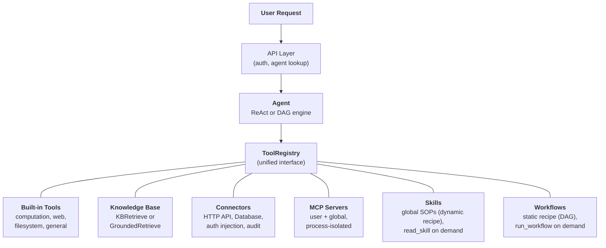
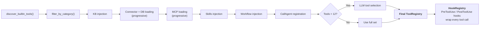
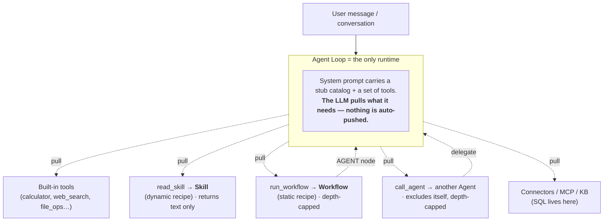

## The unified tool abstraction

The central design insight in FIM One is that **everything the agent can do is a tool**. A calculator, a knowledge base query, an ERP API call, and a third-party MCP server all implement the same `Tool` protocol: `name`, `description`, `parameters_schema`, `category`, and `run()`. The agent does not know or care whether it is calling a local Python function, querying a vector database, proxying into a legacy system, or invoking a community MCP server. It sees a flat list of callable tools in a `ToolRegistry`.

This is a deliberate architectural choice, not an accidental simplification. It means adding a new capability source never requires changing the agent, the execution engines, or the context management layer. You register tools; the agent uses them.

Six capability sources converge into one registry. The agent draws from all of them equally. The last two are a matched pair: a **Skill** is a *dynamic recipe* (an SOP the LLM interprets step by step), and a **Workflow** is a *static recipe* (a deterministic graph that runs the same way every time). Both are pulled through a tool — `read_skill` and `run_workflow` respectively — and neither contains the other; they are peers consumed by the same runtime.

## Six capability sources

### Built-in Tools

Auto-discovered at startup via `discover_builtin_tools()`. Drop a `BaseTool` subclass into `core/tool/builtin/`, and it registers without any configuration. Categories include computation (`calculator`, `python_exec`), web (`web_search`, `web_fetch`), filesystem (`file_ops`), and general (`email_send`, `json_transform`, `template_render`, `text_utils`). These are the agent's native abilities -- always available, zero setup.

### Knowledge Base

Conditional. When an agent has bound `kb_ids`, the generic `kb_retrieve` tool is swapped for a specialized retrieval tool. In **simple mode**, `KBRetrieveTool` performs basic RAG retrieval. In **grounding mode**, `GroundedRetrieveTool` runs a 5-stage pipeline: multi-KB retrieve, citation extraction, alignment scoring, conflict detection, and confidence computation. The Knowledge Base is not a separate subsystem sitting beside the agent -- it enters the agent as a specialized tool, subject to the same `Tool` protocol as everything else.

### Connector

`ConnectorToolAdapter` wraps enterprise system actions as tools. Each action becomes a tool named `{connector}__{action}`, categorized as `connector`. The adapter adds HTTP proxy with auth injection (bearer, API key, basic), operation-level access control (read/write/admin), response truncation, and audit logging. For direct database access, `DatabaseToolAdapter` provides schema-aware SQL execution with optional read-only enforcement. Connectors are the bridge between AI and legacy systems -- the core differentiator. See [Connector Architecture](/architecture/connector-architecture) for the full design.

### MCP

External MCP servers provide third-party tools via the standard protocol. Each server runs in its own process (stdio or HTTP transport), fully isolated from the platform. Tools are adapted into the `Tool` protocol and registered under category `mcp`. Admins can provision **global MCP servers** that load for all users automatically. MCP is the ecosystem play -- any MCP-compatible server works without custom integration.

### Skills

Skills are reusable Standard Operating Procedures (SOPs) -- company policies, handling procedures, step-by-step workflows -- that apply globally regardless of which Agent is selected. Unlike Connectors and Knowledge Bases (which can be scoped to specific Agents), Skills are always loaded for every user based on visibility (personal, org-shared, or Market-subscribed).

Skills support two injection modes -- **progressive** (default) and **inline** -- controlled by `SKILL_TOOL_MODE`. In progressive mode, compact stubs appear in the system prompt and the LLM calls `read_skill(name)` on demand. This is part of the broader [Progressive Disclosure](/architecture/progressive-disclosure) architecture that applies the same stub-first, detail-on-request pattern across Skills, Connectors, Databases, and MCP Servers.

For a deeper look at why Skills are global (not Agent-bound) and how they interact with the dual-mode resource discovery, see [Agent & Resource Discovery](/architecture/agent-discovery).

### Workflows

A Workflow is the **static recipe** to a Skill's dynamic one: a deterministic DAG an agent reaches for when a sub-task must run identically every time and leave an audit trail (scheduled reconciliations, multi-step approval-free pipelines). Like Skills, runnable Workflows are loaded globally per user by visibility — independent of agent selection — and exposed through a single `run_workflow(name, inputs)` tool, with each workflow's input fields advertised as a compact system-prompt stub. The LLM pulls one by name when a task maps onto it.

Only Workflows that are **active** and **free of human-approval (`HUMAN_INTERVENTION`) nodes** are inline-runnable — a gate that blocks for minutes or hours cannot sit inside an agent turn, so those Workflows remain trigger-only from the Workflows page. Inline runs execute as the workflow owner (subscribed Workflows use the publisher's bound credentials), persist a `WorkflowRun` for the audit trail, and are protected by a re-entrancy guard plus a nesting-depth cap so a Workflow's `AGENT` node can never start an unbounded call cycle.

## Per-request tool assembly

Every chat request assembles a fresh tool set through a filtering pipeline in `_resolve_tools()`. This is not a static configuration -- it is computed per request based on the agent's settings, the user's identity, and the available connectors and MCP servers.

The eight steps:

1. **Base discovery.** `discover_builtin_tools()` loads all built-in tools, scoped to the conversation's sandbox.
2. **Agent category filter.** `filter_by_category(*agent.tool_categories)` restricts to only the categories the agent is allowed to use.
3. **KB injection.** If the agent has `kb_ids`, the generic retrieval tool is replaced with `KBRetrieveTool` or `GroundedRetrieveTool` based on retrieval mode.
4. **Connector loading.** In agent-constrained mode, only the agent's bound connectors are loaded. In auto-discovery mode (no agent selected), all connectors visible to the user are loaded. Both API connectors (`ConnectorMetaTool`) and database connectors (`DatabaseMetaTool`) use [progressive disclosure](/architecture/progressive-disclosure) by default -- lightweight stubs in the system prompt, full schemas loaded on demand.
5. **MCP loading.** The user's personal MCP servers plus admin-provisioned global MCP servers are loaded and connected. In progressive mode (default), a single `MCPServerMetaTool` consolidates all servers; the LLM calls `discover` and `call` subcommands on demand. See [Progressive Disclosure](/architecture/progressive-disclosure).
6. **Skills + Workflows injection.** All active Skills visible to the user are loaded -- regardless of agent selection. In progressive mode, `ReadSkillTool` is registered with compact stubs in the system prompt; in inline mode, full Skill content is embedded directly. The same step loads all active, inline-runnable Workflows and registers `RunWorkflowTool` with one stub per workflow (name, description, input fields). Workflows carrying a human-approval node are skipped here.
7. **CallAgent registration (Auto mode only).** When no specific Agent is selected, all active, visible Agents are assembled into a catalog and exposed via `CallAgentTool`, enabling the LLM to delegate tasks to specialist agents. Delegated agents receive a full `ToolRegistry` built from their own configuration but exclude `call_agent` to prevent infinite recursion. When a specific Agent is selected, `CallAgentTool` is not registered — agents are specialized and do not delegate to other agents. This prevents marketplace agents from accessing other agents' private prompts.
8. **Runtime selection.** If the total tool count exceeds 12, a lightweight LLM call picks the most relevant subset (up to 6) for this specific query. A `request_tools` meta-tool is automatically registered, allowing the LLM to dynamically load additional tools mid-conversation if the initial selection missed a needed tool. Selection failure is non-fatal -- the agent falls back to the full set. See [Progressive Disclosure](/architecture/progressive-disclosure).
9. **Hook registration.** The agent's declared hooks (from `model_config_json.hooks`) are instantiated and attached to a `HookRegistry`. Each chosen tool call will be wrapped: `PreToolUse` hooks can block or rewrite args before execution; `PostToolUse` hooks can rewrite the observation before it returns to the LLM. Hooks run **outside the LLM loop** and cannot be bypassed by agent instructions — see [Hook System](/architecture/hook-system).

The result: the agent sees exactly the tools it needs, no more. A simple agent with no connectors and no KB might see 5 tools. A Hub agent connected to 3 enterprise systems with a grounded knowledge base and 2 MCP servers might see 30 -- but after selection, only the 6 most relevant make it into the context.

## When to use what

| Need | Use | Why |
|------|-----|-----|
| General computation, code execution, text transforms | Built-in Tool | Always available, no config needed |
| Enterprise system integration (ERP, CRM, OA) | Connector | Auth governance, audit trail, operation-level access control |
| Knowledge retrieval with citations and evidence | Knowledge Base | RAG pipeline, grounded generation, confidence scoring |
| Third-party tool ecosystem | MCP | Standard protocol, process isolation, community servers |
| Organizational policies, SOPs, handling procedures | Skill (dynamic recipe) | Global by default, progressive loading, visibility-scoped |
| A deterministic, repeatable multi-step process invoked mid-conversation | Workflow (static recipe) | Same output every run, audit trail, runs as owner; human-gated ones stay trigger-only |
| Delegating tasks to specialist agents | CallAgent | Semantic agent routing, full tool inheritance, parallel execution |
| Direct database access | Database Connector | Schema-aware SQL, optional read-only enforcement |
| Custom internal tooling | MCP or Built-in | MCP for process isolation; built-in for tight integration |

The categories are not mutually exclusive. A single agent can use all five capability sources in one conversation -- loading a Skill for the complaint handling SOP, querying a knowledge base for policy documents, calling a connector to check the ERP, delegating analysis to a specialist agent (in Auto mode), and using a built-in tool to format the results.

## Execution engines are orthogonal

The tool system and execution engines are independent concerns. The LLM-driven engines (ReAct and DAG) consume tools from the same `ToolRegistry`. The choice of engine affects how tools are orchestrated, not which tools are available.

**ReAct** is an iterative tool loop. The agent reasons, picks a tool, observes the result, and repeats until done. It excels at exploratory, conversational tasks where the next step depends on the previous result. The loop runs up to 50 iterations with per-iteration context management via ContextGuard. See [ReAct Engine](/architecture/react-engine) for implementation details.

**DAG** decomposes a goal into 2-6 parallel steps. Each step runs an independent ReAct agent. A PlanAnalyzer evaluates whether the goal was achieved; if not, the pipeline re-plans autonomously (up to 3 rounds). DAG excels at tasks with clear subtasks that can run concurrently -- "search three sources and compare results" finishes in the time of one search, not three. See [DAG Engine](/architecture/dag-engine) for the full pipeline.

The two engines share infrastructure: `structured_llm_call` for reliable structured output, `ContextGuard` for token budget enforcement, and the `ToolRegistry` for tool resolution. Adding a new tool requires zero changes to either engine. Adding a new engine (should one ever be needed) requires zero changes to the tool system.

Both engines also support **agent delegation** via `CallAgentTool` when in Auto mode (no agent selected). In native function-calling mode, the LLM can invoke multiple `call_agent` calls in a single turn, which execute concurrently via `asyncio.gather`. Each delegated agent receives its own `ToolRegistry` and runs as a full execution unit. For the detailed design of agent discovery, Skills as global SOPs, and agent delegation, see [Agent & Resource Discovery](/architecture/agent-discovery).

### Workflow Engine — the third paradigm

Alongside the LLM-driven ReAct and DAG engines, FIM One includes a **Workflow Engine** — a visual DAG editor with 9 core node types (Start, End, LLM, Condition Branch, Agent, Knowledge Retrieval, Connector, MCP, Human Intervention) for fixed-process automation. Use Agents for flexible, exploratory tasks; use Workflows for deterministic, repeatable processes. See [Execution Modes](/concepts/execution-modes) for details.

The two compose **in both directions**, but each direction routes through the single runtime — the agent loop — never through a second execution engine:

- **Workflow → Agent.** A Workflow's `AGENT` node runs an agent as one deterministic step.
- **Agent → Workflow.** An agent (or a Skill it is following) pulls `run_workflow` to delegate a sub-task that must run deterministically.

This is the resolution to the obvious cycle worry: only the **agent loop is a runtime**. Skills and Workflows are inert recipes it loads; they never execute each other. "A Skill calling a Workflow" physically means the agent, while following the Skill's SOP, calls `run_workflow`. Every invocation passes through the agent, so the call graph is a **star**, not a mesh — and the back-edges are bounded (`read_skill` only returns text; `call_agent` and `run_workflow` carry depth caps and a re-entrancy guard).

Two reads of the same picture: **tools are pulled, not pushed** (a Skill or Workflow the LLM never selects simply never fires — which is why dynamic capabilities can feel invisible until a query matches one), and **Skills and Workflows are peers** routed through one runtime rather than nested inside each other.

## Lifecycle overview

**Startup.** `start.sh` runs Alembic migrations, launches the FastAPI server, discovers built-in tools, and establishes MCP server connections for any pre-configured global servers.

**Per-request.** JWT authentication, agent configuration lookup, tool assembly (the 8-step pipeline above), engine selection (ReAct or DAG based on agent config), execution with SSE streaming, and result persistence.

**Cross-cutting concerns.** [Context management](/architecture/context-management) (5-layer token budget) protects every LLM call from overflow. The [Hook System](/architecture/hook-system) wraps every tool call with platform-controlled `PreToolUse` / `PostToolUse` logic — the mechanism behind human-in-the-loop approval (`FeishuGateHook`), audit logging, and read-only-mode enforcement. Audit logging tracks every connector tool invocation. Sandbox isolation contains code execution tools. The two-LLM architecture (smart + fast) optimizes cost across planning, execution, and synthesis.

The architecture is designed so that each concern -- tool registration, execution orchestration, context management, security -- can evolve independently. A new connector type, a new execution engine, or a new context strategy can be added without cascading changes across the system.
