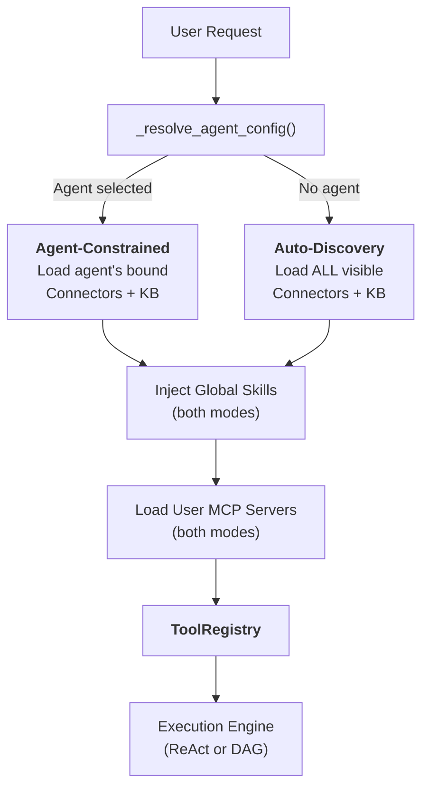
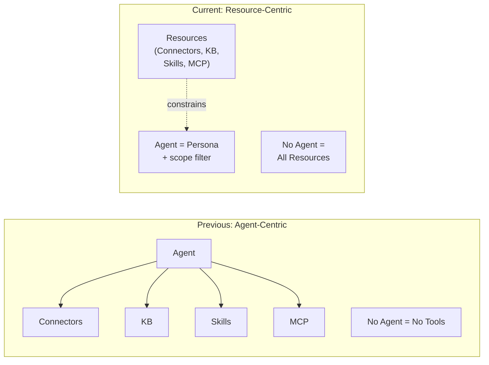
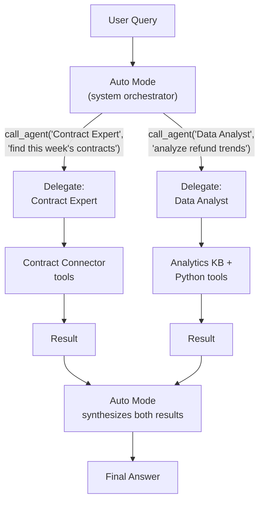
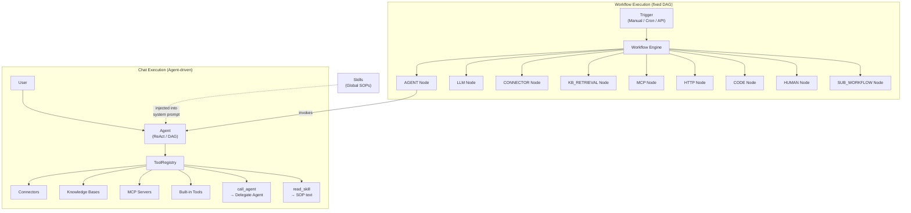

## Die zwei Modi

Jede Chat-Anfrage in FIM One beginnt mit einer Frage: **Ist ein Agent ausgewählt?** Die Antwort bestimmt, wie Ressourcen — Konnektoren, Wissensdatenbanken, Skills und MCP-Server — entdeckt und in den Werkzeugsatz zusammengestellt werden, den das LLM verwenden kann.

**Agent-Constrained Mode** wird aktiviert, wenn der Benutzer einen bestimmten Agent auswählt. Das System lädt nur die Ressourcen, die dieser Agent explizit konfiguriert hat:

- **Konnektoren**: nur die an den Agent gebundenen `connector_ids` werden als Tools geladen.
- **Wissensdatenbanken**: nur die an den Agent gebundenen `kb_ids` werden als Abruf-Tools injiziert.
- **Skills**: global verfügbar — alle aktiven Skills, die für den Benutzer sichtbar sind, werden injiziert, da Skills organisatorische SOPs sind, keine Agent-spezifischen Kenntnisse. (Siehe [Skills als globale SOPs](#skills-as-global-sops) unten.)
- **MCP-Server**: immer benutzer-scoped — alle aktiven MCP-Server, die für den Benutzer sichtbar sind, werden in beiden Modi geladen.
- **Anweisungen**: das Feld `instructions` des Agenten definiert die Persona und Verhaltensrichtlinien, die in den System-Prompt injiziert werden.

**Global Auto-Discovery Mode** wird aktiviert, wenn kein Agent ausgewählt ist (z. B. ein neuer Chat). Das System entdeckt automatisch alles, das für den Benutzer zugänglich ist:

- **Konnektoren**: alle Konnektoren, die für den Benutzer sichtbar sind (eigene + organisationsübergreifend geteilt + Marketplace-abonniert), werden geladen.
- **Wissensdatenbanken**: alle zugänglichen KBs sind für den Abruf über `kb_retrieve` verfügbar.
- **Skills**: alle aktiven Skills, die für den Benutzer sichtbar sind, werden als SOP-Stubs injiziert.
- **MCP-Server**: gleich wie Agent-Constrained — alle aktiven Server, die für den Benutzer sichtbar sind.
- **Anweisungen**: eine generische Assistent-Persona wird verwendet.

Die Verzweigung erfolgt innerhalb von `_resolve_tools()`, die bei jeder Chat-Anfrage aufgerufen wird:



Der praktische Effekt: Benutzer können sofort mit dem Chatten beginnen, ohne einen Agent zu konfigurieren. Das System entdeckt verfügbare Ressourcen und stellt sie als Tools zur Verfügung. Die Auswahl eines Agenten verengt den Umfang — sie schaltet keine neuen Funktionen frei, sondern konzentriert die vorhandenen.

### Was jeder Modus entdeckt

Die beiden Modi unterscheiden sich im **Umfang**, nicht in der Art. Beide erzeugen eine `ToolRegistry` — sie füllen sie nur unterschiedlich.

**Auto-Discovery-Modus (kein Agent ausgewählt):**

| Ressource | Erkennung | Tool-Formular |
|---|---|---|
| Connectoren (API) | `resolve_visibility()` — alle für Benutzer sichtbar | `ConnectorMetaTool` (progressiv) |
| Connectoren (DB) | `resolve_visibility()` — alle für Benutzer sichtbar | `DatabaseMetaTool` (progressiv) |
| Wissensdatenbanken | Alle zugänglichen KBs | `kb_retrieve` |
| Skills | `resolve_visibility()` — alle aktiv | `read_skill` (progressive Stubs) |
| MCP-Server | `resolve_visibility()` — alle für Benutzer sichtbar | `MCPServerMetaTool` (progressiv) |
| Agenten | `resolve_visibility()` — alle aktiv, nicht-Builder | `call_agent` (Delegationskatalog) |
| Integrierte Tools | `discover_builtin_tools()` — vollständiger Satz | Keine Kategoriefilterung angewendet |

**Agent-beschränkter Modus (Agent ausgewählt):**

| Ressource | Erkennung | Tool-Formular |
|---|---|---|
| Connectoren | Nur `agent.connector_ids` | `ConnectorMetaTool` oder Legacy pro Aktion |
| Wissensdatenbanken | Nur `agent.kb_ids` | `GroundedRetrieveTool` / `KBRetrieveTool` |
| Skills | Global — **nicht durch Agent beschränkt** | `read_skill` |
| MCP-Server | Benutzer-scoped — **nicht durch Agent beschränkt** | `MCPServerMetaTool` (progressiv) |
| Agent-Delegation | Nicht verfügbar — Agenten sind spezialisiert | _(deaktiviert)_ |
| Integrierte Tools | `agent.tool_categories` Filter | Teilmenge nach Kategorie |

Die Schlüsselasymmetrie: Connectoren und Wissensdatenbanken werden durch den Agent begrenzt, aber Skills und MCP-Server bleiben in beiden Modi global. `CallAgentTool` (Agent-Delegation) ist nur im Auto-Discovery-Modus verfügbar — es wird **nicht** registriert, wenn ein bestimmter Agent ausgewählt ist. Dies ist eine Sicherheitsmaßnahme: Ein Marketplace-Agent könnte sonst `call_agent` verwenden, um andere Agenten aufzurufen und auf deren private Prompts zuzugreifen. Skills sind organisatorische Regeln (alle befolgen die gleichen SOPs), während Connectoren und KBs Funktionsbindungen sind (verschiedene Agenten verbinden sich mit verschiedenen Systemen).

## Alles ist ein Werkzeug

Auf der LLM-Ebene konvergieren alle Ressourcentypen in eine flache Liste aufrufbarer Werkzeuge. Das LLM hat kein strukturelles Bewusstsein dafür, ob es einen Connector, einen MCP-Server oder eine Knowledge Base aufruft. Es sieht eine `ToolRegistry` — eine Menge von Funktionen mit Namen, Beschreibungen und Parameterschemas.

| Ressourcentyp | Wird auf LLM-Ebene zu | Werkzeugnamen-Muster |
|---|---|---|
| Connector (progressiv) | Einzelnes Meta-Werkzeug | `connector` |
| Connector (Legacy) | N Werkzeuge pro Aktion | `{connector}__{action}` |
| Datenbank-Connector (progressiv) | Einzelnes Meta-Werkzeug | `database` |
| Datenbank-Connector (Legacy) | 3 Werkzeuge pro Datenbank | `{db}__list_tables`, `{db}__describe_table`, `{db}__query` |
| MCP-Server (progressiv) | Einzelnes Meta-Werkzeug | `mcp` |
| MCP-Server (Legacy) | N Werkzeuge pro Server | `{server}__{tool}` |
| Knowledge Base | Abruf-Werkzeug | `kb_retrieve` oder `grounded_retrieve` |
| Skill (progressiv) | Lese-Werkzeug + System-Prompt-Stubs | `read_skill` |
| Skill (Inline) | Nur System-Prompt-Text | _(kein Werkzeug)_ |
| Agent selbst | Nicht als Werkzeug sichtbar | _(Anweisungen + Werkzeug-Zusammenstellung)_ |

Die Schlüsselerkenntnis: **Ein Agent ist kein Werkzeug — er ist die Entität, die Werkzeuge nutzt.** Der Agent trägt seine Anweisungen zum System-Prompt bei und bestimmt, welche Werkzeuge verfügbar sind. Aber aus der Perspektive des LLM gibt es kein „Agent"-Konzept — nur einen System-Prompt und eine Menge aufrufbarer Funktionen.

Diese Einheitlichkeit ist das, was das System erweiterbar macht. Das Hinzufügen eines neuen Ressourcentyps bedeutet, das `Tool`-Protokoll (`name`, `description`, `parameters_schema`, `run()`) zu implementieren. Die Ausführungs-Engines, das Kontext-Management und die LLM-Interaktionsschicht bleiben unverändert.

## Fähigkeiten als globale SOPs

Fähigkeiten befinden sich auf einer Ebene über Agenten. Sie sind organisatorische Richtlinien und Verfahren, die jeder Agent befolgen muss, unabhängig davon, welcher Agent ausgewählt ist.

### Warum Fähigkeiten nicht an Agenten gebunden sind

Eine Fähigkeit wie „Customer Complaint Handling SOP" gilt für jeden Agenten, der mit Kunden interagiert. Das Binden von Fähigkeiten an Agenten erzeugt ein bidirektionales Eigentumsproblem: Wenn eine Fähigkeit Agenten orchestriert und Agenten Fähigkeiten besitzen, wer kontrolliert wen?

Fähigkeiten sind von Natur aus global — sie sind Unternehmensregeln, keine agentenspezifischen Kenntnisse. Die Funktion `_resolve_tools()` lädt alle aktiven Fähigkeiten, die für den Benutzer sichtbar sind, unabhängig von der Agentenwahl, wobei der gleiche `resolve_visibility()`-Filter verwendet wird, der auch für andere Ressourcen verwendet wird.

### Zwei Injektionsmodi

Fähigkeiten unterstützen zwei Injektionsmodi -- **progressiv** (Standard) und **inline** -- gesteuert durch `SKILL_TOOL_MODE` oder die `model_config_json.skill_tool_mode` des Agenten. Im progressiven Modus erscheinen nur kompakte Stubs in der Systemaufforderung; das LLM ruft `read_skill(name)` bei Bedarf auf, um den vollständigen Inhalt zu laden. Dies ist Teil von FIM One's umfassenderer [Progressive Disclosure](/architecture/progressive-disclosure) Architektur, die den Kontextverbrauch über alle Ressourcentypen hinweg minimiert.

## Agent als Persona, nicht als Container

Die Architektur von FIM One spiegelt eine bewusste Verschiebung von einem Agent-zentrierten Modell zu einem Ressourcen-zentrierten Modell wider.

**Vorheriges Modell:** Der Agent war ein Container, der den Zugriff auf alle Ressourcen kontrollierte. Kein ausgewählter Agent bedeutete keine Konnektoren, keine Skills, keine spezialisierte KB. Der Agent war der obligatorische Einstiegspunkt für jede Funktionalität.

**Aktuelles Modell:** Der Agent ist eine Persona — eine Reihe von Anweisungen und Verhaltensrichtlinien — kombiniert mit einer optionalen Ressourcenbeschränkung. Ressourcen existieren unabhängig von Agenten. Die Auswahl eines Agenten grenzt den Umfang ein; die Nichtauswahl öffnet ihn vollständig.



Dies bedeutet:

- **Benutzer können sofort mit dem Chatten beginnen**, ohne einen Agenten zu konfigurieren.
- **Das System erkennt verfügbare Ressourcen automatisch** und stellt sie als Tools zur Verfügung.
- **Agenten werden zu leichtgewichtigen Personas**, die schnell erstellt werden können — schreiben Sie einfach Anweisungen und binden Sie optional spezifische Konnektoren und KBs ein.
- **Ressourcenverwaltung ist entkoppelt** von der Agentenverwaltung. Das Veröffentlichen eines Konnektors für eine Organisation macht ihn überall verfügbar — im Auto-Discovery-Modus, in Agent-Binding-Dropdowns und bei der Auflösung von Agent-Delegationen.

## Agent-Delegierung

FIM One unterstützt die Delegierung von Aufgaben an spezialisierte Agenten über `CallAgentTool` — aber nur im **Auto-Modus** (kein Agent ausgewählt). Wenn ein Benutzer einen bestimmten Agent auswählt, ist die Delegierung deaktiviert und der Agent konzentriert sich ausschließlich auf seine eigenen Tools.

### Zwei Modi: Auto vs. Agent-ausgewählt

| Aspekt | Auto-Modus (kein Agent ausgewählt) | Agent-ausgewählter Modus |
|---|---|---|
| `call_agent` | Aktiviert — delegiert an jeden sichtbaren Agent | **Deaktiviert** — nicht registriert |
| Tool-Bereich | Alle sichtbaren Konnektoren, KB, Skills, MCP | Nur die gebundenen Ressourcen des Agenten + globale Skills/MCP |
| Orchestrierung | System-LLM wählt pro Iteration dynamisch den besten Agenten aus | Agent nutzt seine Tools direkt |
| Anwendungsfall | Allgemeine Anfragen, domänenübergreifende Aufgaben | Fokussierte Spezialistaufgaben |

**Warum Delegation im Agent-ausgewählten Modus deaktiviert ist:** Sicherheit. Ein Marketplace-Agent könnte `call_agent` verwenden, um andere Agenten aufzurufen und ihre privaten Systemaufforderungen zu lesen. Durch die Beschränkung der Delegation auf den Auto-Modus — wo das System-LLM (nicht die Aufforderung eines einzelnen Agenten) den Ablauf steuert — werden private Agent-Aufforderungen niemals gegenüber nicht vertrauenswürdigen Agent-Konfigurationen offengelegt.

### Auto-Modus als Orchestrierungsebene

Der Auto-Modus ist ein erstklassiges Konzept in der Benutzeroberfläche. Die Agent-Auswahl zeigt "Auto" als Standardoption an. Wenn Auto aktiv ist, fungiert das System-LLM als Orchestrator: Es sieht den vollständigen Katalog aller sichtbaren Agenten und kann Aufgaben bei jeder Iteration an den am besten geeigneten Spezialisten delegieren. Dies ersetzt die Notwendigkeit eines dedizierten "übergeordneten Agenten" — das System selbst ist der Orchestrator.

### Agenten-Katalog

Zur Laufzeit werden alle aktiven, nicht-Builder-Agenten, die für den Benutzer sichtbar sind, in einem Katalog zusammengestellt. Der Name und die Beschreibung jedes Agenten sind im Parameterschema des `call_agent`-Tools aufgeführt, sodass das LLM den richtigen Spezialisten semantisch auswählen kann – ohne hartcodiertes Routing.

### Vollständige Werkzeugererbung

Wenn ein delegierter Agent über `call_agent(agent_id, task)` aufgerufen wird, erhält er eine vollständige `ToolRegistry`, die aus seiner eigenen Konfiguration erstellt wird – einschließlich seiner gebundenen Connectoren, KB und integrierten Werkzeuge. Delegierte Agenten sind vollständige Ausführungseinheiten, keine reinen Text-Berater.

### Delegation auf einer Ebene

Um unendliche Rekursion zu verhindern, erhalten delegierte Agenten das Tool `call_agent` nicht. Delegation erfolgt immer auf einer Ebene: Der Auto-Modus ruft einen Spezialisten auf, der Spezialist führt aus und gibt ein Ergebnis zurück. Das System synthetisiert Ergebnisse von mehreren delegierten Agenten.

### Parallele Ausführung

Im nativen Funktionsaufrufs-Modus kann das LLM mehrere `call_agent`-Aufrufe in einer einzelnen Runde aufrufen. Diese werden gleichzeitig über `asyncio.gather` ausgeführt, was Muster wie "drei Quellen gleichzeitig durchsuchen" ermöglicht.



## Sichtbarkeitsmodell

Die gesamte Ressourcenerkennung — in beiden Modi — wird durch ein einheitliches Sichtbarkeitsmodell mit drei Ebenen gesteuert:

| Ebene | Beschreibung | Beispiel |
|---|---|---|
| **Eigene** | Vom Benutzer erstellt. Immer sichtbar. | Ein Konnektor, den Sie für die API Ihres Teams erstellt haben |
| **Organisationsweit freigegeben** | Ressourcen mit `visibility: "org"` aus der/den Organisation(en) des Benutzers. Sichtbar für alle genehmigten Organisationsmitglieder. | Ein unternehmensweiter ERP-Konnektor, der von der IT veröffentlicht wurde |
| **Markt-abonniert** | Ressourcen, die vom FIM One Market installiert wurden. Sichtbar für den Abonnenten. | Ein von der Community erstellter Slack-Konnektor, den Sie installiert haben |

Die Funktion `resolve_visibility()` in `web/visibility.py` erstellt einen SQL-Filter, der alle drei Ebenen in einer einzigen Abfrage umfasst:

```python
conditions = [
    model.user_id == user_id,                    # own resources
    and_(model.visibility == "org",              # org-shared
         model.org_id.in_(user_org_ids),
         or_(model.publish_status == None,
             model.publish_status == "approved")),
    model.id.in_(subscribed_ids),                # Market-subscribed
]
```

Dieser Filter wird überall verwendet:

- Automatische Erkennung von Konnektoren im No-Agent-Modus
- Erstellung des Agent-Katalogs für `CallAgentTool`
- Laden sichtbarer Skills für die Systemaufforderungs-Injektion
- MCP-Server-Auflösung
- Agent-Konfigurationssuche (um sicherzustellen, dass ein Benutzer nur Agenten auswählen kann, die für ihn sichtbar sind)

Die Einheitlichkeit bedeutet, dass **die Veröffentlichung eines Konnektors für eine Organisation ihn automatisch verfügbar macht** im Auto-Discovery-Modus, in Agent-Binding-Dropdowns und in der Agent-Delegationsauflösung — ohne spezielle Verkabelung erforderlich. Das Sichtbarkeitsmodell ist die einzige Quelle der Wahrheit für „auf welche Ressourcen kann dieser Benutzer zugreifen".

## Beziehungskarte

FIM One hat zwei parallele Ausführungsparadigmen — **Chat (Agent-gesteuert)** und **Workflow (DAG-gesteuert)** — die dieselben zugrunde liegenden Ressourcen nutzen, aber unterschiedlich orchestrieren.



Wichtige Erkenntnisse aus dem Diagramm:

- **Agent und Workflow sind parallele Paradigmen.** Beide können Konnektoren, Wissensdatenbanken und MCP Server nutzen — aber durch unterschiedliche Mechanismen. Agenten verwenden sie als Tools in einer `ToolRegistry`; Workflows verwenden sie als typisierte DAG-Knoten.
- **Workflow kann Agenten orchestrieren** über den `AGENT`-Knoten — ein Workflow-Schritt kann einen vollständigen Agenten mit seiner eigenen ReAct/DAG-Schleife aufrufen. Das Gegenteil ist nicht wahr: Agenten können Workflows nicht direkt aufrufen (nur indirekt über API/Webhook-Trigger).
- **Skills werden nur in Agenten injiziert.** Skills sind Systemanweisungstext — sie leiten das Verhalten des Agenten. Workflows verbrauchen Skills nicht, da Workflow-Knoten deterministische Logik ausführen, nicht LLM-gesteuerte Überlegungen.
- **Gemeinsame Ressourcen, unterschiedliche Zugriffsmuster.** Ein Konnektor kann von einem Agenten aufgerufen werden (über `ConnectorToolAdapter`), von einem Workflow (über `CONNECTOR`-Knoten) oder von beiden im gleichen Geschäftsprozess — z. B. ein Workflow löst einen Agenten aus, der denselben Konnektor abfragt, den der Workflow auch in einem späteren Schritt verwendet.

## Workflow-Engine — das andere Ausführungsparadigma

Während sich dieses Dokument auf die Agent-gesteuerte Chat-Ausführung konzentriert, enthält FIM One eine vollständige **Workflow-Engine** — einen visuellen DAG-Editor mit 26 Knotentypen für die Automatisierung fester Prozesse.

| Aspekt | Agent (Chat) | Workflow |
|---|---|---|
| Orchestrierung | LLM entscheidet dynamisch den nächsten Schritt | Fester DAG, der zur Entwurfszeit definiert wird |
| Am besten geeignet für | Explorative Aufgaben, Gespräche, flexible Argumentation | Genehmigungsketten, geplante ETL, mehrstufige Automatisierungen |
| Kann aufrufen | Konnektoren, KB, MCP, integrierte Tools, delegierte Agenten, Skills | Agenten, Konnektoren, KB, MCP, LLM, HTTP, Code, menschliche Genehmigung, Sub-Workflows |
| Auslöser | Benutzernachricht im Chat | Manuell, Cron-Zeitplan oder API/Webhook |
| Verschachtelung | Einstufige Delegierung (Auto-Modus → delegierter Agent) | Beliebige DAG-Tiefe über SUB_WORKFLOW-Knoten |

Die beiden Paradigmen ergänzen sich gegenseitig. Verwenden Sie Agenten, wenn die Aufgabe offen ist („analysieren Sie die Verkaufsdaten dieses Quartals und empfehlen Sie Maßnahmen"). Verwenden Sie Workflows, wenn der Prozess bekannt ist („jeden Montag neue Rechnungen aus dem ERP abrufen, Compliance-Prüfungen durchführen und Ausnahmen an einen menschlichen Prüfer weiterleiten"). Ein Workflow kann einen Agenten für jeden Schritt aufrufen, der flexible Argumentation innerhalb einer ansonsten festen Pipeline benötigt.

Weitere Informationen zu Agent-Ausführungsmodi und Workflow-Knotentypen finden Sie unter [Ausführungsmodi](/concepts/execution-modes).
