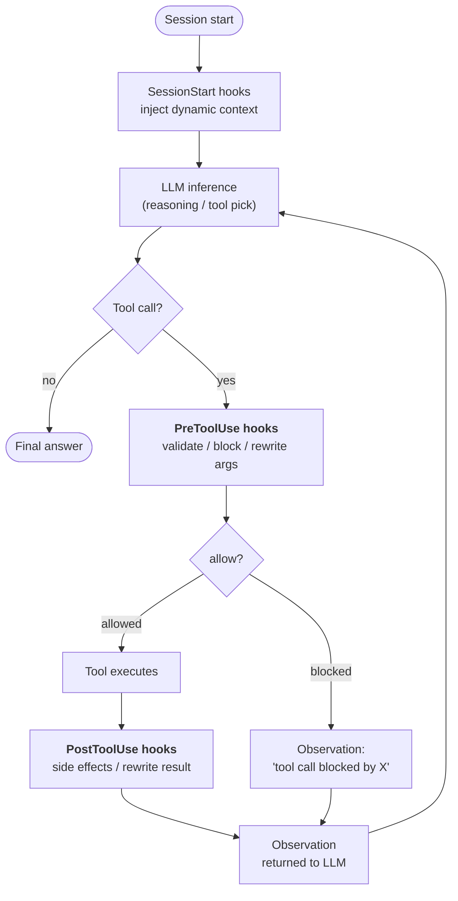
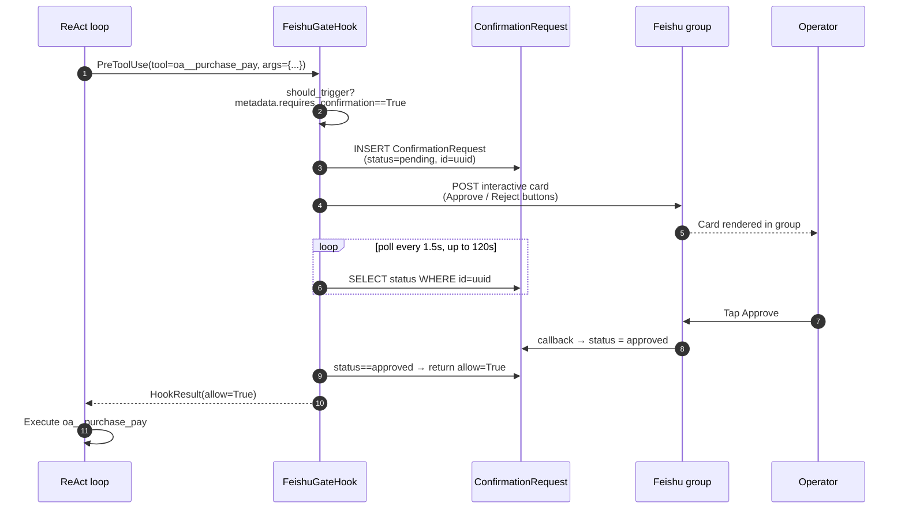

## Warum Hooks existieren

Anweisungen in einem System-Prompt sind **Vorschläge**. Ein ausreichend eigensinniges oder verwirrtes LLM kann sie ignorieren. Für die meisten Agent-Verhaltensweisen ist das genau das, was Sie möchten — Anweisungen geben dem Modell Raum zur Anpassung.

Aber einige Anforderungen sind keine Vorschläge. „Jeder sensible Tool-Aufruf muss protokolliert werden." „Schreibvorgänge sind blockiert, wenn die Organisation im Nur-Lese-Modus ist." „Zahlungen über ¥50k erfordern eine menschliche Bestätigung vor der Ausführung." Das sind **Invarianten** — Fakten über das System, die unabhängig davon gelten müssen, was das Modell in einem bestimmten Durchlauf entscheidet.

Ein Hook ist Code, der **außerhalb der LLM-Schleife** an einem klar definierten Punkt im Ausführungs-Lebenszyklus des Agenten läuft. Das LLM kann den Hook nicht sehen. Das LLM kann mit dem Hook nicht argumentieren. Das LLM kann den Hook nicht überreden, einen Schritt zu überspringen. Wenn ein `PreToolUse` Hook `allow=False` zurückgibt, findet der Tool-Aufruf nicht statt — egal wie hartnäckig die Reasoning-Spur war.

Das ist die kritische architektonische Unterscheidung:

| Mechanismus | Wo es läuft | Wer kontrolliert es | Garantie |
|---|---|---|---|
| **System-Prompt-Anweisung** | Innerhalb von LLM-Inferenz | Modell | „Folgt wahrscheinlich" |
| **Tool-Beschreibung / Schema** | Innerhalb von LLM-Inferenz | Modell | „Folgt wahrscheinlich" |
| **Hook** | Um LLM-Inferenz herum | Platform-Code | **Läuft immer** |

Hooks sind, wie FIM One „der Agent soll..." in „der Agent kann nicht umgehen..." umwandelt.

## Wo Hooks angebunden werden

Heute sind drei Hook-Punkte definiert. Jeder markiert eine Grenze, die der Agent während einer Schleifenwiederholung überschreitet:



| Hook-Punkt | Wird ausgelöst, wenn | Kann es blockieren? | Kann es Daten mutieren? |
|---|---|---|---|
| `SessionStart` | Vor dem ersten LLM-Aufruf einer Sitzung | Nein | Ja — injiziert Kontext in die anfängliche Eingabeaufforderung |
| `PreToolUse` | Nachdem das LLM ein Tool ausgewählt hat, bevor das Tool ausgeführt wird | **Ja** (über `allow=False`) | Ja — kann `tool_args` vor der Ausführung umschreiben |
| `PostToolUse` | Nachdem das Tool zurückgekehrt ist, bevor die Beobachtung zum LLM geht | Nein | Ja — kann die Beobachtung umschreiben |

Mehrere Hooks am gleichen Punkt werden in Prioritätsreihenfolge ausgeführt. Die umgeschriebenen Args eines früheren `PreToolUse`-Hooks werden an spätere Hooks weitergeleitet, sodass sich Middleware zusammensetzt.

## Wann ein Hook vs. eine Anweisung

Die Entscheidung, ob eine Anforderung mit einer Prompt-Anweisung oder einem Hook gelöst werden soll, ist dieselbe Berechnung wie "Runtime-Assertion vs. Code-Kommentar":

| Symptom | Lösung |
|---|---|
| "Der Agent sollte X bevorzugen, wenn Y" | Anweisung — sanfte Anleitung, Modell hat Spielraum |
| "Der Agent muss jeden Aufruf an Connector Z protokollieren" | **PostToolUse Hook** — kann sich nicht auf das Modell verlassen, um sich zu erinnern |
| "Zahlungen über ¥50k benötigen menschliche Genehmigung" | **PreToolUse Hook** — kann sich nicht auf das Modell verlassen zu fragen |
| "Der Agent sollte sich auf Chinesisch vorstellen" | Anweisung — stilistisch, geringe Kosten bei Fehlschlag |
| "Der Agent kann nicht in die Produktionsdatenbank im Nur-Lese-Modus schreiben" | **PreToolUse Hook** — Sicherheitsinvariante, Null-Toleranz |
| "Der Agent sollte lange DB-Abfrageergebnisse zusammenfassen" | Könnte beides sein, aber ein Hook ist robuster — siehe PostToolUse truncate |

Faustregel: **Wenn das falsche Verhalten ein Incident ist, verwenden Sie einen Hook. Wenn das falsche Verhalten eine kleine Unannehmlichkeit ist, ist eine Anweisung ausreichend.**

## Der Hook-Vertrag

Ein Hook ist eine Unterklasse von `PreToolUseHook`, `PostToolUseHook` oder `SessionStartHook` mit einer erforderlichen Methode:

```python
class ReadOnlyGuard(PreToolUseHook):
    name = "readonly_guard"
    priority = 5                          # lower runs earlier

    def should_trigger(self, ctx: HookContext) -> bool:
        return ctx.tool_name.startswith("sql_")

    async def execute(self, ctx: HookContext) -> HookResult:
        if org_is_readonly(ctx.metadata["org_id"]):
            return HookResult(
                allow=False,
                error="Org is in read-only mode — write blocked.",
                side_effects=["readonly_guard: blocked sql write"],
            )
        return HookResult()               # default: allow=True, no mutation
```

Der übergebene `HookContext` enthält `tool_name`, `tool_args`, `agent_id`, `user_id` und ein flexibles `metadata`-Wörterbuch, das die Engine mit anfragespezifischen Fakten füllt (Organisations-ID, Konversations-ID, das `requires_confirmation`-Flag der Connector-Aktion, …).

Das zurückgegebene `HookResult` steuert das Ergebnis:

- `allow: bool = True` — ob der Tool-Aufruf fortgesetzt wird (wird für `PostToolUse` / `SessionStart` ignoriert)
- `error: str | None` — benutzerfreundliche Begründung, die dem LLM als Beobachtung angezeigt wird, wenn blockiert
- `modified_args: dict | None` — falls gesetzt, ersetzt die Tool-Argumente vor der Ausführung
- `modified_result: Any | None` — falls gesetzt (PostToolUse), ersetzt die Beobachtung, bevor sie an das LLM zurückgegeben wird
- `side_effects: list[str]` — Audit-Trail der Hook-Aktionen, zusammengeführt in die Agent-Trace

## Fallstudie: `FeishuGateHook`

Der erste Hook, der auf diesem System implementiert wurde, ist `FeishuGateHook` — ein `PreToolUse` Hook, der jedes Tool mit dem Flag `requires_confirmation=True` in eine Genehmigungskarte mit menschlicher Kontrolle umwandelt, die in der Feishu-Gruppe der Organisation gepostet wird.

Dieser Hook durchläuft den vollständigen Lebenszyklus:



Das bringt dieses Design mit sich:

- **Der Tool-Aufruf wird wirklich unterbrochen.** Der SSE-Stream des Agenten pausiert zwischen „Ich werde `oa__purchase_pay` aufrufen" und der Observation. Der Benutzer sieht den wartenden Agenten, was dem entspricht, was unter der Haube passiert.
- **Die Genehmigung übersteht einen Prozessneustart.** Die ausstehende Zeile befindet sich in der Datenbank, nicht im Speicher. Wenn das Backend neu startet, während eine Karte ausstehend ist, nimmt die nächste Abfrage dort auf, wo sie aufgehört hat.
- **Die Entscheidung wird geprüft.** `ConfirmationRequest` speichert `payload`, `responded_at`, `responded_by_open_id` und den endgültigen Status — ein überprüfbarer Datensatz darüber, wer was und wann genehmigt hat.
- **Kein LLM in der Entscheidungsschleife.** Das Modell erzeugt den Tool-Aufruf. Menschen erzeugen das Urteil. Der Hook ist die deterministische Brücke.

`FeishuGateHook` hängt von einem konfigurierten [Feishu Channel](/configuration/channels/feishu) ab — der Hook sendet die Karte über die `send_interactive_card()`-Methode des Channels und wartet auf Callback-Events, die der Channel geparst hat. Die Trennung ist beabsichtigt: Der Hook besitzt die „Genehmigungszustandsmaschine", der Channel besitzt die „IM-Plattformmechanik". Der gleiche Hook könnte morgen auf Slack oder WeCom abzielen, ohne seine Logik zu ändern — nur die Channel-Implementierung.

## Mögliche Hooks (nicht geplant)

Vier Hook-Muster passen in denselben Lebenszyklus. Keines davon steht auf der aktuellen Roadmap; sie bleiben zurückgestellt, bis ein Deployment eines davon benötigt:

| Hook | Zeitpunkt | Zweck |
|---|---|---|
| `AuditLogHook` | PostToolUse | `ConnectorCallLog` bei jedem Connector-Aufruf automatisch schreiben. Derzeit geschieht dies manuell; als Hook ist die Abdeckung sichergestellt. |
| `ReadOnlyGuard` | PreToolUse | Schreibvorgänge blockieren, wenn die Organisation im schreibgeschützten Modus ist. |
| `ResultTruncateHook` | PostToolUse | Übergroße Tool-Beobachtungen (>8k Zeichen) kürzen, bevor sie den LLM-Kontext erreichen. |
| `ConnectorRateLimitHook` | PreToolUse | Aufrufe pro Connector und Benutzer begrenzen, unabhängig von LLM-Ratenlimits. |

Eine benutzerdefinierte Hook-Ebene bleibt unter denselben Bedingungen zurückgestellt: eine YAML-Konfiguration pro Agent (`hooks: [...]`), in der Shell-Befehle oder Python-Aufrufobjekte festgelegt werden, die bei passenden Tool-Ereignissen ausgeführt werden. Dieser Ansatz folgt dem Muster, auf das sich moderne Agent-Frameworks (Claude Code, OpenDevin) verständigt haben — eine Durchsetzung per Hook hält die Logik für Dinge, die „immer geschehen müssen“, aus den Prompts heraus.

## Hooks vs. Channels

Die beiden Abstraktionen lösen orthogonale Probleme:

| Konzept | Was es modelliert | Lebensdauer | Beispiel |
|---|---|---|---|
| **Hook** | Ein Punkt in der Ausführung des Agenten, an dem Plattformcode ausgeführt wird | Pro Tool-Aufruf | `FeishuGateHook`, `AuditLogHook` |
| **Channel** | Ein austauschbarer Adapter zu einer externen Messaging-Plattform | Langlebig pro Organisation | `FeishuChannel`, geplanter `SlackChannel` |

Hooks nutzen Channels — ein Hook, der mit der Außenwelt kommunizieren muss (eine Karte senden, eine Benachrichtigung posten, an eine Gruppe eskalieren), ruft den Channel der Organisation auf. Ein Channel ohne einen Hook, der ihn nutzt, ist immer noch nützlich (z. B. können Agenten proaktiv Benachrichtigungen über ein Tool senden), aber das Approval-Gate-Muster erfordert speziell, dass beide Teile vorhanden sind.

Anders ausgedrückt: **Channels sind die „Wie kommuniziere ich mit Menschen"-Infrastruktur, Hooks sind die „Wann muss ich mit Menschen kommunizieren"-Richtlinie**. Produktive Human-in-the-Loop-Workflows benötigen beides.

## Aktueller Stand (v0.8.4)

Zusammenfassung dessen, was ausgeliefert wurde und was noch aussteht:

- ✅ Die Grundbausteine `HookRegistry`, `HookContext` und `HookResult` sind in ReAct und DAG integriert
- ✅ Abstrakte Basisklassen `PreToolUseHook` / `PostToolUseHook` / `SessionStartHook`
- ✅ `FeishuGateHook` – vollständig implementiert, einschließlich der Tabelle `ConfirmationRequest`, der Polling-Schleife, Timeout und Ablauf sowie callback-gesteuerter Zustandsänderungen
- ✅ Feishu-Kanal-Callback-Endpunkt, der `card.action.trigger` dekodiert und den ausstehenden Datensatz aktualisiert
- ✅ Hook-Deklarationen auf Agent-Ebene: `agent.model_config_json.hooks.class_hooks` wird für jede ReAct-/DAG-Sitzung zu einer instanziierten `HookRegistry` aufgelöst
- ✅ **Hooks werden bei jeder Ausführungsart ausgelöst**: im Haupt-Chatpfad (Portal, API, DAG), bei delegierten Sub-Agenten (`CallAgentTool`) und in Workflow-`AGENT`-Knoten. Das Eval Center umgeht Hooks absichtlich (automatisierte Evaluationen dürfen nicht durch eine menschliche Genehmigung blockiert werden).

  Ein delegierter Agent übernimmt nicht die Registry seines aufrufenden Agents, sondern erstellt eine **eigene** anhand seiner eigenen `model_config_json`. Da das Bestätigungsgate automatisch jedem Agent hinzugefügt wird, ist der Neuaufbau umfassender als eine Übernahme: Der delegierte Agent erhält das Gate *sowie* alle Hooks, die er selbst deklariert, und das Gate wertet `require_confirmation_for_all` des delegierten Agents aus, nicht das seines Aufrufers. Beide Ausführungsarten schlagen **geschlossen** fehl: Ein Agent, dessen Hooks nicht erstellt werden können, wird nicht ausgeführt.
- ❌ `AuditLogHook`, `ReadOnlyGuard`, `ResultTruncateHook`, `ConnectorRateLimitHook` (nicht geplant)
- ❌ YAML-Deklarationen für benutzerdefinierte Hooks (nicht geplant)

Das Hook-System ist ein **tragendes Fundament** für die Absicherung des Produktivbetriebs. Sein erster Nutzer (`FeishuGateHook`) ist zugleich ein eigenständiges Produktivfeature. Deshalb wurde das Grundgerüst bereits vorab für den Roadshow-Termin am 24.04.2026 ausgeliefert, statt auf den vollständigen Hook-Katalog zu warten.
