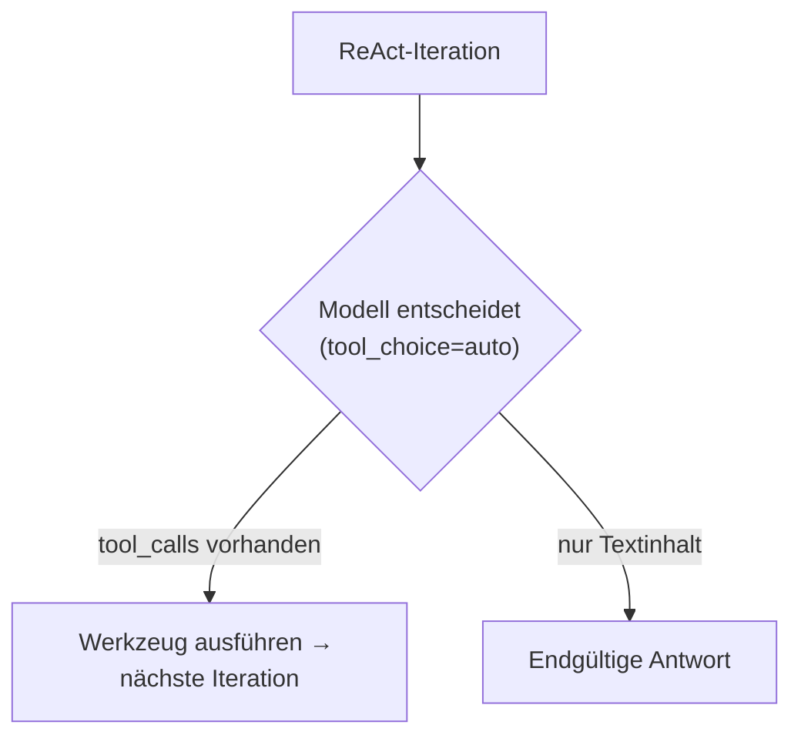
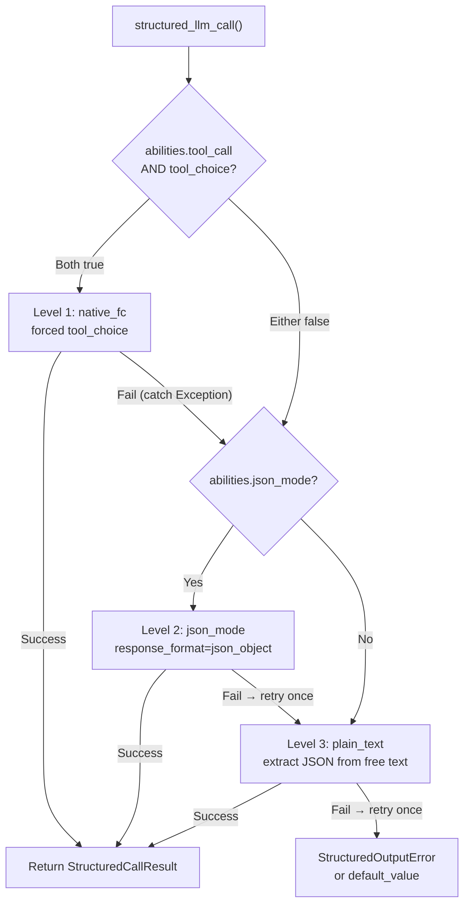

## Anbieter-Erkennung

FIM One verwendet LiteLLM als universellen Adapter. Die Funktion `_resolve_litellm_model()` in `core/model/openai_compatible.py` ordnet die `LLM_BASE_URL` + `LLM_MODEL` des Benutzers einem LiteLLM-Modellbezeichner mit einem Anbieter-Präfix zu. Das Präfix bestimmt, wie LiteLLM die Anfrage weiterleitet — natives API-Protokoll (Anthropic Messages API, Gemini, etc.) oder generisches OpenAI-kompatibles `/v1/chat/completions`.

Auflösungsreihenfolge:

1. **Expliziter Anbieter** (aus DB-Feld `ModelConfig.provider`) — höchste Priorität. Wenn der Anbieter einer bekannten Domäne in der URL entspricht, wird keine `api_base` zurückgegeben (LiteLLM leitet nativ weiter). Andernfalls wird `api_base` auf die Relay-URL gesetzt.
2. **Domänen-Abgleich** gegen `KNOWN_DOMAINS` — offizielle API-Endpunkte werden anhand des Hostnamens erkannt.
3. **URL-Pfad-Hinweis** gegen `PATH_PROVIDER_HINTS` — häufig auf Relay-Plattformen wie UniAPI, wo `/claude` oder `/anthropic` im Pfad das Upstream-Protokoll anzeigt.
4. **Fallback** — `openai/`-Präfix (generisches OpenAI-kompatibles).

| Domäne / Pfad | Anbieter-Präfix | Protokoll |
|---|---|---|
| `api.openai.com` | `openai/` | OpenAI Chat Completions |
| `anthropic.com` | `anthropic/` | Anthropic Messages API |
| `generativelanguage.googleapis.com` | `gemini/` | Google Gemini |
| `api.deepseek.com` | `deepseek/` | DeepSeek (OpenAI-kompatibel) |
| `api.mistral.ai` | `mistral/` | Mistral |
| Pfad enthält `/claude` oder `/anthropic` | `anthropic/` | Anthropic Messages API (über Relay) |
| Pfad enthält `/gemini` | `gemini/` | Google Gemini (über Relay) |
| Alles andere | `openai/` | Generisches OpenAI-kompatibles |

Wenn das Anbieter-Präfix ein natives Protokoll ist (anthropic, gemini, etc.) und die URL nicht der offizielle Endpunkt ist, verwendet LiteLLM das native Protokoll, sendet Anfragen aber an die `api_base` des Relays. Dies bedeutet, dass anbieter-spezifische Verhaltensweisen — einschließlich des unten beschriebenen Bedrock-Prefill-Problems — gelten, unabhängig davon, ob die Anfrage zur offiziellen API oder über ein Relay geht.

<Warning>
Wenn Ihre Relay-URL `/claude` im Pfad enthält, leitet FIM One automatisch über das native Anthropic-Protokoll weiter. Dies ist normalerweise korrekt (besseres Streaming, Thinking-Unterstützung), bedeutet aber, dass anbieter-spezifische Verhaltensweisen gelten — einschließlich des unten beschriebenen Bedrock-Prefill-Problems.
</Warning>

## tool_choice — die vier Modi

Der Parameter `tool_choice` ist über das OpenAI-Format standardisiert. LiteLLM übersetzt ihn vor dem Senden der Anfrage in das native Protokoll jedes Anbieters.

| Modus | Bedeutung | Anbieterunterstützung |
|---|---|---|
| `"auto"` | Modell entscheidet, ob ein Werkzeug aufgerufen oder mit Text geantwortet wird | Alle Anbieter |
| `"required"` | Muss ein Werkzeug aufrufen, aber Modell wählt welches | Die meisten Anbieter |
| `{"type":"function","function":{"name":"X"}}` | Muss Funktion X spezifisch aufrufen | Die meisten Anbieter — **nicht kompatibel mit Anthropic Thinking** |
| `"none"` | Kann keine Werkzeuge verwenden, nur Text | Alle Anbieter |

Die Unterscheidung zwischen `"auto"` und erzwungen (`{"type":"function",...}`) ist der Kern jedes Kompatibilitätsproblems in FIM One. Diese beiden Modi werden von völlig unterschiedlichen Subsystemen mit unterschiedlichen Anforderungen verwendet.

## Wo tool_choice verwendet wird

Zwei Subsysteme verwenden `tool_choice`, und sie verwenden es auf grundlegend unterschiedliche Weise.

### ReAct-Engine — tool_choice="auto"

Die ReAct-Schleife erfordert, dass das Modell in jeder Iteration entscheidet: ein Werkzeug aufrufen oder eine endgültige Antwort geben. Nur `"auto"` macht hier Sinn — das Modell wählt frei zwischen der Erzeugung von `tool_calls` oder Textinhalten. Dies ist mit allen Anbietern, allen Modellen und allen Modi kompatibel, einschließlich erweitertem Denken.



Die ReAct-Engine verwendet natives Function Calling (`_run_native`), wenn `abilities["tool_call"] = True`, und fällt andernfalls auf den JSON-im-Inhalt-Modus (`_run_json`) zurück. Beide Modi verwenden `"auto"` — der Unterschied besteht darin, ob Werkzeuge über den `tools`-Parameter übergeben oder in der Systemaufforderung beschrieben werden. Weitere Informationen finden Sie unter [ReAct-Engine — Dual-Mode-Ausführung](/architecture/react-engine#dual-mode-execution).

### structured_llm_call — tool_choice=forced

Einmalige strukturierte Extraktion (Schema-Annotation, DAG-Planung, Plan-Analyse). Erzwingt, dass das Modell eine bestimmte virtuelle Funktion aufruft und garantiert strukturierte JSON-Ausgabe. Dies ist die Aufrufstelle, die anbieterspezifische Fehler auslöst.

`structured_llm_call` implementiert eine 3-stufige Degradationskette:



Der kritische Designunterschied: Das Fallback von `structured_llm_call` ist **Laufzeit** — es versucht dynamisch jede Stufe und fängt Ausnahmen ab, um durchzufallen. Die Modusauswahl der ReAct-Engine ist **Build-Zeit** — sie prüft `_native_mode_active` einmal am Anfang und verpflichtet sich auf einen Modus für die gesamte Schleife. Das bedeutet, dass `structured_llm_call` sich transparent von anbieterspezifischen 400-Fehlern erholen kann, während ReAct darauf angewiesen ist, dass der Modus von Anfang an korrekt gewählt wird.

## Die Bedrock-Prefill-Falle

Wenn `response_format={"type":"json_object"}` für ein Modell übergeben wird, das mit dem `anthropic/`-Präfix aufgelöst wird, injiziert LiteLLM intern eine Assistant-Prefill-Nachricht, um den JSON-Modus zu simulieren. Die Anthropic Messages API hat keinen nativen `response_format`-Parameter, daher approximiert LiteLLM dies, indem eine öffnende Klammer als Assistant-Inhalt vorangestellt wird:

```json
{"role": "assistant", "content": "{"}
```

Dies funktioniert auf Anthropics direkter API. Jedoch lehnen neuere AWS-Bedrock-Modellversionen jede Konversation ab, deren letzte Nachricht `role: "assistant"` hat — sie nennen dies „Assistant-Message-Prefill" und werfen:

```
ValidationException: This model does not support assistant message prefill.
The conversation must end with a user message.
```

Dieser Fehler tritt nur auf, wenn **alle drei Bedingungen** gleichzeitig erfüllt sind:

1. Das Modell wird mit dem `anthropic/`-Präfix aufgelöst (über Domain-Matching oder URL-Pfad-Hinweis).
2. `response_format={"type":"json_object"}` wird übergeben (der json_mode-Code-Pfad in `structured_llm_call`).
3. Das eigentliche Backend ist AWS Bedrock (das Prefill ablehnt).

<Tip>
**Bedrock über OpenAI-kompatiblen Endpoint?** Wenn Ihr Bedrock-Relay einen OpenAI-kompatiblen `/v1/chat/completions`-Endpoint bereitstellt (entweder AWS's eigenes OpenAI-kompatibles Gateway oder einen Drittanbieter-Proxy), und der URL-Pfad enthält **nicht** `/claude` oder `/anthropic`, löst FIM One es mit dem `openai/`-Präfix auf. LiteLLM behandelt das Backend dann als einen Standard-OpenAI-kompatiblen Server, übergibt `response_format` direkt ohne Prefill-Injektion, und der Server handhabt JSON-Constraining nativ. **Die Prefill-Falle gilt nicht** — Sie müssen `json_mode_enabled=false` nicht setzen.
</Tip>

<Warning>
Dies betrifft NICHT natives Tool-Calling (`tool_choice="auto"` mit `tools=`-Parameter). Die Prefill-Injektion erfolgt nur für `response_format`. Die ReAct-Agent-Ausführung ist völlig unbeeinträchtigt.
</Warning>

Wenn sowohl Level 1 (native_fc) als auch Level 2 (json_mode) auf Bedrock fehlschlagen, stellt sich das System auf Level 3 (plain_text) wieder her. Das unten beschriebene Flag `json_mode_enabled` eliminiert den verschwendeten Level-2-Aufruf.

### Die Lösung: json_mode_enabled

Ein pro-Modell-Flag `json_mode_enabled` steuert, ob Level 2 (json_mode) jemals versucht wird:

- **DB-konfigurierte Modelle**: Umschalter in Admin → Models → Advanced settings. Das Flag wird auf `ModelProviderModel.json_mode_enabled` gespeichert (Standard `TRUE`).
- **ENV-konfigurierte Modelle**: setzen Sie `LLM_JSON_MODE_ENABLED=false` in Ihrer Umgebung.
- **Auswirkung**: wenn deaktiviert, gibt `abilities["json_mode"]` `False` zurück → `response_format` wird nie übergeben → keine Prefill → Bedrock funktioniert. Die Degradationskette wird zu `native_fc → plain_text`, wobei der fehlgeschlagene json_mode-Aufruf vollständig übersprungen wird.
- **Kein Qualitätsverlust**: das Modell gibt weiterhin gültiges JSON zurück, da das System-Prompt es anweist. Die plain_text-Ebene verwendet `extract_json()` zum Parsen von JSON aus Freitext-Inhalten, was bei modernen Modellen zuverlässig funktioniert.

## Thinking models + forced tool_choice

Mehrere Anbieter lehnen ein erzwungenes `tool_choice` ab, während Extended Thinking aktiv ist, mit der Begründung, dass das Festlegen eines bestimmten Funktionsaufrufs der Freiheit des Modells widerspricht, zunächst zu überlegen:

```
tool_choice 'specified' is incompatible with thinking enabled
```

**Dies ist eine anbieterspezifische Regel, keine allgemeingültige Regel für Thinking Models.** Anthropic erzwingt sie auf Protokollebene und Moonshot (Kimi) verhält sich genauso, aber MiniMax denkt bei jedem Aufruf und akzeptiert trotzdem ein erzwungenes Tool Choice. Tabelle B in der [Provider Capability Matrix](#provider-capability-matrix) dokumentiert das Ergebnis für jeden Anbieter; verallgemeinern Sie nicht von einer Zeile auf eine andere.

Für Anthropic-Modelle löst `structured_llm_call` den Konflikt automatisch, indem es auf der nativen-FC-Ebene `reasoning_effort=None` übergibt, was Thinking für diesen einen Aufruf ausschaltet (`structured.py::_call_llm`). Strukturierte Ausgabe benötigt **Schema-Konformität**, nicht tiefes Reasoning, daher ist das Ausschalten von Thinking dort sowohl korrekt als auch kostengünstiger.

Wenn Thinking nicht über die API ausgeschaltet werden kann, schlägt native_fc bei jedem strukturierten Aufruf mit einem 400-Fehler fehl und kostet etwa zehn Sekunden, bevor die Chain zu json_mode fällt. Kimi ist der häufige Fall: Mit aktiviertem Thinking wird nur `auto` unterstützt, und ein erzwungenes Tool Choice erfordert das Ausschalten von Thinking, das Moonshot nur über die Modell-ID verfügbar macht (`kimi-k2` hat es aus, `kimi-k2.5` und `kimi-k2-thinking` haben es an). FIM One hat keinen Parameter, der es umschaltet, daher ist das Mittel das `tool_choice_enabled`-Flag unten.

### Die Lösung: tool_choice_enabled

Ein Pro-Modell-Flag `tool_choice_enabled` steuert, ob Level 1 (native_fc) jemals versucht wird:

- **DB-konfigurierte Modelle**: Umschalter in Admin → Models → Advanced → "Native Function Calling". Das Flag wird auf `ModelProviderModel.tool_choice_enabled` gespeichert (Standard `TRUE`).
- **ENV-konfigurierte Modelle**: setzen Sie `LLM_TOOL_CHOICE_ENABLED=false` in Ihrer Umgebung.
- **Auswirkung**: wenn deaktiviert, gibt `abilities["tool_choice"]` `False` zurück → die Degradationskette beginnt bei Level 2 (json_mode) oder Level 3 (plain_text) und überspringt native_fc vollständig. Dies eliminiert die ~10s Strafe pro strukturiertem Aufruf für inkompatible Modelle.
- **ReAct-Agent nicht betroffen**: `tool_choice_enabled` steuert nur die erzwungene Werkzeugauswahl in `structured_llm_call`. Die ReAct-Engine verwendet `tool_choice="auto"` (Modell entscheidet frei), was mit allen Modellen unabhängig von dieser Einstellung funktioniert.

<Note>
`tool_choice_enabled` und `tool_call` sind separate Ability-Flags. `tool_call` (immer `True` für `OpenAICompatibleLLM`) steuert, ob Werkzeuge dem Modell überhaupt übergeben werden — das Deaktivieren würde den ReAct-Agent beschädigen. `tool_choice` steuert nur, ob **erzwungene** Werkzeugauswahl für die Strukturierte-Ausgabe-Extraktion versucht wird.
</Note>

`tool_choice="auto"` wird durch den Thinking-Modus nicht beeinflusst. Die ReAct-Engine verwendet ausschließlich `"auto"`, daher funktioniert die Agent-Ausführung mit aktiviertem Thinking.

<Warning>
Setzen Sie NICHT `abilities["tool_call"] = False`, um diese Einschränkung zu vermeiden. Das würde ReActs `_run_native`-Modus deaktivieren (der `tool_choice="auto"` verwendet und mit Thinking gut funktioniert) und würde es in den weniger zuverlässigen `_run_json`-Modus zwingen.
</Warning>

<Note>
**Hinweis zur Provider-Migration:** Einige Drittanbieter-Relays löschen stillschweigend nicht unterstützte Parameter wie `reasoning_effort` (`drop_params=True`), daher wird Thinking nie aktiviert, auch wenn es konfiguriert ist. Bei der Migration zu einem Provider, der Thinking ordnungsgemäß unterstützt (Bedrock, direkte Anthropic API), stellt `reasoning_effort=None` in native_fc konsistentes Verhalten sicher. Es ist keine Benutzeraktion erforderlich — strukturierte Ausgabe funktioniert identisch über alle Provider hinweg.
</Note>

## Provider Capability Matrix

This section is the authoritative record of what each provider supports and what FIM One does about it. Every row names the function that implements the behaviour, so any claim here can be checked against the code. Other pages link here instead of repeating the data; when the code changes, this section changes with it.

A row describes a provider's protocol, not a single model. Where models inside one family differ (DeepSeek chat against reasoner, Kimi with thinking on against off), the cell says so.

### Tabelle A: Protokoll-Routing

Wie eine konfigurierte `base_url` plus `model` zu einem LiteLLM-Aufruf wird und was passiert, wenn die erste Wahl der Schnittstelle nicht verfügbar ist.

| Anbieter | Erkannt durch | LiteLLM-Präfix | Schnittstellenoberfläche | Fallback-Kette | Code-Anker |
|---|---|---|---|---|---|
| **OpenAI** | Domain `api.openai.com` oder expliziter `provider` von `openai` in der Modellkonfiguration | `openai/` | `completions`. GPT-5.x verwendet `responses-native` (`litellm.aresponses`), mit `responses-bridge` (`openai/responses/<model>`) als Fallback | GPT-5.x spricht Responses nativ, fällt auf `completions` bei 404 zurück (gecacht pro Endpunkt und Modell in `_RESPONSES_NATIVE_SUPPORT`) oder bei 400 (nicht gecacht). Alle anderen Modelle gehen direkt zu `completions` | `_resolve_litellm_model`, `_should_use_native_responses`, `_dispatch_acompletion` |
| **Anthropic** (Bedrock-Hinweis unten) | Domain `anthropic.com`, Pfadsegment `/claude` oder `/anthropic`, oder expliziter `provider` von `anthropic` | `anthropic/` | `anthropic messages` | Keine. Native Routen betreten die Responses-Bridge nie; ihr Protokoll wird in `_build_request_kwargs` erstellt | `_resolve_litellm_model`, `_dispatch_acompletion` |
| **Gemini** | Domain `generativelanguage.googleapis.com`, Pfadsegment `/gemini` oder expliziter `provider` von `gemini` | `gemini/` | `gemini` | Keine. Ein Domain-Match löscht auch `api_base`, sodass ein OpenAI-kompatibler Suffix wie `/v1beta/openai/` ignoriert wird und der Aufruf zur nativen Gemini-API geht | `_resolve_litellm_model` |
| **xAI (Grok)** | Kein Domain- oder Pfadeintrag. Wird als generisch OpenAI-kompatibel aufgelöst, es sei denn, `provider` ist explizit in der Modellkonfiguration gesetzt | `openai/` mit `api_base` oder das explizite Provider-Präfix | `completions` | Keine | `_resolve_litellm_model` |
| **DeepSeek** | Domain `api.deepseek.com` | `deepseek/` | `completions` | Keine | `_resolve_litellm_model` |
| **Qwen** (DashScope) | Generischer Fallback | `openai/` mit `api_base` | `completions` | Keine | `_resolve_litellm_model` |
| **GLM** (Zhipu, Z.AI) | Generischer Fallback | `openai/` mit `api_base` | `completions` | Keine | `_resolve_litellm_model` |
| **MiniMax** | Generischer Fallback | `openai/` mit `api_base` | `completions` | Keine | `_resolve_litellm_model` |
| **Kimi** (Moonshot) | Generischer Fallback | `openai/` mit `api_base` | `completions` | Keine | `_resolve_litellm_model` |
| **Doubao** (Volcengine) | Generischer Fallback | `openai/` mit `api_base` | `completions` | Keine | `_resolve_litellm_model` |
| **Mistral** | Domain `api.mistral.ai` | `mistral/` | `completions` | Keine | `_resolve_litellm_model` |
| **Ollama / lokal** | Generischer Fallback, typischerweise `http://localhost:11434/v1` | `openai/` mit `api_base` | `completions` | Keine | `_resolve_litellm_model` |
| **Relay / Proxy** | Pfad-Hinweis zuerst, dann der generische Fallback. Ein expliziter `provider` in der Modellkonfiguration hat Vorrang vor beiden | Das angedeutete Provider-Präfix, sonst `openai/`, immer mit `api_base` auf das Relay zeigend | Was das aufgelöste Präfix impliziert | Keine über das aufgelöste Präfix hinaus. Siehe die Relay-Fallstricke unten | `_resolve_litellm_model` |

**Wie GPT-5.x ein Protokoll auswählt.** `FIM_GPT5_RESPONSES_MODE` wählt es aus: `native` (Standard) spricht `/v1/responses` direkt über `litellm.aresponses`, `bridge` verwendet LiteLLMs Chat-Completions-Übersetzung, und `off` erzwingt einfache Chat-Completions. Der native Pfad existiert, weil die Bridge an einer Stelle verlustbehaftet ist, die zählt: Sie verwirft die Reasoning-Items, sodass ein GPT-5.x-Agent seine Gedankenkette bei jeder Tool-Runde neu ableitet. Das direkte Sprechen des Protokolls ermöglicht es, diese Items wiederzugeben. Ein Aufruf, der explizit `reasoning_effort=None` übergibt, was `structured_llm_call` und die Finish-Signal-Sonden tun, bleibt bei Chat-Completions, weil ein Aufruf, der kein Denken möchte, keinen Reasoning-Status zum Bewahren hat.

Zwei Eigenschaften dieser nativen Anfrage sind tragend und leicht falsch zu machen:

- `store=false` hält das Gespräch upstream zustandslos, und `include=["reasoning.encrypted_content"]` fordert die verschlüsselte Nutzlast an, die zurückgegeben werden soll. Ohne das Include kommen die Reasoning-Items leer an und die Wiedergabe wird stillschweigend zu einem No-Op.
- Ein wiedergegebenes Reasoning-Item muss seine serverseitige `id` entfernt haben. Mit `store=false` wird nichts upstream persistiert, sodass die ID zurückzugeben `Item with id 'rs_...' not found. Items are not persisted when 'store' is set to false` ergibt. Das `encrypted_content`-Blob trägt den Status selbst, sodass das Löschen der ID nichts kostet (`sanitize_reasoning_item`).

**Bedrock.** Bedrock-gehostetes Claude folgt der Zeile, zu der es aufgelöst wird, nicht der Tatsache, dass Bedrock es hostet. Erreicht über ein `anthropic/`-geroutetes Relay erbt es Anthropic-Protokoll-Verhalten, einschließlich LiteLLMs json-mode Assistant-Prefill, das neuere Bedrock-Versionen ablehnen. Erreicht über ein OpenAI-kompatibles Gateway wird es als `openai/` aufgelöst, kein Prefill wird eingefügt, und `json_mode_enabled` kann eingeschaltet bleiben.

### Tabelle B: Konflikte und Workarounds

FIM One gibt drei der vier `tool_choice`-Zustände aus: `auto` aus der ReAct-Schleife (`react.py::_run_native`), eine benannte Funktion aus strukturierter Ausgabe (`structured.py::_call_llm`) und `none`, wenn die Finish-Signal-Antwort die Tools-Payload wiedergeben. Keine Aufrufstelle gibt `required` aus; diese Spalte dokumentiert die Einschränkung des Anbieters bei nicht-`auto`-Tool-Auswahl, die sowohl auf `required` als auch auf eine benannte Funktion zutrifft.

| Anbieter | `auto` | `required` | Benannte Funktion | `none` | Mit Thinking an | FIM One's Workaround | Code-Anker |
|---|---|---|---|---|---|---|---|
| **OpenAI** | ✅ | ✅ | ✅ | ✅ | GPT-5.x bei Chat Completions lehnt Tools kombiniert mit Reasoning ab | Führt GPT-5.x auf Responses aus, wo beide erlaubt sind. Beim Chat-Completions-Fallback sendet es explizit `reasoning_effort` von `none`, wenn Tools vorhanden sind | `_should_use_native_responses`, `_build_request_kwargs` |
| **Anthropic** | ✅ | ⚠️ | ⚠️ | ✅ | Akzeptiert mit Thinking aus, lehnt mit 400 ab, wenn es an ist. `auto` ist in beiden Fällen unbeeinträchtigt | `structured_llm_call` übergibt `reasoning_effort=None` auf der nativen-FC-Ebene, sodass Thinking für diesen einen Aufruf aus ist. ReAct behält `auto` und behält Thinking | `structured.py::_call_llm` |
| **Gemini** | ✅ | ✅ | ✅ | ✅ | Kein Konflikt | Standardwerte: `tool_choice_enabled` und `json_mode_enabled` beide an | `OpenAICompatibleLLM.abilities` |
| **xAI (Grok)** | ✅ | ✅ | ✅ | ✅ | Reasoning-Varianten akzeptieren Tools | Standardwerte, beide an | `OpenAICompatibleLLM.abilities` |
| **DeepSeek** | ✅ | ⚠️ | ⚠️ | ✅ | `deepseek-chat` (V3.2, nicht-Thinking) akzeptiert erzwungene Tool-Auswahl. `deepseek-reasoner` (V3.2 Thinking-Modus) lehnt sie ab | Setze `tool_choice_enabled=false` nur auf `deepseek-reasoner`; lasse es für `deepseek-chat` an | `OpenAICompatibleLLM.abilities` |
| **Qwen** | ✅ | ✅ | ✅ | ✅ | `enable_thinking` ist ein anbieterseitiger Schalter, den FIM One nie sendet, daher folgt Thinking dem Modell-Standard | Standardwerte, beide an | `_build_request_kwargs` |
| **GLM** | ✅ | ❌ | ❌ | ✅ | Erzwungene Tool-Auswahl wird nicht unterstützt, unabhängig davon, ob das Modell denkt | Setze `tool_choice_enabled=false` | `OpenAICompatibleLLM.abilities` |
| **MiniMax** | ✅ | ✅ | ✅ | ✅ | Thinking ist immer an und eine erzwungene Tool-Auswahl funktioniert trotzdem. Dies ist die Gegenbeispiel zur Regel „immer-an Thinking lehnt erzwungene Tools ab" | Standardwerte, beide an. Thinking kommt als `<think>`-Tags an und wird zum Reasoning-Stream umgeleitet | `_ThinkTagStreamParser` |
| **Kimi** (Moonshot) | ✅ | ⚠️ | ⚠️ | ✅ | Mit Thinking an wird nur `auto` unterstützt; eine erzwungene Tool-Auswahl erfordert das Ausschalten von Thinking. `kimi-k2` hat es aus, `kimi-k2.5` und `kimi-k2-thinking` haben es an | Kein API-Parameter schaltet Moonshot Thinking um, daher setze `tool_choice_enabled=false` auf den Thinking-Modellen | `OpenAICompatibleLLM.abilities` |
| **Doubao** | ✅ | ✅ | ✅ | ✅ | Akzeptiert `reasoning_effort` neben Tools | Standardwerte, beide an | `_build_request_kwargs` |
| **Mistral** | ✅ | ✅ | ✅ | ✅ | Kein Thinking-Modus | Standardwerte, beide an | `OpenAICompatibleLLM.abilities` |
| **Ollama / lokal** | ⚠️ variiert | ⚠️ variiert | ⚠️ variiert | ⚠️ variiert | Hängt vollständig vom Checkpoint ab | 14B Parameter ist die Untergrenze für brauchbare Tool-Aufrufe und 32B ist das praktische Ziel. Schalte beide Flags für kleinere Modelle aus, damit strukturierte Ausgabe direkt zu Klartext geht | `OpenAICompatibleLLM.abilities` |
| **Relay / Proxy** | Erbt vom Upstream | Erbt vom Upstream | Erbt vom Upstream | Erbt vom Upstream | Erbt vom Upstream, und ein nicht unterstützter Parameter wird gelöscht statt abgelehnt (`litellm.drop_params=True`) | Pro-Modell-Flags, plus die Relay-Fallstricke unten | `_build_request_kwargs` |

### Tabelle C: Thinking-Protokoll

`LLM_REASONING_EFFORT` akzeptiert `low`, `medium` und `high`; jeder andere Wert wird als nicht gesetzt gelesen (`deps.py::_reasoning_effort`). Was FIM One dann auf die Leitung bringt, ist anbieterabhängig, und das ist das, was diese Tabelle dokumentiert. Die Spalte „Replay" ist der Rückgabewert von `reasoning_replay_policy`, eine kleine geschlossene Menge von vier Zuständen statt einer anbieterspezifischen Liste.

| Anbieter | Thinking aktiviert durch | Akzeptierte `effort`-Werte | Replay-Richtlinie | Wo die Ausgabe landet | Code-Anker |
|---|---|---|---|---|---|
| **OpenAI GPT-5.x** | `reasoning` von `{effort, summary: "auto"}` auf Responses; `reasoning_effort` auf Chat-Completions | `low`, `medium`, `high` aus der Konfiguration, plus ein erzwungenes `none`, wenn Tools auf Chat-Completions vorhanden sind | `openai_responses`: die undurchsichtigen Reasoning-Elemente werden auf Responses wörtlich wiedergegeben, und der lesbare Text wird auf Chat-Completions genau wie `informational_only` verworfen | Verschlüsselte Elemente plus eine lesbare Zusammenfassung, im Reasoning-Panel gerendert. Chat-Completions gibt keinen Reasoning-Text zurück | `_build_responses_kwargs`, `reasoning_replay_policy` |
| **OpenAI o-Serie** | Immer aktiviert | `reasoning_effort` unverändert weitergeleitet | `informational_only`, abgeglichen auf den Fragmenten `o1`, `o3` und `o4` | Intern; die Token werden abgerechnet, aber nicht zurückgegeben | `reasoning_replay_policy` |
| **Anthropic, adaptiv** (Opus 4.6 / 4.7 / 4.8, Sonnet 4.6, Fable 5, Mythos 5) | `thinking` vom Typ `adaptive` plus `output_config.effort` | `low`, `medium`, `high` | `anthropic_thinking`: der Block und seine `signature` werden wörtlich wiedergegeben, oder die API lehnt den Turn ab | `reasoning_content` plus `signature`, im Reasoning-Panel gerendert | `_uses_adaptive_thinking`, `_extract_thinking_signature` |
| **Anthropic, Legacy** (4.5 und älter) | `thinking` vom Typ `enabled` mit `budget_tokens`, wenn `LLM_REASONING_BUDGET_TOKENS` gesetzt ist, andernfalls `reasoning_effort` an LiteLLM übergeben | `low`, `medium`, `high` oder ein explizites Token-Budget mit einem Minimum von 1024 | `anthropic_thinking` | Wie adaptiv | `_build_request_kwargs` |
| **Gemini** | `reasoning_effort` auf dem Kompatibilitäts-Endpunkt | `low`, `medium`, `high` | `informational_only` für IDs mit einem `flash-thinking`-Fragment. Andere Gemini-IDs werden zu `unsupported` aufgelöst, was das Feld genauso entfernt | Intern | `reasoning_replay_policy` |
| **xAI (Grok)** | `reasoning_effort` über LiteLLM | Anbieterdefiniert | `informational_only`, da das generische `reasoning`-Fragment jede ID mit dem Wort passt | Intern | `reasoning_replay_policy` |
| **DeepSeek** | Modell-ID: `deepseek-reasoner` für V3.2-Thinking-Modus, `deepseek-chat` für Non-Thinking | Keine. Es gibt keinen Effort-Parameter | `informational_only` | `reasoning_content`-Feld, im Reasoning-Panel gerendert | `_parse_choice_message` |
| **Qwen** | `enable_thinking`, anbieterseitig. FIM One sendet es nicht | Nicht zutreffend | `informational_only` für `qwq`-IDs, `unsupported` andernfalls | `<think>`-Tags im Inhalt, zum Reasoning-Stream umgeleitet | `_ThinkTagStreamParser` |
| **GLM** | In `glm-5` integriert; kein API-Schalter | Nicht zutreffend | `unsupported` | Nicht externalisiert | `reasoning_replay_policy` |
| **MiniMax** | Immer aktiviert; kein Schalter | Nicht zutreffend | `unsupported` | `<think>`-Tags im Inhalt, umgeleitet | `_ThinkTagStreamParser`, `_THINK_RE` |
| **Kimi** (Moonshot) | Modell-ID: `kimi-k2-thinking` und `kimi-k2.5` denkt standardmäßig | Nicht zutreffend | `unsupported` | Ein API-Reasoning-Feld, gelesen als `reasoning_content` oder `reasoning` | `_parse_choice_message` |
| **Doubao** | `reasoning_effort` | Der Anbieter dokumentiert `minimal`, `low`, `medium` und `high`; FIM One gibt nur die mittleren drei aus | `unsupported` | Intern | `_build_request_kwargs` |
| **Mistral** | Kein Thinking-Modus | Nicht zutreffend | `unsupported` | Nicht zutreffend | `reasoning_replay_policy` |
| **Ollama / lokal** | Modellabhängig | Nicht zutreffend | `informational_only` für `deepseek-r1`-Destillate und `qwq`-Builds, `unsupported` andernfalls | `<think>`-Tags, wo der Checkpoint sie ausgibt | `_ThinkTagStreamParser` |
| **Relay / Proxy** | Was der Upstream akzeptiert | Was der Upstream akzeptiert | Aus der Modell-ID genau wie auf einer direkten Route aufgelöst | Abhängig vom Upstream. Ein Claude-Adaptive-Thinking-Modell hinter einem generischen `openai/`-Relay erhält niemals Thinking, und der Konstruktor protokolliert eine Warnung | `OpenAICompatibleLLM.__init__` |

`unsupported` und `informational_only` erzeugen die gleichen Bytes auf der Leitung: beide entfernen `reasoning_content` und `signature` aus der ausgehenden Historie. Sie unterscheiden sich in der Absicht, daher ist ein Modell, das eindeutig denkt, aber in `unsupported` landet, eine Lücke in der Fragment-Tabelle statt eines Live-Bugs.

### Relay/Proxy-Fallstricke

Gateways von Drittanbietern schlagen auf Weise fehl, die ein direkter Anbieter nicht tut, und die meisten dieser Fehler sind stumm. Jede Zeile unten paart das Symptom mit seinem Mechanismus und mit dem, was FIM One bereits dagegen tut.

<Note>
**Support-Grenze.** FIM One garantiert das auf dieser Seite dokumentierte Verhalten für First-Party-Endpunkte: OpenAIs eigene API, Anthropic, Google und jeden Anbieter, der seine eigenen Modelle direkt bereitstellt. Relays von Drittanbietern werden nach bestem Bemühen unterstützt und sind nicht von dieser Garantie abgedeckt, da das, was ein Relay mit einer Anfrage tut, außerhalb unserer Kontrolle liegt und häufig außerhalb seiner eigenen Dokumentation. Ein Relay kann einen Parameter verwerfen, den Verlauf umschreiben, einen Cache-Breakpoint entfernen oder ein Protokoll beantworten, das es nur teilweise implementiert, und in den meisten dieser Fälle gibt es eine `200` zurück, anstatt einen Fehler zu machen.

Dies ist eine Aussage darüber, was wir versprechen, keine Einschränkung dessen, was läuft. FIM One führt keine Allowlist genehmigter Hosts und nichts hier ist an eine Domain gebunden. Die Fähigkeit wird dadurch entschieden, was ein Endpunkt tatsächlich tut: Eine fehlende Route antwortet mit `404` und wird gespeichert, ein ignoriertes `include` ergibt leere Reasoning-Elemente und die Wiedergabe wird zu einem No-Op, und eine abgelehnte Anfrage fällt für diesen Aufruf zurück. Das Testen des Endpunkts ist genauer als das Ableiten seiner Fähigkeiten aus seinem Hostnamen, und es ist der einzige Ansatz, der für Azure OpenAI, Enterprise-Gateways und selbst gehostete Proxys funktioniert, die das Protokoll korrekt implementieren.

Wenn sich ein Relay auf eine Weise verhält, die die Fallbacks nicht abfangen, fixieren Sie das Protokoll selbst mit `FIM_GPT5_RESPONSES_MODE` (`bridge` oder `off`) oder den Pro-Modell-Toggles `tool_choice_enabled` und `json_mode_enabled`, und reproduzieren Sie gegen den First-Party-Endpunkt, bevor Sie es als FIM One-Bug einreichen.
</Note>

| Symptom | Mechanismus | Was FIM One tut |
|---|---|---|
| Thinking ist konfiguriert, erscheint aber nie | Der Relay-Pfad hat keinen `/claude`-Hinweis, daher wird das Modell als `openai/` aufgelöst. Das Chat Completions-Schema hat kein Thinking-Konzept, daher wird der Parameter verworfen, bevor die Anfrage den Prozess verlässt | Protokolliert eine Warnung bei der Konstruktion mit dem Modellnamen und dem aufgelösten Präfix und teilt Ihnen mit, `provider` zu setzen oder eine Anthropic-Basis-URL zu verwenden (`OpenAICompatibleLLM.__init__`) |
| Ein Parameter scheint akzeptiert zu werden und hat keine Auswirkung | `litellm.drop_params=True` entfernt alles, das der aufgelöste Anbieter nicht deklariert, stillschweigend und pro Parameter | Absichtlich. Es hält einen Request Builder über jeden Anbieter hinweg funktionsfähig. Die Kosten sind, dass „kein Fehler" kein Beweis ist, dass der Parameter ankam |
| Erstes Token dauert Minuten bei einem Nicht-OpenAI-Modell, oder der Agent gibt Text zurück und macht keine Tool-Aufrufe | Das Relay wirbt für `/v1/responses` für ein Modell, das nicht von OpenAI ist, akzeptiert die Anfrage und puffert dann die ganze Antwort, bevor es sie wiedergegeben wird. Beobachtet auf Uniapi mit Claude bei ungefähr vier Minuten bis zum ersten Token, und in einer zweiten Reproduktion wurde der Aufruf normal zurückgegeben, aber der Agent machte dann null Tool-Aufrufe. Nichts gibt einen Fehler aus, daher wird ein fehlergestütztes Fallback nie ausgelöst | Die Bridge ist Benefit-gated zu GPT-5.x, der einen Familie, die Fähigkeit von Responses gewinnt. Alles andere geht direkt zu Chat Completions und testet nie (`_dispatch_acompletion`, Commit `137ede4c`) |
| `ValidationException: This model does not support assistant message prefill` | json_mode auf einem `anthropic/`-gerouteten Bedrock-Relay. LiteLLM simuliert `response_format` durch Vorauffüllung einer öffnenden Klammer als Assistenten-Nachricht, und neuere Bedrock-Versionen lehnen ein Gespräch ab, das in einer Assistenten-Wendung endet | Setzen Sie `json_mode_enabled=false` für dieses Modell, oder routen Sie durch ein OpenAI-kompatibles Gateway, bei dem keine Vorauffüllung injiziert wird |
| `404` bei jedem Aufruf eines Zhipu-Endpunkts | Der Client hängt ein OpenAI-ähnliches `/v1` an eine Basis-URL an, die bereits mit `/v4` endet | Konfigurieren Sie die Basis-URL genau wie der Anbieter sie dokumentiert. FIM One übergibt `api_base` unverändert |
| `APIConnectionError: Connection error` nach einer ruhigen Phase | Ein Vermittler hat eine untätige gepoolte Verbindung ohne Senden von FIN oder RST geerntet, und httpx gab den halb-toten Socket beim nächsten Schreiben zurück | Keep-Alive-Ablauf standardmäßig auf 5 Sekunden, daher werden untätige Verbindungen zwischen Wendungen verworfen, anstatt wiederverwendet zu werden. Setzen Sie `LLM_HTTP_MAX_KEEPALIVE=0`, um die Wiederverwendung vollständig zu deaktivieren (`_get_shared_http_client`) |
| `Cannot send a request, as the client has been closed` | LiteLLM hat einen zwischengespeicherten SDK-Client auf seinem Idle-TTL entfernt, und das OpenAI SDK hat die gemeinsame httpx-Sitzung geschlossen, die dieser Client hielt | Der Pool wird vor jedem Versuch neu validiert und beim Schließen neu aufgebaut, und der veraltete Client-Cache von LiteLLM wird gleichzeitig geleert (`_get_shared_http_client`, `_flush_litellm_client_cache`) |
| Abgerechnete Input-Tokens stimmen nicht mit den gemeldeten Cache-Lesevorgängen überein | Das Relay entfernt `cache_control`, bevor es weitergeleitet wird, daher zahlen Sie den vollen Preis, während die Antwort immer noch Cache-Zähler meldet | `TurnProfiler` protokolliert `read_tokens` und `create_tokens` pro Wendung, was auch als Relay-Ehrlichkeitssonde dient. Vergleichen Sie es mit der Rechnung |
| `Function tools with reasoning_effort are not supported ... Please use /v1/responses instead` | Das Relay schützt Chat Completions durch das Vorhandensein des Feldes `reasoning_effort`, nicht durch seinen Wert, daher löst das explizite `none`, das FIM One sendet, um Reasoning zu deaktivieren, auch die Schutzvorrichtung aus. Beobachtet auf Uniapi mit `gpt-5.6-luna` | Nichts, und nichts ist nötig, während der Responses-Pfad funktioniert: Dieses Modell erreicht Chat Completions nur, nachdem eine Responses-Anfrage bereits fehlgeschlagen ist. Lesen Sie es als Zeichen, dass das Relay Responses möchte, nicht als Grund, `FIM_GPT5_RESPONSES_MODE=off` zu setzen |
| GPT-5.x bleibt auf Chat Completions auf einem Endpunkt, der Responses unterstützt | Eine `404` wurde als negatives Urteil für diesen Endpunkt und dieses Modell zwischengespeichert | Nur eine `404` wird zwischengespeichert, da eine fehlende Route strukturell ist. Ein `400` fällt für diesen einen Aufruf zurück und wird absichtlich nicht zwischengespeichert, daher kann ein einzelnes veraltetes Reasoning-Element den Endpunkt nicht dauerhaft auf die schwarze Liste setzen (`_remember_native_failure`). Der Cache ist pro Prozess, daher testet ein Neustart beide Wege neu |
| Thinking-Blöcke werden abgelehnt oder der Präfix-Cache trifft nie | Das Relay schreibt den Verlauf um oder ordnet ihn neu an, daher stimmt die wiedergegebene `signature` nicht mehr überein | Die Wiedergabe wird zentral durch `reasoning_replay_policy` entschieden, und nur Anthropic-Familie-IDs spielen überhaupt ab. Wenn ein Claude-Modell hinter einem Relay eine nicht erkannte ID trägt, fügen Sie sein Fragment zur Policy-Tabelle hinzu |

## Empfohlene Pro-Modell-Konfiguration

Sowohl `tool_choice_enabled` als auch `json_mode_enabled` können pro Modell in Admin → Models → Advanced settings umgeschaltet werden. Die Standardwerte, beide `TRUE`, sind für die meisten Anbieter korrekt; passen Sie diese nur an, wenn Sie Fehler oder verschwendete Latenz sehen. Welche Anbieter eine Anpassung benötigen, ist in Tabelle B oben aufgezeichnet, und die Pro-Modell-Ansicht, die ein Operator ausfüllt, befindet sich in [Model Management](/configuration/model-management#per-provider-configuration-matrix).

<Tip>
**Wann ändern:** Wenn Sie `structured_llm_call: native_fc call raised` Warnungen in Ihren Logs gefolgt von erfolgreicher json_mode Extraktion sehen, profitiert das Modell nicht von native_fc. Deaktivieren Sie "Native Function Calling" für dieses Modell, um den verschwendeten API-Aufruf zu eliminieren (~10s pro strukturierter Ausgabeanfrage).
</Tip>

**ENV-level Overrides** gelten für alle Modelle, die über Umgebungsvariablen konfiguriert sind (nicht Admin UI):

```bash
# Disable native_fc globally (for thinking-model-only deployments)
LLM_TOOL_CHOICE_ENABLED=false

# Disable json_mode globally (for Bedrock relay deployments)
LLM_JSON_MODE_ENABLED=false
```

## Reasoning effort and thinking configuration

FIM One stellt zwei Umgebungsvariablen zur Steuerung von erweitertem Denken / Reasoning bereit:

| Variable | Values | Effect |
|---|---|---|
| `LLM_REASONING_EFFORT` | `low`, `medium`, `high` | Aktiviert Thinking. Alle Werte außerhalb dieser Menge werden als nicht gesetzt gelesen (`deps.py::_reasoning_effort`). Wie die Stufe übersetzt wird und welche Werte der Provider selbst akzeptiert, ist providerabhängig: siehe Tabelle C in der [Provider Capability Matrix](#provider-capability-matrix). |
| `LLM_REASONING_BUDGET_TOKENS` | integer (z. B. `10000`) | Nur Anthropic Legacy-Pfad: setzt eine explizite `thinking.budget_tokens`-Obergrenze für Modelle, die noch die `enabled`-Form verwenden, und umgeht LiteLLMs automatische Zuordnung. Adaptive-Thinking-Modelle ignorieren dies zugunsten von `output_config.effort`. |

Zwei Verhaltensweisen folgen automatisch, sobald Thinking aktiviert ist, und keine erfordert Benutzerkonfiguration:

1. **Temperatur wird für Sie verwaltet.** Bei einer `anthropic/`-Route mit aktivem Thinking setzt `_build_request_kwargs` `temperature` auf 1.0, was Bedrock verlangt. Modelle, die Sampling-Parameter vollständig ablehnen (Opus 4.7 und 4.8, Fable 5, Mythos 5), haben `temperature` vollständig aus der Anfrage entfernt, unabhängig davon, ob Thinking aktiv ist oder nicht. Setzen Sie nicht manuell `LLM_TEMPERATURE=1` dafür.
2. **GPT-5.x hält Tools und Reasoning zusammen, wo möglich.** FIM One prüft zuerst die Responses-Bridge für GPT-5.x, da dies die einzige Oberfläche ist, wo die beiden kombiniert werden. Ein Endpoint ohne nutzbaren `/v1/responses`-Route fällt auf Chat Completions zurück, das Ergebnis wird pro Endpoint gecacht, und auf diesem Pfad sendet eine Anfrage mit `tools` ein explizites `reasoning_effort` von `none`. Das Feld wegzulassen ist nicht gleichwertig, da der Server-Standard nicht `none` ist.

## Defensive Parsing für strukturierte Ausgabe

Auch wenn native_fc korrekt funktioniert, enthält die Pipeline für strukturierte Ausgabe eine defensive Parsing-Schicht, um Grenzfälle von beliebigen Anbietern oder Kompatibilitätsschichten zu behandeln.

Der `_dict_to_steps`-Parser des DAG-Planers behandelt drei häufige Grenzfälle:

1. **Einzelnes Objekt statt Array.** Einige Modelle geben `{"steps": {"id": "1", "task": "..."}}` (ein einzelnes Step-Objekt) statt `{"steps": [{"id": "1", "task": "..."}]}` (ein Array) zurück. Der Parser erkennt dies, indem er auf `id`- oder `task`-Schlüssel prüft und das Objekt in eine Liste einbindet.

2. **Doppelt kodierter JSON-String.** Wenn strukturierte Ausgabe auf json_mode zurückfällt (das keine Schema-Erzwingung hat), geben einige Anbieter den `steps`-Wert als JSON-String statt als natives Array zurück – z. B. `{"steps": "[{\"id\": \"1\", ...}]"}`. Dieser String kann auch Zeilenumbrüche enthalten (aus der Formatierung des Modells), die Standard-`json.loads` unterbrechen. Der Parser verwendet `extract_json_value()` (das `_repair_json_strings` enthält), um folgende Fälle zu behandeln:
   - Literale Zeilenumbrüche innerhalb von JSON-Stringwerten
   - Ungültige Escape-Sequenzen (häufig bei LaTeX- oder Code-Inhalten)
   - Andere Serialisierungsbesonderheiten von Kompatibilitätsschichten

3. **Fehlender `steps`-Wrapper.** Das Modell kann einen einzelnen Step als Top-Level-Objekt ohne den `steps`-Wrapper-Schlüssel zurückgeben. Der Parser erkennt `id` und `task` auf der Root-Ebene und bindet sie entsprechend ein.

<Note>
Unter normalen Bedingungen gibt native_fc korrekt strukturierte Tool-Call-Argumente zurück und diese Grenzfälle treten nicht auf. Die defensiven Parser existieren als Sicherheitsnetz für benutzerdefinierte `BaseLLM`-Unterklassen, ungewöhnliche Anbieterverhalten oder Fallback-Szenarien, in denen strukturierte Ausgabe zu json_mode oder plain_text degradiert.
</Note>

## Prompt-Caching (anbieterübergreifend)

FIM One implementiert Anthropics explizites Prompt-Caching über `cache_control`-Breakpoints und profitiert gleichzeitig vom automatischen Prefix-Caching aller anderen Anbieter durch die **Prompt Section Registry**. Das Ziel ist ein einziger Prompt-Assembly-Pfad, der über alle Anbieter hinweg funktioniert, ohne dass sich die Prompt-Form bei jedem Aufruf unterscheidet.

### Architektur

Das Modul `fim_one.core.prompt` stellt drei Primitive bereit:

- **`PromptSection`** — ein benanntes Fragment mit entweder statischem `content: str` oder dynamischem `content: Callable`
- **`PromptRegistry`** — ein memoized Store (statische Abschnitte werden einmal gerendert, dynamische Abschnitte werden pro Aufruf neu gerendert)
- **`DYNAMIC_BOUNDARY`** — ein Sentinel-Marker, den die Registry zwischen dem letzten statischen Abschnitt und dem ersten dynamischen einfügt, damit Aufrufer den gerenderten Prompt am Cache-Breakpoint aufteilen können

System-Prompts für ReAct (JSON-Modus, nativer Function-Calling-Modus, Synthese) werden aufgeteilt in:

- **Statisches Präfix** (~95% des Prompts) — Identität, Kernrichtlinien, Tool-Beschreibungen
- **Dynamisches Suffix** — aktuelles Datum/Uhrzeit, sprachspezifische Direktive pro Anfrage, Handoff-Kontext

### Funktionserkennung

`fim_one.core.prompt.caching.is_cache_capable(model_id)` gibt `True` zurück, wenn die Modell-ID eines der folgenden Elemente enthält: `claude`, `anthropic`, `bedrock/anthropic`, `vertex_ai/claude`. Diese Provider erhalten **zwei** `role="system"`-Nachrichten mit `cache_control: {"type": "ephemeral"}` in der ersten (statischen) Nachricht.

Alle anderen Provider erhalten eine **einzelne** verkettete Systemnachricht ohne `cache_control`-Feld — notwendig, da Nicht-Anthropic-Endpunkte das Feld entweder ablehnen oder stillschweigend ignorieren, und das Senden über einige Relays führt zu `400 unknown parameter`-Fehlern.

### Cross-Provider-Abdeckung

| Provider | Mechanismus | Read-Rabatt | Unsere Handhabung |
|---|---|---|---|
| **Anthropic Claude** (3, 3.5, 4) | Explizit `cache_control` | 0.10× | Zwei Systemmeldungen mit ephemerem Breakpoint |
| **AWS Bedrock Anthropic** | Leitet Anthropic-Cache durch | 0.10× | Gleich wie Anthropic |
| **GCP Vertex AI Claude** | Leitet Anthropic-Cache durch | 0.10× | Gleich wie Anthropic |
| **OpenAI GPT / o-series** | Auto-Präfix-Hash (≥1024 tokens) | 0.50× | Byte-stabiles Präfix über Section Registry → automatischer Hit |
| **DeepSeek (v3 / R1)** | Auto disk-gestützter Präfix-Cache | 0.10× | Gleich wie OpenAI |
| **Moonshot Kimi (K1/K2)** | Auto-Präfix-Cache | 0.10×/0.50× | Gleich |
| **ZhipuAI GLM-4.5+** | Auto Long-Context-Cache | 0.20× | Gleich |
| **Grok (xAI)** | Auto-Präfix-Cache | 0.25× | Gleich |
| **Google Gemini** | Separate `createCachedContent` API | 0.25× | **Noch nicht implementiert** — auf v0.9-Roadmap als `GeminiCacheAdapter` verfolgt |
| **Mistral / Cohere** | Kein nativer Cache | N/A | N/A |

Die `PromptRegistry` bietet jedem Provider automatisches Präfix-Caching „kostenlos" — durch Beibehaltung des statischen Teils byte-identisch über Aufrufe hinweg (aktuelle Uhrzeit befindet sich im dynamischen Suffix, nicht im Präfix), stimmt der Hash jedes Auto-Caching-Providers überein und erzielt einen Cache-Hit. Dies ist der Grund, warum die Registry bereits vor Berücksichtigung des Anthropic-spezifischen `cache_control` ein grundlegender modellloser Gewinn ist.

### Observability

Every `chat/*` response's `done_payload` now includes:

```json
"cache": {
  "read_tokens": 1067,
  "creation_tokens": 0
}
```

`TurnProfiler` emits a structured log line per turn: `turn_cache summary | model=claude-sonnet-4-6 | read_tokens=1067 | create_tokens=0 | saved_input_tokens=961 (~90%)`. This also functions as a **relay honesty probe** — if you route through an API relay, compare actual billed input vs `read_tokens` to detect whether the relay strips `cache_control` or keeps the 0.10× discount.

No dollar estimate is returned at the LLM layer — pricing and relay markup are applied above, so the LLM layer only returns objective token counts.

### Multi-turn Cache ROI

Gemessen auf Claude 4 ReAct Turns mit dem Standard-Agent-Prompt:

| Mode | Static prefix tokens | Dynamic suffix tokens | Cache ratio |
|---|---|---|---|
| JSON mode, no tools | ~753 | ~46 | 94.2% |
| JSON mode with ~10 tools | ~1067 | ~46 | 95.9% |
| Native function-calling | ~523 | ~46 | 91.9% |

Ein 10-Iterations-ReAct-Lauf mit 10 Tools spart ~8.640 Input-Tokens pro Turn nach dem ersten (9 Cache-Treffer × 1067 Tokens × 90%). Anthropic berechnet 1,25× für Cache-Schreibvorgänge beim ersten Aufruf, daher ist die Gewinnschwelle beim **zweiten** Aufruf — Single-Shot-Abfragen profitieren nicht davon.

## Reasoning Replay Policy (modelloses Reasoning)

Extended Thinking / Reasoning Blocks verhalten sich bei verschiedenen Anbietern unterschiedlich. Eine einheitliche Serialisierungsrichtlinie verstößt gegen Protokollverträge und automatische Prefix-Caches. `fim_one.core.prompt.reasoning.reasoning_replay_policy(model_id)` gibt einen von vier Werten zurück und steuert `ChatMessage.to_openai_dict(replay_policy=...)` in `OpenAICompatibleLLM._build_request_kwargs()`.

### Vier Richtlinien

- **`anthropic_thinking`** — Claude-Familie (einschließlich `anthropic/`, `bedrock/anthropic`, `vertex_ai/claude`). Thinking Blocks MÜSSEN mit `signature` replayed werden; Anthropic lehnt nachfolgende Turns ab, wenn die Signature fehlt oder verändert ist.
- **`informational_only`** — Modelle, die CoT ausgeben, aber KEINE Replay erwarten: DeepSeek Reasoning Mode (`deepseek-reasoner` auf V3.2 und die älteren `deepseek-r1` und R1-Distill IDs, die die Fragment-Tabelle noch abgleicht), Qwen QwQ, Gemini flash-thinking, OpenAI o1 / o3 / o4. Ihre Dokumentation besagt explizit „sende `reasoning_content` nicht in der Message History zurück". Es trotzdem zu senden:
  - Verstößt gegen den Provider-Vertrag (kann in zukünftigen Versionen zu Ablehnungen führen)
  - **Invalidiert automatisch ihren Prefix Cache stillschweigend** — Message Bytes mutieren bei jedem Turn und brechen den Hash
- **`openai_responses`** — GPT-5.x, abgeglichen am `gpt-5` Fragment. Sein Reasoning State ist kein Text, sondern eine Sequenz undurchsichtiger Items mit verschlüsselten Payloads, und nur `/v1/responses` hat einen Slot dafür. Bei diesem Protokoll werden die Items wörtlich replayed, was die Chain of Thought des Modells über Tool Rounds hinweg erhält. Die lesbare Zusammenfassung wird trotzdem aus ausgehenden Requests gelöscht, daher verhält sich dies beim Chat-Completions Fallback genau wie `informational_only`. Wird vor den Informations-Fragmenten geprüft, deren generischer `reasoning` Eintrag sonst proxy-getaggte GPT-5 IDs aufschlucken würde.
- **`unsupported`** — der Catch-All: Modelle ohne Reasoning-Fähigkeit (GPT-4o, Gemini 1.5, Mistral, Llama) und Reasoning-Modelle, deren ID mit keinem Fragment abgleicht (GLM, MiniMax, Kimi, Doubao). Kein Feld sollte in beide Richtungen replayed werden, daher setzt diese Richtlinie die gleichen Bytes auf den Draht wie `informational_only`. Es ist auch der sichere Standard für unbekannte Model IDs.

Der lesbare `reasoning_content` und die undurchsichtigen `reasoning_items` sind unabhängige Felder auf `ChatMessage`. `to_openai_dict()` serialisiert die Items überhaupt nie, daher sind sie strukturell unfähig, auf einen Chat-Completions Request zu lecken, was auch immer die Richtlinie sagt.

### Durchsetzung

Die gesamte Richtlinienbewertung erfolgt an einer Stelle (`_build_request_kwargs`). `ChatMessage.to_openai_dict(replay_policy=None)` behält die A3-permissive Standardeinstellung bei, damit unkoordinierte Aufrufer nicht zurückgehen. Die Cross-Provider-Testmatrix befindet sich in `tests/test_reasoning_replay_policy.py` mit **umgekehrten Assertions**, die beweisen, dass Nicht-Anthropic-Anfragen `reasoning_content` NICHT durchsickern lassen.

### Für Benutzer

Sowohl Feature- als auch Bug-Verhalten ist automatisch — Sie müssen nichts konfigurieren. Workflow-Implikationen:

- **Wenn Sie Agenten zwischen Claude und DeepSeek in derselben Konversation wechseln**, wird der Verlauf mit Thinking Blocks intakt gespeichert; beim nächsten Turn passt sich die ausgehende Nachrichtenform an das aktuelle Modell an.
- **Wenn Sie einen Proxy / eine benutzerdefinierte `BaseLLM`-Unterklasse verwenden**, stellen Sie sicher, dass seine Modell-ID erkennbar ist (enthält eines der Fragmente) oder die Standard-`unsupported`-Richtlinie wird angewendet — was sicher ist, aber bedeutet, dass Claude hinter einem ungewöhnlichen Proxy möglicherweise die Thinking-Wiedergabe verliert. Fügen Sie das Modell-ID-Fragment zu `_CACHE_CAPABLE_MODEL_FRAGMENTS` (in `core/prompt/caching.py`) und/oder zur Reasoning-Richtlinien-Suche hinzu.

## Fehlerbehebung

**"This model does not support assistant message prefill"**
Bedrock + json_mode. Zwei Lösungen: (1) setzen Sie `LLM_JSON_MODE_ENABLED=false` oder deaktivieren Sie JSON Mode in den Admin-Modelleinstellungen; oder (2) wenn Ihr Bedrock-Provider einen OpenAI-kompatiblen `/v1/chat/completions`-Endpunkt anbietet, wechseln Sie dorthin — FIM One löst es als `openai/` auf und die Prefill-Injektion tritt nie auf.

**"Thinking may not be enabled when tool_choice forces tool use"** / **"tool_choice 'specified' is incompatible with thinking enabled"**
Bei Anthropic-Modellen deaktiviert `structured_llm_call` das Thinking für native_fc-Aufrufe automatisch. Wenn Thinking nicht über die API ausgeschaltet werden kann, wie bei `kimi-k2.5` und `kimi-k2-thinking` oder `deepseek-reasoner`, deaktivieren Sie "Native Function Calling" in den erweiterten Einstellungen des Modells, oder setzen Sie `LLM_TOOL_CHOICE_ENABLED=false` global. Die Degradationskette überspringt native_fc und extrahiert strukturierte Ausgaben stattdessen über json_mode oder plain_text. Überprüfen Sie Tabelle B der [Provider Capability Matrix](#provider-capability-matrix), bevor Sie davon ausgehen, dass ein Thinking-Modell dieses Problem hat; MiniMax hat es nicht.

**"DAG pipeline failed: LLM 'steps' is not an array"**
Das LLM hat das Feld `steps` als String oder einzelnes Objekt statt als Array zurückgegeben. Dies bedeutet typischerweise, dass die strukturierte Ausgabe auf json_mode zurückgefallen ist (das keine Schema-Erzwingung hat). Überprüfen Sie das Protokoll auf `structured_llm_call: level=xxx` — wenn es `json_mode` statt `native_fc` anzeigt, schlägt native_fc stillschweigend fehl. Wenn Sie eine benutzerdefinierte `BaseLLM`-Unterklasse verwenden, überprüfen Sie, dass sie das Kwarg `reasoning_effort` akzeptiert.

**ReAct fällt unerwartet auf JSON Mode zurück**
Überprüfen Sie, dass `abilities["tool_call"]` des Modells `True` ist. Dies ist immer `True` für `OpenAICompatibleLLM`, aber eine benutzerdefinierte `BaseLLM`-Unterklasse könnte es überschreiben. Überprüfen Sie mit dem Modelldetail-Endpunkt in der Admin-API.

**structured_llm_call erschöpft alle Ebenen und wirft StructuredOutputError**
Das Modell konnte auf keiner Ebene gültiges JSON erzeugen. Dies ist selten bei modernen Modellen. Überprüfen Sie: (1) das Schema ist gültiges JSON Schema, (2) das Modell hat genug `max_tokens`, um die vollständige Antwort zu erzeugen, (3) der System-Prompt widerspricht nicht den Schema-Anweisungen. Der DAG-Planer und Analyzer bieten beide `default_value`-Fallbacks, daher wird dieser Fehler nur von Aufrufstellen weitergegeben, die Defaults explizit weglassen.
