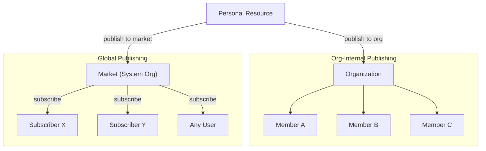
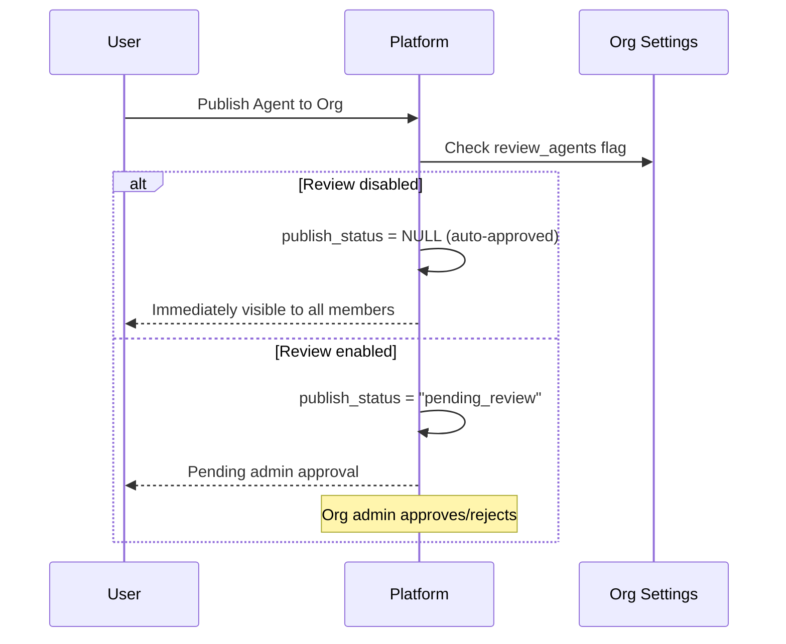
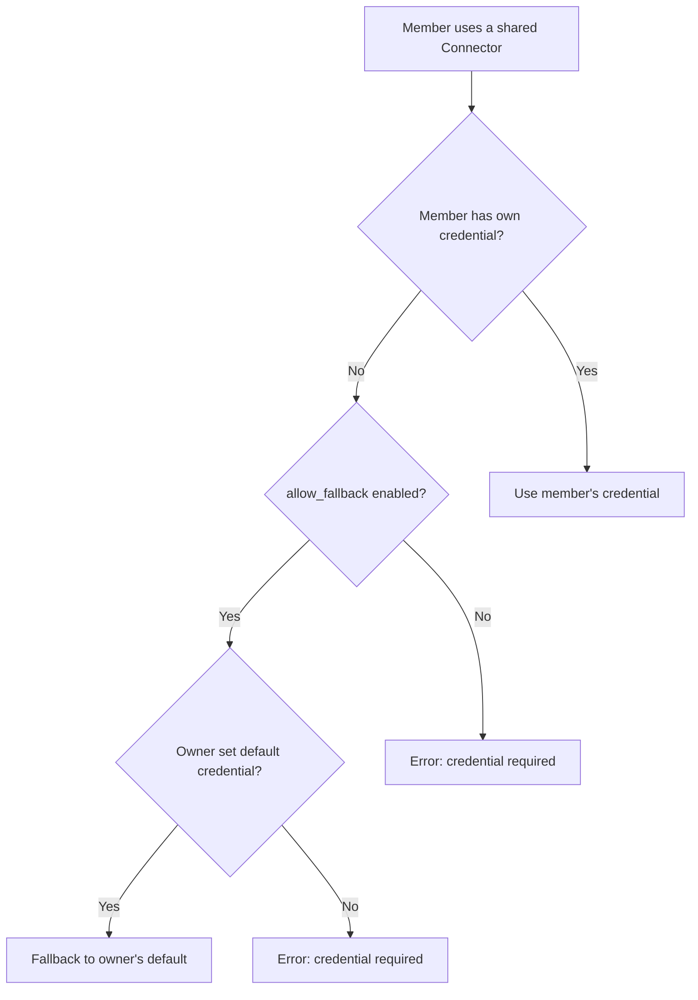
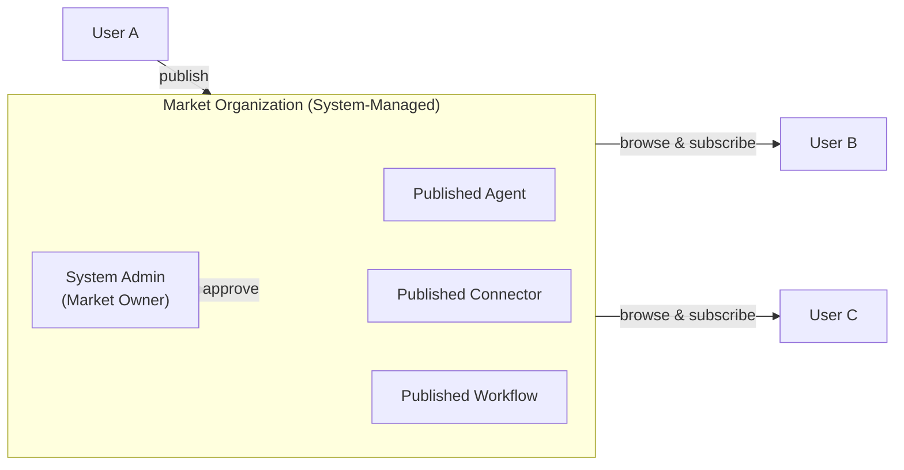
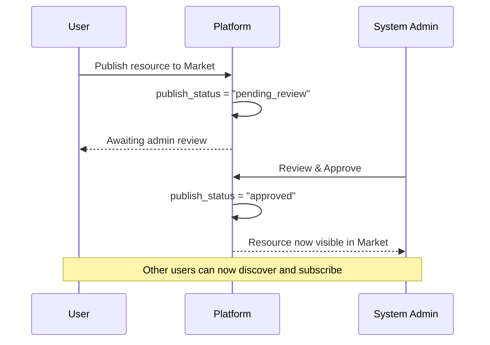
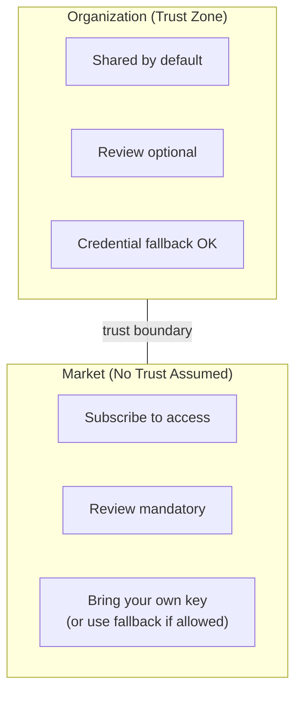

## Übersicht

FIM One nutzt **Organisationen** als primäre Einheit für Zusammenarbeit und Ressourcenverteilung. Jede Ressource (Agent, Connector, Knowledge Base, MCP Server, Workflow, Skill) beginnt als **persönlich** und kann in einer Organisation veröffentlicht werden, um sie freizugeben.

Es gibt zwei unterschiedliche Verteilungskanäle:



| Kanal | Vertrauensmodell | Überprüfung | Zugriff | Anmeldedaten-Handling |
|---|---|---|---|---|
| **Organisation** | Hohes Vertrauen (Team/Unternehmen) | Optional (pro Ressourcentyp) | Automatisch für alle Mitglieder | Fallback auf Anmeldedaten des Eigentümers |
| **Markt** | Kein Vertrauen (globale Community) | Immer erforderlich | Abonnement erforderlich | Fallback oder eigener Schlüssel |

## Organisationen

### Erstellen und Beitreten

Jeder Benutzer kann **unbegrenzte** Organisationen erstellen und einer beliebigen Anzahl von ihnen beitreten. Eine Organisation hat:

- **Eigentümer**: der Ersteller mit vollständiger Kontrolle
- **Administratoren**: können Mitglieder verwalten und veröffentlichte Ressourcen überprüfen
- **Mitglieder**: können freigegebene Ressourcen anzeigen und verwenden

### Veröffentlichung von Ressourcen

Wenn ein Benutzer eine Ressource in seiner Organisation veröffentlicht, wird sie in der entsprechenden Ressourcenliste für alle Mitglieder angezeigt — Agenten erscheinen in der Agentenliste, Konnektoren in der Konnektorenliste und so weiter.



**Überprüfung ist optional.** Jede Organisation hat unabhängige Überprüfungs-Schalter für jeden Ressourcentyp (`review_agents`, `review_connectors`, `review_kbs`, `review_mcp_servers`, `review_workflows`, `review_skills`). Wenn die Überprüfung deaktiviert ist, sind veröffentlichte Ressourcen sofort für alle Mitglieder verfügbar — ähnlich wie ein gemeinsames Team-Laufwerk.

<Tip>
Organisationsinhaber umgehen die Überprüfung automatisch. Ihre veröffentlichten Ressourcen sind immer sofort verfügbar.
</Tip>

### Credential Fallback

Für Konnektoren und MCP Server, die Anmeldedaten erfordern (API-Schlüssel, Datenbankpasswörter usw.), bietet FIM One einen **Fallback-Mechanismus**:



- **Fallback aktiviert** (`allow_fallback=true`, Standard): Mitglieder, die ihre eigenen Anmeldedaten nicht bereitstellen, verwenden automatisch die Standard-Anmeldedaten des Eigentümers. Dies ist ideal für gemeinsam genutzte Team-API-Schlüssel oder interne Dienste.
- **Fallback deaktiviert** (`allow_fallback=false`): Jedes Mitglied muss seine eigenen Anmeldedaten konfigurieren. Dies ist angemessen, wenn jeder Benutzer seinen eigenen API-Schlüssel benötigt (z. B. pro-Benutzer-SaaS-Lizenzen).

Ressourcen, die keine Anmeldedaten erfordern (z. B. ein schreibgeschützter öffentlicher API-Konnektor oder ein Agent ohne Authentifizierung), funktionieren sofort für alle Mitglieder – keine Konfiguration erforderlich.

## Market (Globale Veröffentlichung)

Der **Market** ist eine spezielle, vom System verwaltete Organisation, die als globaler Ressourcen-Marktplatz von FIM One dient.

### Wie der Markt funktioniert



Wichtigste Merkmale:

1. **Einzelne globale Instanz.** Es gibt genau eine Market-Organisation im System. Sie wird automatisch während der Plattforminitialisierung erstellt.
2. **Alle sind Teilnehmer.** Alle Benutzer können Market-Ressourcen durchsuchen und abonnieren. Der Markt ist immer zugänglich – er ist der Standard-Entdeckungskanal.
3. **Obligatorische Überprüfung.** Im Gegensatz zu regulären Organisationen erfordert der Markt **immer** eine Überprüfung. Jede veröffentlichte Ressource muss von einem Systemadministrator genehmigt werden, bevor sie sichtbar wird. Diese Überprüfungsanforderung ist gesperrt und kann nicht geändert werden.
4. **Abonnieren zur Nutzung.** Benutzer müssen eine Market-Ressource explizit abonnieren, bevor sie in ihren Ressourcenlisten angezeigt wird. Dies unterscheidet sich vom organisationsinternen Teilen, bei dem Ressourcen automatisch für alle Mitglieder verfügbar sind.

### Veröffentlichung auf dem Marktplatz



### Abonnieren und Verwenden

Nachdem eine Ressource genehmigt und im Markt aufgelistet wurde, kann jeder Benutzer:

1. **Den Markt durchsuchen**, um verfügbare Ressourcen zu entdecken
2. **Eine Ressource abonnieren**, die er verwenden möchte
3. **Die Ressource verwenden** — wenn sie Anmeldedaten erfordert und kein Fallback unterstützt, müssen zunächst eigene Schlüssel konfiguriert werden

## Vertrauensgrenze

Die Unterscheidung zwischen Organisation und Marktplatz spiegelt eine grundlegende **Vertrauensgrenze** wider:



### Innerhalb einer Organisation

Mitglieder derselben Organisation teilen eine implizite **Vertrauensbeziehung**. Der Organisationsinhaber hat beschlossen, diese Personen zusammenzubringen, daher:

- Veröffentlichte Ressourcen sind **sofort verfügbar** (es sei denn, die Überprüfung ist explizit aktiviert)
- Credential-Fallback bedeutet, dass Mitglieder die gemeinsamen API-Schlüssel des Inhabers verwenden können
- Kein Abonnementschritt erforderlich – wenn Sie in der Organisation sind, sehen Sie alles, was freigegeben wurde

Dies spiegelt wider, wie Teams in der Praxis funktionieren: Sie vertrauen Ihren Teamkollegen mit gemeinsamer Infrastruktur.

### Über den Marktplatz

Der Marktplatz ist **global** — jeder kann veröffentlichen und jeder kann abonnieren. Es gibt keine vorbestehende Vertrauensbeziehung, daher:

- **Überprüfung ist obligatorisch**, um zu verhindern, dass minderwertige oder böswillige Ressourcen in das Ökosystem gelangen
- **Abonnement ist erforderlich**, damit Benutzer explizit Ressourcen aktivieren (keine unerwarteten Ergänzungen in ihrem Arbeitsbereich)
- **Credential-Handling** folgt dem gleichen Fallback-Mechanismus, aber Benutzer sollten beachten, dass die Verwendung einer Marktplatz-Ressource mit Fallback bedeutet, dass ihre Anfragen durch die Anmeldedaten des Herausgebers fließen

## Ressourcen-Sichtbarkeitszusammenfassung

Jede Ressource in FIM One hat ein `visibility`-Feld, das ihren Zugriffsgeltungsbereich bestimmt:

| Sichtbarkeit | Geltungsbereich | Wer kann es sehen |
|---|---|---|
| `personal` | Nur Eigentümer | Der Benutzer, der es erstellt hat |
| `org` | Organisation | Alle Mitglieder der Zielorganisation (falls genehmigt) |
| `org` + Market | Global | Jeder, der sich abonniert hat (falls vom Administrator genehmigt) |

Die Sichtbarkeitsfiltierungslogik ist einheitlich — die gleiche Abfrage verarbeitet persönliche, organisatorische und abonnierte Ressourcen:

```
Sichtbar wenn:
  1. Du bist der Eigentümer (beliebige Sichtbarkeit), ODER
  2. Es ist für eine Organisation veröffentlicht, der du angehörst UND genehmigt, ODER
  3. Du hast es vom Market abonniert
```

## Praktische Szenarien

### Szenario 1: Team teilt einen Datenbank-Konnektor

1. Alice erstellt einen Konnektor zur PostgreSQL-Datenbank des Teams
2. Alice veröffentlicht ihn in der Org ihres Teams (Überprüfung ist für Konnektoren deaktiviert)
3. Bob und Carol sehen ihn als Org-Mitglieder sofort in ihrer Konnektoren-Liste
4. Der Konnektor verwendet Alices Datenbank-Anmeldedaten als Fallback — Bob und Carol müssen nichts konfigurieren
5. Wenn Dave (externer Auftragnehmer) seine eigenen Anmeldedaten mit Lesezugriff benötigt, kann er diese überschreiben

### Szenario 2: Veröffentlichung eines Agenten auf dem Marktplatz

1. Alice erstellt einen „Contract Analyzer" Agenten und veröffentlicht ihn auf dem Marktplatz
2. Der Systemadministrator überprüft und genehmigt ihn
3. Der Agent erscheint auf der Marktplatz-Browsing-Seite
4. Bob entdeckt ihn, klickt auf „Abonnieren", und er erscheint in seiner Agentenliste
5. Der Agent verweist auf einen Konnektor, der einen API-Schlüssel mit `allow_fallback=false` erfordert — Bob muss seinen eigenen Schlüssel konfigurieren, bevor er ihn verwenden kann

### Szenario 3: Organisation mit strikter Überprüfung

1. Ein compliance-fokussiertes Unternehmen aktiviert `review_agents=true` und `review_connectors=true` in ihrer Organisation
2. Wenn ein Mitarbeiter einen neuen Agenten veröffentlicht, wechselt dieser in den Status "pending_review"
3. Ein Organisations-Admin überprüft die Agenten-Konfiguration und genehmigt sie
4. Erst dann wird sie für andere Mitglieder verfügbar
5. Wenn der Herausgeber den genehmigten Agenten später bearbeitet, wechselt dieser automatisch zurück zu "pending_review" zur erneuten Genehmigung
