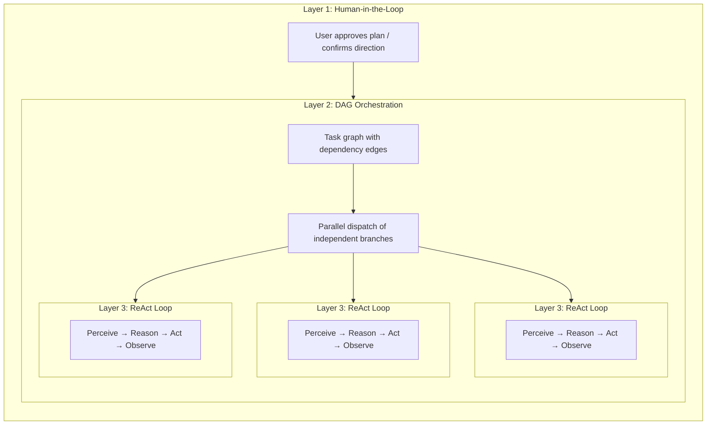

## Fünf Arten von "Planung" in der KI-Tooling-Landschaft

Das Wort "Planung" ist überladen. Heute existieren mindestens fünf unterschiedliche Ansätze, und sie lösen verschiedene Probleme:

| Ansatz | Planformat | Ausführung | Genehmigung | Kernwert |
|---|---|---|---|---|
| **Implizite Modellplanung** | Interne Chain-of-Thought | Einzelner Inferenzdurchlauf | Keine | Das Modell durchdenkt Schritte selbstständig |
| **Claude Code Planmodus** | Markdown-Dokument | Seriell | Mensch überprüft vor Ausführung | Einigung auf Ansatz vor Code-Änderungen |
| **Claude Code Teams** | Aufgabenliste mit Abhängigkeitskanten | **Parallel** (Multi-Agent) | Mensch genehmigt Plan, dann autonom | Dynamischer Agent-Pool + parallele Ausführung |
| **Kiro spec-driven dev** | Strukturierte Spezifikation (Anforderungen + Design + Aufgaben) | Seriell | Mensch überprüft Spezifikation | Nachverfolgbare Anforderungen, Akzeptanzkriterien |
| **FIM One DAG** | JSON-Abhängigkeitsgraph | **Parallel** (einzelner Orchestrator) | Automatisch (PlanAnalyzer) | Parallele Ausführung + Laufzeit-Scheduling |

Die ersten beiden sind **Design-Zeit**-Planung — sie erzeugen einen Plan *vor* Arbeitsbeginn, und ein Mensch (oder das Modell selbst) folgt ihm Schritt für Schritt. Die letzten drei führen **Laufzeit**-Planung ein — Ausführungsgraphen werden programmgesteuert generiert und geplant, mit unabhängigen Branches, die parallel laufen. Der Unterschied liegt darin, *wer* ausführt: Claude Code Teams startet autonome Agenten; FIM One DAG verteilt Schritte innerhalb eines einzelnen Orchestrators.

Diese Ansätze sind keine Konkurrenten; sie sind komplementäre Schichten. Eine Kiro-ähnliche Spezifikation kann definieren, *was* gebaut werden soll, während ein FIM One DAG *wie* die Unteraufgaben parallel ausgeführt werden, planen kann. Claude Code's Planmodus stellt sicher, dass ein Mensch dem Ansatz zustimmt; FIM One's PlanAnalyzer überprüft das Ergebnis automatisch.

## Dreischichtige Verschachtelung: Die Vollleistungs-Architektur

Sowohl Claude Code Teams als auch FIM One DAG zeigen in voller Kapazität eine **dreischichtige verschachtelte Architektur**:

- **Layer 1 — Human Gate**: Der Benutzer überprüft den Plan und genehmigt ihn vor Beginn der Ausführung.
- **Layer 2 — DAG-Orchestrierung**: Der genehmigte Plan wird in Aufgaben mit Abhängigkeitskanten zerlegt. Unabhängige Aufgaben laufen parallel; nachgelagerte Aufgaben warten auf die Auflösung ihrer Blocker.
- **Layer 3 — ReAct-Innenschleife**: Jede Aufgabe wird von einem Agenten ausgeführt, der einen vollständigen ReAct-Zyklus durchläuft (Perceive → Reason → Act → Observe), mit Fähigkeit zu mehrstufigem Reasoning, Tool-Nutzung und autonomem Retry.

Die Kernidee: **Claude Code Teams und FIM One DAG implementieren die gleichen drei Schichten, nur mit unterschiedlicher Layer-2-Mechanik** — Message-Passing vs. Abhängigkeitskanten-Auflösung.

## Full-Power Runtime: FIM One vs Claude Code Teams

Beide sind echte Agenten — die Kernschleife ist identisch: **Wahrnehmen → Reasoning → Handeln → Feedback**. Der Unterschied liegt darin, wie sie parallele Arbeit mit voller Kapazität orchestrieren.

| Dimension | Claude Code Teams | FIM One DAG |
|---|---|---|
| **Parallelmodell** | Leader spawnt SubAgenten, weist Aufgaben über Nachrichten zu | Topologische Sortierung parallelisiert unabhängige Schritte automatisch |
| **Aufgabengraph** | TaskList mit `blockedBy` / `blocks` Kanten (dynamischer DAG) | Statischer JSON DAG mit `depends_on` Kanten |
| **Koordination** | Explizite Nachrichtenübergabe (SendMessage / Broadcast) | Implizite Abhängigkeitskanten — keine Nachrichten, nur Datenfluss |
| **Agenten-Lebenszyklus** | Dynamischer Pool — Agenten bei Bedarf erzeugt, beendet wenn fertig | Feste Schritt-Executoren — ein LLM-Aufruf pro Schritt |
| **Feedback & Korrektur** | Jeder SubAgent versucht autonom erneut; Leader weist bei Fehler neu zu | PlanAnalyzer bewertet Ergebnisse → Re-Planning-Schleife (bis zu 3 Runden) |
| **Menschliche Beteiligung** | Plan-Modus-Genehmigung, dann autonome Ausführung | Vollautomatisch — PlanAnalyzer entscheidet über Bestätigung/Neuplanung |
| **Kontextverwaltung** | Jeder SubAgent erhält isoliertes Kontextfenster (keine Kreuzkontamination) | Gemeinsamer DbMemory + LLM Compact über alle Schritte |
| **Token-Ökonomie** | `N Agenten × Token pro Agent` — Zeit↓ Token↑ (multiplikativer Kostenfaktor) | Sequenziell oder flache Parallelität — niedrigere Gesamttoken |
| **Skalierungsmuster** | Mehr SubAgenten hinzufügen (horizontal, nachrichtengekoppelt) | Mehr DAG-Branches hinzufügen (horizontal, abhängigkeitsgekoppelt) |
| **Am besten geeignet für** | Vielfältige, lose verwandte Aufgaben (Recherche + Code + Test) | Strukturierte Workflows mit klaren Datenabhängigkeiten |

### Real-World Benchmark: v0.5 RAG System

Claude Code Teams built FIM One's entire v0.5 RAG subsystem in a single session:

- **8 phases**: Embedding → Reranker → Loaders → Chunking → VectorStore → Retrieval → KB Backend → Frontend + Docs
- **46 tests** passing, frontend build clean
- **Wall time**: ~5 minutes
- **Token cost**: ~100k tokens per Agenten-Aufgabe × 8+ tasks ≈ 800k+ total tokens
- **Dependency edges**: Phase 5 depends on Phase 4 + 1b; Phase 6 depends on Phase 5 + 2 + 3 — a genuine DAG

This demonstrates the core trade-off: **time parallelism at the cost of token multiplication**. Claude Code Teams trades compute dollars for developer hours.

### Konvergenz, nicht Konkurrenz

Die Grenze zwischen „Team-Zusammenarbeit" und „Pipeline-Planung" verschwimmt:

- **Claude Code Teams' `blockedBy`/`blocks` IST ein DAG** — Aufgaben haben explizite Abhängigkeitskanten, und der Leader verteilt neu freigegebene Aufgaben, wenn Vorgänger abgeschlossen sind. Dies ist topologische Planung mit zusätzlichen Schritten (Nachrichten).
- **FIM One's DAG könnte von Agent-Autonomie profitieren** — statt einzelner LLM-Aufrufe pro Schritt würde es, wenn jeder Schritt eine vollständige ReAct-Schleife ausführt, komplexe Teilaufgaben besser bewältigen.

**Fazit:** Gleiche Agent-Essenz, konvergierende parallele Philosophien. Claude Code folgt einem **Team-Zusammenarbeit**-Modell — ein Leader delegiert an Worker, die sich über Nachrichten austauschen. FIM One folgt einem **Pipeline-Planungs**-Modell — ein DAG-Executor verteilt Schritte basierend auf Abhängigkeitsauflösung. In der Praxis implementieren beide abhängigkeitsgesteuerte parallele Ausführung; der Unterschied liegt im Koordinations-Overhead (Nachrichten vs. Kanten) und der Token-Ökonomie (isolierte Kontexte vs. gemeinsamer Speicher). Die optimale Architektur kombiniert wahrscheinlich beide: DAG-Planung für strukturierte Pipelines, Agent-Pools für Aufgaben, die autonome mehrstufige Reasoning benötigen.

## Strukturierte Ausgabe-Degradation

Alle strukturierten LLM-Aufrufe in der DAG-Pipeline (Planner, Analyzer, Tool Selection) verwenden ein einheitliches `structured_llm_call()`-Utility, das eine 3-stufige Degradationskette implementiert:

| Stufe | Bedingung | Funktionsweise |
|---|---|---|
| **Native FC** | `llm.abilities["tool_call"]` | Erzwingt einen virtuellen Tool-Aufruf; extrahiert aus `tool_calls[0].arguments` |
| **JSON Mode** | `llm.abilities["json_mode"]` | Setzt `response_format={"type":"json_object"}`; parst mit `extract_json()` |
| **Nur Text** | immer verfügbar | Parst freiformatigen Inhalt mit `extract_json()`, dann optional `regex_fallback()` |

Jede textbasierte Stufe wird einmal mit einem Umformatierungsprompt wiederholt, bevor zur nächsten Stufe übergegangen wird. Das Ergebnis ist ein `StructuredCallResult`, das den geparsten Wert, die erfolgreiche Extraktionsstufe und die kumulierte Token-Nutzung enthält.

Dieses Design bedeutet, dass derselbe Prompt zuverlässig über GPT-4 (native FC), Claude (JSON Mode) und lokale Modelle (nur Text) funktioniert, mit konsistenter Fehlerbehandlung und Wiederholungslogik an einer Stelle statt verstreut über vier Aufruforte.

## Drei Ausführungsebenen: Kontrollspektrum

Die fünf Planungsansätze oben beschreiben die Landschaft. Innerhalb von FIM One selbst bieten drei Ausführungsebenen ein **Kontrollspektrum** — von vollständiger menschlicher Kontrolle bis zur vollständigen KI-Autonomie:

| Ebene | Graph definiert durch | Graph existiert wenn? | Am besten für |
|---|---|---|---|
| **Workflow Engine** | Benutzer (visuelle Canvas / JSON-Blueprint) | Entwurfszeit | Deterministische Prozesse, Compliance/Audit-Trails, zeitgesteuerte Automatisierung, Nicht-KI-Orchestrierung |
| **DAGPlanner** | LLM (zerlegt das Ziel automatisch) | Laufzeit | Zerlegbare mehrstufige Aufgaben mit klaren Untergrenzen |
| **ReAct Agent** | Keine (iterative Schleife) | Nie — kein Graph | Explorative, konversationelle oder iterativ verfeinernde Aufgaben |

Das Designprinzip: **Geben Sie Benutzern genau so viel Kontrolle, wie sie möchten**.

- Müssen Sie nachweisen, dass jede Kreditgenehmigung fünf spezifische Schritte durchläuft? → Workflow.
- Müssen Sie drei Themen parallel recherchieren und dann synthetisieren? → DAG.
- Müssen Sie entwerfen und verfeinern, bis Sie zufrieden sind? → Agent.
- Nicht sicher? → `execution_mode: "auto"` lässt das LLM die Abfrage klassifizieren und zur Laufzeit zu DAG oder ReAct weiterleiten.

Diese Schichtung ist das, was FIM One von Single-Paradigma-Tools unterscheidet:

- **Dify** bietet nur die Workflow-Ebene (statische visuelle DAGs).
- **LangGraph** bietet nur eine Code-Level-Graph-DSL (von Entwicklern definierte Topologie, dynamisches Routing — strukturell äquivalent zu visuellen Workflows, aber Python erforderlich).
- **Manus** bietet nur die Agent-Ebene (autonome Ausführung, keine benutzerdefinierte Struktur).

FIM One deckt alle drei Ebenen ab, plus automatisches Routing zwischen ihnen. Die Abstraktionsprogression — benutzerdefinierter Graph → LLM-generierter Graph → kein Graph — spiegelt einen breiteren Industrietrend wider: Mit zunehmend fähigeren Modellen werden explizite Orchestrierungsstrukturen eher optional als obligatorisch.
