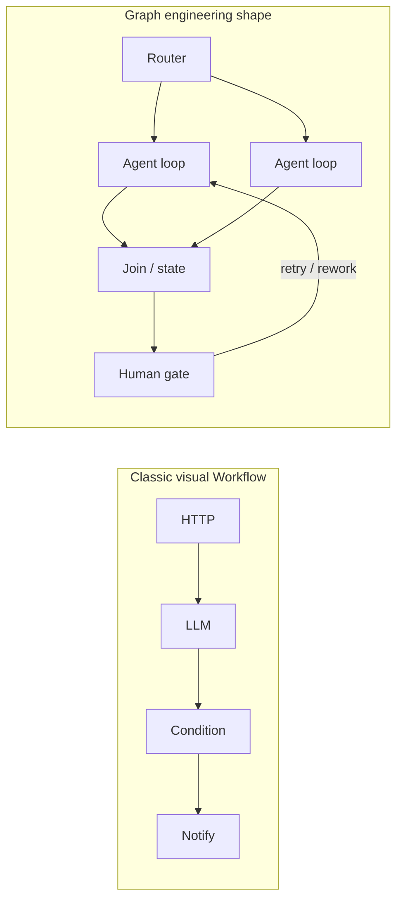
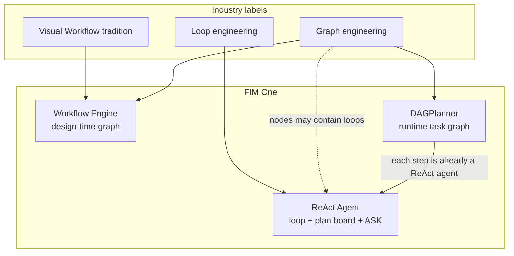
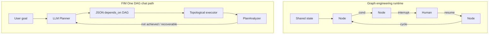
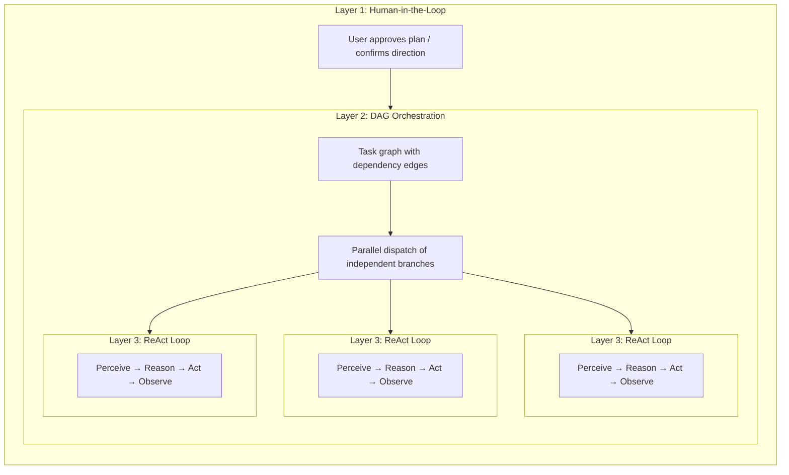

## Graph Engineering (2026) und FIM One

Diskussionen in der Industrie beschreiben oft einen Shift von **Loop Engineering** (ein einzelner Agent denkt und handelt wiederholt) zu **Graph Engineering** (Multi-Node-Topologien als explizites Engineering-Objekt). Das Label ist neu; die Praxis nicht. LangGraph-ähnliche Systeme und Multi-Agent-Organisationen nutzen seit Jahren Graphen. Für FIM One ist entscheidend, welche **Art** von Graph gemeint ist und wie diese auf unsere drei Execution Layers abgebildet wird.

### Was Graphengineering normalerweise bedeutet

| Layer (häufige Darstellung) | Concern |
|---|---|
| **Harness** | Tools, Sandbox, Auth, Logging, Quotas rund um das Modell |
| **Loop** | Ein Agenten-Zyklus: denken → handeln → beobachten |
| **Graph** | Wie **Knoten** verbunden sind: Verzweigungen, Joins, Zyklen, menschliche Checkpoints, gemeinsamer State |

Konsens über diese Darstellung: **Graph ersetzt Loop nicht**. Graph-Designs **Beziehungen zwischen Prozessen**; jeder agentic Node kann immer noch einen vollständigen Loop ausführen.

"Graph" ist in der Praxis überladen. Drei Verwendungen vermischen sich:

| Verwendung | Beispiel | Rolle |
|---|---|---|
| **Control-flow graph** | LangGraph `StateGraph`: bedingte Kanten, Wiederholungen, Interrupt/Resume | State Machine für die nächste Ausführung |
| **Task dependency graph** | Claude Code Tasks `blockedBy`; FIM One `depends_on` | Planung und Parallelisierung von Arbeit |
| **Knowledge graph** | Entitäten und typisierte Relationen | Retrieval / Memory (nicht Orchestrierung) |

Diese Seite behandelt die ersten beiden (Orchestrierung).

### Nicht „Dify Workflow mit neuem Namen"

Dify-ähnliche **visuelle Workflows** und Graph Engineering teilen eine gemeinsame Herkunft (**explizite Topologie**), sind aber nicht dasselbe Produkt.

| | Klassischer visueller Workflow (z. B. Dify) | Graph Engineering (2026-Nutzung) |
|---|---|---|
| **Primäres Artefakt** | Canvas / Blueprint, den der Implementierer zeichnet | Topologie als versioniertes Systemdesign (Code oder Konfiguration) |
| **Knoten** | Feste Funktionsblöcke (LLM, HTTP, KB, Bedingung…) | **Heterogen**: Funktionen, Router, **vollständige Agenten**, Menschen, Joins |
| **Wo Intelligenz lebt** | Hauptsächlich in isolierten LLM-Knoten; der Graph ist eine Leitung | Oft **in Knoten** (jeder kann eine Schleife sein); der Graph organisiert Rollen |
| **Kanten** | Pipeline-Erfolg/Fehler und Verzweigungen | Kontrollfluss **und** Zustandsübergänge, einschließlich **kontrollierter Zyklen** |
| **Mensch-in-der-Schleife** | Formulare / Genehmigungen als Add-ons | Unterbrechen / Fortsetzen als First-Class-Primitive |
| **Relation zur Schleife** | Oft verkauft als „Workflow **vs** Agent" | Explizit **Graph über Loop** |

Kurzform: Klassischer Workflow ist eine **deterministische (oder semi-deterministische) Leitung** mit gelegentlichen LLM-Schritten. Graph Engineering ist **Multi-Knoten-Systemtopologie**, wo kritische Positionen immer noch autonome Agenten sein können.

```mermaid
flowchart LR
  subgraph classic["Classic visual Workflow"]
    A1[HTTP] --> A2[LLM] --> A3[Condition] --> A4[Notify]
  end
  subgraph ge["Graph engineering shape"]
    B1[Router] --> B2[Agent loop]
    B1 --> B3[Agent loop]
    B2 --> B4[Join / state]
    B3 --> B4
    B4 --> B5[Human gate]
    B5 -->|retry / rework| B2
  end
```

### Wie die Industriekarte auf FIM One sitzt

FIM One umfasst bereits das gesamte Kontrollspektrum; Chat-„Planner-Modus" ist nur ein Ausschnitt.

| Industriekonzept | Nächstes FIM One-Element | Passung |
|---|---|---|
| Klassischer visueller Workflow | **Workflow Engine** (Design-Zeit-Blueprint) | Stark |
| Kontrollfluss-Graph + HITL + dauerhafter Zustand | Workflow-Schritte mit Benutzer + Bestätigungsgates; teilweise auf Chat-DAG | Mittel |
| Task-Abhängigkeitsgraph + parallele Planung | **DAGPlanner** (`depends_on`, topologische Fan-out) | Stark bei Planung; schwächer bei HITL im mittleren Graph |
| Einzelne Agent-Schleife + Checklisten-Speicher | **ReAct** (`update_plan`, Tools, `ask_user_question`) | Stark |
| Laufzeit-LLM-gezeichneter Plan bei jedem Durchgang | **DAGPlanner** (nicht Dify; nicht LangGraph Design-Zeit-DSL) | Unterschiedliches Produkt |

```mermaid
flowchart TB
  subgraph industry["Industry labels"]
    GE["Graph engineering"]
    Loop["Loop engineering"]
    WF["Visual Workflow tradition"]
  end
  subgraph fim["FIM One"]
    W["Workflow Engine<br/>design-time graph"]
    D["DAGPlanner<br/>runtime task graph"]
    R["ReAct Agent<br/>loop + plan board + ASK"]
  end
  WF --> W
  GE --> W
  GE --> D
  Loop --> R
  GE -.->|"nodes may contain loops"| R
  D -->|"each step is already a ReAct agent"| R
```

### Graph Engineering vs. FIM One DAG (Chat Planner)

Gleiche Familie (explizite Multi-Step-Topologie). Unterschiedliche Arten.

| Dimension | Graph Engineering (typisch) | FIM One DAG (Chat) |
|---|---|---|
| **Wer zeichnet den Graph** | Entwickler / Implementierer (stabile Topologie) | **LLM zur Laufzeit** (neuer Graph pro Ziel) |
| **Kantenbedeutung** | Oft **Kontrollfluss** (nächster Schritt, einschließlich Schleifen) | Hauptsächlich **Abhängigkeit / Daten** (`depends_on`, azyklische Ausführung) |
| **Korrektur** | Wiederholung auf Kantenebene, manueller Knoten, Wiederaufnahme desselben Graphen | **PlanAnalyzer → Neuplanung** (oft ein **neuer** Graph) |
| **Knotentiefe** | Knoten kann eine vollständige Agent-Schleife sein | **Bereits vollständiges ReAct pro Schritt**: `DAGExecutor` führt `agent.run()` mit einer Multi-Iterations-Tool-Schleife aus (Standard-Obergrenze von `DAG_STEP_MAX_ITERATIONS`, üblicherweise 15). Standardmodell ist Registry **general** (nicht Infrastructure Fast); `model_hint` kann zu Reasoning eskaliert oder zu Fast herabgestuft werden. Tool-Cache, Schritt-/Zitierverifikation und Quellennachweis werden mit jedem Schritt bereitgestellt. Schritt-Agenten setzen `enable_plan_tool=False` (kein `update_plan`-Board innerhalb eines Schritts), da die Arbeitseinheit bereits eine fokussierte Teilaufgabe ist. |
| **Gemeinsamer Zustand** | Typisierter Zustand erster Klasse + Checkpoint-Narration | Schrittergebnisse + Speicher/Kompakt; Schritt-Checkpoints existieren |
| **Fragen während der Ausführung** | Unterbrechen als Produktfeature | Bestätigungsgates existieren; **`ask_user_question` ist nur ReAct-spezifisch** (äußere Chat-Schleife), nicht als erste Klasse DAG-Wartekante |
| **Produkteinstieg** | Framework oder Backend-Organisationsstruktur | Benutzersichtbarer Modus neben ReAct |

```mermaid
flowchart TB
  subgraph ge2["Graph engineering runtime"]
    S[Shared state] --> N1[Node]
    N1 -->|cond| N2[Node]
    N2 -->|interrupt| H[Human]
    H -->|resume| N3[Node]
    N3 -->|cycle| N1
  end
  subgraph fimdag["FIM One DAG chat path"]
    G[User goal] --> P[LLM Planner]
    P --> J[JSON depends_on DAG]
    J --> E[Topological executor]
    E --> Z[PlanAnalyzer]
    Z -->|not achieved / recoverable| P
  end
```

**Implikation:** Industrielle Aufmerksamkeit für Graph Engineering **validiert die Beibehaltung einer Graph-/Scheduling-Engine**. Sie erfordert **nicht** einen Chat-Standard, der Benutzer zwingt, für jeden Durchgang „Planner" zu wählen. Die meisten Aufgaben wünschen sich eine starke Schleife; Graphen rechtfertigen ihren Einsatz bei parallelen Branches, festen Compliance-Pfaden und Multi-Rollen-Orchestrierung.

### Was FIM One lernen kann (ReAct, DAG, Workflow empowern)

Konkrete Erkenntnisse, keine Slogans. Geordnet nach Hebelwirkung.

| # | Graph-Engineering-Idee | Anwenden auf | Richtung |
|---|---|---|---|
| 1 | **Graph über Loop, nicht statt Loop** | Produkt + Auto-Routing | Standard-UX bleibt **ReAct** (Loop + `update_plan` + `ask_user_question`). DAG/Workflow nutzen, wenn die Topologie Kosten rechtfertigt. |
| 2 | **Heterogene tiefe Knoten** | DAG | **Bereits Status quo.** Jeder Schritt ist ein vollständiger ReAct-Agent (`agent.run`, Multi-Iterations-Tools, standardmäßig allgemeines oder besseres Modell), nicht ein One-Shot-LLM-Aufruf. Verbleibende Parameter sind optional (z. B. Plan-Board bei langen Schritten), keine strukturelle Lücke. |
| 3 | **Unterbrechen / Fortsetzen als Kanten** | DAG + ReAct | Mid-Run-Klärung gehört in die **äußere** Schleife oder als First-Class-Wartezustand. Vermeiden Sie Fake-DAG-Schritte, die „den Benutzer fragen" im Text und dann als „Ziel nicht erreicht" neu planen. |
| 4 | **Kontrollierte Zyklen vs. Neuplanung des gesamten Graphen** | DAG | Bevorzugen Sie lokale Wiederholung pro Schritt / teilweiser Übergang (bereits teilweise wahr für abgeschlossene Schritte) statt alle Schritttext als fehlende Endantwort zu dumpen. |
| 5 | **Typisierter gemeinsamer Zustand entlang Kanten** | DAG + Workflow | Stärkere Verträge für Schritt-I/O (Schema, Liefergegenstände) reduzieren Analyzer-Übervertrauen und Antwort-/Quellen-Drift. |
| 6 | **Topologie als versioniertes Asset** | Workflow | Behalten Sie von Menschen erstellte Graphen für Audit; erwarten Sie nicht, dass Runtime-LLM-DAGs Compliance-Blueprints ersetzen. |
| 7 | **Ehrlich „die meisten Aufgaben brauchen keinen Graphen"** | Auto + Docs | Leiten Sie Klärung-und-Wahl, kurze Q&A und explorative Arbeit zu ReAct; reservieren Sie DAG für zerlegbare parallele Arbeit. |

**Anti-Muster, die beim „Graph machen" zu vermeiden sind:**

- Verwendung eines **Abhängigkeitsgraphen** zur Simulation einer **menschlichen Zustandsmaschine** (mehrstufiges „auf Antworten warten" ohne Wait-Primitiv).
- Gleichsetzung von ReAct **`update_plan`** (Checklisten-Speicher) mit Graph-Engineering (Topologie-Planung).
- Versand von Graph-Wärme als zweite Chat-Persönlichkeit statt als **Engine-Komposition** (Loop außen, Schedule innen bei Bedarf).
- Beschreibung von FIM One DAG-Schritten als „flache LLM-Aufrufe": das unterschätzt die Engine und führt zu fehlgeleiteten Produktentscheidungen.

## Fünf Arten von „Planning" in der KI-Tooling-Landschaft

Das Wort „Planning" ist überbelastet. Es gibt heute mindestens fünf unterschiedliche Ansätze, die verschiedene Probleme lösen:

| Ansatz | Plan-Format | Ausführung | Genehmigung | Kernwert |
|---|---|---|---|---|
| **Implizites Model Planning** | Interne Chain-of-Thought | Einzelner Inferenzpass | Keine | Das Modell durchdenkt Schritte selbstständig |
| **Claude Code Plan Mode** | Markdown-Dokument | Seriell | Mensch überprüft vor Ausführung | Abstimmung über Ansatz vor Code-Änderungen |
| **Claude Code Teams** | Aufgabenliste mit Abhängigkeitskanten | **Parallel** (Multi-Agent) | Mensch genehmigt Plan, dann autonom | Dynamischer Agent-Pool + parallele Ausführung |
| **Kiro Spec-Driven Dev** | Strukturierte Spezifikation (Anforderungen + Design + Aufgaben) | Seriell | Mensch überprüft Spezifikation | Nachverfolgbare Anforderungen, Akzeptanzkriterien |
| **FIM One DAG** | JSON-Abhängigkeitsgraph | **Parallel** (einzelner Orchestrator) | Automatisch (PlanAnalyzer) | Parallele Ausführung + Runtime-Scheduling |

Die ersten beiden sind **Design-Zeit**-Planning — sie erzeugen einen Plan, *bevor* die Arbeit beginnt, und ein Mensch (oder das Modell selbst) folgt ihm Schritt für Schritt. Die letzten drei führen **Runtime**-Planning ein — Ausführungsgraphen werden programmgesteuert generiert und geplant, wobei unabhängige Branches parallel laufen. Der Unterschied liegt darin, *wer* ausführt: Claude Code Teams startet autonome Agenten; FIM One DAG verteilt Schritte innerhalb eines einzelnen Orchestrators.

Diese Ansätze sind keine Konkurrenten; sie sind komplementäre Schichten. Eine Kiro-ähnliche Spezifikation kann definieren, *was* gebaut werden soll, während ein FIM One DAG *wie* die Unteraufgaben parallel ausgeführt werden, planen kann. Claude Code's Plan Mode stellt sicher, dass ein Mensch dem Ansatz zustimmt; FIM One's PlanAnalyzer überprüft das Ergebnis automatisch.

## Three-Layer Nesting: The Full-Power Architecture

Sowohl Claude Code Teams als auch FIM One DAG zeigen in ihrer vollen Kapazität eine **dreischichtige verschachtelte Architektur**:

```mermaid
flowchart TB
    subgraph L1["Layer 1: Human-in-the-Loop"]
        direction TB
        H["User approves plan / confirms direction"]

        subgraph L2["Layer 2: DAG Orchestration"]
            direction TB
            D1["Task graph with dependency edges"]
            D2["Parallel dispatch of independent branches"]
            D1 --> D2

            subgraph L3A["Layer 3: ReAct Loop"]
                R1["Perceive → Reason → Act → Observe"]
            end

            subgraph L3B["Layer 3: ReAct Loop"]
                R2["Perceive → Reason → Act → Observe"]
            end

            subgraph L3C["Layer 3: ReAct Loop"]
                R3["Perceive → Reason → Act → Observe"]
            end

            D2 --> L3A & L3B & L3C
        end

        H --> L2
    end
```

- **Layer 1 — Human gate**: Der Benutzer überprüft den Plan und genehmigt ihn vor Beginn der Ausführung.
- **Layer 2 — DAG orchestration**: Der genehmigte Plan wird in Aufgaben mit Abhängigkeitskanten zerlegt. Unabhängige Aufgaben laufen parallel; nachgelagerte Aufgaben warten darauf, dass ihre Blocker aufgelöst werden.
- **Layer 3 — ReAct inner loop**: Jede Aufgabe wird von einem Agenten ausgeführt, der einen vollständigen ReAct-Zyklus durchläuft (Perceive → Reason → Act → Observe), mit Fähigkeit zu mehrstufigem Reasoning, Tool-Nutzung und autonomem Retry.

Der Schlüsselgedanke: **Claude Code Teams und FIM One DAG implementieren die gleichen drei Schichten, nur mit unterschiedlichen Layer-2-Mechaniken** — Message-Passing vs. Dependency-Edge-Auflösung.

## Full-Power Runtime: FIM One vs Claude Code Teams

Both are genuine Agents — the core loop is identical: **Perceive → Reason → Act → Feedback**. The difference lies in how they orchestrate parallel work at full capacity.

| Dimension | Claude Code Teams | FIM One DAG |
|---|---|---|
| **Parallel model** | Leader spawns SubAgents, assigns tasks via messages | Topological sort auto-parallelizes independent steps |
| **Task graph** | TaskList with `blockedBy` / `blocks` edges (dynamic DAG) | Static JSON DAG with `depends_on` edges |
| **Coordination** | Explicit message passing (SendMessage / Broadcast) | Implicit dependency edges — no messages, just data flow |
| **Agent lifecycle** | Dynamic pool — agents spawned on demand, shut down when done | Per-step **ReAct agents** (fresh agent per step via `_resolve_agent`); each step runs a full multi-iteration tool loop |
| **Feedback & correction** | Each SubAgent retries autonomously; Leader re-assigns on failure | PlanAnalyzer evaluates outcomes → Re-Planning loop (up to 3 rounds); completed steps can carry into the next plan |
| **Human involvement** | Plan mode approval, then autonomous execution | Fully automatic — PlanAnalyzer decides pass/replan (chat-level ASK is ReAct-only) |
| **Context management** | Each SubAgent gets isolated context window (no cross-contamination) | Shared DbMemory + LLM Compact across the turn; each step agent still sees its task + dependency results, not a full peer transcript |
| **Token economics** | `N agents × per-agent tokens` — time↓ tokens↑ (multiplicative cost) | Parallel branches cost more than serial ReAct, but shared memory and step caps usually stay below multi-agent team spend |
| **Scaling pattern** | Add more SubAgents (horizontal, message-coupled) | Add more DAG branches (horizontal, dependency-coupled) |
| **Best suited for** | Diverse, loosely-related tasks (research + code + test) | Structured workflows with clear data dependencies |

### Real-World Benchmark: v0.5 RAG System

Claude Code Teams built FIM One's entire v0.5 RAG subsystem in a single session:

- **8 phases**: Embedding → Reranker → Loaders → Chunking → VectorStore → Retrieval → KB Backend → Frontend + Docs
- **46 tests** passing, frontend build clean
- **Wall time**: ~5 minutes
- **Token cost**: ~100k tokens per agent task × 8+ tasks ≈ 800k+ total tokens
- **Dependency edges**: Phase 5 depends on Phase 4 + 1b; Phase 6 depends on Phase 5 + 2 + 3 — a genuine DAG

This demonstrates the core trade-off: **time parallelism at the cost of token multiplication**. Claude Code Teams trades compute dollars for developer hours.

### Konvergenz, nicht Konkurrenz

Die Grenze zwischen „Team-Zusammenarbeit" und „Pipeline-Planung" verschwimmt:

- **Claude Code Teams' `blockedBy`/`blocks` IST ein DAG** — Tasks haben explizite Abhängigkeitskanten, und der Leader verteilt neu freigegebene Tasks, wenn Vorgänger abgeschlossen sind. Dies ist topologische Planung mit zusätzlichen Schritten (Nachrichten).
- **FIM One DAG-Schritte sind bereits vollständige ReAct-Agenten** — Layer 3 ist nicht aspirativ. Jeder Schritt führt `agent.run()` mit Tools und Multi-Iterations-Schleifen aus; Unterschiede zu einem ReAct-Chat-Turn auf oberster Ebene sind absichtlich (kein Plan-Board pro Schritt, kein Chat-Level `ask_user_question`-Wait, Modell gewählt durch `model_hint` / allgemeinen Standard).

**Fazit:** Gleiche Agent-Essenz, konvergierende parallele Philosophien. Claude Code folgt einem **Team-Zusammenarbeits**-Modell — ein Leader delegiert an Worker, die sich über Nachrichten verständigen. FIM One folgt einem **Pipeline-Planungs**-Modell — ein DAG Executor verteilt **ReAct-Schritte** basierend auf Abhängigkeitsauflösung. In der Praxis implementieren beide abhängigkeitsgesteuerte parallele Ausführung; der Unterschied liegt im Koordinations-Overhead (Nachrichten vs Kanten), Isolation (Peer-Agenten vs Task + Abhängigkeitsergebnisse) und Token-Ökonomie. Die Produktlücke ist weniger „mache Knoten zu Agenten" und mehr **wann man einen Graph plant vs in einer Chat-Schleife bleibt**, plus **Human-Wait-Kanten**, wo der Graph nicht pausieren kann.

## Structured Output Degradation

All structured LLM call sites in the DAG pipeline (Planner, Analyzer, Tool Selection) use a unified `structured_llm_call()` utility that implements a 3-level degradation chain:

| Level | Condition | How it works |
|---|---|---|
| **Native FC** | `llm.abilities["tool_call"]` | Forces a virtual tool call; extracts from `tool_calls[0].arguments` |
| **JSON Mode** | `llm.abilities["json_mode"]` | Sets `response_format={"type":"json_object"}`; parses with `extract_json()` |
| **Plain text** | always available | Parses free-form content with `extract_json()`, then optional `regex_fallback()` |

Each text-based level retries once with a reformat prompt before falling to the next. The result is a `StructuredCallResult` containing the parsed value, which extraction level succeeded, and accumulated token usage.

This design means the same prompt works reliably across GPT-4 (native FC), Claude (JSON mode), and local models (plain text), with consistent error handling and retry logic in one place instead of scattered across four call sites.

## Three Execution Layers: Control Spectrum

Die fünf Planungsansätze oben beschreiben die Landschaft. Innerhalb von FIM One selbst bieten drei Ausführungsebenen ein **Kontrollspektrum** von vollständiger menschlicher Kontrolle bis zur vollständigen KI-Autonomie. Im Verhältnis zur Graph-Engineering: **Workflow** ist das Design-Zeit-Graph-Produkt; **DAGPlanner** ist ein Laufzeit-Task-Graph; **ReAct** ist Loop-Engineering (mit optionalem Plan-Board-Speicher, kein Schedule-Graph).

| Layer | Graph definiert durch | Graph existiert wann? | Graph-Engineering-Rolle | Am besten für |
|---|---|---|---|---|
| **Workflow Engine** | Benutzer (visuelles Canvas / JSON-Blueprint) | Design-Zeit | Am nächsten zum klassischen visuellen Workflow + dauerhafter Prozess-Topologie | Deterministische Prozesse, Compliance/Audit-Trails, Cron-geplante Automatisierung |
| **DAGPlanner** | LLM (zerlegt das Ziel automatisch) | Laufzeit | Task-Abhängigkeitsgraph + parallele Planung + Ergebnisanalyse | Zerlegbare mehrstufige Arbeit mit klaren Sub-Task-Grenzen |
| **ReAct Agent** | Keine (iterative Schleife) | Nie als Schedule-Graph | Loop-Ebene; Knoten in einem größeren Graph können ReAct-Agenten sein | Explorativ, konversativ, Klärung-dann-Aktion, iterative Verbesserung |

Das Designprinzip: **Geben Sie Benutzern genau so viel Kontrolle, wie sie möchten**.

- Müssen Sie nachweisen, dass jede Kreditgenehmigung fünf spezifische Schritte durchläuft? → Workflow.
- Müssen Sie drei Themen parallel recherchieren und dann synthetisieren? → DAG.
- Müssen Sie während der Ausführung entwerfen, verfeinern oder strukturierte Fragen stellen? → ReAct.
- Unsicher? → `execution_mode: "auto"` klassifiziert die Abfrage und leitet zur Laufzeit zu DAG oder ReAct weiter (bevorzugt ReAct, wenn das Ziel hauptsächlich Klärung oder kurze Exploration ist).

Diese Schichtung ist das, was FIM One von Single-Paradigma-Tools unterscheidet:

- **Dify** betont die Workflow-Ebene (statische oder semi-statische visuelle Graphen).
- **LangGraph** betont eine Code-Level-Kontrollfluss-Graph-DSL (benutzer-definierte Topologie, dynamisches Routing, Checkpointing). Strukturell verwandt mit visuellen Workflows, ausgedrückt als Software.
- **Manus-Klasse-Agenten** betonen die Agent/Loop-Ebene (autonome Ausführung, wenig benutzerdefinierte Struktur).

FIM One deckt alle drei Ebenen ab, plus automatisches Routing zwischen Chat-Engines. Die Progression **benutzerdefinierter Graph → LLM-generierter Task-Graph → kein Schedule-Graph** entspricht einer breiteren Brancheneinsicht: Mit verbesserten Modellen wird **explizite Topologie für die meisten Durchläufe optional, nicht obligatorisch**. Graph-Engineering-Hitze ist ein Grund, **in Engines und Komposition zu investieren**, nicht um jeden Chat durch einen Planner zu zwingen.

### Verwandte Dokumentation

- [ReAct Engine](/architecture/react-engine) — Schleife, Tools, Planboard, Klärungsfragen
- [DAG Engine](/architecture/dag-engine) — Planer, Executor, Analyzer, Neuplanung
- [Competitive Landscape](/strategy/competitive-landscape) — Dify / Manus / Coze Positionierung
