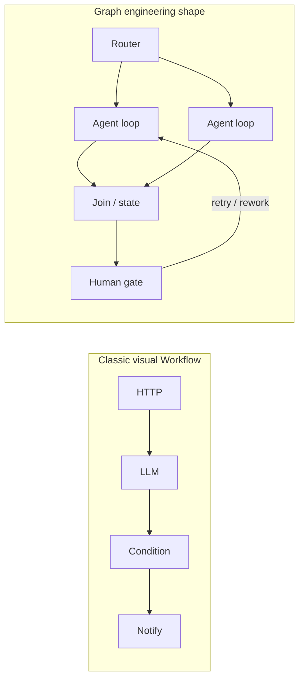
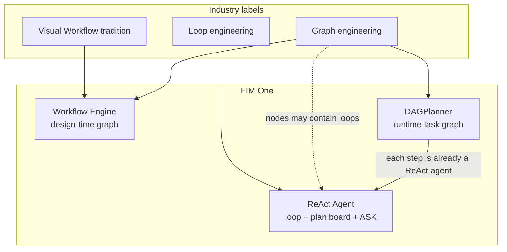
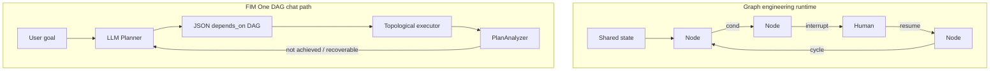
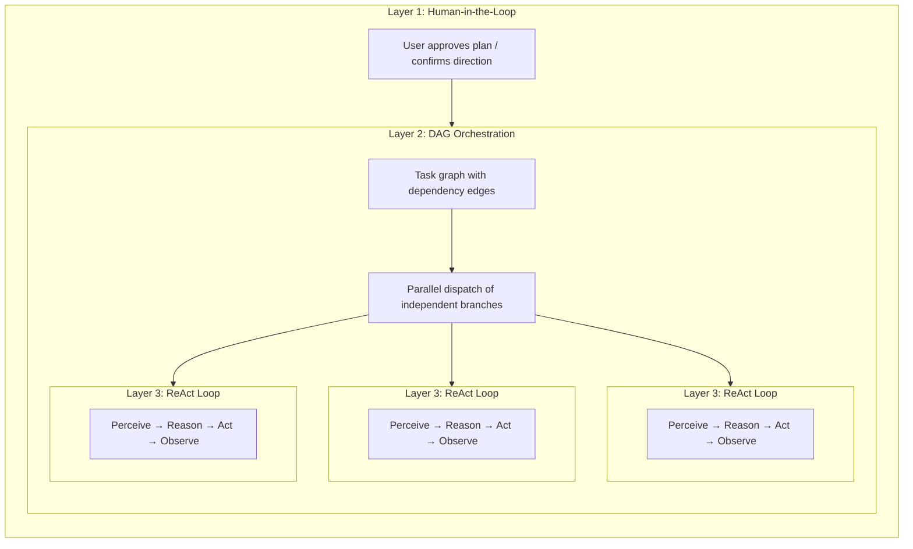

## Graph Engineering (2026) und FIM One

Diskussionen in der Industrie beschreiben oft einen Wechsel von **Loop Engineering** (ein einzelner Agent denkt und handelt wiederholt) zu **Graph Engineering** (Multi-Node-Topologien als explizites Engineering-Objekt). Das Label ist neu; die Praxis nicht. LangGraph-ähnliche Systeme und Multi-Agent-Organisationen nutzen seit Jahren Graphen. Für FIM One ist entscheidend, welche **Art** von Graph gemeint ist und wie diese auf unsere drei Ausführungsschichten abgebildet wird.

### Was Graphengineering normalerweise bedeutet

| Schicht (häufige Darstellung) | Anliegen |
|---|---|
| **Harness** | Tools, Sandbox, Auth, Logging, Quotas rund um das Modell |
| **Loop** | Ein Agenten-Zyklus: think → act → observe |
| **Graph** | Wie sich **Knoten** verbinden: Verzweigungen, Joins, Zyklen, menschliche Checkpoints, gemeinsamer Status |

Konsens über diese Darstellung: **Graph ersetzt Loop nicht**. Graph-Designs **definieren Beziehungen zwischen Prozessen**; jeder agentic Node kann immer noch einen vollständigen Loop ausführen.

"Graph" ist in der Praxis überlastet. Drei Verwendungen vermischen sich:

| Verwendung | Beispiel | Rolle |
|---|---|---|
| **Control-Flow-Graph** | LangGraph `StateGraph`: bedingte Kanten, Wiederholungen, Interrupt/Resume | State Machine für die nächste Ausführung |
| **Task-Abhängigkeitsgraph** | Claude Code Tasks `blockedBy`; FIM One `depends_on` | Planung und Parallelisierung von Arbeit |
| **Knowledge Graph** | Entitäten und typisierte Relationen | Abruf / Speicher (nicht Orchestrierung) |

Diese Seite behandelt die ersten beiden (Orchestrierung).

### Nicht „Dify Workflow mit neuem Namen"

Dify-ähnliche **visuelle Workflows** und Graph Engineering teilen eine gemeinsame Herkunft (**explizite Topologie**), sind aber nicht dasselbe Produkt.

| | Klassischer visueller Workflow (z. B. Dify) | Graph Engineering (Verwendung 2026) |
|---|---|---|
| **Primäres Artefakt** | Canvas / Blueprint, den der Implementierer zeichnet | Topologie als versioniertes Systemdesign (Code oder Konfiguration) |
| **Knoten** | Feste Funktionsblöcke (LLM, HTTP, KB, Bedingung…) | **Heterogen**: Funktionen, Router, **vollständige Agenten**, Menschen, Joins |
| **Wo Intelligenz lebt** | Hauptsächlich in isolierten LLM-Knoten; der Graph ist eine Leitung | Oft **in Knoten** (jeder kann eine Schleife sein); der Graph organisiert Rollen |
| **Kanten** | Pipeline-Erfolg/Fehler und Verzweigungen | Kontrollfluss **und** Zustandsübergänge, einschließlich **kontrollierter Zyklen** |
| **Mensch-in-der-Schleife** | Formulare / Genehmigungen als Add-ons | Unterbrechen / Fortsetzen als First-Class-Primitive |
| **Verhältnis zur Schleife** | Oft verkauft als „Workflow **vs** Agent" | Explizit **Graph über Loop** |

Kurzform: Klassischer Workflow ist eine **deterministische (oder semi-deterministische) Leitung** mit gelegentlichen LLM-Schritten. Graph Engineering ist **Multi-Node-Systemtopologie**, wo kritische Positionen immer noch autonome Agenten sein können.

```mermaid
flowchart LR
  subgraph classic["Classic visual Workflow"]
    A1[HTTP] --> A2[LLM] --> A3[Condition] --> A4[Notify]
  end
  subgraph ge["Graph engineering shape"]
    B1[Router] --> B2[Agent loop]
    B1 --> B3[Agent loop]
    B2 --> B4[Join / state]
    B3 --> B4
    B4 --> B5[Human gate]
    B5 -->|retry / rework| B2
  end
```

### Wie die Industriekarte auf FIM One sitzt

FIM One umfasst bereits das gesamte Kontrollspektrum; der Chat-„Planner-Modus" ist nur ein Ausschnitt.

| Industrieidee | Nächstes FIM One-Element | Passung |
|---|---|---|
| Klassischer visueller Workflow | **Workflow Engine** (Design-Zeit-Blueprint) | Stark |
| Kontrollfluss-Graph + HITL + dauerhafter Zustand | Workflow-Schritte mit Benutzer + Bestätigungsgates; teilweise auf Chat-DAG | Mittel |
| Task-Abhängigkeitsgraph + parallele Planung | **DAGPlanner** (`depends_on`, topologischer Fan-out) | Stark bei Planung; schwächer bei Mid-Graph-HITL |
| Einzelne Agent-Schleife + Checklisten-Speicher | **ReAct** (`update_plan`, Tools, `ask_user_question`) | Stark |
| Runtime-LLM-gezogener Plan bei jedem Durchlauf | **DAGPlanner** (nicht Dify; nicht LangGraph Design-Zeit-DSL) | Unterschiedliches Produkt |

```mermaid
flowchart TB
  subgraph industry["Industry labels"]
    GE["Graph engineering"]
    Loop["Loop engineering"]
    WF["Visual Workflow tradition"]
  end
  subgraph fim["FIM One"]
    W["Workflow Engine<br/>design-time graph"]
    D["DAGPlanner<br/>runtime task graph"]
    R["ReAct Agent<br/>loop + plan board + ASK"]
  end
  WF --> W
  GE --> W
  GE --> D
  Loop --> R
  GE -.->|"nodes may contain loops"| R
  D -->|"each step is already a ReAct agent"| R
```

### Graph Engineering vs. FIM One DAG (Chat Planner)

Gleiche Familie (explizite Multi-Step-Topologie). Unterschiedliche Arten.

| Dimension | Graph Engineering (typisch) | FIM One DAG (Chat) |
|---|---|---|
| **Wer zeichnet den Graph** | Entwickler / Implementierer (stabile Topologie) | **LLM zur Laufzeit** (neuer Graph pro Ziel) |
| **Kantenbedeutung** | Oft **Kontrollfluss** (wo als nächstes, einschließlich Schleifen) | Hauptsächlich **Abhängigkeit / Daten** (`depends_on`, azyklische Ausführung) |
| **Korrektur** | Wiederholung auf Kantenebene, manueller Knoten, Wiederaufnahme desselben Graphen | **PlanAnalyzer → Neuplanung** (oft ein **neuer** Graph) |
| **Knotentiefe** | Knoten kann eine vollständige Agent-Schleife sein | **Bereits vollständiges ReAct pro Schritt**: `DAGExecutor` führt `agent.run()` mit einer Multi-Iterations-Tool-Schleife aus (Standardobergrenze von `DAG_STEP_MAX_ITERATIONS`, üblicherweise 15). Standardmodell ist Registry **general** (nicht Infrastructure Fast); `model_hint` kann zu Reasoning eskaliert oder zu Fast herabgestuft werden. Tool-Cache, Schritt-/Zitierverifikation und Quellennachweis werden mit jedem Schritt bereitgestellt. Schritt-Agenten setzen `enable_plan_tool=False` (kein `update_plan`-Board innerhalb eines Schritts), da die Arbeitseinheit bereits eine fokussierte Teilaufgabe ist. |
| **Gemeinsamer Status** | Typisierter Status erster Klasse + Checkpoint-Erzählung | Schritt-Ergebnisse + Speicher/Kompakt; Schritt-Checkpoints existieren |
| **Mid-Run-Fragen** | Unterbrechen als Produktfeature | Bestätigungsgates existieren; **`ask_user_question` ist nur ReAct-spezifisch** (äußere Chat-Schleife), nicht eine First-Class-DAG-Wartekante |
| **Produkteintrag** | Framework oder Backend-Organigramm | Benutzer-sichtbarer Modus neben ReAct |

```mermaid
flowchart TB
  subgraph ge2["Graph engineering runtime"]
    S[Shared state] --> N1[Node]
    N1 -->|cond| N2[Node]
    N2 -->|interrupt| H[Human]
    H -->|resume| N3[Node]
    N3 -->|cycle| N1
  end
  subgraph fimdag["FIM One DAG chat path"]
    G[User goal] --> P[LLM Planner]
    P --> J[JSON depends_on DAG]
    J --> E[Topological executor]
    E --> Z[PlanAnalyzer]
    Z -->|not achieved / recoverable| P
  end
```

**Implikation:** Branchenhype um Graph Engineering **validiert die Beibehaltung einer Graph-/Scheduling-Engine**. Es erfordert **nicht** einen Chat-Standard, der Benutzer zwingt, bei jedem Durchgang „Planner" zu wählen. Die meisten Aufgaben wünschen sich immer noch eine starke Schleife; Graphen rechtfertigen ihre Existenz bei parallelen Branches, festen Compliance-Pfaden und Multi-Role-Orchestrierung.

### What FIM One can learn (empower ReAct, DAG, Workflow)

Concrete takeaways, not slogans. Ordered by leverage.

| # | Graph engineering idea | Apply to | Direction |
|---|---|---|---|
| 1 | **Graph over loop, not instead of** | Product + Auto routing | Default UX stays **ReAct** (loop + `update_plan` + `ask_user_question`). Use DAG/Workflow when topology earns cost. |
| 2 | **Heterogeneous deep nodes** | DAG | **Already the status quo.** Each step is a full ReAct agent (`agent.run`, multi-iteration tools, general-or-better model by default), not a one-shot LLM call. Remaining knobs are optional (e.g. plan board on long steps), not a structural gap. |
| 3 | **Interrupt / resume as edges** | DAG + ReAct | Mid-run clarification belongs in the **outer** loop or as a first-class wait state. Avoid fake DAG steps that "ask the user" in text and then replan as "goal not achieved". |
| 4 | **Controlled cycles vs whole-graph replan** | DAG | Prefer step-local retry / partial carryover (already partly true for completed steps) over dumping all step text as a failed final answer. |
| 5 | **Typed shared state along edges** | DAG + Workflow | Stronger contracts for step I/O (schema, deliverables) reduce Analyzer false confidence and answer/source drift. |
| 6 | **Topology as a versioned asset** | Workflow | Keep human-authored graphs for audit; do not expect runtime LLM DAGs to replace compliance blueprints. |
| 7 | **Honest "most tasks never need a graph"** | Auto + docs | Route clarify-and-choose, short Q&A, and exploratory work to ReAct; reserve DAG for decomposable parallel work. |

**Anti-patterns to avoid when "doing graph":**

- Using a **dependency graph** to simulate a **human state machine** (multi-step "wait for answers" with no wait primitive).
- Equating ReAct **`update_plan`** (checklist memory) with graph engineering (scheduling topology).
- Shipping graph heat as a second chat personality instead of as **engine composition** (loop outside, schedule inside when needed).
- Describing FIM One DAG steps as "shallow LLM calls": that understates the engine and misleads product decisions.

## Fünf Arten von "Planung" in der KI-Tooling-Landschaft

Das Wort "Planung" ist überladen. Heute existieren mindestens fünf unterschiedliche Ansätze, und sie lösen verschiedene Probleme:

| Ansatz | Planformat | Ausführung | Genehmigung | Kernwert |
|---|---|---|---|---|
| **Implizite Modellplanung** | Interne Chain-of-Thought | Einzelner Inferenzdurchlauf | Keine | Das Modell durchdenkt Schritte selbstständig |
| **Claude Code Planmodus** | Markdown-Dokument | Seriell | Mensch überprüft vor Ausführung | Einigung auf Ansatz vor Code-Änderungen |
| **Claude Code Teams** | Aufgabenliste mit Abhängigkeitskanten | **Parallel** (Multi-Agent) | Mensch genehmigt Plan, dann autonom | Dynamischer Agent-Pool + parallele Ausführung |
| **Kiro spec-driven dev** | Strukturierte Spezifikation (Anforderungen + Design + Aufgaben) | Seriell | Mensch überprüft Spezifikation | Nachverfolgbare Anforderungen, Akzeptanzkriterien |
| **FIM One DAG** | JSON-Abhängigkeitsgraph | **Parallel** (einzelner Orchestrator) | Automatisch (PlanAnalyzer) | Parallele Ausführung + Laufzeit-Scheduling |

Die ersten beiden sind **Design-Zeit**-Planung — sie erzeugen einen Plan *vor* Arbeitsbeginn, und ein Mensch (oder das Modell selbst) folgt ihm Schritt für Schritt. Die letzten drei führen **Laufzeit**-Planung ein — Ausführungsgraphen werden programmgesteuert generiert und geplant, mit unabhängigen Branches, die parallel laufen. Der Unterschied liegt darin, *wer* ausführt: Claude Code Teams startet autonome Agenten; FIM One DAG verteilt Schritte innerhalb eines einzelnen Orchestrators.

Diese Ansätze sind keine Konkurrenten; sie sind komplementäre Schichten. Eine Kiro-ähnliche Spezifikation kann definieren, *was* gebaut werden soll, während ein FIM One DAG *wie* die Unteraufgaben parallel ausgeführt werden, planen kann. Claude Code's Planmodus stellt sicher, dass ein Mensch dem Ansatz zustimmt; FIM One's PlanAnalyzer überprüft das Ergebnis automatisch.

## Dreischichtige Verschachtelung: Die Vollleistungs-Architektur

Sowohl Claude Code Teams als auch FIM One DAG zeigen in voller Kapazität eine **dreischichtige verschachtelte Architektur**:

```mermaid
flowchart TB
    subgraph L1["Layer 1: Human-in-the-Loop"]
        direction TB
        H["User approves plan / confirms direction"]

        subgraph L2["Layer 2: DAG Orchestration"]
            direction TB
            D1["Task graph with dependency edges"]
            D2["Parallel dispatch of independent branches"]
            D1 --> D2

            subgraph L3A["Layer 3: ReAct Loop"]
                R1["Perceive → Reason → Act → Observe"]
            end

            subgraph L3B["Layer 3: ReAct Loop"]
                R2["Perceive → Reason → Act → Observe"]
            end

            subgraph L3C["Layer 3: ReAct Loop"]
                R3["Perceive → Reason → Act → Observe"]
            end

            D2 --> L3A & L3B & L3C
        end

        H --> L2
    end
```

- **Layer 1 — Human Gate**: Der Benutzer überprüft den Plan und genehmigt ihn vor Beginn der Ausführung.
- **Layer 2 — DAG-Orchestrierung**: Der genehmigte Plan wird in Aufgaben mit Abhängigkeitskanten zerlegt. Unabhängige Aufgaben laufen parallel; nachgelagerte Aufgaben warten auf die Auflösung ihrer Blocker.
- **Layer 3 — ReAct-Innenschleife**: Jede Aufgabe wird von einem Agenten ausgeführt, der einen vollständigen ReAct-Zyklus durchläuft (Perceive → Reason → Act → Observe), mit Fähigkeit zu mehrstufigem Reasoning, Tool-Nutzung und autonomem Retry.

Die Kernidee: **Claude Code Teams und FIM One DAG implementieren die gleichen drei Schichten, nur mit unterschiedlicher Layer-2-Mechanik** — Message-Passing vs. Abhängigkeitskanten-Auflösung.

## Full-Power Runtime: FIM One vs Claude Code Teams

Both are genuine Agents — the core loop is identical: **Perceive → Reason → Act → Feedback**. The difference lies in how they orchestrate parallel work at full capacity.

| Dimension | Claude Code Teams | FIM One DAG |
|---|---|---|
| **Parallel model** | Leader spawns SubAgents, assigns tasks via messages | Topological sort auto-parallelizes independent steps |
| **Task graph** | TaskList with `blockedBy` / `blocks` edges (dynamic DAG) | Static JSON DAG with `depends_on` edges |
| **Coordination** | Explicit message passing (SendMessage / Broadcast) | Implicit dependency edges — no messages, just data flow |
| **Agent lifecycle** | Dynamic pool — agents spawned on demand, shut down when done | Per-step **ReAct agents** (fresh agent per step via `_resolve_agent`); each step runs a full multi-iteration tool loop |
| **Feedback & correction** | Each SubAgent retries autonomously; Leader re-assigns on failure | PlanAnalyzer evaluates outcomes → Re-Planning loop (up to 3 rounds); completed steps can carry into the next plan |
| **Human involvement** | Plan mode approval, then autonomous execution | Fully automatic — PlanAnalyzer decides pass/replan (chat-level ASK is ReAct-only) |
| **Context management** | Each SubAgent gets isolated context window (no cross-contamination) | Shared DbMemory + LLM Compact across the turn; each step agent still sees its task + dependency results, not a full peer transcript |
| **Token economics** | `N agents × per-agent tokens` — time↓ tokens↑ (multiplicative cost) | Parallel branches cost more than serial ReAct, but shared memory and step caps usually stay below multi-agent team spend |
| **Scaling pattern** | Add more SubAgents (horizontal, message-coupled) | Add more DAG branches (horizontal, dependency-coupled) |
| **Best suited for** | Diverse, loosely-related tasks (research + code + test) | Structured workflows with clear data dependencies |

### Real-World Benchmark: v0.5 RAG System

Claude Code Teams built FIM One's entire v0.5 RAG subsystem in a single session:

- **8 phases**: Embedding → Reranker → Loaders → Chunking → VectorStore → Retrieval → KB Backend → Frontend + Docs
- **46 tests** passing, frontend build clean
- **Wall time**: ~5 minutes
- **Token cost**: ~100k tokens per Agenten-Aufgabe × 8+ tasks ≈ 800k+ total tokens
- **Dependency edges**: Phase 5 depends on Phase 4 + 1b; Phase 6 depends on Phase 5 + 2 + 3 — a genuine DAG

This demonstrates the core trade-off: **time parallelism at the cost of token multiplication**. Claude Code Teams trades compute dollars for developer hours.

### Konvergieren, nicht konkurrieren

Die Grenze zwischen „Teamzusammenarbeit" und „Pipeline-Planung" verschwimmt:

- **Claude Code Teams' `blockedBy`/`blocks` IST ein DAG** — Aufgaben haben explizite Abhängigkeitskanten, und der Leader verteilt neu freigegebene Aufgaben, wenn Vorgänger abgeschlossen sind. Dies ist topologische Planung mit zusätzlichen Schritten (Nachrichten).
- **FIM One DAG-Schritte sind bereits vollständige ReAct-Agenten** — Layer 3 ist nicht aspirativ. Jeder Schritt führt `agent.run()` mit Tools und Multi-Iterations-Schleifen aus; Unterschiede zu einem ReAct-Chat-Turn auf oberster Ebene sind absichtlich (kein Plan-Board pro Schritt, kein Chat-Level `ask_user_question` Wartezeit, Modell gewählt durch `model_hint` / allgemeiner Standard).

**Fazit:** Gleiche Agent-Essenz, konvergierende parallele Philosophien. Claude Code folgt einem **Teamzusammenarbeits**-Modell — ein Leader delegiert an Worker, die sich über Nachrichten verständigen. FIM One folgt einem **Pipeline-Planungs**-Modell — ein DAG Executor verteilt **ReAct-Schritte** basierend auf Abhängigkeitsauflösung. In der Praxis implementieren beide abhängigkeitsgesteuerte parallele Ausführung; der Unterschied liegt im Koordinationsaufwand (Nachrichten vs. Kanten), Isolation (Peer-Agenten vs. Task + Abhängigkeitsergebnisse) und Token-Ökonomie. Die Produktlücke ist weniger „Knoten in Agenten umwandeln" und mehr **wann man einen Graphen plant vs. in einer Chat-Schleife bleibt**, plus **Human-Wait-Kanten**, wo der Graph nicht pausieren kann.

## Strukturierte Ausgabe-Degradation

Alle strukturierten LLM-Aufrufe in der DAG-Pipeline (Planner, Analyzer, Tool Selection) verwenden ein einheitliches `structured_llm_call()`-Utility, das eine 3-stufige Degradationskette implementiert:

| Stufe | Bedingung | Funktionsweise |
|---|---|---|
| **Native FC** | `llm.abilities["tool_call"]` | Erzwingt einen virtuellen Tool-Aufruf; extrahiert aus `tool_calls[0].arguments` |
| **JSON Mode** | `llm.abilities["json_mode"]` | Setzt `response_format={"type":"json_object"}`; parst mit `extract_json()` |
| **Nur Text** | immer verfügbar | Parst freiformatigen Inhalt mit `extract_json()`, dann optional `regex_fallback()` |

Jede textbasierte Stufe wird einmal mit einem Umformatierungsprompt wiederholt, bevor zur nächsten Stufe übergegangen wird. Das Ergebnis ist ein `StructuredCallResult`, das den geparsten Wert, die erfolgreiche Extraktionsstufe und die kumulierte Token-Nutzung enthält.

Dieses Design bedeutet, dass derselbe Prompt zuverlässig über GPT-4 (native FC), Claude (JSON Mode) und lokale Modelle (nur Text) funktioniert, mit konsistenter Fehlerbehandlung und Wiederholungslogik an einer Stelle statt verstreut über vier Aufruforte.

## Three Execution Layers: Control Spectrum

Die fünf Planungsansätze oben beschreiben die Landschaft. Innerhalb von FIM One selbst bieten drei Ausführungsebenen ein **Kontrollspektrum** von vollständiger menschlicher Kontrolle bis zur vollständigen KI-Autonomie. Im Verhältnis zur Graph-Entwicklung: **Workflow** ist das Design-Zeit-Graph-Produkt; **DAGPlanner** ist ein Runtime-Task-Graph; **ReAct** ist Loop-Engineering (mit optionalem Plan-Board-Speicher, kein Schedule-Graph).

| Ebene | Graph definiert durch | Graph existiert wenn? | Graph-Engineering-Rolle | Am besten für |
|---|---|---|---|---|
| **Workflow Engine** | Benutzer (visueller Canvas / JSON-Blueprint) | Design-Zeit | Am nächsten zum klassischen visuellen Workflow + dauerhafte Prozesstopologie | Deterministische Prozesse, Compliance/Audit-Trails, Cron-geplante Automatisierung |
| **DAGPlanner** | LLM (zerlegt das Ziel automatisch) | Runtime | Task-Abhängigkeitsgraph + paralleler Schedule + Ergebnisanalyse | Zerlegbare mehrstufige Arbeit mit klaren Sub-Task-Grenzen |
| **ReAct Agent** | Keine (iterative Schleife) | Nie als Schedule-Graph | Loop-Ebene; Knoten in einem größeren Graph können ReAct-Agenten sein | Explorativ, konversativ, klären-dann-handeln, iterative Verfeinerung |

Das Designprinzip: **Benutzer genau so viel Kontrolle geben, wie sie wollen**.

- Müssen Sie nachweisen, dass jede Kreditgenehmigung fünf spezifische Schritte durchläuft? → Workflow.
- Müssen Sie drei Themen parallel recherchieren und dann synthetisieren? → DAG.
- Müssen Sie während der Ausführung entwerfen, verfeinern oder strukturierte Fragen stellen? → ReAct.
- Unsicher? → `execution_mode: "auto"` klassifiziert die Abfrage und leitet zur Laufzeit zu DAG oder ReAct weiter (bevorzugt ReAct, wenn das Ziel hauptsächlich Klärung oder kurze Erkundung ist).

Diese Schichtung ist das, was FIM One von Single-Paradigma-Tools unterscheidet:

- **Dify** betont die Workflow-Ebene (statische oder semi-statische visuelle Graphen).
- **LangGraph** betont eine Code-Level-Kontrollfluss-Graph-DSL (benutzer-definierte Topologie, dynamisches Routing, Checkpointing). Strukturell verwandt mit visuellen Workflows, ausgedrückt als Software.
- **Manus-Klasse-Agenten** betonen die Agent/Loop-Ebene (autonome Ausführung, wenig benutzer-definierte Struktur).

FIM One deckt alle drei Ebenen ab, plus automatisches Routing zwischen Chat-Engines. Die Progression **benutzer-definierter Graph → LLM-generierter Task-Graph → kein Schedule-Graph** entspricht einer breiteren Branchenerkenntnis: Mit verbesserten Modellen wird **explizite Topologie optional für die meisten Durchläufe**, nicht obligatorisch in der UI. Graph-Engineering-Wärme ist ein Grund, **in Engines und Komposition zu investieren**, nicht um jeden Chat durch einen Planner zu zwingen.

### Verwandte Dokumente

- [ReAct Engine](/architecture/react-engine) — Schleife, Tools, Planboard, Klärungsfragen
- [DAG Engine](/architecture/dag-engine) — Planer, Executor, Analyzer, Replan
- [Competitive Landscape](/strategy/competitive-landscape) — Dify / Manus / Coze Positionierung
