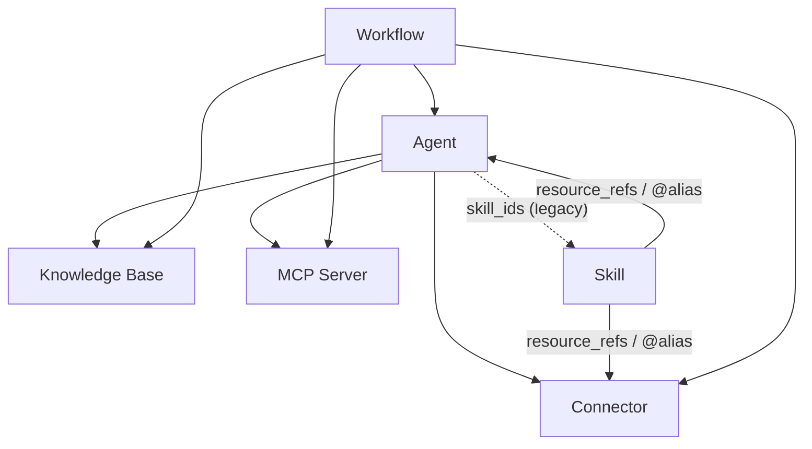

Diese Seite ist die einzige Referenz für **Freigabeberechtigungen** und **Anmeldedatenfluss**. Die freigebbaren Ressourcentypen sind **Agents, Connectors und MCP-Server** (plus **Skills** und **Workflows**, wenn diese optionalen Module aktiviert sind). Nutzen Sie diese Seite, um zu verstehen, was passiert, wenn Sie eine Ressource freigeben, die selbst auf anderen Ressourcen aufbaut.

<Note>
**Wissensdatenbanken sind nicht freigebar.** Eine KB erreicht andere Personen nur, indem sie an einen freigegebenen Agent gebunden wird, der den Inhalt des Besitzers zur Laufzeit delegiert (siehe „Wie der Zugriff durch gebundene Ressourcen fließt"). Es gibt keine Publish-KB-Aktion.
</Note>

## Die zwei Fragen

Jede Freigabeentscheidung beantwortet zwei unabhängige Fragen:

1. **Sichtbarkeit** — *kann die andere Person diese Ressource überhaupt sehen/nutzen?*
2. **Anmeldedaten** — *mit wessen Geheimnis (API-Schlüssel, Datenbankpasswort, Server-Umgebung) wird es ausgeführt?*

Sichtbarkeit betrifft die Ressource; Anmeldedaten sind eine separate, benutzerspezifische Angelegenheit, die nur Connectors und MCP-Server betrifft. Halten Sie diese auseinander — die meiste Verwirrung entsteht durch die Vermischung von „Ich kann es sehen" mit „Ich kann den Schlüssel des Eigentümers nutzen".

## Sichtbarkeit: Eigene + abonnierte Ressourcen

Eine Ressource ist für Sie nur sichtbar, wenn **Sie sie besitzen** oder **Sie ein explizites Abonnement** dafür haben. Es gibt keine implizite "Alle in meiner Organisation können es sehen"-Regel mehr — die Freigabe in der Organisation wird durch Abonnements bereitgestellt.

| Freigabebereich | Bedeutung | Wie andere Zugriff erhalten |
| --- | --- | --- |
| **Persönlich** (Standard) | Nur der Besitzer kann es sehen. | — |
| **Organisation** | In einer Organisation veröffentlicht. | Organisationsmitglieder **abonnieren** vom Marktplatz (oder werden beim Beitritt automatisch abonniert). |
| **Global / Marktplatz** | Im öffentlichen Marktplatz veröffentlicht. | Jeder **abonniert** vom Marktplatz. |

Die gleiche Regel gilt überall dort, wo eine Ressource verwendet wird — Chat-Tool-Zusammenstellung, Bindung an einen Agenten und ein Workflow-Schritt lösen alle **Eigene + abonnierte** auf. Ein Connector, den Sie abonniert haben, kann also an einen Agenten gebunden und aus einem Workflow aufgerufen werden; einer, den Sie weder sehen noch abonnieren können, wird an allen drei Stellen abgelehnt.

<Note>
Abonnements sind begrenzt: Wenn Sie eine Organisation verlassen (oder daraus entfernt werden), werden die Abonnements, die Sie nur durch sie hatten, widerrufen, und die pro Benutzer gespeicherten Anmeldedaten für diese Ressourcen werden gelöscht.
</Note>

## Credentials & "Allow fallback"

Only **Connectors** and **MCP servers** hold credentials. Each one has an
**Allow fallback** switch that decides whether subscribers may borrow the
owner's credential:

| State | A subscriber **with** their own credential | A subscriber **without** their own credential | The owner |
| --- | --- | --- | --- |
| **Allow fallback OFF** *(default)* | Uses their own credential. | **No access** — the tool is hidden and the UI prompts them to configure their own credential. | Always uses their own. |
| **Allow fallback ON** | Uses their own credential. | Falls back to the **owner's** credential (and any usage/billing lands on the owner). | Always uses their own. |

Key rules:

- **Off is the default.** Sharing your token is opt-in. A newly created connector
  or MCP server does not share the owner's credential, and existing ones were
  migrated to off.
- **The owner is always exempt.** "Allow fallback" only governs *other* users;
  you can always use your own connector with your own credential.
- **No silent failure.** When fallback is off and a user has no credential, the
  tool is **removed from the toolset** rather than offered and then failing at
  call time. Every surface (chat, the **Playground**, workflow steps) must show a
  "configure your own credentials" prompt instead of a broken tool.

## Wie der Zugriff durch gebundene Ressourcen fließt

Ressourcen werden zusammengesetzt. Das Freigeben einer Ressource macht die darunter gebundenen Ressourcen implizit verfügbar — aber **Anmeldedaten fließen nicht automatisch mit ihnen**.

| Container | Kann referenzieren | Wie |
| --- | --- | --- |
| **Agent** | Knowledge Bases, Connectors, MCP servers | `kb_ids` / `connector_ids` / `mcp_server_ids` |
| **Agent** | Skills | `skill_ids` *(veraltet — verwenden Sie stattdessen Skill→Agent)* |
| **Skill** | Connectors, Agents, … | `resource_refs` (der `@alias`-Mechanismus) |
| **Workflow** | Agents, Knowledge Bases, Connectors, MCP servers | pro Knoten `agent_id` / `kb_id(s)` / `connector_id` / `mcp_server_id` |

Wenn Sie den Container freigeben, reisen die Referenzen als **Graph von IDs** mit — ein freigegebener Workflow oder Agent enthält keine eingebetteten Geheimnisse. Zur Laufzeit überprüft jede referenzierte Ressource den *Zugriff des Ausführenden* erneut:

- **Knowledge Bases** haben keine benutzerabhängige Anmeldedaten, daher delegiert eine an einen freigegebenen Agent gebundene KB **ihren Inhalt**: Wer den Agent ausführt, liest die Daten des KB-Besitzers (der Agent benötigt seine KB zum Funktionieren). Die Delegierung wird durch die **Sichtbarkeit des Agent-Besitzers** gesteuert — wenn der Agent-Besitzer den Zugriff auf eine gebundene KB verliert (z. B. nach dem Verlassen der Organisation, über die sie freigegeben wurde), wird diese KB aus dem Agent entfernt, anstatt weiterhin gelesen zu werden. Ad-hoc-KB-Suche außerhalb eines gebundenen Agents wird gegen den Aufrufer überprüft (eigene + abonnierte).
- **Connectors / MCP servers** enthalten Anmeldedaten, daher delegieren sie **nur, wenn „Allow fallback" aktiviert ist** (siehe unten).

## Bearbeitete Szenarien

Sie besitzen einen Agent, der einen **persönlichen** Connector bindet (Sie haben den Connector selbst nicht freigegeben). Sie teilen den **Agent** mit Ihrer Organisation oder global. Jemand anderes führt ihn aus:

| Szenario | "Allow fallback" des Connectors | Was der andere Benutzer erhält |
| --- | --- | --- |
| **3a** | **ON** | Das Connector-Tool ist verfügbar und wird mit **Ihren** Anmeldedaten ausgeführt — der andere Benutzer kann es verwenden. Die Nutzung wird Ihnen in Rechnung gestellt. |
| **3b** | **OFF** *(Standard)* | Das Connector-Tool ist für diesen Benutzer **verborgen**. Der Rest des Agents funktioniert weiterhin; die Benutzeroberfläche fordert ihn auf, **seine eigenen** Anmeldedaten für diesen Connector hinzuzufügen. Danach wird das Tool wieder angezeigt und wird mit seinem Schlüssel ausgeführt. |

Mit anderen Worten: **Das Freigeben des Agents gibt nicht das Geheimnis des Connectors frei.** Die Einstellung "Allow fallback" des Connectors selbst ist der einzige Schalter, der entscheidet, ob die Anmeldedaten durch die Bindung eindringen. Dasselbe gilt für einen Connector oder MCP-Server, auf den von einem Skill oder einem Workflow-Schritt aus verwiesen wird.

<Note>
Deshalb ist das empfohlene Muster für einen Connector, den Sie freigeben möchten: Lassen Sie **Allow fallback aus**, und lassen Sie jeden Benutzer seine eigenen Anmeldedaten binden. Schalten Sie es nur ein, wenn Sie absichtlich Ihren Schlüssel verleihen möchten (und die Nutzung übernehmen) — zum Beispiel eine gemessene API, für die Sie bereit sind, die Kosten für andere zu übernehmen.
</Note>
