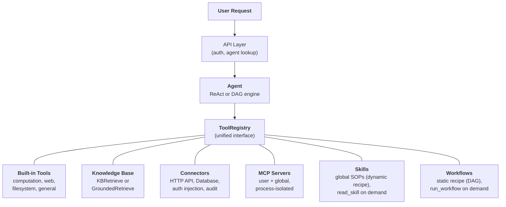
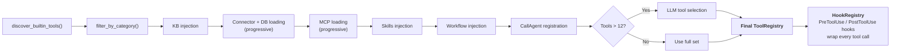
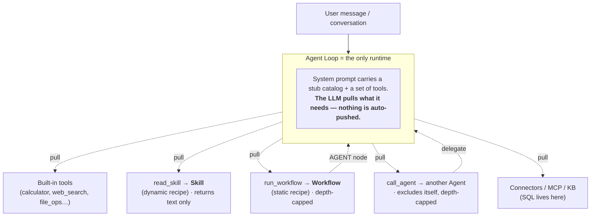

## Die einheitliche Tool-Abstraktion

Die zentrale Designidee in FIM One ist, dass **alles, was der Agent tun kann, ein Tool ist**. Ein Rechner, eine Wissensdatenbankabfrage, ein ERP-API-Aufruf und ein MCP-Server eines Drittanbieters implementieren alle das gleiche `Tool`-Protokoll: `name`, `description`, `parameters_schema`, `category` und `run()`. Der Agent weiß nicht und kümmert sich nicht darum, ob er eine lokale Python-Funktion aufruft, eine Vektordatenbank abfragt, in ein Legacy-System proxiert oder einen Community-MCP-Server aufruft. Er sieht eine flache Liste von aufrufbaren Tools in einer `ToolRegistry`.

Dies ist eine bewusste architektonische Entscheidung, keine zufällige Vereinfachung. Das bedeutet, dass das Hinzufügen einer neuen Funktionsquelle niemals eine Änderung des Agenten, der Ausführungs-Engines oder der Kontextverwaltungsschicht erfordert. Sie registrieren Tools; der Agent nutzt sie.

Sechs Funktionsquellen konvergieren in einer Registry. Der Agent schöpft gleichermaßen aus allen. Die letzten beiden sind ein zusammengehörendes Paar: eine **Skill** ist ein *dynamisches Rezept* (ein SOP, das der LLM Schritt für Schritt interpretiert), und ein **Workflow** ist ein *statisches Rezept* (ein deterministischer Graph, der jedes Mal gleich läuft). Beide werden durch ein Tool gezogen — `read_skill` und `run_workflow` — und keines enthält das andere; sie sind Peers, die von derselben Runtime konsumiert werden.

## Sechs Fähigkeitsquellen

### Integrierte Werkzeuge

Werden beim Start automatisch über `discover_builtin_tools()` erkannt. Legen Sie eine `BaseTool`-Unterklasse in `core/tool/builtin/` ab, und sie registriert sich ohne Konfiguration. Kategorien umfassen Berechnung (`calculator`, `python_exec`), Web (`web_search`, `web_fetch`), Dateisystem (`file_ops`) und allgemein (`email_send`, `json_transform`, `template_render`, `text_utils`). Dies sind die nativen Fähigkeiten des Agenten -- immer verfügbar, keine Einrichtung erforderlich.

### Wissensdatenbank

Bedingt. Wenn ein Agent `kb_ids` gebunden hat, wird das generische `kb_retrieve`-Tool durch ein spezialisiertes Abruf-Tool ersetzt. Im **einfachen Modus** führt `KBRetrieveTool` grundlegende RAG-Abruf durch. Im **Grounding-Modus** führt `GroundedRetrieveTool` eine 5-stufige Pipeline aus: Multi-Wissensdatenbank-Abruf, Zitierextraktion, Alignment-Bewertung, Konflikt-Erkennung und Konfidenz-Berechnung. Die Wissensdatenbank ist kein separates Subsystem neben dem Agent – sie wird als spezialisiertes Tool in den Agent integriert und unterliegt demselben `Tool`-Protokoll wie alles andere.

### Connector

`ConnectorToolAdapter` umhüllt Unternehmensystemaktionen als Tools. Jede Aktion wird zu einem Tool mit dem Namen `{connector}__{action}`, kategorisiert als `connector`. Der Adapter fügt HTTP-Proxy mit Auth-Injection (Bearer, API-Schlüssel, Basic), Zugriffskontrolle auf Operationsebene (Lesen/Schreiben/Admin), Antworttrunkierung und Audit-Logging hinzu. Für direkten Datenbankzugriff bietet `DatabaseToolAdapter` schemaabhängige SQL-Ausführung mit optionaler Schreibschutz-Erzwingung. Konnektoren sind die Brücke zwischen KI und Legacy-Systemen -- der Kernunterscheidungsmerkmal. Siehe [Connector-Architektur](/architecture/connector-architecture) für das vollständige Design.

### MCP

Externe MCP-Server stellen Tools von Drittanbietern über das Standardprotokoll bereit. Jeder Server läuft in seinem eigenen Prozess (stdio oder HTTP-Transport) und ist vollständig von der Plattform isoliert. Tools werden in das `Tool`-Protokoll adaptiert und unter der Kategorie `mcp` registriert. Administratoren können **globale MCP-Server** bereitstellen, die automatisch für alle Benutzer geladen werden. MCP ist das Ökosystem-Angebot – jeder MCP-kompatible Server funktioniert ohne benutzerdefinierte Integration.

### Fähigkeiten

Fähigkeiten sind wiederverwendbare Standard Operating Procedures (SOPs) – Unternehmensrichtlinien, Handlungsverfahren, schrittweise Workflows – die global gelten, unabhängig davon, welcher Agent ausgewählt ist. Im Gegensatz zu Konnektoren und Knowledge Bases (die auf bestimmte Agenten beschränkt werden können), werden Fähigkeiten immer für jeden Benutzer basierend auf der Sichtbarkeit (persönlich, organisationsweit freigegeben oder Market-abonniert) geladen.

Fähigkeiten unterstützen zwei Injektionsmodi – **progressiv** (Standard) und **inline** – gesteuert durch `SKILL_TOOL_MODE`. Im progressiven Modus erscheinen kompakte Stubs im System-Prompt und das LLM ruft `read_skill(name)` bei Bedarf auf. Dies ist Teil der umfassenderen [Progressive Disclosure](/architecture/progressive-disclosure)-Architektur, die das gleiche Stub-First-, Detail-on-Request-Muster auf Fähigkeiten, Konnektoren, Datenbanken und MCP Server anwendet.

Für einen tieferen Einblick, warum Fähigkeiten global sind (nicht an Agenten gebunden) und wie sie mit der dualen Ressourcenermittlung interagieren, siehe [Agent & Ressourcenermittlung](/architecture/agent-discovery).

### Workflows

Ein Workflow ist das **statische Rezept** zu einer Skill-Dynamik: ein deterministischer DAG, auf den ein Agent zurückgreift, wenn eine Teilaufgabe identisch jedes Mal ausgeführt werden muss und einen Audit-Trail hinterlassen soll (geplante Abstimmungen, mehrstufige genehmigungsfreie Pipelines). Wie Skills werden ausführbare Workflows global pro Benutzer nach Sichtbarkeit geladen – unabhängig von der Agent-Auswahl – und über ein einzelnes `run_workflow(name, inputs)` Tool bereitgestellt, wobei die Eingabefelder jedes Workflows als kompakte System-Prompt-Stub beworben werden. Das LLM ruft einen nach Name auf, wenn eine Aufgabe darauf abgebildet wird.

Nur Workflows, die **aktiv** sind und **frei von Human-Approval-Knoten (`HUMAN_INTERVENTION`)** sind, können inline ausgeführt werden – ein Gate, das für Minuten oder Stunden blockiert, kann nicht innerhalb eines Agent-Turns sitzen, daher bleiben diese Workflows nur trigger-fähig von der Workflows-Seite. Inline-Läufe werden als Workflow-Besitzer ausgeführt (abonnierte Workflows verwenden die gebundenen Anmeldedaten des Herausgebers), persistieren einen `WorkflowRun` für den Audit-Trail und sind durch einen Re-Entrancy-Guard sowie eine Verschachtelungstiefe-Obergrenze geschützt, sodass ein Workflow-`AGENT`-Knoten niemals einen unbegrenzten Aufrufsyklus starten kann.

## Per-Request-Tool-Assembly

Jede Chat-Anfrage stellt einen frischen Tool-Satz durch eine Filterpipeline in `_resolve_tools()` zusammen. Dies ist keine statische Konfiguration – sie wird pro Anfrage basierend auf den Einstellungen des Agenten, der Identität des Benutzers und den verfügbaren Konnektoren und MCP-Servern berechnet.

Die acht Schritte:

1. **Basis-Discovery.** `discover_builtin_tools()` lädt alle integrierten Tools, begrenzt auf die Sandbox der Konversation.
2. **Agent-Kategorie-Filter.** `filter_by_category(*agent.tool_categories)` beschränkt auf nur die Kategorien, die der Agent verwenden darf.
3. **KB-Injection.** Wenn der Agent `kb_ids` hat, wird das generische Abruf-Tool durch `KBRetrieveTool` oder `GroundedRetrieveTool` basierend auf dem Abrufmodus ersetzt.
4. **Connector-Laden.** Im Agent-beschränkten Modus werden nur die an den Agent gebundenen Konnektoren geladen. Im Auto-Discovery-Modus (kein Agent ausgewählt) werden alle für den Benutzer sichtbaren Konnektoren geladen. Sowohl API-Konnektoren (`ConnectorMetaTool`) als auch Datenbank-Konnektoren (`DatabaseMetaTool`) verwenden standardmäßig [Progressive Disclosure](/architecture/progressive-disclosure) – leichte Stubs im System-Prompt, vollständige Schemas bei Bedarf geladen.
5. **MCP-Laden.** Die persönlichen MCP-Server des Benutzers sowie von Administratoren bereitgestellte globale MCP-Server werden geladen und verbunden. Im Progressive-Modus (Standard) konsolidiert ein einzelnes `MCPServerMetaTool` alle Server; das LLM ruft `discover`- und `call`-Unterbefehle bei Bedarf auf. Siehe [Progressive Disclosure](/architecture/progressive-disclosure).
6. **Skills + Workflows-Injection.** Alle aktiven Skills, die für den Benutzer sichtbar sind, werden geladen – unabhängig von der Agent-Auswahl. Im Progressive-Modus wird `ReadSkillTool` mit kompakten Stubs im System-Prompt registriert; im Inline-Modus wird der vollständige Skill-Inhalt direkt eingebettet. Der gleiche Schritt lädt alle aktiven, inline-ausführbaren Workflows und registriert `RunWorkflowTool` mit einem Stub pro Workflow (Name, Beschreibung, Eingabefelder). Workflows mit einem Human-Approval-Knoten werden hier übersprungen.
7. **CallAgent-Registrierung (Nur Auto-Modus).** Wenn kein spezifischer Agent ausgewählt ist, werden alle aktiven, sichtbaren Agenten in einen Katalog zusammengefasst und über `CallAgentTool` verfügbar gemacht, wodurch das LLM Aufgaben an Spezialisten-Agenten delegieren kann. Delegierte Agenten erhalten eine vollständige `ToolRegistry`, die aus ihrer eigenen Konfiguration erstellt wird, schließt aber `call_agent` aus, um unendliche Rekursion zu verhindern. Wenn ein spezifischer Agent ausgewählt ist, wird `CallAgentTool` nicht registriert – Agenten sind spezialisiert und delegieren nicht an andere Agenten. Dies verhindert, dass Marketplace-Agenten auf die privaten Prompts anderer Agenten zugreifen.
8. **Runtime-Auswahl.** Wenn die Gesamtzahl der Tools 12 überschreitet, wählt ein leichter LLM-Aufruf die relevanteste Teilmenge (bis zu 6) für diese spezifische Anfrage aus. Ein `request_tools` Meta-Tool wird automatisch registriert, das es dem LLM ermöglicht, während der Konversation dynamisch zusätzliche Tools zu laden, falls die anfängliche Auswahl ein benötigtes Tool verpasst hat. Auswahlfehlschlag ist nicht fatal – der Agent fällt auf den vollständigen Satz zurück. Siehe [Progressive Disclosure](/architecture/progressive-disclosure).
9. **Hook-Registrierung.** Die deklarierten Hooks des Agenten (aus `model_config_json.hooks`) werden instanziiert und an eine `HookRegistry` angehängt. Jeder ausgewählte Tool-Aufruf wird umschlossen: `PreToolUse`-Hooks können Argumente vor der Ausführung blockieren oder umschreiben; `PostToolUse`-Hooks können die Beobachtung umschreiben, bevor sie zum LLM zurückkehrt. Hooks laufen **außerhalb der LLM-Schleife** und können nicht durch Agent-Anweisungen umgangen werden – siehe [Hook System](/architecture/hook-system).

Das Ergebnis: Der Agent sieht genau die Tools, die er benötigt, nicht mehr. Ein einfacher Agent ohne Konnektoren und ohne KB könnte 5 Tools sehen. Ein Hub-Agent, der mit 3 Enterprise-Systemen verbunden ist, mit einer fundierten Wissensdatenbank und 2 MCP-Servern könnte 30 sehen – aber nach der Auswahl machen es nur die 6 relevantesten in den Kontext.

## Wann man was verwendet

| Anforderung | Verwenden | Grund |
|------|-----|-----|
| Allgemeine Berechnung, Code-Ausführung, Texttransformationen | Built-in Tool | Immer verfügbar, keine Konfiguration erforderlich |
| Enterprise-Systemintegration (ERP, CRM, OA) | Connector | Auth-Governance, Audit-Trail, Zugriffskontrolle auf Operationsebene |
| Wissensabruf mit Zitaten und Nachweisen | Knowledge Base | RAG-Pipeline, fundierte Generierung, Konfidenzscoring |
| Ökosystem von Drittanbieter-Tools | MCP | Standardprotokoll, Prozessisolation, Community-Server |
| Organisationsrichtlinien, SOPs, Handlungsverfahren | Skill (dynamisches Rezept) | Standardmäßig global, progressive Ladung, Sichtbarkeitsbereich |
| Ein deterministischer, wiederholbarer mehrstufiger Prozess, der mitten in einem Gespräch aufgerufen wird | Workflow (statisches Rezept) | Gleiche Ausgabe bei jedem Durchlauf, Audit-Trail, läuft als Eigentümer; von Menschen gesteuerte bleiben nur Trigger |
| Aufgaben an spezialisierte Agenten delegieren | CallAgent | Semantisches Agent-Routing, vollständige Tool-Vererbung, parallele Ausführung |
| Direkter Datenbankzugriff | Database Connector | Schema-bewusst SQL, optionale Read-Only-Erzwingung |
| Benutzerdefinierte interne Tools | MCP oder Built-in | MCP für Prozessisolation; Built-in für enge Integration |

Die Kategorien schließen sich nicht gegenseitig aus. Ein einzelner Agent kann alle fünf Funktionsquellen in einem Gespräch nutzen – ein Skill für die SOP zur Beschwerdeverarbeitung laden, eine Knowledge Base für Richtliniendokumente abfragen, einen Connector aufrufen, um das ERP zu überprüfen, Analysen an einen spezialisierten Agent delegieren (im Auto-Modus) und ein Built-in Tool verwenden, um die Ergebnisse zu formatieren.

## Ausführungs-Engines sind orthogonal

Das Tool-System und die Ausführungs-Engines sind unabhängige Belange. Die LLM-gesteuerten Engines (ReAct und DAG) verbrauchen Tools aus derselben `ToolRegistry`. Die Wahl der Engine beeinflusst, wie Tools orchestriert werden, nicht welche Tools verfügbar sind.

**ReAct** ist eine iterative Tool-Schleife. Der Agent argumentiert, wählt ein Tool, beobachtet das Ergebnis und wiederholt dies, bis er fertig ist. Es zeichnet sich bei explorativen, konversationalen Aufgaben aus, bei denen der nächste Schritt vom vorherigen Ergebnis abhängt. Die Schleife läuft bis zu 50 Iterationen mit Kontextverwaltung pro Iteration über ContextGuard. Siehe [ReAct Engine](/architecture/react-engine) für Implementierungsdetails.

**DAG** zerlegt ein Ziel in 2-6 parallele Schritte. Jeder Schritt führt einen unabhängigen ReAct-Agent aus. Ein PlanAnalyzer bewertet, ob das Ziel erreicht wurde; wenn nicht, plant die Pipeline autonom neu (bis zu 3 Runden). DAG zeichnet sich bei Aufgaben mit klaren Teilaufgaben aus, die gleichzeitig ausgeführt werden können – „drei Quellen durchsuchen und Ergebnisse vergleichen" wird in der Zeit einer Suche abgeschlossen, nicht drei. Siehe [DAG Engine](/architecture/dag-engine) für die vollständige Pipeline.

Die beiden Engines teilen sich Infrastruktur: `structured_llm_call` für zuverlässige strukturierte Ausgaben, `ContextGuard` für Durchsetzung des Token-Budgets und die `ToolRegistry` für Tool-Auflösung. Das Hinzufügen eines neuen Tools erfordert keine Änderungen an einer der Engines. Das Hinzufügen einer neuen Engine (falls jemals nötig) erfordert keine Änderungen am Tool-System.

Beide Engines unterstützen auch **Agent-Delegation** über `CallAgentTool` im Auto-Modus (kein Agent ausgewählt). Im nativen Function-Calling-Modus kann das LLM mehrere `call_agent`-Aufrufe in einer einzigen Runde aufrufen, die gleichzeitig über `asyncio.gather` ausgeführt werden. Jeder delegierte Agent erhält seine eigene `ToolRegistry` und läuft als vollständige Ausführungseinheit. Für das detaillierte Design der Agent-Erkennung, Skills als globale SOPs und Agent-Delegation siehe [Agent & Resource Discovery](/architecture/agent-discovery).

### Workflow Engine — das dritte Paradigma

Neben den LLM-gesteuerten ReAct- und DAG-Engines enthält FIM One eine **Workflow Engine** — einen visuellen DAG-Editor mit 9 Kernknotentypen (Start, End, LLM, Condition Branch, Agent, Knowledge Retrieval, Connector, MCP, Human Intervention) für deterministische Prozessautomation. Verwenden Sie Agents für flexible, explorative Aufgaben; verwenden Sie Workflows für deterministische, wiederholbare Prozesse. Weitere Informationen finden Sie unter [Execution Modes](/concepts/execution-modes).

Die beiden komponieren **in beide Richtungen**, aber jede Richtung verläuft durch die einzelne Runtime — die Agent-Schleife — niemals durch eine zweite Ausführungs-Engine:

- **Workflow → Agent.** Ein `AGENT`-Knoten eines Workflows führt einen Agent als einen deterministischen Schritt aus.
- **Agent → Workflow.** Ein Agent (oder eine Skill, der er folgt) ruft `run_workflow` auf, um eine Teilaufgabe zu delegieren, die deterministisch ausgeführt werden muss.

Dies ist die Lösung für die offensichtliche Zyklus-Besorgnis: nur die **Agent-Schleife ist eine Runtime**. Skills und Workflows sind inerte Rezepte, die sie lädt; sie führen sich nie gegenseitig aus. „Eine Skill ruft einen Workflow auf" bedeutet physisch, dass der Agent, während er dem SOP der Skill folgt, `run_workflow` aufruft. Jeder Aufruf verläuft durch den Agent, sodass das Aufrufdiagramm ein **Stern** ist, nicht ein Netz — und die Rückkanten sind begrenzt (`read_skill` gibt nur Text zurück; `call_agent` und `run_workflow` tragen Tiefengrenzen und einen Wiedereintrittschutz).

Zwei Lesarten desselben Bildes: **Tools werden gezogen, nicht gepusht** (eine Skill oder ein Workflow, den das LLM nie auswählt, wird einfach nie ausgelöst — weshalb dynamische Fähigkeiten unsichtbar wirken können, bis eine Abfrage eine passt), und **Skills und Workflows sind Peers**, die durch eine Runtime geleitet werden, anstatt ineinander verschachtelt zu sein.

## Lifecycle-Übersicht

**Startup.** `start.sh` führt Alembic-Migrationen aus, startet den FastAPI-Server, erkennt integrierte Tools und stellt MCP-Serververbindungen für alle vorkonfigurierten globalen Server her.

**Pro Anfrage.** JWT-Authentifizierung, Agent-Konfigurationssuche, Tool-Zusammenstellung (die 8-Schritte-Pipeline oben), Engine-Auswahl (ReAct oder DAG basierend auf Agent-Konfiguration), Ausführung mit SSE-Streaming und Ergebnispersistenz.

**Übergreifende Belange.** [Kontextverwaltung](/architecture/context-management) (5-Schichten-Token-Budget) schützt jeden LLM-Aufruf vor Überlauf. Das [Hook-System](/architecture/hook-system) umhüllt jeden Tool-Aufruf mit plattformgesteuerte `PreToolUse` / `PostToolUse` Logik — der Mechanismus hinter der Genehmigung durch Menschen in der Schleife (`FeishuGateHook`), Audit-Protokollierung und Durchsetzung des Nur-Lesen-Modus. Die Audit-Protokollierung verfolgt jeden Connector-Tool-Aufruf. Sandbox-Isolierung enthält Code-Ausführungs-Tools. Die Zwei-LLM-Architektur (smart + fast) optimiert die Kosten über Planung, Ausführung und Synthese.

Die Architektur ist so konzipiert, dass jeder Belang – Tool-Registrierung, Ausführungsorchestration, Kontextverwaltung, Sicherheit – sich unabhängig entwickeln kann. Ein neuer Connector-Typ, eine neue Ausführungs-Engine oder eine neue Kontextstrategie können hinzugefügt werden, ohne kaskadierende Änderungen im gesamten System zu verursachen.
