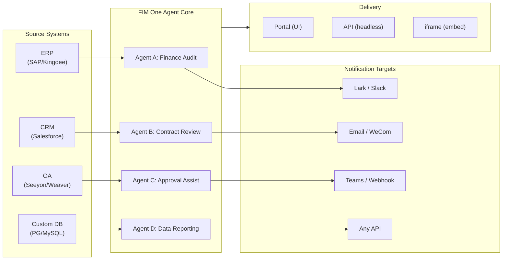

> Goal: Build an **all-in-one agent platform for Global × China enterprises** — delivered through three progressive modes: Standalone (portal assistant), Copilot (embedded in host system), Hub (central cross-system orchestration).
>
> Principles: **Provider-agnostic** (no vendor lock-in), **minimal-abstraction**, **protocol-first**, **connector-first** (integration is the core value).

## Produktvision

FIM One ist eine **All-in-One-Agent-Plattform**, die drei progressive Liefermodi unterstützt:

```
Standalone   → Your own AI assistant (Portal)
Copilot      → AI embedded in a host system (iframe / widget / embed)
Hub          → Central cross-system orchestration (Portal / API)
```

**Systemübergreifende Orchestrierung ist der Kernunterscheidungsfaktor.** Enterprise-Kunden haben Legacy-Systeme — ERP, CRM, OA, Finanzen, HR — die über KI miteinander kommunizieren müssen:



**GTM-Pfad: Land and Expand**

| Schritt | Modus | Was passiert |
|------|------|-------------|
| Land | Copilot | In ein System einbetten, Mehrwert in der UI nachweisen |
| Expand | Copilot → Hub | Auf weitere Systeme ausrollen; Hub-Modus aggregiert sie |

## Bekannte Probleme

Nachverfolgter Bugs, die in der Produktion reproduzierbar sind, aber noch nicht behoben wurden. Jeder Eintrag nennt das Symptom, den vermuteten Bereich und die Lösung (falls vorhanden). Einträge werden in einen Versionbereich verschoben, sobald eine Lösung festgelegt und geplant ist.

- **Agent-Editor zeigt Warnung für ungespeicherte Änderungen bei Einträgen ohne Bearbeitung.** Das Öffnen eines vorhandenen Agenten über `/agents/[id]` und sofortiges Zurückklicken löst den Dialog „Ungespeicherte Änderungen" aus, auch wenn kein Feld berührt wurde. Die Dirty-Check vergleicht 20+ Felder mit der geladenen Agent-Nutzlast, daher reicht ein asymmetrisches Standard-Default zwischen State-Initialisierung und Dirty-Vergleich aus, um eine Phantom-Abweichung zu verursachen — aktuelle Vermutung ist eines der verschachtelten Felder `model_config_json` / Benachrichtigung / Genehmigungsrouting, möglicherweise von `undefined` vs `null` vs `""` Normalisierung. Lässt sich besonders bei organisationsgesteuerten Agenten reproduzieren. Lösung: Dialog schließen (`Verwerfen und verlassen`) — kein Datenverlust, da sich nichts tatsächlich geändert hat. Versuchte Behebung (`cb40c86a`) entfernte ein verwandtes verwaistes Badge-Flackern auf den Ressourcen-Pickern, aber löste dieses Problem nicht.

- **Das Speichern einer Agent-Bearbeitung kann mit `Input should be 'initiator', 'agent_owner' or 'org_members'` fehlschlagen.** Pydantic lehnt das Feld `confirmation_approver_scope` an der Grenze `/api/agents/{id}` PUT ab, obwohl jeder gespeicherte Wert in der Datenbank eines der drei gültigen Literale ist. Vermutung: Das Frontend-Cast `as "initiator" | "agent_owner" | "org_members"` ist nur ein Compile-Time-Versprechen, daher kann ein veralteter oder unerwarteter Runtime-String (möglicherweise aus einer Vorlage, einem Import oder einer älteren Migration) durch `setConfirmationApproverScope` schlüpfen und wörtlich zurückgesendet werden. Lösung: Wählen Sie explizit einen Wert in der Dropdown-Liste Genehmigung → Genehmiger-Bereich aus, bevor Sie speichern.

- **Playground Stop-and-Retry zeigt transiente visuelle Artefakte, die ein Seiten-Refresh immer behebt.** Drei gleichzeitige Render-Quellen — `activeConversation.messages` (DB-Snapshot), der SSE-Stream `messages` und der optimistische Platzhalter `pendingQuery` — werden nicht in einen einzelnen abgeleiteten State zusammengefasst, daher kann die UI zwischen dem Klick auf „Retry" und dem Eintreffen der gepaarten Assistant-Antwort (a) kurzzeitig dieselbe Anfrage zweimal im Pre-Stream-Fenster rendern, (b) frühere verwaiste User-Bubbles aus dem Retry-Verlauf ablegen, während `hasLiveMessages` true ist und bevor der Snapshot neu geladen wird, und (c) flackern im engen Fenster zwischen dem SSE-Event „done" und dem nächsten `selectConversation`-Refresh. **Daten gehen nie verloren** — jede User-Nachricht (einschließlich abgebrochener Wiederholungen) wird in `conversation.messages` persistiert, mit `normalize_alternating_messages` in den nächsten LLM-Aufruf übernommen und nach Refresh über `HistoryTurn.orphanUserContents` (eingeführt in der Render-Behebung `48ba08c6`) korrekt gerendert. Zur Kontextualisierung: Claudes eigene Web-UI zeigt eine analoge Klasse von Bugs — das Stoppen während einer Antwort und sofortiges Senden einer Folgefrage erzeugt manchmal die Folgefrage als Sibling-Edit-Zweig der ersten Anfrage statt sie als neuen Turn anzuhängen — daher ist dies ein bekanntes schwieriges Problem bei Optimistic-UI + SSE + Persistiertes-History-Designs, nicht ein FIM-One-spezifischer Defekt. Eine echte Behebung erfordert das Zusammenfassen der drei Render-Quellen in einen einzelnen abgeleiteten State; aufgeschoben bis zu einer breiteren Playground-State-Machine-Umgestaltung.

## Ausgelieferte Versionen

### v0.1 (2026-02-22) — MVP: ReAct + DAG Planner
- ReActAgent mit Tools (calculator, python_exec, web_search)
- DAG Planner (LLM generiert Abhängigkeitsgraphen)
- Portal UI mit Streaming + KaTeX

### v0.2 (2026-02-24) — Multi-Model + Memory
- Wiederholung / Rate Limiting / Nutzungsverfolgung
- Native Funktionsaufrufe (kein reines JSON-Parsing)
- Multi-Model-Unterstützung (schnelles + Haupt-LLM)
- Speicher: WindowMemory, SummaryMemory
- FastAPI-Backend mit SSE-Streaming

### v0.3 (2026-02-25) — Web Tools + MCP
- Web tools (web_search, web_fetch) via Jina/Tavily/Brave
- File operations tool
- MCP client (standard tool integration)
- Tool auto-discovery + categories
- DAG visualization with click-to-scroll
- Code exec in Docker (`--network=none`)

### v0.4 (2026-02-25) — Multi-Turn + Agents
- Mehrturn-Gespräche (DbMemory)
- Tool-Schritt-Faltungs-UI
- HTTP-Anfrage- + Shell-Exec-Tools
- Agentenverwaltung (erstellen, konfigurieren, veröffentlichen)
- JWT-Authentifizierung
- Pro-Agent-Ausführungsmodus + Temperatursteuerung

### v0.5 (2026-02-28) — Vollständige RAG + Grounded Generation
- Vollständige RAG-Pipeline (Embedding + Vector Store + FTS + RRF + Reranker)
- Grounded Generation (Zitationen, Zuverlässigkeitsbewertungen)
- Wissensdatenbank-Dokumentverwaltung (CRUD, Suche, Wiederholung, Schemamigration)
- ContextGuard + angeheftete Nachrichten (Token-Budget-Manager)
- DbMemory-Persistenz + LLM Compact
- DAG-Neuplanung (bis zu 3 Runden)

### v0.6 (2026-03-01) — Connector Platform
- **Connector CRUD**: create, read, update, delete
- **ConnectorToolAdapter**: converts Connector → BaseTool
- **Per-user credentials**: AES-GCM encryption
- **Confirmation gate**: write operation approval
- **Audit logging**: all tool calls recorded
- **Circuit breaker**: graceful degradation on failures
- **Utility tools**: email_send, json_transform, template_render, text_utils
- **Embedding options**: Jina, OpenAI, custom providers

### v0.7 (2026-03-06) — Admin Platform + Multi-Tenant
- **Admin Platform**: Benutzerverwaltung, Rollenwechsel, Passwort-Reset, Konto aktivieren/deaktivieren
- **Nur-auf-Einladung-Registrierung**: drei Modi (offen/Einladung/deaktiviert) + Einladungscode CRUD
- **Speicherverwaltung**: Festplattennutzung pro Benutzer, Löschen, Verwaisten-Cleanup
- **Gesprächsmoderation**: Admin-Liste/Löschen aller
- **Erzwungene Abmeldung pro Benutzer**: alle Token widerrufen
- **API-Gesundheits-Dashboard**: Systemstatistiken, Connector-Metriken
- **Ersteinrichtungs-Assistent**: geführte Erstellung des Admin-Kontos
- **Persönliches Zentrum**: globale Anweisungen pro Benutzer, Spracheinstellung
- **JWT auth**: tokenbasierte SSE-Authentifizierung, Gesprächseigentum
- **Globale MCP servers**: vom Admin bereitgestellt, in allen Sitzungen geladen
- **Abwärtskompatibilität**: registration_enabled → registration_mode Auto-Migration

### v0.7.x (2026-03-07 to 2026-03-12) — Stability + Refinements
- Invite code management
- Per-user quotas (429 enforcement)
- Structured audit logging
- Sensitive word filtering
- Admin login history
- Admin file browser
- Enhanced admin views (model_name, tools, kb_ids fields)
- Docker Compose deployment (single image, named volumes)
- OAuth auto-detection from window.location
- Extended thinking / reasoning support (`LLM_REASONING_EFFORT`, `LLM_REASONING_BUDGET_TOKENS`) for OpenAI o-series, Gemini 2.5+, Claude
- Admin per-tool enable/disable (disabled tools excluded from chat at runtime)
- MCP servers management moved to Connectors page
- Dual database support: SQLite (zero-config default) + PostgreSQL (production); Docker Compose auto-provisions PostgreSQL
- Models configuration documentation page with extended thinking setup per provider
- SSE Protocol v2: real-time answer streaming with `delta_reasoning`, `usage` fields, and split `done`/`suggestions`/`title`/`end` events; SQLite pool size 5 -> 20
- AI Builder expansion: 7 new builder tools (GetSettings, TestConnection, ImportOpenAPI for connectors; ListConnectors, AddConnector, RemoveConnector, SetModel for agents), `is_builder` flag on agents, builder prompt auto-refresh, SSRF guard
- SSE v2 frontend: streaming dot-pulse cursor, DAG re-plan round snapshots as collapsible cards, DAG layout decoupled from step states
- AI Builder concept documentation page with connector and agent builder guides
- Organization system: full CRUD with role-based membership (owner/admin/member), admin management UI
- Three-tier resource visibility (personal/org/global) for agents, connectors, knowledge bases, MCP servers
- Publish/unpublish API for all resource types; owner delegation for published agents
- Admin set-visibility endpoint (replaces clone-to-global); unified `build_visibility_filter()` query helper
- Database Connectors (Phase 1-3): direct SQL access to PG/MySQL/Oracle/SQL Server + Chinese legacy DBs; schema introspection, AI annotation, read-only query execution, encrypted credentials, 3 tools per connector (`list_tables`, `describe_table`, `query`)
- **Evaluation Center**: quantitative agent quality benchmarking — test dataset CRUD (prompt + expected behavior + assertions), eval runs (parallel execution + LLM grader + per-case pass/fail/latency/token results), results viewer with auto-polling; migration `r8t0v2x4z567`
- Three model roles (General/Fast/Reasoning) with per-tier env config isolation; fast model no longer inherits main model settings
- `StepOutput` dataclass replacing plain string step results for structured data and artifact passing
- Tool cache for DAG execution — identical tool calls cached per-run with async lock stampede prevention (`DAG_TOOL_CACHE`)
- Per-step LLM verification with 1 retry on failure (`DAG_STEP_VERIFICATION`)
- Auto-routing: fast LLM classifies queries as ReAct or DAG; `/api/auto` endpoint; frontend 3-way mode toggle (`AUTO_ROUTING`)
- [x] ~~**Shadow Market Organization + Resource Subscriptions**~~: Built-in Market org (shadow, no auto-join) replaces Platform org; resources discovered via marketplace browsing and explicitly subscribed (pull model); Market API for subscribing to shared resources; publish-to-Market always requires review; Resource subscriptions table; org-based resource sharing replacing global visibility
- [x] ~~**Agent Auto-discovery and Sub-agent Binding**~~: `discoverable` flag on agents; `sub_agent_ids` whitelist; CallAgentTool for delegating tasks to specialist agents
- [x] ~~**MCP Server Credentials + Per-User Override**~~: `mcp_server_credentials` table; `PUT /api/mcp-servers/{id}/my-credentials` endpoint; `allow_fallback` flag for credential fallback behavior
- [x] ~~**Connector/KB Toggle**~~: `POST /api/connectors/{id}/toggle` and `POST /api/knowledge-bases/{id}/toggle` for suspending/resuming resources
- [x] ~~**Standalone KB Conversations**~~: `kb_ids` field on conversations for direct KB chat without agent binding

### v0.8 (2026-03-20) — Connector Declarative Config + Progressive Disclosure
- [x] **Database connectors**: direct SQL access (PostgreSQL, MySQL, Oracle) *(shipped in v0.7.x — Phase 1-3)*
- [x] **RBAC**: per-user/role connector access control *(shipped in v0.7.x — org system + three-tier visibility)*
- [x] **Connector credential encryption + per-user override**: `connector_credentials` table, Fernet encryption via `CREDENTIAL_ENCRYPTION_KEY`, `allow_fallback` flag, `GET/PUT/DELETE /my-credentials` endpoints, per-user credential resolution in chat tool loading
- [x] **Publish review UI**: Org-level publish review system — review toggle per org, ReviewsSheet with approve/reject workflow, status badges on resource cards, review notice in publish dialog, resubmit for rejected resources
- [x] **Connector Progressive Disclosure (Phase 1-2)**: single `ConnectorMetaTool` replaces per-action tools; system prompt receives lightweight **stubs** only (name + 1-line description, ~30 tokens/connector vs ~250 tokens/action); agent calls `discover(connector)` to load full action schema on demand — schema only loads when the model selects a connector, keeping the prompt prefix stable for caching. Follows the deferred tool-loading pattern common in modern agent frameworks. `execute` subcommand; feature flag for backward compatibility.
- [x] **Agent Skill System + Compact Instructions**: On-demand skill loading for agent instructions — `Skill` model (name, content/SOP, optional scripts) attached to agents; referenced in system prompt by name only (~10 tokens/skill); agent calls `read_skill(name)` to load full content on demand. Reduces per-conversation instruction token cost by ~80% while allowing richer SOP libraries. Counterpart to ConnectorMetaTool's progressive disclosure applied at the instruction level. Enables the "指令 + 工具 + 技能" differentiation story. Also adds `compact_instructions` field to Agent model — per-agent compression priority list injected into `ContextGuard` when compacting (e.g., "preserve order IDs and amounts, drop raw API responses"), replacing the current static generic prompt. Follows the Compact Instructions convention widely adopted in modern agent frameworks.
- [x] **Connector import/export**: share connector templates
- [x] **Connector fork**: clone + customize existing connectors
- [x] **Workflow Phase 2 Nodes**: Iterator, Loop, VariableAggregator, ParameterExtractor, ListOperation, Transform, DocumentExtractor, QuestionUnderstanding, HumanIntervention — 9 advanced node types with full frontend + backend + 150 new tests (275 total). Node retry with exponential backoff, safe expression evaluation. Stats panel with success rate bar. 12 built-in templates. Pane context menu (Paste, Select All, Fit View, Auto Layout).
- [x] **Workflow Phase 3 Nodes: SubWorkflow + ENV** — 2 new node types (25 nodes total), 14 new tests (306 total), 14 built-in templates. SubWorkflow: full DB-backed nested workflow executor with target workflow selection, variable mapping, and configurable depth limit to prevent infinite recursion. ENV: reads encrypted environment variables with key picker and fallback defaults. Full frontend (node components, config panels, palette entries, minimap colors). Per-node execution statistics panel (success rates, durations, failure counts sorted worst-first). `getNodeStats` API client + `NodeStatEntry` type. Keyboard shortcuts dialog (`?` key).
- [x] **Workflow Scheduled Triggers**: Per-workflow cron configuration with timezone, default inputs, and next-run-at calculation. Preset cron buttons, 30 trigger tests.
- [x] **Workflow API Triggers**: Public per-workflow API keys (`wf_` prefix) for external execution without user auth, with rate limiting. API key management dialog with generate/regenerate/revoke, trigger URL, and cURL/JS examples.
- [x] **Workflow Batch Execution**: `POST /batch-run` with up to 100 input sets, configurable parallelism (1-10), collapsible per-item results, JSON export. 14 batch execution tests.
- [x] **Workflow Execution Log Viewer**: Real-time chronological SSE event stream in the run panel with timestamps, color-coded badges, and event type filter toggles.
- [x] **Workflow Run Stats**: Backend batch-fetches run counts and success rates via GROUP BY subquery; frontend displays stats on workflow cards with color-coded success rate indicators.
- [x] **Workflow Scheduler Daemon**: Background async service polling every 60s for due cron-based workflows. Croniter timezone support, semaphore concurrency, `last_scheduled_at` tracking, webhook delivery. 14 tests.
- [x] **Workflow Import Conflict Resolver**: Detects unresolved agent/connector/KB/MCP references during import. Batch DB queries with visibility filtering, frontend toast warnings. 17 tests.
- [x] **Workflow Test-Node Execution**: Isolated single-node testing with mock variables, integrated into editor (config panel Test button + context menu). 23 tests.
- [x] **Workflow Version Diff**: Side-by-side blueprint comparison with node/edge change detection, color-coded indicators (added/removed/modified).
- [x] **Workflow Run Management**: Delete individual runs (`DELETE /runs/{run_id}`) and clear all completed runs (`DELETE /runs`), with frontend confirmation dialogs.
- [x] **Workflow Run Replay Overlay**: "View on Canvas" button in run history to overlay past execution results on the canvas, showing per-node status and output without re-executing.
- [x] **Workflow Favorites/Pinning**: Star/pin workflows to the top of the list with localStorage persistence.
- [x] **Workflow Run History Export**: Export run history as JSON file download with full run metadata and per-node results.
- [x] **Admin Workflows Management**: Admin panel tab for managing all workflows across users — list, toggle active/inactive, delete with confirmation. Batch endpoints for delete, toggle, and publish with audit logging.
- [x] **Workflow Templates System**: `WorkflowTemplate` ORM model with admin CRUD, public listing/clone API, and 5 seed templates auto-inserted on first startup.
- [x] **Workflow Inline Validation Badges**: Real-time per-node `ValidationBadge` on canvas with error/warning tooltips for immediate visual feedback during editing.
- [x] **Workflow Execution Trace Viewer**: Timeline-based trace viewer Sheet with engine `trace_level` parameter and per-node variable snapshots for step-through debugging.
- [x] **Workflow Rate Limiting and Timeout**: Per-user `WorkflowRateLimiter` (sliding window 10 runs/min, 3 concurrent) and default 10-minute global run timeout.
- [x] **Workflow Blueprint System**: Visual workflow editor for designing and executing multi-step automation blueprints — `Workflow` / `WorkflowRun` ORM models, full CRUD + SSE execution API, import/export, duplicate, blueprint validation endpoint, `WorkflowEngine` with topological sort + semaphore-based concurrency + condition branching and 12 node types (Start, End, LLM, ConditionBranch, QuestionClassifier, Agent, KnowledgeRetrieval, Connector, HTTPRequest, VariableAssign, TemplateTransform, CodeExecution), `VariableStore` with `{{node_id.output}}` interpolation and `env.*` namespace, error strategies per node (STOP_WORKFLOW / CONTINUE / FAIL_BRANCH) with per-node timeout and advanced config UI, React Flow v12 visual editor with drag-and-drop palette + node config panel + variable picker combobox + add-node-on-edge + auto-layout (ELK.js) + run history sheet, Dify-style compact node design with ring-based run status styling and animated edge transitions, 4 built-in starter templates (Simple LLM Chain, Conditional Router, Knowledge-Augmented QA, HTTP API Pipeline) with template picker dialog and `GET /templates` + `POST /from-template` API, stats endpoint, `?run=true` URL param auto-open, subprocess-based code execution security, 105-test suite (templates, eval namespace flattening, blueprint validation warnings, node/edge deletion, import/export/duplicate, deadlock detection, multi-condition branching)
- [x] **Operation audit**: detailed logging of who did what — admin review log audit tab added (publish review trail per org/resource)
- [x] **Semantic Schema Annotations**: extend connector schema fields with `semantic_tag`, `description`, and `pii` flags; annotations surfaced in LLM tool descriptions so the agent understands field intent without guessing from column names

### v0.8.1 (2026-03-29) — Progressive Disclosure Maturity + ReAct Hardening
- Progressive Disclosure für DB-Connectoren (`DatabaseMetaTool`), MCP-Server (`MCPServerMetaTool`) und bedarfsgesteuertes Tool-Laden (`request_tools` Meta-Tool)
- DAG-Qualitätsüberholung (5 Verbesserungen: Modell-Upgrade, automatische Skill-Erkennung, Citation Verifier, strukturierte Inhaltsbeibehaltung, domänengestützte Weiterleitung)
- Domain Model Escalation in ReAct (spezialisierte Domänen eskalieren automatisch zum Reasoning-Modell)
- Pro-Modell Native Function Calling Toggle (`tool_choice_enabled`)
- ReAct-Zyklenerkennung (deterministische Vermeidung doppelter Tool-Aufrufe)
- ReAct-Abschluss-Checkliste (Vor-Antwort-Verifizierung bei Verwendung von Tools)
- Resource Fork Phase 1 (MCP Server + Skill Fork Endpoints mit Lineage Tracking)
- Workflow Connection Dep Auto-Subscribe (rekursive Abhängigkeitsauflösung von Sub-Workflows)
- Vordefinierte Lösungsvorlagen (8 vertikale Lösungen beim ersten Registrieren auf dem Markt bereitgestellt)
- Verbesserungen bei Admin-Benachrichtigungen (Zeitzonen-bewusst, Master-Schalter, SMTP Reply-To)
- Pro-Turn Token Budget Circuit Breaker (`REACT_MAX_TURN_TOKENS`)
- Zentralisierte Tool-Kürzung, dynamische System Prompt Budgetierung
- Dateianhang-Download, Behebung doppelter Nachrichtenübermittlung

### v0.8.2 (2026-04-10) — Agent Core Hardening + Vision Documents
- **Agent Core Phase 0** — Compact prompt upgraded to 9-section structured format; empty tool result protection (descriptive message instead of `(no output)`); anti-loop prompt + cycle detection threshold lowered to 2; domain classifier + pre-flight DB config resolution parallelized (400–1100 ms saved per request); SSE `end` event sent immediately after answer, with title/suggestions moved to background tasks
- **Agent Core Phase 1 (Context Anti-Bloat)** — `MicroCompact` rule-based old tool result cleanup (keep last 6); `REACT_TOOL_RESULT_BUDGET=40000` aggregate cap; reactive compact on context overflow (auto-compact to 50% budget and retry instead of crashing)
- **Agent Core Phase 2 (Speed)** — Keyword-based tool pre-selection (skips LLM call on obvious matches, 200–500 ms saved); `SharedHttpClient` LLM connection pooling; completion check skipped for answers >200 tokens; `FallbackLLM` wraps primary+fast with automatic failover on 429/503/529/connection errors
- **Intelligent Document Processing (Vision-Aware)** — Adaptive document handling: PDF pages rendered as images via PyMuPDF for vision-capable models (GPT-4o, Claude 3/4, Gemini), text-only fallback via pdfplumber. Per-model `supports_vision` flag. Modes via `DOCUMENT_PROCESSING_MODE`, `DOCUMENT_VISION_DPI`, `DOCUMENT_VISION_MAX_PAGES`. DOCX/PPTX embedded image extraction. Multi-turn vision persistence across conversation turns. Smart PDF processing (text-rich pages extract text + images; scanned pages render as full-page PNG). Pre-built sandbox image (`Dockerfile.sandbox`) with common data-science packages for `--network=none` code execution
- **Resource Fork completion** — Agent / Connector / Workflow fork endpoints added, completing the five-type lineage tracking (KB fork removed — inherently user-local)
- **File integrity guardrail** — System prompt rule prevents the agent from substituting unrelated file contents when a target file is unreadable; uploaded files now include `file_id` in message context for direct `read_uploaded_file` access

### v0.8.3 (2026-04-16) — Universal Document Conversion + Agent Core Phase 3
- **Universal Document Conversion (`convert_to_markdown` + OCR)** — Built-in Agent tool wrapping Microsoft MarkItDown; converts PDF, Word, Excel, PowerPoint, HTML, JSON, CSV, XML, ZIP, EPUB, Outlook .msg, images, audio, YouTube URLs to Markdown. `LiteLLMOpenAIShim` enables OCR via any vision-capable LLM (Claude, Gemini, Bedrock, Azure). Vision-aware RAG ingestion with zero-regression text-only fallback. `LLM_SUPPORTS_VISION` env var for opt-out
- **Agent Core Phase 3 (Runtime Invariant Hardening)** — Conversation recovery (dangling `tool_use` auto-repair); structured compact work card (`WorkCard` typed merge across compaction rounds); turn-level profiler (`REACT_TURN_PROFILE_ENABLED`); per-user rate limiting (`LLM_RATE_LIMIT_PER_USER`); empty-content assistant message with `tool_calls` no longer dropped

### v0.8.4 (2026-04-17) — Prompt Cache + Reasoning Correctness
- **System prompt section registry with cache breakpoints** — Memoized `PromptRegistry` splits system prompts into stable prefix + dynamic suffix; cache-capable providers (Claude, Bedrock Anthropic, Vertex Claude) receive `cache_control: {"type": "ephemeral"}` on the prefix for ~60-80% per-turn input token savings. Non-cache providers get a single concatenated message (zero behavior change)
- **Prompt cache observability** — `cache_read_input_tokens` and `cache_creation_input_tokens` tracked through `UsageSummary` → `TurnProfiler` → `done_payload.cache` field. Structured `turn_cache` log line per turn. Doubles as relay cache-honesty probe
- **Conversation recovery MVP** — Synthetic `tool_result` rows persist after interrupted turns; `POST /chat/resume` replays cached SSE events from a monotonic cursor; frontend `useSseResume` hook auto-reconnects with exponential backoff (300ms → 1s → 3s, max 3 attempts) and "Reconnecting…" indicator
- **Thinking-block persistence with signature** — `reasoning_content` + Anthropic `signature` persisted in `metadata_["thinking"]` and replayed on subsequent turns; fixes HTTP 400 signature mismatch on Claude 4 multi-turn conversations
- **Provider-aware reasoning replay policy** — Centralized `reasoning_replay_policy()` in `core/prompt/reasoning.py` gates serialization per provider family: Claude replays thinking blocks with signature; DeepSeek-R1/Qwen-QwQ/Gemini-thinking/o-series drop `reasoning_content` on outbound (previously leaked, breaking provider KV caches and violating API docs)

### v0.8.5 (2026-04-23) — Channel Integration + Hook System + Contributor i18n
- **Feishu Channel (Phase 1 subset)** — Org-scoped `Channel` resource with Fernet-encrypted credentials; `FeishuChannel` supports interactive card send + callback (signature verification + URL challenge); Settings → Channels management UI (list, create/edit with dirty-state protection, details with copyable callback URL, test-send); CRUD API (`/api/channels`) and event callback endpoint (`/api/channels/{id}/callback`). Shipped early for 2026-04-24 roadshow
- **Agent Hook System (live in ReAct + DAG runtime)** — `PreToolUseHook` / `PostToolUseHook` abstraction in `src/fim_one/core/hooks/`; agents declaring `hooks.class_hooks` in `model_config_json` have hooks instantiated and registered per chat session. First consumer `FeishuGateHook` posts an Approve/Reject card to the linked Feishu group when an agent calls a `requires_confirmation=True` tool, blocks execution, and resumes or aborts based on verdict
- **Configurable confirmation gate (inline OR channel)** — Every agent gets an Approval section with three routing modes (Auto / Inline only / Channel only), approver-scope selector (initiator / owner / anyone in org), per-tool override, and explicit approval-channel picker. Auto mode gracefully falls back to an inline approval card when no channel is linked. `POST /api/confirmations/{id}/respond` shares a single decision-recording path with the Feishu webhook
- **Per-agent task completion notifications** — Long-running ReAct or DAG agents can push a summary card to the org's channel when a task finishes. First consumer of the generic outbound notification pattern
- **Hook Approval Playground** — Channels details sheet has a "Test Approval Flow" action that exercises the full production path (genuine `ConfirmationRequest` row, real Feishu callback, status transitions) — same code path a production hook uses
- **Contributor-friendly i18n CI fallback** — `.github/workflows/i18n-sync.yml` translates EN → ZH/JA/KO/DE/FR on master after PR merge and auto-commits with `[skip ci]`; contributors no longer need `LLM_API_KEY` locally. Pre-commit locale-edit guard refuses manual edits to generated locale files (`ALLOW_LOCALE_EDIT=1` override for legitimate translation fixes). End-to-end verified via smoke-test push
- **Exa integration docs** — Dedicated Integrations section with a first-class Exa page covering the full Exa search surface (neural / fast / deep-reasoning / instant), filtering, content retrieval, and three tuned presets
- **Xinchuang (信创) database support** — Database Connector now lists KingbaseES (人大金仓), HighGo (瀚高), and DM8 (达梦) alongside PostgreSQL/MySQL. PG-compatible drivers reuse `asyncpg`; DM8 uses `dmPython`. `scripts/test_xinchuang_dbs.py` verifies live connectivity from the CLI
- **Channels + Hook System architecture docs** — `docs/architecture/hook-system.mdx` explains the three hook points and walks through FeishuGateHook end-to-end; existing architecture pages cross-link; README lists Messaging Channels as a first-class capability
- **Hardening** — Duplicate Feishu callback clicks produce a replacement card instead of double-deciding; concurrent callback clicks resolved via conditional `UPDATE ... WHERE status='pending'` rowcount check; pending approvals auto-expire after `CHANNEL_CONFIRMATION_TTL_MINUTES` (default 24h) via background sweeper; Settings → Channels respects org role (members see read-only UI); parallel tool-call aggregator handles providers that reuse `index=0` for every delta; session-expiry redirect preserves query string

### v0.8.6 (2026-05-08) — Stripe Billing + Verbesserungen
- [x] Stripe Billing MVP — Free + Pro Tiers; Checkout, Customer Portal, Webhook-Lebenszyklus; `/settings?tab=billing`; Admin Plan/Subscription CRUD; Quota-Durchsetzung berücksichtigt den Plan jedes Benutzers
- [x] Von Admin kontrolliertes Billing-Feature-Flag — `system_settings.billing_enabled` steuert die gesamte Stripe-Pipeline, sodass private Bereitstellungen ohne Stripe-Anmeldedaten nie eine nicht funktionale Zahlungs-UX zeigen
- [x] Unbegrenzte Pro-Benutzer-Quote — Leer erbt globalen Standard, `0` gewährt unbegrenzt; zuvor beide in denselben Zustand eingeklappt
- [x] Übersetzungs-Glossar als einzige Quelle der Wahrheit — `scripts/translation-glossary.md` konsolidiert Pro-Locale-Regeln; Pre-Commit lehnt manuelle Bearbeitungen von generierten Locale-Dateien bedingungslos ab
- [x] Lizenz + anwendbares Recht zu FIM Labs Pte. Ltd. (Singapur) migriert; SIAC-Schiedsverfahren in English; neue Top-Level `NOTICE` Datei
- [x] Playground-Folgeverbesserungen wiederhergestellt, Opt-in pro Agent
- [x] Stabilitätsfixes — Strict-Alternation-Provider-Verlauf, parallele Tool-Call-Grenzenerkennung, Confirmation-Flow für ungebundene Agents, Channel-Rollensteuerung, Duplikat-Unterdrückung bei Wiederholung, keine Umschreibung nach Ablehnung

### v0.8.7 (2026-06-10) — Security Hardening + Guardrails v0 + Billing Correctness
- [x] JWT token-type confinement — closes a 2FA bypass where any same-signed token (temp/refresh/ticket) could authenticate API and SSE endpoints
- [x] OAuth hardening — email auto-link requires a provider-verified email (account-takeover fix); OAuth refresh tokens stored hashed so session rotation works
- [x] Content guardrails v0 — input/output tripwire layer (`core/agent/guardrail`); ships jailbreak detector + max-length output guardrail, env-var configured
- [x] `file_ops.apply_patch` — V4A diff patches with fuzzy whitespace matching, complements `find_replace`
- [x] Billing-cycle correctness — quota resets on the subscription anniversary (not calendar month); renewals advance the period via authoritative Stripe lookup; usage display aligned to the enforcement window
- [x] Reliability fixes — pseudo-protocol tool-call leak stripped from answers; tunable HTTP keep-alive ends `APIConnectionError` bursts; API-key usage stats persist on read-only requests
- [x] Billing tab visual overhaul — full-width, consistent with other Settings tabs

---

## Geplante Versionen

---

### v0.9 — Observability + Production Hardening

**Ziel**: Produktionsreife Operationen + vier Säulen zur Schließung der Lücke zwischen „Anweisungen, die der Agent möglicherweise befolgt" und „Garantien, die das System erzwingt" — Trace Layer (sehen, was passiert ist) · Hook System (erzwingen, was passieren muss) · Agent Workspace (persistente Dateien + Handoff) · IM Channel (Agents leben dort, wo Benutzer arbeiten).

#### Auth & Security Hardening

- [x] ~~JWT-Token-Typ-Begrenzung (2FA-Umgehung) + OAuth-Kontoübernahme & Session-Fixes~~ *(in v0.8.7 ausgeliefert)*
- [x] ~~PostgreSQL zeitzonenbewusste Zeitstempel~~ *(in v0.8.6 ausgeliefert)*

#### Connector + Tooling

- [ ] **Connector Progressive Disclosure Phase 3-4** — unified `ConnectorExecutor` (API/DB/MCP); `jsonschema` action validation; protocol-agnostic discover/execute
- [ ] **YAML/JSON connector config** — platform auto-generates MCP server
- [ ] **Database connectors Phase 4** — Oracle (`oracledb`), SQL Server (`aioodbc`), GBase (`aioodbc` + GBase ODBC). DM8 / KingbaseES / HighGo shipped in v0.8.5
- [ ] **MCP Connection Pooling** — pool STDIO with per-user env isolation; share `httpx.AsyncClient` for SSE/HTTP. Target ≤100 ms warm-start, O(1) HTTP connections per server

#### Content Guardrails {/* dev: dev/archive/openai-agents-insights.md */}

- [x] ~~Content guardrails v0 (input/output tripwire, jailbreak detector, env-var config, `guardrail_tripwired` SSE event)~~ *(shipped in v0.8.7)*
- [ ] Off-topic filter (classifier-backed input guardrail) — defer to v0.5 if regex stays sufficient
- [ ] PII redactor output guardrail (regex + classifier hybrid)
- [ ] Per-agent guardrail configuration UI (admin panel)

#### Hook System {/* dev: dev/hook-system.md */}

- [ ] Per-Hook-Konfigurationsweiterleitung (`{"name": ..., "config": {...}}` Schema)
- [ ] DAG `tools_used` Genauigkeit (echte Toolnamen aus Pro-Schritt ReAct via Step-Completion-Callback)
- [ ] Hook-Vererbung für `CallAgentTool` + Workflow `AGENT` Knoten (Security Default vs Flexibility Default)
- [ ] Integrierte Hooks: `ConnectorCallLog` Autoregistrierung, Read-Only-Modus Blockierung, DB-Ergebnistruncation, Pro-Connector-Ratenlimit
- [ ] `SessionStart` Hook-Punkt + Benutzerdefinierten YAML Hooks
- [x] ~~Skelett + FeishuGateHook + Approval Playground + ReAct/DAG Runtime~~ *(veröffentlicht in v0.8.5)*

#### IM Channel Integration {/* dev: dev/im-channels.md */}

- [ ] Channels: WeCom, Slack, Email, Teams outbound
- [ ] Outbound patterns: failure alerts, budget warnings, scheduled digests, escalation, audit receipts, approval escalation
- [ ] Phase 2 — Inbound trigger (@mention agent in IM group)
- [x] ~~Feishu Channel (Phase 1 subset) + Task completion notification~~ *(shipped in v0.8.5)*

#### Connector-Autorisierungsebenen {/* dev: dev/connector-rbac/00-overview.md */}

- [ ] Stufe 1 — DB-Modus (`ConnectorScopeGuard` PreToolUse Hook: Verb-Blockierung, Tabellen-Whitelist/Blacklist, Spalten-Redaktion, Scope-Prädikat-Injektion)
- [ ] Stufe 2 — Open-API-Modus (Admin-UI zur Anforderung von Benutzer-spezifischen Anmeldedaten; Key-Binding-Health-Dashboard)
- [ ] Stufe 3 — Login-Ticket-Austausch (`LoginTicketCredential` für Frontend/Backend-Split-Systeme ohne benutzer-spezifische API-Schlüssel)
- [ ] Ebenenübergreifende Nachverfolgbarkeit (`caller_user_id`, `effective_credential_source`, `scope_rules_applied` in `ConnectorCallLog`)

#### Identity Provider Module + Channel Slim-down {/* dev: dev/connector-rbac/07-identity-providers.md */}

- [ ] `identity_providers` + `user_identity_map` Modelle — DB-Level pro-Org SSO/OAuth-Konfiguration ersetzt ENV-Level Third-Party-Login
- [ ] Feishu SSO via IdP ("Login with Feishu" ergibt FIM-Sitzung + Upstream-Token, entfernt Pro-Benutzer API-Key-Reibung für Tier-2)
- [ ] Org-Graph-Synchronisierung via IdP (Feishu-Abteilungen → FIM-Org-Baum); WeCom + DingTalk folgen
- [ ] Channel reduziert auf Delivery + Gate; Identity-Funktionen (SSO / OrgSync) leben nur in IdP

#### Public API Phase 2 {/* dev: dev/public-api-phase2.md */}

- [ ] Per-Key-Rate-Limiting (`X-RateLimit-*` Headers, 429)
- [ ] Per-Key-Nutzungskontingent (monatliches Token-/Request-Budget)
- [ ] Usage-stat Write Batching für High-QPS Keys (Process-lokales Flush-on-Shutdown, genaue Zählungen, keine neue Abhängigkeit) — aufgeschoben bis zu einem gemessenen Hotspot {/* dev: dev/public-api-phase2.md */}
- [ ] Scope-Durchsetzung pro Endpoint
- [ ] API-Versionierung (`/v1/...`) + Deprecation Headers
- [ ] Webhook Callbacks (pro Key)
- [ ] SDK-Generierung (Python + TypeScript)
- [ ] Developer Portal (Try-it Panels + Pro-Key Analytics)
- [ ] API-Key-Rotation (24h Gnadenfrist)
- [ ] Batch / Async API (`POST /api/batch`)
- [ ] Per-External-Dep Circuit Breaker

#### Observability {/* dev: dev/agent-trace-layer.md */}

- [ ] **Agent Trace Layer** — Trace/Span model, frontend timeline viewer, OTel export (LangSmith-style application-level run/trace/thread)
- [ ] **Metrics dashboard** — latency, success rate, token usage, connector analytics (per-agent / user / org)

#### Agent Workspace {/* dev: dev/agent-workspace.md */}

- [ ] Tool Output Offloading — `workspace://` URIs für >8K Responses + `read/list/write_workspace_file` Tools
- [ ] Handoff Notes — `write_handoff(summary)` bleibt bei Komprimierung erhalten
- [ ] Workspace UI — Dateibrowser pro Konversation; sessionübergreifende Persistierung; Speicherquota pro Benutzer
- [ ] Cross-session conversation recall — `list_conversations`, `search_conversations`, `read_conversation` Tools

#### Prompt-Cache + Reasoning-Weiterverfolgungen {/* dev: dev/prompt-cache-followups.md */}

- [ ] Gemini Context Cache Adapter (separater REST-Cache-Lebenszyklus vs. Anthropic-Inline-Marker)
- [ ] Prompt-Registry-Erweiterung auf Planer / Verifizierer / Domänen-Klassifizierer / Kompakt
- [ ] Pro-Agent `cache_ttl` (kurzlebig 5min vs. erweitert 1h)
- [ ] DAG-Schritt-Level-Checkpoint-Tabelle für Mid-DAG-Wiederaufnahme
- [ ] Dedizierte `tool_call_id` Message-Spalte (indizierte Orphan-Query-Lookup bei Skalierung)
- [ ] Mid-Stream-Thinking-Token-Rekonstruktion (Wiederaufnahme-Granularität feiner als vollständiges SSE-Event)
- [ ] API-Relay-Cache-Ehrlichkeits-Sonde (Admin-ausgelöst: erkennt Relays, die `cache_control` entfernen)

#### Zuverlässigkeit-Nachverfolgungen (Agent Core Priority Matrix)

- [ ] Content replacement state persistence (streaming invariant #2: "once seen, fate frozen")
- [ ] Attachment context router (dedup, aggregate budget, liveness checks; pairs with Workspace offloading)
- [ ] Side query workers (dedicated pools for recall / classify / summary so they don't contend for main rate-limit budget)

#### Ökosystem + Skalierung

- [ ] **Geplante Jobs + Event-ausgelöste Intelligente Körper** — `scheduled_jobs` + `job_runs` + APScheduler; cron + webhook-inbound. Async Sub-Agent-Anwendungsfall für Hub-Modus
- [ ] **Observability der Workflow-Trigger-Identität** — `ExecutionContext.trigger_source` (`webhook | cron | manual | batch | sub`) wird an allen 5 WorkflowEngine-Standorten gefüllt; in Run-Panel und Connector-Logs angezeigt
- [ ] **Pro-Workflow `credential_policy` Override** (`owner` / `caller` / `auto`) — überschreibt die Standard-Zuordnung `trigger_source → identity`
- [ ] **DB Schema Advanced Builder** — KI-gesteuerte Annotation für 1K-7K+ Tabellenbereitstellungen (Selektivität + Business-Context-Reasoning)
- [ ] Sandbox-Härtung (v2 Code-Execution-Isolation)
- [ ] Performance-Tests (Concurrent-Load-Benchmarks)
- [ ] Internal Harness Benchmark (quantifizieren Sie Harness-Parameteränderungen über Eval Center)

#### Bereits früh ausgeliefert

- [x] ~~Circuit breaker, Workflow run retention cleanup, Workflow version diff summaries~~ *(v0.8 / v0.8.1)*
- [x] ~~DAG quality overhaul, Domain model escalation, Per-model NFC toggle~~ *(v0.8.1)*
- [x] ~~DatabaseMetaTool, MCPServerMetaTool, On-demand `request_tools`~~ *(v0.8.1)*
- [x] ~~Workflow Connection Dep Auto-Subscribe, Workflow real executors~~ *(v0.8.1)*
- [x] ~~ReAct Cycle Detection, Completion Checklist~~ *(v0.8.1)*
- [x] ~~Prebuilt Solution Templates (8 vertical bundles), Resource Fork (MCP/Skill/Agent/Connector/Workflow)~~ *(v0.8.1)*
- [x] ~~Vision document processing (PDF / DOCX / PPTX), MarkItDown OCR~~ *(v0.8.2 / v0.8.3)*
- [x] ~~Smart File Content Injection + `read_uploaded_file`~~ *(v0.8)*
- [x] ~~Agent Core Phase 3: Conversation Recovery MVP, Compact Work Card, Turn Profiler, Per-user Rate Limiting~~ *(v0.8.3)*
- [x] ~~Conversation resume MVP, System prompt registry + cache, Thinking-block persistence, Reasoning replay policy, Cache observability~~ *(v0.8.4)*

### v1.0 — Hot-Plug + Embeddable

**Ziel**: Connector-Hinzufügung ohne Neustart, Paket-Ökosystem und eingebettete Bereitstellung.

- [ ] **Connector Progressive Disclosure (Phase 5)**: **Semantic-Guided Tool Selection** (Entity-Extraktion aus Abfrage → Ontology Registry Lookup → Connector-Set-Reduktion; 90%+ Token-Reduktion für 50+ Connector-Bereitstellungen); Scale-Modus für Batch-/ETL-Connectors; CLI-ähnliche universelle `connector <name> <action> <params>` Schnittstelle
- [ ] **Cross-Connector Entity Alignment (Ontology Registry)** — *herabgestuft 2026-04-21: bedarfsgerechte benutzerdefinierte Bereitstellung, keine Kernfunktionalität*: Definieren Sie gemeinsame Entity-Typen (Customer, Order, Asset) mit Feld-Mappings über Connectors hinweg; DAGPlanner löst Cross-System JOIN-Schlüssel automatisch auf; ermöglicht Cross-Connector-Abfragen (z. B. „Kunden in Salesforce, die in Shopify bestellt haben") ohne hartcodierte Feldnamen
- [ ] **Hot-plug Connectors**: OpenAPI-Spezifikation hochladen, KI generiert Konfiguration, live in 5 Minuten (kein Neustart)
- [x] ~~**Marketplace Redesign Phase 1 — Solutions + Components**~~: Zwei-Ebenen-Marktmodell (Solutions: Agent/Skill/Workflow; Components: Connector/MCP Server); Scope-Selector (Global Market / org); einheitliches Abonnementmodell (org auto-appear entfernt); KB aus Market-Scope entfernt; Datenmigration füllt Abonnements für bestehende Org-Mitglieder auf
- [ ] **Market Package System**: Verteilbare Ressourcen-Bundles für den Marketplace — ersetzt pro-Typ „Marketplace" durch eine einheitliche Packaging-Schicht. `fim-package.yaml` Manifest deklariert: Metadaten (Name, Version, Beschreibung, Autor, Lizenz, Tags, `min_fim_version`), Entry Point (primärer Skill oder Agent), Ressourcenliste (Agents, Skills, Connectors, KBs, MCP Server, Workflows) mit Konfigurationsreferenzen, Inter-Package-Abhängigkeiten (Semver-Bereiche), erforderliche Anmeldedaten (auf Connector-Refs für Installationszeit-Erfassung abgebildet) und benutzerkonfigurierbare Variablen mit Standardwerten. **Zwei Verbrauchsmodi**: (1) **install** — Batch-Erstellung aller Ressourcen + Auto-Wiring interner Referenzen über ID-Substitution; Installation mit Quelle verknüpft für Versions-Update-Benachrichtigungen; `POST /api/market/packages/{id}/install`; (2) **fork** — Klonen als benutzergesteuerte bearbeitbare Kopien ohne Update-Link (dies IST der Template-Modus); `POST /api/market/packages/{id}/fork`. Zusätzliche Endpunkte: Veröffentlichung (`POST /api/market/packages` mit Review-Workflow), Deinstallation (`DELETE /packages/{id}/uninstall` mit Abhängigkeitsprüfung + Bestätigung geänderter Ressourcen), Versionsverlauf (`GET /packages/{id}/versions`), Upgrade (`POST /packages/{id}/upgrade` mit Pro-Ressourcen-Diff-Vorschau). Dependency Resolver für verschachtelte Package-Anforderungen mit Konflikt-Erkennung. `PackageInstallation` Tabelle verfolgt installierte Packages pro Benutzer mit Ressourcen-ID-Mapping für Deinstallation/Upgrade. **Koexistiert mit individueller Ressourcen-Veröffentlichung** — Package ist eine Kompositionsschicht, kein Ersatz; ein einzelner Connector ist immer noch eigenständig veröffentlichbar. Beispiel-Abhängigkeitsbaum: `Package: contract-review` → `Skill: contract-review` (Entry Point) → `Agent: contract-analyst` + `Agent: risk-scorer` → `KB: legal-clauses` + `Connector: docusign-api` + `MCP: pdf-extractor` + `Workflow: contract-approval-flow`
- [ ] **Creator Program**: Marketplace-Monetarisierungsschicht — Creator-Profile mit Portfolio-Seiten, Pro-Package-Analytik (Installationen, Forks, aktive Benutzer, Bewertungen/Rezensionen), Affiliate-Provisionserfassung, wenn Packages neue Abonnements fördern. Bezahlte Package-Stufe mit Preisgestaltung, Kaufablauf und Genehmigungsworkflow. Creator-Dashboard mit Installationstrends, Umsatzberichterstattung und Benutzerfeedback. Öffentliche Creator-API für programmatische Package-Veröffentlichung (CI/CD für Package-Autoren). Community-Funktionen: Package-Kommentare, Q&A, Changelogs pro Version
- [ ] **Embeddable Widget**: `<script src="fim-one.js">` in Host-Seite injiziert
- [ ] **Page Context Injection**: Widget liest Host-Seiten-Kontext (aktuelle ID, URL, DOM-Selektoren)
- [ ] **Advanced Triggers**: Webhook-Inbound-Events; erweiterte Scheduled-Job-Funktionen (Multi-Zeitzone, Kalender-bewusst)
- [ ] **Batch-Ausführung**: Verarbeitung von 1000+ Elementen über DAG
- [ ] **Enterprise Security**: IP-Whitelisting, Verschlüsselung im Ruhezustand, SSO
- [ ] **KB Advanced Editor**: Builder-Modus Agent für Power-User, die große Knowledge Bases verwalten — Massen-URL-Erfassung, Duplikat-Erkennung, Gap-Analyse, Dokument-Lifecycle-Management; erweitert bestehenden KB AI Chat mit ReAct Tool Loop
- [ ] **Stripe Billing (v1 MVP — Pro Subscription)**: Kostenlos + Pro zwei-stufiges Abonnement mit monatlichem Token-Kontingent. Stripe Checkout (gehostet) + Customer Portal (Self-Service) + Webhook-gesteuerte Lebenszyklen (`checkout.session.completed` / `customer.subscription.updated|deleted` / `invoice.payment_succeeded|failed`). Soft-Cap bei Kontingent-Erschöpfung (HTTP 402 + Upgrade-Aufforderung) — keine Übergebühren in v1. Nur Pro-Benutzer-Abrechnung; Org/Team-Abonnements auf v3 verschoben. Voraussetzungen:
  - [x] ~~**Datenmodell + SDK-Grundlagen** (P1) — `billing_plans` / `subscriptions` / `stripe_webhook_events` Tabellen, ORM-Modelle, Stripe SDK Singleton, Kostenlos + Pro Seeds~~ *(ausgeliefert in v0.8.6)*
  - [x] ~~**Backend-API + Webhook-Handler** (P2) — `/api/billing/*` + `/api/webhooks/stripe` mit Signaturverifizierung + Idempotenz; Plan-bewusstes Kontingent; stündliche Lebenszyklen-Sweep~~ *(ausgeliefert in v0.8.6)*
  - [x] ~~**Frontend Billing-Tab + 402 Upgrade-Dialog** (P3) — `/settings?tab=billing` Kontingent-Anzeige, Upgrade CTA, `past_due` Banner, Mid-Stream 402 Dialog~~ *(ausgeliefert in v0.8.6)*
  - [x] ~~**Admin Plan-Management** (P4) — `admin/billing/{plans,subscriptions}` CRUD~~ *(ausgeliefert in v0.8.6)*
  - [x] ~~**Admin-gesteuertes Billing Feature Flag** (P5) — `system_settings.billing_enabled` Gates die Stripe-Pipeline; idempotente Aktivierung Seeds Kostenlos+Pro, setzt Standard-Plan-Pointer, Backfills-Benutzer; Toggle aus/an ist reines Flag-Flip nach Aktivierung~~ *(ausgeliefert in v0.8.6)*
  - [ ] **Reconciliation + e2e + Go-Live** (P6) — nächtliches `subscriptions` ↔ `stripe.Subscription.list()` Reconcile-Skript für Missed-Webhook-Wiederherstellung; Full-Stack Happy-Path / Cancel-Mid-Period / Past-Due Regressions-Tests; Wechsel von Test-Modus `stripe_price_id` zu Live `price_id`; Smoke-Test auf Staging mit echter Karte.

- [ ] **Team Plan (Stripe Seats)** — Pro-Seat-Preisgestaltung über `stripe.Subscription.quantity`, integriert mit Organization-Mitgliedschaft. Ermöglicht Unternehmen, einen Team-weiten Plan mit N Seats zu abonnieren; Kontingent und Feature Flags werden über die Seat-Gruppe statt über den einzelnen Benutzer aufgelöst. Baut auf dem v1.0 Stripe MVP und dem bestehenden Organization-Modell auf.
- [ ] **Group-Level Token Quota für Non-Billing-Bereitstellungen** — Enterprise / Private-Bereitstellungen ohne Stripe konfigurieren Organization-Level Token-Budgets. Quota-Kette erweitert zu `override > group > plan > default`; Group-Auflösung verwendet `max(user_quota, group_quota)`, sodass einzelne VIPs nicht durch die Team-Cap eingeschränkt werden. Landet neben dem Team Plan, sodass die gleichen Primitives sowohl abgerechnete als auch Self-Hosted-Topologien bedienen.

**Impact**: Unternehmen stellen FIM One von Null bis Multi-System-Orchestrierung in Tagen bereit. Package-System schafft ein Creator-Ökosystem — Solution-Autoren veröffentlichen zusammengesetzte Bundles (Skill + Agents + Connectors + KBs + Workflows), Unternehmen installieren mit einem Klick, Creator verdienen durch Adoption. Install/Fork-Dualität deckt sowohl „As-Is verwenden" als auch „Aus Template anpassen" Anwendungsfälle in einem einzigen Mechanismus ab.

## Gefrorene Funktionen (Ausgeliefert, nur Wartung)

Gemäß der [Orthogonality Strategy](/strategy/orthogonality-strategy) sind diese Funktionen ausgeliefert und funktionsfähig, erhalten aber keine neuen Möglichkeiten (nur Fehlerbehebungen):

| Funktion | Version | Grund für Einfrieren |
|---------|---------|-----------|
| ReAct Agent | v0.1, v0.9 | Modelle verfügen jetzt über natives Tool Calling. Mid-Loop Self-Reflection (v0.9) verhindert Goal Drift in langen Ketten. Qualität der Tool Observation Synthesis verbessert (8K Zeichen, konfigurierbar über `REACT_TOOL_OBS_TRUNCATION`) |
| DAG Planning / Re-Planning | v0.1, v0.5, v0.7.5 | Reasoning-Fähigkeiten von Modellen verbessern sich; Dekomposition wird Single-Shot. Per-Step Verification in v0.7.5 ausgeliefert (`DAG_STEP_VERIFICATION`). Gehärtet: Cascade Failure Propagation, Verifier Status Fix, Planner Tool Descriptions, vollständige Replan History, Whitelist-basiertes Tool Caching. 14 Engine Constants als ENV Vars verfügbar — keine weiteren Planning Primitives geplant |
| Memory (Window, Summary, Compact) | v0.2, v0.5 | Context Windows wachsen (200K+); weniger Bedarf für externes Memory Management |
| RAG Pipeline | v0.5 | Provider bauen Retrieval nativ (OpenAI file_search, Gemini Search Grounding) |
| Grounded Generation | v0.5 | Modelle verbessern sich bei Citations; 5-Stage Pipeline bringt sinkenden Nutzen |
| ContextGuard / Pinned Messages | v0.5 | Wird wie vorhanden ausgeliefert; keine neuen Funktionen |

## Überlegungen (Auf unbestimmte Zeit verschoben)

Gemäß der Orthogonalitätsstrategie würden diese Funktionen mit hohem Aufwand verbunden sein und Absorptionsrisiken bergen:

| Feature | Grund für Verschiebung |
|---------|------------|
| Multi-Agent-Orchestrierung (tiefe Hierarchien) | Anbieter entwickeln nativ (OpenAI Swarm, Google A2A und ähnliche Multi-Agent-Angebote). FIM One's CallAgentTool deckt den Single-Level-Delegationsfall ab; ereignisgesteuerte Hintergrund-Agenten werden durch Scheduled Jobs in v0.9 abgedeckt |
| Selbstmodifizierende Agent-Fähigkeiten (Procedural Memory) | Agenten aktualisieren ihre eigene `skill.md` während der Ausführung — hohe Komplexität, große Sicherheits-/Audit-Oberfläche. Abhängig davon, dass Agent Skill System (v0.8) zunächst ausgeliefert wird. Neu bewerten, wenn Enterprise-Kunden explizit selbstverbessernde Agenten anfordern |
| ~~Agent Workspace (Tool Output File Offloading)~~ | Zu v0.9 befördert. Der Mehrwert liegt im **selektiven Lesen**, nicht in der Kontextkapazität — Framework-übergreifende Validierung bestätigt. Ursprüngliche Verschiebungsbegründung („200K+ Fenster reduzieren Dringlichkeit") war falsch. |
| Cross-Session Long-Term Memory | Kontextfenster wachsen schnell (200K–2M); Anbieter fügen eingebaute Memory-Funktionen hinzu (OpenAI memory, Gemini context caching); hohe Implementierungskosten vs. sinkender Differenzierungswert. Neu bewerten, wenn Enterprise-Kunden es explizit anfordern |
| Memory Lifecycle (TTL, Quotas) | Abhängig von Cross-Session Memory; zusammen verschoben |
| Active Context Compression Tool (Agent-gesteuert) | Explizit mit ContextGuard eingefroren (v0.5). Kontextfenster bei 200K+ reduzieren den Mehrwert. Wird nicht erneut überprüft, es sei denn, Kontextkosten werden zu einer großen Enterprise-Beschwerde |
| Browser-Automatisierung / Computer Use | Hohe Wartungskosten (DOM-Änderungen, Anti-Bot, Sandboxing). Die Branche konvergiert auf Computer Use Mode (Anthropic, OpenAI Operator, Google Mariner) und MCP Browser-Tools (Puppeteer/Playwright MCP). Nutzen über MCP-Integration, nicht selbst bauen. Neu bewerten, wenn ein stabiler Computer Use MCP-Standard entsteht |
| Web Push Notifications | Browser-native Push über Service Worker + VAPID. Überlappt mit IM Channel Integration (v0.8), die Enterprise-bevorzugte Kanäle abdeckt (Lark/Slack/WeCom/Email). IM Push hat höheren Enterprise-Wert; Web Push ist ein Nice-to-Have für Portal-Only-Benutzer. Nach IM Channel-Auslieferung neu bewerten — wenn Benutzer Browser-Benachrichtigungen über IM-Abdeckung hinaus anfordern |
| Multi-User-Workflow-Kollaboratives Editing | Echtzeit-Co-Editing desselben Workflow-Blueprints (Figma/Notion-Stil) mit Cursor-Bewusstsein, Konfliktlösung und Pro-Node-Sperre. Hohe Implementierungskosten (CRDT / OT, Presence-Infrastruktur), unklar, ob Enterprise-Nachfrage über das heutige „ein Editor nach dem anderen + Version-Diff"-Modell hinausgeht. Neu bewerten, wenn mehrere Unternehmen explizit gemeinsames Live-Editing anfordern |
| Pro-Node-Workflow-Ausführungsberechtigungen (RBAC beim Run) | Feinkörnige Autorisierung *innerhalb* eines einzelnen Workflow-Runs — z.B. „Node X erfordert Rolle `finance_approver` zur Ausführung". Heute erfolgt Autorisierung auf Workflow-Ebene (wer kann auslösen) und auf Connector-Ebene (wessen Anmeldedaten ausführen); Pro-Node RBAC fügt eine dritte Achse mit erheblicher Komplexität und keiner aktiven Kundenanforderung hinzu |
| Cross-Org-Workflow-Sharing mit Live-Updates | Ein Workflow aus einer anderen Org abonnieren und Upstream-Updates empfangen, ohne neu zu forken. Heute bedeutet Abonnement = Fork (Snapshot), daher brechen Upstream-Änderungen niemals durch. Live-Updates würde Upstream-kompatible Schema-Evolution + Konfliktlösung erfordern; hohe Wartungskosten. Neu bewerten, wenn Unternehmen „Shared Workflows über Tochtergesellschaften" anfordern |

## Wie Versionen an Modi ausgerichtet sind

| Version | Standalone | Copilot | Hub | Anmerkungen |
|---------|-----------|---------|-----|-------|
| **v0.1–v0.3** | Funktionsfähig | Noch nicht | Noch nicht | Nur Portal, Einzelbenutzer |
| **v0.4** | Funktionsfähig | Noch nicht | Noch nicht | Mehrere Gespräche, Agent-Verwaltung |
| **v0.5** | Funktionsfähig | Noch nicht | Noch nicht | Wissensdatenbank + RAG |
| **v0.6** | Funktionsfähig | Möglich | Möglich | Connectors sind verfügbar; Copilot/Hub möglich mit manueller Verdrahtung |
| **v0.7** | Funktionsfähig | Bereit | Bereit | Admin-Plattform; Multi-Tenant-Authentifizierung; produktionsreif |
| **v0.8** | Funktionsfähig | Bereit | Optimiert | RBAC + Audit-Log pro System; einfacheres Onboarding |
| **v0.9** | Funktionsfähig | Bereit | Produktion | Observability, Performance, Hardening |
| **v1.0** | Funktionsfähig | Optimiert | Enterprise | Paketsystem, Creator Program, Hot-Plug, einbettbares Widget, Webhooks, Batch |

## Resource Allocation (v0.8–v1.0)

The Orthogonality Strategy shapes where effort goes:

| Category | Allocation | Versions | Why |
|----------|-----------|----------|-----|
| **Connector Platform** (v0.6+) | 50% | Ongoing | Core differentiation; no absorption risk |
| **Enterprise Features** (RBAC, audit, security, observability) | 30% | v0.8–v1.0 | Boring but durable; production requirement. Agent Trace Layer is commercial anchor |
| **Agent Intelligence** (Skill System, scheduled agents) | 15% | v0.8–v0.9 | Instruction + tool + skill differentiation story; low absorption risk — frameworks validate patterns, but enterprise SOPs are customer-specific |
| **v0.1–v0.5 maintenance** | 5% | Ongoing | Bug fixes only; no new features |

## Metric-Driven Milestones

Success is measured by:

| Metric | v0.7 Target | v0.8 Target | v1.0 Target |
|--------|------------|------------|------------|
| Connectors deployed | 5 | 20+ | 100+ |
| Enterprise customers | 1–2 | 5–10 | 20+ |
| Avg connector setup time | 2 weeks | 2 days | 5 minutes (hot-plug) |
| Token efficiency (DAG vs ReAct-only) | 30% reduction | 40% reduction | 50% reduction |
| Uptime SLA | 99.5% | 99.9% | 99.95% |
| Support ticket themes | Integration, setup | Connector custom logic | Hot-plug, scaling |

## Offene Fragen / TBD

- **Marketplace-Moderation**: Wie können Community-Pakete und einzelne Ressourcen validiert werden? Automatisierte Überprüfung auf Credential-Leaks in Paket-Konfigurationen? (v1.0)
- **Token-Ökonomie**: Wie werden Multi-User-, Multi-Agent-Szenarien bepreist? (v1.0)
- **Paket-Versionierung**: Breaking Changes in installierten Paketen — automatisches Upgrade mit Migrationsskripten oder manuelle Genehmigung pro Update? Auflösung des Dependency-Diamond-Problems? (v1.0)
- **Paket-Preisgestaltung**: Kostenlose vs. kostenpflichtige Stufen, Provisionsquoten für Creator Program, Payment-Provider-Integration? (v1.0)
- **Paket-Credential-UX**: Credential-Erfassung bei Installation — schrittweise Wizard-Anleitung oder aufgeschobenes Setup? Credential-Sharing zwischen Paketen, die denselben Connector-Typ nutzen? (v1.0)
- **Telemetry Opt-out**: Wie können Datenschutzpräferenzen berücksichtigt werden? (v0.8)
- **Connector-Versionierung**: Wie können Breaking Changes in Connector-APIs verwaltet werden? (v0.8)
- **Rate Limiting**: Pro-Benutzer-Workflow-Rate-Limiting umgesetzt (Sliding Window 10 Runs/min, 3 parallel). Per-Connector und Per-Agent-Rate-Limiting TBD (v0.9)
- **Connector-Autorisierungsstufenwahl**: Wie kann ein Admin ermitteln, welche Stufe für ein bestimmtes Upstream-System gilt? Auto-Probe (versuche Per-User-API-Key → Fallback auf Login-Ticket → Fallback auf Shared-DB) vs. explizite Deklaration in der Connector-Spec? Wie drücken wir "dieser Connector unterstützt Stufe 2, aber der Admin hat sich für Stufe 1 entschieden" in der UI aus, ohne nicht-technische Admins zu verwirren? (v0.9)
- **Integration vs. Connector-Dualität**: Wenn eine Feishu-Bindung gleichzeitig ein SSO-Provider UND eine API-Call-Oberfläche ist, wie wird sie in Einstellungen dargestellt? Ein Objekt mit drei Toggles oder drei separate Bindungen, die sich eine Credential teilen? Auswirkungen auf die Deinstallations-Semantik (macht das Widerrufen von SSO den Connector ungültig?)? (v0.9)

