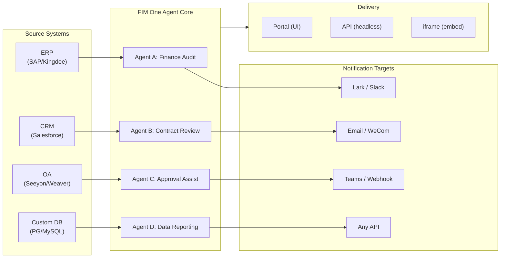

> Goal: Build an **all-in-one agent platform for Global × China enterprises** — delivered through three progressive modes: Standalone (portal assistant), Copilot (embedded in host system), Hub (central cross-system orchestration).
>
> Principles: **Provider-agnostic** (no vendor lock-in), **minimal-abstraction**, **protocol-first**, **connector-first** (integration is the core value).

## Produktvision

FIM One ist eine **All-in-One-Agent-Plattform**, die drei progressive Liefermodi bietet:

```
Standalone   → Your own AI assistant (Portal)
Copilot      → AI embedded in a host system (iframe / widget / embed)
Hub          → Central cross-system orchestration (Portal / API)
```

**Systemübergreifende Orchestrierung ist der Kernunterscheidungsfaktor.** Enterprise-Kunden haben Legacy-Systeme — ERP, CRM, OA, Finance, HR — die über KI miteinander kommunizieren müssen:



**GTM-Pfad: Land and Expand**

| Schritt | Modus | Was passiert |
|------|------|-------------|
| Land | Copilot | In ein System einbetten, Mehrwert in ihrer Benutzeroberfläche nachweisen |
| Expand | Copilot → Hub | Auf weitere Systeme ausrollen; Hub-Modus aggregiert sie |

## Bekannte Probleme

Nachverfolgter Fehler, die in der Produktion reproduzierbar sind, aber noch nicht behoben wurden. Jeder Eintrag nennt das Symptom, den vermuteten Bereich und die Problemumgehung (falls vorhanden). Elemente werden in einen Versionsabschnitt verschoben, sobald eine Lösung definiert und geplant ist.

- **Playground-Stopp-und-Wiederholung zeigt vorübergehende visuelle Artefakte, die ein Seitenaktualisierung immer behebt.** Drei gleichzeitige Render-Quellen — `activeConversation.messages` (DB-Snapshot), der SSE-`messages`-Stream und der optimistische `pendingQuery`-Platzhalter — werden nicht in einen einzelnen abgeleiteten Zustand zusammengefasst, daher kann die Benutzeroberfläche zwischen dem Klick auf „Wiederholen" und dem Eintreffen der gepaarten Assistentenantwort (a) die gleiche Abfrage kurzzeitig zweimal im Pre-Stream-Fenster rendern, (b) vorherige verwaiste Benutzerblasen aus dem Wiederholungsverlauf löschen, während `hasLiveMessages` wahr ist und bevor der Snapshot neu geladen wird, und (c) im engen Fenster zwischen dem SSE-„done"-Ereignis und der nächsten `selectConversation`-Aktualisierung flackern. **Daten gehen nie verloren** — jede Benutzernachricht (einschließlich abgebrochener Wiederholungen) wird in `conversation.messages` beibehalten, über `normalize_alternating_messages` in den nächsten LLM-Aufruf übernommen und nach der Aktualisierung über `HistoryTurn.orphanUserContents` (eingeführt in der `48ba08c6`-Render-Korrektur) korrekt gerendert. Zu Ihrer Information: Claudes eigene Web-Benutzeroberfläche zeigt eine analoge Fehlerklasse — das Stoppen mitten in einer Antwort und das sofortige Senden einer Folgefrage verzweigt die Folgefrage manchmal als Geschwister-Bearbeitungszweig der ersten Abfrage, anstatt sie als neuen Turn anzuhängen — daher ist dies ein bekanntes schwieriges Problem in optimistischen-UI- + SSE- + persistiertem-Verlauf-Designs, kein FIM-One-spezifischer Fehler. Eine ordnungsgemäße Lösung erfordert das Zusammenfassen der drei Render-Quellen in einen einzelnen abgeleiteten Zustand; aufgeschoben bis zu einer umfassenderen Playground-Zustandsmaschinen-Umgestaltung.

## Backlog (Low Priority) {/* dev: dev/dag-evidence-fidelity.md */}

Aufgeschobene Härtung — nicht blockierend; nur aufgreifen, wenn das entsprechende Szenario auftritt.

- [ ] **DAG evidence gets its own truncation budget**, decoupled from `DAG_ANALYZER_TRUNCATION`, so source evidence isn't re-clipped by the summary budget before the analyzer/synthesis verify against it.
- [ ] **Structure-aware evidence truncation** (head+tail / keep lists & tables) so long enumerations survive the cap instead of silently losing their tail.
- [ ] **Port the source-fidelity guideline into the ReAct fallback synthesis prompt** so total/severity mislabels are caught in ReAct too, not only in DAG.

## Versionen im Einsatz

### v0.1 (2026-02-22) — MVP: ReAct + DAG Planner
- ReActAgent mit Tools (calculator, python_exec, web_search)
- DAG Planner (LLM generiert Abhängigkeitsgraphen)
- Portal UI mit Streaming + KaTeX

### v0.2 (2026-02-24) — Multi-Model + Memory
- Retry / Rate Limiting / Usage Tracking
- Native Function Calling (kein reines JSON-Parsing)
- Multi-Model-Unterstützung (schnelles + Haupt-LLM)
- Memory: WindowMemory, SummaryMemory
- FastAPI-Backend mit SSE-Streaming

### v0.3 (2026-02-25) — Web Tools + MCP
- Web tools (web_search, web_fetch) via Jina/Tavily/Brave
- File operations tool
- MCP client (standard tool integration)
- Tool auto-discovery + categories
- DAG visualization with click-to-scroll
- Code exec in Docker (`--network=none`)

### v0.4 (2026-02-25) — Multi-Turn + Agents
- Multi-Turn-Konversationen (DbMemory)
- Tool-Schritt-Faltungs-UI
- HTTP-Anfrage- und Shell-Exec-Tools
- Verwaltung von Agenten (erstellen, konfigurieren, veröffentlichen)
- JWT-Authentifizierung
- Pro-Agent-Ausführungsmodus + Temperaturkontrolle

### v0.5 (2026-02-28) — Full RAG + Grounded Gen
- Full RAG pipeline (embedding + vector store + FTS + RRF + reranker)
- Grounded Generation (citations, confidence scores)
- Knowledge base document management (CRUD, search, retry, schema migration)
- ContextGuard + pinned messages (token budget manager)
- DbMemory persistence + LLM Compact
- DAG Re-Planning (up to 3 rounds)

### v0.6 (2026-03-01) — Connector Platform
- **Connector CRUD**: create, read, update, delete
- **ConnectorToolAdapter**: converts Connector → BaseTool
- **Per-user credentials**: AES-GCM encryption
- **Confirmation gate**: write operation approval
- **Audit logging**: all tool calls recorded
- **Circuit breaker**: graceful degradation on failures
- **Utility tools**: email_send, json_transform, template_render, text_utils
- **Embedding options**: Jina, OpenAI, custom providers

### v0.7 (2026-03-06) — Admin Platform + Multi-Tenant
- **Admin Platform**: Benutzerverwaltung, Rollenwechsel, Passwort-Zurücksetzen, Konto aktivieren/deaktivieren
- **Nur-auf-Einladung-Registrierung**: drei Modi (offen/Einladung/deaktiviert) + Einladungscode CRUD
- **Speicherverwaltung**: Festplattennutzung pro Benutzer, Löschen, verwaiste Bereinigung
- **Gesprächsmoderation**: Admin-Liste/Löschen aller
- **Erzwungenes Logout pro Benutzer**: alle Token widerrufen
- **API-Integritäts-Dashboard**: Systemstatistiken, Connector-Metriken
- **Assistent für erste Einrichtung**: geführte Erstellung des Admin-Kontos
- **Persönliches Zentrum**: globale Anweisungen pro Benutzer, Spracheinstellung
- **JWT auth**: Token-basierte SSE-Authentifizierung, Gesprächseigentümerschaft
- **Globale MCP-Server**: von Admin bereitgestellt, in allen Sitzungen geladen
- **Rückwärtskompatibilität**: registration_enabled → registration_mode automatische Migration

### v0.7.x (2026-03-07 bis 2026-03-12) — Stabilität + Verfeinerungen
- Einladecode-Verwaltung
- Pro-Benutzer-Kontingente (429-Durchsetzung)
- Strukturiertes Audit-Logging
- Filterung sensibler Wörter
- Admin-Anmeldungsverlauf
- Admin-Dateibrowser
- Erweiterte Admin-Ansichten (Felder model_name, tools, kb_ids)
- Docker-Compose-Bereitstellung (einzelnes Image, benannte Volumes)
- OAuth-Automatische Erkennung von window.location
- Erweitertes Denken / Reasoning-Unterstützung (`LLM_REASONING_EFFORT`, `LLM_REASONING_BUDGET_TOKENS`) für OpenAI o-Serie, Gemini 2.5+, Claude
- Admin pro Tool aktivieren/deaktivieren (deaktivierte Tools zur Laufzeit aus Chat ausgeschlossen)
- MCP-Server-Verwaltung auf Connectors-Seite verschoben
- Duale Datenbankunterstützung: SQLite (Null-Konfiguration Standard) + PostgreSQL (Produktion); Docker Compose stellt PostgreSQL automatisch bereit
- Dokumentationsseite zur Modellkonfiguration mit Extended-Thinking-Setup pro Provider
- SSE-Protokoll v2: Echtzeit-Antwort-Streaming mit `delta_reasoning`-, `usage`-Feldern und aufgeteilten `done`-/`suggestions`-/`title`-/`end`-Events; SQLite-Pool-Größe 5 -> 20
- AI-Builder-Erweiterung: 7 neue Builder-Tools (GetSettings, TestConnection, ImportOpenAPI für Connectors; ListConnectors, AddConnector, RemoveConnector, SetModel für Agents), `is_builder`-Flag auf Agents, automatische Builder-Prompt-Aktualisierung, SSRF-Schutz
- SSE-v2-Frontend: Streaming-Punkt-Puls-Cursor, DAG-Neuplanungs-Runden-Snapshots als einklappbare Karten, DAG-Layout entkoppelt von Schrittzuständen
- Konzeptdokumentationsseite für AI Builder mit Connector- und Agent-Builder-Leitfäden
- Organisationssystem: vollständige CRUD mit rollenbasierter Mitgliedschaft (Eigentümer/Admin/Mitglied), Admin-Verwaltungs-UI
- Dreiebenen-Ressourcensichtbarkeit (persönlich/Org/global) für Agents, Connectors, Knowledge Bases, MCP-Server
- Veröffentlichungs-/Unveröffentlichungs-API für alle Ressourcentypen; Eigentümerdelegation für veröffentlichte Agents
- Admin-Set-Visibility-Endpunkt (ersetzt Clone-to-Global); einheitlicher `build_visibility_filter()`-Abfrage-Helfer
- Datenbank-Connectors (Phase 1-3): direkter SQL-Zugriff auf PG/MySQL/Oracle/SQL Server + chinesische Legacy-DBs; Schema-Introspection, KI-Annotation, schreibgeschützte Abfrageausführung, verschlüsselte Anmeldedaten, 3 Tools pro Connector (`list_tables`, `describe_table`, `query`)
- **Evaluation Center**: quantitatives Agent-Qualitäts-Benchmarking — Test-Dataset-CRUD (Prompt + erwartetes Verhalten + Assertions), Eval-Läufe (parallele Ausführung + LLM-Grader + Pro-Fall-Pass/Fail/Latenz/Token-Ergebnisse), Ergebnis-Viewer mit automatischem Polling; Migration `r8t0v2x4z567`
- Drei Modellrollen (General/Fast/Reasoning) mit Pro-Tier-Umgebungskonfiguration-Isolation; Fast-Modell erbt nicht länger Hauptmodell-Einstellungen
- `StepOutput`-Dataclass ersetzt einfache String-Schrittergebnisse für strukturierte Daten und Artefakt-Übergabe
- Tool-Cache für DAG-Ausführung — identische Tool-Aufrufe pro Lauf gecacht mit asynchronem Lock-Stampede-Schutz (`DAG_TOOL_CACHE`)
- Pro-Schritt-LLM-Verifizierung mit 1 Wiederholung bei Fehler (`DAG_STEP_VERIFICATION`)
- Auto-Routing: schnelles LLM klassifiziert Abfragen als ReAct oder DAG; `/api/auto`-Endpunkt; Frontend 3-Wege-Modusumschalter (`AUTO_ROUTING`)
- [x] ~~**Shadow-Market-Organisation + Ressourcen-Abos**~~: Integrierte Market-Org (Shadow, kein Auto-Join) ersetzt Platform-Org; Ressourcen über Marketplace-Browsing erkannt und explizit abonniert (Pull-Modell); Market-API zum Abonnieren gemeinsamer Ressourcen; Veröffentlichung auf Market erfordert immer Überprüfung; Ressourcen-Abos-Tabelle; Org-basierte Ressourcenfreigabe ersetzt globale Sichtbarkeit
- [x] ~~**Agent-Automatische Erkennung und Sub-Agent-Bindung**~~: `discoverable`-Flag auf Agents; `sub_agent_ids`-Whitelist; CallAgentTool zum Delegieren von Aufgaben an spezialisierte Agents
- [x] ~~**MCP-Server-Anmeldedaten + Pro-Benutzer-Überschreibung**~~: `mcp_server_credentials`-Tabelle; `PUT /api/mcp-servers/{id}/my-credentials`-Endpunkt; `allow_fallback`-Flag für Anmeldedaten-Fallback-Verhalten
- [x] ~~**Connector/KB-Umschalter**~~: `POST /api/connectors/{id}/toggle` und `POST /api/knowledge-bases/{id}/toggle` zum Aussetzen/Fortsetzen von Ressourcen
- [x] ~~**Eigenständige KB-Konversationen**~~: `kb_ids`-Feld auf Konversationen für direkten KB-Chat ohne Agent-Bindung

### v0.8 (2026-03-20) — Connector Declarative Config + Progressive Disclosure
- [x] **Database connectors**: direct SQL access (PostgreSQL, MySQL, Oracle) *(shipped in v0.7.x — Phase 1-3)*
- [x] **RBAC**: per-user/role connector access control *(shipped in v0.7.x — org system + three-tier visibility)*
- [x] **Connector credential encryption + per-user override**: `connector_credentials` table, Fernet encryption via `CREDENTIAL_ENCRYPTION_KEY`, `allow_fallback` flag, `GET/PUT/DELETE /my-credentials` endpoints, per-user credential resolution in chat tool loading
- [x] **Publish review UI**: Org-level publish review system — review toggle per org, ReviewsSheet with approve/reject workflow, status badges on resource cards, review notice in publish dialog, resubmit for rejected resources
- [x] **Connector Progressive Disclosure (Phase 1-2)**: single `ConnectorMetaTool` replaces per-action tools; system prompt receives lightweight **stubs** only (name + 1-line description, ~30 tokens/connector vs ~250 tokens/action); agent calls `discover(connector)` to load full action schema on demand — schema only loads when the model selects a connector, keeping the prompt prefix stable for caching. Follows the deferred tool-loading pattern common in modern agent frameworks. `execute` subcommand; feature flag for backward compatibility.
- [x] **Agent Skill System + Compact Instructions**: On-demand skill loading for agent instructions — `Skill` model (name, content/SOP, optional scripts) attached to agents; referenced in system prompt by name only (~10 tokens/skill); agent calls `read_skill(name)` to load full content on demand. Reduces per-conversation instruction token cost by ~80% while allowing richer SOP libraries. Counterpart to ConnectorMetaTool's progressive disclosure applied at the instruction level. Enables the "指令 + 工具 + 技能" differentiation story. Also adds `compact_instructions` field to Agent model — per-agent compression priority list injected into `ContextGuard` when compacting (e.g., "preserve order IDs and amounts, drop raw API responses"), replacing the current static generic prompt. Follows the Compact Instructions convention widely adopted in modern agent frameworks.
- [x] **Connector import/export**: share connector templates
- [x] **Connector fork**: clone + customize existing connectors
- [x] **Workflow Phase 2 Nodes**: Iterator, Loop, VariableAggregator, ParameterExtractor, ListOperation, Transform, DocumentExtractor, QuestionUnderstanding, HumanIntervention — 9 advanced node types with full frontend + backend + 150 new tests (275 total). Node retry with exponential backoff, safe expression evaluation. Stats panel with success rate bar. 12 built-in templates. Pane context menu (Paste, Select All, Fit View, Auto Layout).
- [x] **Workflow Phase 3 Nodes: SubWorkflow + ENV** — 2 new node types (25 nodes total), 14 new tests (306 total), 14 built-in templates. SubWorkflow: full DB-backed nested workflow executor with target workflow selection, variable mapping, and configurable depth limit to prevent infinite recursion. ENV: reads encrypted environment variables with key picker and fallback defaults. Full frontend (node components, config panels, palette entries, minimap colors). Per-node execution statistics panel (success rates, durations, failure counts sorted worst-first). `getNodeStats` API client + `NodeStatEntry` type. Keyboard shortcuts dialog (`?` key).
- [x] **Workflow Scheduled Triggers**: Per-workflow cron configuration with timezone, default inputs, and next-run-at calculation. Preset cron buttons, 30 trigger tests.
- [x] **Workflow API Triggers**: Public per-workflow API keys (`wf_` prefix) for external execution without user auth, with rate limiting. API key management dialog with generate/regenerate/revoke, trigger URL, and cURL/JS examples.
- [x] **Workflow Batch Execution**: `POST /batch-run` with up to 100 input sets, configurable parallelism (1-10), collapsible per-item results, JSON export. 14 batch execution tests.
- [x] **Workflow Execution Log Viewer**: Real-time chronological SSE event stream in the run panel with timestamps, color-coded badges, and event type filter toggles.
- [x] **Workflow Run Stats**: Backend batch-fetches run counts and success rates via GROUP BY subquery; frontend displays stats on workflow cards with color-coded success rate indicators.
- [x] **Workflow Scheduler Daemon**: Background async service polling every 60s for due cron-based workflows. Croniter timezone support, semaphore concurrency, `last_scheduled_at` tracking, webhook delivery. 14 tests.
- [x] **Workflow Import Conflict Resolver**: Detects unresolved agent/connector/KB/MCP references during import. Batch DB queries with visibility filtering, frontend toast warnings. 17 tests.
- [x] **Workflow Test-Node Execution**: Isolated single-node testing with mock variables, integrated into editor (config panel Test button + context menu). 23 tests.
- [x] **Workflow Version Diff**: Side-by-side blueprint comparison with node/edge change detection, color-coded indicators (added/removed/modified).
- [x] **Workflow Run Management**: Delete individual runs (`DELETE /runs/{run_id}`) and clear all completed runs (`DELETE /runs`), with frontend confirmation dialogs.
- [x] **Workflow Run Replay Overlay**: "View on Canvas" button in run history to overlay past execution results on the canvas, showing per-node status and output without re-executing.
- [x] **Workflow Favorites/Pinning**: Star/pin workflows to the top of the list with localStorage persistence.
- [x] **Workflow Run History Export**: Export run history as JSON file download with full run metadata and per-node results.
- [x] **Admin Workflows Management**: Admin panel tab for managing all workflows across users — list, toggle active/inactive, delete with confirmation. Batch endpoints for delete, toggle, and publish with audit logging.
- [x] **Workflow Templates System**: `WorkflowTemplate` ORM model with admin CRUD, public listing/clone API, and 5 seed templates auto-inserted on first startup.
- [x] **Workflow Inline Validation Badges**: Real-time per-node `ValidationBadge` on canvas with error/warning tooltips for immediate visual feedback during editing.
- [x] **Workflow Execution Trace Viewer**: Timeline-based trace viewer Sheet with engine `trace_level` parameter and per-node variable snapshots for step-through debugging.
- [x] **Workflow Rate Limiting and Timeout**: Per-user `WorkflowRateLimiter` (sliding window 10 runs/min, 3 concurrent) and default 10-minute global run timeout.
- [x] **Workflow Blueprint System**: Visual workflow editor for designing and executing multi-step automation blueprints — `Workflow` / `WorkflowRun` ORM models, full CRUD + SSE execution API, import/export, duplicate, blueprint validation endpoint, `WorkflowEngine` with topological sort + semaphore-based concurrency + condition branching and 12 node types (Start, End, LLM, ConditionBranch, QuestionClassifier, Agent, KnowledgeRetrieval, Connector, HTTPRequest, VariableAssign, TemplateTransform, CodeExecution), `VariableStore` with `{{node_id.output}}` interpolation and `env.*` namespace, error strategies per node (STOP_WORKFLOW / CONTINUE / FAIL_BRANCH) with per-node timeout and advanced config UI, React Flow v12 visual editor with drag-and-drop palette + node config panel + variable picker combobox + add-node-on-edge + auto-layout (ELK.js) + run history sheet, Dify-style compact node design with ring-based run status styling and animated edge transitions, 4 built-in starter templates (Simple LLM Chain, Conditional Router, Knowledge-Augmented QA, HTTP API Pipeline) with template picker dialog and `GET /templates` + `POST /from-template` API, stats endpoint, `?run=true` URL param auto-open, subprocess-based code execution security, 105-test suite (templates, eval namespace flattening, blueprint validation warnings, node/edge deletion, import/export/duplicate, deadlock detection, multi-condition branching)
- [x] **Operation audit**: detailed logging of who did what — admin review log audit tab added (publish review trail per org/resource)
- [x] **Semantic Schema Annotations**: extend connector schema fields with `semantic_tag`, `description`, and `pii` flags; annotations surfaced in LLM tool descriptions so the agent understands field intent without guessing from column names

### v0.8.1 (2026-03-29) — Progressive Disclosure Maturity + ReAct Hardening
- Progressive Disclosure für DB-Konnektoren (`DatabaseMetaTool`), MCP-Server (`MCPServerMetaTool`) und bedarfsgesteuerte Tool-Bereitstellung (`request_tools` Meta-Tool)
- DAG-Qualitätsüberholung (5 Verbesserungen: Modell-Upgrade, automatische Skill-Erkennung, Citation Verifier, strukturierte Inhaltsbewahrung, domänengesteuertes Routing)
- Domain-Modell-Eskalation in ReAct (spezialisierte Domänen eskalieren automatisch zum Reasoning-Modell)
- Pro-Modell Native Function Calling Toggle (`tool_choice_enabled`)
- ReAct-Zyklenerkennung (deterministische Vermeidung doppelter Tool-Aufrufe)
- ReAct-Abschluss-Checkliste (Vor-Antwort-Verifizierung bei Tool-Verwendung)
- Resource Fork Phase 1 (MCP Server + Skill Fork Endpoints mit Lineage Tracking)
- Workflow Connection Dep Auto-Subscribe (rekursive Abhängigkeitsauflösung von Sub-Workflows)
- Vorgefertigte Lösungsvorlagen (8 vertikale Lösungen beim ersten Registrieren auf dem Markt bereitgestellt)
- Verbesserungen bei Admin-Benachrichtigungen (Zeitzone-bewusst, Master-Schalter, SMTP Reply-To)
- Pro-Turn Token-Budget Circuit Breaker (`REACT_MAX_TURN_TOKENS`)
- Zentralisierte Tool-Kürzung, dynamische System-Prompt-Budgetierung
- Dateianhang-Download, Behebung doppelter Nachrichteneinreichung

### v0.8.2 (2026-04-10) — Agent Core Hardening + Vision Documents
- **Agent Core Phase 0** — Compact prompt upgraded to 9-section structured format; empty tool result protection (descriptive message instead of `(no output)`); anti-loop prompt + cycle detection threshold lowered to 2; domain classifier + pre-flight DB config resolution parallelized (400–1100 ms saved per request); SSE `end` event sent immediately after answer, with title/suggestions moved to background tasks
- **Agent Core Phase 1 (Context Anti-Bloat)** — `MicroCompact` rule-based old tool result cleanup (keep last 6); `REACT_TOOL_RESULT_BUDGET=40000` aggregate cap; reactive compact on context overflow (auto-compact to 50% budget and retry instead of crashing)
- **Agent Core Phase 2 (Speed)** — Keyword-based tool pre-selection (skips LLM call on obvious matches, 200–500 ms saved); `SharedHttpClient` LLM connection pooling; completion check skipped for answers >200 tokens; `FallbackLLM` wraps primary+fast with automatic failover on 429/503/529/connection errors
- **Intelligent Document Processing (Vision-Aware)** — Adaptive document handling: PDF pages rendered as images via PyMuPDF for vision-capable models (GPT-4o, Claude 3/4, Gemini), text-only fallback via pdfplumber. Per-model `supports_vision` flag. Modes via `DOCUMENT_PROCESSING_MODE`, `DOCUMENT_VISION_DPI`, `DOCUMENT_VISION_MAX_PAGES`. DOCX/PPTX embedded image extraction. Multi-turn vision persistence across conversation turns. Smart PDF processing (text-rich pages extract text + images; scanned pages render as full-page PNG). Pre-built sandbox image (`Dockerfile.sandbox`) with common data-science packages for `--network=none` code execution
- **Resource Fork completion** — Agent / Connector / Workflow fork endpoints added, completing the five-type lineage tracking (KB fork removed — inherently user-local)
- **File integrity guardrail** — System prompt rule prevents the agent from substituting unrelated file contents when a target file is unreadable; uploaded files now include `file_id` in message context for direct `read_uploaded_file` access

### v0.8.3 (2026-04-16) — Universal Document Conversion + Agent Core Phase 3
- **Universal Document Conversion (`convert_to_markdown` + OCR)** — Built-in Agent tool wrapping Microsoft MarkItDown; converts PDF, Word, Excel, PowerPoint, HTML, JSON, CSV, XML, ZIP, EPUB, Outlook .msg, images, audio, YouTube URLs to Markdown. `LiteLLMOpenAIShim` enables OCR via any vision-capable LLM (Claude, Gemini, Bedrock, Azure). Vision-aware RAG ingestion with zero-regression text-only fallback. `LLM_SUPPORTS_VISION` env var for opt-out
- **Agent Core Phase 3 (Runtime Invariant Hardening)** — Conversation recovery (dangling `tool_use` auto-repair); structured compact work card (`WorkCard` typed merge across compaction rounds); turn-level profiler (`REACT_TURN_PROFILE_ENABLED`); per-user rate limiting (`LLM_RATE_LIMIT_PER_USER`); empty-content assistant message with `tool_calls` no longer dropped

### v0.8.4 (2026-04-17) — Prompt Cache + Reasoning Correctness
- **System prompt section registry with cache breakpoints** — Memoized `PromptRegistry` splits system prompts into stable prefix + dynamic suffix; cache-capable providers (Claude, Bedrock Anthropic, Vertex Claude) receive `cache_control: {"type": "ephemeral"}` on the prefix for ~60-80% per-turn input token savings. Non-cache providers get a single concatenated message (zero behavior change)
- **Prompt cache observability** — `cache_read_input_tokens` and `cache_creation_input_tokens` tracked through `UsageSummary` → `TurnProfiler` → `done_payload.cache` field. Structured `turn_cache` log line per turn. Doubles as relay cache-honesty probe
- **Conversation recovery MVP** — Synthetic `tool_result` rows persist after interrupted turns; `POST /chat/resume` replays cached SSE events from a monotonic cursor; frontend `useSseResume` hook auto-reconnects with exponential backoff (300ms → 1s → 3s, max 3 attempts) and "Reconnecting…" indicator
- **Thinking-block persistence with signature** — `reasoning_content` + Anthropic `signature` persisted in `metadata_["thinking"]` and replayed on subsequent turns; fixes HTTP 400 signature mismatch on Claude 4 multi-turn conversations
- **Provider-aware reasoning replay policy** — Centralized `reasoning_replay_policy()` in `core/prompt/reasoning.py` gates serialization per provider family: Claude replays thinking blocks with signature; DeepSeek-R1/Qwen-QwQ/Gemini-thinking/o-series drop `reasoning_content` on outbound (previously leaked, breaking provider KV caches and violating API docs)

### v0.8.5 (2026-04-23) — Channel Integration + Hook System + Contributor i18n
- **Feishu Channel (Phase 1 subset)** — Org-scoped `Channel` resource with Fernet-encrypted credentials; `FeishuChannel` supports interactive card send + callback (signature verification + URL challenge); Settings → Channels management UI (list, create/edit with dirty-state protection, details with copyable callback URL, test-send); CRUD API (`/api/channels`) and event callback endpoint (`/api/channels/{id}/callback`). Shipped early for 2026-04-24 roadshow
- **Agent Hook System (live in ReAct + DAG runtime)** — `PreToolUseHook` / `PostToolUseHook` abstraction in `src/fim_one/core/hooks/`; agents declaring `hooks.class_hooks` in `model_config_json` have hooks instantiated and registered per chat session. First consumer `FeishuGateHook` posts an Approve/Reject card to the linked Feishu group when an agent calls a `requires_confirmation=True` tool, blocks execution, and resumes or aborts based on verdict
- **Configurable confirmation gate (inline OR channel)** — Every agent gets an Approval section with three routing modes (Auto / Inline only / Channel only), approver-scope selector (initiator / owner / anyone in org), per-tool override, and explicit approval-channel picker. Auto mode gracefully falls back to an inline approval card when no channel is linked. `POST /api/confirmations/{id}/respond` shares a single decision-recording path with the Feishu webhook
- **Per-agent task completion notifications** — Long-running ReAct or DAG agents can push a summary card to the org's channel when a task finishes. First consumer of the generic outbound notification pattern
- **Hook Approval Playground** — Channels details sheet has a "Test Approval Flow" action that exercises the full production path (genuine `ConfirmationRequest` row, real Feishu callback, status transitions) — same code path a production hook uses
- **Contributor-friendly i18n CI fallback** — `.github/workflows/i18n-sync.yml` translates EN → ZH/JA/KO/DE/FR on master after PR merge and auto-commits with `[skip ci]`; contributors no longer need `LLM_API_KEY` locally. Pre-commit locale-edit guard refuses manual edits to generated locale files (`ALLOW_LOCALE_EDIT=1` override for legitimate translation fixes). End-to-end verified via smoke-test push
- **Exa integration docs** — Dedicated Integrations section with a first-class Exa page covering the full Exa search surface (neural / fast / deep-reasoning / instant), filtering, content retrieval, and three tuned presets
- **Xinchuang (信创) database support** — Database Connector now lists KingbaseES (人大金仓), HighGo (瀚高), and DM8 (达梦) alongside PostgreSQL/MySQL. PG-compatible drivers reuse `asyncpg`; DM8 uses `dmPython`. `scripts/test_xinchuang_dbs.py` verifies live connectivity from the CLI
- **Channels + Hook System architecture docs** — `docs/architecture/hook-system.mdx` explains the three hook points and walks through FeishuGateHook end-to-end; existing architecture pages cross-link; README lists Messaging Channels as a first-class capability
- **Hardening** — Duplicate Feishu callback clicks produce a replacement card instead of double-deciding; concurrent callback clicks resolved via conditional `UPDATE ... WHERE status='pending'` rowcount check; pending approvals auto-expire after `CHANNEL_CONFIRMATION_TTL_MINUTES` (default 24h) via background sweeper; Settings → Channels respects org role (members see read-only UI); parallel tool-call aggregator handles providers that reuse `index=0` for every delta; session-expiry redirect preserves query string

### v0.8.6 (2026-05-08) — Stripe Billing + Refinements
- [x] Stripe billing MVP — Free + Pro tiers; Checkout, Customer Portal, webhook lifecycle; `/settings?tab=billing`; admin plan/subscription CRUD; quota enforcement respects each user's plan
- [x] Admin-controlled billing feature flag — `system_settings.billing_enabled` gates the entire Stripe pipeline so private deployments without Stripe credentials never surface a non-functional payment UX
- [x] Per-user unlimited quota — empty inherits global default, `0` grants unlimited; previously both collapsed into the same state
- [x] Translation glossary as single source of truth — `scripts/translation-glossary.md` consolidates per-locale rules; pre-commit unconditionally refuses manual edits to generated locale files
- [x] License + governing law migrated to FIM Labs Pte. Ltd. (Singapore); SIAC arbitration in English; new top-level `NOTICE` file
- [x] Playground follow-up suggestions restored, opt-in per agent
- [x] Stability fixes — strict-alternation provider history, parallel tool-call boundary detection, unbound-agent confirmation flow, channel role gating, retry-duplicate suppression, post-rejection no-paraphrase

### v0.8.7 (2026-06-10) — Security Hardening + Guardrails v0 + Billing Correctness
- [x] JWT token-type confinement — closes a 2FA bypass where any same-signed token (temp/refresh/ticket) could authenticate API and SSE endpoints
- [x] OAuth hardening — email auto-link requires a provider-verified email (account-takeover fix); OAuth refresh tokens stored hashed so session rotation works
- [x] Content guardrails v0 — input/output tripwire layer (`core/agent/guardrail`); ships jailbreak detector + max-length output guardrail, env-var configured
- [x] `file_ops.apply_patch` — V4A diff patches with fuzzy whitespace matching, complements `find_replace`
- [x] Billing-cycle correctness — quota resets on the subscription anniversary (not calendar month); renewals advance the period via authoritative Stripe lookup; usage display aligned to the enforcement window
- [x] Reliability fixes — pseudo-protocol tool-call leak stripped from answers; tunable HTTP keep-alive ends `APIConnectionError` bursts; API-key usage stats persist on read-only requests
- [x] Billing tab visual overhaul — full-width, consistent with other Settings tabs

### v0.8.8 (2026-06-22) — SSRF Hardening + Reliability & Reasoning Fixes
- [x] SSRF hardening — blocklist unwraps IPv4-mapped IPv6 (`::ffff:` instance-metadata bypass); MCP SSE/Streamable-HTTP server URLs SSRF-validated on create + connect
- [x] LLM reliability — shared HTTP pool self-heals after a LiteLLM client-cache eviction closes it; chat sends stream instantly (history folded in background, no full reload)
- [x] Anthropic adaptive-thinking protocol for Opus 4.6+/Sonnet 4.6/Fable 5 — extended thinking works where the old fixed-budget param 400s on 4.7/4.8; warns on OpenAI-proxy misroute
- [x] Reasoning detail preserved end-to-end — genuine final answer streamed verbatim; survives compaction, context rebuilds, and sub-agent steps (no lossy re-synthesis)
- [x] `PreToolUseHook` enforcement hooks fail closed on error — a crashing approval gate no longer silently allows the call; non-enforcement hooks keep fail-open via `fail_open`
- [x] Force-logout timestamp comparison normalized to UTC by conversion + Docker Compose `POSTGRES_*` credential override (no shipped `fim:fim` default)

### v0.8.9 (2026-07-08) — Module Slim-down + Sharing Convergence + Approval Hardening
- [x] Skills & Workflows soft-shelved behind admin module flags (default off) — core-only boot; nothing deleted, reversible from Admin → Settings → Modules
- [x] Sharing converged — KB sharing removed (KBs reach others only via shared Agents), DB connectors unshareable + raw SQL owner-only, workflow builder trimmed to 9 reference-only nodes
- [x] Feishu approval hardening — card clicks enforce approver identity, callback signatures fail closed + encrypted envelopes decrypted, approvals never routed to an unintended chat
- [x] Use-time access re-checks — shared MCP servers and bound KBs re-verified per run; leaving an org revokes subscriptions and saved credentials immediately
- [x] Agent loop hardening — plan board, background tools, incremental DAG replan + checkpoint resume, compaction keeps tool pairing, truncation continuation, 529/504 retry
- [x] `run_workflow` agent tool + workflow correctness — Agent node runs the full agent, confirmation gates fail closed, connector calls access-checked and audit-logged
- [x] Account deletion unified — admin and self-serve funnel through one purge routine covering every record and on-disk file; org owners must transfer ownership first
- [x] Owner-credential fallback now opt-in (breaking) — connectors/MCP servers default `allow_fallback` off, existing rows flipped; no-fallback resources you lack credentials for are hidden from the toolset
- [x] Webhook/cron workflow runs metered to the owner's token quota — the unmetered free-LLM trigger path is closed
- [x] Resource binding unified on visibility — subscribed connectors/KBs/MCP servers bindable to agents; workflow connector steps enforce the runner's access
- [x] Conversation workspace wired into chat — `workspace://` offload of oversized tool results, budget-truncation rescue, pre-compaction transcript snapshots

## Geplante Versionen

Neu geplant 2026-07-08: FIM One ist eine Agent-Runtime — ein Kernel (ReAct-Engine, Credentials, Approval Gate, Audit, Multi-Tenant-Orgs) hinter mehreren Delivery-Oberflächen: Web UI, API, JS Embed, MCP Output. Jede Oberfläche nutzt dieselbe Assembly-Schicht für Auth, Credentials, Approval und Metering: mehr Frontends, nie mehr Logik. Die kurzfristige Richtung ist die Konvergenz auf den Data-Q&A-Slice (ChatBI), wobei Szenarien statt einer Plattform verkauft werden. {/* dev: dev/replan-2026-07.md */}

### v0.9 — Connector Fences + Scenario Onboarding

**Ziel**: Die nach der Reduktion zusammengestellten Assets bilden ein vollständiges Daten-Q&A-Produkt — schreibgeschützte DB-Konnektoren + Fences + Approval Gate + IM-Einstiegspunkt. Tier-1-Fences wandeln Sicherheitsschulden in Produktfeatures um.

#### DB Connector Fences — Tier 1, three PRs {/* dev: dev/connector-rbac/00-overview.md */}

- [ ] PII-Spaltenschwärzung (`ConnectorScopeGuard` PreToolUse Hook)
- [ ] Schemasichtbarkeit — Tabellen-/Spalten-Allow-Deny + Verb-Blockierung (Schreibschutz-Durchsetzung)
- [ ] Fence-Nachverfolgbarkeit — `caller_user_id`, `effective_credential_source`, `scope_rules_applied` in `ConnectorCallLog`
- [ ] Pro-Hook-Konfigurationsweiterleitung (`{"name", "config"}` Schema) — der Träger für ScopeGuard-Regeln {/* dev: dev/hook-system.md */}
- [x] Genehmigungsgates bleiben über Delegierung erhalten — `call_agent` und Workflow-`AGENT`-Knoten führen die eigenen Hooks des Agenten aus statt keine

#### Antwort-Rendering

- [x] Antworten rendern Mermaid-Diagramme, SVG-Figuren und kartenförmige Vergleichstabellen mit Kopier-/Exportfunktion für Antworten, Codeblöcke und Tabellen
- [x] Gerendertes Markdown wird bereinigt, wodurch Raw-HTML-Injection aus Modellausgabe und hochgeladenen Dateien verhindert wird
- [x] Diagramme und Codeblöcke können als Dateien heruntergeladen werden; Reasoning wird in Live- und vergangenen Gesprächen standardmäßig zu einzeiligen Vorschauen eingeklappt
- [x] Gesprächsexporte sind für CJK gesetzt — PDF bettet eine echte Schriftart ein (korrekter Abstand, Aufzählungszeichen und Fettdruck), DOCX deklariert eine ostasiatische Schriftart, beide auf einer Größenskala

#### Workbench UX

- [x] Seitenleiste um den Chat-Cluster reorganisiert — Unterhaltungen direkt unter Neuer Chat/Suche, Modulnavigation in einem kompakten unteren Dock
- [x] `/clear` Schrägstrich-Befehl startet eine neue Unterhaltung aus dem Eingabefeld

#### Kontextrobustheit

- [x] Kontextbudgets liegen 8% unter dem Modell-Hardlimit; beim Start wird gewarnt, wenn das Fenster des schnellen Modells das allgemeine Budget nicht halten kann
- [x] Plan-Board-Disziplin: Wiederholungs- und No-Plan-Erinnerungen, und das Abschließen mit offenen Plan-Elementen erzwingt nun einen Verifizierungsdurchlauf
- [ ] Chunked-Kompaktierungseingabe und modellbewusste Budgets auf dem Hauptchat-Pfad, damit jede Modellmischung innerhalb des Fensters bleibt

#### Szenario-Onboarding

- [ ] Der erste Durchlauf startet von einer Szenariovorlage (solution_seeds) statt von einer leeren Workbench
- [ ] Die Docs-Landingpage führt mit drei vertikalen Szenariogeschichten statt mit einer Modulreferenz an
- [ ] Eine Szenariovorlage pro abgeschlossenem Engagement destilliert — der Wettbewerbsvorteil liegt in Szenario-Assets × Liefergeschwindigkeit

### v0.10 — Two Mouths: JS Embed + IM Inbound {/* dev: dev/im-channels.md */}

**Ziel**: Die zwei verkäuflichsten Lieferflächen, beide auf demselben Kernel und der gleichen Assemblyebene.

- [ ] JS bubble / iframe embed — ein Snippet in ein Host-System; Identität anonymer Besucher + Abrechnungszuordnung vor dem Build entschieden
- [ ] Feishu inbound @mention — Agenten leben in der Gruppe: Daten abfragen, Datei-Genehmigungen, Chase-Flows
- [ ] Outbound-Muster: Fehleralerts, Budgetwarnungen, geplante Digests, Eskalation, Audit-Quittungen
- [ ] WeCom / DingTalk channels nach Feishu

### Parked — signal-gated

Do not start these without their trigger (see the replan §3): the MCP gateway waits for ≥2 unsolicited "mount your tools in my agent" asks; channelization waits for an implementor asking about licensing; IdP/OrgSync waits for customer pull; the rest wait for a delivered engagement that needs them.

- [ ] MCP gateway output — reverse-expose connector discover/execute as MCP tools for downstream agents
- [ ] Channelization / white-label enablement — commercial-license path already in place
- [ ] Identity Provider module + Channel slim-down — Feishu SSO, org graph sync {/* dev: dev/connector-rbac/07-identity-providers.md */}
- [ ] Connector authorization Tier 2 (require per-user credentials, key-binding health) + Tier 3 (login-ticket exchange) {/* dev: dev/connector-rbac/00-overview.md */}
- [ ] Public API Phase 2 — per-key rate limits/quotas, versioning, SDKs, developer portal {/* dev: dev/public-api-phase2.md */}
- [ ] Observability — Agent Trace Layer (Trace/Span model, timeline viewer, OTel export) + metrics dashboard {/* dev: dev/agent-trace-layer.md */}
- [ ] Agent Workspace remainder — handoff notes, file browser UI, cross-session recall, compaction segments (grep-able on-disk summary the agent reads back) {/* dev: dev/agent-workspace.md */}
- [ ] Guardrails v1 — off-topic filter, PII redactor output guardrail, per-agent guardrail config UI
- [ ] Hook System extras — built-in hooks, `SessionStart` + user YAML hooks {/* dev: dev/hook-system.md */}
- [ ] Connector platform depth — Progressive Disclosure Phase 3-4, YAML/JSON connector config, DB connectors Phase 4 (Oracle / SQL Server / GBase), MCP connection pooling
- [ ] Prompt cache follow-ups — Gemini context cache adapter, per-agent `cache_ttl` {/* dev: dev/prompt-cache-followups.md */}
- [ ] Hot mid-stream DAG resume — SSE reconnect re-attaches to a running turn (cold retry-resume already shipped) {/* dev: dev/incremental-dag.md */}
- [ ] Ecosystem — scheduled/event-triggered agents, workflow trigger-identity observability, per-workflow `credential_policy`, DB Schema Advanced Builder, sandbox hardening v2

### Aus dem Pre-Replan v0.9 Plan ausgeliefert

- [x] ~~Auth & Security: JWT-Token-Typ-Beschränkung + OAuth-Fixes (v0.8.7); PostgreSQL-Zeitzonen-bewusste Zeitstempel (v0.8.6); Force-Logout UTC + `POSTGRES_*`-Überschreibung + SSRF-IPv6-Mapping-Fix (v0.8.8); Owner-Fallback-Opt-in + Visibility-einheitliche Bindung + Webhook/Cron-Metering (v0.8.9)~~
- [x] ~~Provider-Kompatibilität: Anthropic adaptives Denken + gemeinsamer LLM-Pool Self-Heal (v0.8.8)~~
- [x] ~~Content Guardrails v0: Tripwire-Schicht + Jailbreak-Detektor (v0.8.7)~~ {/* dev: dev/archive/openai-agents-insights.md */}
- [x] ~~Hook-System: Skeleton + FeishuGateHook + Approval Playground + ReAct/DAG-Laufzeit (v0.8.5); PreToolUse-Durchsetzung Fail-Closed (v0.8.8)~~
- [x] ~~Feishu-Kanal Phase 1 + Aufgabenvollendungs-Benachrichtigung (v0.8.5)~~
- [x] ~~`run_workflow` Agent-Tool (v0.8.9); Reasoning-Details durchgehend erhalten (v0.8.8); Workspace-Tool-Output-Auslagerung in Chat integriert (v0.8.9)~~
- [x] ~~Agent-Loop-Härtung: Plan Board, LLM-Call-Resilienz, Hintergrund-Tools, inkrementelle DAG-Neuplanung + Checkpoint-Wiederaufnahme, Kompaktierungs-Tool-Paarung (v0.8.9)~~ {/* dev: dev/incremental-dag.md */}

- [x] ~~Circuit Breaker, Workflow-Run-Aufbewahrungsbereinigung, Workflow-Versions-Diff-Zusammenfassungen~~ *(v0.8 / v0.8.1)*
- [x] ~~DAG-Qualitäts-Überholung, Domain-Modell-Eskalation, Pro-Modell-NFC-Umschalter~~ *(v0.8.1)*
- [x] ~~DatabaseMetaTool, MCPServerMetaTool, On-Demand-`request_tools`~~ *(v0.8.1)*
- [x] ~~Workflow-Verbindungs-Dep-Auto-Subscribe, Workflow-echte Executoren~~ *(v0.8.1)*
- [x] ~~ReAct-Zyklus-Erkennung, Vollständigkeits-Checkliste~~ *(v0.8.1)*
- [x] ~~Vorgefertigte Lösungsvorlagen (8 vertikale Bundles), Resource Fork (MCP/Skill/Agent/Connector/Workflow)~~ *(v0.8.1)*
- [x] ~~Vision-Dokumentenverarbeitung (PDF / DOCX / PPTX), MarkItDown OCR~~ *(v0.8.2 / v0.8.3)*
- [x] ~~Smart File Content Injection + `read_uploaded_file`~~ *(v0.8)*
- [x] ~~Agent Core Phase 3: Conversation Recovery MVP, Compact Work Card, Turn Profiler, Pro-Benutzer-Rate Limiting~~ *(v0.8.3)*
- [x] ~~Conversation Resume MVP, System Prompt Registry + Cache, Thinking-Block-Persistenz, Reasoning-Replay-Richtlinie, Cache-Observabilität~~ *(v0.8.4)*

### v1.0 — Hot-Plug + Embeddable

**Ziel**: Connector-Hinzufügung ohne Neustart, Paket-Ökosystem und eingebettete Bereitstellung.

- [ ] **Connector Progressive Disclosure (Phase 5)**: **Semantic-Guided Tool Selection** (Entitätsextraktion aus Abfrage → Ontology Registry-Lookup → Connector-Set-Reduktion; 90%+ Token-Reduktion für 50+ Connector-Bereitstellungen); Scale-Modus für Batch-/ETL-Connectoren; CLI-ähnliche universelle `connector <name> <action> <params>`-Schnittstelle
- [ ] **Cross-Connector Entity Alignment (Ontology Registry)** — *herabgestuft 2026-04-21: bedarfsgerechte benutzerdefinierte Bereitstellung, keine Kernfunktion*: Definieren Sie gemeinsame Entitätstypen (Customer, Order, Asset) mit Feldmappings über Connectoren hinweg; DAGPlanner löst Cross-System-JOIN-Schlüssel automatisch auf; ermöglicht Connector-übergreifende Abfragen (z. B. „Kunden in Salesforce, die in Shopify bestellt haben") ohne hartcodierte Feldnamen
- [ ] **Hot-plug Connectoren**: OpenAPI-Spezifikation hochladen, KI generiert Konfiguration, live in 5 Minuten (kein Neustart)
- [x] ~~**Marketplace Redesign Phase 1 — Solutions + Components**~~: Zweiebenen-Marktmodell (Solutions: Agent/Skill/Workflow; Components: Connector/MCP Server); Scope-Selector (Global Market / org); einheitliches Abonnementmodell (org auto-appear entfernt); KB aus Market-Scope entfernt; Datenmigration füllt Abonnements für bestehende Org-Mitglieder auf
- [ ] **Market Package System**: Verteilbare Ressourcen-Bundles für den Marketplace — ersetzt Pro-Typ-„Marketplace" durch eine einheitliche Packaging-Schicht. `fim-package.yaml`-Manifest deklariert: Metadaten (Name, Version, Beschreibung, Autor, Lizenz, Tags, `min_fim_version`), Entry Point (primäre Skill oder Agent), Ressourcenliste (Agents, Skills, Connectoren, KBs, MCP Server, Workflows) mit Konfigurationsreferenzen, paketübergreifende Abhängigkeiten (semver-Bereiche), erforderliche Anmeldedaten (auf Connector-Refs für Installationszeit-Erfassung abgebildet) und benutzerkonfigurierbare Variablen mit Standardwerten. **Zwei Konsummodi**: (1) **install** — Batch-Erstellung aller Ressourcen + automatische Verdrahtung interner Referenzen über ID-Substitution; Installation mit Quelle verknüpft für Versionsaktualisierungsbenachrichtigungen; `POST /api/market/packages/{id}/install`; (2) **fork** — Klonen als benutzergesteuerte bearbeitbare Kopien ohne Update-Link (dies ist der Template-Modus); `POST /api/market/packages/{id}/fork`. Zusätzliche Endpunkte: Veröffentlichung (`POST /api/market/packages` mit Review-Workflow), Deinstallation (`DELETE /packages/{id}/uninstall` mit Abhängigkeitsprüfung + Bestätigung geänderter Ressourcen), Versionsverlauf (`GET /packages/{id}/versions`), Upgrade (`POST /packages/{id}/upgrade` mit Pro-Ressourcen-Diff-Vorschau). Abhängigkeitsresolver für verschachtelte Paketanforderungen mit Konflikt-Erkennung. `PackageInstallation`-Tabelle verfolgt installierte Pakete pro Benutzer mit Ressourcen-ID-Mapping für Deinstallation/Upgrade. **Koexistiert mit individueller Ressourcenveröffentlichung** — Package ist eine Kompositionsschicht, kein Ersatz; ein einzelner Connector ist immer noch eigenständig veröffentlichbar. Beispiel-Abhängigkeitsbaum: `Package: contract-review` → `Skill: contract-review` (Entry Point) → `Agent: contract-analyst` + `Agent: risk-scorer` → `KB: legal-clauses` + `Connector: docusign-api` + `MCP: pdf-extractor` + `Workflow: contract-approval-flow`
- [ ] **Creator Program**: Marketplace-Monetarisierungsschicht — Creator-Profile mit Portfolio-Seiten, Pro-Paket-Analysen (Installationen, Forks, aktive Benutzer, Bewertungen/Rezensionen), Affiliate-Provisionserfassung, wenn Pakete neue Abonnements fördern. Bezahlte Paket-Stufe mit Preisgestaltung, Kauffluss und Genehmigungsworkflow. Creator-Dashboard mit Installationstrends, Umsatzberichterstattung und Benutzer-Feedback. Öffentliche Creator-API für programmgesteuerte Paketveröffentlichung (CI/CD für Paketautoren). Community-Funktionen: Paketkommentare, Q&A, Changelogs pro Version
- [ ] **Einbettbares Widget**: `<script src="fim-one.js">` in Host-Seite eingefügt
- [ ] **Seiten-Kontext-Injektion**: Widget liest Host-Seiten-Kontext (aktuelle ID, URL, DOM-Selektoren)
- [ ] **Erweiterte Trigger**: Webhook-Inbound-Events; Verbesserungen geplanter Aufträge (Multi-Zeitzone, Kalender-bewusst)
- [ ] **Batch-Ausführung**: Verarbeitung von 1000+ Elementen über DAG
- [ ] **Enterprise-Sicherheit**: IP-Whitelisting, Verschlüsselung im Ruhezustand, SSO
- [ ] **KB Advanced Editor**: Builder-Modus-Agent für Power-User, die große Wissensdatenbanken verwalten — Massen-URL-Erfassung, Duplikat-Erkennung, Lückenanalyse, Dokumenten-Lebenszyklusmanagement; erweitert bestehenden KB-KI-Chat mit ReAct-Tool-Schleife
- [ ] **Stripe Billing (v1 MVP — Pro Subscription)**: Kostenlos + Pro Zwei-Ebenen-Abonnement mit monatlichem Token-Kontingent. Stripe Checkout (gehostet) + Customer Portal (Self-Service) + Webhook-gesteuerte Lebenszyklen (`checkout.session.completed` / `customer.subscription.updated|deleted` / `invoice.payment_succeeded|failed`). Soft-Cap bei Kontingent-Erschöpfung (HTTP 402 + Upgrade-Aufforderung) — keine Übergebühren in v1. Nur Pro-Benutzer-Abrechnung; Org/Team-Abonnements auf v3 verschoben. Voraussetzungen:
  - [x] ~~**Datenmodell + SDK-Grundlagen** (P1) — `billing_plans` / `subscriptions` / `stripe_webhook_events`-Tabellen, ORM-Modelle, Stripe-SDK-Singleton, Free + Pro-Seeds~~ *(ausgeliefert in v0.8.6)*
  - [x] ~~**Backend-API + Webhook-Handler** (P2) — `/api/billing/*` + `/api/webhooks/stripe` mit Signaturverifizierung + Idempotenz; Plan-bewusstes Kontingent; stündliche Lebenszyklusbereinigung~~ *(ausgeliefert in v0.8.6)*
  - [x] ~~**Frontend-Billing-Tab + 402-Upgrade-Dialog** (P3) — `/settings?tab=billing` Kontingent-Anzeige, Upgrade-CTA, `past_due`-Banner, Mid-Stream-402-Dialog~~ *(ausgeliefert in v0.8.6)*
  - [x] ~~**Admin-Plan-Verwaltung** (P4) — `admin/billing/{plans,subscriptions}` CRUD~~ *(ausgeliefert in v0.8.6)*
  - [x] ~~**Admin-gesteuerte Billing-Feature-Flag** (P5) — `system_settings.billing_enabled` gated die Stripe-Pipeline; idempotente Aktivierung seeds Free+Pro, setzt Standard-Plan-Pointer, füllt Benutzer auf; Toggle aus/an ist reines Flag-Flip nach Aktivierung~~ *(ausgeliefert in v0.8.6)*
  - [ ] **Abstimmung + E2E + Go-Live** (P6) — nächtliches `subscriptions` ↔ `stripe.Subscription.list()`-Abstimmungsskript für verpasste Webhook-Wiederherstellung; vollständiger Happy-Path / Cancel-Mid-Period / Past-Due-Regressionstests; Wechsel von Test-Modus `stripe_price_id` zu Live `price_id`; Smoke-Test auf Staging mit echter Karte.

- [ ] **Team-Plan (Stripe-Plätze)** — Pro-Platz-Preisgestaltung über `stripe.Subscription.quantity`, integriert mit Organization-Mitgliedschaft. Ermöglicht Unternehmen, einen teamweiten Plan mit N Plätzen zu abonnieren; Kontingent und Feature-Flags werden durch die Platzgruppe statt durch den einzelnen Benutzer gelöst. Baut auf dem v1.0 Stripe MVP und dem bestehenden Organization-Modell auf.
- [ ] **Gruppen-Level-Token-Kontingent für Nicht-Billing-Bereitstellungen** — Enterprise-/Private-Bereitstellungen ohne Stripe konfigurieren Organisations-Level-Token-Budgets. Kontingent-Kette erweitert zu `override > group > plan > default`; Gruppenauflösung verwendet `max(user_quota, group_quota)`, sodass einzelne VIPs nicht durch die Team-Cap eingeschränkt werden. Landet neben dem Team-Plan, sodass die gleichen Primitiven sowohl abgerechnete als auch selbstgehostete Topologien bedienen.

**Auswirkung**: Unternehmen stellen FIM One von Null bis Multi-System-Orchestrierung in Tagen bereit. Das Paket-System schafft ein Creator-Ökosystem — Lösungsautoren veröffentlichen zusammengesetzte Bundles (Skill + Agents + Connectoren + KBs + Workflows), Unternehmen installieren mit einem Klick, Creator verdienen durch Adoption. Install/Fork-Dualität deckt sowohl „As-Is verwenden" als auch „Aus Template anpassen" Anwendungsfälle in einem einzigen Mechanismus ab.

## Eingefrorene Funktionen (Ausgeliefert, Nur Wartung)

Gemäß der [Orthogonality Strategy](/strategy/orthogonality-strategy) sind diese Funktionen ausgeliefert und funktionsfähig, erhalten aber keine neuen Funktionen (nur Fehlerbehebungen):

| Funktion | Version | Grund für Einfrieren |
|---------|---------|-----------|
| ReAct Agent | v0.1, v0.9 | Modelle haben jetzt natives Tool Calling. Mid-Loop Self-Reflection (v0.9) verhindert Goal Drift in langen Ketten. Tool Observation Synthesis Qualität verbessert (8K Zeichen, konfigurierbar über `REACT_TOOL_OBS_TRUNCATION`) |
| DAG Planning / Re-Planning | v0.1, v0.5, v0.7.5 | Modell-Reasoning-Fähigkeiten verbessern sich; Zerlegung wird Single-Shot. Per-Step Verification in v0.7.5 ausgeliefert (`DAG_STEP_VERIFICATION`). Gehärtet: Cascade Failure Propagation, Verifier Status Fix, Planner Tool Descriptions, vollständige Replan History, Whitelist-basierter Tool Cache. 14 Engine Constants als ENV Vars verfügbar — keine weiteren Planning Primitives geplant |
| Memory (Window, Summary, Compact) | v0.2, v0.5 | Context Windows wachsen (200K+); weniger Bedarf für externe Memory Management |
| RAG Pipeline | v0.5 | Provider bauen Retrieval nativ (OpenAI file_search, Gemini Search Grounding) |
| Grounded Generation | v0.5 | Modelle verbessern sich bei Citations; 5-Stage Pipeline bietet abnehmenden Nutzen |
| ContextGuard / Pinned Messages | v0.5 | Wird wie vorhanden ausgeliefert; keine neuen Funktionen |

## Überlegungen (Auf unbestimmte Zeit aufgeschoben)

Gemäß der Orthogonalitätsstrategie würden diese einen hohen Aufwand erfordern und ein Absorptionsrisiko bergen:

| Feature | Grund für Aufschub |
|---------|------------|
| Multi-Agent-Orchestrierung (tiefe Hierarchien) | Anbieter bauen nativ (OpenAI Swarm, Google A2A und ähnliche Multi-Agent-Angebote). FIM One's CallAgentTool deckt den Fall der einstufigen Delegation ab; ereignisgesteuerte Hintergrund-Agenten werden durch Scheduled Jobs in v0.9 abgedeckt |
| Agent-Selbstmodifizierende Skills (Procedural Memory) | Agenten aktualisieren ihre eigene `skill.md` während der Ausführung — hohe Komplexität, große Sicherheits-/Audit-Oberfläche. Hängt davon ab, dass das Agent Skill System (v0.8) zuerst ausgeliefert wird. Neu bewerten, wenn Enterprise-Kunden explizit selbstverbessernde Agenten anfordern |
| ~~Agent Workspace (Tool Output File Offloading)~~ | Befördert zu v0.9. Der Wert liegt in **selektivem Lesen**, nicht in Kontextkapazität — frameworkübergreifende Validierung bestätigt. Ursprüngliche Aufschublogik („200K+ Fenster reduzieren Dringlichkeit") war falsch. |
| Cross-Session Long-Term Memory | Kontextfenster wachsen schnell (200K–2M); Anbieter fügen eingebautes Memory hinzu (OpenAI memory, Gemini context caching); hohe Implementierungskosten vs. sinkender Differenzierungswert. Neu bewerten, wenn Enterprise-Kunden es explizit anfordern |
| Memory Lifecycle (TTL, Quoten) | Hängt von Cross-Session Memory ab; gemeinsam aufgeschoben |
| Active Context Compression Tool (agent-triggered) | Explizit eingefroren mit ContextGuard (v0.5). Kontextfenster bei 200K+ reduzieren den Wert. Wird nicht erneut überprüft, es sei denn, Kontextkosten werden zu einer großen Enterprise-Beschwerde |
| Browser-Automatisierung / Computer Use | Hohe Wartungskosten (DOM-Änderungen, Anti-Bot, Sandboxing). Branche konvergiert auf Computer Use Mode (Anthropic, OpenAI Operator, Google Mariner) und MCP Browser Tools (Puppeteer/Playwright MCP). Über MCP-Integration konsumieren, nicht selbst bauen. Neu bewerten, wenn ein stabiler Computer Use MCP Standard entsteht |
| Web Push Notifications | Browser-native Push über Service Worker + VAPID. Überlappt mit IM Channel Integration (v0.8), die Enterprise-bevorzugte Kanäle abdeckt (Lark/Slack/WeCom/Email). IM Push hat höheren Enterprise-Wert; Web Push ist ein Nice-to-Have für Portal-only-Benutzer. Neu bewerten nach IM Channel Auslieferung — wenn Benutzer Browser-Benachrichtigungen über IM-Abdeckung hinaus anfordern |
| Multi-User Workflow Collaborative Editing | Echtzeit-Co-Editing desselben Workflow-Blueprints (Figma/Notion-Stil) mit Cursor-Awareness, Konfliktauflösung und Pro-Node-Sperre. Hohe Implementierungskosten (CRDT / OT, Presence-Infrastruktur), unklar Enterprise-Nachfrage über heutiges „ein Editor gleichzeitig + Version Diff" Modell. Neu bewerten, wenn mehrere Unternehmen explizit gemeinsames Live-Editing anfordern |
| Per-Node Workflow Execution Permissions (RBAC on Run) | Feinkörnige Autorisierung *innerhalb* einer einzelnen Workflow-Ausführung — z.B. „Node X erfordert Rolle `finance_approver` zur Ausführung". Heute erfolgt Autorisierung auf Workflow-Ebene (wer kann auslösen) und auf Connector-Ebene (wessen Anmeldedaten führen aus); Per-Node RBAC fügt eine dritte Achse mit erheblicher Komplexität und keiner aktiven Kundenanfrage hinzu |
| Cross-Org Workflow Sharing mit Live Updates | Abonnieren Sie einen Workflow aus einer anderen Org und erhalten Sie Upstream-Updates ohne Neuforking. Heute bedeutet Abonnieren = Fork (Snapshot), daher brechen Upstream-Änderungen nie aus. Live Updates würden Upstream-kompatible Schema-Evolution + Konfliktauflösung erfordern; hohe Wartungskosten. Neu bewerten, wenn Unternehmen „gemeinsame Workflows über Tochterunternehmen" anfordern |

## Wie Versionen mit Modi übereinstimmen

| Version | Standalone | Copilot | Hub | Anmerkungen |
|---------|-----------|---------|-----|-------|
| **v0.1–v0.3** | Funktioniert | Noch nicht | Noch nicht | Nur Portal, Einzelbenutzer |
| **v0.4** | Funktioniert | Noch nicht | Noch nicht | Multi-Konversation, Agent-Verwaltung |
| **v0.5** | Funktioniert | Noch nicht | Noch nicht | Wissensdatenbank + RAG |
| **v0.6** | Funktioniert | Möglich | Möglich | Connectors verfügbar; Copilot/Hub möglich mit manueller Verkabelung |
| **v0.7** | Funktioniert | Bereit | Bereit | Admin-Plattform; Multi-Tenant-Authentifizierung; produktionsreif |
| **v0.8** | Funktioniert | Bereit | Optimiert | RBAC + Audit-Log pro System; einfacheres Onboarding |
| **v0.9** | Funktioniert | Bereit | Produktion | Observability, Performance, Härtung |
| **v1.0** | Funktioniert | Optimiert | Enterprise | Paketsystem, Creator-Programm, Hot-Plug, einbettbares Widget, Webhooks, Batch |

## Resource Allocation (v0.8–v1.0)

The Orthogonality Strategy shapes where effort goes:

| Category | Allocation | Versions | Why |
|----------|-----------|----------|-----|
| **Connector Platform** (v0.6+) | 50% | Ongoing | Core differentiation; no absorption risk |
| **Enterprise Features** (RBAC, audit, security, observability) | 30% | v0.8–v1.0 | Boring but durable; production requirement. Agent Trace Layer is commercial anchor |
| **Agent Intelligence** (Skill System, scheduled agents) | 15% | v0.8–v0.9 | 指令+工具+技能 differentiation story; low absorption risk — frameworks validate patterns, but enterprise SOPs are customer-specific |
| **v0.1–v0.5 maintenance** | 5% | Ongoing | Bug fixes only; no new features |

## Metric-Driven Milestones

Success is measured by:

| Metric | v0.7 Target | v0.8 Target | v1.0 Target |
|--------|------------|------------|------------|
| Connectors deployed | 5 | 20+ | 100+ |
| Enterprise customers | 1–2 | 5–10 | 20+ |
| Avg connector setup time | 2 weeks | 2 days | 5 minutes (hot-plug) |
| Token efficiency (DAG vs ReAct-only) | 30% reduction | 40% reduction | 50% reduction |
| Uptime SLA | 99.5% | 99.9% | 99.95% |
| Support ticket themes | Integration, setup | Connector custom logic | Hot-plug, scaling |

## Open Questions / TBD

- **Marketplace moderation**: How to validate community packages and individual resources? Automated scanning for credential leaks in package configs? (v1.0)
- **Token economics**: How to price multi-user, multi-agent scenarios? (v1.0)
- **Package versioning**: Breaking changes in installed packages — auto-upgrade with migration scripts, or manual approval per update? Dependency diamond problem resolution? (v1.0)
- **Package pricing**: Free vs paid tiers, commission rates for Creator Program, payment provider integration? (v1.0)
- **Package credential UX**: Install-time credential collection — wizard-style step-by-step or deferred setup? Credential sharing across packages that use the same connector type? (v1.0)
- **Telemetry opt-out**: How to honor privacy preferences? (v0.8)
- **Connector versioning**: How to manage breaking changes in connector APIs? (v0.8)
- **Rate limiting**: Per-user workflow rate limiting shipped (sliding window 10 runs/min, 3 concurrent). Per-connector and per-agent rate limiting TBD (v0.9)
- **Connector authorization tier selection**: how does an admin discover which tier applies to a given upstream system? Auto-probe (try per-user API key → fall back to login-ticket → fall back to shared-DB) vs. explicit declaration in the connector spec? How do we express "this connector supports Tier 2 but the admin chose to operate in Tier 1" in the UI without confusing non-technical admins? (v0.9)
- **Integration vs Connector duality**: when a Feishu binding is simultaneously an SSO provider AND an API-call surface, how do we present it in Settings? One object with three toggles, or three separate bindings that share a credential? Implications for uninstall semantics (does revoking SSO kill the Connector?) (v0.9)

