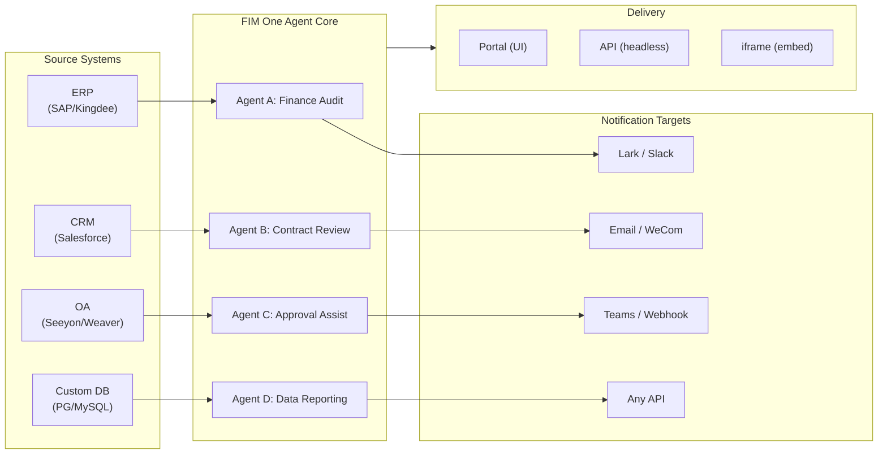

> Goal: Build an **all-in-one agent platform for Global × China enterprises** — delivered through three progressive modes: Standalone (portal assistant), Copilot (embedded in host system), Hub (central cross-system orchestration).
>
> Principles: **Provider-agnostic** (no vendor lock-in), **minimal-abstraction**, **protocol-first**, **connector-first** (integration is the core value).

## Produktvision

FIM One ist eine **All-in-One-Agent-Plattform**, die drei progressive Liefermodi unterstützt:

```
Standalone   → Your own AI assistant (Portal)
Copilot      → AI embedded in a host system (iframe / widget / embed)
Hub          → Central cross-system orchestration (Portal / API)
```

**Cross-System-Orchestrierung ist der Kernunterscheidungsfaktor.** Unternehmenskunden haben Legacy-Systeme — ERP, CRM, OA, Finance, HR — die über KI miteinander kommunizieren müssen:



**GTM-Pfad: Land and Expand**

| Schritt | Modus | Was passiert |
|------|------|-------------|
| Land | Copilot | In ein System einbetten, Mehrwert in ihrer Benutzeroberfläche nachweisen |
| Expand | Copilot → Hub | Auf weitere Systeme ausrollen; Hub-Modus aggregiert diese |

## Bekannte Probleme

Nachverfolgter Fehler, die in der Produktion reproduzierbar sind, aber noch nicht behoben wurden. Jeder Eintrag benennt das Symptom, den vermuteten Bereich und die Problemumgehung (falls vorhanden). Elemente werden in einen Versionsabschnitt verschoben, sobald eine Behebung geplant und terminiert ist.

- **Playground-Stopp-und-Wiederholung zeigt vorübergehende visuelle Artefakte, die ein Seitenaktualisierung immer behebt.** Drei gleichzeitige Render-Quellen — `activeConversation.messages` (DB-Snapshot), der SSE-`messages`-Stream und der optimistische `pendingQuery`-Platzhalter — werden nicht in einen einzelnen abgeleiteten Zustand zusammengefasst, daher kann die Benutzeroberfläche zwischen dem Klick auf „Wiederholung" und dem Eintreffen der gepaarten Assistentenantwort (a) kurzzeitig die gleiche Abfrage zweimal im Vor-Stream-Fenster rendern, (b) vorherige verwaiste Benutzerblasen aus dem Wiederholungsverlauf löschen, während `hasLiveMessages` wahr ist und bevor der Snapshot neu geladen wird, und (c) im engen Fenster zwischen dem SSE-„done"-Ereignis und der nächsten `selectConversation`-Aktualisierung flackern. **Daten gehen nie verloren** — jede Benutzernachricht (einschließlich abgebrochener Wiederholungen) wird in `conversation.messages` beibehalten, über `normalize_alternating_messages` in den nächsten LLM-Aufruf übertragen und nach der Aktualisierung über `HistoryTurn.orphanUserContents`, das in der `48ba08c6`-Render-Behebung eingeführt wurde, korrekt gerendert. Zum Kontext: Claudes eigene Web-Benutzeroberfläche weist eine analoge Fehlerklasse auf — das Stoppen mitten in einer Antwort und das sofortige Senden einer Folgefrage verzweigt die Folgefrage manchmal als Sibling-Edit-Zweig der ersten Abfrage, anstatt sie als neuen Turn anzuhängen — daher ist dies ein bekanntes schwieriges Problem in optimistischen-UI + SSE + persistiertem-Verlauf-Designs, kein FIM-One-spezifischer Fehler. Eine ordnungsgemäße Behebung erfordert das Zusammenfassen der drei Render-Quellen in einen einzelnen abgeleiteten Zustand; aufgeschoben bis zu einer umfassenderen Playground-Zustandsmaschinen-Umgestaltung.

## Backlog (Low Priority) {/* dev: dev/dag-evidence-fidelity.md */}

Aufgeschobene Härtung — nicht blockierend; nur aufgreifen, wenn das entsprechende Szenario auftritt.

- [ ] **DAG evidence gets its own truncation budget**, decoupled from `DAG_ANALYZER_TRUNCATION`, so source evidence isn't re-clipped by the summary budget before the analyzer/synthesis verify against it.
- [ ] **Structure-aware evidence truncation** (head+tail / keep lists & tables) so long enumerations survive the cap instead of silently losing their tail.
- [ ] **Port the source-fidelity guideline into the ReAct fallback synthesis prompt** so total/severity mislabels are caught in ReAct too, not only in DAG.

## Ausgelieferte Versionen

### v0.1 (2026-02-22) — MVP: ReAct + DAG Planner
- ReActAgent mit Tools (calculator, python_exec, web_search)
- DAG Planner (LLM generiert Abhängigkeitsgraphen)
- Portal UI mit Streaming + KaTeX

### v0.2 (2026-02-24) — Multi-Model + Memory
- Retry / rate limiting / usage tracking
- Native function calling (no JSON-only parsing)
- Multi-model support (fast + main LLM)
- Memory: WindowMemory, SummaryMemory
- FastAPI backend with SSE streaming

### v0.3 (2026-02-25) — Web Tools + MCP
- Web tools (web_search, web_fetch) via Jina/Tavily/Brave
- File operations tool
- MCP client (standard tool integration)
- Tool auto-discovery + categories
- DAG visualization with click-to-scroll
- Code exec in Docker (`--network=none`)

### v0.4 (2026-02-25) — Multi-Turn + Agents
- Multi-Turn-Konversationen (DbMemory)
- Tool-Schritt-Faltungs-UI
- HTTP-Request- und Shell-Exec-Tools
- Verwaltung von Agenten (erstellen, konfigurieren, veröffentlichen)
- JWT-Authentifizierung
- Ausführungsmodus pro Agent + Temperaturkontrolle

### v0.5 (2026-02-28) — Full RAG + Grounded Gen
- Vollständige RAG-Pipeline (Embedding + Vektorspeicher + FTS + RRF + Reranker)
- Grounded Generation (Zitationen, Konfidenzwerte)
- Wissensdatenbank-Dokumentverwaltung (CRUD, Suche, Wiederholung, Schemamigration)
- ContextGuard + angeheftete Nachrichten (Token-Budget-Manager)
- DbMemory-Persistierung + LLM Compact
- DAG Re-Planning (bis zu 3 Runden)

### v0.6 (2026-03-01) — Connector Platform
- **Connector CRUD**: create, read, update, delete
- **ConnectorToolAdapter**: converts Connector → BaseTool
- **Per-user credentials**: AES-GCM encryption
- **Confirmation gate**: write operation approval
- **Audit logging**: all tool calls recorded
- **Circuit breaker**: graceful degradation on failures
- **Utility tools**: email_send, json_transform, template_render, text_utils
- **Embedding options**: Jina, OpenAI, custom providers

### v0.7 (2026-03-06) — Admin Platform + Multi-Tenant
- **Admin Platform**: Benutzerverwaltung, Rollenwechsel, Passwort-Zurücksetzen, Konto aktivieren/deaktivieren
- **Nur-auf-Einladung-Registrierung**: drei Modi (offen/Einladung/deaktiviert) + Einladungscode CRUD
- **Speicherverwaltung**: Festplattennutzung pro Benutzer, Löschen, verwaiste Bereinigung
- **Gesprächsmoderation**: Admin-Liste/Löschen aller
- **Erzwungenes Logout pro Benutzer**: alle Token widerrufen
- **API-Health-Dashboard**: Systemstatistiken, Connector-Metriken
- **First-Run-Setup-Assistent**: geführte Admin-Kontoerstellung
- **Personal Center**: globale Anweisungen pro Benutzer, Spracheinstellung
- **JWT auth**: Token-basierte SSE-Authentifizierung, Gesprächseigentümerschaft
- **Global MCP servers**: von Admin bereitgestellt, in allen Sitzungen geladen
- **Rückwärtskompatibilität**: registration_enabled → registration_mode automatische Migration

### v0.7.x (2026-03-07 bis 2026-03-12) — Stabilität + Verfeinerungen
- Invite-Code-Verwaltung
- Pro-Benutzer-Kontingente (429-Durchsetzung)
- Strukturiertes Audit-Logging
- Filterung sensibler Wörter
- Admin-Anmeldungsverlauf
- Admin-Dateibrowser
- Erweiterte Admin-Ansichten (Felder model_name, tools, kb_ids)
- Docker-Compose-Bereitstellung (einzelnes Image, benannte Volumes)
- OAuth-Autoekennung von window.location
- Unterstützung für erweitertes Denken / Reasoning (`LLM_REASONING_EFFORT`, `LLM_REASONING_BUDGET_TOKENS`) für OpenAI o-Serie, Gemini 2.5+, Claude
- Admin pro Werkzeug aktivieren/deaktivieren (deaktivierte Werkzeuge zur Laufzeit aus Chat ausgeschlossen)
- MCP-Server-Verwaltung auf Connectors-Seite verschoben
- Duale Datenbankunterstützung: SQLite (Null-Konfiguration Standard) + PostgreSQL (Produktion); Docker Compose stellt PostgreSQL automatisch bereit
- Dokumentationsseite zur Modellkonfiguration mit Extended-Thinking-Setup pro Anbieter
- SSE-Protokoll v2: Echtzeit-Antwort-Streaming mit Feldern `delta_reasoning`, `usage` und aufgeteilten Events `done`/`suggestions`/`title`/`end`; SQLite-Pool-Größe 5 -> 20
- AI-Builder-Erweiterung: 7 neue Builder-Tools (GetSettings, TestConnection, ImportOpenAPI für Connectors; ListConnectors, AddConnector, RemoveConnector, SetModel für Agents), Flag `is_builder` auf Agents, automatische Builder-Prompt-Aktualisierung, SSRF-Schutz
- SSE-v2-Frontend: Streaming-Punkt-Puls-Cursor, DAG-Neuplanungs-Runden-Snapshots als einklappbare Karten, DAG-Layout entkoppelt von Schrittstatusangaben
- Konzeptdokumentationsseite für AI Builder mit Connector- und Agent-Builder-Leitfäden
- Organisationssystem: vollständige CRUD-Operationen mit rollenbasierter Mitgliedschaft (Besitzer/Admin/Mitglied), Admin-Verwaltungs-UI
- Dreistufige Ressourcensichtbarkeit (persönlich/Org/global) für Agents, Connectors, Knowledge Bases, MCP-Server
- Veröffentlichungs-/Unveröffentlichungs-API für alle Ressourcentypen; Besitzerdelegation für veröffentlichte Agents
- Admin-Sichtbarkeitendpunkt (ersetzt Clone-to-Global); einheitlicher `build_visibility_filter()`-Abfrage-Helfer
- Datenbank-Connectors (Phase 1-3): direkter SQL-Zugriff auf PG/MySQL/Oracle/SQL Server + chinesische Legacy-DBs; Schema-Introspection, KI-Annotation, schreibgeschützte Abfrageausführung, verschlüsselte Anmeldedaten, 3 Tools pro Connector (`list_tables`, `describe_table`, `query`)
- **Evaluation Center**: quantitatives Benchmarking der Agent-Qualität — Test-Dataset-CRUD (Prompt + erwartetes Verhalten + Assertions), Eval-Läufe (parallele Ausführung + LLM-Grader + pro-Fall Pass/Fail/Latenz/Token-Ergebnisse), Ergebnis-Viewer mit automatischem Polling; Migration `r8t0v2x4z567`
- Drei Modellrollen (General/Fast/Reasoning) mit isolierter Pro-Tier-Umgebungskonfiguration; Fast-Modell erbt nicht länger Hauptmodell-Einstellungen
- `StepOutput`-Dataclass ersetzt einfache String-Schrittergebnisse für strukturierte Daten und Artefakt-Übergabe
- Tool-Cache für DAG-Ausführung — identische Tool-Aufrufe pro Lauf gecacht mit asynchroner Lock-Stampede-Verhinderung (`DAG_TOOL_CACHE`)
- Pro-Schritt-LLM-Verifizierung mit 1 Wiederholung bei Fehler (`DAG_STEP_VERIFICATION`)
- Auto-Routing: schnelles LLM klassifiziert Abfragen als ReAct oder DAG; Endpunkt `/api/auto`; Frontend-3-Wege-Modusumschalter (`AUTO_ROUTING`)
- [x] ~~**Shadow-Market-Organisation + Ressourcen-Abos**~~: Integrierte Market-Org (Shadow, kein automatischer Beitritt) ersetzt Platform-Org; Ressourcen über Marketplace-Browsing erkannt und explizit abonniert (Pull-Modell); Market-API zum Abonnieren gemeinsamer Ressourcen; Veröffentlichung auf Market erfordert immer Überprüfung; Ressourcen-Abos-Tabelle; Org-basierte Ressourcenfreigabe ersetzt globale Sichtbarkeit
- [x] ~~**Agent-Autoekennung und Sub-Agent-Bindung**~~: Flag `discoverable` auf Agents; Whitelist `sub_agent_ids`; CallAgentTool zum Delegieren von Aufgaben an Spezial-Agents
- [x] ~~**MCP-Server-Anmeldedaten + Pro-Benutzer-Überschreibung**~~: Tabelle `mcp_server_credentials`; Endpunkt `PUT /api/mcp-servers/{id}/my-credentials`; Flag `allow_fallback` für Anmeldedaten-Fallback-Verhalten
- [x] ~~**Connector/KB-Umschalter**~~: `POST /api/connectors/{id}/toggle` und `POST /api/knowledge-bases/{id}/toggle` zum Aussetzen/Fortsetzen von Ressourcen
- [x] ~~**Eigenständige KB-Konversationen**~~: Feld `kb_ids` auf Konversationen für direkten KB-Chat ohne Agent-Bindung

### v0.8 (2026-03-20) — Connector Declarative Config + Progressive Disclosure
- [x] **Database connectors**: direkter SQL-Zugriff (PostgreSQL, MySQL, Oracle) *(in v0.7.x ausgeliefert — Phase 1-3)*
- [x] **RBAC**: Connector-Zugriffskontrolle pro Benutzer/Rolle *(in v0.7.x ausgeliefert — Org-System + dreistufige Sichtbarkeit)*
- [x] **Connector-Anmeldedaten-Verschlüsselung + Benutzer-Override**: `connector_credentials` Tabelle, Fernet-Verschlüsselung über `CREDENTIAL_ENCRYPTION_KEY`, `allow_fallback` Flag, `GET/PUT/DELETE /my-credentials` Endpunkte, Anmeldedaten-Auflösung pro Benutzer beim Laden von Chat-Tools
- [x] **Publish Review UI**: Org-weites Publish-Review-System — Review-Toggle pro Org, ReviewsSheet mit Genehmigung/Ablehnung-Workflow, Status-Badges auf Ressourcen-Karten, Review-Hinweis im Publish-Dialog, Erneute Einreichung für abgelehnte Ressourcen
- [x] **Connector Progressive Disclosure (Phase 1-2)**: einzelnes `ConnectorMetaTool` ersetzt Pro-Action-Tools; System-Prompt erhält nur leichte **Stubs** (Name + 1-Zeilen-Beschreibung, ~30 Token/Connector vs ~250 Token/Action); Agent ruft `discover(connector)` auf, um vollständiges Action-Schema bei Bedarf zu laden — Schema wird nur geladen, wenn das Modell einen Connector auswählt, wodurch das Prompt-Präfix für Caching stabil bleibt. Folgt dem verzögerten Tool-Loading-Muster, das in modernen Agent-Frameworks üblich ist. `execute` Subcommand; Feature-Flag für Rückwärtskompatibilität.
- [x] **Agent Skill System + Compact Instructions**: On-Demand-Skill-Laden für Agent-Anweisungen — `Skill` Modell (Name, Inhalt/SOP, optionale Scripts) an Agents angehängt; im System-Prompt nur nach Name referenziert (~10 Token/Skill); Agent ruft `read_skill(name)` auf, um vollständigen Inhalt bei Bedarf zu laden. Reduziert Pro-Konversations-Anweisungs-Token-Kosten um ~80%, während umfangreichere SOP-Bibliotheken ermöglicht werden. Gegenstück zu ConnectorMetaTool's Progressive Disclosure auf Anweisungsebene. Ermöglicht die "指令 + 工具 + 技能" Differenzierungsgeschichte. Fügt auch `compact_instructions` Feld zum Agent-Modell hinzu — Pro-Agent-Kompressionspriorität-Liste in `ContextGuard` beim Komprimieren eingespritzt (z.B. "Bestellungs-IDs und Beträge beibehalten, rohe API-Antworten verwerfen"), ersetzt das aktuelle statische generische Prompt. Folgt der Compact Instructions Konvention, die in modernen Agent-Frameworks weit verbreitet ist.
- [x] **Connector Import/Export**: Connector-Templates teilen
- [x] **Connector Fork**: Klonen + Anpassen bestehender Connectors
- [x] **Workflow Phase 2 Nodes**: Iterator, Loop, VariableAggregator, ParameterExtractor, ListOperation, Transform, DocumentExtractor, QuestionUnderstanding, HumanIntervention — 9 erweiterte Node-Typen mit vollständigem Frontend + Backend + 150 neue Tests (275 gesamt). Node-Wiederholung mit exponentiellem Backoff, sichere Ausdrucksevaluierung. Stats-Panel mit Erfolgsquoten-Balken. 12 integrierte Templates. Pane-Kontextmenü (Einfügen, Alles auswählen, Ansicht anpassen, Auto-Layout).
- [x] **Workflow Phase 3 Nodes: SubWorkflow + ENV** — 2 neue Node-Typen (25 Nodes gesamt), 14 neue Tests (306 gesamt), 14 integrierte Templates. SubWorkflow: vollständig DB-gestützter verschachtelter Workflow-Executor mit Ziel-Workflow-Auswahl, Variablen-Mapping und konfigurierbarem Tiefenlimit zur Vermeidung unendlicher Rekursion. ENV: liest verschlüsselte Umgebungsvariablen mit Schlüssel-Picker und Fallback-Defaults. Vollständiges Frontend (Node-Komponenten, Config-Panels, Palette-Einträge, Minimap-Farben). Pro-Node-Ausführungsstatistik-Panel (Erfolgsquoten, Dauern, Fehleranzahl sortiert nach schlechtesten zuerst). `getNodeStats` API-Client + `NodeStatEntry` Typ. Tastenkombinationen-Dialog (`?` Taste).
- [x] **Workflow Scheduled Triggers**: Pro-Workflow Cron-Konfiguration mit Zeitzone, Standard-Eingaben und Next-Run-At-Berechnung. Preset-Cron-Buttons, 30 Trigger-Tests.
- [x] **Workflow API Triggers**: Öffentliche Pro-Workflow API-Schlüssel (`wf_` Präfix) für externe Ausführung ohne Benutzer-Auth, mit Rate-Limiting. API-Schlüssel-Management-Dialog mit Generieren/Regenerieren/Widerrufen, Trigger-URL und cURL/JS-Beispiele.
- [x] **Workflow Batch Execution**: `POST /batch-run` mit bis zu 100 Input-Sets, konfigurierbare Parallelität (1-10), zusammenklappbare Pro-Item-Ergebnisse, JSON-Export. 14 Batch-Ausführungs-Tests.
- [x] **Workflow Execution Log Viewer**: Echtzeit-chronologischer SSE-Event-Stream im Run-Panel mit Zeitstempeln, farbcodierten Badges und Event-Typ-Filter-Toggles.
- [x] **Workflow Run Stats**: Backend Batch-Abruf von Run-Anzahl und Erfolgsquoten über GROUP BY Subquery; Frontend zeigt Stats auf Workflow-Karten mit farbcodierten Erfolgsquoten-Indikatoren.
- [x] **Workflow Scheduler Daemon**: Hintergrund-Async-Service, der alle 60s nach fälligen Cron-basierten Workflows abfragt. Croniter-Zeitzone-Unterstützung, Semaphore-Parallelität, `last_scheduled_at` Tracking, Webhook-Zustellung. 14 Tests.
- [x] **Workflow Import Conflict Resolver**: Erkennt ungelöste Agent/Connector/KB/MCP-Referenzen während des Imports. Batch-DB-Abfragen mit Sichtbarkeits-Filterung, Frontend-Toast-Warnungen. 17 Tests.
- [x] **Workflow Test-Node Execution**: Isolierte Single-Node-Tests mit Mock-Variablen, in Editor integriert (Config-Panel Test-Button + Kontextmenü). 23 Tests.
- [x] **Workflow Version Diff**: Nebeneinander-Blueprint-Vergleich mit Node/Edge-Änderungserkennung, farbcodierte Indikatoren (hinzugefügt/entfernt/geändert).
- [x] **Workflow Run Management**: Löschen einzelner Runs (`DELETE /runs/{run_id}`) und Löschen aller abgeschlossenen Runs (`DELETE /runs`), mit Frontend-Bestätigungsdialogen.
- [x] **Workflow Run Replay Overlay**: "View on Canvas" Button in Run-Verlauf zum Überlagern vergangener Ausführungsergebnisse auf der Canvas, zeigt Pro-Node-Status und Ausgabe ohne Neuausführung.
- [x] **Workflow Favorites/Pinning**: Star/Pin-Workflows oben in der Liste mit localStorage-Persistierung.
- [x] **Workflow Run History Export**: Exportieren Sie Run-Verlauf als JSON-Datei-Download mit vollständigen Run-Metadaten und Pro-Node-Ergebnissen.
- [x] **Admin Workflows Management**: Admin-Panel-Tab zum Verwalten aller Workflows über Benutzer — Liste, Toggle aktiv/inaktiv, Löschen mit Bestätigung. Batch-Endpunkte für Löschen, Toggle und Veröffentlichen mit Audit-Logging.
- [x] **Workflow Templates System**: `WorkflowTemplate` ORM-Modell mit Admin-CRUD, öffentliche Listing/Clone-API und 5 Seed-Templates, die beim ersten Start automatisch eingefügt werden.
- [x] **Workflow Inline Validation Badges**: Echtzeit Pro-Node `ValidationBadge` auf Canvas mit Fehler/Warnungs-Tooltips für sofortiges visuelles Feedback während der Bearbeitung.
- [x] **Workflow Execution Trace Viewer**: Zeitlinien-basierter Trace-Viewer Sheet mit Engine `trace_level` Parameter und Pro-Node-Variablen-Snapshots für Step-Through-Debugging.
- [x] **Workflow Rate Limiting and Timeout**: Pro-Benutzer `WorkflowRateLimiter` (Sliding Window 10 Runs/Min, 3 gleichzeitig) und Standard 10-Minuten globales Run-Timeout.
- [x] **Workflow Blueprint System**: Visueller Workflow-Editor zum Entwerfen und Ausführen mehrstufiger Automatisierungs-Blueprints — `Workflow` / `WorkflowRun` ORM-Modelle, vollständig CRUD + SSE-Ausführungs-API, Import/Export, Duplizieren, Blueprint-Validierungs-Endpunkt, `WorkflowEngine` mit topologischer Sortierung + Semaphore-basierter Parallelität + Bedingungsverzweigung und 12 Node-Typen (Start, End, LLM, ConditionBranch, QuestionClassifier, Agent, KnowledgeRetrieval, Connector, HTTPRequest, VariableAssign, TemplateTransform, CodeExecution), `VariableStore` mit `{{node_id.output}}` Interpolation und `env.*` Namespace, Fehlerstrategien Pro-Node (STOP_WORKFLOW / CONTINUE / FAIL_BRANCH) mit Pro-Node-Timeout und erweiterter Config-UI, React Flow v12 visueller Editor mit Drag-and-Drop-Palette + Node-Config-Panel + Variablen-Picker-Combobox + Add-Node-on-Edge + Auto-Layout (ELK.js) + Run-Verlauf Sheet, Dify-Style kompaktes Node-Design mit Ring-basiertem Run-Status-Styling und animierten Edge-Übergängen, 4 integrierte Starter-Templates (Simple LLM Chain, Conditional Router, Knowledge-Augmented QA, HTTP API Pipeline) mit Template-Picker-Dialog und `GET /templates` + `POST /from-template` API, Stats-Endpunkt, `?run=true` URL-Parameter Auto-Open, Subprocess-basierte Code-Ausführungs-Sicherheit, 105-Test-Suite (Templates, Eval-Namespace-Flattening, Blueprint-Validierungs-Warnungen, Node/Edge-Löschung, Import/Export/Duplizieren, Deadlock-Erkennung, Multi-Bedingungsverzweigung)
- [x] **Operation audit**: detailliertes Logging wer was tat — Admin Review Log Audit Tab hinzugefügt (Publish Review Trail Pro Org/Ressource)
- [x] **Semantic Schema Annotations**: Connector-Schema-Felder mit `semantic_tag`, `description` und `pii` Flags erweitern; Annotationen in LLM-Tool-Beschreibungen angezeigt, damit der Agent Feld-Absicht versteht, ohne von Spaltennamen zu raten

### v0.8.1 (2026-03-29) — Progressive Disclosure Maturity + ReAct Hardening
- Progressive Disclosure für DB-Konnektoren (`DatabaseMetaTool`), MCP-Server (`MCPServerMetaTool`) und bedarfsgesteuerte Tool-Auswahl (`request_tools` Meta-Tool)
- DAG-Qualitätsüberholung (5 Verbesserungen: Modell-Upgrade, automatische Skill-Erkennung, Zitierverifizierer, strukturierte Inhaltsbewahrung, domänengesteuerte Weiterleitung)
- Domänen-Modell-Eskalation in ReAct (spezialisierte Domänen eskalieren automatisch zum Reasoning-Modell)
- Pro-Modell Native Function Calling Toggle (`tool_choice_enabled`)
- ReAct-Zyklenerkennung (deterministische Verhinderung doppelter Tool-Aufrufe)
- ReAct-Abschluss-Checkliste (Vorüberprüfung vor Antwort, wenn Tools verwendet wurden)
- Resource Fork Phase 1 (MCP Server + Skill Fork Endpunkte mit Abstammungsverfolgung)
- Workflow-Verbindungs-Abhängigkeits-Automatisches-Abonnement (rekursive Abhängigkeitsauflösung von Unter-Workflows)
- Vorgefertigte Lösungsvorlagen (8 vertikale Lösungen beim ersten Registrieren auf dem Markt bereitgestellt)
- Verbesserungen bei Admin-Benachrichtigungen (zeitzonenbewusst, Master-Schalter, SMTP Reply-To)
- Pro-Turn Token-Budget Schaltkreisunterbrecher (`REACT_MAX_TURN_TOKENS`)
- Zentralisierte Tool-Kürzung, dynamische Systemaufforderungs-Budgetierung
- Dateianhang-Download, Behebung doppelter Nachrichtenübermittlung

### v0.8.2 (2026-04-10) — Agent Core Hardening + Vision Documents
- **Agent Core Phase 0** — Compact prompt upgraded to 9-section structured format; empty tool result protection (descriptive message instead of `(no output)`); anti-loop prompt + cycle detection threshold lowered to 2; domain classifier + pre-flight DB config resolution parallelized (400–1100 ms saved per request); SSE `end` event sent immediately after answer, with title/suggestions moved to background tasks
- **Agent Core Phase 1 (Context Anti-Bloat)** — `MicroCompact` rule-based old tool result cleanup (keep last 6); `REACT_TOOL_RESULT_BUDGET=40000` aggregate cap; reactive compact on context overflow (auto-compact to 50% budget and retry instead of crashing)
- **Agent Core Phase 2 (Speed)** — Keyword-based tool pre-selection (skips LLM call on obvious matches, 200–500 ms saved); `SharedHttpClient` LLM connection pooling; completion check skipped for answers >200 tokens; `FallbackLLM` wraps primary+fast with automatic failover on 429/503/529/connection errors
- **Intelligent Document Processing (Vision-Aware)** — Adaptive document handling: PDF pages rendered as images via PyMuPDF for vision-capable models (GPT-4o, Claude 3/4, Gemini), text-only fallback via pdfplumber. Per-model `supports_vision` flag. Modes via `DOCUMENT_PROCESSING_MODE`, `DOCUMENT_VISION_DPI`, `DOCUMENT_VISION_MAX_PAGES`. DOCX/PPTX embedded image extraction. Multi-turn vision persistence across conversation turns. Smart PDF processing (text-rich pages extract text + images; scanned pages render as full-page PNG). Pre-built sandbox image (`Dockerfile.sandbox`) with common data-science packages for `--network=none` code execution
- **Resource Fork completion** — Agent / Connector / Workflow fork endpoints added, completing the five-type lineage tracking (KB fork removed — inherently user-local)
- **File integrity guardrail** — System prompt rule prevents the agent from substituting unrelated file contents when a target file is unreadable; uploaded files now include `file_id` in message context for direct `read_uploaded_file` access

### v0.8.3 (2026-04-16) — Universal Document Conversion + Agent Core Phase 3
- **Universal Document Conversion (`convert_to_markdown` + OCR)** — Built-in Agent tool wrapping Microsoft MarkItDown; converts PDF, Word, Excel, PowerPoint, HTML, JSON, CSV, XML, ZIP, EPUB, Outlook .msg, images, audio, YouTube URLs to Markdown. `LiteLLMOpenAIShim` enables OCR via any vision-capable LLM (Claude, Gemini, Bedrock, Azure). Vision-aware RAG ingestion with zero-regression text-only fallback. `LLM_SUPPORTS_VISION` env var for opt-out
- **Agent Core Phase 3 (Runtime Invariant Hardening)** — Conversation recovery (dangling `tool_use` auto-repair); structured compact work card (`WorkCard` typed merge across compaction rounds); turn-level profiler (`REACT_TURN_PROFILE_ENABLED`); per-user rate limiting (`LLM_RATE_LIMIT_PER_USER`); empty-content assistant message with `tool_calls` no longer dropped

### v0.8.4 (2026-04-17) — Prompt Cache + Reasoning Correctness
- **System prompt section registry with cache breakpoints** — Memoized `PromptRegistry` splits system prompts into stable prefix + dynamic suffix; cache-capable providers (Claude, Bedrock Anthropic, Vertex Claude) receive `cache_control: {"type": "ephemeral"}` on the prefix for ~60-80% per-turn input token savings. Non-cache providers get a single concatenated message (zero behavior change)
- **Prompt cache observability** — `cache_read_input_tokens` and `cache_creation_input_tokens` tracked through `UsageSummary` → `TurnProfiler` → `done_payload.cache` field. Structured `turn_cache` log line per turn. Doubles as relay cache-honesty probe
- **Conversation recovery MVP** — Synthetic `tool_result` rows persist after interrupted turns; `POST /chat/resume` replays cached SSE events from a monotonic cursor; frontend `useSseResume` hook auto-reconnects with exponential backoff (300ms → 1s → 3s, max 3 attempts) and "Reconnecting…" indicator
- **Thinking-block persistence with signature** — `reasoning_content` + Anthropic `signature` persisted in `metadata_["thinking"]` and replayed on subsequent turns; fixes HTTP 400 signature mismatch on Claude 4 multi-turn conversations
- **Provider-aware reasoning replay policy** — Centralized `reasoning_replay_policy()` in `core/prompt/reasoning.py` gates serialization per provider family: Claude replays thinking blocks with signature; DeepSeek-R1/Qwen-QwQ/Gemini-thinking/o-series drop `reasoning_content` on outbound (previously leaked, breaking provider KV caches and violating API docs)

### v0.8.5 (2026-04-23) — Channel Integration + Hook System + Contributor i18n
- **Feishu Channel (Phase 1 subset)** — Org-scoped `Channel` resource with Fernet-encrypted credentials; `FeishuChannel` supports interactive card send + callback (signature verification + URL challenge); Settings → Channels management UI (list, create/edit with dirty-state protection, details with copyable callback URL, test-send); CRUD API (`/api/channels`) and event callback endpoint (`/api/channels/{id}/callback`). Shipped early for 2026-04-24 roadshow
- **Agent Hook System (live in ReAct + DAG runtime)** — `PreToolUseHook` / `PostToolUseHook` abstraction in `src/fim_one/core/hooks/`; agents declaring `hooks.class_hooks` in `model_config_json` have hooks instantiated and registered per chat session. First consumer `FeishuGateHook` posts an Approve/Reject card to the linked Feishu group when an agent calls a `requires_confirmation=True` tool, blocks execution, and resumes or aborts based on verdict
- **Configurable confirmation gate (inline OR channel)** — Every agent gets an Approval section with three routing modes (Auto / Inline only / Channel only), approver-scope selector (initiator / owner / anyone in org), per-tool override, and explicit approval-channel picker. Auto mode gracefully falls back to an inline approval card when no channel is linked. `POST /api/confirmations/{id}/respond` shares a single decision-recording path with the Feishu webhook
- **Per-agent task completion notifications** — Long-running ReAct or DAG agents can push a summary card to the org's channel when a task finishes. First consumer of the generic outbound notification pattern
- **Hook Approval Playground** — Channels details sheet has a "Test Approval Flow" action that exercises the full production path (genuine `ConfirmationRequest` row, real Feishu callback, status transitions) — same code path a production hook uses
- **Contributor-friendly i18n CI fallback** — `.github/workflows/i18n-sync.yml` translates EN → ZH/JA/KO/DE/FR on master after PR merge and auto-commits with `[skip ci]`; contributors no longer need `LLM_API_KEY` locally. Pre-commit locale-edit guard refuses manual edits to generated locale files (`ALLOW_LOCALE_EDIT=1` override for legitimate translation fixes). End-to-end verified via smoke-test push
- **Exa integration docs** — Dedicated Integrations section with a first-class Exa page covering the full Exa search surface (neural / fast / deep-reasoning / instant), filtering, content retrieval, and three tuned presets
- **Xinchuang (信创) database support** — Database Connector now lists KingbaseES (人大金仓), HighGo (瀚高), and DM8 (达梦) alongside PostgreSQL/MySQL. PG-compatible drivers reuse `asyncpg`; DM8 uses `dmPython`. `scripts/test_xinchuang_dbs.py` verifies live connectivity from the CLI
- **Channels + Hook System architecture docs** — `docs/architecture/hook-system.mdx` explains the three hook points and walks through FeishuGateHook end-to-end; existing architecture pages cross-link; README lists Messaging Channels as a first-class capability
- **Hardening** — Duplicate Feishu callback clicks produce a replacement card instead of double-deciding; concurrent callback clicks resolved via conditional `UPDATE ... WHERE status='pending'` rowcount check; pending approvals auto-expire after `CHANNEL_CONFIRMATION_TTL_MINUTES` (default 24h) via background sweeper; Settings → Channels respects org role (members see read-only UI); parallel tool-call aggregator handles providers that reuse `index=0` for every delta; session-expiry redirect preserves query string

### v0.8.6 (2026-05-08) — Stripe Billing + Refinements
- [x] Stripe billing MVP — Free + Pro tiers; Checkout, Customer Portal, webhook lifecycle; `/settings?tab=billing`; admin plan/subscription CRUD; quota enforcement respects each user's plan
- [x] Admin-controlled billing feature flag — `system_settings.billing_enabled` gates the entire Stripe pipeline so private deployments without Stripe credentials never surface a non-functional payment UX
- [x] Per-user unlimited quota — empty inherits global default, `0` grants unlimited; previously both collapsed into the same state
- [x] Translation glossary as single source of truth — `scripts/translation-glossary.md` consolidates per-locale rules; pre-commit unconditionally refuses manual edits to generated locale files
- [x] License + governing law migrated to FIM Labs Pte. Ltd. (Singapore); SIAC arbitration in English; new top-level `NOTICE` file
- [x] Playground follow-up suggestions restored, opt-in per agent
- [x] Stability fixes — strict-alternation provider history, parallel tool-call boundary detection, unbound-agent confirmation flow, channel role gating, retry-duplicate suppression, post-rejection no-paraphrase

### v0.8.7 (2026-06-10) — Security Hardening + Guardrails v0 + Billing Correctness
- [x] JWT token-type confinement — closes a 2FA bypass where any same-signed token (temp/refresh/ticket) could authenticate API and SSE endpoints
- [x] OAuth hardening — email auto-link requires a provider-verified email (account-takeover fix); OAuth refresh tokens stored hashed so session rotation works
- [x] Content guardrails v0 — input/output tripwire layer (`core/agent/guardrail`); ships jailbreak detector + max-length output guardrail, env-var configured
- [x] `file_ops.apply_patch` — V4A diff patches with fuzzy whitespace matching, complements `find_replace`
- [x] Billing-cycle correctness — quota resets on the subscription anniversary (not calendar month); renewals advance the period via authoritative Stripe lookup; usage display aligned to the enforcement window
- [x] Reliability fixes — pseudo-protocol tool-call leak stripped from answers; tunable HTTP keep-alive ends `APIConnectionError` bursts; API-key usage stats persist on read-only requests
- [x] Billing tab visual overhaul — full-width, consistent with other Settings tabs

### v0.8.8 (2026-06-22) — SSRF Hardening + Reliability & Reasoning Fixes
- [x] SSRF hardening — blocklist unwraps IPv4-mapped IPv6 (`::ffff:` instance-metadata bypass); MCP SSE/Streamable-HTTP server URLs SSRF-validated on create + connect
- [x] LLM reliability — shared HTTP pool self-heals after a LiteLLM client-cache eviction closes it; chat sends stream instantly (history folded in background, no full reload)
- [x] Anthropic adaptive-thinking protocol for Opus 4.6+/Sonnet 4.6/Fable 5 — extended thinking works where the old fixed-budget param 400s on 4.7/4.8; warns on OpenAI-proxy misroute
- [x] Reasoning detail preserved end-to-end — genuine final answer streamed verbatim; survives compaction, context rebuilds, and sub-agent steps (no lossy re-synthesis)
- [x] PreToolUse enforcement hooks fail closed on error — a crashing approval gate no longer silently allows the call; non-enforcement hooks keep fail-open via `fail_open`
- [x] Force-logout timestamp comparison normalized to UTC by conversion + Docker Compose `POSTGRES_*` credential override (no shipped `fim:fim` default)

### v0.8.9 (2026-07-08) — Module Slim-down + Sharing Convergence + Approval Hardening
- [x] Skills & Workflows soft-shelved behind admin module flags (default off) — core-only boot; nothing deleted, reversible from Admin → Settings → Modules
- [x] Sharing converged — KB sharing removed (KBs reach others only via shared Agents), DB connectors unshareable + raw SQL owner-only, workflow builder trimmed to 9 reference-only nodes
- [x] Feishu approval hardening — card clicks enforce approver identity, callback signatures fail closed + encrypted envelopes decrypted, approvals never routed to an unintended chat
- [x] Use-time access re-checks — shared MCP servers and bound KBs re-verified per run; leaving an org revokes subscriptions and saved credentials immediately
- [x] Agent loop hardening — plan board, background tools, incremental DAG replan + checkpoint resume, compaction keeps tool pairing, truncation continuation, 529/504 retry
- [x] `run_workflow` agent tool + workflow correctness — Agent node runs the full agent, confirmation gates fail closed, connector calls access-checked and audit-logged
- [x] Account deletion unified — admin and self-serve funnel through one purge routine covering every record and on-disk file; org owners must transfer ownership first
- [x] Owner-credential fallback now opt-in (breaking) — connectors/MCP servers default `allow_fallback` off, existing rows flipped; no-fallback resources you lack credentials for are hidden from the toolset
- [x] Webhook/cron workflow runs metered to the owner's token quota — the unmetered free-LLM trigger path is closed
- [x] Resource binding unified on visibility — subscribed connectors/KBs/MCP servers bindable to agents; workflow connector steps enforce the runner's access
- [x] Conversation workspace wired into chat — `workspace://` offload of oversized tool results, budget-truncation rescue, pre-compaction transcript snapshots

## Geplante Versionen

Neu geplant 2026-07-08: FIM One ist eine Agent-Runtime — ein Kernel (ReAct-Engine, Anmeldedaten, Approval Gate, Audit, Multi-Tenant-Orgs) hinter mehreren Delivery-Oberflächen: Web UI, API, JS Embed, MCP Output. Jede Oberfläche nutzt dieselbe Assembly-Schicht für Auth, Anmeldedaten, Approval und Metering: mehr Frontends, nie mehr Logik. Die kurzfristige Richtung ist Konvergenz auf den Data-Q&A-Slice (ChatBI), Verkauf von Szenarien statt einer Plattform. {/* dev: dev/replan-2026-07.md */}

### v0.9 — Connector Fences + Scenario Onboarding

**Ziel**: Die nach der Reduktion zusammengestellten Assets bilden ein vollständiges Daten-Q&A-Produkt — Read-only-DB-Konnektoren + Fences + Approval Gate + IM-Eintrag. Tier-1-Fences wandeln Sicherheitsschulden in Produktfunktionen um.

#### DB Connector Fences — Tier 1, drei PRs {/* dev: dev/connector-rbac/00-overview.md */}

- [ ] PII-Spaltenredaktion (`ConnectorScopeGuard` PreToolUse Hook)
- [ ] Sichtbarkeit des Schemas — Tabellen-/Spalten-Allow-Deny + Verb-Blocking (Read-Only-Durchsetzung)
- [ ] Fence-Auditierbarkeit — `caller_user_id`, `effective_credential_source`, `scope_rules_applied` in `ConnectorCallLog`
- [ ] Pro-Hook-Konfigurationsweiterleitung (`{"name", "config"}` Schema) — der Träger für ScopeGuard-Regeln {/* dev: dev/hook-system.md */}
- [x] Genehmigungsgates bleiben über Delegation erhalten — `call_agent` und Workflow-`AGENT`-Knoten führen die eigenen Hooks des Agenten aus, anstatt keine auszuführen

#### Szenario-Onboarding

- [ ] Der erste Start beginnt mit einer Szenariovorlage (solution_seeds) statt einer leeren Workbench
- [ ] Die Docs-Landingpage führt mit drei vertikalen Szenariogeschichten statt einer Modulreferenz an
- [ ] Eine Szenariovorlage pro abgeschlossenem Engagement destilliert — der Wettbewerbsvorteil liegt in Szenario-Assets × Liefergeschwindigkeit

### v0.10 — Two Mouths: JS Embed + IM Inbound {/* dev: dev/im-channels.md */}

**Ziel**: Die zwei verkaufbarsten Lieferflächen, beide auf demselben Kernel und der gleichen Assembly-Schicht.

- [ ] JS bubble / iframe embed — ein Snippet in ein Host-System; anonyme Besucher-Identität + Abrechnungszuordnung vor dem Build entschieden
- [ ] Feishu inbound @mention — Agenten leben in der Gruppe: Daten abfragen, Datei-Genehmigungen, Verfolgungsflows
- [ ] Outbound-Muster: Fehlerwarnungen, Budgetwarnungen, geplante Digests, Eskalation, Audit-Quittungen
- [ ] WeCom / DingTalk channels nach Feishu

### Parked — signal-gated

Do not start these without their trigger (see the replan §3): the MCP gateway waits for ≥2 unsolicited "mount your tools in my agent" asks; channelization waits for an implementor asking about licensing; IdP/OrgSync waits for customer pull; the rest wait for a delivered engagement that needs them.

- [ ] MCP gateway output — reverse-expose connector discover/execute as MCP tools for downstream agents
- [ ] Channelization / white-label enablement — commercial-license path already in place
- [ ] Identity Provider module + Channel slim-down — Feishu SSO, org graph sync {/* dev: dev/connector-rbac/07-identity-providers.md */}
- [ ] Connector authorization Tier 2 (require per-user credentials, key-binding health) + Tier 3 (login-ticket exchange) {/* dev: dev/connector-rbac/00-overview.md */}
- [ ] Public API Phase 2 — per-key rate limits/quotas, versioning, SDKs, developer portal {/* dev: dev/public-api-phase2.md */}
- [ ] Observability — Agent Trace Layer (Trace/Span model, timeline viewer, OTel export) + metrics dashboard {/* dev: dev/agent-trace-layer.md */}
- [ ] Agent Workspace remainder — handoff notes, workspace file browser UI, cross-session conversation recall {/* dev: dev/agent-workspace.md */}
- [ ] Guardrails v1 — off-topic filter, PII redactor output guardrail, per-agent guardrail config UI
- [ ] Hook System extras — built-in hooks, `SessionStart` + user YAML hooks {/* dev: dev/hook-system.md */}
- [ ] Connector platform depth — Progressive Disclosure Phase 3-4, YAML/JSON connector config, DB connectors Phase 4 (Oracle / SQL Server / GBase), MCP connection pooling
- [ ] Prompt cache follow-ups — Gemini context cache adapter, per-agent `cache_ttl` {/* dev: dev/prompt-cache-followups.md */}
- [ ] Hot mid-stream DAG resume — SSE reconnect re-attaches to a running turn (cold retry-resume already shipped) {/* dev: dev/incremental-dag.md */}
- [ ] Ecosystem — scheduled/event-triggered agents, workflow trigger-identity observability, per-workflow `credential_policy`, DB Schema Advanced Builder, sandbox hardening v2

### Aus dem Pre-Replan v0.9 Plan ausgeliefert

- [x] ~~Auth & security: JWT token-type confinement + OAuth fixes (v0.8.7); PG tz-aware timestamps (v0.8.6); force-logout UTC + `POSTGRES_*` override + SSRF IPv6-mapped fix (v0.8.8); owner-fallback opt-in + visibility-unified binding + webhook/cron metering (v0.8.9)~~
- [x] ~~Provider compat: Anthropic adaptive thinking + shared LLM pool self-heal (v0.8.8)~~
- [x] ~~Content guardrails v0: tripwire layer + jailbreak detector (v0.8.7)~~ {/* dev: dev/archive/openai-agents-insights.md */}
- [x] ~~Hook system: skeleton + FeishuGateHook + Approval Playground + ReAct/DAG runtime (v0.8.5); PreToolUse enforcement fail-closed (v0.8.8)~~
- [x] ~~Feishu channel Phase 1 + task completion notification (v0.8.5)~~
- [x] ~~`run_workflow` agent tool (v0.8.9); reasoning detail preserved end-to-end (v0.8.8); workspace tool-output offloading wired into chat (v0.8.9)~~
- [x] ~~Agent loop hardening: plan board, LLM-call resilience, background tools, incremental DAG replan + checkpoint resume, compaction tool-pairing (v0.8.9)~~ {/* dev: dev/incremental-dag.md */}

- [x] ~~Circuit breaker, Workflow run retention cleanup, Workflow version diff summaries~~ *(v0.8 / v0.8.1)*
- [x] ~~DAG quality overhaul, Domain model escalation, Per-model NFC toggle~~ *(v0.8.1)*
- [x] ~~DatabaseMetaTool, MCPServerMetaTool, On-demand `request_tools`~~ *(v0.8.1)*
- [x] ~~Workflow Connection Dep Auto-Subscribe, Workflow real executors~~ *(v0.8.1)*
- [x] ~~ReAct Cycle Detection, Completion Checklist~~ *(v0.8.1)*
- [x] ~~Prebuilt Solution Templates (8 vertical bundles), Resource Fork (MCP/Skill/Agent/Connector/Workflow)~~ *(v0.8.1)*
- [x] ~~Vision document processing (PDF / DOCX / PPTX), MarkItDown OCR~~ *(v0.8.2 / v0.8.3)*
- [x] ~~Smart File Content Injection + `read_uploaded_file`~~ *(v0.8)*
- [x] ~~Agent Core Phase 3: Conversation Recovery MVP, Compact Work Card, Turn Profiler, Per-user Rate Limiting~~ *(v0.8.3)*
- [x] ~~Conversation resume MVP, System prompt registry + cache, Thinking-block persistence, Reasoning replay policy, Cache observability~~ *(v0.8.4)*

### v1.0 — Hot-Plug + Embeddable

**Ziel**: Connector-Hinzufügung ohne Neustart, Package-Ökosystem und eingebettete Bereitstellung.

- [ ] **Connector Progressive Disclosure (Phase 5)**: **Semantic-Guided Tool Selection** (Entity-Extraktion aus Abfrage → Ontology Registry-Lookup → Connector-Set-Reduktion; 90%+ Token-Reduktion für 50+ Connector-Bereitstellungen); Scale-Modus für Batch-/ETL-Connectors; CLI-ähnliche universelle `connector <name> <action> <params>`-Schnittstelle
- [ ] **Cross-Connector Entity Alignment (Ontology Registry)** — *herabgestuft 2026-04-21: bedarfsgerechte benutzerdefinierte Bereitstellung, keine Kernfunktion*: Definieren Sie gemeinsame Entity-Typen (Customer, Order, Asset) mit Feld-Mappings über Connectors hinweg; DAGPlanner löst Cross-System-JOIN-Keys automatisch auf; ermöglicht Cross-Connector-Abfragen (z. B. „Kunden in Salesforce, die in Shopify bestellt haben") ohne hartcodierte Feldnamen
- [ ] **Hot-plug Connectors**: OpenAPI-Spezifikation hochladen, KI generiert Konfiguration, live in 5 Minuten (kein Neustart)
- [x] ~~**Marketplace Redesign Phase 1 — Solutions + Components**~~: Zwei-Ebenen-Marktmodell (Solutions: Agent/Skill/Workflow; Components: Connector/MCP Server); Scope-Selector (Global Market / org); einheitliches Abonnementmodell (org auto-appear entfernt); KB aus Market-Scope entfernt; Datenmigration füllt Abonnements für bestehende Org-Mitglieder auf
- [ ] **Market Package System**: Verteilbare Ressourcen-Bundles für den Marketplace — ersetzt Pro-Typ-„Marketplace" durch eine einheitliche Packaging-Schicht. `fim-package.yaml`-Manifest deklariert: Metadaten (Name, Version, Beschreibung, Autor, Lizenz, Tags, `min_fim_version`), Entry Point (primärer Skill oder Agent), Ressourcenliste (Agents, Skills, Connectors, KBs, MCP-Server, Workflows) mit Konfigurationsreferenzen, Inter-Package-Abhängigkeiten (Semver-Bereiche), erforderliche Anmeldedaten (zugeordnet zu Connector-Refs für Installationszeit-Erfassung) und benutzerkonfigurierbare Variablen mit Standardwerten. **Zwei Konsummodi**: (1) **install** — Batch-Erstellung aller Ressourcen + automatische Verdrahtung interner Referenzen über ID-Substitution; Installation mit Quelle verknüpft für Versionsaktualisierungsbenachrichtigungen; `POST /api/market/packages/{id}/install`; (2) **fork** — Klonen als benutzergesteuerte bearbeitbare Kopien ohne Update-Link (dies ist der Template-Modus); `POST /api/market/packages/{id}/fork`. Zusätzliche Endpunkte: Veröffentlichung (`POST /api/market/packages` mit Review-Workflow), Deinstallation (`DELETE /packages/{id}/uninstall` mit Abhängigkeitsprüfung + Bestätigung geänderter Ressourcen), Versionsverlauf (`GET /packages/{id}/versions`), Upgrade (`POST /packages/{id}/upgrade` mit Pro-Ressourcen-Diff-Vorschau). Abhängigkeitsresolver für verschachtelte Package-Anforderungen mit Konflikt-Erkennung. `PackageInstallation`-Tabelle verfolgt installierte Packages pro Benutzer mit Ressourcen-ID-Mapping für Deinstallation/Upgrade. **Koexistiert mit individueller Ressourcenveröffentlichung** — Package ist eine Kompositionsschicht, kein Ersatz; ein einzelner Connector ist immer noch eigenständig veröffentlichbar. Beispiel-Abhängigkeitsbaum: `Package: contract-review` → `Skill: contract-review` (Entry Point) → `Agent: contract-analyst` + `Agent: risk-scorer` → `KB: legal-clauses` + `Connector: docusign-api` + `MCP: pdf-extractor` + `Workflow: contract-approval-flow`
- [ ] **Creator Program**: Marketplace-Monetarisierungsschicht — Creator-Profile mit Portfolio-Seiten, Pro-Package-Analysen (Installationen, Forks, aktive Benutzer, Bewertungen/Rezensionen), Affiliate-Provisionsverfolg wenn Packages neue Abonnements fördern. Bezahlte Package-Tier mit Preisgestaltung, Kaufablauf und Genehmigungsworkflow. Creator-Dashboard mit Installationstrends, Umsatzberichte und Benutzer-Feedback. Öffentliche Creator-API für programmgesteuerte Package-Veröffentlichung (CI/CD für Package-Autoren). Community-Funktionen: Package-Kommentare, Q&A, Changelogs pro Version
- [ ] **Embeddable Widget**: `<script src="fim-one.js">` in Host-Seite eingefügt
- [ ] **Page Context Injection**: Widget liest Host-Seiten-Kontext (aktuelle ID, URL, DOM-Selektoren)
- [ ] **Advanced Triggers**: Webhook-Inbound-Events; erweiterte Scheduled-Job-Funktionen (Multi-Zeitzone, Kalender-bewusst)
- [ ] **Batch-Ausführung**: Verarbeitung von 1000+ Elementen über DAG
- [ ] **Enterprise-Sicherheit**: IP-Whitelisting, Verschlüsselung im Ruhezustand, SSO
- [ ] **KB Advanced Editor**: Builder-Modus-Agent für Power-User, die große Knowledge Bases verwalten — Bulk-URL-Aufnahme, Duplikat-Erkennung, Gap-Analyse, Document-Lifecycle-Management; erweitert bestehenden KB-KI-Chat mit ReAct-Tool-Loop
- [ ] **Stripe Billing (v1 MVP — Pro Subscription)**: Free + Pro Zwei-Ebenen-Abonnement mit monatlichem Token-Kontingent. Stripe Checkout (gehostet) + Customer Portal (Self-Service) + Webhook-gesteuerte Lebenszyklen (`checkout.session.completed` / `customer.subscription.updated|deleted` / `invoice.payment_succeeded|failed`). Soft-Cap bei Kontingent-Erschöpfung (HTTP 402 + Upgrade-Aufforderung) — keine Übergebühren in v1. Nur Pro-Benutzer-Abrechnung; Org/Team-Abonnements auf v3 verschoben. Voraussetzungen:
  - [x] ~~**Datenmodell + SDK-Grundlagen** (P1) — `billing_plans` / `subscriptions` / `stripe_webhook_events`-Tabellen, ORM-Modelle, Stripe-SDK-Singleton, Free + Pro-Seeds~~ *(ausgeliefert in v0.8.6)*
  - [x] ~~**Backend-API + Webhook-Handler** (P2) — `/api/billing/*` + `/api/webhooks/stripe` mit Signaturverifizierung + Idempotenz; Plan-bewusstes Kontingent; stündliche Lebenszyklen-Sweep~~ *(ausgeliefert in v0.8.6)*
  - [x] ~~**Frontend-Abrechnung-Tab + 402-Upgrade-Dialog** (P3) — `/settings?tab=billing` Kontingent-Anzeige, Upgrade-CTA, `past_due`-Banner, Mid-Stream-402-Dialog~~ *(ausgeliefert in v0.8.6)*
  - [x] ~~**Admin-Plan-Verwaltung** (P4) — `admin/billing/{plans,subscriptions}` CRUD~~ *(ausgeliefert in v0.8.6)*
  - [x] ~~**Admin-gesteuerte Abrechnung-Feature-Flag** (P5) — `system_settings.billing_enabled` Gates die Stripe-Pipeline; Idempotente Aktivierung Seeds Free+Pro, setzt Standard-Plan-Pointer, Backfills-Benutzer; Toggle aus/an ist reiner Flag-Flip nach Aktivierung~~ *(ausgeliefert in v0.8.6)*
  - [ ] **Reconciliation + E2E + Go-Live** (P6) — nächtliches `subscriptions` ↔ `stripe.Subscription.list()` Reconcile-Skript für Missed-Webhook-Recovery; Full-Stack Happy-Path / Cancel-Mid-Period / Past-Due Regressions-Tests; Wechsel von Test-Modus `stripe_price_id` zu Live `price_id`; Smoke-Test auf Staging mit echter Karte.

- [ ] **Team Plan (Stripe Seats)** — Pro-Seat-Preisgestaltung über `stripe.Subscription.quantity`, integriert mit Organization-Mitgliedschaft. Ermöglicht Unternehmen, einen Team-weiten Plan mit N Seats zu abonnieren; Kontingent und Feature-Flags werden durch die Seat-Gruppe statt durch den einzelnen Benutzer aufgelöst. Baut auf dem v1.0 Stripe MVP und dem bestehenden Organization-Modell auf.
- [ ] **Group-Level Token-Kontingent für Nicht-Billing-Bereitstellungen** — Enterprise/Private-Bereitstellungen ohne Stripe konfigurieren Organization-Level-Token-Budgets. Kontingent-Kette erweitert zu `override > group > plan > default`; Group-Auflösung verwendet `max(user_quota, group_quota)` damit einzelne VIPs nicht durch die Team-Cap eingeschränkt werden. Landet neben dem Team Plan, damit die gleichen Primitiven sowohl abgerechnete als auch Self-Hosted-Topologien bedienen.

**Auswirkung**: Unternehmen stellen FIM One von Null bis Multi-System-Orchestrierung in Tagen bereit. Package-System schafft ein Creator-Ökosystem — Solution-Autoren veröffentlichen zusammengesetzte Bundles (Skill + Agents + Connectors + KBs + Workflows), Unternehmen installieren mit einem Klick, Creator verdienen durch Adoption. Install/Fork-Dualität deckt sowohl „As-Is verwenden" als auch „Aus Template anpassen" Anwendungsfälle in einem einzigen Mechanismus ab.

## Eingefrorene Funktionen (Ausgeliefert, nur Wartung)

Gemäß der [Orthogonality Strategy](/strategy/orthogonality-strategy) sind diese Funktionen ausgeliefert und funktionieren, erhalten aber keine neuen Funktionen (nur Fehlerbehebungen):

| Funktion | Version | Grund für Einfrieren |
|---------|---------|-----------|
| ReAct Agent | v0.1, v0.9 | Modelle haben jetzt natives Tool Calling. Mid-Loop Self-Reflection (v0.9) verhindert Goal Drift in langen Ketten. Tool Observation Synthesis Qualität verbessert (8K Zeichen, konfigurierbar über `REACT_TOOL_OBS_TRUNCATION`) |
| DAG Planning / Re-Planning | v0.1, v0.5, v0.7.5 | Modell-Reasoning-Fähigkeiten verbessern sich; Dekomposition wird Single-Shot. Per-Step Verification in v0.7.5 ausgeliefert (`DAG_STEP_VERIFICATION`). Gehärtet: Cascade Failure Propagation, Verifier Status Fix, Planner Tool Descriptions, vollständige Replan History, Whitelist-basierter Tool Cache. 14 Engine Constants als ENV Vars verfügbar — keine weiteren Planning Primitives geplant |
| Memory (Window, Summary, Compact) | v0.2, v0.5 | Context Windows wachsen (200K+); weniger Bedarf für externes Memory Management |
| RAG Pipeline | v0.5 | Provider bauen Retrieval nativ ein (OpenAI file_search, Gemini Search Grounding) |
| Grounded Generation | v0.5 | Modelle verbessern sich bei Citations; 5-Stage Pipeline bringt abnehmenden Nutzen |
| ContextGuard / Pinned Messages | v0.5 | Wird wie vorhanden ausgeliefert; keine neuen Funktionen |

## Überlegung (Auf unbestimmte Zeit aufgeschoben)

Gemäß der Orthogonalitätsstrategie würden diese einen hohen Aufwand erfordern und einem Absorptionsrisiko ausgesetzt sein:

| Feature | Grund für Aufschub |
|---------|------------|
| Multi-Agent-Orchestrierung (tiefe Hierarchien) | Anbieter bauen nativ (OpenAI Swarm, Google A2A und ähnliche Multi-Agent-Angebote). FIM One's CallAgentTool deckt den Ein-Ebenen-Delegationsfall ab; ereignisgesteuerte Hintergrund-Agenten werden durch Scheduled Jobs in v0.9 abgedeckt |
| Agent Self-modifying Skills (Procedural Memory) | Agenten aktualisieren ihre eigene `skill.md` während der Ausführung — hohe Komplexität, Sicherheits-/Audit-Oberfläche. Hängt davon ab, dass das Agent Skill System (v0.8) zuerst ausgeliefert wird. Neu bewerten, wenn Unternehmenskunden explizit selbstverbessernde Agenten anfordern |
| ~~Agent Workspace (Tool Output File Offloading)~~ | Befördert zu v0.9. Der Wert liegt in **selektivem Lesen**, nicht in Kontextkapazität — frameworkübergreifende Validierung bestätigt. Ursprüngliche Aufschublogik („200K+ Fenster reduzieren Dringlichkeit") war falsch. |
| Cross-Session Long-Term Memory | Kontextfenster wachsen schnell (200K–2M); Anbieter fügen integriertes Memory hinzu (OpenAI memory, Gemini context caching); hohe Implementierungskosten vs. sinkender Differenzierungswert. Neu bewerten, wenn Unternehmenskunden es explizit anfordern |
| Memory Lifecycle (TTL, Kontingente) | Hängt von Cross-Session Memory ab; zusammen aufgeschoben |
| Active Context Compression Tool (agentgesteuert) | Explizit eingefroren mit ContextGuard (v0.5). Kontextfenster bei 200K+ reduzieren den Wert. Wird nicht erneut überprüft, es sei denn, Kontextkosten werden zu einer großen Unternehmensbeschwerde |
| Browser-Automatisierung / Computer Use | Hohe Wartungskosten (DOM-Änderungen, Anti-Bot, Sandboxing). Industrie konvergiert zu Computer Use Mode (Anthropic, OpenAI Operator, Google Mariner) und MCP-Browser-Tools (Puppeteer/Playwright MCP). Über MCP-Integration nutzen, nicht selbst bauen. Neu bewerten, wenn stabiler Computer Use MCP Standard entsteht |
| Web Push Notifications | Browser-natives Push über Service Worker + VAPID. Überlappt mit IM Channel Integration (v0.8), die unternehmensgenutzte Kanäle abdeckt (Lark/Slack/WeCom/Email). IM-Push hat höheren Unternehmenswert; Web Push ist ein Nice-to-Have für Portal-only-Benutzer. Neu bewerten nach IM Channel Auslieferung — wenn Benutzer Browser-Benachrichtigungen über IM-Abdeckung hinaus anfordern |
| Multi-User-Workflow-Zusammenarbeit beim Bearbeiten | Echtzeit-Co-Editing desselben Workflow-Blueprints (Figma/Notion-Stil) mit Cursor-Awareness, Konfliktlösung und Pro-Node-Sperrung. Hohe Implementierungskosten (CRDT / OT, Presence-Infrastruktur), unklar, ob Unternehmensanforderung über heutiges „ein Editor gleichzeitig + Version Diff" Modell. Neu bewerten, wenn mehrere Unternehmen explizit gemeinsames Live-Editing anfordern |
| Pro-Node-Workflow-Ausführungsberechtigungen (RBAC bei Ausführung) | Feinkörnige Autorisierung *innerhalb* einer einzelnen Workflow-Ausführung — z. B. „Node X erfordert Rolle `finance_approver` zur Ausführung". Heute erfolgt Autorisierung auf Workflow-Ebene (wer kann auslösen) und auf Connector-Ebene (wessen Anmeldedaten führen aus); Pro-Node RBAC fügt eine dritte Achse mit erheblicher Komplexität und ohne aktive Kundenanforderung hinzu |
| Cross-Org-Workflow-Freigabe mit Live-Updates | Abonnieren Sie einen Workflow von einer anderen Org und erhalten Sie Upstream-Updates ohne erneutes Forking. Heute bedeutet Abonnement = Fork (Snapshot), daher werden Breaking Upstream-Änderungen nie weitergegeben. Live-Updates würden Upstream-kompatible Schema-Evolution + Konfliktlösung erfordern; hohe Wartungskosten. Neu bewerten, wenn Unternehmen „gemeinsame Workflows über Tochtergesellschaften" anfordern |

## Wie Versionen mit Modi übereinstimmen

| Version | Standalone | Copilot | Hub | Notizen |
|---------|-----------|---------|-----|-------|
| **v0.1–v0.3** | Working | Not yet | Not yet | Portal-only, single-user |
| **v0.4** | Working | Not yet | Not yet | Multi-conversation, agent management |
| **v0.5** | Working | Not yet | Not yet | Knowledge base + RAG |
| **v0.6** | Working | Possible | Possible | Connectors ship; Copilot/Hub possible with manual wiring |
| **v0.7** | Working | Ready | Ready | Admin platform; multi-tenant auth; ready for production |
| **v0.8** | Working | Ready | Optimized | RBAC + audit log per-system; easier to onboard |
| **v0.9** | Working | Ready | Production | Observability, performance, hardening |
| **v1.0** | Working | Optimized | Enterprise | Package system, creator program, hot-plug, embeddable widget, webhooks, batch |

## Resource Allocation (v0.8–v1.0)

The Orthogonality Strategy shapes where effort goes:

| Category | Allocation | Versions | Why |
|----------|-----------|----------|-----|
| **Connector Platform** (v0.6+) | 50% | Ongoing | Core differentiation; no absorption risk |
| **Enterprise Features** (RBAC, audit, security, observability) | 30% | v0.8–v1.0 | Boring but durable; production requirement. Agent Trace Layer is commercial anchor |
| **Agent Intelligence** (Skill System, scheduled agents) | 15% | v0.8–v0.9 | Instructions + tools + skills differentiation story; low absorption risk — frameworks validate patterns, but enterprise SOPs are customer-specific |
| **v0.1–v0.5 maintenance** | 5% | Ongoing | Bug fixes only; no new features |

## Metric-Driven Milestones

Success is measured by:

| Metric | v0.7 Target | v0.8 Target | v1.0 Target |
|--------|------------|------------|------------|
| Connectors deployed | 5 | 20+ | 100+ |
| Enterprise customers | 1–2 | 5–10 | 20+ |
| Avg connector setup time | 2 weeks | 2 days | 5 minutes (hot-plug) |
| Token efficiency (DAG vs ReAct-only) | 30% reduction | 40% reduction | 50% reduction |
| Uptime SLA | 99.5% | 99.9% | 99.95% |
| Support ticket themes | Integration, setup | Connector custom logic | Hot-plug, scaling |

## Offene Fragen / TBD

- **Marketplace-Moderation**: Wie können Community-Pakete und einzelne Ressourcen validiert werden? Automatisierte Überprüfung auf Credential-Leaks in Paket-Konfigurationen? (v1.0)
- **Token-Ökonomie**: Wie werden Multi-User-, Multi-Agent-Szenarien bepreist? (v1.0)
- **Paket-Versionierung**: Breaking Changes in installierten Paketen — automatisches Upgrade mit Migrationsskripten oder manuelle Genehmigung pro Update? Auflösung des Dependency-Diamond-Problems? (v1.0)
- **Paket-Preisgestaltung**: Kostenlose vs. kostenpflichtige Stufen, Provisionsätze für Creator Program, Integration von Zahlungsanbietern? (v1.0)
- **Paket-Credential-UX**: Credential-Erfassung bei Installation — Wizard-ähnlich Schritt für Schritt oder aufgeschobenes Setup? Credential-Sharing zwischen Paketen, die denselben Connector-Typ verwenden? (v1.0)
- **Telemetrie-Opt-out**: Wie können Datenschutzpräferenzen berücksichtigt werden? (v0.8)
- **Connector-Versionierung**: Wie können Breaking Changes in Connector-APIs verwaltet werden? (v0.8)
- **Rate Limiting**: Pro-Benutzer-Workflow-Rate-Limiting implementiert (Sliding Window 10 Runs/Min, 3 gleichzeitig). Pro-Connector und Pro-Agent Rate Limiting TBD (v0.9)
- **Connector-Autorisierungsstufen-Auswahl**: Wie kann ein Admin ermitteln, welche Stufe für ein bestimmtes Upstream-System gilt? Auto-Probe (versuche Pro-Benutzer-API-Schlüssel → Fallback auf Login-Ticket → Fallback auf Shared-DB) vs. explizite Deklaration in der Connector-Spezifikation? Wie drücken wir „dieser Connector unterstützt Stufe 2, aber der Admin hat sich für Stufe 1 entschieden" in der UI aus, ohne nicht-technische Admins zu verwirren? (v0.9)
- **Integration vs. Connector-Dualität**: Wenn eine Feishu-Bindung gleichzeitig ein SSO-Provider UND eine API-Call-Oberfläche ist, wie präsentieren wir sie in den Einstellungen? Ein Objekt mit drei Umschaltern oder drei separate Bindungen, die eine Credential teilen? Auswirkungen auf die Deinstallations-Semantik (tötet das Widerrufen von SSO den Connector?) (v0.9)

