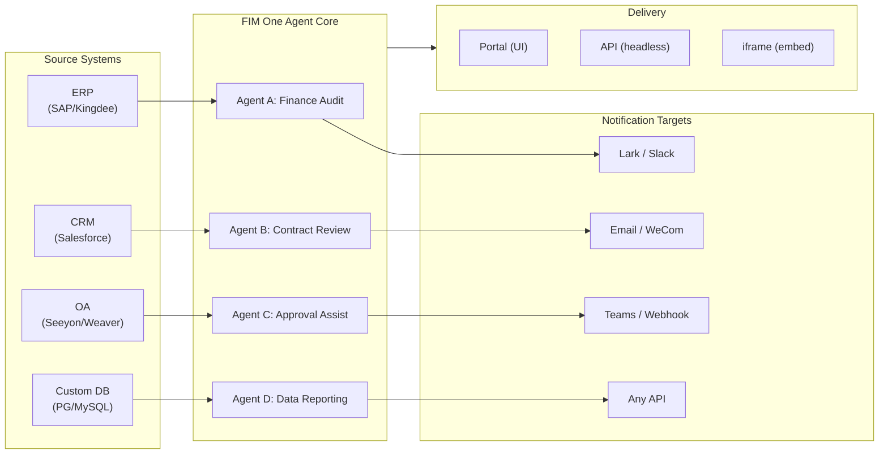

> Goal: Build an **all-in-one agent platform for Global × China enterprises** — delivered through three progressive modes: Standalone (portal assistant), Copilot (embedded in host system), Hub (central cross-system orchestration).
>
> Principles: **Provider-agnostic** (no vendor lock-in), **minimal-abstraction**, **protocol-first**, **connector-first** (integration is the core value).

## Produktvision

FIM One ist eine **All-in-One-Agenten-Plattform**, die drei progressive Bereitstellungsmodi bietet:

```
Standalone   → Your own AI assistant (Portal)
Copilot      → AI embedded in a host system (iframe / widget / embed)
Hub          → Central cross-system orchestration (Portal / API)
```

**Systemübergreifende Orchestrierung ist der Kernunterscheidungsfaktor.** Unternehmenskunden haben Legacy-Systeme — ERP, CRM, OA, Finanzen, HR — die über KI miteinander kommunizieren müssen:



**GTM-Pfad: Land and Expand**

| Schritt | Modus | Was passiert |
|------|------|-------------|
| Land | Copilot | In ein System einbetten, Wert in ihrer Benutzeroberfläche nachweisen |
| Expand | Copilot → Hub | Auf weitere Systeme ausrollen; Hub-Modus aggregiert diese |

## Bekannte Probleme

Nachverfolgter Fehler, die in der Produktion reproduzierbar sind, aber noch nicht behoben wurden. Jeder Eintrag nennt das Symptom, den vermuteten Bereich und die Problemumgehung (falls vorhanden). Elemente werden in einen Versionsabschnitt verschoben, sobald eine Behebung geplant und eingeplant ist.

- **Agent-Editor zeigt Warnung zu ungespeicherten Änderungen bei Eintrag ohne Bearbeitung.** Das Öffnen eines vorhandenen Agenten über `/agents/[id]` und sofortiges Zurückklicken löst den Dialog „Ungespeicherte Änderungen" aus, auch wenn kein Feld berührt wurde. Die Dirty-Check vergleicht 20+ Felder mit der geladenen Agent-Payload, daher reicht eine asymmetrische Standardeinstellung zwischen State-Initialisierung und Dirty-Vergleich aus, um einen Phantom-Mismatch zu verursachen – aktuelle Vermutung ist eines der verschachtelten Felder `model_config_json` / Benachrichtigung / Genehmigungsrouting, möglicherweise von `undefined` vs `null` vs `""` Normalisierung. Reproduzierbar besonders bei organisationsspezifischen Agenten. Problemumgehung: Dialog verwerfen (`Verwerfen und verlassen`) – kein Datenverlust, da sich nichts tatsächlich geändert hat. Versuchte Behebung (`cb40c86a`) entfernte ein verwandtes Orphan-Badge-Flimmern auf den Ressourcen-Pickern, löste dies aber nicht.

- **Das Speichern einer Agent-Bearbeitung kann mit `Input should be 'initiator', 'agent_owner' or 'org_members'` fehlschlagen.** Pydantic lehnt das Feld `confirmation_approver_scope` an der Grenze `/api/agents/{id}` PUT ab, obwohl jeder gespeicherte Wert in der Datenbank einer der drei gültigen Literale ist. Vermutung: Die Frontend-Umwandlung `as "initiator" | "agent_owner" | "org_members"` ist nur ein Compile-Zeit-Versprechen, daher kann ein Legacy- oder unerwarteter Runtime-String (möglicherweise aus einer Vorlage, einem Import oder einer älteren Migration) durch `setConfirmationApproverScope` durchschlüpfen und wörtlich zurückgegeben werden. Problemumgehung: Wählen Sie explizit einen Wert in der Dropdown-Liste Genehmigung → Genehmiger-Bereich aus, bevor Sie speichern.

- **Playground-Stopp-und-Wiederholung zeigt vorübergehende visuelle Artefakte, die ein Seiten-Refresh immer behebt.** Drei gleichzeitige Render-Quellen – `activeConversation.messages` (DB-Snapshot), der SSE-Stream `messages` und der optimistische Platzhalter `pendingQuery` – werden nicht in einen einzelnen abgeleiteten State zusammengefasst, daher kann die Benutzeroberfläche zwischen dem Klick auf „Wiederholung" und der Ankunft der gepaarten Assistenten-Antwort (a) kurzzeitig dieselbe Abfrage zweimal im Pre-Stream-Fenster rendern, (b) vorherige verwaiste Benutzer-Blasen aus dem Wiederholungsverlauf löschen, während `hasLiveMessages` wahr ist und bevor der Snapshot neu geladen wird, und (c) im engen Fenster zwischen dem SSE-Ereignis „done" und dem nächsten `selectConversation`-Refresh flimmern. **Daten gehen nie verloren** – jede Benutzer-Nachricht (einschließlich abgebrochener Wiederholungen) wird in `conversation.messages` beibehalten, in den nächsten LLM-Aufruf über `normalize_alternating_messages` übernommen und nach dem Refresh korrekt über `HistoryTurn.orphanUserContents` gerendert, das in der Render-Behebung `48ba08c6` eingeführt wurde. Zur Kontextualisierung: Claudes eigene Web-Benutzeroberfläche zeigt eine analoge Fehlerklasse – das Stoppen mitten in einer Antwort und das sofortige Senden einer Folgefrage verzweigt manchmal die Folgefrage als Sibling-Edit-Branch der ersten Abfrage, anstatt sie als neuen Turn anzuhängen – daher ist dies ein bekanntes schwieriges Problem in optimistischen UI + SSE + persistierten Verlauf-Designs, kein FIM-One-spezifischer Fehler. Eine ordnungsgemäße Behebung erfordert das Zusammenfassen der drei Render-Quellen in einen einzelnen abgeleiteten State; aufgeschoben bis zu einer umfassenderen Playground-State-Machine-Umgestaltung.

## Versionen im Umlauf

### v0.1 (2026-02-22) — MVP: ReAct + DAG Planner
- ReActAgent mit Tools (calculator, python_exec, web_search)
- DAG Planner (LLM generiert Abhängigkeitsgraphen)
- Portal UI mit Streaming + KaTeX

### v0.2 (2026-02-24) — Multi-Model + Memory
- Retry / Rate Limiting / Nutzungsverfolgung
- Native Function Calling (kein reines JSON-Parsing)
- Multi-Model-Unterstützung (schnelles + Haupt-LLM)
- Memory: WindowMemory, SummaryMemory
- FastAPI-Backend mit SSE-Streaming

### v0.3 (2026-02-25) — Web Tools + MCP
- Web-Tools (web_search, web_fetch) via Jina/Tavily/Brave
- Dateioperationen-Tool
- MCP-Client (Standard-Tool-Integration)
- Tool-Autodiscovery + Kategorien
- DAG-Visualisierung mit Click-to-Scroll
- Code-Ausführung in Docker (`--network=none`)

### v0.4 (2026-02-25) — Multi-Turn + Agents
- Multi-Turn-Konversationen (DbMemory)
- Tool-Schritt-Faltungs-UI
- HTTP-Request- + Shell-Exec-Tools
- Verwaltung von Agenten (erstellen, konfigurieren, veröffentlichen)
- JWT-Authentifizierung
- Pro-Agent-Ausführungsmodus + Temperatursteuerung

### v0.5 (2026-02-28) — Full RAG + Grounded Gen
- Vollständige RAG-Pipeline (Embedding + Vektorspeicher + FTS + RRF + Reranker)
- Grounded Generation (Zitate, Konfidenzwerte)
- Wissensdatenbank-Dokumentverwaltung (CRUD, Suche, Wiederholung, Schemamigration)
- ContextGuard + angeheftete Nachrichten (Token-Budget-Manager)
- DbMemory-Persistenz + LLM Compact
- DAG Re-Planning (bis zu 3 Runden)

### v0.6 (2026-03-01) — Connector Platform
- **Connector CRUD**: create, read, update, delete
- **ConnectorToolAdapter**: converts Connector → BaseTool
- **Per-user credentials**: AES-GCM encryption
- **Confirmation gate**: write operation approval
- **Audit logging**: all tool calls recorded
- **Circuit breaker**: graceful degradation on failures
- **Utility tools**: email_send, json_transform, template_render, text_utils
- **Embedding options**: Jina, OpenAI, custom providers

### v0.7 (2026-03-06) — Admin Platform + Multi-Tenant
- **Admin Platform**: Benutzerverwaltung, Rollenwechsel, Passwort-Zurücksetzen, Konto aktivieren/deaktivieren
- **Nur-auf-Einladung-Registrierung**: drei Modi (offen/Einladung/deaktiviert) + Einladungscode CRUD
- **Speicherverwaltung**: Speichernutzung pro Benutzer, Löschen, Bereinigung verwaister Dateien
- **Gesprächsmoderation**: Admin-Liste/Löschen aller
- **Erzwungenes Logout pro Benutzer**: alle Token widerrufen
- **API-Gesundheits-Dashboard**: Systemstatistiken, Connector-Metriken
- **Assistent für erste Einrichtung**: geführte Erstellung des Admin-Kontos
- **Persönliches Zentrum**: globale Anweisungen pro Benutzer, Spracheinstellung
- **JWT-Authentifizierung**: tokenbasierte SSE-Authentifizierung, Gesprächseigentümerschaft
- **Globale MCP-Server**: von Admin bereitgestellt, in allen Sitzungen geladen
- **Abwärtskompatibilität**: registration_enabled → registration_mode automatische Migration

### v0.7.x (2026-03-07 to 2026-03-12) — Stability + Refinements
- Invite code management
- Per-user quotas (429 enforcement)
- Structured audit logging
- Sensitive word filtering
- Admin login history
- Admin file browser
- Enhanced admin views (model_name, tools, kb_ids fields)
- Docker Compose deployment (single image, named volumes)
- OAuth auto-detection from window.location
- Extended thinking / reasoning support (`LLM_REASONING_EFFORT`, `LLM_REASONING_BUDGET_TOKENS`) for OpenAI o-series, Gemini 2.5+, Claude
- Admin per-tool enable/disable (disabled tools excluded from chat at runtime)
- MCP servers management moved to Connectors page
- Dual database support: SQLite (zero-config default) + PostgreSQL (production); Docker Compose auto-provisions PostgreSQL
- Models configuration documentation page with extended thinking setup per provider
- SSE Protocol v2: real-time answer streaming with `delta_reasoning`, `usage` fields, and split `done`/`suggestions`/`title`/`end` events; SQLite pool size 5 -> 20
- AI Builder expansion: 7 new builder tools (GetSettings, TestConnection, ImportOpenAPI for connectors; ListConnectors, AddConnector, RemoveConnector, SetModel for agents), `is_builder` flag on agents, builder prompt auto-refresh, SSRF guard
- SSE v2 frontend: streaming dot-pulse cursor, DAG re-plan round snapshots as collapsible cards, DAG layout decoupled from step states
- AI Builder concept documentation page with connector and agent builder guides
- Organization system: full CRUD with role-based membership (owner/admin/member), admin management UI
- Three-tier resource visibility (personal/org/global) for agents, connectors, knowledge bases, MCP servers
- Publish/unpublish API for all resource types; owner delegation for published agents
- Admin set-visibility endpoint (replaces clone-to-global); unified `build_visibility_filter()` query helper
- Database Connectors (Phase 1-3): direct SQL access to PG/MySQL/Oracle/SQL Server + Chinese legacy DBs; schema introspection, AI annotation, read-only query execution, encrypted credentials, 3 tools per connector (`list_tables`, `describe_table`, `query`)
- **Evaluation Center**: quantitative agent quality benchmarking — test dataset CRUD (prompt + expected behavior + assertions), eval runs (parallel execution + LLM grader + per-case pass/fail/latency/token results), results viewer with auto-polling; migration `r8t0v2x4z567`
- Three model roles (General/Fast/Reasoning) with per-tier env config isolation; fast model no longer inherits main model settings
- `StepOutput` dataclass replacing plain string step results for structured data and artifact passing
- Tool cache for DAG execution — identical tool calls cached per-run with async lock stampede prevention (`DAG_TOOL_CACHE`)
- Per-step LLM verification with 1 retry on failure (`DAG_STEP_VERIFICATION`)
- Auto-routing: fast LLM classifies queries as ReAct or DAG; `/api/auto` endpoint; frontend 3-way mode toggle (`AUTO_ROUTING`)
- [x] ~~**Shadow Market Organization + Resource Subscriptions**~~: Built-in Market org (shadow, no auto-join) replaces Platform org; resources discovered via marketplace browsing and explicitly subscribed (pull model); Market API for subscribing to shared resources; publish-to-Market always requires review; Resource subscriptions table; org-based resource sharing replacing global visibility
- [x] ~~**Agent Auto-discovery and Sub-agent Binding**~~: `discoverable` flag on agents; `sub_agent_ids` whitelist; CallAgentTool for delegating tasks to specialist agents
- [x] ~~**MCP Server Credentials + Per-User Override**~~: `mcp_server_credentials` table; `PUT /api/mcp-servers/{id}/my-credentials` endpoint; `allow_fallback` flag for credential fallback behavior
- [x] ~~**Connector/KB Toggle**~~: `POST /api/connectors/{id}/toggle` and `POST /api/knowledge-bases/{id}/toggle` for suspending/resuming resources
- [x] ~~**Standalone KB Conversations**~~: `kb_ids` field on conversations for direct KB chat without agent binding

### v0.8 (2026-03-20) — Connector Declarative Config + Progressive Disclosure
- [x] **Database connectors**: direkter SQL-Zugriff (PostgreSQL, MySQL, Oracle) *(ausgeliefert in v0.7.x — Phase 1-3)*
- [x] **RBAC**: Zugriffskontrolle pro Benutzer/Rolle für Connectoren *(ausgeliefert in v0.7.x — org system + three-tier visibility)*
- [x] **Connector credential encryption + per-user override**: `connector_credentials` Tabelle, Fernet-Verschlüsselung über `CREDENTIAL_ENCRYPTION_KEY`, `allow_fallback` Flag, `GET/PUT/DELETE /my-credentials` Endpunkte, Auflösung von Benutzer-Credentials beim Laden von Chat-Tools
- [x] **Publish review UI**: Org-Level Publish-Review-System — Review-Toggle pro Org, ReviewsSheet mit Approve/Reject-Workflow, Status-Badges auf Ressourcen-Karten, Review-Hinweis im Publish-Dialog, Neueinreichung für abgelehnte Ressourcen
- [x] **Connector Progressive Disclosure (Phase 1-2)**: einzelnes `ConnectorMetaTool` ersetzt Pro-Action-Tools; System-Prompt erhält nur leichte **Stubs** (Name + 1-Zeilen-Beschreibung, ~30 Token/Connector vs ~250 Token/Action); Agent ruft `discover(connector)` auf, um vollständiges Action-Schema bei Bedarf zu laden — Schema wird nur geladen, wenn das Modell einen Connector auswählt, wodurch das Prompt-Präfix für Caching stabil bleibt. Folgt dem Deferred-Tool-Loading-Muster, das in modernen Agent-Frameworks verbreitet ist. `execute` Subcommand; Feature Flag für Rückwärtskompatibilität.
- [x] **Agent Skill System + Compact Instructions**: On-Demand-Laden von Agent-Anweisungen — `Skill` Modell (Name, Content/SOP, optionale Scripts) an Agents angehängt; im System-Prompt nur nach Name referenziert (~10 Token/Skill); Agent ruft `read_skill(name)` auf, um vollständigen Content bei Bedarf zu laden. Reduziert Pro-Konversations-Anweisungs-Token-Kosten um ~80%, während umfangreichere SOP-Bibliotheken ermöglicht werden. Gegenstück zu ConnectorMetaTool's Progressive Disclosure auf Anweisungs-Ebene. Ermöglicht die "指令 + 工具 + 技能" Differenzierungsgeschichte. Fügt auch `compact_instructions` Feld zum Agent-Modell hinzu — Pro-Agent-Kompressionspriorität-Liste injiziert in `ContextGuard` beim Komprimieren (z. B. "Bestellnummern und Beträge beibehalten, rohe API-Antworten verwerfen"), ersetzt das aktuelle statische generische Prompt. Folgt der Compact Instructions Konvention, die in modernen Agent-Frameworks weit verbreitet ist.
- [x] **Connector import/export**: Connector-Templates teilen
- [x] **Connector fork**: Existierende Connectoren klonen + anpassen
- [x] **Workflow Phase 2 Nodes**: Iterator, Loop, VariableAggregator, ParameterExtractor, ListOperation, Transform, DocumentExtractor, QuestionUnderstanding, HumanIntervention — 9 erweiterte Node-Typen mit vollständigem Frontend + Backend + 150 neue Tests (275 gesamt). Node-Wiederholung mit exponentiellem Backoff, sichere Expression-Auswertung. Stats-Panel mit Success-Rate-Balken. 12 integrierte Templates. Pane-Kontextmenü (Einfügen, Alles auswählen, Ansicht anpassen, Auto-Layout).
- [x] **Workflow Phase 3 Nodes: SubWorkflow + ENV** — 2 neue Node-Typen (25 Nodes gesamt), 14 neue Tests (306 gesamt), 14 integrierte Templates. SubWorkflow: vollständig DB-gestützter verschachtelter Workflow-Executor mit Ziel-Workflow-Auswahl, Variablen-Mapping und konfigurierbarem Tiefenlimit zur Vermeidung unendlicher Rekursion. ENV: liest verschlüsselte Umgebungsvariablen mit Key-Picker und Fallback-Defaults. Vollständiges Frontend (Node-Komponenten, Config-Panels, Palette-Einträge, Minimap-Farben). Pro-Node-Ausführungsstatistik-Panel (Success-Raten, Dauern, Fehleranzahlen sortiert nach schlechtesten zuerst). `getNodeStats` API-Client + `NodeStatEntry` Typ. Tastaturkürzel-Dialog (`?` Taste).
- [x] **Workflow Scheduled Triggers**: Pro-Workflow Cron-Konfiguration mit Zeitzone, Standard-Eingaben und Next-Run-At-Berechnung. Preset-Cron-Buttons, 30 Trigger-Tests.
- [x] **Workflow API Triggers**: Öffentliche Pro-Workflow API-Schlüssel (`wf_` Präfix) für externe Ausführung ohne Benutzer-Auth, mit Rate Limiting. API-Schlüssel-Management-Dialog mit Generate/Regenerate/Revoke, Trigger-URL und cURL/JS-Beispiele.
- [x] **Workflow Batch Execution**: `POST /batch-run` mit bis zu 100 Input-Sets, konfigurierbarer Parallelität (1-10), zusammenklappbare Pro-Item-Ergebnisse, JSON-Export. 14 Batch-Ausführungs-Tests.
- [x] **Workflow Execution Log Viewer**: Echtzeit-chronologischer SSE-Event-Stream im Run-Panel mit Zeitstempeln, farbcodierten Badges und Event-Typ-Filter-Toggles.
- [x] **Workflow Run Stats**: Backend batch-fetcht Run-Anzahlen und Success-Raten über GROUP BY Subquery; Frontend zeigt Stats auf Workflow-Karten mit farbcodierten Success-Rate-Indikatoren.
- [x] **Workflow Scheduler Daemon**: Background-Async-Service pollt alle 60s nach fälligen Cron-basierten Workflows. Croniter-Zeitzone-Unterstützung, Semaphore-Concurrency, `last_scheduled_at` Tracking, Webhook-Zustellung. 14 Tests.
- [x] **Workflow Import Conflict Resolver**: Erkennt ungelöste Agent/Connector/KB/MCP-Referenzen während des Imports. Batch-DB-Abfragen mit Sichtbarkeits-Filterung, Frontend-Toast-Warnungen. 17 Tests.
- [x] **Workflow Test-Node Execution**: Isolierte Single-Node-Tests mit Mock-Variablen, integriert in Editor (Config-Panel Test-Button + Kontextmenü). 23 Tests.
- [x] **Workflow Version Diff**: Nebeneinander-Blueprint-Vergleich mit Node/Edge-Änderungserkennung, farbcodierte Indikatoren (hinzugefügt/entfernt/geändert).
- [x] **Workflow Run Management**: Einzelne Runs löschen (`DELETE /runs/{run_id}`) und alle abgeschlossenen Runs löschen (`DELETE /runs`), mit Frontend-Bestätigungsdialogen.
- [x] **Workflow Run Replay Overlay**: "View on Canvas" Button in Run-Verlauf zum Überlagern vergangener Ausführungsergebnisse auf der Canvas, zeigt Pro-Node-Status und Output ohne Neuausführung.
- [x] **Workflow Favorites/Pinning**: Workflows mit Stern/Pin oben in der Liste mit localStorage-Persistierung.
- [x] **Workflow Run History Export**: Run-Verlauf als JSON-Datei-Download mit vollständigen Run-Metadaten und Pro-Node-Ergebnissen exportieren.
- [x] **Admin Workflows Management**: Admin-Panel-Tab zum Verwalten aller Workflows über Benutzer — Liste, Toggle aktiv/inaktiv, Löschen mit Bestätigung. Batch-Endpunkte für Löschen, Toggle und Veröffentlichen mit Audit-Logging.
- [x] **Workflow Templates System**: `WorkflowTemplate` ORM-Modell mit Admin-CRUD, öffentliche Listing/Clone-API und 5 Seed-Templates, die beim ersten Start automatisch eingefügt werden.
- [x] **Workflow Inline Validation Badges**: Echtzeit-Pro-Node `ValidationBadge` auf Canvas mit Error/Warning-Tooltips für unmittelbares visuelles Feedback während der Bearbeitung.
- [x] **Workflow Execution Trace Viewer**: Timeline-basierter Trace-Viewer Sheet mit Engine `trace_level` Parameter und Pro-Node-Variablen-Snapshots für Step-Through-Debugging.
- [x] **Workflow Rate Limiting and Timeout**: Pro-Benutzer `WorkflowRateLimiter` (Sliding Window 10 Runs/Min, 3 gleichzeitig) und Standard 10-Minuten-Global-Run-Timeout.
- [x] **Workflow Blueprint System**: Visueller Workflow-Editor zum Entwerfen und Ausführen von Multi-Step-Automation-Blueprints — `Workflow` / `WorkflowRun` ORM-Modelle, vollständige CRUD + SSE-Ausführungs-API, Import/Export, Duplizieren, Blueprint-Validierungs-Endpunkt, `WorkflowEngine` mit topologischer Sortierung + Semaphore-basierter Concurrency + Condition Branching und 12 Node-Typen (Start, End, LLM, ConditionBranch, QuestionClassifier, Agent, KnowledgeRetrieval, Connector, HTTPRequest, VariableAssign, TemplateTransform, CodeExecution), `VariableStore` mit `{{node_id.output}}` Interpolation und `env.*` Namespace, Error-Strategien pro Node (STOP_WORKFLOW / CONTINUE / FAIL_BRANCH) mit Pro-Node-Timeout und erweiterter Config-UI, React Flow v12 visueller Editor mit Drag-and-Drop-Palette + Node-Config-Panel + Variablen-Picker-Combobox + Add-Node-on-Edge + Auto-Layout (ELK.js) + Run-History-Sheet, Dify-Style kompaktes Node-Design mit Ring-basiertem Run-Status-Styling und animierten Edge-Übergängen, 4 integrierte Starter-Templates (Simple LLM Chain, Conditional Router, Knowledge-Augmented QA, HTTP API Pipeline) mit Template-Picker-Dialog und `GET /templates` + `POST /from-template` API, Stats-Endpunkt, `?run=true` URL-Parameter Auto-Open, Subprocess-basierte Code-Ausführungs-Sicherheit, 105-Test-Suite (Templates, Eval-Namespace-Flattening, Blueprint-Validierungs-Warnungen, Node/Edge-Löschung, Import/Export/Duplizieren, Deadlock-Erkennung, Multi-Condition-Branching)
- [x] **Operation audit**: detailliertes Logging wer was getan hat — Admin-Review-Log-Audit-Tab hinzugefügt (Publish-Review-Trail pro Org/Ressource)
- [x] **Semantic Schema Annotations**: erweitere Connector-Schema-Felder mit `semantic_tag`, `description` und `pii` Flags; Annotationen in LLM-Tool-Beschreibungen angezeigt, damit der Agent die Feld-Absicht versteht, ohne von Spaltennamen zu raten

### v0.8.1 (2026-03-29) — Progressive Disclosure Maturity + ReAct Hardening
- Progressive Disclosure für DB-Konnektoren (`DatabaseMetaTool`), MCP-Server (`MCPServerMetaTool`) und bedarfsgesteuertes Tool-Laden (`request_tools` Meta-Tool)
- DAG-Qualitätsüberholung (5 Verbesserungen: Modell-Upgrade, automatische Skill-Erkennung, Zitierprüfer, strukturierte Inhaltsbewahrung, domänengesteuertes Routing)
- Domain-Modell-Eskalation in ReAct (spezialisierte Domänen eskalieren automatisch zum Reasoning-Modell)
- Pro-Modell Native Function Calling Toggle (`tool_choice_enabled`)
- ReAct-Zyklenerkennung (deterministische Duplikat-Tool-Call-Prävention)
- ReAct-Abschluss-Checkliste (Vor-Antwort-Verifizierung bei Tool-Verwendung)
- Resource Fork Phase 1 (MCP Server + Skill Fork Endpoints mit Lineage-Tracking)
- Workflow Connection Dep Auto-Subscribe (rekursive Sub-Workflow-Abhängigkeitsauflösung)
- Vorgefertigte Lösungsvorlagen (8 vertikale Lösungen beim ersten Registrieren auf dem Markt bereitgestellt)
- Verbesserungen der Admin-Benachrichtigungen (Zeitzonen-bewusst, Master-Schalter, SMTP Reply-To)
- Pro-Turn Token Budget Circuit Breaker (`REACT_MAX_TURN_TOKENS`)
- Zentralisierte Tool-Kürzung, dynamische System-Prompt-Budgetierung
- Dateianhang-Download, Duplikat-Nachrichtenübermittlung behoben

### v0.8.2 (2026-04-10) — Agent Core Hardening + Vision Documents
- **Agent Core Phase 0** — Compact prompt upgraded to 9-section structured format; empty tool result protection (descriptive message instead of `(no output)`); anti-loop prompt + cycle detection threshold lowered to 2; domain classifier + pre-flight DB config resolution parallelized (400–1100 ms saved per request); SSE `end` event sent immediately after answer, with title/suggestions moved to background tasks
- **Agent Core Phase 1 (Context Anti-Bloat)** — `MicroCompact` rule-based old tool result cleanup (keep last 6); `REACT_TOOL_RESULT_BUDGET=40000` aggregate cap; reactive compact on context overflow (auto-compact to 50% budget and retry instead of crashing)
- **Agent Core Phase 2 (Speed)** — Keyword-based tool pre-selection (skips LLM call on obvious matches, 200–500 ms saved); `SharedHttpClient` LLM connection pooling; completion check skipped for answers >200 tokens; `FallbackLLM` wraps primary+fast with automatic failover on 429/503/529/connection errors
- **Intelligent Document Processing (Vision-Aware)** — Adaptive document handling: PDF pages rendered as images via PyMuPDF for vision-capable models (GPT-4o, Claude 3/4, Gemini), text-only fallback via pdfplumber. Per-model `supports_vision` flag. Modes via `DOCUMENT_PROCESSING_MODE`, `DOCUMENT_VISION_DPI`, `DOCUMENT_VISION_MAX_PAGES`. DOCX/PPTX embedded image extraction. Multi-turn vision persistence across conversation turns. Smart PDF processing (text-rich pages extract text + images; scanned pages render as full-page PNG). Pre-built sandbox image (`Dockerfile.sandbox`) with common data-science packages for `--network=none` code execution
- **Resource Fork completion** — Agent / Connector / Workflow fork endpoints added, completing the five-type lineage tracking (KB fork removed — inherently user-local)
- **File integrity guardrail** — System prompt rule prevents the agent from substituting unrelated file contents when a target file is unreadable; uploaded files now include `file_id` in message context for direct `read_uploaded_file` access

### v0.8.3 (2026-04-16) — Universal Document Conversion + Agent Core Phase 3
- **Universal Document Conversion (`convert_to_markdown` + OCR)** — Built-in Agent tool wrapping Microsoft MarkItDown; converts PDF, Word, Excel, PowerPoint, HTML, JSON, CSV, XML, ZIP, EPUB, Outlook .msg, images, audio, YouTube URLs to Markdown. `LiteLLMOpenAIShim` enables OCR via any vision-capable LLM (Claude, Gemini, Bedrock, Azure). Vision-aware RAG ingestion with zero-regression text-only fallback. `LLM_SUPPORTS_VISION` env var for opt-out
- **Agent Core Phase 3 (Runtime Invariant Hardening)** — Conversation recovery (dangling `tool_use` auto-repair); structured compact work card (`WorkCard` typed merge across compaction rounds); turn-level profiler (`REACT_TURN_PROFILE_ENABLED`); per-user rate limiting (`LLM_RATE_LIMIT_PER_USER`); empty-content assistant message with `tool_calls` no longer dropped

### v0.8.4 (2026-04-17) — Prompt Cache + Reasoning Correctness
- **System prompt section registry with cache breakpoints** — Memoized `PromptRegistry` splits system prompts into stable prefix + dynamic suffix; cache-capable providers (Claude, Bedrock Anthropic, Vertex Claude) receive `cache_control: {"type": "ephemeral"}` on the prefix for ~60-80% per-turn input token savings. Non-cache providers get a single concatenated message (zero behavior change)
- **Prompt cache observability** — `cache_read_input_tokens` and `cache_creation_input_tokens` tracked through `UsageSummary` → `TurnProfiler` → `done_payload.cache` field. Structured `turn_cache` log line per turn. Doubles as relay cache-honesty probe
- **Conversation recovery MVP** — Synthetic `tool_result` rows persist after interrupted turns; `POST /chat/resume` replays cached SSE events from a monotonic cursor; frontend `useSseResume` hook auto-reconnects with exponential backoff (300ms → 1s → 3s, max 3 attempts) and "Reconnecting…" indicator
- **Thinking-block persistence with signature** — `reasoning_content` + Anthropic `signature` persisted in `metadata_["thinking"]` and replayed on subsequent turns; fixes HTTP 400 signature mismatch on Claude 4 multi-turn conversations
- **Provider-aware reasoning replay policy** — Centralized `reasoning_replay_policy()` in `core/prompt/reasoning.py` gates serialization per provider family: Claude replays thinking blocks with signature; DeepSeek-R1/Qwen-QwQ/Gemini-thinking/o-series drop `reasoning_content` on outbound (previously leaked, breaking provider KV caches and violating API docs)

### v0.8.5 (2026-04-23) — Channel Integration + Hook System + Contributor i18n
- **Feishu Channel (Phase 1 subset)** — Org-scoped `Channel` resource with Fernet-encrypted credentials; `FeishuChannel` supports interactive card send + callback (signature verification + URL challenge); Settings → Channels management UI (list, create/edit with dirty-state protection, details with copyable callback URL, test-send); CRUD API (`/api/channels`) and event callback endpoint (`/api/channels/{id}/callback`). Shipped early for 2026-04-24 roadshow
- **Agent Hook System (live in ReAct + DAG runtime)** — `PreToolUseHook` / `PostToolUseHook` abstraction in `src/fim_one/core/hooks/`; agents declaring `hooks.class_hooks` in `model_config_json` have hooks instantiated and registered per chat session. First consumer `FeishuGateHook` posts an Approve/Reject card to the linked Feishu group when an agent calls a `requires_confirmation=True` tool, blocks execution, and resumes or aborts based on verdict
- **Configurable confirmation gate (inline OR channel)** — Every agent gets an Approval section with three routing modes (Auto / Inline only / Channel only), approver-scope selector (initiator / owner / anyone in org), per-tool override, and explicit approval-channel picker. Auto mode gracefully falls back to an inline approval card when no channel is linked. `POST /api/confirmations/{id}/respond` shares a single decision-recording path with the Feishu webhook
- **Per-agent task completion notifications** — Long-running ReAct or DAG agents can push a summary card to the org's channel when a task finishes. First consumer of the generic outbound notification pattern
- **Hook Approval Playground** — Channels details sheet has a "Test Approval Flow" action that exercises the full production path (genuine `ConfirmationRequest` row, real Feishu callback, status transitions) — same code path a production hook uses
- **Contributor-friendly i18n CI fallback** — `.github/workflows/i18n-sync.yml` translates EN → ZH/JA/KO/DE/FR on master after PR merge and auto-commits with `[skip ci]`; contributors no longer need `LLM_API_KEY` locally. Pre-commit locale-edit guard refuses manual edits to generated locale files (`ALLOW_LOCALE_EDIT=1` override for legitimate translation fixes). End-to-end verified via smoke-test push
- **Exa integration docs** — Dedicated Integrations section with a first-class Exa page covering the full Exa search surface (neural / fast / deep-reasoning / instant), filtering, content retrieval, and three tuned presets
- **Xinchuang (信创) database support** — Database Connector now lists KingbaseES (人大金仓), HighGo (瀚高), and DM8 (达梦) alongside PostgreSQL/MySQL. PG-compatible drivers reuse `asyncpg`; DM8 uses `dmPython`. `scripts/test_xinchuang_dbs.py` verifies live connectivity from the CLI
- **Channels + Hook System architecture docs** — `docs/architecture/hook-system.mdx` explains the three hook points and walks through FeishuGateHook end-to-end; existing architecture pages cross-link; README lists Messaging Channels as a first-class capability
- **Hardening** — Duplicate Feishu callback clicks produce a replacement card instead of double-deciding; concurrent callback clicks resolved via conditional `UPDATE ... WHERE status='pending'` rowcount check; pending approvals auto-expire after `CHANNEL_CONFIRMATION_TTL_MINUTES` (default 24h) via background sweeper; Settings → Channels respects org role (members see read-only UI); parallel tool-call aggregator handles providers that reuse `index=0` for every delta; session-expiry redirect preserves query string

### v0.8.6 (2026-05-08) — Stripe Billing + Refinements
- [x] Stripe billing MVP — Free + Pro tiers; Checkout, Customer Portal, webhook lifecycle; `/settings?tab=billing`; admin plan/subscription CRUD; quota enforcement respects each user's plan
- [x] Admin-controlled billing feature flag — `system_settings.billing_enabled` gates the entire Stripe pipeline so private deployments without Stripe credentials never surface a non-functional payment UX
- [x] Per-user unlimited quota — empty inherits global default, `0` grants unlimited; previously both collapsed into the same state
- [x] Translation glossary as single source of truth — `scripts/translation-glossary.md` consolidates per-locale rules; pre-commit unconditionally refuses manual edits to generated locale files
- [x] License + governing law migrated to FIM Labs Pte. Ltd. (Singapore); SIAC arbitration in English; new top-level `NOTICE` file
- [x] Playground follow-up suggestions restored, opt-in per agent
- [x] Stability fixes — strict-alternation provider history, parallel tool-call boundary detection, unbound-agent confirmation flow, channel role gating, retry-duplicate suppression, post-rejection no-paraphrase

### v0.8.7 (2026-06-10) — Security Hardening + Guardrails v0 + Billing Correctness
- [x] JWT token-type confinement — closes a 2FA bypass where any same-signed token (temp/refresh/ticket) could authenticate API and SSE endpoints
- [x] OAuth hardening — email auto-link requires a provider-verified email (account-takeover fix); OAuth refresh tokens stored hashed so session rotation works
- [x] Content guardrails v0 — input/output tripwire layer (`core/agent/guardrail`); ships jailbreak detector + max-length output guardrail, env-var configured
- [x] `file_ops.apply_patch` — V4A diff patches with fuzzy whitespace matching, complements `find_replace`
- [x] Billing-cycle correctness — quota resets on the subscription anniversary (not calendar month); renewals advance the period via authoritative Stripe lookup; usage display aligned to the enforcement window
- [x] Reliability fixes — pseudo-protocol tool-call leak stripped from answers; tunable HTTP keep-alive ends `APIConnectionError` bursts; API-key usage stats persist on read-only requests
- [x] Billing tab visual overhaul — full-width, consistent with other Settings tabs

I notice you've provided a section heading "## Planned Versions" but no content to translate. 

Could you please provide the full MDX documentation section that follows this heading? Once you share the complete content (including any paragraphs, lists, code blocks, or other elements), I'll translate it to German following all the structural rules and glossary guidelines you've outlined.

### v0.9 — Observability + Production Hardening

**Ziel**: Produktionsreife Operationen + vier Säulen, die die Lücke zwischen „Anweisungen, die der Agent möglicherweise befolgt" und „Garantien, die das System durchsetzt" schließen — Trace Layer (sehen, was passiert ist) · Hook System (durchsetzen, was passieren muss) · Agent Workspace (persistente Dateien + Handoff) · IM Channel (Agents leben dort, wo Benutzer arbeiten).

#### Auth & Security Hardening

- [x] ~~JWT token-type confinement (2FA bypass) + OAuth account-takeover & session fixes~~ *(shipped in v0.8.7)*
- [x] ~~PostgreSQL timezone-aware timestamps~~ *(shipped in v0.8.6)*
- [x] Force-logout timestamp comparison normalizes tz-aware/naive values to UTC by conversion — revoked tokens reliably rejected on both SQLite and PostgreSQL
- [x] Docker Compose PostgreSQL credentials overridable via `POSTGRES_*` env (single-sourced into the connection string) — no more accidentally-shipped `fim:fim` default on exposed deployments

#### Model & Provider Compatibility

- [x] Anthropic adaptive-thinking protocol for Opus 4.6+/Sonnet 4.6/Fable 5 — extended thinking works on models that rejected the old fixed-budget param (400 on 4.7/4.8); warns on OpenAI-proxy misroute

#### Connector + Tooling

- [ ] **Connector Progressive Disclosure Phase 3-4** — unified `ConnectorExecutor` (API/DB/MCP); `jsonschema` action validation; protocol-agnostic discover/execute
- [ ] **YAML/JSON connector config** — platform auto-generates MCP server
- [ ] **Database connectors Phase 4** — Oracle (`oracledb`), SQL Server (`aioodbc`), GBase (`aioodbc` + GBase ODBC). DM8 / KingbaseES / HighGo shipped in v0.8.5
- [ ] **MCP Connection Pooling** — pool STDIO with per-user env isolation; share `httpx.AsyncClient` for SSE/HTTP. Target ≤100 ms warm-start, O(1) HTTP connections per server

#### Content Guardrails {/* dev: dev/archive/openai-agents-insights.md */}

- [x] ~~Content Guardrails v0 (Input/Output-Tripwire, Jailbreak-Detektor, Umgebungsvariablen-Konfiguration, `guardrail_tripwired` SSE-Event)~~ *(in v0.8.7 ausgeliefert)*
- [ ] Off-Topic-Filter (Klassifizierer-gestützter Input-Guardrail) — auf v0.5 verschieben, falls Regex ausreichend bleibt
- [ ] PII-Redaktor-Output-Guardrail (Regex + Klassifizierer-Hybrid)
- [ ] Pro-Agent-Guardrail-Konfiguration UI (Admin-Panel)

#### Hook System {/* dev: dev/hook-system.md */}

- [ ] Per-Hook-Konfigurationsweiterleitung (`{"name": ..., "config": {...}}` Schema)
- [ ] DAG `tools_used` Genauigkeit (echte Toolnamen aus Pro-Schritt ReAct über Step-Completion-Callback)
- [ ] Hook-Vererbung für `CallAgentTool` + Workflow `AGENT` Knoten (Sicherheitsstandard vs. Flexibilitätsstandard)
- [ ] Integrierte Hooks: `ConnectorCallLog` Autoaufzeichnung, Read-Only-Modus-Blockierung, DB-Ergebnistrunkierung, Pro-Connector-Ratenlimit
- [ ] `SessionStart` Hook-Punkt + benutzerdefinierte YAML-Hooks
- [x] ~~Skeleton + FeishuGateHook + Approval Playground + ReAct/DAG Runtime~~ *(in v0.8.5 ausgeliefert)*

#### IM Channel Integration {/* dev: dev/im-channels.md */}

- [ ] Channels: WeCom, Slack, Email, Teams outbound
- [ ] Outbound patterns: failure alerts, budget warnings, scheduled digests, escalation, audit receipts, approval escalation
- [ ] Phase 2 — Inbound trigger (@mention agent in IM group)
- [x] ~~Feishu Channel (Phase 1 subset) + Task completion notification~~ *(shipped in v0.8.5)*

#### Connector-Autorisierungsebenen {/* dev: dev/connector-rbac/00-overview.md */}

- [ ] Stufe 1 — DB-Modus (`ConnectorScopeGuard` PreToolUse Hook: Verb-Blockierung, Tabellen-Whitelist/Blacklist, Spalten-Redaktion, Scope-Prädikat-Injektion)
- [ ] Stufe 2 — Open API-Modus (Admin-UI zur Anforderung benutzerspezifischer Anmeldedaten; Key-Binding-Integritäts-Dashboard)
- [ ] Stufe 3 — Login-Ticket-Austausch (`LoginTicketCredential` für Frontend/Backend-geteilte Systeme ohne benutzergesteuerten API-Schlüssel)
- [ ] Ebenenübergreifende Nachverfolgbarkeit (`caller_user_id`, `effective_credential_source`, `scope_rules_applied` in `ConnectorCallLog`)

#### Identity Provider Module + Channel Slim-down {/* dev: dev/connector-rbac/07-identity-providers.md */}

- [ ] `identity_providers` + `user_identity_map` Modelle — DB-Level Pro-Org SSO/OAuth-Konfiguration ersetzt ENV-Level Third-Party-Login
- [ ] Feishu SSO via IdP ("Login with Feishu" ergibt FIM-Sitzung + Upstream-Token, entfernt Pro-Benutzer API-Key-Reibung für Tier-2)
- [ ] Org-Graph-Synchronisierung via IdP (Feishu-Abteilungen → FIM-Org-Baum); WeCom + DingTalk folgen
- [ ] Channel reduziert sich auf Delivery + Gate; Identity-Funktionen (SSO / OrgSync) leben nur in IdP

#### Public API Phase 2 {/* dev: dev/public-api-phase2.md */}

- [ ] Pro-Schlüssel-Ratenbegrenzung (`X-RateLimit-*` Header, 429)
- [ ] Pro-Schlüssel-Nutzungskontingent (monatliches Token-/Request-Budget)
- [ ] Nutzungsstatistik-Schreibpufferung für High-QPS-Schlüssel (prozesslokal mit Flush-on-Shutdown, exakte Zählungen, keine neue Abhängigkeit) — aufgeschoben bis zu einem gemessenen Engpass {/* dev: dev/public-api-phase2.md */}
- [ ] Scope-Durchsetzung pro Endpunkt
- [ ] API-Versionierung (`/v1/...`) + Deprecation-Header
- [ ] Webhook-Callbacks (pro Schlüssel)
- [ ] SDK-Generierung (Python + TypeScript)
- [ ] Developer Portal (Try-it-Panels + Pro-Schlüssel-Analytik)
- [ ] API-Schlüsselrotation (24-Stunden-Kulanzfrist)
- [ ] Batch-/Async-API (`POST /api/batch`)
- [ ] Pro-externe-Abhängigkeit Circuit Breaker

#### Observability {/* dev: dev/agent-trace-layer.md */}

- [ ] **Agent Trace Layer** — Trace/Span model, frontend timeline viewer, OTel export (LangSmith-style application-level run/trace/thread)
- [ ] **Metrics dashboard** — latency, success rate, token usage, connector analytics (per-agent / user / org)

#### Agent Workspace {/* dev: dev/agent-workspace.md */}

- [ ] Tool Output Offloading — `workspace://` URIs für >8K Antworten + `read/list/write_workspace_file` Tools
- [ ] Handoff Notes — `write_handoff(summary)` bleibt bei Komprimierung erhalten
- [ ] Workspace UI — Datei-Browser pro Konversation; sessionübergreifende Beibehaltung; Speicherquota pro Benutzer
- [ ] Cross-session conversation recall — `list_conversations`, `search_conversations`, `read_conversation` Tools

#### Prompt-Cache + Reasoning-Nachverfolgungen {/* dev: dev/prompt-cache-followups.md */}

- [ ] Gemini Context Cache Adapter (separater REST-Cache-Lebenszyklus vs. Anthropic Inline-Marker)
- [ ] Prompt-Registry-Erweiterung auf Planner / Verifier / Domain Classifier / Compact
- [ ] Pro-Agent `cache_ttl` (kurzlebig 5min vs. erweitert 1h)
- [ ] DAG-Schritt-Level-Checkpoint-Tabelle für Mid-DAG-Wiederaufnahme
- [ ] Dedizierte `tool_call_id` Message-Spalte (indizierte Orphan-Query-Suche im großen Maßstab)
- [ ] Mid-Stream-Thinking-Token-Rekonstruktion (Wiederaufnahme-Granularität feiner als vollständiges SSE-Event)
- [ ] API-Relay-Cache-Honesty-Probe (Admin-ausgelöst: erkennt Relays, die `cache_control` entfernen)

#### Zuverlässigkeits-Nachverfolgungen (Agent Core Priority Matrix)

- [ ] Content replacement state persistence (streaming invariant #2: "once seen, fate frozen")
- [ ] Attachment context router (dedup, aggregate budget, liveness checks; pairs with Workspace offloading)
- [ ] Side query workers (dedicated pools for recall / classify / summary so they don't contend for main rate-limit budget)

#### Ökosystem + Skalierung

- [ ] **Geplante Jobs + ereignisgesteuerte Agents** — `scheduled_jobs` + `job_runs` + APScheduler; cron + webhook-inbound. Async Sub-Agent-Anwendungsfall für Hub-Modus
- [ ] **Workflow-Trigger-Identitätsobservabilität** — `ExecutionContext.trigger_source` (`webhook | cron | manual | batch | sub`) an allen 5 WorkflowEngine-Standorten gefüllt; in Run-Panel und Connector-Logs angezeigt
- [ ] **Pro-Workflow `credential_policy` Override** (`owner` / `caller` / `auto`) — überschreibt Standard-`trigger_source → identity`-Zuordnung
- [ ] **DB Schema Advanced Builder** — KI-gesteuerte Annotation für 1K-7K+ Tabellenbereitstellungen (Selektivität + geschäftlicher Kontext-Reasoning)
- [ ] Sandbox-Härtung (v2 Code-Execution-Isolation)
- [ ] Performance-Tests (Concurrent-Load-Benchmarks)
- [ ] Internal Harness Benchmark (Harness-Parameteränderungen über Eval Center quantifizieren)

#### Bereits früh ausgeliefert

- [x] ~~Circuit breaker, Workflow run retention cleanup, Workflow version diff summaries~~ *(v0.8 / v0.8.1)*
- [x] ~~DAG quality overhaul, Domain model escalation, Per-model NFC toggle~~ *(v0.8.1)*
- [x] ~~DatabaseMetaTool, MCPServerMetaTool, On-demand `request_tools`~~ *(v0.8.1)*
- [x] ~~Workflow Connection Dep Auto-Subscribe, Workflow real executors~~ *(v0.8.1)*
- [x] ~~ReAct Cycle Detection, Completion Checklist~~ *(v0.8.1)*
- [x] ~~Prebuilt Solution Templates (8 vertical bundles), Resource Fork (MCP/Skill/Agent/Connector/Workflow)~~ *(v0.8.1)*
- [x] ~~Vision document processing (PDF / DOCX / PPTX), MarkItDown OCR~~ *(v0.8.2 / v0.8.3)*
- [x] ~~Smart File Content Injection + `read_uploaded_file`~~ *(v0.8)*
- [x] ~~Agent Core Phase 3: Conversation Recovery MVP, Compact Work Card, Turn Profiler, Per-user Rate Limiting~~ *(v0.8.3)*
- [x] ~~Conversation resume MVP, System prompt registry + cache, Thinking-block persistence, Reasoning replay policy, Cache observability~~ *(v0.8.4)*

### v1.0 — Hot-Plug + Embeddable

**Ziel**: Connector-Hinzufügung ohne Neustart, Paket-Ökosystem und eingebettete Bereitstellung.

- [ ] **Connector Progressive Disclosure (Phase 5)**: **Semantic-Guided Tool Selection** (Entity-Extraktion aus Abfrage → Ontology Registry Lookup → Connector-Set-Reduktion; 90%+ Token-Reduktion für 50+ Connector-Bereitstellungen); Scale-Modus für Batch-/ETL-Connectors; CLI-ähnliche universelle `connector <name> <action> <params>` Schnittstelle
- [ ] **Cross-Connector Entity Alignment (Ontology Registry)** — *herabgestuft 2026-04-21: bedarfsgerechte benutzerdefinierte Bereitstellung, keine Kernfunktion*: Definieren Sie gemeinsame Entity-Typen (Customer, Order, Asset) mit Feldmappings über Connectors hinweg; DAGPlanner löst Cross-System JOIN-Schlüssel automatisch auf; ermöglicht Cross-Connector-Abfragen (z. B. „Kunden in Salesforce, die in Shopify bestellt haben") ohne hartcodierte Feldnamen
- [ ] **Hot-plug Connectors**: OpenAPI-Spec hochladen, KI generiert Konfiguration, live in 5 Minuten (kein Neustart)
- [x] ~~**Marketplace Redesign Phase 1 — Solutions + Components**~~: Zwei-Ebenen-Marktmodell (Solutions: Agent/Skill/Workflow; Components: Connector/MCP Server); Scope-Selector (Global Market / org); einheitliches Abonnementmodell (org auto-appear entfernt); KB aus Market-Scope entfernt; Datenmigration füllt Abos für bestehende Org-Mitglieder auf
- [ ] **Market Package System**: Verteilbare Ressourcen-Bundles für den Marketplace — ersetzt Pro-Typ „Marketplace" durch eine einheitliche Packaging-Schicht. `fim-package.yaml` Manifest deklariert: Metadaten (Name, Version, Beschreibung, Autor, Lizenz, Tags, `min_fim_version`), Entry Point (primäre Skill oder Agent), Ressourcenliste (Agents, Skills, Connectors, KBs, MCP Server, Workflows) mit Konfigurationsreferenzen, Paket-übergreifende Abhängigkeiten (Semver-Bereiche), erforderliche Anmeldedaten (auf Connector-Refs für Installationszeit-Erfassung abgebildet) und benutzerkonfigurierbare Variablen mit Standardwerten. **Zwei Verbrauchsmodi**: (1) **install** — Batch-Erstellung aller Ressourcen + automatische Verdrahtung interner Referenzen via ID-Substitution; Installation mit Quelle verknüpft für Versions-Update-Benachrichtigungen; `POST /api/market/packages/{id}/install`; (2) **fork** — Klonen als benutzergesteuerte bearbeitbare Kopien ohne Update-Link (dies IST der Template-Modus); `POST /api/market/packages/{id}/fork`. Zusätzliche Endpunkte: Veröffentlichung (`POST /api/market/packages` mit Review-Workflow), Deinstallation (`DELETE /packages/{id}/uninstall` mit Abhängigkeitsprüfung + Bestätigung geänderter Ressourcen), Versionsverlauf (`GET /packages/{id}/versions`), Upgrade (`POST /packages/{id}/upgrade` mit Pro-Ressourcen-Diff-Vorschau). Abhängigkeitsresolver für verschachtelte Paketanforderungen mit Konflikt-Erkennung. `PackageInstallation` Tabelle verfolgt installierte Pakete pro Benutzer mit Ressourcen-ID-Mapping für Deinstallation/Upgrade. **Koexistiert mit einzelner Ressourcen-Veröffentlichung** — Package ist eine Kompositionsschicht, kein Ersatz; ein einzelner Connector ist immer noch eigenständig veröffentlichbar. Beispiel-Abhängigkeitsbaum: `Package: contract-review` → `Skill: contract-review` (Entry Point) → `Agent: contract-analyst` + `Agent: risk-scorer` → `KB: legal-clauses` + `Connector: docusign-api` + `MCP: pdf-extractor` + `Workflow: contract-approval-flow`
- [ ] **Creator Program**: Marketplace-Monetarisierungsschicht — Creator-Profile mit Portfolio-Seiten, Pro-Paket-Analytik (Installationen, Forks, aktive Benutzer, Bewertungen/Rezensionen), Affiliate-Provisionserfassung, wenn Pakete neue Abos fördern. Bezahlte Paket-Stufe mit Preisgestaltung, Kaufablauf und Genehmigungsworkflow. Creator-Dashboard mit Installationstrends, Umsatzberichterstattung und Benutzer-Feedback. Öffentliche Creator-API für programmgesteuerte Paket-Veröffentlichung (CI/CD für Paketautoren). Community-Funktionen: Paket-Kommentare, Q&A, Changelogs pro Version
- [ ] **Embeddable Widget**: `<script src="fim-one.js">` in Host-Seite eingefügt
- [ ] **Page Context Injection**: Widget liest Host-Seiten-Kontext (aktuelle ID, URL, DOM-Selektoren)
- [ ] **Advanced Triggers**: Webhook-Inbound-Events; erweiterte Zeitplan-Verbesserungen (Multi-Zeitzone, Kalender-bewusst)
- [ ] **Batch-Ausführung**: Verarbeitung von 1000+ Elementen via DAG
- [ ] **Enterprise Security**: IP-Whitelist, Verschlüsselung im Ruhezustand, SSO
- [ ] **KB Advanced Editor**: Builder-Modus Agent für Power-User, die große Knowledge Bases verwalten — Bulk-URL-Erfassung, Duplikat-Erkennung, Gap-Analyse, Dokument-Lebenszyklusmanagement; erweitert bestehenden KB AI Chat mit ReAct Tool Loop
- [ ] **Stripe Billing (v1 MVP — Pro Subscription)**: Free + Pro Zwei-Ebenen-Abonnement mit monatlichem Token-Kontingent. Stripe Checkout (gehostet) + Customer Portal (Self-Service) + Webhook-gesteuerte Lebenszyklen (`checkout.session.completed` / `customer.subscription.updated|deleted` / `invoice.payment_succeeded|failed`). Soft-Cap bei Kontingent-Erschöpfung (HTTP 402 + Upgrade-Aufforderung) — keine Übergebühren in v1. Nur Pro-Benutzer-Abrechnung; Org/Team-Abos auf v3 verschoben. Voraussetzungen:
  - [x] ~~**Datenmodell + SDK-Grundlagen** (P1) — `billing_plans` / `subscriptions` / `stripe_webhook_events` Tabellen, ORM-Modelle, Stripe SDK Singleton, Free + Pro Seeds~~ *(ausgeliefert in v0.8.6)*
  - [x] ~~**Backend-API + Webhook-Handler** (P2) — `/api/billing/*` + `/api/webhooks/stripe` mit Signaturverifizierung + Idempotenz; Plan-bewusste Kontingente; stündliche Lebenszyklusbereinigung~~ *(ausgeliefert in v0.8.6)*
  - [x] ~~**Frontend Billing-Tab + 402 Upgrade-Dialog** (P3) — `/settings?tab=billing` Kontingent-Anzeige, Upgrade-CTA, `past_due` Banner, Mid-Stream 402 Dialog~~ *(ausgeliefert in v0.8.6)*
  - [x] ~~**Admin Plan-Verwaltung** (P4) — `admin/billing/{plans,subscriptions}` CRUD~~ *(ausgeliefert in v0.8.6)*
  - [x] ~~**Admin-gesteuerte Billing-Feature-Flag** (P5) — `system_settings.billing_enabled` Gates die Stripe-Pipeline; idempotente Aktivierung Seeds Free+Pro, setzt Standard-Plan-Pointer, Backfills-Benutzer; Toggle aus/an ist reines Flag-Flip nach Aktivierung~~ *(ausgeliefert in v0.8.6)*
  - [ ] **Abstimmung + E2E + Go-Live** (P6) — nächtliches `subscriptions` ↔ `stripe.Subscription.list()` Abstimmungsskript zur Wiederherstellung verpasster Webhooks; vollständiger Happy-Path / Cancel-Mid-Period / Past-Due Regressionstests; Wechsel von Test-Modus `stripe_price_id` zu Live `price_id`; Smoke-Test auf Staging mit echter Karte.

- [ ] **Team Plan (Stripe Seats)** — Pro-Seat-Preisgestaltung via `stripe.Subscription.quantity`, integriert mit Organization Membership. Ermöglicht Unternehmen, einen teamweiten Plan mit N Seats zu abonnieren; Kontingent und Feature-Flags werden durch die Seat-Gruppe statt durch den einzelnen Benutzer aufgelöst. Baut auf dem v1.0 Stripe MVP und dem bestehenden Organization-Modell auf.
- [ ] **Group-Level Token-Kontingent für Nicht-Billing-Bereitstellungen** — Enterprise / Private-Bereitstellungen ohne Stripe konfigurieren Organisations-Level Token-Budgets. Kontingent-Kette erweitert auf `override > group > plan > default`; Group-Auflösung verwendet `max(user_quota, group_quota)`, sodass einzelne VIPs nicht durch die Team-Cap eingeschränkt werden. Landet neben dem Team Plan, sodass die gleichen Primitiven sowohl abgerechnete als auch selbstgehostete Topologien bedienen.

**Impact**: Unternehmen stellen FIM One von Null bis Multi-System-Orchestrierung in Tagen bereit. Das Paketsystem schafft ein Creator-Ökosystem — Lösungsautoren veröffentlichen zusammengesetzte Bundles (Skill + Agents + Connectors + KBs + Workflows), Unternehmen installieren mit einem Klick, Creator verdienen durch Adoption. Install/Fork-Dualität deckt sowohl „As-Is-Nutzung" als auch „Anpassung aus Template" Anwendungsfälle in einem einzigen Mechanismus ab.

## Gefrorene Funktionen (Ausgeliefert, nur Wartung)

Gemäß der [Orthogonality Strategy](/strategy/orthogonality-strategy) sind diese Funktionen ausgeliefert und funktionsfähig, erhalten aber keine neuen Fähigkeiten (nur Fehlerbehebungen):

| Funktion | Version | Grund für Einfrieren |
|---------|---------|-----------|
| ReAct Agent | v0.1, v0.9 | Modelle haben jetzt natives Tool Calling. Mid-Loop Self-Reflection (v0.9) verhindert Zieldrift in langen Ketten. Qualität der Tool-Observation-Synthese verbessert (8K Zeichen, konfigurierbar über `REACT_TOOL_OBS_TRUNCATION`) |
| DAG Planning / Re-Planning | v0.1, v0.5, v0.7.5 | Modell-Reasoning-Fähigkeiten verbessern sich; Dekomposition wird Single-Shot. Per-Step-Verifikation in v0.7.5 ausgeliefert (`DAG_STEP_VERIFICATION`). Gehärtet: Cascade-Fehlerausbreitung, Verifier-Status-Fix, Planner-Tool-Beschreibungen, vollständiger Replan-Verlauf, Whitelist-basierter Tool-Cache. 14 Engine-Konstanten als ENV-Variablen verfügbar — keine weiteren Planning-Primitiven geplant |
| Memory (Window, Summary, Compact) | v0.2, v0.5 | Context Windows wachsen (200K+); weniger Bedarf für externe Memory-Verwaltung |
| RAG-Pipeline | v0.5 | Provider bauen Retrieval nativ ein (OpenAI file_search, Gemini Search Grounding) |
| Grounded Generation | v0.5 | Modelle verbessern sich bei Zitationen; 5-stufige Pipeline bringt abnehmenden Nutzen |
| ContextGuard / Pinned Messages | v0.5 | Wird wie vorhanden ausgeliefert; keine neuen Funktionen |

## Überlegungen (Auf unbestimmte Zeit aufgeschoben)

Gemäß der Orthogonalitätsstrategie würden diese einen hohen Aufwand erfordern und ein Absorptionsrisiko bergen:

| Feature | Grund für Aufschub |
|---------|------------|
| Multi-Agent-Orchestrierung (tiefe Hierarchien) | Anbieter bauen nativ (OpenAI Swarm, Google A2A und ähnliche Multi-Agent-Angebote). FIM One's CallAgentTool deckt den Fall der einstufigen Delegation ab; ereignisgesteuerte Hintergrund-Agenten werden durch Scheduled Jobs in v0.9 abgedeckt |
| Agent-Selbstmodifizierende Skills (Procedural Memory) | Agenten aktualisieren ihre eigene `skill.md` während der Ausführung — hohe Komplexität, Sicherheits-/Audit-Oberfläche. Hängt davon ab, dass das Agent Skill System (v0.8) zuerst ausgeliefert wird. Neu bewerten, wenn Enterprise-Kunden explizit selbstverbessernde Agenten anfordern |
| ~~Agent Workspace (Tool Output File Offloading)~~ | Befördert zu v0.9. Der Wert liegt in **selektivem Lesen**, nicht in Kontextkapazität — Cross-Framework-Validierung bestätigt. Ursprüngliche Aufschublogik („200K+ Fenster reduzieren Dringlichkeit") war falsch. |
| Cross-Session Long-Term Memory | Kontextfenster wachsen schnell (200K–2M); Anbieter fügen integriertes Memory hinzu (OpenAI Memory, Gemini Context Caching); hohe Implementierungskosten vs. sinkender Differenzierungswert. Neu bewerten, wenn Enterprise-Kunden es explizit anfordern |
| Memory Lifecycle (TTL, Quotas) | Hängt von Cross-Session Memory ab; gemeinsam aufgeschoben |
| Active Context Compression Tool (agent-triggered) | Explizit eingefroren mit ContextGuard (v0.5). Kontextfenster bei 200K+ reduzieren den Wert. Wird nicht erneut überprüft, es sei denn, Kontextkosten werden zu einer großen Enterprise-Beschwerde |
| Browser-Automatisierung / Computer Use | Hohe Wartungskosten (DOM-Änderungen, Anti-Bot, Sandboxing). Industrie konvergiert auf Computer Use Mode (Anthropic, OpenAI Operator, Google Mariner) und MCP Browser Tools (Puppeteer/Playwright MCP). Über MCP-Integration nutzen, nicht selbst bauen. Neu bewerten, wenn ein stabiler Computer Use MCP Standard entsteht |
| Web Push Notifications | Browser-natives Push über Service Worker + VAPID. Überlappt mit IM Channel Integration (v0.8), die Enterprise-bevorzugte Kanäle abdeckt (Lark/Slack/WeCom/Email). IM Push hat höheren Enterprise-Wert; Web Push ist ein Nice-to-Have für Portal-only-Nutzer. Neu bewerten nach IM Channel Auslieferung — wenn Nutzer Browser-Benachrichtigungen über IM-Abdeckung hinaus anfordern |
| Multi-user Workflow Collaborative Editing | Echtzeit-Co-Editing desselben Workflow-Blueprints (Figma/Notion-Stil) mit Cursor-Awareness, Konfliktauflösung und Pro-Node-Lock. Hohe Implementierungskosten (CRDT / OT, Presence-Infrastruktur), unklar Enterprise-Nachfrage über heutiges „ein Editor gleichzeitig + Version Diff" Modell. Neu bewerten, wenn mehrere Enterprises explizit gemeinsames Live-Editing anfordern |
| Per-Node Workflow Execution Permissions (RBAC on Run) | Feinkörnige Autorisierung *innerhalb* einer einzelnen Workflow-Ausführung — z. B. „Node X erfordert Rolle `finance_approver` zur Ausführung". Heute findet Autorisierung auf Workflow-Ebene statt (wer kann auslösen) und auf Connector-Ebene (wessen Anmeldedaten führen aus); Per-Node RBAC fügt eine dritte Achse mit erheblicher Komplexität und keiner aktiven Kundenanfrage hinzu |
| Cross-Org Workflow Sharing mit Live Updates | Workflow aus einer anderen Org abonnieren und Upstream-Updates ohne Neuforking erhalten. Heute Abonnement = Fork (Snapshot), daher brechen Upstream-Änderungen nie durch. Live Updates würden Upstream-kompatible Schema-Evolution + Konfliktauflösung erfordern; hohe Wartungskosten. Neu bewerten, wenn Enterprises „gemeinsame Workflows über Tochtergesellschaften" anfordern |

## Wie Versionen mit Modi ausgerichtet sind

| Version | Standalone | Copilot | Hub | Hinweise |
|---------|-----------|---------|-----|-------|
| **v0.1–v0.3** | Working | Not yet | Not yet | Portal-only, single-user |
| **v0.4** | Working | Not yet | Not yet | Multi-conversation, agent management |
| **v0.5** | Working | Not yet | Not yet | Knowledge base + RAG |
| **v0.6** | Working | Possible | Possible | Connectors ship; Copilot/Hub possible with manual wiring |
| **v0.7** | Working | Ready | Ready | Admin platform; multi-tenant auth; ready for production |
| **v0.8** | Working | Ready | Optimized | RBAC + audit log per-system; easier to onboard |
| **v0.9** | Working | Ready | Production | Observability, performance, hardening |
| **v1.0** | Working | Optimized | Enterprise | Package system, creator program, hot-plug, embeddable widget, webhooks, batch |

## Resource Allocation (v0.8–v1.0)

The Orthogonality Strategy shapes where effort goes:

| Category | Allocation | Versions | Why |
|----------|-----------|----------|-----|
| **Connector Platform** (v0.6+) | 50% | Ongoing | Core differentiation; no absorption risk |
| **Enterprise Features** (RBAC, audit, security, observability) | 30% | v0.8–v1.0 | Boring but durable; production requirement. Agent Trace Layer is commercial anchor |
| **Agent Intelligence** (Skill System, scheduled agents) | 15% | v0.8–v0.9 | 指令+工具+技能 differentiation story; low absorption risk — frameworks validate patterns, but enterprise SOPs are customer-specific |
| **v0.1–v0.5 maintenance** | 5% | Ongoing | Bug fixes only; no new features |

## Metric-Driven Milestones

Success is measured by:

| Metric | v0.7 Target | v0.8 Target | v1.0 Target |
|--------|------------|------------|------------|
| Connectors deployed | 5 | 20+ | 100+ |
| Enterprise customers | 1–2 | 5–10 | 20+ |
| Avg connector setup time | 2 weeks | 2 days | 5 minutes (hot-plug) |
| Token efficiency (DAG vs ReAct-only) | 30% reduction | 40% reduction | 50% reduction |
| Uptime SLA | 99.5% | 99.9% | 99.95% |
| Support ticket themes | Integration, setup | Connector custom logic | Hot-plug, scaling |

## Open Questions / TBD

- **Marketplace moderation**: How to validate community packages and individual resources? Automated scanning for credential leaks in package configs? (v1.0)
- **Token economics**: How to price multi-user, multi-agent scenarios? (v1.0)
- **Package versioning**: Breaking changes in installed packages — auto-upgrade with migration scripts, or manual approval per update? Dependency diamond problem resolution? (v1.0)
- **Package pricing**: Free vs paid tiers, commission rates for Creator Program, payment provider integration? (v1.0)
- **Package credential UX**: Install-time credential collection — wizard-style step-by-step or deferred setup? Credential sharing across packages that use the same connector type? (v1.0)
- **Telemetry opt-out**: How to honor privacy preferences? (v0.8)
- **Connector versioning**: How to manage breaking changes in connector APIs? (v0.8)
- **Rate limiting**: Per-user workflow rate limiting shipped (sliding window 10 runs/min, 3 concurrent). Per-connector and per-agent rate limiting TBD (v0.9)
- **Connector authorization tier selection**: how does an admin discover which tier applies to a given upstream system? Auto-probe (try per-user API key → fall back to login-ticket → fall back to shared-DB) vs. explicit declaration in the connector spec? How do we express "this connector supports Tier 2 but the admin chose to operate in Tier 1" in the UI without confusing non-technical admins? (v0.9)
- **Integration vs Connector duality**: when a Feishu binding is simultaneously an SSO provider AND an API-call surface, how do we present it in Settings? One object with three toggles, or three separate bindings that share a credential? Implications for uninstall semantics (does revoking SSO kill the Connector?) (v0.9)

