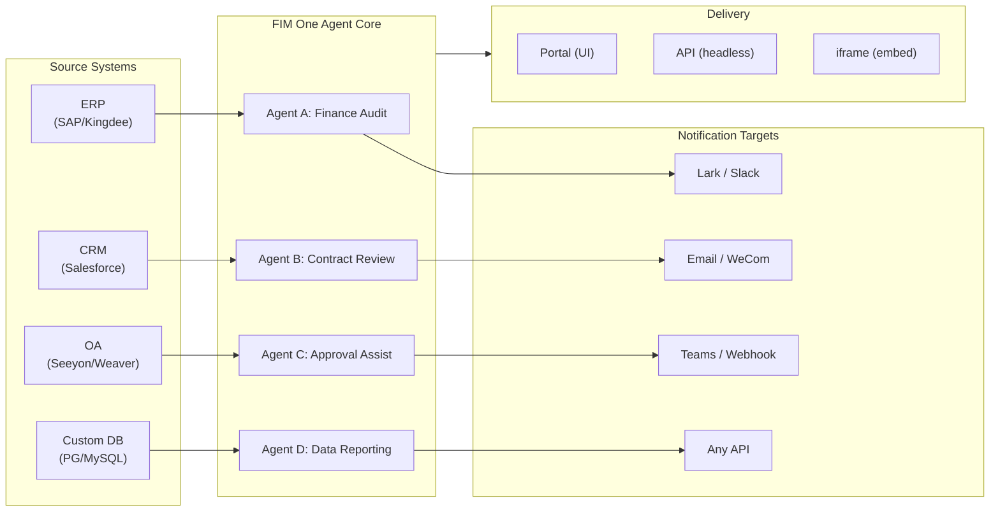

> Ziel: Eine **All-in-One-Agent-Plattform für Global × China-Unternehmen** aufzubauen — bereitgestellt in drei progressiven Modi: Standalone (Portal-Assistent), Copilot (eingebettet in das Host-System), Hub (zentrale systemübergreifende Orchestrierung).
>
> Prinzipien: **Provider-agnostisch** (kein Vendor-Lock-in), **minimale Abstraktion**, **Protocol-first**, **Connector-first** (Integration ist der Kernwert).

## Produktvision

FIM One ist eine **All-in-One-Agent-Plattform**, die drei progressive Bereitstellungsmodi unterstützt:

```
Standalone   → Your own AI assistant (Portal)
Copilot      → AI embedded in a host system (iframe / widget / embed)
Hub          → Central cross-system orchestration (Portal / API)
```

**Systemübergreifende Orchestrierung ist das zentrale Differenzierungsmerkmal.** Enterprise-Kunden verfügen über Legacy-Systeme — ERP, CRM, OA, Finanzen, HR — die über AI miteinander kommunizieren müssen:



**GTM-Strategie: Land and Expand**

| Schritt | Modus | Was passiert |
|------|------|-------------|
| Land | Copilot | In ein System einbetten, Mehrwert innerhalb der eigenen UI nachweisen |
| Expand | Copilot → Hub | Auf weitere Systeme ausrollen; Hub-Modus bündelt diese |

## Bekannte Probleme

Nachverfolgte Fehler, die in der Produktionsumgebung reproduzierbar, aber noch nicht behoben sind. Jeder Eintrag benennt das Symptom, den vermuteten Bereich und ggf. einen Workaround. Einträge werden in einen Versionsabschnitt verschoben, sobald eine Behebung geplant und terminiert ist.

- **Das Stoppen und Wiederholen im Playground zeigt vorübergehende visuelle Artefakte, die sich durch ein Neuladen der Seite stets beheben lassen.** Drei gleichzeitige Render-Quellen — `activeConversation.messages` (DB-Snapshot), der SSE-`messages`-Stream und der optimistische `pendingQuery`-Platzhalter — werden nicht zu einem einzigen abgeleiteten Zustand zusammengeführt. Dadurch kann es zwischen dem Klick auf „Wiederholen" und dem Eintreffen der zugehörigen Assistenten-Antwort zu folgenden Problemen kommen: (a) Die gleiche Anfrage wird kurzzeitig zweimal im Vor-Stream-Fenster gerendert, (b) frühere verwaiste Nutzer-Bubbles aus dem Wiederholungsverlauf werden ausgeblendet, solange `hasLiveMessages` den Wert `true` hat und bevor der Snapshot neu geladen wird, und (c) es kommt zu einem Flackern im kurzen Zeitfenster zwischen dem SSE-„done"-Ereignis und dem nächsten `selectConversation`-Refresh. **Daten gehen dabei nie verloren** — jede Nutzernachricht (einschließlich abgebrochener Wiederholungen) wird in `conversation.messages` gespeichert, beim nächsten LLM-Aufruf über `normalize_alternating_messages` einbezogen und nach einem Neuladen über `HistoryTurn.orphanUserContents` korrekt dargestellt, das im Render-Fix `48ba08c6` eingeführt wurde. Zum Kontext: Claudes eigene Web-Oberfläche weist eine vergleichbare Fehlerklasse auf — wird eine Antwort mittendrin gestoppt und sofort eine Folgeanfrage gesendet, wird diese manchmal als Geschwister-Bearbeitungszweig der ersten Anfrage verzweigt, anstatt als neuer Turn angehängt zu werden. Es handelt sich also um ein bekanntes, schwieriges Problem bei Designs mit optimistischer UI + SSE + persistiertem Verlauf und nicht um einen FIM-One-spezifischen Fehler. Eine ordentliche Behebung erfordert die Zusammenführung der drei Render-Quellen zu einem einzigen abgeleiteten Zustand; dies wird bis zu einem umfassenderen Refactoring der Playground-Zustandsmaschine zurückgestellt.

## Architekturprogramm — Agent Core {/* dev: dev/dsh-lessons/README.md */}

Geplant, aber noch keiner Version zugeordnet. Die Batches sind abhängigkeitsgeordnet; jeder wird im begleitenden Design in konkrete Aufgaben aufgeteilt.

- [ ] **Governance**: Dokumentation defensiver Muster für Bug-Klassen, Lifecycle-Zustände für Design-Notes, Markdown-Link-Gate.
- [ ] **Session-Ereignisprotokoll**: Jede für das Modell sichtbare Eingabe wird zu einem dauerhaften, geordneten Fakt, aus dem der Modellverlauf abgeleitet wird.
- [ ] **Runtime-Invarianten + schlüsselloser Snapshot-Replay**: Eigentümerbeziehungen in der Produktion prüfen; zusammengestellte Transkripte in CI ohne Schlüssel vergleichen.
- [ ] **Tool-Pipeline-Nahtstellen**: Pre/Execute/Post-Stufen, damit Berechtigungen, Timeouts, Sandbox und Hintergrundarbeit den Agent-Loop verlassen.
- [ ] **Code-Mode-Preset**: Ein Programm kombiniert mehrere Connector-Aufrufe durch dieselbe Pipeline und ersetzt mehrstufige Orchestrierung.
- [ ] **Agent-Presets als deklarierte Capability-Sets**, plus Plan- und Hintergrundstatus als Log-Fakten statt als Seitendateien.
- [ ] **Typisiertes Frontend aus OpenAPI** und generierte Tool-/Env-Kataloge, die manuell gepflegte Kopien ersetzen, die sich mit der Zeit unterscheiden.

## Backlog (Niedrige Priorität) {/* dev: dev/dag-evidence-fidelity.md */}

Zurückgestellte Härtungsmaßnahmen — nicht blockierend; nur aufgreifen, wenn das entsprechende Szenario auftritt.

- [ ] **DAG-Evidenz erhält ein eigenes Kürzungsbudget**, entkoppelt von `DAG_ANALYZER_TRUNCATION`, damit Quellevidenz nicht durch das Zusammenfassungsbudget erneut gekürzt wird, bevor Analyzer/Synthese sie verifizieren.
- [ ] **Strukturbewusste Evidenzkürzung** (Kopf+Ende / Listen & Tabellen beibehalten), damit lange Aufzählungen das Limit überstehen, anstatt ihr Ende stillschweigend zu verlieren.
- [ ] **Den Quelltreue-Leitfaden in den ReAct-Fallback-Syntheseprompt übertragen**, damit Gesamt-/Schweregrad-Fehlkennzeichnungen auch in ReAct erkannt werden, nicht nur in DAG.

## Ausgelieferte Versionen

### v0.1 (2026-02-22) — MVP: ReAct + DAG Planner
- ReActAgent mit Tools (calculator, python_exec, web_search)
- DAG Planner (LLM generiert Abhängigkeitsgraphen)
- Portal UI mit Streaming + KaTeX

### v0.2 (2026-02-24) — Multi-Model + Memory
- Retry / Rate-Limiting / Nutzungsverfolgung
- Native Function Calling (kein reines JSON-Parsing)
- Multi-Model-Unterstützung (schnelles + Haupt-LLM)
- Memory: WindowMemory, SummaryMemory
- FastAPI-Backend mit SSE-Streaming

### v0.3 (2026-02-25) — Web Tools + MCP
- Web-Tools (web_search, web_fetch) via Jina/Tavily/Brave
- Dateioperationen-Tool
- MCP-Client (Standard-Tool-Integration)
- Automatische Tool-Erkennung + Kategorien
- DAG-Visualisierung mit Klick-zum-Scrollen
- Code-Ausführung in Docker (`--network=none`)

### v0.4 (2026-02-25) — Multi-Turn + Agents
- Multi-Turn-Konversationen (DbMemory)
- Tool-Schritt-Faltung UI
- HTTP-Anfrage + Shell-Ausführungs-Tools
- Agent-Verwaltung (erstellen, konfigurieren, veröffentlichen)
- JWT-Authentifizierung
- Agenten-spezifischer Ausführungsmodus + Temperatursteuerung

### v0.5 (2026-02-28) — Full RAG + Grounded Gen
- Vollständige RAG-Pipeline (Einbettung + Vektorspeicher + FTS + RRF + Reranker)
- Grounded Generation (Zitate, Konfidenzwerte)
- Wissensdatenbank-Dokumentenverwaltung (CRUD, Suche, Wiederholung, Schema-Migration)
- ContextGuard + angeheftete Nachrichten (Token-Budget-Manager)
- DbMemory-Persistenz + LLM Compact
- DAG Re-Planning (bis zu 3 Runden)

### v0.6 (2026-03-01) — Connector Platform
- **Connector CRUD**: Erstellen, Lesen, Aktualisieren, Löschen
- **ConnectorToolAdapter**: konvertiert Connector → BaseTool
- **Benutzerspezifische Anmeldedaten**: AES-GCM-Verschlüsselung
- **Confirmation gate**: Genehmigung von Schreiboperationen
- **Audit-Protokollierung**: alle Tool-Aufrufe werden aufgezeichnet
- **Circuit Breaker**: graceful Degradation bei Fehlern
- **Hilfswerkzeuge**: email_send, json_transform, template_render, text_utils
- **Einbettungsoptionen**: Jina, OpenAI, benutzerdefinierte Anbieter

### v0.7 (2026-03-06) — Admin-Plattform + Multi-Tenant
- **Admin-Plattform**: Benutzerverwaltung, Rollen-Umschalter, Passwort-Reset, Konto aktivieren/deaktivieren
- **Nur-Einladungs-Registrierung**: drei Modi (offen/Einladung/deaktiviert) + Einladungscode-CRUD
- **Speicherverwaltung**: benutzerspezifische Festplattennutzung, Löschen, Bereinigung verwaister Dateien
- **Gesprächsmoderation**: Admin-Liste/alle löschen
- **Benutzerweises Erzwingen des Abmeldens**: alle Tokens widerrufen
- **API-Health-Dashboard**: Systemstatistiken, Connector-Metriken
- **Ersteinrichtungs-Assistent**: geführte Admin-Kontoerstellung
- **Persönliches Center**: benutzerspezifische globale Anweisungen, Sprachpräferenz
- **JWT-Authentifizierung**: Token-basierte SSE-Authentifizierung, Gesprächseigentümerschaft
- **Globale MCP-Server**: vom Admin bereitgestellt, in allen Sitzungen geladen
- **Abwärtskompatibilität**: `registration_enabled` → `registration_mode` automatische Migration

### v0.7.x (2026-03-07 bis 2026-03-12) — Stabilität + Verbesserungen
- Einladungscode-Verwaltung
- Benutzerspezifische Kontingente (429-Durchsetzung)
- Strukturiertes Audit-Logging
- Filterung sensibler Wörter
- Admin-Anmeldeverlauf
- Admin-Dateibrowser
- Erweiterte Admin-Ansichten (Felder `model_name`, `tools`, `kb_ids`)
- Docker Compose-Deployment (einzelnes Image, benannte Volumes)
- OAuth-Automatische Erkennung über `window.location`
- Unterstützung für erweitertes Denken / Reasoning (`LLM_REASONING_EFFORT`, `LLM_REASONING_BUDGET_TOKENS`) für OpenAI o-Serie, Gemini 2.5+, Claude
- Admin-seitiges Aktivieren/Deaktivieren einzelner Tools (deaktivierte Tools werden zur Laufzeit aus dem Chat ausgeschlossen)
- MCP-Server-Verwaltung auf die Connectors-Seite verschoben
- Duale Datenbankunterstützung: SQLite (Zero-Config-Standard) + PostgreSQL (Produktion); Docker Compose stellt PostgreSQL automatisch bereit
- Dokumentationsseite zur Modellkonfiguration mit erweitertem Thinking-Setup pro Anbieter
- SSE-Protokoll v2: Echtzeit-Antwort-Streaming mit den Feldern `delta_reasoning`, `usage` sowie aufgeteilten `done`/`suggestions`/`title`/`end`-Events; SQLite-Poolgröße 5 → 20
- AI Builder-Erweiterung: 7 neue Builder-Tools (`GetSettings`, `TestConnection`, `ImportOpenAPI` für Connectors; `ListConnectors`, `AddConnector`, `RemoveConnector`, `SetModel` für Agenten), `is_builder`-Flag auf Agenten, automatische Aktualisierung des Builder-Prompts, SSRF-Schutz
- SSE v2-Frontend: Streaming-Dot-Pulse-Cursor, DAG-Neuplanungs-Runden-Snapshots als ausklappbare Karten, DAG-Layout von Schrittzuständen entkoppelt
- Dokumentationsseite zum AI Builder-Konzept mit Anleitungen für Connector- und Agent-Builder
- Organisationssystem: vollständiges CRUD mit rollenbasierter Mitgliedschaft (Eigentümer/Admin/Mitglied), Admin-Verwaltungsoberfläche
- Dreistufige Ressourcensichtbarkeit (persönlich/Org/global) für Agenten, Connectors, Wissensdatenbanken, MCP-Server
- Veröffentlichen/Zurückziehen-API für alle Ressourcentypen; Eigentümerdelegation für veröffentlichte Agenten
- Admin-Endpunkt zum Festlegen der Sichtbarkeit (ersetzt Klonen auf Global); einheitlicher `build_visibility_filter()`-Abfrage-Helper
- Datenbank-Connectors (Phase 1–3): direkter SQL-Zugriff auf PG/MySQL/Oracle/SQL Server + chinesische Legacy-DBs; Schema-Introspektion, KI-Annotation, schreibgeschützte Abfrageausführung, verschlüsselte Zugangsdaten, 3 Tools pro Connector (`list_tables`, `describe_table`, `query`)
- **Evaluierungszentrum**: quantitatives Qualitäts-Benchmarking für Agenten — CRUD für Testdatensätze (Prompt + erwartetes Verhalten + Assertions), Evaluierungsläufe (parallele Ausführung + LLM-Bewerter + Ergebnisse pro Fall mit Bestanden/Nicht bestanden/Latenz/Token), Ergebnisanzeige mit automatischem Polling; Migration `r8t0v2x4z567`
- Drei Modellrollen (Allgemein/Schnell/Reasoning) mit umgebungsspezifischer Konfigurationsisolierung pro Stufe; das schnelle Modell erbt nicht mehr die Einstellungen des Hauptmodells
- `StepOutput`-Datenklasse ersetzt einfache String-Schritt-Ergebnisse für strukturierte Daten und Artefakt-Weitergabe
- Tool-Cache für DAG-Ausführung — identische Tool-Aufrufe werden pro Lauf gecacht mit asynchroner Lock-Stampede-Prävention (`DAG_TOOL_CACHE`)
- Schrittweise LLM-Verifikation mit 1 Wiederholungsversuch bei Fehler (`DAG_STEP_VERIFICATION`)
- Auto-Routing: schnelles LLM klassifiziert Anfragen als ReAct oder DAG; `/api/auto`-Endpunkt; Frontend-3-Wege-Modus-Umschalter (`AUTO_ROUTING`)
- [x] ~~**Shadow Market Organisation + Ressourcenabonnements**~~: Integrierte Market-Org (Shadow, kein automatischer Beitritt) ersetzt die Platform-Org; Ressourcen werden über das Marketplace-Browsing entdeckt und explizit abonniert (Pull-Modell); Market API zum Abonnieren geteilter Ressourcen; Veröffentlichung auf dem Market erfordert immer eine Überprüfung; Ressourcenabonnement-Tabelle; org-basiertes Ressourcenteilen ersetzt globale Sichtbarkeit
- [x] ~~**Automatische Agenten-Erkennung und Sub-Agenten-Bindung**~~: `discoverable`-Flag auf Agenten; `sub_agent_ids`-Whitelist; `CallAgentTool` zur Delegation von Aufgaben an Spezialagenten
- [x] ~~**MCP-Server-Zugangsdaten + Benutzerspezifische Überschreibung**~~: Tabelle `mcp_server_credentials`; Endpunkt `PUT /api/mcp-servers/{id}/my-credentials`; `allow_fallback`-Flag für das Fallback-Verhalten bei Zugangsdaten
- [x] ~~**Connector/KB-Umschalter**~~: `POST /api/connectors/{id}/toggle` und `POST /api/knowledge-bases/{id}/toggle` zum Aussetzen/Fortsetzen von Ressourcen
- [x] ~~**Eigenständige KB-Konversationen**~~: Feld `kb_ids` auf Konversationen für direkten KB-Chat ohne Agentenbindung

### v0.8 (2026-03-20) — Connector Declarative Config + Progressive Disclosure
- [x] **Datenbank-Connectors**: direkter SQL-Zugriff (PostgreSQL, MySQL, Oracle) *(ausgeliefert in v0.7.x — Phase 1-3)*
- [x] **RBAC**: benutzer-/rollenbasierte Connector-Zugriffskontrolle *(ausgeliefert in v0.7.x — Org-System + dreistufige Sichtbarkeit)*
- [x] **Connector-Anmeldedaten-Verschlüsselung + benutzerspezifische Überschreibung**: `connector_credentials`-Tabelle, Fernet-Verschlüsselung über `CREDENTIAL_ENCRYPTION_KEY`, `allow_fallback`-Flag, `GET/PUT/DELETE /my-credentials`-Endpunkte, benutzerspezifische Anmeldedaten-Auflösung beim Laden von Chat-Tools
- [x] **Veröffentlichungs-Review-UI**: Veröffentlichungs-Review-System auf Org-Ebene — Review-Umschalter pro Org, ReviewsSheet mit Genehmigungs-/Ablehnungsworkflow, Statusabzeichen auf Ressourcenkarten, Hinweis im Veröffentlichungsdialog, erneutes Einreichen abgelehnter Ressourcen
- [x] **Connector Progressive Disclosure (Phase 1-2)**: ein einzelnes `ConnectorMetaTool` ersetzt aktionsspezifische Tools; der System-Prompt erhält nur leichtgewichtige **Stubs** (Name + 1-zeilige Beschreibung, ~30 Tokens/Connector statt ~250 Tokens/Aktion); der Agent ruft `discover(connector)` auf, um das vollständige Aktionsschema bei Bedarf zu laden — das Schema wird nur geladen, wenn das Modell einen Connector auswählt, wodurch das Prompt-Präfix für das Caching stabil bleibt. Folgt dem Muster des verzögerten Tool-Ladens, das in modernen Agent-Frameworks verbreitet ist. `execute`-Unterbefehl; Feature-Flag für Abwärtskompatibilität.
- [x] **Agent-Skill-System + kompakte Anweisungen**: Bedarfsgesteuertes Laden von Skills für Agent-Anweisungen — `Skill`-Modell (Name, Inhalt/SOP, optionale Skripte), das an Agents angehängt wird; im System-Prompt nur namentlich referenziert (~10 Tokens/Skill); der Agent ruft `read_skill(name)` auf, um den vollständigen Inhalt bei Bedarf zu laden. Reduziert die Anweisungs-Token-Kosten pro Konversation um ~80 %, ermöglicht dabei reichhaltigere SOP-Bibliotheken. Entspricht der Progressive Disclosure von ConnectorMetaTool, angewendet auf Anweisungsebene. Ermöglicht die Differenzierungsgeschichte „指令 + 工具 + 技能". Fügt außerdem das Feld `compact_instructions` zum Agent-Modell hinzu — eine agentspezifische Komprimierungsprioritätsliste, die in `ContextGuard` beim Komprimieren injiziert wird (z. B. „Bestell-IDs und Beträge beibehalten, rohe API-Antworten verwerfen"), und ersetzt den aktuellen statischen generischen Prompt. Folgt der Compact-Instructions-Konvention, die in modernen Agent-Frameworks weit verbreitet ist.
- [x] **Connector-Import/Export**: Connector-Vorlagen teilen
- [x] **Connector-Fork**: bestehende Connectors klonen und anpassen
- [x] **Workflow Phase 2 Nodes**: Iterator, Loop, VariableAggregator, ParameterExtractor, ListOperation, Transform, DocumentExtractor, QuestionUnderstanding, HumanIntervention — 9 erweiterte Node-Typen mit vollständigem Frontend + Backend + 150 neuen Tests (275 gesamt). Node-Wiederholung mit exponentiellem Backoff, sichere Ausdrucksauswertung. Statistikpanel mit Erfolgsraten-Balken. 12 integrierte Vorlagen. Kontextmenü im Bereich (Einfügen, Alles auswählen, Ansicht anpassen, Auto-Layout).
- [x] **Workflow Phase 3 Nodes: SubWorkflow + ENV** — 2 neue Node-Typen (25 Nodes gesamt), 14 neue Tests (306 gesamt), 14 integrierte Vorlagen. SubWorkflow: vollständig DB-gestützter verschachtelter Workflow-Executor mit Ziel-Workflow-Auswahl, Variablen-Mapping und konfigurierbarem Tiefenlimit zur Vermeidung unendlicher Rekursion. ENV: liest verschlüsselte Umgebungsvariablen mit Key-Picker und Fallback-Standardwerten. Vollständiges Frontend (Node-Komponenten, Konfigurationspanels, Paletteneinträge, Minimap-Farben). Ausführungsstatistikpanel pro Node (Erfolgsraten, Dauern, Fehleranzahl sortiert nach häufigsten Fehlern). `getNodeStats`-API-Client + `NodeStatEntry`-Typ. Tastenkürzel-Dialog (`?`-Taste).
- [x] **Workflow Scheduled Triggers**: Cron-Konfiguration pro Workflow mit Zeitzone, Standardeingaben und Berechnung des nächsten Ausführungszeitpunkts. Voreingestellte Cron-Schaltflächen, 30 Trigger-Tests.
- [x] **Workflow API Triggers**: Öffentliche API-Schlüssel pro Workflow (`wf_`-Präfix) für externe Ausführung ohne Benutzerauthentifizierung, mit Rate-Limiting. API-Schlüssel-Verwaltungsdialog mit Generieren/Regenerieren/Widerrufen, Trigger-URL und cURL/JS-Beispielen.
- [x] **Workflow-Batch-Ausführung**: `POST /batch-run` mit bis zu 100 Eingabesätzen, konfigurierbarer Parallelität (1-10), einklappbaren Ergebnissen pro Element, JSON-Export. 14 Batch-Ausführungstests.
- [x] **Workflow-Ausführungsprotokoll-Viewer**: Echtzeit-chronologischer SSE-Ereignisstrom im Ausführungspanel mit Zeitstempeln, farbcodierten Abzeichen und Ereignistyp-Filterumschaltern.
- [x] **Workflow-Ausführungsstatistiken**: Backend ruft Ausführungsanzahl und Erfolgsraten per GROUP-BY-Unterabfrage gebündelt ab; Frontend zeigt Statistiken auf Workflow-Karten mit farbcodierten Erfolgsratenindikatoren an.
- [x] **Workflow-Scheduler-Daemon**: Asynchroner Hintergrunddienst, der alle 60 Sekunden nach fälligen cron-basierten Workflows sucht. Croniter-Zeitzonenunterstützung, Semaphor-Parallelität, `last_scheduled_at`-Tracking, Webhook-Zustellung. 14 Tests.
- [x] **Workflow-Import-Konfliktlöser**: Erkennt unaufgelöste Agent-/Connector-/KB-/MCP-Referenzen beim Import. Batch-DB-Abfragen mit Sichtbarkeitsfilterung, Frontend-Toast-Warnungen. 17 Tests.
- [x] **Workflow-Test-Node-Ausführung**: Isoliertes Testen einzelner Nodes mit Mock-Variablen, integriert in den Editor (Test-Schaltfläche im Konfigurationspanel + Kontextmenü). 23 Tests.
- [x] **Workflow-Versions-Diff**: Nebeneinander-Blueprint-Vergleich mit Node-/Kanten-Änderungserkennung, farbcodierten Indikatoren (hinzugefügt/entfernt/geändert).
- [x] **Workflow-Ausführungsverwaltung**: Einzelne Ausführungen löschen (`DELETE /runs/{run_id}`) und alle abgeschlossenen Ausführungen löschen (`DELETE /runs`), mit Frontend-Bestätigungsdialogen.
- [x] **Workflow-Ausführungs-Replay-Overlay**: Schaltfläche „Auf Canvas anzeigen" im Ausführungsverlauf, um vergangene Ausführungsergebnisse auf dem Canvas zu überlagern und den Node-Status und die Ausgabe anzuzeigen, ohne erneut auszuführen.
- [x] **Workflow-Favoriten/Anheften**: Workflows mit localStorage-Persistenz an den Listenanfang markieren/anheften.
- [x] **Workflow-Ausführungsverlauf-Export**: Ausführungsverlauf als JSON-Datei-Download mit vollständigen Ausführungsmetadaten und Ergebnissen pro Node exportieren.
- [x] **Admin-Workflow-Verwaltung**: Admin-Panel-Tab zur Verwaltung aller Workflows über Benutzer hinweg — Auflisten, Aktiv/Inaktiv umschalten, Löschen mit Bestätigung. Batch-Endpunkte für Löschen, Umschalten und Veröffentlichen mit Audit-Protokollierung.
- [x] **Workflow-Vorlagensystem**: `WorkflowTemplate`-ORM-Modell mit Admin-CRUD, öffentlicher Auflistungs-/Klon-API und 5 Seed-Vorlagen, die beim ersten Start automatisch eingefügt werden.
- [x] **Workflow-Inline-Validierungsabzeichen**: Echtzeit-`ValidationBadge` pro Node auf dem Canvas mit Fehler-/Warnungs-Tooltips für sofortiges visuelles Feedback beim Bearbeiten.
- [x] **Workflow-Ausführungs-Trace-Viewer**: Zeitachsenbasierter Trace-Viewer-Sheet mit `trace_level`-Parameter der Engine und Variablen-Snapshots pro Node für schrittweises Debugging.
- [x] **Workflow-Rate-Limiting und Timeout**: Benutzerspezifischer `WorkflowRateLimiter` (gleitendes Fenster: 10 Ausführungen/Min., 3 gleichzeitig) und standardmäßiges globales Ausführungs-Timeout von 10 Minuten.
- [x] **Workflow-Blueprint-System**: Visueller Workflow-Editor zum Entwerfen und Ausführen mehrstufiger Automatisierungs-Blueprints — `Workflow`-/`WorkflowRun`-ORM-Modelle, vollständiges CRUD + SSE-Ausführungs-API, Import/Export, Duplizieren, Blueprint-Validierungsendpunkt, `WorkflowEngine` mit topologischer Sortierung + Semaphor-basierter Parallelität + Bedingungsverzweigung und 12 Node-Typen (Start, End, LLM, ConditionBranch, QuestionClassifier, Agent, KnowledgeRetrieval, Connector, HTTPRequest, VariableAssign, TemplateTransform, CodeExecution), `VariableStore` mit `{{node_id.output}}`-Interpolation und `env.*`-Namespace, Fehlerstrategien pro Node (STOP_WORKFLOW / CONTINUE / FAIL_BRANCH) mit Node-Timeout und erweiterter Konfigurations-UI, React Flow v12 visueller Editor mit Drag-and-Drop-Palette + Node-Konfigurationspanel + Variablen-Picker-Combobox + Node-auf-Kante-hinzufügen + Auto-Layout (ELK.js) + Ausführungsverlauf-Sheet, Dify-artiges kompaktes Node-Design mit ringbasiertem Ausführungsstatus-Styling und animierten Kantenübergängen, 4 integrierte Starter-Vorlagen (Simple LLM Chain, Conditional Router, Knowledge-Augmented QA, HTTP API Pipeline) mit Vorlagenauswahldialog und `GET /templates`- + `POST /from-template`-API, Statistikendpunkt, `?run=true`-URL-Parameter Auto-Öffnen, Subprocess-basierte Code-Ausführungssicherheit, 105-Test-Suite (Vorlagen, Eval-Namespace-Abflachung, Blueprint-Validierungswarnungen, Node-/Kanten-Löschung, Import/Export/Duplizieren, Deadlock-Erkennung, Multi-Bedingungs-Verzweigung)
- [x] **Betriebsaudit**: detaillierte Protokollierung, wer was getan hat — Admin-Review-Protokoll-Audit-Tab hinzugefügt (Veröffentlichungs-Review-Verlauf pro Org/Ressource)
- [x] **Semantische Schema-Annotationen**: Connector-Schemafelder um `semantic_tag`, `description` und `pii`-Flags erweitern; Annotationen werden in LLM-Tool-Beschreibungen angezeigt, damit der Agent die Feldabsicht versteht, ohne sie aus Spaltennamen ableiten zu müssen

### v0.8.1 (2026-03-29) — Progressive Disclosure Maturity + ReAct Hardening
- Progressive Disclosure für DB-Konnektoren (`DatabaseMetaTool`), MCP-Server (`MCPServerMetaTool`) und bedarfsgesteuertes Tool-Laden (`request_tools` Meta-Tool)
- DAG-Qualitätsverbesserung (5 Verbesserungen: Modell-Upgrade, automatische Skill-Erkennung, Zitierprüfer, strukturierte Inhaltsbewahrung, domänenbasiertes Routing)
- Domänenmodell-Eskalation in ReAct (Spezialdomänen eskalieren automatisch zum Reasoning-Modell)
- Pro-Modell-Umschalter für natives Function Calling (`tool_choice_enabled`)
- ReAct-Zykluserkennung (deterministische Verhinderung doppelter Tool-Aufrufe)
- ReAct-Abschluss-Checkliste (Vorprüfung vor der Antwort, wenn Tools verwendet wurden)
- Resource Fork Phase 1 (MCP-Server + Skill-Fork-Endpunkte mit Herkunftsverfolgung)
- Workflow-Verbindungsabhängigkeit Auto-Subscribe (rekursive Abhängigkeitsauflösung für Sub-Workflows)
- Vorgefertigte Solution-Templates (8 vertikale Lösungen beim ersten Registrierungsvorgang in den Market eingespeist)
- Verbesserungen bei Admin-Benachrichtigungen (zeitzonenbewusst, Master-Schalter, SMTP Reply-To)
- Token-Budget-Schutzschalter pro Gesprächsrunde (`REACT_MAX_TURN_TOKENS`)
- Zentralisierte Tool-Kürzung, dynamisches System-Prompt-Budgeting
- Dateianhang-Download, Behebung doppelter Nachrichtenübermittlung

### v0.8.2 (2026-04-10) — Agent Core Hardening + Vision Documents
- **Agent Core Phase 0** — Compact-Prompt auf 9-Abschnitte strukturiertes Format aufgewertet; Schutz vor leeren Tool-Ergebnissen (beschreibende Meldung statt `(no output)`); Anti-Loop-Prompt + Zyklus-Erkennungsschwelle auf 2 gesenkt; Domain-Klassifikator + Pre-Flight-DB-Konfigurationsauflösung parallelisiert (400–1100 ms pro Anfrage eingespart); SSE-`end`-Event wird unmittelbar nach der Antwort gesendet, Titel/Vorschläge in Hintergrundaufgaben verschoben
- **Agent Core Phase 1 (Context Anti-Bloat)** — `MicroCompact` regelbasierte Bereinigung alter Tool-Ergebnisse (letzte 6 behalten); `REACT_TOOL_RESULT_BUDGET=40000` aggregiertes Limit; reaktives Compact bei Context-Überlauf (automatisches Compact auf 50 % Budget und Wiederholung statt Absturz)
- **Agent Core Phase 2 (Geschwindigkeit)** — Schlüsselwortbasierte Tool-Vorauswahl (überspringt LLM-Aufruf bei eindeutigen Treffern, 200–500 ms eingespart); `SharedHttpClient` LLM-Verbindungs-Pooling; Abschluss-Check bei Antworten >200 Tokens übersprungen; `FallbackLLM` kapselt Primary+Fast mit automatischem Failover bei 429/503/529/Verbindungsfehlern
- **Intelligente Dokumentenverarbeitung (Vision-fähig)** — Adaptives Dokumenten-Handling: PDF-Seiten werden via PyMuPDF als Bilder für Vision-fähige Modelle gerendert (GPT-4o, Claude 3/4, Gemini), Text-only-Fallback via pdfplumber. Pro-Modell-Flag `supports_vision`. Modi über `DOCUMENT_PROCESSING_MODE`, `DOCUMENT_VISION_DPI`, `DOCUMENT_VISION_MAX_PAGES`. DOCX/PPTX eingebettete Bildextraktion. Multi-Turn-Vision-Persistenz über Gesprächsrunden hinweg. Intelligente PDF-Verarbeitung (textreiche Seiten extrahieren Text + Bilder; gescannte Seiten werden als ganzseitiges PNG gerendert). Vorgefertigtes Sandbox-Image (`Dockerfile.sandbox`) mit gängigen Data-Science-Paketen für `--network=none`-Codeausführung
- **Resource Fork Vervollständigung** — Agent-/Connector-/Workflow-Fork-Endpunkte hinzugefügt, womit das fünfteilige Abstammungs-Tracking abgeschlossen ist (KB-Fork entfernt — inhärent benutzerspezifisch)
- **Dateiintegritäts-Schutzregel** — Systemprompt-Regel verhindert, dass der Agent bei unlesbaren Zieldateien unzusammenhängende Dateiinhalte einsetzt; hochgeladene Dateien enthalten nun `file_id` im Nachrichtenkontext für direkten `read_uploaded_file`-Zugriff

### v0.8.3 (2026-04-16) — Universelle Dokumentenkonvertierung + Agent Core Phase 3
- **Universelle Dokumentenkonvertierung (`convert_to_markdown` + OCR)** — Integriertes Agent-Tool, das Microsoft MarkItDown kapselt; konvertiert PDF, Word, Excel, PowerPoint, HTML, JSON, CSV, XML, ZIP, EPUB, Outlook .msg, Bilder, Audio und YouTube-URLs nach Markdown. `LiteLLMOpenAIShim` ermöglicht OCR über jeden visionsfähigen LLM (Claude, Gemini, Bedrock, Azure). Visionsbewusste RAG-Ingestion mit regressionssicherem Nur-Text-Fallback. `LLM_SUPPORTS_VISION`-Umgebungsvariable zum Deaktivieren
- **Agent Core Phase 3 (Laufzeit-Invarianten-Härtung)** — Konversationswiederherstellung (automatische Reparatur hängender `tool_use`-Einträge); strukturierte kompakte Arbeitskarte (`WorkCard` typisiertes Zusammenführen über Kompaktierungsrunden); Turn-Level-Profiler (`REACT_TURN_PROFILE_ENABLED`); benutzerspezifische Ratenbegrenzung (`LLM_RATE_LIMIT_PER_USER`); leere Assistant-Nachrichten mit `tool_calls` werden nicht mehr verworfen

### v0.8.4 (2026-04-17) — Prompt-Cache + Reasoning-Korrektheit
- **System-Prompt-Abschnittsregistry mit Cache-Breakpoints** — Memoized `PromptRegistry` teilt System-Prompts in stabiles Präfix + dynamisches Suffix auf; Cache-fähige Provider (Claude, Bedrock Anthropic, Vertex Claude) erhalten `cache_control: {"type": "ephemeral"}` auf dem Präfix für ~60–80 % Einsparung bei Input-Tokens pro Turn. Nicht-Cache-Provider erhalten eine einzelne zusammengefügte Nachricht (kein Verhaltensunterschied)
- **Prompt-Cache-Observability** — `cache_read_input_tokens` und `cache_creation_input_tokens` werden über `UsageSummary` → `TurnProfiler` → `done_payload.cache`-Feld nachverfolgt. Strukturierte `turn_cache`-Logzeile pro Turn. Dient gleichzeitig als Relay-Cache-Ehrlichkeitsprüfung
- **Conversation-Recovery-MVP** — Synthetische `tool_result`-Zeilen bleiben nach unterbrochenen Turns erhalten; `POST /chat/resume` spielt gecachte SSE-Events ab einem monotonen Cursor ab; Frontend-Hook `useSseResume` stellt die Verbindung automatisch mit exponentiellem Backoff wieder her (300 ms → 1 s → 3 s, max. 3 Versuche) und zeigt einen „Reconnecting…"-Indikator
- **Thinking-Block-Persistenz mit Signatur** — `reasoning_content` + Anthropic-`signature` werden in `metadata_["thinking"]` gespeichert und bei nachfolgenden Turns wiedergegeben; behebt HTTP-400-Signatur-Mismatch bei Claude-4-Multi-Turn-Gesprächen
- **Provider-bewusste Reasoning-Replay-Policy** — Zentralisierte `reasoning_replay_policy()` in `core/prompt/reasoning.py` steuert die Serialisierung pro Provider-Familie: Claude spielt Thinking-Blocks mit Signatur ab; DeepSeek-R1/Qwen-QwQ/Gemini-thinking/o-series verwerfen `reasoning_content` beim Senden (zuvor durchgesickert, was Provider-KV-Caches beschädigte und gegen die API-Dokumentation verstieß)

### v0.8.5 (2026-04-23) — Channel-Integration + Hook-System + Contributor-i18n
- **Feishu-Kanal (Phase-1-Teilmenge)** — Org-bezogene `Channel`-Ressource mit Fernet-verschlüsselten Zugangsdaten; `FeishuChannel` unterstützt interaktives Karten-Senden + Callback (Signaturprüfung + URL-Challenge); Einstellungen → Kanalverwaltungs-UI (Liste, Erstellen/Bearbeiten mit Dirty-State-Schutz, Details mit kopierbarer Callback-URL, Test-Senden); CRUD-API (`/api/channels`) und Event-Callback-Endpunkt (`/api/channels/{id}/callback`). Frühzeitig für den Roadshow am 2026-04-24 ausgeliefert
- **Agent-Hook-System (live in ReAct + DAG-Runtime)** — `PreToolUseHook` / `PostToolUseHook`-Abstraktion in `src/fim_one/core/hooks/`; Agents, die `hooks.class_hooks` in `model_config_json` deklarieren, erhalten Hooks, die pro Chat-Session instanziiert und registriert werden. Erster Verbraucher `FeishuGateHook` sendet eine Genehmigen/Ablehnen-Karte an die verknüpfte Feishu-Gruppe, wenn ein Agent ein `requires_confirmation=True`-Tool aufruft, blockiert die Ausführung und setzt sie basierend auf dem Ergebnis fort oder bricht ab
- **Konfigurierbare Bestätigungsschranke (inline ODER Kanal)** — Jeder Agent erhält einen Genehmigungsbereich mit drei Routing-Modi (Automatisch / Nur inline / Nur Kanal), einer Auswahl des Genehmiger-Umfangs (Initiator / Eigentümer / Beliebige Person in der Org), einer Tool-spezifischen Überschreibung und einer expliziten Genehmigungskanal-Auswahl. Der automatische Modus fällt auf eine inline-Genehmigungskarte zurück, wenn kein Kanal verknüpft ist. `POST /api/confirmations/{id}/respond` teilt einen einzigen Entscheidungserfassungspfad mit dem Feishu-Webhook
- **Agentenbezogene Aufgabenabschluss-Benachrichtigungen** — Lang laufende ReAct- oder DAG-Agents können eine Zusammenfassungskarte an den Kanal der Org senden, wenn eine Aufgabe abgeschlossen ist. Erster Verbraucher des generischen ausgehenden Benachrichtigungsmusters
- **Hook-Approval-Playground** — Das Kanaldetail-Sheet verfügt über eine „Genehmigungsablauf testen"-Aktion, die den vollständigen Produktionspfad durchläuft (echter `ConfirmationRequest`-Eintrag, echter Feishu-Callback, Statusübergänge) — derselbe Codepfad, den ein Produktions-Hook verwendet
- **Contributor-freundlicher i18n-CI-Fallback** — `.github/workflows/i18n-sync.yml` übersetzt EN → ZH/JA/KO/DE/FR auf dem Master nach dem PR-Merge und committet automatisch mit `[skip ci]`; Contributors benötigen `LLM_API_KEY` nicht mehr lokal. Der Pre-Commit-Locale-Bearbeitungsschutz verweigert manuelle Änderungen an generierten Locale-Dateien (`ALLOW_LOCALE_EDIT=1`-Override für legitime Übersetzungskorrekturen). End-to-End über einen Smoke-Test-Push verifiziert
- **Exa-Integrationsdokumentation** — Dedizierter Integrationsbereich mit einer erstklassigen Exa-Seite, die die gesamte Exa-Suchoberfläche abdeckt (neural / fast / deep-reasoning / instant), Filterung, Inhaltsabruf und drei abgestimmte Voreinstellungen
- **Xinchuang (信创) Datenbankunterstützung** — Der Datenbank-Connector listet nun KingbaseES (人大金仓), HighGo (瀚高) und DM8 (达梦) neben PostgreSQL/MySQL auf. PG-kompatible Treiber verwenden `asyncpg` wieder; DM8 verwendet `dmPython`. `scripts/test_xinchuang_dbs.py` überprüft die Live-Konnektivität über die CLI
- **Channels + Hook-System-Architekturdokumentation** — `docs/architecture/hook-system.mdx` erläutert die drei Hook-Punkte und führt durch FeishuGateHook von Anfang bis Ende; bestehende Architekturseiten verlinken sich gegenseitig; README listet Messaging-Kanäle als erstklassige Funktion auf
- **Härtung** — Doppelte Feishu-Callback-Klicks erzeugen eine Ersatzkarte anstatt doppelt zu entscheiden; gleichzeitige Callback-Klicks werden über eine bedingte `UPDATE ... WHERE status='pending'`-Zeilenanzahlprüfung aufgelöst; ausstehende Genehmigungen laufen nach `CHANNEL_CONFIRMATION_TTL_MINUTES` (Standard 24h) über einen Hintergrund-Sweeper automatisch ab; Einstellungen → Kanäle respektiert die Org-Rolle (Mitglieder sehen eine schreibgeschützte UI); der parallele Tool-Call-Aggregator verarbeitet Anbieter, die `index=0` für jedes Delta wiederverwenden; die Sitzungsablauf-Weiterleitung bewahrt den Query-String

### v0.8.6 (2026-05-08) — Stripe Billing + Verbesserungen
- [x] Stripe Billing MVP — Free- und Pro-Tarife; Checkout, Kundenportal, Webhook-Lifecycle; `/settings?tab=billing`; Admin-Plan/Abonnement-CRUD; Kontingentdurchsetzung berücksichtigt den Plan jedes Nutzers
- [x] Admin-gesteuertes Billing-Feature-Flag — `system_settings.billing_enabled` steuert die gesamte Stripe-Pipeline, sodass private Deployments ohne Stripe-Zugangsdaten niemals eine nicht funktionsfähige Zahlungs-UX anzeigen
- [x] Unbegrenztes Kontingent pro Nutzer — leer erbt den globalen Standard, `0` gewährt unbegrenzt; zuvor wurden beide in denselben Zustand zusammengeführt
- [x] Übersetzungs-Glossar als Single Source of Truth — `scripts/translation-glossary.md` konsolidiert sprachspezifische Regeln; Pre-Commit verweigert bedingungslos manuelle Änderungen an generierten Locale-Dateien
- [x] Lizenz und anwendbares Recht auf FIM Labs Pte. Ltd. (Singapur) migriert; SIAC-Schiedsverfahren auf Englisch; neue `NOTICE`-Datei auf oberster Ebene
- [x] Playground-Folgevorschläge wiederhergestellt, opt-in pro Agent
- [x] Stabilitätskorrekturen — strikte Abwechslung im Provider-Verlauf, Erkennung paralleler Tool-Call-Grenzen, Bestätigungsablauf für ungebundene Agents, Kanal-Rollen-Gating, Unterdrückung von Wiederholungs-Duplikaten, keine Umformulierung nach Ablehnung

### v0.8.7 (2026-06-10) — Sicherheitshärtung + Guardrails v0 + Abrechnungskorrektheit
- [x] JWT-Token-Typ-Einschränkung — schließt eine 2FA-Umgehung, bei der jedes gleichartig signierte Token (temp/refresh/ticket) API- und SSE-Endpunkte authentifizieren konnte
- [x] OAuth-Härtung — automatische E-Mail-Verknüpfung erfordert eine vom Anbieter verifizierte E-Mail (Behebung von Account-Übernahmen); OAuth-Refresh-Tokens werden gehasht gespeichert, damit die Sitzungsrotation funktioniert
- [x] Content-Guardrails v0 — Eingabe-/Ausgabe-Tripwire-Schicht (`core/agent/guardrail`); enthält Jailbreak-Detektor + maximale Ausgabelängen-Guardrail, per Umgebungsvariable konfigurierbar
- [x] `file_ops.apply_patch` — V4A-Diff-Patches mit unscharfem Whitespace-Abgleich, ergänzt `find_replace`
- [x] Abrechnungszykluskorrektur — Kontingent wird am Jahrestag des Abonnements zurückgesetzt (nicht zum Kalendermonat); Verlängerungen rücken den Zeitraum per autoritativer Stripe-Abfrage vor; Nutzungsanzeige am Durchsetzungsfenster ausgerichtet
- [x] Zuverlässigkeitskorrekturen — Pseudo-Protokoll-Tool-Call-Leck aus Antworten entfernt; einstellbares HTTP-Keep-Alive beendet `APIConnectionError`-Häufungen; API-Key-Nutzungsstatistiken werden auch bei Nur-Lese-Anfragen gespeichert
- [x] Visuelles Überarbeitung des Abrechnungs-Tabs — volle Breite, konsistent mit anderen Einstellungs-Tabs

### v0.8.8 (2026-06-22) — SSRF-Härtung + Zuverlässigkeits- & Reasoning-Fixes
- [x] SSRF-Härtung — Blocklist entpackt IPv4-mapped IPv6 (`::ffff:` Instance-Metadata-Bypass); MCP SSE/Streamable-HTTP-Server-URLs werden bei Erstellung und Verbindung auf SSRF geprüft
- [x] LLM-Zuverlässigkeit — gemeinsamer HTTP-Pool heilt sich selbst nach einer LiteLLM-Client-Cache-Eviction, die ihn schließt; Chat sendet Stream sofort (Verlauf wird im Hintergrund zusammengeführt, kein vollständiges Neuladen)
- [x] Anthropic Adaptive-Thinking-Protokoll für Opus 4.6+/Sonnet 4.6/Fable 5 — Extended Thinking funktioniert dort, wo der alte Fixed-Budget-Parameter bei 4.7/4.8 einen 400-Fehler liefert; warnt bei OpenAI-Proxy-Fehlweiterleitung
- [x] Reasoning-Details werden Ende-zu-Ende bewahrt — echte finale Antwort wird wortgetreu gestreamt; übersteht Komprimierung, Kontext-Rebuilds und Sub-Agent-Schritte (kein verlustbehaftetes Re-Synthesizing)
- [x] `PreToolUse`-Enforcement-Hooks schlagen bei Fehler geschlossen fehl — ein abstürzender Approval-Gate erlaubt den Aufruf nicht mehr stillschweigend; Nicht-Enforcement-Hooks behalten Fail-Open über `fail_open`
- [x] Force-Logout-Zeitstempelvergleich auf UTC normalisiert durch Konvertierung + Docker Compose `POSTGRES_*`-Credential-Override (kein ausgelieferter `fim:fim`-Standard)

### v0.8.9 (2026-07-08) — Modul-Verschlankung + Sharing-Konsolidierung + Approval-Härtung
- [x] Skills & Workflows hinter Admin-Modul-Flags weich ausgeblendet (standardmäßig deaktiviert) — nur Core-Boot; nichts gelöscht, über Admin → Einstellungen → Module reversibel
- [x] Sharing konsolidiert — KB-Sharing entfernt (KBs erreichen andere nur über geteilte Agents), DB-Connectors nicht teilbar + rohes SQL nur für Eigentümer, Workflow-Builder auf 9 reine Referenz-Nodes reduziert
- [x] Feishu Approval-Härtung — Kartenklicks erzwingen Genehmiger-Identität, Callback-Signaturen schlagen geschlossen fehl + verschlüsselte Envelopes werden entschlüsselt, Approvals werden nie an einen unbeabsichtigten Chat weitergeleitet
- [x] Zugriffsprüfung zur Nutzungszeit — geteilte MCP-Server und gebundene KBs werden pro Ausführung neu verifiziert; das Verlassen einer Organisation widerruft Abonnements und gespeicherte Anmeldedaten sofort
- [x] Agent-Loop-Härtung — Plan-Board, Hintergrundwerkzeuge, inkrementelles DAG-Replan + Checkpoint-Wiederaufnahme, Komprimierung behält Tool-Paarung, Kürzungsfortsetzung, 529/504-Wiederholung
- [x] `run_workflow` Agent-Tool + Workflow-Korrektheit — Agent-Node führt den vollständigen Agent aus, Bestätigungsgates schlagen geschlossen fehl, Connector-Aufrufe werden zugriffsgeprüft und auditprotokolliert
- [x] Kontolöschung vereinheitlicht — Admin- und Self-Service-Pfad laufen durch eine einzige Bereinigungsroutine, die jeden Datensatz und jede Datei auf dem Datenträger abdeckt; Org-Eigentümer müssen zuerst die Eigentümerschaft übertragen
- [x] Eigentümer-Credential-Fallback jetzt opt-in (Breaking Change) — Connectors/MCP-Server haben `allow_fallback` standardmäßig deaktiviert, bestehende Zeilen wurden umgestellt; Ressourcen ohne Fallback, für die keine Anmeldedaten vorliegen, werden aus dem Toolset ausgeblendet
- [x] Webhook/Cron-Workflow-Ausführungen werden gegen das Token-Kontingent des Eigentümers verrechnet — der nicht verrechnete Free-LLM-Trigger-Pfad ist geschlossen
- [x] Ressourcenbindung auf Sichtbarkeit vereinheitlicht — abonnierte Connectors/KBs/MCP-Server können an Agents gebunden werden; Workflow-Connector-Schritte erzwingen den Zugriff des Ausführenden
- [x] Konversations-Workspace in den Chat integriert — `workspace://`-Auslagerung überdimensionierter Tool-Ergebnisse, Budget-Kürzungsrettung, Pre-Compaction-Transkript-Snapshots

### v0.8.10 (2026-08-28) — Gestreamte Antworten + Rich Rendering + GPT-5 Responses + Zugriffsmodell
- [x] Endantworten werden nativ über einen `finish`-Handoff gestreamt; gestreamtes Markdown wird blockweise gerendert, stabil und ohne Flackern
- [x] Antworten rendern Mermaid-Diagramme, SVG-Grafiken und kartenförmige Vergleichstabellen, mit Kopier-/Exportfunktion und Dateidownloads für Antworten, Code-Blöcke und Tabellen
- [x] Gerendertes Markdown wird bereinigt (Raw-HTML-Injection geschlossen); Konversationsexporte werden für CJK gesetzt (PDF bettet eine echte Schriftart ein, DOCX deklariert eine ostasiatische Schriftart)
- [x] Reasoning wird auf einzeilige Vorschauen eingeklappt; laufende Agent-Schritte zeigen generierte einzeilige Titel, die im Konversationsverlauf gespeichert bleiben
- [x] Seitenleiste neu um den Chat-Cluster organisiert; `/clear`-Befehl; Admin-Modelllisten erhalten Checkbox-Mehrfachauswahl mit Shift-Klick-Bereichen und Massenl­öschung
- [x] Eine neu gesendete Nachricht steigt an die Spitze des Transkripts; Listenseiten blenden Karten gestaffelt ein; alle Animationen berücksichtigen Reduce-Motion
- [x] Agents stellen während des Laufs klärende Multiple-Choice-Fragen (ask_user_question) — der Durchlauf pausiert auf einer In-Chat-Karte und wird mit den Antworten fortgesetzt
- [x] Der Composer behält ungesendete Entwürfe pro Konversation, warnt wenn ein Bild ein nur-Text-Modell erreichen würde, und wartet bei Senden auf laufende Uploads
- [x] GPT-5.x verwendet Responses-API-first mit verschlüsseltem Reasoning-Replay über Tool-Runden hinweg (`FIM_GPT5_RESPONSES_MODE` zum Zurückrollen)
- [x] Ein Output-Limit-Schnitt verwirft den gesamten Tool-Call-Batch und fordert einen kleineren Wiederholungsversuch an
- [x] Typisierte DAG-Schritte — reine Transform-/Synthese-Schritte laufen als ein direkter LLM-Aufruf; Ask-First-Ziele werden in einer Runde abgeschlossen
- [x] Kontext-Budgets liegen 8 % unterhalb des harten Modell-Limits; Plan-Board-Disziplin (Wiederholungs-/Kein-Plan-Erinnerungen, Verifikation vor Abschluss)
- [x] Approval-Gates bleiben über Delegation hinweg aktiv — `call_agent` und Workflow-AGENT-Knoten führen die eigenen Hooks des Agents aus, anstatt keine
- [x] OAuth-Auto-Verknüpfung erfordert eine verifizierte Adresse auf beiden Seiten; Refresh-Token-Rotation trägt eine eindeutige `jti`, sodass das alte Token sofort ungültig wird
- [x] Feishu-Callback-URL besteht die Verifizierung — unsignierte Pushes authentifizieren sich über Encrypt-Key-Envelope + Verification-Token
- [x] Instanz-Zugriffsmodell für Abrechnung — Keine-Abonnements / Inklusive+Bezahlt / Nur-Bezahlt-Positionen, inklusiver Standardplan nicht löschbar

### v0.8.11 (2026-09-03) — Floating Composer
- [x] Der Chat-Composer ist eine schwebende Pille über dem Nachrichtenstrom — Anhänge, Modus-/Agent-Auswahl und Senden in einer Eingabe; Nachrichten scrollen darunter

### v0.8.12 (2026-09-04) — Gemeinsamer Composer + ENV-Synchronisierung
- [x] KI-Assistenten für KB / Agenten / Connectors verwenden denselben schwebenden Composer wie der Chat; Enter während der IME-Komposition sendet nicht mehr
- [x] `scripts/env_from_active_group.py` hält den `.env`-Modell-Fallback mit der aktiven Gruppe im Admin-Panel synchron
- [x] Bildgenerierung funktioniert mit OpenAI-`gpt-image-*`-Modellen

## Geplante Versionen

Neu geplant 2026-07-08: FIM One ist eine Agent-Runtime — ein Kernel (ReAct-Engine, Credentials, Approval Gate, Audit, Multi-Tenant-Orgs) hinter mehreren Bereitstellungsoberflächen: Web UI, API, JS-Embed, MCP-Output. Jede Oberfläche nutzt dieselbe Assembly-Schicht für Auth, Credentials, Approval und Metering: mehr Frontends, nie mehr Logik. Die kurzfristige Ausrichtung liegt auf der Konvergenz im Bereich Data-Q&A (ChatBI) — Szenarien werden verkauft, keine Plattform. {/* dev: dev/replan-2026-07.md */}

### v0.9 — Connector Fences + Szenario-Onboarding

**Ziel**: Die nach der Reduktion zusammengestellten Assets ergeben ein vollständiges Daten-Q&A-Produkt — schreibgeschützte DB-Connectors + Fences + Approval Gate + IM-Einstiegspunkt. Tier-1-Fences verwandeln Sicherheitsschulden in Produktfeatures.

#### DB Connector Fences — Tier 1, drei PRs {/* dev: dev/connector-rbac/00-overview.md */}

- [ ] PII-Spalten-Schwärzung (`ConnectorScopeGuard` PreToolUse hook)
- [ ] Schema-Sichtbarkeit — Tabellen-/Spalten-Zulassungs-/Sperrliste + Verb-Blockierung (Nur-Lese-Durchsetzung)
- [ ] Fence-Auditierbarkeit — `caller_user_id`, `effective_credential_source`, `scope_rules_applied` in `ConnectorCallLog`
- [ ] Konfigurationsübergabe pro Hook (`{"name", "config"}` Schema) — der Träger für ScopeGuard-Regeln {/* dev: dev/hook-system.md */}

#### Kontextrobustheit

- [ ] Segmentierte Kompaktierungseingabe und modellbewusste Budgets im Haupt-Chat-Pfad, damit jede Modellkombination im Kontextfenster bleibt

#### Modell-Schicht

- [ ] Streaming-Nutzungszahlen der Responses-Bridge beim nächsten LiteLLM-Upgrade überprüfen (vermutete fehlerhafte Zuordnung im Upstream)
- [ ] Die LiteLLM-Chat→Responses-Bridge außer Betrieb nehmen, sobald der native GPT-5.x-Pfad ein vollständiges Release durchlaufen hat

#### Szenario-Onboarding

- [ ] Der erste Start beginnt mit einer Szenario-Vorlage (solution_seeds) statt mit einer leeren Workbench
- [ ] Die Docs-Startseite zeigt drei vertikale Szenario-Storys statt einer Modulreferenz
- [ ] Pro abgeschlossenem Engagement wird eine Szenario-Vorlage destilliert — der Wettbewerbsvorteil liegt in Szenario-Assets × Liefergeschwindigkeit

### v0.10 — Two Mouths: JS Embed + IM Inbound {/* dev: dev/im-channels.md */}

**Ziel**: Die zwei meistverkäuflichen Bereitstellungsoberflächen, beide auf demselben Kernel und derselben Assembly-Schicht.

- [ ] JS-Bubble / iframe-Embed — ein Snippet in ein Host-System; Anonymbesucher-Identität + Abrechnungszuordnung vor dem Build festgelegt
- [ ] Feishu Inbound @mention — Agents leben in der Gruppe: Daten abfragen, Freigaben einreichen, Flows nachverfolgen
- [ ] Outbound-Muster: Fehlerbenachrichtigungen, Budget-Warnungen, geplante Digests, Eskalation, Audit-Belege
- [ ] WeCom / DingTalk-Kanäle nach Feishu

### Geparkt — signalgesteuert

Beginnen Sie diese nicht ohne ihren Auslöser (siehe Replan §3): Das MCP-Gateway wartet auf ≥2 unaufgeforderte „Binde meine Tools in meinen Agenten ein"-Anfragen; die Kanalisierung wartet auf einen Implementierer, der nach der Lizenzierung fragt; IdP/OrgSync wartet auf Kundennachfrage; der Rest wartet auf ein abgeschlossenes Engagement, das sie benötigt.

- [ ] MCP-Gateway-Ausgabe — Connector-Discover/Execute als MCP-Tools für nachgelagerte Agenten umgekehrt exponieren
- [ ] Kanalisierung / White-Label-Aktivierung — kommerzieller Lizenzpfad bereits vorhanden
- [ ] Identity-Provider-Modul + Channel-Verschlankung — Feishu SSO, Org-Graph-Sync {/* dev: dev/connector-rbac/07-identity-providers.md */}
- [ ] Connector-Autorisierung Stufe 2 (benutzerspezifische Anmeldedaten erforderlich, Key-Binding-Health) + Stufe 3 (Login-Ticket-Austausch) {/* dev: dev/connector-rbac/00-overview.md */}
- [ ] Public API Phase 2 — schlüsselspezifische Rate-Limits/Kontingente, Versionierung, SDKs, Entwicklerportal {/* dev: dev/public-api-phase2.md */}
- [ ] Observability — Agent Trace Layer (Trace/Span-Modell, Timeline-Viewer, OTel-Export) + Metriken-Dashboard {/* dev: dev/agent-trace-layer.md */}
- [ ] Agent-Workspace-Rest — Übergabenotizen, Datei-Browser-UI, sitzungsübergreifender Abruf, Kompaktierungssegmente (grep-fähige On-Disk-Zusammenfassung, die der Agent zurückliest) {/* dev: dev/agent-workspace.md */}
- [ ] Guardrails v1 — Off-Topic-Filter, PII-Redaktor-Ausgabe-Guardrail, agentspezifische Guardrail-Konfigurations-UI
- [ ] Hook-System-Extras — eingebaute Hooks, `SessionStart` + Benutzer-YAML-Hooks {/* dev: dev/hook-system.md */}
- [ ] Connector-Plattformtiefe — Progressive Disclosure Phase 3–4, YAML/JSON-Connector-Konfiguration, DB-Connectors Phase 4 (Oracle / SQL Server / GBase), MCP-Connection-Pooling
- [ ] Prompt-Cache-Folgemaßnahmen — Gemini-Kontext-Cache-Adapter, agentspezifisches `cache_ttl` {/* dev: dev/prompt-cache-followups.md */}
- [ ] Hot-Mid-Stream-DAG-Resume — SSE-Reconnect hängt sich an einen laufenden Turn an (Cold-Retry-Resume bereits ausgeliefert) {/* dev: dev/archive/incremental-dag.md */}
- [ ] Ökosystem — geplante/ereignisgesteuerte Agenten, Workflow-Trigger-Identity-Observability, workflowspezifische `credential_policy`, DB-Schema-Advanced-Builder, Sandbox-Hardening v2

### Aus dem Pre-Replan-Plan v0.9 ausgeliefert

- [x] ~~Auth & Sicherheit: JWT Token-Typ-Einschränkung + OAuth-Fixes (v0.8.7); PG zeitzonenbewusste Zeitstempel (v0.8.6); Force-Logout UTC + `POSTGRES_*`-Override + SSRF IPv6-Mapped-Fix (v0.8.8); Owner-Fallback Opt-in + vereinheitlichte Sichtbarkeits-Bindung + Webhook/Cron-Messung (v0.8.9)~~
- [x] ~~Provider-Kompatibilität: Anthropic Adaptive Thinking + gemeinsamer LLM-Pool Self-Heal (v0.8.8)~~
- [x] ~~Content-Guardrails v0: Tripwire-Schicht + Jailbreak-Detektor (v0.8.7)~~ {/* dev: dev/archive/openai-agents-insights.md */}
- [x] ~~Hook-System: Grundgerüst + FeishuGateHook + Approval Playground + ReAct/DAG-Laufzeit (v0.8.5); PreToolUse-Durchsetzung Fail-Closed (v0.8.8)~~
- [x] ~~Feishu-Kanal Phase 1 + Aufgabenabschluss-Benachrichtigung (v0.8.5)~~
- [x] ~~`run_workflow` Agent-Tool (v0.8.9); Reasoning-Details Ende-zu-Ende erhalten (v0.8.8); Workspace Tool-Output-Offloading in Chat integriert (v0.8.9)~~
- [x] ~~Agent-Loop-Härtung: Plan-Board, LLM-Aufruf-Resilienz, Hintergrund-Tools, inkrementelles DAG-Replan + Checkpoint-Wiederaufnahme, Kompaktierungs-Tool-Paarung (v0.8.9)~~ {/* dev: dev/archive/incremental-dag.md */}

- [x] ~~Circuit Breaker, Workflow-Ausführungs-Aufbewahrungsbereinigung, Workflow-Versions-Diff-Zusammenfassungen~~ *(v0.8 / v0.8.1)*
- [x] ~~DAG-Qualitätsüberarbeitung, Domain-Modell-Eskalation, Pro-Modell-NFC-Umschalter~~ *(v0.8.1)*
- [x] ~~DatabaseMetaTool, MCPServerMetaTool, On-Demand `request_tools`~~ *(v0.8.1)*
- [x] ~~Workflow-Verbindungs-Dep-Auto-Abonnement, Workflow-echte Ausführer~~ *(v0.8.1)*
- [x] ~~ReAct-Zykluserkennung, Abschluss-Checkliste~~ *(v0.8.1)*
- [x] ~~Vorgefertigte Lösungsvorlagen (8 vertikale Bundles), Ressourcen-Fork (MCP/Skill/Agent/Connector/Workflow)~~ *(v0.8.1)*
- [x] ~~Vision-Dokumentenverarbeitung (PDF / DOCX / PPTX), MarkItDown OCR~~ *(v0.8.2 / v0.8.3)*
- [x] ~~Intelligente Dateiinhalt-Einbettung + `read_uploaded_file`~~ *(v0.8)*
- [x] ~~Agent Core Phase 3: Konversations-Wiederherstellungs-MVP, Kompaktes Work-Card, Turn-Profiler, Benutzerbasiertes Rate-Limiting~~ *(v0.8.3)*
- [x] ~~Konversations-Wiederaufnahme-MVP, System-Prompt-Registry + Cache, Thinking-Block-Persistenz, Reasoning-Replay-Richtlinie, Cache-Observierbarkeit~~ *(v0.8.4)*

### v1.0 — Hot-Plug + Einbettbar

**Ziel**: Connector-Hinzufügung ohne Neustart, Package-Ökosystem und eingebettete Bereitstellung.

- [ ] **Connector Progressive Disclosure (Phase 5)**: **Semantisch geführte Tool-Auswahl** (Entity-Extraktion aus Anfrage → Ontology-Registry-Lookup → Connector-Set-Reduktion; 90%+ Token-Reduktion für Deployments mit 50+ Connectors); Scale-Modus für Batch/ETL-Connectors; CLI-ähnliches universelles `connector <name> <action> <params>`-Interface
- [ ] **Cross-Connector Entity Alignment (Ontology Registry)** — *herabgestuft 2026-04-21: bedarfsgesteuerte individuelle Bereitstellung, keine Kernfunktion*: gemeinsame Entity-Typen (Customer, Order, Asset) mit Feldzuordnungen über Connectors hinweg definieren; DAGPlanner löst Cross-System-JOIN-Schlüssel automatisch auf; ermöglicht Connector-übergreifende Abfragen (z. B. „Kunden in Salesforce, die in Shopify bestellt haben") ohne hartcodierte Feldnamen
- [ ] **Hot-Plug-Connectors**: OpenAPI-Spec hochladen, KI generiert Konfiguration, in 5 Minuten live (kein Neustart)
- [x] ~~**Marketplace-Redesign Phase 1 — Lösungen + Komponenten**~~: Zweistufiges Marktmodell (Lösungen: Agent/Skill/Workflow; Komponenten: Connector/MCP Server); Bereichsauswahl (Globaler Markt / Org); einheitliches Abonnementmodell (automatisches Erscheinen der Org entfernt); KB aus dem Marktumfang entfernt; Datenmigration füllt Abonnements für bestehende Org-Mitglieder nach
- [ ] **Market Package System**: Verteilbare Ressourcenpakete für den Marketplace — ersetzt typspezifische „Marketplaces" durch eine einheitliche Packaging-Schicht. Das `fim-package.yaml`-Manifest deklariert: Metadaten (Name, Version, Beschreibung, Autor, Lizenz, Tags, `min_fim_version`), Einstiegspunkt (primärer Skill oder Agent), Ressourcenliste (Agents, Skills, Connectors, KBs, MCP-Server, Workflows) mit Konfigurationsreferenzen, paketübergreifende Abhängigkeiten (Semver-Bereiche), erforderliche Credentials (auf Connector-Refs für die Sammlung zur Installationszeit gemappt) und benutzerkonfigurierbare Variablen mit Standardwerten. **Zwei Nutzungsmodi**: (1) **install** — Batch-Erstellung aller Ressourcen + automatische Verdrahtung interner Referenzen via ID-Substitution; Installation mit Quelle verknüpft für Versionsaktualisierungsbenachrichtigungen; `POST /api/market/packages/{id}/install`; (2) **fork** — Klonen als benutzereigene bearbeitbare Kopien ohne Aktualisierungsverknüpfung (dies IST der Template-Modus); `POST /api/market/packages/{id}/fork`. Weitere Endpunkte: Veröffentlichen (`POST /api/market/packages` mit Review-Workflow), Deinstallieren (`DELETE /packages/{id}/uninstall` mit Abhängigkeitsprüfung + Bestätigung geänderter Ressourcen), Versionsverlauf (`GET /packages/{id}/versions`), Upgrade (`POST /packages/{id}/upgrade` mit ressourcenweiser Diff-Vorschau). Abhängigkeitsauflöser für verschachtelte Paketanforderungen mit Konflikterkennung. Die `PackageInstallation`-Tabelle verfolgt installierte Pakete pro Benutzer mit Ressourcen-ID-Zuordnung für Deinstallation/Upgrade. **Koexistiert mit der Veröffentlichung einzelner Ressourcen** — Package ist eine Kompositionsschicht, kein Ersatz; ein einzelner Connector kann weiterhin eigenständig veröffentlicht werden. Beispiel-Abhängigkeitsbaum: `Package: contract-review` → `Skill: contract-review` (Einstiegspunkt) → `Agent: contract-analyst` + `Agent: risk-scorer` → `KB: legal-clauses` + `Connector: docusign-api` + `MCP: pdf-extractor` + `Workflow: contract-approval-flow`
- [ ] **Creator-Programm**: Monetarisierungsschicht für den Marketplace — Creator-Profile mit Portfolio-Seiten, paketbezogene Analysen (Installationen, Forks, aktive Nutzer, Bewertungen/Rezensionen), Affiliate-Provisionsverfolgung, wenn Pakete neue Abonnements generieren. Bezahlte Paketstufe mit Preisgestaltung, Kaufablauf und Genehmigungsworkflow. Creator-Dashboard mit Installationstrends, Umsatzberichten und Nutzerfeedback. Öffentliche Creator-API für programmatische Paketveröffentlichung (CI/CD für Paketautoren). Community-Funktionen: Paketkommentare, Q&A, Changelogs pro Version
- [ ] **Einbettbares Widget**: `<script src="fim-one.js">` in die Host-Seite injiziert
- [ ] **Seitenkontext-Injektion**: Widget liest den Host-Seitenkontext (aktuelle ID, URL, DOM-Selektoren)
- [ ] **Erweiterte Trigger**: Eingehende Webhook-Ereignisse; Verbesserungen für geplante Jobs (Multi-Zeitzone, kalenderbasiert)
- [ ] **Batch-Ausführung**: Verarbeitung von 1000+ Elementen via DAG
- [ ] **Enterprise-Sicherheit**: IP-Whitelisting, Verschlüsselung im Ruhezustand, SSO
- [ ] **KB Advanced Editor**: Agent im Builder-Modus für Power-User, die große Wissensdatenbanken verwalten — Massen-URL-Ingestion, Duplikaterkennung, Lückenanalyse, Dokument-Lifecycle-Management; erweitert den bestehenden KB-KI-Chat mit ReAct-Tool-Loop
- [ ] Abrechnungszugriffsmodell — Instanz wählt keine Abonnements / inklusive+bezahlt / nur-bezahlt, damit Self-Hosting, SaaS und sofortige Abrechnung getrennt bleiben {/* dev: dev/billing-access-model.md */}
- [ ] **Stripe Billing (v1 MVP — Pro-Abonnement)**: Kostenloses + Pro-Zweistufenabonnement mit monatlichem Token-Kontingent. Stripe Checkout (gehostet) + Customer Portal (Self-Service) + webhook-gesteuerter Lifecycle (`checkout.session.completed` / `customer.subscription.updated|deleted` / `invoice.payment_succeeded|failed`). Soft-Cap bei Kontingenterschöpfung (HTTP 402 + Upgrade-Hinweis) — keine Überschreitungsgebühren in v1. Nur Abrechnung pro Benutzer; Org/Team-Abonnements auf v3 verschoben. Voraussetzungen:
  - [x] ~~**Datenmodell + SDK-Grundlagen** (P1) — `billing_plans` / `subscriptions` / `stripe_webhook_events`-Tabellen, ORM-Modelle, Stripe-SDK-Singleton, Free + Pro Seeds~~ *(ausgeliefert in v0.8.6)*
  - [x] ~~**Backend-API + Webhook-Handler** (P2) — `/api/billing/*` + `/api/webhooks/stripe` mit Signaturverifizierung + Idempotenz; planbewusstes Kontingent; stündlicher Lifecycle-Sweep~~ *(ausgeliefert in v0.8.6)*
  - [x] ~~**Frontend-Abrechnungs-Tab + 402-Upgrade-Dialog** (P3) — `/settings?tab=billing` Kontingentanzeige, Upgrade-CTA, `past_due`-Banner, Mid-Stream-402-Dialog~~ *(ausgeliefert in v0.8.6)*
  - [x] ~~**Admin-Planverwaltung** (P4) — `admin/billing/{plans,subscriptions}` CRUD~~ *(ausgeliefert in v0.8.6)*
  - [x] ~~**Admin-gesteuertes Abrechnungs-Feature-Flag** (P5) — `system_settings.billing_enabled` steuert die Stripe-Pipeline; idempotente Aktivierung befüllt Free+Pro, setzt Standard-Plan-Zeiger, füllt Benutzer nach; Ein-/Ausschalten ist nach Aktivierung ein reines Flag-Umschalten~~ *(ausgeliefert in v0.8.6)*
  - [ ] **Abstimmung + E2E + Go-Live** (P6) — nächtliches `subscriptions` ↔ `stripe.Subscription.list()`-Abstimmungsskript zur Wiederherstellung verpasster Webhooks; vollständige Happy-Path-/Kündigung-in-der-Mitte-/Zahlungsverzug-Regressionstests; Wechsel von Test-Modus `stripe_price_id` zu einer Live-`price_id`; Smoke-Test auf Staging mit einer echten Karte.

- [ ] **Team-Plan (Stripe-Seats)** — Sitzplatzbasierte Preisgestaltung via `stripe.Subscription.quantity`, integriert mit der Organisationsmitgliedschaft. Ermöglicht Unternehmen, einen teamweiten Plan mit N Seats zu abonnieren; Kontingent und Feature-Flags werden über die Seat-Gruppe statt über den einzelnen Benutzer aufgelöst. Baut auf dem v1.0 Stripe MVP und dem bestehenden Organisationsmodell auf.
- [ ] **Gruppen-Token-Kontingent für Deployments ohne Abrechnung** — Enterprise-/Private-Deployments ohne Stripe konfigurieren Token-Budgets auf Organisationsebene. Die Kontingentkette erweitert sich auf `override > group > plan > default`; die Gruppenauflösung verwendet `max(user_quota, group_quota)`, sodass individuelle VIPs nicht durch das Team-Cap eingeschränkt werden. Wird zusammen mit dem Team-Plan eingeführt, damit dieselben Grundbausteine sowohl abgerechneten als auch selbst gehosteten Topologien dienen.

**Auswirkung**: Unternehmen deployen FIM One von null bis zur Multi-System-Orchestrierung in Tagen. Das Package-System schafft ein Creator-Ökosystem — Lösungsautoren veröffentlichen zusammengesetzte Bundles (Skill + Agents + Connectors + KBs + Workflows), Unternehmen installieren mit einem Klick, Creators verdienen durch Adoption. Die Install/Fork-Dualität deckt sowohl „so verwenden wie es ist" als auch „aus Vorlage anpassen" in einem einzigen Mechanismus ab.

## Eingefrorene Funktionen (Ausgeliefert, nur Wartung)

Gemäß der [Orthogonalitätsstrategie](/strategy/orthogonality-strategy) sind diese Funktionen ausgeliefert und funktionsfähig, erhalten jedoch keine neuen Funktionen mehr (nur noch Fehlerbehebungen):

| Funktion | Version | Grund für Einfrierung |
|---------|---------|-----------|
| ReAct Agent | v0.1, v0.9 | Modelle verfügen jetzt über natives Tool-Calling. Mid-Loop-Selbstreflexion (v0.9) verhindert Zieldrift in langen Ketten. Qualität der Tool-Beobachtungssynthese verbessert (8K Zeichen, konfigurierbar über `REACT_TOOL_OBS_TRUNCATION`) |
| DAG-Planung / Neuplanung | v0.1, v0.5, v0.7.5 | Reasoning-Fähigkeiten der Modelle verbessern sich; Dekomposition wird zum Single-Shot-Verfahren. Schrittweise Verifikation in v0.7.5 ausgeliefert (`DAG_STEP_VERIFICATION`). Gehärtet: Kaskadenfehler-Propagation, Verifier-Status-Fix, Planer-Tool-Beschreibungen, vollständige Neuplanungshistorie, Whitelist-basierter Tool-Cache. 14 Engine-Konstanten als ENV-Variablen exponiert — keine weiteren Planungsprimitive geplant |
| Memory (Window, Summary, Compact) | v0.2, v0.5 | Kontextfenster wachsen (200K+); geringerer Bedarf an externem Speichermanagement |
| RAG-Pipeline | v0.5 | Anbieter bauen Retrieval nativ ein (OpenAI file_search, Gemini Search Grounding) |
| Grounded Generation | v0.5 | Modelle verbessern sich bei Zitierungen; 5-stufige Pipeline bringt abnehmenden Mehrwert |
| ContextGuard / Pinned Messages | v0.5 | Wird so ausgeliefert; keine neuen Funktionen |

## Erwägen (Auf unbestimmte Zeit zurückgestellt)

Gemäß der Orthogonalitätsstrategie wären diese Punkte mit hohem Aufwand verbunden und unterliegen dem Absorptionsrisiko:

| Feature | Grund für Zurückstellung |
|---------|------------|
| Multi-Agent-Orchestrierung (tiefe Hierarchien) | Anbieter bauen nativ (OpenAI Swarm, Google A2A und ähnliche Multi-Agent-Angebote). FIM Ones CallAgentTool deckt den einstufigen Delegierungsfall ab; ereignisgesteuerte Hintergrundagenten werden durch Scheduled Jobs in v0.9 abgedeckt |
| Selbstmodifizierende Agent-Skills (Prozedurales Gedächtnis) | Agenten, die ihre eigene `skill.md` während der Ausführung aktualisieren — hohe Komplexität, Sicherheits-/Audit-Oberfläche. Hängt davon ab, dass das Agent Skill System (v0.8) zuerst ausgeliefert wird. Neu bewerten, wenn Enterprise-Kunden explizit selbstverbessernde Agenten anfragen |
| ~~Agent Workspace (Tool Output File Offloading)~~ | Auf v0.9 hochgestuft. Der Wert liegt im **selektiven Lesen**, nicht in der Kontextkapazität — durch Framework-übergreifende Validierung bestätigt. Die ursprüngliche Zurückstellungsbegründung („200K+-Fenster reduzieren die Dringlichkeit") war falsch. |
| Sitzungsübergreifendes Langzeitgedächtnis | Kontextfenster wachsen schnell (200K–2M); Anbieter fügen eingebautes Gedächtnis hinzu (OpenAI memory, Gemini context caching); hohe Implementierungskosten gegenüber sinkendem Differenzierungswert. Neu bewerten, wenn Enterprise-Kunden es explizit anfragen |
| Gedächtnis-Lebenszyklus (TTL, Kontingente) | Hängt vom sitzungsübergreifenden Gedächtnis ab; gemeinsam zurückgestellt |
| Aktives Kontextkomprimierungs-Tool (agentausgelöst) | Explizit eingefroren mit ContextGuard (v0.5). Kontextfenster bei 200K+ reduzieren den Wert. Wird nicht erneut aufgegriffen, es sei denn, Kontextkosten werden zu einer wesentlichen Enterprise-Beschwerde |
| Browser-Automatisierung / Computer Use | Hohe Wartungskosten (DOM-Änderungen, Anti-Bot, Sandboxing). Die Branche konvergiert auf den Computer Use-Modus (Anthropic, OpenAI Operator, Google Mariner) und MCP-Browser-Tools (Puppeteer/Playwright MCP). Über MCP-Integration konsumieren, nicht selbst aufbauen. Neu bewerten, wenn ein stabiler Computer Use MCP-Standard entsteht |
| Web-Push-Benachrichtigungen | Browser-natives Push via Service Worker + VAPID. Überschneidet sich mit IM Channel Integration (v0.8), die bevorzugte Enterprise-Kanäle abdeckt (Lark/Slack/WeCom/Email). IM-Push hat höheren Enterprise-Wert; Web Push ist ein Nice-to-have für reine Portal-Nutzer. Neu bewerten, nachdem IM Channel ausgeliefert wurde — falls Nutzer Browser-Benachrichtigungen über die IM-Abdeckung hinaus anfragen |
| Mehrbenutzer-Workflow-kollaboratives Bearbeiten | Echtzeit-Co-Editing desselben Workflow-Blueprints (Figma/Notion-Stil) mit Cursor-Awareness, Konfliktlösung und knotenbasierter Sperre. Hohe Implementierungskosten (CRDT / OT, Präsenz-Infrastruktur), unklare Enterprise-Nachfrage gegenüber dem heutigen Modell „ein Editor gleichzeitig + Versions-Diff". Neu bewerten, wenn mehrere Unternehmen explizit gemeinsames Live-Editing anfragen |
| Knotenspezifische Workflow-Ausführungsberechtigungen (RBAC bei Ausführung) | Feingranulare Autorisierung *innerhalb* einer einzelnen Workflow-Ausführung — z. B. „Knoten X erfordert die Rolle `finance_approver` zur Ausführung". Heute erfolgt die Autorisierung auf Workflow-Ebene (wer auslösen darf) und auf Connector-Ebene (wessen Anmeldedaten ausgeführt werden); knotenspezifisches RBAC fügt eine dritte Achse mit erheblicher Komplexität und ohne aktive Kundenanfrage hinzu |
| Org-übergreifendes Workflow-Sharing mit Live-Updates | Einen Workflow einer anderen Organisation abonnieren und Upstream-Updates erhalten, ohne neu zu forken. Heute bedeutet Abonnieren = Forken (Snapshot), sodass Breaking Changes im Upstream nie propagiert werden. Live-Updates würden upstream-kompatible Schema-Evolution + Konfliktlösung erfordern; hohe Wartungskosten. Neu bewerten, wenn Unternehmen „gemeinsame Workflows über Tochtergesellschaften" anfragen |

## Wie Versionen mit Modi übereinstimmen

| Version | Standalone | Copilot | Hub | Hinweise |
|---------|-----------|---------|-----|-------|
| **v0.1–v0.3** | Funktionsfähig | Noch nicht | Noch nicht | Nur Portal, Einzelbenutzer |
| **v0.4** | Funktionsfähig | Noch nicht | Noch nicht | Mehrere Konversationen, Agent-Verwaltung |
| **v0.5** | Funktionsfähig | Noch nicht | Noch nicht | Wissensdatenbank + RAG |
| **v0.6** | Funktionsfähig | Möglich | Möglich | Connectors verfügbar; Copilot/Hub mit manueller Konfiguration möglich |
| **v0.7** | Funktionsfähig | Bereit | Bereit | Admin-Plattform; Multi-Tenant-Authentifizierung; produktionsbereit |
| **v0.8** | Funktionsfähig | Bereit | Optimiert | RBAC + Audit-Log pro System; einfacheres Onboarding |
| **v0.9** | Funktionsfähig | Bereit | Produktion | Observability, Performance, Härtung |
| **v1.0** | Funktionsfähig | Optimiert | Enterprise | Paketsystem, Creator-Programm, Hot-Plug, einbettbares Widget, Webhooks, Batch |

## Ressourcenallokation (v0.8–v1.0)

Die Orthogonalitätsstrategie bestimmt, wo der Aufwand investiert wird:

| Kategorie | Allokation | Versionen | Begründung |
|----------|-----------|----------|-----|
| **Connector-Plattform** (v0.6+) | 50% | Fortlaufend | Kerndifferenzierung; kein Absorptionsrisiko |
| **Enterprise-Features** (RBAC, Audit, Sicherheit, Observability) | 30% | v0.8–v1.0 | Unspektakulär, aber dauerhaft; Produktionsvoraussetzung. Agent Trace Layer ist kommerzieller Anker |
| **Agent-Intelligenz** (Skill-System, geplante Agents) | 15% | v0.8–v0.9 | 指令+工具+技能 Differenzierungsgeschichte; geringes Absorptionsrisiko — Frameworks validieren Muster, aber Enterprise-SOPs sind kundenspezifisch |
| **v0.1–v0.5 Wartung** | 5% | Fortlaufend | Nur Bugfixes; keine neuen Features |

## Metrikbasierte Meilensteine

Der Erfolg wird gemessen an:

| Metrik | v0.7-Ziel | v0.8-Ziel | v1.0-Ziel |
|--------|------------|------------|------------|
| Eingesetzte Konnektoren | 5 | 20+ | 100+ |
| Enterprise-Kunden | 1–2 | 5–10 | 20+ |
| Durchschn. Konnektor-Einrichtungszeit | 2 Wochen | 2 Tage | 5 Minuten (Hot-Plug) |
| Token-Effizienz (DAG vs. nur ReAct) | 30 % Reduktion | 40 % Reduktion | 50 % Reduktion |
| Uptime-SLA | 99,5 % | 99,9 % | 99,95 % |
| Support-Ticket-Themen | Integration, Einrichtung | Benutzerdefinierte Konnektor-Logik | Hot-Plug, Skalierung |

## Offene Fragen / TBD

- **Marketplace-Moderation**: Wie werden Community-Pakete und einzelne Ressourcen validiert? Automatisiertes Scannen auf Credential-Leaks in Paketkonfigurationen? (v1.0)
- **Token-Ökonomie**: Wie werden Multi-User- und Multi-Agent-Szenarien bepreist? (v1.0)
- **Paket-Versionierung**: Breaking Changes in installierten Paketen — automatisches Upgrade mit Migrationsskripten oder manuelle Genehmigung pro Update? Auflösung des Dependency-Diamond-Problems? (v1.0)
- **Paketpreisgestaltung**: Kostenlose vs. kostenpflichtige Stufen, Provisionssätze für das Creator Program, Integration von Zahlungsanbietern? (v1.0)
- **Credential-UX für Pakete**: Credential-Erfassung bei der Installation — schrittweiser Wizard-Stil oder verzögertes Setup? Credential-Sharing zwischen Paketen, die denselben Connector-Typ verwenden? (v1.0)
- **Telemetrie-Opt-out**: Wie werden Datenschutzpräferenzen berücksichtigt? (v0.8)
- **Connector-Versionierung**: Wie werden Breaking Changes in Connector-APIs verwaltet? (v0.8)
- **Rate Limiting**: Benutzerbasiertes Workflow-Rate-Limiting ist implementiert (Sliding Window: 10 Ausführungen/Min., 3 gleichzeitig). Connector- und agentenbezogenes Rate Limiting TBD (v0.9)
- **Auswahl der Connector-Autorisierungsstufe**: Wie erkennt ein Administrator, welche Stufe für ein bestimmtes Upstream-System gilt? Auto-Probe (versuche benutzerspezifischen API-Key → Fallback auf Login-Ticket → Fallback auf Shared-DB) vs. explizite Deklaration in der Connector-Spezifikation? Wie stellen wir „dieser Connector unterstützt Stufe 2, aber der Administrator hat sich für Stufe 1 entschieden" in der UI dar, ohne nicht-technische Administratoren zu verwirren? (v0.9)
- **Dualität Integration vs. Connector**: Wenn eine Feishu-Anbindung gleichzeitig ein SSO-Anbieter UND eine API-Aufruffläche ist — wie präsentieren wir das in den Einstellungen? Ein Objekt mit drei Schaltern oder drei separate Anbindungen, die eine Credential teilen? Auswirkungen auf die Deinstallationssemantik (führt das Widerrufen von SSO zur Deaktivierung des Connectors?) (v0.9)

