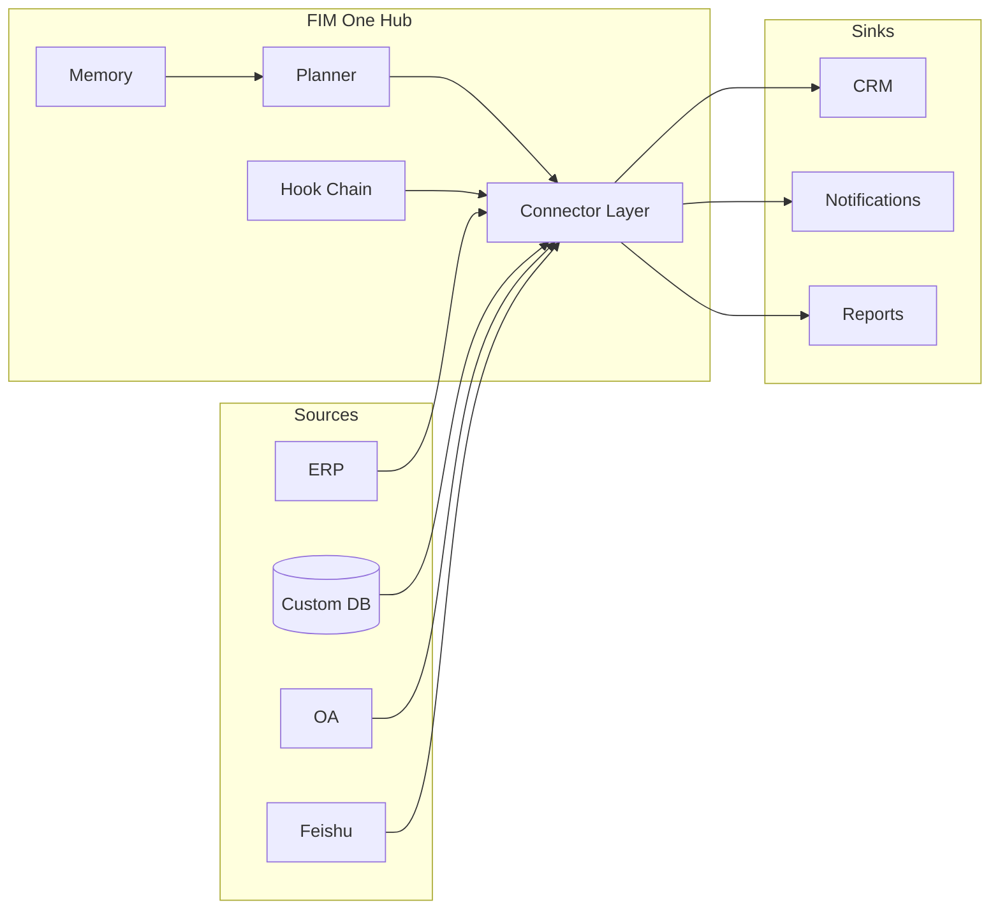

<Frame>
  
</Frame>

<Info>
  **Version 1.0 · April 2026.** Dieses Whitepaper dokumentiert die architektonische These, Designprinzipien und das Bereitstellungsmodell von FIM One.
  Es richtet sich an CTOs, Enterprise Architects, AI-Plattformleiter und technische Investoren, die evaluieren, wie sie KI in Systemen einführen können, die vor dem Zeitalter der KI entwickelt wurden.
</Info>

## Zusammenfassung

Die meisten Unternehmen verfügen bereits über die Systeme, die sie benötigen — ERP, CRM, OA, benutzerdefinierte Datenbanken, interne APIs. Was ihnen fehlt, ist eine Möglichkeit für AI, diese Systeme zu **erreichen**, ohne für jeden Use Case ein sechsmonatiges Integrationsprojekt durchzuführen.

Bestehende Ansätze scheitern auf vorhersehbare Weise. Workflow-Builder (n8n, Zapier-ähnlich) verlangen von Ihnen, Geschäftslogik zu replizieren, die bereits in Ihren Systemen vorhanden ist. General-Purpose-Agenten (Manus, AutoGPT) können das Web durchsuchen, können sich aber nicht in Ihre SAP-Instanz einloggen. RPA-Tools sind anfällig und driften mit jeder UI-Änderung. Vertikale AI-SaaS zwingt Sie, Daten in noch ein weiteres Silo zu migrieren.

FIM One ist ein **Connector Hub**: ein Provider-agnostisches Python-Framework, bei dem AI-Agenten dynamisch Aufgaben über Ihre bestehenden Systeme planen und ausführen. Die Kernidee ist, dass das schwierige Problem nicht das Reasoning ist — Frontier-LLMs beherrschen das — sondern die **Ausrichtung**: dem AI eine stabile, typisierte, authentifizierte und kontrollierte Oberfläche zu Legacy-Systemen zu geben, die nie erwartet haben, mit einem Modell zu kommunizieren.

Das Ergebnis ist ein Agent-Kern, der auf drei Arten bereitgestellt wird:

| Modus | Wo es sich befindet | Typische Bereitstellung |
|---|---|---|
| **Standalone** | Ein eigenes Portal | Knowledge Q&A, interner Chat, Code-Sandbox |
| **Copilot** | Eingebettet in ein Host-System | „Finance Copilot" in einer ERP-Web-UI |
| **Hub** | Zentraler systemübergreifender Orchestrator | Agent fragt ERP ab, prüft OA, benachrichtigt über Feishu |

Dieses Dokument erklärt, warum diese Struktur richtig ist, wie die Architektur unter der Haube aussieht, wie sie in der Produktion sicher bleibt, und wohin es als Nächstes geht.

## 1. Das Problem: Enterprise-KI ist ein Alignment-Problem

Die öffentliche KI-Diskussion in 2025–2026 wurde von Leistungsfähigkeit dominiert: längere Kontextfenster, besseres Reasoning, günstigere Token. In Unternehmen war Leistungsfähigkeit selten der Engpass. Der Engpass ist, dass **die KI keine Hände hat**.

Ein LLM, das eine zehntausendzeilige Codebasis lesen und einen korrekten Fix vorschlagen kann, kann von selbst nicht:

- Gestrige Bestandszahlen aus einer lokalen SAP-Instanz abrufen.
- Eine Urlaubsanfrage in einem SaaS-HR-Tool genehmigen, das nur eine Legacy-SOAP-API hat.
- Eine Zeile in ein chinesisches ERP-System schreiben, dessen Authentifizierung ein Login-Ticket-Service statt OAuth2 ist.
- Eine Benachrichtigung in eine Feishu-Gruppenchat senden und dabei die Genehmigungsregeln der Gruppe respektieren.

Jedes dieser Probleme ist einmal gelöst — als Integrationsproblem. Die Schwierigkeit besteht darin, dass jedes Unternehmen Dutzende solcher Systeme hat, jedes mit seinem eigenen Authentifizierungsmodell, Datenmodell und Fehlermodi. Sie in einen einzelnen Agent hardcodieren ergibt einen spröden Monolithen. Das LLM zur Laufzeit dazu aufzufordern, sie zu entdecken, führt zu halluzinierten API-Aufrufen.

**Die fehlende Primitive ist eine ausgerichtete Oberfläche.** Eine typisierte, authentifizierte, auffindbare Schnittstelle zwischen dem Modell und dem System — eine, die dem Modell genau sagt, was es tun kann, was jede Aktion kostet, wer sie genehmigen muss und wie das Ergebnis aussieht. Diese Primitive ist das, was FIM One einen **Connector** nennt.

## 2. Warum bestehende Ansätze nicht ausreichen

### 2.1 Workflow Builder (n8n, Zapier, Dify)

Workflow Builder behandeln Integration als visuellen Graphen: Knoten ziehen, verbinden, ausführen. Sie funktionieren gut für zehnstufige Marketing-Automatisierungen. Sie scheitern bei Enterprise-AI, weil:

- Die Logik, die sie kodieren, **existiert bereits** im Zielsystem. Jeder Knoten ist ein dünner Wrapper um einen API-Aufruf, den Sie an zwei Stellen pflegen müssen.
- Sie gehen davon aus, dass der menschliche Designer den Plan im Voraus kennt. Enterprise-Fragen sind offen — „Q1 für alle APAC-Einheiten abschließen" — und der Plan muss spontan generiert werden.
- Sie behandeln die KI als einen Knoten unter vielen, anstatt als den Planer, der entscheidet, welche Knoten aufgerufen werden sollen.

### 2.2 General-Purpose Agents (Manus, AutoGPT, OpenAI Assistants)

General agents sind für Consumer- und Knowledge-Work-Aufgaben konzipiert — Web-Browsing, Dokumentenerstellung, Tabellenkalkulationsbearbeitung. Sie können nicht in Ihr VPN eindringen, sich bei Ihrem ERP authentifizieren oder Ihre Sicherheitsprüfung bestehen. Wenn sie um Enterprise-Systeme herum eingesetzt werden, werden sie zu einer Demo, die in der Pilotphase scheitert.

### 2.3 Vertical AI SaaS

Vertikale AI-Tools (AI-native CRMs, AI-native Finanz-Tools) lösen einen Workflow wunderbar, erfordern aber eine Datenmigration, um dorthin zu gelangen. Unternehmen landen am Ende mit mehr Silos, nicht weniger, und ohne systemübergreifende Orchestrierung.

### 2.4 RPA

Robotic Process Automation steuert die Benutzeroberfläche wie ein Mensch. Es ist das allgemeinste der vier — alles, das ein Mensch anklicken kann, kann RPA anklicken — und auch das zerbrechlichste: jede UI-Änderung bricht es, jede Authentifizierungsaufforderung stoppt es, jedes CAPTCHA beendet den Durchlauf. Es ist ein Pflaster über dem Fehlen von APIs, keine Grundlage zum Aufbau von KI.

FIM One befindet sich in der Lücke, die alle vier hinterlassen: typisierte APIs über echte Systeme, geplant durch das Modell, gesteuert durch das Unternehmen.

## 3. Die FIM One These

Drei Überzeugungen prägen jede Designentscheidung in FIM One.

**Überzeugung 1 — Die Systeme existieren bereits.** Fordern Sie das Unternehmen nicht auf, alles neu aufzubauen; treffen Sie es dort, wo es ist. Jeder Connector ist eine Brücke, keine Ersetzung. Daten verlassen niemals die Quelle der Wahrheit.

**Überzeugung 2 — Ausrichtung schlägt Leistung.** Ein schwächeres Modell mit einem ausgerichteten Toolset übertrifft ein stärkeres Modell, das mit rohen APIs kämpft. Der Burggraben ist die Connector-Bibliothek und sein Authentifizierungsmodell, nicht die Reasoning-Fähigkeit des Agenten.

**Überzeugung 3 — Dynamische Planung ist der richtige Mittelweg.** Starre Workflows sind zu brüchig für echte Enterprise-Aufgaben; vollständig autonome Agenten sind zu unvorhersehbar für die Produktion. Die Agenten von FIM One planen zur Laufzeit, aber innerhalb eines typisierten Action Space — jeder Schritt ist ein Connector-Aufruf, keine offene LLM-Monolog.

Diese drei zusammen erzeugen den Connector Hub.

## 4. Architekturprinzipien

<CardGroup cols={2}>
  <Card title="Provider-agnostisch" icon="shuffle">
    Jedes OpenAI-kompatible LLM — OpenAI, Anthropic, DeepSeek, Qwen, lokales Ollama. Die Modellwahl ist eine Bereitstellungsvariable, keine architektonische Verpflichtung.
  </Card>
  <Card title="Protokoll-First" icon="network-wired">
    Jeder Connector veröffentlicht ein typisiertes Schema. Der Agent sieht Aktionen, Parameter und Rückgabetypen — niemals rohes HTTP.
  </Card>
  <Card title="Asynchron standardmäßig" icon="bolt">
    Python async durchgehend. Ein einzelner Agent-Lauf kann sich zu Dutzenden von Connectoren verzweigen; blockierendes I/O würde das wirtschaftlich unmöglich machen.
  </Card>
  <Card title="Zwei Ausführungs-Engines" icon="sitemap">
    ReAct für explorative Aufgaben, DAG für strukturierte Pipelines. Ein Agent-Kern wählt die Engine pro Aufgabe.
  </Card>
  <Card title="Hook-gesteuert" icon="shield-halved">
    Jeder Tool-Aufruf durchläuft eine Hook-Kette: Audit, Richtlinie, Genehmigung durch Menschen. Governance ist keine nachträgliche Überlegung.
  </Card>
  <Card title="Speicher-bewusst" icon="brain">
    Kurzfristige Konversation, langfristige Wissensdatenbank und sitzungsübergreifender Speicher sind erste Klasse — nicht nachträglich hinzugefügt.
  </Card>
</CardGroup>

## 5. Drei Liefermodi — Ein Agent-Kern

Derselbe Planner, Memory und die Connector-Bibliothek treiben drei unterschiedliche Produktformen an. Die Wahl ist eine Bereitstellungsentscheidung, keine Code-Verzweigung.

### 5.1 Standalone

Ein in sich geschlossenes Portal. Der Käufer wünscht sich eine Chat-Schnittstelle über eine kuratierte Wissensdatenbank, einen Code-Sandbox oder einen allgemeinen Assistenten für sein Team. Kein Host-System beteiligt.

**Typischer Anwendungsfall:** Interner IT-Helpdesk, Engineering-Produktivität, Wissensdatenbank für den Kundensupport.

### 5.2 Copilot

Der Agent ist in ein bestehendes Host-System eingebettet — eine ERP-Web-UI, einen CRM-Tab, ein benutzerdefiniertes internes Tool — über iframe, Widget oder direktes Embedding. Das Host-System verwaltet bereits die Authentifizierung; der Copilot erbt den Benutzerkontext und arbeitet mit den Daten des Host-Systems.

**Typischer Anwendungsfall:** Finance Copilot in SAP Fiori, Sales Copilot in Salesforce, DevOps Copilot in einem internen Entwicklerportal.

### 5.3 Hub

Die zentrale Orchestrierungsoberfläche. Jedes verbundene System — ERP, CRM, OA, Feishu, benutzerdefinierte Datenbanken — endet im Hub. Benutzer stellen systemübergreifende Fragen; der Agent plant und führt systemübergreifend aus.

**Typische Anwendungsfälle:** "Close out Q1 for all APAC entities", "find every customer who missed a renewal and draft outreach", "reconcile yesterday's payments between the payment gateway and our ledger".

## 6. Connector-Ausrichtungsmodell

Ein Connector ist eine typisierte Aktionsoberfläche, die durch eine Authentifizierungsstrategie unterstützt wird. FIM One definiert drei Authentifizierungsstufen, die die überwiegende Mehrheit der Unternehmenssysteme abdecken.

<AccordionGroup>
  <Accordion title="Stufe 1 — Datenbank-Connectors (Vollständig oder Basis)">
    Direkte Verbindung zu einer relationalen oder Dokumentendatenbank. Der Modus **Vollständig** stellt beliebiges SQL für den Agenten bereit, geschützt durch eine schreibgeschützte Rolle; der Modus **Basis** stellt nur vorab registrierte parametrisierte Abfragen bereit. Wird für benutzerdefinierte interne Systeme verwendet, bei denen die Quelle der Wahrheit eine Datenbank ist, die Sie kontrollieren.
  </Accordion>
  <Accordion title="Stufe 2 — OpenAPI-Connectors (Benutzer-Schlüssel)">
    Jede REST-API mit einer OpenAPI-Spezifikation. Der Agent liest die Spezifikation, wählt den richtigen Endpunkt aus und ruft ihn mit dem Schlüssel des angemeldeten Benutzers auf. Deckt modernes SaaS (Slack, Linear, GitHub) und gut dokumentierte interne APIs ab.
  </Accordion>
  <Accordion title="Stufe 3 — Login-Ticket-Connectors">
    Für Legacy-Systeme — besonders häufig auf dem chinesischen Markt — die sich über einen Login-Ticket-Service authentifizieren, anstatt OAuth2 zu verwenden. Der Connector verwaltet den Ticket-Lebenszyklus (Erwerben, Aktualisieren, Ungültigmachen) und präsentiert eine normale typisierte Oberfläche nach oben. Dies ist die Stufe, die Systeme freischaltet, die jeder andere Anbieter überspringt.
  </Accordion>
</AccordionGroup>

Jeder Connector deklariert auch eine **Channel/Integration-Dualität**: dasselbe zugrunde liegende System kann sowohl als *Channel* (Benachrichtigungssenke, Genehmigungsoberfläche) als auch als *Integration* (Datenquelle, Aktionsziel) erscheinen. Feishu ist beispielsweise ein Benachrichtigungskanal für den Agenten und eine Datenquellen-Integration für Gruppenchat-Verlauf — ein Connector, zwei Rollen.

## 7. Sicherheit und Governance

Enterprise-AI scheitert in der Produktion nicht, weil das Modell falsch ist, sondern weil die Organisation nicht nachweisen kann, dass es richtig ist. FIM One behandelt Governance als Architektur.

**Hook-Kette.** Jeder Tool-Aufruf durchläuft vor der Ausführung eine konfigurierbare Kette von Hooks. Hooks können protokollieren, Daten maskieren, Rate-Limiting durchsetzen, menschliche Genehmigung erfordern oder Aufrufe vollständig blockieren. Genehmigungen können inline (im selben Chat) oder asynchron (in einer Feishu-Gruppe, in der jedes Mitglied einer Allowlist genehmigen oder ablehnen kann) erfolgen.

**Richtlinien sind Daten, nicht Code.** Hook-Konfigurationen befinden sich in Datenbankzeilen, nicht im Quellcode. Ein Compliance Officer kann „Tool X erfordert Genehmigung durch Gruppe Y zwischen 9 und 17 Uhr an Wochentagen" ändern, ohne neu bereitzustellen.

**Alles ist beobachtbar.** Jede Agent-Ausführung gibt eine strukturierte Trace aus: Plan, Tool-Aufrufe, Argumente, Beobachtungen, Genehmigungen, endgültige Antwort. Traces sind die Einheit der Audit.

**Fehler sind explizit.** Wenn ein Operator einen Tool-Aufruf ablehnt, stoppt der Agent — er paraphrasiert die Anfrage nicht und versucht es erneut. Ablehnung ist eine Richtlinienentscheidung, kein Fehler, von dem man sich erholen muss.

## 8. Bereitstellung und Kostenmodell

FIM One ist Open-Source unter einer permissiven Lizenz. Drei Bereitstellungsoptionen decken das gesamte Spektrum ab.

<CardGroup cols={3}>
  <Card title="Self-Host" icon="server">
    Docker Compose oder Kubernetes in Ihrer VPC. Ihre LLM-Schlüssel, Ihre Daten, Ihr Audit-Log. Bevorzugt für regulierte Branchen und On-Prem-Unternehmen.
  </Card>
  <Card title="Managed Cloud" icon="cloud">
    cloud.fim.ai — keine Einrichtung, bezahlen Sie pro Nutzung. Schnellster Weg zum ersten Mehrwert. Multi-Tenant mit strenger Isolation an der Organisationsgrenze.
  </Card>
  <Card title="Hybrid" icon="bridge">
    Verwaltete Kontrolleben, selbst gehostete Connector-Worker. Sie behalten Daten und Anmeldedaten On-Prem; wir betreiben den Planer und die UI.
  </Card>
</CardGroup>

Die dominanten Kosten sind LLM-Token, nicht Infrastruktur. FIM One ist Provider-agnostisch, genau damit diese Kosten eine Marktgröße sind: Wenn die Frontier die Preise senkt, profitieren Sie ohne Migration.

## 9. Wo dies hingehört

Die kurzfristige Roadmap konzentriert sich auf drei Achsen.

**Connector-Tiefe** — mehr Tier-3-Legacy-Connector für den chinesischen Markt (Xinchuang-konforme Datenbanken, Login-Ticket-ERPs) und ein AI Builder, der eine OpenAPI-Spezifikation oder einen Screenshot eines Datenbankschemas in wenigen Minuten in einen funktionierenden Connector umwandelt.

**Agent-Qualität** — straffere Evaluierungs-Harnesses, ein öffentliches Eval Center und Skills/Hooks inspiriert von modernen Agent CLIs, angepasst an die Hub-Form.

**Enterprise-Eignung** — SSO standardmäßig, umfangreichere RBAC, Multi-Org-Isolation und Compliance-Anforderungen für SOC 2 und ISO 27001.

Die langfristige Annahme ist, dass die Form von Enterprise AI viel mehr wie ein Hub aussehen wird als wie eine CLI. Knowledge Worker werden nicht zehn AI-Assistenten installieren; sie werden ihren Hub des Unternehmens fragen, und der Hub wird wissen, wie er jedes System erreicht, das die Antwort enthält. FIM One baut den Hub.

## 10. Appendix — Getting Technical

- **[System Overview](/architecture/system-overview)** — Component-level architecture diagram.
- **[Connector Architecture](/architecture/connector-architecture)** — The connector contract, lifecycle, and extension model.
- **[Design Philosophy](/architecture/design-philosophy)** — Why we made each core tradeoff.
- **[Hook System](/architecture/hook-system)** — Policy, approval, and audit in depth.
- **[Quickstart](/quickstart)** — Run FIM One on your laptop in under ten minutes.

<Tip>
  Questions, corrections, or commercial inquiries: hi@fim.ai · [Discord](https://discord.gg/z64czxdC7z) · [GitHub](https://github.com/fim-ai/fim-one)
</Tip>
