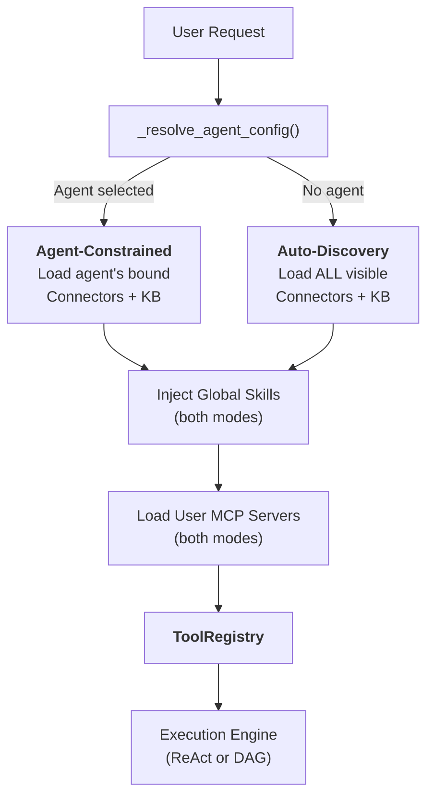
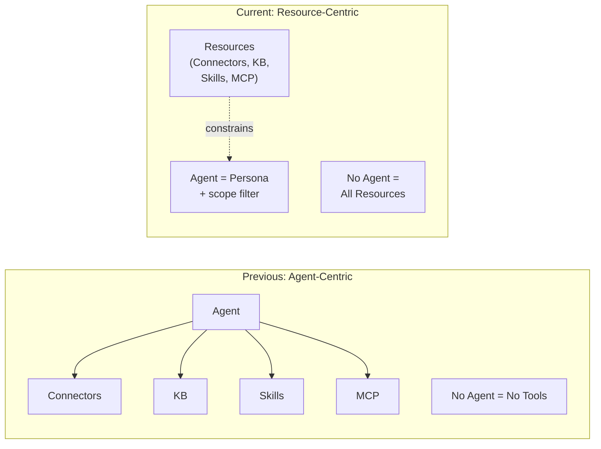
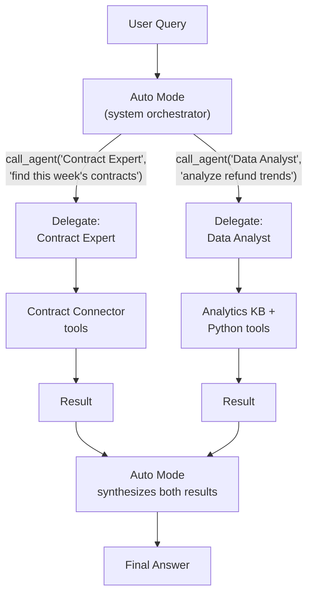
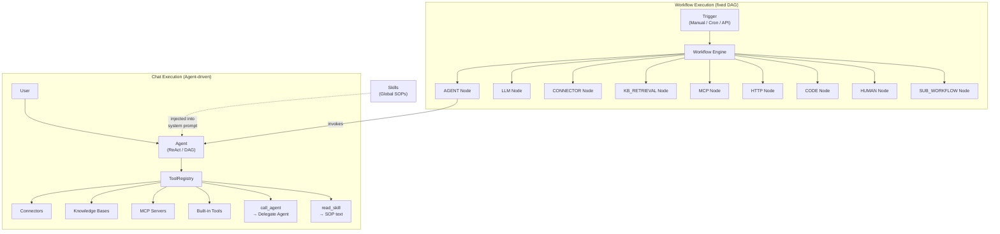

## Les deux modes

Chaque demande de chat dans FIM One commence par une question : **un Agent est-il sélectionné ?** La réponse détermine comment les ressources — Connecteurs, Bases de Connaissances, Compétences et serveurs MCP — sont découverts et assemblés dans l'ensemble d'outils que le LLM peut utiliser.

**Le Mode Contraint par Agent** s'active quand l'utilisateur choisit un Agent spécifique. Le système charge uniquement les ressources que cet Agent a été explicitement configuré pour utiliser :

- **Connecteurs** : seuls les `connector_ids` liés de l'Agent sont chargés comme outils.
- **Bases de Connaissances** : seuls les `kb_ids` liés de l'Agent sont injectés comme outils de récupération.
- **Compétences** : disponibles globalement — toutes les Compétences actives visibles par l'utilisateur sont injectées, car les Compétences sont des POS organisationnels, pas des connaissances spécifiques à l'Agent. (Voir [Compétences comme POS Globaux](#skills-as-global-sops) ci-dessous.)
- **Serveurs MCP** : toujours limités à l'utilisateur — tous les serveurs MCP actifs visibles par l'utilisateur sont chargés dans les deux modes.
- **Instructions** : le champ `instructions` de l'Agent définit la persona et les directives comportementales injectées dans l'invite système.

**Le Mode Auto-Découverte Globale** s'active quand aucun Agent n'est sélectionné (par exemple, un nouveau chat). Le système découvre automatiquement tout ce qui est accessible à l'utilisateur :

- **Connecteurs** : tous les Connecteurs visibles par l'utilisateur (propres + partagés par l'org + abonnements au Marché) sont chargés.
- **Bases de Connaissances** : toutes les BCs accessibles sont disponibles pour la récupération via `kb_retrieve`.
- **Compétences** : toutes les Compétences actives visibles par l'utilisateur sont injectées comme stubs de POS.
- **Serveurs MCP** : identiques au mode contraint — tous les serveurs actifs visibles par l'utilisateur.
- **Instructions** : une persona d'assistant générique est utilisée.

La bifurcation se produit à l'intérieur de `_resolve_tools()`, qui est appelée à chaque demande de chat :



L'effet pratique : les utilisateurs peuvent commencer à discuter immédiatement sans configurer un Agent. Le système découvre les ressources disponibles et les expose comme outils. Sélectionner un Agent réduit la portée — cela ne déverrouille pas de nouvelles capacités, cela concentre les capacités existantes.

### Ce que chaque mode découvre

Les deux modes diffèrent par leur **portée**, non par leur nature. Les deux produisent un `ToolRegistry` — ils le remplissent simplement différemment.

**Mode de découverte automatique (aucun agent sélectionné) :**

| Ressource | Découverte | Forme d'outil |
|---|---|---|
| Connecteurs (API) | `resolve_visibility()` — tous visibles pour l'utilisateur | `ConnectorMetaTool` (progressif) |
| Connecteurs (BD) | `resolve_visibility()` — tous visibles pour l'utilisateur | `DatabaseMetaTool` (progressif) |
| Bases de connaissances | Toutes les KB accessibles | `kb_retrieve` |
| Compétences | `resolve_visibility()` — toutes actives | `read_skill` (stubs progressifs) |
| Serveurs MCP | `resolve_visibility()` — tous visibles par l'utilisateur | `MCPServerMetaTool` (progressif) |
| Agents | `resolve_visibility()` — tous actifs, non-constructeur | `call_agent` (catalogue de délégation) |
| Outils intégrés | `discover_builtin_tools()` — ensemble complet | Aucun filtre de catégorie appliqué |

**Mode contraint par agent (agent sélectionné) :**

| Ressource | Découverte | Forme d'outil |
|---|---|---|
| Connecteurs | Seulement `agent.connector_ids` | `ConnectorMetaTool` ou hérité par action |
| Bases de connaissances | Seulement `agent.kb_ids` | `GroundedRetrieveTool` / `KBRetrieveTool` |
| Compétences | Global — **non contraint par l'agent** | `read_skill` |
| Serveurs MCP | Portée utilisateur — **non contraint par l'agent** | `MCPServerMetaTool` (progressif) |
| Délégation d'agent | Non disponible — les agents sont spécialisés | _(désactivé)_ |
| Outils intégrés | Filtre `agent.tool_categories` | Sous-ensemble par catégorie |

L'asymétrie clé : les connecteurs et les bases de connaissances sont limités par l'agent, mais les compétences et les serveurs MCP restent globaux dans les deux modes. `CallAgentTool` (délégation d'agent) n'est disponible qu'en mode de découverte automatique — il n'est **pas** enregistré quand un agent spécifique est sélectionné. C'est une mesure de sécurité : un agent de marketplace pourrait autrement utiliser `call_agent` pour invoquer d'autres agents et accéder à leurs invites privées. Les compétences sont des règles organisationnelles (tout le monde suit les mêmes procédures), tandis que les connecteurs et les KB sont des liaisons de capacités (différents agents se connectent à différents systèmes).

## Tout est un outil

Au niveau du LLM, tous les types de ressources convergent en une liste plate d'outils appelables. Le LLM n'a aucune conscience structurelle de s'il appelle un Connecteur, un serveur MCP, ou une Base de Connaissances. Il voit un `ToolRegistry` — un ensemble de fonctions avec des noms, des descriptions et des schémas de paramètres.

| Type de Ressource | Devient au Niveau du LLM | Motif du Nom de l'Outil |
|---|---|---|
| Connecteur (progressif) | Outil méta unique | `connector` |
| Connecteur (hérité) | N outils par action | `{connector}__{action}` |
| Connecteur de Base de Données (progressif) | Outil méta unique | `database` |
| Connecteur de Base de Données (hérité) | 3 outils par base de données | `{db}__list_tables`, `{db}__describe_table`, `{db}__query` |
| Serveur MCP (progressif) | Outil méta unique | `mcp` |
| Serveur MCP (hérité) | N outils par serveur | `{server}__{tool}` |
| Base de Connaissances | Outil de récupération | `kb_retrieve` ou `grounded_retrieve` |
| Compétence (progressive) | Outil de lecture + stubs de prompt système | `read_skill` |
| Compétence (inline) | Texte de prompt système uniquement | _(pas d'outil)_ |
| Agent lui-même | Non visible comme un outil | _(instructions + assemblage d'outils)_ |

L'insight clé : **un Agent n'est pas un outil — c'est l'entité qui utilise les outils.** L'Agent contribue ses instructions au prompt système et détermine quels outils sont disponibles. Mais du point de vue du LLM, il n'y a aucun concept « d'agent » — seulement un prompt système et un ensemble de fonctions appelables.

Cette uniformité est ce qui rend le système extensible. Ajouter un nouveau type de ressource signifie implémenter le protocole `Tool` (`name`, `description`, `parameters_schema`, `run()`). Les moteurs d'exécution, la gestion du contexte et la couche d'interaction avec le LLM restent inchangés.

## Compétences en tant que procédures opérationnelles standard mondiales

Les compétences occupent une couche au-dessus des agents. Ce sont des politiques et des procédures organisationnelles que chaque agent doit suivre, quel que soit l'agent sélectionné.

### Pourquoi les compétences ne sont pas liées aux agents

Une compétence comme « Customer Complaint Handling SOP » s'applique à chaque agent qui interagit avec les clients. Lier les compétences aux agents crée un problème de propriété bidirectionnelle : si une compétence orchestre les agents, et les agents possèdent les compétences, qui contrôle qui ?

Les compétences sont globales par conception — ce sont des règles d'entreprise, pas des connaissances spécifiques aux agents. La fonction `_resolve_tools()` charge toutes les compétences actives visibles pour l'utilisateur indépendamment de la sélection d'agent, en utilisant le même filtre `resolve_visibility()` utilisé pour les autres ressources.

### Deux modes d'injection

Les compétences supportent deux modes d'injection -- **progressif** (par défaut) et **inline** -- contrôlés par `SKILL_TOOL_MODE` ou la `model_config_json.skill_tool_mode` de l'agent. En mode progressif, seuls des stubs compacts apparaissent dans le prompt système ; le LLM appelle `read_skill(name)` à la demande pour charger le contenu complet. Cela fait partie de l'architecture [Progressive Disclosure](/architecture/progressive-disclosure) plus large de FIM One qui minimise la consommation de contexte sur tous les types de ressources.

## Agent en tant que persona, non conteneur

L'architecture de FIM One reflète un changement délibéré d'un modèle centré sur l'Agent à un modèle centré sur les Ressources.

**Modèle précédent :** l'Agent était un conteneur qui contrôlait l'accès à toutes les ressources. Aucun Agent sélectionné signifiait pas de Connecteurs, pas de Compétences, pas de KB spécialisée. L'Agent était le point d'entrée obligatoire pour toute capacité.

**Modèle actuel :** l'Agent est une persona — un ensemble d'instructions et de directives comportementales — combiné avec une contrainte de ressource optionnelle. Les Ressources existent indépendamment des Agents. Sélectionner un Agent réduit la portée ; ne pas en sélectionner l'ouvre complètement.



Cela signifie :

- **Les utilisateurs peuvent commencer à discuter immédiatement** sans configurer un Agent.
- **Le système découvre automatiquement les ressources disponibles** et les expose en tant qu'outils.
- **Les Agents deviennent des personas légers** qui peuvent être créés rapidement — il suffit d'écrire des instructions et de lier optionnellement des Connecteurs et des KBs spécifiques.
- **La gestion des ressources est découplée** de la gestion des Agents. Publier un Connecteur dans une organisation le rend disponible partout — en mode découverte automatique, dans les listes déroulantes de liaison d'Agent et dans la résolution de délégation d'agent.

## Délégation d'agent

FIM One prend en charge la délégation de tâches à des agents spécialisés via `CallAgentTool` — mais uniquement en mode **Auto** (aucun agent sélectionné). Lorsqu'un utilisateur sélectionne un agent spécifique, la délégation est désactivée et l'agent se concentre exclusivement sur ses propres outils.

### Deux modes : Auto vs Agent sélectionné

| Aspect | Mode Auto (aucun agent sélectionné) | Mode Agent sélectionné |
|---|---|---|
| `call_agent` | Activé — délègue à n'importe quel agent visible | **Désactivé** — non enregistré |
| Portée des outils | Tous les Connecteurs visibles, KB, Skills, MCP | Uniquement les ressources liées de l'Agent + Skills/MCP globaux |
| Orchestration | Le système LLM choisit dynamiquement le meilleur agent par itération | L'Agent utilise directement ses propres outils |
| Cas d'usage | Requêtes générales, tâches multi-domaines | Tâches spécialisées ciblées |

**Pourquoi la délégation est désactivée en mode Agent sélectionné :** Sécurité. Un agent de marketplace pourrait utiliser `call_agent` pour invoquer d'autres agents et lire leurs invites système privées. En restreignant la délégation au mode Auto — où le système LLM (et non l'invite d'un agent individuel) contrôle le flux — les invites d'agent privées ne sont jamais exposées aux configurations d'agent non fiables.

### Mode Auto comme couche d'orchestration

Le mode Auto est un concept de première classe dans l'interface utilisateur. Le sélecteur d'agent affiche « Auto » comme option par défaut. Lorsque le mode Auto est actif, le LLM système agit comme un orchestrateur : il voit le catalogue complet des agents visibles et peut déléguer les tâches au spécialiste le mieux adapté à chaque itération. Cela élimine le besoin d'un « agent parent » dédié — le système lui-même est l'orchestrateur.

### Catalogue d'agents

À l'exécution, tous les agents actifs et non-builder visibles par l'utilisateur sont assemblés dans un catalogue. Le nom et la description de chaque agent sont listés dans le schéma de paramètres de l'outil `call_agent`, permettant au LLM de choisir le bon spécialiste sémantiquement — sans routage codé en dur.

### Héritage complet des outils

Quand un agent délégué est invoqué via `call_agent(agent_id, task)`, il reçoit un `ToolRegistry` complet construit à partir de sa propre configuration — incluant ses Connecteurs liés, sa KB, et ses outils intégrés. Les agents délégués sont des unités d'exécution complètes, pas seulement des conseillers basés sur du texte.

### Délégation à un seul niveau

Pour éviter la récursion infinie, les agents délégués ne reçoivent pas l'outil `call_agent`. La délégation est toujours à un seul niveau : le mode Auto appelle un spécialiste, le spécialiste exécute et retourne un résultat. Le système synthétise les résultats de plusieurs agents délégués.

### Exécution parallèle

En mode d'appel de fonction natif, le LLM peut invoquer plusieurs appels `call_agent` en un seul tour. Ceux-ci s'exécutent simultanément via `asyncio.gather`, permettant des modèles comme « rechercher trois sources simultanément ».



## Modèle de visibilité

Toute découverte de ressources — dans les deux modes — est régie par un modèle de visibilité unifié avec trois niveaux :

| Niveau | Description | Exemple |
|---|---|---|
| **Propre** | Créé par l'utilisateur. Toujours visible. | Un connecteur que vous avez créé pour l'API de votre équipe |
| **Partagé au niveau de l'organisation** | Ressources avec `visibility: "org"` de la ou des organisations de l'utilisateur. Visible pour tous les membres approuvés de l'organisation. | Un connecteur ERP à l'échelle de l'entreprise publié par le service informatique |
| **Abonné au marché** | Ressources installées depuis le marché FIM One. Visible pour l'abonné. | Un connecteur Slack créé par la communauté que vous avez installé |

La fonction `resolve_visibility()` dans `web/visibility.py` crée un filtre SQL qui inclut les trois niveaux dans une seule requête :

```python
conditions = [
    model.user_id == user_id,                    # own resources
    and_(model.visibility == "org",              # org-shared
         model.org_id.in_(user_org_ids),
         or_(model.publish_status == None,
             model.publish_status == "approved")),
    model.id.in_(subscribed_ids),                # Market-subscribed
]
```

Ce même filtre est utilisé partout :

- Découverte automatique des connecteurs en mode sans agent
- Construction du catalogue d'agents pour `CallAgentTool`
- Chargement des compétences visibles pour l'injection de l'invite système
- Résolution du serveur MCP
- Recherche de configuration d'agent (garantissant qu'un utilisateur ne peut sélectionner que les agents qui lui sont visibles)

L'uniformité signifie que **publier un connecteur à une organisation le rend automatiquement disponible** en mode découverte automatique, dans les listes déroulantes de liaison d'agents et dans la résolution de délégation d'agents — aucun câblage spécial requis. Le modèle de visibilité est la source unique de vérité pour « à quoi cet utilisateur peut-il accéder ».

## Carte des relations

FIM One dispose de deux paradigmes d'exécution parallèles — **Chat (piloté par agent)** et **Workflow (piloté par DAG)** — qui partagent les mêmes ressources sous-jacentes mais les orchestrent différemment.



Points clés du diagramme :

- **Agent et Workflow sont des paradigmes parallèles.** Les deux peuvent utiliser des connecteurs, des bases de connaissances et des serveurs MCP — mais selon des mécanismes différents. Les agents les utilisent comme outils dans un `ToolRegistry` ; les Workflows les utilisent comme nœuds DAG typés.
- **Workflow peut orchestrer des Agents** via le nœud `AGENT` — une étape Workflow peut invoquer un Agent complet avec sa propre boucle ReAct/DAG. L'inverse n'est pas vrai : les Agents ne peuvent pas invoquer directement les Workflows (uniquement indirectement via des déclencheurs API/webhook).
- **Les compétences sont injectées uniquement dans les Agents.** Les compétences sont du texte d'invite système — elles guident le comportement de l'agent. Les Workflows ne consomment pas de compétences car les nœuds Workflow exécutent une logique déterministe, non un raisonnement guidé par LLM.
- **Ressources partagées, modèles d'accès différents.** Un connecteur peut être appelé par un Agent (via `ConnectorToolAdapter`), par un Workflow (via le nœud `CONNECTOR`), ou par les deux dans le même processus métier — par exemple, un Workflow déclenche un Agent qui interroge le même connecteur que celui utilisé par le Workflow dans une étape ultérieure.

## Moteur de flux de travail — l'autre paradigme d'exécution

Bien que ce document se concentre sur l'exécution de chat pilotée par agent, FIM One inclut un **Moteur de flux de travail** complet — un éditeur DAG visuel avec 26 types de nœuds pour l'automatisation de processus fixes.

| Aspect | Agent (Chat) | Flux de travail |
|---|---|---|
| Orchestration | Le LLM décide de l'étape suivante dynamiquement | DAG fixe défini au moment de la conception |
| Idéal pour | Tâches exploratoires, conversations, raisonnement flexible | Chaînes d'approbation, ETL planifiée, automatisations multi-étapes |
| Peut appeler | Connecteurs, KB, MCP, Outils intégrés, Agents délégués, Compétences | Agents, Connecteurs, KB, MCP, LLM, HTTP, Code, Approbation humaine, Sous-flux de travail |
| Déclencheur | Message utilisateur dans le chat | Manuel, planification cron, ou API/webhook |
| Imbrication | Délégation à un niveau (Mode Auto → Agent délégué) | Profondeur DAG arbitraire via nœuds SUB_WORKFLOW |

Les deux paradigmes sont complémentaires. Utilisez les Agents quand la tâche est ouverte (« analyser les données de ventes de ce trimestre et recommander des actions »). Utilisez les Flux de travail quand le processus est connu (« chaque lundi, récupérer les nouvelles factures de l'ERP, exécuter les vérifications de conformité et router les exceptions vers un examinateur humain »). Un Flux de travail peut invoquer un Agent pour toute étape qui nécessite un raisonnement flexible dans un pipeline autrement fixe.

Pour plus de détails sur les modes d'exécution des Agents et les types de nœuds du Flux de travail, consultez [Modes d'exécution](/concepts/execution-modes).
