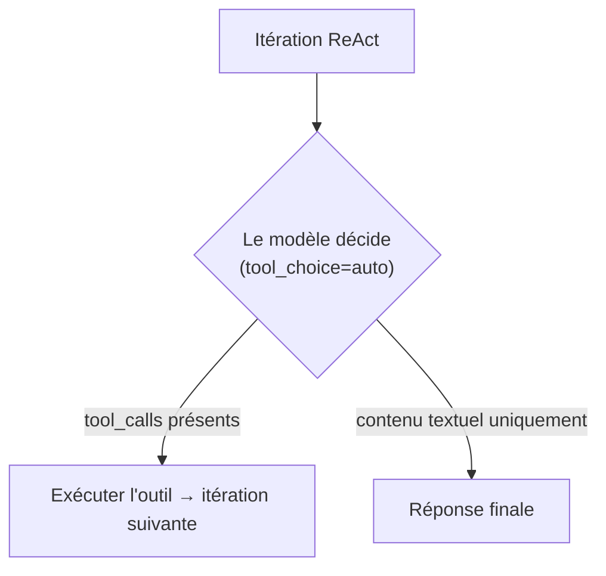
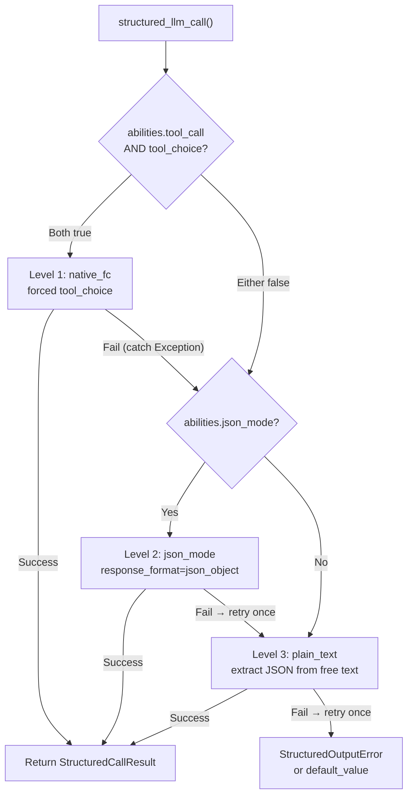

## Détection du fournisseur

FIM One utilise LiteLLM comme adaptateur universel. La fonction `_resolve_litellm_model()` dans `core/model/openai_compatible.py` mappe l'`LLM_BASE_URL` + `LLM_MODEL` de l'utilisateur à un identifiant de modèle LiteLLM avec un préfixe de fournisseur. Le préfixe détermine comment LiteLLM achemine la requête — protocole API natif (Anthropic Messages API, Gemini, etc.) ou générique OpenAI-compatible `/v1/chat/completions`.

Ordre de résolution :

1. **Fournisseur explicite** (champ DB `ModelConfig.provider`) — priorité la plus élevée. Si le fournisseur correspond à un domaine connu dans l'URL, aucun `api_base` n'est renvoyé (LiteLLM achemine nativement). Sinon, `api_base` est défini sur l'URL de relais.
2. **Correspondance de domaine** par rapport à `KNOWN_DOMAINS` — les points de terminaison API officiels sont reconnus par nom d'hôte.
3. **Indice de chemin d'URL** par rapport à `PATH_PROVIDER_HINTS` — courant sur les plateformes de relais comme UniAPI où `/claude` ou `/anthropic` dans le chemin indique le protocole en amont.
4. **Secours** — préfixe `openai/` (générique OpenAI-compatible).

| Domaine / Chemin | Préfixe du fournisseur | Protocole |
|---|---|---|
| `api.openai.com` | `openai/` | OpenAI Chat Completions |
| `anthropic.com` | `anthropic/` | Anthropic Messages API |
| `generativelanguage.googleapis.com` | `gemini/` | Google Gemini |
| `api.deepseek.com` | `deepseek/` | DeepSeek (OpenAI-compatible) |
| `api.mistral.ai` | `mistral/` | Mistral |
| Le chemin contient `/claude` ou `/anthropic` | `anthropic/` | Anthropic Messages API (via relais) |
| Le chemin contient `/gemini` | `gemini/` | Google Gemini (via relais) |
| Tout le reste | `openai/` | Générique OpenAI-compatible |

Lorsque le préfixe du fournisseur est un protocole natif (anthropic, gemini, etc.) et que l'URL n'est pas le point de terminaison officiel, LiteLLM utilise le protocole natif mais envoie les requêtes à l'`api_base` du relais. Cela signifie que les comportements spécifiques au fournisseur — y compris le problème de prefill Bedrock décrit ci-dessous — s'appliquent indépendamment du fait que la requête aille à l'API officielle ou via un relais.

<Warning>
Si votre URL de relais contient `/claude` dans le chemin, FIM One achemine automatiquement via le protocole natif d'Anthropic. C'est généralement correct (meilleur streaming, support de la réflexion), mais cela signifie que les comportements spécifiques au fournisseur s'appliquent — y compris le problème de prefill Bedrock décrit ci-dessous.
</Warning>

## tool_choice — les quatre modes

Le paramètre `tool_choice` est standardisé via le format OpenAI. LiteLLM le traduit vers le protocole natif de chaque fournisseur avant d'envoyer la requête.

| Mode | Signification | Support des fournisseurs |
|---|---|---|
| `"auto"` | Le modèle décide s'il faut appeler un outil ou répondre avec du texte | Tous les fournisseurs |
| `"required"` | Doit appeler un outil, mais le modèle choisit lequel | La plupart des fournisseurs |
| `{"type":"function","function":{"name":"X"}}` | Doit appeler la fonction X spécifiquement | La plupart des fournisseurs — **incompatible avec la réflexion Anthropic** |
| `"none"` | Impossible d'utiliser les outils, texte uniquement | Tous les fournisseurs |

La distinction entre `"auto"` et forcé (`{"type":"function",...}`) est au cœur de chaque problème de compatibilité dans FIM One. Ces deux modes sont utilisés par des sous-systèmes complètement différents avec des exigences différentes.

## Où tool_choice est utilisé

Deux sous-systèmes utilisent `tool_choice`, et ils l'utilisent de manières fondamentalement différentes.

### Moteur ReAct — tool_choice="auto"

La boucle ReAct nécessite que le modèle décide à chaque itération : appeler un outil ou donner une réponse finale. Seul `"auto"` a du sens ici — le modèle choisit librement entre produire des `tool_calls` ou du contenu textuel. Ceci est compatible avec tous les fournisseurs, tous les modèles et tous les modes, y compris la réflexion étendue.



Le moteur ReAct utilise l'appel de fonction natif (`_run_native`) quand `abilities["tool_call"] = True`, en se repliant sur le mode JSON-dans-le-contenu (`_run_json`) sinon. Les deux modes utilisent `"auto"` — la différence est que les outils sont passés via le paramètre `tools` ou décrits dans l'invite système. Voir [Moteur ReAct — Exécution en mode dual](/architecture/react-engine#dual-mode-execution) pour plus de détails.

### structured_llm_call — tool_choice=forced

Extraction structurée en une seule tentative (annotation de schéma, planification DAG, analyse de plan). Force le modèle à appeler une fonction virtuelle spécifique, garantissant une sortie JSON structurée. C'est le site d'appel qui déclenche les erreurs spécifiques au fournisseur.

`structured_llm_call` implémente une chaîne de dégradation à 3 niveaux :



La différence de conception critique : le fallback de `structured_llm_call` est **runtime** — il essaie dynamiquement chaque niveau et capture les exceptions pour passer au suivant. La sélection de mode du moteur ReAct est **build-time** — elle vérifie `_native_mode_active` une seule fois au démarrage et s'engage dans un mode pour l'ensemble de la boucle. Cela signifie que `structured_llm_call` peut récupérer de manière transparente des erreurs 400 spécifiques au fournisseur, tandis que ReAct s'appuie sur le fait que le mode soit correctement choisi dès le départ.

## Le piège du prefill Bedrock

Lorsque `response_format={"type":"json_object"}` est transmis pour un modèle résolu avec le préfixe `anthropic/`, LiteLLM injecte en interne un message d'assistant prefill pour simuler le mode JSON. L'API Messages d'Anthropic n'a pas de paramètre `response_format` natif, donc LiteLLM l'approxime en ajoutant une accolade ouvrante comme contenu d'assistant :

```json
{"role": "assistant", "content": "{"}
```

Cela fonctionne sur l'API directe d'Anthropic. Cependant, les versions plus récentes des modèles AWS Bedrock rejettent toute conversation dont le dernier message a `role: "assistant"` — ils appellent cela « assistant message prefill » et lèvent :

```
ValidationException: This model does not support assistant message prefill.
The conversation must end with a user message.
```

Cette erreur se produit uniquement lorsque **les trois conditions** sont remplies simultanément :

1. Le modèle est résolu avec le préfixe `anthropic/` (via correspondance de domaine ou indice de chemin URL).
2. `response_format={"type":"json_object"}` est transmis (le chemin de code json_mode dans `structured_llm_call`).
3. Le backend réel est AWS Bedrock (qui rejette le prefill).

<Tip>
**Bedrock via endpoint compatible OpenAI ?** Si votre relais Bedrock expose un endpoint `/v1/chat/completions` compatible OpenAI (soit la passerelle compatible OpenAI d'AWS elle-même, soit un proxy tiers), et que le chemin URL ne contient **pas** `/claude` ou `/anthropic`, FIM One le résout avec le préfixe `openai/`. LiteLLM traite alors le backend comme un serveur standard compatible OpenAI, transmet `response_format` directement sans injecter de prefill, et le serveur gère la contrainte JSON nativement. **Le piège du prefill ne s'applique pas** — vous n'avez pas besoin de définir `json_mode_enabled=false`.
</Tip>

<Warning>
Cela n'affecte **pas** l'appel d'outil natif (`tool_choice="auto"` avec le paramètre `tools=`). L'injection de prefill se produit uniquement pour `response_format`. L'exécution de l'agent ReAct n'est complètement pas affectée.
</Warning>

Si le Niveau 1 (native_fc) et le Niveau 2 (json_mode) échouent tous deux sur Bedrock, le système se rétablit au Niveau 3 (plain_text). Le drapeau `json_mode_enabled` décrit ci-dessous élimine l'appel gaspillé du Niveau 2.

### Le correctif : json_mode_enabled

Un indicateur `json_mode_enabled` par modèle contrôle si le Niveau 2 (json_mode) est jamais tenté :

- **Modèles configurés via BD** : basculer dans Admin → Models → Advanced settings. L'indicateur est stocké sur `ModelProviderModel.json_mode_enabled` (par défaut `TRUE`).
- **Modèles configurés via ENV** : définir `LLM_JSON_MODE_ENABLED=false` dans votre environnement.
- **Effet** : lorsque désactivé, `abilities["json_mode"]` retourne `False` → `response_format` n'est jamais passé → pas de prefill → Bedrock fonctionne. La chaîne de dégradation devient `native_fc → plain_text`, en ignorant entièrement l'appel json_mode voué à l'échec.
- **Aucune perte de qualité** : le modèle retourne toujours du JSON valide car le system prompt l'impose. Le niveau plain_text utilise `extract_json()` pour analyser le JSON à partir de contenu libre, ce qui fonctionne de manière fiable avec les modèles modernes.

## Modèles de raisonnement + tool_choice forcé

Plusieurs fournisseurs rejettent un `tool_choice` forcé lorsque le raisonnement étendu est actif, au motif que fixer un appel de fonction spécifique contredit la liberté du modèle de raisonner d'abord :

```
tool_choice 'specified' is incompatible with thinking enabled
```

**Il s'agit d'une règle par fournisseur, pas d'une loi des modèles de raisonnement.** Anthropic l'applique au niveau du protocole et Moonshot (Kimi) se comporte de la même manière, mais MiniMax raisonne à chaque appel et accepte toujours un tool choice forcé. Le tableau B dans la [Matrice de capacités des fournisseurs](#provider-capability-matrix) enregistre le verdict fournisseur par fournisseur ; ne généralise pas à partir d'une ligne à l'autre.

Pour les modèles Anthropic, `structured_llm_call` résout le conflit de lui-même en passant `reasoning_effort=None` au niveau du FC natif, ce qui désactive le raisonnement pour cet appel uniquement (`structured.py::_call_llm`). La sortie structurée nécessite une **conformité au schéma**, pas un raisonnement profond, donc désactiver le raisonnement là est à la fois correct et moins coûteux.

Lorsque le raisonnement ne peut pas être désactivé via l'API, native_fc échoue avec un 400 à chaque appel structuré et coûte environ dix secondes avant que la chaîne ne bascule vers json_mode. Kimi est le cas courant : avec le raisonnement activé, seul `auto` est supporté, et un tool choice forcé nécessite de désactiver le raisonnement, que Moonshot expose uniquement via l'ID du modèle (`kimi-k2` l'a désactivé, `kimi-k2.5` et `kimi-k2-thinking` l'ont activé). FIM One n'a aucun paramètre qui le bascule, donc le remède est le drapeau `tool_choice_enabled` ci-dessous.

### Le correctif : tool_choice_enabled

Un drapeau `tool_choice_enabled` par modèle contrôle si le Niveau 1 (native_fc) est jamais tenté :

- **Modèles configurés en BD** : basculer dans Admin → Models → Advanced → "Native Function Calling". Le drapeau est stocké sur `ModelProviderModel.tool_choice_enabled` (par défaut `TRUE`).
- **Modèles configurés par ENV** : définissez `LLM_TOOL_CHOICE_ENABLED=false` dans votre environnement.
- **Effet** : lorsque désactivé, `abilities["tool_choice"]` retourne `False` → la chaîne de dégradation commence au Niveau 2 (json_mode) ou Niveau 3 (plain_text), en ignorant complètement native_fc. Cela élimine la pénalité d'~10s par appel structuré pour les modèles incompatibles.
- **Agent ReAct non affecté** : `tool_choice_enabled` contrôle uniquement la sélection d'outil forcée dans `structured_llm_call`. Le moteur ReAct utilise `tool_choice="auto"` (le modèle décide librement), qui fonctionne avec tous les modèles indépendamment de ce paramètre.

<Note>
`tool_choice_enabled` et `tool_call` sont des drapeaux de capacité distincts. `tool_call` (toujours `True` pour `OpenAICompatibleLLM`) contrôle si les outils sont transmis au modèle du tout — le désactiver casserait l'agent ReAct. `tool_choice` contrôle uniquement si la sélection d'outil **forcée** est tentée pour l'extraction de sortie structurée.
</Note>

`tool_choice="auto"` n'est pas affecté par le mode de réflexion. Le moteur ReAct utilise `"auto"` exclusivement, donc l'exécution de l'agent fonctionne avec la réflexion activée.

<Warning>
Ne définissez PAS `abilities["tool_call"] = False` pour éviter cette contrainte. Cela désactiverait le mode `_run_native` de ReAct (qui utilise `tool_choice="auto"` et fonctionne bien avec la réflexion), le forçant dans le mode `_run_json` moins fiable.
</Warning>

<Note>
**Note de migration de fournisseur :** Certains relais tiers suppriment silencieusement les paramètres non supportés comme `reasoning_effort` (`drop_params=True`), donc la réflexion n'est jamais activée même si configurée. Lors de la migration vers un fournisseur qui supporte correctement la réflexion (Bedrock, API Anthropic directe), le `reasoning_effort=None` dans native_fc assure un comportement cohérent. Aucune action utilisateur n'est nécessaire — la sortie structurée fonctionne de manière identique sur tous les fournisseurs.
</Note>

## Matrice des capacités des fournisseurs

Cette section est le registre faisant autorité de ce que chaque fournisseur supporte et ce que FIM One fait à ce sujet. Chaque ligne nomme la fonction qui implémente le comportement, de sorte que toute affirmation ici peut être vérifiée par rapport au code. D'autres pages renvoient à cette section au lieu de répéter les données ; quand le code change, cette section change avec lui.

Une ligne décrit le protocole d'un fournisseur, pas un seul modèle. Lorsque les modèles au sein d'une même famille diffèrent (DeepSeek chat par rapport à reasoner, Kimi avec thinking activé par rapport à désactivé), la cellule l'indique.

### Table A: Routage des protocoles

Comment une `base_url` configurée plus un `model` deviennent un appel LiteLLM, et ce qui se passe quand le premier choix d'interface n'est pas disponible.

| Fournisseur | Détecté par | Préfixe LiteLLM | Surface d'interface | Chaîne de dégradation | Ancre de code |
|---|---|---|---|---|---|
| **OpenAI** | Domaine `api.openai.com`, ou un `provider` explicite de `openai` sur la config du modèle | `openai/` | `completions`. GPT-5.x utilise `responses-native` (`litellm.aresponses`), avec `responses-bridge` (`openai/responses/<model>`) conservé comme secours | GPT-5.x parle Responses nativement, se replie sur `completions` sur un 404 (mis en cache par endpoint et modèle dans `_RESPONSES_NATIVE_SUPPORT`) ou sur un 400 (non mis en cache). Tous les autres modèles vont directement à `completions` | `_resolve_litellm_model`, `_should_use_native_responses`, `_dispatch_acompletion` |
| **Anthropic** (note Bedrock ci-dessous) | Domaine `anthropic.com`, segment de chemin `/claude` ou `/anthropic`, ou un `provider` explicite de `anthropic` | `anthropic/` | `anthropic messages` | Aucun. Les routes natives n'entrent jamais dans le pont Responses ; leur protocole est construit dans `_build_request_kwargs` | `_resolve_litellm_model`, `_dispatch_acompletion` |
| **Gemini** | Domaine `generativelanguage.googleapis.com`, segment de chemin `/gemini`, ou un `provider` explicite de `gemini` | `gemini/` | `gemini` | Aucun. Une correspondance de domaine supprime aussi `api_base`, donc un suffixe compatible OpenAI tel que `/v1beta/openai/` est ignoré et l'appel va à l'API Gemini native | `_resolve_litellm_model` |
| **xAI (Grok)** | Pas d'entrée de domaine ou de chemin. Se résout comme compatible OpenAI générique sauf si `provider` est défini explicitement sur la config du modèle | `openai/` avec `api_base`, ou le préfixe de fournisseur explicite | `completions` | Aucun | `_resolve_litellm_model` |
| **DeepSeek** | Domaine `api.deepseek.com` | `deepseek/` | `completions` | Aucun | `_resolve_litellm_model` |
| **Qwen** (DashScope) | Secours générique | `openai/` avec `api_base` | `completions` | Aucun | `_resolve_litellm_model` |
| **GLM** (Zhipu, Z.AI) | Secours générique | `openai/` avec `api_base` | `completions` | Aucun | `_resolve_litellm_model` |
| **MiniMax** | Secours générique | `openai/` avec `api_base` | `completions` | Aucun | `_resolve_litellm_model` |
| **Kimi** (Moonshot) | Secours générique | `openai/` avec `api_base` | `completions` | Aucun | `_resolve_litellm_model` |
| **Doubao** (Volcengine) | Secours générique | `openai/` avec `api_base` | `completions` | Aucun | `_resolve_litellm_model` |
| **Mistral** | Domaine `api.mistral.ai` | `mistral/` | `completions` | Aucun | `_resolve_litellm_model` |
| **Ollama / local** | Secours générique, généralement `http://localhost:11434/v1` | `openai/` avec `api_base` | `completions` | Aucun | `_resolve_litellm_model` |
| **Relay / proxy** | Indice de chemin d'abord, puis le secours générique. Un `provider` explicite sur la config du modèle prime sur les deux | Le préfixe de fournisseur indiqué, sinon `openai/`, toujours avec `api_base` pointant vers le relais | Tout ce que le préfixe résolu implique | Aucun au-delà du préfixe résolu. Voir les pièges du relais ci-dessous | `_resolve_litellm_model` |

**Comment GPT-5.x choisit un protocole.** `FIM_GPT5_RESPONSES_MODE` le sélectionne : `native` (par défaut) parle `/v1/responses` directement via `litellm.aresponses`, `bridge` utilise la traduction chat-completions de LiteLLM, et `off` force les chat completions simples. Le chemin natif existe parce que le pont est lossy à un endroit qui compte : il rejette les éléments de raisonnement, donc un agent GPT-5.x redérive sa chaîne de pensée à chaque tour d'outil. Parler le protocole directement permet à ces éléments d'être rejouées. Un appel qui passe explicitement `reasoning_effort=None`, ce que font `structured_llm_call` et les sondes de signal de fin, reste sur chat completions, car un appel qui ne veut pas de réflexion n'a pas d'état de raisonnement à préserver.

Deux propriétés de cette requête native sont fondamentales et faciles à mal faire :

- `store=false` garde la conversation sans état en amont, et `include=["reasoning.encrypted_content"]` demande que la charge utile chiffrée soit retournée. Sans l'include, les éléments de raisonnement arrivent vides et la relecture devient silencieusement un non-opération.
- Un élément de raisonnement rejoué doit avoir son `id` côté serveur supprimé. Avec `store=false` rien n'est persisté en amont, donc renvoyer l'id en arrière gagne `Item with id 'rs_...' not found. Items are not persisted when 'store' is set to false`. La charge utile `encrypted_content` porte l'état par elle-même, donc supprimer l'id ne coûte rien (`sanitize_reasoning_item`).

**Bedrock.** Claude hébergé sur Bedrock suit la ligne vers laquelle il se résout, non le fait que Bedrock l'héberge. Atteint via un relais routé `anthropic/`, il hérite du comportement du protocole Anthropic, y compris le préfixe assistant en mode json de LiteLLM, que les versions Bedrock plus récentes rejettent. Atteint via une passerelle compatible OpenAI, il se résout comme `openai/`, aucun préfixe n'est injecté, et `json_mode_enabled` peut rester activé.

### Table B: Conflits et solutions de contournement

FIM One émet trois des quatre états `tool_choice` : `auto` à partir de la boucle ReAct (`react.py::_run_native`), une fonction nommée à partir de la sortie structurée (`structured.py::_call_llm`), et `none` quand la réponse du signal de fin rejoue la charge utile des outils. Aucun site d'appel n'émet `required` ; cette colonne enregistre la contrainte du fournisseur sur le choix d'outil non-`auto`, qui s'applique à `required` et à une fonction nommée de la même manière.

| Fournisseur | `auto` | `required` | Fonction nommée | `none` | Avec réflexion activée | Solution de contournement de FIM One | Ancre de code |
|---|---|---|---|---|---|---|---|
| **OpenAI** | ✅ | ✅ | ✅ | ✅ | GPT-5.x sur les complétions de chat rejette les outils combinés avec le raisonnement | Exécute GPT-5.x sur Responses, où les deux sont autorisés. Sur le repli des complétions de chat, il envoie un `reasoning_effort` explicite de `none` chaque fois que des outils sont présents | `_should_use_native_responses`, `_build_request_kwargs` |
| **Anthropic** | ✅ | ⚠️ | ⚠️ | ✅ | Accepté quand la réflexion est désactivée, rejeté avec une erreur 400 quand elle est activée. `auto` n'est affecté d'aucune façon | `structured_llm_call` passe `reasoning_effort=None` au niveau natif-FC, donc la réflexion est désactivée pour cet appel unique. ReAct conserve `auto` et conserve la réflexion | `structured.py::_call_llm` |
| **Gemini** | ✅ | ✅ | ✅ | ✅ | Aucun conflit | Valeurs par défaut : `tool_choice_enabled` et `json_mode_enabled` tous deux activés | `OpenAICompatibleLLM.abilities` |
| **xAI (Grok)** | ✅ | ✅ | ✅ | ✅ | Les variantes de raisonnement acceptent les outils | Valeurs par défaut, tous deux activés | `OpenAICompatibleLLM.abilities` |
| **DeepSeek** | ✅ | ⚠️ | ⚠️ | ✅ | `deepseek-chat` (V3.2, sans réflexion) accepte un choix d'outil forcé. `deepseek-reasoner` (mode réflexion V3.2) le rejette | Définir `tool_choice_enabled=false` sur `deepseek-reasoner` uniquement ; le laisser activé pour `deepseek-chat` | `OpenAICompatibleLLM.abilities` |
| **Qwen** | ✅ | ✅ | ✅ | ✅ | `enable_thinking` est un commutateur côté fournisseur que FIM One n'envoie jamais, donc la réflexion suit la valeur par défaut du modèle | Valeurs par défaut, tous deux activés | `_build_request_kwargs` |
| **GLM** | ✅ | ❌ | ❌ | ✅ | Le choix d'outil forcé n'est pas pris en charge, que le modèle réfléchisse ou non | Définir `tool_choice_enabled=false` | `OpenAICompatibleLLM.abilities` |
| **MiniMax** | ✅ | ✅ | ✅ | ✅ | La réflexion est toujours activée et un choix d'outil forcé fonctionne toujours. C'est le contre-exemple à la règle « la réflexion toujours activée rejette les outils forcés » | Valeurs par défaut, tous deux activés. La réflexion arrive sous forme de balises `<think>` et est redirigée vers le flux de raisonnement | `_ThinkTagStreamParser` |
| **Kimi** (Moonshot) | ✅ | ⚠️ | ⚠️ | ✅ | Avec la réflexion activée, seul `auto` est pris en charge ; un choix d'outil forcé nécessite de désactiver la réflexion. `kimi-k2` l'a désactivée, `kimi-k2.5` et `kimi-k2-thinking` l'ont activée | Aucun paramètre API ne bascule la réflexion Moonshot, donc définir `tool_choice_enabled=false` sur les modèles de réflexion | `OpenAICompatibleLLM.abilities` |
| **Doubao** | ✅ | ✅ | ✅ | ✅ | Accepte `reasoning_effort` aux côtés des outils | Valeurs par défaut, tous deux activés | `_build_request_kwargs` |
| **Mistral** | ✅ | ✅ | ✅ | ✅ | Aucun mode de réflexion | Valeurs par défaut, tous deux activés | `OpenAICompatibleLLM.abilities` |
| **Ollama / local** | ⚠️ varie | ⚠️ varie | ⚠️ varie | ⚠️ varie | Dépend entièrement du point de contrôle | 14B paramètres est le minimum pour les appels d'outils utilisables et 32B est la cible pratique. Désactiver les deux indicateurs pour les modèles plus petits afin que la sortie structurée aille directement au texte brut | `OpenAICompatibleLLM.abilities` |
| **Relay / proxy** | Hérite en amont | Hérite en amont | Hérite en amont | Hérite en amont | Hérite en amont, et un paramètre non pris en charge est supprimé plutôt que rejeté (`litellm.drop_params=True`) | Indicateurs par modèle, plus les pièges du relais ci-dessous | `_build_request_kwargs` |

### Table C: Protocole de réflexion

`LLM_REASONING_EFFORT` accepte `low`, `medium` et `high` ; toute autre valeur est lue comme non définie (`deps.py::_reasoning_effort`). Ce que FIM One place ensuite sur le fil est spécifique au fournisseur, et c'est ce que ce tableau enregistre. La colonne Replay est la valeur de retour de `reasoning_replay_policy`, qui est un petit ensemble fermé de quatre états plutôt qu'une liste par fournisseur.

| Fournisseur | Réflexion activée par | Valeurs `effort` acceptées | Politique de replay | Où la sortie aboutit | Ancrage de code |
|---|---|---|---|---|---|
| **OpenAI GPT-5.x** | `reasoning` de `{effort, summary: "auto"}` sur Responses ; `reasoning_effort` sur les complétions de chat | `low`, `medium`, `high` de la config, plus un `none` forcé quand des outils sont présents sur les complétions de chat | `openai_responses` : les éléments de réflexion opaques sont rejouées verbatim sur Responses, et le texte lisible est supprimé sur les complétions de chat exactement comme `informational_only` le ferait | Éléments chiffrés plus un résumé lisible, rendus dans le panneau Reasoning. Les complétions de chat ne retournent aucun texte de réflexion | `_build_responses_kwargs`, `reasoning_replay_policy` |
| **OpenAI o-series** | Toujours activé | `reasoning_effort` transmis inchangé | `informational_only`, correspondant sur les fragments `o1`, `o3` et `o4` | Interne ; les tokens sont facturés mais non retournés | `reasoning_replay_policy` |
| **Anthropic, adaptatif** (Opus 4.6 / 4.7 / 4.8, Sonnet 4.6, Fable 5, Mythos 5) | `thinking` de type `adaptive` plus `output_config.effort` | `low`, `medium`, `high` | `anthropic_thinking` : le bloc et sa `signature` sont rejouées verbatim ou l'API rejette le tour | `reasoning_content` plus `signature`, rendus dans le panneau Reasoning | `_uses_adaptive_thinking`, `_extract_thinking_signature` |
| **Anthropic, hérité** (4.5 et antérieur) | `thinking` de type `enabled` avec `budget_tokens` quand `LLM_REASONING_BUDGET_TOKENS` est défini, sinon `reasoning_effort` remis à LiteLLM | `low`, `medium`, `high`, ou un budget de tokens explicite avec un plancher de 1024 | `anthropic_thinking` | Identique à adaptatif | `_build_request_kwargs` |
| **Gemini** | `reasoning_effort` sur le point de terminaison de compatibilité | `low`, `medium`, `high` | `informational_only` pour les ids portant un fragment `flash-thinking`. Les autres ids Gemini se résolvent en `unsupported`, ce qui supprime le champ de la même façon | Interne | `reasoning_replay_policy` |
| **xAI (Grok)** | `reasoning_effort` via LiteLLM | Défini par le fournisseur | `informational_only`, car le fragment générique `reasoning` correspond à tout id contenant le mot | Interne | `reasoning_replay_policy` |
| **DeepSeek** | Id de modèle : `deepseek-reasoner` pour le mode réflexion V3.2, `deepseek-chat` pour non-réflexion | Aucun. Il n'y a pas de paramètre effort | `informational_only` | Champ `reasoning_content`, rendu dans le panneau Reasoning | `_parse_choice_message` |
| **Qwen** | `enable_thinking`, côté fournisseur. FIM One ne l'envoie pas | Non applicable | `informational_only` pour les ids `qwq`, `unsupported` sinon | Balises `<think>` à l'intérieur du contenu, réacheminées vers le flux de réflexion | `_ThinkTagStreamParser` |
| **GLM** | Intégré à `glm-5` ; pas de basculement API | Non applicable | `unsupported` | Non externalisé | `reasoning_replay_policy` |
| **MiniMax** | Toujours activé ; pas de basculement | Non applicable | `unsupported` | Balises `<think>` à l'intérieur du contenu, réacheminées | `_ThinkTagStreamParser`, `_THINK_RE` |
| **Kimi** (Moonshot) | Id de modèle : `kimi-k2-thinking`, et `kimi-k2.5` réfléchit par défaut | Non applicable | `unsupported` | Un champ réflexion API, lu comme `reasoning_content` ou `reasoning` | `_parse_choice_message` |
| **Doubao** | `reasoning_effort` | Le fournisseur documente `minimal`, `low`, `medium` et `high` ; FIM One n'émet que les trois du milieu | `unsupported` | Interne | `_build_request_kwargs` |
| **Mistral** | Pas de mode réflexion | Non applicable | `unsupported` | Non applicable | `reasoning_replay_policy` |
| **Ollama / local** | Dépend du modèle | Non applicable | `informational_only` pour les distillations `deepseek-r1` et les builds `qwq`, `unsupported` sinon | Balises `<think>` où le checkpoint les émet | `_ThinkTagStreamParser` |
| **Relay / proxy** | Tout ce que l'amont accepte | Tout ce que l'amont accepte | Résolu à partir de l'id de modèle exactement comme sur une route directe | Dépend de l'amont. Un modèle Claude adaptive-thinking derrière un relais générique `openai/` n'obtient jamais de réflexion, et le constructeur enregistre un avertissement le disant | `OpenAICompatibleLLM.__init__` |

`unsupported` et `informational_only` produisent les mêmes octets sur le fil : tous deux suppriment `reasoning_content` et `signature` de l'historique sortant. Ils diffèrent dans l'intention, donc un modèle qui clairement réfléchit mais aboutit en `unsupported` est une lacune dans la table de fragments plutôt qu'un bug actif.

### Relay/proxy gotchas

Les passerelles tierces échouent de manière différente d'un fournisseur direct, et la plupart de ces défaillances sont silencieuses. Chaque ligne ci-dessous associe le symptôme à son mécanisme et à ce que FIM One fait déjà à ce sujet.

<Note>
**Limite du support.** FIM One garantit le comportement documenté sur cette page pour les points de terminaison propriétaires : l'API propre d'OpenAI, Anthropic, Google, et tout fournisseur servant directement ses propres modèles. Les relais tiers sont supportés au mieux et ne sont pas couverts par cette garantie, car ce qu'un relais fait à une requête échappe à notre contrôle et fréquemment à sa propre documentation. Un relais peut supprimer un paramètre, réécrire l'historique, retirer un point de rupture de cache, ou répondre à un protocole qu'il n'implémente que partiellement, et dans la plupart de ces cas il retourne un `200` au lieu d'une erreur.

C'est une déclaration sur ce que nous promettons, pas une restriction sur ce qui s'exécute. FIM One ne maintient pas de liste blanche d'hôtes approuvés, et rien ici n'est conditionné par un domaine. La capacité est décidée par ce qu'un point de terminaison fait réellement : une route manquante répond `404` et est mémorisée, un `include` ignoré produit des éléments de raisonnement vides et la relecture devient une non-opération, et une requête rejetée bascule pour cet appel. Sonder le point de terminaison est plus précis que déduire ses capacités de son nom d'hôte, et c'est la seule approche qui continue de fonctionner pour Azure OpenAI, les passerelles d'entreprise, et les proxies auto-hébergés qui implémentent correctement le protocole.

Si un relais se comporte mal d'une manière que les basculements ne détectent pas, épinglez le protocole vous-même avec `FIM_GPT5_RESPONSES_MODE` (`bridge` ou `off`) ou les bascules par modèle `tool_choice_enabled` et `json_mode_enabled`, et reproduisez contre le point de terminaison propriétaire avant de le signaler comme un bug FIM One.
</Note>

| Symptôme | Mécanisme | Ce que FIM One fait |
|---|---|---|
| La réflexion est configurée mais n'apparaît jamais | Le chemin du relais n'a pas d'indice `/claude`, donc le modèle se résout en `openai/`. Le schéma Chat Completions n'a pas de concept de réflexion, donc le paramètre est supprimé avant que la requête ne quitte le processus | Enregistre un avertissement à la construction nommant le modèle et le préfixe résolu, et vous indiquant de définir `provider` ou d'utiliser une URL de base Anthropic (`OpenAICompatibleLLM.__init__`) |
| Un paramètre semble être accepté et n'a aucun effet | `litellm.drop_params=True` supprime tout ce que le fournisseur résolu ne déclare pas, silencieusement et par paramètre | Intentionnel. Cela maintient un générateur de requête fonctionnant sur chaque fournisseur. Le coût est que « pas d'erreur » n'est pas une preuve que le paramètre est arrivé |
| Le premier jeton prend des minutes sur un modèle non-OpenAI, ou l'agent retourne du texte et ne fait aucun appel d'outil | Le relais annonce `/v1/responses` pour un modèle qui n'est pas celui d'OpenAI, accepte la requête, puis met en mémoire tampon la réponse entière avant de la relire. Observé sur Uniapi avec Claude à environ quatre minutes jusqu'au premier jeton, et dans une deuxième reproduction l'appel s'est déroulé normalement mais l'agent a ensuite fait zéro appel d'outil. Rien n'erreur, donc un basculement déclenché par erreur ne se déclenche jamais | Le pont est limité par avantage à GPT-5.x, la seule famille qui gagne en capacité avec Responses. Tout le reste va directement aux complétions de chat et ne sonde jamais (`_dispatch_acompletion`, commit `137ede4c`) |
| `ValidationException: This model does not support assistant message prefill` | json_mode sur un relais Bedrock routé en `anthropic/`. LiteLLM simule `response_format` en pré-remplissant une accolade ouvrante comme message d'assistant, et les versions plus récentes de Bedrock rejettent une conversation se terminant par un tour d'assistant | Définissez `json_mode_enabled=false` pour ce modèle, ou routez via une passerelle compatible OpenAI où aucun pré-remplissage n'est injecté |
| `404` sur chaque appel à un point de terminaison Zhipu | Le client ajoute un `/v1` de style OpenAI à une URL de base qui se termine déjà par `/v4` | Configurez l'URL de base exactement comme le fournisseur la documente. FIM One transmet `api_base` inchangé |
| `APIConnectionError: Connection error` après une période silencieuse | Un intermédiaire a récolté une connexion mise en pool inactive sans envoyer FIN ou RST, et httpx a restitué la socket à moitié morte à la prochaine écriture | L'expiration du keep-alive par défaut est de 5 secondes donc les connexions inactives entre tours sont rejetées plutôt que réutilisées. Définissez `LLM_HTTP_MAX_KEEPALIVE=0` pour désactiver complètement la réutilisation (`_get_shared_http_client`) |
| `Cannot send a request, as the client has been closed` | LiteLLM a expulsé un client SDK mis en cache sur son TTL inactif, et le SDK OpenAI a fermé la session httpx partagée que ce client tenait | Le pool est revalidé avant chaque tentative et reconstruit quand fermé, et le cache client obsolète de LiteLLM est vidé en même temps (`_get_shared_http_client`, `_flush_litellm_client_cache`) |
| Les jetons d'entrée facturés ne correspondent pas aux lectures de cache signalées | Le relais supprime `cache_control` avant de transférer, donc vous payez le prix fort tandis que la réponse signale toujours des compteurs de cache | `TurnProfiler` enregistre `read_tokens` et `create_tokens` par tour, ce qui double comme sonde d'honnêteté du relais. Comparez-le avec la facture |
| `Function tools with reasoning_effort are not supported ... Please use /v1/responses instead` | Le relais protège les complétions de chat sur la présence du champ `reasoning_effort`, pas sur sa valeur, donc le `none` explicite que FIM One envoie pour désactiver la réflexion déclenche aussi la garde. Observé sur Uniapi avec `gpt-5.6-luna` | Rien, et rien n'est nécessaire tant que le chemin Responses fonctionne : ce modèle n'atteint les complétions de chat qu'après qu'une requête Responses ait déjà échoué. Lisez-le comme un signe que le relais veut Responses, pas comme une raison de définir `FIM_GPT5_RESPONSES_MODE=off` |
| GPT-5.x reste sur les complétions de chat sur un point de terminaison qui supporte Responses | Un `404` a été mis en cache comme un verdict négatif pour ce point de terminaison et ce modèle | Seul un `404` est mis en cache, car une route manquante est structurelle. Un `400` bascule pour cet appel unique et n'est délibérément pas mis en cache, donc un élément de raisonnement obsolète unique ne peut pas mettre le point de terminaison sur liste noire de manière permanente (`_remember_native_failure`). Le cache est par processus, donc un redémarrage re-sonde de toute façon |
| Les blocs de réflexion sont rejetés ou le cache de préfixe ne frappe jamais | Le relais réécrit ou réordonne l'historique, donc la `signature` relue ne correspond plus | La relecture est décidée centralement par `reasoning_replay_policy`, et seuls les ids de famille Anthropic relisent du tout. Si un modèle Claude derrière un relais porte un id non reconnaissable, ajoutez son fragment à la table de politique |

## Configuration recommandée par modèle

Les deux paramètres `tool_choice_enabled` et `json_mode_enabled` peuvent être activés/désactivés par modèle dans Admin → Models → Advanced settings. Les valeurs par défaut, toutes deux `TRUE`, sont correctes pour la plupart des fournisseurs ; n'ajustez que si vous constatez des erreurs ou une latence inutile. Les fournisseurs nécessitant un ajustement sont enregistrés dans le tableau B ci-dessus, et la vue par modèle qu'un opérateur remplit se trouve dans [Model Management](/configuration/model-management#per-provider-configuration-matrix).

<Tip>
**Quand changer :** si vous voyez des avertissements `structured_llm_call: native_fc call raised` dans vos logs suivis d'une extraction json_mode réussie, le modèle ne bénéficie pas de native_fc. Désactivez « Native Function Calling » pour ce modèle afin d'éliminer l'appel API gaspillé (~10s par demande de sortie structurée).
</Tip>

**Les remplacements au niveau ENV** s'appliquent à tous les modèles configurés via des variables d'environnement (pas l'interface admin) :

```bash
# Disable native_fc globally (for thinking-model-only deployments)
LLM_TOOL_CHOICE_ENABLED=false

# Disable json_mode globally (for Bedrock relay deployments)
LLM_JSON_MODE_ENABLED=false
```

## Configuration de l'effort de raisonnement et de la réflexion

FIM One expose deux variables d'environnement pour contrôler la réflexion étendue / le raisonnement :

| Variable | Valeurs | Effet |
|---|---|---|
| `LLM_REASONING_EFFORT` | `low`, `medium`, `high` | Active la réflexion. Toute valeur en dehors de cet ensemble est lue comme non définie (`deps.py::_reasoning_effort`). La façon dont le niveau est traduit et les valeurs que le fournisseur lui-même accepte dépend du fournisseur : voir le tableau C dans la [Matrice de capacités des fournisseurs](#provider-capability-matrix). |
| `LLM_REASONING_BUDGET_TOKENS` | entier (par ex. `10000`) | Chemin hérité Anthropic uniquement : définit un plafond explicite `thinking.budget_tokens` sur les modèles qui acceptent encore la forme `enabled`, en contournant le mappage automatique de LiteLLM. Les modèles de réflexion adaptative l'ignorent au profit de `output_config.effort`. |

Deux comportements suivent automatiquement une fois que la réflexion est activée, et aucun ne nécessite de configuration utilisateur :

1. **La température est gérée pour vous.** Sur une route `anthropic/` avec réflexion active, `_build_request_kwargs` épingle `temperature` à 1.0, ce que Bedrock exige. Les modèles qui rejettent complètement les paramètres d'échantillonnage (Opus 4.7 et 4.8, Fable 5, Mythos 5) ont `temperature` supprimé de la requête entièrement, réflexion ou non. Ne définissez pas `LLM_TEMPERATURE=1` manuellement pour cela.
2. **GPT-5.x maintient les outils et le raisonnement ensemble autant que possible.** FIM One sonde d'abord le pont Responses pour GPT-5.x, car c'est la seule surface où les deux se combinent. Un endpoint sans route `/v1/responses` utilisable bascule vers les complétions de chat, le verdict est mis en cache par endpoint, et sur ce chemin une requête portant `tools` envoie un `reasoning_effort` explicite de `none`. Omettre le champ n'est pas équivalent, car la valeur par défaut du serveur n'est pas `none`.

## Analyse défensive pour la sortie structurée

Même avec native_fc fonctionnant correctement, le pipeline de sortie structurée inclut une couche d'analyse défensive pour gérer les cas limites de n'importe quel fournisseur ou couche de compatibilité.

L'analyseur `_dict_to_steps` du planificateur DAG gère trois cas limites courants :

1. **Objet unique au lieu de tableau.** Certains modèles retournent `{"steps": {"id": "1", "task": "..."}}` (un objet d'étape unique) au lieu de `{"steps": [{"id": "1", "task": "..."}]}` (un tableau). L'analyseur détecte cela en vérifiant la présence de clés `id` ou `task` et enveloppe l'objet dans une liste.

2. **Chaîne JSON double-encodée.** Lorsque la sortie structurée revient à json_mode (qui manque d'application de schéma), certains fournisseurs retournent la valeur `steps` comme chaîne JSON plutôt que comme tableau natif — par exemple, `{"steps": "[{\"id\": \"1\", ...}]"}`. Cette chaîne peut également contenir des sauts de ligne littéraux (du formatage du modèle) qui cassent le `json.loads` standard. L'analyseur utilise `extract_json_value()` (qui inclut `_repair_json_strings`) pour gérer :
   - Les sauts de ligne littéraux à l'intérieur des valeurs de chaîne JSON
   - Les séquences d'échappement invalides (courantes avec le contenu LaTeX ou de code)
   - Autres particularités de sérialisation des couches de compatibilité

3. **Enveloppe `steps` manquante.** Le modèle peut retourner une seule étape comme objet de niveau supérieur sans la clé d'enveloppe `steps`. L'analyseur détecte `id` et `task` au niveau racine et enveloppe en conséquence.

<Note>
En fonctionnement normal, native_fc retourne des arguments d'appel d'outil correctement structurés et ces cas limites ne se produisent pas. Les analyseurs défensifs existent comme filet de sécurité pour les sous-classes `BaseLLM` personnalisées, les comportements inhabituels des fournisseurs, ou les scénarios de secours où la sortie structurée se dégrade en json_mode ou plain_text.
</Note>

## Mise en cache des prompts (multi-fournisseur)

FIM One implémente la mise en cache explicite des prompts d'Anthropic via des points de rupture `cache_control` et bénéficie simultanément de la mise en cache automatique des préfixes de tous les autres fournisseurs grâce au **Registre des sections de prompts**. L'objectif est un chemin unique d'assemblage des prompts qui fonctionne sur tous les fournisseurs sans divergence de forme de prompt par appel.

### Architecture

Le module `fim_one.core.prompt` expose trois primitives :

- **`PromptSection`** — un fragment nommé avec soit un `content: str` statique, soit un `content: Callable` dynamique
- **`PromptRegistry`** — un magasin mémoïsé (les sections statiques se rendent une fois, les sections dynamiques se re-rendent par appel)
- **`DYNAMIC_BOUNDARY`** — un marqueur sentinel que le registre insère entre la dernière section statique et la première dynamique, afin que les appelants puissent diviser le prompt rendu au point de rupture du cache

Les prompts système pour ReAct (mode JSON, mode d'appel de fonction natif, synthèse) sont divisés en :

- **Préfixe statique** (~95% du prompt) — identité, directives principales, descriptions d'outils
- **Suffixe dynamique** — date/heure actuelle, directive de langue par requête, contexte de transfert

### Détection des capacités

`fim_one.core.prompt.caching.is_cache_capable(model_id)` retourne `True` quand l'ID du modèle contient l'un des éléments suivants : `claude`, `anthropic`, `bedrock/anthropic`, `vertex_ai/claude`. Ces fournisseurs reçoivent **deux** messages avec `role="system"` et `cache_control: {"type": "ephemeral"}` sur le premier message (statique).

Tous les autres fournisseurs reçoivent un **seul** message système concaténé sans champ `cache_control` — cela est nécessaire car les points de terminaison non-Anthropic rejettent soit le champ, soit le suppriment silencieusement, et l'envoyer via certains relais provoque des erreurs `400 unknown parameter`.

### Couverture multi-fournisseurs

| Fournisseur | Mécanisme | Réduction de lecture | Notre gestion |
|---|---|---|---|
| **Anthropic Claude** (3, 3.5, 4) | `cache_control` explicite | 0.10× | Deux messages système avec point d'arrêt éphémère |
| **AWS Bedrock Anthropic** | Transmission du cache Anthropic | 0.10× | Identique à Anthropic |
| **GCP Vertex AI Claude** | Transmission du cache Anthropic | 0.10× | Identique à Anthropic |
| **OpenAI GPT / o-series** | Hash de préfixe automatique (≥1024 tokens) | 0.50× | Préfixe stable en octets via Section Registry → hit automatique |
| **DeepSeek (v3 / R1)** | Cache de préfixe automatique sauvegardé sur disque | 0.10× | Identique à OpenAI |
| **Moonshot Kimi (K1/K2)** | Cache de préfixe automatique | 0.10×/0.50× | Identique |
| **ZhipuAI GLM-4.5+** | Cache de long contexte automatique | 0.20× | Identique |
| **Grok (xAI)** | Cache de préfixe automatique | 0.25× | Identique |
| **Google Gemini** | API `createCachedContent` séparée | 0.25× | **Pas encore implémenté** — suivi sur la feuille de route v0.9 en tant que `GeminiCacheAdapter` |
| **Mistral / Cohere** | Pas de cache natif | N/A | N/A |

Le `PromptRegistry` bénéficie à chaque fournisseur avec mise en cache de préfixe automatique « gratuitement » — en gardant la portion statique identique en octets entre les appels (la date/heure actuelle se trouve dans le suffixe dynamique, pas le préfixe), le hash de chaque fournisseur avec mise en cache automatique correspond et atteint son cache. C'est pourquoi le Registry est une victoire fondamentale indépendante du modèle, même avant de considérer le `cache_control` spécifique à Anthropic.

### Observabilité

Chaque réponse `chat/*` inclut maintenant dans sa `done_payload` :

```json
"cache": {
  "read_tokens": 1067,
  "creation_tokens": 0
}
```

`TurnProfiler` émet une ligne de journal structurée par tour : `turn_cache summary | model=claude-sonnet-4-6 | read_tokens=1067 | create_tokens=0 | saved_input_tokens=961 (~90%)`. Cela fonctionne également comme une **sonde d'honnêteté de relais** — si vous routez via un relais API, comparez les entrées réellement facturées par rapport à `read_tokens` pour détecter si le relais supprime `cache_control` ou conserve la réduction de 0,10×.

Aucune estimation en dollars n'est retournée au niveau du LLM — la tarification et la majoration du relais sont appliquées au-dessus, donc la couche LLM retourne uniquement les comptages de tokens objectifs.

### ROI du cache multi-tour

Mesuré sur les tours Claude 4 ReAct avec l'invite d'agent par défaut :

| Mode | Tokens de préfixe statique | Tokens de suffixe dynamique | Ratio de cache |
|---|---|---|---|
| Mode JSON, sans outils | ~753 | ~46 | 94,2 % |
| Mode JSON avec ~10 outils | ~1067 | ~46 | 95,9 % |
| Appel de fonction natif | ~523 | ~46 | 91,9 % |

Une exécution ReAct de 10 itérations avec 10 outils économise ~8 640 tokens d'entrée par tour après le premier (9 accès au cache × 1067 tokens × 90 %). Anthropic facture 1,25× pour l'écriture du cache au premier appel, donc le seuil de rentabilité se situe au **deuxième** appel — les requêtes à un seul tour n'en bénéficient pas.

## Politique de relecture du raisonnement (exactitude sans modèle)

Les blocs de réflexion étendue / raisonnement se comportent différemment selon les fournisseurs. Une politique de sérialisation uniforme rompt à la fois les contrats de protocole et les caches de préfixe automatiques. `fim_one.core.prompt.reasoning.reasoning_replay_policy(model_id)` retourne l'une de quatre valeurs et contrôle `ChatMessage.to_openai_dict(replay_policy=...)` dans `OpenAICompatibleLLM._build_request_kwargs()`.

### Quatre politiques

- **`anthropic_thinking`** — Famille Claude (y compris `anthropic/`, `bedrock/anthropic`, `vertex_ai/claude`). Les blocs de réflexion DOIVENT être relus avec `signature` attachée ; Anthropic rejette les tours suivants si la signature est manquante ou modifiée.
- **`informational_only`** — modèles qui émettent CoT mais n'ATTENDENT PAS de relecture : mode raisonnement DeepSeek (`deepseek-reasoner` sur V3.2, et les anciens ids `deepseek-r1` et R1-Distill que la table de fragments correspond toujours), Qwen QwQ, Gemini flash-thinking, OpenAI o1 / o3 / o4. Leur documentation dit explicitement « n'envoyez pas `reasoning_content` dans l'historique des messages ». L'envoyer quand même :
  - Viole le contrat du fournisseur (peut commencer à rejeter dans les versions futures)
  - **Invalide silencieusement leur cache de préfixe automatique** — les octets du message mutent à chaque tour, cassant le hash
- **`openai_responses`** — GPT-5.x, appariés sur le fragment `gpt-5`. Son état de raisonnement n'est pas du texte mais une séquence d'éléments opaques portant des charges utiles chiffrées, et seul `/v1/responses` dispose d'un emplacement pour eux. Sur ce protocole, les éléments sont relus verbatim, ce qui maintient la chaîne de pensée du modèle vivante entre les tours d'outils. Le résumé lisible est toujours supprimé des requêtes sortantes, donc sur le fallback chat-completions, cela se comporte exactement comme `informational_only`. Vérifié avant les fragments informationnels, dont l'entrée générique `reasoning` engloutirait autrement les ids GPT-5 avec proxy-tag.
- **`unsupported`** — le fourre-tout : modèles sans capacité de raisonnement (GPT-4o, Gemini 1.5, Mistral, Llama), et modèles de raisonnement dont l'id ne correspond à aucun fragment (GLM, MiniMax, Kimi, Doubao). Aucun champ ne doit être relu dans les deux sens, donc cette politique place les mêmes octets sur le fil que `informational_only`. C'est aussi le défaut sûr pour les ids de modèle inconnus.

Le `reasoning_content` lisible et les `reasoning_items` opaques sont des champs indépendants sur `ChatMessage`. `to_openai_dict()` ne sérialise jamais les éléments du tout, donc ils sont structurellement incapables de fuir sur une requête chat-completions, quelle que soit la politique.

### Application

Toute l'évaluation des politiques se fait en un seul endroit (`_build_request_kwargs`). `ChatMessage.to_openai_dict(replay_policy=None)` préserve la valeur par défaut permissive A3 afin que les appelants non coordonnés ne régressent pas. La matrice de test multi-fournisseurs se trouve dans `tests/test_reasoning_replay_policy.py` avec des **assertions inverses** prouvant que les requêtes non-Anthropic ne divulguent PAS `reasoning_content`.

### Pour les utilisateurs

Le comportement des fonctionnalités et des bugs est automatique — vous n'avez besoin de configurer quoi que ce soit. Implications du flux de travail :

- **Si vous basculez entre les agents Claude et DeepSeek dans la même conversation**, l'historique est stocké avec les blocs de réflexion intacts ; au tour suivant, la forme du message sortant s'adapte selon le modèle actuel.
- **Si vous utilisez un proxy / une sous-classe `BaseLLM` personnalisée**, assurez-vous que son identifiant de modèle est reconnaissable (contient l'un des fragments) ou la politique `unsupported` par défaut s'appliquera — ce qui est sûr mais signifie que Claude derrière un proxy inhabituel pourrait perdre la relecture de la réflexion. Ajoutez le fragment d'identifiant de modèle à `_CACHE_CAPABLE_MODEL_FRAGMENTS` (dans `core/prompt/caching.py`) et/ou à la recherche de politique de réflexion.

## Dépannage

**« Ce modèle ne supporte pas le préfixage des messages d'assistant »**
Bedrock + json_mode. Deux solutions : (1) définir `LLM_JSON_MODE_ENABLED=false` ou désactiver le mode JSON dans les paramètres du modèle admin ; ou (2) si votre fournisseur Bedrock propose un point de terminaison compatible OpenAI `/v1/chat/completions`, basculer vers celui-ci — FIM One le résout en tant que `openai/` et l'injection de préfixage ne se produit jamais.

**« La réflexion peut ne pas être activée lorsque tool_choice force l'utilisation d'outils »** / **« tool_choice 'specified' est incompatible avec la réflexion activée »**
Pour les modèles Anthropic, `structured_llm_call` désactive automatiquement la réflexion pour les appels native_fc. Lorsque la réflexion ne peut pas être désactivée via l'API, comme avec `kimi-k2.5` et `kimi-k2-thinking` ou `deepseek-reasoner`, désactiver « Native Function Calling » dans les paramètres avancés du modèle, ou définir `LLM_TOOL_CHOICE_ENABLED=false` globalement. La chaîne de dégradation ignorera native_fc et extraira la sortie structurée via json_mode ou plain_text à la place. Consultez le tableau B de la [Matrice de capacités des fournisseurs](#provider-capability-matrix) avant de supposer qu'un modèle de réflexion a ce problème ; MiniMax ne l'a pas.

**« Échec du pipeline DAG : le champ 'steps' du LLM n'est pas un tableau »**
Le LLM a renvoyé le champ `steps` sous forme de chaîne ou d'objet unique au lieu d'un tableau. Cela signifie généralement que la sortie structurée est tombée en json_mode (qui manque d'application de schéma). Vérifiez le journal pour `structured_llm_call: level=xxx` — s'il affiche `json_mode` au lieu de `native_fc`, native_fc échoue silencieusement. Si vous utilisez une sous-classe `BaseLLM` personnalisée, vérifiez qu'elle accepte l'argument `reasoning_effort`.

**ReAct bascule vers le mode JSON de manière inattendue**
Vérifier que `abilities["tool_call"]` du modèle est `True`. C'est toujours `True` pour `OpenAICompatibleLLM`, mais une sous-classe `BaseLLM` personnalisée pourrait l'ignorer. Vérifier avec le point de terminaison de détail du modèle dans l'API admin.

**structured_llm_call épuise tous les niveaux et lève StructuredOutputError**
Le modèle n'a pas pu produire de JSON analysable à aucun niveau. C'est rare avec les modèles modernes. Vérifier : (1) le schéma est un JSON Schema valide, (2) le modèle dispose de suffisamment de `max_tokens` pour produire la réponse complète, (3) le message système ne contredit pas les instructions du schéma. Le planificateur DAG et l'analyseur fournissent tous deux des solutions de secours `default_value`, donc cette erreur ne se propage que depuis les sites d'appel qui omettent explicitement les valeurs par défaut.
