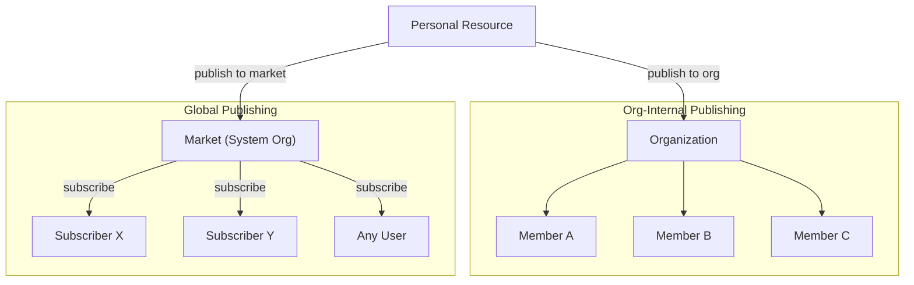
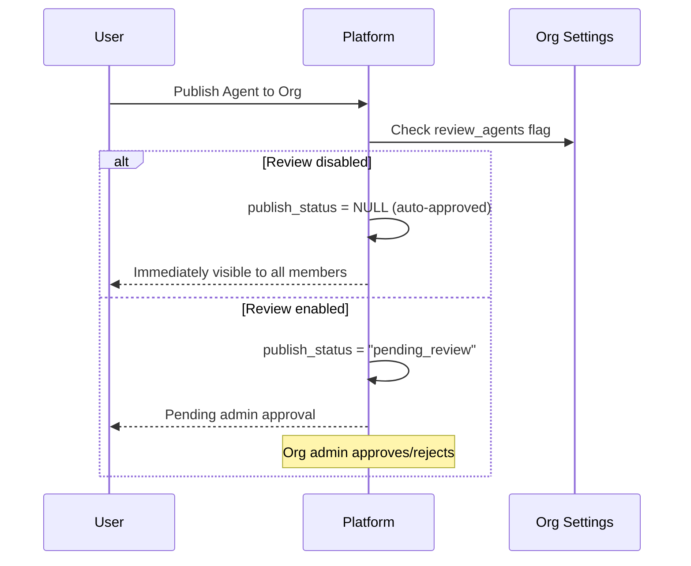
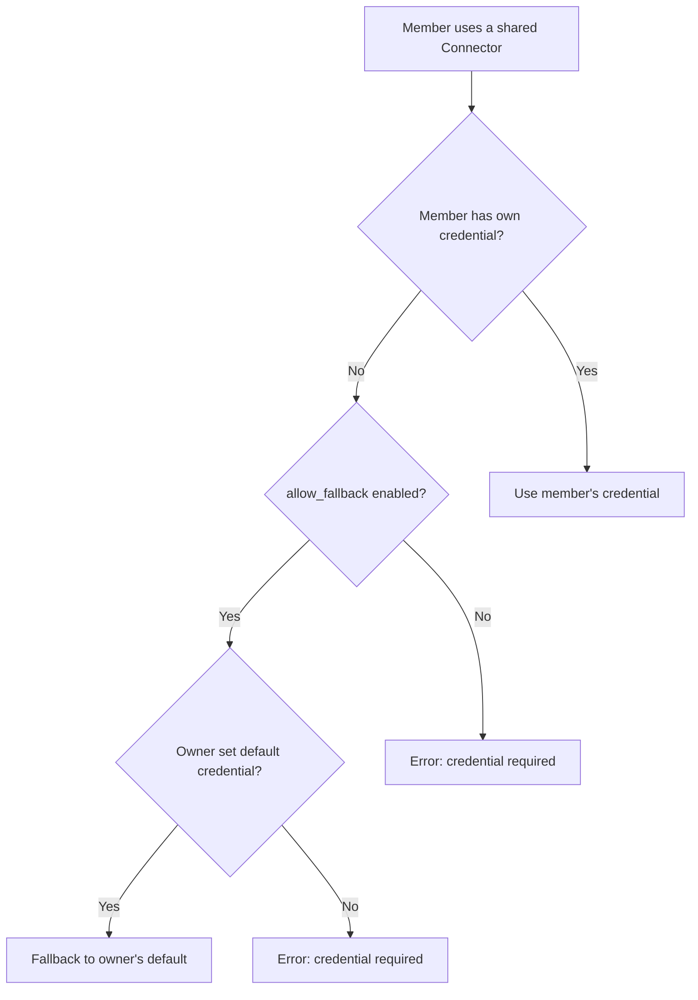
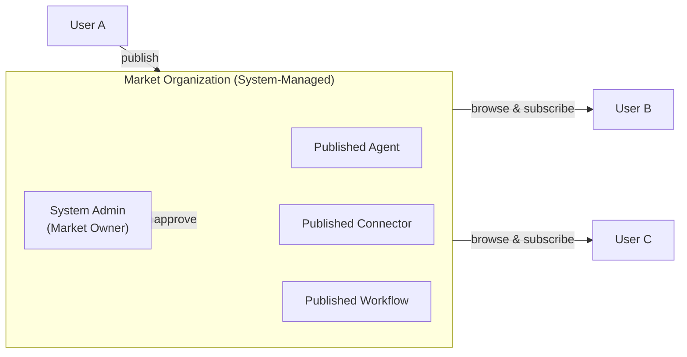
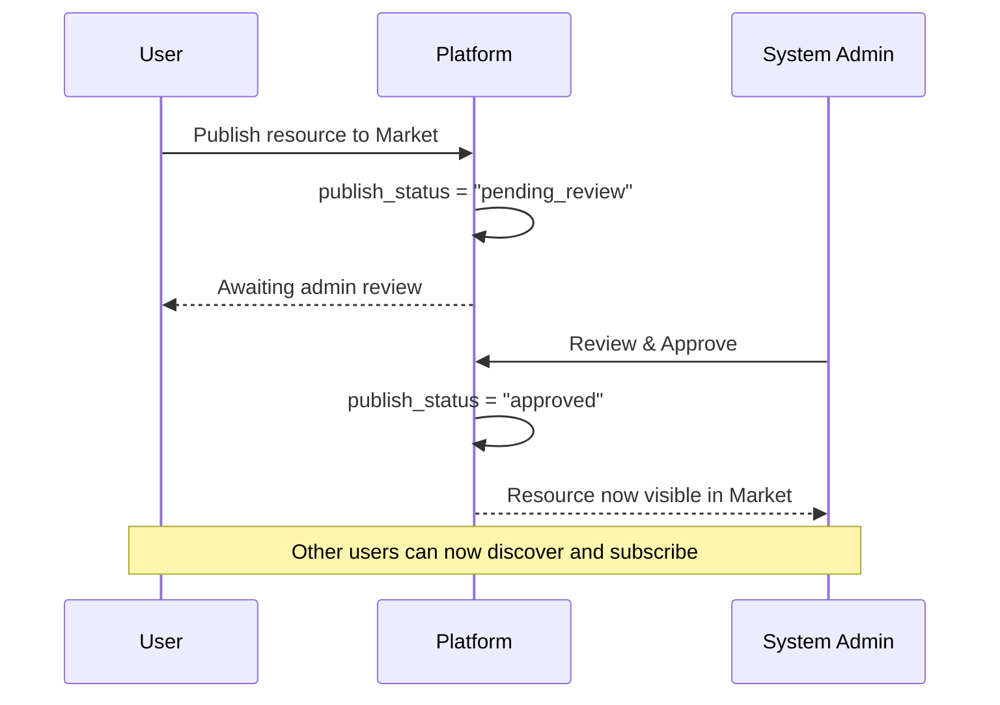
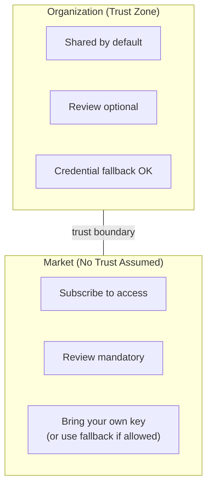

## Aperçu

FIM One utilise les **Organisations** comme unité principale de collaboration et de distribution des ressources. Chaque ressource (Agent, Connecteur, Base de connaissances, Serveur MCP, Flux de travail, Compétence) commence comme **personnelle** et peut être publiée dans une Organisation pour être partagée.

Il existe deux canaux de distribution distincts :



| Canal | Modèle de confiance | Révision | Accès | Gestion des identifiants |
|---|---|---|---|---|
| **Organisation** | Confiance élevée (équipe/entreprise) | Optionnelle (par type de ressource) | Automatique pour tous les membres | Recours aux identifiants du propriétaire |
| **Marché** | Aucune confiance (communauté mondiale) | Toujours requise | Abonnement préalable obligatoire | Recours ou apportez votre propre clé |

## Organisations

### Création et adhésion

Chaque utilisateur peut créer des organisations **illimitées** et en rejoindre autant qu'il le souhaite. Une organisation comprend :

- **Propriétaire** : le créateur, avec contrôle total
- **Administrateurs** : peuvent gérer les membres et examiner les ressources publiées
- **Membres** : peuvent afficher et utiliser les ressources partagées

### Publication des ressources

Lorsqu'un utilisateur publie une ressource dans son organisation, elle apparaît dans la liste de ressources correspondante pour tous les membres — les Agents apparaissent dans la liste des Agents, les Connecteurs dans la liste des Connecteurs, et ainsi de suite.



**L'examen est facultatif.** Chaque organisation dispose de commutateurs d'examen indépendants pour chaque type de ressource (`review_agents`, `review_connectors`, `review_kbs`, `review_mcp_servers`, `review_workflows`, `review_skills`). Lorsque l'examen est désactivé, les ressources publiées sont immédiatement disponibles pour tous les membres — similaire à un lecteur d'équipe partagé.

<Tip>
Les propriétaires d'organisation contournent automatiquement l'examen. Leurs ressources publiées sont toujours immédiatement disponibles.
</Tip>

### Secours des identifiants

Pour les connecteurs et les serveurs MCP qui nécessitent des identifiants (clés API, mots de passe de base de données, etc.), FIM One fournit un **mécanisme de secours** :



- **Secours activé** (`allow_fallback=true`, par défaut) : les membres qui ne fournissent pas leurs propres identifiants utilisent automatiquement les identifiants par défaut du propriétaire. Ceci est idéal pour les clés API partagées en équipe ou les services internes.
- **Secours désactivé** (`allow_fallback=false`) : chaque membre doit configurer ses propres identifiants. Ceci est approprié lorsque chaque utilisateur a besoin de sa propre clé API (par exemple, les licences SaaS par siège).

Les ressources qui ne nécessitent pas d'identifiants (par exemple, un connecteur API public en lecture seule, ou un agent sans authentification) fonctionnent immédiatement pour tous les membres — aucune configuration nécessaire.

## Market (Publication mondiale)

Le **Market** est une organisation spéciale gérée par le système qui sert de marché mondial de ressources pour FIM One.

### Comment fonctionne le Marché



Caractéristiques clés :

1. **Une seule instance globale.** Il existe exactement une organisation Marché dans le système. Elle est créée automatiquement lors de l'initialisation de la plateforme.
2. **Tous les utilisateurs sont des participants.** Tous les utilisateurs peuvent parcourir et s'abonner aux ressources du Marché. Le Marché est toujours accessible — c'est le canal de découverte par défaut.
3. **Examen obligatoire.** Contrairement aux organisations régulières, le Marché **exige toujours** un examen. Chaque ressource publiée doit être approuvée par un administrateur système avant de devenir visible. Cette exigence d'examen est verrouillée et ne peut pas être modifiée.
4. **S'abonner pour utiliser.** Les utilisateurs doivent explicitement s'abonner à une ressource du Marché avant qu'elle n'apparaisse dans leurs listes de ressources. Ceci est différent du partage interne à l'organisation, où les ressources sont automatiquement disponibles pour tous les membres.

### Publication sur le Marché



### S'abonner et utiliser

Une fois qu'une ressource est approuvée et listée sur le Marché, tout utilisateur peut :

1. **Parcourir** le Marché pour découvrir les ressources disponibles
2. **S'abonner** à une ressource qu'il souhaite utiliser
3. **Utiliser** la ressource — si elle nécessite des identifiants et ne supporte pas le fallback, configurer d'abord sa propre clé

## Limite de confiance

La distinction entre Organisation et Marché reflète une **limite de confiance** fondamentale :



### Au sein d'une organisation

Les membres de la même organisation partagent une **relation de confiance implicite**. Le propriétaire de l'organisation a décidé de réunir ces personnes, donc :

- Les ressources publiées sont **immédiatement disponibles** (sauf si l'examen est explicitement activé)
- La solution de secours pour les identifiants signifie que les membres peuvent utiliser les clés API partagées du propriétaire
- Aucune étape d'abonnement requise — si vous êtes dans l'organisation, vous voyez tout ce qui a été partagé

Cela reflète le fonctionnement des équipes en pratique : vous faites confiance à vos coéquipiers avec l'infrastructure partagée.

### À travers le Marché

Le Marché est **mondial** — n'importe qui peut publier, et n'importe qui peut s'abonner. Il n'y a pas de relation de confiance préexistante, donc :

- **L'examen est obligatoire** pour empêcher les ressources de faible qualité ou malveillantes d'entrer dans l'écosystème
- **L'abonnement est requis** afin que les utilisateurs acceptent explicitement les ressources (pas d'ajouts surprises à leur espace de travail)
- **La gestion des identifiants** suit le même mécanisme de secours, mais les utilisateurs doivent être conscients que l'utilisation d'une ressource du Marché avec secours signifie que leurs demandes transitent par les identifiants de l'éditeur

## Résumé de la Visibilité des Ressources

Chaque ressource dans FIM One possède un champ `visibility` qui détermine sa portée d'accès :

| Visibilité | Portée | Qui Peut Voir |
|---|---|---|
| `personal` | Propriétaire uniquement | L'utilisateur qui l'a créée |
| `org` | Organisation | Tous les membres de l'org cible (si approuvé) |
| `org` + Market | Global | Quiconque s'abonne (si approuvé par l'administrateur) |

La logique du filtre de visibilité est unifiée — la même requête gère les ressources personnelles, organisationnelles et abonnées :

```
Visible si :
  1. Vous en êtes propriétaire (toute visibilité), OU
  2. Elle est publiée dans une org à laquelle vous appartenez ET approuvée, OU
  3. Vous vous y êtes abonné depuis le Market
```

## Scénarios Pratiques

### Scénario 1 : Partage d'un connecteur de base de données en équipe

1. Alice crée un connecteur vers la base de données PostgreSQL de l'équipe
2. Alice le publie dans l'organisation de son équipe (révision désactivée pour les connecteurs)
3. Bob et Carol, en tant que membres de l'organisation, le voient immédiatement dans leur liste de connecteurs
4. Le connecteur utilise les identifiants de base de données d'Alice comme solution de secours — Bob et Carol n'ont rien à configurer
5. Si Dave (entrepreneur externe) a besoin de ses propres identifiants en lecture seule, il peut les remplacer par les siens

### Scénario 2 : Publication d'un Agent sur la Marketplace

1. Alice crée un Agent « Contract Analyzer » et le publie sur la Marketplace
2. L'administrateur système l'examine et l'approuve
3. L'Agent apparaît sur la page de navigation de la Marketplace
4. Bob le découvre, clique sur « S'abonner », et il apparaît dans sa liste d'Agents
5. L'Agent référence un Connecteur qui nécessite une clé API avec `allow_fallback=false` — Bob doit configurer sa propre clé avant de l'utiliser

### Scénario 3 : Organisation avec révision stricte

1. Une entreprise axée sur la conformité active `review_agents=true` et `review_connectors=true` sur son organisation
2. Lorsqu'un employé publie un nouvel Agent, il entre dans l'état « pending_review »
3. Un administrateur de l'organisation examine la configuration de l'Agent et l'approuve
4. Ce n'est qu'alors qu'il devient disponible pour les autres membres
5. Si l'éditeur modifie ultérieurement l'Agent approuvé, il revient automatiquement à « pending_review » pour une nouvelle approbation
