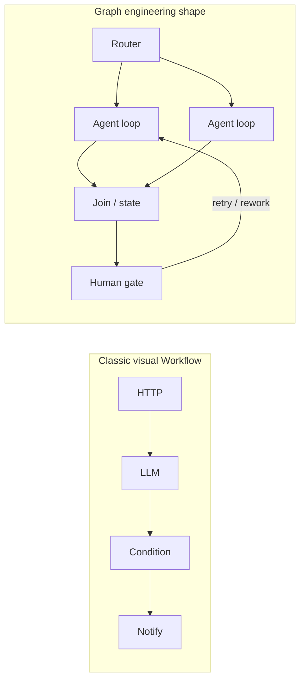
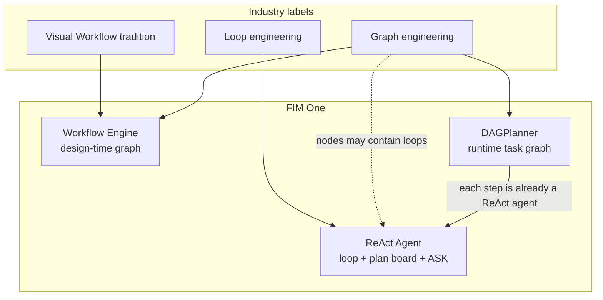
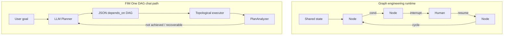
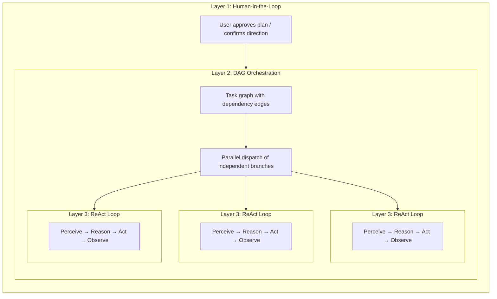

## Graph engineering (2026) et FIM One

Les discussions sectorielles encadrent souvent un passage du **loop engineering** (un seul agent pensant et agissant de manière répétée) au **graph engineering** (faire de la topologie multi-nœuds un objet d'ingénierie explicite). L'étiquette est nouvelle ; la pratique ne l'est pas. Les systèmes de style LangGraph et les organisations multi-agents utilisent les graphes depuis des années. Ce qui importe pour FIM One, c'est le **type** de graphe dont les gens parlent, et comment cela s'inscrit dans nos trois couches d'exécution.

### Ce que l'ingénierie de graphe signifie généralement

| Couche (cadre courant) | Préoccupation |
|---|---|
| **Harness** | Outils, sandbox, auth, logging, quotas autour du modèle |
| **Loop** | Cycle think → act → observe d'un agent |
| **Graph** | Comment les **nœuds** se connectent : branches, jointures, cycles, points de contrôle humains, état partagé |

Consensus sur ce cadre : **le graphe ne remplace pas la boucle**. Les designs de graphe **conçoivent les relations entre processus** ; chaque nœud agentique peut toujours exécuter une boucle complète.

« Graph » est surchargé en pratique. Trois usages se mélangent :

| Usage | Exemple | Rôle |
|---|---|---|
| **Graphe de flux de contrôle** | LangGraph `StateGraph` : arêtes conditionnelles, tentatives, interrupt/resume | Machine d'état pour déterminer qui s'exécute ensuite |
| **Graphe de dépendances de tâches** | Claude Code Tasks `blockedBy` ; FIM One `depends_on` | Planifier et paralléliser le travail |
| **Graphe de connaissances** | Entités et relations typées | Récupération / mémoire (pas orchestration) |

Cette page traite des deux premiers (orchestration).

### Pas « Dify Workflow avec un nouveau nom »

Les **workflows visuels** de style Dify et l'ingénierie de graphes partagent une origine commune (**topologie explicite**) mais ce ne sont pas le même produit.

| | Workflow visuel classique (ex. Dify) | Ingénierie de graphes (usage 2026) |
|---|---|---|
| **Artefact principal** | Canevas / schéma que l'implémenteur dessine | Topologie en tant que conception système versionnée (code ou config) |
| **Nœuds** | Blocs de capacité fixes (LLM, HTTP, KB, condition…) | **Hétérogènes** : fonctions, routeurs, **agents complets**, humains, jointures |
| **Où réside l'intelligence** | Principalement à l'intérieur de nœuds LLM isolés ; le graphe est un tuyau | Souvent **à l'intérieur des nœuds** (chacun peut être une boucle) ; le graphe organise les rôles |
| **Arêtes** | Succès/échec du pipeline et branches | Flux de contrôle **et** transitions d'état, incluant **cycles contrôlés** |
| **Humain dans la boucle** | Formulaires / approbations comme modules complémentaires | Interruption / reprise comme primitives de première classe |
| **Relation à la boucle** | Souvent vendu comme « Workflow **vs** Agent » | Explicitement **Graphe plutôt que Boucle** |

Forme courte : le Workflow classique est un **tuyau déterministe (ou semi-déterministe)** avec des étapes LLM occasionnelles. L'ingénierie de graphes est une **topologie système multi-nœuds**, où les postes critiques peuvent toujours être des agents autonomes.

### Comment la carte industrielle s'inscrit dans FIM One

FIM One couvre déjà l'ensemble du spectre de contrôle ; le mode « Planner » du chat n'en est qu'une tranche.

| Idée industrielle | Élément FIM One le plus proche | Adéquation |
|---|---|---|
| Workflow visuel classique | **Workflow Engine** (blueprint au moment de la conception) | Forte |
| Graphe de flux de contrôle + HITL + état durable | Étapes humaines du workflow + confirmation gates ; partiellement sur DAG chat | Moyenne |
| Graphe de dépendances de tâches + planification parallèle | **DAGPlanner** (`depends_on`, fan-out topologique) | Forte sur la planification ; plus faible sur HITL en milieu de graphe |
| Boucle agent unique + mémoire de checklist | **ReAct** (`update_plan`, tools, `ask_user_question`) | Forte |
| Plan dessiné par LLM à l'exécution à chaque tour | **DAGPlanner** (pas Dify ; pas DSL design-time LangGraph) | Produit distinct |

### Ingénierie de graphe vs DAG FIM One (Planner de chat)

Même famille (topologie multi-étapes explicite). Espèces différentes.

| Dimension | Ingénierie de graphe (typique) | DAG FIM One (chat) |
|---|---|---|
| **Qui dessine le graphe** | Développeur / implémenteur (topologie stable) | **LLM à l'exécution** (nouveau graphe par objectif) |
| **Signification des arêtes** | Souvent **flux de contrôle** (où ensuite, y compris cycles) | Principalement **dépendance / données** (`depends_on`, exécution acyclique) |
| **Correction** | Retry au niveau des arêtes, nœud humain, reprise du même graphe | **PlanAnalyzer → replan** (souvent un graphe **nouveau**) |
| **Profondeur du nœud** | Le nœud peut être une boucle d'agent complète | **Déjà ReAct complet par étape** : `DAGExecutor` exécute `agent.run()` avec une boucle d'outils multi-itération (limite par défaut de `DAG_STEP_MAX_ITERATIONS`, généralement 15). Le modèle par défaut est le registre **général** (pas infrastructure rapide) ; `model_hint` peut escalader vers le raisonnement ou rétrograder vers rapide. Le cache d'outils, la vérification des étapes/citations et la preuve de source sont fournis avec chaque étape. Les agents d'étape définissent `enable_plan_tool=False` (pas de tableau `update_plan` à l'intérieur d'une étape) car l'unité de travail est déjà une sous-tâche ciblée. |
| **État partagé** | État typé de première classe + récit de point de contrôle | Résultats d'étape + mémoire/compact ; les points de contrôle d'étape existent |
| **Questions en cours d'exécution** | Interruption comme fonctionnalité produit | Les portes de confirmation existent ; **`ask_user_question` est ReAct uniquement** (boucle externe de chat), pas une arête d'attente DAG de première classe |
| **Entrée produit** | Framework ou organigramme backend | Mode visible par l'utilisateur à côté de ReAct |

**Implication :** la chaleur industrielle autour de l'ingénierie de graphe **valide le maintien d'un moteur de graphe/planification**. Elle ne **nécessite pas** un défaut de chat qui force les utilisateurs à choisir « Planner » à chaque tour. La plupart des tâches veulent toujours une boucle forte ; les graphes se justifient sur les branches parallèles, les chemins de conformité fixes et l'orchestration multi-rôles.

### Ce que FIM One peut apprendre (renforcer ReAct, DAG, Workflow)

Des enseignements concrets, pas des slogans. Ordonnés par impact.

| # | Idée d'ingénierie de graphe | Appliquer à | Direction |
|---|---|---|---|
| 1 | **Graphe plutôt que boucle, pas à la place** | Produit + Routage automatique | L'UX par défaut reste **ReAct** (boucle + `update_plan` + `ask_user_question`). Utiliser DAG/Workflow quand la topologie justifie le coût. |
| 2 | **Nœuds profonds hétérogènes** | DAG | **Déjà l'état actuel.** Chaque étape est un agent ReAct complet (`agent.run`, outils multi-itération, modèle général ou meilleur par défaut), pas un appel LLM unique. Les commandes restantes sont optionnelles (p. ex. tableau de plan sur les étapes longues), pas une lacune structurelle. |
| 3 | **Interruption / reprise comme arêtes** | DAG + ReAct | La clarification en cours d'exécution appartient à la **boucle externe** ou comme état d'attente de première classe. Éviter les fausses étapes DAG qui « posent une question à l'utilisateur » en texte puis replanifient comme « objectif non atteint ». |
| 4 | **Cycles contrôlés vs replanification du graphe entier** | DAG | Préférer la nouvelle tentative locale / report partiel (déjà partiellement vrai pour les étapes terminées) à la vidange de tout le texte d'étape comme réponse finale échouée. |
| 5 | **État partagé typé le long des arêtes** | DAG + Workflow | Des contrats plus forts pour l'E/S d'étape (schéma, livrables) réduisent la fausse confiance de l'Analyseur et la dérive réponse/source. |
| 6 | **Topologie comme actif versionné** | Workflow | Conserver les graphes créés par l'humain pour l'audit ; ne pas s'attendre à ce que les DAG LLM d'exécution remplacent les plans de conformité. |
| 7 | **Honnêteté : « la plupart des tâches n'ont jamais besoin d'un graphe »** | Auto + docs | Router clarifier-et-choisir, Q&A court et travail exploratoire vers ReAct ; réserver DAG pour le travail parallèle décomposable. |

**Anti-motifs à éviter lors de « l'utilisation de graphe » :**

- Utiliser un **graphe de dépendances** pour simuler une **machine d'état humaine** (« attendre les réponses » multi-étapes sans primitive d'attente).
- Assimiler **`update_plan`** ReAct (mémoire de liste de contrôle) à l'ingénierie de graphe (topologie de planification).
- Livrer la chaleur du graphe comme une deuxième personnalité de chat au lieu de comme **composition de moteur** (boucle à l'extérieur, planification à l'intérieur si nécessaire).
- Décrire les étapes DAG de FIM One comme « appels LLM peu profonds » : cela sous-estime le moteur et induit les décisions produit en erreur.

## Cinq types de « planification » dans le paysage des outils IA

Le mot « planification » est surchargé. Au moins cinq approches distinctes existent aujourd'hui, et elles résolvent des problèmes différents :

| Approche | Format du plan | Exécution | Approbation | Valeur centrale |
|---|---|---|---|---|
| **Planification implicite du modèle** | Chaîne de pensée interne | Passage d'inférence unique | Aucune | Le modèle réfléchit aux étapes par lui-même |
| **Mode plan Claude Code** | Document Markdown | Série | Examen humain avant exécution | Aligner sur l'approche avant de toucher au code |
| **Claude Code Teams** | Liste de tâches avec arêtes de dépendance | **Concurrence** (multi-agent) | L'humain approuve le plan, puis autonome | Pool d'agents dynamique + exécution parallèle |
| **Développement piloté par spec Kiro** | Spec structuré (exigences + conception + tâches) | Série | Examen humain de la spec | Exigences traçables, critères d'acceptation |
| **DAG FIM One** | Graphe de dépendance JSON | **Concurrence** (orchestrateur unique) | Automatique (PlanAnalyzer) | Exécution parallèle + planification à l'exécution |

Les deux premiers sont une planification au **moment de la conception** — ils produisent un plan *avant* que le travail ne commence, et un humain (ou le modèle lui-même) le suit étape par étape. Les trois derniers introduisent une planification à l'**exécution** — les graphes d'exécution sont générés et planifiés par programmation, avec des branches indépendantes s'exécutant en parallèle. La différence réside dans *qui* exécute : Claude Code Teams lance des agents autonomes ; FIM One DAG distribue les étapes au sein d'un orchestrateur unique.

Ces approches ne sont pas des concurrentes ; ce sont des couches complémentaires. Une spec de style Kiro peut définir *quoi* construire, tandis qu'un DAG FIM One peut planifier *comment* exécuter les sous-tâches en concurrence. Le mode plan de Claude Code garantit qu'un humain accepte l'approche ; PlanAnalyzer de FIM One vérifie le résultat automatiquement.

## Three-Layer Nesting: The Full-Power Architecture

Both Claude Code Teams and FIM One DAG, at full capacity, exhibit a **three-layer nested architecture**:

- **Layer 1 — Human gate**: User reviews the plan and approves before execution begins.
- **Layer 2 — DAG orchestration**: The approved plan is decomposed into tasks with dependency edges. Independent tasks run in parallel; downstream tasks wait for their blockers to resolve.
- **Layer 3 — ReAct inner loop**: Each task is executed by an agent running a full ReAct cycle (Perceive → Reason → Act → Observe), capable of multi-step reasoning, tool use, and autonomous retry.

The key insight: **Claude Code Teams and FIM One DAG implement the same three layers, just with different Layer 2 mechanics** — message-passing vs dependency-edge resolution.

## Full-Power Runtime: FIM One vs Claude Code Teams

Both are genuine Agents — the core loop is identical: **Perceive → Reason → Act → Feedback**. The difference lies in how they orchestrate parallel work at full capacity.

| Dimension | Claude Code Teams | FIM One DAG |
|---|---|---|
| **Parallel model** | Leader spawns SubAgents, assigns tasks via messages | Topological sort auto-parallelizes independent steps |
| **Task graph** | TaskList with `blockedBy` / `blocks` edges (dynamic DAG) | Static JSON DAG with `depends_on` edges |
| **Coordination** | Explicit message passing (SendMessage / Broadcast) | Implicit dependency edges — no messages, just data flow |
| **Agent lifecycle** | Dynamic pool — agents spawned on demand, shut down when done | Per-step **ReAct agents** (fresh agent per step via `_resolve_agent`); each step runs a full multi-iteration tool loop |
| **Feedback & correction** | Each SubAgent retries autonomously; Leader re-assigns on failure | PlanAnalyzer evaluates outcomes → Re-Planning loop (up to 3 rounds); completed steps can carry into the next plan |
| **Human involvement** | Plan mode approval, then autonomous execution | Fully automatic — PlanAnalyzer decides pass/replan (chat-level ASK is ReAct-only) |
| **Context management** | Each SubAgent gets isolated context window (no cross-contamination) | Shared DbMemory + LLM Compact across the turn; each step agent still sees its task + dependency results, not a full peer transcript |
| **Token economics** | `N agents × per-agent tokens` — time↓ tokens↑ (multiplicative cost) | Parallel branches cost more than serial ReAct, but shared memory and step caps usually stay below multi-agent team spend |
| **Scaling pattern** | Add more SubAgents (horizontal, message-coupled) | Add more DAG branches (horizontal, dependency-coupled) |
| **Best suited for** | Diverse, loosely-related tasks (research + code + test) | Structured workflows with clear data dependencies |

### Benchmark réel : Système RAG v0.5

Claude Code Teams a construit l'intégralité du sous-système RAG v0.5 de FIM One en une seule session :

- **8 phases** : Embedding → Reranker → Loaders → Chunking → VectorStore → Retrieval → KB Backend → Frontend + Docs
- **46 tests** réussis, build frontend propre
- **Temps écoulé** : ~5 minutes
- **Coût en tokens** : ~100k tokens par tâche agent × 8+ tâches ≈ 800k+ tokens au total
- **Arêtes de dépendance** : Phase 5 dépend de Phase 4 + 1b ; Phase 6 dépend de Phase 5 + 2 + 3 — un véritable DAG

Cela démontre le compromis fondamental : **parallélisme temporel au prix d'une multiplication de tokens**. Claude Code Teams échange des dollars de calcul contre des heures de développeur.

### Converger, pas concurrencer

La frontière entre « collaboration d'équipe » et « ordonnancement de pipeline » s'estompe :

- **Les `blockedBy`/`blocks` de Claude Code Teams SONT un DAG** — les tâches ont des arêtes de dépendance explicites, et le leader distribue les tâches nouvellement débloquées à mesure que les prédécesseurs se terminent. C'est de l'ordonnancement topologique avec des étapes supplémentaires (messages).
- **Les étapes DAG de FIM One sont déjà des agents ReAct complets** — la couche 3 n'est pas aspirationnelle. Chaque étape exécute `agent.run()` avec des outils et des boucles multi-itérations ; les différences par rapport à un tour de chat ReAct de haut niveau sont délibérées (pas de tableau de plan par étape, pas d'attente `ask_user_question` au niveau du chat, modèle choisi par `model_hint` / défaut général).

**Conclusion :** Même essence d'agent, philosophies parallèles convergeant. Claude Code suit un modèle de **collaboration d'équipe** — un Leader délègue aux Workers qui communiquent via des messages. FIM One suit un modèle de **ordonnancement de pipeline** — un Exécuteur DAG distribue des **étapes ReAct** basées sur la résolution des dépendances. En pratique, les deux implémentent l'exécution parallèle pilotée par les dépendances ; la différence réside dans la surcharge de coordination (messages vs arêtes), l'isolation (agents pairs vs tâche + résultats de dépendance), et l'économie de tokens. L'écart produit est moins « transformer les nœuds en agents » et plus **quand ordonnancer un graphe vs rester dans une boucle de chat unique**, plus les **arêtes d'attente humaine** où le graphe ne peut pas se mettre en pause.

## Structured Output Degradation

All structured LLM call sites in the DAG pipeline (Planner, Analyzer, Tool Selection) use a unified `structured_llm_call()` utility that implements a 3-level degradation chain:

| Level | Condition | How it works |
|---|---|---|
| **Native FC** | `llm.abilities["tool_call"]` | Forces a virtual tool call; extracts from `tool_calls[0].arguments` |
| **JSON Mode** | `llm.abilities["json_mode"]` | Sets `response_format={"type":"json_object"}`; parses with `extract_json()` |
| **Plain text** | always available | Parses free-form content with `extract_json()`, then optional `regex_fallback()` |

Each text-based level retries once with a reformat prompt before falling to the next. The result is a `StructuredCallResult` containing the parsed value, which extraction level succeeded, and accumulated token usage.

This design means the same prompt works reliably across GPT-4 (native FC), Claude (JSON mode), and local models (plain text), with consistent error handling and retry logic in one place instead of scattered across four call sites.

## Three Execution Layers: Control Spectrum

Les cinq approches de planification ci-dessus décrivent le paysage. Au sein de FIM One lui-même, trois couches d'exécution offrent un **spectre de contrôle** allant du contrôle humain total à l'autonomie complète de l'IA. Par rapport à l'ingénierie de graphes : **Workflow** est le produit de graphe au moment de la conception ; **DAGPlanner** est un graphe de tâches à l'exécution ; **ReAct** est l'ingénierie de boucles (avec mémoire optionnelle du plan-board, pas un graphe d'ordonnancement).

| Couche | Graphe défini par | Le graphe existe quand ? | Rôle de l'ingénierie de graphes | Idéal pour |
|---|---|---|---|---|
| **Workflow Engine** | Utilisateur (canevas visuel / blueprint JSON) | Temps de conception | Closest to classic visual Workflow + durable process topology | Processus déterministes, pistes d'audit/conformité, automatisation planifiée |
| **DAGPlanner** | LLM (décompose automatiquement l'objectif) | Exécution | Graphe de dépendances de tâches + ordonnancement parallèle + analyse des résultats | Travail multi-étapes décomposable avec limites de sous-tâches claires |
| **ReAct Agent** | Aucun (boucle itérative) | Jamais comme graphe d'ordonnancement | Couche de boucle ; les nœuds dans un graphe plus large peuvent être des agents ReAct | Exploratoire, conversationnel, clarifier puis agir, raffinement itératif |

Le principe de conception : **donner aux utilisateurs exactement autant de contrôle qu'ils le souhaitent**.

- Besoin de prouver que chaque approbation de prêt passe par cinq étapes spécifiques ? → Workflow.
- Besoin de rechercher trois sujets en parallèle puis synthétiser ? → DAG.
- Besoin de rédiger, affiner ou poser des questions structurées en cours d'exécution ? → ReAct.
- Pas sûr ? → `execution_mode: "auto"` classe la requête et l'achemine vers DAG ou ReAct à l'exécution (préférer ReAct quand l'objectif est principalement la clarification ou l'exploration courte).

Cette stratification est ce qui distingue FIM One des outils monolithiques :

- **Dify** met l'accent sur la couche Workflow (graphes visuels statiques ou semi-statiques).
- **LangGraph** met l'accent sur un DSL de graphe de flux de contrôle au niveau du code (topologie définie par le développeur, routage dynamique, points de contrôle). Structurellement lié aux workflows visuels, exprimé sous forme de logiciel.
- **Les agents de classe Manus** mettent l'accent sur la couche Agent/boucle (exécution autonome, peu de structure définie par l'utilisateur).

FIM One couvre les trois couches, plus le routage automatique entre les moteurs de chat. La progression **graphe défini par l'utilisateur → graphe de tâches généré par LLM → pas de graphe d'ordonnancement** correspond à une honnêteté plus large de l'industrie : à mesure que les modèles s'améliorent, **la topologie explicite devient optionnelle pour la plupart des tours**, pas obligatoire dans l'interface utilisateur. La chaleur de l'ingénierie de graphes est une raison d'**investir dans les moteurs et la composition**, pas de forcer chaque chat à travers un planificateur.

### Documentation connexe

- [Moteur ReAct](/architecture/react-engine) — boucle, outils, tableau de planification, questions de clarification
- [Moteur DAG](/architecture/dag-engine) — planificateur, exécuteur, analyseur, replanification
- [Paysage concurrentiel](/strategy/competitive-landscape) — positionnement de Dify / Manus / Coze
