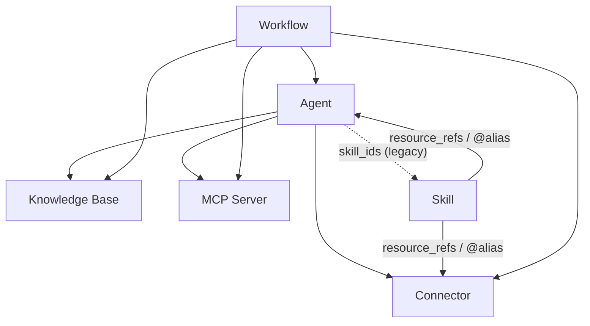

Cette page est la référence unique pour les **permissions de partage** et le **flux d'identifiants**. Les types de ressources partageables sont les **Agents, Connecteurs et serveurs MCP** (plus les **Skills** et **Workflows** quand ces modules optionnels sont activés). Utilisez-la pour comprendre ce qui se passe quand vous partagez une ressource qui elle-même repose sur d'autres ressources.

<Note>
**Les bases de connaissances ne sont pas partageables.** Une KB n'atteint d'autres personnes que si elle est liée à un Agent partagé, qui délègue le contenu du propriétaire au moment de l'exécution (voir « Comment l'accès circule à travers les ressources liées »). Il n'y a pas d'action de publication de KB.
</Note>

## Les deux questions

Chaque décision de partage répond à deux questions indépendantes :

1. **Visibilité** — *l'autre personne peut-elle voir/utiliser cette ressource du tout ?*
2. **Identifiants** — *avec quel secret (clé API, mot de passe BD, env serveur) s'exécute-t-elle ?*

La visibilité concerne la ressource ; les identifiants sont une préoccupation distincte et par utilisateur que seuls les Connectors et les serveurs MCP portent. Gardez-les séparés dans votre esprit — la plupart de la confusion provient de la confusion entre « je peux le voir » et « je peux utiliser la clé du propriétaire ».

## Visibilité : propre + abonné

Une ressource vous est visible uniquement si **vous en êtes propriétaire** ou **vous avez un abonnement explicite** à celle-ci. Il n'y a plus de "tout le monde dans mon organisation peut la voir" implicite — le partage organisationnel est livré via les abonnements.

| Portée de partage | Signification | Comment les autres accèdent |
| --- | --- | --- |
| **Personnel** (par défaut) | Seul le propriétaire peut la voir. | — |
| **Organisation** | Publié dans une organisation. | Les membres de l'organisation **s'abonnent** depuis la Market (ou sont auto-abonnés à l'adhésion). |
| **Global / Market** | Publié sur la Market publique. | Tout le monde **s'abonne** depuis la Market. |

La même règle s'applique partout où une ressource est utilisée — assemblage d'outils de chat, liaison à un agent et étape de workflow résolvent tous **propre + abonné**. Ainsi, un connecteur auquel vous êtes abonné peut être lié à un agent et appelé à partir d'un workflow ; un que vous ne pouvez ni voir ni auquel vous abonner est refusé dans les trois cas.

<Note>
Les abonnements sont limités : quitter (ou être retiré de) une organisation révoque les abonnements que vous aviez uniquement via celle-ci, et supprime les identifiants par utilisateur que vous aviez enregistrés pour ces ressources.
</Note>

## Credentials & "Allow fallback"

Seuls les **Connectors** et les **serveurs MCP** détiennent des credentials. Chacun dispose d'un commutateur **Allow fallback** qui détermine si les abonnés peuvent emprunter la credential du propriétaire :

| État | Un abonné **avec** sa propre credential | Un abonné **sans** sa propre credential | Le propriétaire |
| --- | --- | --- | --- |
| **Allow fallback OFF** *(par défaut)* | Utilise sa propre credential. | **Pas d'accès** — l'outil est masqué et l'interface les invite à configurer leur propre credential. | Utilise toujours la sienne. |
| **Allow fallback ON** | Utilise sa propre credential. | Bascule vers la credential du **propriétaire** (et tout usage/facturation est imputé au propriétaire). | Utilise toujours la sienne. |

Règles clés :

- **OFF est l'état par défaut.** Le partage de votre token est volontaire. Un connector ou serveur MCP nouvellement créé ne partage pas la credential du propriétaire, et les existants ont été migrés vers OFF.
- **Le propriétaire est toujours exempté.** "Allow fallback" ne régit que les *autres* utilisateurs ; vous pouvez toujours utiliser votre propre connector avec votre propre credential.
- **Pas d'échec silencieux.** Quand fallback est OFF et qu'un utilisateur n'a pas de credential, l'outil est **retiré de l'ensemble d'outils** plutôt que proposé puis échouant au moment de l'appel. Chaque surface (chat, le **Playground**, étapes de workflow) doit afficher une invite "configurez vos propres credentials" au lieu d'un outil défaillant.

## Comment le flux d'accès traverse les ressources liées

Les ressources se composent. Partager une ressource expose implicitement les ressources liées en dessous — mais **les identifiants d'accès ne circulent pas automatiquement avec elles**.

| Conteneur | Peut référencer | Comment |
| --- | --- | --- |
| **Agent** | Knowledge Bases, Connectors, MCP servers | `kb_ids` / `connector_ids` / `mcp_server_ids` |
| **Agent** | Skills | `skill_ids` *(hérité — préférer Skill→Agent)* |
| **Skill** | Connectors, Agents, … | `resource_refs` (le mécanisme `@alias`) |
| **Workflow** | Agents, Knowledge Bases, Connectors, MCP servers | par nœud `agent_id` / `kb_id(s)` / `connector_id` / `mcp_server_id` |

Quand vous partagez le conteneur, les références voyagent avec lui comme un **graphe d'identifiants** — un workflow ou un agent partagé ne porte aucun secret intégré. À l'exécution, chaque ressource référencée revérifie l'accès de l'*exécutant* :

- **Knowledge Bases** n'ont pas d'identifiant d'accès par utilisateur, donc une KB liée à un agent partagé **délègue son contenu** : quiconque exécute l'agent lit les données du propriétaire de la KB (l'agent a besoin de sa KB pour fonctionner). La délégation est contrôlée par la visibilité du **propriétaire de l'agent** — si le propriétaire de l'agent perd l'accès à une KB liée (par exemple après avoir quitté l'organisation via laquelle elle a été partagée), cette KB est supprimée de l'agent au lieu de continuer à être lue. La recherche ad-hoc dans une KB en dehors d'un agent lié est vérifiée par rapport à l'appelant (propre + abonnée).
- **Connectors / MCP servers** portent des identifiants d'accès, donc ils délèguent **uniquement quand Allow fallback est activé** (voir ci-dessous).

## Scénarios concrets

Vous possédez un Agent qui lie un connecteur **personnel** (vous n'avez pas partagé
le connecteur lui-même). Vous partagez l'**Agent** avec votre organisation ou globalement. Quelqu'un d'autre l'exécute :

| Scénario | « Allow fallback » du connecteur | Ce que l'autre utilisateur obtient |
| --- | --- | --- |
| **3a** | **ON** | L'outil connecteur est disponible et s'exécute avec **vos** identifiants — l'autre utilisateur peut l'utiliser. L'utilisation vous est facturée. |
| **3b** | **OFF** *(par défaut)* | L'outil connecteur est **masqué** pour cet utilisateur. Le reste de l'agent fonctionne toujours ; l'interface utilisateur lui demande d'ajouter **ses propres** identifiants pour ce connecteur, après quoi l'outil réapparaît et s'exécute avec sa clé. |

En d'autres termes : **partager l'agent ne partage pas le secret du connecteur.** Le
paramètre « Allow fallback » du connecteur lui-même est le seul commutateur qui décide
si l'identifiant traverse la liaison. Il en va de même pour un connecteur ou un serveur
MCP référencé à partir d'une Skill ou d'une étape Workflow.

<Note>
C'est pourquoi le modèle recommandé pour un connecteur que vous avez l'intention de partager est :
laissez **Allow fallback désactivé**, et laissez chaque utilisateur lier ses propres identifiants. Activez-le
uniquement lorsque vous souhaitez délibérément prêter votre clé (et absorber l'utilisation) —
par exemple une API facturée à l'usage que vous êtes à l'aise de payer pour le compte d'autres.
</Note>
