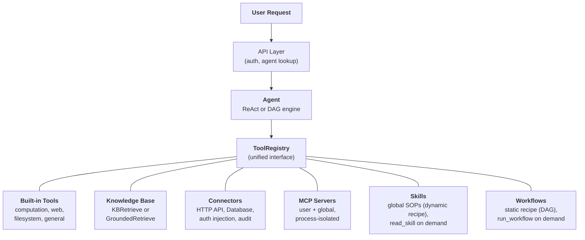
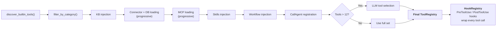
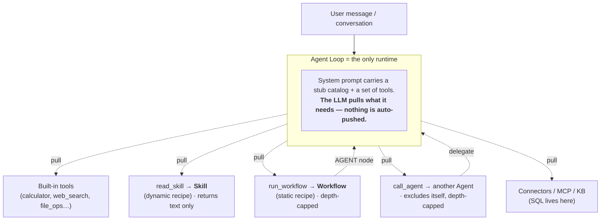

## L'abstraction unifiée des outils

L'insight de conception central dans FIM One est que **tout ce que l'agent peut faire est un outil**. Une calculatrice, une requête de base de connaissances, un appel API ERP, et un serveur MCP tiers implémentent tous le même protocole `Tool` : `name`, `description`, `parameters_schema`, `category`, et `run()`. L'agent ne sait pas et ne se soucie pas s'il appelle une fonction Python locale, interroge une base de données vectorielle, proxie dans un système hérité, ou invoque un serveur MCP communautaire. Il voit une liste plate d'outils appelables dans un `ToolRegistry`.

C'est un choix architectural délibéré, pas une simplification accidentelle. Cela signifie qu'ajouter une nouvelle source de capacité ne nécessite jamais de modifier l'agent, les moteurs d'exécution, ou la couche de gestion du contexte. Vous enregistrez des outils ; l'agent les utilise.

Six sources de capacité convergent dans un registre unique. L'agent puise dans toutes de manière égale. Les deux dernières forment une paire appariée : une **Skill** est une *recette dynamique* (un SOP que le LLM interprète étape par étape), et un **Workflow** est une *recette statique* (un graphe déterministe qui s'exécute de la même manière à chaque fois). Les deux sont extraits via un outil — `read_skill` et `run_workflow` respectivement — et aucun ne contient l'autre ; ce sont des pairs consommés par le même runtime.

## Six capability sources

### Outils intégrés

Découverts automatiquement au démarrage via `discover_builtin_tools()`. Déposez une sous-classe `BaseTool` dans `core/tool/builtin/`, et elle s'enregistre sans aucune configuration. Les catégories incluent le calcul (`calculator`, `python_exec`), le web (`web_search`, `web_fetch`), le système de fichiers (`file_ops`), et les outils généraux (`email_send`, `json_transform`, `template_render`, `text_utils`). Ce sont les capacités natives de l'agent -- toujours disponibles, zéro configuration.

### Base de Connaissances

Conditionnel. Lorsqu'un agent a lié des `kb_ids`, l'outil générique `kb_retrieve` est remplacé par un outil de récupération spécialisé. En **mode simple**, `KBRetrieveTool` effectue une récupération RAG basique. En **mode grounding**, `GroundedRetrieveTool` exécute un pipeline à 5 étapes : récupération multi-KB, extraction de citations, scoring d'alignement, détection de conflits et calcul de confiance. La Base de Connaissances n'est pas un sous-système séparé situé à côté de l'agent -- elle entre dans l'agent en tant qu'outil spécialisé, soumis au même protocole `Tool` que tout le reste.

### Connecteur

`ConnectorToolAdapter` encapsule les actions des systèmes d'entreprise en tant qu'outils. Chaque action devient un outil nommé `{connecteur}__{action}`, catégorisé comme `connecteur`. L'adaptateur ajoute un proxy HTTP avec injection d'authentification (bearer, clé API, authentification basique), contrôle d'accès au niveau des opérations (lecture/écriture/administrateur), troncature des réponses et journalisation d'audit. Pour l'accès direct à la base de données, `DatabaseToolAdapter` fournit l'exécution SQL consciente du schéma avec application optionnelle du mode lecture seule. Les connecteurs sont le pont entre l'IA et les systèmes hérités -- le différenciateur clé. Voir [Architecture des connecteurs](/architecture/connector-architecture) pour la conception complète.

### MCP

Les serveurs MCP externes fournissent des outils tiers via le protocole standard. Chaque serveur s'exécute dans son propre processus (transport stdio ou HTTP), complètement isolé de la plateforme. Les outils sont adaptés au protocole `Tool` et enregistrés sous la catégorie `mcp`. Les administrateurs peuvent provisionner des **serveurs MCP globaux** qui se chargent automatiquement pour tous les utilisateurs. MCP est le jeu de l'écosystème -- tout serveur compatible MCP fonctionne sans intégration personnalisée.

### Compétences

Les compétences sont des procédures opérationnelles standard (POS) réutilisables -- politiques d'entreprise, procédures de traitement, flux de travail étape par étape -- qui s'appliquent globalement quel que soit l'Agent sélectionné. Contrairement aux Connecteurs et aux Bases de Connaissances (qui peuvent être limités à des Agents spécifiques), les Compétences sont toujours chargées pour chaque utilisateur en fonction de la visibilité (personnelle, partagée au niveau de l'organisation ou abonnée au Marché).

Les Compétences supportent deux modes d'injection -- **progressif** (par défaut) et **en ligne** -- contrôlés par `SKILL_TOOL_MODE`. En mode progressif, des stubs compacts apparaissent dans l'invite système et le LLM appelle `read_skill(name)` à la demande. Cela fait partie de l'architecture plus large [Progressive Disclosure](/architecture/progressive-disclosure) qui applique le même modèle stub-first, detail-on-request sur les Compétences, les Connecteurs, les Bases de Données et les Serveurs MCP.

Pour une analyse plus approfondie de la raison pour laquelle les Compétences sont globales (non liées à un Agent) et comment elles interagissent avec la découverte de ressources en mode dual, consultez [Agent & Resource Discovery](/architecture/agent-discovery).

### Workflows

Un Workflow est la **recette statique** du Skill dynamique : un DAG déterministe auquel un agent recourt quand une sous-tâche doit s'exécuter de manière identique à chaque fois et laisser une trace d'audit (réconciliations planifiées, pipelines multi-étapes sans approbation). Comme les Skills, les Workflows exécutables sont chargés globalement par utilisateur selon la visibilité — indépendamment de la sélection de l'agent — et exposés via un seul outil `run_workflow(name, inputs)`, avec les champs d'entrée de chaque workflow annoncés comme un stub de prompt système compact. Le LLM en sélectionne un par nom quand une tâche s'y rapporte.

Seuls les Workflows qui sont **actifs** et **exempts de nœuds d'approbation humaine (`HUMAN_INTERVENTION`)** sont exécutables en ligne — une barrière qui bloque pendant des minutes ou des heures ne peut pas se trouver à l'intérieur d'un tour d'agent, donc ces Workflows restent déclenchables uniquement depuis la page Workflows. Les exécutions en ligne s'effectuent en tant que propriétaire du workflow (les Workflows abonnés utilisent les identifiants liés de l'éditeur), persistent un `WorkflowRun` pour la trace d'audit, et sont protégés par une garde contre la réentrance plus un plafond de profondeur d'imbrication afin qu'un nœud `AGENT` du Workflow ne puisse jamais démarrer un cycle d'appel non borné.

## Assemblage d'outils par requête

Chaque requête de chat assemble un ensemble d'outils frais via un pipeline de filtrage dans `_resolve_tools()`. Ce n'est pas une configuration statique -- elle est calculée par requête en fonction des paramètres de l'agent, de l'identité de l'utilisateur, et des connecteurs et serveurs MCP disponibles.

Les huit étapes :

1. **Découverte de base.** `discover_builtin_tools()` charge tous les outils intégrés, limités au bac à sable de la conversation.
2. **Filtre de catégorie d'agent.** `filter_by_category(*agent.tool_categories)` restreint uniquement aux catégories que l'agent est autorisé à utiliser.
3. **Injection de KB.** Si l'agent a `kb_ids`, l'outil de récupération générique est remplacé par `KBRetrieveTool` ou `GroundedRetrieveTool` selon le mode de récupération.
4. **Chargement des connecteurs.** En mode contraint par agent, seuls les connecteurs liés à l'agent sont chargés. En mode découverte automatique (aucun agent sélectionné), tous les connecteurs visibles par l'utilisateur sont chargés. Les connecteurs API (`ConnectorMetaTool`) et les connecteurs de base de données (`DatabaseMetaTool`) utilisent la [divulgation progressive](/architecture/progressive-disclosure) par défaut -- stubs légers dans l'invite système, schémas complets chargés à la demande.
5. **Chargement MCP.** Les serveurs MCP personnels de l'utilisateur plus les serveurs MCP globaux provisionnés par l'administrateur sont chargés et connectés. En mode progressif (par défaut), un seul `MCPServerMetaTool` consolide tous les serveurs ; l'LLM appelle les sous-commandes `discover` et `call` à la demande. Voir [Divulgation progressive](/architecture/progressive-disclosure).
6. **Injection de Skills + Workflows.** Tous les Skills actifs visibles par l'utilisateur sont chargés -- indépendamment de la sélection d'agent. En mode progressif, `ReadSkillTool` est enregistré avec des stubs compacts dans l'invite système ; en mode inline, le contenu complet du Skill est intégré directement. La même étape charge tous les Workflows actifs et exécutables en ligne, et enregistre `RunWorkflowTool` avec un stub par workflow (nom, description, champs d'entrée). Les Workflows portant un nœud d'approbation humaine sont ignorés ici.
7. **Enregistrement de CallAgent (mode Auto uniquement).** Quand aucun Agent spécifique n'est sélectionné, tous les Agents actifs et visibles sont assemblés dans un catalogue et exposés via `CallAgentTool`, permettant à l'LLM de déléguer des tâches à des agents spécialisés. Les agents délégués reçoivent un `ToolRegistry` complet construit à partir de leur propre configuration mais excluent `call_agent` pour prévenir la récursion infinie. Quand un Agent spécifique est sélectionné, `CallAgentTool` n'est pas enregistré -- les agents sont spécialisés et ne délèguent pas à d'autres agents. Cela empêche les agents de la marketplace d'accéder aux invites privées d'autres agents.
8. **Sélection à l'exécution.** Si le nombre total d'outils dépasse 12, un appel LLM léger sélectionne le sous-ensemble le plus pertinent (jusqu'à 6) pour cette requête spécifique. Un meta-outil `request_tools` est automatiquement enregistré, permettant à l'LLM de charger dynamiquement des outils supplémentaires en milieu de conversation si la sélection initiale a manqué un outil nécessaire. L'échec de sélection n'est pas fatal -- l'agent revient à l'ensemble complet. Voir [Divulgation progressive](/architecture/progressive-disclosure).
9. **Enregistrement des hooks.** Les hooks déclarés de l'agent (depuis `model_config_json.hooks`) sont instanciés et attachés à un `HookRegistry`. Chaque appel d'outil choisi sera enveloppé : les hooks `PreToolUse` peuvent bloquer ou réécrire les arguments avant l'exécution ; les hooks `PostToolUse` peuvent réécrire l'observation avant qu'elle ne revienne à l'LLM. Les hooks s'exécutent **en dehors de la boucle LLM** et ne peuvent pas être contournés par les instructions de l'agent -- voir [Système de hooks](/architecture/hook-system).

Le résultat : l'agent voit exactement les outils dont il a besoin, pas plus. Un agent simple sans connecteurs et sans KB pourrait voir 5 outils. Un agent Hub connecté à 3 systèmes d'entreprise avec une base de connaissances ancrée et 2 serveurs MCP pourrait en voir 30 -- mais après sélection, seuls les 6 les plus pertinents se retrouvent dans le contexte.

## Quand utiliser quoi

| Besoin | Utiliser | Pourquoi |
|------|-----|-----|
| Calcul général, exécution de code, transformations de texte | Built-in Tool | Toujours disponible, aucune configuration nécessaire |
| Intégration de systèmes d'entreprise (ERP, CRM, OA) | Connector | Gouvernance de l'authentification, piste d'audit, contrôle d'accès au niveau des opérations |
| Récupération de connaissances avec citations et preuves | Knowledge Base | Pipeline RAG, génération ancrée, scoring de confiance |
| Écosystème d'outils tiers | MCP | Protocole standard, isolation des processus, serveurs communautaires |
| Politiques organisationnelles, procédures opérationnelles, procédures de traitement | Skill (dynamic recipe) | Global par défaut, chargement progressif, visibilité limitée |
| Un processus multi-étapes déterministe et reproductible invoqué en milieu de conversation | Workflow (static recipe) | Même résultat à chaque exécution, piste d'audit, s'exécute en tant que propriétaire ; les workflows avec validation humaine restent déclenchement uniquement |
| Délégation de tâches à des agents spécialisés | CallAgent | Routage sémantique d'agents, héritage complet des outils, exécution parallèle |
| Accès direct à la base de données | Database Connector | SQL conscient du schéma, application optionnelle du mode lecture seule |
| Outils internes personnalisés | MCP ou Built-in | MCP pour l'isolation des processus ; built-in pour une intégration étroite |

Les catégories ne s'excluent pas mutuellement. Un seul agent peut utiliser les cinq sources de capacités dans une conversation — charger une Skill pour la procédure opérationnelle de traitement des réclamations, interroger une base de connaissances pour les documents de politique, appeler un connecteur pour vérifier l'ERP, déléguer l'analyse à un agent spécialisé (en mode Auto), et utiliser un built-in tool pour formater les résultats.

## Les moteurs d'exécution sont orthogonaux

Le système d'outils et les moteurs d'exécution sont des préoccupations indépendantes. Les moteurs pilotés par LLM (ReAct et DAG) consomment des outils à partir du même `ToolRegistry`. Le choix du moteur affecte la façon dont les outils sont orchestrés, non les outils disponibles.

**ReAct** est une boucle d'outils itérative. L'agent raisonne, choisit un outil, observe le résultat et répète jusqu'à ce que ce soit terminé. Il excelle dans les tâches exploratoires et conversationnelles où l'étape suivante dépend du résultat précédent. La boucle s'exécute jusqu'à 50 itérations avec gestion du contexte par itération via ContextGuard. Voir [Moteur ReAct](/architecture/react-engine) pour les détails d'implémentation.

**DAG** décompose un objectif en 2-6 étapes parallèles. Chaque étape exécute un agent ReAct indépendant. Un PlanAnalyzer évalue si l'objectif a été atteint ; sinon, le pipeline se réplanifie automatiquement (jusqu'à 3 tours). DAG excelle dans les tâches avec des sous-tâches claires qui peuvent s'exécuter en parallèle -- « rechercher trois sources et comparer les résultats » se termine dans le temps d'une recherche, pas trois. Voir [Moteur DAG](/architecture/dag-engine) pour le pipeline complet.

Les deux moteurs partagent une infrastructure : `structured_llm_call` pour une sortie structurée fiable, `ContextGuard` pour l'application du budget de jetons, et `ToolRegistry` pour la résolution des outils. L'ajout d'un nouvel outil ne nécessite aucune modification dans l'un ou l'autre moteur. L'ajout d'un nouveau moteur (s'il était jamais nécessaire) ne nécessite aucune modification du système d'outils.

Les deux moteurs supportent également la **délégation d'agent** via `CallAgentTool` en mode Auto (aucun agent sélectionné). En mode d'appel de fonction natif, le LLM peut invoquer plusieurs appels `call_agent` en un seul tour, qui s'exécutent en parallèle via `asyncio.gather`. Chaque agent délégué reçoit son propre `ToolRegistry` et s'exécute comme une unité d'exécution complète. Pour la conception détaillée de la découverte d'agents, des Skills en tant que procédures opérationnelles standard globales, et de la délégation d'agents, voir [Découverte d'agents et de ressources](/architecture/agent-discovery).

### Workflow Engine — le troisième paradigme

Aux côtés des moteurs ReAct et DAG pilotés par LLM, FIM One inclut un **Workflow Engine** — un éditeur DAG visuel avec 9 types de nœuds principaux (Start, End, LLM, Condition Branch, Agent, Knowledge Retrieval, Connector, MCP, Human Intervention) pour l'automatisation de processus fixes. Utilisez les Agents pour les tâches flexibles et exploratoires ; utilisez les Workflows pour les processus déterministes et répétables. Consultez [Execution Modes](/concepts/execution-modes) pour plus de détails.

Les deux se composent **dans les deux directions**, mais chaque direction passe par le runtime unique — la boucle d'agent — jamais par un second moteur d'exécution :

- **Workflow → Agent.** Le nœud `AGENT` d'un Workflow exécute un agent comme une étape déterministe unique.
- **Agent → Workflow.** Un agent (ou une Skill qu'il suit) utilise `run_workflow` pour déléguer une sous-tâche qui doit s'exécuter de manière déterministe.

Ceci résout le problème évident de cycle : seule la **boucle d'agent est un runtime**. Les Skills et Workflows sont des recettes inertes qu'elle charge ; ils ne s'exécutent jamais l'un l'autre. « Une Skill appelant un Workflow » signifie physiquement que l'agent, en suivant le SOP de la Skill, appelle `run_workflow`. Chaque invocation passe par l'agent, donc le graphe d'appels est une **étoile**, non un maillage — et les arêtes arrière sont bornées (`read_skill` retourne uniquement du texte ; `call_agent` et `run_workflow` comportent des limites de profondeur et une garde de réentrance).

Deux lectures de la même image : **les outils sont tirés, non poussés** (une Skill ou un Workflow que le LLM ne sélectionne jamais ne s'exécute simplement jamais — c'est pourquoi les capacités dynamiques peuvent sembler invisibles jusqu'à ce qu'une requête en corresponde une), et **les Skills et Workflows sont des pairs** routés par un runtime unique plutôt que imbriqués l'un dans l'autre.

## Aperçu du cycle de vie

**Démarrage.** `start.sh` exécute les migrations Alembic, lance le serveur FastAPI, découvre les outils intégrés et établit les connexions du serveur MCP pour tous les serveurs globaux préconfigurés.

**Par requête.** Authentification JWT, recherche de configuration d'agent, assemblage d'outils (le pipeline en 8 étapes ci-dessus), sélection du moteur (ReAct ou DAG selon la configuration de l'agent), exécution avec streaming SSE et persistance des résultats.

**Préoccupations transversales.** [La gestion du contexte](/architecture/context-management) (budget de tokens à 5 niveaux) protège chaque appel LLM contre le débordement. Le [Système de hooks](/architecture/hook-system) enveloppe chaque appel d'outil avec la logique `PreToolUse` / `PostToolUse` contrôlée par la plateforme — le mécanisme derrière l'approbation en boucle humaine (`FeishuGateHook`), la journalisation d'audit et l'application du mode lecture seule. La journalisation d'audit suit chaque invocation d'outil connecteur. L'isolation sandbox contient les outils d'exécution de code. L'architecture à deux LLM (intelligent + rapide) optimise les coûts entre la planification, l'exécution et la synthèse.

L'architecture est conçue de sorte que chaque préoccupation — enregistrement d'outils, orchestration d'exécution, gestion du contexte, sécurité — peut évoluer indépendamment. Un nouveau type de connecteur, un nouveau moteur d'exécution ou une nouvelle stratégie de contexte peut être ajouté sans changements en cascade dans le système.
