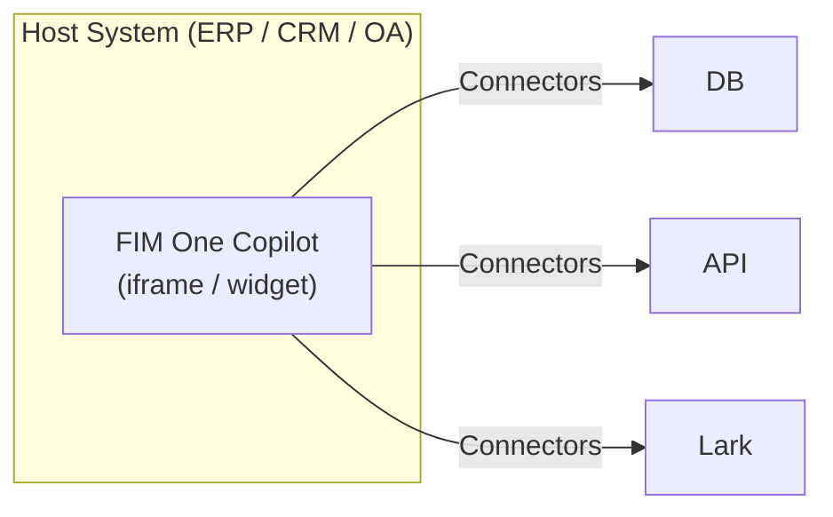
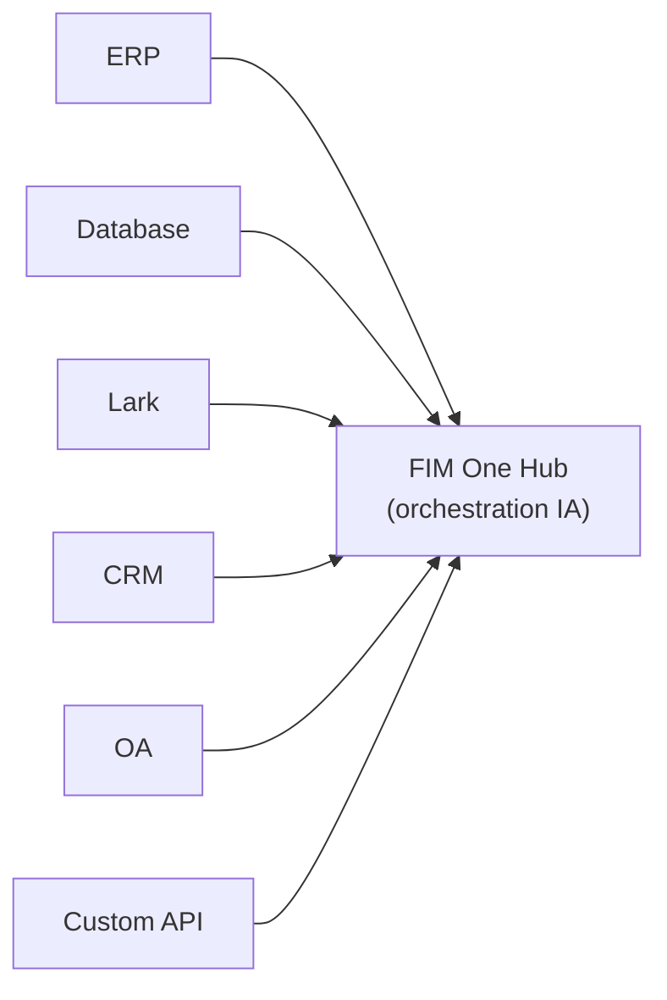
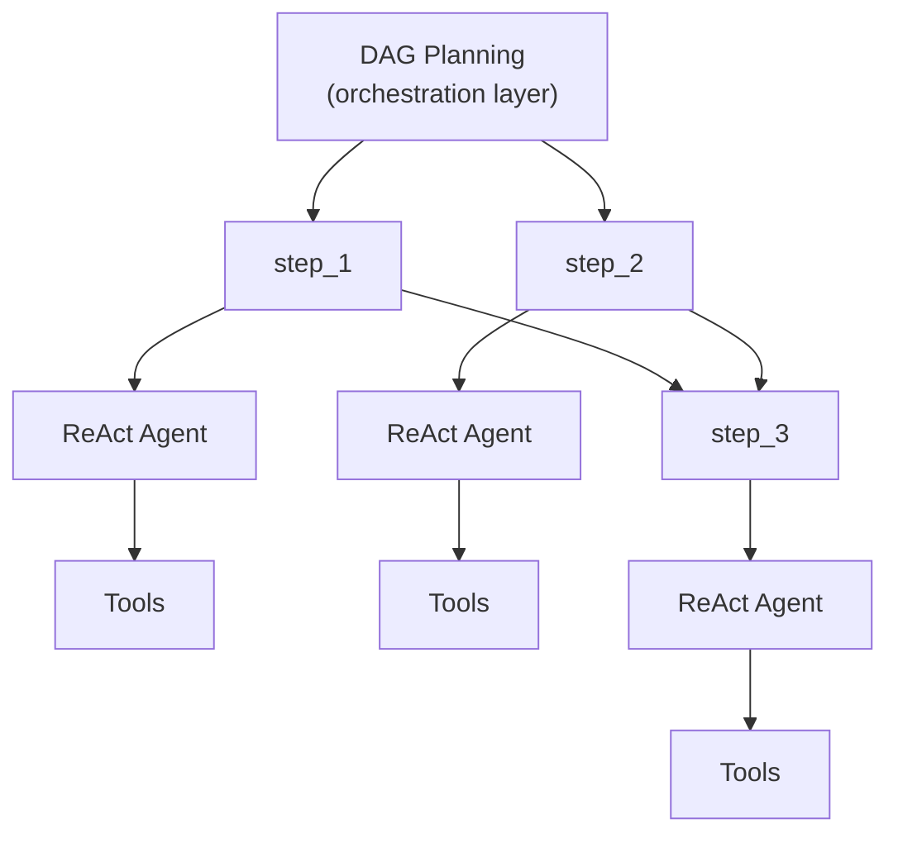

## Trois modes

FIM One fonctionne selon trois modes, déterminés par la façon dont l'agent est déployé et utilisé :

| Mode | Qu'est-ce que c'est | Livraison | Exemple |
|------|-----------|----------|---------|
| **Standalone** | Assistant IA polyvalent | Portail | Chat, recherche, exécution de code, Q&A base de connaissances |
| **Copilot** | IA intégrée dans un système hôte | iframe / widget / embed | « Finance Copilot » intégré dans l'interface web ERP |
| **Hub** | Orchestration centrale inter-systèmes | Portail / API | L'agent interroge l'ERP, vérifie les approbations OA, notifie via Lark |

La progression est naturelle : commencer en mode Standalone, intégrer dans un système hôte en tant que Copilot, puis configurer un Hub pour l'orchestration inter-systèmes. Le Copilot continue de fonctionner en mode intégré ; le Hub ajoute une couche d'orchestration centrale.

## Détails du mode

### Autonome (0 connecteurs)

Le mode par défaut. FIM One fonctionne comme un assistant IA complet :

- Outils intégrés : recherche web, exécution Python, calculatrice, opérations sur fichiers, commandes shell
- Base de connaissances avec RAG (PDF, DOCX, Markdown, HTML, CSV)
- Planification DAG dynamique pour les tâches complexes multi-étapes
- Streaming en temps réel avec visualisation DAG

Aucun accès à un système externe requis. Utile pour l'analyse générale, la recherche et les tâches de codage.

### Copilot (intégré)

Intégrez FIM One dans l'interface web d'un système hôte. L'agent travaille aux côtés des utilisateurs dans leur interface familière — aucun changement de contexte requis. Le mode Copilot peut utiliser plusieurs connecteurs (par exemple, la base de données du système hôte + un service de notification).

Exemples :
- **Finance Copilot** : Connecté à Kingdee (金蝶) via connecteur DB → interroger les états financiers, générer des rapports d'analyse
- **Contract Copilot** : Connecté au système de gestion des contrats via connecteur API → rechercher des contrats, extraire des clauses, évaluer les risques
- **HR Copilot** : Connecté au système RH via connecteur API → interroger les informations des employés, générer des statistiques

L'agent utilise le même moteur ReAct/DAG qu'en mode Standalone, mais a maintenant accès aux données métier réelles via le connecteur.

### Hub (orchestration centrale)

Le Hub est un portail autonome (ou une API) qui sert de couche d'intelligence centrale. Il n'est intégré dans aucun système unique — au lieu de cela, il se connecte à tous. Les utilisateurs y accèdent via l'interface utilisateur du portail ou l'API.

Exemples :
- « Vérifier les contrats en retard dans le CRM, recouper avec les paiements ERP, notifier l'équipe finance sur Lark »
- « Quand l'approbation OA est terminée, mettre à jour le statut du contrat dans le CRM et enregistrer dans la base de données d'audit »
- « Interroger les données de ventes de Salesforce, générer une prévision à l'aide de la base de données métier, envoyer un résumé par e-mail à la direction »

Chaque connecteur est un pont indépendant. L'ajout ou la suppression d'un ne affecte pas les autres.

## Méthodes de livraison

| Livraison | Description | Mode typique |
|----------|-------------|-------------|
| **Portail (Interface Web)** | Interface Next.js intégrée | Autonome, Hub |
| **API (sans interface)** | Points de terminaison HTTP/SSE (`/api/execute`, `/api/stream`) | Hub (accès programmatique) |
| **iframe / Intégration** | Injectée dans les pages du système hôte | Copilot |

La livraison et le mode sont liés mais non verrouillés : vous pouvez accéder à un Hub via l'API, ou utiliser un agent autonome via le Portail. Mais le modèle typique est Portail pour Hub, intégration pour Copilot.

## Moteurs d'exécution (implémentation interne)

Sous le capot, FIM One fournit deux moteurs d'exécution :

| Moteur | Idéal pour | Fonctionnement |
|--------|----------|-------------|
| **ReAct** | Requêtes complexes uniques | Boucle Reason → Act → Observe avec outils |
| **DAG Planning** | Tâches multi-étapes parallèles | L'LLM génère un graphe de dépendances, les étapes indépendantes s'exécutent en parallèle |

ReAct est l'unité atomique ; DAG est la couche d'orchestration. Les deux moteurs fonctionnent dans les trois modes (Standalone, Copilot, Hub). En mode Hub, une seule étape DAG peut appeler des connecteurs vers différents systèmes.

## Deux paradigmes d'exécution

FIM One fournit deux paradigmes complémentaires pour accomplir le travail :

| Paradigme | Orchestration | Idéal pour |
|----------|--------------|----------|
| **Agent (Chat)** | L'LLM décide de l'étape suivante dynamiquement (ReAct ou DAG) | Tâches exploratoires, conversations, raisonnement flexible |
| **Workflow** | DAG fixe défini au moment de la conception (éditeur visuel, 26 types de nœuds) | Chaînes d'approbation, ETL planifiée, automations multi-étapes |

Les **Agents** excellent quand la tâche est ouverte — « analyser les données de ce trimestre et recommander des actions ». L'LLM planifie et s'adapte à la volée.

Les **Workflows** excellent quand le processus est connu et reproductible — « chaque lundi, extraire les factures de l'ERP, exécuter les vérifications de conformité, acheminer les exceptions vers un examinateur ». L'éditeur visuel vous permet de connecter des nœuds (Agent, Connecteur, KB, LLM, HTTP, Code, Approbation Humaine, Sous-Workflow) dans un DAG fixe.

Les deux paradigmes se composent naturellement : un Workflow peut invoquer un Agent à n'importe quelle étape qui nécessite un raisonnement flexible au sein d'un pipeline autrement fixe. Les Agents ne peuvent pas appeler directement les Workflows — la relation est unidirectionnelle.

<Tip>
**Quand choisir lequel :** Si vous vous trouvez à écrire des instructions très spécifiques, étape par étape, pour un Agent, ce processus appartient probablement à un Workflow. Si la tâche nécessite du jugement, de l'exploration ou une adaptation à des données inattendues, gardez-la comme un Agent.
</Tip>
