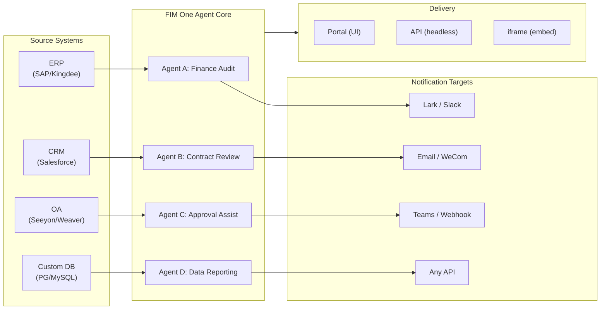

> Objectif : Construire une **plateforme d'agents tout-en-un pour les entreprises mondiales × chinoises** — livrée via trois modes progressifs : Standalone (assistant portail), Copilot (intégré au système hôte), Hub (orchestration centrale inter-systèmes).
>
> Principes : **Agnostique des fournisseurs** (pas de verrouillage propriétaire), **abstraction minimale**, **protocole en priorité**, **connecteur en priorité** (l'intégration est la valeur centrale).

## Vision produit

FIM One est une **plateforme d'agent tout-en-un** qui propose trois modes de livraison progressifs :

```
Standalone   → Your own AI assistant (Portal)
Copilot      → AI embedded in a host system (iframe / widget / embed)
Hub          → Central cross-system orchestration (Portal / API)
```

**L'orchestration inter-systèmes est le différenciateur clé.** Les clients d'entreprise disposent de systèmes hérités — ERP, CRM, OA, finance, HR — qui doivent communiquer les uns avec les autres via l'IA :



**Stratégie GTM : Land and Expand**

| Étape | Mode | Ce qui se passe |
|------|------|-------------|
| Land | Copilot | Intégrer dans un système, prouver la valeur dans leur interface |
| Expand | Copilot → Hub | Déployer sur plusieurs systèmes ; le mode Hub les agrège |

## Problèmes connus

Bugs suivis qui sont reproductibles en production mais pas encore corrigés. Chaque entrée nomme le symptôme, la zone de surface suspecte et la solution de contournement (le cas échéant). Les éléments sont déplacés vers une section de version une fois qu'un correctif est défini et planifié.

- **L'arrêt et la nouvelle tentative du playground affichent des artefacts visuels transitoires qu'une actualisation de page efface toujours.** Trois sources de rendu concurrentes — `activeConversation.messages` (snapshot DB), le flux SSE `messages` et l'espace réservé optimiste `pendingQuery` — ne sont pas regroupées dans un seul état dérivé, donc entre le clic sur « Retry » et l'arrivée de la réponse de l'assistant appairée, l'interface utilisateur peut (a) brièvement afficher la même requête deux fois dans la fenêtre pré-flux, (b) supprimer les bulles utilisateur orphelines antérieures de l'historique de nouvelle tentative tandis que `hasLiveMessages` est vrai et avant le rechargement du snapshot, et (c) scintiller dans la fenêtre étroite entre l'événement SSE « done » et l'actualisation `selectConversation` suivante. **Les données ne sont jamais perdues** — chaque message utilisateur (y compris les tentatives abandonnées) est conservé dans `conversation.messages`, transporté dans l'appel LLM suivant via `normalize_alternating_messages` et rendu correctement après actualisation via `HistoryTurn.orphanUserContents` introduit dans le correctif de rendu `48ba08c6`. Pour le contexte, l'interface web propre de Claude présente une classe de bug analogue — arrêter au milieu d'une réponse et envoyer immédiatement une requête de suivi crée parfois la requête de suivi comme une branche d'édition sœur de la première requête plutôt que de l'ajouter comme un nouveau tour — donc c'est un problème connu difficile dans les conceptions optimiste-UI + SSE + historique-persisté, pas un défaut spécifique à FIM One. Un correctif approprié nécessite de regrouper les trois sources de rendu dans un seul état dérivé ; reporté jusqu'à une refonte plus large de la machine d'état du Playground.

## Backlog (Low Priority) {/* dev: dev/dag-evidence-fidelity.md */}

Durcissement différé — non bloquant ; à traiter uniquement si le scénario correspondant se présente.

- [ ] **DAG evidence gets its own truncation budget**, decoupled from `DAG_ANALYZER_TRUNCATION`, so source evidence isn't re-clipped by the summary budget before the analyzer/synthesis verify against it.
- [ ] **Structure-aware evidence truncation** (head+tail / keep lists & tables) so long enumerations survive the cap instead of silently losing their tail.
- [ ] **Port the source-fidelity guideline into the ReAct fallback synthesis prompt** so total/severity mislabels are caught in ReAct too, not only in DAG.

# Versions expédiées

### v0.1 (2026-02-22) — MVP: ReAct + DAG Planner
- ReActAgent avec outils (calculator, python_exec, web_search)
- DAG Planner (LLM génère des graphes de dépendances)
- Portal UI avec streaming + KaTeX

### v0.2 (2026-02-24) — Multi-Model + Memory
- Retry / rate limiting / usage tracking
- Native function calling (no JSON-only parsing)
- Multi-model support (fast + main LLM)
- Memory: WindowMemory, SummaryMemory
- FastAPI backend with SSE streaming

### v0.3 (2026-02-25) — Web Tools + MCP
- Web tools (web_search, web_fetch) via Jina/Tavily/Brave
- File operations tool
- MCP client (standard tool integration)
- Tool auto-discovery + categories
- DAG visualization with click-to-scroll
- Code exec in Docker (`--network=none`)

### v0.4 (2026-02-25) — Multi-Turn + Agents
- Conversations multi-tours (DbMemory)
- Interface de repliement des étapes d'outils
- Outils de requête HTTP + exécution shell
- Gestion des agents (créer, configurer, publier)
- Authentification JWT
- Mode d'exécution par agent + contrôle de température

### v0.5 (2026-02-28) — Full RAG + Grounded Gen
- Pipeline RAG complet (embedding + vector store + FTS + RRF + reranker)
- Génération ancrée (citations, scores de confiance)
- Gestion de documents de base de connaissances (CRUD, recherche, retry, migration de schéma)
- ContextGuard + messages épinglés (gestionnaire de budget de tokens)
- Persistance DbMemory + LLM Compact
- DAG Re-Planning (jusqu'à 3 tours)

### v0.6 (2026-03-01) — Connector Platform
- **Connector CRUD**: create, read, update, delete
- **ConnectorToolAdapter**: converts Connector → BaseTool
- **Per-user credentials**: AES-GCM encryption
- **Confirmation gate**: write operation approval
- **Audit logging**: all tool calls recorded
- **Circuit breaker**: graceful degradation on failures
- **Utility tools**: email_send, json_transform, template_render, text_utils
- **Embedding options**: Jina, OpenAI, custom providers

### v0.7 (2026-03-06) — Admin Platform + Multi-Tenant
- **Admin Platform**: gestion des utilisateurs, basculement des rôles, réinitialisation de mot de passe, activation/désactivation de compte
- **Inscription sur invitation uniquement**: trois modes (ouvert/invitation/désactivé) + CRUD de code d'invitation
- **Gestion du stockage**: utilisation disque par utilisateur, suppression, nettoyage des orphelins
- **Modération des conversations**: liste/suppression admin de toutes les conversations
- **Déconnexion forcée par utilisateur**: révocation de tous les jetons
- **Tableau de bord de santé API**: statistiques système, métriques des connecteurs
- **Assistant de configuration initiale**: création guidée du compte administrateur
- **Centre personnel**: instructions globales par utilisateur, préférence de langue
- **Authentification JWT**: authentification SSE basée sur jetons, propriété des conversations
- **Serveurs MCP globaux**: provisionnés par l'administrateur, chargés dans toutes les sessions
- **Compatibilité rétroactive**: migration automatique registration_enabled → registration_mode

### v0.7.x (2026-03-07 to 2026-03-12) — Stability + Refinements
- Gestion des codes d'invitation
- Quotas par utilisateur (application de 429)
- Journalisation d'audit structurée
- Filtrage des mots sensibles
- Historique de connexion des administrateurs
- Navigateur de fichiers pour administrateurs
- Vues administrateur améliorées (champs model_name, tools, kb_ids)
- Déploiement Docker Compose (image unique, volumes nommés)
- Détection automatique OAuth depuis window.location
- Support de la réflexion étendue / raisonnement (`LLM_REASONING_EFFORT`, `LLM_REASONING_BUDGET_TOKENS`) pour OpenAI o-series, Gemini 2.5+, Claude
- Activation/désactivation des outils par administrateur (outils désactivés exclus du chat à l'exécution)
- Gestion des serveurs MCP déplacée vers la page Connecteurs
- Support de base de données double : SQLite (par défaut sans configuration) + PostgreSQL (production) ; Docker Compose provisionne automatiquement PostgreSQL
- Page de documentation de configuration des modèles avec configuration de la réflexion étendue par fournisseur
- Protocole SSE v2 : streaming de réponses en temps réel avec champs `delta_reasoning`, `usage` et événements séparés `done`/`suggestions`/`title`/`end` ; taille du pool SQLite 5 -> 20
- Expansion AI Builder : 7 nouveaux outils de builder (GetSettings, TestConnection, ImportOpenAPI pour connecteurs ; ListConnectors, AddConnector, RemoveConnector, SetModel pour agents), drapeau `is_builder` sur les agents, actualisation automatique du prompt du builder, protection SSRF
- Frontend SSE v2 : curseur avec point pulsant en streaming, snapshots de re-plan DAG sous forme de cartes réductibles, mise en page DAG découplée des états des étapes
- Page de documentation du concept AI Builder avec guides de connecteur et de builder d'agent
- Système d'organisation : CRUD complet avec adhésion basée sur les rôles (propriétaire/administrateur/membre), interface de gestion administrateur
- Visibilité des ressources à trois niveaux (personnel/org/global) pour les agents, connecteurs, bases de connaissances, serveurs MCP
- API Publier/Dépublier pour tous les types de ressources ; délégation de propriétaire pour les agents publiés
- Point de terminaison administrateur set-visibility (remplace clone-to-global) ; helper de requête `build_visibility_filter()` unifié
- Connecteurs de base de données (Phase 1-3) : accès SQL direct à PG/MySQL/Oracle/SQL Server + bases de données héritées chinoises ; introspection de schéma, annotation IA, exécution de requête en lecture seule, identifiants chiffrés, 3 outils par connecteur (`list_tables`, `describe_table`, `query`)
- **Centre d'évaluation** : benchmarking quantitatif de la qualité des agents — CRUD de jeu de données de test (prompt + comportement attendu + assertions), exécutions d'éval (exécution parallèle + évaluateur LLM + résultats par cas réussi/échoué/latence/token), visionneuse de résultats avec interrogation automatique ; migration `r8t0v2x4z567`
- Trois rôles de modèle (Général/Rapide/Raisonnement) avec isolation de configuration env par niveau ; le modèle rapide n'hérite plus des paramètres du modèle principal
- Classe de données `StepOutput` remplaçant les résultats d'étape en chaîne simple pour les données structurées et la transmission d'artefacts
- Cache d'outils pour l'exécution DAG — appels d'outils identiques mis en cache par exécution avec verrou asynchrone pour prévention du stampede (`DAG_TOOL_CACHE`)
- Vérification LLM par étape avec 1 nouvelle tentative en cas d'échec (`DAG_STEP_VERIFICATION`)
- Routage automatique : LLM rapide classe les requêtes comme ReAct ou DAG ; point de terminaison `/api/auto` ; basculement de mode 3 voies frontend (`AUTO_ROUTING`)
- [x] ~~**Organisation du marché fantôme + Abonnements aux ressources**~~ : Org Market intégré (fantôme, pas d'adhésion automatique) remplace l'org Platform ; ressources découvertes via navigation marketplace et explicitement abonnées (modèle pull) ; API Market pour s'abonner aux ressources partagées ; la publication sur Market nécessite toujours un examen ; table d'abonnements aux ressources ; partage de ressources basé sur l'org remplaçant la visibilité globale
- [x] ~~**Découverte automatique d'agent et liaison de sous-agent**~~ : drapeau `discoverable` sur les agents ; liste blanche `sub_agent_ids` ; CallAgentTool pour déléguer des tâches à des agents spécialisés
- [x] ~~**Identifiants de serveur MCP + Remplacement par utilisateur**~~ : table `mcp_server_credentials` ; point de terminaison `PUT /api/mcp-servers/{id}/my-credentials` ; drapeau `allow_fallback` pour le comportement de secours des identifiants
- [x] ~~**Basculement connecteur/KB**~~ : `POST /api/connectors/{id}/toggle` et `POST /api/knowledge-bases/{id}/toggle` pour suspendre/reprendre les ressources
- [x] ~~**Conversations KB autonomes**~~ : champ `kb_ids` sur les conversations pour le chat KB direct sans liaison d'agent

### v0.8 (2026-03-20) — Connector Declarative Config + Progressive Disclosure
- [x] **Database connectors**: direct SQL access (PostgreSQL, MySQL, Oracle) *(shipped in v0.7.x — Phase 1-3)*
- [x] **RBAC**: per-user/role connector access control *(shipped in v0.7.x — org system + three-tier visibility)*
- [x] **Connector credential encryption + per-user override**: `connector_credentials` table, Fernet encryption via `CREDENTIAL_ENCRYPTION_KEY`, `allow_fallback` flag, `GET/PUT/DELETE /my-credentials` endpoints, per-user credential resolution in chat tool loading
- [x] **Publish review UI**: Org-level publish review system — review toggle per org, ReviewsSheet with approve/reject workflow, status badges on resource cards, review notice in publish dialog, resubmit for rejected resources
- [x] **Connector Progressive Disclosure (Phase 1-2)**: single `ConnectorMetaTool` replaces per-action tools; system prompt receives lightweight **stubs** only (name + 1-line description, ~30 tokens/connector vs ~250 tokens/action); agent calls `discover(connector)` to load full action schema on demand — schema only loads when the model selects a connector, keeping the prompt prefix stable for caching. Follows the deferred tool-loading pattern common in modern agent frameworks. `execute` subcommand; feature flag for backward compatibility.
- [x] **Agent Skill System + Compact Instructions**: On-demand skill loading for agent instructions — `Skill` model (name, content/SOP, optional scripts) attached to agents; referenced in system prompt by name only (~10 tokens/skill); agent calls `read_skill(name)` to load full content on demand. Reduces per-conversation instruction token cost by ~80% while allowing richer SOP libraries. Counterpart to ConnectorMetaTool's progressive disclosure applied at the instruction level. Enables the "指令 + 工具 + 技能" differentiation story. Also adds `compact_instructions` field to Agent model — per-agent compression priority list injected into `ContextGuard` when compacting (e.g., "preserve order IDs and amounts, drop raw API responses"), replacing the current static generic prompt. Follows the Compact Instructions convention widely adopted in modern agent frameworks.
- [x] **Connector import/export**: share connector templates
- [x] **Connector fork**: clone + customize existing connectors
- [x] **Workflow Phase 2 Nodes**: Iterator, Loop, VariableAggregator, ParameterExtractor, ListOperation, Transform, DocumentExtractor, QuestionUnderstanding, HumanIntervention — 9 advanced node types with full frontend + backend + 150 new tests (275 total). Node retry with exponential backoff, safe expression evaluation. Stats panel with success rate bar. 12 built-in templates. Pane context menu (Paste, Select All, Fit View, Auto Layout).
- [x] **Workflow Phase 3 Nodes: SubWorkflow + ENV** — 2 new node types (25 nodes total), 14 new tests (306 total), 14 built-in templates. SubWorkflow: full DB-backed nested workflow executor with target workflow selection, variable mapping, and configurable depth limit to prevent infinite recursion. ENV: reads encrypted environment variables with key picker and fallback defaults. Full frontend (node components, config panels, palette entries, minimap colors). Per-node execution statistics panel (success rates, durations, failure counts sorted worst-first). `getNodeStats` API client + `NodeStatEntry` type. Keyboard shortcuts dialog (`?` key).
- [x] **Workflow Scheduled Triggers**: Per-workflow cron configuration with timezone, default inputs, and next-run-at calculation. Preset cron buttons, 30 trigger tests.
- [x] **Workflow API Triggers**: Public per-workflow API keys (`wf_` prefix) for external execution without user auth, with rate limiting. API key management dialog with generate/regenerate/revoke, trigger URL, and cURL/JS examples.
- [x] **Workflow Batch Execution**: `POST /batch-run` with up to 100 input sets, configurable parallelism (1-10), collapsible per-item results, JSON export. 14 batch execution tests.
- [x] **Workflow Execution Log Viewer**: Real-time chronological SSE event stream in the run panel with timestamps, color-coded badges, and event type filter toggles.
- [x] **Workflow Run Stats**: Backend batch-fetches run counts and success rates via GROUP BY subquery; frontend displays stats on workflow cards with color-coded success rate indicators.
- [x] **Workflow Scheduler Daemon**: Background async service polling every 60s for due cron-based workflows. Croniter timezone support, semaphore concurrency, `last_scheduled_at` tracking, webhook delivery. 14 tests.
- [x] **Workflow Import Conflict Resolver**: Detects unresolved agent/connector/KB/MCP references during import. Batch DB queries with visibility filtering, frontend toast warnings. 17 tests.
- [x] **Workflow Test-Node Execution**: Isolated single-node testing with mock variables, integrated into editor (config panel Test button + context menu). 23 tests.
- [x] **Workflow Version Diff**: Side-by-side blueprint comparison with node/edge change detection, color-coded indicators (added/removed/modified).
- [x] **Workflow Run Management**: Delete individual runs (`DELETE /runs/{run_id}`) and clear all completed runs (`DELETE /runs`), with frontend confirmation dialogs.
- [x] **Workflow Run Replay Overlay**: "View on Canvas" button in run history to overlay past execution results on the canvas, showing per-node status and output without re-executing.
- [x] **Workflow Favorites/Pinning**: Star/pin workflows to the top of the list with localStorage persistence.
- [x] **Workflow Run History Export**: Export run history as JSON file download with full run metadata and per-node results.
- [x] **Admin Workflows Management**: Admin panel tab for managing all workflows across users — list, toggle active/inactive, delete with confirmation. Batch endpoints for delete, toggle, and publish with audit logging.
- [x] **Workflow Templates System**: `WorkflowTemplate` ORM model with admin CRUD, public listing/clone API, and 5 seed templates auto-inserted on first startup.
- [x] **Workflow Inline Validation Badges**: Real-time per-node `ValidationBadge` on canvas with error/warning tooltips for immediate visual feedback during editing.
- [x] **Workflow Execution Trace Viewer**: Timeline-based trace viewer Sheet with engine `trace_level` parameter and per-node variable snapshots for step-through debugging.
- [x] **Workflow Rate Limiting and Timeout**: Per-user `WorkflowRateLimiter` (sliding window 10 runs/min, 3 concurrent) and default 10-minute global run timeout.
- [x] **Workflow Blueprint System**: Visual workflow editor for designing and executing multi-step automation blueprints — `Workflow` / `WorkflowRun` ORM models, full CRUD + SSE execution API, import/export, duplicate, blueprint validation endpoint, `WorkflowEngine` with topological sort + semaphore-based concurrency + condition branching and 12 node types (Start, End, LLM, ConditionBranch, QuestionClassifier, Agent, KnowledgeRetrieval, Connector, HTTPRequest, VariableAssign, TemplateTransform, CodeExecution), `VariableStore` with `{{node_id.output}}` interpolation and `env.*` namespace, error strategies per node (STOP_WORKFLOW / CONTINUE / FAIL_BRANCH) with per-node timeout and advanced config UI, React Flow v12 visual editor with drag-and-drop palette + node config panel + variable picker combobox + add-node-on-edge + auto-layout (ELK.js) + run history sheet, Dify-style compact node design with ring-based run status styling and animated edge transitions, 4 built-in starter templates (Simple LLM Chain, Conditional Router, Knowledge-Augmented QA, HTTP API Pipeline) with template picker dialog and `GET /templates` + `POST /from-template` API, stats endpoint, `?run=true` URL param auto-open, subprocess-based code execution security, 105-test suite (templates, eval namespace flattening, blueprint validation warnings, node/edge deletion, import/export/duplicate, deadlock detection, multi-condition branching)
- [x] **Operation audit**: detailed logging of who did what — admin review log audit tab added (publish review trail per org/resource)
- [x] **Semantic Schema Annotations**: extend connector schema fields with `semantic_tag`, `description`, and `pii` flags; annotations surfaced in LLM tool descriptions so the agent understands field intent without guessing from column names

### v0.8.1 (2026-03-29) — Progressive Disclosure Maturity + ReAct Hardening
- Progressive disclosure for DB connectors (`DatabaseMetaTool`), MCP servers (`MCPServerMetaTool`), and on-demand tool loading (`request_tools` meta-tool)
- DAG quality overhaul (5 improvements: model upgrade, skill auto-discovery, citation verifier, structured content preservation, domain-aware routing)
- Domain model escalation in ReAct (specialist domains auto-escalate to reasoning model)
- Per-model Native Function Calling toggle (`tool_choice_enabled`)
- ReAct cycle detection (deterministic duplicate tool call prevention)
- ReAct completion checklist (pre-answer verification when tools were used)
- Resource Fork Phase 1 (MCP Server + Skill fork endpoints with lineage tracking)
- Workflow Connection Dep Auto-Subscribe (recursive sub-workflow dependency resolution)
- Prebuilt Solution Templates (8 vertical solutions seeded to Market on first registration)
- Admin notification improvements (timezone-aware, master switch, SMTP Reply-To)
- Per-turn token budget circuit breaker (`REACT_MAX_TURN_TOKENS`)
- Centralized tool truncation, dynamic system prompt budgeting
- File attachment download, duplicate message submission fix

### v0.8.2 (2026-04-10) — Agent Core Hardening + Vision Documents
- **Agent Core Phase 0** — Compact prompt upgraded to 9-section structured format; empty tool result protection (descriptive message instead of `(no output)`); anti-loop prompt + cycle detection threshold lowered to 2; domain classifier + pre-flight DB config resolution parallelized (400–1100 ms saved per request); SSE `end` event sent immediately after answer, with title/suggestions moved to background tasks
- **Agent Core Phase 1 (Context Anti-Bloat)** — `MicroCompact` rule-based old tool result cleanup (keep last 6); `REACT_TOOL_RESULT_BUDGET=40000` aggregate cap; reactive compact on context overflow (auto-compact to 50% budget and retry instead of crashing)
- **Agent Core Phase 2 (Speed)** — Keyword-based tool pre-selection (skips LLM call on obvious matches, 200–500 ms saved); `SharedHttpClient` LLM connection pooling; completion check skipped for answers >200 tokens; `FallbackLLM` wraps primary+fast with automatic failover on 429/503/529/connection errors
- **Intelligent Document Processing (Vision-Aware)** — Adaptive document handling: PDF pages rendered as images via PyMuPDF for vision-capable models (GPT-4o, Claude 3/4, Gemini), text-only fallback via pdfplumber. Per-model `supports_vision` flag. Modes via `DOCUMENT_PROCESSING_MODE`, `DOCUMENT_VISION_DPI`, `DOCUMENT_VISION_MAX_PAGES`. DOCX/PPTX embedded image extraction. Multi-turn vision persistence across conversation turns. Smart PDF processing (text-rich pages extract text + images; scanned pages render as full-page PNG). Pre-built sandbox image (`Dockerfile.sandbox`) with common data-science packages for `--network=none` code execution
- **Resource Fork completion** — Agent / Connector / Workflow fork endpoints added, completing the five-type lineage tracking (KB fork removed — inherently user-local)
- **File integrity guardrail** — System prompt rule prevents the agent from substituting unrelated file contents when a target file is unreadable; uploaded files now include `file_id` in message context for direct `read_uploaded_file` access

### v0.8.3 (2026-04-16) — Universal Document Conversion + Agent Core Phase 3
- **Universal Document Conversion (`convert_to_markdown` + OCR)** — Built-in Agent tool wrapping Microsoft MarkItDown; converts PDF, Word, Excel, PowerPoint, HTML, JSON, CSV, XML, ZIP, EPUB, Outlook .msg, images, audio, YouTube URLs to Markdown. `LiteLLMOpenAIShim` enables OCR via any vision-capable LLM (Claude, Gemini, Bedrock, Azure). Vision-aware RAG ingestion with zero-regression text-only fallback. `LLM_SUPPORTS_VISION` env var for opt-out
- **Agent Core Phase 3 (Runtime Invariant Hardening)** — Conversation recovery (dangling `tool_use` auto-repair); structured compact work card (`WorkCard` typed merge across compaction rounds); turn-level profiler (`REACT_TURN_PROFILE_ENABLED`); per-user rate limiting (`LLM_RATE_LIMIT_PER_USER`); empty-content assistant message with `tool_calls` no longer dropped

### v0.8.4 (2026-04-17) — Prompt Cache + Reasoning Correctness
- **System prompt section registry with cache breakpoints** — Memoized `PromptRegistry` splits system prompts into stable prefix + dynamic suffix; cache-capable providers (Claude, Bedrock Anthropic, Vertex Claude) receive `cache_control: {"type": "ephemeral"}` on the prefix for ~60-80% per-turn input token savings. Non-cache providers get a single concatenated message (zero behavior change)
- **Prompt cache observability** — `cache_read_input_tokens` and `cache_creation_input_tokens` tracked through `UsageSummary` → `TurnProfiler` → `done_payload.cache` field. Structured `turn_cache` log line per turn. Doubles as relay cache-honesty probe
- **Conversation recovery MVP** — Synthetic `tool_result` rows persist after interrupted turns; `POST /chat/resume` replays cached SSE events from a monotonic cursor; frontend `useSseResume` hook auto-reconnects with exponential backoff (300ms → 1s → 3s, max 3 attempts) and "Reconnecting…" indicator
- **Thinking-block persistence with signature** — `reasoning_content` + Anthropic `signature` persisted in `metadata_["thinking"]` and replayed on subsequent turns; fixes HTTP 400 signature mismatch on Claude 4 multi-turn conversations
- **Provider-aware reasoning replay policy** — Centralized `reasoning_replay_policy()` in `core/prompt/reasoning.py` gates serialization per provider family: Claude replays thinking blocks with signature; DeepSeek-R1/Qwen-QwQ/Gemini-thinking/o-series drop `reasoning_content` on outbound (previously leaked, breaking provider KV caches and violating API docs)

### v0.8.5 (2026-04-23) — Intégration de canal + Système de hooks + i18n pour contributeurs
- **Canal Feishu (sous-ensemble Phase 1)** — Ressource `Channel` à portée organisationnelle avec identifiants chiffrés par Fernet ; `FeishuChannel` supporte l'envoi de cartes interactives + callback (vérification de signature + défi d'URL) ; interface de gestion Paramètres → Canaux (liste, créer/modifier avec protection d'état modifié, détails avec URL de callback copiable, envoi de test) ; API CRUD (`/api/channels`) et point de terminaison de callback d'événement (`/api/channels/{id}/callback`). Livré en avance pour la roadshow du 2026-04-24
- **Système de hooks d'agent (en direct dans les runtimes ReAct + DAG)** — Abstraction `PreToolUseHook` / `PostToolUseHook` dans `src/fim_one/core/hooks/` ; les agents déclarant `hooks.class_hooks` dans `model_config_json` ont des hooks instanciés et enregistrés par session de chat. Premier consommateur `FeishuGateHook` envoie une carte Approuver/Rejeter au groupe Feishu lié quand un agent appelle un outil avec `requires_confirmation=True`, bloque l'exécution et reprend ou abandonne selon le verdict
- **Portail de confirmation configurable (en ligne OU canal)** — Chaque agent obtient une section Approbation avec trois modes de routage (Auto / En ligne uniquement / Canal uniquement), sélecteur de portée approbateur (initiateur / propriétaire / n'importe qui dans l'org), remplacement par outil et sélecteur de canal d'approbation explicite. Le mode Auto bascule gracieusement vers une carte d'approbation en ligne quand aucun canal n'est lié. `POST /api/confirmations/{id}/respond` partage un chemin unique d'enregistrement de décision avec le webhook Feishu
- **Notifications de fin de tâche par agent** — Les agents ReAct ou DAG de longue durée peuvent envoyer une carte récapitulative au canal de l'org quand une tâche se termine. Premier consommateur du modèle de notification sortante générique
- **Playground d'approbation de hook** — La feuille de détails des canaux a une action « Tester le flux d'approbation » qui exerce le chemin de production complet (ligne `ConfirmationRequest` authentique, callback Feishu réel, transitions d'état) — le même chemin de code qu'un hook de production utilise
- **Secours i18n CI convivial pour contributeurs** — `.github/workflows/i18n-sync.yml` traduit EN → ZH/JA/KO/DE/FR sur master après fusion de PR et valide automatiquement avec `[skip ci]` ; les contributeurs n'ont plus besoin de `LLM_API_KEY` localement. La garde de pré-commit refuse les modifications manuelles de fichiers de locale générés (`ALLOW_LOCALE_EDIT=1` pour les corrections de traduction légitimes). Vérification de bout en bout via push de test de fumée
- **Docs d'intégration Exa** — Section Intégrations dédiée avec une page Exa de première classe couvrant toute la surface de recherche Exa (neural / fast / deep-reasoning / instant), filtrage, récupération de contenu et trois présets ajustés
- **Support de base de données Xinchuang (信创)** — Le connecteur de base de données liste maintenant KingbaseES (人大金仓), HighGo (瀚高) et DM8 (达梦) aux côtés de PostgreSQL/MySQL. Les pilotes compatibles PG réutilisent `asyncpg` ; DM8 utilise `dmPython`. `scripts/test_xinchuang_dbs.py` vérifie la connectivité en direct depuis la CLI
- **Docs d'architecture Canaux + Système de hooks** — `docs/architecture/hook-system.mdx` explique les trois points de hook et parcourt `FeishuGateHook` de bout en bout ; les pages d'architecture existantes font des renvois croisés ; le README liste les canaux de messagerie comme une capacité de première classe
- **Renforcement** — Les clics de callback Feishu en double produisent une carte de remplacement au lieu d'une double décision ; les clics de callback concurrents résolus via vérification de nombre de lignes `UPDATE ... WHERE status='pending'` conditionnel ; les approbations en attente expirent automatiquement après `CHANNEL_CONFIRMATION_TTL_MINUTES` (24h par défaut) via un balayeur en arrière-plan ; Paramètres → Canaux respecte le rôle org (les membres voient une interface en lecture seule) ; l'agrégateur d'appels d'outils parallèles gère les fournisseurs qui réutilisent `index=0` pour chaque delta ; la redirection d'expiration de session préserve la chaîne de requête

### v0.8.6 (2026-05-08) — Facturation Stripe + Améliorations
- [x] MVP de facturation Stripe — Niveaux Gratuit + Pro ; Checkout, Portail Client, cycle de vie webhook ; `/settings?tab=billing` ; CRUD de plan/abonnement admin ; l'application des quotas respecte le plan de chaque utilisateur
- [x] Drapeau de facturation contrôlé par l'admin — `system_settings.billing_enabled` contrôle l'ensemble du pipeline Stripe afin que les déploiements privés sans identifiants Stripe ne présentent jamais une UX de paiement non fonctionnelle
- [x] Quota illimité par utilisateur — vide hérite de la valeur par défaut globale, `0` accorde un accès illimité ; auparavant les deux s'effondraient dans le même état
- [x] Glossaire de traduction comme source unique de vérité — `scripts/translation-glossary.md` consolide les règles par locale ; pre-commit refuse inconditionnellement les modifications manuelles des fichiers locale générés
- [x] Licence + droit applicable migrés vers FIM Labs Pte. Ltd. (Singapour) ; arbitrage SIAC en anglais ; nouveau fichier `NOTICE` de haut niveau
- [x] Suggestions de suivi du Playground restaurées, opt-in par agent
- [x] Corrections de stabilité — historique de fournisseur à alternance stricte, détection de limite d'appel d'outil parallèle, flux de confirmation d'agent non lié, gating de rôle de canal, suppression de duplication de nouvelle tentative, pas de paraphrase post-rejet

### v0.8.7 (2026-06-10) — Renforcement de la sécurité + Guardrails v0 + Correction de la facturation
- [x] Confinement du type de jeton JWT — corrige une faille 2FA où n'importe quel jeton signé de la même manière (temp/refresh/ticket) pouvait authentifier les points de terminaison API et SSE
- [x] Renforcement OAuth — la liaison automatique d'e-mail nécessite un e-mail vérifié par le fournisseur (correction de prise de contrôle de compte) ; les jetons d'actualisation OAuth sont stockés hachés pour que la rotation de session fonctionne
- [x] Guardrails de contenu v0 — couche de détection d'entrée/sortie (`core/agent/guardrail`) ; inclut un détecteur de jailbreak + guardrail de longueur de sortie maximale, configuré par variable d'environnement
- [x] `file_ops.apply_patch` — Correctifs de diff V4A avec correspondance floue des espaces, complète `find_replace`
- [x] Correction de la facturation cyclique — réinitialisation des quotas à l'anniversaire de l'abonnement (pas au mois calendaire) ; les renouvellements avancent la période via une recherche Stripe faisant autorité ; l'affichage de l'utilisation s'aligne sur la fenêtre d'application
- [x] Correctifs de fiabilité — fuite d'appel d'outil pseudo-protocole supprimée des réponses ; keep-alive HTTP réglable met fin aux rafales `APIConnectionError` ; les statistiques d'utilisation des clés API persistent sur les demandes en lecture seule
- [x] Refonte visuelle de l'onglet Facturation — pleine largeur, cohérente avec les autres onglets Paramètres

### v0.8.8 (2026-06-22) — SSRF Hardening + Reliability & Reasoning Fixes
- [x] SSRF hardening — blocklist unwraps IPv4-mapped IPv6 (`::ffff:` instance-metadata bypass); MCP SSE/Streamable-HTTP server URLs SSRF-validated on create + connect
- [x] LLM reliability — shared HTTP pool self-heals after a LiteLLM client-cache eviction closes it; chat sends stream instantly (history folded in background, no full reload)
- [x] Anthropic adaptive-thinking protocol for Opus 4.6+/Sonnet 4.6/Fable 5 — extended thinking works where the old fixed-budget param 400s on 4.7/4.8; warns on OpenAI-proxy misroute
- [x] Reasoning detail preserved end-to-end — genuine final answer streamed verbatim; survives compaction, context rebuilds, and sub-agent steps (no lossy re-synthesis)
- [x] `PreToolUse` enforcement hooks fail closed on error — a crashing approval gate no longer silently allows the call; non-enforcement hooks keep fail-open via `fail_open`
- [x] Force-logout timestamp comparison normalized to UTC by conversion + Docker Compose `POSTGRES_*` credential override (no shipped `fim:fim` default)

### v0.8.9 (2026-07-08) — Module Slim-down + Sharing Convergence + Approval Hardening
- [x] Skills & Workflows soft-shelved behind admin module flags (default off) — core-only boot; nothing deleted, reversible from Admin → Settings → Modules
- [x] Sharing converged — KB sharing removed (KBs reach others only via shared Agents), DB connectors unshareable + raw SQL owner-only, workflow builder trimmed to 9 reference-only nodes
- [x] Feishu approval hardening — card clicks enforce approver identity, callback signatures fail closed + encrypted envelopes decrypted, approvals never routed to an unintended chat
- [x] Use-time access re-checks — shared MCP servers and bound KBs re-verified per run; leaving an org revokes subscriptions and saved credentials immediately
- [x] Agent loop hardening — plan board, background tools, incremental DAG replan + checkpoint resume, compaction keeps tool pairing, truncation continuation, 529/504 retry
- [x] `run_workflow` agent tool + workflow correctness — Agent node runs the full agent, confirmation gates fail closed, connector calls access-checked and audit-logged
- [x] Account deletion unified — admin and self-serve funnel through one purge routine covering every record and on-disk file; org owners must transfer ownership first
- [x] Owner-credential fallback now opt-in (breaking) — connectors/MCP servers default `allow_fallback` off, existing rows flipped; no-fallback resources you lack credentials for are hidden from the toolset
- [x] Webhook/cron workflow runs metered to the owner's token quota — the unmetered free-LLM trigger path is closed
- [x] Resource binding unified on visibility — subscribed connectors/KBs/MCP servers bindable to agents; workflow connector steps enforce the runner's access
- [x] Conversation workspace wired into chat — `workspace://` offload of oversized tool results, budget-truncation rescue, pre-compaction transcript snapshots

## Versions Planifiées

Replanifié 2026-07-08 : FIM One est un runtime d'agent — un noyau unique (moteur ReAct, credentials, confirmation gate, audit, orgs multi-tenant) derrière plusieurs surfaces de livraison : Web UI, API, JS embed, sortie MCP. Chaque surface réutilise la même couche d'assemblage pour l'authentification, les credentials, la confirmation et la facturation : plus de frontends, jamais plus de logique. La direction à court terme est la convergence sur la tranche data-Q&A (ChatBI), vendre des scénarios plutôt qu'une plateforme. {/* dev: dev/replan-2026-07.md */}

### v0.9 — Connecteur Fences + Scenario Onboarding

**Goal**: The post-reduce assets assemble into a complete data-Q&A product — read-only DB connectors + fences + approval gate + IM entry. Tier-1 fences turn security debt into product features.

#### DB Connector Fences — Tier 1, three PRs {/* dev: dev/connector-rbac/00-overview.md */}

- [ ] Masquage des colonnes PII (`ConnectorScopeGuard` PreToolUse hook)
- [ ] Visibilité du schéma — allow-deny table/colonne + blocage des verbes (application read-only)
- [ ] Auditabilité des clôtures — `caller_user_id`, `effective_credential_source`, `scope_rules_applied` dans `ConnectorCallLog`
- [ ] Configuration par hook (`{"name", "config"}` schéma) — le vecteur des règles ScopeGuard {/* dev: dev/hook-system.md */}
- [x] Les portes d'approbation persistent à travers la délégation — les nœuds `call_agent` et workflow `AGENT` exécutent les propres hooks de l'agent au lieu d'aucun

#### Intégration de scénarios

- [ ] Le premier lancement démarre à partir d'un modèle de scénario (solution_seeds) au lieu d'un établi vide
- [ ] La page d'accueil de la documentation met en avant trois histoires de scénarios verticaux au lieu d'une référence de module
- [ ] Un modèle de scénario distillé par engagement livré — l'avantage concurrentiel réside dans les actifs de scénarios × la vitesse de livraison

### v0.10 — Two Mouths: JS Embed + IM Inbound {/* dev: dev/im-channels.md */}

**Objectif** : Les deux surfaces de livraison les plus vendables, toutes deux sur le même noyau et couche d'assemblage.

- [ ] JS bubble / iframe embed — un snippet unique dans un système hôte ; identité du visiteur anonyme + attribution de facturation décidées avant la construction
- [ ] Feishu inbound @mention — les agents vivent dans le groupe : interroger les données, approuver les fichiers, suivre les flux
- [ ] Modèles sortants : alertes d'échec, avertissements de budget, digests programmés, escalade, reçus d'audit
- [ ] Canaux WeCom / DingTalk suivant Feishu

### Parqué — signal-gated

Ne commencez pas ces éléments sans leur déclencheur (voir replan §3) : la passerelle MCP attend ≥2 demandes non sollicitées « montez vos outils dans mon agent » ; la canalisation attend un implémenteur posant des questions sur les licences ; IdP/OrgSync attend un tirage client ; le reste attend un engagement livré qui en a besoin.

- [ ] Sortie de passerelle MCP — exposer inversement la découverte/exécution du connecteur en tant qu'outils MCP pour les agents en aval
- [ ] Canalisation / activation white-label — chemin de licence commerciale déjà en place
- [ ] Module Identity Provider + réduction de canal — SSO Feishu, synchronisation du graphe org {/* dev: dev/connector-rbac/07-identity-providers.md */}
- [ ] Autorisation du connecteur Tier 2 (exiger des identifiants par utilisateur, santé de la liaison de clé) + Tier 3 (échange de ticket de connexion) {/* dev: dev/connector-rbac/00-overview.md */}
- [ ] API publique Phase 2 — limites de débit par clé/quotas, versioning, SDK, portail développeur {/* dev: dev/public-api-phase2.md */}
- [ ] Observabilité — Couche de trace d'agent (modèle Trace/Span, visionneuse chronologique, export OTel) + tableau de bord des métriques {/* dev: dev/agent-trace-layer.md */}
- [ ] Reste de l'espace de travail d'agent — notes de transfert, interface de navigateur de fichiers, rappel inter-sessions, segments de compaction (résumé lisible sur disque que l'agent relit) {/* dev: dev/agent-workspace.md */}
- [ ] Guardrails v1 — filtre hors sujet, garde-fou de sortie de rédacteur PII, interface de configuration de garde-fou par agent
- [ ] Extras du système de crochet — crochets intégrés, `SessionStart` + crochets YAML utilisateur {/* dev: dev/hook-system.md */}
- [ ] Profondeur de plateforme de connecteur — Phase de divulgation progressive 3-4, configuration de connecteur YAML/JSON, connecteurs DB Phase 4 (Oracle / SQL Server / GBase), mise en commun de connexions MCP
- [ ] Suites de cache de prompt — adaptateur de cache de contexte Gemini, `cache_ttl` par agent {/* dev: dev/prompt-cache-followups.md */}
- [ ] Reprise DAG en milieu de flux à chaud — la reconnexion SSE se rattache à un tour en cours (reprise de nouvelle tentative à froid déjà expédiée) {/* dev: dev/incremental-dag.md */}
- [ ] Écosystème — agents déclenchés par planification/événement, observabilité d'identité de déclencheur de flux de travail, `credential_policy` par flux de travail, générateur avancé de schéma DB, durcissement de bac à sable v2

### Livré du plan de pré-replan v0.9

- [x] ~~Auth & security: JWT token-type confinement + OAuth fixes (v0.8.7); PG tz-aware timestamps (v0.8.6); force-logout UTC + `POSTGRES_*` override + SSRF IPv6-mapped fix (v0.8.8); owner-fallback opt-in + visibility-unified binding + webhook/cron metering (v0.8.9)~~
- [x] ~~Provider compat: Anthropic adaptive thinking + shared LLM pool self-heal (v0.8.8)~~
- [x] ~~Content guardrails v0: tripwire layer + jailbreak detector (v0.8.7)~~ {/* dev: dev/archive/openai-agents-insights.md */}
- [x] ~~Hook system: skeleton + FeishuGateHook + Approval Playground + ReAct/DAG runtime (v0.8.5); PreToolUse enforcement fail-closed (v0.8.8)~~
- [x] ~~Feishu channel Phase 1 + task completion notification (v0.8.5)~~
- [x] ~~`run_workflow` agent tool (v0.8.9); reasoning detail preserved end-to-end (v0.8.8); workspace tool-output offloading wired into chat (v0.8.9)~~
- [x] ~~Agent loop hardening: plan board, LLM-call resilience, background tools, incremental DAG replan + checkpoint resume, compaction tool-pairing (v0.8.9)~~ {/* dev: dev/incremental-dag.md */}

- [x] ~~Circuit breaker, Workflow run retention cleanup, Workflow version diff summaries~~ *(v0.8 / v0.8.1)*
- [x] ~~DAG quality overhaul, Domain model escalation, Per-model NFC toggle~~ *(v0.8.1)*
- [x] ~~DatabaseMetaTool, MCPServerMetaTool, On-demand `request_tools`~~ *(v0.8.1)*
- [x] ~~Workflow Connection Dep Auto-Subscribe, Workflow real executors~~ *(v0.8.1)*
- [x] ~~ReAct Cycle Detection, Completion Checklist~~ *(v0.8.1)*
- [x] ~~Prebuilt Solution Templates (8 vertical bundles), Resource Fork (MCP/Skill/Agent/Connector/Workflow)~~ *(v0.8.1)*
- [x] ~~Vision document processing (PDF / DOCX / PPTX), MarkItDown OCR~~ *(v0.8.2 / v0.8.3)*
- [x] ~~Smart File Content Injection + `read_uploaded_file`~~ *(v0.8)*
- [x] ~~Agent Core Phase 3: Conversation Recovery MVP, Compact Work Card, Turn Profiler, Per-user Rate Limiting~~ *(v0.8.3)*
- [x] ~~Conversation resume MVP, System prompt registry + cache, Thinking-block persistence, Reasoning replay policy, Cache observability~~ *(v0.8.4)*

### v1.0 — Hot-Plug + Embeddable

**Objectif** : Ajout de connecteurs sans redémarrage, écosystème de paquets et livraison intégrée.

- [ ] **Connector Progressive Disclosure (Phase 5)**: **Semantic-Guided Tool Selection** (extraction d'entités à partir de la requête → recherche dans le registre d'ontologie → réduction de l'ensemble de connecteurs ; réduction de 90%+ des jetons pour les déploiements de 50+ connecteurs) ; Mode d'échelle pour les connecteurs batch/ETL ; Interface universelle de style CLI `connector <name> <action> <params>`
- [ ] **Cross-Connector Entity Alignment (Ontology Registry)** — *rétrogradé 2026-04-21 : livraison personnalisée à la demande, pas une capacité centrale* : définir les types d'entités partagées (Customer, Order, Asset) avec mappages de champs entre connecteurs ; DAGPlanner résout automatiquement les clés JOIN entre systèmes ; active les requêtes entre connecteurs (par ex., « clients dans Salesforce qui ont commandé dans Shopify ») sans noms de champs codés en dur
- [ ] **Hot-plug connectors**: charger la spécification OpenAPI, l'IA génère la config, en direct en 5 minutes (pas de redémarrage)
- [x] ~~**Marketplace Redesign Phase 1 — Solutions + Components**~~: Modèle de marché à deux niveaux (Solutions : Agent/Skill/Workflow ; Composants : Connector/MCP Server) ; sélecteur de portée (Marché global / org) ; modèle d'abonnement unifié (suppression de l'apparition automatique de l'org) ; KB supprimé de la portée du marché ; migration de données remplissant les abonnements pour les membres org existants
- [ ] **Market Package System**: Paquets de ressources distribuables pour le Marketplace — remplace les « marketplace » par type par une couche d'empaquetage unifiée. Le manifeste `fim-package.yaml` déclare : métadonnées (nom, version, description, auteur, licence, tags, `min_fim_version`), point d'entrée (Skill ou Agent principal), liste de ressources (agents, skills, connecteurs, KBs, serveurs MCP, workflows) avec références de config, dépendances inter-paquets (plages semver), identifiants requis (mappés aux références de connecteurs pour la collecte au moment de l'installation) et variables configurables par l'utilisateur avec valeurs par défaut. **Deux modes de consommation** : (1) **install** — créer par lot toutes les ressources + auto-câbler les références internes via substitution d'ID ; installation liée à la source pour les notifications de mise à jour de version ; `POST /api/market/packages/{id}/install` ; (2) **fork** — cloner en tant que copies modifiables appartenant à l'utilisateur sans lien de mise à jour (c'est le mode modèle) ; `POST /api/market/packages/{id}/fork`. Points de terminaison supplémentaires : publier (`POST /api/market/packages` avec flux d'examen), désinstaller (`DELETE /packages/{id}/uninstall` avec vérification de dépendance + confirmation de ressource modifiée), historique des versions (`GET /packages/{id}/versions`), mettre à niveau (`POST /packages/{id}/upgrade` avec aperçu de diff par ressource). Résolveur de dépendances pour les exigences de paquets imbriqués avec détection de conflits. La table `PackageInstallation` suit les paquets installés par utilisateur avec mappage d'ID de ressource pour la désinstallation/mise à niveau. **Coexiste avec la publication de ressources individuelles** — Package est une couche de composition, pas un remplacement ; un connecteur unique est toujours publiable de manière autonome. Exemple d'arborescence de dépendances : `Package: contract-review` → `Skill: contract-review` (point d'entrée) → `Agent: contract-analyst` + `Agent: risk-scorer` → `KB: legal-clauses` + `Connector: docusign-api` + `MCP: pdf-extractor` + `Workflow: contract-approval-flow`
- [ ] **Creator Program**: Couche de monétisation du Marketplace — profils de créateurs avec pages de portfolio, analyses par paquet (installations, forks, utilisateurs actifs, évaluations/avis), suivi des commissions d'affiliation lorsque les paquets génèrent de nouveaux abonnements. Niveau de paquet payant avec tarification, flux d'achat et flux d'approbation. Tableau de bord du créateur avec tendances d'installation, rapports de revenus et retours d'utilisateurs. API de créateur public pour la publication de paquets programmatique (CI/CD pour les auteurs de paquets). Fonctionnalités communautaires : commentaires sur les paquets, Q&A, changelogs par version
- [ ] **Embeddable widget**: `<script src="fim-one.js">` injecté dans la page hôte
- [ ] **Page context injection**: le widget lit le contexte de la page hôte (ID actuel, URL, sélecteurs DOM)
- [ ] **Advanced triggers**: Événements entrants Webhook ; améliorations des tâches planifiées (multi-fuseaux horaires, sensibilité au calendrier)
- [ ] **Batch execution**: traiter 1000+ éléments via DAG
- [ ] **Enterprise security**: liste blanche IP, chiffrement au repos, SSO
- [ ] **KB Advanced Editor**: Agent en mode Builder pour les utilisateurs avancés gérant de grandes bases de connaissances — ingestion d'URL en masse, détection des doublons, analyse des lacunes, gestion du cycle de vie des documents ; étend le chat IA KB existant avec boucle d'outils ReAct
- [ ] **Stripe Billing (v1 MVP — Pro Subscription)**: Abonnement à deux niveaux Free + Pro avec quota de jetons mensuel. Stripe Checkout (hébergé) + Customer Portal (libre-service) + cycle de vie piloté par webhook (`checkout.session.completed` / `customer.subscription.updated|deleted` / `invoice.payment_succeeded|failed`). Plafond logiciel à l'épuisement du quota (HTTP 402 + invite de mise à niveau) — pas de frais de dépassement en v1. Facturation par utilisateur uniquement ; les abonnements Org/Team sont reportés à v3. Conditions préalables :
  - [x] ~~**Data model + SDK groundwork** (P1) — tables `billing_plans` / `subscriptions` / `stripe_webhook_events`, modèles ORM, singleton Stripe SDK, graines Free + Pro~~ *(livré en v0.8.6)*
  - [x] ~~**Backend API + webhook handler** (P2) — `/api/billing/*` + `/api/webhooks/stripe` avec vérification de signature + idempotence ; quota conscient du plan ; balayage du cycle de vie horaire~~ *(livré en v0.8.6)*
  - [x] ~~**Frontend billing tab + 402 upgrade dialog** (P3) — `/settings?tab=billing` affichage du quota, CTA de mise à niveau, bannière `past_due`, dialogue 402 en cours de flux~~ *(livré en v0.8.6)*
  - [x] ~~**Admin plan management** (P4) — CRUD `admin/billing/{plans,subscriptions}`~~ *(livré en v0.8.6)*
  - [x] ~~**Admin-controlled billing feature flag** (P5) — `system_settings.billing_enabled` contrôle le pipeline Stripe ; activation idempotente amorce Free+Pro, définit le pointeur de plan par défaut, remplissage rétroactif des utilisateurs ; basculer off/on est un simple basculement d'indicateur après activation~~ *(livré en v0.8.6)*
  - [ ] **Reconciliation + e2e + go-live** (P6) — script de réconciliation nightly `subscriptions` ↔ `stripe.Subscription.list()` pour la récupération des webhooks manqués ; tests de régression happy-path / cancel-mid-period / past-due complets ; basculer du `stripe_price_id` en mode test vers un `price_id` en direct ; test de fumée sur staging avec une vraie carte.

- [ ] **Team plan (Stripe seats)** — Tarification par siège via `stripe.Subscription.quantity`, intégré à l'adhésion à l'organisation. Permet aux entreprises de s'abonner à un plan d'équipe unique avec N sièges ; le quota et les indicateurs de fonctionnalités se résolvent via le groupe de sièges plutôt que l'utilisateur individuel. S'appuie sur le MVP Stripe v1.0 et le modèle d'organisation existant.
- [ ] **Group-level token quota for non-billing deployments** — Les déploiements Enterprise / privés sans Stripe configurent les budgets de jetons au niveau de l'organisation. La chaîne de quota s'étend à `override > group > plan > default` ; la résolution de groupe utilise `max(user_quota, group_quota)` afin que les VIP individuels ne soient pas limités par le plafond de l'équipe. S'intègre au côté du plan Team afin que les mêmes primitives servent les topologies facturées et auto-hébergées.

**Impact** : Les entreprises déploient FIM One de zéro à l'orchestration multi-système en quelques jours. Le système de paquets crée un écosystème de créateurs — les auteurs de solutions publient des paquets composites (Skill + Agents + Connecteurs + KBs + Workflows), les entreprises installent en un clic, les créateurs gagnent de l'adoption. La dualité install/fork couvre à la fois les cas d'usage « utiliser tel quel » et « personnaliser à partir du modèle » dans un seul mécanisme.

## Fonctionnalités figées (Livrées, maintenance uniquement)

Selon la [Stratégie d'orthogonalité](/strategy/orthogonality-strategy), ces fonctionnalités sont livrées et fonctionnelles mais ne recevront pas de nouvelles capacités (corrections de bugs uniquement) :

| Fonctionnalité | Version | Raison du gel |
|---------|---------|-----------|
| ReAct Agent | v0.1, v0.9 | Les modèles disposent désormais d'appels d'outils natifs. L'auto-réflexion en milieu de boucle (v0.9) prévient la dérive d'objectif dans les chaînes longues. La qualité de la synthèse d'observation d'outils s'est améliorée (8K caractères, configurable via `REACT_TOOL_OBS_TRUNCATION`) |
| DAG Planning / Re-Planning | v0.1, v0.5, v0.7.5 | Les capacités de raisonnement des modèles s'améliorent ; la décomposition devient single-shot. La vérification par étape est livrée en v0.7.5 (`DAG_STEP_VERIFICATION`). Renforcée : propagation des défaillances en cascade, correction du statut du vérificateur, descriptions d'outils du planificateur, historique complet de replan, cache d'outils basé sur liste blanche. 14 constantes de moteur exposées en tant que variables ENV — aucune nouvelle primitive de planification prévue |
| Memory (Window, Summary, Compact) | v0.2, v0.5 | Les fenêtres de contexte augmentent (200K+) ; moins besoin de gestion externe de la mémoire |
| Pipeline RAG | v0.5 | Les fournisseurs construisent la récupération nativement (OpenAI file_search, Gemini Search Grounding) |
| Grounded Generation | v0.5 | Les modèles s'améliorent dans les citations ; le pipeline à 5 étapes ajoute une valeur décroissante |
| ContextGuard / Pinned Messages | v0.5 | Livré tel quel ; aucune nouvelle fonctionnalité |

## Considérer (Reporté indéfiniment)

Selon la Stratégie d'Orthogonalité, ces éléments seraient très coûteux et risqueraient d'être absorbés :

| Fonctionnalité | Raison du report |
|---------|------------|
| Orchestration Multi-Agent (hiérarchies profondes) | Les fournisseurs construisent nativement (OpenAI Swarm, Google A2A, et offres multi-agent similaires). Le CallAgentTool de FIM One couvre le cas de délégation à un niveau ; les agents d'arrière-plan déclenchés par événement sont couverts par Scheduled Jobs en v0.9 |
| Auto-modification des compétences d'agent (Mémoire procédurale) | Les agents mettant à jour leur propre `skill.md` pendant l'exécution — complexité élevée, surface de sécurité/audit. Dépend de la livraison du système de compétences d'agent (v0.8) en premier. Réévaluer si les clients d'entreprise demandent explicitement des agents auto-améliorants |
| ~~Espace de travail d'agent (déchargement des fichiers de sortie d'outil)~~ | Promu à v0.9. La valeur est la **lecture sélective**, non la capacité de contexte — validation inter-frameworks confirmée. Le raisonnement de report initial (« les fenêtres 200K+ réduisent l'urgence ») était erroné. |
| Mémoire à long terme inter-sessions | Les fenêtres de contexte augmentent rapidement (200K–2M) ; les fournisseurs ajoutent la mémoire intégrée (mémoire OpenAI, mise en cache de contexte Gemini) ; coût d'implémentation élevé par rapport à la valeur de différenciation décroissante. Réévaluer lorsque les clients d'entreprise le demandent explicitement |
| Cycle de vie de la mémoire (TTL, quotas) | Dépend de la mémoire inter-sessions ; reporté ensemble |
| Outil de compression de contexte actif (déclenché par agent) | Explicitement gelé avec ContextGuard (v0.5). Les fenêtres de contexte à 200K+ réduisent la valeur. Ne sera pas revisité sauf si les coûts de contexte deviennent une plainte majeure d'entreprise |
| Automatisation de navigateur / Computer Use | Coût de maintenance élevé (changements DOM, anti-bot, sandboxing). L'industrie converge vers le mode Computer Use (Anthropic, OpenAI Operator, Google Mariner) et les outils de navigateur MCP (Puppeteer/Playwright MCP). Consommer via intégration MCP, ne pas auto-construire. Réévaluer lorsqu'une norme MCP Computer Use stable émerge |
| Notifications Web Push | Push natif du navigateur via Service Worker + VAPID. Chevauche l'intégration de canal IM (v0.8) qui couvre les canaux préférés d'entreprise (Lark/Slack/WeCom/Email). Le push IM a une valeur d'entreprise plus élevée ; Web Push est un plus pour les utilisateurs du portail uniquement. Réévaluer après la livraison du canal IM — si les utilisateurs demandent des notifications de navigateur au-delà de la couverture IM |
| Édition collaborative multi-utilisateur de flux de travail | Co-édition en temps réel du même blueprint de flux de travail (style Figma/Notion) avec conscience des curseurs, résolution de conflits et verrouillage par nœud. Coût d'implémentation élevé (CRDT / OT, infrastructure de présence), demande d'entreprise peu claire par rapport au modèle actuel « un éditeur à la fois + diff de version ». Réévaluer si plusieurs entreprises demandent explicitement l'édition en direct partagée |
| Permissions d'exécution de flux de travail par nœud (RBAC à l'exécution) | Autorisation fine *à l'intérieur* d'une seule exécution de flux de travail — par exemple « le nœud X nécessite le rôle `finance_approver` pour s'exécuter ». Aujourd'hui l'autorisation se fait au niveau du flux de travail (qui peut déclencher) et au niveau du connecteur (dont les identifiants s'exécutent) ; RBAC par nœud ajoute un troisième axe avec complexité matérielle et aucune demande de client actif |
| Partage de flux de travail inter-org avec mises à jour en direct | S'abonner à un flux de travail d'une autre org et recevoir les mises à jour en amont sans re-forker. Aujourd'hui s'abonner = forker (snapshot), donc les changements en amont cassants ne se propagent jamais. Les mises à jour en direct nécessiteraient l'évolution de schéma compatible en amont + résolution de conflits ; coût de maintenance élevé. Réévaluer si les entreprises demandent « flux de travail partagés entre filiales » |

## Comment les versions s'alignent avec les modes

| Version | Standalone | Copilot | Hub | Notes |
|---------|-----------|---------|-----|-------|
| **v0.1–v0.3** | Working | Not yet | Not yet | Portal-only, single-user |
| **v0.4** | Working | Not yet | Not yet | Multi-conversation, agent management |
| **v0.5** | Working | Not yet | Not yet | Knowledge base + RAG |
| **v0.6** | Working | Possible | Possible | Connectors ship; Copilot/Hub possible with manual wiring |
| **v0.7** | Working | Ready | Ready | Admin platform; multi-tenant auth; ready for production |
| **v0.8** | Working | Ready | Optimized | RBAC + audit log per-system; easier to onboard |
| **v0.9** | Working | Ready | Production | Observability, performance, hardening |
| **v1.0** | Working | Optimized | Enterprise | Package system, creator program, hot-plug, embeddable widget, webhooks, batch |

## Resource Allocation (v0.8–v1.0)

The Orthogonality Strategy shapes where effort goes:

| Category | Allocation | Versions | Why |
|----------|-----------|----------|-----|
| **Connector Platform** (v0.6+) | 50% | Ongoing | Core differentiation; no absorption risk |
| **Enterprise Features** (RBAC, audit, security, observability) | 30% | v0.8–v1.0 | Boring but durable; production requirement. Agent Trace Layer is commercial anchor |
| **Agent Intelligence** (Skill System, scheduled agents) | 15% | v0.8–v0.9 | 指令+工具+技能 differentiation story; low absorption risk — frameworks validate patterns, but enterprise SOPs are customer-specific |
| **v0.1–v0.5 maintenance** | 5% | Ongoing | Bug fixes only; no new features |

## Jalons pilotés par les métriques

Le succès est mesuré par :

| Métrique | Cible v0.7 | Cible v0.8 | Cible v1.0 |
|--------|------------|------------|------------|
| Connecteurs déployés | 5 | 20+ | 100+ |
| Clients entreprise | 1–2 | 5–10 | 20+ |
| Temps moyen de configuration du connecteur | 2 semaines | 2 jours | 5 minutes (hot-plug) |
| Efficacité des tokens (DAG vs ReAct uniquement) | Réduction de 30 % | Réduction de 40 % | Réduction de 50 % |
| SLA de disponibilité | 99,5 % | 99,9 % | 99,95 % |
| Thèmes des tickets d'assistance | Intégration, configuration | Logique personnalisée du connecteur | Hot-plug, mise à l'échelle |

## Questions ouvertes / À définir

- **Modération de la marketplace** : Comment valider les packages communautaires et les ressources individuelles ? Analyse automatisée des fuites de credentials dans les configurations de packages ? (v1.0)
- **Économie des tokens** : Comment tarifier les scénarios multi-utilisateurs et multi-agents ? (v1.0)
- **Versioning des packages** : Changements cassants dans les packages installés — mise à niveau automatique avec scripts de migration, ou approbation manuelle par mise à jour ? Résolution du problème du diamant de dépendances ? (v1.0)
- **Tarification des packages** : Niveaux gratuits vs payants, taux de commission pour le Creator Program, intégration du fournisseur de paiement ? (v1.0)
- **UX des credentials de package** : Collecte de credentials au moment de l'installation — assistant étape par étape ou configuration différée ? Partage de credentials entre packages utilisant le même type de connecteur ? (v1.0)
- **Opt-out de télémétrie** : Comment respecter les préférences de confidentialité ? (v0.8)
- **Versioning des connecteurs** : Comment gérer les changements cassants dans les APIs des connecteurs ? (v0.8)
- **Rate limiting** : Rate limiting par utilisateur pour les workflows expédié (fenêtre glissante 10 exécutions/min, 3 concurrentes). Rate limiting par connecteur et par agent à définir (v0.9)
- **Sélection du niveau d'autorisation du connecteur** : comment un administrateur découvre-t-il quel niveau s'applique à un système en amont donné ? Auto-probe (essayer clé API par utilisateur → revenir à ticket de connexion → revenir à DB partagée) vs. déclaration explicite dans la spec du connecteur ? Comment exprimer « ce connecteur supporte le Tier 2 mais l'administrateur a choisi d'opérer en Tier 1 » dans l'UI sans confondre les administrateurs non techniques ? (v0.9)
- **Dualité Intégration vs Connecteur** : quand une liaison Feishu est simultanément un fournisseur SSO ET une surface d'appel API, comment la présenter dans Paramètres ? Un objet avec trois bascules, ou trois liaisons séparées partageant un credential ? Implications pour la sémantique de désinstallation (révoquer SSO tue-t-il le Connecteur ?) (v0.9)

