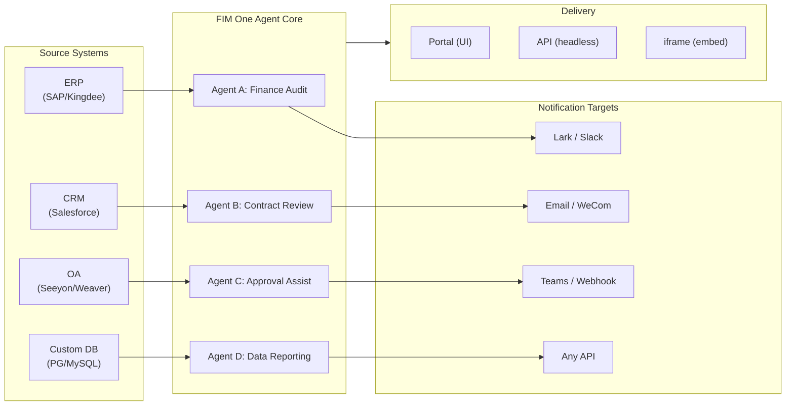

> Objectif : Construire une **plateforme d'agents tout-en-un pour les entreprises mondiales × chinoises** — livrée via trois modes progressifs : Standalone (assistant portail), Copilot (intégré au système hôte), Hub (orchestration centrale multi-systèmes).
>
> Principes : **Agnostique des fournisseurs** (pas de verrouillage propriétaire), **abstraction minimale**, **protocol-first**, **connector-first** (l'intégration est la valeur centrale).

## Vision Produit

FIM One est une **plateforme d'agent tout-en-un** qui propose trois modes de livraison progressifs :

```
Standalone   → Your own AI assistant (Portal)
Copilot      → AI embedded in a host system (iframe / widget / embed)
Hub          → Central cross-system orchestration (Portal / API)
```

**L'orchestration inter-systèmes est le différenciateur clé.** Les clients d'entreprise disposent de systèmes hérités — ERP, CRM, OA, finance, HR — qui doivent communiquer entre eux via l'IA :



**Stratégie GTM : Land and Expand**

| Étape | Mode | Ce qui se passe |
|------|------|-------------|
| Land | Copilot | Intégrer dans un système, prouver la valeur dans leur interface |
| Expand | Copilot → Hub | Déployer sur plusieurs systèmes ; le mode Hub les agrège |

## Problèmes connus

Bugs suivis qui sont reproductibles en production mais pas encore corrigés. Chaque entrée nomme le symptôme, la zone de surface suspecte et la solution de contournement (le cas échéant). Les éléments passent à une section de version une fois qu'un correctif est défini et planifié.

- **L'arrêt et la nouvelle tentative du playground affichent des artefacts visuels transitoires qu'une actualisation de page efface toujours.** Trois sources de rendu concurrentes — `activeConversation.messages` (snapshot DB), le flux SSE `messages` et l'espace réservé optimiste `pendingQuery` — ne sont pas regroupées dans un seul état dérivé, donc entre le clic sur « Retry » et l'arrivée de la réponse de l'assistant associée, l'interface utilisateur peut (a) brièvement afficher la même requête deux fois dans la fenêtre pré-flux, (b) supprimer les bulles utilisateur orphelines antérieures de l'historique de nouvelle tentative tandis que `hasLiveMessages` est vrai et avant le rechargement du snapshot, et (c) scintiller dans la fenêtre étroite entre l'événement SSE « done » et le prochain rafraîchissement `selectConversation`. **Les données ne sont jamais perdues** — chaque message utilisateur (y compris les nouvelles tentatives abandonnées) est conservé dans `conversation.messages`, transmis à l'appel LLM suivant via `normalize_alternating_messages` et rendu correctement après actualisation via `HistoryTurn.orphanUserContents` introduit dans le correctif de rendu `48ba08c6`. Pour le contexte, l'interface web propre de Claude présente une classe de bug analogue — arrêter au milieu d'une réponse et envoyer immédiatement une requête de suivi crée parfois la requête de suivi comme une branche d'édition sœur de la première requête plutôt que de l'ajouter comme un nouveau tour — c'est donc un problème difficile connu dans les conceptions optimiste-UI + SSE + historique-persistant, pas un défaut spécifique à FIM One. Un correctif approprié nécessite de regrouper les trois sources de rendu dans un seul état dérivé ; reporté jusqu'à une refonte plus large de la machine d'état du Playground.

## Backlog (Low Priority) {/* dev: dev/dag-evidence-fidelity.md */}

Durcissement différé — ne bloque pas ; à reprendre uniquement si le scénario correspondant se présente.

- [ ] **DAG evidence gets its own truncation budget**, decoupled from `DAG_ANALYZER_TRUNCATION`, so source evidence isn't re-clipped by the summary budget before the analyzer/synthesis verify against it.
- [ ] **Structure-aware evidence truncation** (head+tail / keep lists & tables) so long enumerations survive the cap instead of silently losing their tail.
- [ ] **Port the source-fidelity guideline into the ReAct fallback synthesis prompt** so total/severity mislabels are caught in ReAct too, not only in DAG.

## Versions Expédiées

### v0.1 (2026-02-22) — MVP : ReAct + DAG Planner
- ReActAgent avec outils (calculator, python_exec, web_search)
- DAG Planner (LLM génère des graphes de dépendances)
- Interface Portal avec streaming + KaTeX

### v0.2 (2026-02-24) — Multi-Model + Memory
- Retry / rate limiting / usage tracking
- Native function calling (no JSON-only parsing)
- Multi-model support (fast + main LLM)
- Memory: WindowMemory, SummaryMemory
- FastAPI backend with SSE streaming

### v0.3 (2026-02-25) — Web Tools + MCP
- Outils web (web_search, web_fetch) via Jina/Tavily/Brave
- Outil d'opérations sur fichiers
- Client MCP (intégration d'outils standard)
- Découverte automatique d'outils + catégories
- Visualisation DAG avec défilement au clic
- Exécution de code dans Docker (`--network=none`)

### v0.4 (2026-02-25) — Multi-Turn + Agents
- Conversations multi-tours (DbMemory)
- Interface de repliement des étapes d'outils
- Outils de requête HTTP + exécution shell
- Gestion des agents (créer, configurer, publier)
- Authentification JWT
- Mode d'exécution par agent + contrôle de température

### v0.5 (2026-02-28) — Full RAG + Grounded Gen
- Pipeline RAG complet (embedding + magasin vectoriel + FTS + RRF + réclassement)
- Génération ancrée (citations, scores de confiance)
- Gestion des documents de la base de connaissances (CRUD, recherche, nouvelle tentative, migration de schéma)
- ContextGuard + messages épinglés (gestionnaire de budget de tokens)
- Persistance DbMemory + LLM Compact
- Re-planification DAG (jusqu'à 3 rounds)

### v0.6 (2026-03-01) — Connector Platform
- **Connector CRUD**: create, read, update, delete
- **ConnectorToolAdapter**: converts Connector → BaseTool
- **Per-user credentials**: AES-GCM encryption
- **Confirmation gate**: write operation approval
- **Audit logging**: all tool calls recorded
- **Circuit breaker**: graceful degradation on failures
- **Utility tools**: email_send, json_transform, template_render, text_utils
- **Embedding options**: Jina, OpenAI, custom providers

### v0.7 (2026-03-06) — Admin Platform + Multi-Tenant
- **Admin Platform**: gestion des utilisateurs, basculement des rôles, réinitialisation de mot de passe, activation/désactivation de compte
- **Inscription sur invitation uniquement**: trois modes (ouvert/invitation/désactivé) + CRUD de code d'invitation
- **Gestion du stockage**: utilisation disque par utilisateur, effacement, nettoyage des orphelins
- **Modération des conversations**: liste/suppression admin de tous les éléments
- **Déconnexion forcée par utilisateur**: révocation de tous les tokens
- **Tableau de bord de santé API**: statistiques système, métriques des connecteurs
- **Assistant de configuration initiale**: création guidée du compte administrateur
- **Centre personnel**: instructions globales par utilisateur, préférence de langue
- **Auth JWT**: auth SSE basée sur token, propriété de conversation
- **Serveurs MCP globaux**: provisionnés par l'admin, chargés dans toutes les sessions
- **Compatibilité rétroactive**: migration automatique registration_enabled → registration_mode

### v0.7.x (2026-03-07 to 2026-03-12) — Stability + Refinements
- Gestion des codes d'invitation
- Quotas par utilisateur (application de 429)
- Journalisation d'audit structurée
- Filtrage des mots sensibles
- Historique de connexion administrateur
- Navigateur de fichiers administrateur
- Vues administrateur améliorées (champs model_name, tools, kb_ids)
- Déploiement Docker Compose (image unique, volumes nommés)
- Détection automatique OAuth depuis window.location
- Support de la réflexion étendue / raisonnement (`LLM_REASONING_EFFORT`, `LLM_REASONING_BUDGET_TOKENS`) pour OpenAI o-series, Gemini 2.5+, Claude
- Activation/désactivation par outil administrateur (outils désactivés exclus du chat à l'exécution)
- Gestion des serveurs MCP déplacée vers la page Connecteurs
- Support de base de données double : SQLite (par défaut sans configuration) + PostgreSQL (production) ; Docker Compose provisionne automatiquement PostgreSQL
- Page de documentation de configuration des modèles avec configuration de la réflexion étendue par fournisseur
- Protocole SSE v2 : streaming de réponse en temps réel avec champs `delta_reasoning`, `usage` et événements `done`/`suggestions`/`title`/`end` séparés ; taille du pool SQLite 5 -> 20
- Expansion AI Builder : 7 nouveaux outils de construction (GetSettings, TestConnection, ImportOpenAPI pour les connecteurs ; ListConnectors, AddConnector, RemoveConnector, SetModel pour les agents), drapeau `is_builder` sur les agents, actualisation automatique du prompt du constructeur, protection SSRF
- Frontend SSE v2 : curseur avec impulsion pointillée en streaming, snapshots de re-plan DAG sous forme de cartes réductibles, mise en page DAG découplée des états des étapes
- Page de documentation du concept AI Builder avec guides de construction de connecteurs et d'agents
- Système d'organisation : CRUD complet avec adhésion basée sur les rôles (propriétaire/administrateur/membre), interface de gestion administrateur
- Visibilité des ressources à trois niveaux (personnel/org/global) pour les agents, connecteurs, bases de connaissances, serveurs MCP
- API Publier/Dépublier pour tous les types de ressources ; délégation de propriétaire pour les agents publiés
- Point de terminaison administrateur set-visibility (remplace clone-to-global) ; assistant de requête unifié `build_visibility_filter()`
- Connecteurs de base de données (Phase 1-3) : accès SQL direct à PG/MySQL/Oracle/SQL Server + bases de données héritées chinoises ; introspection de schéma, annotation IA, exécution de requête en lecture seule, identifiants chiffrés, 3 outils par connecteur (`list_tables`, `describe_table`, `query`)
- **Centre d'évaluation** : benchmarking quantitatif de la qualité des agents — CRUD d'ensemble de données de test (prompt + comportement attendu + assertions), exécutions d'évaluation (exécution parallèle + évaluateur LLM + résultats par cas réussi/échoué/latence/token), visionneuse de résultats avec interrogation automatique ; migration `r8t0v2x4z567`
- Trois rôles de modèle (Général/Rapide/Raisonnement) avec isolation de configuration env par niveau ; le modèle rapide n'hérite plus des paramètres du modèle principal
- Classe de données `StepOutput` remplaçant les résultats d'étape en chaîne simple pour les données structurées et le passage d'artefacts
- Cache d'outils pour l'exécution DAG — appels d'outils identiques mis en cache par exécution avec verrou asynchrone de prévention de ruée (`DAG_TOOL_CACHE`)
- Vérification LLM par étape avec 1 nouvelle tentative en cas d'échec (`DAG_STEP_VERIFICATION`)
- Routage automatique : le LLM rapide classe les requêtes comme ReAct ou DAG ; point de terminaison `/api/auto` ; basculement de mode 3 voies frontend (`AUTO_ROUTING`)
- [x] ~~**Organisation du marché fantôme + Abonnements aux ressources**~~ : Organisation Market intégrée (fantôme, pas d'adhésion automatique) remplace l'organisation Platform ; ressources découvertes via navigation sur le marché et explicitement souscrites (modèle pull) ; API Market pour s'abonner aux ressources partagées ; la publication sur Market nécessite toujours un examen ; table d'abonnements aux ressources ; partage de ressources basé sur l'organisation remplaçant la visibilité globale
- [x] ~~**Découverte automatique d'agent et liaison de sous-agent**~~ : drapeau `discoverable` sur les agents ; liste blanche `sub_agent_ids` ; CallAgentTool pour déléguer des tâches à des agents spécialisés
- [x] ~~**Identifiants du serveur MCP + Remplacement par utilisateur**~~ : table `mcp_server_credentials` ; point de terminaison `PUT /api/mcp-servers/{id}/my-credentials` ; drapeau `allow_fallback` pour le comportement de secours des identifiants
- [x] ~~**Basculement connecteur/KB**~~ : `POST /api/connectors/{id}/toggle` et `POST /api/knowledge-bases/{id}/toggle` pour suspendre/reprendre les ressources
- [x] ~~**Conversations KB autonomes**~~ : champ `kb_ids` sur les conversations pour le chat KB direct sans liaison d'agent

### v0.8 (2026-03-20) — Connector Declarative Config + Progressive Disclosure
- [x] **Database connectors**: direct SQL access (PostgreSQL, MySQL, Oracle) *(shipped in v0.7.x — Phase 1-3)*
- [x] **RBAC**: per-user/role connector access control *(shipped in v0.7.x — org system + three-tier visibility)*
- [x] **Connector credential encryption + per-user override**: `connector_credentials` table, Fernet encryption via `CREDENTIAL_ENCRYPTION_KEY`, `allow_fallback` flag, `GET/PUT/DELETE /my-credentials` endpoints, per-user credential resolution in chat tool loading
- [x] **Publish review UI**: Org-level publish review system — review toggle per org, ReviewsSheet with approve/reject workflow, status badges on resource cards, review notice in publish dialog, resubmit for rejected resources
- [x] **Connector Progressive Disclosure (Phase 1-2)**: single `ConnectorMetaTool` replaces per-action tools; system prompt receives lightweight **stubs** only (name + 1-line description, ~30 tokens/connector vs ~250 tokens/action); agent calls `discover(connector)` to load full action schema on demand — schema only loads when the model selects a connector, keeping the prompt prefix stable for caching. Follows the deferred tool-loading pattern common in modern agent frameworks. `execute` subcommand; feature flag for backward compatibility.
- [x] **Agent Skill System + Compact Instructions**: On-demand skill loading for agent instructions — `Skill` model (name, content/SOP, optional scripts) attached to agents; referenced in system prompt by name only (~10 tokens/skill); agent calls `read_skill(name)` to load full content on demand. Reduces per-conversation instruction token cost by ~80% while allowing richer SOP libraries. Counterpart to ConnectorMetaTool's progressive disclosure applied at the instruction level. Enables the "指令 + 工具 + 技能" differentiation story. Also adds `compact_instructions` field to Agent model — per-agent compression priority list injected into `ContextGuard` when compacting (e.g., "preserve order IDs and amounts, drop raw API responses"), replacing the current static generic prompt. Follows the Compact Instructions convention widely adopted in modern agent frameworks.
- [x] **Connector import/export**: share connector templates
- [x] **Connector fork**: clone + customize existing connectors
- [x] **Workflow Phase 2 Nodes**: Iterator, Loop, VariableAggregator, ParameterExtractor, ListOperation, Transform, DocumentExtractor, QuestionUnderstanding, HumanIntervention — 9 advanced node types with full frontend + backend + 150 new tests (275 total). Node retry with exponential backoff, safe expression evaluation. Stats panel with success rate bar. 12 built-in templates. Pane context menu (Paste, Select All, Fit View, Auto Layout).
- [x] **Workflow Phase 3 Nodes: SubWorkflow + ENV** — 2 new node types (25 nodes total), 14 new tests (306 total), 14 built-in templates. SubWorkflow: full DB-backed nested workflow executor with target workflow selection, variable mapping, and configurable depth limit to prevent infinite recursion. ENV: reads encrypted environment variables with key picker and fallback defaults. Full frontend (node components, config panels, palette entries, minimap colors). Per-node execution statistics panel (success rates, durations, failure counts sorted worst-first). `getNodeStats` API client + `NodeStatEntry` type. Keyboard shortcuts dialog (`?` key).
- [x] **Workflow Scheduled Triggers**: Per-workflow cron configuration with timezone, default inputs, and next-run-at calculation. Preset cron buttons, 30 trigger tests.
- [x] **Workflow API Triggers**: Public per-workflow API keys (`wf_` prefix) for external execution without user auth, with rate limiting. API key management dialog with generate/regenerate/revoke, trigger URL, and cURL/JS examples.
- [x] **Workflow Batch Execution**: `POST /batch-run` with up to 100 input sets, configurable parallelism (1-10), collapsible per-item results, JSON export. 14 batch execution tests.
- [x] **Workflow Execution Log Viewer**: Real-time chronological SSE event stream in the run panel with timestamps, color-coded badges, and event type filter toggles.
- [x] **Workflow Run Stats**: Backend batch-fetches run counts and success rates via GROUP BY subquery; frontend displays stats on workflow cards with color-coded success rate indicators.
- [x] **Workflow Scheduler Daemon**: Background async service polling every 60s for due cron-based workflows. Croniter timezone support, semaphore concurrency, `last_scheduled_at` tracking, webhook delivery. 14 tests.
- [x] **Workflow Import Conflict Resolver**: Detects unresolved agent/connector/KB/MCP references during import. Batch DB queries with visibility filtering, frontend toast warnings. 17 tests.
- [x] **Workflow Test-Node Execution**: Isolated single-node testing with mock variables, integrated into editor (config panel Test button + context menu). 23 tests.
- [x] **Workflow Version Diff**: Side-by-side blueprint comparison with node/edge change detection, color-coded indicators (added/removed/modified).
- [x] **Workflow Run Management**: Delete individual runs (`DELETE /runs/{run_id}`) and clear all completed runs (`DELETE /runs`), with frontend confirmation dialogs.
- [x] **Workflow Run Replay Overlay**: "View on Canvas" button in run history to overlay past execution results on the canvas, showing per-node status and output without re-executing.
- [x] **Workflow Favorites/Pinning**: Star/pin workflows to the top of the list with localStorage persistence.
- [x] **Workflow Run History Export**: Export run history as JSON file download with full run metadata and per-node results.
- [x] **Admin Workflows Management**: Admin panel tab for managing all workflows across users — list, toggle active/inactive, delete with confirmation. Batch endpoints for delete, toggle, and publish with audit logging.
- [x] **Workflow Templates System**: `WorkflowTemplate` ORM model with admin CRUD, public listing/clone API, and 5 seed templates auto-inserted on first startup.
- [x] **Workflow Inline Validation Badges**: Real-time per-node `ValidationBadge` on canvas with error/warning tooltips for immediate visual feedback during editing.
- [x] **Workflow Execution Trace Viewer**: Timeline-based trace viewer Sheet with engine `trace_level` parameter and per-node variable snapshots for step-through debugging.
- [x] **Workflow Rate Limiting and Timeout**: Per-user `WorkflowRateLimiter` (sliding window 10 runs/min, 3 concurrent) and default 10-minute global run timeout.
- [x] **Workflow Blueprint System**: Visual workflow editor for designing and executing multi-step automation blueprints — `Workflow` / `WorkflowRun` ORM models, full CRUD + SSE execution API, import/export, duplicate, blueprint validation endpoint, `WorkflowEngine` with topological sort + semaphore-based concurrency + condition branching and 12 node types (Start, End, LLM, ConditionBranch, QuestionClassifier, Agent, KnowledgeRetrieval, Connector, HTTPRequest, VariableAssign, TemplateTransform, CodeExecution), `VariableStore` with `{{node_id.output}}` interpolation and `env.*` namespace, error strategies per node (STOP_WORKFLOW / CONTINUE / FAIL_BRANCH) with per-node timeout and advanced config UI, React Flow v12 visual editor with drag-and-drop palette + node config panel + variable picker combobox + add-node-on-edge + auto-layout (ELK.js) + run history sheet, Dify-style compact node design with ring-based run status styling and animated edge transitions, 4 built-in starter templates (Simple LLM Chain, Conditional Router, Knowledge-Augmented QA, HTTP API Pipeline) with template picker dialog and `GET /templates` + `POST /from-template` API, stats endpoint, `?run=true` URL param auto-open, subprocess-based code execution security, 105-test suite (templates, eval namespace flattening, blueprint validation warnings, node/edge deletion, import/export/duplicate, deadlock detection, multi-condition branching)
- [x] **Operation audit**: detailed logging of who did what — admin review log audit tab added (publish review trail per org/resource)
- [x] **Semantic Schema Annotations**: extend connector schema fields with `semantic_tag`, `description`, and `pii` flags; annotations surfaced in LLM tool descriptions so the agent understands field intent without guessing from column names

### v0.8.1 (2026-03-29) — Progressive Disclosure Maturity + ReAct Hardening
- Progressive disclosure for DB connectors (`DatabaseMetaTool`), MCP servers (`MCPServerMetaTool`), and on-demand tool loading (`request_tools` meta-tool)
- DAG quality overhaul (5 improvements: model upgrade, skill auto-discovery, citation verifier, structured content preservation, domain-aware routing)
- Domain model escalation in ReAct (specialist domains auto-escalate to reasoning model)
- Per-model Native Function Calling toggle (`tool_choice_enabled`)
- ReAct cycle detection (deterministic duplicate tool call prevention)
- ReAct completion checklist (pre-answer verification when tools were used)
- Resource Fork Phase 1 (MCP Server + Skill fork endpoints with lineage tracking)
- Workflow Connection Dep Auto-Subscribe (recursive sub-workflow dependency resolution)
- Prebuilt Solution Templates (8 vertical solutions seeded to Market on first registration)
- Admin notification improvements (timezone-aware, master switch, SMTP Reply-To)
- Per-turn token budget circuit breaker (`REACT_MAX_TURN_TOKENS`)
- Centralized tool truncation, dynamic system prompt budgeting
- File attachment download, duplicate message submission fix

### v0.8.2 (2026-04-10) — Agent Core Hardening + Vision Documents
- **Agent Core Phase 0** — Compact prompt upgraded to 9-section structured format; empty tool result protection (descriptive message instead of `(no output)`); anti-loop prompt + cycle detection threshold lowered to 2; domain classifier + pre-flight DB config resolution parallelized (400–1100 ms saved per request); SSE `end` event sent immediately after answer, with title/suggestions moved to background tasks
- **Agent Core Phase 1 (Context Anti-Bloat)** — `MicroCompact` rule-based old tool result cleanup (keep last 6); `REACT_TOOL_RESULT_BUDGET=40000` aggregate cap; reactive compact on context overflow (auto-compact to 50% budget and retry instead of crashing)
- **Agent Core Phase 2 (Speed)** — Keyword-based tool pre-selection (skips LLM call on obvious matches, 200–500 ms saved); `SharedHttpClient` LLM connection pooling; completion check skipped for answers >200 tokens; `FallbackLLM` wraps primary+fast with automatic failover on 429/503/529/connection errors
- **Intelligent Document Processing (Vision-Aware)** — Adaptive document handling: PDF pages rendered as images via PyMuPDF for vision-capable models (GPT-4o, Claude 3/4, Gemini), text-only fallback via pdfplumber. Per-model `supports_vision` flag. Modes via `DOCUMENT_PROCESSING_MODE`, `DOCUMENT_VISION_DPI`, `DOCUMENT_VISION_MAX_PAGES`. DOCX/PPTX embedded image extraction. Multi-turn vision persistence across conversation turns. Smart PDF processing (text-rich pages extract text + images; scanned pages render as full-page PNG). Pre-built sandbox image (`Dockerfile.sandbox`) with common data-science packages for `--network=none` code execution
- **Resource Fork completion** — Agent / Connector / Workflow fork endpoints added, completing the five-type lineage tracking (KB fork removed — inherently user-local)
- **File integrity guardrail** — System prompt rule prevents the agent from substituting unrelated file contents when a target file is unreadable; uploaded files now include `file_id` in message context for direct `read_uploaded_file` access

### v0.8.3 (2026-04-16) — Conversion universelle de documents + Phase 3 du cœur d'agent
- **Conversion universelle de documents (`convert_to_markdown` + OCR)** — Outil d'agent intégré encapsulant Microsoft MarkItDown ; convertit PDF, Word, Excel, PowerPoint, HTML, JSON, CSV, XML, ZIP, EPUB, Outlook .msg, images, audio, URLs YouTube en Markdown. `LiteLLMOpenAIShim` active l'OCR via n'importe quel LLM capable de vision (Claude, Gemini, Bedrock, Azure). Ingestion RAG sensible à la vision avec repli sans régression pour texte uniquement. Variable d'environnement `LLM_SUPPORTS_VISION` pour refuser
- **Phase 3 du cœur d'agent (Durcissement invariant du runtime)** — Récupération de conversation (réparation automatique de `tool_use` en suspens) ; carte de travail compacte structurée (`WorkCard` fusion typée sur les cycles de compaction) ; profileur au niveau du tour (`REACT_TURN_PROFILE_ENABLED`) ; limitation de débit par utilisateur (`LLM_RATE_LIMIT_PER_USER`) ; message d'assistant avec contenu vide et `tool_calls` n'est plus supprimé

### v0.8.4 (2026-04-17) — Prompt Cache + Reasoning Correctness
- **System prompt section registry with cache breakpoints** — Memoized `PromptRegistry` splits system prompts into stable prefix + dynamic suffix; cache-capable providers (Claude, Bedrock Anthropic, Vertex Claude) receive `cache_control: {"type": "ephemeral"}` on the prefix for ~60-80% per-turn input token savings. Non-cache providers get a single concatenated message (zero behavior change)
- **Prompt cache observability** — `cache_read_input_tokens` and `cache_creation_input_tokens` tracked through `UsageSummary` → `TurnProfiler` → `done_payload.cache` field. Structured `turn_cache` log line per turn. Doubles as relay cache-honesty probe
- **Conversation recovery MVP** — Synthetic `tool_result` rows persist after interrupted turns; `POST /chat/resume` replays cached SSE events from a monotonic cursor; frontend `useSseResume` hook auto-reconnects with exponential backoff (300ms → 1s → 3s, max 3 attempts) and "Reconnecting…" indicator
- **Thinking-block persistence with signature** — `reasoning_content` + Anthropic `signature` persisted in `metadata_["thinking"]` and replayed on subsequent turns; fixes HTTP 400 signature mismatch on Claude 4 multi-turn conversations
- **Provider-aware reasoning replay policy** — Centralized `reasoning_replay_policy()` in `core/prompt/reasoning.py` gates serialization per provider family: Claude replays thinking blocks with signature; DeepSeek-R1/Qwen-QwQ/Gemini-thinking/o-series drop `reasoning_content` on outbound (previously leaked, breaking provider KV caches and violating API docs)

### v0.8.5 (2026-04-23) — Intégration de canaux + Système de hooks + i18n pour contributeurs
- **Canal Feishu (sous-ensemble Phase 1)** — Ressource `Channel` à portée organisationnelle avec identifiants chiffrés par Fernet ; `FeishuChannel` supporte l'envoi de cartes interactives + callback (vérification de signature + défi URL) ; UI de gestion Paramètres → Canaux (liste, créer/modifier avec protection d'état modifié, détails avec URL de callback copiable, envoi de test) ; API CRUD (`/api/channels`) et endpoint de callback d'événement (`/api/channels/{id}/callback`). Livré en avance pour la roadshow du 2026-04-24
- **Système de hooks pour agents (actif dans les runtimes ReAct + DAG)** — Abstraction `PreToolUseHook` / `PostToolUseHook` dans `src/fim_one/core/hooks/` ; les agents déclarant `hooks.class_hooks` dans `model_config_json` ont des hooks instanciés et enregistrés par session de chat. Premier consommateur `FeishuGateHook` poste une carte Approuver/Rejeter au groupe Feishu lié quand un agent appelle un outil avec `requires_confirmation=True`, bloque l'exécution et reprend ou abandonne selon le verdict
- **Portail de confirmation configurable (intégré OU canal)** — Chaque agent obtient une section Approbation avec trois modes de routage (Auto / Intégré uniquement / Canal uniquement), sélecteur de portée approbateur (initiateur / propriétaire / n'importe quel membre de l'org), override par outil et sélecteur de canal d'approbation explicite. Le mode Auto bascule gracieusement vers une carte d'approbation intégrée quand aucun canal n'est lié. `POST /api/confirmations/{id}/respond` partage un chemin unique d'enregistrement de décision avec le webhook Feishu
- **Notifications de fin de tâche par agent** — Les agents ReAct ou DAG de longue durée peuvent pousser une carte résumée au canal de l'org quand une tâche se termine. Premier consommateur du motif de notification sortante générique
- **Playground d'approbation pour contributeurs** — La feuille de détails des canaux a une action « Tester le flux d'approbation » qui exerce le chemin de production complet (ligne `ConfirmationRequest` authentique, callback Feishu réel, transitions d'état) — le même chemin de code qu'un hook de production utilise
- **Fallback CI i18n convivial pour contributeurs** — `.github/workflows/i18n-sync.yml` traduit EN → ZH/JA/KO/DE/FR sur master après fusion de PR et auto-commit avec `[skip ci]` ; les contributeurs n'ont plus besoin de `LLM_API_KEY` localement. La garde de pré-commit refuse les édits manuels aux fichiers de locale générés (`ALLOW_LOCALE_EDIT=1` override pour les corrections de traduction légitimes). Vérifié de bout en bout via push de smoke-test
- **Docs d'intégration Exa** — Section Intégrations dédiée avec une première page Exa couvrant toute la surface de recherche Exa (neural / fast / deep-reasoning / instant), filtrage, récupération de contenu et trois présets ajustés
- **Support de bases de données Xinchuang (信创)** — Le connecteur de base de données liste maintenant KingbaseES (人大金仓), HighGo (瀚高) et DM8 (达梦) aux côtés de PostgreSQL/MySQL. Les pilotes compatibles PG réutilisent `asyncpg` ; DM8 utilise `dmPython`. `scripts/test_xinchuang_dbs.py` vérifie la connectivité en direct depuis la CLI
- **Docs architecture Canaux + Système de hooks** — `docs/architecture/hook-system.mdx` explique les trois points de hook et parcourt `FeishuGateHook` de bout en bout ; les pages d'architecture existantes font des renvois croisés ; le README liste les canaux de messagerie comme une capacité de première classe
- **Durcissement** — Les clics de callback Feishu en doublon produisent une carte de remplacement au lieu d'une double décision ; les clics de callback concurrents résolus via vérification de compteur de lignes `UPDATE ... WHERE status='pending'` conditionnel ; les approbations en attente expirent automatiquement après `CHANNEL_CONFIRMATION_TTL_MINUTES` (24h par défaut) via balayeur en arrière-plan ; Paramètres → Canaux respecte le rôle org (les membres voient l'UI en lecture seule) ; l'agrégateur d'appels d'outils parallèles gère les fournisseurs qui réutilisent `index=0` pour chaque delta ; la redirection d'expiration de session préserve la chaîne de requête

### v0.8.6 (2026-05-08) — Facturation Stripe + Améliorations
- [x] MVP de facturation Stripe — Niveaux Gratuit + Pro ; Checkout, Portail Client, cycle de vie webhook ; `/settings?tab=billing` ; CRUD plan/abonnement admin ; l'application des quotas respecte le plan de chaque utilisateur
- [x] Drapeau de facturation contrôlé par l'admin — `system_settings.billing_enabled` contrôle l'ensemble du pipeline Stripe afin que les déploiements privés sans identifiants Stripe ne présentent jamais une UX de paiement non fonctionnelle
- [x] Quota illimité par utilisateur — vide hérite de la valeur par défaut globale, `0` accorde un quota illimité ; auparavant les deux s'effondraient dans le même état
- [x] Glossaire de traduction comme source unique de vérité — `scripts/translation-glossary.md` consolide les règles par locale ; pre-commit refuse inconditionnellement les modifications manuelles aux fichiers de locale générés
- [x] Licence + droit applicable migrés vers FIM Labs Pte. Ltd. (Singapour) ; arbitrage SIAC en anglais ; nouveau fichier `NOTICE` de niveau supérieur
- [x] Suggestions de suivi du playground restaurées, opt-in par agent
- [x] Correctifs de stabilité — historique du fournisseur à alternance stricte, détection de limite d'appel d'outil parallèle, flux de confirmation d'agent non lié, gating de rôle de canal, suppression de duplication de nouvelle tentative, pas de paraphrase post-rejet

### v0.8.7 (2026-06-10) — Security Hardening + Guardrails v0 + Billing Correctness
- [x] JWT token-type confinement — closes a 2FA bypass where any same-signed token (temp/refresh/ticket) could authenticate API and SSE endpoints
- [x] OAuth hardening — email auto-link requires a provider-verified email (account-takeover fix); OAuth refresh tokens stored hashed so session rotation works
- [x] Content guardrails v0 — input/output tripwire layer (`core/agent/guardrail`); ships jailbreak detector + max-length output guardrail, env-var configured
- [x] `file_ops.apply_patch` — V4A diff patches with fuzzy whitespace matching, complements `find_replace`
- [x] Billing-cycle correctness — quota resets on the subscription anniversary (not calendar month); renewals advance the period via authoritative Stripe lookup; usage display aligned to the enforcement window
- [x] Reliability fixes — pseudo-protocol tool-call leak stripped from answers; tunable HTTP keep-alive ends `APIConnectionError` bursts; API-key usage stats persist on read-only requests
- [x] Billing tab visual overhaul — full-width, consistent with other Settings tabs

### v0.8.8 (2026-06-22) — SSRF Hardening + Reliability & Reasoning Fixes
- [x] SSRF hardening — blocklist unwraps IPv4-mapped IPv6 (`::ffff:` instance-metadata bypass); MCP SSE/Streamable-HTTP server URLs SSRF-validated on create + connect
- [x] LLM reliability — shared HTTP pool self-heals after a LiteLLM client-cache eviction closes it; chat sends stream instantly (history folded in background, no full reload)
- [x] Anthropic adaptive-thinking protocol for Opus 4.6+/Sonnet 4.6/Fable 5 — extended thinking works where the old fixed-budget param 400s on 4.7/4.8; warns on OpenAI-proxy misroute
- [x] Reasoning detail preserved end-to-end — genuine final answer streamed verbatim; survives compaction, context rebuilds, and sub-agent steps (no lossy re-synthesis)
- [x] `PreToolUseHook` enforcement hooks fail closed on error — a crashing approval gate no longer silently allows the call; non-enforcement hooks keep fail-open via `fail_open`
- [x] Force-logout timestamp comparison normalized to UTC by conversion + Docker Compose `POSTGRES_*` credential override (no shipped `fim:fim` default)

### v0.8.9 (2026-07-08) — Module Slim-down + Sharing Convergence + Approval Hardening
- [x] Skills & Workflows soft-shelved behind admin module flags (default off) — core-only boot; nothing deleted, reversible from Admin → Settings → Modules
- [x] Sharing converged — KB sharing removed (KBs reach others only via shared Agents), DB connectors unshareable + raw SQL owner-only, workflow builder trimmed to 9 reference-only nodes
- [x] Feishu approval hardening — card clicks enforce approver identity, callback signatures fail closed + encrypted envelopes decrypted, approvals never routed to an unintended chat
- [x] Use-time access re-checks — shared MCP servers and bound KBs re-verified per run; leaving an org revokes subscriptions and saved credentials immediately
- [x] Agent loop hardening — plan board, background tools, incremental DAG replan + checkpoint resume, compaction keeps tool pairing, truncation continuation, 529/504 retry
- [x] `run_workflow` agent tool + workflow correctness — Agent node runs the full agent, confirmation gates fail closed, connector calls access-checked and audit-logged
- [x] Account deletion unified — admin and self-serve funnel through one purge routine covering every record and on-disk file; org owners must transfer ownership first
- [x] Owner-credential fallback now opt-in (breaking) — connectors/MCP servers default `allow_fallback` off, existing rows flipped; no-fallback resources you lack credentials for are hidden from the toolset
- [x] Webhook/cron workflow runs metered to the owner's token quota — the unmetered free-LLM trigger path is closed
- [x] Resource binding unified on visibility — subscribed connectors/KBs/MCP servers bindable to agents; workflow connector steps enforce the runner's access
- [x] Conversation workspace wired into chat — `workspace://` offload of oversized tool results, budget-truncation rescue, pre-compaction transcript snapshots

## Versions Planifiées

Replanifié 2026-07-08 : FIM One est un runtime d'agent — un noyau unique (moteur ReAct, credentials, confirmation gate, audit, orgs multi-tenant) derrière plusieurs surfaces de livraison : Web UI, API, JS embed, sortie MCP. Chaque surface réutilise la même couche d'assemblage pour l'authentification, les credentials, la confirmation et le metering : plus de frontends, jamais plus de logique. La direction à court terme est la convergence sur la tranche data-Q&A (ChatBI), vendre des scénarios plutôt qu'une plateforme. {/* dev: dev/replan-2026-07.md */}

### v0.9 — Connecteur Fences + Scenario Onboarding

**Objectif** : Les actifs post-réduction s'assemblent en un produit complet de Q&A sur données — connecteurs DB en lecture seule + fences + approval gate + entrée IM. Les fences Tier-1 transforment la dette de sécurité en fonctionnalités produit.

#### DB Connector Fences — Tier 1, three PRs {/* dev: dev/connector-rbac/00-overview.md */}

- [ ] Masquage des colonnes PII (`ConnectorScopeGuard` PreToolUse hook)
- [ ] Visibilité du schéma — allow-deny table/colonne + blocage des verbes (application en lecture seule)
- [ ] Auditabilité des clôtures — `caller_user_id`, `effective_credential_source`, `scope_rules_applied` dans `ConnectorCallLog`
- [ ] Configuration par hook (`{"name", "config"}` schéma) — le vecteur pour les règles ScopeGuard {/* dev: dev/hook-system.md */}
- [x] Les portes d'approbation persistent à travers la délégation — `call_agent` et les nœuds `AGENT` du workflow exécutent les propres hooks de l'agent au lieu d'aucun

#### Rendu des réponses

- [x] Les réponses affichent les diagrammes Mermaid, les figures SVG et les tableaux de comparaison de style carte, avec copie/export sur les réponses, les blocs de code et les tableaux
- [x] Le markdown rendu est désinfecté, fermant l'injection HTML brute de la sortie du modèle et des fichiers téléchargés
- [x] Les diagrammes et les blocs de code se téléchargent en tant que fichiers ; le raisonnement se replie en aperçus d'une ligne par défaut dans les conversations en direct et passées
- [x] Les exports de conversation sont composés pour CJK — le PDF intègre une vraie police (espacement correct, puces et gras), DOCX déclare une police d'Asie de l'Est, les deux à une échelle de taille

#### Workbench UX

- [x] Barre latérale réorganisée autour du cluster de chat — conversations directement sous Nouveau chat/Recherche, navigation des modules dans un dock inférieur compact
- [x] Commande slash `/clear` démarre une nouvelle conversation à partir de la zone de saisie

#### Robustesse du contexte

- [x] Les budgets de contexte se situent 8 % en dessous de la limite matérielle du modèle ; le démarrage avertit lorsque la fenêtre du modèle rapide ne peut pas contenir le budget général
- [x] Discipline du tableau de planification : rappels de répétition et sans plan, et la finalisation avec des éléments de plan ouverts force désormais une passe de vérification
- [ ] Compaction d'entrée fragmentée et budgets conscients du modèle sur le chemin de chat principal, de sorte que tout mélange de modèles reste dans la fenêtre

#### Intégration des scénarios

- [ ] Le premier lancement démarre à partir d'un modèle de scénario (solution_seeds) au lieu d'un établi vide
- [ ] La page d'accueil de la documentation met en avant trois histoires de scénarios verticaux au lieu d'une référence de module
- [ ] Un modèle de scénario distillé par engagement livré — l'avantage concurrentiel réside dans les actifs de scénarios × la vitesse de livraison

### v0.10 — Two Mouths: JS Embed + IM Inbound {/* dev: dev/im-channels.md */}

**Objectif** : Les deux surfaces de livraison les plus commercialisables, toutes deux sur le même noyau et couche d'assemblage.

- [ ] JS bubble / iframe embed — un snippet unique dans un système hôte ; identité visiteur anonyme + attribution de facturation décidées avant la compilation
- [ ] Feishu inbound @mention — les agents vivent dans le groupe : interroger les données, approuver les fichiers, suivre les flux
- [ ] Modèles sortants : alertes d'échec, avertissements de budget, digests programmés, escalade, reçus d'audit
- [ ] Canaux WeCom / DingTalk suivant Feishu

### Parked — signal-gated

Do not start these without their trigger (see the replan §3): the MCP gateway waits for ≥2 unsolicited "mount your tools in my agent" asks; channelization waits for an implementor asking about licensing; IdP/OrgSync waits for customer pull; the rest wait for a delivered engagement that needs them.

- [ ] MCP gateway output — reverse-expose connector discover/execute as MCP tools for downstream agents
- [ ] Channelization / white-label enablement — commercial-license path already in place
- [ ] Identity Provider module + Channel slim-down — Feishu SSO, org graph sync {/* dev: dev/connector-rbac/07-identity-providers.md */}
- [ ] Connector authorization Tier 2 (require per-user credentials, key-binding health) + Tier 3 (login-ticket exchange) {/* dev: dev/connector-rbac/00-overview.md */}
- [ ] Public API Phase 2 — per-key rate limits/quotas, versioning, SDKs, developer portal {/* dev: dev/public-api-phase2.md */}
- [ ] Observability — Agent Trace Layer (Trace/Span model, timeline viewer, OTel export) + metrics dashboard {/* dev: dev/agent-trace-layer.md */}
- [ ] Agent Workspace remainder — handoff notes, file browser UI, cross-session recall, compaction segments (grep-able on-disk summary the agent reads back) {/* dev: dev/agent-workspace.md */}
- [ ] Guardrails v1 — off-topic filter, PII redactor output guardrail, per-agent guardrail config UI
- [ ] Hook System extras — built-in hooks, `SessionStart` + user YAML hooks {/* dev: dev/hook-system.md */}
- [ ] Connector platform depth — Progressive Disclosure Phase 3-4, YAML/JSON connector config, DB connectors Phase 4 (Oracle / SQL Server / GBase), MCP connection pooling
- [ ] Prompt cache follow-ups — Gemini context cache adapter, per-agent `cache_ttl` {/* dev: dev/prompt-cache-followups.md */}
- [ ] Hot mid-stream DAG resume — SSE reconnect re-attaches to a running turn (cold retry-resume already shipped) {/* dev: dev/incremental-dag.md */}
- [ ] Ecosystem — scheduled/event-triggered agents, workflow trigger-identity observability, per-workflow `credential_policy`, DB Schema Advanced Builder, sandbox hardening v2

### Livré du plan de pré-replan v0.9

- [x] ~~Auth & security: JWT token-type confinement + OAuth fixes (v0.8.7); PG tz-aware timestamps (v0.8.6); force-logout UTC + `POSTGRES_*` override + SSRF IPv6-mapped fix (v0.8.8); owner-fallback opt-in + visibility-unified binding + webhook/cron metering (v0.8.9)~~
- [x] ~~Provider compat: Anthropic adaptive thinking + shared LLM pool self-heal (v0.8.8)~~
- [x] ~~Content guardrails v0: tripwire layer + jailbreak detector (v0.8.7)~~ {/* dev: dev/archive/openai-agents-insights.md */}
- [x] ~~Hook system: skeleton + FeishuGateHook + Approval Playground + ReAct/DAG runtime (v0.8.5); PreToolUse enforcement fail-closed (v0.8.8)~~
- [x] ~~Feishu channel Phase 1 + task completion notification (v0.8.5)~~
- [x] ~~`run_workflow` agent tool (v0.8.9); reasoning detail preserved end-to-end (v0.8.8); workspace tool-output offloading wired into chat (v0.8.9)~~
- [x] ~~Agent loop hardening: plan board, LLM-call resilience, background tools, incremental DAG replan + checkpoint resume, compaction tool-pairing (v0.8.9)~~ {/* dev: dev/incremental-dag.md */}

- [x] ~~Circuit breaker, Workflow run retention cleanup, Workflow version diff summaries~~ *(v0.8 / v0.8.1)*
- [x] ~~DAG quality overhaul, Domain model escalation, Per-model NFC toggle~~ *(v0.8.1)*
- [x] ~~DatabaseMetaTool, MCPServerMetaTool, On-demand `request_tools`~~ *(v0.8.1)*
- [x] ~~Workflow Connection Dep Auto-Subscribe, Workflow real executors~~ *(v0.8.1)*
- [x] ~~ReAct Cycle Detection, Completion Checklist~~ *(v0.8.1)*
- [x] ~~Prebuilt Solution Templates (8 vertical bundles), Resource Fork (MCP/Skill/Agent/Connector/Workflow)~~ *(v0.8.1)*
- [x] ~~Vision document processing (PDF / DOCX / PPTX), MarkItDown OCR~~ *(v0.8.2 / v0.8.3)*
- [x] ~~Smart File Content Injection + `read_uploaded_file`~~ *(v0.8)*
- [x] ~~Agent Core Phase 3: Conversation Recovery MVP, Compact Work Card, Turn Profiler, Per-user Rate Limiting~~ *(v0.8.3)*
- [x] ~~Conversation resume MVP, System prompt registry + cache, Thinking-block persistence, Reasoning replay policy, Cache observability~~ *(v0.8.4)*

### v1.0 — Hot-Plug + Embeddable

**Goal**: Zero-restart connector addition, Package ecosystem, and embedded delivery.

- [ ] **Connector Progressive Disclosure (Phase 5)**: **Semantic-Guided Tool Selection** (entity extraction from query → Ontology Registry lookup → connector set reduction; 90%+ token reduction for 50+ connector deployments); Scale mode for batch/ETL connectors; CLI-style universal `connector <name> <action> <params>` interface
- [ ] **Cross-Connector Entity Alignment (Ontology Registry)** — *downgraded 2026-04-21: on-demand custom delivery, not a core capability*: define shared entity types (Customer, Order, Asset) with field mappings across connectors; DAGPlanner auto-resolves cross-system JOIN keys; enables cross-connector queries (e.g., "customers in Salesforce who ordered in Shopify") without hardcoded field names
- [ ] **Hot-plug connectors**: upload OpenAPI spec, AI generates config, live in 5 minutes (no restart)
- [x] ~~**Marketplace Redesign Phase 1 — Solutions + Components**~~: Two-tier Market model (Solutions: Agent/Skill/Workflow; Components: Connector/MCP Server); scope selector (Global Market / org); unified subscription model (org auto-appear removed); KB removed from Market scope; data migration backfills subscriptions for existing org members
- [ ] **Market Package System**: Distributable resource bundles for the Marketplace — replaces per-type "marketplace" with a unified packaging layer. `fim-package.yaml` manifest declares: metadata (name, version, description, author, license, tags, `min_fim_version`), entry point (primary Skill or Agent), resource list (agents, skills, connectors, KBs, MCP servers, workflows) with config references, inter-package dependencies (semver ranges), required credentials (mapped to connector refs for install-time collection), and user-configurable variables with defaults. **Two consumption modes**: (1) **install** — batch-create all resources + auto-wire internal references via ID substitution; installation linked to source for version update notifications; `POST /api/market/packages/{id}/install`; (2) **fork** — clone as user-owned editable copies with no update link (this IS the template mode); `POST /api/market/packages/{id}/fork`. Additional endpoints: publish (`POST /api/market/packages` with review workflow), uninstall (`DELETE /packages/{id}/uninstall` with dependency check + modified-resource confirmation), version history (`GET /packages/{id}/versions`), upgrade (`POST /packages/{id}/upgrade` with per-resource diff preview). Dependency resolver for nested package requirements with conflict detection. `PackageInstallation` table tracks installed packages per user with resource ID mapping for uninstall/upgrade. **Coexists with individual resource publishing** — Package is a composition layer, not a replacement; a single Connector is still publishable standalone. Example dependency tree: `Package: contract-review` → `Skill: contract-review` (entry point) → `Agent: contract-analyst` + `Agent: risk-scorer` → `KB: legal-clauses` + `Connector: docusign-api` + `MCP: pdf-extractor` + `Workflow: contract-approval-flow`
- [ ] **Creator Program**: Marketplace monetization layer — creator profiles with portfolio pages, per-package analytics (installs, forks, active users, ratings/reviews), affiliate commission tracking when packages drive new subscriptions. Paid package tier with pricing, purchase flow, and approval workflow. Creator dashboard with install trends, revenue reporting, and user feedback. Public creator API for programmatic package publishing (CI/CD for package authors). Community features: package comments, Q&A, changelogs per version
- [ ] **Embeddable widget**: `<script src="fim-one.js">` injected into host page
- [ ] **Page context injection**: widget reads host page context (current ID, URL, DOM selectors)
- [ ] **Advanced triggers**: Webhook inbound events; scheduled job enhancements (multi-timezone, calendar-aware)
- [ ] **Batch execution**: process 1000+ items via DAG
- [ ] **Enterprise security**: IP whitelisting, encryption at rest, SSO
- [ ] **KB Advanced Editor**: Builder-mode agent for power users managing large knowledge bases — bulk URL ingestion, duplicate detection, gap analysis, document lifecycle management; extends existing KB AI chat with ReAct tool loop
- [ ] **Stripe Billing (v1 MVP — Pro Subscription)**: Free + Pro two-tier subscription with monthly token quota. Stripe Checkout (hosted) + Customer Portal (self-service) + webhook-driven lifecycle (`checkout.session.completed` / `customer.subscription.updated|deleted` / `invoice.payment_succeeded|failed`). Soft-cap at quota exhaustion (HTTP 402 + upgrade prompt) — no overage charges in v1. Per-user billing only; Org/Team subscriptions deferred to v3. Prerequisites:
  - [x] ~~**Data model + SDK groundwork** (P1) — `billing_plans` / `subscriptions` / `stripe_webhook_events` tables, ORM models, Stripe SDK singleton, Free + Pro seeds~~ *(shipped in v0.8.6)*
  - [x] ~~**Backend API + webhook handler** (P2) — `/api/billing/*` + `/api/webhooks/stripe` with signature verification + idempotency; plan-aware quota; hourly lifecycle sweep~~ *(shipped in v0.8.6)*
  - [x] ~~**Frontend billing tab + 402 upgrade dialog** (P3) — `/settings?tab=billing` quota display, upgrade CTA, `past_due` banner, mid-stream 402 dialog~~ *(shipped in v0.8.6)*
  - [x] ~~**Admin plan management** (P4) — `admin/billing/{plans,subscriptions}` CRUD~~ *(shipped in v0.8.6)*
  - [x] ~~**Admin-controlled billing feature flag** (P5) — `system_settings.billing_enabled` gates the Stripe pipeline; idempotent activation seeds Free+Pro, sets default plan pointer, backfills users; toggle off/on is pure flag flip after activation~~ *(shipped in v0.8.6)*
  - [ ] **Reconciliation + e2e + go-live** (P6) — nightly `subscriptions` ↔ `stripe.Subscription.list()` reconcile script for missed-webhook recovery; full-stack happy-path / cancel-mid-period / past-due regression tests; switch from test-mode `stripe_price_id` to a live `price_id`; smoke test on staging with a real card.

- [ ] **Team plan (Stripe seats)** — Per-seat pricing via `stripe.Subscription.quantity`, integrated with Organization membership. Lets companies subscribe to one team-wide plan with N seats; quota and feature flags resolve through the seat group rather than the individual user. Builds on the v1.0 Stripe MVP and the existing Organization model.
- [ ] **Group-level token quota for non-billing deployments** — Enterprise / private deployments without Stripe configure organization-level token budgets. Quota chain extends to `override > group > plan > default`; group resolution uses `max(user_quota, group_quota)` so individual VIPs aren't constrained by the team cap. Lands alongside the Team plan so the same primitives serve both billed and self-hosted topologies.

**Impact**: Enterprises deploy FIM One from zero to multi-system orchestration in days. Package system creates a creator ecosystem — solution authors publish composite bundles (Skill + Agents + Connectors + KBs + Workflows), enterprises install with one click, creators earn from adoption. Install/fork duality covers both "use as-is" and "customize from template" use cases in a single mechanism.

## Fonctionnalités figées (Livrées, Maintenance uniquement)

Selon la [Stratégie d'orthogonalité](/strategy/orthogonality-strategy), ces fonctionnalités sont livrées et fonctionnelles mais ne recevront pas de nouvelles capacités (corrections de bugs uniquement) :

| Fonctionnalité | Version | Raison du gel |
|---------|---------|-----------|
| ReAct Agent | v0.1, v0.9 | Les modèles disposent désormais d'appels d'outils natifs. L'auto-réflexion en milieu de boucle (v0.9) prévient la dérive d'objectif dans les chaînes longues. La qualité de la synthèse d'observation d'outils s'est améliorée (8K caractères, configurable via `REACT_TOOL_OBS_TRUNCATION`) |
| Planification DAG / Re-planification | v0.1, v0.5, v0.7.5 | Les capacités de raisonnement des modèles s'améliorent ; la décomposition devient mono-coup. La vérification par étape est livrée en v0.7.5 (`DAG_STEP_VERIFICATION`). Renforcée : propagation des défaillances en cascade, correction du statut du vérificateur, descriptions d'outils du planificateur, historique complet de replanification, cache d'outils basé sur liste blanche. 14 constantes de moteur exposées en tant que variables ENV — aucune nouvelle primitive de planification prévue |
| Mémoire (Fenêtre, Résumé, Compact) | v0.2, v0.5 | Les fenêtres de contexte augmentent (200K+) ; moins besoin de gestion de mémoire externe |
| Pipeline RAG | v0.5 | Les fournisseurs construisent la récupération en natif (OpenAI file_search, Gemini Search Grounding) |
| Génération ancrée | v0.5 | Les modèles s'améliorent dans les citations ; le pipeline à 5 étapes ajoute une valeur décroissante |
| ContextGuard / Messages épinglés | v0.5 | Livraison en l'état ; aucune nouvelle fonctionnalité |

## Considéré (Reporté indéfiniment)

Selon la Stratégie d'Orthogonalité, ces éléments seraient très coûteux et risqueraient d'être absorbés :

| Fonctionnalité | Raison du report |
|---------|------------|
| Orchestration Multi-Agent (hiérarchies profondes) | Les fournisseurs construisent nativement (OpenAI Swarm, Google A2A et offres multi-agent similaires). Le CallAgentTool de FIM One couvre le cas de délégation à un niveau ; les agents d'arrière-plan déclenchés par événement sont couverts par les Scheduled Jobs en v0.9 |
| Compétences Auto-modifiables d'Agent (Mémoire Procédurale) | Les agents mettant à jour leur propre `skill.md` pendant l'exécution — complexité élevée, surface de sécurité/audit. Dépend de la livraison du Agent Skill System (v0.8) en premier. Réévaluer si les clients d'entreprise demandent explicitement des agents auto-améliorants |
| ~~Agent Workspace (Déchargement de Fichiers de Sortie d'Outil)~~ | Promu à v0.9. La valeur est la **lecture sélective**, non la capacité de contexte — validation inter-framework confirmée. Le raisonnement de report original (« les fenêtres 200K+ réduisent l'urgence ») était erroné. |
| Mémoire à Long Terme Entre Sessions | Les fenêtres de contexte croissent rapidement (200K–2M) ; les fournisseurs ajoutent la mémoire intégrée (mémoire OpenAI, mise en cache de contexte Gemini) ; coût d'implémentation élevé vs valeur de différenciation décroissante. Réévaluer quand les clients d'entreprise le demandent explicitement |
| Cycle de Vie de la Mémoire (TTL, quotas) | Dépend de la mémoire entre sessions ; reporté ensemble |
| Outil de Compression de Contexte Actif (déclenché par agent) | Explicitement gelé avec ContextGuard (v0.5). Les fenêtres de contexte à 200K+ réduisent la valeur. Ne sera pas revisité sauf si les coûts de contexte deviennent une plainte majeure d'entreprise |
| Automatisation de Navigateur / Computer Use | Coût de maintenance élevé (changements DOM, anti-bot, sandboxing). L'industrie converge vers le mode Computer Use (Anthropic, OpenAI Operator, Google Mariner) et les outils de navigateur MCP (Puppeteer/Playwright MCP). Consommer via intégration MCP, ne pas auto-construire. Réévaluer quand une norme MCP Computer Use stable émerge |
| Notifications Web Push | Push natif du navigateur via Service Worker + VAPID. Chevauche l'Intégration de Canal IM (v0.8) qui couvre les canaux préférés d'entreprise (Lark/Slack/WeCom/Email). Le push IM a une valeur d'entreprise plus élevée ; Web Push est un plus pour les utilisateurs du Portal uniquement. Réévaluer après la livraison du Canal IM — si les utilisateurs demandent des notifications de navigateur au-delà de la couverture IM |
| Édition Collaborative Multi-utilisateur de Flux de Travail | Co-édition en temps réel du même blueprint de flux de travail (style Figma/Notion) avec conscience de curseur, résolution de conflits et verrouillage par nœud. Coût d'implémentation élevé (CRDT / OT, infrastructure de présence), demande d'entreprise peu claire par rapport au modèle actuel « un éditeur à la fois + diff de version ». Réévaluer si plusieurs entreprises demandent spécifiquement l'édition partagée en direct |
| Permissions d'Exécution de Flux de Travail Par Nœud (RBAC à l'exécution) | Autorisation fine *à l'intérieur* d'une seule exécution de flux de travail — par ex. « le nœud X nécessite le rôle `finance_approver` pour s'exécuter ». Aujourd'hui l'autorisation se fait au niveau du flux de travail (qui peut déclencher) et au niveau du connecteur (dont les identifiants s'exécutent) ; le RBAC par nœud ajoute un troisième axe avec complexité matérielle et aucune demande de client actif |
| Partage de Flux de Travail Entre Organisations avec Mises à Jour en Direct | S'abonner à un flux de travail d'une autre organisation et recevoir les mises à jour en amont sans re-forking. Aujourd'hui s'abonner = forker (snapshot), donc les changements en amont cassants ne se propagent jamais. Les mises à jour en direct nécessiteraient l'évolution de schéma compatible en amont + résolution de conflits ; coût de maintenance élevé. Réévaluer si les entreprises demandent « flux de travail partagés entre filiales » |

## Comment les versions s'alignent avec les modes

| Version | Standalone | Copilot | Hub | Notes |
|---------|-----------|---------|-----|-------|
| **v0.1–v0.3** | Working | Not yet | Not yet | Portal-only, single-user |
| **v0.4** | Working | Not yet | Not yet | Multi-conversation, agent management |
| **v0.5** | Working | Not yet | Not yet | Knowledge base + RAG |
| **v0.6** | Working | Possible | Possible | Connectors ship; Copilot/Hub possible with manual wiring |
| **v0.7** | Working | Ready | Ready | Admin platform; multi-tenant auth; ready for production |
| **v0.8** | Working | Ready | Optimized | RBAC + audit log per-system; easier to onboard |
| **v0.9** | Working | Ready | Production | Observability, performance, hardening |
| **v1.0** | Working | Optimized | Enterprise | Package system, creator program, hot-plug, embeddable widget, webhooks, batch |

## Resource Allocation (v0.8–v1.0)

The Orthogonality Strategy shapes where effort goes:

| Category | Allocation | Versions | Why |
|----------|-----------|----------|-----|
| **Connector Platform** (v0.6+) | 50% | Ongoing | Core differentiation; no absorption risk |
| **Enterprise Features** (RBAC, audit, security, observability) | 30% | v0.8–v1.0 | Boring but durable; production requirement. Agent Trace Layer is commercial anchor |
| **Agent Intelligence** (Skill System, scheduled agents) | 15% | v0.8–v0.9 | 指令+工具+技能 differentiation story; low absorption risk — frameworks validate patterns, but enterprise SOPs are customer-specific |
| **v0.1–v0.5 maintenance** | 5% | Ongoing | Bug fixes only; no new features |

## Jalons pilotés par les métriques

Le succès est mesuré par :

| Métrique | Cible v0.7 | Cible v0.8 | Cible v1.0 |
|--------|------------|------------|------------|
| Connecteurs déployés | 5 | 20+ | 100+ |
| Clients entreprise | 1–2 | 5–10 | 20+ |
| Temps de configuration moyen des connecteurs | 2 semaines | 2 jours | 5 minutes (hot-plug) |
| Efficacité des tokens (DAG vs ReAct-only) | Réduction de 30 % | Réduction de 40 % | Réduction de 50 % |
| SLA de disponibilité | 99,5 % | 99,9 % | 99,95 % |
| Thèmes des tickets de support | Intégration, configuration | Logique personnalisée des connecteurs | Hot-plug, mise à l'échelle |

## Questions ouvertes / À définir

- **Modération de la marketplace** : Comment valider les packages communautaires et les ressources individuelles ? Analyse automatisée des fuites de credentials dans les configurations de packages ? (v1.0)
- **Économie des tokens** : Comment tarifier les scénarios multi-utilisateurs et multi-agents ? (v1.0)
- **Versioning des packages** : Changements cassants dans les packages installés — mise à niveau automatique avec scripts de migration, ou approbation manuelle par mise à jour ? Résolution du problème du diamant de dépendances ? (v1.0)
- **Tarification des packages** : Niveaux gratuits vs payants, taux de commission pour le Creator Program, intégration du fournisseur de paiement ? (v1.0)
- **UX des credentials de package** : Collecte de credentials au moment de l'installation — assistant étape par étape ou configuration différée ? Partage de credentials entre packages utilisant le même type de connecteur ? (v1.0)
- **Opt-out de télémétrie** : Comment respecter les préférences de confidentialité ? (v0.8)
- **Versioning des connecteurs** : Comment gérer les changements cassants dans les APIs des connecteurs ? (v0.8)
- **Rate limiting** : Rate limiting par utilisateur pour les workflows livré (fenêtre glissante 10 exécutions/min, 3 concurrentes). Rate limiting par connecteur et par agent à définir (v0.9)
- **Sélection du tier d'autorisation du connecteur** : comment un administrateur découvre-t-il quel tier s'applique à un système en amont donné ? Auto-détection (essayer clé API par utilisateur → revenir à login-ticket → revenir à BD partagée) vs. déclaration explicite dans la spec du connecteur ? Comment exprimer « ce connecteur supporte le Tier 2 mais l'administrateur a choisi d'opérer en Tier 1 » dans l'UI sans confondre les administrateurs non-techniques ? (v0.9)
- **Dualité Intégration vs Connecteur** : quand une liaison Feishu est simultanément un fournisseur SSO ET une surface d'appel API, comment la présenter dans Paramètres ? Un objet avec trois bascules, ou trois liaisons séparées partageant une credential ? Implications pour la sémantique de désinstallation (révoquer SSO tue-t-il le Connecteur ?) (v0.9)

