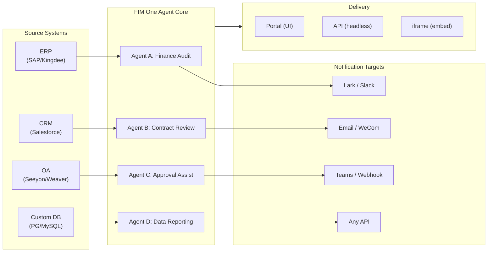

> Objectif : Construire une **plateforme d'agents tout-en-un pour les entreprises mondiales × chinoises** — livrée selon trois modes progressifs : Standalone (assistant portail), Copilot (intégré au système hôte), Hub (orchestration centrale inter-systèmes).
>
> Principes : **Agnostique des fournisseurs** (pas de verrouillage propriétaire), **abstraction minimale**, **axée sur les protocoles**, **centrée sur les connecteurs** (l'intégration est la valeur centrale).

## Vision Produit

FIM One est une **plateforme d'agents tout-en-un** qui propose trois modes de livraison progressifs :

```
Standalone   → Your own AI assistant (Portal)
Copilot      → AI embedded in a host system (iframe / widget / embed)
Hub          → Central cross-system orchestration (Portal / API)
```

**L'orchestration inter-systèmes est le différenciateur clé.** Les clients entreprise disposent de systèmes hérités — ERP, CRM, OA, finance, HR — qui doivent communiquer les uns avec les autres via l'IA :



**Stratégie GTM : Land and Expand**

| Étape | Mode | Ce qui se passe |
|------|------|-------------|
| Land | Copilot | Intégrer dans un système, prouver la valeur dans leur interface |
| Expand | Copilot → Hub | Déployer sur plusieurs systèmes ; le mode Hub les agrège |

## Problèmes connus

Bogues tracés qui sont reproductibles en production mais pas encore corrigés. Chaque entrée nomme le symptôme, la zone suspecte et la solution de contournement (le cas échéant). Les éléments sont déplacés vers une section de version une fois qu'un correctif est défini et planifié.

- **L'éditeur d'agent affiche un avertissement de modifications non enregistrées sans aucune modification.** L'ouverture d'un agent existant via `/agents/[id]` et le clic immédiat en arrière déclenche la boîte de dialogue « Modifications non enregistrées » même si aucun champ n'a été touché. La vérification dirty compare 20+ champs par rapport à la charge utile d'agent chargée, donc une asymétrie de défaut entre l'initialisation d'état et la comparaison dirty suffit à causer une incompatibilité fantôme — la suspicion actuelle porte sur l'un des champs `model_config_json` / notification / approbation imbriqués, possiblement à partir de la normalisation `undefined` vs `null` vs `""`. Se reproduit notamment sur les agents à portée organisationnelle. Solution de contournement : ignorer la boîte de dialogue (`Discard and leave`) — aucune perte de données puisque rien n'a réellement changé. Une tentative de correctif (`cb40c86a`) a supprimé un scintillement orphelin de badge connexe sur les sélecteurs de ressources mais n'a pas résolu ce problème.

- **L'enregistrement d'une modification d'agent peut échouer avec `Input should be 'initiator', 'agent_owner' or 'org_members'`.** Pydantic rejette le champ `confirmation_approver_scope` à la limite `/api/agents/{id}` PUT même si chaque valeur stockée dans la base de données est l'un des trois littéraux valides. Suspicion : le transtypage frontend `as "initiator" | "agent_owner" | "org_members"` n'est une promesse qu'au moment de la compilation, donc une chaîne héritée ou inattendue au runtime (possiblement à partir d'un modèle, importation ou migration plus ancienne) peut passer par `setConfirmationApproverScope` et être renvoyée textuellement. Solution de contournement : re-sélectionnez explicitement une valeur dans la liste déroulante Approval → Approver Scope avant d'enregistrer.

- **L'arrêt et la relance du playground affichent des artefacts visuels transitoires qu'une actualisation de page efface toujours.** Trois sources de rendu simultanées — `activeConversation.messages` (snapshot DB), le flux SSE `messages` et l'espace réservé optimiste `pendingQuery` — ne sont pas regroupées dans un seul état dérivé, donc entre le clic sur « Retry » et l'arrivée de la réponse d'assistant appariée, l'interface utilisateur peut (a) brièvement afficher deux fois la même requête dans la fenêtre de pré-flux, (b) supprimer les bulles utilisateur orphelines antérieures de l'historique de relance pendant que `hasLiveMessages` est vrai et avant le rechargement du snapshot, et (c) scintiller dans la fenêtre étroite entre l'événement SSE « done » et le prochain rafraîchissement `selectConversation`. **Les données ne sont jamais perdues** — chaque message utilisateur (y compris les relances abandonnées) est persisté dans `conversation.messages`, porté dans le prochain appel LLM via `normalize_alternating_messages` et rendu correctement après actualisation via `HistoryTurn.orphanUserContents` introduit dans le correctif de rendu `48ba08c6`. Pour le contexte, la propre interface Web de Claude exhibe une classe analogue de bogue — arrêter au milieu d'une réponse et envoyer immédiatement une requête de suivi bifurque parfois la requête de suivi en tant que branche d'édition sœur de la première requête plutôt que de l'ajouter en tant que nouveau tour — donc c'est un problème difficile connu dans les conceptions optimiste-UI + SSE + historique persisté, pas un défaut spécifique à FIM One. Un correctif approprié nécessite de regrouper les trois sources de rendu en un seul état dérivé ; déféré jusqu'à une refonte plus large de la machine d'état du playground.

# Versions expédiées

### v0.1 (2026-02-22) — MVP: ReAct + DAG Planner
- ReActAgent avec outils (calculator, python_exec, web_search)
- DAG Planner (LLM génère des graphes de dépendances)
- UI Portail avec streaming + KaTeX

### v0.2 (2026-02-24) — Multi-Model + Memory
- Retry / rate limiting / usage tracking
- Native function calling (no JSON-only parsing)
- Multi-model support (fast + main LLM)
- Memory: WindowMemory, SummaryMemory
- FastAPI backend with SSE streaming

### v0.3 (2026-02-25) — Web Tools + MCP
- Outils web (web_search, web_fetch) via Jina/Tavily/Brave
- Outil d'opérations sur fichiers
- Client MCP (intégration d'outils standard)
- Découverte automatique d'outils + catégories
- Visualisation DAG avec défilement au clic
- Exécution de code dans Docker (`--network=none`)

### v0.4 (2026-02-25) — Multi-Turn + Agents
- Conversations multi-tours (DbMemory)
- Interface de regroupement des étapes d'outils
- Outils de requête HTTP + exécution shell
- Gestion des agents (créer, configurer, publier)
- Authentification JWT
- Mode d'exécution par agent + contrôle de la température

### v0.5 (2026-02-28) — Full RAG + Grounded Gen
- Pipeline RAG complet (embedding + magasin vectoriel + FTS + RRF + reranker)
- Génération ancrée (citations, scores de confiance)
- Gestion de documents de base de connaissances (CRUD, recherche, nouvelle tentative, migration de schéma)
- ContextGuard + messages épinglés (gestionnaire de budget de tokens)
- Persistance DbMemory + LLM Compact
- DAG Re-Planning (jusqu'à 3 tours)

### v0.6 (2026-03-01) — Connector Platform
- **Connector CRUD**: create, read, update, delete
- **ConnectorToolAdapter**: converts Connector → BaseTool
- **Per-user credentials**: AES-GCM encryption
- **Confirmation gate**: write operation approval
- **Audit logging**: all tool calls recorded
- **Circuit breaker**: graceful degradation on failures
- **Utility tools**: email_send, json_transform, template_render, text_utils
- **Embedding options**: Jina, OpenAI, custom providers

### v0.7 (2026-03-06) — Admin Platform + Multi-Tenant
- **Admin Platform**: gestion des utilisateurs, basculement des rôles, réinitialisation de mot de passe, activation/désactivation de compte
- **Inscription sur invitation uniquement**: trois modes (ouvert/invitation/désactivé) + CRUD de code d'invitation
- **Gestion du stockage**: utilisation disque par utilisateur, effacement, nettoyage des fichiers orphelins
- **Modération de conversation**: liste/suppression administrateur de tous les éléments
- **Déconnexion forcée par utilisateur**: révocation de tous les jetons
- **Tableau de bord de santé de l'API**: stats système, métriques des connecteurs
- **Assistant de configuration initiale**: création guidée du compte administrateur
- **Centre personnel**: instructions globales par utilisateur, préférence de langue
- **Auth JWT**: authentification SSE basée sur jetons, propriété de conversation
- **Serveurs MCP mondiaux**: provisionnés par l'administrateur, chargés dans toutes les sessions
- **Rétrocompatibilité**: auto-migration registration_enabled → registration_mode

### v0.7.x (2026-03-07 à 2026-03-12) — Stabilité + Améliorations
- Gestion des codes d'invitation
- Quotas par utilisateur (application 429)
- Journalisation d'audit structurée
- Filtrage des mots sensibles
- Historique de connexion administrateur
- Navigateur de fichiers administrateur
- Vues administrateur améliorées (champs model_name, tools, kb_ids)
- Déploiement Docker Compose (image unique, volumes nommés)
- Détection automatique OAuth depuis window.location
- Support de la réflexion étendue / raisonnement (`LLM_REASONING_EFFORT`, `LLM_REASONING_BUDGET_TOKENS`) pour OpenAI o-series, Gemini 2.5+, Claude
- Activation/désactivation par outil administrateur (outils désactivés exclus du chat à l'exécution)
- Gestion des serveurs MCP déplacée vers la page Connecteurs
- Support de base de données double : SQLite (par défaut zéro-config) + PostgreSQL (production) ; Docker Compose provisionne automatiquement PostgreSQL
- Page de documentation de configuration des modèles avec configuration de la réflexion étendue par fournisseur
- Protocole SSE v2 : streaming de réponse en temps réel avec champs `delta_reasoning`, `usage`, et événements `done`/`suggestions`/`title`/`end` séparés ; taille du pool SQLite 5 -> 20
- Expansion AI Builder : 7 nouveaux outils builder (GetSettings, TestConnection, ImportOpenAPI pour connecteurs ; ListConnectors, AddConnector, RemoveConnector, SetModel pour agents), drapeau `is_builder` sur agents, actualisation automatique du prompt builder, garde SSRF
- Frontend SSE v2 : curseur pulsant avec points en streaming, snapshots de re-plan DAG sous forme de cartes réductibles, mise en page DAG découplée des états d'étape
- Page de documentation du concept AI Builder avec guides de builder de connecteur et d'agent
- Système d'organisation : CRUD complet avec adhésion basée sur les rôles (propriétaire/administrateur/membre), interface de gestion administrateur
- Visibilité des ressources à trois niveaux (personnel/org/global) pour agents, connecteurs, bases de connaissances, serveurs MCP
- API Publier/Dépublier pour tous les types de ressources ; délégation de propriétaire pour agents publiés
- Point de terminaison administrateur set-visibility (remplace clone-to-global) ; helper de requête `build_visibility_filter()` unifié
- Connecteurs de base de données (Phase 1-3) : accès SQL direct à PG/MySQL/Oracle/SQL Server + bases de données chinoises héritées ; introspection de schéma, annotation IA, exécution de requête en lecture seule, identifiants chiffrés, 3 outils par connecteur (`list_tables`, `describe_table`, `query`)
- **Centre d'évaluation** : benchmarking quantitatif de la qualité des agents — CRUD d'ensemble de données de test (prompt + comportement attendu + assertions), exécutions d'éval (exécution parallèle + évaluateur LLM + résultats par cas réussi/échoué/latence/token), visionneuse de résultats avec interrogation automatique ; migration `r8t0v2x4z567`
- Trois rôles de modèle (Général/Rapide/Raisonnement) avec isolation de configuration env par niveau ; le modèle rapide n'hérite plus des paramètres du modèle principal
- Classe de données `StepOutput` remplaçant les résultats d'étape en chaîne simple pour les données structurées et le passage d'artefacts
- Cache d'outils pour exécution DAG — appels d'outils identiques mis en cache par exécution avec verrou asynchrone de prévention de ruée (`DAG_TOOL_CACHE`)
- Vérification LLM par étape avec 1 nouvelle tentative en cas d'échec (`DAG_STEP_VERIFICATION`)
- Routage automatique : LLM rapide classe les requêtes comme ReAct ou DAG ; point de terminaison `/api/auto` ; bascule de mode 3 voies frontend (`AUTO_ROUTING`)
- [x] ~~**Organisation du marché fantôme + Abonnements aux ressources**~~ : Org Market intégré (fantôme, pas d'adhésion automatique) remplace l'org Platform ; ressources découvertes via navigation marketplace et explicitement abonnées (modèle pull) ; API Market pour s'abonner aux ressources partagées ; la publication sur Market nécessite toujours un examen ; table d'abonnements aux ressources ; partage de ressources basé sur l'org remplaçant la visibilité globale
- [x] ~~**Découverte automatique d'agent et liaison de sous-agent**~~ : drapeau `discoverable` sur agents ; liste blanche `sub_agent_ids` ; CallAgentTool pour déléguer des tâches à des agents spécialisés
- [x] ~~**Identifiants du serveur MCP + Remplacement par utilisateur**~~ : table `mcp_server_credentials` ; point de terminaison `PUT /api/mcp-servers/{id}/my-credentials` ; drapeau `allow_fallback` pour comportement de secours d'identifiants
- [x] ~~**Bascule connecteur/KB**~~ : `POST /api/connectors/{id}/toggle` et `POST /api/knowledge-bases/{id}/toggle` pour suspendre/reprendre les ressources
- [x] ~~**Conversations KB autonomes**~~ : champ `kb_ids` sur conversations pour chat KB direct sans liaison d'agent

### v0.8 (2026-03-20) — Connector Declarative Config + Progressive Disclosure
- [x] **Database connectors**: direct SQL access (PostgreSQL, MySQL, Oracle) *(shipped in v0.7.x — Phase 1-3)*
- [x] **RBAC**: per-user/role connector access control *(shipped in v0.7.x — org system + three-tier visibility)*
- [x] **Connector credential encryption + per-user override**: `connector_credentials` table, Fernet encryption via `CREDENTIAL_ENCRYPTION_KEY`, `allow_fallback` flag, `GET/PUT/DELETE /my-credentials` endpoints, per-user credential resolution in chat tool loading
- [x] **Publish review UI**: Org-level publish review system — review toggle per org, ReviewsSheet with approve/reject workflow, status badges on resource cards, review notice in publish dialog, resubmit for rejected resources
- [x] **Connector Progressive Disclosure (Phase 1-2)**: single `ConnectorMetaTool` replaces per-action tools; system prompt receives lightweight **stubs** only (name + 1-line description, ~30 tokens/connector vs ~250 tokens/action); agent calls `discover(connector)` to load full action schema on demand — schema only loads when the model selects a connector, keeping the prompt prefix stable for caching. Follows the deferred tool-loading pattern common in modern agent frameworks. `execute` subcommand; feature flag for backward compatibility.
- [x] **Agent Skill System + Compact Instructions**: On-demand skill loading for agent instructions — `Skill` model (name, content/SOP, optional scripts) attached to agents; referenced in system prompt by name only (~10 tokens/skill); agent calls `read_skill(name)` to load full content on demand. Reduces per-conversation instruction token cost by ~80% while allowing richer SOP libraries. Counterpart to ConnectorMetaTool's progressive disclosure applied at the instruction level. Enables the "指令 + 工具 + 技能" differentiation story. Also adds `compact_instructions` field to Agent model — per-agent compression priority list injected into `ContextGuard` when compacting (e.g., "preserve order IDs and amounts, drop raw API responses"), replacing the current static generic prompt. Follows the Compact Instructions convention widely adopted in modern agent frameworks.
- [x] **Connector import/export**: share connector templates
- [x] **Connector fork**: clone + customize existing connectors
- [x] **Workflow Phase 2 Nodes**: Iterator, Loop, VariableAggregator, ParameterExtractor, ListOperation, Transform, DocumentExtractor, QuestionUnderstanding, HumanIntervention — 9 advanced node types with full frontend + backend + 150 new tests (275 total). Node retry with exponential backoff, safe expression evaluation. Stats panel with success rate bar. 12 built-in templates. Pane context menu (Paste, Select All, Fit View, Auto Layout).
- [x] **Workflow Phase 3 Nodes: SubWorkflow + ENV** — 2 new node types (25 nodes total), 14 new tests (306 total), 14 built-in templates. SubWorkflow: full DB-backed nested workflow executor with target workflow selection, variable mapping, and configurable depth limit to prevent infinite recursion. ENV: reads encrypted environment variables with key picker and fallback defaults. Full frontend (node components, config panels, palette entries, minimap colors). Per-node execution statistics panel (success rates, durations, failure counts sorted worst-first). `getNodeStats` API client + `NodeStatEntry` type. Keyboard shortcuts dialog (`?` key).
- [x] **Workflow Scheduled Triggers**: Per-workflow cron configuration with timezone, default inputs, and next-run-at calculation. Preset cron buttons, 30 trigger tests.
- [x] **Workflow API Triggers**: Public per-workflow API keys (`wf_` prefix) for external execution without user auth, with rate limiting. API key management dialog with generate/regenerate/revoke, trigger URL, and cURL/JS examples.
- [x] **Workflow Batch Execution**: `POST /batch-run` with up to 100 input sets, configurable parallelism (1-10), collapsible per-item results, JSON export. 14 batch execution tests.
- [x] **Workflow Execution Log Viewer**: Real-time chronological SSE event stream in the run panel with timestamps, color-coded badges, and event type filter toggles.
- [x] **Workflow Run Stats**: Backend batch-fetches run counts and success rates via GROUP BY subquery; frontend displays stats on workflow cards with color-coded success rate indicators.
- [x] **Workflow Scheduler Daemon**: Background async service polling every 60s for due cron-based workflows. Croniter timezone support, semaphore concurrency, `last_scheduled_at` tracking, webhook delivery. 14 tests.
- [x] **Workflow Import Conflict Resolver**: Detects unresolved agent/connector/KB/MCP references during import. Batch DB queries with visibility filtering, frontend toast warnings. 17 tests.
- [x] **Workflow Test-Node Execution**: Isolated single-node testing with mock variables, integrated into editor (config panel Test button + context menu). 23 tests.
- [x] **Workflow Version Diff**: Side-by-side blueprint comparison with node/edge change detection, color-coded indicators (added/removed/modified).
- [x] **Workflow Run Management**: Delete individual runs (`DELETE /runs/{run_id}`) and clear all completed runs (`DELETE /runs`), with frontend confirmation dialogs.
- [x] **Workflow Run Replay Overlay**: "View on Canvas" button in run history to overlay past execution results on the canvas, showing per-node status and output without re-executing.
- [x] **Workflow Favorites/Pinning**: Star/pin workflows to the top of the list with localStorage persistence.
- [x] **Workflow Run History Export**: Export run history as JSON file download with full run metadata and per-node results.
- [x] **Admin Workflows Management**: Admin panel tab for managing all workflows across users — list, toggle active/inactive, delete with confirmation. Batch endpoints for delete, toggle, and publish with audit logging.
- [x] **Workflow Templates System**: `WorkflowTemplate` ORM model with admin CRUD, public listing/clone API, and 5 seed templates auto-inserted on first startup.
- [x] **Workflow Inline Validation Badges**: Real-time per-node `ValidationBadge` on canvas with error/warning tooltips for immediate visual feedback during editing.
- [x] **Workflow Execution Trace Viewer**: Timeline-based trace viewer Sheet with engine `trace_level` parameter and per-node variable snapshots for step-through debugging.
- [x] **Workflow Rate Limiting and Timeout**: Per-user `WorkflowRateLimiter` (sliding window 10 runs/min, 3 concurrent) and default 10-minute global run timeout.
- [x] **Workflow Blueprint System**: Visual workflow editor for designing and executing multi-step automation blueprints — `Workflow` / `WorkflowRun` ORM models, full CRUD + SSE execution API, import/export, duplicate, blueprint validation endpoint, `WorkflowEngine` with topological sort + semaphore-based concurrency + condition branching and 12 node types (Start, End, LLM, ConditionBranch, QuestionClassifier, Agent, KnowledgeRetrieval, Connector, HTTPRequest, VariableAssign, TemplateTransform, CodeExecution), `VariableStore` with `{{node_id.output}}` interpolation and `env.*` namespace, error strategies per node (STOP_WORKFLOW / CONTINUE / FAIL_BRANCH) with per-node timeout and advanced config UI, React Flow v12 visual editor with drag-and-drop palette + node config panel + variable picker combobox + add-node-on-edge + auto-layout (ELK.js) + run history sheet, Dify-style compact node design with ring-based run status styling and animated edge transitions, 4 built-in starter templates (Simple LLM Chain, Conditional Router, Knowledge-Augmented QA, HTTP API Pipeline) with template picker dialog and `GET /templates` + `POST /from-template` API, stats endpoint, `?run=true` URL param auto-open, subprocess-based code execution security, 105-test suite (templates, eval namespace flattening, blueprint validation warnings, node/edge deletion, import/export/duplicate, deadlock detection, multi-condition branching)
- [x] **Operation audit**: detailed logging of who did what — admin review log audit tab added (publish review trail per org/resource)
- [x] **Semantic Schema Annotations**: extend connector schema fields with `semantic_tag`, `description`, and `pii` flags; annotations surfaced in LLM tool descriptions so the agent understands field intent without guessing from column names

### v0.8.1 (2026-03-29) — Progressive Disclosure Maturity + ReAct Hardening
- Progressive disclosure for DB connectors (`DatabaseMetaTool`), MCP servers (`MCPServerMetaTool`), and on-demand tool loading (`request_tools` meta-tool)
- DAG quality overhaul (5 improvements: model upgrade, skill auto-discovery, citation verifier, structured content preservation, domain-aware routing)
- Domain model escalation in ReAct (specialist domains auto-escalate to reasoning model)
- Per-model Native Function Calling toggle (`tool_choice_enabled`)
- ReAct cycle detection (deterministic duplicate tool call prevention)
- ReAct completion checklist (pre-answer verification when tools were used)
- Resource Fork Phase 1 (MCP Server + Skill fork endpoints with lineage tracking)
- Workflow Connection Dep Auto-Subscribe (recursive sub-workflow dependency resolution)
- Prebuilt Solution Templates (8 vertical solutions seeded to Market on first registration)
- Admin notification improvements (timezone-aware, master switch, SMTP Reply-To)
- Per-turn token budget circuit breaker (`REACT_MAX_TURN_TOKENS`)
- Centralized tool truncation, dynamic system prompt budgeting
- File attachment download, duplicate message submission fix

### v0.8.2 (2026-04-10) — Agent Core Hardening + Vision Documents
- **Agent Core Phase 0** — Compact prompt upgraded to 9-section structured format; empty tool result protection (descriptive message instead of `(no output)`); anti-loop prompt + cycle detection threshold lowered to 2; domain classifier + pre-flight DB config resolution parallelized (400–1100 ms saved per request); SSE `end` event sent immediately after answer, with title/suggestions moved to background tasks
- **Agent Core Phase 1 (Context Anti-Bloat)** — `MicroCompact` rule-based old tool result cleanup (keep last 6); `REACT_TOOL_RESULT_BUDGET=40000` aggregate cap; reactive compact on context overflow (auto-compact to 50% budget and retry instead of crashing)
- **Agent Core Phase 2 (Speed)** — Keyword-based tool pre-selection (skips LLM call on obvious matches, 200–500 ms saved); `SharedHttpClient` LLM connection pooling; completion check skipped for answers >200 tokens; `FallbackLLM` wraps primary+fast with automatic failover on 429/503/529/connection errors
- **Intelligent Document Processing (Vision-Aware)** — Adaptive document handling: PDF pages rendered as images via PyMuPDF for vision-capable models (GPT-4o, Claude 3/4, Gemini), text-only fallback via pdfplumber. Per-model `supports_vision` flag. Modes via `DOCUMENT_PROCESSING_MODE`, `DOCUMENT_VISION_DPI`, `DOCUMENT_VISION_MAX_PAGES`. DOCX/PPTX embedded image extraction. Multi-turn vision persistence across conversation turns. Smart PDF processing (text-rich pages extract text + images; scanned pages render as full-page PNG). Pre-built sandbox image (`Dockerfile.sandbox`) with common data-science packages for `--network=none` code execution
- **Resource Fork completion** — Agent / Connector / Workflow fork endpoints added, completing the five-type lineage tracking (KB fork removed — inherently user-local)
- **File integrity guardrail** — System prompt rule prevents the agent from substituting unrelated file contents when a target file is unreadable; uploaded files now include `file_id` in message context for direct `read_uploaded_file` access

### v0.8.3 (2026-04-16) — Universal Document Conversion + Agent Core Phase 3
- **Universal Document Conversion (`convert_to_markdown` + OCR)** — Built-in Agent tool wrapping Microsoft MarkItDown; converts PDF, Word, Excel, PowerPoint, HTML, JSON, CSV, XML, ZIP, EPUB, Outlook .msg, images, audio, YouTube URLs to Markdown. `LiteLLMOpenAIShim` enables OCR via any vision-capable LLM (Claude, Gemini, Bedrock, Azure). Vision-aware RAG ingestion with zero-regression text-only fallback. `LLM_SUPPORTS_VISION` env var for opt-out
- **Agent Core Phase 3 (Runtime Invariant Hardening)** — Conversation recovery (dangling `tool_use` auto-repair); structured compact work card (`WorkCard` typed merge across compaction rounds); turn-level profiler (`REACT_TURN_PROFILE_ENABLED`); per-user rate limiting (`LLM_RATE_LIMIT_PER_USER`); empty-content assistant message with `tool_calls` no longer dropped

### v0.8.4 (2026-04-17) — Prompt Cache + Reasoning Correctness
- **System prompt section registry with cache breakpoints** — Memoized `PromptRegistry` splits system prompts into stable prefix + dynamic suffix; cache-capable providers (Claude, Bedrock Anthropic, Vertex Claude) receive `cache_control: {"type": "ephemeral"}` on the prefix for ~60-80% per-turn input token savings. Non-cache providers get a single concatenated message (zero behavior change)
- **Prompt cache observability** — `cache_read_input_tokens` and `cache_creation_input_tokens` tracked through `UsageSummary` → `TurnProfiler` → `done_payload.cache` field. Structured `turn_cache` log line per turn. Doubles as relay cache-honesty probe
- **Conversation recovery MVP** — Synthetic `tool_result` rows persist after interrupted turns; `POST /chat/resume` replays cached SSE events from a monotonic cursor; frontend `useSseResume` hook auto-reconnects with exponential backoff (300ms → 1s → 3s, max 3 attempts) and "Reconnecting…" indicator
- **Thinking-block persistence with signature** — `reasoning_content` + Anthropic `signature` persisted in `metadata_["thinking"]` and replayed on subsequent turns; fixes HTTP 400 signature mismatch on Claude 4 multi-turn conversations
- **Provider-aware reasoning replay policy** — Centralized `reasoning_replay_policy()` in `core/prompt/reasoning.py` gates serialization per provider family: Claude replays thinking blocks with signature; DeepSeek-R1/Qwen-QwQ/Gemini-thinking/o-series drop `reasoning_content` on outbound (previously leaked, breaking provider KV caches and violating API docs)

### v0.8.5 (2026-04-23) — Intégration de canaux + Système de hooks + i18n contributeur
- **Canal Feishu (sous-ensemble Phase 1)** — Ressource `Channel` à portée organisationnelle avec identifiants chiffrés par Fernet ; `FeishuChannel` prend en charge l'envoi de cartes interactives + callback (vérification de signature + défi d'URL) ; Interface de gestion Paramètres → Canaux (liste, créer/modifier avec protection d'état modifié, détails avec URL de callback copiable, test-envoi) ; API CRUD (`/api/channels`) et point de terminaison de callback d'événement (`/api/channels/{id}/callback`). Livré en avance pour la roadshow du 2026-04-24
- **Système de hooks d'agent (actif dans les runtimes ReAct + DAG)** — Abstraction `PreToolUseHook` / `PostToolUseHook` dans `src/fim_one/core/hooks/` ; les agents déclarant `hooks.class_hooks` dans `model_config_json` ont des hooks instanciés et enregistrés par session de chat. Premier consommateur `FeishuGateHook` publie une carte Approuver/Rejeter au groupe Feishu lié lorsqu'un agent appelle un outil `requires_confirmation=True`, bloque l'exécution, et reprend ou interrompt selon le verdict
- **Portail de confirmation configurable (inline OU canal)** — Chaque agent reçoit une section Approbation avec trois modes de routage (Auto / Inline seulement / Canal seulement), sélecteur de portée approbateur (initiateur / propriétaire / n'importe qui dans l'org), override par outil, et sélecteur de canal d'approbation explicite. Le mode Auto se replie gracieusement sur une carte d'approbation inline en l'absence de canal lié. `POST /api/confirmations/{id}/respond` partage un chemin unique d'enregistrement de décision avec le webhook Feishu
- **Notifications de fin de tâche par agent** — Les agents ReAct ou DAG à longue exécution peuvent envoyer une carte de synthèse au canal de l'org à la fin d'une tâche. Premier consommateur du pattern de notification sortante générique
- **Terrain de jeu d'approbation de hooks** — La feuille de détails des canaux dispose d'une action « Tester le flux d'approbation » qui exécute le chemin de production complet (véritable ligne `ConfirmationRequest`, véritable callback Feishu, transitions d'état) — le même chemin de code qu'un hook de production
- **Fallback CI i18n convivial pour les contributeurs** — `.github/workflows/i18n-sync.yml` traduit EN → ZH/JA/KO/DE/FR sur master après fusion de PR et commit automatique avec `[skip ci]` ; les contributeurs n'ont plus besoin de `LLM_API_KEY` localement. La garde de pré-commit refuses les édits manuels aux fichiers de locale générés (`ALLOW_LOCALE_EDIT=1` override pour les corrections de traduction légitimes). Vérification de bout en bout via test de fumée push
- **Docs d'intégration Exa** — Section Intégrations dédiée avec une première page Exa de classe présentant la surface de recherche Exa complète (neural / fast / deep-reasoning / instant), filtrage, récupération de contenu, et trois préconfigurations affinées
- **Support de bases de données Xinchuang (信创)** — Le connecteur de base de données liste maintenant KingbaseES (人大金仓), HighGo (瀚高), et DM8 (达梦) aux côtés de PostgreSQL/MySQL. Les pilotes compatibles PG réutilisent `asyncpg` ; DM8 utilise `dmPython`. `scripts/test_xinchuang_dbs.py` vérifie la connectivité en direct à partir de la CLI
- **Architecture des canaux + système de hooks docs** — `docs/architecture/hook-system.mdx` explique les trois points de hook et parcourt `FeishuGateHook` de bout en bout ; les pages d'architecture existantes effectuent une liaison croisée ; README liste les canaux de messagerie comme une capacité de première classe
- **Durcissement** — Les clics de callback Feishu en double produisent une carte de remplacement au lieu d'une double décision ; les clics de callback concurrents sont résolus via une vérification du nombre de lignes `UPDATE ... WHERE status='pending'` conditionnel ; les approbations en attente expirent automatiquement après `CHANNEL_CONFIRMATION_TTL_MINUTES` (24h par défaut) via un nettoyeur d'arrière-plan ; Paramètres → Canaux respecte le rôle org (les membres voient une interface en lecture seule) ; l'agrégateur d'appels d'outils parallèles gère les fournisseurs qui réutilisent `index=0` pour chaque delta ; la redirection d'expiration de session préserve la chaîne de requête

### v0.8.6 (2026-05-08) — Facturation Stripe + Améliorations
- [x] MVP de facturation Stripe — Niveaux Gratuit + Pro ; Checkout, Portail Client, cycle de vie webhook ; `/settings?tab=billing` ; CRUD plan/abonnement administrateur ; l'application des quotas respecte le plan de chaque utilisateur
- [x] Drapeau de fonctionnalité de facturation contrôlé par l'administrateur — `system_settings.billing_enabled` contrôle l'ensemble du pipeline Stripe afin que les déploiements privés sans identifiants Stripe ne présentent jamais une UX de paiement non fonctionnelle
- [x] Quota illimité par utilisateur — vide hérite de la valeur par défaut globale, `0` accorde un accès illimité ; auparavant, les deux s'effondraient dans le même état
- [x] Glossaire de traduction comme source unique de vérité — `scripts/translation-glossary.md` consolide les règles par locale ; pre-commit refuse inconditionnellement les modifications manuelles aux fichiers de locale générés
- [x] Licence + loi applicable migrées vers FIM Labs Pte. Ltd. (Singapour) ; arbitrage SIAC en anglais ; nouveau fichier `NOTICE` de haut niveau
- [x] Suggestions de suivi du Playground restaurées, opt-in par agent
- [x] Correctifs de stabilité — historique de fournisseur à alternance stricte, détection de limite d'appel d'outil parallèle, flux de confirmation d'agent non lié, contrôle d'accès au rôle de canal, suppression de duplication de nouvelle tentative, pas de paraphrase post-rejet

### v0.8.7 (2026-06-10) — Durcissement de la sécurité + Guardrails v0 + Correction de la facturation
- [x] Confinement du type de jeton JWT — corrige une faille d'authentification 2FA où tout jeton signé de la même manière (temp/refresh/ticket) pouvait authentifier les points de terminaison API et SSE
- [x] Durcissement OAuth — la liaison automatique d'e-mail nécessite un e-mail vérifié par le fournisseur (correction de la prise de contrôle de compte) ; les jetons d'actualisation OAuth sont stockés hachés pour que la rotation de session fonctionne
- [x] Guardrails de contenu v0 — couche de détection d'entrée/sortie (`core/agent/guardrail`) ; inclut un détecteur de jailbreak + un guardrail de longueur de sortie maximale, configuré via variable d'environnement
- [x] `file_ops.apply_patch` — Correctifs de diff V4A avec correspondance floue des espaces, complète `find_replace`
- [x] Correction de la facturation de cycle — réinitialisation des quotas à l'anniversaire de l'abonnement (pas au mois calendaire) ; les renouvellements avancent la période via une recherche Stripe faisant autorité ; l'affichage de l'utilisation aligné à la fenêtre d'application
- [x] Corrections de fiabilité — fuite d'appel d'outil pseudo-protocole supprimée des réponses ; fin de keep-alive HTTP réglable met fin aux pics `APIConnectionError` ; les statistiques d'utilisation de clé API persistent lors des demandes en lecture seule
- [x] Refonte visuelle de l'onglet Facturation — largeur complète, cohérente avec les autres onglets Paramètres

---
## Versions Prévues

### v0.9 — Observabilité + Durcissement de production

**Objectif** : opérations de qualité production + quatre piliers comblant l'écart entre « instructions que l'agent pourrait suivre » et « garanties que le système impose » — Couche de traçabilité (voir ce qui s'est passé) · Système de hook (imposer ce qui doit se passer) · Espace de travail de l'agent (fichiers persistants + transfert) · Canal IM (les agents vivent où les utilisateurs travaillent).

#### Authentification et durcissement de la sécurité

- [x] ~~Confinement du type de jeton JWT (contournement 2FA) + corrections de prise de contrôle de compte OAuth et de session~~ *(livré dans v0.8.7)*
- [x] ~~Horodatages PostgreSQL tenant compte du fuseau horaire~~ *(livré dans v0.8.6)*

#### Connecteur + outillage

- [ ] **Phase 3-4 de divulgation progressive du connecteur** — `ConnectorExecutor` unifié (API/DB/MCP) ; validation d'action `jsonschema` ; découverte/exécution agnostique du protocole
- [ ] **Configuration du connecteur YAML/JSON** — la plateforme génère automatiquement le serveur MCP
- [ ] **Connecteurs de base de données Phase 4** — Oracle (`oracledb`), SQL Server (`aioodbc`), GBase (`aioodbc` + GBase ODBC). DM8 / KingbaseES / HighGo livrés en v0.8.5
- [ ] **Mise en pool des connexions MCP** — pool STDIO avec isolation d'environnement par utilisateur ; partage de `httpx.AsyncClient` pour SSE/HTTP. Cible ≤100 ms de démarrage à chaud, O(1) connexions HTTP par serveur

#### Garde-fous de contenu {/* dev: dev/openai-agents-insights.md */}

- [x] ~~Garde-fous de contenu v0 (détecteur de tripwire entrée/sortie, détecteur de jailbreak, config var d'env, événement SSE `guardrail_tripwired`)~~ *(livré en v0.8.7)*
- [ ] Filtre hors-sujet (garde-fou d'entrée basé sur classifier) — reporter à v0.5 si regex reste suffisant
- [ ] Garde-fou de sortie rédacteur PII (hybrid regex + classifier)
- [ ] Configuration de garde-fou par agent UI (panneau admin)

#### Hook System {/* dev: dev/hook-system.md */}

- [ ] Per-hook config pass-through (`{"name": ..., "config": {...}}` schema)
- [ ] DAG `tools_used` accuracy (real tool names from per-step ReAct via step-completion callback)
- [ ] Hook inheritance for `CallAgentTool` + Workflow `AGENT` nodes (security default vs flexibility default)
- [ ] Built-in hooks: `ConnectorCallLog` autorecord, read-only-mode block, DB result truncation, per-connector rate-limit
- [ ] `SessionStart` hook point + user-defined YAML hooks
- [x] ~~Skeleton + FeishuGateHook + Approval Playground + ReAct/DAG runtime~~ *(shipped in v0.8.5)*

#### Intégration de canal IM {/* dev: dev/im-channels.md */}

- [ ] Canaux : WeCom, Slack, Email, Teams sortants
- [ ] Modèles sortants : alertes de défaillance, avertissements de budget, digests programmés, escalade, reçus d'audit, escalade d'approbation
- [ ] Phase 2 — Déclencheur entrant (mention @agent dans le groupe IM)
- [x] ~~Canal Feishu (sous-ensemble Phase 1) + notification d'achèvement de tâche~~ *(livré dans v0.8.5)*

#### Couches d'autorisation des connecteurs {/* dev: dev/connector-rbac/00-overview.md */}

- [ ] Tier 1 — Mode BD (`ConnectorScopeGuard` hook PreToolUse : blocage de verbe, liste d'autorisation/refus de table, masquage de colonne, injection de prédicat de portée)
- [ ] Tier 2 — Mode API ouvert (interface utilisateur d'administration pour exiger des identifiants par utilisateur ; tableau de bord de santé de la liaison de clé)
- [ ] Tier 3 — Échange de ticket de connexion (`LoginTicketCredential` pour les systèmes avec séparation frontend/backend sans clé API étendue à l'utilisateur)
- [ ] Auditabilité inter-tier (`caller_user_id`, `effective_credential_source`, `scope_rules_applied` dans `ConnectorCallLog`)

#### Channel → Integration Promotion {/* dev: dev/channel-integration-sso.md */}

- [ ] `ThirdPartyIntegration` model — promouvoir Channel en sous-capacités Delivery + Login + Org-graph-sync
- [ ] Feishu SSO ("Login with Feishu" génère une session FIM + jeton upstream, supprime la friction de clé API par utilisateur pour Tier-2)
- [ ] Org graph sync (départements Feishu → arborescence org FIM) ; WeCom + DingTalk ensuite

#### Public API Phase 2 {/* dev: dev/public-api-phase2.md */}

- [ ] Limitation de débit par clé (`X-RateLimit-*` headers, 429)
- [ ] Quota d'utilisation par clé (budget mensuel de tokens/requêtes)
- [ ] Traitement par lot des statistiques d'utilisation pour les clés à haut QPS (flush local au processus, comptages exacts, aucune nouvelle dépendance) — reporté jusqu'à identification d'un goulot d'étranglement mesuré {/* dev: dev/public-api-phase2.md */}
- [ ] Application des scopes par endpoint
- [ ] Versioning des API (`/v1/...`) + headers de dépréciation
- [ ] Callbacks Webhook (par clé)
- [ ] Génération SDK (Python + TypeScript)
- [ ] Portail développeur (panneaux Try-it + analytique par clé)
- [ ] Rotation des clés API (délai de grâce de 24h)
- [ ] API Batch / asynchrone (`POST /api/batch`)
- [ ] Disjoncteur par dépendance externe

#### Observabilité {/* dev: dev/agent-trace-layer.md */}

- [ ] **Agent Trace Layer** — Modèle Trace/Span, visionneuse de chronologie frontend, export OTel (exécution/trace/fil de niveau application de style LangSmith)
- [ ] **Tableau de bord des métriques** — latence, taux de succès, utilisation des jetons, analyse des connecteurs (par agent / utilisateur / organisation)

#### Agent Workspace {/* dev: dev/agent-workspace.md */}

- [ ] Tool Output Offloading — URIs `workspace://` pour les réponses >8K + outils `read/list/write_workspace_file`
- [ ] Handoff Notes — `write_handoff(summary)` survit à la compaction
- [ ] Workspace UI — navigateur de fichiers par conversation ; conservation entre sessions ; quota de stockage par utilisateur
- [ ] Cross-session conversation recall — outils `list_conversations`, `search_conversations`, `read_conversation`

#### Cache de prompt + suites de raisonnement {/* dev: dev/prompt-cache-followups.md */}

- [ ] Adaptateur Gemini Context Cache (cycle de vie de cache REST séparé vs marqueur inline Anthropic)
- [ ] Expansion du registre de prompts vers planificateur / vérificateur / classificateur de domaine / compact
- [ ] `cache_ttl` par agent (éphémère 5 min vs étendu 1 h)
- [ ] Table de points de contrôle au niveau des étapes DAG pour reprise en milieu de DAG
- [ ] Colonne Message `tool_call_id` dédiée (recherche d'orphelins indexée à grande échelle)
- [ ] Reconstruction de tokens de réflexion en milieu de flux (granularité de reprise plus fine qu'événement SSE complet)
- [ ] Sonde d'honnêteté de cache de relais API (déclenchée par l'admin : détecte les relais supprimant `cache_control`)

#### Suivi de la fiabilité (Matrice des priorités de l'Agent Core)

- [ ] Persistance de l'état de remplacement de contenu (invariant de flux #2 : « une fois vu, sort figé »)
- [ ] Routeur de contexte des pièces jointes (dédupplication, agrégation budgétaire, vérifications de vitalité ; s'associe au déchargement de l'espace de travail)
- [ ] Travailleurs de requêtes secondaires (pools dédiés pour la récupération / classification / résumé afin qu'ils ne rivalisent pas pour le budget de limite de débit principal)

#### Écosystème + mise à l'échelle

- [ ] **Tâches planifiées + Agents déclenchés par événement** — `scheduled_jobs` + `job_runs` + APScheduler; cron + webhook-inbound. Cas d'usage de sous-agent asynchrone pour le mode Hub
- [ ] **Observabilité de l'identité du déclencheur de flux de travail** — `ExecutionContext.trigger_source` (`webhook | cron | manual | batch | sub`) rempli sur les 5 sites WorkflowEngine; surfacé dans le panneau d'exécution et les journaux de connecteur
- [ ] **Remplacement de `credential_policy` par flux de travail** (`owner` / `caller` / `auto`) — remplace le mappage par défaut `trigger_source → identity`
- [ ] **Générateur de schéma DB avancé** — annotation pilotée par IA pour les déploiements de 1 000 à 7 000+ tables (sélectivité + raisonnement contextuel métier)
- [ ] Durcissement du bac à sable (isolation de l'exécution du code v2)
- [ ] Tests de performance (benchmarks de charge concurrente)
- [ ] Benchmark de harnais interne (quantifier les changements de paramètres de harnais via Eval Center)

#### Déjà livré en avance

- [x] ~~Circuit breaker, Workflow run retention cleanup, Workflow version diff summaries~~ *(v0.8 / v0.8.1)*
- [x] ~~DAG quality overhaul, Domain model escalation, Per-model NFC toggle~~ *(v0.8.1)*
- [x] ~~DatabaseMetaTool, MCPServerMetaTool, On-demand `request_tools`~~ *(v0.8.1)*
- [x] ~~Workflow Connection Dep Auto-Subscribe, Workflow real executors~~ *(v0.8.1)*
- [x] ~~ReAct Cycle Detection, Completion Checklist~~ *(v0.8.1)*
- [x] ~~Prebuilt Solution Templates (8 vertical bundles), Resource Fork (MCP/Skill/Agent/Connector/Workflow)~~ *(v0.8.1)*
- [x] ~~Vision document processing (PDF / DOCX / PPTX), MarkItDown OCR~~ *(v0.8.2 / v0.8.3)*
- [x] ~~Smart File Content Injection + `read_uploaded_file`~~ *(v0.8)*
- [x] ~~Agent Core Phase 3: Conversation Recovery MVP, Compact Work Card, Turn Profiler, Per-user Rate Limiting~~ *(v0.8.3)*
- [x] ~~Conversation resume MVP, System prompt registry + cache, Thinking-block persistence, Reasoning replay policy, Cache observability~~ *(v0.8.4)*

### v1.0 — Hot-Plug + Embeddable

**Objectif** : Ajout de connecteur sans redémarrage, écosystème de packages et livraison intégrée.

- [ ] **Connector Progressive Disclosure (Phase 5)** : **Semantic-Guided Tool Selection** (extraction d'entités à partir de requête → recherche du registre ontologique → réduction de l'ensemble de connecteurs ; réduction de jetons de 90%+ pour les déploiements de 50+ connecteurs) ; Mode Scale pour les connecteurs batch/ETL ; interface universelle de style CLI `connector <name> <action> <params>`
- [ ] **Cross-Connector Entity Alignment (Ontology Registry)** : définir les types d'entités partagées (Customer, Order, Asset) avec mappages de champs entre connecteurs ; DAGPlanner résout automatiquement les clés JOIN inter-systèmes ; active les requêtes inter-connecteurs (par ex. « clients dans Salesforce qui ont commandé dans Shopify ») sans noms de champs codés en dur
- [ ] **Connecteurs hot-plug** : charger une spécification OpenAPI, l'IA génère la configuration, en direct en 5 minutes (pas de redémarrage)
- [x] ~~**Marketplace Redesign Phase 1 — Solutions + Components**~~ : modèle Market deux niveaux (Solutions : Agent/Skill/Workflow ; Components : Connector/MCP Server) ; sélecteur d'étendue (Global Market / org) ; modèle d'abonnement unifié (suppression auto-apparaître de l'org) ; KB supprimé de la portée Market ; migration de données remplit rétroactivement les abonnements pour les membres d'org existants
- [ ] **Market Package System** : bundles de ressources distribuables pour la Marketplace — remplace le « marketplace » par type avec une couche d'empaquetage unifiée. Le manifeste `fim-package.yaml` déclare : métadonnées (name, version, description, author, license, tags, `min_fim_version`), point d'entrée (Skill ou Agent principal), liste de ressources (agents, skills, connecteurs, KBs, serveurs MCP, workflows) avec références de configuration, dépendances inter-packages (plages semver), identifiants requis (mappés aux références de connecteurs pour la collecte au moment de l'installation) et variables configurables par l'utilisateur avec valeurs par défaut. **Deux modes de consommation** : (1) **install** — création batch de toutes les ressources + câblage automatique des références internes via substitution d'ID ; installation liée à la source pour les notifications de mise à jour de version ; `POST /api/market/packages/{id}/install` ; (2) **fork** — clone comme copies modifiables détenues par l'utilisateur sans lien de mise à jour (c'est le mode template) ; `POST /api/market/packages/{id}/fork`. Endpoints supplémentaires : publish (`POST /api/market/packages` avec flux de révision), uninstall (`DELETE /packages/{id}/uninstall` avec vérification de dépendance + confirmation de ressource modifiée), historique des versions (`GET /packages/{id}/versions`), upgrade (`POST /packages/{id}/upgrade` avec aperçu diff par ressource). Résolveur de dépendances pour les exigences de packages imbriquées avec détection de conflits. La table `PackageInstallation` suit les packages installés par utilisateur avec mappage d'ID de ressource pour uninstall/upgrade. **Coexiste avec la publication de ressources individuelles** — Package est une couche de composition, pas un remplacement ; un Connector unique est toujours publiable de manière autonome. Exemple d'arborescence de dépendances : `Package: contract-review` → `Skill: contract-review` (point d'entrée) → `Agent: contract-analyst` + `Agent: risk-scorer` → `KB: legal-clauses` + `Connector: docusign-api` + `MCP: pdf-extractor` + `Workflow: contract-approval-flow`
- [ ] **Creator Program** : couche de monétisation de la Marketplace — profils de créateurs avec pages de portfolio, analyse par package (installations, forks, utilisateurs actifs, notes/avis), suivi de commission d'affiliation lorsque les packages génèrent de nouveaux abonnements. Niveau de package payant avec tarification, flux d'achat et flux de travail d'approbation. Tableau de bord des créateurs avec tendances d'installation, rapports de revenus et commentaires des utilisateurs. API publique de créateurs pour la publication de packages programmatique (CI/CD pour les auteurs de packages). Fonctionnalités communautaires : commentaires de package, Q&A, changelogs par version
- [ ] **Widget intégrable** : `<script src="fim-one.js">` injecté dans la page hôte
- [ ] **Injection de contexte de page** : le widget lit le contexte de la page hôte (ID actuel, URL, sélecteurs DOM)
- [ ] **Déclencheurs avancés** : événements webhook entrants ; améliorations des tâches planifiées (multi-zones horaires, calendrier-aware)
- [ ] **Exécution par lot** : traiter 1000+ éléments via DAG
- [ ] **Sécurité d'entreprise** : liste blanche IP, chiffrement au repos, SSO
- [ ] **KB Advanced Editor** : agent mode Builder pour les utilisateurs avancés gérant les grandes bases de connaissances — ingestion d'URL en masse, détection de doublons, analyse des lacunes, gestion du cycle de vie des documents ; étend le chat KB AI existant avec boucle d'outil ReAct
- [ ] **Stripe Billing (v1 MVP — Pro Subscription)** : abonnement Free + Pro deux niveaux avec quota de jetons mensuel. Stripe Checkout (hébergé) + Customer Portal (libre-service) + cycle de vie piloté par webhook (`checkout.session.completed` / `customer.subscription.updated|deleted` / `invoice.payment_succeeded|failed`). Soft-cap à l'épuisement du quota (HTTP 402 + prompt de mise à niveau) — pas de frais de dépassement en v1. Facturation par utilisateur uniquement ; abonnements Org/Team reportés à v3. Prérequis :
  - [x] ~~**Modèle de données + fondations SDK** (P1) — tables `billing_plans` / `subscriptions` / `stripe_webhook_events`, modèles ORM, singleton SDK Stripe, graines Free + Pro~~ *(livré en v0.8.6)*
  - [x] ~~**API backend + gestionnaire webhook** (P2) — `/api/billing/*` + `/api/webhooks/stripe` avec vérification de signature + idempotence ; quota conscient du plan ; balayage de cycle de vie horaire~~ *(livré en v0.8.6)*
  - [x] ~~**Onglet billing frontend + dialogue de mise à niveau 402** (P3) — `/settings?tab=billing` affichage du quota, CTA de mise à niveau, banneau `past_due`, dialogue 402 en cours de flux~~ *(livré en v0.8.6)*
  - [x] ~~**Gestion des plans d'administration** (P4) — CRUD `admin/billing/{plans,subscriptions}`~~ *(livré en v0.8.6)*
  - [x] ~~**Drapeau de fonctionnalité de facturation contrôlé par admin** (P5) — `system_settings.billing_enabled` porte le pipeline Stripe ; l'activation idempotente amorce Free+Pro, définit le pointeur de plan par défaut, remplit rétroactivement les utilisateurs ; activer/désactiver est un simple retournement de drapeau après activation~~ *(livré en v0.8.6)*
  - [ ] **Réconciliation + e2e + go-live** (P6) — script de rapprochement `subscriptions` ↔ `stripe.Subscription.list()` nocturne pour la récupération des webhooks manqués ; tests de régression happy-path / cancel-mid-period / past-due full-stack ; passage du mode test `stripe_price_id` à un `price_id` en direct ; test de fumée sur staging avec une vraie carte.

- [ ] **Plan Team (places Stripe)** — Tarification par place via `stripe.Subscription.quantity`, intégré à l'adhésion à l'Organisation. Permet aux entreprises de s'abonner à un plan à l'échelle de l'équipe avec N places ; les résolutions de quota et d'indicateurs de fonctionnalité passent par le groupe de places plutôt que par l'utilisateur individuel. S'appuie sur le MVP Stripe v1.0 et le modèle d'Organisation existant.
- [ ] **Quota de jetons au niveau du groupe pour les déploiements sans facturation** — Les déploiements Enterprise / privés sans Stripe configurent les budgets de jetons au niveau de l'organisation. La chaîne de quota s'étend à `override > group > plan > default` ; la résolution de groupe utilise `max(user_quota, group_quota)` de sorte que les VIP individuels ne sont pas contraints par le plafond de l'équipe. Atterrit aux côtés du plan Team afin que les mêmes primitives servent les topologies facturées et auto-hébergées.

**Impact** : Les entreprises déploient FIM One de zéro à l'orchestration multi-systèmes en quelques jours. Le système de packages crée un écosystème de créateurs — les auteurs de solutions publient des bundles composites (Skill + Agents + Connecteurs + KBs + Workflows), les entreprises installent en un clic, les créateurs gagnent de l'adoption. La dualité install/fork couvre à la fois les cas d'utilisation « utiliser tel quel » et « personnaliser à partir du modèle » dans un seul mécanisme.

## Fonctionnalités gelées (livrées, maintenance seulement)

Selon la [Stratégie d'orthogonalité](/strategy/orthogonality-strategy), ces fonctionnalités sont livrées et fonctionnelles mais ne recevront pas de nouvelles capacités (corrections de bugs seulement) :

| Fonctionnalité | Version | Raison du gel |
|---------|---------|-----------|
| ReAct Agent | v0.1, v0.9 | Les modèles disposent désormais d'appels d'outils natifs. L'auto-réflexion en milieu de boucle (v0.9) prévient la dérive des objectifs dans les chaînes longues. La qualité de la synthèse d'observations d'outils s'est améliorée (8 K caractères, configurable via `REACT_TOOL_OBS_TRUNCATION`) |
| DAG Planning / Re-Planning | v0.1, v0.5, v0.7.5 | Les capacités de raisonnement des modèles s'améliorent ; la décomposition devient à une seule étape. La vérification par étape a été livrée en v0.7.5 (`DAG_STEP_VERIFICATION`). Renforcé : propagation de défaillance en cascade, correction du statut du vérificateur, descriptions des outils du planificateur, historique complet de replan, cache d'outils basé sur liste blanche. 14 constantes moteur exposées en tant que variables ENV — aucune primitive de planification supplémentaire prévue |
| Memory (Window, Summary, Compact) | v0.2, v0.5 | Les fenêtres de contexte augmentent (200 K+) ; moins besoin de gestion externe de la mémoire |
| Pipeline RAG | v0.5 | Les fournisseurs construisent la récupération en natif (OpenAI file_search, Gemini Search Grounding) |
| Génération ancrée | v0.5 | Les modèles s'améliorent dans les citations ; le pipeline de 5 étapes ajoute une valeur décroissante |
| ContextGuard / Messages épinglés | v0.5 | Livraison en l'état ; aucune nouvelle fonctionnalité |

## À considérer (Reporté indéfiniment)

Selon la Stratégie d'Orthogonalité, ces éléments seraient à fort effort et exposés au risque d'absorption :

| Fonctionnalité | Raison du report |
|---------|------------|
| Multi-Agent Orchestration (hiérarchies profondes) | Les fournisseurs construisent nativement (OpenAI Swarm, Google A2A, et offres multi-agents similaires). Le CallAgentTool de FIM One couvre le cas de délégation un niveau ; les agents de fond déclenchés par événement sont couverts par Scheduled Jobs en v0.9 |
| Agent Self-modifying Skills (Mémoire procédurale) | Les agents mettent à jour leur propre `skill.md` pendant l'exécution — complexité élevée, surface d'audit/sécurité. Dépend de l'arrivée du Agent Skill System (v0.8). Réévaluer si les clients d'entreprise demandent explicitement des agents auto-améliorants |
| ~~Agent Workspace (Tool Output File Offloading)~~ | Promu en v0.9. La valeur est la **lecture sélective**, non la capacité de contexte — validation inter-frameworks confirmée. Le raisonnement initial du report (« les fenêtres 200K+ réduisent l'urgence ») était incorrect. |
| Cross-Session Long-Term Memory | Les fenêtres de contexte croissent rapidement (200K–2M) ; les fournisseurs ajoutent la mémoire intégrée (OpenAI memory, Gemini context caching) ; coût d'implémentation élevé vs valeur de différenciation décroissante. Réévaluer lorsque les clients d'entreprise la demandent explicitement |
| Memory Lifecycle (TTL, quotas) | Dépend de la mémoire cross-session ; reporté conjointement |
| Active Context Compression Tool (déclenché par agent) | Explicitement gelé avec ContextGuard (v0.5). Les fenêtres de contexte à 200K+ réduisent la valeur. Ne sera pas revisité sauf si les coûts de contexte deviennent une plainte d'entreprise majeure |
| Browser Automation / Computer Use | Coût de maintenance élevé (changements DOM, anti-bot, sandboxing). L'industrie converge sur Computer Use mode (Anthropic, OpenAI Operator, Google Mariner) et outils MCP browser (Puppeteer/Playwright MCP). Consommer via intégration MCP, ne pas auto-construire. Réévaluer quand un standard MCP Computer Use stable émerge |
| Web Push Notifications | Push natif du navigateur via Service Worker + VAPID. Se chevauche avec IM Channel Integration (v0.8) qui couvre les canaux préférés des entreprises (Lark/Slack/WeCom/Email). La poussée IM a plus de valeur d'entreprise ; Web Push est un plus pour les utilisateurs Portal-only. Réévaluer après IM Channel — si les utilisateurs demandent des notifications de navigateur au-delà de la couverture IM |
| Multi-user workflow collaborative editing | Édition co-temps réel du même blueprint de workflow (style Figma/Notion) avec awareness de curseur, résolution de conflits, et verrou par nœud. Coût d'implémentation élevé (CRDT / OT, infrastructure de présence), demande d'entreprise peu claire comparée au modèle actuel « un éditeur à la fois + diff de version ». Réévaluer si plusieurs entreprises demandent spécifiquement l'édition partagée en direct |
| Per-node workflow execution permissions (RBAC à l'exécution) | Autorisation fine *à l'intérieur* d'une seule exécution de workflow — p. ex. « le nœud X nécessite le rôle `finance_approver` pour exécuter ». Aujourd'hui l'autorisation se fait au niveau du workflow (qui peut déclencher) et au niveau du connecteur (les credentials de qui exécute) ; le RBAC par nœud ajoute un troisième axe avec complexité matérielle et aucune demande de client actif |
| Cross-org workflow sharing with live updates | S'abonner à un workflow d'une autre org et recevoir les mises à jour en amont sans re-forking. Aujourd'hui s'abonner = forker (snapshot), donc les changements d'amont incompatibles ne se propagent jamais. Les mises à jour en direct nécessiteraient l'évolution de schéma compatible en amont + résolution de conflits ; coût de maintenance élevé. Réévaluer si les entreprises demandent « workflows partagés entre filiales » |

## Comment les versions s'alignent avec les modes

| Version | Standalone | Copilot | Hub | Notes |
|---------|-----------|---------|-----|-------|
| **v0.1–v0.3** | Working | Not yet | Not yet | Portal-only, single-user |
| **v0.4** | Working | Not yet | Not yet | Multi-conversation, agent management |
| **v0.5** | Working | Not yet | Not yet | Knowledge base + RAG |
| **v0.6** | Working | Possible | Possible | Connectors ship; Copilot/Hub possible with manual wiring |
| **v0.7** | Working | Ready | Ready | Admin platform; multi-tenant auth; ready for production |
| **v0.8** | Working | Ready | Optimized | RBAC + audit log per-system; easier to onboard |
| **v0.9** | Working | Ready | Production | Observability, performance, hardening |
| **v1.0** | Working | Optimized | Enterprise | Package system, creator program, hot-plug, embeddable widget, webhooks, batch |

## Resource Allocation (v0.8–v1.0)

The Orthogonality Strategy shapes where effort goes:

| Category | Allocation | Versions | Why |
|----------|-----------|----------|-----|
| **Connector Platform** (v0.6+) | 50% | Ongoing | Core differentiation; no absorption risk |
| **Enterprise Features** (RBAC, audit, security, observability) | 30% | v0.8–v1.0 | Boring but durable; production requirement. Agent Trace Layer is commercial anchor |
| **Agent Intelligence** (Skill System, scheduled agents) | 15% | v0.8–v0.9 | 指令+工具+技能 differentiation story; low absorption risk — frameworks validate patterns, but enterprise SOPs are customer-specific |
| **v0.1–v0.5 maintenance** | 5% | Ongoing | Bug fixes only; no new features |

## Jalons pilotés par les métriques

Le succès est mesuré par :

| Métrique | Cible v0.7 | Cible v0.8 | Cible v1.0 |
|--------|------------|------------|------------|
| Connecteurs déployés | 5 | 20+ | 100+ |
| Clients Enterprise | 1–2 | 5–10 | 20+ |
| Temps de configuration moyen des connecteurs | 2 semaines | 2 jours | 5 minutes (hot-plug) |
| Efficacité des tokens (DAG vs ReAct-only) | Réduction de 30% | Réduction de 40% | Réduction de 50% |
| Disponibilité SLA | 99,5% | 99,9% | 99,95% |
| Thèmes des tickets de support | Intégration, configuration | Logique personnalisée des connecteurs | Hot-plug, scalabilité |

## Open Questions / TBD

- **Modération de la place de marché** : Comment valider les packages communautaires et les ressources individuelles ? Analyse automatisée des fuites d'identifiants dans les configurations de packages ? (v1.0)
- **Économie des tokens** : Comment tarifier les scénarios multi-utilisateurs et multi-agents ? (v1.0)
- **Versioning des packages** : Changements majeurs dans les packages installés — mise à jour automatique avec scripts de migration, ou approbation manuelle par mise à jour ? Résolution du problème du diamant de dépendance ? (v1.0)
- **Tarification des packages** : Niveaux gratuits ou payants, taux de commission pour le Creator Program, intégration de fournisseurs de paiement ? (v1.0)
- **UX des identifiants de package** : Collecte d'identifiants au moment de l'installation — étapes successives de style assistant ou configuration différée ? Partage d'identifiants entre packages utilisant le même type de connecteur ? (v1.0)
- **Désabonnement de la télémétrie** : Comment honorer les préférences de confidentialité ? (v0.8)
- **Versioning des connecteurs** : Comment gérer les changements majeurs dans les API des connecteurs ? (v0.8)
- **Limitation de débit** : Limitation de débit des workflows par utilisateur expédiée (fenêtre glissante 10 exécutions/min, 3 concurrentes). Limitation de débit par connecteur et par agent à définir (v0.9)
- **Sélection du niveau d'autorisation du connecteur** : comment un admin découvre-t-il quel niveau s'applique à un système en amont donné ? Auto-détection (essayer clé API par utilisateur → revenir à billet de connexion → revenir à base de données partagée) vs. déclaration explicite dans la spécification du connecteur ? Comment exprimer « ce connecteur supporte le niveau 2 mais l'admin a choisi de fonctionner en niveau 1 » dans l'interface sans confondre les admins non techniques ? (v0.9)
- **Dualité Intégration vs Connecteur** : quand une liaison Feishu est simultanément un fournisseur SSO ET une surface d'appel API, comment la présentons-nous dans Paramètres ? Un objet avec trois bascules, ou trois liaisons distinctes partageant un identifiant ? Implications pour la sémantique de désinstallation (révoquer SSO tue-t-il le Connecteur ?) (v0.9)

