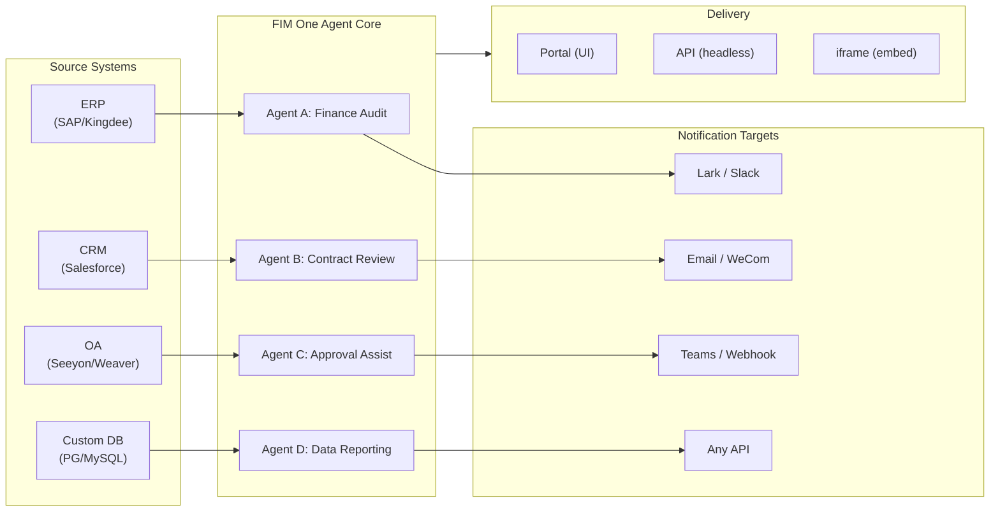

> Objectif : Construire une **plateforme d'agents tout-en-un pour les entreprises mondiales × chinoises** — livrée via trois modes progressifs : Standalone (assistant portail), Copilot (intégré au système hôte), Hub (orchestration centrale inter-systèmes).
>
> Principes : **Agnostique des fournisseurs** (pas de verrouillage propriétaire), **abstraction minimale**, **orienté protocole**, **orienté connecteurs** (l'intégration est la valeur centrale).

## Vision produit

FIM One est une **plateforme d'agent tout-en-un** qui propose trois modes de livraison progressifs :

```
Standalone   → Your own AI assistant (Portal)
Copilot      → AI embedded in a host system (iframe / widget / embed)
Hub          → Central cross-system orchestration (Portal / API)
```

**L'orchestration inter-systèmes est le différenciateur clé.** Les clients d'entreprise disposent de systèmes hérités — ERP, CRM, OA, finance, HR — qui doivent communiquer entre eux via l'IA :



**Stratégie GTM : Land and Expand**

| Étape | Mode | Ce qui se passe |
|------|------|-------------|
| Land | Copilot | Intégrer dans un système, prouver la valeur dans leur interface |
| Expand | Copilot → Hub | Déployer sur plusieurs systèmes ; le mode Hub les agrège |

## Problèmes connus

Bugs suivis qui sont reproductibles en production mais pas encore corrigés. Chaque entrée nomme le symptôme, la zone de surface suspecte et la solution de contournement (le cas échéant). Les éléments sont déplacés vers une section de version une fois qu'un correctif est défini et planifié.

- **L'arrêt et la nouvelle tentative du playground affichent des artefacts visuels transitoires qu'une actualisation de page efface toujours.** Trois sources de rendu concurrentes — `activeConversation.messages` (snapshot DB), le flux SSE `messages` et l'espace réservé optimiste `pendingQuery` — ne sont pas regroupées dans un seul état dérivé, donc entre le clic sur « Retry » et l'arrivée de la réponse de l'assistant appairée, l'interface utilisateur peut (a) brièvement afficher deux fois la même requête dans la fenêtre pré-flux, (b) supprimer les bulles utilisateur orphelines antérieures de l'historique de nouvelle tentative tandis que `hasLiveMessages` est vrai et avant le rechargement du snapshot, et (c) scintiller dans la fenêtre étroite entre l'événement SSE « done » et l'actualisation `selectConversation` suivante. **Les données ne sont jamais perdues** — chaque message utilisateur (y compris les nouvelles tentatives abandonnées) est conservé dans `conversation.messages`, transporté dans l'appel LLM suivant via `normalize_alternating_messages` et rendu correctement après actualisation via `HistoryTurn.orphanUserContents` introduit dans le correctif de rendu `48ba08c6`. Pour le contexte, l'interface web propre de Claude présente une classe analogue de bug — arrêter au milieu d'une réponse et envoyer immédiatement une requête de suivi crée parfois la requête de suivi en tant que branche d'édition sœur de la première requête plutôt que de l'ajouter en tant que nouveau tour — c'est donc un problème difficile connu dans les conceptions optimiste-UI + SSE + historique-persistant, et non un défaut spécifique à FIM One. Un correctif approprié nécessite de regrouper les trois sources de rendu dans un seul état dérivé ; reporté jusqu'à une refonte plus large de la machine d'état du Playground.

## Backlog (Low Priority) {/* dev: dev/dag-evidence-fidelity.md */}

Durcissement différé — ne bloque pas ; à reprendre uniquement si le scénario correspondant se présente.

- [ ] **DAG evidence gets its own truncation budget**, decoupled from `DAG_ANALYZER_TRUNCATION`, so source evidence isn't re-clipped by the summary budget before the analyzer/synthesis verify against it.
- [ ] **Structure-aware evidence truncation** (head+tail / keep lists & tables) so long enumerations survive the cap instead of silently losing their tail.
- [ ] **Port the source-fidelity guideline into the ReAct fallback synthesis prompt** so total/severity mislabels are caught in ReAct too, not only in DAG.

# Versions Expédiées

### v0.1 (2026-02-22) — MVP : ReAct + DAG Planner
- ReActAgent avec outils (calculator, python_exec, web_search)
- DAG Planner (LLM génère des graphes de dépendances)
- Portal UI avec streaming + KaTeX

### v0.2 (2026-02-24) — Multi-Model + Memory
- Retry / rate limiting / usage tracking
- Native function calling (no JSON-only parsing)
- Multi-model support (fast + main LLM)
- Memory: WindowMemory, SummaryMemory
- FastAPI backend with SSE streaming

### v0.3 (2026-02-25) — Web Tools + MCP
- Outils web (web_search, web_fetch) via Jina/Tavily/Brave
- Outil d'opérations sur fichiers
- Client MCP (intégration d'outils standard)
- Découverte automatique d'outils + catégories
- Visualisation DAG avec clic-pour-défiler
- Exécution de code dans Docker (`--network=none`)

### v0.4 (2026-02-25) — Multi-Turn + Agents
- Conversations multi-tours (DbMemory)
- Interface de repliement des étapes d'outils
- Outils de requête HTTP + exécution shell
- Gestion des agents (créer, configurer, publier)
- Authentification JWT
- Mode d'exécution par agent + contrôle de température

### v0.5 (2026-02-28) — Full RAG + Grounded Gen
- Pipeline RAG complet (embedding + magasin vectoriel + FTS + RRF + réclassement)
- Génération ancrée (citations, scores de confiance)
- Gestion des documents de base de connaissances (CRUD, recherche, nouvelle tentative, migration de schéma)
- ContextGuard + messages épinglés (gestionnaire de budget de tokens)
- Persistance DbMemory + LLM Compact
- Replanification DAG (jusqu'à 3 tours)

### v0.6 (2026-03-01) — Connector Platform
- **Connector CRUD**: create, read, update, delete
- **ConnectorToolAdapter**: converts Connector → BaseTool
- **Per-user credentials**: AES-GCM encryption
- **Confirmation gate**: write operation approval
- **Audit logging**: all tool calls recorded
- **Circuit breaker**: graceful degradation on failures
- **Utility tools**: email_send, json_transform, template_render, text_utils
- **Embedding options**: Jina, OpenAI, custom providers

### v0.7 (2026-03-06) — Admin Platform + Multi-Tenant
- **Admin Platform**: gestion des utilisateurs, basculement des rôles, réinitialisation de mot de passe, activation/désactivation de compte
- **Inscription sur invitation uniquement**: trois modes (ouvert/invitation/désactivé) + CRUD de code d'invitation
- **Gestion du stockage**: utilisation disque par utilisateur, nettoyage, suppression des fichiers orphelins
- **Modération des conversations**: liste/suppression admin de toutes les conversations
- **Déconnexion forcée par utilisateur**: révocation de tous les jetons
- **Tableau de bord de santé API**: statistiques système, métriques des connecteurs
- **Assistant de configuration initiale**: création guidée du compte administrateur
- **Centre personnel**: instructions globales par utilisateur, préférence de langue
- **Authentification JWT**: authentification SSE basée sur jetons, propriété des conversations
- **Serveurs MCP globaux**: provisionnés par l'administrateur, chargés dans toutes les sessions
- **Compatibilité rétroactive**: migration automatique registration_enabled → registration_mode

### v0.7.x (2026-03-07 à 2026-03-12) — Stabilité + Perfectionnements
- Gestion des codes d'invitation
- Quotas par utilisateur (application 429)
- Journalisation d'audit structurée
- Filtrage des mots sensibles
- Historique de connexion administrateur
- Navigateur de fichiers administrateur
- Vues administrateur améliorées (champs model_name, tools, kb_ids)
- Déploiement Docker Compose (image unique, volumes nommés)
- Détection automatique OAuth depuis window.location
- Support de la réflexion étendue / raisonnement (`LLM_REASONING_EFFORT`, `LLM_REASONING_BUDGET_TOKENS`) pour OpenAI o-series, Gemini 2.5+, Claude
- Activation/désactivation par outil administrateur (outils désactivés exclus du chat à l'exécution)
- Gestion des serveurs MCP déplacée vers la page Connecteurs
- Support de base de données double : SQLite (par défaut sans configuration) + PostgreSQL (production) ; Docker Compose provisionne automatiquement PostgreSQL
- Page de documentation de configuration des modèles avec configuration de la réflexion étendue par fournisseur
- Protocole SSE v2 : streaming de réponses en temps réel avec champs `delta_reasoning`, `usage` et événements `done`/`suggestions`/`title`/`end` séparés ; taille du pool SQLite 5 -> 20
- Expansion AI Builder : 7 nouveaux outils de construction (GetSettings, TestConnection, ImportOpenAPI pour connecteurs ; ListConnectors, AddConnector, RemoveConnector, SetModel pour agents), drapeau `is_builder` sur agents, actualisation automatique du prompt de construction, protection SSRF
- Frontend SSE v2 : curseur avec point pulsant en streaming, snapshots de re-plan DAG sous forme de cartes réductibles, mise en page DAG découplée des états d'étape
- Page de documentation du concept AI Builder avec guides de construction de connecteurs et d'agents
- Système d'organisation : CRUD complet avec adhésion basée sur les rôles (propriétaire/administrateur/membre), interface de gestion administrateur
- Visibilité des ressources à trois niveaux (personnel/org/global) pour agents, connecteurs, bases de connaissances, serveurs MCP
- API de publication/dépublication pour tous les types de ressources ; délégation de propriétaire pour agents publiés
- Point de terminaison administrateur set-visibility (remplace clone-to-global) ; assistant de requête `build_visibility_filter()` unifié
- Connecteurs de base de données (Phase 1-3) : accès SQL direct à PG/MySQL/Oracle/SQL Server + bases de données héritées chinoises ; introspection de schéma, annotation IA, exécution de requête en lecture seule, identifiants chiffrés, 3 outils par connecteur (`list_tables`, `describe_table`, `query`)
- **Centre d'évaluation** : benchmarking quantitatif de la qualité des agents — CRUD d'ensemble de données de test (prompt + comportement attendu + assertions), exécutions d'évaluation (exécution parallèle + évaluateur LLM + résultats par cas réussi/échoué/latence/token), visionneuse de résultats avec interrogation automatique ; migration `r8t0v2x4z567`
- Trois rôles de modèle (Général/Rapide/Raisonnement) avec isolation de configuration env par niveau ; le modèle rapide n'hérite plus des paramètres du modèle principal
- Classe de données `StepOutput` remplaçant les résultats d'étape en chaîne simple pour les données structurées et le passage d'artefacts
- Cache d'outils pour l'exécution DAG — appels d'outils identiques mis en cache par exécution avec verrou asynchrone pour prévention de ruée (`DAG_TOOL_CACHE`)
- Vérification LLM par étape avec 1 nouvelle tentative en cas d'échec (`DAG_STEP_VERIFICATION`)
- Routage automatique : LLM rapide classe les requêtes comme ReAct ou DAG ; point de terminaison `/api/auto` ; bascule de mode 3 voies frontend (`AUTO_ROUTING`)
- [x] ~~**Organisation du marché fantôme + Abonnements aux ressources**~~ : Organisation Market intégrée (fantôme, pas d'adhésion automatique) remplace l'organisation Platform ; ressources découvertes via navigation marketplace et explicitement souscrites (modèle pull) ; API Market pour s'abonner aux ressources partagées ; la publication sur Market nécessite toujours un examen ; table d'abonnements aux ressources ; partage de ressources basé sur l'organisation remplaçant la visibilité globale
- [x] ~~**Découverte automatique d'agents et liaison de sous-agents**~~ : drapeau `discoverable` sur agents ; liste blanche `sub_agent_ids` ; CallAgentTool pour déléguer des tâches à des agents spécialisés
- [x] ~~**Identifiants de serveur MCP + Remplacement par utilisateur**~~ : table `mcp_server_credentials` ; point de terminaison `PUT /api/mcp-servers/{id}/my-credentials` ; drapeau `allow_fallback` pour le comportement de secours des identifiants
- [x] ~~**Bascule connecteur/KB**~~ : `POST /api/connectors/{id}/toggle` et `POST /api/knowledge-bases/{id}/toggle` pour suspendre/reprendre les ressources
- [x] ~~**Conversations KB autonomes**~~ : champ `kb_ids` sur conversations pour chat KB direct sans liaison d'agent

### v0.8 (2026-03-20) — Connecteur Configuration Déclarative + Divulgation Progressive
- [x] **Connecteurs de base de données** : accès SQL direct (PostgreSQL, MySQL, Oracle) *(livré en v0.7.x — Phase 1-3)*
- [x] **RBAC** : contrôle d'accès au connecteur par utilisateur/rôle *(livré en v0.7.x — système org + visibilité trois niveaux)*
- [x] **Chiffrement des identifiants du connecteur + remplacement par utilisateur** : table `connector_credentials`, chiffrement Fernet via `CREDENTIAL_ENCRYPTION_KEY`, drapeau `allow_fallback`, points de terminaison `GET/PUT/DELETE /my-credentials`, résolution des identifiants par utilisateur dans le chargement des outils de chat
- [x] **Interface d'examen de publication** : système d'examen de publication au niveau org — bascule d'examen par org, ReviewsSheet avec flux d'approbation/rejet, badges de statut sur les cartes de ressources, avis d'examen dans la boîte de dialogue de publication, renvoi pour les ressources rejetées
- [x] **Divulgation Progressive du Connecteur (Phase 1-2)** : `ConnectorMetaTool` unique remplace les outils par action ; l'invite système reçoit uniquement des **stubs** légers (nom + description d'une ligne, ~30 tokens/connecteur vs ~250 tokens/action) ; l'agent appelle `discover(connector)` pour charger le schéma d'action complet à la demande — le schéma ne se charge que lorsque le modèle sélectionne un connecteur, maintenant le préfixe d'invite stable pour la mise en cache. Suit le modèle de chargement d'outils différé courant dans les frameworks d'agent modernes. Sous-commande `execute` ; drapeau de fonctionnalité pour la compatibilité rétroactive.
- [x] **Système de Compétences d'Agent + Instructions Compactes** : chargement à la demande des instructions d'agent — modèle `Skill` (nom, contenu/SOP, scripts optionnels) attaché aux agents ; référencé dans l'invite système par nom uniquement (~10 tokens/compétence) ; l'agent appelle `read_skill(name)` pour charger le contenu complet à la demande. Réduit le coût des tokens d'instruction par conversation d'environ 80 % tout en permettant des bibliothèques SOP plus riches. Homologue de la divulgation progressive de ConnectorMetaTool appliquée au niveau des instructions. Active la différenciation « instructions + outils + compétences ». Ajoute également le champ `compact_instructions` au modèle Agent — liste de priorités de compression par agent injectée dans `ContextGuard` lors de la compression (par exemple, « préserver les ID de commande et les montants, supprimer les réponses API brutes »), remplaçant l'invite générique statique actuelle. Suit la convention Instructions Compactes largement adoptée dans les frameworks d'agent modernes.
- [x] **Import/export de connecteur** : partager les modèles de connecteur
- [x] **Duplication de connecteur** : cloner et personnaliser les connecteurs existants
- [x] **Nœuds Workflow Phase 2** : Iterator, Loop, VariableAggregator, ParameterExtractor, ListOperation, Transform, DocumentExtractor, QuestionUnderstanding, HumanIntervention — 9 types de nœuds avancés avec frontend + backend complets + 150 nouveaux tests (275 au total). Nouvelle tentative de nœud avec backoff exponentiel, évaluation d'expression sécurisée. Panneau de statistiques avec barre de taux de réussite. 12 modèles intégrés. Menu contextuel du volet (Coller, Sélectionner tout, Ajuster la vue, Mise en page automatique).
- [x] **Nœuds Workflow Phase 3 : SubWorkflow + ENV** — 2 nouveaux types de nœuds (25 nœuds au total), 14 nouveaux tests (306 au total), 14 modèles intégrés. SubWorkflow : exécuteur de workflow imbriqué entièrement sauvegardé en base de données avec sélection de workflow cible, mappage de variables et limite de profondeur configurable pour prévenir la récursion infinie. ENV : lit les variables d'environnement chiffrées avec sélecteur de clé et valeurs par défaut de secours. Frontend complet (composants de nœud, panneaux de configuration, entrées de palette, couleurs de minimap). Panneau de statistiques d'exécution par nœud (taux de réussite, durées, comptages d'échecs triés du pire au meilleur). Client API `getNodeStats` + type `NodeStatEntry`. Dialogue des raccourcis clavier (touche `?`).
- [x] **Déclencheurs Planifiés du Workflow** : configuration cron par workflow avec fuseau horaire, entrées par défaut et calcul de la prochaine exécution. Boutons cron prédéfinis, 30 tests de déclencheur.
- [x] **Déclencheurs API du Workflow** : clés API publiques par workflow (préfixe `wf_`) pour l'exécution externe sans authentification utilisateur, avec limitation de débit. Dialogue de gestion des clés API avec générer/régénérer/révoquer, URL de déclenchement et exemples cURL/JS.
- [x] **Exécution par Lot du Workflow** : `POST /batch-run` avec jusqu'à 100 ensembles d'entrée, parallélisme configurable (1-10), résultats par élément réductibles, export JSON. 14 tests d'exécution par lot.
- [x] **Visionneuse du Journal d'Exécution du Workflow** : flux d'événements SSE chronologique en temps réel dans le panneau d'exécution avec horodatages, badges en code couleur et bascules de filtre par type d'événement.
- [x] **Statistiques d'Exécution du Workflow** : le backend récupère par lot les comptages d'exécution et les taux de réussite via une sous-requête GROUP BY ; le frontend affiche les statistiques sur les cartes de workflow avec indicateurs de taux de réussite en code couleur.
- [x] **Démon Planificateur du Workflow** : service asynchrone en arrière-plan interrogeant toutes les 60 secondes les workflows basés sur cron dus. Support de fuseau horaire Croniter, sémaphore de concurrence, suivi `last_scheduled_at`, livraison webhook. 14 tests.
- [x] **Résolveur de Conflits d'Import du Workflow** : détecte les références d'agent/connecteur/KB/MCP non résolues lors de l'import. Requêtes DB par lot avec filtrage de visibilité, avertissements toast frontend. 17 tests.
- [x] **Exécution de Nœud Test du Workflow** : test de nœud unique isolé avec variables fictives, intégré dans l'éditeur (bouton Test du panneau de configuration + menu contextuel). 23 tests.
- [x] **Diff de Version du Workflow** : comparaison de blueprint côte à côte avec détection de changement de nœud/arête, indicateurs en code couleur (ajouté/supprimé/modifié).
- [x] **Gestion des Exécutions du Workflow** : supprimer les exécutions individuelles (`DELETE /runs/{run_id}`) et effacer toutes les exécutions terminées (`DELETE /runs`), avec dialogues de confirmation frontend.
- [x] **Superposition de Relecture d'Exécution du Workflow** : bouton « Afficher sur le canevas » dans l'historique d'exécution pour superposer les résultats d'exécution passés sur le canevas, affichant le statut et la sortie par nœud sans réexécution.
- [x] **Favoris/Épinglage du Workflow** : étoile/épingle les workflows en haut de la liste avec persistance localStorage.
- [x] **Export de l'Historique d'Exécution du Workflow** : exporter l'historique d'exécution en tant que téléchargement de fichier JSON avec métadonnées d'exécution complètes et résultats par nœud.
- [x] **Gestion des Workflows Admin** : onglet du panneau admin pour gérer tous les workflows entre utilisateurs — liste, bascule actif/inactif, suppression avec confirmation. Points de terminaison par lot pour suppression, bascule et publication avec journalisation d'audit.
- [x] **Système de Modèles de Workflow** : modèle ORM `WorkflowTemplate` avec CRUD admin, API de listing/clone public et 5 modèles seed insérés automatiquement au premier démarrage.
- [x] **Badges de Validation Inline du Workflow** : `ValidationBadge` par nœud en temps réel sur le canevas avec info-bulles d'erreur/avertissement pour un retour visuel immédiat lors de l'édition.
- [x] **Visionneuse de Trace d'Exécution du Workflow** : visionneuse de trace basée sur la chronologie Sheet avec paramètre `trace_level` du moteur et snapshots de variables par nœud pour le débogage pas à pas.
- [x] **Limitation de Débit et Délai d'Expiration du Workflow** : `WorkflowRateLimiter` par utilisateur (fenêtre glissante 10 exécutions/min, 3 concurrentes) et délai d'expiration global par défaut de 10 minutes.
- [x] **Système de Blueprint du Workflow** : éditeur de workflow visuel pour concevoir et exécuter des blueprints d'automatisation multi-étapes — modèles ORM `Workflow` / `WorkflowRun`, CRUD complet + API d'exécution SSE, import/export, duplication, point de terminaison de validation de blueprint, `WorkflowEngine` avec tri topologique + concurrence basée sur sémaphore + branchement conditionnel et 12 types de nœuds (Start, End, LLM, ConditionBranch, QuestionClassifier, Agent, KnowledgeRetrieval, Connector, HTTPRequest, VariableAssign, TemplateTransform, CodeExecution), `VariableStore` avec interpolation `{{node_id.output}}` et espace de noms `env.*`, stratégies d'erreur par nœud (STOP_WORKFLOW / CONTINUE / FAIL_BRANCH) avec délai d'expiration par nœud et interface de configuration avancée, éditeur visuel React Flow v12 avec palette glisser-déposer + panneau de configuration de nœud + combobox de sélecteur de variable + ajouter-nœud-sur-arête + mise en page automatique (ELK.js) + feuille d'historique d'exécution, conception de nœud compact de style Dify avec statut d'exécution basé sur anneau et transitions d'arête animées, 4 modèles de démarrage intégrés (Chaîne LLM Simple, Routeur Conditionnel, QA Augmentée par Connaissance, Pipeline API HTTP) avec dialogue de sélecteur de modèle et API `GET /templates` + `POST /from-template`, point de terminaison de statistiques, paramètre URL `?run=true` ouverture automatique, sécurité d'exécution de code basée sur subprocess, suite de tests 105 (modèles, aplatissement d'espace de noms eval, avertissements de validation de blueprint, suppression de nœud/arête, import/export/duplication, détection de blocage, branchement multi-condition)
- [x] **Audit opérationnel** : journalisation détaillée de qui a fait quoi — onglet d'audit du journal d'examen admin ajouté (piste d'examen de publication par org/ressource)
- [x] **Annotations de Schéma Sémantique** : étendre les champs de schéma du connecteur avec `semantic_tag`, `description` et drapeaux `pii` ; annotations affichées dans les descriptions d'outils LLM afin que l'agent comprenne l'intention du champ sans deviner à partir des noms de colonne

### v0.8.1 (2026-03-29) — Progressive Disclosure Maturity + ReAct Hardening
- Progressive disclosure for DB connectors (`DatabaseMetaTool`), MCP servers (`MCPServerMetaTool`), and on-demand tool loading (`request_tools` meta-tool)
- DAG quality overhaul (5 improvements: model upgrade, skill auto-discovery, citation verifier, structured content preservation, domain-aware routing)
- Domain model escalation in ReAct (specialist domains auto-escalate to reasoning model)
- Per-model Native Function Calling toggle (`tool_choice_enabled`)
- ReAct cycle detection (deterministic duplicate tool call prevention)
- ReAct completion checklist (pre-answer verification when tools were used)
- Resource Fork Phase 1 (MCP Server + Skill fork endpoints with lineage tracking)
- Workflow Connection Dep Auto-Subscribe (recursive sub-workflow dependency resolution)
- Prebuilt Solution Templates (8 vertical solutions seeded to Market on first registration)
- Admin notification improvements (timezone-aware, master switch, SMTP Reply-To)
- Per-turn token budget circuit breaker (`REACT_MAX_TURN_TOKENS`)
- Centralized tool truncation, dynamic system prompt budgeting
- File attachment download, duplicate message submission fix

### v0.8.2 (2026-04-10) — Agent Core Hardening + Vision Documents
- **Agent Core Phase 0** — Compact prompt upgraded to 9-section structured format; empty tool result protection (descriptive message instead of `(no output)`); anti-loop prompt + cycle detection threshold lowered to 2; domain classifier + pre-flight DB config resolution parallelized (400–1100 ms saved per request); SSE `end` event sent immediately after answer, with title/suggestions moved to background tasks
- **Agent Core Phase 1 (Context Anti-Bloat)** — `MicroCompact` rule-based old tool result cleanup (keep last 6); `REACT_TOOL_RESULT_BUDGET=40000` aggregate cap; reactive compact on context overflow (auto-compact to 50% budget and retry instead of crashing)
- **Agent Core Phase 2 (Speed)** — Keyword-based tool pre-selection (skips LLM call on obvious matches, 200–500 ms saved); `SharedHttpClient` LLM connection pooling; completion check skipped for answers >200 tokens; `FallbackLLM` wraps primary+fast with automatic failover on 429/503/529/connection errors
- **Intelligent Document Processing (Vision-Aware)** — Adaptive document handling: PDF pages rendered as images via PyMuPDF for vision-capable models (GPT-4o, Claude 3/4, Gemini), text-only fallback via pdfplumber. Per-model `supports_vision` flag. Modes via `DOCUMENT_PROCESSING_MODE`, `DOCUMENT_VISION_DPI`, `DOCUMENT_VISION_MAX_PAGES`. DOCX/PPTX embedded image extraction. Multi-turn vision persistence across conversation turns. Smart PDF processing (text-rich pages extract text + images; scanned pages render as full-page PNG). Pre-built sandbox image (`Dockerfile.sandbox`) with common data-science packages for `--network=none` code execution
- **Resource Fork completion** — Agent / Connector / Workflow fork endpoints added, completing the five-type lineage tracking (KB fork removed — inherently user-local)
- **File integrity guardrail** — System prompt rule prevents the agent from substituting unrelated file contents when a target file is unreadable; uploaded files now include `file_id` in message context for direct `read_uploaded_file` access

### v0.8.3 (2026-04-16) — Universal Document Conversion + Agent Core Phase 3
- **Universal Document Conversion (`convert_to_markdown` + OCR)** — Built-in Agent tool wrapping Microsoft MarkItDown; converts PDF, Word, Excel, PowerPoint, HTML, JSON, CSV, XML, ZIP, EPUB, Outlook .msg, images, audio, YouTube URLs to Markdown. `LiteLLMOpenAIShim` enables OCR via any vision-capable LLM (Claude, Gemini, Bedrock, Azure). Vision-aware RAG ingestion with zero-regression text-only fallback. `LLM_SUPPORTS_VISION` env var for opt-out
- **Agent Core Phase 3 (Runtime Invariant Hardening)** — Conversation recovery (dangling `tool_use` auto-repair); structured compact work card (`WorkCard` typed merge across compaction rounds); turn-level profiler (`REACT_TURN_PROFILE_ENABLED`); per-user rate limiting (`LLM_RATE_LIMIT_PER_USER`); empty-content assistant message with `tool_calls` no longer dropped

### v0.8.4 (2026-04-17) — Prompt Cache + Reasoning Correctness
- **System prompt section registry with cache breakpoints** — Memoized `PromptRegistry` splits system prompts into stable prefix + dynamic suffix; cache-capable providers (Claude, Bedrock Anthropic, Vertex Claude) receive `cache_control: {"type": "ephemeral"}` on the prefix for ~60-80% per-turn input token savings. Non-cache providers get a single concatenated message (zero behavior change)
- **Prompt cache observability** — `cache_read_input_tokens` and `cache_creation_input_tokens` tracked through `UsageSummary` → `TurnProfiler` → `done_payload.cache` field. Structured `turn_cache` log line per turn. Doubles as relay cache-honesty probe
- **Conversation recovery MVP** — Synthetic `tool_result` rows persist after interrupted turns; `POST /chat/resume` replays cached SSE events from a monotonic cursor; frontend `useSseResume` hook auto-reconnects with exponential backoff (300ms → 1s → 3s, max 3 attempts) and "Reconnecting…" indicator
- **Thinking-block persistence with signature** — `reasoning_content` + Anthropic `signature` persisted in `metadata_["thinking"]` and replayed on subsequent turns; fixes HTTP 400 signature mismatch on Claude 4 multi-turn conversations
- **Provider-aware reasoning replay policy** — Centralized `reasoning_replay_policy()` in `core/prompt/reasoning.py` gates serialization per provider family: Claude replays thinking blocks with signature; DeepSeek-R1/Qwen-QwQ/Gemini-thinking/o-series drop `reasoning_content` on outbound (previously leaked, breaking provider KV caches and violating API docs)

### v0.8.5 (2026-04-23) — Intégration de canal + Système de hooks + i18n contributeur
- **Canal Feishu (sous-ensemble Phase 1)** — Ressource `Channel` à portée organisationnelle avec identifiants chiffrés Fernet ; `FeishuChannel` supporte l'envoi de carte interactive + callback (vérification de signature + défi URL) ; interface de gestion Paramètres → Canaux (liste, créer/modifier avec protection d'état modifié, détails avec URL de callback copiable, envoi de test) ; API CRUD (`/api/channels`) et point de terminaison de callback d'événement (`/api/channels/{id}/callback`). Livré en avant-première pour la roadshow du 2026-04-24
- **Système de hooks d'agent (actif dans les runtimes ReAct + DAG)** — Abstraction `PreToolUseHook` / `PostToolUseHook` dans `src/fim_one/core/hooks/` ; les agents déclarant `hooks.class_hooks` dans `model_config_json` ont des hooks instanciés et enregistrés par session de chat. Premier consommateur `FeishuGateHook` publie une carte Approuver/Rejeter au groupe Feishu lié quand un agent appelle un outil `requires_confirmation=True`, bloque l'exécution et reprend ou abandonne selon le verdict
- **Portail de confirmation configurable (en ligne OU canal)** — Chaque agent obtient une section Approbation avec trois modes de routage (Auto / En ligne uniquement / Canal uniquement), sélecteur de portée approbateur (initiateur / propriétaire / n'importe qui dans l'org), remplacement par outil et sélecteur de canal d'approbation explicite. Le mode Auto bascule gracieusement vers une carte d'approbation en ligne quand aucun canal n'est lié. `POST /api/confirmations/{id}/respond` partage un chemin unique d'enregistrement de décision avec le webhook Feishu
- **Notifications de fin de tâche par agent** — Les agents ReAct ou DAG de longue durée peuvent envoyer une carte récapitulative au canal de l'org quand une tâche se termine. Premier consommateur du modèle de notification sortante générique
- **Playground d'approbation de hook** — La feuille de détails des canaux a une action « Tester le flux d'approbation » qui exerce le chemin de production complet (ligne `ConfirmationRequest` authentique, callback Feishu réel, transitions d'état) — le même chemin de code qu'un hook de production utilise
- **Repli i18n CI convivial pour contributeur** — `.github/workflows/i18n-sync.yml` traduit EN → ZH/JA/KO/DE/FR sur master après fusion de PR et valide automatiquement avec `[skip ci]` ; les contributeurs n'ont plus besoin de `LLM_API_KEY` localement. La garde de pré-commit refuse les modifications manuelles aux fichiers de locale générés (`ALLOW_LOCALE_EDIT=1` pour les corrections de traduction légitimes). Vérification de bout en bout via push de test de fumée
- **Docs d'intégration Exa** — Section Intégrations dédiée avec une première page Exa couvrant la surface de recherche Exa complète (neural / fast / deep-reasoning / instant), filtrage, récupération de contenu et trois présets ajustés
- **Support de base de données Xinchuang (信创)** — Le connecteur de base de données répertorie maintenant KingbaseES (人大金仓), HighGo (瀚高) et DM8 (达梦) aux côtés de PostgreSQL/MySQL. Les pilotes compatibles PG réutilisent `asyncpg` ; DM8 utilise `dmPython`. `scripts/test_xinchuang_dbs.py` vérifie la connectivité en direct depuis la CLI
- **Docs d'architecture Canaux + Système de hooks** — `docs/architecture/hook-system.mdx` explique les trois points de hook et parcourt `FeishuGateHook` de bout en bout ; les pages d'architecture existantes se renvoient mutuellement ; le README répertorie les canaux de messagerie comme une capacité de première classe
- **Durcissement** — Les clics de callback Feishu en double produisent une carte de remplacement au lieu de double-décision ; les clics de callback concurrents résolus via vérification de nombre de lignes `UPDATE ... WHERE status='pending'` conditionnel ; les approbations en attente expirent automatiquement après `CHANNEL_CONFIRMATION_TTL_MINUTES` (24h par défaut) via balayeur en arrière-plan ; Paramètres → Canaux respecte le rôle org (les membres voient l'interface en lecture seule) ; l'agrégateur d'appels d'outil parallèle gère les fournisseurs qui réutilisent `index=0` pour chaque delta ; la redirection d'expiration de session préserve la chaîne de requête

### v0.8.6 (2026-05-08) — Facturation Stripe + Améliorations
- [x] MVP de facturation Stripe — Niveaux Gratuit + Pro ; Checkout, Portail Client, cycle de vie webhook ; `/settings?tab=billing` ; CRUD de plan/abonnement admin ; l'application des quotas respecte le plan de chaque utilisateur
- [x] Drapeau de fonctionnalité de facturation contrôlé par l'admin — `system_settings.billing_enabled` contrôle l'ensemble du pipeline Stripe afin que les déploiements privés sans identifiants Stripe ne présentent jamais une UX de paiement non fonctionnelle
- [x] Quota illimité par utilisateur — vide hérite de la valeur par défaut globale, `0` accorde un accès illimité ; auparavant, les deux s'effondraient dans le même état
- [x] Glossaire de traduction comme source unique de vérité — `scripts/translation-glossary.md` consolide les règles par locale ; pre-commit refuse inconditionnellement les modifications manuelles des fichiers de locale générés
- [x] Licence + droit applicable migrés vers FIM Labs Pte. Ltd. (Singapour) ; arbitrage SIAC en anglais ; nouveau fichier `NOTICE` de haut niveau
- [x] Suggestions de suivi du Playground restaurées, opt-in par agent
- [x] Correctifs de stabilité — historique du fournisseur d'alternance stricte, détection de limite d'appel d'outil parallèle, flux de confirmation d'agent non lié, gating de rôle de canal, suppression de doublons de nouvelle tentative, pas de paraphrase post-rejet

### v0.8.7 (2026-06-10) — Security Hardening + Guardrails v0 + Billing Correctness
- [x] JWT token-type confinement — closes a 2FA bypass where any same-signed token (temp/refresh/ticket) could authenticate API and SSE endpoints
- [x] OAuth hardening — email auto-link requires a provider-verified email (account-takeover fix); OAuth refresh tokens stored hashed so session rotation works
- [x] Content guardrails v0 — input/output tripwire layer (`core/agent/guardrail`); ships jailbreak detector + max-length output guardrail, env-var configured
- [x] `file_ops.apply_patch` — V4A diff patches with fuzzy whitespace matching, complements `find_replace`
- [x] Billing-cycle correctness — quota resets on the subscription anniversary (not calendar month); renewals advance the period via authoritative Stripe lookup; usage display aligned to the enforcement window
- [x] Reliability fixes — pseudo-protocol tool-call leak stripped from answers; tunable HTTP keep-alive ends `APIConnectionError` bursts; API-key usage stats persist on read-only requests
- [x] Billing tab visual overhaul — full-width, consistent with other Settings tabs

### v0.8.8 (2026-06-22) — SSRF Hardening + Reliability & Reasoning Fixes
- [x] SSRF hardening — blocklist unwraps IPv4-mapped IPv6 (`::ffff:` instance-metadata bypass); MCP SSE/Streamable-HTTP server URLs SSRF-validated on create + connect
- [x] LLM reliability — shared HTTP pool self-heals after a LiteLLM client-cache eviction closes it; chat sends stream instantly (history folded in background, no full reload)
- [x] Anthropic adaptive-thinking protocol for Opus 4.6+/Sonnet 4.6/Fable 5 — extended thinking works where the old fixed-budget param 400s on 4.7/4.8; warns on OpenAI-proxy misroute
- [x] Reasoning detail preserved end-to-end — genuine final answer streamed verbatim; survives compaction, context rebuilds, and sub-agent steps (no lossy re-synthesis)
- [x] `PreToolUseHook` enforcement hooks fail closed on error — a crashing approval gate no longer silently allows the call; non-enforcement hooks keep fail-open via `fail_open`
- [x] Force-logout timestamp comparison normalized to UTC by conversion + Docker Compose `POSTGRES_*` credential override (no shipped `fim:fim` default)

### v0.8.9 (2026-07-08) — Module Slim-down + Sharing Convergence + Approval Hardening
- [x] Skills & Workflows soft-shelved behind admin module flags (default off) — core-only boot; nothing deleted, reversible from Admin → Settings → Modules
- [x] Sharing converged — KB sharing removed (KBs reach others only via shared Agents), DB connectors unshareable + raw SQL owner-only, workflow builder trimmed to 9 reference-only nodes
- [x] Feishu approval hardening — card clicks enforce approver identity, callback signatures fail closed + encrypted envelopes decrypted, approvals never routed to an unintended chat
- [x] Use-time access re-checks — shared MCP servers and bound KBs re-verified per run; leaving an org revokes subscriptions and saved credentials immediately
- [x] Agent loop hardening — plan board, background tools, incremental DAG replan + checkpoint resume, compaction keeps tool pairing, truncation continuation, 529/504 retry
- [x] `run_workflow` agent tool + workflow correctness — Agent node runs the full agent, confirmation gates fail closed, connector calls access-checked and audit-logged
- [x] Account deletion unified — admin and self-serve funnel through one purge routine covering every record and on-disk file; org owners must transfer ownership first
- [x] Owner-credential fallback now opt-in (breaking) — connectors/MCP servers default `allow_fallback` off, existing rows flipped; no-fallback resources you lack credentials for are hidden from the toolset
- [x] Webhook/cron workflow runs metered to the owner's token quota — the unmetered free-LLM trigger path is closed
- [x] Resource binding unified on visibility — subscribed connectors/KBs/MCP servers bindable to agents; workflow connector steps enforce the runner's access
- [x] Conversation workspace wired into chat — `workspace://` offload of oversized tool results, budget-truncation rescue, pre-compaction transcript snapshots

### v0.8.10 (2026-08-28) — Réponses en streaming + Rendu enrichi + GPT-5 Responses + Modèle d'accès
- [x] Les réponses finales sont diffusées nativement via un transfert `finish` ; le markdown en streaming s'affiche bloc par bloc, de façon stable et sans scintillement
- [x] Les réponses affichent des diagrammes Mermaid, des figures SVG et des tableaux comparatifs en style carte, avec copie/export et téléchargement de fichiers sur les réponses, blocs de code et tableaux
- [x] Le markdown rendu est assaini (injection de HTML brut fermée) ; les exports de conversation sont composés pour le CJK (le PDF intègre une vraie police, le DOCX déclare une police d'Asie orientale)
- [x] Le raisonnement se replie en aperçus d'une ligne ; les étapes d'agent en cours affichent des titres d'une ligne générés et conservés dans l'historique de conversation
- [x] La barre latérale est réorganisée autour du cluster de chat ; commande `/clear` ; les listes de modèles d'administration disposent d'une sélection multiple par cases à cocher avec plages Shift-clic et suppression en masse
- [x] Un message nouvellement envoyé remonte en haut de la transcription ; les pages de liste font apparaître les cartes en décalé ; toutes les animations respectent reduce-motion
- [x] Les agents posent des questions à choix multiples en cours d'exécution (ask_user_question) — le tour se met en pause sur une carte dans le chat et reprend avec les réponses
- [x] Le compositeur conserve les brouillons non envoyés par conversation, avertit lorsqu'une image atteindrait un modèle texte uniquement, et attend la fin des téléchargements en cours à l'envoi
- [x] GPT-5.x passe en priorité sur l'API Responses avec relecture du raisonnement chiffré entre les tours d'outils (`FIM_GPT5_RESPONSES_MODE` pour revenir en arrière)
- [x] Un dépassement de la limite de sortie rejette l'ensemble du lot d'appels d'outils et demande une nouvelle tentative plus courte
- [x] Étapes DAG typées — les étapes de transformation/synthèse pures s'exécutent en un seul appel LLM direct ; les objectifs ask-first se terminent en un seul tour
- [x] Les budgets de contexte sont fixés 8 % en dessous de la limite stricte du modèle ; discipline du tableau de planification (rappels de répétition/absence de plan, vérification avant la fin)
- [x] Les portes d'approbation sont maintenues lors de la délégation — `call_agent` et les nœuds AGENT de workflow exécutent les hooks propres à l'agent plutôt qu'aucun
- [x] La liaison automatique OAuth exige une adresse vérifiée des deux côtés ; la rotation des tokens de rafraîchissement porte un `jti` unique afin que l'ancien token expire immédiatement
- [x] L'URL de callback Feishu passe la vérification — les push non signés s'authentifient par enveloppe Encrypt Key + Verification Token
- [x] Modèle d'accès aux instances pour la facturation — postures sans abonnement / inclus+payant / payant uniquement, plan par défaut inclus non supprimable

### v0.8.11 (2026-09-03) — Floating Composer
- [x] Le compositeur de chat est une pilule flottante au-dessus du flux de messages — pièces jointes, sélecteurs de mode/agent et envoi dans une seule entrée ; les messages défilent en dessous

### v0.8.12 (2026-09-04) — Compositeur partagé + synchronisation ENV
- [x] Les assistants IA de la base de connaissances (KB), des agents et des connecteurs utilisent le même éditeur flottant que le chat ; appuyer sur Entrée pendant la composition IME n’envoie plus le message
- [x] `scripts/env_from_active_group.py` maintient le modèle de secours dans `.env` synchronisé avec le groupe actif du panneau d’administration
- [x] La génération d’images fonctionne avec les modèles OpenAI `gpt-image-*`

## Versions planifiées

Replanifié le 06/09/2026. Le noyau est construit : moteur ReAct, connecteurs,
identifiants, mécanisme d’approbation, audit, organisations multi-locataires. Il
s’agit désormais d’achever ce qui existe déjà dans la base de code et de veiller
à son bon fonctionnement, sans ouvrir de nouveaux domaines fonctionnels. Tout ce
qui ne figure pas dans la liste ci-dessous n’est pas planifié ; consultez la
note de clôture.

### v0.9 — Barrières des connecteurs

**Objectif** : un connecteur de base de données peut être confié à un collègue en toute sécurité, et les chemins inachevés déjà présents dans l’arborescence sont finalisés.

#### Barrières du connecteur DB {/* dev: dev/connector-rbac/00-overview.md */}

- [x] Marquage des colonnes PII — les colonnes marquées restent dans le schéma, et les valeurs sont masquées dans chaque résultat de requête
- [x] Visibilité du schéma — autorisation/interdiction des tables et des colonnes, avec blocage des verbes (application du mode lecture seule)
- [x] Traçabilité des barrières — `scope_rules_applied` dans `ConnectorCallLog` enregistre les barrières sous lesquelles chaque appel a été exécuté

#### Finaliser ce qui est déjà en cours

- [ ] Entrée de compaction par lots et budgets adaptés au modèle sur le chemin de chat principal, afin que toute combinaison de modèles reste dans la fenêtre de contexte
- [ ] Vérifier les chiffres d’utilisation du streaming du pont Responses sur la prochaine mise à niveau de LiteLLM (une mauvaise correspondance en amont est suspectée)
- [ ] Retirer le pont chat→responses de LiteLLM une fois que le chemin GPT-5.x natif aura effectué une version complète
- [ ] Mise en production de la facturation Stripe — rapprochement nocturne avec Stripe pour détecter les webhooks manqués, tests de régression full-stack et ID de prix en production

### Livré du plan de pré-replan v0.9

- [x] ~~Auth & security: JWT token-type confinement + OAuth fixes (v0.8.7); PG tz-aware timestamps (v0.8.6); force-logout UTC + `POSTGRES_*` override + SSRF IPv6-mapped fix (v0.8.8); owner-fallback opt-in + visibility-unified binding + webhook/cron metering (v0.8.9)~~
- [x] ~~Provider compat: Anthropic adaptive thinking + shared LLM pool self-heal (v0.8.8)~~
- [x] ~~Content guardrails v0: tripwire layer + jailbreak detector (v0.8.7)~~ {/* dev: dev/archive/openai-agents-insights.md */}
- [x] ~~Hook system: skeleton + FeishuGateHook + Approval Playground + ReAct/DAG runtime (v0.8.5); PreToolUse enforcement fail-closed (v0.8.8)~~
- [x] ~~Feishu channel Phase 1 + task completion notification (v0.8.5)~~
- [x] ~~`run_workflow` agent tool (v0.8.9); reasoning detail preserved end-to-end (v0.8.8); workspace tool-output offloading wired into chat (v0.8.9)~~
- [x] ~~Agent loop hardening: plan board, LLM-call resilience, background tools, incremental DAG replan + checkpoint resume, compaction tool-pairing (v0.8.9)~~ {/* dev: dev/archive/incremental-dag.md */}

- [x] ~~Circuit breaker, Workflow run retention cleanup, Workflow version diff summaries~~ *(v0.8 / v0.8.1)*
- [x] ~~DAG quality overhaul, Domain model escalation, Per-model NFC toggle~~ *(v0.8.1)*
- [x] ~~DatabaseMetaTool, MCPServerMetaTool, On-demand `request_tools`~~ *(v0.8.1)*
- [x] ~~Workflow Connection Dep Auto-Subscribe, Workflow real executors~~ *(v0.8.1)*
- [x] ~~ReAct Cycle Detection, Completion Checklist~~ *(v0.8.1)*
- [x] ~~Prebuilt Solution Templates (8 vertical bundles), Resource Fork (MCP/Skill/Agent/Connector/Workflow)~~ *(v0.8.1)*
- [x] ~~Vision document processing (PDF / DOCX / PPTX), MarkItDown OCR~~ *(v0.8.2 / v0.8.3)*
- [x] ~~Smart File Content Injection + `read_uploaded_file`~~ *(v0.8)*
- [x] ~~Agent Core Phase 3: Conversation Recovery MVP, Compact Work Card, Turn Profiler, Per-user Rate Limiting~~ *(v0.8.3)*
- [x] ~~Conversation resume MVP, System prompt registry + cache, Thinking-block persistence, Reasoning replay policy, Cache observability~~ *(v0.8.4)*

## Fonctionnalités gelées (livrées, maintenance uniquement)

Selon la [Stratégie d'orthogonalité](/strategy/orthogonality-strategy), ces fonctionnalités sont livrées et fonctionnelles mais ne recevront pas de nouvelles capacités (corrections de bugs uniquement) :

| Fonctionnalité | Version | Raison du gel |
|---------|---------|-----------|
| ReAct Agent | v0.1, v0.9 | Les modèles disposent désormais d'appels d'outils natifs. L'auto-réflexion en boucle (v0.9) prévient la dérive d'objectif dans les chaînes longues. La qualité de la synthèse d'observation d'outils s'est améliorée (8K caractères, configurable via `REACT_TOOL_OBS_TRUNCATION`) |
| DAG Planning / Re-Planning | v0.1, v0.5, v0.7.5 | Les capacités de raisonnement des modèles s'améliorent ; la décomposition devient single-shot. La vérification par étape a été livrée en v0.7.5 (`DAG_STEP_VERIFICATION`). Renforcée : propagation des défaillances en cascade, correction du statut du vérificateur, descriptions des outils du planificateur, historique complet de replan, cache d'outils basé sur liste blanche. 14 constantes du moteur exposées en tant que variables ENV — aucune nouvelle primitive de planification prévue |
| Memory (Window, Summary, Compact) | v0.2, v0.5 | Les fenêtres de contexte augmentent (200K+) ; moins besoin de gestion externe de la mémoire |
| Pipeline RAG | v0.5 | Les fournisseurs construisent la récupération nativement (OpenAI file_search, Gemini Search Grounding) |
| Grounded Generation | v0.5 | Les modèles s'améliorent dans les citations ; le pipeline à 5 étapes ajoute une valeur décroissante |
| ContextGuard / Pinned Messages | v0.5 | Livraison en l'état ; aucune nouvelle fonctionnalité |

## Hors de cette feuille de route

Si une fonctionnalité ne figure pas ci-dessus, elle n’est pas prévue. Il s’agit d’un choix délibéré, et non d’un oubli : le projet est en maintenance, et les travaux sont priorisés en fonction des besoins réels plutôt que de ce qui permettrait de compléter la matrice des fonctionnalités.

Si quelque chose vous manque, ouvrez une issue en décrivant le problème qui vous bloque. Un cas d’utilisation concret et bloqué est ce qui permet d’ajouter un élément à cette page.
