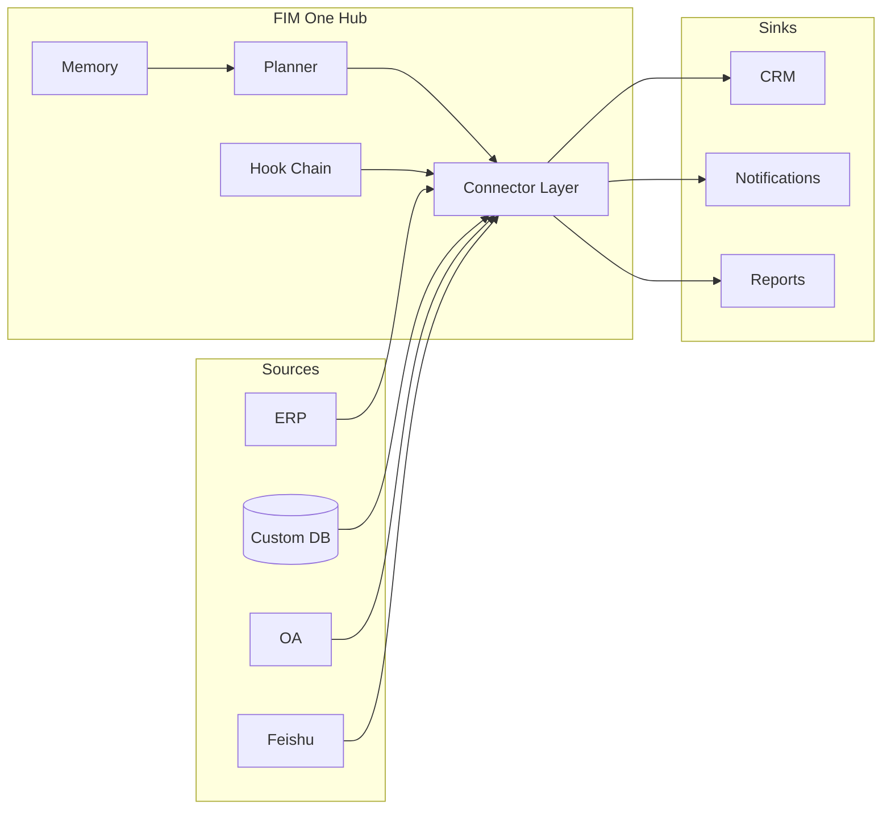

<Frame>
  
</Frame>

<Info>
  **Version 1.0 · Avril 2026.** Ce livre blanc documente la thèse architecturale, les principes de conception et le modèle de déploiement de FIM One.
  Il est destiné aux CTO, architectes d'entreprise, responsables de plateformes IA et investisseurs techniques évaluant comment intégrer l'IA dans des systèmes construits avant l'ère de l'IA.
</Info>

## Résumé exécutif

La plupart des entreprises disposent déjà des systèmes dont elles ont besoin — ERP, CRM, OA, bases de données personnalisées, API internes. Ce qui leur manque, c'est un moyen pour l'IA de **accéder** à ces systèmes sans un projet d'intégration de six mois pour chaque cas d'usage.

Les approches existantes échouent de manière prévisible. Les constructeurs de flux de travail (n8n, style Zapier) vous demandent de répliquer la logique métier qui existe déjà dans vos systèmes. Les agents polyvalents (Manus, AutoGPT) peuvent naviguer sur le web mais ne peuvent pas se connecter à votre instance SAP. Les outils RPA sont fragiles et se dégradent à chaque changement d'interface utilisateur. Les SaaS IA verticaux vous forcent à migrer les données dans un autre silo.

FIM One est un **Connector Hub** : un framework Python agnostique en matière de fournisseur où les agents IA planifient et exécutent dynamiquement des tâches sur vos systèmes existants. L'insight clé est que le problème difficile n'est pas le raisonnement — les LLM de pointe s'en chargent — c'est l'**alignement** : donner à l'IA une surface stable, typée, authentifiée et gouvernée pour les systèmes hérités qui n'ont jamais prévu de communiquer avec un modèle.

Le résultat est un cœur d'agent unique livré de trois façons :

| Mode | Où il réside | Déploiement typique |
|---|---|---|
| **Autonome** | Un portail qui lui est propre | Q&A de connaissances, chat interne, bac à sable de code |
| **Copilote** | Intégré dans un système hôte | « Copilote Finance » dans une interface web ERP |
| **Hub** | Orchestrateur central inter-systèmes | L'agent interroge l'ERP, vérifie l'OA, notifie via Feishu |

Ce document explique pourquoi cette architecture est correcte, à quoi ressemble l'architecture sous le capot, comment elle reste sûre en production, et où elle va ensuite.

## 1. Le problème : l'IA d'entreprise est un problème d'alignement

La conversation publique sur l'IA en 2025–2026 a été dominée par les capacités : fenêtres de contexte plus longues, meilleure capacité de raisonnement, tokens moins chers. Au sein des entreprises, les capacités n'étaient rarement le goulot d'étranglement. Le goulot d'étranglement est que **l'IA n'a pas de mains**.

Un LLM capable de lire une base de code de dix mille lignes et de proposer une correction correcte ne peut pas, par lui-même :

- Extraire les chiffres d'inventaire d'hier d'une instance SAP sur site.
- Approuver une demande de congé dans un outil RH SaaS qui ne dispose que d'une API SOAP héritée.
- Écrire une ligne dans un ERP du marché chinois dont l'authentification est un service de ticket de connexion au lieu d'OAuth2.
- Envoyer une notification dans un groupe de discussion Feishu, en respectant les règles d'approbation du groupe.

Chacun de ces éléments est un problème d'intégration résolu — une fois. La difficulté est que chaque entreprise dispose de dizaines de tels systèmes, chacun avec son propre modèle d'authentification, modèle de données et modes de défaillance. Les coder en dur dans un seul agent vous donne un monolithe fragile. Demander au LLM de les découvrir à l'exécution vous donne des appels API hallucinations.

**La primitive manquante est une surface alignée.** Une interface typée, authentifiée et découvrable entre le modèle et le système — une qui indique au modèle exactement ce qu'il peut faire, quel est le coût de chaque action, qui doit l'approuver, et à quoi ressemblera le résultat. Cette primitive est ce que FIM One appelle un **Connector**.

## 2. Pourquoi les approches existantes sont insuffisantes

### 2.1 Workflow Builders (n8n, Zapier, Dify)

Les constructeurs de flux de travail traitent l'intégration comme un graphe visuel : glisser-déposer des nœuds, les connecter, exécuter. Ils fonctionnent bien pour les automations marketing en dix étapes. Ils échouent pour l'IA d'entreprise car :

- La logique qu'ils encodent **existe déjà** dans le système cible. Chaque nœud est un simple wrapper autour d'un appel API que vous devez maintenir à deux endroits.
- Ils supposent que le concepteur humain connaît le plan à l'avance. Les questions d'entreprise sont ouvertes — « clôturer Q1 pour toutes les entités APAC » — et le plan doit être généré à la volée.
- Ils traitent l'IA comme un nœud parmi d'autres, au lieu du planificateur qui décide quels nœuds appeler.

### 2.2 Agents polyvalents (Manus, AutoGPT, OpenAI Assistants)

Les agents polyvalents sont conçus pour les tâches de consommation et de travail intellectuel — navigation web, rédaction de documents, manipulation de feuilles de calcul. Ils ne peuvent pas accéder à votre VPN, s'authentifier auprès de votre ERP ou passer votre examen de sécurité. Lorsqu'ils sont intégrés à des systèmes d'entreprise, ils deviennent une démonstration qui s'arrête au stade du pilote.

### 2.3 Vertical AI SaaS

Les outils Vertical AI (CRM natifs IA, outils financiers natifs IA) résolvent un flux de travail magnifiquement et forcent une migration de données pour y arriver. Les entreprises se retrouvent avec plus de silos, pas moins, et aucune orchestration entre systèmes.

### 2.4 RPA

Robotic Process Automation pilote l'interface utilisateur comme un humain. C'est la plus générale des quatre — tout ce qu'un humain peut cliquer, RPA peut le cliquer — et aussi la plus fragile : chaque changement d'interface utilisateur la casse, chaque invite d'authentification l'arrête, chaque CAPTCHA termine l'exécution. C'est un pansement sur l'absence d'API, pas une fondation pour construire l'IA.

FIM One se situe dans l'écart que les quatre laissent derrière : des API typées sur des systèmes réels, planifiées par le modèle, gouvernées par l'entreprise.

## 3. La thèse de FIM One

Trois convictions façonnent chaque décision de conception dans FIM One.

**Conviction 1 — Les systèmes existent déjà.** Ne demandez pas à l'entreprise de tout reconstruire ; rencontrez-la où elle est. Chaque connecteur est un pont, pas un remplacement. Les données ne quittent jamais la source de vérité.

**Conviction 2 — L'alignement surpasse la capacité.** Un modèle plus faible avec un ensemble d'outils alignés surpasse un modèle plus puissant qui tâtonne sur les API brutes. Le fossé est la bibliothèque de connecteurs et son modèle d'authentification, pas le raisonnement de l'agent.

**Conviction 3 — La planification dynamique est le juste milieu.** Les flux de travail rigides sont trop fragiles pour les tâches réelles en entreprise ; les agents entièrement autonomes sont trop imprévisibles pour la production. Les agents de FIM One planifient à l'exécution mais dans un espace d'action typé — chaque étape est un appel de connecteur, pas un monologue LLM ouvert.

Ces trois ensemble produisent le Connector Hub.

## 4. Principes architecturaux

<CardGroup cols={2}>
  <Card title="Agnostique du fournisseur" icon="shuffle">
    Tout LLM compatible OpenAI — OpenAI, Anthropic, DeepSeek, Qwen, Ollama local. Le choix du modèle est une variable de déploiement, pas un engagement architectural.
  </Card>
  <Card title="Axé sur le protocole" icon="network-wired">
    Chaque connecteur publie un schéma typé. L'agent voit les actions, les paramètres et les types de retour — jamais du HTTP brut.
  </Card>
  <Card title="Asynchrone par défaut" icon="bolt">
    Python asynchrone partout. Une exécution d'agent unique peut se déployer vers des dizaines de connecteurs ; les E/S bloquantes seraient économiquement mortelles.
  </Card>
  <Card title="Deux moteurs d'exécution" icon="sitemap">
    ReAct pour les tâches exploratoires, DAG pour les pipelines structurés. Un seul cœur d'agent sélectionne le moteur par tâche.
  </Card>
  <Card title="Gouverné par des crochets" icon="shield-halved">
    Chaque appel d'outil passe par une chaîne de crochets : audit, politique, approbation humaine. La gouvernance n'est pas une réflexion tardive.
  </Card>
  <Card title="Conscient de la mémoire" icon="brain">
    La conversation à court terme, la base de connaissances à long terme et la mémoire inter-sessions sont de première classe — pas ajoutées après coup.
  </Card>
</CardGroup>

## 5. Trois modes de livraison — Un cœur d'agent

Le même planificateur, la même mémoire et la même bibliothèque de connecteurs alimentent trois formes de produit distinctes. Le choix est une décision de déploiement, pas une bifurcation de code.

### 5.1 Standalone

Un portail autonome. L'acheteur souhaite une interface de chat sur une base de connaissances organisée, un bac à sable de code, ou un assistant général pour son équipe. Aucun système hôte impliqué.

**Cas d'usage typique :** Service d'assistance informatique interne, productivité d'ingénierie, base de connaissances d'assistance client.

### 5.2 Copilot

L'agent est intégré dans un système hôte existant — une interface web ERP, un onglet CRM, un outil interne personnalisé — via iframe, widget ou intégration directe. Le système hôte gère déjà l'authentification ; le Copilot hérite du contexte utilisateur et opère sur les données de l'hôte.

**Cas d'usage typiques :** Finance Copilot dans SAP Fiori, Sales Copilot dans Salesforce, DevOps Copilot dans un portail développeur interne.

### 5.3 Hub

La surface d'orchestration centrale. Chaque système connecté — ERP, CRM, OA, Feishu, bases de données personnalisées — aboutit au Hub. Les utilisateurs posent des questions multi-systèmes ; l'agent planifie et exécute à travers les systèmes.

**Cas d'usage typiques :** « Clôturer Q1 pour toutes les entités APAC », « trouver tous les clients qui ont manqué un renouvellement et rédiger une relance », « rapprocher les paiements d'hier entre la passerelle de paiement et notre grand livre ».

## 6. Modèle d'alignement des connecteurs

Un connecteur est une surface d'action typée soutenue par une stratégie d'authentification. FIM One définit trois niveaux d'authentification qui couvrent la grande majorité des systèmes d'entreprise.

<AccordionGroup>
  <Accordion title="Tier 1 — Connecteurs de base de données (Full ou Basic)">
    Connexion directe à une base de données relationnelle ou documentaire. Le mode **Full** expose du SQL arbitraire à l'agent, contrôlé par un rôle en lecture seule ; le mode **Basic** expose uniquement des requêtes paramétrées pré-enregistrées. Utilisé pour les systèmes internes personnalisés où la source de vérité est une base de données que vous contrôlez.
  </Accordion>
  <Accordion title="Tier 2 — Connecteurs OpenAPI (User-Key)">
    Toute API REST avec une spécification OpenAPI. L'agent lit la spécification, sélectionne le bon point de terminaison et l'appelle avec la clé de l'utilisateur connecté. Couvre les SaaS modernes (Slack, Linear, GitHub) et les API internes bien documentées.
  </Accordion>
  <Accordion title="Tier 3 — Connecteurs Login-Ticket">
    Pour les systèmes hérités — particulièrement courants sur le marché chinois — qui s'authentifient via un service de ticket de connexion plutôt que OAuth2. Le connecteur gère le cycle de vie du ticket (acquisition, actualisation, invalidation) et présente une surface typée normale vers le haut. C'est le niveau qui déverrouille les systèmes que tous les autres fournisseurs ignorent.
  </Accordion>
</AccordionGroup>

Chaque connecteur déclare également une **dualité Channel/Integration** : le même système sous-jacent peut apparaître à la fois comme un *channel* (récepteur de notifications, surface d'approbation) et comme une *integration* (source de données, cible d'action). Feishu, par exemple, est un canal de notification pour l'agent et une intégration source de données pour l'historique de discussion de groupe — un connecteur, deux rôles.

## 7. Sécurité et gouvernance

L'IA d'entreprise échoue en production non pas parce que le modèle est incorrect, mais parce que l'organisation ne peut pas prouver qu'il est correct. FIM One traite la gouvernance comme une architecture.

**Chaîne de hooks.** Chaque appel d'outil passe par une chaîne configurable de hooks avant l'exécution. Les hooks peuvent enregistrer, masquer, limiter le débit, exiger une approbation humaine ou bloquer complètement. Les approbations peuvent être en ligne (même conversation) ou hors bande (un groupe Feishu où tout membre d'une liste d'autorisation peut approuver ou rejeter).

**La politique est une donnée, pas du code.** Les configurations de hooks résident dans des lignes de base de données, pas dans la source. Un responsable de la conformité peut modifier « l'outil X nécessite une approbation du groupe Y entre 9 et 17 heures en semaine » sans redéployer.

**Tout est observable.** Chaque exécution d'agent émet une trace structurée : plan, appels d'outils, arguments, observations, approbations, réponse finale. Les traces sont l'unité d'audit.

**L'échec est explicite.** Quand un opérateur rejette un appel d'outil, l'agent s'arrête — il ne reformule pas la demande et ne réessaie pas. Le rejet est une décision politique, pas une erreur à récupérer.

## 8. Déploiement et modèle de coûts

FIM One est open-source sous une licence permissive. Trois formes de déploiement couvrent l'ensemble des besoins.

<CardGroup cols={3}>
  <Card title="Auto-hébergé" icon="server">
    Docker Compose ou Kubernetes dans votre VPC. Vos clés LLM, vos données, votre journal d'audit. Préféré pour les secteurs réglementés et les entreprises on-prem.
  </Card>
  <Card title="Cloud géré" icon="cloud">
    cloud.fim.ai — aucune configuration, paiement à l'usage. Chemin le plus rapide vers la première valeur. Multi-locataire avec isolation stricte à la limite de l'organisation.
  </Card>
  <Card title="Hybride" icon="bridge">
    Plan de contrôle géré, workers connecteurs auto-hébergés. Vous conservez les données et les identifiants on-prem ; nous exécutons le planificateur et l'interface utilisateur.
  </Card>
</CardGroup>

Le coût dominant est celui des tokens LLM, non pas l'infrastructure. FIM One est agnostique vis-à-vis du fournisseur précisément pour que ce coût soit une variable de marché : à mesure que la frontière repousse les prix à la baisse, vous en bénéficiez sans migration.

## 9. Où cela s'inscrit

La feuille de route à court terme se concentre sur trois axes.

**Profondeur des connecteurs** — plus de connecteurs Tier-3 hérités pour le marché chinois (bases de données conformes à Xinchuang, ERP de gestion de tickets de connexion), et un AI Builder qui transforme une spécification OpenAPI ou une capture d'écran d'un schéma de base de données en un connecteur fonctionnel en quelques minutes.

**Qualité des agents** — des harnais d'évaluation plus serrés, un Eval Center public, et des compétences/hooks inspirés par les CLI d'agents modernes, adaptés à la forme du Hub.

**Adaptation aux entreprises** — SSO par défaut, RBAC plus riche, isolation multi-org, et conformité SOC 2 et ISO 27001.

Le pari à plus long terme est que la forme de l'IA d'entreprise ressemblera beaucoup plus à un Hub qu'à une CLI. Les travailleurs du savoir n'installeront pas dix assistants IA ; ils interrogeront le Hub de leur entreprise, et le Hub saura comment accéder à n'importe quel système détenant la réponse. FIM One construit le Hub.

## 10. Appendix — Getting Technical

- **[System Overview](/architecture/system-overview)** — Component-level architecture diagram.
- **[Connector Architecture](/architecture/connector-architecture)** — The connector contract, lifecycle, and extension model.
- **[Design Philosophy](/architecture/design-philosophy)** — Why we made each core tradeoff.
- **[Hook System](/architecture/hook-system)** — Policy, approval, and audit in depth.
- **[Quickstart](/quickstart)** — Run FIM One on your laptop in under ten minutes.

<Tip>
  Questions, corrections, or commercial inquiries: hi@fim.ai · [Discord](https://discord.gg/z64czxdC7z) · [GitHub](https://github.com/fim-ai/fim-one)
</Tip>
