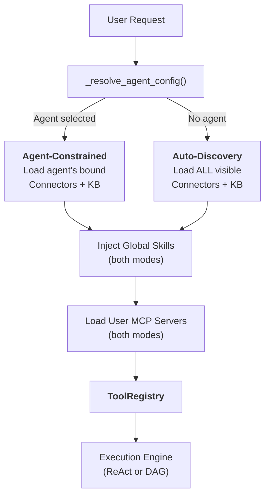
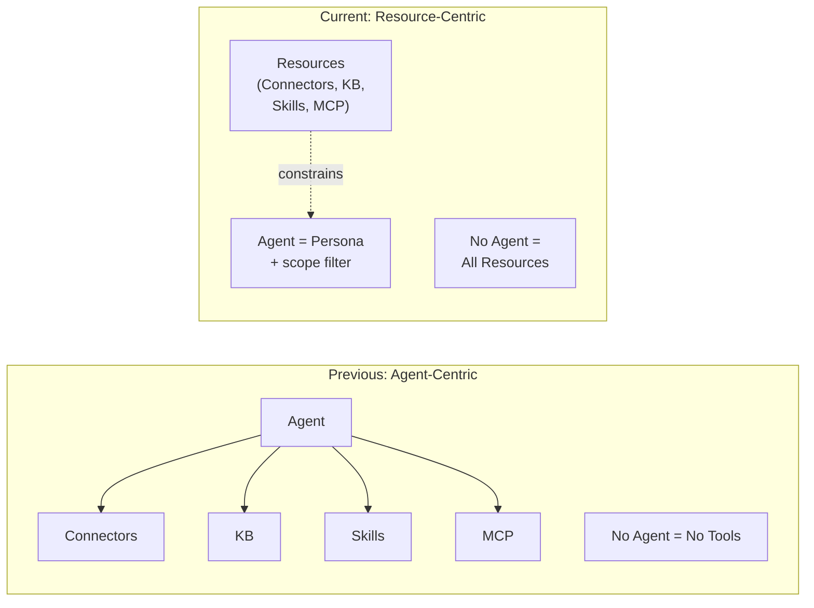
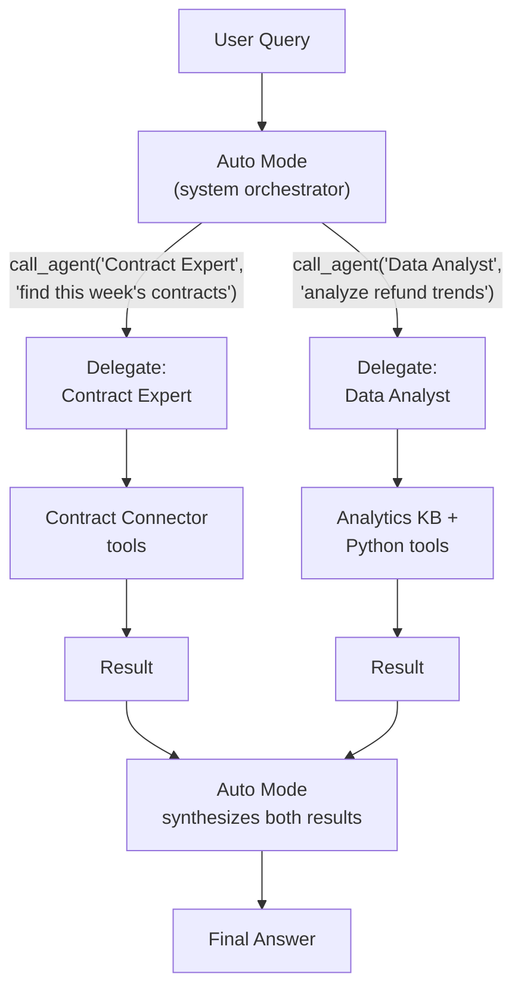
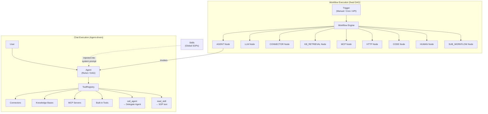

## 2つのモード

FIM Oneのすべてのチャットリクエストは1つの質問から始まります：**エージェントが選択されているか？** この答えによって、リソース（コネクタ、ナレッジベース、スキル、MCPサーバー）がどのように検出され、LLMが使用できるツールセットに組み立てられるかが決まります。

**エージェント制約モード**は、ユーザーが特定のエージェントを選択したときに有効になります。システムは、そのエージェントが明示的に設定されたリソースのみをロードします：

- **コネクタ**：エージェントにバインドされた`connector_ids`のみがツールとしてロードされます。
- **ナレッジベース**：エージェントにバインドされた`kb_ids`のみが取得ツールとして注入されます。
- **スキル**：グローバルに利用可能 — ユーザーに表示されるすべてのアクティブなスキルが注入されます。スキルはエージェント固有の知識ではなく、組織のSOP（標準業務手順）だからです。（下記の[グローバルSOPとしてのスキル](#skills-as-global-sops)を参照してください。）
- **MCPサーバー**：常にユーザースコープ — ユーザーに表示されるすべてのアクティブなMCPサーバーが両方のモードでロードされます。
- **インストラクション**：エージェントの`instructions`フィールドは、システムプロンプトに注入されるペルソナと行動ガイドラインを定義します。

**グローバル自動検出モード**は、エージェントが選択されていない場合（例：新しいチャット）に有効になります。システムはユーザーがアクセス可能なすべてのものを自動検出します：

- **コネクタ**：ユーザーに表示されるすべてのコネクタ（自分のもの + 組織共有 + マーケット購読）がロードされます。
- **ナレッジベース**：アクセス可能なすべてのKBが`kb_retrieve`経由で取得可能です。
- **スキル**：ユーザーに表示されるすべてのアクティブなスキルがSOPスタブとして注入されます。
- **MCPサーバー**：エージェント制約モードと同じ — ユーザーに表示されるすべてのアクティブなサーバー。
- **インストラクション**：汎用アシスタントペルソナが使用されます。

分岐は`_resolve_tools()`内で発生し、これはすべてのチャットリクエストで呼び出されます：



実際の効果：ユーザーはエージェントを設定することなく、すぐにチャットを開始できます。システムは利用可能なリソースを検出し、それらをツールとして公開します。エージェントを選択すると、スコープが絞られます — 新しい機能のロックを解除するのではなく、既存の機能に焦点を当てます。

### 各モードが検出するもの

2つのモードは**スコープ**が異なり、種類は同じです。どちらも `ToolRegistry` を生成しますが、異なる方法で入力されます。

**自動検出モード（エージェント未選択）:**

| リソース | 検出 | ツール形式 |
|---|---|---|
| コネクタ（API） | `resolve_visibility()` — ユーザーに表示されるすべて | `ConnectorMetaTool`（段階的） |
| コネクタ（DB） | `resolve_visibility()` — ユーザーに表示されるすべて | `DatabaseMetaTool`（段階的） |
| ナレッジベース | アクセス可能なすべてのKB | `kb_retrieve` |
| スキル | `resolve_visibility()` — すべてのアクティブ | `read_skill`（段階的スタブ） |
| MCPサーバー | `resolve_visibility()` — ユーザーに表示されるすべて | `MCPServerMetaTool`（段階的） |
| エージェント | `resolve_visibility()` — すべてのアクティブ、非ビルダー | `call_agent`（委任カタログ） |
| 組み込みツール | `discover_builtin_tools()` — 完全なセット | カテゴリフィルターなし |

**エージェント制約モード（エージェント選択済み）:**

| リソース | 検出 | ツール形式 |
|---|---|---|
| コネクタ | `agent.connector_ids` のみ | `ConnectorMetaTool` またはレガシーアクション別 |
| ナレッジベース | `agent.kb_ids` のみ | `GroundedRetrieveTool` / `KBRetrieveTool` |
| スキル | グローバル — **エージェントで制約されない** | `read_skill` |
| MCPサーバー | ユーザースコープ — **エージェントで制約されない** | `MCPServerMetaTool`（段階的） |
| エージェント委任 | 利用不可 — エージェントは特化型 | _（無効）_ |
| 組み込みツール | `agent.tool_categories` フィルター | カテゴリ別サブセット |

重要な非対称性：コネクタとナレッジベースはエージェントでスコープされていますが、スキルとMCPサーバーは両方のモードでグローバルなままです。`CallAgentTool`（エージェント委任）は自動検出モードでのみ利用可能です — 特定のエージェントが選択されている場合は登録されません。これはセキュリティ対策です。マーケットプレイスエージェントは `call_agent` を使用して他のエージェントを呼び出し、プライベートプロンプトにアクセスする可能性があるからです。スキルは組織的ルール（すべてのユーザーが同じSOPに従う）ですが、コネクタとKBは機能バインディング（異なるエージェントが異なるシステムに接続）です。

## すべてはツールである

LLMレベルでは、すべてのリソースタイプは呼び出し可能なツールのフラットリストに収束します。LLMは、コネクタ、MCPサーバー、またはナレッジベースを呼び出しているかどうかについての構造的な認識を持ちません。`ToolRegistry`を見ます — 名前、説明、パラメータスキーマを持つ関数のセットです。

| リソースタイプ | LLMレベルでの変換 | ツール名パターン |
|---|---|---|
| Connector (プログレッシブ) | 単一のメタツール | `connector` |
| Connector (レガシー) | アクションごとにNツール | `{connector}__{action}` |
| Database Connector (プログレッシブ) | 単一のメタツール | `database` |
| Database Connector (レガシー) | データベースごとに3ツール | `{db}__list_tables`, `{db}__describe_table`, `{db}__query` |
| MCP Server (プログレッシブ) | 単一のメタツール | `mcp` |
| MCP Server (レガシー) | サーバーごとにNツール | `{server}__{tool}` |
| ナレッジベース | 検索ツール | `kb_retrieve` または `grounded_retrieve` |
| Skill (プログレッシブ) | 読み取りツール + システムプロンプトスタブ | `read_skill` |
| Skill (インライン) | システムプロンプトテキストのみ | _(ツールなし)_ |
| エージェント自体 | ツールとして表示されない | _(指示 + ツールアセンブリ)_ |

重要な洞察: **エージェントはツールではなく、ツールを使用するエンティティです。** エージェントはその指示をシステムプロンプトに寄与し、どのツールが利用可能かを決定します。しかし、LLMの観点からは、「エージェント」という概念は存在しません — システムプロンプトと呼び出し可能な関数のセットのみです。

この均一性がシステムを拡張可能にするものです。新しいリソースタイプを追加することは、`Tool`プロトコル（`name`、`description`、`parameters_schema`、`run()`）を実装することを意味します。実行エンジン、コンテキスト管理、およびLLM相互作用レイヤーは変わりません。

## スキルをグローバルSOPとして

スキルはエージェントの上位レイヤーに位置します。これらは組織のポリシーと手順であり、選択されたエージェントに関係なく、すべてのエージェントが従う必要があります。

### スキルがエージェントにバインドされない理由

「顧客苦情処理 SOP」のようなスキルは、顧客と対話するすべてのエージェントに適用されます。スキルをエージェントにバインドすると、双方向の所有権の問題が生じます。スキルがエージェントをオーケストレーションし、エージェントがスキルを所有する場合、誰が誰を制御するのでしょうか。

スキルはグローバル設計です。これらはエージェント固有の知識ではなく、会社のルールです。`_resolve_tools()` 関数は、エージェント選択に関係なく、ユーザーに表示されるすべてのアクティブなスキルを読み込みます。これは他のリソースに使用されるのと同じ `resolve_visibility()` フィルタを使用します。

### 2つのインジェクションモード

スキルは2つのインジェクションモードをサポートしています -- **progressive**（デフォルト）と**inline** -- これらは`SKILL_TOOL_MODE`またはエージェントの`model_config_json.skill_tool_mode`で制御されます。プログレッシブモードでは、コンパクトなスタブのみがシステムプロンプトに表示され、LLMは必要に応じて`read_skill(name)`を呼び出して完全なコンテンツを読み込みます。これはFIM Oneの広範な[Progressive Disclosure](/architecture/progressive-disclosure)アーキテクチャの一部であり、すべてのリソースタイプ全体でコンテキスト消費を最小化します。

## エージェントをコンテナではなくペルソナとして

FIM Oneのアーキテクチャは、エージェント中心モデルからリソース中心モデルへの意図的なシフトを反映しています。

**前のモデル:** エージェントはすべてのリソースへのアクセスをゲートする容器でした。エージェントが選択されないということは、コネクタ、スキル、特殊なKBがないということでした。エージェントは任意の機能への必須のエントリーポイントでした。

**現在のモデル:** エージェントはペルソナです — 一連の指示と動作ガイドラインと、オプションのリソース制約の組み合わせです。リソースはエージェントとは独立して存在します。エージェントを選択するとスコープが狭まり、選択しないと完全に開きます。



これは以下を意味します：

- **ユーザーはエージェントを設定することなく、すぐにチャットを開始できます**。
- **システムは利用可能なリソースを自動検出し**、ツールとして公開します。
- **エージェントは軽量なペルソナになります** — 指示を書き、オプションで特定のコネクタとKBをバインドするだけで、すぐに作成できます。
- **リソース管理はエージェント管理から分離されます**。組織にコネクタを公開すると、自動検出モード、エージェントバインディングドロップダウン、およびエージェント委譲解決のすべての場所で利用可能になります。

## エージェント委譲

FIM One は `CallAgentTool` を介して専門エージェントにタスクを委譲することをサポートしていますが、**自動モード**（エージェント未選択）でのみ可能です。ユーザーが特定のエージェントを選択すると、委譲は無効になり、そのエージェントは自身のツールのみに集中します。

### 2つのモード: 自動 vs エージェント選択

| 側面 | 自動モード（エージェント未選択） | エージェント選択モード |
|---|---|---|
| `call_agent` | 有効 — 任意の表示エージェントに委譲 | **無効** — 登録されない |
| ツールスコープ | すべての表示コネクタ、KB、スキル、MCP | エージェントのバインドされたリソースのみ + グローバルスキル/MCP |
| オーケストレーション | システムLLMが反復ごとに最適なエージェントを動的に選択 | エージェントが独自のツールを直接使用 |
| ユースケース | 一般的なクエリ、クロスドメインタスク | 特化した専門家タスク |

**エージェント選択モードで委譲が無効な理由:** セキュリティ。マーケットプレイスエージェントは`call_agent`を使用して他のエージェントを呼び出し、その非公開システムプロンプトを読み取る可能性があります。委譲を自動モード（個別エージェントのプロンプトではなくシステムLLMがフローを制御する）に制限することで、信頼できないエージェント構成に対して非公開エージェントプロンプトが決して公開されません。

### オーケストレーションレイヤーとしてのオートモード

オートモードはUIの第一級の概念です。エージェントセレクターは「Auto」をデフォルトオプションとして表示します。オートモードがアクティブな場合、システムLLMはオーケストレーターとして機能します。つまり、表示されているすべてのエージェントの完全なカタログを確認し、各イテレーションで最適なスペシャリストにタスクを委譲できます。これにより、専用の「親エージェント」の必要性が排除されます。システム自体がオーケストレーターとなります。

### エージェント カタログ

実行時に、ユーザーに表示されるすべてのアクティブな非ビルダー エージェントがカタログに集約されます。各エージェントの名前と説明は `call_agent` ツールのパラメータ スキーマにリストされており、LLM が意味的に適切なスペシャリストを選択できます。ハードコードされたルーティングは不要です。

### 完全なツール継承

委譲されたエージェントが `call_agent(agent_id, task)` 経由で呼び出されると、独自の設定から構築された完全な `ToolRegistry` を受け取ります。これには、バインドされたコネクタ、KB、および組み込みツールが含まれます。委譲されたエージェントは、テキストのみのアドバイザーではなく、完全な実行ユニットです。

### ワンレベルの委譲

無限再帰を防ぐため、委譲されたエージェントは `call_agent` ツールを受け取りません。委譲は常に1レベル深くなります：オートモードがスペシャリストを呼び出し、スペシャリストが実行して結果を返します。システムは複数の委譲されたエージェントからの結果を統合します。

### 並列実行

ネイティブ関数呼び出しモードでは、LLMは単一のターンで複数の`call_agent`呼び出しを実行できます。これらは`asyncio.gather`を介して同時に実行され、「3つのソースを同時に検索する」などのパターンを可能にします。



## 可視性モデル

両方のモード内のすべてのリソース検出は、3つのティアを持つ統一された可視性モデルによって管理されます：

| ティア | 説明 | 例 |
|---|---|---|
| **Own** | ユーザーによって作成されたもの。常に表示されます。 | チームのAPIのために構築したコネクタ |
| **Organization-shared** | ユーザーの組織から`visibility: "org"`を持つリソース。すべての承認された組織メンバーに表示されます。 | ITによって公開された企業全体のERPコネクタ |
| **Market-subscribed** | FIM One Marketからインストールされたリソース。サブスクライバーに表示されます。 | インストールしたコミュニティ製のSlackコネクタ |

`web/visibility.py`の`resolve_visibility()`関数は、3つのティアすべてを単一のクエリに含むSQLフィルタを構築します：

```python
conditions = [
    model.user_id == user_id,                    # own resources
    and_(model.visibility == "org",              # org-shared
         model.org_id.in_(user_org_ids),
         or_(model.publish_status == None,
             model.publish_status == "approved")),
    model.id.in_(subscribed_ids),                # Market-subscribed
]
```

この同じフィルタは以下のすべての場所で使用されます：

- エージェントなしモードでのコネクタの自動検出
- `CallAgentTool`のエージェントカタログの構築
- システムプロンプトインジェクション用の表示可能なスキルの読み込み
- MCPサーバーの解決
- エージェント設定の検索（ユーザーが表示可能なエージェントのみを選択できることを保証）

この統一性は、**コネクタを組織に公開すると、自動検出モード、エージェントバインディングドロップダウン、およびエージェント委譲解決で自動的に利用可能になる**ことを意味します。特別な配線は不要です。可視性モデルは「このユーザーが何にアクセスできるか」の単一の情報源です。

## 関係図

FIM Oneには2つの並列実行パラダイムがあります — **チャット（エージェント駆動）**と**ワークフロー（DAG駆動）** — これらは同じ基盤となるリソースを共有していますが、異なる方法でそれらをオーケストレーションします。



図からの主要なポイント：

- **エージェントとワークフローは並列パラダイムです。** どちらもコネクタ、ナレッジベース、MCP サーバーを使用できます — ただし異なるメカニズムを通じてです。エージェントはそれらを `ToolRegistry` 内のツールとして使用します。ワークフローはそれらを型付きDAGノードとして使用します。
- **ワークフローはエージェントをオーケストレーションできます** — `AGENT` ノード経由で、ワークフローステップは独自のReAct/DAGループを持つ完全なエージェントを呼び出すことができます。逆は真ではありません。エージェントはワークフローを直接呼び出すことはできません（API/webhookトリガー経由の間接的な方法のみ）。
- **スキルはエージェントにのみ注入されます。** スキルはシステムプロンプトテキストです — これらはエージェントの動作をガイドします。ワークフローはスキルを消費しません。ワークフローノードは決定論的ロジックを実行し、LLMガイドの推論ではないためです。
- **共有リソース、異なるアクセスパターン。** コネクタはエージェント（`ConnectorToolAdapter` 経由）、ワークフロー（`CONNECTOR` ノード経由）、または同じビジネスプロセス内の両方によって呼び出すことができます — 例えば、ワークフローがエージェントをトリガーし、そのエージェントがワークフローが後のステップでも使用する同じコネクタをクエリします。

## ワークフローエンジン — もう1つの実行パラダイム

このドキュメントはエージェント駆動のチャット実行に焦点を当てていますが、FIM Oneには完全な**ワークフローエンジン**が含まれています — 固定プロセス自動化のための26のノードタイプを備えたビジュアルDAGエディタです。

| 側面 | エージェント (チャット) | ワークフロー |
|---|---|---|
| オーケストレーション | LLMが次のステップを動的に決定 | 設計時に定義された固定DAG |
| 最適な用途 | 探索的なタスク、会話、柔軟な推論 | 承認チェーン、スケジュール済みETL、マルチステップ自動化 |
| 呼び出し可能 | コネクタ、KB、MCP、組み込みツール、委譲されたエージェント、スキル | エージェント、コネクタ、KB、MCP、LLM、HTTP、コード、人間による承認、サブワークフロー |
| トリガー | チャットのユーザーメッセージ | 手動、cronスケジュール、またはAPI/webhook |
| ネスティング | 1レベルの委譲 (自動モード → 委譲されたエージェント) | SUB_WORKFLOWノード経由の任意のDAG深度 |

2つのパラダイムは相補的です。タスクがオープンエンド ("この四半期の売上データを分析し、アクションを推奨してください") の場合はエージェントを使用します。プロセスが既知の場合 ("毎週月曜日、ERPから新しい請求書を取得し、コンプライアンスチェックを実行し、例外を人間のレビュアーにルーティングする") はワークフローを使用します。ワークフローは、固定パイプライン内で柔軟な推論が必要なステップについて、エージェントを呼び出すことができます。

エージェント実行モードとワークフローノードタイプの詳細については、[実行モード](/concepts/execution-modes)を参照してください。
