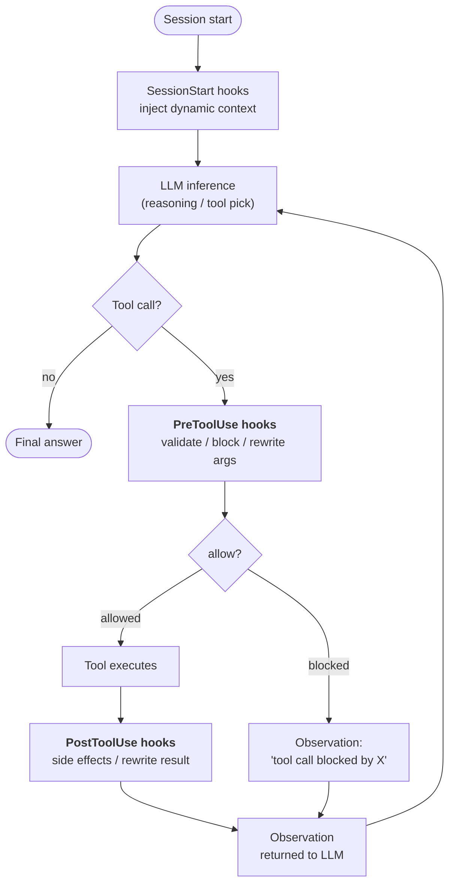
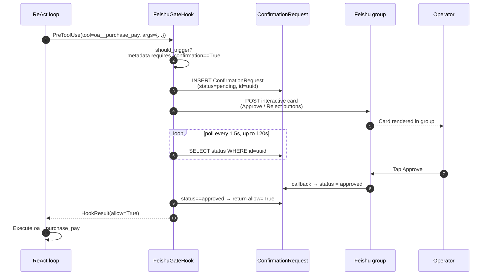

## フックが存在する理由

システムプロンプトの指示は**提案**です。十分に頑固または混乱したLLMはそれらを無視できます。ほとんどの智能体の動作では、それはまさにあなたが望むことです — 指示はモデルに適応する余地を与えます。

しかし、いくつかの要件は提案ではありません。「すべての機密ツール呼び出しはログに記録される必要があります」「書き込み操作は、組織が読み取り専用モードの場合はブロックされます」「¥50k以上の支払いは実行前に人間の確認が必要です」。これらは**不変条件** — モデルがどのターンで何を決定しようとも成立する必要があるシステムについての事実です。

フックは、智能体の実行ライフサイクルの明確に定義されたポイントで**LLMループの外で**実行されるコードです。LLMはフックを見ることができません。LLMはフックに異議を唱えることができません。LLMはフックにステップをスキップするよう説得することはできません。`PreToolUse`フックが`allow=False`を返した場合、ツール呼び出しは発生しません — 推理トレースがどれほど執拗であっても関係ありません。

これが重要なアーキテクチャ上の区別です：

| メカニズム | 実行場所 | 制御者 | 保証 |
|---|---|---|---|
| **システムプロンプト指示** | LLM推論内 | モデル | 「おそらく従う」 |
| **ツール説明 / スキーマ** | LLM推論内 | モデル | 「おそらく従う」 |
| **フック** | LLM推論の周囲 | プラットフォームコード | **常に実行される** |

フックは、FIM Oneが「智能体は...することになっている」を「智能体は...をバイパスできない」に変える方法です。

## フックが接続される場所

現在、3つのフックポイントが定義されています。各ポイントは、智能体が1つのループ反復中に越える境界をマークします：



| フックポイント | 発火するタイミング | ブロック可能か | データ変更可能か |
|---|---|---|---|
| `SessionStart` | セッションの最初のLLM呼び出しの前 | いいえ | はい — 初期提示词にコンテキストを注入します |
| `PreToolUse` | LLMがツールを選択した後、ツール実行前 | **はい** (`allow=False`経由) | はい — 実行前に`tool_args`を書き直すことができます |
| `PostToolUse` | ツールが戻った後、観測がLLMに渡される前 | いいえ | はい — 観測を書き直すことができます |

同じポイントの複数のフックは優先度順に実行されます。前の`PreToolUse`フックで書き直された引数は後続のフックに引き継がれるため、ミドルウェアが構成されます。

## フックと命令のどちらを使うか

要件をプロンプト命令またはフックで解決するかの判断は、「実行時アサーション対コードコメント」と同じ計算です：

| 症状 | ソリューション |
|---|---|
| 「智能体はYの場合、Xを優先すべき」 | 命令 — ソフトガイダンス、モデルに裁量がある |
| 「智能体はコネクタZへのすべての呼び出しをログに記録する必要がある」 | **PostToolUse フック** — モデルが記憶することに依存できない |
| 「¥50k以上の支払いには人間の承認が必要」 | **PreToolUse フック** — モデルに尋ねることに依存できない |
| 「智能体は中国語で自己紹介すべき」 | 命令 — スタイル的、見落とされても低コスト |
| 「智能体は読み取り専用モードで本番データベースに書き込むことはできない」 | **PreToolUse フック** — セキュリティ不変式、ゼロトレランス |
| 「智能体は長いDBクエリ結果を要約すべき」 | どちらでもよいが、フックはより堅牢 — PostToolUse truncateを参照 |

経験則：**間違った動作がインシデントの場合はフックを使用します。間違った動作が軽微な不便の場合は、命令で問題ありません。**

## フックコントラクト

フックは `PreToolUseHook`、`PostToolUseHook`、または `SessionStartHook` のサブクラスで、1つの必須メソッドを持ちます：

```python
class ReadOnlyGuard(PreToolUseHook):
    name = "readonly_guard"
    priority = 5                          # lower runs earlier

    def should_trigger(self, ctx: HookContext) -> bool:
        return ctx.tool_name.startswith("sql_")

    async def execute(self, ctx: HookContext) -> HookResult:
        if org_is_readonly(ctx.metadata["org_id"]):
            return HookResult(
                allow=False,
                error="Org is in read-only mode — write blocked.",
                side_effects=["readonly_guard: blocked sql write"],
            )
        return HookResult()               # default: allow=True, no mutation
```

渡される `HookContext` は `tool_name`、`tool_args`、`agent_id`、`user_id`、およびエンジンがリクエストごとの事実（org id、conversation id、コネクタアクションの `requires_confirmation` フラグなど）を入力する柔軟な `metadata` 辞書を含みます。

返される `HookResult` は結果を制御します：

- `allow: bool = True` — ツール呼び出しが進行するかどうか（`PostToolUse` / `SessionStart` では無視されます）
- `error: str | None` — 人間が読める理由で、ブロックされた場合は観測値として LLM に表示されます
- `modified_args: dict | None` — 設定されている場合、実行前にツール引数を置き換えます
- `modified_result: Any | None` — 設定されている場合（PostToolUse）、LLM に返される前に観測値を置き換えます
- `side_effects: list[str]` — フックが実行した内容の監査証跡で、エージェントのトレースにマージされます

## ケーススタディ: `FeishuGateHook`

このシステムの上に構築された最初のフックは `FeishuGateHook` です。これは `PreToolUse` フックで、`requires_confirmation=True` とフラグ付けされたツールを、組織の Feishu グループに投稿されるヒューマン・イン・ザ・ループ承認カードに変換します。

このフックは完全なライフサイクルを実行します:



このデザインがもたらすもの:

- **ツール呼び出しは本当に一時停止します。** エージェントの SSE ストリームは「`oa__purchase_pay` を呼び出します」と観察の間で一時停止します。ユーザーはエージェントが待機しているのを見ます。これは内部で起きていることと一致します。
- **承認はプロセス再起動後も保持されます。** 保留中の行はデータベースにあり、メモリにはありません。カードが未処理の状態でバックエンドが再起動した場合、次のポーリングは中断したところから再開します。
- **決定は監査されます。** `ConfirmationRequest` は `payload`、`responded_at`、`responded_by_open_id`、および最終ステータスを保持します。誰が何をいつ承認したかの監査可能な記録です。
- **決定ループに LLM はありません。** モデルはツール呼び出しを生成します。人間は判定を生成します。フックは決定論的なブリッジです。

`FeishuGateHook` は設定済みの [Feishu Channel](/configuration/channels/feishu) に依存します。フックはチャネルの `send_interactive_card()` メソッドを通じてカードを送信し、チャネルが解析したコールバックイベントをリッスンします。この分離は意図的です。フックは「承認ステートマシン」を所有し、チャネルは「IM プラットフォーム機構」を所有します。同じフックは、ロジックを変更することなく、明日 Slack または WeCom をターゲットにすることができます。チャネル実装のみを変更します。

## 候補となるフック（予定なし）

同じライフサイクルに適合するフックのパターンは4つあります。いずれも現在のロードマップには含まれておらず、導入先から要望があるまで保留されています。

| フック | タイミング | 目的 |
|---|---|---|
| `AuditLogHook` | PostToolUse | コネクターが呼び出されるたびに `ConnectorCallLog` を自動で記録します。現在は手動で行っていますが、フックにすることで記録漏れを防げます。 |
| `ReadOnlyGuard` | PreToolUse | 組織が読み取り専用モードのとき、書き込みをブロックします。 |
| `ResultTruncateHook` | PostToolUse | 大きすぎるツールの観測結果（8k文字超）を、LLMのコンテキストに渡す前に切り詰めます。 |
| `ConnectorRateLimitHook` | PreToolUse | LLMのレート制限とは独立して、コネクターごと・ユーザーごとの呼び出し頻度を制限します。 |

ユーザー定義のフックレイヤーも同様の理由で保留されています。これは、ツールイベントに一致したときに実行するシェルコマンドやPythonの呼び出し可能オブジェクトを宣言する、エージェントごとのYAML設定（`hooks: [...]`）です。この方式は、現代のエージェントフレームワーク（Claude Code、OpenDevin）で定着しているパターンに沿ったものです。フックベースの適用により、「常に実行しなければならない」ロジックをプロンプトから切り離せます。

## Hooks vs. Channels

The two abstractions solve orthogonal problems:

| Concept | What it models | Lifetime | Example |
|---|---|---|---|
| **Hook** | 智能体の実行内でプラットフォームコードが実行されるポイント | ツール呼び出しごと | `FeishuGateHook`, `AuditLogHook` |
| **Channel** | 外部メッセージングプラットフォームへのプラグイン可能なアダプター | 組織ごとの長期間 | `FeishuChannel`, planned `SlackChannel` |

Hooks は Channels を消費します — 外部世界と通信する必要があるフック（カードを送信、アラートを投稿、グループにエスカレート）は、組織の Channel を呼び出します。フックが使用していない Channel でも有用です（例：智能体がツール経由で主動的に通知を送信できます）が、承認ゲートパターンは両方が揃っていることが必要です。

別の言い方をすると：**Channels は「人間と通信する場所」のプラミング、Hooks は「人間と通信する必要がある時」のポリシーです**。本番環境の人間参加型ワークフローには両方が必要です。

## 現状（v0.8.4）

リリース済みの内容と今後の予定：

- ✅ `HookRegistry`、`HookContext`、`HookResult` のプリミティブを ReAct と DAG の両方に組み込み済み
- ✅ `PreToolUseHook` / `PostToolUseHook` / `SessionStartHook` の抽象基底クラス
- ✅ `FeishuGateHook` — `ConfirmationRequest` テーブル、ポーリングループ、タイムアウト／期限切れ処理、コールバック駆動の状態更新を含めて実装完了
- ✅ `card.action.trigger` をデコードし、保留中の行を更新する Feishu チャネルコールバックエンドポイント
- ✅ エージェントレベルのフック宣言：`agent.model_config_json.hooks.class_hooks` により、すべての ReAct/DAG セッションでインスタンス化された `HookRegistry` を解決
- ✅ **すべての実行経路でフックが実行されます**：メインチャット経路（Portal、API、DAG）、委譲されたサブエージェント（`CallAgentTool`）、Workflow の `AGENT` ノード。Eval Center では意図的にフックを**バイパス**します（自動評価が人間の承認待ちでブロックされないようにするため）。

  委譲先のエージェントは呼び出し元のレジストリを引き継がず、自身の `model_config_json` から**独自の**レジストリを構築します。確認ゲートはすべてのエージェントに自動でアタッチされるため、再構築では継承時より多くのフックが含まれます。委譲先には確認ゲートに加えて、委譲先自身が宣言したフックが適用され、確認ゲートは呼び出し元ではなく委譲先の `require_confirmation_for_all` を参照します。どちらの経路も**フェイルクローズ**で動作します。フックを構築できないエージェントは実行されません。
- ❌ `AuditLogHook`、`ReadOnlyGuard`、`ResultTruncateHook`、`ConnectorRateLimitHook`（計画なし）
- ❌ ユーザー定義の YAML フック宣言（計画なし）

フックシステムは、本番環境の堅牢化を支える**重要な基盤**です。最初の利用者である `FeishuGateHook` 自体も独立した本番機能であるため、フックの全カタログが揃うのを待たず、2026-04-24 のロードショーに向けて骨格を早期にリリースしました。
