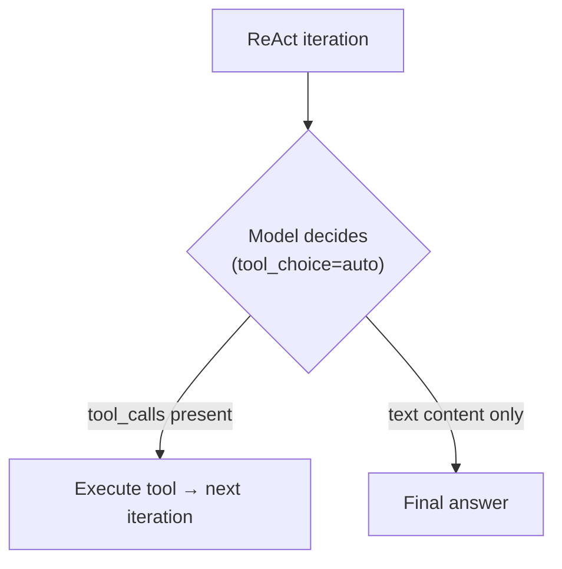
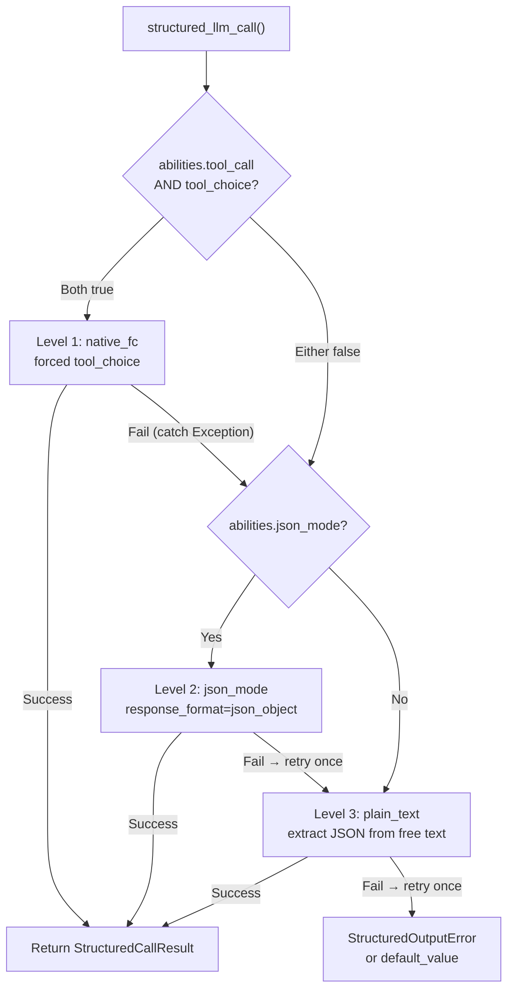

## プロバイダー検出

FIM Oneはユニバーサルアダプターとして LiteLLM を使用します。`core/model/openai_compatible.py` の `_resolve_litellm_model()` 関数は、ユーザーの `LLM_BASE_URL` + `LLM_MODEL` を、プロバイダープレフィックス付きの LiteLLM モデル識別子にマッピングします。プレフィックスは、LiteLLM がリクエストをどのようにルーティングするかを決定します — ネイティブ API プロトコル（Anthropic Messages API、Gemini など）またはジェネリック OpenAI 互換の `/v1/chat/completions`。

解決順序：

1. **明示的なプロバイダー**（DB の `ModelConfig.provider` フィールドから）— 最優先。プロバイダーが URL 内の既知ドメインと一致する場合、`api_base` は返されません（LiteLLM はネイティブでルーティング）。それ以外の場合、`api_base` はリレー URL に設定されます。
2. **`KNOWN_DOMAINS` に対するドメイン一致** — 公式 API エンドポイントはホスト名で認識されます。
3. **`PATH_PROVIDER_HINTS` に対する URL パスヒント** — UniAPI のようなリレープラットフォームで一般的です。パスに `/claude` または `/anthropic` が含まれている場合、アップストリームプロトコルを示します。
4. **フォールバック** — `openai/` プレフィックス（ジェネリック OpenAI 互換）。

| ドメイン / パス | プロバイダープレフィックス | プロトコル |
|---|---|---|
| `api.openai.com` | `openai/` | OpenAI Chat Completions |
| `anthropic.com` | `anthropic/` | Anthropic Messages API |
| `generativelanguage.googleapis.com` | `gemini/` | Google Gemini |
| `api.deepseek.com` | `deepseek/` | DeepSeek（OpenAI 互換） |
| `api.mistral.ai` | `mistral/` | Mistral |
| パスに `/claude` または `/anthropic` を含む | `anthropic/` | Anthropic Messages API（リレー経由） |
| パスに `/gemini` を含む | `gemini/` | Google Gemini（リレー経由） |
| その他すべて | `openai/` | ジェネリック OpenAI 互換 |

プロバイダープレフィックスがネイティブプロトコル（anthropic、gemini など）で、URL が公式エンドポイントでない場合、LiteLLM はネイティブプロトコルを使用しますが、リレーの `api_base` にリクエストを送信します。これは、プロバイダー固有の動作（以下で説明する Bedrock プリフィル問題を含む）がリクエストが公式 API に送信されるか、リレー経由で送信されるかに関わらず適用されることを意味します。

<Warning>
リレー URL のパスに `/claude` が含まれている場合、FIM One は自動的に Anthropic のネイティブプロトコル経由でルーティングします。これは通常正しい選択です（ストリーミングとシンキングサポートが向上）が、プロバイダー固有の動作が適用されることを意味します — 以下で説明する Bedrock プリフィル問題を含みます。
</Warning>

## tool_choice — 4つのモード

`tool_choice` パラメータは OpenAI 形式で標準化されています。LiteLLM はリクエストを送信する前に、各プロバイダーのネイティブプロトコルに変換します。

| モード | 意味 | プロバイダーサポート |
|---|---|---|
| `"auto"` | モデルがツール呼び出しまたはテキスト応答を決定 | すべてのプロバイダー |
| `"required"` | ツール呼び出しが必須だが、モデルが選択 | ほとんどのプロバイダー |
| `{"type":"function","function":{"name":"X"}}` | 関数 X の呼び出しが必須 | ほとんどのプロバイダー — **Anthropic thinking と互換性なし** |
| `"none"` | ツール使用不可、テキストのみ | すべてのプロバイダー |

`"auto"` と強制モード（`{"type":"function",...}`）の区別は、FIM One のあらゆる互換性問題の核心です。これら 2 つのモードは、異なる要件を持つまったく異なるサブシステムで使用されています。

## tool_choiceが使用される場所

2つのサブシステムが`tool_choice`を使用しており、それらは根本的に異なる方法でそれを使用しています。

### ReAct エンジン — tool_choice="auto"

ReAct ループでは、モデルが各イテレーションで以下を決定する必要があります: ツールを呼び出すか、最終的な回答を提供するか。ここで意味があるのは `"auto"` だけです — モデルは `tool_calls` を生成するか、テキスト コンテンツを生成するかを自由に選択します。これはすべてのプロバイダー、すべてのモデル、拡張思考を含むすべてのモードと互換性があります。



ReAct エンジンは、`abilities["tool_call"] = True` の場合にネイティブ関数呼び出し (`_run_native`) を使用し、それ以外の場合は JSON-in-content モード (`_run_json`) にフォールバックします。両方のモードで `"auto"` を使用します — 違いは、ツールが `tools` パラメータを介して渡されるか、システム プロンプトで説明されるかです。詳細は [ReAct エンジン — デュアルモード実行](/architecture/react-engine#dual-mode-execution) を参照してください。

### structured_llm_call — tool_choice=forced

ワンショット構造化抽出（スキーマアノテーション、DAG計画、計画分析）。モデルに特定の仮想関数を呼び出すことを強制し、構造化JSON出力を保証します。これはプロバイダー固有のエラーをトリガーするコールサイトです。

`structured_llm_call`は3レベルの劣化チェーンを実装します：



重要な設計上の違い：`structured_llm_call`のフォールバックは**ランタイム**です — 各レベルを動的に試行し、例外をキャッチしてフォールスルーします。ReActエンジンのモード選択は**ビルドタイム**です — 開始時に`_native_mode_active`を一度チェックし、ループ全体で1つのモードにコミットします。つまり、`structured_llm_call`はプロバイダー固有の400エラーから透過的に回復できますが、ReActは事前に正しくモードが選択されていることに依存しています。

## Bedrock プリフィル トラップ

`response_format={"type":"json_object"}` が `anthropic/` プレフィックスで解決されたモデルに渡される場合、LiteLLM は内部的にアシスタント プリフィル メッセージを挿入して JSON モードをシミュレートします。Anthropic Messages API には ネイティブな `response_format` パラメータがないため、LiteLLM は開き括弧をアシスタント コンテンツとして先頭に追加することで近似します：

```json
{"role": "assistant", "content": "{"}
```

これは Anthropic の直接 API では機能します。ただし、より新しい AWS Bedrock モデル バージョンは、最後のメッセージが `role: "assistant"` を持つ会話を拒否します。これを「アシスタント メッセージ プリフィル」と呼び、以下をスローします：

```
ValidationException: This model does not support assistant message prefill.
The conversation must end with a user message.
```

このエラーは、**以下の 3 つの条件がすべて同時に満たされる場合**にのみ発生します：

1. モデルが `anthropic/` プレフィックスで解決されている（ドメイン マッチまたは URL パス ヒント経由）。
2. `response_format={"type":"json_object"}` が渡されている（`structured_llm_call` の json_mode コード パス）。
3. 実際のバックエンドが AWS Bedrock である（プリフィルを拒否）。

<Tip>
**OpenAI 互換エンドポイント経由の Bedrock？** Bedrock リレーが OpenAI 互換 `/v1/chat/completions` エンドポイント（AWS 独自の OpenAI 互換ゲートウェイまたはサードパーティ プロキシ）を公開し、URL パスに `/claude` または `/anthropic` が含まれていない場合、FIM One は `openai/` プレフィックスで解決します。LiteLLM はバックエンドを標準 OpenAI 互換サーバーとして扱い、プリフィルを挿入せずに `response_format` を直接渡し、サーバーが JSON 制約をネイティブに処理します。**プリフィル トラップは適用されません** — `json_mode_enabled=false` を設定する必要はありません。
</Tip>

<Warning>
これはネイティブ ツール呼び出し（`tool_choice="auto"` と `tools=` パラメータ）には影響しません。プリフィル挿入は `response_format` に対してのみ発生します。ReAct エージェント実行は完全に影響を受けません。
</Warning>

Level 1（native_fc）と Level 2（json_mode）の両方が Bedrock で失敗した場合、システムは Level 3（plain_text）で復旧します。以下で説明する `json_mode_enabled` フラグは、無駄な Level 2 呼び出しを排除します。

### 修正: json_mode_enabled

モデルごとの `json_mode_enabled` フラグは、Level 2 (json_mode) が試行されるかどうかを制御します:

- **DB設定モデル**: Admin → Models → Advanced settings で切り替え。フラグは `ModelProviderModel.json_mode_enabled` に保存されます (デフォルト `TRUE`)。
- **ENV設定モデル**: 環境で `LLM_JSON_MODE_ENABLED=false` を設定。
- **効果**: 無効にすると、`abilities["json_mode"]` は `False` を返す → `response_format` は渡されない → プリフィルなし → Bedrock が動作。デグラデーションチェーンは `native_fc → plain_text` となり、失敗する json_mode 呼び出しをスキップします。
- **品質低下なし**: システムプロンプトが JSON を返すよう指示するため、モデルは引き続き有効な JSON を返します。plain_text レベルは `extract_json()` を使用して自由形式のコンテンツから JSON を解析し、最新のモデルで確実に動作します。

## 思考モデル + 強制 tool_choice

複数のプロバイダーは、拡張思考がアクティブな状態で強制 `tool_choice` を拒否します。特定の関数呼び出しをピン留めすることが、モデルが最初に推論する自由と矛盾するという理由からです：

```
tool_choice 'specified' is incompatible with thinking enabled
```

**これはプロバイダーごとのルールであり、思考モデルの法則ではありません。** Anthropic はこれをプロトコルレベルで強制し、Moonshot（Kimi）も同じように動作しますが、MiniMax はすべての呼び出しで思考し、それでも強制ツール選択を受け入れます。[プロバイダー機能マトリックス](#provider-capability-matrix)の表 B は、プロバイダーごとの判定を記録しています。1 つの行から一般化しないでください。

Anthropic モデルの場合、`structured_llm_call` はネイティブ FC レベルで `reasoning_effort=None` を渡すことで競合を自動的に解決し、その 1 つの呼び出しで思考をオフにします（`structured.py::_call_llm`）。構造化出力には**スキーマ準拠**が必要であり、深い推論は不要なため、ここで思考を無効にすることは正しく、かつより安価です。

API を通じて思考をオフにできない場合、native_fc はすべての構造化呼び出しで 400 で失敗し、チェーンが json_mode にフォールスルーする前に約 10 秒かかります。Kimi が一般的なケースです。思考がオンの場合、`auto` のみがサポートされ、強制ツール選択には思考をオフにする必要があります。Moonshot はこれをモデル ID を通じてのみ公開しています（`kimi-k2` はオフ、`kimi-k2.5` と `kimi-k2-thinking` はオン）。FIM One にはそれを切り替えるパラメータがないため、以下の `tool_choice_enabled` フラグが対策です。

### 修正: tool_choice_enabled

モデルごとの `tool_choice_enabled` フラグは、Level 1 (native_fc) が試行されるかどうかを制御します:

- **DB設定モデル**: Admin → Models → Advanced → "Native Function Calling" で切り替え。フラグは `ModelProviderModel.tool_choice_enabled` に保存されます (デフォルト `TRUE`)。
- **ENV設定モデル**: 環境で `LLM_TOOL_CHOICE_ENABLED=false` を設定。
- **効果**: 無効にすると、`abilities["tool_choice"]` は `False` を返す → 劣化チェーンは Level 2 (json_mode) または Level 3 (plain_text) から開始され、native_fc は完全にスキップされます。これにより、互換性のないモデルの構造化呼び出しあたり約10秒のペナルティが排除されます。
- **ReAct エージェントは影響を受けない**: `tool_choice_enabled` は `structured_llm_call` での強制ツール選択のみを制御します。ReAct エンジンは `tool_choice="auto"` (モデルが自由に決定) を使用し、この設定に関係なくすべてのモデルで動作します。

<Note>
`tool_choice_enabled` と `tool_call` は別の能力フラグです。`tool_call` (`OpenAICompatibleLLM` では常に `True`) は、ツールがモデルに渡されるかどうかを制御します — これを無効にすると ReAct エージェントが破損します。`tool_choice` は、構造化出力抽出のための**強制**ツール選択が試行されるかどうかのみを制御します。
</Note>

`tool_choice="auto"` は思考モードの影響を受けません。ReAct エンジンは `"auto"` のみを使用するため、思考が有効な場合でもエージェント実行は機能します。

<Warning>
この制約を回避するために `abilities["tool_call"] = False` を設定しないでください。これにより ReAct の `_run_native` モード (`tool_choice="auto"` を使用し、思考で正常に動作) が無効になり、信頼性の低い `_run_json` モードに強制されます。
</Warning>

<Note>
**プロバイダー移行に関する注記:** 一部のサードパーティリレーは `reasoning_effort` などのサポートされていないパラメータを静かにドロップします (`drop_params=True`)。そのため、設定されていても思考は決してアクティブ化されません。思考を適切にサポートするプロバイダー (Bedrock、直接 Anthropic API) に移行する場合、native_fc の `reasoning_effort=None` は一貫した動作を保証します。ユーザーアクションは不要です — 構造化出力はすべてのプロバイダーで同じように機能します。
</Note>

## プロバイダー機能マトリックス

このセクションは、各プロバイダーが何をサポートしており、FIM Oneがそれについて何をするかの信頼できる記録です。すべての行は動作を実装する関数に名前を付けているため、ここでの主張はコードに対して確認できます。他のページはデータを繰り返す代わりにここにリンクしています。コードが変わると、このセクションも変わります。

行は単一のモデルではなく、プロバイダーのプロトコルを説明しています。1つのファミリー内のモデルが異なる場合（DeepSeek chatと推論器、Kimiは思考をオンにするかオフにするか）、セルはそのことを示しています。

### Table A: プロトコルルーティング

設定された `base_url` と `model` がどのように LiteLLM 呼び出しになるか、また最初に選択したインターフェースが利用できない場合に何が起こるかを示します。

| プロバイダー | 検出方法 | LiteLLM プレフィックス | インターフェース | ダウングレードチェーン | コードアンカー |
|---|---|---|---|---|---|
| **OpenAI** | ドメイン `api.openai.com`、またはモデル設定での明示的な `provider` が `openai` | `openai/` | `completions`。GPT-5.x は `responses-native`（`litellm.aresponses`）を使用し、`responses-bridge`（`openai/responses/<model>`）はフォールバックとして保持 | GPT-5.x はネイティブで Responses を使用し、404 時（`_RESPONSES_NATIVE_SUPPORT` でエンドポイントとモデルごとにキャッシュ）または 400 時（キャッシュなし）に `completions` にフォールバック。その他のすべてのモデルは直接 `completions` に移行 | `_resolve_litellm_model`、`_should_use_native_responses`、`_dispatch_acompletion` |
| **Anthropic**（下記の Bedrock 注記参照） | ドメイン `anthropic.com`、パスセグメント `/claude` または `/anthropic`、またはモデル設定での明示的な `provider` が `anthropic` | `anthropic/` | `anthropic messages` | なし。ネイティブルートは Responses ブリッジに入らず、プロトコルは `_build_request_kwargs` で構築 | `_resolve_litellm_model`、`_dispatch_acompletion` |
| **Gemini** | ドメイン `generativelanguage.googleapis.com`、パスセグメント `/gemini`、またはモデル設定での明示的な `provider` が `gemini` | `gemini/` | `gemini` | なし。ドメインマッチは `api_base` も削除するため、`/v1beta/openai/` などの OpenAI 互換サフィックスは無視され、呼び出しはネイティブ Gemini API に移行 | `_resolve_litellm_model` |
| **xAI (Grok)** | ドメインまたはパスエントリなし。モデル設定で `provider` が明示的に設定されない限り、汎用 OpenAI 互換として解決 | `openai/`（`api_base` 付き）、または明示的なプロバイダープレフィックス | `completions` | なし | `_resolve_litellm_model` |
| **DeepSeek** | ドメイン `api.deepseek.com` | `deepseek/` | `completions` | なし | `_resolve_litellm_model` |
| **Qwen**（DashScope） | 汎用フォールバック | `openai/`（`api_base` 付き） | `completions` | なし | `_resolve_litellm_model` |
| **GLM**（Zhipu、Z.AI） | 汎用フォールバック | `openai/`（`api_base` 付き） | `completions` | なし | `_resolve_litellm_model` |
| **MiniMax** | 汎用フォールバック | `openai/`（`api_base` 付き） | `completions` | なし | `_resolve_litellm_model` |
| **Kimi**（Moonshot） | 汎用フォールバック | `openai/`（`api_base` 付き） | `completions` | なし | `_resolve_litellm_model` |
| **Doubao**（Volcengine） | 汎用フォールバック | `openai/`（`api_base` 付き） | `completions` | なし | `_resolve_litellm_model` |
| **Mistral** | ドメイン `api.mistral.ai` | `mistral/` | `completions` | なし | `_resolve_litellm_model` |
| **Ollama / ローカル** | 汎用フォールバック、通常は `http://localhost:11434/v1` | `openai/`（`api_base` 付き） | `completions` | なし | `_resolve_litellm_model` |
| **Relay / プロキシ** | パスヒント優先、次に汎用フォールバック。モデル設定での明示的な `provider` は両方をオーバーライド | ヒントされたプロバイダープレフィックス、またはそれ以外は `openai/`、常に `api_base` がリレーを指す | 解決されたプレフィックスが示すもの | 解決されたプレフィックスを超えるものはなし。下記のリレーの落とし穴を参照 | `_resolve_litellm_model` |

**GPT-5.x がプロトコルを選択する方法。** `FIM_GPT5_RESPONSES_MODE` がこれを選択します：`native`（デフォルト）は `/v1/responses` を `litellm.aresponses` 経由で直接使用し、`bridge` は LiteLLM のチャット完了翻訳を使用し、`off` は通常のチャット完了を強制します。ネイティブパスが存在するのは、ブリッジが重要な 1 つの場所で損失があるためです：推論項目を破棄するため、GPT-5.x エージェントはツールラウンドのたびに思考の連鎖を再導出します。プロトコルを直接使用すると、これらの項目を再生できます。`reasoning_effort=None` を明示的に渡す呼び出し（これは `structured_llm_call` と完了シグナルプローブが行うこと）は、チャット完了にとどまります。思考を望まない呼び出しには保持する推論状態がないためです。

そのネイティブリクエストの 2 つのプロパティは重要で、間違えやすいものです：

- `store=false` は会話をアップストリームでステートレスに保ち、`include=["reasoning.encrypted_content"]` は暗号化されたペイロードが返されるよう要求します。include がないと、推論項目は空で到着し、再生はサイレントに no-op になります。
- 再生された推論項目は、サーバー側の `id` を削除する必要があります。`store=false` ではアップストリームに何も保持されないため、id をエコーバックすると `Item with id 'rs_...' not found. Items are not persisted when 'store' is set to false` が返されます。`encrypted_content` ブロブはそれ自体で状態を保持するため、id を削除しても何も失われません（`sanitize_reasoning_item`）。

**Bedrock。** Bedrock でホストされている Claude は、Bedrock がホストしているという事実ではなく、解決されたロウに従います。`anthropic/` ルーティングされたリレー経由でアクセスされると、LiteLLM の json-mode アシスタントプリフィルを含む Anthropic プロトコル動作を継承し、より新しい Bedrock バージョンはこれを拒否します。OpenAI 互換ゲートウェイ経由でアクセスされると、`openai/` として解決され、プリフィルは注入されず、`json_mode_enabled` はオンのままにできます。

### Table B: 競合と回避策

FIM Oneは4つの`tool_choice`状態のうち3つを発行します：ReACtループからの`auto`（`react.py::_run_native`）、構造化出力からの名前付き関数（`structured.py::_call_llm`）、および終了シグナル応答がツールペイロードを再生するときの`none`。呼び出しサイトは`required`を発行しません。その列はプロバイダーの`auto`以外のツール選択に対する制約を記録しており、`required`と名前付き関数の両方に適用されます。

| プロバイダー | `auto` | `required` | 名前付き関数 | `none` | 思考有効時 | FIM Oneの回避策 | コードアンカー |
|---|---|---|---|---|---|---|---|
| **OpenAI** | ✅ | ✅ | ✅ | ✅ | チャット補完上のGPT-5.xは推論と組み合わせたツールを拒否 | GPT-5.xをResponsesで実行します。ここでは両方が許可されています。チャット補完フォールバックでは、ツールが存在するときは常に明示的な`reasoning_effort`を`none`に設定します | `_should_use_native_responses`、`_build_request_kwargs` |
| **Anthropic** | ✅ | ⚠️ | ⚠️ | ✅ | 思考がオフの間は受け入れられ、オンの間は400で拒否されます。`auto`はどちらの場合も影響を受けません | `structured_llm_call`はネイティブFC レベルで`reasoning_effort=None`を渡すため、その1つの呼び出しでは思考がオフになります。ReActは`auto`を保持し、思考を保持します | `structured.py::_call_llm` |
| **Gemini** | ✅ | ✅ | ✅ | ✅ | 競合なし | デフォルト：`tool_choice_enabled`と`json_mode_enabled`の両方がオン | `OpenAICompatibleLLM.abilities` |
| **xAI (Grok)** | ✅ | ✅ | ✅ | ✅ | 推論バリアントはツールを受け入れます | デフォルト、両方オン | `OpenAICompatibleLLM.abilities` |
| **DeepSeek** | ✅ | ⚠️ | ⚠️ | ✅ | `deepseek-chat`（V3.2、非思考）は強制ツール選択を受け入れます。`deepseek-reasoner`（V3.2思考モード）はこれを拒否します | `deepseek-reasoner`のみで`tool_choice_enabled=false`を設定します。`deepseek-chat`ではオンのままにします | `OpenAICompatibleLLM.abilities` |
| **Qwen** | ✅ | ✅ | ✅ | ✅ | `enable_thinking`はプロバイダー側のスイッチで、FIM Oneは送信しないため、思考はモデルのデフォルトに従います | デフォルト、両方オン | `_build_request_kwargs` |
| **GLM** | ✅ | ❌ | ❌ | ✅ | 強制ツール選択はモデルが思考するかどうかに関わらずサポートされていません | `tool_choice_enabled=false`を設定 | `OpenAICompatibleLLM.abilities` |
| **MiniMax** | ✅ | ✅ | ✅ | ✅ | 思考は常にオンで、強制ツール選択は引き続き機能します。これは「常にオンの思考は強制ツールを拒否する」ルールの反例です | デフォルト、両方オン。思考は`<think>`タグとして到着し、推論ストリームに再ルーティングされます | `_ThinkTagStreamParser` |
| **Kimi**（Moonshot） | ✅ | ⚠️ | ⚠️ | ✅ | 思考がオンの場合のみ`auto`がサポートされます。強制ツール選択には思考をオフにする必要があります。`kimi-k2`はオフ、`kimi-k2.5`と`kimi-k2-thinking`はオンです | APIパラメータはMoonshot思考をフリップしないため、思考モデルで`tool_choice_enabled=false`を設定します | `OpenAICompatibleLLM.abilities` |
| **Doubao** | ✅ | ✅ | ✅ | ✅ | ツールと共に`reasoning_effort`を受け入れます | デフォルト、両方オン | `_build_request_kwargs` |
| **Mistral** | ✅ | ✅ | ✅ | ✅ | 思考モードなし | デフォルト、両方オン | `OpenAICompatibleLLM.abilities` |
| **Ollama / ローカル** | ⚠️ 異なる | ⚠️ 異なる | ⚠️ 異なる | ⚠️ 異なる | チェックポイントに完全に依存 | 14Bパラメータは使用可能なツール呼び出しの最小値で、32Bが実用的なターゲットです。小さいモデルでは両方のフラグをオフにして、構造化出力がプレーンテキストに直接進むようにします | `OpenAICompatibleLLM.abilities` |
| **Relay / プロキシ** | アップストリームを継承 | アップストリームを継承 | アップストリームを継承 | アップストリームを継承 | アップストリームを継承し、サポートされていないパラメータは拒否されるのではなく削除されます（`litellm.drop_params=True`） | モデルごとのフラグ、およびリレー注意事項以下 | `_build_request_kwargs` |

### Table C: 思考プロトコル

`LLM_REASONING_EFFORT`は`low`、`medium`、`high`を受け入れます。その他の値は未設定として読み込まれます（`deps.py::_reasoning_effort`）。FIM Oneがワイヤに送信するのはプロバイダごとであり、このテーブルはそれを記録します。replayカラムは`reasoning_replay_policy`の戻り値で、プロバイダごとのリストではなく、4つの状態の小さなクローズドセットです。

| プロバイダ | 思考の有効化方法 | 受け入れられる`effort`値 | リプレイポリシー | 出力の場所 | コードアンカー |
|---|---|---|---|---|---|
| **OpenAI GPT-5.x** | Responses上の`{effort, summary: "auto"}`の`reasoning`、チャット補完上の`reasoning_effort` | 設定からの`low`、`medium`、`high`、チャット補完上にツールが存在する場合の強制`none` | `openai_responses`：不透明な推論アイテムはResponses上で逐語的にリプレイされ、読み取り可能なテキストはチャット補完上で`informational_only`と同じように削除されます | 暗号化されたアイテムと読み取り可能なサマリー、推論パネルにレンダリング。チャット補完は推論テキストを返しません | `_build_responses_kwargs`、`reasoning_replay_policy` |
| **OpenAI o-series** | 常に有効 | `reasoning_effort`は変更されずに渡されます | `informational_only`、`o1`、`o3`、`o4`フラグメントでマッチ | 内部。トークンは課金されますが返されません | `reasoning_replay_policy` |
| **Anthropic、適応型**（Opus 4.6 / 4.7 / 4.8、Sonnet 4.6、Fable 5、Mythos 5） | `adaptive`型の`thinking`と`output_config.effort` | `low`、`medium`、`high` | `anthropic_thinking`：ブロックとその`signature`は逐語的にリプレイされるか、APIがターンを拒否します | `reasoning_content`と`signature`、推論パネルにレンダリング | `_uses_adaptive_thinking`、`_extract_thinking_signature` |
| **Anthropic、レガシー**（4.5以前） | `LLM_REASONING_BUDGET_TOKENS`が設定されている場合は`budget_tokens`付きの`enabled`型の`thinking`、そうでない場合はLiteLLMに渡される`reasoning_effort` | `low`、`medium`、`high`、または1024の下限を持つ明示的なトークン予算 | `anthropic_thinking` | 適応型と同じ | `_build_request_kwargs` |
| **Gemini** | 互換性エンドポイント上の`reasoning_effort` | `low`、`medium`、`high` | `flash-thinking`フラグメントを含むIDの場合`informational_only`。その他のGemini IDは`unsupported`に解決され、フィールドを同じように削除します | 内部 | `reasoning_replay_policy` |
| **xAI（Grok）** | LiteLLMを通じた`reasoning_effort` | プロバイダ定義 | `informational_only`、汎用`reasoning`フラグメントが単語を含むIDと一致するため | 内部 | `reasoning_replay_policy` |
| **DeepSeek** | モデルID：V3.2思考モード用`deepseek-reasoner`、非思考用`deepseek-chat` | なし。努力パラメータはありません | `informational_only` | `reasoning_content`フィールド、推論パネルにレンダリング | `_parse_choice_message` |
| **Qwen** | `enable_thinking`、プロバイダ側。FIM Oneは送信しません | 該当なし | `qwq` IDの場合`informational_only`、その他の場合`unsupported` | コンテンツ内の`<think>`タグ、推論ストリームに再ルーティング | `_ThinkTagStreamParser` |
| **GLM** | `glm-5`に組み込まれています。APIトグルはありません | 該当なし | `unsupported` | 外部化されていません | `reasoning_replay_policy` |
| **MiniMax** | 常に有効。トグルなし | 該当なし | `unsupported` | コンテンツ内の`<think>`タグ、再ルーティング | `_ThinkTagStreamParser`、`_THINK_RE` |
| **Kimi**（Moonshot） | モデルID：`kimi-k2-thinking`、`kimi-k2.5`はデフォルトで思考 | 該当なし | `unsupported` | APIの推論フィールド、`reasoning_content`または`reasoning`として読み取り | `_parse_choice_message` |
| **Doubao** | `reasoning_effort` | プロバイダは`minimal`、`low`、`medium`、`high`を文書化しています。FIM Oneは中央の3つのみを発行します | `unsupported` | 内部 | `_build_request_kwargs` |
| **Mistral** | 思考モードなし | 該当なし | `unsupported` | 該当なし | `reasoning_replay_policy` |
| **Ollama / ローカル** | モデル依存 | 該当なし | `deepseek-r1`蒸留と`qwq`ビルドの場合`informational_only`、その他の場合`unsupported` | チェックポイントが発行する場所の`<think>`タグ | `_ThinkTagStreamParser` |
| **リレー / プロキシ** | アップストリームが受け入れるもの | アップストリームが受け入れるもの | 直接ルートと同じようにモデルIDから正確に解決 | アップストリームに依存します。汎用`openai/`リレーの背後にあるClaude適応型思考モデルは思考をまったく取得しません。コンストラクタは警告をログに記録します | `OpenAICompatibleLLM.__init__` |

`unsupported`と`informational_only`はワイヤ上で同じバイトを生成します。どちらも発信履歴から`reasoning_content`と`signature`を削除します。意図が異なるため、明らかに推論するがランディングが`unsupported`のモデルは、ライブバグではなくフラグメントテーブルのギャップです。

### Relay/proxy の落とし穴

サードパーティゲートウェイは直接プロバイダとは異なる方法で失敗し、そのほとんどは静かに失敗します。以下の各行は、症状とそのメカニズム、および FIM One がすでに行っていることをペアにしています。

| 症状 | メカニズム | FIM One の対応 |
|---|---|---|
| 思考が設定されているが表示されない | リレーパスに `/claude` ヒントがないため、モデルが `openai/` として解決されます。Chat Completions スキーマには思考の概念がないため、リクエストがプロセスを離れる前にパラメータが削除されます | 構築時に警告をログに記録し、モデルと解決されたプレフィックスを名前付けし、`provider` を設定するか Anthropic ベース URL を使用するよう指示します（`OpenAICompatibleLLM.__init__`） |
| パラメータが受け入れられているように見えるが効果がない | `litellm.drop_params=True` は、解決されたプロバイダが宣言していないものをすべて削除し、パラメータごとに静かに削除します | 意図的です。これにより、1 つのリクエストビルダーがすべてのプロバイダで機能します。代償として、「エラーなし」はパラメータが到着したことの証拠ではありません |
| 最初のトークンが非 OpenAI モデルで数分かかる、またはエージェントがテキストを返して工具呼び出しを行わない | リレーが OpenAI 以外のモデルに対して `/v1/responses` をアドバタイズし、リクエストを受け入れ、その後全体の回答をバッファリングしてから再生します。Uniapi で Claude を使用して約 4 分の最初のトークンで観察され、2 番目の再現では呼び出しは正常に返されましたが、エージェントはその後ゼロの工具呼び出しを行いました。エラーが発生しないため、エラーがトリガーされたフォールバックは発火しません | ブリッジは GPT-5.x に利益ゲートされており、Responses から機能を得る唯一のファミリです。その他はすべてチャット完了に直接進み、プローブを行いません（`_dispatch_acompletion`、コミット `137ede4c`） |
| `ValidationException: This model does not support assistant message prefill` | `anthropic/` ルーティングされた Bedrock リレーの json_mode。LiteLLM は開き括弧をアシスタントメッセージとして事前入力することで `response_format` をシミュレートし、より新しい Bedrock バージョンはアシスタントターンで終わる会話を拒否します | そのモデルに対して `json_mode_enabled=false` を設定するか、プレフィルが挿入されない OpenAI 互換ゲートウェイを通じてルーティングします |
| Zhipu エンドポイントへのすべての呼び出しで `404` | クライアントが OpenAI スタイルの `/v1` を既に `/v4` で終わるベース URL に追加します | プロバイダが文書化しているとおりにベース URL を正確に設定します。FIM One は `api_base` を変更せずに渡します |
| 静かな期間後の `APIConnectionError: Connection error` | 中間者が FIN または RST を送信せずにアイドルプールされた接続を回収し、httpx が次の書き込みで半分死んだソケットを返しました | キープアライブ有効期限はデフォルトで 5 秒なので、ターン間のアイドル接続は再利用されるのではなく破棄されます。`LLM_HTTP_MAX_KEEPALIVE=0` を設定して再利用を完全に無効にします（`_get_shared_http_client`） |
| `Cannot send a request, as the client has been closed` | LiteLLM はアイドル TTL でキャッシュされた SDK クライアントを削除し、OpenAI SDK はそのクライアントが保持していた共有 httpx セッションを閉じました | プールは試行前に再検証され、閉じられたときに再構築され、LiteLLM の古いクライアントキャッシュは一緒にフラッシュされます（`_get_shared_http_client`、`_flush_litellm_client_cache`） |
| 請求された入力トークンが報告されたキャッシュ読み取りと一致しない | リレーが転送前に `cache_control` を削除するため、応答がキャッシュカウンタを報告している間、全額を支払います | `TurnProfiler` はターンごとに `read_tokens` と `create_tokens` をログに記録し、これはリレーの正直性プローブとしても機能します。請求書と比較してください |
| `Function tools with reasoning_effort are not supported ... Please use /v1/responses instead` | リレーは `reasoning_effort` フィールドの値ではなく存在に基づいてチャット完了をガードするため、推論を無効にするために FIM One が送信する明示的な `none` がガードをトリップします。Uniapi で `gpt-5.6-luna` で観察されました | 何もありません。Responses パスが機能している間は何も必要ありません。そのモデルは Responses リクエストが既に失敗した後にのみチャット完了に到達します。これをリレーが Responses を望んでいるという兆候として読んでください。`FIM_GPT5_RESPONSES_MODE=off` を設定する理由ではありません |
| GPT-5.x が Responses をサポートするエンドポイントでチャット完了に留まる | `404` がそのエンドポイントとモデルの負の判定としてキャッシュされました | `404` のみがキャッシュされます。なぜなら、欠落したルートは構造的だからです。`400` はその 1 つの呼び出しにフォールバックし、意図的にキャッシュされないため、単一の古い推論項目がエンドポイントを永続的にブラックリストに登録することはできません（`_remember_native_failure`）。キャッシュはプロセスごとなので、再起動はいずれにせよ再プローブします |
| 思考ブロックが拒否されるか、プレフィックスキャッシュがヒットしない | リレーが履歴を書き直すか並べ替えるため、再生された `signature` はもはや一致しません | 再生は `reasoning_replay_policy` によって中央で決定され、Anthropic ファミリの ID のみが再生されます。リレーの背後にある Claude モデルが認識できない ID を持つ場合、そのフラグメントをポリシーテーブルに追加します |

## モデルごとの推奨設定

`tool_choice_enabled`と`json_mode_enabled`は、Admin → Models → Advanced settingsでモデルごとにトグル切り替えできます。デフォルト値はどちらも`TRUE`で、ほとんどのプロバイダーに適切です。エラーやレイテンシーの無駄が見られる場合のみ調整してください。調整が必要なプロバイダーは上記の表Bに記載されており、オペレーターが入力するモデルごとのビューは[Model Management](/configuration/model-management#per-provider-configuration-matrix)にあります。

<Tip>
**変更するタイミング：** ログに`structured_llm_call: native_fc call raised`警告が表示され、その後json_mode抽出が成功する場合、そのモデルはネイティブ関数呼び出しの恩恵を受けていません。そのモデルの「Native Function Calling」を無効にして、無駄なAPI呼び出し（構造化出力リクエストあたり約10秒）を排除してください。
</Tip>

**ENV レベルのオーバーライド** は、環境変数経由で設定されたすべてのモデルに適用されます（Admin UIではなく）：

```bash
# Disable native_fc globally (for thinking-model-only deployments)
LLM_TOOL_CHOICE_ENABLED=false

# Disable json_mode globally (for Bedrock relay deployments)
LLM_JSON_MODE_ENABLED=false
```

## 推理努力度と思考設定

FIM Oneは、拡張思考/推理を制御するための2つの環境変数を公開しています：

| 変数 | 値 | 効果 |
|---|---|---|
| `LLM_REASONING_EFFORT` | `low`、`medium`、`high` | 思考をオンにします。このセット外の値は未設定として読み込まれます（`deps.py::_reasoning_effort`）。レベルの変換方法とプロバイダが受け入れる値は、プロバイダごとに異なります。詳細は[プロバイダ機能マトリックス](#provider-capability-matrix)の表Cを参照してください。 |
| `LLM_REASONING_BUDGET_TOKENS` | 整数（例：`10000`） | Anthropic レガシーパスのみ：まだ`enabled`形式を使用しているモデルに対して明示的な`thinking.budget_tokens`キャップを設定し、LiteLLMの自動マッピングをバイパスします。適応型思考モデルは`output_config.effort`を優先してこれを無視します。 |

思考がオンになると、以下の2つの動作が自動的に実行され、ユーザー設定は不要です：

1. **温度は自動的に処理されます。** 思考がアクティブな`anthropic/`ルートでは、`_build_request_kwargs`は`temperature`を1.0に固定します。これはBedrockが要求する値です。サンプリングパラメータを完全に拒否するモデル（Opus 4.7および4.8、Fable 5、Mythos 5）は、思考の有無にかかわらず、リクエストから`temperature`が削除されます。このために`LLM_TEMPERATURE=1`を手動で設定しないでください。
2. **GPT-5.xは可能な限りツールと推理を一緒に保ちます。** FIM Oneは、GPT-5.xの場合、Responses ブリッジを最初にプローブします。これが2つが組み合わさる唯一のサーフェスだからです。使用可能な`/v1/responses`ルートがないエンドポイントはチャット補完にフォールバックし、判定はエンドポイントごとにキャッシュされます。そのパスで`tools`を含むリクエストは、明示的な`reasoning_effort`として`none`を送信します。フィールドを省略することは同等ではありません。サーバーのデフォルトが`none`ではないからです。

## 構造化出力の防御的パース

native_fcが正しく動作している場合でも、構造化出力パイプラインには、任意のプロバイダーまたは互換性レイヤーからのエッジケースを処理するための防御的パース層が含まれています。

DAGプランナーの`_dict_to_steps`パーサーは、3つの一般的なエッジケースを処理します:

1. **配列の代わりに単一オブジェクト。** 一部のモデルは`{"steps": [{"id": "1", "task": "..."}]}`（配列）の代わりに`{"steps": {"id": "1", "task": "..."}}`（単一ステップオブジェクト）を返します。パーサーは`id`または`task`キーをチェックしてこれを検出し、オブジェクトをリストでラップします。

2. **ダブルエンコードされたJSON文字列。** 構造化出力がスキーマ強制を欠くjson_modeにフォールバックする場合、一部のプロバイダーは`steps`値をネイティブ配列ではなくJSON文字列として返します。例えば`{"steps": "[{\"id\": \"1\", ...}]"}`です。この文字列には、標準的な`json.loads`を破壊するモデルのフォーマットからのリテラル改行も含まれる場合があります。パーサーは`extract_json_value()`（`_repair_json_strings`を含む）を使用して以下を処理します:
   - JSON文字列値内のリテラル改行
   - 無効なエスケープシーケンス（LaTeXまたはコードコンテンツで一般的）
   - 互換性レイヤーからの他のシリアライゼーション特性

3. **`steps`ラッパーの欠落。** モデルは`steps`ラッパーキーなしでトップレベルオブジェクトとして単一ステップを返す場合があります。パーサーはルートレベルで`id`と`task`を検出し、それに応じてラップします。

<Note>
通常の動作では、native_fcは適切に構造化されたツール呼び出し引数を返し、これらのエッジケースは発生しません。防御的パーサーは、カスタム`BaseLLM`サブクラス、異常なプロバイダー動作、または構造化出力がjson_modeまたはplain_textに低下するフォールバックシナリオのための安全ネットとして存在します。
</Note>

## プロンプトキャッシング（クロスプロバイダー）

FIM One は Anthropic の明示的なプロンプトキャッシング（`cache_control` ブレークポイント経由）を実装し、同時に**プロンプトセクションレジストリ**を通じて他のすべてのプロバイダーの自動プレフィックスキャッシングの恩恵を受けます。目標は、呼び出しごとのプロンプト形状の相違なく、すべてのプロバイダーで機能する単一のプロンプト組立パスです。

### アーキテクチャ

`fim_one.core.prompt` モジュールは3つのプリミティブを公開しています：

- **`PromptSection`** — 静的な `content: str` または動的な `content: Callable` を持つ名前付きフラグメント
- **`PromptRegistry`** — メモ化されたストア（静的セクションは1回レンダリングされ、動的セクションはコール毎に再レンダリングされます）
- **`DYNAMIC_BOUNDARY`** — レジストリが最後の静的セクションと最初の動的セクションの間に挿入するセンチネルマーカー。呼び出し元がキャッシュ破断点でレンダリングされた提示词を分割できるようにします

ReAct のシステム提示词（JSON モード、ネイティブ関数呼び出しモード、合成）は以下に分割されます：

- **静的プレフィックス**（提示词の約95%）— アイデンティティ、コアガイドライン、ツール説明
- **動的サフィックス** — 現在の日時、リクエスト毎の言語指示、ハンドオフコンテキスト

### キャパビリティ検出

`fim_one.core.prompt.caching.is_cache_capable(model_id)` は、モデル ID に `claude`、`anthropic`、`bedrock/anthropic`、`vertex_ai/claude` のいずれかが含まれている場合に `True` を返します。これらのプロバイダーは、最初の（静的な）メッセージに `cache_control: {"type": "ephemeral"}` を付けた **2 つ** の `role="system"` メッセージを受け取ります。

その他すべてのプロバイダーは、`cache_control` フィールドなしの **単一の** 連結されたシステムメッセージを受け取ります。これは、Anthropic 以外のエンドポイントがこのフィールドを拒否するか暗黙的に削除するため、また一部のリレーを通じて送信すると `400 unknown parameter` エラーが発生するため、必要です。

### クロスプロバイダーカバレッジ

| プロバイダー | メカニズム | 読み取り割引 | 当社の対応 |
|---|---|---|---|
| **Anthropic Claude** (3, 3.5, 4) | 明示的な `cache_control` | 0.10× | 一時的なブレークポイント付きの2つのシステムメッセージ |
| **AWS Bedrock Anthropic** | Anthropic キャッシュをパススルー | 0.10× | Anthropic と同じ |
| **GCP Vertex AI Claude** | Anthropic キャッシュをパススルー | 0.10× | Anthropic と同じ |
| **OpenAI GPT / o-series** | 自動プレフィックスハッシュ (≥1024 tokens) | 0.50× | Section Registry 経由のバイト安定プレフィックス → 自動ヒット |
| **DeepSeek (v3 / R1)** | 自動ディスク バックアップ プレフィックスキャッシュ | 0.10× | OpenAI と同じ |
| **Moonshot Kimi (K1/K2)** | 自動プレフィックスキャッシュ | 0.10×/0.50× | 同じ |
| **ZhipuAI GLM-4.5+** | 自動ロングコンテキストキャッシュ | 0.20× | 同じ |
| **Grok (xAI)** | 自動プレフィックスキャッシュ | 0.25× | 同じ |
| **Google Gemini** | 独立した `createCachedContent` API | 0.25× | **未実装** — v0.9 ロードマップで `GeminiCacheAdapter` として追跡中 |
| **Mistral / Cohere** | ネイティブキャッシュなし | N/A | N/A |

`PromptRegistry` は、静的部分をコール間でバイト単位で同一に保つことで (現在の日時は動的サフィックスに存在し、プレフィックスには存在しない)、すべての自動キャッシュプロバイダーのハッシュが一致してキャッシュヒットするため、すべてのプロバイダーに「無料」で自動プレフィックスキャッシュの利点をもたらします。これが、Anthropic 固有の `cache_control` を検討する前でも、Registry が基礎的なモデルレスの勝利である理由です。

### 可観測性

すべての `chat/*` レスポンスの `done_payload` に以下が含まれるようになりました:

```json
"cache": {
  "read_tokens": 1067,
  "creation_tokens": 0
}
```

`TurnProfiler` はターンごとに構造化ログ行を出力します: `turn_cache summary | model=claude-sonnet-4-6 | read_tokens=1067 | create_tokens=0 | saved_input_tokens=961 (~90%)`。これは**リレー正直性プローブ**としても機能します — API リレーを経由してルーティングする場合、実際に請求された入力トークンと `read_tokens` を比較して、リレーが `cache_control` を削除しているか、0.10× の割引を保持しているかを検出できます。

LLM レイヤーではドル推定値は返されません — 価格設定とリレー マークアップはその上で適用されるため、LLM レイヤーは客観的なトークン数のみを返します。

### マルチターンキャッシュ ROI

Claude 4 ReAct ターンでデフォルトエージェント提示词で測定:

| モード | 静的プレフィックストークン | 動的サフィックストークン | キャッシュ比率 |
|---|---|---|---|
| JSON モード、ツールなし | ~753 | ~46 | 94.2% |
| JSON モード、~10 ツール付き | ~1067 | ~46 | 95.9% |
| ネイティブ関数呼び出し | ~523 | ~46 | 91.9% |

10 ツール付きの 10 イテレーション ReAct 実行は、最初のターン後、ターンあたり ~8,640 入力トークンを節約します (9 キャッシュヒット × 1067 トークン × 90%)。Anthropic は最初の呼び出しでキャッシュ書き込みに 1.25 倍の料金を請求するため、損益分岐点は**2 番目**の呼び出しです — シングルショットクエリは利益を得ません。

## 推論リプレイポリシー（モデルレス正確性）

拡張思考／推論ブロックはプロバイダー間で異なる動作をします。統一されたシリアライゼーションポリシーはプロトコルコントラクトと自動プレフィックスキャッシュの両方を破壊します。`fim_one.core.prompt.reasoning.reasoning_replay_policy(model_id)` は4つの値のいずれかを返し、`OpenAICompatibleLLM._build_request_kwargs()` 内の `ChatMessage.to_openai_dict(replay_policy=...)` をゲートします。

### 4つのポリシー

- **`anthropic_thinking`** — Claude ファミリー（`anthropic/`、`bedrock/anthropic`、`vertex_ai/claude` を含む）。思考ブロックは `signature` を付けて必ずリプレイする必要があります。Anthropic は署名がない場合または変更された場合、後続のターンを拒否します。
- **`informational_only`** — CoT を出力しますが、リプレイを期待しないモデル：DeepSeek 推論モード（V3.2 の `deepseek-reasoner`、および古い `deepseek-r1` と R1-Distill ID はフラグメントテーブルが一致）、Qwen QwQ、Gemini flash-thinking、OpenAI o1 / o3 / o4。ドキュメントでは明確に「メッセージ履歴に `reasoning_content` を送信しないでください」と述べられています。それでも送信した場合：
  - プロバイダー契約に違反します（将来のバージョンで拒否を開始する可能性があります）
  - **自動プレフィックスキャッシュを静かに無効化します** — メッセージバイトはターンごとに変更され、ハッシュが破損します
- **`openai_responses`** — GPT-5.x、`gpt-5` フラグメントでマッチします。その推論状態はテキストではなく、暗号化されたペイロードを含む不透明なアイテムのシーケンスであり、`/v1/responses` だけがそれらのスロットを持ちます。そのプロトコルでは、アイテムはそのままリプレイされ、これがツールラウンド全体でモデルの思考の連鎖を保つものです。読み取り可能なサマリーは依然として送信リクエストから削除されるため、chat-completions フォールバックではこれは `informational_only` と全く同じように動作します。汎用の `reasoning` エントリがプロキシタグ付き GPT-5 ID を吸収する可能性がある情報フラグメントの前にチェックされます。
- **`unsupported`** — キャッチオール：推論機能のないモデル（GPT-4o、Gemini 1.5、Mistral、Llama）、および ID がフラグメントと一致しない推論モデル（GLM、MiniMax、Kimi、Doubao）。どちらの方法でもフィールドをリプレイしないため、このポリシーは `informational_only` と同じバイト列をワイヤに配置します。また、不明なモデル ID の安全なデフォルトでもあります。

読み取り可能な `reasoning_content` と不透明な `reasoning_items` は `ChatMessage` 上の独立したフィールドです。`to_openai_dict()` はアイテムを全くシリアライズしないため、ポリシーが何を言おうとも、構造的に chat-completions リクエストにリークすることは不可能です。

### 実装

すべてのポリシー評価は1つの場所（`_build_request_kwargs`）で行われます。`ChatMessage.to_openai_dict(replay_policy=None)`はA3の寛容なデフォルトを保持するため、調整されていない呼び出し元は回帰しません。クロスプロバイダーテストマトリックスは`tests/test_reasoning_replay_policy.py`に存在し、**逆アサーション**によって非Anthropicリクエストが`reasoning_content`をリークしないことを証明しています。

### ユーザー向け

機能とバグの動作は自動的です — 何も設定する必要はありません。ワークフローへの影響：

- **同じ会話内でClaudeとDeepSeekの間でエージェントを切り替える場合**、履歴は思考ブロックをそのまま保存されます。次のターンで、送信メッセージの形状は現在のモデルに適応します。
- **プロキシ / カスタム `BaseLLM` サブクラスを使用する場合**、そのモデルIDが認識可能であることを確認してください（フラグメントの1つを含む）。そうでない場合、デフォルトの `unsupported` ポリシーが適用されます — これは安全ですが、異常なプロキシの背後にあるClaudeが思考リプレイを失う可能性があります。モデルIDフラグメントを `_CACHE_CAPABLE_MODEL_FRAGMENTS`（`core/prompt/caching.py` 内）および/または推理ポリシー検索に追加してください。

## トラブルシューティング

**"This model does not support assistant message prefill"**
Bedrock + json_mode。2つの修正方法があります：(1) `LLM_JSON_MODE_ENABLED=false` を設定するか、管理者モデル設定で JSON Mode を無効にする、または (2) Bedrock プロバイダーが OpenAI 互換の `/v1/chat/completions` エンドポイントを提供している場合は、それに切り替えてください。FIM One はそれを `openai/` として解決し、prefill インジェクションは発生しません。

**"Thinking may not be enabled when tool_choice forces tool use"** / **"tool_choice 'specified' is incompatible with thinking enabled"**
Anthropic モデルの場合、`structured_llm_call` は native_fc 呼び出しの思考を自動的に無効にします。`kimi-k2.5` や `kimi-k2-thinking`、`deepseek-reasoner` など API を通じて思考をオフにできない場合は、モデルの詳細設定で「Native Function Calling」を無効にするか、グローバルに `LLM_TOOL_CHOICE_ENABLED=false` を設定してください。劣化チェーンは native_fc をスキップし、代わりに json_mode または plain_text を使用して構造化出力を抽出します。思考モデルがこの問題を持つと仮定する前に、[Provider Capability Matrix](#provider-capability-matrix) の表 B を確認してください。MiniMax はこの問題を持ちません。

**"DAG pipeline failed: LLM 'steps' is not an array"**
LLM が `steps` フィールドを文字列または単一オブジェクトとして返しました。これは通常、構造化出力が json_mode にフォールバックしたことを意味します（json_mode はスキーマ強制がありません）。ログで `structured_llm_call: level=xxx` を確認してください。`native_fc` ではなく `json_mode` が表示されている場合、native_fc は静かに失敗しています。カスタム `BaseLLM` サブクラスを使用している場合は、`reasoning_effort` kwarg を受け入れることを確認してください。

**ReAct が予期せず JSON mode にフォールバックする**
モデルの `abilities["tool_call"]` が `True` であることを確認してください。これは `OpenAICompatibleLLM` では常に `True` ですが、カスタム `BaseLLM` サブクラスはそれをオーバーライドする可能性があります。管理者 API のモデル詳細エンドポイントで確認してください。

**structured_llm_call がすべてのレベルを使い尽くし、StructuredOutputError を発生させる**
モデルはどのレベルでも解析可能な JSON を生成できませんでした。これは最新のモデルではまれです。確認してください：(1) スキーマが有効な JSON Schema である、(2) モデルが完全な応答を生成するのに十分な `max_tokens` を持っている、(3) システムプロンプトがスキーマ指示と矛盾していない。DAG プランナーとアナライザーの両方が `default_value` フォールバックを提供するため、このエラーは明示的にデフォルトを省略した呼び出しサイトからのみ伝播します。
