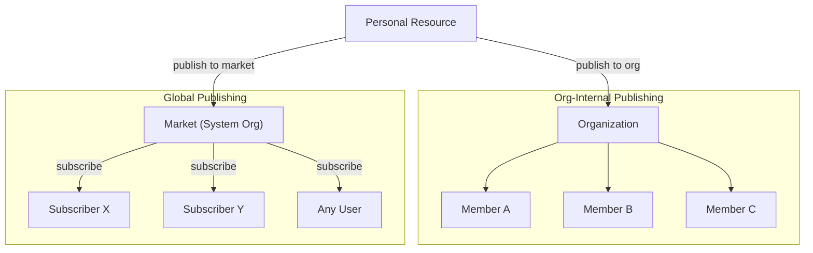
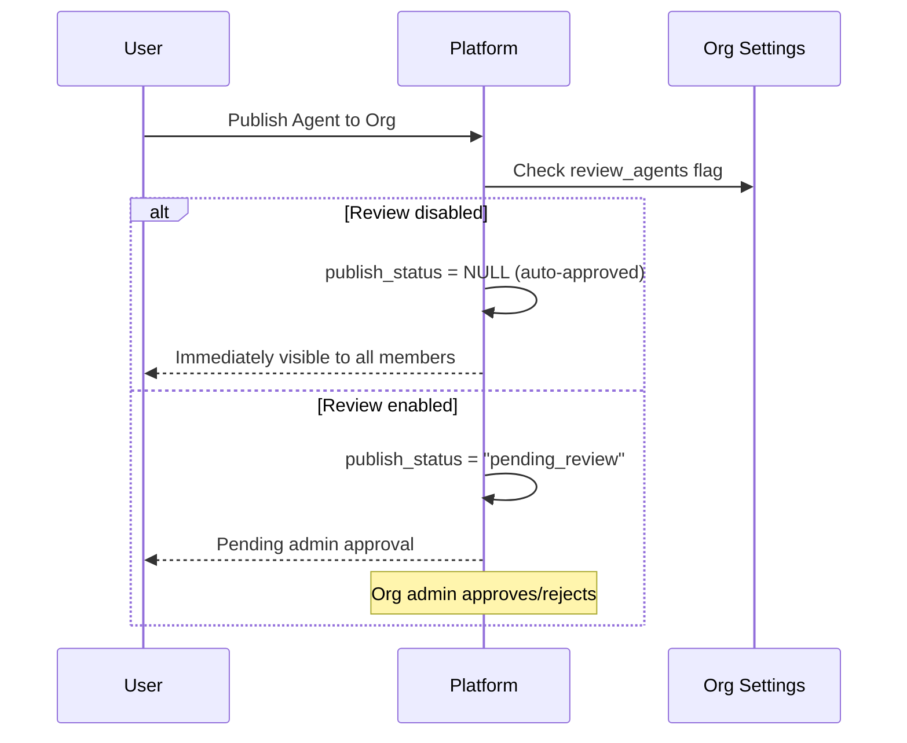
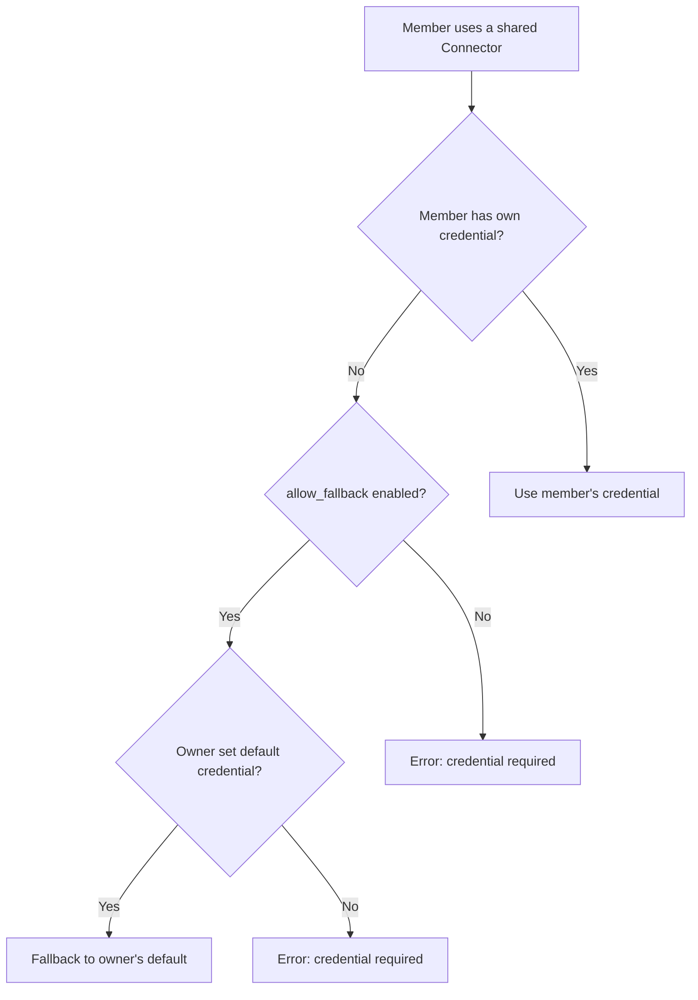
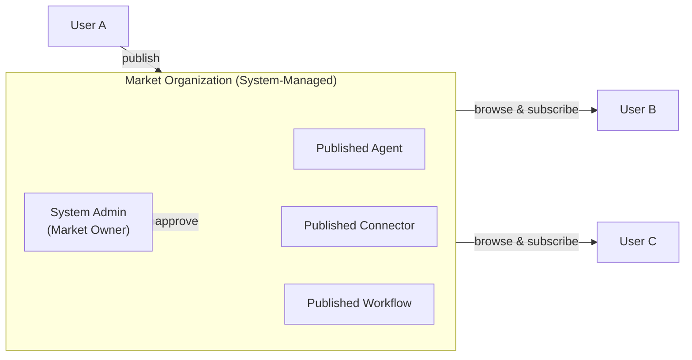
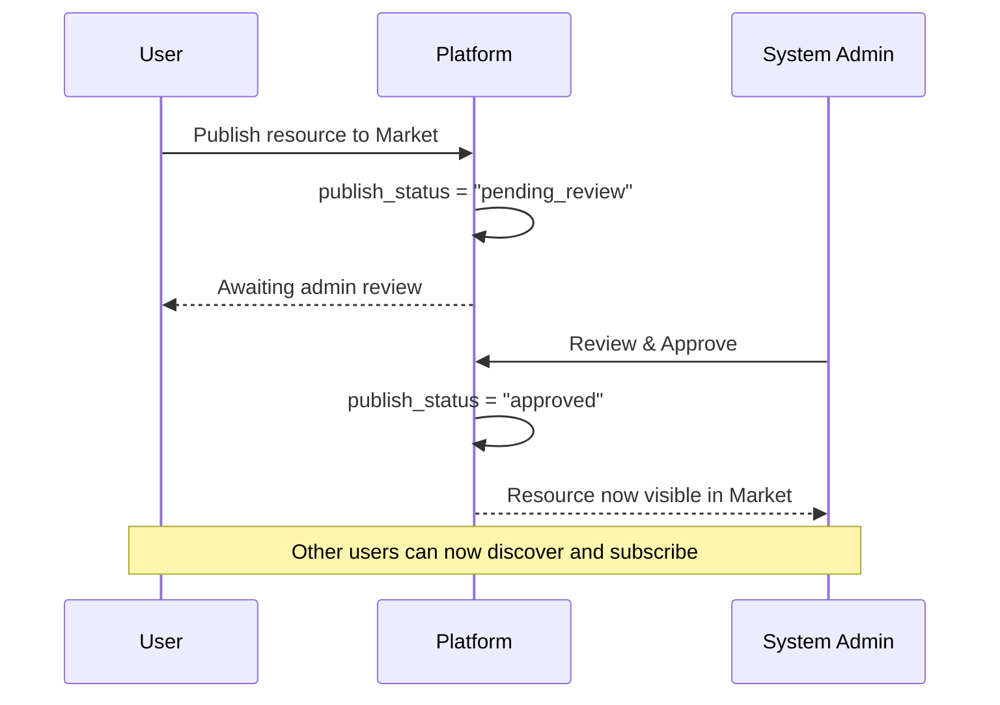
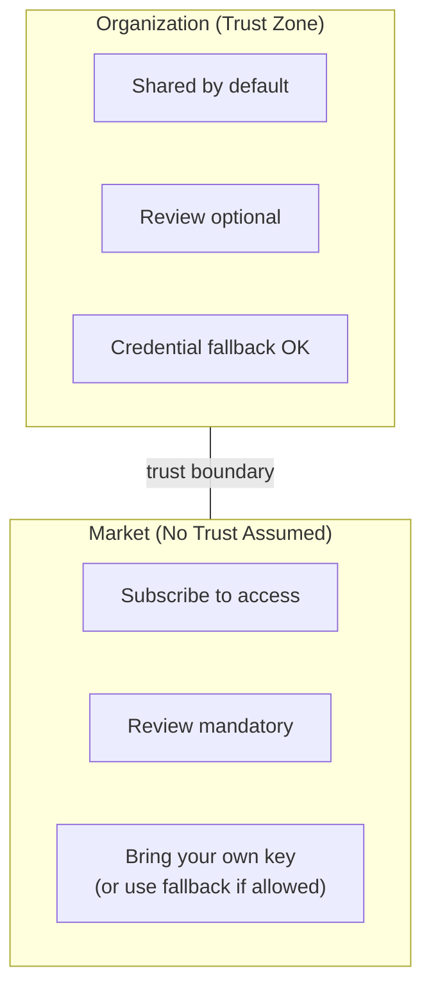

## 概要

FIM One は **Organizations** をコラボレーションとリソース配分の主要な単位として使用します。すべてのリソース (Agent、Connector、Knowledge Base、MCP Server、Workflow、Skill) は **personal** として開始され、Organization に公開して共有することができます。

2 つの異なる配布チャネルがあります:



| チャネル | トラストモデル | レビュー | アクセス | 認証情報の処理 |
|---|---|---|---|---|
| **Organization** | 高信頼 (チーム/企業) | オプション (リソースタイプごと) | すべてのメンバーに自動 | オーナーの認証情報にフォールバック |
| **Market** | 信頼なし (グローバルコミュニティ) | 常に必須 | まず購読する必要あり | フォールバックまたは独自のキーを持参 |

## 組織

### 作成と参加

すべてのユーザーは**無制限**の組織を作成でき、任意の数の組織に参加できます。組織には以下があります：

- **オーナー**: 作成者で、完全な制御権を持つ
- **管理者**: メンバーを管理し、公開されたリソースをレビューできる
- **メンバー**: 共有されたリソースを表示および使用できる

### リソースの公開

ユーザーが組織にリソースを公開すると、対応するリソースリストにすべてのメンバーに表示されます — エージェントはエージェントリストに、コネクタはコネクタリストに表示されます。



**レビューはオプションです。** 各組織は、すべてのリソースタイプ（`review_agents`、`review_connectors`、`review_kbs`、`review_mcp_servers`、`review_workflows`、`review_skills`）に対して独立したレビュートグルを持っています。レビューが無効な場合、公開されたリソースはすべてのメンバーに即座に利用可能になります — 共有チームドライブと同様です。

<Tip>
組織の所有者は自動的にレビューをバイパスします。公開されたリソースは常にすべてのメンバーに即座に利用可能です。
</Tip>

### 認証情報フォールバック

認証情報（APIキー、データベースパスワードなど）が必要なコネクタとMCPサーバーの場合、FIM Oneは**フォールバックメカニズム**を提供します：



- **フォールバック有効** (`allow_fallback=true`、デフォルト)：独自の認証情報を提供しないメンバーは、所有者のデフォルト認証情報を自動的に使用します。これはチーム共有のAPIキーまたは内部サービスに最適です。
- **フォールバック無効** (`allow_fallback=false`)：すべてのメンバーが独自の認証情報を設定する必要があります。これは各ユーザーが独自のAPIキーを必要とする場合（例：ユーザーごとのSaaS ライセンス）に適切です。

認証情報が不要なリソース（例：読み取り専用の公開APIコネクタ、または認証なしのエージェント）は、すべてのメンバーに対して即座に機能します。設定は不要です。

## Market（グローバルパブリッシング）

**Market** は、FIM One のグローバルリソースマーケットプレイスとして機能する特別なシステム管理組織です。

### Market の仕組み



主な特徴：

1. **単一のグローバルインスタンス。** システムには正確に 1 つの Market 組織が存在します。これはプラットフォーム初期化中に自動的に作成されます。
2. **すべてのユーザーが参加者。** すべてのユーザーは Market リソースを閲覧およびサブスクライブできます。Market は常にアクセス可能で、デフォルトの検出チャネルです。
3. **必須レビュー。** 通常の組織とは異なり、Market は**常に**レビューが必要です。公開されたすべてのリソースは、表示される前にシステム管理者によって承認される必要があります。このレビュー要件はロックされており、変更することはできません。
4. **使用するにはサブスクライブが必要。** ユーザーは Market リソースがリソースリストに表示される前に、明示的にサブスクライブする必要があります。これは、リソースがすべてのメンバーに自動的に利用可能な組織内共有とは異なります。

### マーケットへの公開



### 購読と使用

リソースが承認されてマーケットに掲載されると、任意のユーザーは以下のことができます：

1. **マーケットを閲覧** して利用可能なリソースを発見する
2. **リソースを購読** して使用したいリソースを選択する
3. **リソースを使用** する — 認証情報が必要で、フォールバックをサポートしていない場合は、まず独自のキーを設定してください

## 信頼境界

Organization と Market の区別は、基本的な**信頼境界**を反映しています：



### 組織内

同じ組織のメンバーは、暗黙的な**信頼関係**を共有しています。組織の所有者がこれらの人々をまとめることを決定したため、以下が適用されます:

- 公開されたリソースは**即座に利用可能**です（レビューが明示的に有効になっていない限り）
- 認証情報のフォールバックにより、メンバーは所有者の共有 API キーを使用できます
- サブスクリプション手順は不要です — 組織に属していれば、共有されているすべてのものが表示されます

これは、チームが実際に機能する方法を反映しています: 共有インフラストラクチャについてチームメイトを信頼します。

### マーケットプレイス全体

マーケットプレイスは**グローバル**です — 誰でも公開でき、誰でも購読できます。事前の信頼関係がないため、以下のことが必要です：

- **レビューは必須**です。低品質または悪意のあるリソースがエコシステムに入るのを防ぐため
- **購読が必須**です。ユーザーがリソースに明示的にオプトインする必要があります（ワークスペースへの予期しない追加がない）
- **認証情報の処理**は同じフォールバックメカニズムに従いますが、ユーザーはマーケットプレイスリソースをフォールバック付きで使用する場合、リクエストが公開者の認証情報を通じて流れることに注意する必要があります

## リソース可視性サマリー

FIM One のすべてのリソースには、アクセス範囲を決定する `visibility` フィールドがあります：

| 可視性 | スコープ | 表示可能なユーザー |
|---|---|---|
| `personal` | オーナーのみ | それを作成したユーザー |
| `org` | 組織 | ターゲット組織のすべてのメンバー（承認された場合） |
| `org` + Market | グローバル | 購読しているすべてのユーザー（管理者が承認した場合） |

可視性フィルタロジックは統一されています — 同じクエリがパーソナル、組織、および購読されたリソースを処理します：

```
表示される条件：
  1. あなたがそれを所有している（任意の可視性）、または
  2. あなたが属する組織に公開されており、かつ承認されている、または
  3. マーケットプレイスからそれを購読している
```

## 実践的なシナリオ

### シナリオ1: チームがデータベースコネクタを共有する

1. Aliceがチームの PostgreSQL データベースへのコネクタを作成する
2. Aliceがそれをチームの組織に公開する（コネクタではレビューが無効）
3. 組織メンバーである BobとCarolは、すぐにコネクタリストに表示される
4. コネクタはAliceのデータベース認証情報をフォールバックとして使用する — BobとCarolは何も設定する必要がない
5. Daveが（外部契約者）独自の読み取り専用認証情報が必要な場合、独自の認証情報でオーバーライドできる

### シナリオ 2: エージェントをマーケットプレイスに公開する

1. Alice が「Contract Analyzer」エージェントを構築し、マーケットプレイスに公開します
2. システム管理者がレビューして承認します
3. エージェントがマーケットプレイスの閲覧ページに表示されます
4. Bob がそれを発見し、「購読」をクリックすると、彼のエージェントリストに表示されます
5. エージェントが `allow_fallback=false` の API キーを必要とするコネクタを参照しています — Bob は使用する前に独自のキーを設定する必要があります

### シナリオ 3: 厳格なレビューを行う組織

1. コンプライアンス重視の企業が、組織で `review_agents=true` と `review_connectors=true` を有効にします
2. 従業員が新しいエージェントを公開すると、「pending_review」状態になります
3. 組織管理者がエージェント設定をレビューして承認します
4. その後、他のメンバーが利用できるようになります
5. 公開者が後で承認されたエージェントを編集すると、再承認のために自動的に「pending_review」に戻ります
