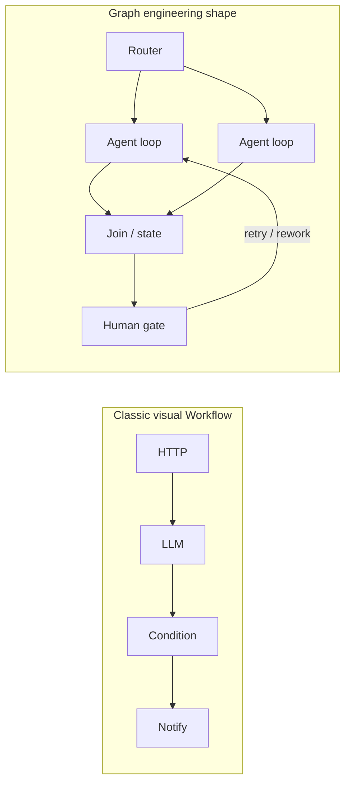
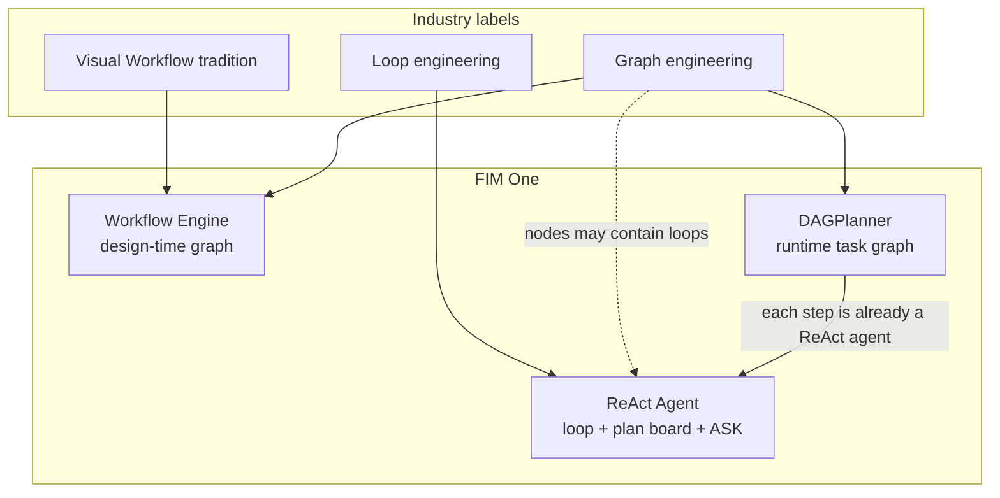
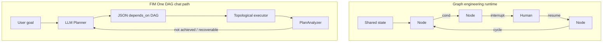
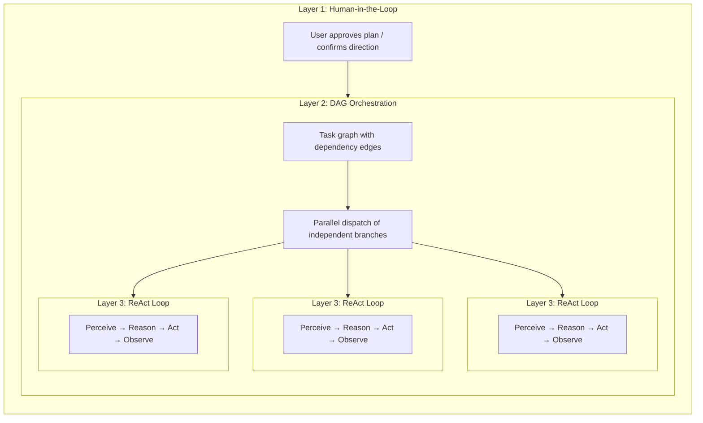

## グラフエンジニアリング（2026年）とFIM One

業界の議論では、しばしば**ループエンジニアリング**（単一のエージェントが繰り返し思考と行動を行う）から**グラフエンジニアリング**（マルチノードトポロジーを明示的なエンジニアリングオブジェクトにする）への転換が取り上げられます。このラベルは新しいものですが、実践は新しくありません。LangGraphスタイルのシステムとマルチエージェント組織は、数年前からグラフを使用しています。FIM Oneにとって重要なのは、人々が意図する**グラフの種類**と、それが3つの実行レイヤーにどのようにマッピングされるかです。

### グラフエンジニアリングが通常意味すること

| レイヤー（一般的なフレーミング） | 関心事 |
|---|---|
| **Harness** | ツール、サンドボックス、認証、ログ、モデルの周りのクォータ |
| **Loop** | 1つの智能体の考える → 行動する → 観察するサイクル |
| **Graph** | **ノード**がどのように接続するか：分岐、結合、サイクル、人間のチェックポイント、共有状態 |

そのフレーミング全体でのコンセンサス：**グラフはループを置き換えない**。グラフ設計は**プロセス間の関係**を設計します。各エージェントノードは依然として完全なループを実行する可能性があります。

「グラフ」は実際には過負荷です。3つの用法が混在しています：

| 用法 | 例 | 役割 |
|---|---|---|
| **制御フローグラフ** | LangGraph `StateGraph`：条件付きエッジ、リトライ、割り込み/再開 | 次に誰が実行するかの状態マシン |
| **タスク依存グラフ** | Claude Code Tasks `blockedBy`；FIM One `depends_on` | 作業をスケジュールし並列化する |
| **ナレッジグラフ** | エンティティと型付き関係 | 検索 / メモリ（オーケストレーションではない） |

このページは最初の2つ（オーケストレーション）についてです。

### 「Difyワークフローの新しい名前」ではない

Difyスタイルの**ビジュアルワークフロー**とグラフエンジニアリングは共通の起源（**明示的なトポロジー**）を持ちますが、同じ製品ではありません。

| | クラシックビジュアルワークフロー（例：Dify） | グラフエンジニアリング（2026年の用法） |
|---|---|---|
| **主要成果物** | 実装者が描くキャンバス／ブループリント | バージョン管理されたシステム設計としてのトポロジー（コードまたは設定） |
| **ノード** | 固定機能ブロック（LLM、HTTP、KB、条件…） | **異種混在**：関数、ルーター、**完全な智能体**、人間、結合 |
| **インテリジェンスの所在** | ほとんどが分離されたLLMノード内；グラフはパイプ | しばしば**ノード内**（各ノードはループの可能性あり）；グラフは役割を整理 |
| **エッジ** | パイプラインの成功／失敗と分岐 | 制御フロー**および**状態遷移（**制御されたサイクル**を含む） |
| **ヒューマンインザループ** | フォーム／承認がアドオン | 割り込み／再開が第一級プリミティブ |
| **ループとの関係** | しばしば「ワークフロー**対**智能体」として販売 | 明示的に**ループ上のグラフ** |

短縮形：クラシックワークフローは**決定論的（または半決定論的）パイプ**で時々LLMステップが入ります。グラフエンジニアリングは**マルチノードシステムトポロジー**で、重要なポストは依然として自律的な智能体となります。

### FIM Oneでの業界マップの位置付け

FIM Oneはすでに制御スペクトラム全体にまたがっており、チャット「Planner mode」はそのうちの一部に過ぎません。

| 業界アイデア | 最も近いFIM Oneの機能 | 適合度 |
|---|---|---|
| クラシックなビジュアルワークフロー | **Workflow Engine**（設計時ブループリント） | 強い |
| 制御フローグラフ + HITL + 永続状態 | ワークフロー人間ステップ + 確認闸門；チャットDAGで部分的 | 中程度 |
| タスク依存グラフ + 並列スケジューリング | **DAGPlanner**（`depends_on`、トポロジカルファンアウト） | スケジューリングでは強い；グラフ中盤のHITLでは弱い |
| 単一エージェントループ + チェックリストメモリ | **ReAct**（`update_plan`、ツール、`ask_user_question`） | 強い |
| 実行時LLM描画プラン（毎ターン） | **DAGPlanner**（Difyではなく；LangGraphの設計時DSLではなく） | 独特な製品 |

### グラフエンジニアリング vs FIM One DAG (チャットプランナー)

同じファミリー(明示的なマルチステップトポロジー)。異なる種族。

| 次元 | グラフエンジニアリング(典型的) | FIM One DAG(チャット) |
|---|---|---|
| **グラフを描く者** | 開発者/実装者(安定したトポロジー) | **実行時のLLM**(目標ごとに新しいグラフ) |
| **エッジの意味** | しばしば**制御フロー**(次へ進む場所、サイクルを含む) | ほぼ**依存関係/データ**(`depends_on`、非環形実行) |
| **修正** | エッジレベルの再試行、ヒューマンノード、同じグラフの再開 | **PlanAnalyzer → 再計画**(しばしば**新しい**グラフ) |
| **ノード深度** | ノードは完全なエージェントループである場合がある | **ステップごとに既に完全なReAct**: `DAGExecutor`は`agent.run()`をマルチイテレーションツールループで実行(デフォルトキャップは`DAG_STEP_MAX_ITERATIONS`から、通常15)。デフォルトモデルはレジストリ**general**(インフラストラクチャ高速ではない)。`model_hint`は推論にエスカレートするか高速に格下げできます。ツールキャッシュ、ステップ/引用検証、ソースエビデンスは各ステップに付属します。ステップエージェントは`enable_plan_tool=False`を設定(ステップ内に`update_plan`ボードなし)。作業単位が既に焦点を絞ったサブタスクだからです。 |
| **共有状態** | ファーストクラスの型付き状態+チェックポイント叙述 | ステップ結果+メモリ/コンパクト。ステップチェックポイント存在 |
| **実行中の質問** | 製品機能としての中断 | 確認ゲート存在。**`ask_user_question`はReAct専用**(チャット外側ループ)、ファーストクラスDAG待機エッジではない |
| **製品エントリ** | フレームワークまたはバックエンド組織図 | ReAcTの隣のユーザー表示モード |

**含意:** グラフエンジニアリング周辺の業界の関心は**グラフ/スケジューリングエンジンの維持を検証**します。これは**ユーザーがすべてのターンで「プランナー」を選ぶことを強制するチャットデフォルトを必要としません**。ほとんどのタスクは依然として強力なループを望みます。グラフは並列ブランチ、固定コンプライアンスパス、マルチロールオーケストレーションで価値を発揮します。

### FIM One が学べること（ReAct、DAG、Workflow を強化）

具体的な成果。スローガンではなく。レバレッジ順に整理。

| # | グラフエンジニアリングのアイデア | 適用先 | 方向性 |
|---|---|---|---|
| 1 | **ループの代わりではなく、ループの上にグラフを** | プロダクト + 自動ルーティング | デフォルト UX は **ReAct** のまま（ループ + `update_plan` + `ask_user_question`）。トポロジーがコスト削減に貢献する場合に DAG/Workflow を使用。 |
| 2 | **異種の深いノード** | DAG | **既に現状通り。** 各ステップは完全な ReAct エージェント（`agent.run`、マルチイテレーション ツール、デフォルトで一般的またはそれ以上のモデル）であり、ワンショット LLM 呼び出しではない。残りのノブはオプション（例：長いステップでのプランボード）であり、構造的なギャップではない。 |
| 3 | **中断/再開をエッジとして** | DAG + ReAct | 実行中の明確化は **外側** のループまたはファーストクラスの待機状態に属する。ユーザーに「質問」をテキストで投げかけ、その後「目標未達成」として再計画する偽の DAG ステップは避ける。 |
| 4 | **全グラフ再計画ではなく、制御されたサイクル** | DAG | 全ステップテキストを失敗した最終回答としてダンプするのではなく、ステップローカルな再試行/部分的な引き継ぎ（完了したステップについては既に部分的に実装）を優先。 |
| 5 | **エッジに沿った型付き共有状態** | DAG + Workflow | ステップ I/O の強力なコントラクト（スキーマ、成果物）により、Analyzer の過信と回答/ソースのドリフトを削減。 |
| 6 | **バージョン管理されたアセットとしてのトポロジー** | Workflow | 人間が作成したグラフを監査用に保持。ランタイム LLM DAG がコンプライアンスブループリントに置き換わることを期待しない。 |
| 7 | **「ほとんどのタスクはグラフを必要としない」という正直さ** | 自動 + ドキュメント | 明確化と選択、短い Q&A、探索的な作業を ReAct にルーティング。DAG は分解可能な並列作業に予約。 |

**「グラフをやる」ときに避けるべきアンチパターン：**

- **人間の状態機械** をシミュレートするために **依存グラフ** を使用（待機プリミティブなしの複数ステップ「回答待ち」）。
- ReAct の **`update_plan`**（チェックリストメモリ）をグラフエンジニアリング（スケジューリングトポロジー）と同一視。
- グラフ機能を **エンジン構成** ではなく、第二のチャット人格として出荷（ループは外側、必要に応じてスケジュールは内側）。
- FIM One DAG ステップを「浅い LLM 呼び出し」と説明：エンジンを過小評価し、プロダクト判断を誤解させる。

## AIツーリングランドスケープにおける5つの「計画」

「計画」という言葉は多義的です。今日、少なくとも5つの異なるアプローチが存在し、それぞれが異なる問題を解決しています：

| アプローチ | 計画形式 | 実行 | 承認 | コア価値 |
|---|---|---|---|---|
| **暗黙的モデル計画** | 内部思考連鎖 | 単一推論パス | なし | モデルが独自にステップを考える |
| **Claude Code計画モード** | Markdownドキュメント | 直列 | 実行前に人間がレビュー | 実行前にアプローチを調整 |
| **Claude Code Teams** | 依存関係エッジ付きタスクリスト | **並行**（マルチエージェント） | 人間が計画を承認、その後自律実行 | 動的エージェントプール＋並列実行 |
| **Kiro仕様駆動開発** | 構造化仕様（要件＋設計＋タスク） | 直列 | 人間が仕様をレビュー | 追跡可能な要件、受け入れ基準 |
| **FIM One DAG** | JSON依存グラフ | **並行**（単一オーケストレータ） | 自動（PlanAnalyzer） | 並列実行＋ランタイムスケジューリング |

最初の2つは**設計時**計画です——作業開始*前*に計画を生成し、人間（またはモデル自体）がそれをステップバイステップで実行します。最後の3つは**ランタイム**計画を導入します——実行グラフはプログラム的に生成・スケジュールされ、独立したブランチが並列で実行されます。違いは*誰が*実行するかです：Claude Code Teamsは自律エージェントを生成し、FIM One DAGは単一オーケストレータ内のステップをディスパッチします。

これらのアプローチは競合ではなく、補完的なレイヤーです。Kiro形式の仕様は*何を*構築するかを定義でき、FIM One DAGはサブタスクを並行して*どのように*実行するかをスケジュールできます。Claude Codeの計画モードは人間がアプローチに同意することを保証し、FIM Oneの PlanAnalyzerは結果を自動的に検証します。

## 三層ネスティング：フルパワーアーキテクチャ

Claude Code TeamsとFIM One DAGは、フル容量で動作する場合、**三層ネスティングアーキテクチャ**を示します：

- **レイヤー1 — ヒューマンゲート**：ユーザーが計画をレビューし、実行開始前に承認します。
- **レイヤー2 — DAGオーケストレーション**：承認された計画は依存関係エッジを持つタスクに分解されます。独立したタスクは並列実行され、ダウンストリームタスクはブロッカーの解決を待ちます。
- **レイヤー3 — ReAct内部ループ**：各タスクは完全なReAct サイクル（認識 → 推論 → 行動 → 観察）を実行するエージェントによって実行され、マルチステップ推論、ツール使用、自律的な再試行が可能です。

重要な洞察：**Claude Code TeamsとFIM One DAGは同じ三層を実装していますが、レイヤー2のメカニクスが異なります**——メッセージパッシング対依存関係エッジ解決。

## フルパワーランタイム: FIM One vs Claude Code Teams

どちらも真正なエージェント——コアループは同一です: **認識 → 推論 → 行動 → フィードバック**。違いは、フル容量で並列作業をどのようにオーケストレーションするかにあります。

| 次元 | Claude Code Teams | FIM One DAG |
|---|---|---|
| **並列モデル** | リーダーがサブエージェントを生成し、メッセージ経由でタスクを割り当て | トポロジカルソート——独立したステップを自動並列化 |
| **タスクグラフ** | `blockedBy` / `blocks` エッジを持つ TaskList（動的 DAG） | `depends_on` エッジを持つ静的 JSON DAG |
| **調整** | 明示的なメッセージパッシング（SendMessage / Broadcast） | 暗黙的な依存エッジ——メッセージなし、データフローのみ |
| **エージェントライフサイクル** | 動的プール——オンデマンドで生成、完了時にシャットダウン | ステップごとの **ReAct エージェント**（`_resolve_agent` 経由でステップごとに新規エージェント）；各ステップは完全なマルチイテレーションツールループを実行 |
| **フィードバック & 修正** | 各サブエージェントが自律的に再試行；リーダーが失敗時に再割り当て | PlanAnalyzer が結果を評価 → 再計画ループ（最大 3 ラウンド）；完了したステップは次の計画に引き継ぎ可能 |
| **人間の関与** | プランモード承認、その後自律実行 | 完全自動——PlanAnalyzer が合格/再計画を決定（チャットレベルの ASK は ReAct のみ） |
| **コンテキスト管理** | 各サブエージェントが分離されたコンテキストウィンドウを取得（相互汚染なし） | ターン全体で共有 DbMemory + LLM Compact；各ステップエージェントは依然としてそのタスク + 依存結果を参照、完全なピアトランスクリプトではなし |
| **トークン経済** | `N エージェント × エージェントあたりトークン`——時間↓ トークン↑（乗法的コスト） | 並列ブランチはシリアル ReAct より多くのコストがかかるが、共有メモリとステップキャップは通常マルチエージェントチーム支出以下 |
| **スケーリングパターン** | さらにサブエージェントを追加（水平、メッセージ結合） | さらに DAG ブランチを追加（水平、依存結合） |
| **最適な用途** | 多様で疎結合なタスク（リサーチ + コード + テスト） | 明確なデータ依存関係を持つ構造化ワークフロー |

### 実世界ベンチマーク: v0.5 RAG システム

Claude Code Teams は FIM One の v0.5 RAG サブシステム全体を単一セッションで構築しました：

- **8 フェーズ**: Embedding → Reranker → Loaders → Chunking → VectorStore → Retrieval → KB Backend → Frontend + Docs
- **46 テスト**合格、フロントエンドビルドクリーン
- **実行時間**: 約 5 分
- **トークンコスト**: エージェントタスクあたり約 100k トークン × 8+ タスク ≈ 合計 800k+ トークン
- **依存関係エッジ**: フェーズ 5 はフェーズ 4 + 1b に依存、フェーズ 6 はフェーズ 5 + 2 + 3 に依存 — 真の DAG

これは中核的なトレードオフを実証しています：**トークン乗算の代償としての時間並列性**。Claude Code Teams は開発者時間のためにコンピュート費用をトレードしています。

### 収束、競争ではなく

「チームコラボレーション」と「パイプラインスケジューリング」の境界は曖昧になっています：

- **Claude Code Teams の `blockedBy`/`blocks` は DAG そのもの** — タスクは明示的な依存関係エッジを持ち、リーダーは先行タスクが完了すると新たにブロック解除されたタスクをディスパッチします。これはトポロジカルスケジューリングに追加ステップ（メッセージ）を加えたものです。
- **FIM One DAG ステップはすでに完全な ReAct エージェント** — レイヤー3 は理想ではなく現実です。各ステップは `agent.run()` をツールと複数反復ループで実行します。トップレベルの ReAct チャットターンとの違いは意図的です（ステップごとのプランボードなし、チャットレベルの `ask_user_question` 待機なし、`model_hint` / 一般的なデフォルトで選択されたモデル）。

**要点：** 同じエージェント本質、収束する並列哲学。Claude Code は **チームコラボレーション** モデルに従います — リーダーがワーカーにタスクを委譲し、ワーカーはメッセージで通信します。FIM One は **パイプラインスケジューリング** モデルに従います — DAG エグゼキューターが依存関係解決に基づいて **ReAct ステップ** をディスパッチします。実際には、両者とも依存関係駆動の並列実行を実装しています。違いは調整オーバーヘッド（メッセージ対エッジ）、分離（ピアエージェント対タスク＋依存関係結果）、トークン経済学です。製品ギャップは「ノードをエージェントにする」というより、**グラフをスケジュールするか 1 つのチャットループに留まるか**、および **グラフが一時停止できない場所での人間待機エッジ** です。

## 構造化出力の段階的低下

DAGパイプライン内のすべての構造化LLM呼び出しサイト（Planner、Analyzer、Tool Selection）は、3段階の低下チェーンを実装する統一された`structured_llm_call()`ユーティリティを使用します：

| レベル | 条件 | 動作方法 |
|---|---|---|
| **Native FC** | `llm.abilities["tool_call"]` | 仮想ツール呼び出しを強制し、`tool_calls[0].arguments`から抽出 |
| **JSON Mode** | `llm.abilities["json_mode"]` | `response_format={"type":"json_object"}`を設定し、`extract_json()`で解析 |
| **Plain text** | 常に利用可能 | `extract_json()`で自由形式のコンテンツを解析し、オプションで`regex_fallback()`を実行 |

各テキストベースのレベルは、次のレベルに低下する前に、再フォーマットプロンプトで1回再試行します。結果は、解析された値、抽出が成功したレベル、および累積トークン使用量を含む`StructuredCallResult`です。

この設計により、同じプロンプトがGPT-4（Native FC）、Claude（JSONモード）、ローカルモデル（プレーンテキスト）全体で確実に機能し、4つの呼び出しサイト全体に分散するのではなく、1つの場所で一貫したエラーハンドリングと再試行ロジックが実現されます。

## 3つの実行レイヤー：制御スペクトラム

上記の5つの計画アプローチはランドスケープを説明しています。FIM One自体では、3つの実行レイヤーが完全な人間制御から完全なAI自律性までの**制御スペクトラム**を提供します。グラフエンジニアリングに関連して：**Workflow**はデザイン時のグラフプロダクト、**DAGPlanner**はランタイムタスクグラフ、**ReAct**はループエンジニアリング（オプションのプラン・ボード・メモリ付き、スケジュールグラフではない）です。

| レイヤー | グラフの定義者 | グラフが存在する時期 | グラフエンジニアリングの役割 | 最適な用途 |
|---|---|---|---|---|
| **Workflow Engine** | ユーザー（ビジュアルキャンバス / JSONブループリント） | デザイン時 | 従来のビジュアルWorkflow + 永続的なプロセストポロジーに最も近い | 決定論的プロセス、コンプライアンス/監査証跡、cron スケジュール自動化 |
| **DAGPlanner** | LLM（目標を自動分解） | ランタイム | タスク依存グラフ + 並列スケジュール + 結果分析 | 明確なサブタスク境界を持つ分解可能なマルチステップワーク |
| **ReAct Agent** | なし（反復ループ） | スケジュールグラフとしては存在しない | ループレイヤー；より大きなグラフ内のノードはReActエージェントになることができる | 探索的、会話的、明確化してから実行、反復的改善 |

設計原則：**ユーザーが望む正確な量の制御を提供する**。

- すべてのローン承認が5つの特定のステップを通過することを証明する必要がある？ → Workflow。
- 3つのトピックを並列で調査してから統合する必要がある？ → DAG。
- 実行中にドラフト、改善、または構造化された質問をする必要がある？ → ReAct。
- 不確かな場合？ → `execution_mode: "auto"`がクエリを分類し、ランタイムでDAGまたはReActにルーティングします（目標が主に明確化または短い探索の場合はReActを優先）。

このレイヤリングがFIM Oneを単一パラダイムツールから区別するものです：

- **Dify**はWorkflowレイヤーを強調しています（静的または半静的なビジュアルグラフ）。
- **LangGraph**はコードレベルの制御フローグラフDSLを強調しています（開発者定義のトポロジー、動的ルーティング、チェックポイント）。構造的にはビジュアルワークフローに関連していますが、ソフトウェアとして表現されています。
- **Manus級エージェント**はエージェント/ループレイヤーを強調しています（自律実行、ユーザー定義構造が少ない）。

FIM Oneは3つのレイヤーすべてをカバーしており、さらにチャットエンジン間の自動ルーティングも行います。**ユーザー定義グラフ → LLM生成タスクグラフ → スケジュールグラフなし**の進行は、より広い業界の誠実さと一致しています：モデルが改善するにつれて、**明示的なトポロジーはほとんどのターンでは必須UIではなく、オプション**になります。グラフエンジニアリングの熱は、すべてのチャットをプランナーを通して強制することではなく、**エンジンと構成への投資**の理由です。

### 関連ドキュメント

- [ReAct Engine](/architecture/react-engine) — ループ、ツール、プランボード、明確化質問
- [DAG Engine](/architecture/dag-engine) — プランナー、エグゼキューター、アナライザー、リプラン
- [Competitive Landscape](/strategy/competitive-landscape) — Dify / Manus / Coze ポジショニング
