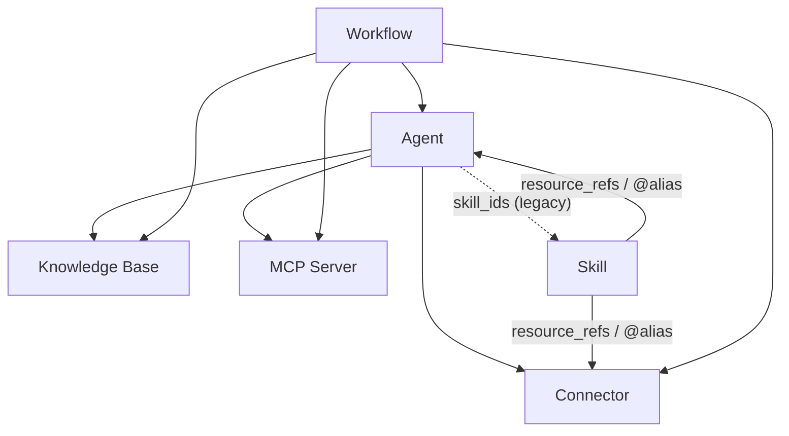

このページは、**共有権限**と**クレデンシャルフロー**の単一の参照です。共有可能なリソースタイプは、**エージェント、コネクタ、MCP サーバー**（およびオプションモジュールが有効な場合は**スキル**と**ワークフロー**）です。他のリソースの上に構築されたリソースを共有する場合に何が起こるかを理解するために使用してください。

<Note>
**ナレッジベースは共有できません。** KB は、共有エージェントにバインドされることで他のユーザーに到達します。このエージェントは実行時に所有者のコンテンツをデリゲートします（「バインドされたリソースを通じてアクセスがどのように流れるか」を参照）。KB を公開するアクションはありません。
</Note>

## 2つの質問

すべての共有決定は、2つの独立した質問に答えます：

1. **可視性** — *他のユーザーがこのリソースをまったく見たり使用したりできるか？*
2. **認証情報** — *どのユーザーのシークレット（APIキー、DBパスワード、サーバー環境変数）で実行されるか？*

可視性はリソースに関するもので、認証情報はConnectorとMCPサーバーのみが持つ、ユーザーごとの別の関心事です。これらを頭の中で分けておくことが重要です。ほとんどの混乱は「見ることができる」と「所有者のキーを使用できる」を混同することから生じます。

## 可見性：所有 + 訂閱

資源對您可見，當且僅當**您擁有它**或**您有明確的訂閱**。不再有隱含的「我的組織中的每個人都能看到它」——組織共享通過訂閱交付。

| 共享範圍 | 含義 | 其他人如何獲得存取權限 |
| --- | --- | --- |
| **個人**（預設） | 僅所有者可以看到。 | — |
| **組織** | 發佈到組織。 | 組織成員從 Market **訂閱**（或在加入時自動訂閱）。 |
| **全域 / Market** | 發佈到公開 Market。 | 任何人都可以從 Market **訂閱**。 |

相同的規則適用於資源使用的任何地方——聊天工具組裝、綁定到智能體和工作流步驟都解析**所有 + 訂閱**。因此，您訂閱的連接器可以綁定到智能體並從工作流調用；您既看不到也無法訂閱的連接器在這三個地方都被拒絕。

<Note>
訂閱有範圍限制：離開（或被移除出）組織會撤銷您僅通過它擁有的訂閱，並刪除您為這些資源保存的每用戶認證。
</Note>

## 認証情報と「フォールバックを許可」

**コネクタ**と**MCP サーバー**のみが認証情報を保持します。それぞれに**フォールバックを許可**スイッチがあり、サブスクライバーがオーナーの認証情報を借用できるかどうかを決定します：

| 状態 | 独自の認証情報を**持つ**サブスクライバー | 独自の認証情報を**持たない**サブスクライバー | オーナー |
| --- | --- | --- | --- |
| **フォールバックを許可 OFF** *(デフォルト)* | 独自の認証情報を使用します。 | **アクセス不可** — ツールは非表示になり、UI は独自の認証情報を設定するよう促します。 | 常に独自のものを使用します。 |
| **フォールバックを許可 ON** | 独自の認証情報を使用します。 | **オーナーの**認証情報にフォールバックします（使用状況/請求はオーナーに発生します）。 | 常に独自のものを使用します。 |

主なルール：

- **OFF がデフォルトです。** トークンの共有はオプトインです。新しく作成されたコネクタまたは MCP サーバーはオーナーの認証情報を共有せず、既存のものは OFF に移行されました。
- **オーナーは常に除外されます。** 「フォールバックを許可」は*他の*ユーザーのみを管理します。独自のコネクタを独自の認証情報で常に使用できます。
- **サイレント失敗はありません。** フォールバックが OFF でユーザーが認証情報を持たない場合、ツールは呼び出し時に失敗するのではなく、**ツールセットから削除**されます。すべてのサーフェス（チャット、**Playground**、ワークフロー ステップ）は、壊れたツールではなく「独自の認証情報を設定してください」というプロンプトを表示する必要があります。

## アクセスが束縛されたリソースを通じてどのように流れるか

リソースは構成されます。1つのリソースを共有すると、その下に束縛されたリソースが暗黙的に公開されます——ただし**認証情報は自動的には流れません**。

| コンテナ | 参照可能 | 方法 |
| --- | --- | --- |
| **Agent** | Knowledge Bases、Connectors、MCP servers | `kb_ids` / `connector_ids` / `mcp_server_ids` |
| **Agent** | Skills | `skill_ids` *(レガシー — Skill→Agent を推奨)* |
| **Skill** | Connectors、Agents、… | `resource_refs` (`@alias` メカニズム) |
| **Workflow** | Agents、Knowledge Bases、Connectors、MCP servers | ノード単位の `agent_id` / `kb_id(s)` / `connector_id` / `mcp_server_id` |

コンテナを共有すると、参照は**IDのグラフ**として一緒に移動します——共有されたワークフローまたはエージェントは埋め込まれた秘密を持ちません。実行時に、参照される各リソースは*ランナーの*アクセスを再度チェックします：

- **Knowledge Bases** はユーザーごとの認証情報を持たないため、共有エージェントに束縛されたKB は**そのコンテンツを委譲します**：エージェントを実行する者は誰でもKB所有者のデータを読みます（エージェントが機能するにはそのKBが必要です）。委譲は**エージェント所有者の**可視性によってゲートされます——エージェント所有者が束縛されたKBへのアクセスを失った場合（例えば、それが共有されていた組織を離れた後）、そのKBは読み続けるのではなく、エージェントから削除されます。束縛されたエージェント外のアドホックKB検索は、呼び出し元（自身 + 購読済み）に対してアクセスチェックされます。
- **Connectors / MCP servers** は認証情報を持つため、**Allow fallback がオン**の場合のみ委譲します（以下を参照）。

## 実行シナリオ

あなたが所有する、**個人用**コネクタにバインドされたエージェント（コネクタ自体は共有していない）を、組織またはグローバルに共有する場合を考えます。他のユーザーがそれを実行すると：

| シナリオ | コネクタの「フォールバック許可」 | 他のユーザーが取得するもの |
| --- | --- | --- |
| **3a** | **ON** | コネクタツールが利用可能になり、**あなたの**認証情報で実行されます——他のユーザーはそれを使用できます。使用料金はあなたに請求されます。 |
| **3b** | **OFF** *(デフォルト)* | コネクタツールはそのユーザーに対して**非表示**になります。エージェントの残りの部分は機能します。UIはそのユーザーに対してそのコネクタの**独自の**認証情報を追加するよう促し、その後ツールが再表示され、ユーザーのキーで実行されます。 |

つまり：**エージェントを共有してもコネクタのシークレットは共有されません。** コネクタ自体の「フォールバック許可」設定が、認証情報がバインディングを通じて浸透するかどうかを決定する唯一のスイッチです。スキルまたはワークフローステップから参照されるコネクタまたはMCPサーバーについても同じことが当てはまります。

<Note>
共有することを意図したコネクタの推奨パターンは以下の通りです：
**フォールバック許可をオフのままにして**、各ユーザーが独自の認証情報をバインドするようにします。あなたが意図的にキーを貸し出し（使用料金を負担）したい場合にのみオンにします——例えば、他のユーザーの代わりに支払うことに満足している従量制APIの場合です。
</Note>
