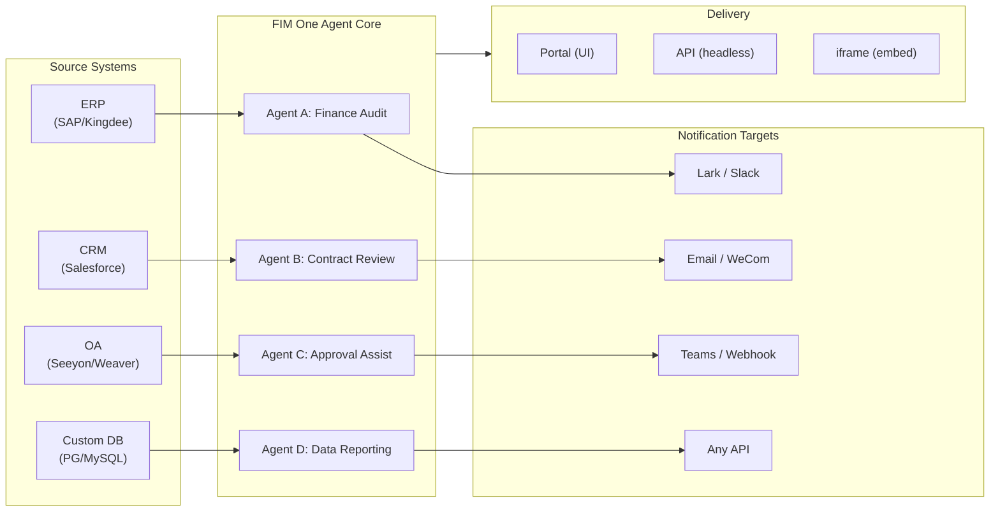

> Goal: Build an **all-in-one agent platform for Global × China enterprises** — delivered through three progressive modes: Standalone (portal assistant), Copilot (embedded in host system), Hub (central cross-system orchestration).
>
> Principles: **Provider-agnostic** (no vendor lock-in), **minimal-abstraction**, **protocol-first**, **connector-first** (integration is the core value).

## 製品ビジョン

FIM Oneは、3つの段階的デリバリーモードに対応する**オールインワンエージェントプラットフォーム**です：

```
Standalone   → Your own AI assistant (Portal)
Copilot      → AI embedded in a host system (iframe / widget / embed)
Hub          → Central cross-system orchestration (Portal / API)
```

**クロスシステムオーケストレーションがコア差別化要因です。** エンタープライズクライアントはレガシーシステム（ERP、CRM、OA、財務、HR）を保有しており、これらをAIを通じて相互に連携させる必要があります：



**GTMパス：ランド・アンド・エクスパンド**

| ステップ | モード | 実行内容 |
|------|------|-------------|
| ランド | Copilot | 1つのシステムに組み込み、そのUI内で価値を実証 |
| エクスパンド | Copilot → Hub | より多くのシステムにロールアウト；Hubモードがそれらを統合 |

## 既知の問題

本番環境で再現可能だが、まだ修正されていない追跡中のバグです。各エントリは症状、疑わしい影響範囲、および回避策（ある場合）を記載しています。修正がスコープ化され、スケジュール化されると、アイテムはバージョンセクションに移動します。

- **Playground の停止と再試行で一時的なビジュアルアーティファクトが表示され、ページ更新で常にクリアされます。** 3つの同時レンダリングソース——`activeConversation.messages`（DBスナップショット）、SSE `messages` ストリーム、および楽観的な `pendingQuery` プレースホルダー——が単一の派生状態に統合されていないため、「再試行」をクリックしてからペアの assistant レスポンスが到着するまでの間、UI は (a) ストリーム前ウィンドウで同じクエリを一時的に2回レンダリングし、(b) `hasLiveMessages` が true で、スナップショットが再ロードされる前に再試行履歴から以前の孤立したユーザーバブルをドロップし、(c) SSE「done」イベントと次の `selectConversation` 更新の間の狭いウィンドウでちらつく可能性があります。**データは決して失われません**——すべてのユーザーメッセージ（中止された再試行を含む）は `conversation.messages` に永続化され、`normalize_alternating_messages` を介して次の LLM 呼び出しに引き継がれ、`48ba08c6` レンダリング修正で導入された `HistoryTurn.orphanUserContents` を介して更新後に正しくレンダリングされます。文脈として、Claude 独自のウェブ UI は同様のクラスのバグを示しています——レスポンスの途中で停止して直後にフォローアップクエリを送信すると、フォローアップが最初のクエリの兄弟編集ブランチとしてフォークされることがあり、新しいターンとして追加されるのではなく——これは楽観的 UI + SSE + 永続化履歴設計における既知の難しい問題であり、FIM One 固有の欠陥ではありません。適切な修正には、3つのレンダリングソースを単一の派生状態に統合する必要があります。より広い Playground ステートマシンリファクタリングまで延期されています。

## バックログ（低優先度） {/* dev: dev/dag-evidence-fidelity.md */}

延期されたハードニング——ブロッキングではなく、マッチングシナリオが表示される場合のみ取り上げます。

- [ ] **DAG証拠は独自の切り詰め予算を取得します**、`DAG_ANALYZER_TRUNCATION`から分離されているため、ソース証拠は分析器/合成が検証する前に要約予算によって再度クリップされません。
- [ ] **構造認識証拠切り詰め**（ヘッド+テール/リストとテーブルを保持）長い列挙がキャップの代わりに存続し、テールを静かに失うことはありません。
- [ ] **ソース忠実性ガイドラインをReActフォールバック合成プロンプトに移植**して、合計/重大度の誤ラベルがDAGだけでなくReActでも捕捉されます。

## 出荷済みバージョン

### v0.1 (2026-02-22) — MVP: ReAct + DAG Planner
- ReActAgent（ツール付き：calculator、python_exec、web_search）
- DAG Planner（LLMが依存関係グラフを生成）
- Portal UI（ストリーミング + KaTeX対応）

### v0.2 (2026-02-24) — Multi-Model + Memory
- リトライ / レート制限 / 使用状況追跡
- ネイティブ関数呼び出し（JSON のみの解析なし）
- マルチモデルサポート（fast + main LLM）
- メモリ：WindowMemory、SummaryMemory
- SSE ストリーミング対応の FastAPI バックエンド

### v0.3 (2026-02-25) — Web Tools + MCP
- Webツール（web_search、web_fetch）via Jina/Tavily/Brave
- ファイル操作ツール
- MCPクライアント（標準ツール統合）
- ツール自動検出 + カテゴリ
- クリックスクロール対応のDAG可視化
- Docker内でのコード実行（`--network=none`）

### v0.4 (2026-02-25) — Multi-Turn + Agents
- マルチターン会話（DbMemory）
- ツールステップ折りたたみUI
- HTTPリクエスト + シェル実行ツール
- エージェント管理（作成、設定、公開）
- JWT認証
- エージェントごとの実行モード + 温度制御

### v0.5 (2026-02-28) — 完全なRAG + グラウンデッド生成
- 完全なRAGパイプライン（埋め込み + ベクトルストア + FTS + RRF + リランカー）
- グラウンデッド生成（引用、信頼度スコア）
- ナレッジベースドキュメント管理（CRUD、検索、リトライ、スキーママイグレーション）
- ContextGuard + ピン留めメッセージ（トークン予算マネージャー）
- DbMemory永続化 + LLM Compact
- DAG再計画（最大3ラウンド）

### v0.6 (2026-03-01) — Connector Platform
- **Connector CRUD**: create, read, update, delete
- **ConnectorToolAdapter**: converts Connector → BaseTool
- **Per-user credentials**: AES-GCM encryption
- **Confirmation gate**: 確認闸門
- **Audit logging**: all tool calls recorded
- **Circuit breaker**: graceful degradation on failures
- **Utility tools**: email_send, json_transform, template_render, text_utils
- **Embedding options**: Jina, OpenAI, custom providers

### v0.7 (2026-03-06) — Admin Platform + Multi-Tenant
- **Admin Platform**: ユーザー管理、ロール切り替え、パスワードリセット、アカウント有効化/無効化
- **招待制登録**: 3つのモード（オープン/招待/無効）+ 招待コード CRUD
- **ストレージ管理**: ユーザーごとのディスク使用量、クリア、孤立ファイルのクリーンアップ
- **会話モデレーション**: 管理者による一覧表示/削除
- **ユーザーごとの強制ログアウト**: すべてのトークンを無効化
- **API ヘルスダッシュボード**: システム統計、コネクタメトリクス
- **初回セットアップウィザード**: ガイド付き管理者アカウント作成
- **Personal Center**: ユーザーごとのグローバル指示、言語設定
- **JWT 認証**: トークンベースの SSE 認証、会話の所有権
- **Global MCP servers**: 管理者がプロビジョニング、すべてのセッションで読み込み
- **後方互換性**: registration_enabled → registration_mode 自動マイグレーション

### v0.7.x (2026-03-07 to 2026-03-12) — Stability + Refinements
- 招待コード管理
- ユーザーごとのクォータ（429 強制）
- 構造化監査ログ
- 機密ワードフィルタリング
- 管理者ログイン履歴
- 管理者ファイルブラウザ
- 拡張管理者ビュー（model_name、tools、kb_ids フィールド）
- Docker Compose デプロイメント（単一イメージ、名前付きボリューム）
- OAuth 自動検出（window.location から）
- 拡張思考 / 推論サポート（`LLM_REASONING_EFFORT`、`LLM_REASONING_BUDGET_TOKENS`）OpenAI o シリーズ、Gemini 2.5+、Claude 対応
- 管理者ツール単位の有効/無効切り替え（無効ツールはチャット実行時に除外）
- MCP サーバー管理を Connectors ページに移動
- デュアルデータベースサポート：SQLite（ゼロコンフィグデフォルト）+ PostgreSQL（本番環境）；Docker Compose が PostgreSQL を自動プロビジョニング
- モデル設定ドキュメントページ（プロバイダーごとの拡張思考セットアップ）
- SSE Protocol v2：リアルタイム回答ストリーミング（`delta_reasoning`、`usage` フィールド、`done`/`suggestions`/`title`/`end` イベント分割）；SQLite プール サイズ 5 → 20
- AI Builder 拡張：7 つの新しいビルダーツール（GetSettings、TestConnection、ImportOpenAPI（コネクタ用）；ListConnectors、AddConnector、RemoveConnector、SetModel（エージェント用））、エージェント上の `is_builder` フラグ、ビルダープロンプト自動更新、SSRF ガード
- SSE v2 フロントエンド：ストリーミングドット パルスカーソル、DAG 再計画ラウンドスナップショット（折りたたみ可能カード）、DAG レイアウトをステップ状態から分離
- AI Builder コンセプトドキュメントページ（コネクタおよびエージェントビルダーガイド）
- 組織システム：完全な CRUD、ロールベースメンバーシップ（所有者/管理者/メンバー）、管理者管理 UI
- 3 段階リソース可視性（個人/組織/グローバル）エージェント、コネクタ、ナレッジベース、MCP サーバー対応
- すべてのリソースタイプの公開/非公開 API；公開エージェントの所有者委譲
- 管理者設定可視性エンドポイント（clone-to-global を置き換え）；統一 `build_visibility_filter()` クエリヘルパー
- データベースコネクタ（フェーズ 1-3）：PG/MySQL/Oracle/SQL Server + 中国レガシー DB への直接 SQL アクセス；スキーマ内省、AI アノテーション、読み取り専用クエリ実行、暗号化認証情報、コネクタごと 3 ツール（`list_tables`、`describe_table`、`query`）
- **評価センター**：定量的エージェント品質ベンチマーク — テストデータセット CRUD（プロンプト + 期待動作 + アサーション）、評価実行（並列実行 + LLM グレーダー + ケースごとの合格/不合格/レイテンシ/トークン結果）、結果ビューア（自動ポーリング）；マイグレーション `r8t0v2x4z567`
- 3 つのモデルロール（General/Fast/Reasoning）、ティアごとの環境設定分離；高速モデルはメインモデル設定を継承しない
- `StepOutput` データクラス（プレーンな文字列ステップ結果を置き換え、構造化データとアーティファクト受け渡し対応）
- DAG 実行用ツールキャッシュ — 実行ごとに同一ツール呼び出しをキャッシュ（非同期ロック スタンピード防止 `DAG_TOOL_CACHE`）
- ステップごとの LLM 検証（失敗時 1 回再試行 `DAG_STEP_VERIFICATION`）
- 自動ルーティング：高速 LLM がクエリを ReAct または DAG として分類；`/api/auto` エンドポイント；フロントエンド 3 方向モード切り替え（`AUTO_ROUTING`）
- [x] ~~**Shadow Market Organization + Resource Subscriptions**~~：組み込み Market org（シャドウ、自動参加なし）が Platform org を置き換え；マーケットプレイス閲覧経由でリソース発見、明示的購読（プルモデル）；Market API（共有リソース購読用）；Market への公開は常にレビュー必須；リソース購読テーブル；グローバル可視性を置き換える組織ベースリソース共有
- [x] ~~**Agent Auto-discovery and Sub-agent Binding**~~：エージェント上の `discoverable` フラグ；`sub_agent_ids` ホワイトリスト；CallAgentTool（スペシャリストエージェントへのタスク委譲用）
- [x] ~~**MCP Server Credentials + Per-User Override**~~：`mcp_server_credentials` テーブル；`PUT /api/mcp-servers/{id}/my-credentials` エンドポイント；認証情報フォールバック動作用 `allow_fallback` フラグ
- [x] ~~**Connector/KB Toggle**~~：`POST /api/connectors/{id}/toggle` および `POST /api/knowledge-bases/{id}/toggle`（リソース一時停止/再開用）
- [x] ~~**Standalone KB Conversations**~~：会話上の `kb_ids` フィールド（エージェントバインディングなしの直接 KB チャット用）

### v0.8 (2026-03-20) — Connector Declarative Config + Progressive Disclosure
- [x] **Database connectors**: direct SQL access (PostgreSQL, MySQL, Oracle) *(shipped in v0.7.x — Phase 1-3)*
- [x] **RBAC**: per-user/role connector access control *(shipped in v0.7.x — org system + three-tier visibility)*
- [x] **Connector credential encryption + per-user override**: `connector_credentials` table, Fernet encryption via `CREDENTIAL_ENCRYPTION_KEY`, `allow_fallback` flag, `GET/PUT/DELETE /my-credentials` endpoints, per-user credential resolution in chat tool loading
- [x] **Publish review UI**: Org-level publish review system — review toggle per org, ReviewsSheet with approve/reject workflow, status badges on resource cards, review notice in publish dialog, resubmit for rejected resources
- [x] **Connector Progressive Disclosure (Phase 1-2)**: single `ConnectorMetaTool` replaces per-action tools; system prompt receives lightweight **stubs** only (name + 1-line description, ~30 tokens/connector vs ~250 tokens/action); agent calls `discover(connector)` to load full action schema on demand — schema only loads when the model selects a connector, keeping the prompt prefix stable for caching. Follows the deferred tool-loading pattern common in modern agent frameworks. `execute` subcommand; feature flag for backward compatibility.
- [x] **Agent Skill System + Compact Instructions**: On-demand skill loading for agent instructions — `Skill` model (name, content/SOP, optional scripts) attached to agents; referenced in system prompt by name only (~10 tokens/skill); agent calls `read_skill(name)` to load full content on demand. Reduces per-conversation instruction token cost by ~80% while allowing richer SOP libraries. Counterpart to ConnectorMetaTool's progressive disclosure applied at the instruction level. Enables the "指令 + 工具 + 技能" differentiation story. Also adds `compact_instructions` field to Agent model — per-agent compression priority list injected into `ContextGuard` when compacting (e.g., "preserve order IDs and amounts, drop raw API responses"), replacing the current static generic prompt. Follows the Compact Instructions convention widely adopted in modern agent frameworks.
- [x] **Connector import/export**: share connector templates
- [x] **Connector fork**: clone + customize existing connectors
- [x] **Workflow Phase 2 Nodes**: Iterator, Loop, VariableAggregator, ParameterExtractor, ListOperation, Transform, DocumentExtractor, QuestionUnderstanding, HumanIntervention — 9 advanced node types with full frontend + backend + 150 new tests (275 total). Node retry with exponential backoff, safe expression evaluation. Stats panel with success rate bar. 12 built-in templates. Pane context menu (Paste, Select All, Fit View, Auto Layout).
- [x] **Workflow Phase 3 Nodes: SubWorkflow + ENV** — 2 new node types (25 nodes total), 14 new tests (306 total), 14 built-in templates. SubWorkflow: full DB-backed nested workflow executor with target workflow selection, variable mapping, and configurable depth limit to prevent infinite recursion. ENV: reads encrypted environment variables with key picker and fallback defaults. Full frontend (node components, config panels, palette entries, minimap colors). Per-node execution statistics panel (success rates, durations, failure counts sorted worst-first). `getNodeStats` API client + `NodeStatEntry` type. Keyboard shortcuts dialog (`?` key).
- [x] **Workflow Scheduled Triggers**: Per-workflow cron configuration with timezone, default inputs, and next-run-at calculation. Preset cron buttons, 30 trigger tests.
- [x] **Workflow API Triggers**: Public per-workflow API keys (`wf_` prefix) for external execution without user auth, with rate limiting. API key management dialog with generate/regenerate/revoke, trigger URL, and cURL/JS examples.
- [x] **Workflow Batch Execution**: `POST /batch-run` with up to 100 input sets, configurable parallelism (1-10), collapsible per-item results, JSON export. 14 batch execution tests.
- [x] **Workflow Execution Log Viewer**: Real-time chronological SSE event stream in the run panel with timestamps, color-coded badges, and event type filter toggles.
- [x] **Workflow Run Stats**: Backend batch-fetches run counts and success rates via GROUP BY subquery; frontend displays stats on workflow cards with color-coded success rate indicators.
- [x] **Workflow Scheduler Daemon**: Background async service polling every 60s for due cron-based workflows. Croniter timezone support, semaphore concurrency, `last_scheduled_at` tracking, webhook delivery. 14 tests.
- [x] **Workflow Import Conflict Resolver**: Detects unresolved agent/connector/KB/MCP references during import. Batch DB queries with visibility filtering, frontend toast warnings. 17 tests.
- [x] **Workflow Test-Node Execution**: Isolated single-node testing with mock variables, integrated into editor (config panel Test button + context menu). 23 tests.
- [x] **Workflow Version Diff**: Side-by-side blueprint comparison with node/edge change detection, color-coded indicators (added/removed/modified).
- [x] **Workflow Run Management**: Delete individual runs (`DELETE /runs/{run_id}`) and clear all completed runs (`DELETE /runs`), with frontend confirmation dialogs.
- [x] **Workflow Run Replay Overlay**: "View on Canvas" button in run history to overlay past execution results on the canvas, showing per-node status and output without re-executing.
- [x] **Workflow Favorites/Pinning**: Star/pin workflows to the top of the list with localStorage persistence.
- [x] **Workflow Run History Export**: Export run history as JSON file download with full run metadata and per-node results.
- [x] **Admin Workflows Management**: Admin panel tab for managing all workflows across users — list, toggle active/inactive, delete with confirmation. Batch endpoints for delete, toggle, and publish with audit logging.
- [x] **Workflow Templates System**: `WorkflowTemplate` ORM model with admin CRUD, public listing/clone API, and 5 seed templates auto-inserted on first startup.
- [x] **Workflow Inline Validation Badges**: Real-time per-node `ValidationBadge` on canvas with error/warning tooltips for immediate visual feedback during editing.
- [x] **Workflow Execution Trace Viewer**: Timeline-based trace viewer Sheet with engine `trace_level` parameter and per-node variable snapshots for step-through debugging.
- [x] **Workflow Rate Limiting and Timeout**: Per-user `WorkflowRateLimiter` (sliding window 10 runs/min, 3 concurrent) and default 10-minute global run timeout.
- [x] **Workflow Blueprint System**: Visual workflow editor for designing and executing multi-step automation blueprints — `Workflow` / `WorkflowRun` ORM models, full CRUD + SSE execution API, import/export, duplicate, blueprint validation endpoint, `WorkflowEngine` with topological sort + semaphore-based concurrency + condition branching and 12 node types (Start, End, LLM, ConditionBranch, QuestionClassifier, Agent, KnowledgeRetrieval, Connector, HTTPRequest, VariableAssign, TemplateTransform, CodeExecution), `VariableStore` with `{{node_id.output}}` interpolation and `env.*` namespace, error strategies per node (STOP_WORKFLOW / CONTINUE / FAIL_BRANCH) with per-node timeout and advanced config UI, React Flow v12 visual editor with drag-and-drop palette + node config panel + variable picker combobox + add-node-on-edge + auto-layout (ELK.js) + run history sheet, Dify-style compact node design with ring-based run status styling and animated edge transitions, 4 built-in starter templates (Simple LLM Chain, Conditional Router, Knowledge-Augmented QA, HTTP API Pipeline) with template picker dialog and `GET /templates` + `POST /from-template` API, stats endpoint, `?run=true` URL param auto-open, subprocess-based code execution security, 105-test suite (templates, eval namespace flattening, blueprint validation warnings, node/edge deletion, import/export/duplicate, deadlock detection, multi-condition branching)
- [x] **Operation audit**: detailed logging of who did what — admin review log audit tab added (publish review trail per org/resource)
- [x] **Semantic Schema Annotations**: extend connector schema fields with `semantic_tag`, `description`, and `pii` flags; annotations surfaced in LLM tool descriptions so the agent understands field intent without guessing from column names

### v0.8.1 (2026-03-29) — プログレッシブディスクロージャー成熟度 + ReAct強化
- DB コネクタ（`DatabaseMetaTool`）、MCP サーバー（`MCPServerMetaTool`）、オンデマンドツール読み込み（`request_tools` メタツール）のプログレッシブディスクロージャー
- DAG 品質全面改善（5つの改善：モデルアップグレード、スキル自動検出、引用検証、構造化コンテンツ保持、ドメイン認識ルーティング）
- ReAct のドメインモデルエスカレーション（専門ドメインが推論モデルに自動エスカレート）
- モデルごとのネイティブ関数呼び出しトグル（`tool_choice_enabled`）
- ReAct サイクル検出（決定論的な重複ツール呼び出し防止）
- ReAct 完了チェックリスト（ツール使用時の事前回答検証）
- リソースフォークフェーズ 1（系統追跡付き MCP サーバー + スキルフォークエンドポイント）
- ワークフロー接続依存関係自動サブスクライブ（再帰的なサブワークフロー依存関係解決）
- プリビルトソリューションテンプレート（初回登録時にマーケットに 8 つの業界別ソリューションをシード）
- 管理者通知改善（タイムゾーン対応、マスタースイッチ、SMTP Reply-To）
- ターンごとのトークン予算サーキットブレーカー（`REACT_MAX_TURN_TOKENS`）
- 集中化されたツール切り詰め、動的システムプロンプト予算配分
- ファイル添付ダウンロード、重複メッセージ送信修正

### v0.8.2 (2026-04-10) — エージェントコア強化 + ビジョンドキュメント
- **エージェントコア フェーズ 0** — コンパクトプロンプトが9セクション構造化フォーマットにアップグレード；空のツール結果保護（`(no output)` の代わりに説明的メッセージ）；アンチループプロンプト + サイクル検出閾値を2に低下；ドメイン分類器 + プリフライトDB設定解決を並列化（リクエストあたり400～1100ms削減）；SSE `end` イベントが回答直後に送信、タイトル/提案はバックグラウンドタスクに移行
- **エージェントコア フェーズ 1（コンテキスト アンチブロート）** — `MicroCompact` ルールベースの古いツール結果クリーンアップ（最後の6件を保持）；`REACT_TOOL_RESULT_BUDGET=40000` 集計上限；コンテキストオーバーフロー時のリアクティブコンパクト（クラッシュの代わりに自動的に50%予算にコンパクト化して再試行）
- **エージェントコア フェーズ 2（速度）** — キーワードベースのツールプリセレクション（明らかなマッチでLLM呼び出しをスキップ、200～500ms削減）；`SharedHttpClient` LLM接続プーリング；200トークン超の回答では完了チェックをスキップ；`FallbackLLM` がプライマリ+高速をラップし、429/503/529/接続エラーで自動フェイルオーバー
- **インテリジェントドキュメント処理（ビジョン対応）** — 適応的ドキュメント処理：PDFページはビジョン対応モデル（GPT-4o、Claude 3/4、Gemini）向けにPyMuPDFで画像としてレンダリング、テキストのみフォールバックはpdfplumberで対応。モデルごとの `supports_vision` フラグ。`DOCUMENT_PROCESSING_MODE`、`DOCUMENT_VISION_DPI`、`DOCUMENT_VISION_MAX_PAGES` 経由のモード。DOCX/PPTX埋め込み画像抽出。会話ターン全体でのマルチターンビジョン永続化。スマートPDF処理（テキストリッチページはテキスト+画像を抽出；スキャンページはフルページPNGとしてレンダリング）。`--network=none` コード実行向けの一般的なデータサイエンスパッケージを含むプリビルトサンドボックスイメージ（`Dockerfile.sandbox`）
- **リソースフォーク完成** — エージェント/コネクタ/ワークフロー フォークエンドポイント追加、5タイプ系統追跡完成（KBフォーク削除 — 本質的にユーザーローカル）
- **ファイル整合性ガードレール** — システムプロンプトルールがターゲットファイルが読み取り不可の場合、エージェントが無関係なファイル内容を代替することを防止；アップロードされたファイルにはメッセージコンテキストに `file_id` が含まれ、直接 `read_uploaded_file` アクセス可能

### v0.8.3 (2026-04-16) — ユニバーサルドキュメント変換 + エージェントコア フェーズ 3
- **ユニバーサルドキュメント変換（`convert_to_markdown` + OCR）** — Microsoft MarkItDownをラップした組み込みエージェントツール。PDF、Word、Excel、PowerPoint、HTML、JSON、CSV、XML、ZIP、EPUB、Outlook .msg、画像、オーディオ、YouTube URLをMarkdownに変換します。`LiteLLMOpenAIShim`は任意のビジョン対応LLM（Claude、Gemini、Bedrock、Azure）経由でOCRを有効にします。ビジョン対応RAG取り込みとゼロリグレッションのテキストのみフォールバック。`LLM_SUPPORTS_VISION` 環境変数でオプトアウト可能
- **エージェントコア フェーズ 3（ランタイム不変性の強化）** — 会話復旧（ぶら下がり`tool_use`の自動修復）；構造化コンパクトワークカード（圧縮ラウンド全体での`WorkCard`型マージ）；ターンレベルプロファイラー（`REACT_TURN_PROFILE_ENABLED`）；ユーザーごとのレート制限（`LLM_RATE_LIMIT_PER_USER`）；`tool_calls`を含む空コンテンツアシスタントメッセージはドロップされなくなります

### v0.8.4 (2026-04-17) — プロンプトキャッシュ + 推論の正確性
- **システムプロンプトセクションレジストリとキャッシュブレークポイント** — メモ化された `PromptRegistry` はシステムプロンプトを安定したプレフィックス + 動的サフィックスに分割し、キャッシュ対応プロバイダー（Claude、Bedrock Anthropic、Vertex Claude）は `cache_control: {"type": "ephemeral"}` をプレフィックスに受け取り、ターンあたりの入力トークン削減率は約60～80%を実現します。キャッシュ非対応プロバイダーは単一の連結メッセージを取得します（動作変更なし）
- **プロンプトキャッシュの可観測性** — `cache_read_input_tokens` と `cache_creation_input_tokens` は `UsageSummary` → `TurnProfiler` → `done_payload.cache` フィールドを通じて追跡され、ターンごとに構造化された `turn_cache` ログ行が出力されます。リレーキャッシュの正確性プローブとしても機能します
- **会話復旧MVP** — 合成 `tool_result` 行は中断されたターンの後に永続化され、`POST /chat/resume` はモノトニックカーソルからキャッシュされたSSEイベントをリプレイします。フロントエンド `useSseResume` フックは指数バックオフ（300ms → 1s → 3s、最大3回の試行）で自動的に再接続し、「再接続中…」インジケーターを表示します
- **思考ブロックの永続化と署名** — `reasoning_content` + Anthropic `signature` は `metadata_["thinking"]` に永続化され、後続のターンでリプレイされます。Claude 4マルチターン会話でのHTTP 400署名不一致を修正します
- **プロバイダー対応の推論リプレイポリシー** — `core/prompt/reasoning.py` の集中化された `reasoning_replay_policy()` はプロバイダーファミリーごとにシリアライゼーションをゲートします。Claudeは署名付きの思考ブロックをリプレイし、DeepSeek-R1/Qwen-QwQ/Gemini-thinking/o-seriesはアウトバウンドで `reasoning_content` を削除します（以前はリークしており、プロバイダーのKVキャッシュを破損し、APIドキュメントに違反していました）

### v0.8.5 (2026-04-23) — Channel Integration + Hook System + Contributor i18n
- **Feishu Channel (Phase 1 subset)** — Org-scoped `Channel` リソースと Fernet 暗号化認証情報；`FeishuChannel` はインタラクティブカード送信 + コールバック（署名検証 + URL チャレンジ）をサポート；Settings → Channels 管理 UI（リスト、ダーティ状態保護付きの作成/編集、コピー可能なコールバック URL 付きの詳細、テスト送信）；CRUD API（`/api/channels`）とイベントコールバックエンドポイント（`/api/channels/{id}/callback`）。2026-04-24 路演向けに早期リリース
- **Agent Hook System（ReAct + DAG ランタイムで稼働中）** — `src/fim_one/core/hooks/` の `PreToolUseHook` / `PostToolUseHook` 抽象化；`model_config_json` で `hooks.class_hooks` を宣言するエージェントは、チャットセッションごとにフックがインスタンス化および登録されます。最初のコンシューマー `FeishuGateHook` は、エージェントが `requires_confirmation=True` ツールを呼び出すときにリンクされた Feishu グループに承認/却下カードを投稿し、実行をブロックし、判定に基づいて再開または中止します
- **設定可能な確認ゲート（インラインまたはチャネル）** — すべてのエージェントは、3 つのルーティングモード（自動 / インラインのみ / チャネルのみ）、承認者スコープセレクター（イニシエーター / 所有者 / 組織内の誰でも）、ツール単位のオーバーライド、および明示的な承認チャネルピッカーを備えた承認セクションを取得します。自動モードは、チャネルがリンクされていない場合、インラインの承認カードに適切にフォールバックします。`POST /api/confirmations/{id}/respond` は Feishu ウェブフックと単一の決定記録パスを共有します
- **エージェント単位のタスク完了通知** — 長時間実行される ReAct または DAG エージェントは、タスク完了時に組織のチャネルにサマリーカードをプッシュできます。汎用アウトバウンド通知パターンの最初のコンシューマー
- **Hook 承認 Playground** — Channels 詳細シートには「Test Approval Flow」アクション（本番パス全体を実行：genuine `ConfirmationRequest` 行、実際の Feishu コールバック、ステータス遷移）があります — 本番フックが使用するのと同じコードパス
- **Contributor フレンドリーな i18n CI フォールバック** — `.github/workflows/i18n-sync.yml` は PR マージ後にマスター上で EN → ZH/JA/KO/DE/FR に翻訳し、`[skip ci]` で自動コミット；コントリビューターはローカルで `LLM_API_KEY` が不要になります。Pre-commit ロケール編集ガードは生成されたロケールファイルへの手動編集を拒否します（正当な翻訳修正のための `ALLOW_LOCALE_EDIT=1` オーバーライド）。スモークテストプッシュで end-to-end 検証済み
- **Exa 統合ドキュメント** — 専用 Integrations セクションと最初のクラスの Exa ページ（完全な Exa 検索サーフェス（neural / fast / deep-reasoning / instant）、フィルタリング、コンテンツ取得、3 つのチューニング済みプリセット）
- **Xinchuang (信創) データベースサポート** — Database Connector は PostgreSQL/MySQL と並んで KingbaseES (人大金仓)、HighGo (瀚高)、DM8 (达梦) をリストします。PG 互換ドライバーは `asyncpg` を再利用；DM8 は `dmPython` を使用します。`scripts/test_xinchuang_dbs.py` は CLI からのライブ接続を検証します
- **Channels + Hook System アーキテクチャドキュメント** — `docs/architecture/hook-system.mdx` は 3 つのフックポイントを説明し、FeishuGateHook を end-to-end で説明；既存のアーキテクチャページはクロスリンク；README は Messaging Channels をファーストクラスの機能としてリストします
- **強化** — 重複する Feishu コールバッククリックは二重決定の代わりに置換カードを生成；並行コールバッククリックは条件付き `UPDATE ... WHERE status='pending'` 行数チェック経由で解決；保留中の承認は `CHANNEL_CONFIRMATION_TTL_MINUTES`（デフォルト 24h）後にバックグラウンドスイーパー経由で自動期限切れ；Settings → Channels は組織ロールを尊重（メンバーは読み取り専用 UI を表示）；並行ツール呼び出しアグリゲーターは、すべてのデルタに対して `index=0` を再利用するプロバイダーを処理；セッション期限切れリダイレクトはクエリ文字列を保持

### v0.8.6 (2026-05-08) — Stripe Billing + 改善

- [x] Stripe billing MVP — Free + Pro ティア；Checkout、Customer Portal、webhook ライフサイクル；`/settings?tab=billing`；管理者プラン/サブスクリプション CRUD；クォータ強制は各ユーザーのプランを尊重
- [x] 管理者制御の課金機能フラグ — `system_settings.billing_enabled` は Stripe パイプライン全体をゲートするため、Stripe 認証情報がないプライベートデプロイメントは機能しない支払い UX を表示しない
- [x] ユーザーごとの無制限クォータ — 空の場合はグローバルデフォルトを継承、`0` は無制限を付与；以前は両方が同じ状態に折りたたまれていた
- [x] 翻訳用語集を単一の情報源として — `scripts/translation-glossary.md` はロケール別ルールを統合；pre-commit は生成されたロケールファイルへの手動編集を無条件に拒否
- [x] ライセンス + 準拠法を FIM Labs Pte. Ltd.（シンガポール）に移行；SIAC 仲裁は英語；新しいトップレベル `NOTICE` ファイル
- [x] Playground フォローアップ提案を復元、エージェントごとのオプトイン
- [x] 安定性修正 — 厳密交互プロバイダー履歴、並列ツール呼び出し境界検出、無制限エージェント確認フロー、チャネルロールゲーティング、再試行重複抑制、拒否後パラフレーズなし

### v0.8.7 (2026-06-10) — セキュリティ強化 + ガードレール v0 + 請求正確性
- [x] JWTトークンタイプ制限 — 同じ署名のトークン（一時/リフレッシュ/チケット）がAPIおよびSSEエンドポイントを認証できる2FA バイパスを修正
- [x] OAuth強化 — メール自動リンクはプロバイダー検証済みメール（アカウント乗っ取り対策）が必須; OAuth リフレッシュトークンはハッシュ化して保存されセッションローテーションが機能
- [x] コンテンツガードレール v0 — 入力/出力トリップワイヤーレイヤー（`core/agent/guardrail`）; ジェイルブレイク検出器と最大長出力ガードレール搭載、環境変数で設定可能
- [x] `file_ops.apply_patch` — V4A差分パッチ（ファジー空白マッチング対応）、`find_replace`を補完
- [x] 請求サイクル正確性 — クォータはサブスクリプション記念日にリセット（暦月ではなく）; 更新は Stripe の信頼できるルックアップで期間を進める; 使用量表示は強制ウィンドウに合わせる
- [x] 信頼性修正 — 疑似プロトコルツール呼び出しリークを回答から削除; チューニング可能な HTTP キープアライブで `APIConnectionError` バーストを終了; API キー使用統計は読み取り専用リクエストで永続化
- [x] 請求タブビジュアルオーバーホール — フルワイド、他の設定タブと一貫性あり

### v0.8.8 (2026-06-22) — SSRF強化 + 信頼性と推論の修正
- [x] SSRF強化 — ブロックリストがIPv4マップIPv6（`::ffff:` インスタンスメタデータバイパス）をアンラップ；MCP SSE/Streamable-HTTPサーバーURL は作成時と接続時にSSRF検証
- [x] LLM信頼性 — 共有HTTPプールがLiteLLMクライアントキャッシュ削除後に自己修復；チャットがストリームを即座に送信（履歴はバックグラウンドで折り畳み、完全リロードなし）
- [x] Anthropic適応思考プロトコル（Opus 4.6+/Sonnet 4.6/Fable 5対応） — 拡張思考が古い固定予算パラメータ400エラーの代わりに4.7/4.8で動作；OpenAIプロキシ誤ルーティングで警告
- [x] 推論詳細がエンドツーエンドで保持 — 本物の最終回答がそのままストリーム配信；圧縮、コンテキスト再構築、サブエージェントステップを経ても保持（ロッシーな再合成なし）
- [x] PreToolUse強制フック — エラー時にフェイルクローズ；クラッシュした確認ゲートはもう呼び出しを暗黙的に許可しない；非強制フックは`fail_open`経由でフェイルオープンを維持
- [x] Force-logoutタイムスタンプ比較がUTC変換とDocker Compose `POSTGRES_*` 認証情報オーバーライドで正規化（出荷時の`fim:fim`デフォルトなし）

### v0.8.9 (2026-07-08) — モジュール縮小 + 共有の統合 + 承認の強化
- [x] スキルとワークフローは管理者モジュールフラグの背後にソフトシェルフ化（デフォルトオフ）— コアのみブート；何も削除されず、管理者 → 設定 → モジュールから復元可能
- [x] 共有を統合 — KB共有を削除（KBは共有エージェント経由でのみ他者に到達）、DBコネクタは共有不可 + 生SQL所有者のみ、ワークフロービルダーは参照のみの9ノードに縮小
- [x] Feishu承認の強化 — カードクリックは承認者の身元を強制、コールバック署名は失敗時にクローズ + 暗号化エンベロープは復号化、承認は意図しないチャットにルーティングされない
- [x] 使用時アクセス再確認 — 共有MCP サーバーとバインドされたKBは実行ごとに再検証；組織を離れるとサブスクリプションと保存された認証情報は即座に取り消される
- [x] エージェントループの強化 — プランボード、バックグラウンドツール、増分DAG再計画 + チェックポイント再開、コンパクション化はツールペアリングを保持、切り詰め継続、529/504リトライ
- [x] `run_workflow` エージェントツール + ワークフロー正確性 — エージェントノードは完全なエージェントを実行、確認ゲートは失敗時にクローズ、コネクタ呼び出しはアクセスチェック済みで監査ログ記録
- [x] アカウント削除を統一 — 管理者とセルフサービスは1つのパージルーチンを通じて、すべてのレコードとディスク上のファイルをカバー；組織所有者は最初に所有権を譲渡する必要がある
- [x] 所有者認証情報フォールバックはオプトイン化（破壊的変更） — コネクタ/MCP サーバーはデフォルト `allow_fallback` オフ、既存行は反転；フォールバックなしリソースで認証情報がないものはツールセットから非表示
- [x] Webhook/cronワークフロー実行は所有者のトークンクォータに制限 — 無制限の無料LLMトリガーパスは閉鎖
- [x] リソースバインディングを可視性で統一 — サブスクライブされたコネクタ/KB/MCP サーバーはエージェントにバインド可能；ワークフローコネクタステップは実行者のアクセスを強制
- [x] 会話ワークスペースをチャットに接続 — `workspace://` 超大型ツール結果のオフロード、予算切り詰め救済、事前コンパクション化トランスクリプトスナップショット

## 計画されたバージョン

2026-07-08に再計画：FIM Oneはエージェントランタイムです——1つのカーネル（ReActエンジン、認証情報、確認ゲート、監査、マルチテナント組織）が複数の配信サーフェスの背後にあります：Web UI、API、JS埋め込み、MCP出力。すべてのサーフェスは認証、認証情報、承認、メータリングのための同じアセンブリレイヤーを再利用します：より多くのフロントエンド、ロジックはありません。近期の方向性はデータQ&A（ChatBI）スライスへの収束であり、プラットフォームではなくシナリオを販売することです。{/* dev: dev/replan-2026-07.md */}

### v0.9 — Connector Fences + Scenario Onboarding

**目標**: ポスト削減アセットが完全なデータQ&A製品に組み立てられます — 読み取り専用DBコネクタ + フェンス + 承認ゲート + IM エントリ。Tier-1フェンスはセキュリティ負債を製品機能に変えます。

#### DB Connector Fences — Tier 1, three PRs {/* dev: dev/connector-rbac/00-overview.md */}

- [ ] PII列の削除（`ConnectorScopeGuard` PreToolUseフック）
- [ ] スキーマ可視性——テーブル/列の許可・拒否リスト + 動詞ブロッキング（読み取り専用の強制）
- [ ] フェンスの監査可能性——`ConnectorCallLog`内の`caller_user_id`、`effective_credential_source`、`scope_rules_applied`
- [ ] フック単位の設定パススルー（`{"name", "config"}`スキーマ）——ScopeGuardルールのキャリア {/* dev: dev/hook-system.md */}
- [x] 委譲全体での承認ゲート保持——`call_agent`とワークフロー`AGENT`ノードは、エージェント自身のフックを実行（なしではなく）

#### 回答のレンダリング

- [x] 回答はMermaidダイアグラム、SVG図、カード形式の比較表をレンダリングし、回答、コードブロック、表にコピー/エクスポート機能を備えています
- [x] レンダリングされたマークダウンはサニタイズされ、モデル出力とアップロードされたファイルからの生HTML注入を防ぎます
- [x] ダイアグラムとコードブロックはファイルとしてダウンロード可能です。推論はライブおよび過去の会話ではデフォルトで1行プレビューに折りたたまれます
- [x] 会話エクスポートはCJK用に組版されています——PDFは実フォント（正しい間隔、箇条書き、太字）を埋め込み、DOCXは東アジアフォントを宣言し、両方とも同じサイズスケールです

#### Workbench UX

- [x] サイドバーがチャットクラスタを中心に再編成——会話は「新規チャット/検索」の直下に配置され、モジュールナビゲーションはコンパクトなボトムドックに配置
- [x] `/clear` スラッシュコマンドで入力ボックスから新しい会話を開始

#### コンテキストロバストネス

- [x] コンテキスト予算はモデルのハード制限より8%下に設定され、高速モデルのウィンドウが一般予算を保持できない場合は起動時に警告が表示される
- [x] プランボード規律：繰り返しとプランなしのリマインダー、および未処理のプランアイテムで終了する場合は検証パスが強制される
- [ ] チャンク化されたコンパクション入力とメインチャットパス上のモデル認識予算により、任意のモデルミックスがウィンドウ内に留まる

#### シナリオオンボーディング

- [ ] 初回実行は空のワークベンチではなく、シナリオテンプレート（solution_seeds）から開始される
- [ ] ドキュメントランディングページは、モジュールリファレンスではなく、3つの縦型シナリオストーリーで始まる
- [ ] 配信されたエンゲージメントごとに1つのシナリオテンプレートを抽出——競争優位性はシナリオアセット×配信速度である

### v0.10 — Two Mouths: JS Embed + IM Inbound {/* dev: dev/im-channels.md */}

**目標**: 最も販売可能な2つの配信サーフェス、同じカーネルとアセンブリレイヤー上で実現。

- [ ] JS bubble / iframe embed — ホストシステムへの1つのスニペット挿入; 匿名訪問者のアイデンティティ + 課金属性はビルド前に決定
- [ ] Feishu inbound @mention — エージェントがグループ内に存在: データクエリ、ファイル承認、フロー追跡
- [ ] アウトバウンドパターン: 障害アラート、予算警告、スケジュール配信、エスカレーション、監査レシート
- [ ] WeCom / DingTalk チャネルが Feishu に続く

### 保留中 — シグナルゲート

これらのトリガーなしで開始しないでください（リプラン §3 を参照）：MCP ゲートウェイは「自分のエージェントにツールをマウントしてほしい」という要望が 2 件以上あるのを待っています。チャネル化は実装者がライセンスについて質問するのを待っています。IdP/OrgSync は顧客からのプルを待っています。その他は、それらが必要な配信済みエンゲージメントを待っています。

- [ ] MCP gateway output — reverse-expose connector discover/execute as MCP tools for downstream agents
- [ ] Channelization / white-label enablement — commercial-license path already in place
- [ ] Identity Provider module + Channel slim-down — Feishu SSO, org graph sync {/* dev: dev/connector-rbac/07-identity-providers.md */}
- [ ] Connector authorization Tier 2 (require per-user credentials, key-binding health) + Tier 3 (login-ticket exchange) {/* dev: dev/connector-rbac/00-overview.md */}
- [ ] Public API Phase 2 — per-key rate limits/quotas, versioning, SDKs, developer portal {/* dev: dev/public-api-phase2.md */}
- [ ] Observability — Agent Trace Layer (Trace/Span model, timeline viewer, OTel export) + metrics dashboard {/* dev: dev/agent-trace-layer.md */}
- [ ] Agent Workspace remainder — handoff notes, file browser UI, cross-session recall, compaction segments (grep-able on-disk summary the agent reads back) {/* dev: dev/agent-workspace.md */}
- [ ] Guardrails v1 — off-topic filter, PII redactor output guardrail, per-agent guardrail config UI
- [ ] Hook System extras — built-in hooks, `SessionStart` + user YAML hooks {/* dev: dev/hook-system.md */}
- [ ] Connector platform depth — Progressive Disclosure Phase 3-4, YAML/JSON connector config, DB connectors Phase 4 (Oracle / SQL Server / GBase), MCP connection pooling
- [ ] Prompt cache follow-ups — Gemini context cache adapter, per-agent `cache_ttl` {/* dev: dev/prompt-cache-followups.md */}
- [ ] Hot mid-stream DAG resume — SSE reconnect re-attaches to a running turn (cold retry-resume already shipped) {/* dev: dev/incremental-dag.md */}
- [ ] Ecosystem — scheduled/event-triggered agents, workflow trigger-identity observability, per-workflow `credential_policy`, DB Schema Advanced Builder, sandbox hardening v2

### v0.9 プリプランから出荷済み

- [x] ~~認証・セキュリティ: JWT トークンタイプ制限 + OAuth 修正 (v0.8.7); PG タイムゾーン対応タイムスタンプ (v0.8.6); 強制ログアウト UTC + `POSTGRES_*` オーバーライド + SSRF IPv6 マップ修正 (v0.8.8); オーナーフォールバック オプトイン + 可視性統一バインディング + webhook/cron メータリング (v0.8.9)~~
- [x] ~~プロバイダ互換性: Anthropic 適応推論 + 共有 LLM プール自己修復 (v0.8.8)~~
- [x] ~~コンテンツガードレール v0: トリップワイヤレイヤ + ジェイルブレイク検出器 (v0.8.7)~~ {/* dev: dev/archive/openai-agents-insights.md */}
- [x] ~~フック システム: スケルトン + FeishuGateHook + 承認 Playground + ReAct/DAG ランタイム (v0.8.5); PreToolUse 強制フェイルクローズ (v0.8.8)~~
- [x] ~~Feishu 通道 Phase 1 + タスク完了通知 (v0.8.5)~~
- [x] ~~`run_workflow` エージェント ツール (v0.8.9); 推論詳細をエンドツーエンド保持 (v0.8.8); ワークスペース ツール出力オフロード チャットに統合 (v0.8.9)~~
- [x] ~~エージェント ループ強化: プランボード、LLM コール耐性、バックグラウンド ツール、段階的 DAG リプラン + チェックポイント再開、圧縮ツール ペアリング (v0.8.9)~~ {/* dev: dev/incremental-dag.md */}

- [x] ~~サーキットブレーカ、ワークフロー実行保持クリーンアップ、ワークフロー バージョン差分サマリ~~ *(v0.8 / v0.8.1)*
- [x] ~~DAG 品質オーバーホール、ドメイン モデル エスカレーション、モデル別 NFC トグル~~ *(v0.8.1)*
- [x] ~~DatabaseMetaTool、MCPServerMetaTool、オンデマンド `request_tools`~~ *(v0.8.1)*
- [x] ~~ワークフロー コネクション 依存関係 自動購読、ワークフロー 実エグゼキュータ~~ *(v0.8.1)*
- [x] ~~ReAct サイクル検出、完了チェックリスト~~ *(v0.8.1)*
- [x] ~~プリビルト ソリューション テンプレート (8 業種バンドル)、リソース フォーク (MCP/Skill/Agent/Connector/Workflow)~~ *(v0.8.1)*
- [x] ~~ビジョン ドキュメント処理 (PDF / DOCX / PPTX)、MarkItDown OCR~~ *(v0.8.2 / v0.8.3)*
- [x] ~~スマート ファイル コンテンツ インジェクション + `read_uploaded_file`~~ *(v0.8)*
- [x] ~~エージェント コア Phase 3: 会話復旧 MVP、コンパクト ワーク カード、ターン プロファイラ、ユーザ別 レート制限~~ *(v0.8.3)*
- [x] ~~会話再開 MVP、システム プロンプト レジストリ + キャッシュ、シンキング ブロック 永続化、推論リプレイ ポリシー、キャッシュ 可観測性~~ *(v0.8.4)*

### v1.0 — ホットプラグ + 埋め込み可能

**目標**: ゼロ再起動のコネクタ追加、パッケージエコシステム、および埋め込み配信。

- [ ] **コネクタプログレッシブディスクロージャー（フェーズ5）**: **セマンティックガイド付きツール選択**（クエリからのエンティティ抽出 → オントロジーレジストリルックアップ → コネクタセット削減；50以上のコネクタデプロイメントで90%以上のトークン削減）；バッチ/ETLコネクタのスケールモード；CLIスタイルの汎用`connector <name> <action> <params>`インターフェース
- [ ] **クロスコネクタエンティティアライメント（オントロジーレジストリ）** — *2026-04-21にダウングレード：オンデマンドカスタム配信、コア機能ではない*：共有エンティティタイプ（Customer、Order、Asset）をコネクタ間のフィールドマッピングで定義；DAGPlannerが自動的にクロスシステムJOINキーを解決；ハードコードされたフィールド名なしでクロスコネクタクエリ（例：「Salesforceの顧客でShopifyで注文した」）を有効化
- [ ] **ホットプラグコネクタ**: OpenAPI仕様をアップロード、AIが設定を生成、5分で稼働（再起動なし）
- [x] ~~**マーケットプレイス再設計フェーズ1 — ソリューション + コンポーネント**~~：2層マーケットモデル（ソリューション：Agent/Skill/Workflow；コンポーネント：Connector/MCPサーバー）；スコープセレクタ（グローバルマーケット / org）；統一サブスクリプションモデル（org自動表示削除）；マーケットスコープからKB削除；データ移行が既存orgメンバーのサブスクリプションをバックフィル
- [ ] **マーケットパッケージシステム**: マーケットプレイス用の配布可能なリソースバンドル — タイプごとの「マーケットプレイス」を統一パッケージングレイヤーに置き換え。`fim-package.yaml`マニフェストは以下を宣言：メタデータ（名前、バージョン、説明、作成者、ライセンス、タグ、`min_fim_version`）、エントリーポイント（プライマリSkillまたはAgent）、リソースリスト（エージェント、スキル、コネクタ、KB、MCPサーバー、ワークフロー）と設定参照、パッケージ間依存関係（semverレンジ）、必須認証情報（インストール時の収集用コネクタ参照にマップ）、ユーザー設定可能な変数とデフォルト。**2つの消費モード**：（1）**install** — すべてのリソースをバッチ作成 + ID置換を介した内部参照の自動配線；インストールはソースにリンク、バージョン更新通知用；`POST /api/market/packages/{id}/install`；（2）**fork** — ユーザー所有の編集可能なコピーとしてクローン、更新リンクなし（これはテンプレートモード）；`POST /api/market/packages/{id}/fork`。追加エンドポイント：公開（`POST /api/market/packages`、レビューワークフロー付き）、アンインストール（`DELETE /packages/{id}/uninstall`、依存関係チェック + 変更リソース確認付き）、バージョン履歴（`GET /packages/{id}/versions`）、アップグレード（`POST /packages/{id}/upgrade`、リソースごとの差分プレビュー付き）。ネストされたパッケージ要件の依存関係リゾルバー、競合検出付き。`PackageInstallation`テーブルはユーザーごとのインストール済みパッケージを追跡、アンインストール/アップグレード用のリソースIDマッピング付き。**個別リソース公開と共存** — パッケージは構成レイヤー、置き換えではない；単一のコネクタは依然として単独で公開可能。例：依存関係ツリー：`Package: contract-review` → `Skill: contract-review`（エントリーポイント） → `Agent: contract-analyst` + `Agent: risk-scorer` → `KB: legal-clauses` + `Connector: docusign-api` + `MCP: pdf-extractor` + `Workflow: contract-approval-flow`
- [ ] **クリエイタープログラム**: マーケットプレイス収益化レイヤー — ポートフォリオページ付きクリエイタープロフィール、パッケージごとの分析（インストール、フォーク、アクティブユーザー、評価/レビュー）、パッケージが新規サブスクリプションを促進する場合のアフィリエイトコミッション追跡。価格設定、購入フロー、承認ワークフロー付きの有料パッケージティア。インストール傾向、収益レポート、ユーザーフィードバック付きのクリエイタダッシュボード。プログラマティックパッケージ公開用の公開クリエイタAPI（パッケージ作成者向けCI/CD）。コミュニティ機能：パッケージコメント、Q&A、バージョンごとのチェンジログ
- [ ] **埋め込み可能ウィジェット**: `<script src="fim-one.js">`をホストページに注入
- [ ] **ページコンテキスト注入**: ウィジェットはホストページコンテキスト（現在のID、URL、DOMセレクタ）を読み取る
- [ ] **高度なトリガー**: Webhookインバウンドイベント；スケジュール済みジョブの拡張（マルチタイムゾーン、カレンダー対応）
- [ ] **バッチ実行**: DAG経由で1000以上のアイテムを処理
- [ ] **エンタープライズセキュリティ**: IPホワイトリスト、保存時暗号化、SSO
- [ ] **KB高度なエディタ**: 大規模ナレッジベースを管理するパワーユーザー向けビルダーモードエージェント — 一括URL取り込み、重複検出、ギャップ分析、ドキュメントライフサイクル管理；既存KB AIチャットをReActツールループで拡張
- [ ] **Stripe請求（v1 MVP — Proサブスクリプション）**: 無料 + Pro 2層サブスクリプション、月次トークンクォータ付き。Stripe Checkout（ホスト型）+ カスタマーポータル（セルフサービス）+ Webhookドリブンライフサイクル（`checkout.session.completed` / `customer.subscription.updated|deleted` / `invoice.payment_succeeded|failed`）。クォータ枯渇時のソフトキャップ（HTTP 402 + アップグレードプロンプト）— v1では従量課金なし。ユーザーごとの請求のみ；Org/Teamサブスクリプションはv3に延期。前提条件：
  - [x] ~~**データモデル + SDK基盤**（P1）— `billing_plans` / `subscriptions` / `stripe_webhook_events`テーブル、ORMモデル、Stripe SDKシングルトン、無料 + Proシード~~ *（v0.8.6で出荷）*
  - [x] ~~**バックエンド API + Webhookハンドラ**（P2）— `/api/billing/*` + `/api/webhooks/stripe`、署名検証 + べき等性；プラン対応クォータ；時間ごとのライフサイクルスイープ~~ *（v0.8.6で出荷）*
  - [x] ~~**フロントエンド請求タブ + 402アップグレードダイアログ**（P3）— `/settings?tab=billing`クォータ表示、アップグレードCTA、`past_due`バナー、ストリーム中の402ダイアログ~~ *（v0.8.6で出荷）*
  - [x] ~~**管理者プラン管理**（P4）— `admin/billing/{plans,subscriptions}` CRUD~~ *（v0.8.6で出荷）*
  - [x] ~~**管理者制御請求機能フラグ**（P5）— `system_settings.billing_enabled`がStripeパイプラインをゲート；べき等的な有効化が無料+Proをシード、デフォルトプランポインタを設定、ユーザーをバックフィル；フラグのオン/オフは有効化後の純粋なフラグフリップ~~ *（v0.8.6で出荷）*
  - [ ] **調整 + e2e + 本番稼働**（P6）— 夜間`subscriptions` ↔ `stripe.Subscription.list()`調整スクリプト、見落とされたWebhook回復用；フルスタック幸福パス / キャンセル中期 / 期限超過回帰テスト；テストモード`stripe_price_id`から本番`price_id`に切り替え；ステージングで実カード使用のスモークテスト。

- [ ] **チームプラン（Stripeシート）** — `stripe.Subscription.quantity`経由のシートごとの価格設定、Organization メンバーシップとの統合。企業が1つのチーム全体プランをNシートでサブスクリプション；クォータと機能フラグは個別ユーザーではなくシートグループを通じて解決。v1.0 Stripe MVPと既存Organizationモデルに基づいて構築。
- [ ] **非請求デプロイメント用のグループレベルトークンクォータ** — Stripeなしのエンタープライズ/プライベートデプロイメントは組織レベルのトークン予算を設定。クォータチェーンは`override > group > plan > default`に拡張；グループ解決は`max(user_quota, group_quota)`を使用、個別VIPはチームキャップに制約されない。チームプランと並行してランディング、同じプリミティブが請求と自己ホストの両方のトポロジーに対応。

**インパクト**: エンタープライズはFIM Oneをゼロからマルチシステムオーケストレーションに数日でデプロイ。パッケージシステムはクリエイタエコシステムを作成 — ソリューション作成者は複合バンドル（Skill + Agents + Connectors + KBs + Workflows）を公開、エンタープライズは1クリックでインストール、クリエイタは採用から収益を得る。インストール/フォーク二重性は「そのまま使用」と「テンプレートからカスタマイズ」の両方のユースケースを単一メカニズムでカバー。

## 凍結機能（出荷済み、メンテナンスのみ）

[直交性戦略](/strategy/orthogonality-strategy)に従い、これらの機能は出荷済みで動作していますが、新しい機能は追加されません（バグ修正のみ）：

| 機能 | バージョン | 凍結理由 |
|---------|---------|-----------|
| ReAct Agent | v0.1、v0.9 | モデルがネイティブツール呼び出し機能を備えるようになった。ループ中の自己反省（v0.9）により、長いチェーンでの目標ドリフトを防止。ツール観測合成品質が向上（8K文字、`REACT_TOOL_OBS_TRUNCATION`で設定可能） |
| DAG Planning / Re-Planning | v0.1、v0.5、v0.7.5 | モデルの推論能力が向上中。分解がシングルショット化。ステップごとの検証がv0.7.5で出荷済み（`DAG_STEP_VERIFICATION`）。強化：カスケード障害伝播、検証者ステータス修正、プランナーツール説明、完全な再計画履歴、ホワイトリストベースのツールキャッシュ。14個のエンジン定数がENV変数として公開——さらなる計画プリミティブは予定されていない |
| Memory（Window、Summary、Compact） | v0.2、v0.5 | コンテキストウィンドウが拡大中（200K以上）。外部メモリ管理の必要性が低下 |
| RAG pipeline | v0.5 | プロバイダーがネイティブ検索を構築中（OpenAI file_search、Gemini Search Grounding） |
| Grounded Generation | v0.5 | モデルの引用精度が向上中。5段階パイプラインは限定的な価値 |
| ContextGuard / Pinned Messages | v0.5 | 現状のまま出荷。新機能なし |

## 検討中（無期限延期）

直交性戦略に基づき、以下は高い実装コストと吸収リスクに直面しています：

| 機能 | 延期理由 |
|---------|------------|
| マルチエージェントオーケストレーション（深い階層） | プロバイダーがネイティブに構築中（OpenAI Swarm、Google A2A、類似のマルチエージェント提供）。FIM Oneの CallAgentTool は1段階の委譲ケースをカバー；イベントトリガーのバックグラウンドエージェントはv0.9のScheduled Jobsでカバー |
| エージェント自己修正スキル（手続き型メモリ） | エージェントが実行中に独自の `skill.md` を更新する——高い複雑性、セキュリティ/監査の表面積が大きい。Agent Skill System（v0.8）の出荷後に再評価。エンタープライズ顧客が自己改善エージェントを明示的にリクエストした場合は再検討 |
| ~~エージェントワークスペース（ツール出力ファイルオフロード）~~ | v0.9に昇格。価値は**選択的読み取り**であり、コンテキスト容量ではない——クロスフレームワーク検証で確認済み。元の延期理由（「200K+ウィンドウは緊急性を低減」）は誤り |
| クロスセッション長期メモリ | コンテキストウィンドウが急速に拡大中（200K～2M）；プロバイダーが組み込みメモリを追加中（OpenAIメモリ、Geminiコンテキストキャッシング）；実装コストが高い一方で差別化価値は低下。エンタープライズ顧客が明示的にリクエストした場合に再評価 |
| メモリライフサイクル（TTL、クォータ） | クロスセッションメモリに依存；一緒に延期 |
| アクティブコンテキスト圧縮ツール（エージェントトリガー） | ContextGuard（v0.5）で明示的に凍結。200K+のコンテキストウィンドウは価値を低減。コンテキストコストがエンタープライズの主要な不満にならない限り再検討しない |
| ブラウザオートメーション / コンピュータユース | 高い保守コスト（DOM変更、アンチボット、サンドボックス）。業界がコンピュータユースモード（Anthropic、OpenAI Operator、Google Mariner）とMCPブラウザツール（Puppeteer/Playwright MCP）に収束中。MCPインテグレーション経由で利用し、自社構築しない。安定したコンピュータユースMCP標準が出現した場合に再評価 |
| Webプッシュ通知 | Service Worker + VAPID経由のブラウザネイティブプッシュ。IM Channel Integration（v0.8）と重複——エンタープライズ推奨チャネル（Lark/Slack/WeCom/Email）をカバー。IMプッシュはエンタープライズ価値が高い；Webプッシュはポータルのみユーザー向けのナイスツーハブ。IM Channelの出荷後に再評価——ユーザーがIMカバレッジ外のブラウザ通知をリクエストした場合 |
| マルチユーザーワークフロー協調編集 | 同じワークフロー設計図のリアルタイム共同編集（Figma/Notion風）——カーソル認識、競合解決、ノード単位のロック付き。高い実装コスト（CRDT / OT、プレゼンスインフラ）、今日の「1編集者ずつ + バージョン差分」モデルに対するエンタープライズ需要が不明確。複数のエンタープライズが共有ライブ編集を明示的にリクエストした場合に再評価 |
| ノード単位のワークフロー実行権限（実行時RBAC） | 単一ワークフロー実行内での細粒度認可——例えば「ノードXは実行に `finance_approver` ロールが必要」。現在の認可はワークフロー レベル（誰がトリガーできるか）とコネクタレベル（どの認証情報が実行するか）で発生；ノード単位RBACは3番目の軸を追加し、実装複雑性が大きい一方でアクティブな顧客リクエストがない |
| 組織間ワークフロー共有とライブアップデート | 別の組織からワークフローをサブスクライブし、再フォークなしでアップストリームアップデートを受け取る。現在サブスクライブ = フォーク（スナップショット）なので、アップストリーム変更は伝播しない。ライブアップデートはアップストリーム互換スキーマ進化 + 競合解決が必要；保守コストが高い。エンタープライズが「子会社間でのワークフロー共有」をリクエストした場合に再評価 |

## バージョンとモードの対応

| バージョン | Standalone | Copilot | Hub | 備考 |
|---------|-----------|---------|-----|-------|
| **v0.1–v0.3** | 動作中 | まだ | まだ | ポータルのみ、シングルユーザー |
| **v0.4** | 動作中 | まだ | まだ | マルチ会話、エージェント管理 |
| **v0.5** | 動作中 | まだ | まだ | ナレッジベース + RAG |
| **v0.6** | 動作中 | 可能 | 可能 | コネクタ搭載；手動配線でCopilot/Hub可能 |
| **v0.7** | 動作中 | 準備完了 | 準備完了 | 管理プラットフォーム；マルチテナント認証；本番環境対応 |
| **v0.8** | 動作中 | 準備完了 | 最適化 | RBAC + システムごとの監査ログ；オンボーディング簡素化 |
| **v0.9** | 動作中 | 準備完了 | 本番環境 | 可観測性、パフォーマンス、堅牢化 |
| **v1.0** | 動作中 | 最適化 | エンタープライズ | パッケージシステム、クリエイタープログラム、ホットプラグ、埋め込み可能ウィジェット、webhook、バッチ |

## Resource Allocation (v0.8–v1.0)

The Orthogonality Strategy shapes where effort goes:

| Category | Allocation | Versions | Why |
|----------|-----------|----------|-----|
| **Connector Platform** (v0.6+) | 50% | Ongoing | Core differentiation; no absorption risk |
| **Enterprise Features** (RBAC, audit, security, observability) | 30% | v0.8–v1.0 | Boring but durable; production requirement. Agent Trace Layer is commercial anchor |
| **Agent Intelligence** (Skill System, scheduled agents) | 15% | v0.8–v0.9 | 指令+工具+技能 differentiation story; low absorption risk — frameworks validate patterns, but enterprise SOPs are customer-specific |
| **v0.1–v0.5 maintenance** | 5% | Ongoing | Bug fixes only; no new features |

## メトリクス駆動型マイルストーン

成功は以下のメトリクスで測定されます：

| メトリクス | v0.7 ターゲット | v0.8 ターゲット | v1.0 ターゲット |
|--------|------------|------------|------------|
| デプロイされたコネクタ | 5 | 20+ | 100+ |
| エンタープライズ顧客 | 1–2 | 5–10 | 20+ |
| 平均コネクタセットアップ時間 | 2 週間 | 2 日 | 5 分（ホットプラグ） |
| トークン効率（DAG vs ReAct のみ） | 30% 削減 | 40% 削減 | 50% 削減 |
| アップタイム SLA | 99.5% | 99.9% | 99.95% |
| サポートチケットテーマ | 統合、セットアップ | コネクタカスタムロジック | ホットプラグ、スケーリング |

## 未解決の質問 / TBD

- **マーケットプレイスのモデレーション**: コミュニティパッケージと個別リソースをどのように検証するか？パッケージ設定内の認証情報漏洩を自動スキャンするか？(v1.0)
- **トークンエコノミクス**: マルチユーザー、マルチエージェントシナリオの価格設定方法は？(v1.0)
- **パッケージのバージョニング**: インストール済みパッケージの破壊的変更——マイグレーションスクリプト付きの自動アップグレード、またはアップデートごとの手動承認？依存関係のダイヤモンド問題の解決方法は？(v1.0)
- **パッケージの価格設定**: 無料と有料ティア、Creator Program の手数料率、支払いプロバイダーの統合？(v1.0)
- **パッケージ認証情報 UX**: インストール時の認証情報収集——ウィザード形式のステップバイステップ、またはセットアップの遅延？同じコネクタータイプを使用するパッケージ間での認証情報共有？(v1.0)
- **テレメトリのオプトアウト**: プライバシー設定をどのように尊重するか？(v0.8)
- **コネクターのバージョニング**: コネクター API の破壊的変更をどのように管理するか？(v0.8)
- **レート制限**: ユーザーごとのワークフローレート制限は実装済み（スライディングウィンドウ 10 runs/min、3 concurrent）。コネクターごと、エージェントごとのレート制限は TBD (v0.9)
- **コネクター認可ティアの選択**: 管理者が特定の上流システムに適用されるティアをどのように発見するか？自動プローブ（ユーザーごとの API キーを試す → ログインチケットにフォールバック → 共有 DB にフォールバック）対 コネクター仕様での明示的な宣言？「このコネクターは Tier 2 をサポートしているが、管理者が Tier 1 で動作することを選択した」を UI で表現し、非技術系管理者を混乱させないようにするには？(v0.9)
- **Integration 対 Connector の二重性**: Feishu バインディングが同時に SSO プロバイダーと API 呼び出しサーフェスである場合、設定でどのように表示するか？3 つのトグルを持つ 1 つのオブジェクト、または認証情報を共有する 3 つの個別バインディング？アンインストールセマンティクスへの影響（SSO を取り消すとコネクターが削除されるか？）(v0.9)

