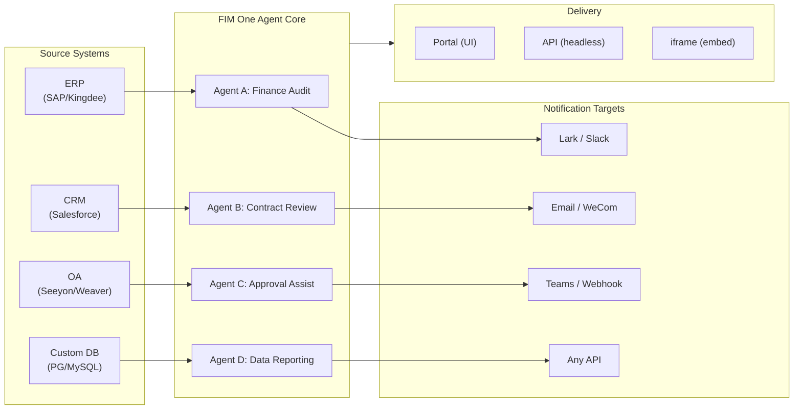

> Goal: Build an **all-in-one agent platform for Global × China enterprises** — delivered through three progressive modes: Standalone (portal assistant), Copilot (embedded in host system), Hub (central cross-system orchestration).
>
> Principles: **Provider-agnostic** (no vendor lock-in), **minimal-abstraction**, **protocol-first**, **connector-first** (integration is the core value).

## 製品ビジョン

FIM Oneは、3つの段階的なデリバリーモードに対応する**オールインワンエージェントプラットフォーム**です。

```
Standalone   → Your own AI assistant (Portal)
Copilot      → AI embedded in a host system (iframe / widget / embed)
Hub          → Central cross-system orchestration (Portal / API)
```

**クロスシステムオーケストレーションが中核的な差別化要因です。** エンタープライズクライアントはレガシーシステム（ERP、CRM、OA、財務、HR）を保有しており、これらをAIを通じて相互に連携させる必要があります。



**GTMパス：ランド・アンド・エクスパンド**

| ステップ | モード | 実行内容 |
|------|------|-------------|
| ランド | Copilot | 1つのシステムに組み込み、そのUIで価値を実証 |
| エクスパンド | Copilot → Hub | より多くのシステムにロールアウト。Hubモードがそれらを統合 |

## 既知の問題

本番環境で再現可能だが、まだ修正されていない追跡中のバグ。各項目は症状、疑わしい影響範囲、および対処方法（ある場合）を示しています。修正がスコープされてスケジュールされると、項目はバージョンセクションに移動します。

- **エージェントエディタが編集なしでも未保存の変更警告を表示する。** `/agents/[id]` を経由して既存のエージェントを開き、すぐに戻るをクリックすると、フィールドに触れていないにもかかわらず「未保存の変更」ダイアログがトリガーされます。ダーティチェックは 20 以上のフィールドを読み込まれたエージェントペイロードと比較するため、状態初期化とダーティ比較の間で 1 つの非対称デフォルトがあれば、ファントムミスマッチを引き起こすのに十分です。現在の疑いは、ネストされた `model_config_json` / notification / approval-routing フィールドの 1 つ、おそらく `undefined` vs `null` vs `""` 正規化からのものです。特に org スコープのエージェントで再現します。対処方法：ダイアログを閉じる（`Discard and leave`）— 実際には何も変更されていないため、データ損失はありません。試みられた修正（`cb40c86a`）はリソースピッカーの関連する孤立バッジフリッカーを削除しましたが、これを解決しませんでした。

- **エージェント編集の保存が `Input should be 'initiator', 'agent_owner' or 'org_members'` で失敗することがある。** Pydantic は `/api/agents/{id}` PUT 境界で `confirmation_approver_scope` フィールドを拒否します。ただし、データベースに保存されているすべての値は 3 つの有効なリテラルの 1 つです。疑い：フロントエンドの `as "initiator" | "agent_owner" | "org_members"` キャストはコンパイル時のみの約束であるため、レガシーまたは予期しないランタイム文字列（テンプレート、インポート、または古いマイグレーションから可能性がある）が `setConfirmationApproverScope` を通過し、そのまま返される可能性があります。対処方法：保存する前に、Approval → Approver Scope ドロップダウンで明示的に値を再選択します。

- **Playground の停止と再試行は、ページ更新で常にクリアされる一時的なビジュアルアーティファクトを表示する。** 3 つの同時レンダーソース — `activeConversation.messages`（DB スナップショット）、SSE `messages` ストリーム、および楽観的な `pendingQuery` プレースホルダー — は単一の派生状態に統合されていないため、「Retry」をクリックしてからペアのアシスタント応答が到着するまでの間に、UI は (a) ストリーム前ウィンドウで同じクエリを 2 回簡潔にレンダリングし、(b) `hasLiveMessages` が true で次のスナップショット再読み込みの前に再試行履歴から以前の孤立したユーザーバブルをドロップし、(c) SSE「done」イベントと次の `selectConversation` 更新の間の狭いウィンドウでフリッカーすることができます。**データは決して失われません** — すべてのユーザーメッセージ（中止された再試行を含む）は `conversation.messages` に永続化され、`normalize_alternating_messages` を経由して次の LLM 呼び出しに持ち込まれ、`48ba08c6` レンダー修正で導入された `HistoryTurn.orphanUserContents` を経由した更新後に正しくレンダリングされます。文脈として、Claude 自身の Web UI は類似のバグクラスを示しています — 応答の途中で停止し、すぐにフォローアップクエリを送信すると、フォローアップが最初のクエリの兄弟編集ブランチとしてフォークされることがあり、新しいターンとして追加されるのではなく — これは楽観的 UI + SSE + 永続化履歴設計における既知の難しい問題であり、FIM One 固有の欠陥ではありません。適切な修正には、3 つのレンダーソースを単一の派生状態に統合する必要があります。より広い Playground ステートマシンリファクタリングまで延期されています。

## バックログ（低優先度） {/* dev: dev/dag-evidence-fidelity.md */}

延期されたハードニング——ブロッキングではなく、マッチするシナリオが表示される場合のみ取り上げます。

- [ ] **DAG エビデンスが独自の切り詰めバジェットを取得**、`DAG_ANALYZER_TRUNCATION` から分離されているため、ソースエビデンスがアナライザー/合成検証の前にサマリーバジェットによって再度クリップされません。
- [ ] **構造認識エビデンス切り詰め**（ヘッド+テール / リストとテーブルを保持）により、長い列挙がキャップによってサイレントに末尾を失う代わりに生き残ります。
- [ ] **ソース忠実性ガイドラインを ReAct フォールバック合成プロンプトに移植**し、合計/重大度の誤ラベルが DAG だけでなく ReAct でも検出されるようにします。

## 出荷済みバージョン

### v0.1 (2026-02-22) — MVP: ReAct + DAG Planner
- ReActAgent（ツール付き：calculator、python_exec、web_search）
- DAG Planner（LLMが依存グラフを生成）
- Portal UI（ストリーミング + KaTeX対応）

### v0.2 (2026-02-24) — マルチモデル + メモリ
- リトライ / レート制限 / 使用状況追跡
- ネイティブ関数呼び出し（JSON のみの解析なし）
- マルチモデルサポート（高速 + メイン LLM）
- メモリ：WindowMemory、SummaryMemory
- SSE ストリーミング対応の FastAPI バックエンド

### v0.3 (2026-02-25) — Web Tools + MCP
- Webツール（web_search、web_fetch）via Jina/Tavily/Brave
- ファイル操作ツール
- MCPクライアント（標準ツール統合）
- ツール自動検出 + カテゴリ
- DAG可視化とクリック・スクロール
- Dockerでのコード実行（`--network=none`）

### v0.4 (2026-02-25) — マルチターン + エージェント
- マルチターン会話 (DbMemory)
- ツールステップ折りたたみUI
- HTTPリクエスト + シェル実行ツール
- エージェント管理 (作成、設定、公開)
- JWT認証
- エージェント別実行モード + 温度制御

### v0.5 (2026-02-28) — フルRAG + グラウンデッド生成
- フルRAGパイプライン（埋め込み + ベクトルストア + FTS + RRF + リランカー）
- グラウンデッド生成（引用、信頼度スコア）
- ナレッジベースドキュメント管理（CRUD、検索、リトライ、スキーママイグレーション）
- ContextGuard + ピン留めメッセージ（トークン予算マネージャー）
- DbMemory永続化 + LLM Compact
- DAG再計画（最大3ラウンド）

### v0.6 (2026-03-01) — Connector Platform
- **Connector CRUD**: create, read, update, delete
- **ConnectorToolAdapter**: converts Connector → BaseTool
- **Per-user credentials**: AES-GCM encryption
- **確認闸門**: write operation approval
- **監査ログ**: all tool calls recorded
- **Circuit breaker**: graceful degradation on failures
- **ユーティリティツール**: email_send, json_transform, template_render, text_utils
- **埋め込みオプション**: Jina, OpenAI, custom providers

### v0.7 (2026-03-06) — Admin Platform + Multi-Tenant
- **Admin Platform**: ユーザー管理、ロール切り替え、パスワードリセット、アカウント有効化/無効化
- **招待制登録**: 3つのモード（開放/招待/無効）+ 招待コードCRUD
- **ストレージ管理**: ユーザーごとのディスク使用量、クリア、孤立ファイルのクリーンアップ
- **会話モデレーション**: 管理者による一覧表示/削除
- **ユーザーごとの強制ログアウト**: すべてのトークンを無効化
- **API ヘルスダッシュボード**: システム統計、コネクタメトリクス
- **初回セットアップウィザード**: ガイド付き管理者アカウント作成
- **Personal Center**: ユーザーごとのグローバル指示、言語設定
- **JWT auth**: トークンベースのSSE認証、会話の所有権
- **Global MCP servers**: 管理者がプロビジョニング、すべてのセッションで読み込み
- **後方互換性**: registration_enabled → registration_mode 自動マイグレーション

### v0.7.x (2026-03-07 to 2026-03-12) — Stability + Refinements
- 招待コード管理
- ユーザーごとのクォータ（429 強制実行）
- 構造化監査ログ
- 機密単語フィルタリング
- 管理者ログイン履歴
- 管理者ファイルブラウザ
- 拡張管理者ビュー（model_name、tools、kb_ids フィールド）
- Docker Compose デプロイメント（単一イメージ、名前付きボリューム）
- OAuth 自動検出（window.location から）
- 拡張思考/推論サポート（`LLM_REASONING_EFFORT`、`LLM_REASONING_BUDGET_TOKENS`）OpenAI o シリーズ、Gemini 2.5+、Claude 対応
- 管理者ツール単位の有効/無効切り替え（無効なツールはチャット実行時に除外）
- MCP サーバー管理を Connectors ページに移動
- デュアルデータベース対応：SQLite（ゼロコンフィグデフォルト）+ PostgreSQL（本番環境）；Docker Compose が自動的に PostgreSQL をプロビジョニング
- モデル設定ドキュメントページ（プロバイダーごとの拡張思考セットアップ）
- SSE Protocol v2：リアルタイム回答ストリーミング（`delta_reasoning`、`usage` フィールド、`done`/`suggestions`/`title`/`end` イベント分割）；SQLite プール サイズ 5 → 20
- AI Builder 拡張：7 つの新しいビルダーツール（GetSettings、TestConnection、ImportOpenAPI（コネクタ用）；ListConnectors、AddConnector、RemoveConnector、SetModel（エージェント用））、エージェントの `is_builder` フラグ、ビルダープロンプト自動更新、SSRF ガード
- SSE v2 フロントエンド：ストリーミングドットパルスカーソル、DAG 再計画ラウンドスナップショット（折りたたみ可能なカード）、DAG レイアウト ステップ状態から分離
- AI Builder コンセプトドキュメントページ（コネクタおよびエージェントビルダーガイド）
- 組織システム：完全な CRUD、ロールベースのメンバーシップ（所有者/管理者/メンバー）、管理者管理 UI
- 3 段階のリソース可視性（個人/組織/グローバル）エージェント、コネクタ、ナレッジベース、MCP サーバー対応
- すべてのリソースタイプの公開/非公開 API；公開エージェントの所有者委譲
- 管理者設定可視性エンドポイント（clone-to-global を置き換え）；統一された `build_visibility_filter()` クエリヘルパー
- データベースコネクタ（フェーズ 1-3）：PG/MySQL/Oracle/SQL Server + 中国レガシー DB への直接 SQL アクセス；スキーマ内省、AI 注釈、読み取り専用クエリ実行、暗号化された認証情報、コネクタごと 3 つのツール（`list_tables`、`describe_table`、`query`）
- **評価センター**：定量的なエージェント品質ベンチマーク — テストデータセット CRUD（プロンプト + 期待される動作 + アサーション）、評価実行（並列実行 + LLM グレーダー + ケースごとの合格/不合格/レイテンシ/トークン結果）、結果ビューア（自動ポーリング）；マイグレーション `r8t0v2x4z567`
- 3 つのモデルロール（General/Fast/Reasoning）ティアごとの環境設定分離；高速モデルはメインモデル設定を継承しない
- `StepOutput` データクラス（プレーンテキストステップ結果を置き換え）構造化データとアーティファクト渡し対応
- DAG 実行用ツールキャッシュ — 実行ごとに同一ツール呼び出しをキャッシュ（非同期ロック スタンピード防止 `DAG_TOOL_CACHE`）
- ステップごとの LLM 検証（失敗時 1 回再試行 `DAG_STEP_VERIFICATION`）
- 自動ルーティング：高速 LLM がクエリを ReAct または DAG に分類；`/api/auto` エンドポイント；フロントエンド 3 方向モード切り替え（`AUTO_ROUTING`）
- [x] ~~**Shadow Market Organization + Resource Subscriptions**~~：ビルト イン Market 組織（シャドウ、自動参加なし）Platform 組織を置き換え；マーケットプレイス閲覧経由でリソース発見、明示的にサブスクライブ（プルモデル）；Market API（共有リソースへのサブスクリプション）；Market への公開は常にレビュー必須；リソースサブスクリプションテーブル；グローバル可視性を置き換える組織ベースのリソース共有
- [x] ~~**Agent Auto-discovery and Sub-agent Binding**~~：エージェントの `discoverable` フラグ；`sub_agent_ids` ホワイトリスト；CallAgentTool（スペシャリストエージェントへのタスク委譲）
- [x] ~~**MCP Server Credentials + Per-User Override**~~：`mcp_server_credentials` テーブル；`PUT /api/mcp-servers/{id}/my-credentials` エンドポイント；認証情報フォールバック動作の `allow_fallback` フラグ
- [x] ~~**Connector/KB Toggle**~~：`POST /api/connectors/{id}/toggle` および `POST /api/knowledge-bases/{id}/toggle`（リソースの一時停止/再開）
- [x] ~~**Standalone KB Conversations**~~：会話の `kb_ids` フィールド（エージェントバインディングなしの直接 KB チャット）

### v0.8 (2026-03-20) — Connector Declarative Config + Progressive Disclosure
- [x] **Database connectors**: direct SQL access (PostgreSQL, MySQL, Oracle) *(shipped in v0.7.x — Phase 1-3)*
- [x] **RBAC**: per-user/role connector access control *(shipped in v0.7.x — org system + three-tier visibility)*
- [x] **Connector credential encryption + per-user override**: `connector_credentials` table, Fernet encryption via `CREDENTIAL_ENCRYPTION_KEY`, `allow_fallback` flag, `GET/PUT/DELETE /my-credentials` endpoints, per-user credential resolution in chat tool loading
- [x] **Publish review UI**: Org-level publish review system — review toggle per org, ReviewsSheet with approve/reject workflow, status badges on resource cards, review notice in publish dialog, resubmit for rejected resources
- [x] **Connector Progressive Disclosure (Phase 1-2)**: single `ConnectorMetaTool` replaces per-action tools; system prompt receives lightweight **stubs** only (name + 1-line description, ~30 tokens/connector vs ~250 tokens/action); agent calls `discover(connector)` to load full action schema on demand — schema only loads when the model selects a connector, keeping the prompt prefix stable for caching. Follows the deferred tool-loading pattern common in modern agent frameworks. `execute` subcommand; feature flag for backward compatibility.
- [x] **Agent Skill System + Compact Instructions**: On-demand skill loading for agent instructions — `Skill` model (name, content/SOP, optional scripts) attached to agents; referenced in system prompt by name only (~10 tokens/skill); agent calls `read_skill(name)` to load full content on demand. Reduces per-conversation instruction token cost by ~80% while allowing richer SOP libraries. Counterpart to ConnectorMetaTool's progressive disclosure applied at the instruction level. Enables the "指令 + 工具 + 技能" differentiation story. Also adds `compact_instructions` field to Agent model — per-agent compression priority list injected into `ContextGuard` when compacting (e.g., "preserve order IDs and amounts, drop raw API responses"), replacing the current static generic prompt. Follows the Compact Instructions convention widely adopted in modern agent frameworks.
- [x] **Connector import/export**: share connector templates
- [x] **Connector fork**: clone + customize existing connectors
- [x] **Workflow Phase 2 Nodes**: Iterator, Loop, VariableAggregator, ParameterExtractor, ListOperation, Transform, DocumentExtractor, QuestionUnderstanding, HumanIntervention — 9 advanced node types with full frontend + backend + 150 new tests (275 total). Node retry with exponential backoff, safe expression evaluation. Stats panel with success rate bar. 12 built-in templates. Pane context menu (Paste, Select All, Fit View, Auto Layout).
- [x] **Workflow Phase 3 Nodes: SubWorkflow + ENV** — 2 new node types (25 nodes total), 14 new tests (306 total), 14 built-in templates. SubWorkflow: full DB-backed nested workflow executor with target workflow selection, variable mapping, and configurable depth limit to prevent infinite recursion. ENV: reads encrypted environment variables with key picker and fallback defaults. Full frontend (node components, config panels, palette entries, minimap colors). Per-node execution statistics panel (success rates, durations, failure counts sorted worst-first). `getNodeStats` API client + `NodeStatEntry` type. Keyboard shortcuts dialog (`?` key).
- [x] **Workflow Scheduled Triggers**: Per-workflow cron configuration with timezone, default inputs, and next-run-at calculation. Preset cron buttons, 30 trigger tests.
- [x] **Workflow API Triggers**: Public per-workflow API keys (`wf_` prefix) for external execution without user auth, with rate limiting. API key management dialog with generate/regenerate/revoke, trigger URL, and cURL/JS examples.
- [x] **Workflow Batch Execution**: `POST /batch-run` with up to 100 input sets, configurable parallelism (1-10), collapsible per-item results, JSON export. 14 batch execution tests.
- [x] **Workflow Execution Log Viewer**: Real-time chronological SSE event stream in the run panel with timestamps, color-coded badges, and event type filter toggles.
- [x] **Workflow Run Stats**: Backend batch-fetches run counts and success rates via GROUP BY subquery; frontend displays stats on workflow cards with color-coded success rate indicators.
- [x] **Workflow Scheduler Daemon**: Background async service polling every 60s for due cron-based workflows. Croniter timezone support, semaphore concurrency, `last_scheduled_at` tracking, webhook delivery. 14 tests.
- [x] **Workflow Import Conflict Resolver**: Detects unresolved agent/connector/KB/MCP references during import. Batch DB queries with visibility filtering, frontend toast warnings. 17 tests.
- [x] **Workflow Test-Node Execution**: Isolated single-node testing with mock variables, integrated into editor (config panel Test button + context menu). 23 tests.
- [x] **Workflow Version Diff**: Side-by-side blueprint comparison with node/edge change detection, color-coded indicators (added/removed/modified).
- [x] **Workflow Run Management**: Delete individual runs (`DELETE /runs/{run_id}`) and clear all completed runs (`DELETE /runs`), with frontend confirmation dialogs.
- [x] **Workflow Run Replay Overlay**: "View on Canvas" button in run history to overlay past execution results on the canvas, showing per-node status and output without re-executing.
- [x] **Workflow Favorites/Pinning**: Star/pin workflows to the top of the list with localStorage persistence.
- [x] **Workflow Run History Export**: Export run history as JSON file download with full run metadata and per-node results.
- [x] **Admin Workflows Management**: Admin panel tab for managing all workflows across users — list, toggle active/inactive, delete with confirmation. Batch endpoints for delete, toggle, and publish with audit logging.
- [x] **Workflow Templates System**: `WorkflowTemplate` ORM model with admin CRUD, public listing/clone API, and 5 seed templates auto-inserted on first startup.
- [x] **Workflow Inline Validation Badges**: Real-time per-node `ValidationBadge` on canvas with error/warning tooltips for immediate visual feedback during editing.
- [x] **Workflow Execution Trace Viewer**: Timeline-based trace viewer Sheet with engine `trace_level` parameter and per-node variable snapshots for step-through debugging.
- [x] **Workflow Rate Limiting and Timeout**: Per-user `WorkflowRateLimiter` (sliding window 10 runs/min, 3 concurrent) and default 10-minute global run timeout.
- [x] **Workflow Blueprint System**: Visual workflow editor for designing and executing multi-step automation blueprints — `Workflow` / `WorkflowRun` ORM models, full CRUD + SSE execution API, import/export, duplicate, blueprint validation endpoint, `WorkflowEngine` with topological sort + semaphore-based concurrency + condition branching and 12 node types (Start, End, LLM, ConditionBranch, QuestionClassifier, Agent, KnowledgeRetrieval, Connector, HTTPRequest, VariableAssign, TemplateTransform, CodeExecution), `VariableStore` with `{{node_id.output}}` interpolation and `env.*` namespace, error strategies per node (STOP_WORKFLOW / CONTINUE / FAIL_BRANCH) with per-node timeout and advanced config UI, React Flow v12 visual editor with drag-and-drop palette + node config panel + variable picker combobox + add-node-on-edge + auto-layout (ELK.js) + run history sheet, Dify-style compact node design with ring-based run status styling and animated edge transitions, 4 built-in starter templates (Simple LLM Chain, Conditional Router, Knowledge-Augmented QA, HTTP API Pipeline) with template picker dialog and `GET /templates` + `POST /from-template` API, stats endpoint, `?run=true` URL param auto-open, subprocess-based code execution security, 105-test suite (templates, eval namespace flattening, blueprint validation warnings, node/edge deletion, import/export/duplicate, deadlock detection, multi-condition branching)
- [x] **Operation audit**: detailed logging of who did what — admin review log audit tab added (publish review trail per org/resource)
- [x] **Semantic Schema Annotations**: extend connector schema fields with `semantic_tag`, `description`, and `pii` flags; annotations surfaced in LLM tool descriptions so the agent understands field intent without guessing from column names

### v0.8.1 (2026-03-29) — プログレッシブディスクロージャー成熟度 + ReAct 強化
- DB コネクタ（`DatabaseMetaTool`）、MCP サーバー（`MCPServerMetaTool`）、オンデマンドツール読み込み（`request_tools` メタツール）のプログレッシブディスクロージャー
- DAG 品質の全面改善（5 つの改善：モデルアップグレード、スキル自動検出、引用検証、構造化コンテンツ保持、ドメイン対応ルーティング）
- ReAct のドメインモデルエスカレーション（専門ドメインが推論モデルに自動エスカレート）
- モデル別ネイティブ関数呼び出しトグル（`tool_choice_enabled`）
- ReAct サイクル検出（決定論的な重複ツール呼び出し防止）
- ReAct 完了チェックリスト（ツール使用時の事前回答検証）
- リソースフォークフェーズ 1（系統追跡付き MCP サーバー + スキルフォークエンドポイント）
- ワークフロー接続依存関係自動サブスクライブ（再帰的なサブワークフロー依存関係解決）
- プリビルトソリューションテンプレート（初回登録時にマーケットにシード済みの 8 つの業種別ソリューション）
- 管理者通知の改善（タイムゾーン対応、マスタースイッチ、SMTP Reply-To）
- ターン別トークン予算サーキットブレーカー（`REACT_MAX_TURN_TOKENS`）
- 一元化されたツール切り詰め、動的システムプロンプト予算配分
- ファイル添付ダウンロード、重複メッセージ送信修正

### v0.8.2 (2026-04-10) — エージェントコア強化 + ビジョンドキュメント
- **エージェントコア フェーズ 0** — コンパクトプロンプトが9セクション構造化フォーマットにアップグレード；空のツール結果保護（`(no output)` の代わりに説明的メッセージ）；アンチループプロンプト + サイクル検出閾値を2に低下；ドメイン分類器 + プリフライトDB設定解決の並列化（リクエストあたり400～1100 ms削減）；SSE `end` イベントが回答直後に送信され、タイトル/提案はバックグラウンドタスクに移動
- **エージェントコア フェーズ 1（コンテキストアンチブロート）** — `MicroCompact` ルールベースの古いツール結果クリーンアップ（最後の6件を保持）；`REACT_TOOL_RESULT_BUDGET=40000` 集計上限；コンテキストオーバーフロー時のリアクティブコンパクト（クラッシュの代わりに自動的に予算の50%にコンパクト化して再試行）
- **エージェントコア フェーズ 2（速度）** — キーワードベースのツールプリセレクション（明らかなマッチでLLM呼び出しをスキップ、200～500 ms削減）；`SharedHttpClient` LLM接続プーリング；200トークン以上の回答では完了チェックをスキップ；`FallbackLLM` がプライマリ+高速をラップし、429/503/529/接続エラーで自動フェイルオーバー
- **インテリジェントドキュメント処理（ビジョン対応）** — 適応的なドキュメント処理：PDFページはビジョン対応モデル（GPT-4o、Claude 3/4、Gemini）用にPyMuPDFで画像としてレンダリング；テキストのみフォールバックはpdfplumberで実行。モデルごとの `supports_vision` フラグ。`DOCUMENT_PROCESSING_MODE`、`DOCUMENT_VISION_DPI`、`DOCUMENT_VISION_MAX_PAGES` 経由のモード。DOCX/PPTXの埋め込み画像抽出。会話ターン全体でのマルチターンビジョン永続化。スマートPDF処理（テキストリッチページはテキスト+画像を抽出；スキャンされたページはフルページPNGとしてレンダリング）。`--network=none` コード実行用の一般的なデータサイエンスパッケージを備えた事前構築サンドボックスイメージ（`Dockerfile.sandbox`）
- **リソースフォーク完了** — エージェント/コネクタ/ワークフロー フォークエンドポイントが追加され、5タイプ系統追跡が完了（KBフォークは削除——本質的にユーザーローカル）
- **ファイル整合性ガードレール** — システムプロンプトルールがエージェントによる無関係なファイルコンテンツの代替を防止（ターゲットファイルが読み取り不可の場合）；アップロードされたファイルにはメッセージコンテキストに `file_id` が含まれ、直接 `read_uploaded_file` アクセスが可能

### v0.8.3 (2026-04-16) — ユニバーサルドキュメント変換 + エージェントコア フェーズ 3
- **ユニバーサルドキュメント変換（`convert_to_markdown` + OCR）** — Microsoft MarkItDownをラップした組み込みエージェントツール。PDF、Word、Excel、PowerPoint、HTML、JSON、CSV、XML、ZIP、EPUB、Outlook .msg、画像、音声、YouTube URLをMarkdownに変換します。`LiteLLMOpenAIShim`は任意のビジョン対応LLM（Claude、Gemini、Bedrock、Azure）経由でOCRを有効化します。ビジョン対応RAG取り込みとゼロリグレッションのテキストのみフォールバック。`LLM_SUPPORTS_VISION` 環境変数でオプトアウト可能
- **エージェントコア フェーズ 3（ランタイム不変性の強化）** — 会話復旧（ぶら下がり`tool_use`の自動修復）；構造化コンパクトワークカード（圧縮ラウンド全体での`WorkCard`型マージ）；ターンレベルプロファイラー（`REACT_TURN_PROFILE_ENABLED`）；ユーザーごとのレート制限（`LLM_RATE_LIMIT_PER_USER`）；`tool_calls`を含む空のコンテンツアシスタントメッセージはドロップされなくなります

### v0.8.4 (2026-04-17) — プロンプトキャッシュ + 推論正確性
- **システムプロンプトセクションレジストリとキャッシュブレークポイント** — メモ化された `PromptRegistry` はシステムプロンプトを安定したプレフィックス + 動的サフィックスに分割します。キャッシュ対応プロバイダー（Claude、Bedrock Anthropic、Vertex Claude）は、プレフィックスで `cache_control: {"type": "ephemeral"}` を受け取り、ターンあたりの入力トークン削減率は約60～80%です。キャッシュ非対応プロバイダーは単一の連結メッセージを取得します（動作変化なし）
- **プロンプトキャッシュの可観測性** — `cache_read_input_tokens` と `cache_creation_input_tokens` は `UsageSummary` → `TurnProfiler` → `done_payload.cache` フィールドを通じて追跡されます。ターンごとに構造化された `turn_cache` ログ行。キャッシュ正当性プローブとしても機能します
- **会話復旧MVP** — 合成 `tool_result` 行は中断されたターン後に永続化されます。`POST /chat/resume` はモノトニックカーソルからキャッシュされたSSEイベントを再生します。フロントエンド `useSseResume` フックは指数バックオフ（300ms → 1s → 3s、最大3回試行）で自動的に再接続し、「再接続中…」インジケーターを表示します
- **シグネチャ付き思考ブロック永続化** — `reasoning_content` + Anthropic `signature` は `metadata_["thinking"]` に永続化され、後続のターンで再生されます。Claude 4マルチターン会話でのHTTP 400シグネチャ不一致を修正します
- **プロバイダー認識推論再生ポリシー** — `core/prompt/reasoning.py` の集中化された `reasoning_replay_policy()` はプロバイダーファミリーごとにシリアル化をゲートします。Claudeは思考ブロックをシグネチャ付きで再生します。DeepSeek-R1/Qwen-QwQ/Gemini-thinking/o-series は送信時に `reasoning_content` をドロップします（以前はリークしており、プロバイダーKVキャッシュを破損し、APIドキュメントに違反していました）

### v0.8.5 (2026-04-23) — Channel Integration + Hook System + Contributor i18n
- **Feishu Channel (Phase 1 subset)** — Org-scoped `Channel` リソースと Fernet 暗号化認証情報; `FeishuChannel` はインタラクティブカード送信 + コールバック（署名検証 + URL チャレンジ）をサポート; Settings → Channels 管理 UI（リスト、ダーティ状態保護付きの作成/編集、コピー可能なコールバック URL を含む詳細、テスト送信）; CRUD API（`/api/channels`）およびイベントコールバックエンドポイント（`/api/channels/{id}/callback`）。2026-04-24 路演向けに早期リリース
- **Agent Hook System（ReAct + DAG ランタイムで稼働中）** — `src/fim_one/core/hooks/` の `PreToolUseHook` / `PostToolUseHook` 抽象化; `model_config_json` で `hooks.class_hooks` を宣言するエージェントは、チャットセッションごとにフックがインスタンス化および登録されます。最初のコンシューマー `FeishuGateHook` は、エージェントが `requires_confirmation=True` ツールを呼び出すときにリンクされた Feishu グループに承認/却下カードをポストし、実行をブロックし、判定に基づいて再開または中止します
- **設定可能な確認ゲート（インラインまたはチャネル）** — すべてのエージェントは承認セクションを取得し、3 つのルーティングモード（自動 / インラインのみ / チャネルのみ）、承認者スコープセレクタ（イニシエータ / オーナー / 組織内の誰でも）、ツール単位のオーバーライド、および明示的な承認チャネルピッカーを備えています。自動モードは、チャネルがリンクされていない場合、インライン承認カードに適切にフォールバックします。`POST /api/confirmations/{id}/respond` は Feishu ウェブフックと単一の決定記録パスを共有します
- **エージェント単位のタスク完了通知** — 長時間実行される ReAct または DAG エージェントは、タスク完了時に組織のチャネルにサマリーカードをプッシュできます。汎用アウトバウンド通知パターンの最初のコンシューマー
- **Hook 承認 Playground** — Channels 詳細シートには「Test Approval Flow」アクションがあり、完全な本番パス（本物の `ConfirmationRequest` 行、実際の Feishu コールバック、ステータス遷移）を実行します——本番フックが使用するのと同じコードパス
- **貢献者向けの i18n CI フォールバック** — `.github/workflows/i18n-sync.yml` は PR マージ後にマスター上で EN → ZH/JA/KO/DE/FR に翻訳し、`[skip ci]` で自動コミットします; 貢献者はもはやローカルで `LLM_API_KEY` を必要としません。プリコミットロケール編集ガードは生成されたロケールファイルへの手動編集を拒否します（正当な翻訳修正のための `ALLOW_LOCALE_EDIT=1` オーバーライド）。スモークテストプッシュで end-to-end 検証済み
- **Exa 統合ドキュメント** — 統合セクションの専用ページで、完全な Exa 検索サーフェス（neural / fast / deep-reasoning / instant）、フィルタリング、コンテンツ取得、および 3 つのチューニング済みプリセットをカバーします
- **Xinchuang (信創) データベースサポート** — Database Connector は PostgreSQL/MySQL と並んで KingbaseES (人大金仓)、HighGo (瀚高)、DM8 (达梦) をリストします。PG 互換ドライバーは `asyncpg` を再利用; DM8 は `dmPython` を使用します。`scripts/test_xinchuang_dbs.py` は CLI からのライブ接続を検証します
- **Channels + Hook System アーキテクチャドキュメント** — `docs/architecture/hook-system.mdx` は 3 つのフックポイントを説明し、FeishuGateHook を end-to-end で説明します; 既存のアーキテクチャページはクロスリンクします; README は Messaging Channels を第一級の機能としてリストします
- **強化** — 重複する Feishu コールバッククリックは二重決定の代わりに置換カードを生成します; 並行コールバッククリックは条件付き `UPDATE ... WHERE status='pending'` 行数チェックで解決されます; 保留中の承認は `CHANNEL_CONFIRMATION_TTL_MINUTES`（デフォルト 24h）の後、バックグラウンドスイーパーを介して自動期限切れになります; Settings → Channels は組織ロールを尊重します（メンバーは読み取り専用 UI を表示）; 並行ツール呼び出しアグリゲータは、すべてのデルタに対して `index=0` を再利用するプロバイダーを処理します; セッション期限切れリダイレクトはクエリ文字列を保持します

### v0.8.6 (2026-05-08) — Stripe Billing + 改善
- [x] Stripe billing MVP — Free + Pro ティア；Checkout、Customer Portal、webhook ライフサイクル；`/settings?tab=billing`；管理者プラン/サブスクリプション CRUD；クォータ強制は各ユーザーのプランを尊重
- [x] 管理者制御の課金機能フラグ — `system_settings.billing_enabled` は Stripe パイプライン全体をゲートするため、Stripe 認証情報のないプライベートデプロイメントは機能しない支払い UX を表示しない
- [x] ユーザーごとの無制限クォータ — 空の場合はグローバルデフォルトを継承、`0` は無制限を付与；以前は両方が同じ状態に折りたたまれていた
- [x] 翻訳用語集を単一の情報源として — `scripts/translation-glossary.md` はロケール別ルールを統合；pre-commit は生成されたロケールファイルへの手動編集を無条件に拒否
- [x] ライセンス + 準拠法を FIM Labs Pte. Ltd.（シンガポール）に移行；SIAC 仲裁は英語；新しいトップレベル `NOTICE` ファイル
- [x] Playground フォローアップ提案を復元、エージェントごとのオプトイン
- [x] 安定性の修正 — 厳密交互プロバイダー履歴、並列ツール呼び出し境界検出、バインドされていないエージェント確認フロー、チャネルロールゲーティング、再試行重複抑制、拒否後の言い換えなし

### v0.8.7 (2026-06-10) — セキュリティ強化 + ガードレール v0 + 請求の正確性
- [x] JWT トークンタイプ制限 — 同じ署名のトークン（一時/リフレッシュ/チケット）が API および SSE エンドポイントを認証できる 2FA バイパスを修正
- [x] OAuth 強化 — メール自動リンクはプロバイダー検証済みメールが必須（アカウント乗っ取り対策）；OAuth リフレッシュトークンはハッシュ化して保存されセッションローテーションが機能
- [x] コンテンツガードレール v0 — 入出力トリップワイヤーレイヤー（`core/agent/guardrail`）；ジェイルブレイク検出器と最大長出力ガードレール搭載、環境変数で設定可能
- [x] `file_ops.apply_patch` — V4A 差分パッチ（ファジー空白マッチング対応、`find_replace` を補完）
- [x] 請求サイクルの正確性 — クォータはサブスクリプション記念日にリセット（カレンダー月ではなく）；更新は Stripe の権限あるルックアップで期間を進める；使用状況表示は強制ウィンドウに合わせる
- [x] 信頼性修正 — 疑似プロトコルツール呼び出しリークを回答から削除；調整可能な HTTP キープアライブで `APIConnectionError` バーストを解消；API キー使用統計は読み取り専用リクエストで永続化
- [x] 請求タブのビジュアルオーバーホール — フルワイド、他の設定タブと統一

### v0.8.8 (2026-06-22) — SSRF強化 + 信頼性と推論の修正
- [x] SSRF強化 — ブロックリストがIPv4マップIPv6（`::ffff:` インスタンスメタデータバイパス）をアンラップ；MCP SSE/Streamable-HTTPサーバーURL は作成時と接続時にSSRF検証
- [x] LLM信頼性 — 共有HTTPプールはLiteLLMクライアントキャッシュ削除後に自己修復；チャットはストリームを即座に送信（履歴はバックグラウンドで折り込み、完全リロードなし）
- [x] Anthropic適応思考プロトコル（Opus 4.6+/Sonnet 4.6/Fable 5対応） — 拡張思考は古い固定予算パラメータが4.7/4.8で400エラーになる場合に機能；OpenAIプロキシ誤ルーティングで警告
- [x] 推論詳細をエンドツーエンドで保持 — 真の最終回答はそのままストリーム配信；圧縮、コンテキスト再構築、サブエージェントステップを経ても保持（ロスレス再合成なし）
- [x] PreToolUse強制フック — エラー時にフェイルクローズ；クラッシュした確認闸門は呼び出しを暗黙的に許可しなくなる；非強制フックは`fail_open`経由でフェイルオープンを維持
- [x] Force-logoutタイムスタンプ比較をUTC変換で正規化 + Docker Compose `POSTGRES_*` 認証情報オーバーライド（出荷時の`fim:fim`デフォルトなし）

# 計画されたバージョン

### v0.9 — 可観測性 + 本番環境対応

**目標**: 本番環境レベルの運用 + 4つの柱で「エージェントが従うかもしれない指示」と「システムが強制する保証」のギャップを埋める — トレースレイヤー（何が起きたかを確認） · フックシステム（必ず実行されるべきことを強制） · エージェントワークスペース（永続ファイル + ハンドオフ） · IMチャネル（エージェントがユーザーの作業場所に存在）。

#### 認証とセキュリティの強化

- [x] ~~JWT トークンタイプの制限（2FA バイパス）+ OAuth アカウント乗っ取りとセッション修正~~ *(v0.8.7 でリリース)*
- [x] ~~PostgreSQL タイムゾーン対応タイムスタンプ~~ *(v0.8.6 でリリース)*
- [x] ~~強制ログアウトのタイムスタンプ比較により、タイムゾーン対応/非対応の値を UTC に正規化——失効したトークンは SQLite と PostgreSQL の両方で確実に拒否される~~ *(v0.8.8 でリリース)*
- [x] ~~Docker Compose PostgreSQL 認証情報は `POSTGRES_*` env で上書き可能（接続文字列に単一ソース化）——公開されたデプロイメントで誤ってデフォルトの `fim:fim` がシップされることはなくなった~~ *(v0.8.8 でリリース)*
- [x] ~~SSRF ブロックリストが IPv4 マップ IPv6 バイパス（`::ffff:` インスタンスメタデータ）を閉じる；MCP SSE/Streamable-HTTP サーバー URL は作成時と接続時に SSRF 検証される~~ *(v0.8.8 でリリース)*
- [x] ~~所有者認証情報フォールバックはオプトイン：コネクタ/MCP サーバーはデフォルトで `allow_fallback` がオフ（既存行は反転）；認証情報がないフォールバックなしリソースはコール時に失敗する代わりにツールセットから非表示になる~~
- [x] ~~リソースアクセスは可視性で統一（自分のもの + 購読済み）：購読済みコネクタ/KB/MCP サーバーはエージェントにバインド可能（「所有していない」403 はなくなった）、ワークフローコネクタステップはランナーのアクセスを適用する代わりに任意のコネクタを ID で実行~~
- [x] ~~Webhook/cron ワークフロー実行は所有者のトークンクォータに計量される——無人の LLM/エージェントステップは事前にゲートされ、その使用量はチャットと同じクォータにカウントされ、無計量の無料 LLM パスを閉じる~~

#### モデル & プロバイダー互換性

- [x] ~~Anthropic adaptive-thinking protocol for Opus 4.6+/Sonnet 4.6/Fable 5 — extended thinking works on models that rejected the old fixed-budget param (400 on 4.7/4.8); warns on OpenAI-proxy misroute~~ *(v0.8.8でリリース)*
- [x] ~~Shared LLM HTTP pool self-heals after a LiteLLM client-cache eviction closes it — calls recreate the pool transparently instead of failing indefinitely until restart~~ *(v0.8.8でリリース)*

#### コネクタ + ツーリング

- [ ] **Connector Progressive Disclosure Phase 3-4** — 統一された `ConnectorExecutor` (API/DB/MCP); `jsonschema` アクション検証; プロトコル非依存の discover/execute
- [ ] **YAML/JSON コネクタ設定** — プラットフォームが MCP サーバーを自動生成
- [ ] **Database connectors Phase 4** — Oracle (`oracledb`)、SQL Server (`aioodbc`)、GBase (`aioodbc` + GBase ODBC)。DM8 / KingbaseES / HighGo は v0.8.5 で提供
- [ ] **MCP Connection Pooling** — STDIO をプール化し、ユーザーごとの環境分離を実現; SSE/HTTP 用に `httpx.AsyncClient` を共有。ウォームスタート ≤100 ms、サーバーあたり O(1) HTTP 接続を目指す
- [x] ~~エージェントが `run_workflow` をプルして、決定論的ワークフローをサブステップとして実行 (静的レシピ ↔ Skill の動的レシピ); 人間がゲートするワークフローはトリガーのみ、実行は監査対象、深さ/再入性ガード~~

#### コンテンツガードレール {/* dev: dev/archive/openai-agents-insights.md */}

- [x] ~~コンテンツガードレール v0 (入力/出力トリップワイヤー、ジェイルブレイク検出器、環境変数設定、`guardrail_tripwired` SSE イベント)~~ *(v0.8.7 でリリース)*
- [ ] オフトピックフィルター (分類器ベースの入力ガードレール) — 正規表現で十分な場合は v0.5 に延期
- [ ] PII リダクター出力ガードレール (正規表現 + 分類器ハイブリッド)
- [ ] エージェント単位のガードレール設定 UI (管理パネル)

#### フック システム {/* dev: dev/hook-system.md */}

- [ ] フックごとの設定パススルー（`{"name": ..., "config": {...}}` スキーマ）
- [ ] `CallAgentTool` + ワークフロー `AGENT` ノードのフック継承（セキュリティデフォルト vs 柔軟性デフォルト）
- [ ] 組み込みフック：`ConnectorCallLog` 自動記録、読み取り専用モードブロック、DB結果切り詰め、コネクタごとのレート制限
- [ ] `SessionStart` フックポイント + ユーザー定義 YAML フック
- [x] ~~PreToolUse 強制フックはエラー時に失敗クローズ — クラッシュした承認ゲートはもはや呼び出しを静かに許可しない；非強制フックは `fail_open` 経由でフェイルオープンを保持~~ *(v0.8.8 でリリース)*
- [x] ~~スケルトン + FeishuGateHook + 承認プレイグラウンド + ReAct/DAG ランタイム~~ *(v0.8.5 でリリース)*

#### IM チャネル統合 {/* dev: dev/im-channels.md */}

- [ ] チャネル: WeCom、Slack、Email、Teams アウトバウンド
- [ ] アウトバウンドパターン: 障害アラート、予算警告、スケジュール済みダイジェスト、エスカレーション、監査レシート、承認エスカレーション
- [ ] フェーズ 2 — インバウンドトリガー (IM グループで @mention エージェント)
- [x] ~~Feishu チャネル (フェーズ 1 サブセット) + タスク完了通知~~ *(v0.8.5 でリリース)*

#### コネクタ認可レイヤー {/* dev: dev/connector-rbac/00-overview.md */}

- [ ] Tier 1 — DBモード（`ConnectorScopeGuard` PreToolUseフック：動詞ブロッキング、テーブル許可/拒否、列の難読化、スコープ述語注入）
- [ ] Tier 2 — Open APIモード（管理UIでユーザーごとの認証情報を要求；キーバインディングヘルスダッシュボード）
- [ ] Tier 3 — ログインチケット交換（フロントエンド/バックエンド分割システム用の`LoginTicketCredential`、ユーザースコープAPIキーなし）
- [ ] クロスティア監査可能性（`ConnectorCallLog`内の`caller_user_id`、`effective_credential_source`、`scope_rules_applied`）

#### Identity Provider Module + Channel Slim-down {/* dev: dev/connector-rbac/07-identity-providers.md */}

- [ ] `identity_providers` + `user_identity_map` モデル — ENV レベルのサードパーティログインに代わる DB レベルの組織ごとの SSO/OAuth 設定
- [ ] Feishu SSO via IdP ("Login with Feishu" は FIM セッション + アップストリームトークンを生成し、Tier-2 のユーザーごとの API キーの摩擦を排除)
- [ ] IdP 経由の組織グラフ同期 (Feishu 部門 → FIM 組織ツリー); WeCom + DingTalk は次
- [ ] Channel は Delivery + Gate にスリム化; ID 機能 (SSO / OrgSync) は IdP のみに存在

#### Public API Phase 2 {/* dev: dev/public-api-phase2.md */}

- [ ] キーごとのレート制限（`X-RateLimit-*` ヘッダー、429）
- [ ] キーごとの使用量クォータ（月間トークン/リクエスト予算）
- [ ] エンドポイントごとのスコープ強制
- [ ] API バージョニング（`/v1/...`）+ 廃止予定ヘッダー
- [ ] Webhook コールバック（キーごと）
- [ ] SDK 生成（Python + TypeScript）
- [ ] Developer Portal（Try-it パネル + キーごとの分析）
- [ ] API キーローテーション（24時間の猶予期間）
- [ ] バッチ / 非同期 API（`POST /api/batch`）
- [ ] 外部依存ごとのサーキットブレーカー

#### 可観測性 {/* dev: dev/agent-trace-layer.md */}

- [ ] **Agent Trace Layer** — Trace/Span モデル、フロントエンドタイムラインビューア、OTel エクスポート（LangSmith スタイルのアプリケーションレベルの run/trace/thread）
- [ ] **Metrics dashboard** — レイテンシ、成功率、トークン使用量、コネクタ分析（エージェント / ユーザー / 組織ごと）

#### エージェント ワークスペース {/* dev: dev/agent-workspace.md */}

- [ ] ツール出力オフロード — >8K レスポンス用の `workspace://` URI と `read/list/write_workspace_file` ツール
- [ ] ハンドオフノート — `write_handoff(summary)` はコンパクション後も保持される
- [ ] ワークスペース UI — 会話ごとのファイルブラウザ、セッション間の保持、ユーザーごとのストレージクォータ
- [ ] セッション間会話リコール — `list_conversations`、`search_conversations`、`read_conversation` ツール

#### プロンプトキャッシュ + 推論フォローアップ {/* dev: dev/prompt-cache-followups.md */}

- [x] ~~推論詳細がエンドツーエンドで保持される — ループがその真の最終回答をストリーミング（ロスレスな再合成なし）；推論がコンパクション、コンテキスト再構築、およびサブエージェントステップを通じて保持される~~ *(v0.8.8で出荷)*
- [ ] Gemini Context Cache Adapter（REST キャッシュライフサイクルと Anthropic インラインマーカーの分離）
- [ ] エージェントごとの `cache_ttl`（一時的な5分対拡張1時間）

#### エージェントループの強化（Claude Codeパターン）

- [x] ~~計画ボード：`update_plan` todoツール＋古い計画の再注入リマインダーにより、長いReAct実行を目標に保ち、圧縮後も継続~~
- [ ] LLM呼び出しの耐性：出力切り詰め継続、429/529バックオフとジッター、連続過負荷モデルフォールバック
- [ ] 大規模なツール結果をワークスペースファイルに永続化し、ヘッド切り詰めの代わりに使用；LLM圧縮前の完全なトランスクリプトスナップショット
- [ ] ReAct内のバックグラウンドツール実行——遅いツールはプレースホルダーを返し、完了時に通知
- [ ] インクリメンタルDAG再計画：再計画ラウンド全体で完了したステップを保持；DAG中盤の再開用にステップ状態を永続化 {/* dev: dev/incremental-dag.md */}

#### エコシステム + スケーリング

- [ ] **スケジュール済みジョブ + イベントトリガー型エージェント** — `scheduled_jobs` + `job_runs` + APScheduler; cron + webhook-inbound。Hub モード用の非同期サブエージェント ユースケース
- [ ] **ワークフロートリガー ID 可観測性** — `ExecutionContext.trigger_source`（`webhook | cron | manual | batch | sub`）が 5 つすべての WorkflowEngine サイトで入力され、実行パネルとコネクタログに表示
- [ ] **ワークフロー単位の `credential_policy` オーバーライド**（`owner` / `caller` / `auto`）— デフォルトの `trigger_source → identity` マッピングをオーバーライド
- [ ] **DB スキーマ高度なビルダー** — 1K～7K+ テーブルデプロイメント用の AI 駆動アノテーション（選択性 + ビジネスコンテキスト推論）
- [ ] サンドボックス強化（v2 コード実行分離）

#### 既に早期にリリース済み

- [x] ~~Circuit breaker、Workflow run retention cleanup、Workflow version diff summaries~~ *(v0.8 / v0.8.1)*
- [x] ~~DAG quality overhaul、Domain model escalation、Per-model NFC toggle~~ *(v0.8.1)*
- [x] ~~DatabaseMetaTool、MCPServerMetaTool、On-demand `request_tools`~~ *(v0.8.1)*
- [x] ~~Workflow Connection Dep Auto-Subscribe、Workflow real executors~~ *(v0.8.1)*
- [x] ~~ReAct Cycle Detection、Completion Checklist~~ *(v0.8.1)*
- [x] ~~Prebuilt Solution Templates（8 vertical bundles）、Resource Fork（MCP/Skill/Agent/Connector/Workflow）~~ *(v0.8.1)*
- [x] ~~Vision document processing（PDF / DOCX / PPTX）、MarkItDown OCR~~ *(v0.8.2 / v0.8.3)*
- [x] ~~Smart File Content Injection + `read_uploaded_file`~~ *(v0.8)*
- [x] ~~Agent Core Phase 3: Conversation Recovery MVP、Compact Work Card、Turn Profiler、Per-user Rate Limiting~~ *(v0.8.3)*
- [x] ~~Conversation resume MVP、System prompt registry + cache、Thinking-block persistence、Reasoning replay policy、Cache observability~~ *(v0.8.4)*

### v1.0 — ホットプラグ + 埋め込み可能

**目標**: ゼロ再起動のコネクタ追加、パッケージエコシステム、埋め込み配信。

- [ ] **コネクタプログレッシブディスクロージャー（フェーズ5）**: **セマンティックガイド付きツール選択**（クエリからのエンティティ抽出 → オントロジーレジストリ検索 → コネクタセット削減；50以上のコネクタデプロイメントで90%以上のトークン削減）；バッチ/ETLコネクタ向けスケールモード；CLIスタイルのユニバーサル`connector <name> <action> <params>`インターフェース
- [ ] **クロスコネクタエンティティアライメント（オントロジーレジストリ）** — *2026-04-21にダウングレード：コア機能ではなくオンデマンドカスタム配信*：共有エンティティタイプ（Customer、Order、Asset）をコネクタ全体のフィールドマッピングで定義；DAGPlannerが自動的にクロスシステムJOINキーを解決；ハードコードされたフィールド名なしでクロスコネクタクエリ（例：「Salesforceの顧客でShopifyで注文した」）を有効化
- [ ] **ホットプラグコネクタ**: OpenAPI仕様をアップロード、AIが設定を生成、5分で稼働（再起動なし）
- [x] ~~**マーケットプレイス再設計フェーズ1 — ソリューション + コンポーネント**~~：2層マーケットモデル（ソリューション：Agent/Skill/Workflow；コンポーネント：Connector/MCPサーバー）；スコープセレクタ（グローバルマーケット / org）；統一サブスクリプションモデル（org自動表示削除）；マーケットスコープからKB削除；既存orgメンバーのサブスクリプションをバックフィルするデータマイグレーション
- [ ] **マーケットパッケージシステム**: マーケットプレイス向けの配布可能なリソースバンドル — タイプごとの「マーケットプレイス」を統一パッケージングレイヤーに置き換え。`fim-package.yaml`マニフェストは以下を宣言：メタデータ（名前、バージョン、説明、作成者、ライセンス、タグ、`min_fim_version`）、エントリポイント（プライマリSkillまたはAgent）、リソースリスト（agents、skills、connectors、KBs、MCPサーバー、workflows）と設定参照、パッケージ間依存関係（semverレンジ）、必要な認証情報（インストール時の収集用コネクタ参照にマッピング）、ユーザー設定可能な変数とデフォルト値。**2つの消費モード**：（1）**install** — すべてのリソースをバッチ作成 + ID置換によって内部参照を自動配線；インストールはソースにリンクされてバージョン更新通知用；`POST /api/market/packages/{id}/install`；（2）**fork** — ユーザー所有の編集可能なコピーとしてクローン、更新リンクなし（これはテンプレートモード）；`POST /api/market/packages/{id}/fork`。追加エンドポイント：公開（`POST /api/market/packages`、レビューワークフロー付き）、アンインストール（`DELETE /packages/{id}/uninstall`、依存関係チェック + 変更されたリソース確認付き）、バージョン履歴（`GET /packages/{id}/versions`）、アップグレード（`POST /packages/{id}/upgrade`、リソースごとの差分プレビュー付き）。ネストされたパッケージ要件の依存関係リゾルバー、競合検出付き。`PackageInstallation`テーブルはユーザーごとのインストール済みパッケージを追跡、アンインストール/アップグレード用のリソースIDマッピング付き。**個別リソース公開と共存** — パッケージは構成レイヤー、置き換えではない；単一のコネクタは依然として単独で公開可能。依存関係ツリーの例：`Package: contract-review` → `Skill: contract-review`（エントリポイント） → `Agent: contract-analyst` + `Agent: risk-scorer` → `KB: legal-clauses` + `Connector: docusign-api` + `MCP: pdf-extractor` + `Workflow: contract-approval-flow`
- [ ] **クリエータープログラム**: マーケットプレイス収益化レイヤー — ポートフォリオページ付きクリエータープロフィール、パッケージごとの分析（インストール、フォーク、アクティブユーザー、評価/レビュー）、パッケージが新規サブスクリプションを促進する際のアフィリエイト手数料追跡。価格設定、購入フロー、承認ワークフロー付きの有料パッケージティア。インストール傾向、収益レポート、ユーザーフィードバック付きのクリエータダッシュボード。CI/CDパッケージ作成者向けのプログラマティックパッケージ公開用パブリッククリエータAPI。コミュニティ機能：パッケージコメント、Q&A、バージョンごとのチェンジログ
- [ ] **埋め込み可能なウィジェット**: ホストページに注入された`<script src="fim-one.js">`
- [ ] **ページコンテキスト注入**: ウィジェットはホストページコンテキスト（現在のID、URL、DOMセレクタ）を読み取り
- [ ] **高度なトリガー**: Webhookインバウンドイベント；スケジュール済みジョブの強化（マルチタイムゾーン、カレンダー対応）
- [ ] **バッチ実行**: DAG経由で1000以上のアイテムを処理
- [ ] **エンタープライズセキュリティ**: IPホワイトリスト、保存時の暗号化、SSO
- [ ] **KB高度なエディタ**: 大規模ナレッジベースを管理するパワーユーザー向けのビルダーモードエージェント — 一括URL取り込み、重複検出、ギャップ分析、ドキュメントライフサイクル管理；既存KBAIチャットをReActツールループで拡張
- [ ] **Stripe Billing（v1 MVP — Proサブスクリプション）**: 無料 + Pro 2層サブスクリプション、月次トークンクォータ付き。Stripe Checkout（ホスト型）+ Customer Portal（セルフサービス）+ Webhookドリブンライフサイクル（`checkout.session.completed` / `customer.subscription.updated|deleted` / `invoice.payment_succeeded|failed`）。クォータ枯渇時のソフトキャップ（HTTP 402 + アップグレードプロンプト）— v1では超過料金なし。ユーザーごとの請求のみ；Org/Teamサブスクリプションはv3に延期。前提条件：
  - [x] ~~**データモデル + SDK基盤**（P1）— `billing_plans` / `subscriptions` / `stripe_webhook_events`テーブル、ORMモデル、Stripe SDKシングルトン、無料 + Proシード~~ *（v0.8.6で出荷）*
  - [x] ~~**バックエンドAPI + Webhookハンドラ**（P2）— `/api/billing/*` + `/api/webhooks/stripe`、署名検証 + べき等性付き；プラン対応クォータ；時間ごとのライフサイクルスイープ~~ *（v0.8.6で出荷）*
  - [x] ~~**フロントエンド請求タブ + 402アップグレードダイアログ**（P3）— `/settings?tab=billing`クォータ表示、アップグレードCTA、`past_due`バナー、ストリーム中の402ダイアログ~~ *（v0.8.6で出荷）*
  - [x] ~~**管理者プラン管理**（P4）— `admin/billing/{plans,subscriptions}` CRUD~~ *（v0.8.6で出荷）*
  - [x] ~~**管理者制御の請求機能フラグ**（P5）— `system_settings.billing_enabled`がStripeパイプラインをゲート；べき等的な有効化は無料+Proをシード、デフォルトプランポインタを設定、ユーザーをバックフィル；有効化後のトグルオン/オフは純粋なフラグフリップ~~ *（v0.8.6で出荷）*
  - [ ] **調整 + e2e + 本番稼働**（P6）— 夜間`subscriptions` ↔ `stripe.Subscription.list()`調整スクリプト、見落とされたWebhook復旧用；フルスタック幸福パス / キャンセル中期 / 過去期限回帰テスト；テストモード`stripe_price_id`からライブ`price_id`に切り替え；ステージングでの実カード使用スモークテスト。

- [ ] **チームプラン（Stripeシート）** — `stripe.Subscription.quantity`経由のシートごとの価格設定、Organization メンバーシップとの統合。企業が1つのチーム全体プランでNシートにサブスクライブできます；クォータと機能フラグは個別ユーザーではなくシートグループを通じて解決されます。v1.0 Stripe MVPと既存のOrganizationモデルに基づいて構築。
- [ ] **非請求デプロイメント向けのグループレベルトークンクォータ** — Stripeなしのエンタープライズ/プライベートデプロイメントは組織レベルのトークン予算を設定します。クォータチェーンは`override > group > plan > default`に拡張；グループ解決は`max(user_quota, group_quota)`を使用するため、個別VIPはチームキャップに制約されません。チームプランと同時にランディングするため、同じプリミティブが請求済みと自己ホスト型の両方のトポロジーに対応します。

**インパクト**: エンタープライズはFIM Oneをゼロからマルチシステムオーケストレーションに数日でデプロイできます。パッケージシステムはクリエータエコシステムを作成 — ソリューション作成者は複合バンドル（Skill + Agents + Connectors + KBs + Workflows）を公開、エンタープライズは1クリックでインストール、クリエータは採用から収益を得ます。インストール/フォーク二重性は「そのまま使用」と「テンプレートからカスタマイズ」の両方のユースケースを単一のメカニズムでカバーします。

## Frozen Features (Shipped, Maintain Only)

[直交戦略](/strategy/orthogonality-strategy)に基づき、以下の機能は出荷済みで動作していますが、新機能は追加されません（バグ修正のみ）：

| Feature | Version | Why frozen |
|---------|---------|-----------|
| ReAct Agent | v0.1, v0.9 | モデルがネイティブツール呼び出し機能を備えるようになった。ループ中の自己反省（v0.9）により、長いチェーンでの目標ドリフトを防止。ツール観察合成品質が向上（8K文字、`REACT_TOOL_OBS_TRUNCATION`で設定可能） |
| DAG Planning / Re-Planning | v0.1, v0.5, v0.7.5 | モデルの推論能力が向上中。分解がシングルショット化。ステップごとの検証がv0.7.5で実装（`DAG_STEP_VERIFICATION`）。強化済み：カスケード障害伝播、検証者ステータス修正、プランナーツール説明、完全なリプラン履歴、ホワイトリストベースのツールキャッシュ。14個のエンジン定数がENV変数として公開——追加の計画プリミティブは予定なし |
| Memory (Window, Summary, Compact) | v0.2, v0.5 | コンテキストウィンドウが拡大（200K+）。外部メモリ管理の必要性が低下 |
| RAG pipeline | v0.5 | プロバイダーがネイティブ検索を構築中（OpenAI file_search、Gemini Search Grounding） |
| Grounded Generation | v0.5 | モデルの引用精度が向上中。5段階パイプラインは効果が減少 |
| ContextGuard / Pinned Messages | v0.5 | 現状のまま出荷。新機能なし |

## 検討中（無期限延期）

直交性戦略に基づき、以下は高い実装コストを伴い、吸収リスクに直面しています：

| 機能 | 延期理由 |
|---------|------------|
| マルチエージェントオーケストレーション（深い階層） | プロバイダーがネイティブに構築中（OpenAI Swarm、Google A2A、類似のマルチエージェントオファリング）。FIM Oneの CallAgentTool は1段階の委譲ケースをカバー；イベントトリガー型バックグラウンドエージェントはv0.9のScheduled Jobsでカバー |
| エージェント自己修正スキル（手続き型メモリ） | 実行中にエージェントが独自の `skill.md` を更新する——高い複雑性、セキュリティ/監査の表面積が大きい。Agent Skill System（v0.8）のリリースが先決。エンタープライズ顧客が自己改善エージェントを明示的にリクエストした場合は再評価 |
| ~~エージェントワークスペース（ツール出力ファイルオフロード）~~ | v0.9に昇格。価値は**選択的読み取り**であり、コンテキスト容量ではない——フレームワーク横断検証で確認済み。元の延期理由（「200K+ウィンドウは緊急性を低減」）は誤り |
| クロスセッション長期メモリ | コンテキストウィンドウが急速に拡大中（200K–2M）；プロバイダーが組み込みメモリを追加中（OpenAI memory、Gemini context caching）；実装コストが高い割に差別化価値が低下。エンタープライズ顧客が明示的にリクエストした場合に再評価 |
| メモリライフサイクル（TTL、クォータ） | クロスセッションメモリに依存；一緒に延期 |
| アクティブコンテキスト圧縮ツール（エージェントトリガー型） | ContextGuard（v0.5）で明示的に凍結。200K+のコンテキストウィンドウは価値を低減。コンテキストコストがエンタープライズの大きな懸念にならない限り再検討しない |
| ブラウザオートメーション / コンピュータユース | 高い保守コスト（DOM変更、アンチボット、サンドボックス）。業界がコンピュータユースモード（Anthropic、OpenAI Operator、Google Mariner）とMCPブラウザツール（Puppeteer/Playwright MCP）に収束中。MCP統合経由で利用、自社構築しない。安定したComputer Use MCPスタンダードが出現した場合に再評価 |
| Web プッシュ通知 | ブラウザネイティブプッシュ（Service Worker + VAPID経由）。IM Channel Integration（v0.8）と重複——エンタープライズ推奨チャネル（Lark/Slack/WeCom/Email）をカバー。IMプッシュはエンタープライズ価値が高い；Web Pushはポータルのみユーザー向けのナイス・トゥ・ハブ。IM Channelリリース後に再評価——ユーザーがIM範囲外のブラウザ通知をリクエストした場合 |
| マルチユーザーワークフロー協調編集 | 同じワークフロー設計図のリアルタイム共同編集（Figma/Notion風）——カーソル認識、競合解決、ノード単位ロック付き。高い実装コスト（CRDT / OT、プレゼンスインフラ）、今日の「1編集者のみ + バージョン差分」モデルに対するエンタープライズ需要が不明確。複数企業が明示的に共有ライブ編集をリクエストした場合に再評価 |
| ノード単位ワークフロー実行権限（実行時RBAC） | 単一ワークフロー実行内の細粒度認可——例えば「ノードXは実行に `finance_approver` ロールが必要」。現在、認可はワークフロー レベル（誰がトリガーできるか）とコネクタレベル（どの認証情報が実行するか）で発生；ノード単位RBACは第3軸を追加し、実装複雑性が大きく、アクティブな顧客リクエストなし |
| クロスオーグ ワークフロー共有（ライブ更新付き） | 別のオーグからワークフローをサブスクライブし、フォークなしで上流更新を受け取る。現在、サブスクライブ = フォーク（スナップショット）なので、上流の破壊的変更は伝播しない。ライブ更新には上流互換スキーマ進化 + 競合解決が必要；保守コストが高い。エンタープライズが「子会社間でのワークフロー共有」をリクエストした場合に再評価 |

## バージョンとモードの対応関係

| バージョン | Standalone | Copilot | Hub | 備考 |
|---------|-----------|---------|-----|-------|
| **v0.1–v0.3** | 動作中 | 未実装 | 未実装 | ポータルのみ、シングルユーザー |
| **v0.4** | 動作中 | 未実装 | 未実装 | マルチ会話、智能体管理 |
| **v0.5** | 動作中 | 未実装 | 未実装 | ナレッジベース + RAG |
| **v0.6** | 動作中 | 可能 | 可能 | 連接器リリース; Copilot/Hubは手動配線で可能 |
| **v0.7** | 動作中 | 準備完了 | 準備完了 | 管理プラットフォーム; マルチテナント認証; 本番環境対応 |
| **v0.8** | 動作中 | 準備完了 | 最適化 | RBAC + システムごとの監査ログ; オンボーディング簡素化 |
| **v0.9** | 動作中 | 準備完了 | 本番環境 | 可観測性、パフォーマンス、セキュリティ強化 |
| **v1.0** | 動作中 | 最適化 | エンタープライズ | パッケージシステム、クリエイタープログラム、ホットプラグ、埋め込み可能ウィジェット、webhook、バッチ処理 |

## Resource Allocation (v0.8–v1.0)

The Orthogonality Strategy shapes where effort goes:

| Category | Allocation | Versions | Why |
|----------|-----------|----------|-----|
| **Connector Platform** (v0.6+) | 50% | Ongoing | Core differentiation; no absorption risk |
| **Enterprise Features** (RBAC, audit, security, observability) | 30% | v0.8–v1.0 | Boring but durable; production requirement. Agent Trace Layer is commercial anchor |
| **Agent Intelligence** (Skill System, scheduled agents) | 15% | v0.8–v0.9 | 指令+工具+技能差別化ストーリー；低い吸収リスク——フレームワークはパターンを検証しますが、エンタープライズSOPは顧客固有です |
| **v0.1–v0.5 maintenance** | 5% | Ongoing | Bug fixes only; no new features |

## メトリック駆動型マイルストーン

成功は以下のメトリクスで測定されます：

| メトリック | v0.7 ターゲット | v0.8 ターゲット | v1.0 ターゲット |
|--------|------------|------------|------------|
| デプロイされたコネクタ | 5 | 20+ | 100+ |
| エンタープライズ顧客 | 1–2 | 5–10 | 20+ |
| 平均コネクタセットアップ時間 | 2週間 | 2日 | 5分（ホットプラグ） |
| トークン効率（DAG vs ReAct のみ） | 30% 削減 | 40% 削減 | 50% 削減 |
| アップタイム SLA | 99.5% | 99.9% | 99.95% |
| サポートチケットテーマ | 統合、セットアップ | コネクタカスタムロジック | ホットプラグ、スケーリング |

## Open Questions / TBD

- **Marketplace moderation**: コミュニティパッケージと個別リソースの検証方法は？パッケージ設定内の認証情報漏洩の自動スキャン？(v1.0)
- **Token economics**: マルチユーザー、マルチエージェントシナリオの価格設定方法は？(v1.0)
- **Package versioning**: インストール済みパッケージの破壊的変更——移行スクリプト付きの自動アップグレード、それとも更新ごとの手動承認？依存関係のダイヤモンド問題の解決？(v1.0)
- **Package pricing**: 無料版と有料版、Creator Programの手数料率、決済プロバイダーの統合？(v1.0)
- **Package credential UX**: インストール時の認証情報収集——ウィザード形式のステップバイステップ、それとも遅延セットアップ？同じコネクタータイプを使用するパッケージ間での認証情報共有？(v1.0)
- **Telemetry opt-out**: プライバシー設定をどのように尊重するか？(v0.8)
- **Connector versioning**: コネクタータイプのAPIの破壊的変更をどのように管理するか？(v0.8)
- **Rate limiting**: ユーザーごとのワークフロー速度制限が実装済み（スライディングウィンドウ 10回/分、3並行）。コネクタータイプごと、エージェントごとの速度制限はTBD (v0.9)
- **Connector authorization tier selection**: 管理者が特定の上流システムに適用されるティアを発見するにはどうするか？自動プローブ（ユーザーごとのAPIキーを試す→ログインチケットにフォールバック→共有DBにフォールバック）対 コネクタースペックでの明示的な宣言？「このコネクタータイプはティア2をサポートしているが、管理者がティア1での運用を選択した」ことをUIで表現し、非技術系管理者を混乱させないようにするには？(v0.9)
- **Integration vs Connector duality**: Feishuバインディングが同時にSSO提供者かつAPI呼び出しサーフェスである場合、設定でどのように表現するか？3つのトグルを持つ1つのオブジェクト、それとも認証情報を共有する3つの個別バインディング？アンインストール意味論への影響（SSOを取り消すとコネクタータイプが削除されるか？）(v0.9)

