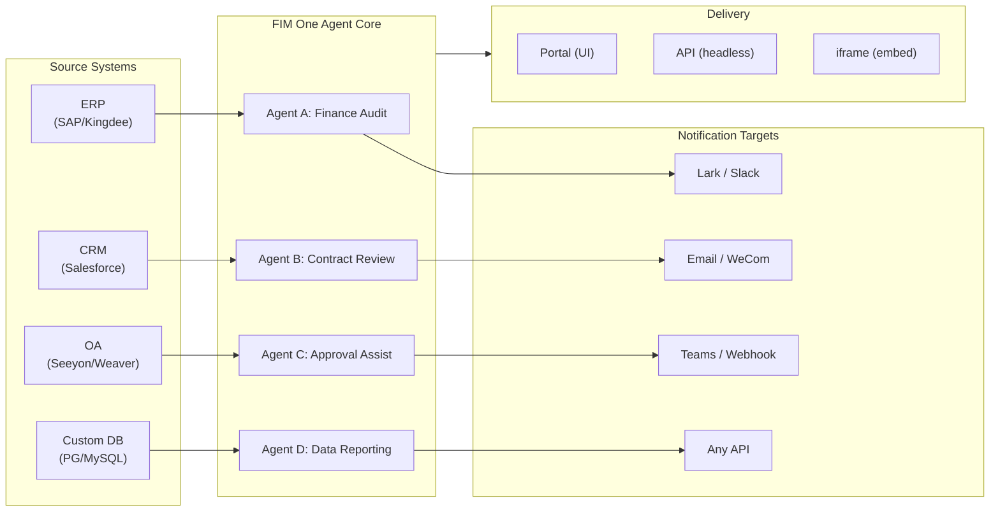

> Goal: Build an **all-in-one agent platform for Global × China enterprises** — delivered through three progressive modes: Standalone (portal assistant), Copilot (embedded in host system), Hub (central cross-system orchestration).
>
> Principles: **Provider-agnostic** (no vendor lock-in), **minimal-abstraction** (最小限の抽象化)、**protocol-first**、**connector-first** (統合がコア価値)。

## プロダクトビジョン

FIM One は、3つの段階的配信モードに対応する**オールインワンエージェントプラットフォーム**です：

```
Standalone   → Your own AI assistant (Portal)
Copilot      → AI embedded in a host system (iframe / widget / embed)
Hub          → Central cross-system orchestration (Portal / API)
```

**クロスシステム統合が核となる差別化要因です。** エンタープライズクライアントはレガシーシステム（ERP、CRM、OA、財務、HR）を保有しており、これらが AI を通じて相互に通信する必要があります：



**GTM パス：ランド・アンド・エキスパンド**

| ステップ | モード | 動作内容 |
|------|------|-------------|
| ランド | Copilot | 1つのシステムに組み込み、ユーザーインターフェース内での価値を実証 |
| エキスパンド | Copilot → Hub | より多くのシステムへの展開；Hub モードはこれらを集約 |

## 既知の問題

本番環境で再現可能だが、まだ修正されていないトラッキング中のバグ。各項目は症状、疑われる影響範囲、および対処法（ある場合）を記載しています。修正がスコープされてスケジュール化されると、項目はバージョンセクションに移動します。

- **エージェントエディタが編集なしで未保存変更警告を表示。** `/agents/[id]` 経由で既存エージェントを開き、すぐに戻るをクリックすると、フィールドに触れていないにもかかわらず「未保存の変更」ダイアログがトリガーされます。ダーティチェックは 20 以上のフィールドをロードされたエージェントペイロードと比較するため、状態初期化とダーティ比較の間の非対称なデフォルトが 1 つあれば、ファントムミスマッチを引き起こすのに十分です。現在の疑いは、ネストされた `model_config_json` / notification / approval-routing フィールドの 1 つで、`undefined` vs `null` vs `""` の正規化から発生している可能性があります。特に組織スコープのエージェントで再現します。対処法：ダイアログを閉じる（`Discard and leave`）— 実際には何も変更されていないため、データ損失はありません。試みた修正（`cb40c86a`）はリソースピッカーの関連する orphan-badge フリッカーを削除しましたが、これを解決しませんでした。

- **エージェント編集の保存が `Input should be 'initiator', 'agent_owner' or 'org_members'` でエラーになることができます。** Pydantic は `/api/agents/{id}` PUT 境界で `confirmation_approver_scope` フィールドを拒否します。ただし、データベースに保存されているすべての値は 3 つの有効なリテラルの 1 つです。疑い：フロントエンドの `as "initiator" | "agent_owner" | "org_members"` キャストはコンパイル時のみの約束であるため、レガシーまたは予期しない実行時文字列（テンプレート、インポート、または古い移行から発生する可能性がある）が `setConfirmationApproverScope` をすり抜け、逐語的にエコーバックされます。対処法：保存する前に、Approval → Approver Scope ドロップダウンで明示的に値を再選択してください。

- **Playground の停止と再試行は、ページ更新で常にクリアされる一時的な視覚的アーティファクトを表示します。** 3 つの並行レンダーソース — `activeConversation.messages`（DB スナップショット）、SSE `messages` ストリーム、および楽観的な `pendingQuery` プレースホルダー — は単一の派生状態に折りたたまれていないため、「Retry」をクリックして、ペアのアシスタント応答が着地するまでの間、UI は（a）プリストリームウィンドウで同じクエリを 2 回簡潔にレンダリングすることができ、（b）`hasLiveMessages` が true で、スナップショットが再ロードされる前に、再試行履歴から以前の orphan ユーザーバブルをドロップし、（c）SSE「done」イベントと次の `selectConversation` 更新の間の狭いウィンドウでフリッカーします。**データは決して失われません** — すべてのユーザーメッセージ（中止された再試行を含む）は `conversation.messages` に永続化され、`normalize_alternating_messages` 経由で次の LLM 呼び出しに実行され、`48ba08c6` レンダー修正で導入された `HistoryTurn.orphanUserContents` 経由で更新後に正しくレンダリングされます。コンテキストについて、Claude 自身のウェブ UI は類似のバグクラスを展示しています — レスポンスの途中で停止して、すぐにフォローアップクエリを送信すると、時々フォローアップが最初のクエリの兄弟編集ブランチとしてフォークされ、新しいターンとして追加されるのではなく — これは楽観的 UI + SSE + 永続化履歴設計の既知の難しい問題であり、FIM One 固有の欠陥ではありません。適切な修正には、3 つのレンダーソースを単一の派生状態に折りたたむことが必要です。より広い Playground ステートマシンリファクタリングまで延期されます。

## 出荷済みバージョン

### v0.1 (2026-02-22) — MVP: ReAct + DAG プランナー
- ツール付きReActAgent（電卓、python_exec、ウェブ検索）
- DAG プランナー（LLMが依存グラフを生成）
- ストリーミング + KaTeX対応のポータルUI

### v0.2 (2026-02-24) — マルチモデル + メモリ
- リトライ / レート制限 / 使用状況追跡
- ネイティブ関数呼び出し（JSON のみの解析なし）
- マルチモデルサポート（高速 + メイン LLM）
- メモリ：WindowMemory、SummaryMemory
- SSE ストリーミング対応の FastAPI バックエンド

### v0.3 (2026-02-25) — Web Tools + MCP
- ウェブツール (web_search、web_fetch) Jina/Tavily/Brave経由
- ファイル操作ツール
- MCP クライアント (標準ツール統合)
- ツール自動検出 + カテゴリ
- クリックしてスクロール可能な DAG ビジュアライゼーション
- Docker でのコード実行 (`--network=none`)

### v0.4 (2026-02-25) — マルチターン + エージェント
- マルチターン会話 (DbMemory)
- ツールステップの折りたたみUI
- HTTPリクエスト + シェル実行ツール
- エージェント管理（作成、構成、公開）
- JWT認証
- エージェントごとの実行モード + 温度制御

### v0.5 (2026-02-28) — Full RAG + Grounded Gen
- フルRAGパイプライン（埋め込み + ベクトルストア + FTS + RRF + リランカー）
- グラウンデッド生成（引用、信頼度スコア）
- ナレッジベースドキュメント管理（CRUD、検索、リトライ、スキーママイグレーション）
- ContextGuard + ピン留めメッセージ（トークン予算マネージャー）
- DbMemory永続化 + LLM Compact
- DAG再計画（最大3ラウンド）

### v0.6 (2026-03-01) — Connector Platform
- **Connector CRUD**: create, read, update, delete
- **ConnectorToolAdapter**: converts Connector → BaseTool
- **Per-user credentials**: AES-GCM encryption
- **Confirmation gate**: 確認闸門
- **Audit logging**: all tool calls recorded
- **Circuit breaker**: graceful degradation on failures
- **Utility tools**: email_send, json_transform, template_render, text_utils
- **Embedding options**: Jina, OpenAI, custom providers

### v0.7 (2026-03-06) — Admin Platform + Multi-Tenant
- **Admin Platform**: ユーザー管理、ロール切り替え、パスワードリセット、アカウント有効化/無効化
- **招待制登録**: 3つのモード（公開/招待/無効）+ 招待コードCRUD
- **ストレージ管理**: ユーザーごとのディスク使用量、クリア、孤立ファイルの削除
- **会話モデレーション**: 管理者による一覧表示/削除
- **ユーザーごとの強制ログアウト**: すべてのトークンを無効化
- **API健全性ダッシュボード**: システム統計、コネクター指標
- **初回セットアップウィザード**: ガイド付き管理者アカウント作成
- **パーソナルセンター**: ユーザーごとのグローバル命令、言語設定
- **JWT認証**: トークンベースのSSE認証、会話の所有権管理
- **グローバルMCPサーバー**: 管理者がプロビジョニング、すべてのセッションで読み込み
- **後方互換性**: registration_enabled → registration_mode自動マイグレーション

### v0.7.x (2026-03-07 to 2026-03-12) — 安定性 + 改善
- 招待コード管理
- ユーザーごとのクォータ（429 実行）
- 構造化監査ログ
- 機密ワードフィルタリング
- 管理者ログイン履歴
- 管理者ファイルブラウザ
- 拡張管理者ビュー（model_name、tools、kb_ids フィールド）
- Docker Compose デプロイメント（単一イメージ、名前付きボリューム）
- OAuth 自動検出（window.location から）
- 拡張推論 / 推論サポート（OpenAI o-series、Gemini 2.5+、Claude 向け `LLM_REASONING_EFFORT`、`LLM_REASONING_BUDGET_TOKENS`）
- 管理者ツール単位の有効/無効切り替え（無効なツールはチャット実行時に除外）
- MCP サーバー管理が Connectors ページに移動
- デュアルデータベース対応：SQLite（ゼロコンフィグデフォルト）+ PostgreSQL（本番環境）；Docker Compose は PostgreSQL を自動プロビジョニング
- モデル構成ドキュメントページ（プロバイダーごとの拡張推論セットアップ付き）
- SSE Protocol v2：リアルタイム回答ストリーミング（`delta_reasoning`、`usage` フィールド、`done`/`suggestions`/`title`/`end` イベント分割）；SQLite プール サイズ 5 -> 20
- AI Builder 拡張：7 つの新しいビルダーツール（コネクター向け GetSettings、TestConnection、ImportOpenAPI；エージェント向け ListConnectors、AddConnector、RemoveConnector、SetModel）、エージェント上の `is_builder` フラグ、ビルダープロンプト自動更新、SSRF ガード
- SSE v2 フロントエンド：ストリーミングドット パルスカーソル、DAG 再計画ラウンドスナップショット（折りたたみ可能カード）、DAG レイアウトをステップ状態から分離
- AI Builder コンセプトドキュメントページ（コネクターとエージェントビルダーガイド付き）
- 組織システム：完全 CRUD、ロールベースメンバーシップ（所有者/管理者/メンバー）、管理者管理 UI
- 3 層リソース可視性（個人/組織/グローバル）：エージェント、コネクター、ナレッジベース、MCP サーバー
- すべてのリソースタイプ向け Publish/Unpublish API；公開エージェントの所有者委譲
- 管理者設定可視性エンドポイント（clone-to-global を置き換える）；統一 `build_visibility_filter()` クエリヘルパー
- データベースコネクター（Phase 1-3）：PG/MySQL/Oracle/SQL Server + 中国レガシーDB へのダイレクト SQL アクセス；スキーマイントロスペクション、AI 注釈、読み取り専用クエリ実行、暗号化認証情報、コネクターごと 3 つのツール（`list_tables`、`describe_table`、`query`）
- **評価センター**：定量的なエージェント品質ベンチマーク — テストデータセット CRUD（プロンプト + 期待される動作 + アサーション）、評価実行（並列実行 + LLM グレーダー + ケース単位の成功/失敗/レイテンシ/トークン結果）、自動ポーリング付き結果ビューアー；マイグレーション `r8t0v2x4z567`
- 3 つのモデル役割（General/Fast/Reasoning）：ティアごとの env 構成分離；高速モデルはメインモデル設定を継承しない
- `StepOutput` データクラス：プレーンな文字列ステップ結果を置き換え、構造化データとアーティファクト受け渡しに対応
- DAG 実行用ツールキャッシュ — 実行ごとに同一ツール呼び出しをキャッシュ、非同期ロック スタンペード防止（`DAG_TOOL_CACHE`）
- ステップごとの LLM 検証：失敗時に 1 回再試行（`DAG_STEP_VERIFICATION`）
- 自動ルーティング：高速 LLM がクエリを ReAct または DAG に分類；`/api/auto` エンドポイント；フロントエンド 3 方向モード切り替え（`AUTO_ROUTING`）
- [x] ~~**シャドウマーケット組織 + リソースサブスクリプション**~~：組み込みマーケット org（シャドウ、自動参加なし）が Platform org を置き換え；マーケットプレイス閲覧とリソースへの明示的なサブスクリプション経由でリソース発見（プルモデル）；共有リソースへのサブスクリプション用 Market API；Market への公開は常にレビュー必須；リソースサブスクリプションテーブル；グローバル可視性に代わる組織ベースのリソース共有
- [x] ~~**エージェント自動検出とサブエージェントバインディング**~~：エージェント上の `discoverable` フラグ；`sub_agent_ids` ホワイトリスト；specialist エージェントへのタスク委譲用 CallAgentTool
- [x] ~~**MCP サーバー認証情報 + ユーザーごとのオーバーライド**~~：`mcp_server_credentials` テーブル；`PUT /api/mcp-servers/{id}/my-credentials` エンドポイント；認証情報フォールバック動作用 `allow_fallback` フラグ
- [x] ~~**コネクター/KB トグル**~~：`POST /api/connectors/{id}/toggle` と `POST /api/knowledge-bases/{id}/toggle`（リソースの一時停止/再開）
- [x] ~~**スタンドアロン KB 会話**~~：エージェントバインディングなしで直接 KB チャット用の会話上 `kb_ids` フィールド

### v0.8 (2026-03-20) — Connector Declarative Config + Progressive Disclosure
- [x] **Database connectors**: direct SQL access (PostgreSQL, MySQL, Oracle) *(shipped in v0.7.x — Phase 1-3)*
- [x] **RBAC**: per-user/role connector access control *(shipped in v0.7.x — org system + three-tier visibility)*
- [x] **Connector credential encryption + per-user override**: `connector_credentials` table, Fernet encryption via `CREDENTIAL_ENCRYPTION_KEY`, `allow_fallback` flag, `GET/PUT/DELETE /my-credentials` endpoints, per-user credential resolution in chat tool loading
- [x] **Publish review UI**: Org-level publish review system — review toggle per org, ReviewsSheet with approve/reject workflow, status badges on resource cards, review notice in publish dialog, resubmit for rejected resources
- [x] **Connector Progressive Disclosure (Phase 1-2)**: single `ConnectorMetaTool` replaces per-action tools; system prompt receives lightweight **stubs** only (name + 1-line description, ~30 tokens/connector vs ~250 tokens/action); agent calls `discover(connector)` to load full action schema on demand — schema only loads when the model selects a connector, keeping the prompt prefix stable for caching. Follows the deferred tool-loading pattern common in modern agent frameworks. `execute` subcommand; feature flag for backward compatibility.
- [x] **Agent Skill System + Compact Instructions**: On-demand skill loading for agent instructions — `Skill` model (name, content/SOP, optional scripts) attached to agents; referenced in system prompt by name only (~10 tokens/skill); agent calls `read_skill(name)` to load full content on demand. Reduces per-conversation instruction token cost by ~80% while allowing richer SOP libraries. Counterpart to ConnectorMetaTool's progressive disclosure applied at the instruction level. Enables the "指令 + 工具 + 技能" differentiation story. Also adds `compact_instructions` field to Agent model — per-agent compression priority list injected into `ContextGuard` when compacting (e.g., "preserve order IDs and amounts, drop raw API responses"), replacing the current static generic prompt. Follows the Compact Instructions convention widely adopted in modern agent frameworks.
- [x] **Connector import/export**: share connector templates
- [x] **Connector fork**: clone + customize existing connectors
- [x] **Workflow Phase 2 Nodes**: Iterator, Loop, VariableAggregator, ParameterExtractor, ListOperation, Transform, DocumentExtractor, QuestionUnderstanding, HumanIntervention — 9 advanced node types with full frontend + backend + 150 new tests (275 total). Node retry with exponential backoff, safe expression evaluation. Stats panel with success rate bar. 12 built-in templates. Pane context menu (Paste, Select All, Fit View, Auto Layout).
- [x] **Workflow Phase 3 Nodes: SubWorkflow + ENV** — 2 new node types (25 nodes total), 14 new tests (306 total), 14 built-in templates. SubWorkflow: full DB-backed nested workflow executor with target workflow selection, variable mapping, and configurable depth limit to prevent infinite recursion. ENV: reads encrypted environment variables with key picker and fallback defaults. Full frontend (node components, config panels, palette entries, minimap colors). Per-node execution statistics panel (success rates, durations, failure counts sorted worst-first). `getNodeStats` API client + `NodeStatEntry` type. Keyboard shortcuts dialog (`?` key).
- [x] **Workflow Scheduled Triggers**: Per-workflow cron configuration with timezone, default inputs, and next-run-at calculation. Preset cron buttons, 30 trigger tests.
- [x] **Workflow API Triggers**: Public per-workflow API keys (`wf_` prefix) for external execution without user auth, with rate limiting. API key management dialog with generate/regenerate/revoke, trigger URL, and cURL/JS examples.
- [x] **Workflow Batch Execution**: `POST /batch-run` with up to 100 input sets, configurable parallelism (1-10), collapsible per-item results, JSON export. 14 batch execution tests.
- [x] **Workflow Execution Log Viewer**: Real-time chronological SSE event stream in the run panel with timestamps, color-coded badges, and event type filter toggles.
- [x] **Workflow Run Stats**: Backend batch-fetches run counts and success rates via GROUP BY subquery; frontend displays stats on workflow cards with color-coded success rate indicators.
- [x] **Workflow Scheduler Daemon**: Background async service polling every 60s for due cron-based workflows. Croniter timezone support, semaphore concurrency, `last_scheduled_at` tracking, webhook delivery. 14 tests.
- [x] **Workflow Import Conflict Resolver**: Detects unresolved agent/connector/KB/MCP references during import. Batch DB queries with visibility filtering, frontend toast warnings. 17 tests.
- [x] **Workflow Test-Node Execution**: Isolated single-node testing with mock variables, integrated into editor (config panel Test button + context menu). 23 tests.
- [x] **Workflow Version Diff**: Side-by-side blueprint comparison with node/edge change detection, color-coded indicators (added/removed/modified).
- [x] **Workflow Run Management**: Delete individual runs (`DELETE /runs/{run_id}`) and clear all completed runs (`DELETE /runs`), with frontend confirmation dialogs.
- [x] **Workflow Run Replay Overlay**: "View on Canvas" button in run history to overlay past execution results on the canvas, showing per-node status and output without re-executing.
- [x] **Workflow Favorites/Pinning**: Star/pin workflows to the top of the list with localStorage persistence.
- [x] **Workflow Run History Export**: Export run history as JSON file download with full run metadata and per-node results.
- [x] **Admin Workflows Management**: Admin panel tab for managing all workflows across users — list, toggle active/inactive, delete with confirmation. Batch endpoints for delete, toggle, and publish with audit logging.
- [x] **Workflow Templates System**: `WorkflowTemplate` ORM model with admin CRUD, public listing/clone API, and 5 seed templates auto-inserted on first startup.
- [x] **Workflow Inline Validation Badges**: Real-time per-node `ValidationBadge` on canvas with error/warning tooltips for immediate visual feedback during editing.
- [x] **Workflow Execution Trace Viewer**: Timeline-based trace viewer Sheet with engine `trace_level` parameter and per-node variable snapshots for step-through debugging.
- [x] **Workflow Rate Limiting and Timeout**: Per-user `WorkflowRateLimiter` (sliding window 10 runs/min, 3 concurrent) and default 10-minute global run timeout.
- [x] **Workflow Blueprint System**: Visual workflow editor for designing and executing multi-step automation blueprints — `Workflow` / `WorkflowRun` ORM models, full CRUD + SSE execution API, import/export, duplicate, blueprint validation endpoint, `WorkflowEngine` with topological sort + semaphore-based concurrency + condition branching and 12 node types (Start, End, LLM, ConditionBranch, QuestionClassifier, Agent, KnowledgeRetrieval, Connector, HTTPRequest, VariableAssign, TemplateTransform, CodeExecution), `VariableStore` with `{{node_id.output}}` interpolation and `env.*` namespace, error strategies per node (STOP_WORKFLOW / CONTINUE / FAIL_BRANCH) with per-node timeout and advanced config UI, React Flow v12 visual editor with drag-and-drop palette + node config panel + variable picker combobox + add-node-on-edge + auto-layout (ELK.js) + run history sheet, Dify-style compact node design with ring-based run status styling and animated edge transitions, 4 built-in starter templates (Simple LLM Chain, Conditional Router, Knowledge-Augmented QA, HTTP API Pipeline) with template picker dialog and `GET /templates` + `POST /from-template` API, stats endpoint, `?run=true` URL param auto-open, subprocess-based code execution security, 105-test suite (templates, eval namespace flattening, blueprint validation warnings, node/edge deletion, import/export/duplicate, deadlock detection, multi-condition branching)
- [x] **Operation audit**: detailed logging of who did what — admin review log audit tab added (publish review trail per org/resource)
- [x] **Semantic Schema Annotations**: extend connector schema fields with `semantic_tag`, `description`, and `pii` flags; annotations surfaced in LLM tool descriptions so the agent understands field intent without guessing from column names

### v0.8.1 (2026-03-29) — プログレッシブディスクロージャー成熟度 + ReAct強化
- DB コネクタ（`DatabaseMetaTool`）、MCP サーバー（`MCPServerMetaTool`）、オンデマンドツール読み込み（`request_tools` メタツール）のプログレッシブディスクロージャー
- DAG 品質全面改善（5 つの改善：モデルアップグレード、スキル自動検出、引用検証、構造化コンテンツ保持、ドメイン対応ルーティング）
- ReAct でのドメインモデルエスカレーション（スペシャリストドメインが推論モデルに自動エスカレート）
- モデル別ネイティブ関数呼び出しトグル（`tool_choice_enabled`）
- ReAct サイクル検出（決定論的な重複ツール呼び出し防止）
- ReAct 完了チェックリスト（ツール使用時の事前回答検証）
- リソースフォークフェーズ 1（系統追跡付き MCP サーバー + スキルフォークエンドポイント）
- ワークフロー接続依存関係自動サブスクライブ（再帰的なサブワークフロー依存関係解決）
- プリビルトソリューションテンプレート（初回登録時にマーケットにシードされた 8 つの業種別ソリューション）
- 管理者通知改善（タイムゾーン対応、マスタースイッチ、SMTP Reply-To）
- ターンごとのトークン予算サーキットブレーカー（`REACT_MAX_TURN_TOKENS`）
- 集中化されたツール切り詰め、動的システムプロンプト予算配分
- ファイル添付ダウンロード、重複メッセージ送信修正

### v0.8.2 (2026-04-10) — エージェントコア強化 + ビジョンドキュメント
- **エージェントコア フェーズ 0** — コンパクトプロンプトが9セクション構造化フォーマットにアップグレード。空のツール結果保護（`(no output)`の代わりに説明的メッセージ）。アンチループプロンプト + サイクル検出閾値を2に低下（リクエストあたり400～1100msを節約）。ドメイン分類器 + プリフライトDB設定解析を並列化。SSE `end`イベントを回答直後に送信、タイトル/提案はバックグラウンドタスクに移動
- **エージェントコア フェーズ 1（コンテキストアンチブロート）** — `MicroCompact`ルールベースの古いツール結果クリーンアップ（最後の6件を保持）。`REACT_TOOL_RESULT_BUDGET=40000`集計キャップ。コンテキストオーバーフロー時にリアクティブコンパクト（予算の50%に自動コンパクトしてリトライ。クラッシュの代わり）
- **エージェントコア フェーズ 2（スピード）** — キーワードベースのツール事前選択（明白なマッチでLLM呼び出しをスキップ。200～500ms節約）。`SharedHttpClient` LLM接続プーリング。200トークン以上の回答では完了チェックをスキップ。`FallbackLLM`が429/503/529/接続エラーで自動フェイルオーバーする主要+高速ラッパー
- **インテリジェントドキュメント処理（ビジョン対応）** — 適応的なドキュメント処理：ビジョン対応モデル（GPT-4o、Claude 3/4、Gemini）用にPyMuPDFで画像としてPDFページをレンダリング。pdfplumberによるテキストのみフォールバック。モデル別`supports_vision`フラグ。`DOCUMENT_PROCESSING_MODE`、`DOCUMENT_VISION_DPI`、`DOCUMENT_VISION_MAX_PAGES`経由のモード。DOCX/PPTXの埋め込み画像抽出。会話ターン間でのマルチターンビジョン永続化。スマートPDF処理（テキスト豊富なページはテキスト+画像を抽出。スキャンされたページは全ページPNGでレンダリング）。プリビルトサンドボックスイメージ（`Dockerfile.sandbox`）。`--network=none`コード実行用の一般的なデータサイエンスパッケージ
- **リソースフォーク完成** — エージェント/コネクタ/ワークフローフォークエンドポイント追加。5種類系統追跡を完成（KB フォークは削除——本来的にはユーザーローカル）
- **ファイル整合性ガードレール** — システムプロンプトルールはターゲットファイルが読み取り不可の場合、エージェントが無関係なファイルコンテンツを置換することを防止。アップロードされたファイルはメッセージコンテキストに`file_id`を含めるようになり、直接の`read_uploaded_file`アクセスが可能

# v0.8.3 (2026-04-16) — 汎用ドキュメント変換 + Agent Core Phase 3
- **汎用ドキュメント変換（`convert_to_markdown` + OCR）** — Microsoft MarkItDownをラップした組み込みAgentツール。PDF、Word、Excel、PowerPoint、HTML、JSON、CSV、XML、ZIP、EPUB、Outlook .msg、画像、音声、YouTubeのURLをMarkdownに変換します。`LiteLLMOpenAIShim`は、任意のビジョン対応LLM（Claude、Gemini、Bedrock、Azure）を経由したOCRを有効にします。テキスト専用フォールバックで回帰なしのビジョン対応RAGインジェスション。`LLM_SUPPORTS_VISION` 環境変数でオプトアウト可能
- **Agent Core Phase 3（ランタイム不変性強化）** — 会話復旧（ダングリング`tool_use`自動修復）；構造化コンパクトワークカード（圧縮ラウンド全体で型付けマージされた`WorkCard`）；ターンレベルプロファイラ（`REACT_TURN_PROFILE_ENABLED`）；ユーザーごとのレート制限（`LLM_RATE_LIMIT_PER_USER`）；`tool_calls`を含む空のコンテンツアシスタントメッセージはドロップされなくなりました

### v0.8.4 (2026-04-17) — プロンプトキャッシュ + 推論の正確性
- **システムプロンプトセクションレジストリとキャッシュブレークポイント** — メモ化された `PromptRegistry` はシステムプロンプトを安定したプレフィックス + 動的なサフィックスに分割。キャッシュ対応プロバイダー（Claude、Bedrock Anthropic、Vertex Claude）は、プレフィックスに対して `cache_control: {"type": "ephemeral"}` を受け取り、ターンごとの入力トークン使用量を約60～80%削減。非キャッシュプロバイダーは単一の連結メッセージを取得（動作変更なし）
- **プロンプトキャッシュ可視性** — `cache_read_input_tokens` および `cache_creation_input_tokens` は `UsageSummary` → `TurnProfiler` → `done_payload.cache` フィールドを通じて追跡。ターンごとに構造化された `turn_cache` ログ行。リレーキャッシュの正確性検証としても機能
- **会話復旧MVP** — 合成 `tool_result` 行は中断されたターン後も保持。`POST /chat/resume` はモノトニックカーソルからキャッシュされたSSEイベントを再生。フロントエンド `useSseResume` フックは指数バックオフ（300ms → 1s → 3s、最大3回試行）と「再接続中…」インジケーターで自動再接続
- **シンク記号を持つ思考ブロック永続化** — `reasoning_content` + Anthropic `signature` は `metadata_["thinking"]` に保持され、後続ターンで再生。Claude 4マルチターン会話のHTTP 400シグネチャ不一致を修正
- **プロバイダー対応推論再生ポリシー** — `core/prompt/reasoning.py` の集中化された `reasoning_replay_policy()` はプロバイダーファミリーごとにシリアライゼーションをゲート。Claude は署名付きの思考ブロックを再生。DeepSeek-R1/Qwen-QwQ/Gemini-thinking/o系列はアウトバウンドで `reasoning_content` を削除（以前はリークして、プロバイダーKVキャッシュを破壊し、APIドキュメントに違反していた）

### v0.8.5 (2026-04-23) — Channel Integration + Hook System + Contributor i18n
- **Feishu Channel (Phase 1 subset)** — Org-scoped `Channel` リソースとFernet暗号化認証情報; `FeishuChannel` はインタラクティブカード送信 + コールバック（署名検証 + URLチャレンジ）をサポート; Settings → Channels管理UI（一覧、作成/編集（ダーティ状態保護付き）、コールバックURL コピー可能な詳細、テスト送信）; CRUD API（`/api/channels`）とイベントコールバックエンドポイント（`/api/channels/{id}/callback`）。2026-04-24ロードショーのために早期出荷
- **Agent Hook System（ReAct + DAGランタイムでライブ）** — `src/fim_one/core/hooks/` 内の `PreToolUseHook` / `PostToolUseHook` 抽象化; `model_config_json` で `hooks.class_hooks` を宣言するエージェントは、チャットセッションごとにフックがインスタンス化および登録されます。第1の利用者 `FeishuGateHook` は、エージェントが `requires_confirmation=True` ツールを呼び出すと、リンクされたFeishuグループに承認/却下カードをポストし、実行をブロックし、判定に基づいて再開またはアボートします
- **設定可能な確認ゲート（インラインまたはチャネル）** — すべてのエージェントは、3つのルーティングモード（自動/インラインのみ/チャネルのみ）、承認者スコープセレクタ（イニシエータ/所有者/組織内の誰でも）、ツールごとのオーバーライド、および明示的な承認チャネルピッカーを備えた承認セクションを取得します。自動モードは、チャネルがリンクされていない場合、インラインの承認カードに優雅にフォールバックします。`POST /api/confirmations/{id}/respond` はFeishu webhookとの単一の決定記録パスを共有します
- **エージェントごとのタスク完了通知** — 長時間実行されるReActまたはDAGエージェントは、タスクが完了するとorg のチャネルに概要カードをプッシュできます。一般的なアウトバウンド通知パターンの第1の利用者
- **Hook承認演練場** — Channelsの詳細シートには「Test Approval Flow」アクションがあり、完全なプロダクションパス（本物の `ConfirmationRequest` 行、本物のFeishuコールバック、ステータス遷移）を実行します——本番フックが使用するのと同じコードパスです
- **貢献者フレンドリーなi18n CI フォールバック** — `.github/workflows/i18n-sync.yml` はPRマージ後にマスター上でEN → ZH/JA/KO/DE/FR を翻訳し、`[skip ci]` で自動コミットします; 貢献者はもはやローカルで `LLM_API_KEY` を必要としません。事前コミットロケール編集ガードは、生成されたロケールファイルへの手動編集を拒否します（正当な翻訳修正の場合は `ALLOW_LOCALE_EDIT=1` オーバーライド）。スモークテストプッシュを介したエンドツーエンド検証
- **Exa統合ドキュメント** — 専用Integrationsセクションと、Exa検索表面全体（ニューラル/高速/深い推論/インスタント）、フィルタリング、コンテンツ取得、および3つの調整済みプリセットをカバーする第1級のExaページ
- **信創（Xinchuang）データベースサポート** — Database Connectorは、PostgreSQL/MySQL と並んで KingbaseES（人大金仓）、HighGo（瀚高）、および DM8（达梦）をリストアップします。PG互換ドライバーは `asyncpg` を再利用します; DM8 は `dmPython` を使用します。`scripts/test_xinchuang_dbs.py` はCLIからのライブ接続を検証します
- **Channels + Hook Systemアーキテクチャドキュメント** — `docs/architecture/hook-system.mdx` は3つのフックポイントを説明し、FeishuGateHookエンドツーエンドをウォークスルーします; 既存のアーキテクチャページクロスリンク; README はMessaging Channelsを第1級の機能としてリストアップします
- **強化** — 重複したFeishuコールバッククリックは、ダブル決定の代わりに置換カードを生成します; 同時コールバッククリックは条件付き `UPDATE ... WHERE status='pending'` 行数チェックを介して解決されます; 保留中の承認は `CHANNEL_CONFIRMATION_TTL_MINUTES`（デフォルト24時間）後に バックグラウンドスイーパーを介して自動期限切れになります; Settings → Channels は組織の役割を尊重します（メンバーは読み取り専用UIを表示します）; パラレルツール呼び出し集約器は、すべてのデルタに対して `index=0` を再利用するプロバイダーを処理します; セッション期限切れリダイレクトはクエリ文字列を保持します

### v0.8.6 (2026-05-08) — Stripe 課金 + 改善
- [x] Stripe 課金 MVP — Free + Pro ティア、Checkout、Customer Portal、webhook ライフサイクル、`/settings?tab=billing`、管理者プラン/サブスクリプション CRUD、クォータ実行は各ユーザーのプランを尊重
- [x] 管理者制御の課金機能フラグ — `system_settings.billing_enabled` は Stripe パイプライン全体をゲートするため、Stripe 認証情報を持たないプライベートデプロイメントは機能しない決済 UX を表示しない
- [x] ユーザーあたりの無制限クォータ — 空の場合はグローバルデフォルトを継承、`0` は無制限を付与、以前は両方とも同じ状態に縮小されていた
- [x] 翻訳用語集を単一の情報源として — `scripts/translation-glossary.md` はロケール別ルールを統合、pre-commit は生成されたロケールファイルへの手動編集を無条件に拒否
- [x] ライセンス + 準拠法を FIM Labs Pte. Ltd.（シンガポール）に移行、英語での SIAC 仲裁、新しいトップレベル `NOTICE` ファイル
- [x] Playground フォローアップ提案を復元、エージェントごとのオプトイン
- [x] 安定性修正 — 厳密交替プロバイダ履歴、並列ツール呼び出し境界検出、非境界エージェント確認フロー、チャネルロールゲーティング、再試行重複抑制、拒否後パラフレーズなし

### v0.8.7 (2026-06-10) — セキュリティ強化 + Guardrails v0 + 請求正確性
- [x] JWTトークンタイプ制限 — 同じ署名のトークン（一時/更新/チケット）がAPIおよびSSEエンドポイントを認証できる2FA回避を修正
- [x] OAuth強化 — メール自動リンクはプロバイダー検証済みメールが必須（アカウント乗っ取り修正）；OAuth更新トークンはハッシュ化して保存されてセッションローテーションが機能
- [x] Content guardrails v0 — 入出力トリップワイヤレイヤー（`core/agent/guardrail`）；ジェイルブレイク検出器と最大長出力ガードレールを搭載、環境変数で設定可能
- [x] `file_ops.apply_patch` — ファジー空白マッチング付きV4A差分パッチ、`find_replace`を補完
- [x] 請求サイクル正確性 — クォータはサブスクリプション記念日にリセット（カレンダーMonth ではなく）；更新は権威的なStripe参照を介して期間を進める；使用状況表示は強制ウィンドウに合わせる
- [x] 信頼性修正 — 疑似プロトコルツール呼び出しリーク削除；調整可能なHTTP keep-aliveで`APIConnectionError`バースト終了；API キー使用統計は読み取り専用リクエストで永続化
- [x] 請求タブビジュアルオーバーホール — フルワイド、他の設定タブと一貫性あり

## 計画されたバージョン

### v0.9 — オブザーバビリティ + 本番環境の強化

**目標**: 本番級の運用 + 「エージェントが従う可能性のある指示」と「システムが強制する保証」の間のギャップを埋める4つの柱 — トレースレイヤー（何が起きたかを確認）· フックシステム（必ず実行される内容を強制）· エージェントワークスペース（永続的なファイル + ハンドオフ）· IM通道（エージェントがユーザーの働く場所に存在）。

#### 認証とセキュリティ強化

- [x] ~~JWTトークンタイプの制限（2FAバイパス）+ OAuthアカウント乗っ取りとセッション修正~~ *(v0.8.7で提供)*
- [x] ~~PostgreSQLのタイムゾーン対応タイムスタンプ~~ *(v0.8.6で提供)*

#### コネクタ + ツーリング

- [ ] **コネクタプログレッシブディスクロージャーフェーズ 3-4** — 統合 `ConnectorExecutor`（API/DB/MCP）；`jsonschema` アクション検証；プロトコル非依存の検出/実行
- [ ] **YAML/JSON コネクタ設定** — プラットフォーム自動生成 MCP サーバー
- [ ] **データベースコネクタフェーズ 4** — Oracle（`oracledb`）、SQL Server（`aioodbc`）、GBase（`aioodbc` + GBase ODBC）。DM8 / KingbaseES / HighGo は v0.8.5 で提供
- [ ] **MCP 接続プーリング** — STDIO をユーザーごとの環境分離でプール；SSE/HTTP 用に `httpx.AsyncClient` を共有。目標は ≤100 ms のウォームスタート、サーバーあたり O(1) HTTP 接続

#### コンテンツガードレール {/* dev: dev/openai-agents-insights.md */}

- [x] ~~コンテンツガードレール v0 (入力/出力トリップワイヤー、ジェイルブレイク検出器、環境変数設定、`guardrail_tripwired` SSE イベント)~~ *(v0.8.7で配信済み)*
- [ ] オフトピックフィルター(分類器ベースの入力ガードレール) — 正規表現が十分な場合は v0.5 に延期
- [ ] PII リダクター出力ガードレール(正規表現 + 分類器ハイブリッド)
- [ ] エージェント別ガードレール設定 UI (管理パネル)

#### Hook System {/* dev: dev/hook-system.md */}

- [ ] フック毎の設定パススルー（`{"name": ..., "config": {...}}` スキーマ）
- [ ] DAG `tools_used` 精度（ステップ完了コールバック経由のper-step ReActからの実際のツール名）
- [ ] `CallAgentTool` + Workflow `AGENT` ノード用のフック継承（セキュリティデフォルトと柔軟性デフォルト）
- [ ] 組み込みフック：`ConnectorCallLog` 自動記録、読み取り専用モードブロック、DBresult截断、コネクタ毎のレート制限
- [ ] `SessionStart` フックポイント + ユーザー定義 YAML フック
- [x] ~~Skeleton + FeishuGateHook + Approval Playground + ReAct/DAG runtime~~ *(v0.8.5で配信)*

#### IM チャネル統合 {/* dev: dev/im-channels.md */}

- [ ] チャネル: WeCom、Slack、Email、Teams アウトバウンド
- [ ] アウトバウンドパターン: 失敗アラート、予算警告、スケジュール済みダイジェスト、エスカレーション、監査レシート、承認エスカレーション
- [ ] フェーズ 2 — インバウンドトリガー (IM グループで @mention agent)
- [x] ~~Feishu チャネル (フェーズ 1 サブセット) + タスク完了通知~~ *(v0.8.5 で配信)*

#### コネクタ認可層 {/* dev: dev/connector-rbac/00-overview.md */}

- [ ] Tier 1 — DBモード(`ConnectorScopeGuard` PreToolUseフック: 動詞ブロッキング、テーブル許可/拒否、列の編集、スコープ述語注入)
- [ ] Tier 2 — Open APIモード(管理UIでユーザー毎の認証情報を必須に; キーバインディングヘルスダッシュボード)
- [ ] Tier 3 — ログインチケット交換(`LoginTicketCredential`フロントエンド/バックエンド分割システム向け、ユーザースコープAPIキーなし)
- [ ] クロスティア監査可能性(`caller_user_id`、`effective_credential_source`、`scope_rules_applied`が`ConnectorCallLog`内)

#### Channel → Integration Promotion {/* dev: dev/channel-integration-sso.md */}

- [ ] `ThirdPartyIntegration` モデル — Channel を Delivery + Login + Org-graph-sync サブ機能に昇格
- [ ] Feishu SSO ("Login with Feishu" は FIM セッション + upstream トークンを生成し、Tier-2 のユーザーごとの API キー摩擦を削除)
- [ ] Org graph sync (Feishu 部門 → FIM org ツリー); WeCom + DingTalk 次

#### Public API Phase 2 {/* dev: dev/public-api-phase2.md */}

- [ ] キーごとのレート制限（`X-RateLimit-*` ヘッダー、429）
- [ ] キーごとの使用量クォータ（月次トークン/リクエスト予算）
- [ ] 高QPS キーの使用統計書き込みバッチ処理（プロセスローカルフラッシュオンシャットダウン、正確なカウント、新しい依存関係なし）— 計測されたホットスポットまで延期 {/* dev: dev/public-api-phase2.md */}
- [ ] エンドポイントごとのスコープ強制
- [ ] API バージョニング（`/v1/...`）+ 廃止予定ヘッダー
- [ ] Webhook コールバック（キーごと）
- [ ] SDK 生成（Python + TypeScript）
- [ ] Developer Portal（Try-it パネル + キーごとの分析）
- [ ] API キーローテーション（24時間猶予期間）
- [ ] バッチ / 非同期 API（`POST /api/batch`）
- [ ] 外部依存関係ごとのサーキットブレーカー

#### 可観測性 {/* dev: dev/agent-trace-layer.md */}

- [ ] **Agent Trace Layer** — Trace/Span モデル、フロントエンドタイムラインビューア、OTel エクスポート（LangSmith スタイルのアプリケーションレベルの run/trace/thread）
- [ ] **Metrics ダッシュボード** — レイテンシ、成功率、トークン使用量、コネクタ分析（エージェント別 / ユーザー別 / 組織別）

#### Agent Workspace {/* dev: dev/agent-workspace.md */}

- [ ] Tool Output Offloading — `workspace://` URI による 8K 超のレスポンス + `read/list/write_workspace_file` ツール
- [ ] Handoff Notes — `write_handoff(summary)` がコンパクション後も保持される
- [ ] Workspace UI — 会話ごとのファイルブラウザ、クロスセッション保持、ユーザーごとのストレージクォータ
- [ ] クロスセッション会話回収 — `list_conversations`、`search_conversations`、`read_conversation` ツール

#### プロンプトキャッシュ + 推論フォローアップ {/* dev: dev/prompt-cache-followups.md */}

- [ ] Gemini Context Cache Adapter（REST キャッシュライフサイクルと Anthropic インラインマーカーの分離）
- [ ] プロンプトレジストリの拡張（プランナー / ベリファイア / ドメイン分類器 / コンパクト）
- [ ] エージェント単位の `cache_ttl`（一時的な 5 分 vs 拡張された 1 時間）
- [ ] DAG ステップレベルのチェックポイントテーブル（DAG 途中での再開用）
- [ ] 専用 `tool_call_id` メッセージカラム（スケール時の孤立クエリ検索インデックス）
- [ ] ストリーム中の思考トークン再構築（完全な SSE イベントより細かい再開粒度）
- [ ] API リレーキャッシュ正直性プローブ（管理者がトリガー：リレーが `cache_control` をストリップしているかどうかを検出）

#### 信頼性フォローアップ（Agent Core優先度マトリックス）

- [ ] コンテンツ置換状態の永続化（ストリーミング不変条件 #2：「一度見たら、運命は凍結される」）
- [ ] アタッチメントコンテキストルーター（重複排除、予算集約、ライブネスチェック；Workspaceオフロードと連携）
- [ ] サイドクエリワーカー（メインレート制限予算と競合しないよう、リコール / 分類 / 要約用に専用プール）

#### エコシステム + スケーリング

- [ ] **スケジュール済みジョブ + イベントトリガー型エージェント** — `scheduled_jobs` + `job_runs` + APScheduler; cron + webhook-inbound。Hub モード用の非同期サブエージェントユースケース
- [ ] **ワークフロートリガーアイデンティティ可視化** — `ExecutionContext.trigger_source` (`webhook | cron | manual | batch | sub`) が全5つの WorkflowEngine サイトで設定されます; 実行パネルとコネクタログに表示
- [ ] **ワークフロー単位の `credential_policy` オーバーライド** (`owner` / `caller` / `auto`) — デフォルトの `trigger_source → identity` マッピングをオーバーライド
- [ ] **DB スキーマ高度なビルダー** — 1K～7K+ テーブルデプロイメント向けの AI 駆動アノテーション(選択性 + ビジネスコンテキスト推論)
- [ ] サンドボックス強化(v2 コード実行分離)
- [ ] パフォーマンステスト(並行負荷ベンチマーク)
- [ ] 内部ハーネスベンチマーク(Eval Center 経由でハーネスパラメータ変更を定量化)

#### 已提前交付

- [x] ~~Circuit breaker, Workflow run retention cleanup, Workflow version diff summaries~~ *(v0.8 / v0.8.1)*
- [x] ~~DAG quality overhaul, Domain model escalation, Per-model NFC toggle~~ *(v0.8.1)*
- [x] ~~DatabaseMetaTool, MCPServerMetaTool, On-demand `request_tools`~~ *(v0.8.1)*
- [x] ~~Workflow Connection Dep Auto-Subscribe, Workflow real executors~~ *(v0.8.1)*
- [x] ~~ReAct Cycle Detection, Completion Checklist~~ *(v0.8.1)*
- [x] ~~Prebuilt Solution Templates (8 vertical bundles), Resource Fork (MCP/Skill/Agent/Connector/Workflow)~~ *(v0.8.1)*
- [x] ~~Vision document processing (PDF / DOCX / PPTX), MarkItDown OCR~~ *(v0.8.2 / v0.8.3)*
- [x] ~~Smart File Content Injection + `read_uploaded_file`~~ *(v0.8)*
- [x] ~~Agent Core Phase 3: Conversation Recovery MVP, Compact Work Card, Turn Profiler, Per-user Rate Limiting~~ *(v0.8.3)*
- [x] ~~Conversation resume MVP, System prompt registry + cache, Thinking-block persistence, Reasoning replay policy, Cache observability~~ *(v0.8.4)*

### v1.0 — ホットプラグ + 組み込み可能

**目標**: ノーダウンタイムのコネクター追加、パッケージエコシステム、組み込み配信。

- [ ] **コネクタープログレッシブディスクロージャー (フェーズ 5)**: **セマンティックガイド付きツール選択** (クエリからのエンティティ抽出 → オントロジーレジストリルックアップ → コネクターセット削減; 50+ コネクターデプロイメントで 90%+ トークン削減); バッチ/ETL コネクター向けスケールモード; CLI スタイルの汎用 `connector <name> <action> <params>` インターフェース
- [ ] **クロスコネクターエンティティアライメント (オントロジーレジストリ)**: 共有エンティティタイプ (顧客、注文、資産) を定義し、コネクター間でフィールドマッピングを行う; DAGPlanner が自動的にクロスシステムの JOIN キーを解決; ハードコードされたフィールド名なしでクロスコネクタークエリを有効化 (例: "Salesforce の顧客が Shopify で注文した")
- [ ] **ホットプラグコネクター**: OpenAPI 仕様をアップロード、AI が設定を生成、5分以内にライブ (再起動不要)
- [x] ~~**マーケットプレイス再設計フェーズ 1 — ソリューション + コンポーネント**~~: 二層マーケットモデル (ソリューション: エージェント/スキル/ワークフロー; コンポーネント: コネクター/MCP サーバー); スコープセレクター (グローバルマーケット / 組織); 統合サブスクリプションモデル (組織自動削除); KB をマーケットスコープから削除; データ移行で既存組織メンバーのサブスクリプションをバックフィル
- [ ] **マーケットパッケージシステム**: マーケットプレイス向けの配布可能なリソースバンドル — タイプ別の「マーケットプレイス」を統一パッケージング層に置き換え。`fim-package.yaml` マニフェストは以下を宣言: メタデータ (名前、バージョン、説明、著者、ライセンス、タグ、`min_fim_version`)、エントリーポイント (プライマリスキルまたはエージェント)、リソースリスト (エージェント、スキル、コネクター、KB、MCP サーバー、ワークフロー、設定参照付き)、パッケージ間依存関係 (セムバージョン範囲)、必須認証情報 (インストール時収集用のコネクター参照にマッピング)、デフォルト付きユーザー設定可能変数。**2 つの使用モード**: (1) **インストール** — すべてのリソースをバッチ作成 + ID 置換を介して内部参照を自動配線; インストールはソース更新通知にリンク; `POST /api/market/packages/{id}/install`; (2) **フォーク** — ユーザーが所有する編集可能なコピーとしてクローン、更新リンクなし (これはテンプレートモード); `POST /api/market/packages/{id}/fork`。追加エンドポイント: 公開 (`POST /api/market/packages` レビューワークフロー付き)、アンインストール (`DELETE /packages/{id}/uninstall` 依存関係チェック + 変更リソース確認付き)、バージョン履歴 (`GET /packages/{id}/versions`)、アップグレード (`POST /packages/{id}/upgrade` リソースごとの差分プレビュー付き)。ネストされたパッケージ要件の依存関係リゾルバー、競合検出付き。`PackageInstallation` テーブルはアンインストール/アップグレード用のリソース ID マッピングを使用してユーザーごとのインストール済みパッケージを追跡。**個別リソース公開と共存** — パッケージは構成レイヤーであって置き換えではない; 単一のコネクターは依然として単独で公開可能。依存関係ツリーの例: `Package: contract-review` → `Skill: contract-review` (エントリーポイント) → `Agent: contract-analyst` + `Agent: risk-scorer` → `KB: legal-clauses` + `Connector: docusign-api` + `MCP: pdf-extractor` + `Workflow: contract-approval-flow`
- [ ] **クリエータープログラム**: マーケットプレイス収益化レイヤー — クリエータープロフィール、ポートフォリオページ、パッケージごとの分析 (インストール数、フォーク数、アクティブユーザー数、評価/レビュー)、パッケージが新規サブスクリプションを促す場合のアフィリエイト手数料追跡。料金設定付きの有料パッケージティア、購入フロー、承認ワークフロー。インストール傾向、収益レポート、ユーザーフィードバック付きクリエータースダッシュボード。プログラムパッケージ公開用の公開クリエータ API (パッケージ著者向けの CI/CD)。コミュニティ機能: パッケージコメント、Q&A、バージョンごとのチェンジログ
- [ ] **組み込みウィジェット**: `<script src="fim-one.js">` をホストページに注入
- [ ] **ページコンテキスト注入**: ウィジェットはホストページコンテキスト (現在の ID、URL、DOM セレクター) を読み取る
- [ ] **高度なトリガー**: Webhook インバウンドイベント; スケジュール済みジョブの拡張 (マルチタイムゾーン、カレンダー対応)
- [ ] **バッチ実行**: DAG 経由で 1000+ 項目を処理
- [ ] **エンタープライズセキュリティ**: IP ホワイトリスト、保存時暗号化、SSO
- [ ] **KB 高度なエディタ**: パワーユーザー向けのビルダーモードエージェント — 大規模ナレッジベース管理 (一括 URL 取得、重複検出、ギャップ分析、ドキュメントライフサイクル管理); 既存の KB AI チャットを ReAct ツールループで拡張
- [ ] **Stripe 請求 (v1 MVP — Pro サブスクリプション)**: フリー + Pro 二層サブスクリプション、月次トークンクォータ。Stripe Checkout (ホスト型) + カスタマーポータル (セルフサービス) + webhook 駆動ライフサイクル (`checkout.session.completed` / `customer.subscription.updated|deleted` / `invoice.payment_succeeded|failed`)。クォータ枯渇時のソフトキャップ (HTTP 402 + アップグレードプロンプト) — v1 ではオーバーエッジチャージなし。ユーザーごとの請求のみ; 組織/チーム申請は v3 に延期。前提条件:
  - [x] ~~**データモデル + SDK グラウンドワーク** (P1) — `billing_plans` / `subscriptions` / `stripe_webhook_events` テーブル、ORM モデル、Stripe SDK シングルトン、フリー + Pro シード~~ *(v0.8.6 で出荷)*
  - [x] ~~**バックエンド API + webhook ハンドラー** (P2) — `/api/billing/*` + `/api/webhooks/stripe` シグネチャ検証 + べき等性付き; プラン対応クォータ; 時間ごとのライフサイクルスイープ~~ *(v0.8.6 で出荷)*
  - [x] ~~**フロントエンド請求タブ + 402 アップグレードダイアログ** (P3) — `/settings?tab=billing` クォータ表示、アップグレード CTA、`past_due` バナー、ストリーム中の 402 ダイアログ~~ *(v0.8.6 で出荷)*
  - [x] ~~**管理者プラン管理** (P4) — `admin/billing/{plans,subscriptions}` CRUD~~ *(v0.8.6 で出荷)*
  - [x] ~~**管理者制御請求機能フラグ** (P5) — `system_settings.billing_enabled` が Stripe パイプラインをゲート; べき等的アクティベーション、フリー+Pro をシード、デフォルトプランポインターを設定、ユーザーをバックフィル; 切り替えのオン/オフは純粋フラグフリップ (アクティベーション後)~~ *(v0.8.6 で出荷)*
  - [ ] **調整 + e2e + go-live** (P6) — 夜間 `subscriptions` ↔ `stripe.Subscription.list()` 調整スクリプト (見落とされた webhook リカバリ用); フルスタック幸福パス / キャンセル中期 / past-due リグレッション テスト; テストモード `stripe_price_id` からライブ `price_id` に切り替え; ステージング上の実際のカードでのスモークテスト。

- [ ] **チームプラン (Stripe シート)** — `stripe.Subscription.quantity` 経由のシート単位の価格設定、組織メンバーシップとの統合。企業が N シートを備えた 1 つのチーム全体プランにサブスクライブできます; クォータと機能フラグはユーザー個人ではなくシートグループを通じて解決。v1.0 Stripe MVP と既存の組織モデルの上に構築。
- [ ] **請求なしデプロイメント向けのグループレベルトークンクォータ** — Stripe なしのエンタープライズ/プライベートデプロイメントは組織レベルのトークン予算を設定。クォータチェーンは `override > group > plan > default` に拡張; グループ解決は `max(user_quota, group_quota)` を使用するため、個別の VIP はチームキャップによって制約されません。チームプランと同時に展開し、同じプリミティブが請求済みとセルフホスト型トポロジーの両方に対応。

**インパクト**: エンタープライズは FIM One をゼロからマルチシステムオーケストレーションへ数日で展開します。パッケージシステムはクリエータエコシステムを作成します — ソリューション著者は複合バンドル (スキル + エージェント + コネクター + KB + ワークフロー) を公開、エンタープライズは 1 クリックでインストール、クリエーターは採用から利益を得ます。インストール/フォークの二重性は「そのまま使用」と「テンプレートからカスタマイズ」の両方のユースケースを単一のメカニズムでカバーします。

## Frozen Features (Shipped, Maintain Only)

Per the [Orthogonality Strategy](/strategy/orthogonality-strategy), these features are shipped and working but will not receive new capabilities (bug fixes only):

| Feature | Version | Why frozen |
|---------|---------|-----------|
| ReAct Agent | v0.1, v0.9 | モデルは現在ネイティブなツール呼び出し機能を備えています。ループ中の自己反射（v0.9）は長いチェーンでの目標のずれを防ぎます。ツール観察の統合品質が向上しました（8K文字、`REACT_TOOL_OBS_TRUNCATION`で設定可能）。 |
| DAG Planning / Re-Planning | v0.1, v0.5, v0.7.5 | モデルの推論機能が向上しており、分解が単一ショットになりつつあります。ステップごとの検証がv0.7.5で実装されました（`DAG_STEP_VERIFICATION`）。堅牢化：カスケード障害の伝播、検証器ステータスの修正、プランナーのツール説明、完全な再計画履歴、ホワイトリストベースのツールキャッシュ。14個のエンジン定数が環境変数として公開されており、それ以上の計画プリミティブは予定されていません。 |
| Memory (Window, Summary, Compact) | v0.2, v0.5 | コンテキストウィンドウが増大（200K以上）しており、外部メモリ管理の必要性が低下しています。 |
| RAG pipeline | v0.5 | プロバイダーがネイティブに検索を構築しています（OpenAI file_search、Gemini Search Grounding）。 |
| Grounded Generation | v0.5 | モデルが引用に対して改善されており、5段階パイプラインは収穫逓減の価値となります。 |
| ContextGuard / Pinned Messages | v0.5 | 現状のままで配信；新機能はなし。 |

## 検討中（無期限延期）

直交性戦略に従い、これらは高い実装コストと吸収リスクが伴うため延期中です：

| 機能 | 延期理由 |
|---------|------------|
| マルチエージェントオーケストレーション（深い階層） | プロバイダーがネイティブに構築中（OpenAI Swarm、Google A2A等のマルチエージェント提供）。FIM Oneの CallAgentTool は1段階委譲のユースケースをカバー；イベントトリガー型バックグラウンドエージェントはv0.9の Scheduled Jobs でカバー |
| エージェントの自己修正スキル（手続き的メモリ） | 実行中にエージェントが独自の `skill.md` を更新する機能——実装複雑度が高く、セキュリティ・監査対象が広い。エージェントスキルシステム（v0.8）のリリース後に再評価。エンタープライズ顧客が自己改善エージェントを明示的にリクエストした場合は検討 |
| ~~エージェントワークスペース（ツール出力ファイルオフロード）~~ | v0.9へ昇格。価値は**選択的読み込み**であり、コンテキスト容量ではない——クロスフレームワーク検証で確認。元の延期理由（「200K+ウィンドウで緊急性低減」）は誤り |
| クロスセッション長期メモリ | コンテキストウィンドウが急速に拡大中（200K～2M）；プロバイダーが組み込みメモリを追加中（OpenAI memory、Gemini context caching）；実装コスト高 vs 差別化価値の低減。エンタープライズ顧客が明示的にリクエストした場合に再評価 |
| メモリライフサイクル（TTL、クォータ） | クロスセッションメモリに依存；同時に延期 |
| アクティブコンテキスト圧縮ツール（エージェントトリガー） | ContextGuard（v0.5）で明確に凍結。200K+ のコンテキストウィンドウで価値低減。エンタープライズからのコンテキストコスト不満が主要な課題にならない限り再検討なし |
| ブラウザ自動化 / Computer Use | 高メンテナンスコスト（DOM変更、アンチボット、サンドボックス）。業界が Computer Use モード（Anthropic、OpenAI Operator、Google Mariner）と MCP ブラウザツール（Puppeteer/Playwright MCP）に収束中。MCP統合経由で利用；自社構築は非推奨。安定した Computer Use MCP 標準が出現時に再評価 |
| Web プッシュ通知 | ブラウザネイティブプッシュ（Service Worker + VAPID経由）。IM チャネル統合（v0.8）と機能が重複——エンタープライズ推奨チャネル（Lark/Slack/WeCom/Email）をカバー。IM プッシュの方がエンタープライズ価値高；Web Push は Portal 専用ユーザー向けの nice-to-have。IM チャネルリリース後に再評価——IM カバレッジ外でブラウザ通知のリクエストあれば |
| マルチユーザーワークフロー協調編集 | ワークフロー設計図の同時編集（Figma/Notion スタイル）、カーソル認識、競合解決、ノード単位ロック付き。実装コスト高（CRDT / OT、プレゼンス基盤）、エンタープライズ需要が不明瞭（現在の「一時編集+バージョン diff」モデルと比較）。複数エンタープライズが共有ライブ編集を明示的にリクエストした場合に再評価 |
| ノード単位ワークフロー実行権限（実行時 RBAC） | 単一ワークフロー実行内での細粒度認可——例「ノード X は `finance_approver` ロールの実行を必須」。現在認可はワークフロー段階（実行可能ユーザー）とコネクタ段階（認証情報の実行者）；ノード単位 RBAC は第三軸で材質的複雑度 + アクティブな顧客リクエストなし |
| クロス組織ワークフロー共有（ライブ更新） | 別組織のワークフローをサブスクライブして、上流更新をフォークなしで受信。現在サブスクライブ = フォーク（スナップショット）のため、上流の破壊的変更は伝播なし。ライブ更新には上流互換スキーマ進化 + 競合解決が必須；メンテナンスコスト高。エンタープライズが「子会社間ワークフロー共有」をリクエストした場合に再評価 |

## バージョンがモードとどのように合致するか

| Version | Standalone | Copilot | Hub | Notes |
|---------|-----------|---------|-----|-------|
| **v0.1–v0.3** | Working | Not yet | Not yet | Portal-only, single-user |
| **v0.4** | Working | Not yet | Not yet | Multi-conversation, agent management |
| **v0.5** | Working | Not yet | Not yet | Knowledge base + RAG |
| **v0.6** | Working | Possible | Possible | Connectors ship; Copilot/Hub possible with manual wiring |
| **v0.7** | Working | Ready | Ready | Admin platform; multi-tenant auth; ready for production |
| **v0.8** | Working | Ready | Optimized | RBAC + audit log per-system; easier to onboard |
| **v0.9** | Working | Ready | Production | Observability, performance, hardening |
| **v1.0** | Working | Optimized | Enterprise | Package system, creator program, hot-plug, embeddable widget, webhooks, batch |

## Resource Allocation (v0.8–v1.0)

The Orthogonality Strategy shapes where effort goes:

| Category | Allocation | Versions | Why |
|----------|-----------|----------|-----|
| **Connector Platform** (v0.6+) | 50% | Ongoing | Core differentiation; no absorption risk |
| **Enterprise Features** (RBAC, audit, security, observability) | 30% | v0.8–v1.0 | Boring but durable; production requirement. Agent Trace Layer is commercial anchor |
| **Agent Intelligence** (Skill System, scheduled agents) | 15% | v0.8–v0.9 | 指令+工具+技能 differentiation story; low absorption risk — frameworks validate patterns, but enterprise SOPs are customer-specific |
| **v0.1–v0.5 maintenance** | 5% | Ongoing | Bug fixes only; no new features |

## メトリクス駆動型マイルストーン

成功は以下のメトリクスで測定されます:

| メトリクス | v0.7 目標 | v0.8 目標 | v1.0 目標 |
|--------|------------|------------|------------|
| デプロイされたコネクタ | 5 | 20+ | 100+ |
| エンタープライズ顧客 | 1–2 | 5–10 | 20+ |
| 平均コネクタセットアップ時間 | 2週間 | 2日 | 5分 (ホットプラグ) |
| トークン効率 (DAG vs ReAct のみ) | 30% 削減 | 40% 削減 | 50% 削減 |
| アップタイム SLA | 99.5% | 99.9% | 99.95% |
| サポートチケットテーマ | 統合、セットアップ | コネクタカスタムロジック | ホットプラグ、スケーリング |

## オープンクエスチョン / TBD

- **マーケットプレイスモデレーション**: コミュニティパッケージと個別リソースをどのように検証するか？パッケージ設定の認証情報漏洩を自動スキャンするか？ (v1.0)
- **トークンエコノミクス**: マルチユーザー、マルチエージェントシナリオの価格付けをどうするか？ (v1.0)
- **パッケージバージョン管理**: インストール済みパッケージの破壊的変更——移行スクリプト付きの自動アップグレード、または更新ごとの手動承認？依存関係のダイヤモンド問題の解決？ (v1.0)
- **パッケージ価格設定**: 無料層対有料層、Creator Program の手数料率、決済プロバイダー統合？ (v1.0)
- **パッケージ認証情報 UX**: インストール時の認証情報収集——ウィザード形式のステップバイステップか、後回しのセットアップか？同じコネクタタイプを使用するパッケージ間での認証情報共有？ (v1.0)
- **テレメトリのオプトアウト**: プライバシー設定をどのように尊重するか？ (v0.8)
- **コネクタバージョン管理**: コネクタ API の破壊的変更をどのように管理するか？ (v0.8)
- **レート制限**: ユーザー単位のワークフローレート制限はリリース済み（スライディングウィンドウ：10 runs/分、3 並行）。コネクタ単位およびエージェント単位のレート制限は TBD (v0.9)
- **コネクタ認可層の選択**: 管理者がどのように特定のアップストリームシステムに適用される層を発見するか？自動プローブ（ユーザー API キー試行 → ログインチケットにフォールバック → 共有 DB にフォールバック）対してコネクタ仕様での明示的宣言？「このコネクタは Tier 2 をサポートしているが、管理者が Tier 1 で動作することを選択した」ことを、技術者以外の管理者を混乱させないように UI で表現するにはどうするか？ (v0.9)
- **統合対コネクタの二重性**: Feishu バインディングが同時に SSO プロバイダーと API 呼び出し表面である場合、設定でどのように表示するか？3 つのトグルを持つ 1 つのオブジェクト、それとも認証情報を共有する 3 つの別々のバインディング？アンインストールセマンティクスへの影響（SSO を取り消すとコネクタが削除されるか？） (v0.9)

