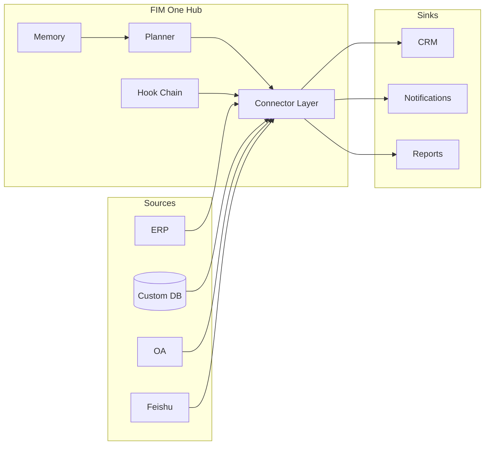

<Frame>
  
</Frame>

<Info>
  **Version 1.0 · April 2026.** このホワイトペーパーは、FIM Oneのアーキテクチャ論、設計原則、およびデプロイメントモデルについて記述しています。
  これはCTO、エンタープライズアーキテクト、AIプラットフォームリード、およびAIが存在する前に構築されたシステムにAIをもたらす方法を評価している技術投資家を対象としています。
</Info>

## Executive Summary

ほとんどのエンタープライズは既に必要なシステムを持っています——ERP、CRM、OA、カスタムデータベース、内部API。足りないのは、ユースケースごとに6ヶ月のインテグレーションプロジェクトなしにAIがそれらのシステムに**到達**する方法です。

既存のアプローチは予測可能な方法で失敗します。ワークフロービルダー（n8n、Zapierスタイル）は、既にシステムに存在するビジネスロジックを複製するよう求めます。汎用エージェント（Manus、AutoGPT）はウェブをブラウズできますが、SAP インスタンスにログインできません。RPAツールは脆弱で、UI変更のたびにドリフトします。垂直AI SaaSは、データをさらに別のサイロに移行することを強制します。

FIM Oneは**Connector Hub**です：プロバイダーに依存しないPythonフレームワークで、AIエージェントが既存システム全体にわたってタスクを動的に計画し実行します。重要な洞察は、難しい問題は推論ではなく——フロンティアLLMがそれを処理します——**アライメント**であることです：AIに安定した、型付けされた、認証された、統治されたサーフェスを与えることで、モデルとの通信を想定していなかったレガシーシステムに対応します。

結果として、1つのエージェントコアが3つの方法で提供されます：

| モード | 配置場所 | 典型的なデプロイメント |
|---|---|---|
| **Standalone** | 独自のポータル | ナレッジQ&A、内部チャット、コードサンドボックス |
| **Copilot** | ホストシステム内に埋め込み | ERPウェブUIの「Finance Copilot」 |
| **Hub** | 中央クロスシステムオーケストレーター | エージェントがERPをクエリし、OAをチェックし、Feishuで通知 |

このペーパーでは、なぜこの形状が正しいのか、アーキテクチャが内部でどのように見えるか、本番環境で安全を保つ方法、そして次にどこに向かうのかを説明します。

## 1. The Problem: Enterprise AI Is an Alignment Problem

2025–2026年の公開AI会話は、機能性が主流となっています：より長いコンテキストウィンドウ、より優れた推論、より安いトークン。企業内では、機能性がボトルネックになることはほとんどありません。ボトルネックは、**AIが実行手段を持たない**ことです。

1万行のコードベースを読んで正しい修正を提案できるLLMでも、それ自体では以下のことができません：

- オンプレミスのSAPインスタンスから昨日の在庫数を取得する。
- レガシーSOAP APIのみを持つSaaS HRツールで休暇申請を承認する。
- OAuth2ではなくログインチケットサービスを認証とする中国市場向けERPに行を書き込む。
- グループの承認ルールを尊重しながら、Feishuグループチャットに通知を送信する。

これらはそれぞれ、一度は解決された統合の問題です。難しいのは、すべての企業が数十のそのようなシステムを持っており、それぞれが独自の認証モデル、データモデル、障害モードを持っていることです。それらを単一のエージェントにハードコーディングすると、脆いモノリスが生じます。LLMに実行時にそれらを発見するよう求めると、幻覚的なAPI呼び出しが生じます。

**不足しているプリミティブは、整列されたサーフェスです。** モデルとシステム間の型付き、認証済み、発見可能なインターフェース——モデルに正確に何ができるか、各アクションのコストは何か、誰がそれを承認する必要があるか、結果がどのようになるかを伝えるもの。そのプリミティブが、FIM Oneが**Connector**と呼ぶものです。

## 2. 既存のアプローチが不十分な理由

### 2.1 ワークフロービルダー（n8n、Zapier、Dify）

ワークフロービルダーは統合をビジュアルグラフとして扱います。ノードをドラッグして接続し、実行します。10ステップのマーケティングオートメーションには適していますが、エンタープライズAIには失敗します。理由は以下の通りです：

- エンコードされたロジックは**すでにターゲットシステム内に存在します**。すべてのノードはAPIコールの薄いラッパーであり、2つの場所で保守する必要があります。
- 人間の設計者が事前に計画を知っていることを前提としています。エンタープライズの質問はオープンエンドです——「APAC地域のすべてのエンティティのQ1を終了する」——計画はその場で生成される必要があります。
- AIを多くのノードの1つとして扱い、どのノードを呼び出すかを決定するプランナーとしては扱いません。

### 2.2 汎用エージェント（Manus、AutoGPT、OpenAI Assistants）

汎用エージェントは、消費者向けおよび知識労働タスク（Webブラウジング、ドキュメント作成、スプレッドシート操作）向けに設計されています。VPNに接続したり、ERPに認証したり、セキュリティレビューに合格することはできません。エンタープライズシステムでラップされると、パイロット段階で終わるデモになってしまいます。

### 2.3 Vertical AI SaaS

Vertical AI ツール（AI ネイティブ CRM、AI ネイティブ財務ツール）は 1 つのワークフローを見事に解決しますが、そこに到達するためにはデータ移行を強制します。企業は結果的により少ないサイロではなく、より多くのサイロを抱えることになり、システム間のオーケストレーションがありません。

### 2.4 RPA

Robotic Process Automation は人間のようにUIを操作します。4つの方法の中で最も汎用的です——人間がクリックできることなら、RPAもクリックできます——しかし同時に最も脆弱です。UIの変更があるたびに動作が壊れ、認証プロンプトが表示されるたびに停止し、CAPTCHAが出現するたびに実行が終了します。これはAPIの欠如に対する一時的な対処法であり、AI構築の基盤ではありません。

FIM One は、これら4つの方法すべてが残す隙間を埋めます。実システムに対する型付きAPI、モデルによる計画、エンタープライズによるガバナンス。

## 3. FIM One の理念

FIM One のあらゆる設計決定を形作る3つの信念があります。

**信念1 — システムはすでに存在する。** エンタープライズに再構築を求めないこと。現状のままで対応する。すべてのコネクタはブリッジであり、置き換えではない。データはソース・オブ・トゥルースを離れることはない。

**信念2 — 能力よりもアライメント。** 調整されたツールセットを備えた弱いモデルは、生のAPIで手探りする強いモデルを上回る。競争優位性はエージェントの推論ではなく、コネクタライブラリとその認証モデルにある。

**信念3 — 動的計画が適切な中間地点。** 厳密なワークフローは実際のエンタープライズタスクには脆すぎる。完全に自律したエージェントは本番環境には予測不可能すぎる。FIM One のエージェントは実行時に計画を立てるが、型付きアクション空間内で行う——すべてのステップはオープンエンドな LLM の独白ではなく、コネクタ呼び出しである。

この3つが組み合わさって、Connector Hub を生み出します。

## 4. アーキテクチャの原則

<CardGroup cols={2}>
  <Card title="プロバイダー非依存" icon="shuffle">
    OpenAI互換のあらゆるLLM——OpenAI、Anthropic、DeepSeek、Qwen、ローカルOllama。モデルの選択はデプロイメント変数であり、アーキテクチャ上のコミットメントではありません。
  </Card>
  <Card title="プロトコルファースト" icon="network-wired">
    すべてのコネクターは型付きスキーマを公開します。智能体はアクション、パラメーター、戻り値の型を認識します——生のHTTPではなく。
  </Card>
  <Card title="デフォルトで非同期" icon="bolt">
    Python非同期全体を通じて。単一の智能体実行は数十のコネクターにファンアウトする可能性があります。ブロッキングI/Oはそれを経済的に不可能にします。
  </Card>
  <Card title="2つの実行エンジン" icon="sitemap">
    探索的タスク向けのReAct、構造化パイプライン向けのDAG。1つの智能体コアがタスクごとにエンジンを選択します。
  </Card>
  <Card title="フック統治" icon="shield-halved">
    すべてのツール呼び出しはフックチェーンを通過します：監査、ポリシー、人間参加型の承認。ガバナンスは事後的なものではありません。
  </Card>
  <Card title="メモリ対応" icon="brain">
    短期会話、長期知識ベース、セッション間メモリはファーストクラスです——後付けではなく。
  </Card>
</CardGroup>

## 5. 3つの配信モード — 1つのエージェントコア

同じプランナー、メモリ、コネクタライブラリが3つの異なるプロダクト形態を支えています。選択はコード分岐ではなく、デプロイメント決定です。

### 5.1 スタンドアロン

自己完結型のポータル。購入者は、キュレーションされたナレッジベース上のチャットインターフェース、またはコードサンドボックス、またはチームのための汎用アシスタントを求めています。ホストシステムは関与しません。

**典型的な用途：** 社内ITヘルプデスク、エンジニアリング生産性、カスタマーサポートナレッジベース。

### 5.2 Copilot

エージェントは既存のホストシステム（ERP ウェブ UI、CRM タブ、カスタム内部ツール）内に iframe、ウィジェット、または直接埋め込みを通じて組み込まれます。ホストシステムは既に認証を処理しており、Copilot はユーザーコンテキストを継承し、ホストのデータに対して動作します。

**典型的な用途：** SAP Fiori 内の Finance Copilot、Salesforce 内の Sales Copilot、内部開発者ポータル内の DevOps Copilot。

### 5.3 Hub

中央オーケストレーションサーフェス。接続されたすべてのシステム（ERP、CRM、OA、Feishu、カスタムデータベース）がHubで終端します。ユーザーはクロスシステムの質問をし、エージェントはシステム全体で計画と実行を行います。

**典型的な用途：** 「すべてのAPAC事業体のQ1をクローズアウトする」、「更新を逃したすべての顧客を見つけてアウトリーチドラフトを作成する」、「昨日の支払いを支払いゲートウェイと台帳間で調整する」。

## 6. コネクタアライメントモデル

コネクタは認証戦略によって支えられた型付きアクションサーフェスです。FIM Oneは、エンタープライズシステムの大多数をカバーする3つの認証層を定義しています。

<AccordionGroup>
  <Accordion title="層1 — データベースコネクタ（フルまたはベーシック）">
    リレーショナルまたはドキュメントデータベースへの直接接続。**フル**モードは任意のSQLをエージェントに公開し、読み取り専用ロールでゲートされます。**ベーシック**モードは事前登録されたパラメータ化クエリのみを公開します。ソースオブトゥルースがあなたが管理するデータベースであるカスタム内部システムに使用されます。
  </Accordion>
  <Accordion title="層2 — OpenAPI コネクタ（ユーザーキー）">
    OpenAPI仕様を持つ任意のREST API。エージェントは仕様を読み取り、適切なエンドポイントを選択し、ログインしているユーザーのキーで呼び出します。モダンSaaS（Slack、Linear、GitHub）およびよく文書化された内部APIをカバーします。
  </Accordion>
  <Accordion title="層3 — ログインチケットコネクタ">
    レガシーシステム向け——特に中国市場で一般的——OAuth2ではなくログインチケットサービスで認証するシステム。コネクタはチケットライフサイクル（取得、更新、無効化）を管理し、通常の型付きサーフェスを上向きに提示します。これは他のベンダーがスキップするシステムをアンロックする層です。
  </Accordion>
</AccordionGroup>

各コネクタはまた**チャネル/統合の二重性**を宣言します。同じ基盤となるシステムは、*チャネル*（通知シンク、承認サーフェス）と*統合*（データソース、アクションターゲット）の両方として表示できます。例えば、Feishuはエージェントの通知チャネルであり、グループチャット履歴のデータソース統合です——1つのコネクタ、2つの役割。

## 7. セキュリティとガバナンス

エンタープライズAIが本番環境で失敗するのは、モデルが間違っているからではなく、組織がそれが正しいことを証明できないからです。FIM Oneはガバナンスをアーキテクチャとして扱います。

**フック チェーン。** すべてのツール呼び出しは、実行前に設定可能なフック チェーンを通過します。フックはログ記録、機密情報の削除、レート制限、人間による承認の要求、または完全なブロックを行うことができます。承認はインライン（同じチャット）またはアウト オブ バンド（許可リストのメンバーが誰でも承認または拒否できるFeishuグループ）で行うことができます。

**ポリシーはデータであり、コードではありません。** フック設定はソースではなくデータベース行に存在します。コンプライアンス担当者は、再デプロイすることなく「ツールXは平日の9時から17時の間にグループYによる承認が必要」を変更できます。

**すべてが可観測です。** すべてのエージェント実行は構造化されたトレースを出力します：計画、ツール呼び出し、引数、観察、承認、最終的な回答。トレースは監査の単位です。

**失敗は明示的です。** オペレータがツール呼び出しを拒否すると、エージェントは停止します——リクエストを言い換えて再試行することはありません。拒否はポリシー決定であり、回復すべきエラーではありません。

## 8. デプロイメントとコストモデル

FIM Oneは寛容なライセンスの下でオープンソースです。3つのデプロイメント形態がカバーしています。

<CardGroup cols={3}>
  <Card title="Self-Host" icon="server">
    Docker ComposeまたはKubernetesをあなたのVPC内で実行。あなたのLLMキー、あなたのデータ、あなたの監査ログ。規制業界とオンプレミスエンタープライズに最適です。
  </Card>
  <Card title="Managed Cloud" icon="cloud">
    cloud.fim.ai — セットアップ不要、従量課金。最速で価値を実現。組織の境界で厳密に分離されたマルチテナント。
  </Card>
  <Card title="Hybrid" icon="bridge">
    マネージドコントロールプレーン、自己ホストコネクタワーカー。データと認証情報はオンプレミスに保持。プランナーとUIは当社が実行します。
  </Card>
</CardGroup>

支配的なコストはインフラストラクチャではなくLLMトークンです。FIM Oneがプロバイダに依存しないのはまさにこの理由で、このコストは市場変数です。フロンティアが価格を下げるにつれて、移行することなく恩恵を受けます。

## 9. このプロダクトの位置づけ

短期的なロードマップは3つの軸に焦点を当てています。

**コネクタの深掘り** — 中国市場向けのTier-3レガシーコネクタ（Xinchuang準拠のデータベース、ログインチケットERP）の追加、およびOpenAPI仕様またはデータベーススキーマのスクリーンショットから数分で動作するコネクタを生成するAI Builderの実装。

**エージェント品質** — より厳密な評価フレームワーク、公開Eval Center、および最新のエージェントCLIにインスパイアされたスキル/フック（Hub形式に適応）。

**エンタープライズ対応** — デフォルトのSSO、より豊富なRBAC、マルチ組織の分離、およびSOC 2とISO 27001のコンプライアンス体制。

長期的な見通しとしては、エンタープライズAIの形態はCLIよりもHubに似たものになると考えています。ナレッジワーカーは10個のAIアシスタントをインストールするのではなく、自社のHubに問い合わせ、Hubが答えを保持するあらゆるシステムにアクセスする方法を知っています。FIM Oneはこのハブを構築しています。

## 10. 付録 — 技術詳細

- **[System Overview](/architecture/system-overview)** — コンポーネントレベルのアーキテクチャ図。
- **[Connector Architecture](/architecture/connector-architecture)** — コネクタの契約、ライフサイクル、および拡張モデル。
- **[Design Philosophy](/architecture/design-philosophy)** — 各コア設計判断の理由。
- **[Hook System](/architecture/hook-system)** — ポリシー、承認、監査の詳細。
- **[Quickstart](/quickstart)** — FIM One をノートパソコンで 10 分以内に実行します。

<Tip>
  ご質問、ご指摘、商用のお問い合わせ: hi@fim.ai · [Discord](https://discord.gg/z64czxdC7z) · [GitHub](https://github.com/fim-ai/fim-one)
</Tip>
