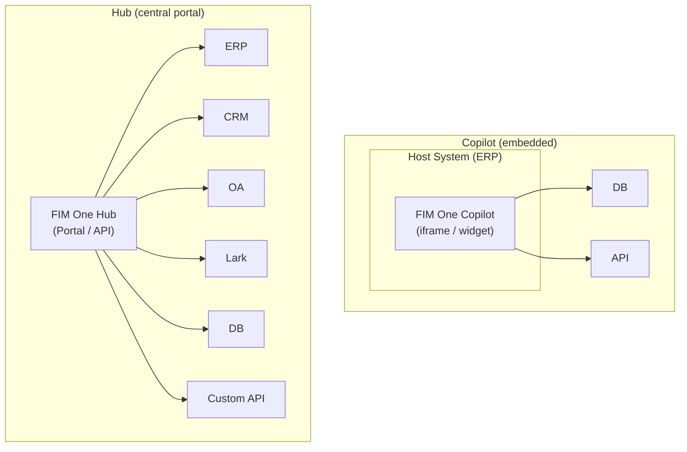
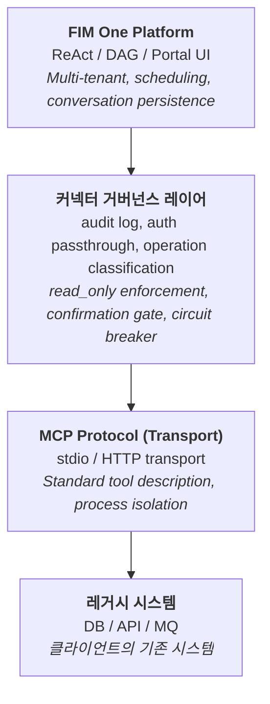
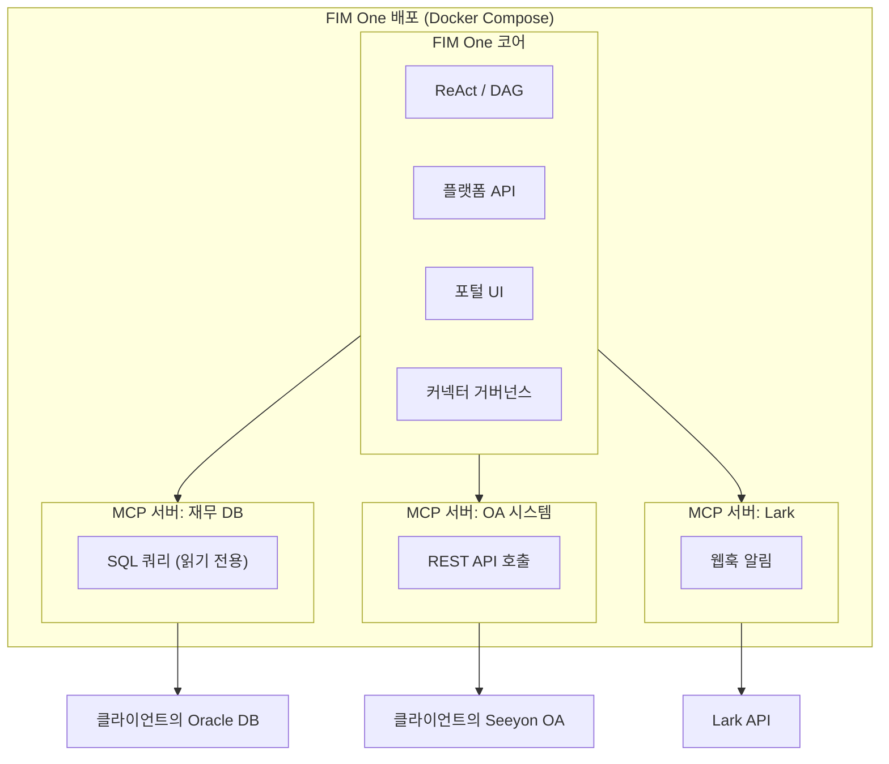
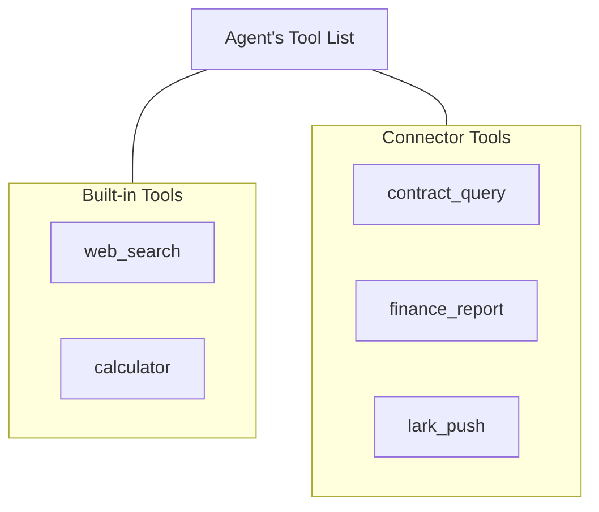
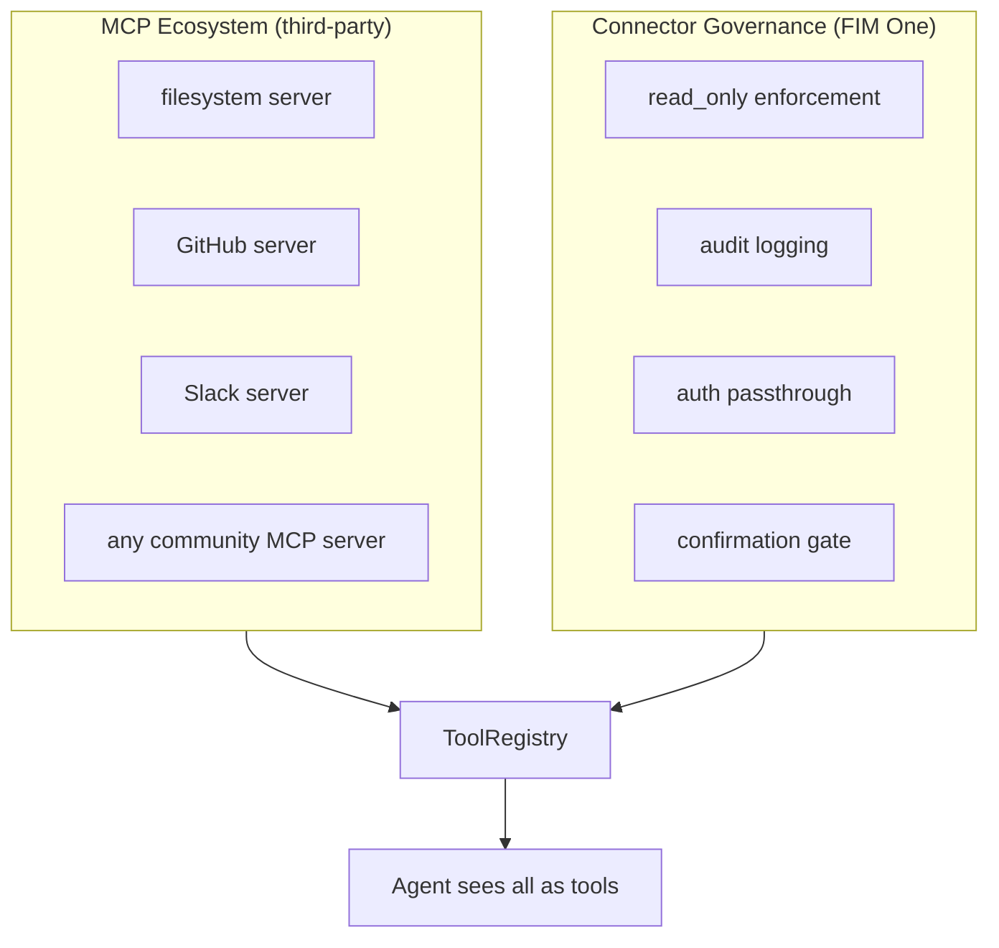

## Copilot vs Hub

아키텍처는 두 가지 통합 규모를 지원합니다:



**Copilot**은 호스트 시스템의 UI에 내장됩니다. 사용자는 익숙한 인터페이스를 떠나지 않고 AI와 상호작용합니다. 여러 커넥터(호스트 DB + 알림 서비스 등)를 사용할 수 있습니다.

**Hub**는 모든 시스템을 연결하는 독립형 포털입니다. 단일 시스템에 내장되지 않으며, 시스템과 AI가 만나는 중앙 인텔리전스 계층입니다.

동일한 커넥터 아키텍처, 다른 전달 방식입니다. Copilot은 Hub와 동일한 `ConnectorToolAdapter`를 사용합니다.

## 핵심 원칙

**클라이언트는 코드를 변경하지 않습니다.** FIM One은 그들의 시스템에 능동적으로 연결되어 데이터베이스를 읽고, API를 호출하며, 메시지 버스에 푸시합니다. 클라이언트는 자격 증명과 네트워크 접근만 제공하면 됩니다.

## 3계층 아키텍처



각 계층은 서로 다른 책임을 가집니다:

| 계층 | 담당 | 변경 시점 |
|---|---|---|
| **플랫폼** | 오케스트레이션, 멀티테넌트, UI | 새로운 플랫폼 기능 출시 |
| **커넥터 거버넌스 레이어** | 엔터프라이즈 거버넌스 정책 | 보안/규정 준수 요구사항 변경 |
| **MCP Protocol** | 전송, 도구 인터페이스 표준 | 없음 (개방형 표준) |
| **레거시 시스템** | 비즈니스 데이터 및 로직 | 없음 (그것이 핵심) |

## MCP를 전송 계층으로 사용하는 이유

어댑터는 **MCP 서버**로 구현됩니다. 이는 의도적인 아키텍처 선택입니다:

- **재사용성**: FIM One은 이미 MCP 클라이언트(v0.3)를 포함하고 있습니다. 레거시 시스템 어댑터를 추가하는 것은 MCP 도구를 추가하는 것과 동일한 인프라를 재사용합니다.
- **표준 프로토콜**: MCP는 개방형 표준입니다. 발명하거나 유지할 독점 프로토콜이 없습니다.
- **에코시스템**: 타사 MCP 서버(데이터베이스, API, SaaS 도구)가 즉시 작동합니다.
- **프로세스 격리**: 각 MCP 서버는 별도의 프로세스로 실행됩니다. 오작동하는 어댑터가 플랫폼을 중단시킬 수 없습니다.

### MCP만으로 제공되지 않는 기능

**Connector Governance Layer**는 순수 MCP에 없는 엔터프라이즈 거버넌스 기능을 추가합니다.

| 우려 사항 | MCP | Connector Governance Layer |
|---|---|---|
| 읽기 전용 적용 | 아니요 | 작업에 `read_only` 플래그 적용, 기본적으로 쓰기 차단 |
| 감사 로깅 | 아니요 | 모든 도구 호출 기록(타임스탬프, 사용자, 도구, 매개변수, 결과) |
| 인증 전달 | 아니요 | 호스트 시스템 인증을 프록시하여 에이전트가 로그인한 사용자를 대신해 작업 |
| 확인 게이트 | 아니요 | 쓰기 작업에 사람의 승인이 필요함(SSE `confirmation_required`) |
| 회로 차단기 | 아니요 | 연결 실패 시 정상적인 기능 저하로 전환 |
| 작업 분류 | 아니요 | 작업을 읽기/쓰기/관리자로 태그하고 수준별 정책 적용 |
| 열 수준 마스킹 | 아니요 | 개인 데이터로 표시된 데이터베이스 열은 값을 반환하는 대신 마스크를 반환 |

### 데이터베이스 열 마스킹

데이터베이스 커넥터는 하나의 권한 있는 계정으로 구성되는 경우가 많으므로, 모든 호출자가 동일한 테이블에 접근하게 됩니다. 커넥터의 스키마 관리자에서 열을 **PII**로 표시하면 에이전트가 해당 열에서 볼 수 있는 내용을 제한할 수 있습니다.

- 열은 스키마에 계속 표시되고 태그가 지정되므로, 모델은 해당 열이 존재한다는 사실을 알고 이를 대신할 값을 만들어 내지 않습니다.
- 해당 열 이름으로 반환되는 모든 값은 결과가 모델에 전달되기 전에 `***`로 대체됩니다. `SELECT *`를 통한 결과도 포함됩니다.
- 호출 로그에는 마스킹된 열과 함께 커넥터가 읽기 전용 모드였는지도 기록됩니다.

일치는 열 이름을 기준으로 이루어지며, 이는 결과 집합이 전달하는 유일한 식별자입니다. 여기에는 의도적인 두 가지 제한이 따릅니다. 데이터베이스는 해당 열을 계속 *사용*하므로 `WHERE salary > 5000`과 같은 필터는 정상적으로 적용되며, 열 이름을 변경하는 쿼리(`SELECT salary AS s`)는 마스킹되지 않은 값을 반환합니다. 쿼리 계정이 특정 열을 전혀 읽을 수 없어야 하는 경우에는 데이터베이스에서 해당 권한을 부여하고, 제한된 계정을 사용하도록 커넥터를 지정하세요.

소유자가 직접 사용하는 쿼리 플레이그라운드에는 마스킹이 적용되지 않습니다. 마스킹은 에이전트와 대화 기록에 전달되는 내용을 제어하며, 연결을 구성한 사용자가 직접 검사할 수 있는 내용에는 적용되지 않습니다.

### 왜 커스텀 프로토콜을 만들지 않는가

프로토콜은 상용화된 기술입니다. 기술적 가치는 어댑터 자체(도메인 지식, 스키마 매핑, 엣지 케이스 처리)와 거버넌스 계층(감사, 인증, 안전성)에 있습니다. 전송 프로토콜을 새로 만드는 것은 기능을 추가하지 않으면서 유지보수 비용만 증가시킵니다. Stripe는 HTTPS를 사용하고, Docker는 cgroups를 사용하며, FIM One은 MCP를 사용합니다.

## 배포 모델

모든 것이 단일 Docker Compose 배포에서 실행됩니다. 클라이언트는 아무것도 설치하지 않습니다.



<Note>
모두 FIM One에서 제공합니다. 클라이언트는 다음만 제공합니다:
- 데이터베이스 자격증명 (읽기 전용 계정 권장)
- API 엔드포인트 및 키 (사용 가능한 경우)
- 네트워크 화이트리스트 액세스
</Note>

**액세스 계층**: FIM One은 클라이언트가 제공할 수 있는 모든 액세스에 맞게 조정됩니다:

| 클라이언트가 보유한 것 | FIM One 연결 방식 |
|---|---|
| 문서화된 API | HTTP API 어댑터 (최선의 경우) |
| 문서화되지 않은 API | HTTP API 어댑터 + 수동 스키마 매핑 |
| 데이터베이스 액세스만 | 데이터베이스 어댑터 (직접 SQL, 기본적으로 읽기 전용) |
| 데이터베이스 + 메시지 버스 | 데이터베이스 어댑터 + 메시지 푸시 어댑터 |

## 에이전트-커넥터 분리

에이전트는 커넥터를 일반적인 도구로 봅니다. 에이전트는 도구가 내장 도구인지, 제3자 MCP 서버인지, 또는 레거시 시스템 커넥터인지 알거나 신경 쓰지 않습니다.



이는 다음을 의미합니다:

- **새로운 시스템 추가** = 커넥터 설정 추가. 에이전트 코드는 변경되지 않습니다.
- **커넥터 제거** = 설정 제거. 코드 변경 없음.
- 동일한 에이전트가 단일 작업에서 내장 도구와 커넥터를 함께 사용할 수 있습니다.

## 핫 플러그 진화

| 버전 | 새로운 커넥터를 추가하는 방법 | 재시작 필요? |
|---|---|---|
| **v0.6** | Connector Governance Layer를 포함한 Python MCP Server 작성, docker-compose에 추가 | 재배포 |
| **v0.8** | YAML/JSON 설정 작성, 플랫폼이 MCP Server 생성 | 재시작 |
| **v1.0** | OpenAPI 스펙 업로드, AI가 설정 자동 생성 | **재시작 불필요 (핫 플러그)** |

엔터프라이즈 배포는 "한 번 구현하면 몇 개월 동안 실행" -- 핫 플러그는 v1.0의 편의 기능이지, v0.6의 필수 요구사항이 아닙니다.

## 데이터 흐름 예시

사용자: "재무 시스템에서 연체된 모든 계약을 확인하고 요약을 Lark에 푸시해줘."

```
1. 사용자가 Portal / API를 통해 메시지 전송

2. FIM One (ReAct 모드):
   Think: 재무 DB에서 연체된 계약을 쿼리한 후 Lark에 푸시해야 한다.

3. Act: contract_query(status="overdue", days_past_due=">30")
   → Connector Governance: 감사 로그, 읽기 전용 확인 (통과)
   → MCP Server: SQL로 변환
   → Client DB: SELECT * FROM contracts WHERE status='overdue' AND ...
   ← 연체된 계약 7건 반환

4. Think: 연체된 계약 7건을 찾았다. 요약하여 푸시하겠다.

5. Act: lark_push(message="7 overdue contracts found: ...")
   → Connector Governance: 감사 로그, 쓰기 작업 → 확인 게이트
   → 사용자가 Portal을 통해 승인
   → MCP Server: Lark 웹훅에 POST
   ← 푸시 성공

6. Answer: "연체된 계약 7건을 찾았습니다. 요약이 Lark 그룹에 푸시되었습니다."
```

## 커넥터 표준화 레벨

| 레벨 | 버전 | 접근 방식 | 구축자 |
|---|---|---|---|
| **레벨 1** | v0.6 | Python MCP Server with Connector Governance | FIM One 개발자 |
| **레벨 2** | v0.8 | YAML/JSON config, platform auto-generates MCP Server | 구현 엔지니어 (Python 불필요) |
| **레벨 3** | v1.0 | Upload OpenAPI/Swagger spec, AI generates config | AI (인간 검토 포함) |

## 기존 MCP 에코시스템과의 관계

FIM One의 MCP 클라이언트(v0.3에서 제공)는 이미 타사 MCP 서버를 지원합니다. 레거시 시스템 어댑터는 엔터프라이즈 거버넌스를 위해 커넥터 거버넌스 계층으로 구축된 **도메인별 MCP 서버**입니다.



커넥터 거버넌스 계층은 MCP를 대체하지 않으며, 엔터프라이즈 레거시 시스템 통합에 필요한 거버넌스 계층으로 MCP를 확장합니다.
