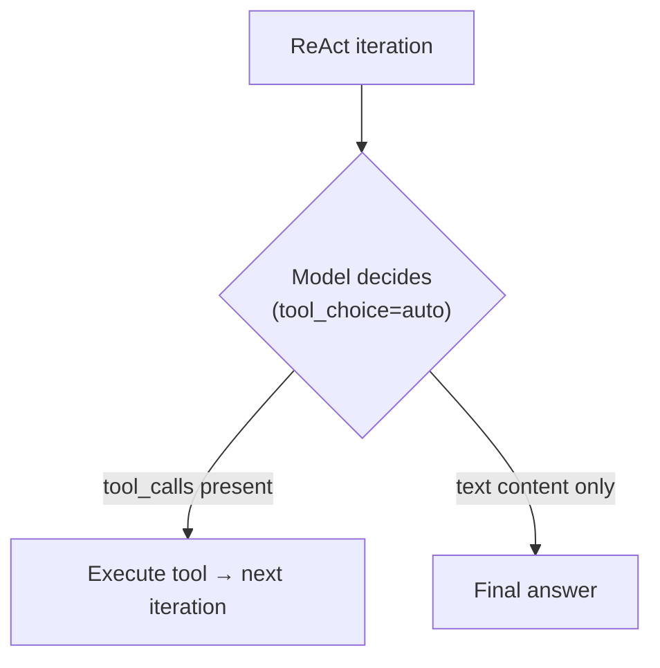
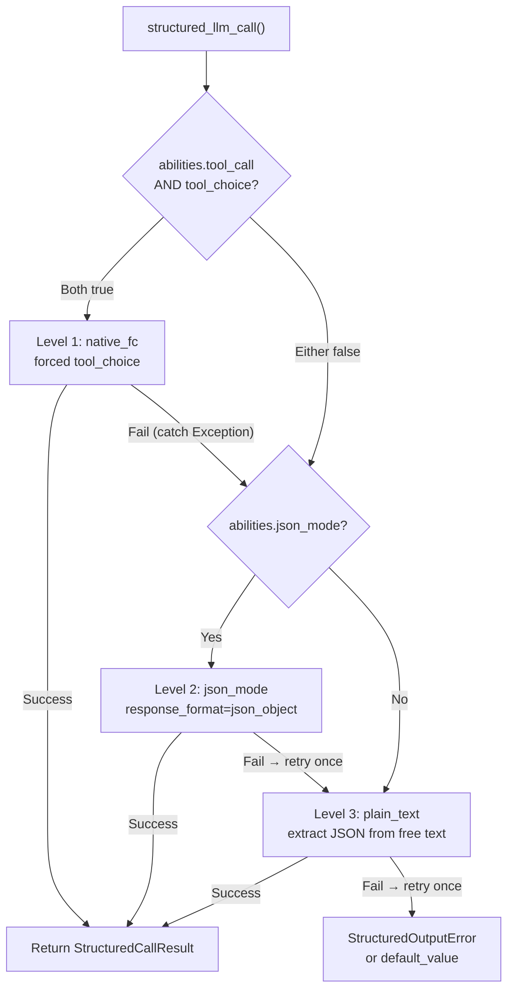

## 제공자 감지

FIM One은 LiteLLM을 범용 어댑터로 사용합니다. `core/model/openai_compatible.py`의 `_resolve_litellm_model()` 함수는 사용자의 `LLM_BASE_URL` + `LLM_MODEL`을 제공자 접두사가 있는 LiteLLM 모델 식별자로 매핑합니다. 접두사는 LiteLLM이 요청을 라우팅하는 방식을 결정합니다 — 네이티브 API 프로토콜(Anthropic Messages API, Gemini 등) 또는 일반 OpenAI 호환 `/v1/chat/completions`.

해석 순서:

1. **명시적 제공자** (DB `ModelConfig.provider` 필드에서) — 최우선 순위. 제공자가 URL의 알려진 도메인과 일치하면 `api_base`가 반환되지 않습니다(LiteLLM이 네이티브로 라우팅). 그렇지 않으면 `api_base`가 릴레이 URL로 설정됩니다.
2. **도메인 매칭** `KNOWN_DOMAINS` 대비 — 공식 API 엔드포인트는 호스트명으로 인식됩니다.
3. **URL 경로 힌트** `PATH_PROVIDER_HINTS` 대비 — UniAPI와 같은 릴레이 플랫폼에서 경로의 `/claude` 또는 `/anthropic`이 업스트림 프로토콜을 나타냅니다.
4. **폴백** — `openai/` 접두사(일반 OpenAI 호환).

| 도메인 / 경로 | 제공자 접두사 | 프로토콜 |
|---|---|---|
| `api.openai.com` | `openai/` | OpenAI Chat Completions |
| `anthropic.com` | `anthropic/` | Anthropic Messages API |
| `generativelanguage.googleapis.com` | `gemini/` | Google Gemini |
| `api.deepseek.com` | `deepseek/` | DeepSeek (OpenAI 호환) |
| `api.mistral.ai` | `mistral/` | Mistral |
| 경로에 `/claude` 또는 `/anthropic` 포함 | `anthropic/` | Anthropic Messages API (릴레이 경유) |
| 경로에 `/gemini` 포함 | `gemini/` | Google Gemini (릴레이 경유) |
| 그 외 모든 경우 | `openai/` | 일반 OpenAI 호환 |

제공자 접두사가 네이티브 프로토콜(anthropic, gemini 등)이고 URL이 공식 엔드포인트가 아닐 때, LiteLLM은 네이티브 프로토콜을 사용하지만 릴레이의 `api_base`로 요청을 전송합니다. 이는 제공자별 동작 — 아래에 설명된 Bedrock prefill 문제 포함 — 이 요청이 공식 API로 가든 릴레이를 통해 가든 적용됨을 의미합니다.

<Warning>
릴레이 URL에 경로에 `/claude`가 포함되어 있으면 FIM One은 자동으로 Anthropic의 네이티브 프로토콜을 통해 라우팅합니다. 이는 보통 올바릅니다(더 나은 스트리밍, thinking 지원), 하지만 제공자별 동작이 적용됨을 의미합니다 — 아래에 설명된 Bedrock prefill 문제 포함.
</Warning>

## tool_choice — 네 가지 모드

`tool_choice` 매개변수는 OpenAI 형식을 통해 표준화됩니다. LiteLLM은 요청을 보내기 전에 각 제공자의 네이티브 프로토콜로 변환합니다.

| 모드 | 의미 | 제공자 지원 |
|---|---|---|
| `"auto"` | 모델이 도구를 호출할지 또는 텍스트로 응답할지 결정 | 모든 제공자 |
| `"required"` | 도구를 반드시 호출해야 하지만 모델이 선택 | 대부분의 제공자 |
| `{"type":"function","function":{"name":"X"}}` | 특정 함수 X를 반드시 호출 | 대부분의 제공자 — **Anthropic 사고와 호환되지 않음** |
| `"none"` | 도구를 사용할 수 없음, 텍스트만 가능 | 모든 제공자 |

`"auto"`와 강제(`{"type":"function",...}`) 간의 구분은 FIM One의 모든 호환성 문제의 핵심입니다. 이 두 모드는 서로 다른 요구사항을 가진 완전히 다른 하위 시스템에서 사용됩니다.

## tool_choice가 사용되는 곳

두 개의 서브시스템이 `tool_choice`를 사용하며, 이들은 근본적으로 다른 방식으로 사용합니다.

### ReAct 엔진 — tool_choice="auto"

ReAct 루프는 모델이 각 반복마다 결정해야 합니다: 도구를 호출할지, 아니면 최종 답변을 제공할지. 여기서는 `"auto"`만 의미가 있습니다 — 모델이 `tool_calls`를 생성하거나 텍스트 콘텐츠를 생성하는 것 중 자유롭게 선택합니다. 이는 모든 제공자, 모든 모델, 확장 사고를 포함한 모든 모드와 호환됩니다.



ReAct 엔진은 `abilities["tool_call"] = True`일 때 네이티브 함수 호출(`_run_native`)을 사용하고, 그렇지 않으면 JSON-in-content 모드(`_run_json`)로 폴백합니다. 두 모드 모두 `"auto"`를 사용합니다 — 차이점은 도구가 `tools` 매개변수를 통해 전달되는지, 아니면 시스템 프롬프트에서 설명되는지입니다. 자세한 내용은 [ReAct 엔진 — 이중 모드 실행](/architecture/react-engine#dual-mode-execution)을 참조하세요.

### structured_llm_call — tool_choice=forced

원샷 구조화된 추출(스키마 주석, DAG 계획, 계획 분석). 모델이 특정 가상 함수를 호출하도록 강제하여 구조화된 JSON 출력을 보장합니다. 이것은 공급자별 오류를 트리거하는 호출 사이트입니다.

`structured_llm_call`은 3단계 성능 저하 체인을 구현합니다:



중요한 설계 차이점: `structured_llm_call`의 폴백은 **런타임**입니다 — 각 단계를 동적으로 시도하고 예외를 포착하여 통과합니다. ReAct 엔진의 모드 선택은 **빌드 타임**입니다 — 시작 시 `_native_mode_active`를 한 번 확인하고 전체 루프에 대해 한 가지 모드에 커밋합니다. 이는 `structured_llm_call`이 공급자별 400 오류에서 투명하게 복구할 수 있음을 의미하는 반면, ReAct는 모드가 처음부터 올바르게 선택되어야 합니다.

## Bedrock prefill 함정

`response_format={"type":"json_object"}`이 `anthropic/` 접두사로 해석된 모델에 전달되면, LiteLLM은 JSON 모드를 시뮬레이션하기 위해 내부적으로 어시스턴트 프리필 메시지를 주입합니다. Anthropic Messages API는 기본 `response_format` 매개변수가 없으므로, LiteLLM은 어시스턴트 콘텐츠로 여는 중괄호를 앞에 붙여서 근사합니다:

```json
{"role": "assistant", "content": "{"}
```

이는 Anthropic의 직접 API에서 작동합니다. 그러나 최신 AWS Bedrock 모델 버전은 마지막 메시지가 `role: "assistant"`인 대화를 거부합니다 — 이를 "어시스턴트 메시지 프리필"이라고 부르며 다음을 발생시킵니다:

```
ValidationException: This model does not support assistant message prefill.
The conversation must end with a user message.
```

이 오류는 **세 가지 조건이 모두 동시에 충족될 때만** 발생합니다:

1. 모델이 `anthropic/` 접두사로 해석됩니다(도메인 일치 또는 URL 경로 힌트를 통해).
2. `response_format={"type":"json_object"}`이 전달됩니다(`structured_llm_call`의 json_mode 코드 경로).
3. 실제 백엔드는 AWS Bedrock입니다(프리필을 거부함).

<Tip>
**OpenAI 호환 엔드포인트를 통한 Bedrock?** Bedrock 릴레이가 OpenAI 호환 `/v1/chat/completions` 엔드포인트를 노출하고(AWS의 자체 OpenAI 호환 게이트웨이 또는 제3자 프록시), URL 경로에 `/claude` 또는 `/anthropic`이 **포함되지 않으면**, FIM One은 이를 `openai/` 접두사로 해석합니다. LiteLLM은 백엔드를 표준 OpenAI 호환 서버로 취급하고, 프리필 주입 없이 `response_format`을 직접 전달하며, 서버가 JSON 제약을 기본적으로 처리합니다. **프리필 함정이 적용되지 않습니다** — `json_mode_enabled=false`를 설정할 필요가 없습니다.
</Tip>

<Warning>
이는 기본 도구 호출(`tool_choice="auto"`과 `tools=` 매개변수 포함)에 영향을 주지 않습니다. 프리필 주입은 `response_format`에만 발생합니다. ReAct 에이전트 실행은 완전히 영향을 받지 않습니다.
</Warning>

Level 1(native_fc)과 Level 2(json_mode)가 모두 Bedrock에서 실패하면, 시스템은 Level 3(plain_text)에서 복구됩니다. 아래에 설명된 `json_mode_enabled` 플래그는 낭비되는 Level 2 호출을 제거합니다.

### 해결책: json_mode_enabled

모델별 `json_mode_enabled` 플래그는 Level 2 (json_mode)를 시도할지 여부를 제어합니다:

- **DB 구성 모델**: Admin → Models → Advanced settings에서 토글합니다. 플래그는 `ModelProviderModel.json_mode_enabled`에 저장됩니다 (기본값 `TRUE`).
- **ENV 구성 모델**: 환경에서 `LLM_JSON_MODE_ENABLED=false`를 설정합니다.
- **효과**: 비활성화되면 `abilities["json_mode"]`는 `False`를 반환 → `response_format`이 전달되지 않음 → prefill 없음 → Bedrock이 작동합니다. 성능 저하 체인은 `native_fc → plain_text`가 되어 실패할 json_mode 호출을 완전히 건너뜁니다.
- **품질 손실 없음**: 시스템 프롬프트가 모델에 JSON을 반환하도록 지시하므로 모델은 여전히 유효한 JSON을 반환합니다. plain_text 레벨은 `extract_json()`을 사용하여 자유 형식 콘텐츠에서 JSON을 파싱하며, 이는 최신 모델에서 안정적으로 작동합니다.

## Thinking models + forced tool_choice

여러 제공자는 확장 사고가 활성화된 상태에서 강제 `tool_choice`를 거부합니다. 특정 함수 호출을 고정하는 것이 모델의 먼저 추론할 자유를 모순된다는 이유로:

```
tool_choice 'specified' is incompatible with thinking enabled
```

**이것은 thinking models의 법칙이 아니라 제공자별 규칙입니다.** Anthropic은 프로토콜 수준에서 이를 강제하고 Moonshot(Kimi)도 같은 방식으로 동작하지만, MiniMax는 모든 호출에서 사고하며 여전히 강제 tool choice를 허용합니다. [Provider Capability Matrix](#provider-capability-matrix)의 표 B는 제공자별로 판정을 기록합니다. 한 행에서 다른 행으로 일반화하지 마세요.

Anthropic 모델의 경우, `structured_llm_call`은 native-FC 수준에서 `reasoning_effort=None`을 전달하여 충돌을 자체적으로 해결하며, 이는 해당 호출에 대해 사고를 끕니다(`structured.py::_call_llm`). 구조화된 출력은 깊은 추론이 아니라 **스키마 준수**가 필요하므로, 여기서 사고를 비활성화하는 것은 올바르고 더 저렴합니다.

API를 통해 사고를 전환할 수 없는 경우, native_fc는 모든 구조화된 호출에서 400으로 실패하며 체인이 json_mode로 떨어지기 전에 약 10초가 소요됩니다. Kimi가 일반적인 경우입니다. 사고가 켜져 있을 때는 `auto`만 지원되며, 강제 tool choice는 사고를 꺼야 하는데, Moonshot은 이를 모델 id를 통해서만 노출합니다(`kimi-k2`는 꺼져 있고, `kimi-k2.5`와 `kimi-k2-thinking`은 켜져 있음). FIM One은 이를 전환하는 매개변수가 없으므로, 해결책은 아래의 `tool_choice_enabled` 플래그입니다.

### 해결책: tool_choice_enabled

모델별 `tool_choice_enabled` 플래그는 Level 1 (native_fc)이 시도되는지 여부를 제어합니다:

- **DB 구성 모델**: Admin → Models → Advanced → "Native Function Calling"에서 토글합니다. 플래그는 `ModelProviderModel.tool_choice_enabled`에 저장됩니다 (기본값 `TRUE`).
- **ENV 구성 모델**: 환경에서 `LLM_TOOL_CHOICE_ENABLED=false`를 설정합니다.
- **효과**: 비활성화되면 `abilities["tool_choice"]`는 `False`를 반환 → 저하 체인이 Level 2 (json_mode) 또는 Level 3 (plain_text)에서 시작되며, native_fc를 완전히 건너뜁니다. 이는 호환되지 않는 모델에 대한 구조화된 호출당 약 10초의 페널티를 제거합니다.
- **ReAct 에이전트 영향 없음**: `tool_choice_enabled`는 `structured_llm_call`에서만 강제 도구 선택을 제어합니다. ReAct 엔진은 `tool_choice="auto"` (모델이 자유롭게 결정)를 사용하며, 이 설정과 관계없이 모든 모델에서 작동합니다.

<Note>
`tool_choice_enabled`와 `tool_call`은 별도의 능력 플래그입니다. `tool_call` (`OpenAICompatibleLLM`의 경우 항상 `True`)은 도구가 모델에 전달되는지 여부를 제어합니다 — 비활성화하면 ReAct 에이전트가 손상됩니다. `tool_choice`는 구조화된 출력 추출을 위해 **강제** 도구 선택이 시도되는지만 제어합니다.
</Note>

`tool_choice="auto"`는 사고 모드의 영향을 받지 않습니다. ReAct 엔진은 `"auto"`만 사용하므로, 사고가 활성화된 상태에서 에이전트 실행이 작동합니다.

<Warning>
이 제약을 피하기 위해 `abilities["tool_call"] = False`를 설정하지 마세요. 이는 ReAct의 `_run_native` 모드 (이는 `tool_choice="auto"`를 사용하고 사고와 잘 작동함)를 비활성화하여, 덜 안정적인 `_run_json` 모드로 강제합니다.
</Warning>

<Note>
**제공자 마이그레이션 참고:** 일부 타사 릴레이는 `reasoning_effort` (`drop_params=True`)와 같은 지원되지 않는 매개변수를 자동으로 삭제하므로, 구성된 경우에도 사고가 활성화되지 않습니다. 사고를 적절히 지원하는 제공자 (Bedrock, 직접 Anthropic API)로 마이그레이션할 때, native_fc의 `reasoning_effort=None`은 일관된 동작을 보장합니다. 사용자 조치가 필요하지 않습니다 — 구조화된 출력은 모든 제공자에서 동일하게 작동합니다.
</Note>

## Provider Capability Matrix

이 섹션은 각 제공자가 지원하는 기능과 FIM One이 이에 대해 수행하는 작업의 권위 있는 기록입니다. 모든 행은 동작을 구현하는 함수의 이름을 지정하므로 여기서 제시된 모든 주장은 코드에 대해 확인할 수 있습니다. 다른 페이지는 데이터를 반복하는 대신 여기에 링크합니다. 코드가 변경되면 이 섹션도 함께 변경됩니다.

한 행은 단일 모델이 아닌 제공자의 프로토콜을 설명합니다. 한 제품군 내의 모델이 다른 경우(DeepSeek chat 대 reasoner, Kimi thinking 켜짐 대 꺼짐), 셀에 그 내용이 표시됩니다.

### Table A: Protocol routing

설정된 `base_url`과 `model`이 LiteLLM 호출로 어떻게 변환되는지, 그리고 첫 번째 인터페이스 선택이 사용 불가능할 때 어떤 일이 발생하는지를 나타냅니다.

| Provider | Detected by | LiteLLM prefix | Interface surface | Downgrade chain | Code anchor |
|---|---|---|---|---|---|
| **OpenAI** | Domain `api.openai.com`, 또는 모델 설정에서 명시적 `provider` `openai` | `openai/` | `completions`. GPT-5.x는 `responses-native` (`litellm.aresponses`)를 사용하며, `responses-bridge` (`openai/responses/<model>`)는 폴백으로 유지됨 | GPT-5.x는 Responses를 기본적으로 사용하고, 404 (엔드포인트 및 모델별로 `_RESPONSES_NATIVE_SUPPORT`에 캐시됨) 또는 400 (캐시되지 않음)에서 `completions`로 폴백. 다른 모든 모델은 `completions`로 직접 이동 | `_resolve_litellm_model`, `_should_use_native_responses`, `_dispatch_acompletion` |
| **Anthropic** (Bedrock 참고 아래) | Domain `anthropic.com`, 경로 세그먼트 `/claude` 또는 `/anthropic`, 또는 명시적 `provider` `anthropic` | `anthropic/` | `anthropic messages` | 없음. 기본 경로는 Responses 브리지에 진입하지 않으며, 프로토콜은 `_build_request_kwargs`에서 구축됨 | `_resolve_litellm_model`, `_dispatch_acompletion` |
| **Gemini** | Domain `generativelanguage.googleapis.com`, 경로 세그먼트 `/gemini`, 또는 명시적 `provider` `gemini` | `gemini/` | `gemini` | 없음. 도메인 일치는 `api_base`도 제거하므로, `/v1beta/openai/`와 같은 OpenAI 호환 접미사는 무시되고 호출은 기본 Gemini API로 이동 | `_resolve_litellm_model` |
| **xAI (Grok)** | 도메인 또는 경로 항목 없음. 모델 설정에서 `provider`가 명시적으로 설정되지 않으면 일반 OpenAI 호환으로 해석됨 | `openai/` with `api_base`, 또는 명시적 제공자 접두사 | `completions` | 없음 | `_resolve_litellm_model` |
| **DeepSeek** | Domain `api.deepseek.com` | `deepseek/` | `completions` | 없음 | `_resolve_litellm_model` |
| **Qwen** (DashScope) | 일반 폴백 | `openai/` with `api_base` | `completions` | 없음 | `_resolve_litellm_model` |
| **GLM** (Zhipu, Z.AI) | 일반 폴백 | `openai/` with `api_base` | `completions` | 없음 | `_resolve_litellm_model` |
| **MiniMax** | 일반 폴백 | `openai/` with `api_base` | `completions` | 없음 | `_resolve_litellm_model` |
| **Kimi** (Moonshot) | 일반 폴백 | `openai/` with `api_base` | `completions` | 없음 | `_resolve_litellm_model` |
| **Doubao** (Volcengine) | 일반 폴백 | `openai/` with `api_base` | `completions` | 없음 | `_resolve_litellm_model` |
| **Mistral** | Domain `api.mistral.ai` | `mistral/` | `completions` | 없음 | `_resolve_litellm_model` |
| **Ollama / local** | 일반 폴백, 일반적으로 `http://localhost:11434/v1` | `openai/` with `api_base` | `completions` | 없음 | `_resolve_litellm_model` |
| **Relay / proxy** | 경로 힌트 우선, 그 다음 일반 폴백. 모델 설정의 명시적 `provider`는 둘 다 우선함 | 힌트된 제공자 접두사, 그렇지 않으면 `openai/`, 항상 릴레이를 가리키는 `api_base` 포함 | 해석된 접두사가 암시하는 것 | 해석된 접두사 이상 없음. 아래 릴레이 주의사항 참조 | `_resolve_litellm_model` |

**GPT-5.x가 프로토콜을 선택하는 방법.** `FIM_GPT5_RESPONSES_MODE`가 선택합니다: `native` (기본값)는 `litellm.aresponses`를 통해 `/v1/responses`를 직접 사용하고, `bridge`는 LiteLLM의 chat-completions 변환을 사용하며, `off`는 일반 chat completions를 강제합니다. 기본 경로가 존재하는 이유는 브리지가 중요한 한 곳에서 손실이 있기 때문입니다: 추론 항목을 버리므로 GPT-5.x 에이전트는 모든 도구 라운드에서 사고의 연쇄를 다시 도출합니다. 프로토콜을 직접 사용하면 이러한 항목을 재생할 수 있습니다. `reasoning_effort=None`을 명시적으로 전달하는 호출(이는 `structured_llm_call`과 완료 신호 프로브가 수행하는 작업)은 chat completions에 머물러 있습니다. 생각이 없기를 원하는 호출은 보존할 추론 상태가 없기 때문입니다.

해당 기본 요청의 두 가지 속성은 중요하며 잘못 이해하기 쉽습니다:

- `store=false`는 업스트림에서 대화를 상태 비저장으로 유지하고, `include=["reasoning.encrypted_content"]`는 암호화된 페이로드가 반환되도록 요청합니다. include 없이 추론 항목은 비어 도착하고 재생은 조용히 작동하지 않습니다.
- 재생된 추론 항목은 서버 측 `id`를 제거해야 합니다. `store=false`를 사용하면 업스트림에 아무것도 유지되지 않으므로 id를 다시 에코하면 `Item with id 'rs_...' not found. Items are not persisted when 'store' is set to false`를 얻습니다. `encrypted_content` blob은 자체적으로 상태를 전달하므로 id를 제거해도 비용이 없습니다 (`sanitize_reasoning_item`).

**Bedrock.** Bedrock 호스팅 Claude는 Bedrock이 호스팅한다는 사실이 아니라 해석되는 행을 따릅니다. `anthropic/` 라우팅 릴레이를 통해 도달하면 Anthropic 프로토콜 동작을 상속하며, 여기에는 LiteLLM의 json-mode 어시스턴트 프리필이 포함되며, 더 최신 Bedrock 버전은 이를 거부합니다. OpenAI 호환 게이트웨이를 통해 도달하면 `openai/`로 해석되고, 프리필은 주입되지 않으며, `json_mode_enabled`는 켜진 상태로 유지될 수 있습니다.

### Table B: 충돌 및 해결 방법

FIM One은 네 가지 `tool_choice` 상태 중 세 가지를 발생시킵니다: ReAct 루프(`react.py::_run_native`)의 `auto`, 구조화된 출력(`structured.py::_call_llm`)의 명명된 함수, 그리고 finish-signal 답변이 도구 페이로드를 재생할 때의 `none`. 어떤 호출 사이트도 `required`를 발생시키지 않습니다. 해당 열은 `required`와 명명된 함수 모두에 적용되는 비`auto` 도구 선택에 대한 제공자의 제약을 기록합니다.

| Provider | `auto` | `required` | Named function | `none` | With thinking on | FIM One's workaround | Code anchor |
|---|---|---|---|---|---|---|---|
| **OpenAI** | ✅ | ✅ | ✅ | ✅ | GPT-5.x on chat completions은 추론과 결합된 도구를 거부합니다 | GPT-5.x를 Responses에서 실행합니다. 여기서 둘 다 허용됩니다. chat-completions 폴백에서는 도구가 있을 때마다 명시적 `reasoning_effort`를 `none`으로 전송합니다 | `_should_use_native_responses`, `_build_request_kwargs` |
| **Anthropic** | ✅ | ⚠️ | ⚠️ | ✅ | 사고가 꺼져 있을 때 수락되고, 켜져 있을 때 400으로 거부됩니다. `auto`는 어느 쪽이든 영향을 받지 않습니다 | `structured_llm_call`은 native-FC 수준에서 `reasoning_effort=None`을 전달하므로 해당 호출에서 사고가 꺼집니다. ReAct는 `auto`를 유지하고 사고를 유지합니다 | `structured.py::_call_llm` |
| **Gemini** | ✅ | ✅ | ✅ | ✅ | 충돌 없음 | 기본값: `tool_choice_enabled`과 `json_mode_enabled` 모두 켜짐 | `OpenAICompatibleLLM.abilities` |
| **xAI (Grok)** | ✅ | ✅ | ✅ | ✅ | 추론 변형은 도구를 수락합니다 | 기본값, 둘 다 켜짐 | `OpenAICompatibleLLM.abilities` |
| **DeepSeek** | ✅ | ⚠️ | ⚠️ | ✅ | `deepseek-chat`(V3.2, 비사고)은 강제 도구 선택을 수락합니다. `deepseek-reasoner`(V3.2 사고 모드)는 거부합니다 | `deepseek-reasoner`에서만 `tool_choice_enabled=false`로 설정합니다. `deepseek-chat`에서는 켜진 상태로 둡니다 | `OpenAICompatibleLLM.abilities` |
| **Qwen** | ✅ | ✅ | ✅ | ✅ | `enable_thinking`은 FIM One이 절대 전송하지 않는 제공자 측 스위치이므로 사고는 모델 기본값을 따릅니다 | 기본값, 둘 다 켜짐 | `_build_request_kwargs` |
| **GLM** | ✅ | ❌ | ❌ | ✅ | 강제 도구 선택은 모델이 사고하는지 여부와 관계없이 지원되지 않습니다 | `tool_choice_enabled=false`로 설정 | `OpenAICompatibleLLM.abilities` |
| **MiniMax** | ✅ | ✅ | ✅ | ✅ | 사고는 항상 켜져 있고 강제 도구 선택은 여전히 작동합니다. 이것은 "항상 켜진 사고가 강제 도구를 거부한다"는 규칙의 반례입니다 | 기본값, 둘 다 켜짐. 사고는 `<think>` 태그로 도착하고 추론 스트림으로 재라우팅됩니다 | `_ThinkTagStreamParser` |
| **Kimi** (Moonshot) | ✅ | ⚠️ | ⚠️ | ✅ | 사고가 켜져 있을 때만 `auto`가 지원됩니다. 강제 도구 선택은 사고를 끄야 합니다. `kimi-k2`는 꺼져 있고, `kimi-k2.5`와 `kimi-k2-thinking`은 켜져 있습니다 | API 매개변수가 Moonshot 사고를 뒤집지 않으므로 사고 모델에서 `tool_choice_enabled=false`로 설정합니다 | `OpenAICompatibleLLM.abilities` |
| **Doubao** | ✅ | ✅ | ✅ | ✅ | 도구와 함께 `reasoning_effort`를 수락합니다 | 기본값, 둘 다 켜짐 | `_build_request_kwargs` |
| **Mistral** | ✅ | ✅ | ✅ | ✅ | 사고 모드 없음 | 기본값, 둘 다 켜짐 | `OpenAICompatibleLLM.abilities` |
| **Ollama / local** | ⚠️ varies | ⚠️ varies | ⚠️ varies | ⚠️ varies | 체크포인트에 완전히 따라 다릅니다 | 14B 매개변수는 사용 가능한 도구 호출의 최소값이고 32B는 실제 목표입니다. 더 작은 모델의 경우 두 플래그를 모두 끄면 구조화된 출력이 일반 텍스트로 직접 이동합니다 | `OpenAICompatibleLLM.abilities` |
| **Relay / proxy** | Inherits upstream | Inherits upstream | Inherits upstream | Inherits upstream | 업스트림을 상속하고, 지원되지 않는 매개변수는 거부되지 않고 삭제됩니다(`litellm.drop_params=True`) | 모델별 플래그, 그리고 아래의 릴레이 주의사항 | `_build_request_kwargs` |

### Table C: Thinking protocol

`LLM_REASONING_EFFORT`는 `low`, `medium`, `high`를 허용하며, 다른 값은 미설정으로 읽힙니다 (`deps.py::_reasoning_effort`). FIM One이 와이어에 전송하는 것은 제공자별이며, 이 표는 그것을 기록합니다. replay 열은 `reasoning_replay_policy`의 반환값으로, 제공자별 목록이 아닌 4가지 상태의 작은 폐쇄 집합입니다.

| Provider | Thinking enabled by | Accepted `effort` values | Replay policy | Where the output lands | Code anchor |
|---|---|---|---|---|---|
| **OpenAI GPT-5.x** | Responses의 `reasoning` of `{effort, summary: "auto"}`; chat completions의 `reasoning_effort` | 설정의 `low`, `medium`, `high`, 그리고 chat completions에 도구가 있을 때 강제된 `none` | `openai_responses`: 불투명한 reasoning 항목은 Responses에서 그대로 재생되고, 읽을 수 있는 텍스트는 chat completions에서 `informational_only`처럼 정확히 삭제됨 | 암호화된 항목과 읽을 수 있는 요약, Reasoning 패널에서 렌더링됨. Chat completions는 reasoning 텍스트를 반환하지 않음 | `_build_responses_kwargs`, `reasoning_replay_policy` |
| **OpenAI o-series** | 항상 활성화됨 | `reasoning_effort` 변경 없이 전달됨 | `informational_only`, `o1`, `o3`, `o4` 조각에서 일치 | 내부; 토큰은 청구되지만 반환되지 않음 | `reasoning_replay_policy` |
| **Anthropic, adaptive** (Opus 4.6 / 4.7 / 4.8, Sonnet 4.6, Fable 5, Mythos 5) | `adaptive` 타입의 `thinking` 및 `output_config.effort` | `low`, `medium`, `high` | `anthropic_thinking`: 블록과 그 `signature`는 그대로 재생되거나 API가 턴을 거부함 | `reasoning_content` 및 `signature`, Reasoning 패널에서 렌더링됨 | `_uses_adaptive_thinking`, `_extract_thinking_signature` |
| **Anthropic, legacy** (4.5 이상) | `LLM_REASONING_BUDGET_TOKENS`이 설정되었을 때 `budget_tokens`를 포함한 `enabled` 타입의 `thinking`, 그렇지 않으면 LiteLLM에 전달된 `reasoning_effort` | `low`, `medium`, `high`, 또는 1024의 하한값을 가진 명시적 토큰 예산 | `anthropic_thinking` | adaptive와 동일 | `_build_request_kwargs` |
| **Gemini** | 호환성 엔드포인트의 `reasoning_effort` | `low`, `medium`, `high` | `flash-thinking` 조각을 포함하는 id의 경우 `informational_only`. 다른 Gemini id는 `unsupported`로 해석되며, 이는 필드를 동일하게 삭제함 | 내부 | `reasoning_replay_policy` |
| **xAI (Grok)** | LiteLLM을 통한 `reasoning_effort` | 제공자 정의 | `informational_only`, 일반 `reasoning` 조각이 단어를 포함하는 모든 id와 일치하기 때문 | 내부 | `reasoning_replay_policy` |
| **DeepSeek** | 모델 id: V3.2 thinking 모드의 경우 `deepseek-reasoner`, non-thinking의 경우 `deepseek-chat` | 없음. effort 매개변수가 없음 | `informational_only` | `reasoning_content` 필드, Reasoning 패널에서 렌더링됨 | `_parse_choice_message` |
| **Qwen** | `enable_thinking`, 제공자 측. FIM One은 전송하지 않음 | 해당 없음 | `qwq` id의 경우 `informational_only`, 그 외의 경우 `unsupported` | 콘텐츠 내 `<think>` 태그, reasoning 스트림으로 재라우팅됨 | `_ThinkTagStreamParser` |
| **GLM** | `glm-5`에 내장됨; API 토글 없음 | 해당 없음 | `unsupported` | 외부화되지 않음 | `reasoning_replay_policy` |
| **MiniMax** | 항상 활성화됨; 토글 없음 | 해당 없음 | `unsupported` | 콘텐츠 내 `<think>` 태그, 재라우팅됨 | `_ThinkTagStreamParser`, `_THINK_RE` |
| **Kimi** (Moonshot) | 모델 id: `kimi-k2-thinking`, 그리고 `kimi-k2.5`는 기본적으로 생각함 | 해당 없음 | `unsupported` | API reasoning 필드, `reasoning_content` 또는 `reasoning`으로 읽음 | `_parse_choice_message` |
| **Doubao** | `reasoning_effort` | 제공자는 `minimal`, `low`, `medium`, `high`를 문서화함; FIM One은 중간 3개만 내보냄 | `unsupported` | 내부 | `_build_request_kwargs` |
| **Mistral** | Thinking 모드 없음 | 해당 없음 | `unsupported` | 해당 없음 | `reasoning_replay_policy` |
| **Ollama / local** | 모델 종속 | 해당 없음 | `deepseek-r1` distill 및 `qwq` 빌드의 경우 `informational_only`, 그 외의 경우 `unsupported` | 체크포인트가 내보내는 곳의 `<think>` 태그 | `_ThinkTagStreamParser` |
| **Relay / proxy** | 업스트림이 허용하는 것 | 업스트림이 허용하는 것 | 직접 경로와 정확히 동일하게 모델 id에서 해석됨 | 업스트림에 따라 다름. 일반 `openai/` 릴레이 뒤의 Claude adaptive-thinking 모델은 thinking을 전혀 얻지 못하며, 생성자는 그렇다고 말하는 경고를 기록함 | `OpenAICompatibleLLM.__init__` |

`unsupported`와 `informational_only`는 와이어에서 동일한 바이트를 생성합니다: 둘 다 나가는 히스토리에서 `reasoning_content`와 `signature`를 제거합니다. 의도가 다르므로, 명확하게 reasoning하지만 `unsupported`에 속하는 모델은 라이브 버그가 아닌 조각 표의 간격입니다.

### Relay/proxy gotchas

타사 게이트웨이는 직접 제공자와 다른 방식으로 실패하며, 대부분의 실패는 조용합니다. 아래의 각 행은 증상을 메커니즘과 짝지으며, FIM One이 이미 이에 대해 수행하는 작업을 설명합니다.

<Note>
**지원 범위.** FIM One은 이 페이지에 문서화된 동작을 1차 엔드포인트에 대해 보장합니다: OpenAI의 자체 API, Anthropic, Google, 그리고 자신의 모델을 직접 제공하는 모든 공급업체. 타사 relay는 최선의 노력 기반으로 지원되며, 요청에 relay가 수행하는 작업이 우리의 제어 범위를 벗어나고 자주 자신의 문서 범위도 벗어나기 때문에 해당 보장의 적용을 받지 않습니다. Relay는 매개변수를 삭제하거나, 히스토리를 다시 쓰거나, 캐시 중단점을 제거하거나, 부분적으로만 구현하는 프로토콜에 응답할 수 있으며, 대부분의 경우 오류 대신 `200`을 반환합니다.

이것은 우리가 약속하는 것에 대한 진술이지, 실행되는 것에 대한 제한이 아닙니다. FIM One은 승인된 호스트의 허용 목록을 유지하지 않으며, 여기서 아무것도 도메인에 의해 제한되지 않습니다. 기능은 엔드포인트가 실제로 수행하는 작업으로 결정됩니다: 누락된 경로는 `404`로 응답하고 기억되며, 무시된 `include`는 빈 추론 항목을 생성하고 재생은 작동 불가능해지며, 거부된 요청은 해당 호출에 대해 폴백됩니다. 엔드포인트를 조사하는 것이 호스트명에서 기능을 추론하는 것보다 더 정확하며, Azure OpenAI, 엔터프라이즈 게이트웨이, 그리고 프로토콜을 올바르게 구현하는 자체 호스팅 프록시에 대해 계속 작동하는 유일한 접근 방식입니다.

Relay가 폴백이 포착하지 못하는 방식으로 오작동하는 경우, `FIM_GPT5_RESPONSES_MODE`(`bridge` 또는 `off`) 또는 모델별 `tool_choice_enabled` 및 `json_mode_enabled` 토글로 프로토콜을 직접 고정하고, FIM One 버그로 제출하기 전에 1차 엔드포인트에 대해 재현하세요.
</Note>

| 증상 | 메커니즘 | FIM One이 수행하는 작업 |
|---|---|---|
| 사고(thinking)가 구성되었지만 나타나지 않음 | Relay 경로에 `/claude` 힌트가 없어서 모델이 `openai/`로 해석됩니다. Chat Completions 스키마에는 사고 개념이 없으므로 매개변수가 프로세스를 떠나기 전에 삭제됩니다 | 구성 시 모델과 해석된 접두사를 명명하는 경고를 기록하고, `provider`를 설정하거나 Anthropic 기본 URL을 사용하도록 지시합니다 (`OpenAICompatibleLLM.__init__`) |
| 매개변수가 수락된 것으로 나타나지만 효과가 없음 | `litellm.drop_params=True`는 해석된 제공자가 선언하지 않은 모든 항목을 매개변수별로 조용히 제거합니다 | 의도적입니다. 모든 제공자에서 작동하는 하나의 요청 빌더를 유지합니다. 비용은 "오류 없음"이 매개변수가 도착했다는 증거가 아니라는 것입니다 |
| 첫 토큰이 비-OpenAI 모델에서 몇 분이 걸리거나, 에이전트가 텍스트를 반환하고 도구 호출을 하지 않음 | Relay가 OpenAI가 아닌 모델에 대해 `/v1/responses`를 광고하고, 요청을 수락한 다음, 전체 응답을 버퍼링한 후 재생합니다. Uniapi에서 Claude로 대략 4분의 첫 토큰으로 관찰되었으며, 두 번째 재현에서는 호출이 정상적으로 반환되었지만 에이전트는 도구 호출을 하지 않았습니다. 아무것도 오류가 발생하지 않으므로 오류 트리거 폴백이 발생하지 않습니다 | Bridge는 Responses에서 기능을 얻는 유일한 제품군인 GPT-5.x에 대해 이점 제한됩니다. 다른 모든 것은 Chat Completions로 직접 이동하고 프로브하지 않습니다 (`_dispatch_acompletion`, commit `137ede4c`) |
| `ValidationException: This model does not support assistant message prefill` | `anthropic/`-라우팅된 Bedrock relay의 json_mode. LiteLLM은 열린 중괄호를 보조 메시지로 미리 채워 `response_format`을 시뮬레이션하고, 최신 Bedrock 버전은 보조 턴으로 끝나는 대화를 거부합니다 | 해당 모델에 대해 `json_mode_enabled=false`를 설정하거나, 미리 채우기가 주입되지 않는 OpenAI 호환 게이트웨이를 통해 라우팅하세요 |
| Zhipu 엔드포인트에 대한 모든 호출에서 `404` | 클라이언트가 이미 `/v4`로 끝나는 기본 URL에 OpenAI 스타일 `/v1`을 추가합니다 | 제공자가 문서화한 대로 정확하게 기본 URL을 구성하세요. FIM One은 `api_base`를 변경하지 않고 전달합니다 |
| 조용한 기간 후 `APIConnectionError: Connection error` | 중개자가 FIN 또는 RST를 보내지 않고 유휴 풀된 연결을 회수했으며, httpx가 다음 쓰기에서 반죽은 소켓을 반환했습니다 | Keep-alive 만료는 기본값 5초이므로 턴 간 유휴 연결이 재사용되지 않고 폐기됩니다. 재사용을 완전히 비활성화하려면 `LLM_HTTP_MAX_KEEPALIVE=0`을 설정하세요 (`_get_shared_http_client`) |
| `Cannot send a request, as the client has been closed` | LiteLLM이 유휴 TTL에서 캐시된 SDK 클라이언트를 제거했으며, OpenAI SDK가 해당 클라이언트가 보유한 공유 httpx 세션을 닫았습니다 | 풀은 모든 시도 전에 재검증되고 닫혔을 때 재구축되며, LiteLLM의 오래된 클라이언트 캐시는 함께 플러시됩니다 (`_get_shared_http_client`, `_flush_litellm_client_cache`) |
| 청구된 입력 토큰이 보고된 캐시 읽기와 일치하지 않음 | Relay가 전달하기 전에 `cache_control`을 제거하므로 응답이 여전히 캐시 카운터를 보고하는 동안 전체 가격을 지불합니다 | `TurnProfiler`는 턴별로 `read_tokens` 및 `create_tokens`를 기록하며, 이는 relay 정직성 프로브로도 작동합니다. 청구서와 비교하세요 |
| `Function tools with reasoning_effort are not supported ... Please use /v1/responses instead` | Relay는 값이 아닌 `reasoning_effort` 필드의 존재 여부에 따라 Chat Completions를 보호하므로, FIM One이 추론을 비활성화하기 위해 보내는 명시적 `none`이 보호를 트립합니다. Uniapi에서 `gpt-5.6-luna`로 관찰됨 | 아무것도 없으며, Responses 경로가 작동하는 동안 아무것도 필요하지 않습니다: 해당 모델은 Responses 요청이 이미 실패한 후에만 Chat Completions에 도달합니다. Relay가 Responses를 원한다는 신호로 읽으세요, `FIM_GPT5_RESPONSES_MODE=off`를 설정하는 이유가 아닙니다 |
| GPT-5.x가 Responses를 지원하는 엔드포인트에서 Chat Completions에 머물러 있음 | `404`가 해당 엔드포인트 및 모델에 대한 부정적 판정으로 캐시되었습니다 | `404`만 캐시됩니다. 누락된 경로는 구조적이기 때문입니다. `400`은 해당 호출에 대해 폴백하고 의도적으로 캐시되지 않으므로 단일 오래된 추론 항목이 엔드포인트를 영구적으로 블랙리스트할 수 없습니다 (`_remember_native_failure`). 캐시는 프로세스별이므로 재시작은 어느 쪽이든 재프로브합니다 |
| 사고 블록이 거부되거나 접두사 캐시가 히트하지 않음 | Relay가 히스토리를 다시 쓰거나 재정렬하므로 재생된 `signature`가 더 이상 일치하지 않습니다 | 재생은 `reasoning_replay_policy`에 의해 중앙에서 결정되며, Anthropic 제품군 ID만 재생합니다. Relay 뒤의 Claude 모델이 인식할 수 없는 ID를 전달하는 경우, 정책 테이블에 해당 조각을 추가하세요 |

## 모델별 권장 구성

`tool_choice_enabled`과 `json_mode_enabled`는 관리자 → 모델 → 고급 설정에서 모델별로 토글할 수 있습니다. 기본값인 `TRUE`는 대부분의 제공자에게 올바르지만, 오류나 불필요한 지연이 발생할 때만 조정하세요. 조정이 필요한 제공자는 위의 표 B에 기록되어 있으며, 운영자가 작성하는 모델별 보기는 [모델 관리](/configuration/model-management#per-provider-configuration-matrix)에 있습니다.

<Tip>
**변경 시기:** 로그에서 `structured_llm_call: native_fc call raised` 경고 다음에 성공적인 json_mode 추출이 표시되면, 해당 모델은 native_fc의 이점을 얻지 못합니다. 해당 모델에 대해 "Native Function Calling"을 비활성화하여 낭비되는 API 호출(구조화된 출력 요청당 약 10초)을 제거하세요.
</Tip>

**ENV 수준 재정의**는 환경 변수를 통해 구성된 모든 모델에 적용됩니다(관리자 UI 제외):

```bash
# Disable native_fc globally (for thinking-model-only deployments)
LLM_TOOL_CHOICE_ENABLED=false

# Disable json_mode globally (for Bedrock relay deployments)
LLM_JSON_MODE_ENABLED=false
```

## 추론 노력 및 사고 구성

FIM One은 확장된 사고 / 추론을 제어하기 위해 두 개의 환경 변수를 노출합니다:

| 변수 | 값 | 효과 |
|---|---|---|
| `LLM_REASONING_EFFORT` | `low`, `medium`, `high` | 사고를 활성화합니다. 이 집합 외의 모든 값은 설정되지 않은 것으로 읽힙니다 (`deps.py::_reasoning_effort`). 수준이 변환되는 방식과 제공자가 허용하는 값은 제공자별로 다릅니다: [제공자 기능 매트릭스](#provider-capability-matrix)의 표 C를 참조하세요. |
| `LLM_REASONING_BUDGET_TOKENS` | 정수 (예: `10000`) | Anthropic 레거시 경로만 해당: 여전히 `enabled` 형식을 사용하는 모델에서 명시적 `thinking.budget_tokens` 상한을 설정하여 LiteLLM의 자동 매핑을 우회합니다. 적응형 사고 모델은 `output_config.effort`를 선호하여 이를 무시합니다. |

사고가 활성화되면 자동으로 따르는 두 가지 동작이 있으며, 둘 다 사용자 구성이 필요하지 않습니다:

1. **온도는 자동으로 처리됩니다.** 사고가 활성화된 `anthropic/` 경로에서 `_build_request_kwargs`는 `temperature`를 1.0으로 고정합니다. 이는 Bedrock이 요구하는 값입니다. 샘플링 매개변수를 완전히 거부하는 모델(Opus 4.7 및 4.8, Fable 5, Mythos 5)은 사고 여부와 관계없이 요청에서 `temperature`가 제거됩니다. 이를 위해 `LLM_TEMPERATURE=1`을 수동으로 설정하지 마세요.
2. **GPT-5.x는 가능한 경우 도구와 추론을 함께 유지합니다.** FIM One은 GPT-5.x에 대해 먼저 Responses 브리지를 조사합니다. 왜냐하면 그것이 둘을 결합하는 유일한 표면이기 때문입니다. 사용 가능한 `/v1/responses` 경로가 없는 엔드포인트는 채팅 완성으로 폴백하고, 판정은 엔드포인트별로 캐시되며, 해당 경로에서 `tools`를 전달하는 요청은 명시적 `reasoning_effort` `none`을 전송합니다. 필드를 생략하는 것은 동등하지 않습니다. 서버 기본값이 `none`이 아니기 때문입니다.

## 구조화된 출력을 위한 방어적 파싱

native_fc가 올바르게 작동하더라도, 구조화된 출력 파이프라인에는 모든 제공자 또는 호환성 계층의 엣지 케이스를 처리하기 위한 방어적 파싱 계층이 포함되어 있습니다.

DAG 플래너의 `_dict_to_steps` 파서는 세 가지 일반적인 엣지 케이스를 처리합니다:

1. **배열 대신 단일 객체.** 일부 모델은 배열 `{"steps": [{"id": "1", "task": "..."}]}` 대신 `{"steps": {"id": "1", "task": "..."}}` (단일 스텝 객체)를 반환합니다. 파서는 `id` 또는 `task` 키를 확인하여 이를 감지하고 객체를 리스트로 래핑합니다.

2. **이중 인코딩된 JSON 문자열.** 구조화된 출력이 json_mode (스키마 강제가 없음)로 폴백될 때, 일부 제공자는 `steps` 값을 네이티브 배열 대신 JSON 문자열로 반환합니다 — 예: `{"steps": "[{\"id\": \"1\", ...}]"}`. 이 문자열에는 표준 `json.loads`를 깨뜨리는 리터럴 줄바꿈 (모델의 포매팅에서 발생)이 포함될 수도 있습니다. 파서는 `extract_json_value()` (이는 `_repair_json_strings`를 포함)를 사용하여 다음을 처리합니다:
   - JSON 문자열 값 내의 리터럴 줄바꿈
   - 잘못된 이스케이프 시퀀스 (LaTeX 또는 코드 콘텐츠에서 일반적)
   - 호환성 계층의 기타 직렬화 특이성

3. **누락된 `steps` 래퍼.** 모델이 `steps` 래퍼 키 없이 최상위 객체로 단일 스텝을 반환할 수 있습니다. 파서는 루트 레벨에서 `id`와 `task`를 감지하고 그에 따라 래핑합니다.

<Note>
정상 작동 중에는 native_fc가 올바르게 구조화된 도구 호출 인자를 반환하며 이러한 엣지 케이스는 발생하지 않습니다. 방어적 파서는 사용자 정의 `BaseLLM` 서브클래스, 비정상적인 제공자 동작 또는 구조화된 출력이 json_mode 또는 plain_text로 저하되는 폴백 시나리오에 대한 안전망으로 존재합니다.
</Note>

## 프롬프트 캐싱 (크로스 제공자)

FIM One은 Anthropic의 명시적 프롬프트 캐싱을 `cache_control` 중단점을 통해 구현하며, 동시에 **프롬프트 섹션 레지스트리**를 통해 다른 모든 제공자의 자동 접두사 캐싱의 이점을 누립니다. 목표는 호출별 프롬프트 형태 차이 없이 모든 제공자에서 작동하는 단일 프롬프트 조립 경로입니다.

### 아키텍처

`fim_one.core.prompt` 모듈은 세 가지 기본 요소를 노출합니다:

- **`PromptSection`** — 정적 `content: str` 또는 동적 `content: Callable`을 가진 명명된 조각
- **`PromptRegistry`** — 메모이제이션된 저장소 (정적 섹션은 한 번만 렌더링되고, 동적 섹션은 호출마다 다시 렌더링됨)
- **`DYNAMIC_BOUNDARY`** — 레지스트리가 마지막 정적 섹션과 첫 번째 동적 섹션 사이에 삽입하는 센티널 마커로, 호출자가 캐시 중단점에서 렌더링된 提示词을 분할할 수 있도록 함

ReAct(JSON 모드, 네이티브 함수 호출 모드, 합성)의 시스템 提示词는 다음과 같이 분할됩니다:

- **정적 접두사** (~提示词의 95%) — 정체성, 핵심 지침, 도구 설명
- **동적 접미사** — 현재 날짜/시간, 요청별 언어 지시문, 인계 컨텍스트

### 기능 감지

`fim_one.core.prompt.caching.is_cache_capable(model_id)`은 모델 ID에 `claude`, `anthropic`, `bedrock/anthropic`, `vertex_ai/claude` 중 하나라도 포함되어 있으면 `True`를 반환합니다. 이러한 제공자들은 첫 번째 (정적) 메시지에 `cache_control: {"type": "ephemeral"}`을 포함한 **두 개**의 `role="system"` 메시지를 받습니다.

다른 모든 제공자는 `cache_control` 필드가 없는 **단일** 연결된 시스템 메시지를 받습니다. 이는 Anthropic이 아닌 엔드포인트들이 해당 필드를 거부하거나 자동으로 삭제하기 때문이며, 일부 릴레이를 통해 전송하면 `400 unknown parameter` 오류가 발생하기 때문입니다.

### 교차 제공자 커버리지

| 제공자 | 메커니즘 | 읽기 할인 | 당사 처리 |
|---|---|---|---|
| **Anthropic Claude** (3, 3.5, 4) | 명시적 `cache_control` | 0.10× | 임시 중단점이 있는 두 개의 시스템 메시지 |
| **AWS Bedrock Anthropic** | Anthropic 캐시 통과 | 0.10× | Anthropic과 동일 |
| **GCP Vertex AI Claude** | Anthropic 캐시 통과 | 0.10× | Anthropic과 동일 |
| **OpenAI GPT / o-series** | 자동 접두사 해시 (≥1024 tokens) | 0.50× | Section Registry를 통한 바이트 안정 접두사 → 자동 히트 |
| **DeepSeek (v3 / R1)** | 자동 디스크 지원 접두사 캐시 | 0.10× | OpenAI와 동일 |
| **Moonshot Kimi (K1/K2)** | 자동 접두사 캐시 | 0.10×/0.50× | 동일 |
| **ZhipuAI GLM-4.5+** | 자동 긴 컨텍스트 캐시 | 0.20× | 동일 |
| **Grok (xAI)** | 자동 접두사 캐시 | 0.25× | 동일 |
| **Google Gemini** | 별도 `createCachedContent` API | 0.25× | **아직 구현되지 않음** — v0.9 로드맵에서 `GeminiCacheAdapter`로 추적 중 |
| **Mistral / Cohere** | 기본 캐시 없음 | N/A | N/A |

`PromptRegistry`는 모든 제공자에게 자동 접두사 캐싱을 "무료로" 제공합니다. 정적 부분을 호출 간에 바이트 동일하게 유지함으로써 (현재 날짜/시간은 접두사가 아닌 동적 접미사에 위치), 모든 자동 캐싱 제공자의 해시가 일치하고 캐시에 히트합니다. 이것이 Anthropic 특정 `cache_control`을 고려하기 전에도 Registry가 기본 모델 없는 이점인 이유입니다.

### 관찰성

모든 `chat/*` 응답의 `done_payload`에는 이제 다음이 포함됩니다:

```json
"cache": {
  "read_tokens": 1067,
  "creation_tokens": 0
}
```

`TurnProfiler`는 턴당 구조화된 로그 라인을 내보냅니다: `turn_cache summary | model=claude-sonnet-4-6 | read_tokens=1067 | create_tokens=0 | saved_input_tokens=961 (~90%)`. 이는 또한 **릴레이 정직성 프로브**로 기능합니다 — API 릴레이를 통해 라우팅하는 경우, 실제 청구된 입력과 `read_tokens`을 비교하여 릴레이가 `cache_control`을 제거하는지 또는 0.10× 할인을 유지하는지 감지할 수 있습니다.

LLM 레이어에서는 달러 추정치가 반환되지 않습니다 — 가격 책정 및 릴레이 마크업이 위에 적용되므로 LLM 레이어는 객관적인 token 개수만 반환합니다.

### 멀티턴 캐시 ROI

Claude 4 ReAct 턴에서 기본 에이전트 프롬프트로 측정:

| 모드 | 정적 접두사 토큰 | 동적 접미사 토큰 | 캐시 비율 |
|---|---|---|---|
| JSON 모드, 도구 없음 | ~753 | ~46 | 94.2% |
| JSON 모드 ~10개 도구 포함 | ~1067 | ~46 | 95.9% |
| 네이티브 함수 호출 | ~523 | ~46 | 91.9% |

10개 도구를 사용한 10회 반복 ReAct 실행은 첫 번째 이후 각 턴마다 ~8,640개의 입력 토큰을 절약합니다(9개 캐시 히트 × 1067 토큰 × 90%). Anthropic은 첫 번째 호출에서 캐시 쓰기에 1.25배를 청구하므로, 손익분기점은 **두 번째** 호출에서 달성됩니다 — 단일 쿼리는 이점을 얻지 못합니다.

## 추론 재생 정책 (모델 없는 정확성)

확장 사고 / 추론 블록은 제공자마다 다르게 작동합니다. 균일한 직렬화 정책은 프로토콜 계약과 자동 접두사 캐시를 모두 깨뜨립니다. `fim_one.core.prompt.reasoning.reasoning_replay_policy(model_id)`는 네 가지 값 중 하나를 반환하며 `OpenAICompatibleLLM._build_request_kwargs()`에서 `ChatMessage.to_openai_dict(replay_policy=...)`를 제어합니다.

### 네 가지 정책

- **`anthropic_thinking`** — Claude 계열 (`anthropic/`, `bedrock/anthropic`, `vertex_ai/claude`). 사고 블록은 반드시 `signature`를 첨부하여 재생해야 합니다. Anthropic은 서명이 누락되거나 변경되면 이후 턴을 거부합니다.
- **`informational_only`** — CoT를 생성하지만 재생을 기대하지 않는 모델: DeepSeek 추론 모드 (V3.2의 `deepseek-reasoner`, 그리고 프래그먼트 테이블이 여전히 일치하는 이전 `deepseek-r1` 및 R1-Distill ID), Qwen QwQ, Gemini flash-thinking, OpenAI o1 / o3 / o4. 이들의 문서는 명시적으로 "메시지 히스토리에서 `reasoning_content`를 다시 보내지 마세요"라고 말합니다. 어쨌든 전송하면:
  - 제공자 계약을 위반합니다 (향후 버전에서 거부하기 시작할 수 있음)
  - **자동 접두사 캐시를 조용히 무효화합니다** — 메시지 바이트가 매 턴마다 변경되어 해시를 깨뜨립니다
- **`openai_responses`** — GPT-5.x, `gpt-5` 프래그먼트에서 일치합니다. 이 모델의 추론 상태는 텍스트가 아니라 암호화된 페이로드를 전달하는 불투명한 항목의 시퀀스이며, `/v1/responses`만 이들을 위한 슬롯을 가집니다. 해당 프로토콜에서 항목은 그대로 재생되며, 이것이 도구 라운드 전체에서 모델의 사고 연쇄를 유지하는 것입니다. 읽을 수 있는 요약은 여전히 나가는 요청에서 삭제되므로, chat-completions 폴백에서는 `informational_only`와 정확히 동일하게 작동합니다. 정보 프래그먼트 앞에서 확인되며, 이들의 일반 `reasoning` 항목은 그렇지 않으면 프록시 태그된 GPT-5 ID를 삼킬 것입니다.
- **`unsupported`** — 포괄적인 경우: 추론 기능이 없는 모델 (GPT-4o, Gemini 1.5, Mistral, Llama), 그리고 ID가 프래그먼트와 일치하지 않는 추론 모델 (GLM, MiniMax, Kimi, Doubao). 어느 쪽이든 필드를 재생해서는 안 되므로, 이 정책은 `informational_only`와 동일한 바이트를 전선에 배치합니다. 또한 알 수 없는 모델 ID에 대한 안전한 기본값입니다.

읽을 수 있는 `reasoning_content`와 불투명한 `reasoning_items`는 `ChatMessage`의 독립적인 필드입니다. `to_openai_dict()`는 항목을 전혀 직렬화하지 않으므로, 정책이 무엇이든 chat-completions 요청에 누출되는 것이 구조적으로 불가능합니다.

### 강제 실행

모든 정책 평가는 한 곳(`_build_request_kwargs`)에서 발생합니다. `ChatMessage.to_openai_dict(replay_policy=None)`은 A3 허용적 기본값을 유지하므로 조정되지 않은 호출자들이 회귀하지 않습니다. 크로스 제공자 테스트 매트릭스는 `tests/test_reasoning_replay_policy.py`에 있으며 **역방향 어설션**이 비-Anthropic 요청이 `reasoning_content`를 유출하지 않음을 증명합니다.

### 사용자용

기능 및 버그 동작은 자동이므로 아무것도 구성할 필요가 없습니다. 워크플로우 영향:

- **같은 대화에서 Claude와 DeepSeek 간에 에이전트를 전환하는 경우**, 히스토리는 thinking 블록이 그대로 저장되며, 다음 턴에서 발신 메시지 형태는 현재 모델에 맞게 조정됩니다.
- **프록시 / 커스텀 `BaseLLM` 서브클래스를 사용하는 경우**, 모델 id가 인식 가능한지 확인하세요(조각 중 하나를 포함). 그렇지 않으면 기본 `unsupported` 정책이 적용되며, 이는 안전하지만 비정상적인 프록시 뒤의 Claude가 thinking 재생을 잃을 수 있습니다. 모델 id 조각을 `_CACHE_CAPABLE_MODEL_FRAGMENTS`(`core/prompt/caching.py`에 있음) 및/또는 reasoning 정책 조회에 추가하세요.

## 문제 해결

**"This model does not support assistant message prefill"**
Bedrock + json_mode. 두 가지 해결 방법: (1) `LLM_JSON_MODE_ENABLED=false`를 설정하거나 관리자 모델 설정에서 JSON Mode를 비활성화하거나; (2) Bedrock 제공자가 OpenAI 호환 `/v1/chat/completions` 엔드포인트를 제공하는 경우, 해당 엔드포인트로 전환하세요 — FIM One은 이를 `openai/`로 해석하며 prefill 주입이 발생하지 않습니다.

**"Thinking may not be enabled when tool_choice forces tool use"** / **"tool_choice 'specified' is incompatible with thinking enabled"**
Anthropic 모델의 경우, `structured_llm_call`은 native_fc 호출에 대해 자동으로 thinking을 비활성화합니다. `kimi-k2.5`, `kimi-k2-thinking` 또는 `deepseek-reasoner`와 같이 API를 통해 thinking을 끌 수 없는 경우, 모델의 고급 설정에서 "Native Function Calling"을 비활성화하거나 전역적으로 `LLM_TOOL_CHOICE_ENABLED=false`를 설정하세요. 성능 저하 체인은 native_fc를 건너뛰고 대신 json_mode 또는 plain_text를 통해 구조화된 출력을 추출합니다. thinking 모델이 이 문제를 가지고 있다고 가정하기 전에 [Provider Capability Matrix](#provider-capability-matrix)의 표 B를 확인하세요. MiniMax는 이 문제가 없습니다.

**"DAG pipeline failed: LLM 'steps' is not an array"**
LLM이 `steps` 필드를 문자열 또는 단일 객체로 반환했습니다. 이는 일반적으로 구조화된 출력이 json_mode로 폴백되었음을 의미합니다(스키마 강제가 없음). 로그에서 `structured_llm_call: level=xxx`를 확인하세요 — `native_fc` 대신 `json_mode`를 표시하면 native_fc가 자동으로 실패하고 있습니다. 사용자 정의 `BaseLLM` 서브클래스를 사용하는 경우, `reasoning_effort` kwarg를 수락하는지 확인하세요.

**ReAct가 예기치 않게 JSON mode로 폴백됨**
모델의 `abilities["tool_call"]`이 `True`인지 확인하세요. 이는 `OpenAICompatibleLLM`의 경우 항상 `True`이지만, 사용자 정의 `BaseLLM` 서브클래스는 이를 재정의할 수 있습니다. 관리자 API의 모델 상세 엔드포인트로 확인하세요.

**structured_llm_call이 모든 레벨을 소진하고 StructuredOutputError를 발생시킴**
모델이 어떤 레벨에서도 파싱 가능한 JSON을 생성하지 못했습니다. 이는 최신 모델에서는 드문 일입니다. 다음을 확인하세요: (1) 스키마가 유효한 JSON Schema인지, (2) 모델이 전체 응답을 생성할 수 있는 충분한 `max_tokens`를 가지고 있는지, (3) 시스템 프롬프트가 스키마 지침과 모순되지 않는지. DAG 플래너와 분석기 모두 `default_value` 폴백을 제공하므로, 이 오류는 명시적으로 기본값을 생략하는 호출 사이트에서만 전파됩니다.
