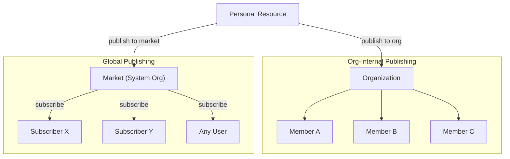
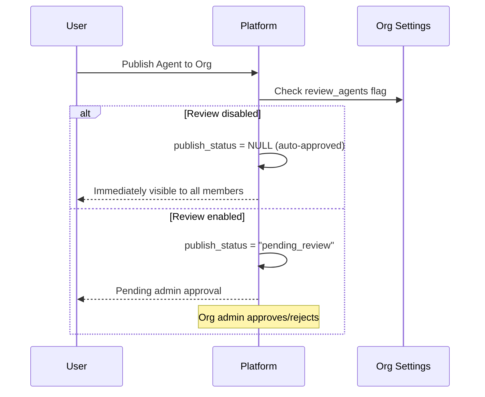
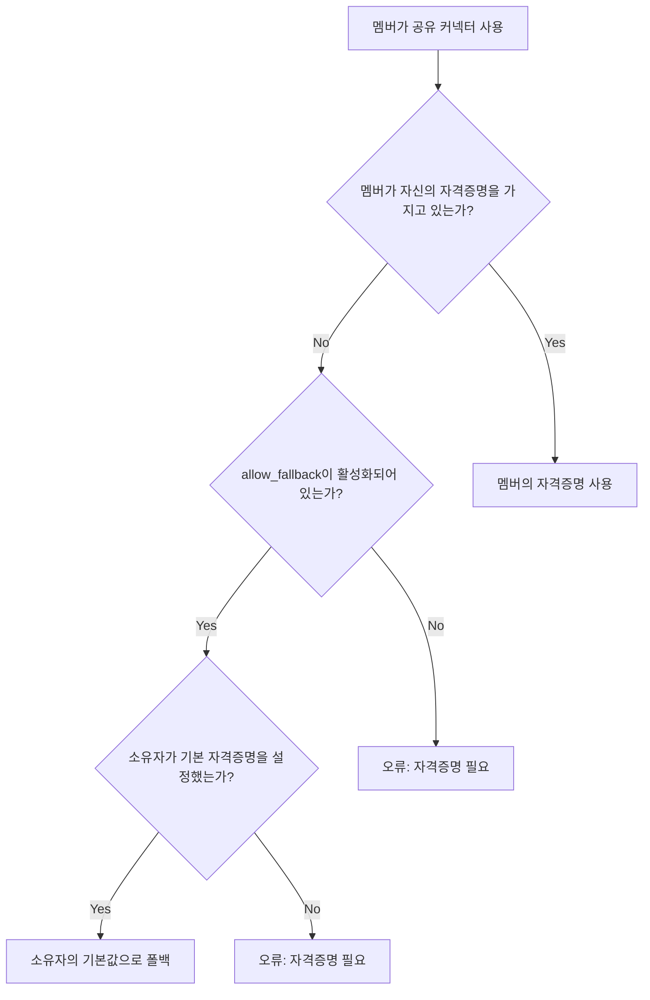
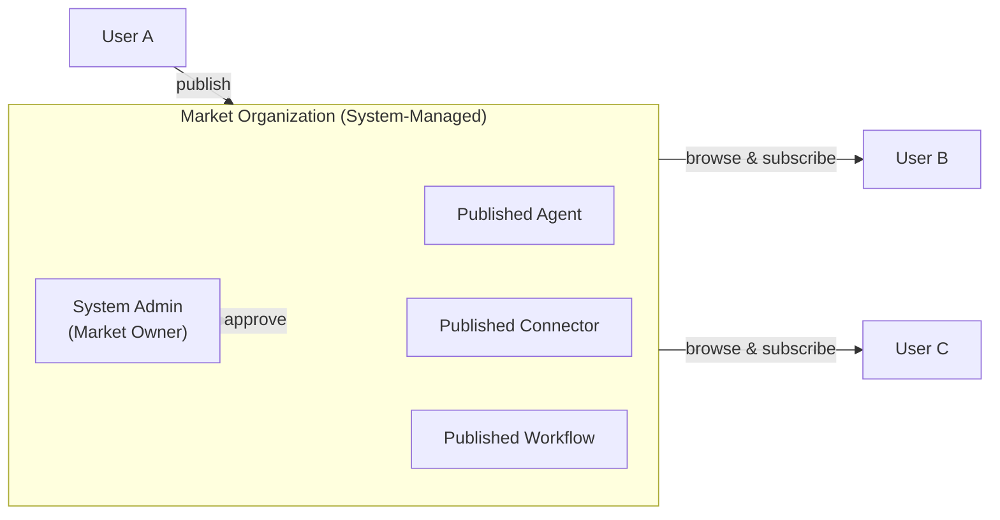
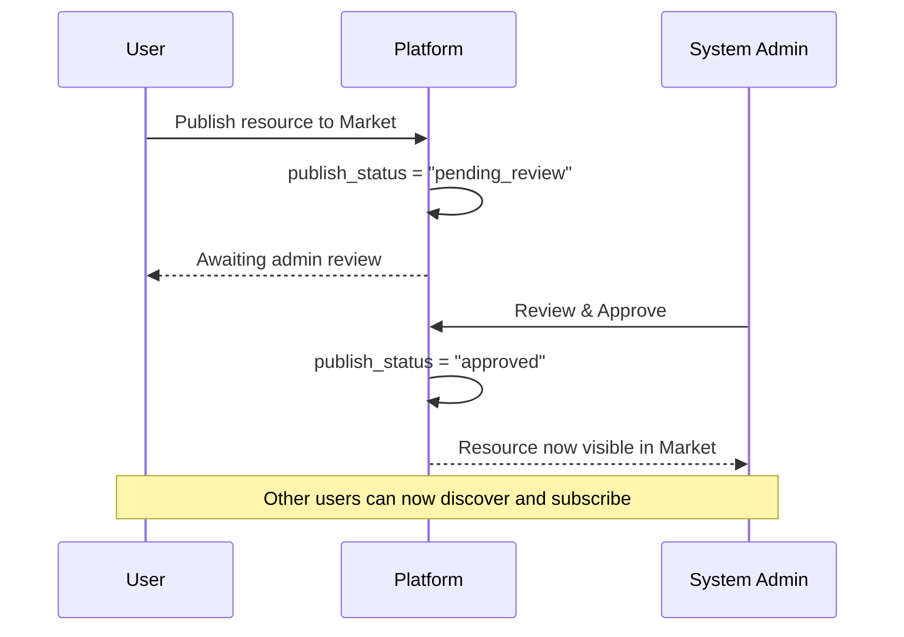
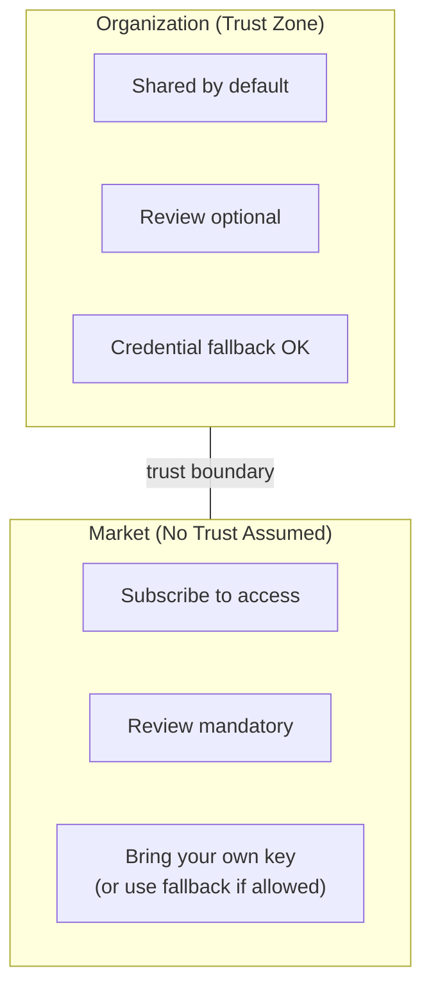

## 개요

FIM One은 **조직**을 협업 및 리소스 배포의 주요 단위로 사용합니다. 모든 리소스(에이전트, 커넥터, 지식 베이스, MCP 서버, 워크플로우, 스킬)는 **개인용**으로 시작하며 조직에 게시하여 공유할 수 있습니다.

두 가지 서로 다른 배포 채널이 있습니다:



| 채널 | 신뢰 모델 | 검토 | 접근 | 자격증명 처리 |
|---|---|---|---|---|
| **조직** | 높은 신뢰(팀/회사) | 선택사항(리소스 유형별) | 모든 멤버에게 자동 제공 | 소유자의 자격증명으로 폴백 |
| **마켓** | 신뢰 없음(글로벌 커뮤니티) | 항상 필수 | 먼저 구독해야 함 | 폴백 또는 자신의 키 가져오기 |

## 조직

### 생성 및 참여

모든 사용자는 **무제한**의 조직을 생성하고 원하는 수만큼 참여할 수 있습니다. 조직은 다음을 포함합니다:

- **소유자**: 생성자이며 완전한 제어 권한 보유
- **관리자**: 멤버를 관리하고 게시된 리소스 검토 가능
- **멤버**: 공유된 리소스를 보고 사용 가능

### 리소스 게시

사용자가 조직에 리소스를 게시하면, 해당 리소스 목록에 모든 멤버가 볼 수 있도록 나타납니다 — 에이전트는 에이전트 목록에, 커넥터는 커넥터 목록에 표시되는 식입니다.



**검토는 선택사항입니다.** 각 조직은 모든 리소스 유형에 대해 독립적인 검토 토글을 가지고 있습니다(`review_agents`, `review_connectors`, `review_kbs`, `review_mcp_servers`, `review_workflows`, `review_skills`). 검토가 비활성화되면, 게시된 리소스는 모든 멤버가 즉시 사용할 수 있습니다 — 공유 팀 드라이브와 유사합니다.

<Tip>
조직 소유자는 자동으로 검토를 우회합니다. 그들이 게시한 리소스는 항상 즉시 사용 가능합니다.
</Tip>

### 자격증명 폴백

자격증명(API 키, 데이터베이스 암호 등)이 필요한 커넥터와 MCP 서버의 경우, FIM One은 **폴백 메커니즘**을 제공합니다:



- **폴백 활성화** (`allow_fallback=true`, 기본값): 자신의 자격증명을 제공하지 않는 멤버는 자동으로 소유자의 기본 자격증명을 사용합니다. 이는 팀 공유 API 키 또는 내부 서비스에 이상적입니다.
- **폴백 비활성화** (`allow_fallback=false`): 모든 멤버가 자신의 자격증명을 구성해야 합니다. 이는 각 사용자가 자신의 API 키가 필요한 경우(예: 사용자별 SaaS 라이선스)에 적합합니다.

자격증명이 필요하지 않은 리소스(예: 읽기 전용 공개 API 커넥터 또는 인증이 없는 에이전트)는 모든 멤버가 즉시 사용할 수 있습니다 — 구성이 필요하지 않습니다.

## Market (글로벌 퍼블리싱)

**Market**은 FIM One의 글로벌 리소스 마켓플레이스 역할을 하는 특수한 시스템 관리 조직입니다.

### Market 작동 방식



주요 특징:

1. **단일 글로벌 인스턴스.** 시스템에는 정확히 하나의 Market 조직이 있습니다. 플랫폼 초기화 중에 자동으로 생성됩니다.
2. **모든 사용자가 참여자입니다.** 모든 사용자는 Market 리소스를 탐색하고 구독할 수 있습니다. Market은 항상 접근 가능하며 기본 검색 채널입니다.
3. **필수 검토.** 일반 조직과 달리 Market은 **항상** 검토가 필요합니다. 게시된 모든 리소스는 시스템 관리자의 승인을 받아야 표시됩니다. 이 검토 요구사항은 잠겨 있으며 변경할 수 없습니다.
4. **사용하려면 구독하세요.** 사용자는 Market 리소스가 자신의 리소스 목록에 나타나기 전에 명시적으로 구독해야 합니다. 이는 리소스가 모든 멤버에게 자동으로 제공되는 조직 내부 공유와 다릅니다.

### 마켓에 게시



### 구독 및 사용

리소스가 승인되어 마켓에 등록되면 모든 사용자가 다음을 수행할 수 있습니다:

1. **마켓 탐색** — 사용 가능한 리소스 발견
2. **리소스 구독** — 사용하고 싶은 리소스에 구독
3. **리소스 사용** — 자격 증명이 필요하고 폴백을 지원하지 않는 경우 먼저 자신의 키 구성

## 신뢰 경계

Organization과 Market 간의 구분은 기본적인 **신뢰 경계**를 반영합니다:



### 조직 내에서

같은 조직의 구성원들은 암묵적인 **신뢰 관계**를 공유합니다. 조직 소유자가 이들을 함께 모으기로 결정했으므로:

- 게시된 리소스는 **즉시 사용 가능**합니다 (명시적으로 검토가 활성화되지 않은 경우)
- 자격증명 폴백은 구성원이 소유자의 공유 API 키를 사용할 수 있음을 의미합니다
- 구독 단계가 필요하지 않습니다 — 조직에 속해 있으면 공유된 모든 것을 볼 수 있습니다

이는 팀이 실제로 작동하는 방식을 반영합니다: 공유 인프라를 통해 팀원들을 신뢰합니다.

### 마켓 전역

마켓은 **전역적**입니다 — 누구나 게시할 수 있고, 누구나 구독할 수 있습니다. 기존의 신뢰 관계가 없으므로:

- **검토는 필수**이며, 이는 저품질 또는 악의적인 리소스가 생태계에 진입하는 것을 방지합니다
- **구독이 필수**이므로 사용자는 명시적으로 리소스를 선택합니다 (작업 공간에 예상치 못한 추가 없음)
- **자격증명 처리**는 동일한 폴백 메커니즘을 따르지만, 사용자는 폴백을 사용하는 마켓 리소스를 사용할 때 요청이 게시자의 자격증명을 통해 흐른다는 점을 유의해야 합니다

## 리소스 가시성 요약

FIM One의 모든 리소스에는 접근 범위를 결정하는 `visibility` 필드가 있습니다:

| 가시성 | 범위 | 볼 수 있는 사람 |
|---|---|---|
| `personal` | 소유자만 | 리소스를 생성한 사용자 |
| `org` | 조직 | 대상 조직의 모든 멤버 (승인된 경우) |
| `org` + Market | 글로벌 | 구독한 모든 사람 (관리자 승인 시) |

가시성 필터 로직은 통합되어 있습니다 — 동일한 쿼리가 개인, 조직 및 구독 리소스를 처리합니다:

```
다음의 경우 표시됨:
  1. 소유자인 경우 (모든 가시성), 또는
  2. 소속된 조직에 게시되었고 승인된 경우, 또는
  3. Market에서 구독한 경우
```

## 실제 시나리오

### 시나리오 1: 팀이 데이터베이스 커넥터 공유

1. Alice가 팀의 PostgreSQL 데이터베이스에 대한 커넥터를 생성합니다
2. Alice가 팀의 조직에 게시합니다 (커넥터는 검토 비활성화)
3. 조직 구성원인 Bob과 Carol은 즉시 자신의 커넥터 목록에서 이를 볼 수 있습니다
4. 커넥터는 Alice의 데이터베이스 자격증명을 폴백으로 사용합니다 — Bob과 Carol은 아무것도 구성할 필요가 없습니다
5. 외부 계약자인 Dave가 자신의 읽기 전용 자격증명이 필요한 경우, 자신의 자격증명으로 재정의할 수 있습니다

### 시나리오 2: 에이전트를 마켓에 게시

1. Alice가 "Contract Analyzer" 에이전트를 빌드하고 마켓에 게시합니다
2. 시스템 관리자가 검토하고 승인합니다
3. 에이전트가 마켓 브라우즈 페이지에 나타납니다
4. Bob이 이를 발견하고 "구독"을 클릭하면 자신의 에이전트 목록에 나타납니다
5. 에이전트가 `allow_fallback=false`를 사용하는 API 키가 필요한 커넥터를 참조합니다 — Bob은 사용하기 전에 자신의 키를 구성해야 합니다

### 시나리오 3: 엄격한 검토를 하는 조직

1. 규정 준수 중심 회사가 조직에서 `review_agents=true` 및 `review_connectors=true`를 활성화합니다
2. 직원이 새로운 에이전트를 게시하면 "pending_review" 상태로 진입합니다
3. 조직 관리자가 에이전트 구성을 검토하고 승인합니다
4. 그 후에만 다른 구성원이 사용할 수 있게 됩니다
5. 게시자가 나중에 승인된 에이전트를 편집하면 재승인을 위해 자동으로 "pending_review"로 되돌아갑니다
