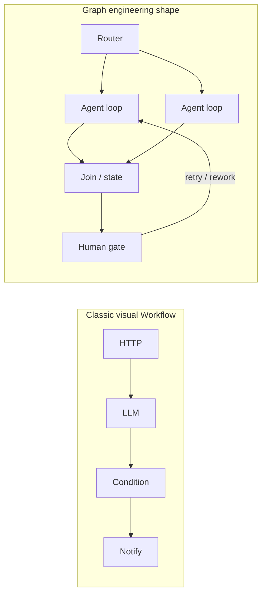
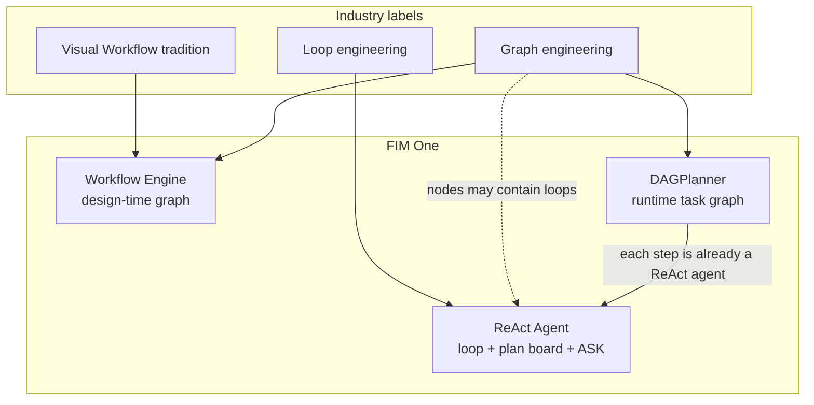
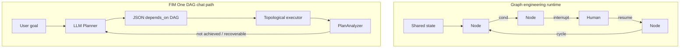
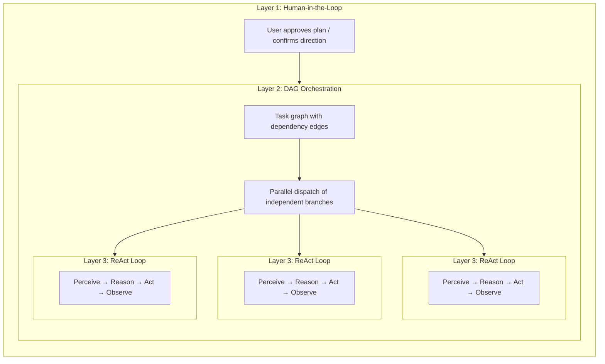

## 그래프 엔지니어링(2026)과 FIM One

업계 논의에서는 종종 **루프 엔지니어링**(단일 에이전트가 반복적으로 생각하고 행동하는 방식)에서 **그래프 엔지니어링**(다중 노드 토폴로지를 명시적인 엔지니어링 객체로 만드는 방식)으로의 전환을 언급합니다. 이 용어는 새롭지만, 실제 관행은 그렇지 않습니다. LangGraph 스타일의 시스템과 멀티 에이전트 조직들은 수년간 그래프를 사용해왔습니다. FIM One에 중요한 것은 사람들이 의미하는 **그래프의 종류**와 그것이 우리의 세 가지 실행 계층에 어떻게 매핑되는지입니다.

### 그래프 엔지니어링이 보통 의미하는 것

| 계층 (일반적인 프레임) | 관심사 |
|---|---|
| **Harness** | 도구, 샌드박스, 인증, 로깅, 모델 주변의 할당량 |
| **Loop** | 하나의 에이전트의 생각 → 행동 → 관찰 사이클 |
| **Graph** | **노드**가 연결되는 방식: 분기, 조인, 사이클, 사람 체크포인트, 공유 상태 |

그 프레임 전반의 합의: **그래프는 루프를 대체하지 않습니다**. 그래프 설계는 **프로세스 간의 관계**를 설계합니다. 각 에이전트 노드는 여전히 전체 루프를 실행할 수 있습니다.

"Graph"는 실제로 과도하게 사용됩니다. 세 가지 사용법이 혼합됩니다:

| 사용법 | 예시 | 역할 |
|---|---|---|
| **제어 흐름 그래프** | LangGraph `StateGraph`: 조건부 엣지, 재시도, 중단/재개 | 다음에 누가 실행할지를 결정하는 상태 머신 |
| **작업 종속성 그래프** | Claude Code Tasks `blockedBy`; FIM One `depends_on` | 작업 스케줄링 및 병렬화 |
| **지식 그래프** | 엔티티 및 타입 관계 | 검색 / 메모리 (오케스트레이션 아님) |

이 페이지는 처음 두 가지(오케스트레이션)에 관한 것입니다.

### "Dify Workflow with a new name"이 아님

Dify 스타일의 **시각적 워크플로우**와 그래프 엔지니어링은 공통의 혈통(**명시적 토폴로지**)을 공유하지만 동일한 제품이 아닙니다.

| | 클래식 시각적 워크플로우 (예: Dify) | 그래프 엔지니어링 (2026년 사용) |
|---|---|---|
| **주요 산출물** | 구현자가 그리는 캔버스 / 블루프린트 | 버전 관리되는 시스템 설계로서의 토폴로지 (코드 또는 설정) |
| **노드** | 고정된 기능 블록 (LLM, HTTP, KB, 조건…) | **이질적**: 함수, 라우터, **완전한 에이전트**, 인간, 조인 |
| **지능이 위치하는 곳** | 주로 격리된 LLM 노드 내부; 그래프는 파이프 | 종종 **노드 내부** (각각이 루프일 수 있음); 그래프는 역할을 조직화 |
| **엣지** | 파이프라인 성공/실패 및 분기 | 제어 흐름 **및** 상태 전환, **제어된 사이클** 포함 |
| **휴먼-인-더-루프** | 폼 / 승인을 추가 기능으로 | 인터럽트 / 재개를 1급 원시 요소로 |
| **루프와의 관계** | 종종 "워크플로우 **vs** 에이전트"로 판매됨 | 명시적으로 **루프보다 그래프** |

간단히 말해: 클래식 워크플로우는 **결정론적 (또는 반결정론적) 파이프**이며 가끔 LLM 단계가 있습니다. 그래프 엔지니어링은 **다중 노드 시스템 토폴로지**이며, 중요한 지점은 여전히 자율 에이전트일 수 있습니다.

### FIM One에서 산업 맵이 어떻게 위치하는가

FIM One은 이미 제어 스펙트럼 전체를 아우르고 있으며, 채팅 "Planner mode"는 일부일 뿐입니다.

| 산업 아이디어 | 가장 가까운 FIM One 부분 | 적합도 |
|---|---|---|
| 클래식 시각적 Workflow | **Workflow Engine** (설계 시점 청사진) | 강함 |
| 제어 흐름 그래프 + HITL + 지속 가능한 상태 | Workflow 휴먼 스텝 + 확인 闸门; 채팅 DAG에서 부분적 | 중간 |
| 작업 종속성 그래프 + 병렬 스케줄 | **DAGPlanner** (`depends_on`, 위상 정렬 팬아웃) | 스케줄링에서 강함; 중간 그래프 HITL에서 약함 |
| 단일 에이전트 루프 + 체크리스트 메모리 | **ReAct** (`update_plan`, 도구, `ask_user_question`) | 강함 |
| 런타임 LLM 드로우 플랜 매 턴 | **DAGPlanner** (Dify 아님; LangGraph 설계 시점 DSL 아님) | 고유한 제품 |

### 그래프 엔지니어링 vs FIM One DAG (채팅 Planner)

같은 계열(명시적 다단계 토폴로지). 다른 종류.

| 차원 | 그래프 엔지니어링 (일반적) | FIM One DAG (채팅) |
|---|---|---|
| **그래프를 그리는 사람** | 개발자 / 구현자 (안정적 토폴로지) | **런타임의 LLM** (목표당 새로운 그래프) |
| **엣지 의미** | 종종 **제어 흐름** (다음 위치, 사이클 포함) | 주로 **의존성 / 데이터** (`depends_on`, 비순환 실행) |
| **수정** | 엣지 수준 재시도, 휴먼 노드, 동일 그래프 재개 | **PlanAnalyzer → 재계획** (종종 **새로운** 그래프) |
| **노드 깊이** | 노드는 전체 에이전트 루프일 수 있음 | **이미 단계당 전체 ReAct**: `DAGExecutor`는 다중 반복 도구 루프(`DAG_STEP_MAX_ITERATIONS`의 기본 상한, 일반적으로 15)를 포함하여 `agent.run()`을 실행합니다. 기본 모델은 레지스트리 **general** (인프라 fast 아님); `model_hint`는 추론으로 확대하거나 fast로 강등할 수 있습니다. 도구 캐시, 단계/인용 검증, 소스 증거는 각 단계와 함께 제공됩니다. 단계 에이전트는 `enable_plan_tool=False`를 설정합니다 (단계 내 `update_plan` 보드 없음). 작업 단위가 이미 초점이 맞춰진 부분 작업이기 때문입니다. |
| **공유 상태** | 일급 타입 상태 + 체크포인트 내러티브 | 단계 결과 + 메모리/컴팩트; 단계 체크포인트 존재 |
| **실행 중 질문** | 제품 기능으로 중단 | 확인 게이트 존재; **`ask_user_question`은 ReAct 전용** (채팅 외부 루프), 일급 DAG 대기 엣지 아님 |
| **제품 진입점** | 프레임워크 또는 백엔드 조직도 | ReAct 옆의 사용자 표시 모드 |

**함의:** 그래프 엔지니어링 주변의 산업 관심은 **그래프/스케줄링 엔진 유지를 검증**합니다. 이는 **모든 턴에 "Planner"를 선택하도록 강제하는 채팅 기본값을 요구하지 않습니다**. 대부분의 작업은 여전히 강력한 루프를 원합니다; 그래프는 병렬 분기, 고정 규정 준수 경로, 다중 역할 오케스트레이션에서 가치를 입증합니다.

### FIM One이 배울 수 있는 것 (ReAct, DAG, Workflow 강화)

구체적인 수확, 슬로건 아님. 영향력 순서.

| # | 그래프 엔지니어링 아이디어 | 적용 대상 | 방향 |
|---|---|---|---|
| 1 | **루프 대신이 아닌 루프 위의 그래프** | 제품 + 자동 라우팅 | 기본 UX는 **ReAct** 유지 (루프 + `update_plan` + `ask_user_question`). 토폴로지가 비용을 정당화할 때 DAG/Workflow 사용. |
| 2 | **이질적 심층 노드** | DAG | **이미 현재 상태.** 각 단계는 완전한 ReAct 에이전트 (`agent.run`, 다중 반복 도구, 기본적으로 일반 이상의 모델)이며, 단일 LLM 호출이 아님. 남은 제어 옵션은 선택사항 (예: 긴 단계의 계획 보드), 구조적 격차 아님. |
| 3 | **에지로서의 인터럽트 / 재개** | DAG + ReAct | 실행 중 명확화는 **외부** 루프 또는 일급 대기 상태로 속함. "사용자에게 묻고" 텍스트로 답한 후 "목표 미달성"으로 재계획하는 가짜 DAG 단계 회피. |
| 4 | **전체 그래프 재계획 vs 제어된 사이클** | DAG | 모든 단계 텍스트를 실패한 최종 답변으로 버리기보다 단계 로컬 재시도 / 부분 이월 선호 (완료된 단계의 경우 이미 부분적으로 참). |
| 5 | **에지를 따른 타입 지정 공유 상태** | DAG + Workflow | 단계 I/O에 대한 강력한 계약 (스키마, 결과물)은 분석기 과신과 답변/출처 편차 감소. |
| 6 | **버전 관리되는 자산으로서의 토폴로지** | Workflow | 감사를 위해 인간 작성 그래프 유지; 런타임 LLM DAG가 규정 준수 청사진을 대체할 것으로 예상하지 않음. |
| 7 | **"대부분의 작업은 그래프가 필요 없음" 솔직함** | 자동 + 문서 | 명확화 및 선택, 짧은 Q&A, 탐색 작업을 ReAct로 라우팅; DAG는 분해 가능한 병렬 작업용으로 예약. |

**"그래프를 하고 있을" 때 피해야 할 안티패턴:**

- **의존성 그래프**를 **인간 상태 머신** 시뮬레이션에 사용 (대기 원시 없는 다단계 "답변 대기").
- ReAct **`update_plan`** (체크리스트 메모리)을 그래프 엔지니어링 (스케줄링 토폴로지)과 동일시.
- 그래프 열을 두 번째 채팅 성격으로 배송하는 대신 **엔진 구성** (외부 루프, 필요할 때 내부 스케줄).
- FIM One DAG 단계를 "얕은 LLM 호출"로 설명: 엔진을 과소평가하고 제품 결정을 오도.

## AI 도구 환경에서 "계획"의 다섯 가지 종류

"계획"이라는 단어는 과부하 상태입니다. 현재 최소 다섯 가지의 서로 다른 접근 방식이 존재하며, 각각 다른 문제를 해결합니다:

| 접근 방식 | 계획 형식 | 실행 | 승인 | 핵심 가치 |
|---|---|---|---|---|
| **암묵적 모델 계획** | 내부 사고 연쇄 | 단일 추론 패스 | 없음 | 모델이 자체적으로 단계를 생각함 |
| **Claude Code 계획 모드** | Markdown 문서 | 순차적 | 실행 전 인간이 검토 | 코드 작업 전에 접근 방식 정렬 |
| **Claude Code Teams** | 의존성 엣지가 있는 작업 목록 | **동시적** (다중 에이전트) | 인간이 계획 승인, 이후 자율 실행 | 동적 에이전트 풀 + 병렬 실행 |
| **Kiro 스펙 기반 개발** | 구조화된 스펙 (요구사항 + 설계 + 작업) | 순차적 | 인간이 스펙 검토 | 추적 가능한 요구사항, 수용 기준 |
| **FIM One DAG** | JSON 의존성 그래프 | **동시적** (단일 오케스트레이터) | 자동 (PlanAnalyzer) | 병렬 실행 + 런타임 스케줄링 |

처음 두 가지는 **설계 시간** 계획입니다 — 작업이 시작되기 전에 계획을 생성하며, 인간(또는 모델 자체)이 단계별로 따릅니다. 마지막 세 가지는 **런타임** 계획을 도입합니다 — 실행 그래프가 프로그래밍 방식으로 생성되고 스케줄되며, 독립적인 분기가 병렬로 실행됩니다. 차이점은 *누가* 실행하는가입니다: Claude Code Teams는 자율 에이전트를 생성하고, FIM One DAG는 단일 오케스트레이터 내에서 단계를 디스패치합니다.

이러한 접근 방식들은 경쟁 관계가 아닙니다. 이들은 상호 보완적인 계층입니다. Kiro 스타일의 스펙은 *무엇을* 구축할지 정의할 수 있고, FIM One DAG는 부작업을 동시에 *어떻게* 실행할지 스케줄할 수 있습니다. Claude Code의 계획 모드는 인간이 접근 방식에 동의하도록 보장하고, FIM One의 PlanAnalyzer는 결과를 자동으로 검증합니다.

## Three-Layer Nesting: The Full-Power Architecture

Claude Code Teams와 FIM One DAG는 최대 용량에서 **3계층 중첩 아키텍처**를 나타냅니다:

- **Layer 1 — Human gate**: 사용자가 계획을 검토하고 실행이 시작되기 전에 승인합니다.
- **Layer 2 — DAG orchestration**: 승인된 계획이 의존성 엣지를 가진 작업으로 분해됩니다. 독립적인 작업은 병렬로 실행되고, 다운스트림 작업은 차단 요소가 해결될 때까지 대기합니다.
- **Layer 3 — ReAct inner loop**: 각 작업은 완전한 ReAct 사이클(Perceive → Reason → Act → Observe)을 실행하는 에이전트에 의해 실행되며, 다단계 추론, 도구 사용 및 자동 재시도가 가능합니다.

핵심 통찰: **Claude Code Teams와 FIM One DAG는 동일한 3계층을 구현하며, Layer 2 메커니즘만 다릅니다** — 메시지 전달 vs 의존성 엣지 해결.

## Full-Power Runtime: FIM One vs Claude Code Teams

둘 다 진정한 에이전트입니다 — 핵심 루프는 동일합니다: **인식 → 추론 → 행동 → 피드백**. 차이점은 최대 용량에서 병렬 작업을 어떻게 조율하는지에 있습니다.

| 차원 | Claude Code Teams | FIM One DAG |
|---|---|---|
| **병렬 모델** | 리더가 SubAgent를 생성하고 메시지를 통해 작업 할당 | 위상 정렬이 독립적인 단계를 자동으로 병렬화 |
| **작업 그래프** | `blockedBy` / `blocks` 엣지가 있는 TaskList (동적 DAG) | `depends_on` 엣지가 있는 정적 JSON DAG |
| **조율** | 명시적 메시지 전달 (SendMessage / Broadcast) | 암시적 의존성 엣지 — 메시지 없음, 데이터 흐름만 |
| **에이전트 생명주기** | 동적 풀 — 필요에 따라 에이전트 생성, 완료 시 종료 | 단계별 **ReAct 에이전트** (단계별 `_resolve_agent`를 통한 새로운 에이전트); 각 단계는 전체 다중 반복 도구 루프 실행 |
| **피드백 및 수정** | 각 SubAgent가 자율적으로 재시도; 실패 시 리더가 재할당 | PlanAnalyzer가 결과 평가 → 재계획 루프 (최대 3라운드); 완료된 단계는 다음 계획으로 이월 가능 |
| **인간 개입** | 계획 모드 승인 후 자율 실행 | 완전 자동 — PlanAnalyzer가 통과/재계획 결정 (채팅 수준 ASK는 ReAct만 해당) |
| **컨텍스트 관리** | 각 SubAgent는 격리된 컨텍스트 윈도우 획득 (교차 오염 없음) | 단계별 공유 DbMemory + LLM Compact; 각 단계 에이전트는 여전히 작업 + 의존성 결과만 확인, 전체 피어 트랜스크립트 아님 |
| **토큰 경제학** | `N개 에이전트 × 에이전트당 토큰` — 시간↓ 토큰↑ (곱셈 비용) | 병렬 분기는 순차 ReAct보다 비용이 많지만, 공유 메모리와 단계 상한선은 보통 다중 에이전트 팀 지출 이하 |
| **확장 패턴** | 더 많은 SubAgent 추가 (수평, 메시지 결합) | 더 많은 DAG 분기 추가 (수평, 의존성 결합) |
| **최적 용도** | 다양하고 느슨하게 관련된 작업 (연구 + 코드 + 테스트) | 명확한 데이터 의존성이 있는 구조화된 워크플로우 |

### Real-World Benchmark: v0.5 RAG System

Claude Code Teams built FIM One's entire v0.5 RAG subsystem in a single session:

- **8 phases**: Embedding → Reranker → Loaders → Chunking → VectorStore → Retrieval → KB Backend → Frontend + Docs
- **46 tests** passing, frontend build clean
- **Wall time**: ~5 minutes
- **Token cost**: ~100k tokens per agent task × 8+ tasks ≈ 800k+ total tokens
- **Dependency edges**: Phase 5 depends on Phase 4 + 1b; Phase 6 depends on Phase 5 + 2 + 3 — a genuine DAG

This demonstrates the core trade-off: **시간 병렬화로 인한 토큰 증가의 대가**. Claude Code Teams는 개발자 시간을 절약하기 위해 컴퓨팅 비용을 증가시킵니다.

### 수렴, 경쟁이 아님

"팀 협업"과 "파이프라인 스케줄링" 간의 경계가 흐릿해지고 있습니다:

- **Claude Code Teams의 `blockedBy`/`blocks`는 DAG입니다** — 작업은 명시적 의존성 엣지를 가지며, 리더는 선행 작업이 완료되면 새로 차단 해제된 작업을 디스패치합니다. 이는 추가 단계(메시지)가 있는 위상 정렬 스케줄링입니다.
- **FIM One DAG 스텝은 이미 완전한 ReAct 에이전트입니다** — Layer 3은 염원이 아닙니다. 각 스텝은 도구와 다중 반복 루프를 사용하여 `agent.run()`을 실행합니다. 최상위 ReAct 채팅 턴과의 차이는 의도적입니다(스텝별 계획 보드 없음, 채팅 레벨 `ask_user_question` 대기 없음, `model_hint` / 일반 기본값으로 선택된 모델).

**핵심:** 동일한 에이전트 본질, 수렴하는 병렬 철학. Claude Code는 **팀 협업** 모델을 따릅니다 — 리더가 메시지를 통해 통신하는 워커에게 위임합니다. FIM One은 **파이프라인 스케줄링** 모델을 따릅니다 — DAG 실행기가 의존성 해결을 기반으로 **ReAct 스텝**을 디스패치합니다. 실제로 두 모델 모두 의존성 기반 병렬 실행을 구현합니다. 차이는 조정 오버헤드(메시지 vs 엣지), 격리(피어 에이전트 vs 작업 + 의존성 결과), 토큰 경제학입니다. 제품 격차는 "노드를 에이전트로 만들기"보다는 **그래프를 스케줄할 시기 vs 하나의 채팅 루프에 머물 시기**, 그리고 **그래프가 일시 중지할 수 없는 인간 대기 엣지**입니다.

## 구조화된 출력 성능 저하

DAG 파이프라인의 모든 구조화된 LLM 호출 사이트(Planner, Analyzer, Tool Selection)는 3단계 성능 저하 체인을 구현하는 통합 `structured_llm_call()` 유틸리티를 사용합니다:

| 레벨 | 조건 | 작동 방식 |
|---|---|---|
| **Native FC** | `llm.abilities["tool_call"]` | 가상 도구 호출을 강제 실행하고 `tool_calls[0].arguments`에서 추출 |
| **JSON Mode** | `llm.abilities["json_mode"]` | `response_format={"type":"json_object"}`를 설정하고 `extract_json()`으로 파싱 |
| **Plain text** | 항상 사용 가능 | `extract_json()`으로 자유 형식 콘텐츠를 파싱하고 선택적으로 `regex_fallback()` 실행 |

각 텍스트 기반 레벨은 다음 레벨로 넘어가기 전에 재포맷 프롬프트로 한 번 재시도합니다. 결과는 파싱된 값, 추출 성공 레벨, 누적된 토큰 사용량을 포함하는 `StructuredCallResult`입니다.

이 설계는 동일한 프롬프트가 GPT-4(native FC), Claude(JSON mode), 로컬 모델(plain text)에서 안정적으로 작동하도록 하며, 네 개의 호출 사이트에 분산되지 않고 한 곳에서 일관된 오류 처리 및 재시도 로직을 제공합니다.

## 세 가지 실행 계층: 제어 스펙트럼

위의 다섯 가지 계획 접근 방식은 전체 그림을 설명합니다. FIM One 내에서 세 가지 실행 계층은 완전한 인간 제어에서 완전한 AI 자율성까지의 **제어 스펙트럼**을 제공합니다. 그래프 엔지니어링과의 관계: **Workflow**는 설계 시간 그래프 제품입니다. **DAGPlanner**는 런타임 작업 그래프입니다. **ReAct**는 루프 엔지니어링입니다(선택적 계획 보드 메모리 포함, 스케줄 그래프 아님).

| 계층 | 그래프 정의자 | 그래프 존재 시점 | 그래프 엔지니어링 역할 | 최적 사용 사례 |
|---|---|---|---|---|
| **Workflow Engine** | 사용자(시각적 캔버스 / JSON 블루프린트) | 설계 시간 | 클래식 시각적 Workflow + 지속적 프로세스 토폴로지에 가장 근접 | 결정론적 프로세스, 컴플라이언스/감사 추적, cron 스케줄 자동화 |
| **DAGPlanner** | LLM(목표를 자동으로 분해) | 런타임 | 작업 종속성 그래프 + 병렬 스케줄 + 결과 분석 | 명확한 하위 작업 경계가 있는 분해 가능한 다단계 작업 |
| **ReAct Agent** | 없음(반복 루프) | 스케줄 그래프로는 절대 아님 | 루프 계층; 더 큰 그래프의 노드는 ReAct 에이전트가 될 수 있음 | 탐색적, 대화형, 명확히 한 후 실행, 반복적 개선 |

설계 원칙: **사용자에게 원하는 만큼의 제어를 정확히 제공합니다**.

- 모든 대출 승인이 다섯 가지 특정 단계를 통과하는지 증명해야 하나요? → Workflow.
- 세 가지 주제를 병렬로 조사한 후 종합해야 하나요? → DAG.
- 실행 중간에 초안 작성, 개선 또는 구조화된 질문을 해야 하나요? → ReAct.
- 확실하지 않나요? → `execution_mode: "auto"`는 쿼리를 분류하고 런타임에 DAG 또는 ReAct로 라우팅합니다(목표가 주로 명확화 또는 짧은 탐색일 때 ReAct 선호).

이 계층화는 FIM One을 단일 패러다임 도구와 구분하는 것입니다:

- **Dify**는 Workflow 계층을 강조합니다(정적 또는 반정적 시각적 그래프).
- **LangGraph**는 코드 수준의 제어 흐름 그래프 DSL을 강조합니다(개발자 정의 토폴로지, 동적 라우팅, 체크포인팅). 구조적으로 시각적 워크플로우와 관련이 있으며 소프트웨어로 표현됩니다.
- **Manus 클래스 에이전트**는 Agent/루프 계층을 강조합니다(자율 실행, 사용자 정의 구조 최소화).

FIM One은 세 가지 계층 모두를 포함하며, 채팅 엔진 간의 자동 라우팅도 포함합니다. **사용자 정의 그래프 → LLM 생성 작업 그래프 → 스케줄 그래프 없음**의 진행은 더 광범위한 산업의 정직함과 일치합니다: 모델이 개선됨에 따라 **명시적 토폴로지는 필수 UI가 아닌 대부분의 턴에서 선택 사항이 됩니다**. 그래프 엔지니어링 열은 모든 채팅을 플래너를 통해 강제하는 것이 아니라 **엔진과 구성에 투자**하는 이유입니다.

### 관련 문서

- [ReAct Engine](/architecture/react-engine) — 루프, 도구, 계획 보드, 명확화 질문
- [DAG Engine](/architecture/dag-engine) — 플래너, 실행자, 분석기, 재계획
- [Competitive Landscape](/strategy/competitive-landscape) — Dify / Manus / Coze 포지셔닝
