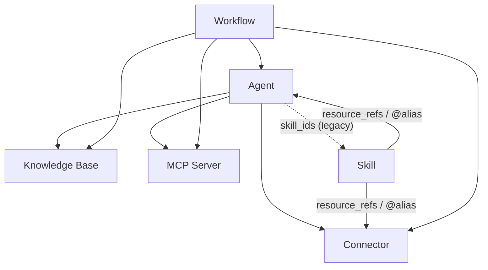

이 페이지는 **공유 권한** 및 **자격증명 흐름**에 대한 단일 참고 자료입니다. 공유 가능한 리소스 유형은 **Agents, Connectors, MCP servers**(그리고 선택적 모듈이 활성화된 경우 **Skills** 및 **Workflows**)입니다. 다른 리소스 위에 구축된 리소스를 공유할 때 어떤 일이 발생하는지 이해하는 데 사용하세요.

<Note>
**Knowledge bases는 공유할 수 없습니다.** KB는 공유된 Agent에 바인딩되어 다른 사람에게 도달하며, 이는 런타임에 소유자의 콘텐츠를 위임합니다("바인딩된 리소스를 통해 액세스가 흐르는 방식" 참조). publish-KB 작업은 없습니다.
</Note>

## 두 가지 질문

모든 공유 결정은 두 가지 독립적인 질문에 답합니다:

1. **가시성** — *다른 사람이 이 리소스를 전혀 볼 수 있거나 사용할 수 있는가?*
2. **자격증명** — *어떤 사람의 비밀(API 키, DB 비밀번호, 서버 env)로 실행되는가?*

가시성은 리소스에 관한 것이고, 자격증명은 Connectors와 MCP 서버만 가지는 별도의 사용자별 관심사입니다. 이 둘을 구분해서 생각하세요 — 대부분의 혼동은 "볼 수 있다"와 "소유자의 키를 사용할 수 있다"를 혼동하는 데서 비롯됩니다.

## 가시성: 소유 + 구독

리소스는 **소유하거나** **명시적으로 구독한** 경우에만 볼 수 있습니다. 더 이상 "조직의 모든 사람이 볼 수 있다"는 암묵적 규칙은 없습니다 — 조직 공유는 구독을 통해 제공됩니다.

| 공유 범위 | 의미 | 다른 사용자의 접근 방법 |
| --- | --- | --- |
| **개인** (기본값) | 소유자만 볼 수 있습니다. | — |
| **조직** | 조직에 게시됩니다. | 조직 구성원이 마켓에서 **구독**하거나 가입 시 자동 구독됩니다. |
| **글로벌 / 마켓** | 공개 마켓에 게시됩니다. | 누구나 마켓에서 **구독**합니다. |

동일한 규칙이 리소스가 사용되는 모든 곳에 적용됩니다 — 채팅 도구 조립, 에이전트 바인딩, 워크플로우 단계 모두 **소유 + 구독**을 확인합니다. 따라서 구독한 연결기는 에이전트에 바인딩되고 워크플로우에서 호출될 수 있습니다. 볼 수도 없고 구독할 수도 없는 것은 세 곳 모두에서 거부됩니다.

<Note>
구독은 범위가 지정됩니다: 조직을 떠나거나 제거되면 해당 조직을 통해서만 가지고 있던 구독이 취소되고, 해당 리소스에 대해 저장한 사용자별 자격 증명이 삭제됩니다.
</Note>

## 자격증명 & "Allow fallback"

**연결기**와 **MCP 서버**만 자격증명을 보유합니다. 각각은 구독자가 소유자의 자격증명을 빌릴 수 있는지 결정하는 **Allow fallback** 스위치를 가집니다:

| 상태 | 자신의 자격증명이 **있는** 구독자 | 자신의 자격증명이 **없는** 구독자 | 소유자 |
| --- | --- | --- | --- |
| **Allow fallback OFF** *(기본값)* | 자신의 자격증명을 사용합니다. | **접근 불가** — 도구가 숨겨지고 UI에서 자신의 자격증명을 구성하도록 요청합니다. | 항상 자신의 것을 사용합니다. |
| **Allow fallback ON** | 자신의 자격증명을 사용합니다. | **소유자의** 자격증명으로 폴백합니다(사용량/청구는 소유자에게 청구됩니다). | 항상 자신의 것을 사용합니다. |

주요 규칙:

- **Off가 기본값입니다.** 토큰 공유는 선택 사항입니다. 새로 생성된 연결기 또는 MCP 서버는 소유자의 자격증명을 공유하지 않으며, 기존 것들은 off로 마이그레이션되었습니다.
- **소유자는 항상 제외됩니다.** "Allow fallback"은 *다른* 사용자만 제어합니다. 자신의 연결기를 자신의 자격증명으로 항상 사용할 수 있습니다.
- **조용한 실패 없음.** Fallback이 off이고 사용자가 자격증명이 없을 때, 도구는 제공되었다가 호출 시 실패하는 대신 **도구 세트에서 제거**됩니다. 모든 표면(채팅, **Playground**, 워크플로우 단계)에서 손상된 도구 대신 "자신의 자격증명 구성" 프롬프트를 표시해야 합니다.

## 바인딩된 리소스를 통한 액세스 흐름

리소스는 구성됩니다. 하나의 리소스를 공유하면 그 아래에 바인딩된 리소스가 암묵적으로 노출됩니다. 하지만 **자격증명은 자동으로 함께 흐르지 않습니다**.

| 컨테이너 | 참조 가능 | 방법 |
| --- | --- | --- |
| **Agent** | Knowledge Bases, Connectors, MCP servers | `kb_ids` / `connector_ids` / `mcp_server_ids` |
| **Agent** | Skills | `skill_ids` *(레거시 — Skill→Agent 선호)* |
| **Skill** | Connectors, Agents, … | `resource_refs` (`@alias` 메커니즘) |
| **Workflow** | Agents, Knowledge Bases, Connectors, MCP servers | 노드별 `agent_id` / `kb_id(s)` / `connector_id` / `mcp_server_id` |

컨테이너를 공유하면 참조는 **ID 그래프**로 함께 이동합니다. 공유된 워크플로우나 에이전트는 임베딩된 시크릿을 포함하지 않습니다. 런타임에 각 참조된 리소스는 *실행자의* 액세스를 다시 확인합니다:

- **Knowledge Bases**는 사용자별 자격증명이 없으므로, 공유 에이전트에 바인딩된 KB는 **콘텐츠를 위임합니다**: 에이전트를 실행하는 누구든 KB 소유자의 데이터를 읽습니다(에이전트가 작동하려면 KB가 필요함). 위임은 **에이전트 소유자의** 가시성으로 제어됩니다. 에이전트 소유자가 바인딩된 KB에 대한 액세스를 잃으면(예: 공유된 조직을 떠난 후) 해당 KB는 계속 읽히는 대신 에이전트에서 제거됩니다. 바인딩된 에이전트 외부의 임시 KB 검색은 호출자(자신 + 구독)에 대해 액세스 확인됩니다.
- **Connectors / MCP servers**는 자격증명을 포함하므로 **Allow fallback이 켜져 있을 때만** 위임합니다(아래 참조).

## 작동 시나리오

당신이 소유한 에이전트가 **개인** 커넥터를 바인딩하고 있으며 (커넥터 자체는 공유하지 않음), 이 **에이전트**를 조직 또는 전역으로 공유합니다. 다른 사용자가 실행하는 경우:

| 시나리오 | 커넥터의 "Allow fallback" | 다른 사용자가 받는 것 |
| --- | --- | --- |
| **3a** | **ON** | 커넥터 도구를 사용할 수 있으며 **당신의** 자격증명으로 실행됩니다 — 다른 사용자가 사용할 수 있습니다. 사용량이 당신에게 청구됩니다. |
| **3b** | **OFF** *(기본값)* | 해당 사용자에게 커넥터 도구가 **숨겨집니다**. 에이전트의 나머지 부분은 계속 작동하며, UI는 그들에게 해당 커넥터에 대해 **자신의** 자격증명을 추가하도록 요청하고, 그 후 도구가 다시 나타나 그들의 키로 실행됩니다. |

즉, **에이전트를 공유해도 커넥터의 시크릿은 공유되지 않습니다.** 커넥터의 "Allow fallback" 설정이 자격증명이 바인딩을 통해 전달되는지 여부를 결정하는 유일한 스위치입니다. 스킬 또는 워크플로우 단계에서 참조되는 커넥터 또는 MCP 서버도 동일하게 적용됩니다.

<Note>
공유하려는 커넥터의 권장 패턴이 바로 이 이유입니다:
**Allow fallback을 OFF 상태로 유지**하고 각 사용자가 자신의 자격증명을 바인딩하도록 합니다. 의도적으로 자신의 키를 빌려주고 싶을 때만 켜세요 (그리고 사용량을 부담하세요) — 예를 들어 다른 사람을 대신해 비용을 지불할 수 있는 계량식 API의 경우입니다.
</Note>
